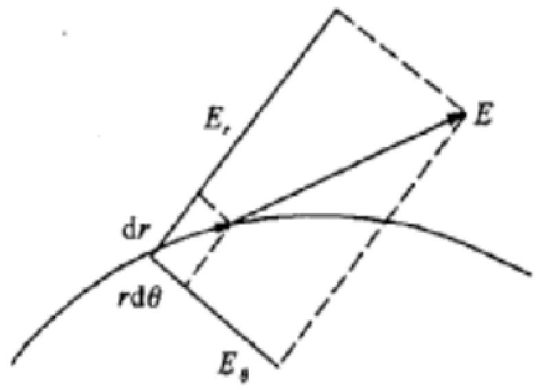

# 真空中的静电场

### 静电场相关知识讲解

1. **静电场的场源**

    * 静电场由空间位置固定、电量不随时间变化的电荷产生。其场源是静止电荷，真空中静电场的场源包括分布在导体表面上的电荷以及空间电荷。
    * 充电或感应可使导体带上自由电荷。在实际情况中，空气中电场非常接近真空中电场，所以常将所讲的真空中静电场视为空气中的静电场。
    * 电荷具有守恒性，即正电荷的产生或消失总是伴随着等量负电荷的产生或消失，孤立系统内净电荷保持恒定。同时，电荷有正负之分，正负电荷的分离和分布是电场不同于引力场的特点。
2. **库仑定律**

    * 库仑定律定量描述了两个点电荷之间的作用力，由法国科学家库仑通过“扭秤实验”于1785年总结得到。公式为 $f_{2}=k_{0}\frac{q_{1}q_{2}}{r^{3}}r$，其中 $f_{2}$ 为电荷 $q_{2}$ 所受作用力，如果 $q_{1}$ 和 $q_{2}$ 同性，$f_{2}$ 与 $r$ 同号。
    * 在国际单位制中，力 $f_{2}$ 的单位为 N，电荷 $q_{1}$ 和 $q_{2}$ 的单位为 C，距离 $r$ 的单位为 m，$k_{0}=\frac{1}{4\pi\varepsilon_{0}}$，$\varepsilon_{0}=8.85×10^{-12}C^{2}/(N\cdot m^{2})$。
3. **静电场的场强**

    * **电场强度定义**：取试验电荷 $q_{0}$，其所在位置为场点。根据库仑定律，$q_{0}$ 受到的作用力 $f$ 与试验电荷 $q_{0}$ 的比值仅与产生电场的源电荷 $q$ 以及试验电荷所在点位置有关，定义电场强度 $E=\lim_{q_{0}\to0}\frac{f}{q_{0}}$。场中某点的电场强度 $E$，其大小等于单位正试验电荷在该点所受力，方向与此力 $f$ 方向相同。试验电荷需是点电荷且电量小到可忽略对场源电荷分布的影响。
    * **场强公式**：

      * 点电荷场：$E=\frac{1}{4\pi\varepsilon_{0}}\frac{q}{r^{3}}r$，其中 $r=(x-\xi)i+(y-\eta)j+(z-\zeta)k$。
      * 体电荷场：$E=\frac{1}{4\pi\varepsilon_{0}}\int_{V}\frac{\rho r}{r^{3}}dV$。
      * 面电荷场：$E=\frac{1}{4\pi\varepsilon_{0}}\int_{S}\frac{\sigma r}{r^{3}}dS$。
      * 线电荷场：$E=\frac{1}{4\pi\varepsilon_{0}}\int_{L}\frac{\lambda r}{r^{3}}dl$，式中 $\rho$、$\sigma$、$\lambda$ 分别为自由电荷的体密度、面密度和线密度，最常见的电荷分布是面电荷。
4. **静电场的通量定律和环流定律**

    * **通量定律**：

      * 积分形式：$\oint_{S}E\cdot dS=\frac{1}{\varepsilon_{0}}\int_{V}\rho dV$。
      * 微分形式：$\nabla\cdot E=\rho/\varepsilon_{0}$，表明电场强度的散度与电荷密度成正比。在正电荷处，电场强度散度为正，电力线始点愈密，发散电力线越多；在负电荷处，散度为负，电力线终点愈密，收敛电力线越多。
      * 点电荷位于封闭面内时，过封闭面的通量为 $\frac{q}{\varepsilon_{0}}$；若封闭面不包围点电荷，通量为 0。
    * **环流定律**：在静电场中移动试验电荷，电场力做功与路径无关，只与始末点位置有关，即电场强度的环流恒为零。积分形式为 $\oint_{L}E\cdot dl = 0$，微分形式为 $\nabla×E = 0$，表明静电场和稳定电场都是无旋场。
5. **静电场的电势和方程**

    * **电势定义**：$U(P)=\int_{P}^{P_{0}}E\cdot dl$，表示点 $P$ 电势大小等于单位正电荷从该点移至标准点时场力做功。若标准点取在无限远处，正电荷场电势为正，负电荷场电势为负；场源电荷分布在有限区域内时，一般将标准点选在无限远处。
    * **电势公式**：

      * 点电荷场：$U=\frac{1}{4\pi\varepsilon_{0}}\frac{q}{r}$。
      * 体电荷场：$U=\frac{1}{4\pi\varepsilon_{0}}\int_{V}\frac{\rho}{r}dV$。
      * 面电荷场：$U=\frac{1}{4\pi\varepsilon_{0}}\int_{S}\frac{\sigma}{r}dS$。
      * 线电荷场：$U=\frac{1}{4\pi\varepsilon_{0}}\int_{L}\frac{\lambda}{r}dl$。
      * 电势与场强度关系为 $E_{l}=-\frac{\partial U}{\partial l}$，$E = -\nabla U$。
    * **泊松方程和拉普拉斯方程**：综合通量定律和环流定律微分形式，得到泊松方程 $\nabla^{2}U = -\rho/\varepsilon_{0}$；在没有电荷分布的区域中，由 $\rho = 0$ 得拉普拉斯方程 $\nabla^{2}U = 0$。
    * **边界条件**：真空中静电场边界是导体边界，导体内部电场强度为零，整个导体是等电势体，导体表面有自由面电荷。导体表面外附近一点电场强度法线分量 $E_{n}=\sigma/\varepsilon_{0}$，切线分量 $E_{t}=0$。
6. **电偶极子场**

    * **一个偶极子的场**：一对等量异号电荷位于十分靠近的两点构成电偶极子，设 $QQ' = l$，矢量 $l$ 方向从负电荷指向正电荷，$p = ql$ 为偶极矩。$M$ 点电势 $U=\frac{p\cdot r}{4\pi\varepsilon_{0}r^{3}}$，场强度 $E=\frac{3(p\cdot r)}{4\pi\varepsilon_{0}r^{5}}r-\frac{p}{4\pi\varepsilon_{0}r^{3}}$，电势与距离平方成反比，具有轴对称性，场强按距离三次方减弱，比单个点电荷场减弱得快。

      $$
      偶极子场的力线方程 \\
      r=A\sin^2\theta
      $$

      ​​
    * **偶极子面分布（偶层）的场**：偶层是两个靠近、平行且电荷面密度数值相同、符号相反的带电面，偶层强度 $\tau=\sigma l$。$M$ 点电势 $U=\frac{1}{4\pi\varepsilon_{0}}\int_{\Omega}\tau d\Omega$，均匀偶层电势 $U=\frac{1}{4\pi\varepsilon_{0}}\tau\Omega$。偶层两侧电势差 $U_{2}-U_{1}=\tau/\varepsilon_{0}$，电场强度法线分量经过偶层不变。

### 例题讲解

* **例题**：圆形平面均匀偶层，电荷密度值为 $\sigma$，厚度为 $l$，偶层面半径为 $a$，求轴上 $P$ 点的电势。
* **解答过程**：

  * 取偶层面中心轴为 $z$ 轴，原点 $O$ 在偶层上，$OP = z$，$P$ 点到偶层边缘距离 $R=\sqrt{z^{2}+a^{2}}$，偶层强度大小 $\tau=\sigma l$。
  * 偶层（边缘）对 $P$ 点所张立体角 $\Omega=\frac{S'}{R^{2}}=\frac{2\pi R(R - z)}{R^{2}}=2\pi(1-\frac{z}{R})$，其中 $S'$ 是以偶层边缘为边缘的球冠面积。
  * 根据公式 $U=\frac{1}{4\pi\varepsilon_{0}}\tau\Omega$，可得 $P$ 点电势为 $U=\frac{\tau}{2\varepsilon_{0}}[1-\frac{z}{(z^{2}+a^{2})^{1/2}}](z>0)$。
  * 若 $P$ 点在偶层下方，电势为 $U=-\frac{\tau}{2\varepsilon_{0}}[1-\frac{|z|}{(z^{2}+a^{2})^{1/2}}](z<0)$。
* **讨论结果**：

  * 当 $z\to +0$ 时，$U_{+0}=\frac{\tau}{2\varepsilon_{0}}$；当 $z\to -0$ 时，$U_{-0}=\frac{-\tau}{2\varepsilon_{0}}$，可见过偶层时电势突变 $U_{+0}-U_{-0}=\tau/\varepsilon_{0}$。
  * 当 $z$ 大小有限而 $a\to\infty$ 时，$U\approx\frac{\tau}{2\varepsilon_{0}}(z>0)$，$U\approx-\frac{\tau}{2\varepsilon_{0}}(z<0)$，此为均匀无限大平面偶层场的电势。
  * 两个边缘相同的均匀偶层，偶层外电势相同（设二者偶层强度大小相同）。

### 1. 概念理解类题目

* 例如考查静电场场源相关概念，需明确静电场场源是静止电荷，包括导体表面电荷及空间电荷等，同时理解电荷守恒、正负电荷分布特点等。根据这些知识点，准确判断选项或回答问题。
* 对于库仑定律，要清楚定律内容、公式中各物理量含义及单位，如比例常数 $k_{0}$ 与 $\varepsilon_{0}$ 的关系，同性和异性电荷间作用力方向等，以此解答相关题目。

### 2. 场强和电势计算类题目

* 若计算点电荷、体电荷、面电荷或线电荷的场强，需选择对应的场强公式，代入已知条件计算。注意矢量运算，如点电荷场强公式中 $r$ 是矢径，方向从源电荷指向场点。
* 计算电势时，同样根据电荷分布选择合适的电势公式，确定积分上下限（若涉及积分）。如计算有限区域内电荷分布在某点电势，标准点常取无限远，按公式计算。对于电偶极子场电势计算，要理解偶极矩概念及电势公式推导过程，根据题目条件代入计算。

### 3. 通量和环流定律应用类题目

* 利用通量定律 $\oint_{S} E \cdot dS = \frac{1}{\varepsilon_{0}} \int_{V} \rho dV$，已知电荷分布计算通过某封闭面的电通量，或已知电通量反推电荷分布情况。例如，判断包围或不包围电荷的封闭面电通量大小。
* 环流定律 $\oint_{L} E \cdot dl = 0$ 可用于判断电场力做功与路径关系，如在静电场中判断电场力对电荷做功是否与路径有关，或根据做功情况判断是否为静电场等。

### 静电场的场强相关题目

1. **题目**：已知一个点电荷 $q = 2 \times 10^{-6} C$，求距离点电荷 $r = 0.5 m$ 处的电场强度大小和方向。
2. **解析**

    * 根据点电荷场强公式 $E = \frac{1}{4 \pi \varepsilon_{0}} \frac{q}{r^2}$，其中 $\varepsilon_{0} = 8.85 \times 10^{-12} C^{2}/(N \cdot m^{2})$，$k_{0} = \frac{1}{4 \pi \varepsilon_{0}} = 9 \times 10^{9} N \cdot m^{2}/C^{2}$。
    * 将数值代入可得 $E = 9 \times 10^{9} \times \frac{2 \times 10^{-6}}{0.5^2} = 7.2 \times 10^{4} N/C$。
    * 方向为由点电荷指向场点（若点电荷为正）或由场点指向点电荷（若点电荷为负），本题未明确电荷正负，假设为正电荷，则方向沿径向向外。

### 静电场的通量定律相关题目

1. **题目**：有一个半径为 $R$ 的均匀带电球体，电荷体密度为 $\rho$，求通过球体表面的电通量。
2. **解析**

    * 由高斯定理（通量定律的积分形式）$\oint_{S} E \cdot dS = \frac{1}{\varepsilon_{0}} \int_{V} \rho dV$。
    * 对于均匀带电球体，其内部电场分布具有球对称性，在球体外一点的电场强度大小为 $E = \frac{1}{4 \pi \varepsilon_{0}} \frac{Q}{r^2}$（$Q$ 为球体总电荷量）。
    * 球体总电荷量 $Q = \rho \times \frac{4}{3} \pi R^3$。
    * 通过球体表面的电通量 $\varPhi = \oint_{S} E \cdot dS = E \times 4 \pi R^2 = \frac{1}{\varepsilon_{0}} \times \rho \times \frac{4}{3} \pi R^3$，化简可得 $\varPhi = \frac{4 \pi \rho R^3}{3 \varepsilon_{0}}$。

### 静电场的电势相关题目

1. **题目**：一个均匀带电圆环，半径为 $a$，电荷量为 $Q$，求圆环轴线上距离圆心为 $x$ 处的电势。
2. **解析**

    * 对于均匀带电圆环，可将其视为线电荷分布，采用线电荷场的电势公式 $U = \frac{1}{4 \pi \varepsilon_{0}} \int_{L} \frac{\lambda}{r} dl$。
    * 圆环上电荷线密度 $\lambda = \frac{Q}{2 \pi a}$。
    * 取圆环上一小段线元 $dl$，其在轴线上 $x$ 处产生的电势为 $dU = \frac{1}{4 \pi \varepsilon_{0}} \frac{\lambda dl}{\sqrt{x^2 + a^2}}$。
    * 对整个圆环积分，$U = \int dU = \frac{1}{4 \pi \varepsilon_{0}} \frac{\lambda}{\sqrt{x^2 + a^2}} \int_{0}^{2 \pi a} dl = \frac{1}{4 \pi \varepsilon_{0}} \frac{Q}{\sqrt{x^2 + a^2}}$。

### 电偶极子场相关题目

1. **题目**：已知电偶极子的偶极矩 $p = 3 \times 10^{-9} C \cdot m$，求在与偶极矩方向成 $60^{\circ}$ 角，距离偶极子中心 $r = 0.3 m$ 处的电势。
2. **解析**

    * 根据电偶极子场电势公式 $U = \frac{p \cos \theta}{4 \pi \varepsilon_{0} r^2}$。
    * 将数值代入可得 $U = \frac{3 \times 10^{-9} \times \cos 60^{\circ}}{4 \pi \times 8.85 \times 10^{-12} \times 0.3^2} = 1.25 \times 10^{2} V$。

### 综合类题目

1. **题目**：在一个边长为 $L$ 的正方体区域内，均匀分布着电荷体密度为 $\rho$ 的电荷。求正方体中心处的电场强度和电势（设无穷远处电势为零）。
2. **解析**

    * 电场强度：

      * 由于电荷分布具有对称性，可利用高斯定理求解。
      * 取一个以正方体中心为球心，边长为 $a$（$a < L$ 且趋近于零）的小正方体高斯面。
      * 根据高斯定理 $\oint_{S} E \cdot dS = \frac{1}{\varepsilon_{0}} \int_{V} \rho dV$，通过高斯面的电通量为 $6 E a^2$（正方体有六个面，每个面的电通量相同），高斯面内电荷量为 $\rho a^3$。
      * 则 $E = \frac{\rho a}{6 \varepsilon_{0}}$，当 $a \to 0$ 时，$E = 0$，即正方体中心处电场强度为零。
    * 电势：

      * 电势公式为 $U = \frac{1}{4 \pi \varepsilon_{0}} \int_{V} \frac{\rho}{r} dV$。
      * 将正方体区域划分为无数个小体积元 $dV$，对于每个小体积元在中心处产生的电势进行积分。
      * 积分过程较为复杂，可先计算一个小体积元在中心处产生的电势，再对整个正方体区域积分。
      * 设小体积元坐标为 $(x, y, z)$，到中心的距离为 $r = \sqrt{(x - \frac{L}{2})^2 + (y - \frac{L}{2})^2 + (z - \frac{L}{2})^2}$。
      * 则中心处电势 $U = \frac{\rho}{4 \pi \varepsilon_{0}} \int_{-L/2}^{L/2} \int_{-L/2}^{L/2} \int_{-L/2}^{L/2} \frac{1}{\sqrt{(x - \frac{L}{2})^2 + (y - \frac{L}{2})^2 + (z - \frac{L}{2})^2}} dxdydz$，通过计算三重积分可得最终电势值（具体计算过程略）。

### 实际应用类题目

1. **题目**：两个平行的无限大均匀带电平面，面电荷密度分别为 $\sigma_{1} = 2 \times 10^{-6} C/m^{2}$ 和 $\sigma_{2} = -3 \times 10^{-6} C/m^{2}$，求两平面之间和两平面外的电场强度大小和方向。
2. **解析**

    * 对于单个无限大均匀带电平面，其电场强度大小为 $E = \frac{\sigma}{2 \varepsilon_{0}}$，方向垂直于平面。
    * 两平面之间：

      * 电场强度为两个平面电场强度的叠加，$E_{间} = E_{1} + E_{2} = \frac{\sigma_{1}}{2 \varepsilon_{0}} + \frac{\sigma_{2}}{2 \varepsilon_{0}} = \frac{2 \times 10^{-6}}{2 \times 8.85 \times 10^{-12}} + \frac{-3 \times 10^{-6}}{2 \times 8.85 \times 10^{-12}} = -5.65 \times 10^{4} N/C$，方向指向面电荷密度为负的平面。
    * 两平面外：

      * 电场强度大小也为两个平面电场强度的叠加，$E_{外} = E_{1} - E_{2} = \frac{\sigma_{1}}{2 \varepsilon_{0}} - \frac{\sigma_{2}}{2 \varepsilon_{0}} = \frac{2 \times 10^{-6}}{2 \times 8.85 \times 10^{-12}} - \frac{-3 \times 10^{-6}}{2 \times 8.85 \times 10^{-12}} = 2.82 \times 10^{4} N/C$，方向指向面电荷密度为正的平面。

## 在具体题目中，偶极子场强的三个分量 $E_{r}$、$E_{\theta}$ 和 $E_{\varphi}$ 有以下几种常见的使用方式：

### 计算某点电场强度的大小和方向

1. **计算大小**

    * 已知偶极矩 $p$、距离 $r$ 以及角度 $\theta$（$\varphi$ 在这种情况下不影响大小计算），可以分别计算出 $E_{r}$ 和 $E_{\theta}$ 的值，然后根据矢量合成法则计算出该点电场强度的大小 $E = \sqrt{E_{r}^{2} + E_{\theta}^{2}}$。例如，在一个给定的电偶极子系统中，若已知偶极矩 $p = 5 \times 10^{-9} \, \text{C} \cdot \text{m}$，在距离偶极子中心 $r = 0.2 \, \text{m}$ 处，与偶极矩方向成 $\theta = 30^{\circ}$ 角的点，首先计算 $E_{r} = \frac{1}{4\pi\varepsilon_{0}} \frac{2p}{r^{3}}\cos\theta = \frac{1}{4\pi \times 8.85 \times 10^{-12}} \frac{2 \times 5 \times 10^{-9}}{0.2^{3}} \cos30^{\circ} \approx 1.62 \times 10^{3} \, \text{N/C}$，$E_{\theta} = \frac{1}{4\pi\varepsilon_{0}} \frac{p}{r^{3}}\sin\theta = \frac{1}{4\pi \times 8.85 \times 10^{-12}} \frac{5 \times 10^{-9}}{0.2^{3}} \sin30^{\circ} \approx 0.93 \times 10^{3} \, \text{N/C}$，则该点电场强度大小 $E = \sqrt{(1.62 \times 10^{3})^{2} + (0.93 \times 10^{3})^{2}} \approx 1.87 \times 10^{3} \, \text{N/C}$。
2. **确定方向**

    * 通过计算 $E_{r}$ 和 $E_{\theta}$ 的值，可以确定电场强度在球坐标系中的方向。电场强度 $E$ 与 $r$ 方向的夹角 $\alpha$ 可以通过 $\tan\alpha = \frac{E_{\theta}}{E_{r}}$ 计算得出。在上述例子中，$\tan\alpha = \frac{0.93 \times 10^{3}}{1.62 \times 10^{3}}$，可得 $\alpha \approx 30^{\circ}$（与 $\theta$ 相等，这是因为在这个例子中计算出的 $E_{r}$ 和 $E_{\theta}$ 的比例关系恰好使得电场强度方向与 $\theta$ 角方向相同，实际情况需根据具体计算结果确定），从而确定电场强度在球坐标系中的方向。

### 分析电场在不同区域的分布特点

1. **沿径向方向（**​**$r$** **方向）**

    * 通过研究 $E_{r}$ 随 $r$ 和 $\theta$ 的变化规律，可以了解电场在径向的分布情况。例如，当 $\theta$ 固定时，$E_{r}$ 与 $r^{3}$ 成反比，这表明随着距离 $r$ 的增加，电场强度在径向的分量迅速减小，体现了偶极子场强按距离三次方减弱的特性。而且 $E_{r}$ 还与 $\cos\theta$ 有关，当 $\theta = 0^{\circ}$（即沿着偶极矩方向）时，$\cos\theta = 1$，$E_{r}$ 取得最大值；当 $\theta = 90^{\circ}$ 时，$\cos\theta = 0$，$E_{r} = 0$，说明在垂直于偶极矩方向上，径向电场分量为零。
2. **沿** **$\theta$** **方向（垂直于径向）**

    * $E_{\theta}$ 的表达式 $\frac{1}{4\pi\varepsilon_{0}} \frac{p}{r^{3}}\sin\theta$ 表明，在垂直于径向方向上，电场强度分量 $E_{\theta}$ 与 $r^{3}$ 成反比且与 $\sin\theta$ 成正比。当 $\theta = 90^{\circ}$ 时，$\sin\theta = 1$，$E_{\theta}$ 取得最大值，此时电场在 $\theta$ 方向上的分量最大，这有助于分析电场在垂直于偶极矩方向上的分布变化情况，了解电场在不同角度方向上的强弱变化规律，对于研究电场与其他电荷或物体在不同角度位置的相互作用有重要意义。

### 研究电荷在偶极子场中的受力和运动

1. **计算受力**

    * 当一个点电荷 $q_{0}$ 置于偶极子场中时，它所受的电场力 $F = q_{0}E$。根据上述计算出的电场强度 $E$（通过 $E_{r}$ 和 $E_{\theta}$ 合成），可以计算出点电荷所受的力。例如，若点电荷 $q_{0} = 2 \times 10^{-6} \, \text{C}$ 置于前面计算电场强度的位置，它所受的力 $F = q_{0}E = (2 \times 10^{-6}) \times (1.87 \times 10^{3}) = 3.74 \times 10^{-3} \, \text{N}$，力的方向与电场强度方向相同（由电场强度方向计算得出）。通过分析电场强度的分量，可以进一步了解力在径向和 $\theta$ 方向上的分量，从而研究电荷在不同方向上的受力情况，对于分析电荷在偶极子场中的运动轨迹等问题非常关键。
2. **分析运动轨迹**

    * 利用电场强度分量计算出电荷受力后，结合牛顿第二定律 $F = ma$（$m$ 为电荷质量），可以分析电荷在偶极子场中的加速度，进而研究其运动轨迹。由于电场强度在径向和 $\theta$ 方向上的分量不同，电荷的加速度在这两个方向上也不同，会导致电荷做复杂的曲线运动。通过对电场强度分量的分析，可以定性或定量地研究电荷在偶极子场中的运动规律，例如判断电荷是靠近还是远离偶极子，以及在不同角度方向上的运动趋势等。
