# 数值分析简明教程

高 等 学 校 教 材

# 数值分析简明教程

<!-- Media -->

<!-- Media -->

# 数值分析简明教程

(第二版)

王能超 编著

## 内容提要

本书在第一版的基础上, 经过补充、修改而成。原书已发行 30 余万册, 深受读者喜爱。本版继续保持了原书内容精练、深入浅出、通俗易懂的突出特点, 在编排上贯穿了数值算法设计与分析的思想。为方便读者深入掌握有关内容, 同时为 “数值分析” 的习题课提供参考资料,第二版新增了 “例题选讲” 部分,提炼、归纳了数值分析中最重要的一些方法, 并对若干例题进行了解析, 使本书增添新的特色。

本书可作为高等院校理工科专业学生的教材,亦可供工程技术人员阅读参考。

本书第一版于 1988 年获国家教委优秀教材二等奖。

## 图书在版编目 (CIP) 数据

数值分析简明教程/王能超编著. 一 2 版. 一北京: 高等教育出版社,2003.8(2004 重印)

ISBN $7 - {04} - {012800} - 4$

I . 数... II . 王... II . 数值计算 - 高等学校 - 教材 IV.0241

中国版本图书馆 CIP 数据核字(2003) 第 038069 号出版发行 高等教育出版社 购书热线 010-64054588 社 址 北京市西城区德外大街 4 号 免费咨询 ${800} - {810} - {0598}$ 邮政编码 100011 网 址 http: //www.hep.edu.cn 总 机 010-82028899 http: //www.hep.com.cn 经 销 新华书店北京发行所印刷 刷 北京铭成印刷有限公司版 次 1984 年 10 月第 1 版开 本 ${787} \times  {960}$ 1/16 2003 年 8 月第 2 版印 张 13.5 印次 2004 年 2 月第 2 次印刷字 数 240000 定价 1730 π

本书如有缺页、倒页、脱页等质量问题,请到所购图书销售部门联系调换。

版权所有 侵权必究

## 初 版 前 言

人类社会正迈进电子计算机时代。在今天, 熟练地运用计算机进行科学计算, 已经成为广大科技工作者的一项基本技能, 这就需要向高等工科院校的学生普及有关计算方法的知识。本书正是为适应这一形势而编写的。

要提高运用计算机进行科学计算的能力,关键在于加强数学修养。不应当将计算方法片面地理解为各种算法的简单罗列和堆积, 同数学分析一样, 它也是一门内容丰富、思想方法深刻而有着自身的理论体系的数学学科。本书取名为数值分析正是基于这一认识。

本书是以《工程数学——计算方法》(王能超编,人民教育出版社,1978 年版)一书为基础,经过补充修改编写而成的。

在教育部直属工科院校计算数学教材讨论会上(1983 年,武汉), 曾对本书原稿进行了审议。参加审议的有清华大学、浙江大学、西安交通大学、大连工学院、南京工学院、天津大学、重庆大学和华侨大学等院校的老师。由西安交通大学游兆永教授负责主审。参加审议的同志在推荐本书出版的同时,还提出了许多宝贵的意见和建议,编者对此表示深切的谢意。

王能超

1984 年 12 月 25 日

于华中工学院

## 第二版前言

拙作《数值分析简明教程》(后文简称《简明教程》)自 1984 年由高等教育出版社出版以来,迄今已过去了 19 个年头。这期间年年重印,累计已发行 30 余万册。作者衷心感谢关庄、支持本书的广大老师和同学们。

承蒙高等教育出版社垂爱,今又推出第二版、同初版比较,新版正文始终未作大的变动,只是新添了 “例题选讲” 部分,希望这些资料能更加有利于读者自学。

本书追求简明。数值分析的基本内容是数值算法的设计与分析。本书坚持这样的观点: 对于数值微积分, 无论是算法的设计还是算法的分析, 其高等数学的基础都是泰勒公式。一些学术界同行评价本书是 "泰勒公式包打天下"。 这种说法是中肯的。

微积分的发明是人类智慧的伟大发展。什么是微积分？华人数学家项武义先生精辟地指出：“俗语常常用‘程咬金三斧头’来笑话一个人的招式贫乏, 那么微积分可就只有‘逼近法’这一斧头了！可是逼近法这一斧头却是无往不利、无坚不摧的！学微积分也就是要学会灵活地运用逼近法去简化和解决实际问题。”(项武义著,微积分大意,人民教育出版社,1978 年版)

微积分的精华是逼近法。逼近法的精髓是泰勒公式。作者在编写数值分析教材的过程中始终坚持这一指导思想。

本书的宗旨是追求精简实用 关于教材的 “简明”,不同时代有不同的内涵与需求。本书的原型是 1978 年出版的《工程数学——计算方法》一书。该书自 1978 年元月 “接受任务” 到当年 5 月在上海通过评审,其出版过程是仓促的。在上海审稿会上,参与审稿的诸位先生协助弥补了书稿中的不少缺陷与不足。西安交通大学游兆永先生在会上建议增补有关曲线拟合方面的内容,并亲自赶写了一份材料附在书后。后来,作者将这份珍贵的“附录”稍加充实,改写成 “曲线拟合的最小二乘法” 一节纳入《简明教程》一书的正文,留作永久的纪念。

正如 “初版前言” 所指出的,《简明教程》一书得以顺利出版,完全仰仗游兆永先生的鼎力支持。游先生以其崇高的威望和博大的胸怀,无微不至地关怀爱护《简明教程》这本小书的命运。在本书再版的今天,作者深切地怀念良师挚友游兆永先生。

20 多年前使用计算机还只是少数人的 “专利”, 而今已广泛普及, 人类已进入信息化时代。新的世纪,新的时代,数值分析 (计算方法) 教材也应做到 “与时俱进”。作者对《数值分析简明教程》一而再地重版感到忐忑不安,真诚地期盼数值分析 (计算方法) 的教学体系今后会有更为新巧的构思。

王能超

2003 年 2 月 8 日

于华中科技大学

## 目 录

引论 1

A 算法 1

B 误差 7

引论习题 11

第一章 插值方法 13

1.1 问题的提法 13

1.2 拉格朗日插值公式 15

1.3 插值余项 19

1.4 埃特金算法 21

1.5 牛顿插值公式 23

1.6 埃尔米特插值 28

1.7 分段插值法 30

1.8 样条函数 33

1.9 曲线拟合的最小二乘法 36

例题选讲 1.1 拉格朗日插值基函数 41

例题选讲 I.2 插值余项 43

例题选讲 1.3 差商与差分 44

例题选讲 1.4 牛顿插值公式 47

例题选讲 1.5 埃尔米特插值 50

习题- 54

第二章 数值积分 58

2.1 机械求积 58

2.2 牛顿 - 柯特斯公式 61

2.3 龙贝格算法 66

2.4 高斯公式 71

2.5 数值微分 76

例题选讲 2.1 机械求积 80

例题选讲 2.2 求积公式的设计 81

例题选讲 2.3 高斯求积公式 86

例题选讲 2.4 龙贝格加速算法 90

例题选讲 2.5 数值微分 93

习题二 94

第三章 常微分方程的差分方法 97

3.1 欧拉方法 97

3.2 改进的欧拉方法 100

3.3 龙格 - 库塔方法 102

3.4 亚当姆斯方法 107

3.5 收敛性与稳定性 112

3.6 方程组与高阶方程的情形 114

3.7 边值问题 116

例题选讲 3.1 龙格 - 库塔格式的精度分析 117

例题选讲 3.2 线性多步法的设计与分析 120

习题三 124

第四章 方程求根的迭代法 126

4.1 迭代过程的收敛性 126

4.2 迭代过程的加速 132

4.3 牛顿法 135

4.4 弦截法 139

例题选讲 4.1 压缩映像原理 141

例题选讲 4.2 迭代过程的收敛速度 145

例题选讲 4.3 牛顿法的误差分析 147

例题选讲 4.4 牛顿法的修正与改进 149

习题四 153

第五章 线性方程组的迭代法 156

5.1 迭代公式的建立 156

5.2 向量和矩阵的范数 162

5.3 迭代过程的收敛性 165

例题选讲 5.1 迭代公式的设计 167

例题选讲 5.2 迭代过程的收敛性 169

习题五 170

第六章 线性方程组的直接法 172

6.1 消去法 172

6.2 追赶法 181

6.3 平方根法 185

6.4 误差分析 188

例题选讲 6.1 追赶法的变形与推广 190

例题选讲 6.2 三角分解的两种模式 194

例题选讲 6.3 对称阵的乔累斯基分解 196

习题六 197

习题参考答案 200

## 引 论

科学技术的发展提出大量复杂的数值计算问题, 这些问题的解决不是人工手算 (包括使用算盘以及计算器之类简单的计算 $I$ 具) 所能胜任的,必须依靠电子计算机. 用电子计算机进行这种科学技术计算的工作, 称为科学计算, 或简称电算.

科学计算的应用范围非常广泛, 国防尖端的一些科研项目, 如核武器的研制、导弹的发射等, 始终是科学计算最为活跃的领域. 今天, 科学计算在工农业生产的各个部门也正在发挥日益重要的作用.

例如, 气象资料的汇总、加工并求得天气图像, 这方面工作的计算量大而且时间性强, 要求电子计算机作高速或超高速运算, 以对天气作出短期及中期预报.

又如, 将所设计的船型型体数值表转换成初始数据输入电子计算机, 经过计算即可求出外板和肋骨的展开数据. 在造船工业中用这种方法进行数学放样, 既节省了人力物力, 又缩短了设计周期.

本门课程将着重介绍进行科学计算所必须掌握的一些最基本、最常用的算法.

## A 算法

## 1. 研究算法的意义

电子计算机的运算速度高, 可以承担大运算量的工作, 这是否意味着人们对计算机上的算法可以随意选择呢?

我们知道, 行列式解法的克莱姆 (Cramer) 法则原则上可用来求解线性方程组. 用这种方法求解一个 $n$ 阶方程组,要算 $n + 1$ 个 $n$ 阶行列式的值,为此总共需要做 $n!\left( {n - 1}\right) \left( {n + 1}\right)$ 次乘法. 当 $n$ 充分大时,这个计算量是相当惊人的. 譬如一个 20 阶不算太大的方程组,大约要做 ${10}^{21}$ 次乘法,这项计算即使用百万次每秒的电子计算机去做, 也得要连续工作千百万年才能完成. 当然这是完全没有实际意义的. 其实. 解线性方程组有许多实用的算法 (参看本书第五章与第六章), 譬如用众所周知的消元法, 一个 20 阶的方程组即使用计算器也能很快地解出来. 这个简单的例子说明, 能否正确地制定算法是科学计算成败的关键.

## 2. 什么是算法

针对一个具体的数学问题, 可以给出多种解法.

例 1 证明二次方程

$$
{x}^{2} + {2bx} + c = 0 \tag{1}
$$

至多有两个不同的实根.

证 下面提供三种解法.

(1)反证法 假定方程(1)有三个互异的实根 ${x}_{1},{x}_{2}$ 和 ${x}_{3}$ ,则有

$$
{x}_{1}^{2} + {2b}{x}_{1} + c = 0
$$

$$
{x}_{2}^{2} + {2b}{x}_{2} + c = 0
$$

$$
{x}_{3}^{2} + {2b}{x}_{3} + c = 0
$$

以上式子两两相减得

$$
{x}_{2} + {x}_{1} + {2b} = 0
$$

$$
{x}_{3} + {x}_{2} + {2b} = 0
$$

从而有 ${x}_{1} = {x}_{3}$ ,这与原设矛盾. 证毕.

(2) 图解法 方程(1)配方得

$$
{\left( x + b\right) }^{2} + c - {b}^{2} = 0 \tag{2}
$$

在坐标纸上描出抛物线 $y = {\left( x + b\right) }^{2} + c - {b}^{2}$ ,它与 $x$ 轴的交点 (横坐标) 即为所求的实根, 而交点至多只有两个.

(3)公式法 据式(2)可导出直接的求根公式

$$
{x}_{1,2} =  - b \pm  \sqrt{{b}^{2} - c} \tag{3}
$$

上述三种方法, 反证法不是构造性的; 作图法虽是构造性的, 但不是数值的. 我们所说的 “算法”, 必须是构造性的数值方法, 即不但要论证问题的可解性, 而且解的构造是通过数值演算过程来完成的.

同传统意义的近似计算方法不同, 我们所要研究的算法是为电子计算机提供的, 因此, 解题方案当中的每个细节都必须准确地加以定义, 并且要完整地描述整个解题过程. 我们所说的 “算法”, 不仅仅是单纯的式 (3) 一类的数学公式, 而是指解题方案的准确和完整的描述.

描述算法可以用多种方式, 本书常用框图直观地显示算法的全貌.

譬如,设要用公式 (3) 求解二次方程 (1),则需依判别式 $d = {b}^{2} - c$ 的符号区分下列三种情况:

${1}^{ \circ  }d &lt; 0$ ,无实根;

${2}^{ \circ  }d = 0$ ,有重根 ${x}_{1} = {x}_{2} =  - b$ ; ${3}^{ \circ  }d &gt; 0$ ,可用公式 (3) 求得两个互异实根 ${x}_{1},{x}_{2}$ . 图 0-1 形象地描述了上面的算法.

<!-- Media -->

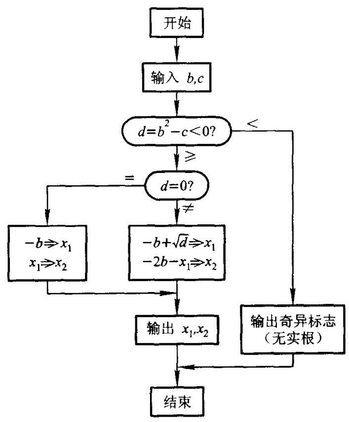

图 0-1

<!-- Media -->

这里使用了两种形式的框. 一种是矩形框在这种框内. 另一种是圆边框 例, 称检查框, 表示算法的判断检查部分. 检查框有两个出口, 究竟选择哪个出口, 要看框内的检查条件是否成立来决定.

今后所有的框图均以 开始 框标志计算过程开始启动, 而用结束框表示计算过程的最终结束. 另外,将用箭头 “ $\rightarrow$ ” 指明各框执行的顺序.

下面剖析两个常用算法来阐述算法的基本特征.

## 3. 多项式求值的秦九韶方法

计算公式通常是算法的核心部分. 计算机上使用的算法, 其计算公式常采取递推化形式. 递推化的基本思想是将一个复杂的计算过程归结为简单过程的多次重复, 这种重复在算法上表现为循环, 描述是容易的.

譬如,设要对给定的 $x$ 求下列多项式的值

$$
p\left( x\right)  = {a}_{0} + {a}_{1}x + {a}_{2}{x}^{2} + \cdots  + {a}_{n}{x}^{n} \tag{4}
$$

一种看起来很 “自然” 的算法是直接逐项求和. 我们用 ${t}_{k}$ 表示 $x$ 的 $k$ 次幂, ${u}_{h}$ 表示式 (4) 右端前 $k + 1$ 项的部分和

$$
{t}_{k} = {x}^{h}
$$

$$
{u}_{h} = {a}_{0} + {a}_{1}x + \cdots  + {a}_{h}{x}^{k}
$$

则

$$
\left\{  {\begin{array}{l} {t}_{k} = x \cdot  {t}_{k - 1}, \\  {u}_{k} = {u}_{k - 1} + {a}_{k}{t}_{k}, \end{array}\;k = 1,2,\cdots ,n}\right.  \tag{5}
$$

作为初值, 令

$$
\left\{  \begin{array}{l} {t}_{0} = 1 \\  {u}_{0} = {a}_{0} \end{array}\right.  \tag{6}
$$

利用初值 (6) 对 $k = 1,2,\cdots$ ,直到 $n$ 反复执行算式 (5),最终得出的 ${u}_{n}$ 就是所求的值 $p\left( x\right)$ .

统计上述算法的计算量. 加减操作的机器运行时间比乘除操作少得多, 在统计计算量时, 可忽略加减法, 而只统计乘除法的次数. 递推公式 (5) 的每一步需做两次乘法,因此总的计算量为 ${2n}$ 次乘法.

下面再介绍一种求值方案. 为此首先加工计算公式, 设将式 (4) 按降幂的顺序重排为

$$
p\left( x\right)  = {a}_{n}{x}^{n} + {a}_{n - 1}{x}^{n - 1} + \cdots  + {a}_{1}x + {a}_{0}
$$

从它的前两项提出 ${x}^{n - 1}$ ,则有

$$
p\left( x\right)  = \left( {{a}_{n}x + {a}_{n - 1}}\right) {x}^{n - 1} + {a}_{n - 2}{x}^{n - 2} + \cdots  + {a}_{1}x + {a}_{0}
$$

经过这个手续,如果算出括号内的值,则问题归结为计算一个 $n - 1$ 次多项式 (注意降了一次). 再施行同样的手续, 则进一步有

$$
p\left( x\right)  = \left( {\left( {{a}_{n}x + {a}_{n - 1}}\right) x + {a}_{n - 2}}\right) {x}^{n - 2} + {a}_{n - 3}{x}^{n - 3} + \cdots  + {a}_{1}x + {a}_{0}
$$

这样每做一步, 所归结出的多项式就降低一次, 最终可将所给计算公式 (4) 加工成如下嵌套形式

$$
p\left( x\right)  = \left( {\cdots \left( {\left( {{a}_{n}x + {a}_{n - 1}}\right) x + {a}_{n - 2}}\right) x + \cdots  + {a}_{1}}\right) x + {a}_{0} \tag{7}
$$

可利用式 (7) 结构上的特点,从里往外一层一层地计算. 设用 ${v}_{k}$ 表示第 $k$ 层 (从里面数起) 的值

$$
{v}_{k} = \left( {\cdots \left( {{a}_{n}x + {a}_{n - 1}}\right) x + \cdots  + {a}_{n - k + 1}}\right) x + {a}_{n - k}
$$

那么,第 $k$ 层的结果 ${v}_{k}$ 显然等于第 $k - 1$ 层的结果 ${v}_{k - 1}$ 乘上 $x$ 再加上系数${a}_{n - k} :$

$$
{v}_{k} = x{v}_{k - 1} + {a}_{n - k},\;k = 1,2,\cdots ,n \tag{8}
$$

作为初值, 令

$$
{v}_{0} = {a}_{n} \tag{9}
$$

显然,这一算法的总计算量为 $n$ 次乘法。比较式 (5) $\sim  \left( 6\right)$ 和式 (8) $\sim  \left( 9\right)$ 两种算法, 后一种不但逻辑结构简单, 而且计算量节约了一半.

多项式求值的这种算法称做秦九韶算法, 它是我国宋代大数学家秦九韶最先提出的 ①.

秦九韶算法的特点在于, 它通过一次式的反复计算, 逐步得出高次多项式的值. 具体地说,它将一个 $n$ 次多项式的求值问题,归结为重复计算 $n$ 个一次式 (8) 来实现. 这种化繁为简的处理方法在数值分析中是屡见不鲜的.

现在考虑秦九韶方法的计算程序.

按式 (8) 计算,每求出一个 “新值” ${v}_{k}$ 以后,“老值” ${v}_{k - 1}$ 便失去继续保存的价值,因此可以将新值 ${v}_{k}$ 存放在老值 ${v}_{k - 1}$ 所占用的单元内. 这样,只需设置一个单元 $v$ 进行累算,而将式 (8) 表示为下列动态形式

$$
x \cdot  v + {a}_{n - k} \Rightarrow  v,\;k = 1,2,\cdots ,n
$$

执行这组算式之前,应先送初值 ${a}_{n}$ 到单元 $v$ 中

$$
{a}_{n} \Rightarrow  v
$$

图 0-2 描述了秦九韶算法, 其中:

<!-- Media -->

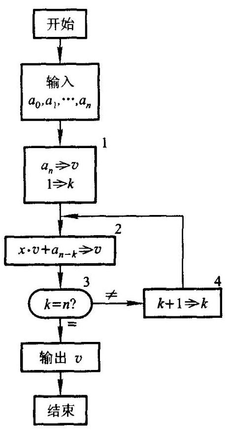

图 0-2

<!-- Media -->

[框 1] 准备部分. 单元 $v$ 中送初值 ${a}_{n}$ , 单元 $k$ 中送计数值 1 .

[框 2] 计算部分. 每循环一次,单元 $v$ 中的老值 ${v}_{k - 1}$ 为新值 ${v}_{k}$ 所替换.

[框 3] 控制部分. 检查单元 $k$ 中计数值以判断循环应否结束. 当计数值为 $n$ 时输出 $v$ 中结果, 否则转框 4 .

[框 4] 修改部分. 修改单元 $k$ 中计数值, 然后转框 2 再做下一步的计算.

## 4. 方程求根的二分法

许多实际算法表现为某种无穷递推过程的截断, 实现这类算法, 不但需要建立计算公式, 还需要解决精度控制问题. 下述方程求根算法就是这类算法的一个范例.

设函数 $f\left( x\right)$ 在 $\left\lbrack  {a,b}\right\rbrack$ 上连续, $f\left( a\right) f\left( b\right)  &lt;$ 0,根据连续函数的性质, $f\left( x\right)$ 在 $\left\lbrack  {a,b}\right\rbrack$ 内一定有实的零点,即方程 $f\left( x\right)  = 0$ 在 $\left\lbrack  {a,b}\right\rbrack$ 内一定有实根. 这里假定它在 $\left\lbrack  {a,b}\right\rbrack$ 内有唯一的单实根 ${x}^{ * }$ .

---

<!-- Footnote -->

① 外国文献称这一算法为霍纳(Horner)算法, 其实霍纳的工作比秦九韶晚了五百多年.

<!-- Footnote -->

---

考察有根区间 $\left\lbrack  {a,{b}^{\urcorner }}\right.$ ,取中点 ${x}_{0} = \frac{a + b}{2}$ 将它分为两半,然后进行根的搜索,即检查 $f\left( {x}_{0}\right)$ 与 $f\left( a\right)$ 是否同号: 若确系同号,说明所求的根 ${x}^{ * }$ 在 ${x}_{0}$ 的右侧,这时令 ${a}_{1} = {x}_{0},{b}_{1} = b$ ; 否则 ${x}^{ * }$ 必在 ${x}_{0}$ 的左侧,这时令 ${a}_{1} = a,{b}_{1} = {x}_{0}$ (图 0-3). 不管出现哪一种情形,新的有根区间 $\left\lbrack  {{a}_{1},{b}_{1}}\right\rbrack$ 的长度仅为 $\left\lbrack  {a,b}\right\rbrack$ 的一半.

<!-- Media -->

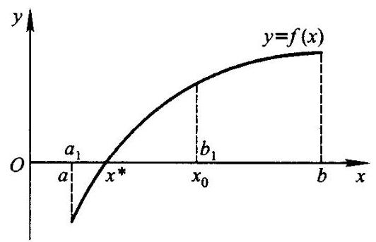

图 0-3

<!-- Media -->

对于压缩了的有根区间 $\left\lbrack  {{a}_{1},{b}_{1}}\right\rbrack$ 又可施行同样的手续,即用中点 ${x}_{1} = \frac{{a}_{1} + {b}_{1}}{2}$ 将区间 $\left\lbrack  {{a}_{1},{b}_{1}}\right\rbrack$ 再分为两半,然后通过根的搜索判定所求的根在 ${x}_{1}$ 的哪一侧,从而义确定一个新的有根区间 $\left\lbrack  {{a}_{2},{b}_{2}}\right\rbrack$ ,其长度是 $\left\lbrack  {{a}_{1},{b}_{1}}\right\rbrack$ 的一半.

如此反复二分下去, 即可得出一系列有根区间

$$
\left\lbrack  {a,b}\right\rbrack   \supset  \left\lbrack  {{a}_{1},{b}_{1}}\right\rbrack   \supset  \left\lbrack  {{a}_{2},{b}_{2}}\right\rbrack   \supset  \cdots  \supset  \left\lbrack  {{a}_{k},{b}_{k}}\right\rbrack   \supset  \cdots
$$

其中每个区间都是前一个区间的一半, 因此二分 $k$ 次后的有根区间 $\left\lbrack  {{a}_{k},{b}_{k}}\right\rbrack$ 的长度

$$
{b}_{k} - {a}_{k} = \frac{1}{{2}^{k}}\left( {b - a}\right)
$$

<!-- Media -->

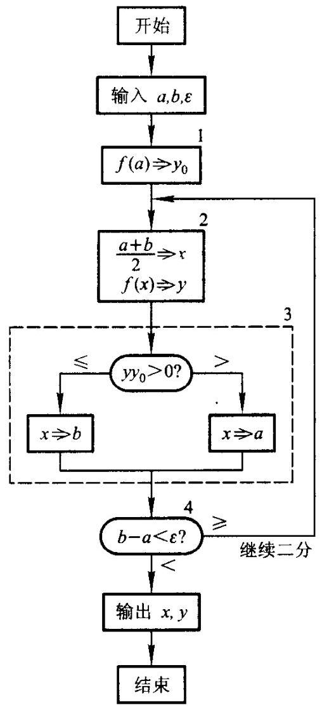

图 0-4

<!-- Media -->

可见, 如果二分过程无限地继续下去, 这些有根区间最终必收缩于一点 ${x}^{ * }$ ,该点显然就是所求的根.

第 $k$ 次二分后,设取有根区间 $\left\lbrack  {{a}_{k},{b}_{k}}\right\rbrack$ 的中点

$$
{x}_{h} = \frac{1}{2}\left( {{a}_{k} + {b}_{k}}\right)
$$

作为根的近似值, 则在二分过程中可以获得一个近似根的序列 ${x}_{0},{x}_{1},{x}_{2},\cdots$ ,该序列以根 ${x}^{ * }$ 为极限.

在实际计算时, 人们不可能也没有必要完成这种无穷过程, 因为计算结果允许带有一定的误差. 由于

$$
\left| {{x}^{ * } - {x}_{k}}\right|  \leq  \frac{1}{2}\left( {{b}_{k} - {a}_{k}}\right)  = \frac{1}{{2}^{k + 1}}\left( {b - a}\right)
$$

只要二分足够多次 (即 $k$ 充分大),便有

$$
\left| {{x}^{ * } - {x}_{k}}\right|  < \varepsilon
$$

这里 $\varepsilon$ 为预定精度.

上述求根方法称为二分法, 它是电子计算机上一种常用算法. 我们给出其算法框图 (图 0-4),图中 $a,b$ 表示有根区间的左、右端点; $x$ 表示近似根.

图 0-4 中各框的具体含义如下:

[框 1] 从所给区间 $\left\lbrack  {a,b}\right\rbrack$ 着手二分.

[框 2] 取有根区间 $\left\lbrack  {a,b}\right\rbrack$ 的中点 $x$ 作为近似根.

[框 3] 判定二分后生成的有根区间 $\left\lbrack  {a,b}\right\rbrack$ .

[框 4] 检查近似根 $x$ 是否满足精度要求.

例 2 用二分法求方程 ${x}^{3} - x - 1 = 0$ 在区间 $\left\lbrack  {1,{1.5}}\right\rbrack$ 内的一个实根,要求误差不超过 0.005 .

解 首先预估所要二分的次数. 按误差估计式

$$
\left| {{x}^{ * } - {x}_{k}}\right|  \leq  \frac{1}{{2}^{k + 1}}\left( {b - a}\right)
$$

只要二分 6 次, 便能达到所要求的精度.

二分法的计算结果如表 0-1 所示.

<!-- Media -->

表 0-1

<table><tr><td>$k$</td><td>${a}_{k}$</td><td>${b}_{k}$</td><td>${x}_{k}$</td></tr><tr><td>0</td><td>1.000 0</td><td>1.500 0</td><td>1.250 0</td></tr><tr><td>1</td><td>1.2500</td><td/><td>1.375 0</td></tr><tr><td>2</td><td/><td>1.375 0</td><td>1.3125</td></tr><tr><td>3</td><td>1.3125</td><td/><td>1.3438</td></tr><tr><td>4</td><td/><td>1.3438</td><td>1.3281</td></tr><tr><td>5</td><td/><td>1.328 1</td><td>1.320 3</td></tr><tr><td>6</td><td>1.320 3</td><td/><td>1.324 2</td></tr></table>

<!-- Media -->

## B 误 差

## 1. 误差分析不容忽视

在研究算法的同时, 必须注重误差分析, 否则, 一个合理的算法也可能得出错误的结果.

例 3 用中心差商公式求 $f\left( x\right)  = \sqrt{x}$ 在 $x = 2$ 的导数值

$$
{f}^{\prime }\left( 2\right)  \approx  \frac{\sqrt{2 + h} - \sqrt{2 - h}}{2h} \tag{10}
$$

从理论上说,步长 $h$ 愈小,计算结果愈准确. 上机计算的实际情况将会怎样呢?

解 我们知道, 在计算机上数的表示受机器字长的限制, 设取 5 位数字计算,若令 $h = {0.1}$ ,得

$$
{f}^{\prime }\left( 2\right)  \approx  \frac{{1.4491} - {1.3784}}{0.2} = {0.35350}
$$

与导数的精确值 ${f}^{\prime }\left( 2\right)  = {0.353553}\cdots$ 比较,这项计算还是可取的. 但是,如果缩小步长取 $h = {0.0001}$ ,则得

$$
{f}^{\prime }\left( 2\right)  \approx  \frac{{1.4142} - {1.4142}}{0.0002} = 0
$$

算出的结果反而毫无价值.

由此例可知: 两个相近的数相减, 会造成有效数字的严重损失. 实际计算中要尽量避免这种情况发生.

例 4 求解方程 ${x}^{2} - \left( {{10}^{5} + 1}\right) x + {10}^{5} = 0$ .

解 仍取 5 位数字进行计算, 并用 “ $\triangleq$ ” 标记对阶舍入的计算过程. 具体求根利用式 (3),这里 $c = {10}^{5}$ ,而

$$
b =  - \frac{1}{2} \times  \left( {{10}^{5} + 1}\right)  \triangleq   - \frac{1}{2} \times  {10}^{5}
$$

$$
\sqrt{{b}^{2} - c} = \sqrt{{\left\lbrack  -\frac{1}{2}\left( {10}^{5} + 1\right) \right\rbrack  }^{2} - {10}^{5}} \triangleq  \frac{1}{2} \times  {10}^{5}
$$

故有

$$
{x}_{1} =  - b + \sqrt{{b}^{2} - c} \triangleq  {10}^{5}
$$

$$
{x}_{2} =  - b - \sqrt{{b}^{2} - c} \triangleq  0
$$

原方程的精确解显然是 ${x}_{1} = {10}^{5},{x}_{2} = 1$ ,可见上面求出的结果严重失真.

在计算机上, 加减运算之前先要 “对阶”, 例 4 说明, 对阶手续会造成大数 “吃掉” 小数的后果, 因而实际计算时不宜用相差悬殊的两个数做加减运算.

例 5 考察方程组

$$
\left\lbrack  \begin{matrix} 1 & \frac{1}{2} & \frac{1}{3} \\  \frac{1}{2} & \frac{1}{3} & \frac{1}{4} \\  \frac{1}{3} & \frac{1}{4} & \frac{1}{5} \end{matrix}\right\rbrack  \left\lbrack  \begin{array}{l} {x}_{1} \\  {x}_{2} \\  {x}_{3} \end{array}\right\rbrack   = \left\lbrack  \begin{matrix} \frac{11}{6} \\  \frac{13}{12} \\  \frac{47}{60} \end{matrix}\right\rbrack
$$

其解为

$$
{x}_{1} = {x}_{2} = {x}_{3} = 1
$$

解 这类方程组的求解有很大困难. 事实上, 如果把系数舍入成三位小数

$$
\left\lbrack  \begin{array}{lll} {1.000} & {0.500} & {0.333} \\  {0.500} & {0.333} & {0.250} \\  {0.333} & {0.250} & {0.200} \end{array}\right\rbrack  \left\lbrack  \begin{array}{l} {x}_{1} \\  {x}_{2} \\  {x}_{3} \end{array}\right\rbrack   = \left\lbrack  \begin{array}{l} {1.830} \\  {1.080} \\  {0.783} \end{array}\right\rbrack
$$

则其解变成

$$
{x}_{1} = {1.09},\;{x}_{2} = {0.488},\;{x}_{3} = {1.49}
$$

由此看出, 尽管系数改变不大, 所求出的解却有很大出入, 这类问题称作是病态的 (参看第六章 6.4 节).

## 2. 误差的来源

提起数值分析, 往往给人以不严格、不准确以至于不够完善的感觉. 其实, 数值计算中的近似是正常的, 计算误差是不可避免的.

我们知道, 为要进行数值计算, 首先必须将实际问题归结为数学问题, 建立起合适的数学模型. 在建立数学模型时, 通常总要加上许多限制, 总要忽略一些次要因素, 这样建立起的 “理想化” 的数学模型, 虽然具有 “精确” 而 “完美” 的外表, 其实只是客观现象的一种近似而粗糙的描述. 这种数学描述上的近似必然会产生误差.

另外, 在数值计算的过程中不可避免地还会产生其他各种各样的误差, 本书主要考察以下两种:

## (1)截断误差

我们知道, 许多数学运算 (诸如微分、积分及无穷级数求和等) 是通过极限过程来定义的, 然而计算机上只能完成有限次的算术运算和逻辑运算, 因此需要将解题方案加工成算术运算与逻辑运算的有限序列. 这种加工常常表现为无穷过程的截断, 由此产生的误差通常称作截断误差.

譬如,指数函数 ${\mathrm{e}}^{x}$ 可展开为幂级数形式

$$
{\mathrm{e}}^{x} = 1 + x + \frac{{x}^{2}}{2!} + \cdots  + \frac{{x}^{n}}{n!} + \cdots
$$

但用计算机求值时, 我们不能得出右端无穷多项的和, 而只能截取有限项计算

$$
{S}_{n}\left( x\right)  = 1 + x + \frac{{x}^{2}}{2!} + \cdots  + \frac{{x}^{n}}{n!}
$$

这样计算部分和 ${S}_{n}\left( x\right)$ 作为 ${\mathrm{e}}^{x}$ 的值必然会有误差,据泰勒 (Taylor) 余项定理, 其截断误差为

$$
{\mathrm{e}}^{x} - {S}_{n}\left( x\right)  = \frac{{x}^{n + 1}}{\left( {n + 1}\right) !}{\mathrm{e}}^{\theta x},\;0 < \theta  < 1
$$

(2)舍入误差

计算过程中所用的数据可能位数很多, 甚至是无穷小数, 然而受机器字长的限制, 用机器代码表示的数据必须舍入成一定的位数, 这就会引起舍入误差. 每一步的舍入误差是微不足道的, 但经过计算过程的传播和积累, 舍入误差甚至可能会 “淹没” 所要的真解.

## 3. 误差限和有效数字

误差虽然不可避免, 但人们总是希望计算结果能足够准确, 这就需要估计误差. 设以 $x$ 代表数 ${x}^{ * }$ 的近似值,误差 $x - {x}^{ * }$ 的具体数值通常是无法确定的, 只能根据测量工具或计算过程设法估算出它的取值范围, 即误差绝对值的一个上界

$$
\left| {x - {x}^{ * }}\right|  \leq  \varepsilon
$$

这种上界 $\varepsilon$ 称作近似值 $x$ 的绝对误差限,简称误差限,或称精度. 精度为 $\varepsilon$ 的近似值 $x$ ,可以认为和真值 ${x}^{ * }$ 关于允许误差 $\varepsilon$ 是 “重合” 的,或者说,结果 $x$ 关于精度 $\varepsilon$ 是 “准确” 的.

写出一个近似值后, 人们当然希望指明它的准确程度, 为此需要引进有效数字的概念.

我们知道, 要将一个位数很多的数表示成一定的位数, 通常用四舍五入的办法, 如

$$
\pi  = {3.14159265}\cdots
$$

可表为3.14,3.1416等,这种表示方法的特点是,近似数的误差限为其最末一位的半个单位.

如果近似值 $x$ 的误差限是它的某一位的半个单位,我们就说它 “准确” 到这一位, 并且从这一位起直到前面第一个非零数字为止的所有数字均称有效数字. 具体地说,对于 ${x}^{ * }$ 的近似值 (规格化形式)

$$
x =  \pm  0.{a}_{1}{a}_{2}\cdots {a}_{n} \times  {10}^{m}
$$

(其中, ${a}_{1},{a}_{2},\cdots ,{a}_{n}$ 是 0 到 9 之间的自然数, ${a}_{1} \neq  0$ ),如果误差

$$
\left| {x - {x}^{ * }}\right|  \leq  \frac{1}{2} \times  {10}^{m - l},\;1 \leq  l \leq  n
$$

则称近似值 $x$ 有 $l$ 位有效数字,或称 $x$ “准确” 到第 $l$ 位.

按照这种说法, $\pi$ 的近似值 3.14 和 3.1416 分别有 3 位和 5 位有效数字.

## 4. 相对误差与有效数字的联系

近似值 $x$ 的绝对误差 $\left| {x - {x}^{ * }}\right|$ 还不足以刻画它的精度,譬如,测量 ${1000}\mathrm{\;m}$ 的长度时发生了 $1\mathrm{\;{cm}}$ 的误差,同测量 $1\mathrm{\;m}$ 的长度时发生了 $1\mathrm{\;{cm}}$ 的误差,两者的含义是大有区别的, 可见要刻画近似值的精度, 除了要看绝对误差的大小之外, 还应当考察这个值本身的大小, 这就需要进一步引进相对误差的概念.

仍以 $x$ 代表 ${x}^{ * }$ 的近似值,若

$$
\frac{\left| x - {x}^{ * }\right| }{\left| x\right| } \leq  \varepsilon
$$

则称 $\varepsilon$ 为近似数 $x$ 的相对误差限.

设数 $x,y$ 分别是数 ${x}^{ * },{y}^{ * }$ 的近似值,考察 $x - y$ 的相对误差

$$
\frac{\left| \left( x - y\right)  - \left( {x}^{ * } - {y}^{ * }\right) \right| }{\left| x - y\right| } \leq  \frac{\left| {x - {x}^{ * }}\right|  + \left| {y - {y}^{ * }}\right| }{\left| x - y\right| }
$$

$$
= \left| \frac{x - {x}^{ * }}{x}\right|  \cdot  \left| \frac{x}{x - y}\right|  + \left| \frac{y - {y}^{ * }}{y}\right|  \cdot  \left| \frac{y}{x - y}\right|
$$

当 $x$ 与 $y$ 相近时, $\left| \frac{x}{x - y}\right|$ 和 $\left| \frac{y}{x - y}\right|$ 都很大,这时 $x - y$ 的相对误差可能比 $x$ 与 $y$ 的相对误差大得多.

由此可见, 两个值相近的近似数相减, 可能会造成有效数字的严重损失, 在实际计算时常加工计算公式, 以避免这种情况发生.

再考察例 3,当 $h$ 很小时,式 (10) 的分子为两个相近的数 $\sqrt{2 + h}$ 和 $\sqrt{2 - h}$ 相减,为避免有效数字的严重损失,将式 (10) 的分子和分母同乘以 $\sqrt{2 + h} + \sqrt{2 - h}$ , 而将它加工成

$$
{f}^{\prime }\left( 2\right)  \approx  \frac{1}{\sqrt{2 + h} + \sqrt{2 - h}}
$$

按这一公式求导,仍取 $h = {0.0001}$ ,得 ${f}^{\prime }\left( 2\right)  \approx  {0.35356}$ ,这个结果有 4 位有效数字.

## 引 论 习 题

1. 用二分法求方程 ${x}^{3} - x - 1 = 0$ 在 $\left\lbrack  {1,2}\right\rbrack$ 内的近似根,要求误差不超过 ${10}^{-3}$ .
2. 证明方程 $f\left( x\right)  = {\mathrm{e}}^{x} + {10x} - 2 = 0$ 在 $\left\lbrack  {0,1}\right\rbrack$ 内有唯一实根; 用二分法求这一实根,要求误差不超过 $\frac{1}{2} \times  {10}^{-2}$ .
3. 利用秦九韶算法求多项式

$$
p\left( x\right)  = {x}^{5} - 3{x}^{4} + 4{x}^{2} - x + 1
$$

在 $x = 3$ 时的值.

4. 试证: 对任给初值 ${\lambda }_{0}$ ,求开方值 $\sqrt{a}\left( {a &gt; 0}\right)$ 的牛顿迭代公式

$$
{x}_{k + 1} = \frac{1}{2}\left( {{x}_{k} + \frac{a}{{x}_{k}}}\right) ,\;k = 0,1,2,\cdots
$$

恒成立下列关系式:

(1) ${x}_{k + 1} - \sqrt{a} = \frac{1}{2{x}_{k}}{\left( {x}_{k} - \sqrt{a}\right) }^{2},\;k = 0,1,2,\cdots$

(2) ${x}_{k} \geq  \sqrt{a},\;k = 1,2,\cdots$

5. 试用题 4 的迭代公式求 $\sqrt{8}$ ,要求准确到 ${10}^{-3}$ .
6. 设用题 4 的迭代公式求 $\sqrt{8}$ ,证明,若迭代值 ${x}_{k}$ 有 $n$ 位有效数字,则 ${x}_{k + 1}$ 必有 ${2n}$ 位有效数字.
7. 测量一木条长为 ${542}\mathrm{\;{cm}}$ ,若其绝对误差不超过 ${0.5}\mathrm{\;{cm}}$ ,问测量的相对误差是多少?
8. 已知 $\mathrm{e} = {2.71828}\cdots$ ,试问其近似值 ${x}_{1} = {2.7},{x}_{2} = {2.71},{x}_{3} = {2.718}$ 各有几位有效数字? 并给出它们的相对误差限.
9. 设 ${x}_{1} =  - {2.72},{x}_{2} = {2.71828},{x}_{3} = {0.0718}$ 均为经过四舍五入得出的近似值,试指明它们的绝对误差与相对误差.
10. 已知近似值 ${x}_{1} = {1.42},{x}_{2} =  - {0.0184},{x}_{3} = {184} \times  {10}^{-4}$ 的绝对误差限均为 ${0.5} \times$ ${10}^{-2}$ ,问它们各有几位有效数字?
11. 用 $\frac{22}{7}$ 和 $\frac{355}{113}$ 作为 $\pi  = {3.14159265}\cdots$ 的近似值,问它们各有几位有效数字?
12. 为尽量避免有效数字的严重损失,当 $\left| x\right|  &lt; 1$ 时应如何加工下列计算公式:

(1) $\frac{1}{1 + {2x}} - \frac{1 - x}{1 + x}$ (2) $1 - \cos x$

(3) ${\mathrm{e}}^{x} - 1$

13. 设 $\left| x\right|  \gg  1$ ,加工下列计算公式以尽量避免有效数字的严重损失:

(1) $\sqrt{x + \frac{1}{x}} - \sqrt{x - \frac{1}{x}}$ (2) ${\int }_{x}^{x + 1}\frac{1}{1 + {t}^{2}}\mathrm{\;d}t$

(3) $\ln \left( {x - \sqrt{{x}^{2} - 1}}\right)$

## 第一章 插 值 方 法

实际问题中碰到的函数 $f\left( x\right)$ 是各种各样的,有的表达式很复杂,有的甚至给不出数学式子, 只提供了一些离散数据, 譬如某些点上的函数值和导数值. 由于问题的复杂性,直接研究函数 $f\left( x\right)$ 可能很困难. 面对这种情况,一个很自然的想法是,设法将所考察的函数 $f\left( x\right)$ “简单化”,就是说,构造某个简单函数 $p\left( x\right)$ 作为 $f\left( x\right)$ 的近似函数,然后通过处理 $p\left( x\right)$ 获得关于 $f\left( x\right)$ 的结果. 如果要求近似函数 $p\left( x\right)$ 取给定的离散数据,则称之为 $f\left( x\right)$ 的插值函数.

选用不同类型的插值函数, 逼近的效果不同. 由于代数多项式的结构简单, 数值计算和理论分析都很方便, 实用上常取代数多项式作为插值函数, 这就是所谓的代数插值.

本章先讨论代数插值, 然后在此基础上进一步研究所谓的样条插值.

### 1.1 问题的提法

## 1. 泰勒插值

人们所熟悉的泰勒展开方法其实就是一种插值方法. 温故而知新, 首先回顾一下这种方法是有益的.

已知泰勒多项式

$$
{p}_{n}\left( x\right)  = f\left( {x}_{0}\right)  + {f}^{\prime }\left( {x}_{0}\right) \left( {x - {x}_{0}}\right)  + \frac{{f}^{\prime \prime }\left( {x}_{0}\right) }{2!}{\left( x - {x}_{0}\right) }^{2} +
$$

$$
\cdots  + \frac{{f}^{\left( n\right) }\left( {x}_{0}\right) }{n!}{\left( x - {x}_{0}\right) }^{n} \tag{1}
$$

与 $f\left( x\right)$ 在点 ${x}_{0}$ 具有相同的导数值

$$
{p}_{n}{}^{\left( k\right) }\left( {x}_{0}\right)  = {f}^{\left( k\right) }\left( {x}_{0}\right) ,\;k = 0,1,\cdots ,n
$$

因此, ${p}_{n}\left( x\right)$ 在点 ${x}_{0}$ 邻近会很好地逼近 $f\left( x\right)$ . 下述泰勒余项定理则是众所周知的.

定理 1 假设 $f\left( x\right)$ 在含有点 ${x}_{0}$ 的区间 $\left\lbrack  {a,b}\right\rbrack$ 内有直到 $n + 1$ 阶导数,则当 $x \in  \left\lbrack  {a,b}\right\rbrack$ 时,对于由式 (1) 给出的 ${p}_{n}\left( x\right)$ ,成立

$$
f\left( x\right)  - {p}_{n}\left( x\right)  = \frac{{f}^{\left( n + 1\right) }\left( \xi \right) }{\left( {n + 1}\right) !}{\left( x - {x}_{0}\right) }^{n + 1}
$$

式中 $\xi$ 介于 ${x}_{0}$ 与 $x$ 之间,因而 $\xi  \in  \left\lbrack  {a,b}\right\rbrack$ .

所谓泰勒插值是指下述插值问题:

问题 1 求作 $n$ 次多项式 ${p}_{n}{\left( x\right) }^{\left( 1\right) }$ ,使满足条件

$$
{p}_{n}{}^{\left( k\right) }\left( {x}_{0}\right)  = {y}_{0}^{\left( k\right) },\;k = 0,1,\cdots ,n
$$

这里 ${y}_{0}^{\left( k\right) }\left( {k = 0,1,\cdots ,n}\right)$ 为一组已给数据.

容易看出,对于给定的函数 $f\left( x\right)$ ,若导数值 ${f}^{\left( k\right) }\left( {x}_{0}\right)  = {y}_{0}^{\left( k\right) }\left( {k = 0,1,\cdots ,n}\right)$ 已给, 则上述泰勒插值问题的解就是泰勒多项式 (1).

例 1 求作 $f\left( x\right)  = \sqrt{x}$ 在 ${x}_{0} = {100}$ 的一次和二次泰勒多项式,利用它们计算 $\sqrt{115}$ 的近似值并估计误差.

解 由于 ${x}_{0} = {100}$ ,而

$$
f\left( x\right)  = \sqrt{x},\;{f}^{\prime }\left( x\right)  = \frac{1}{2\sqrt{x}},\;{f}^{\prime \prime }\left( x\right)  =  - \frac{1}{{4x}\sqrt{x}}
$$

$$
f\left( {x}_{0}\right)  = {10},\;{f}^{\prime }\left( {x}_{0}\right)  = \frac{1}{20},\;{f}^{\prime \prime }\left( {x}_{0}\right)  =  - \frac{1}{4000}
$$

$f\left( x\right)$ 在 ${x}_{0}$ 的一次泰勒多项式是

$$
{p}_{1}\left( x\right)  = f\left( {x}_{0}\right)  + {f}^{\prime }\left( {x}_{0}\right) \left( {x - {x}_{0}}\right)  = 5 + {0.05x}
$$

用 ${p}_{1}\left( x\right)$ 作为 $f\left( x\right)$ 的近似表达式,容易求出当 $\bar{x} = {115}$ 时

$$
\sqrt{115} = f\left( \bar{x}\right)  \approx  {p}_{1}\left( \bar{x}\right)  = {10.75}
$$

据定理 1 可估计出误差

$$
0 > f\left( \bar{x}\right)  - {p}_{1}\left( \bar{x}\right)  = \frac{{f}^{\prime \prime }\left( \xi \right) }{2}{\left( \bar{x} - {x}_{0}\right) }^{2}
$$

$$
> \frac{{f}^{\prime \prime }\left( {x}_{0}\right) }{2}{\left( \bar{x} - {x}_{0}\right) }^{2} =  - {0.028125}
$$

$\sqrt{115}$ 的精确值为 ${10.723805}\cdots$ ,与精确值相比较,近似值 10.75 的误差大约等于 -0.026 , 因而它有 3 位有效数字.

修正 ${p}_{1}\left( x\right)$ 可进一步得出二次泰勒多项式

$$
{p}_{2}\left( x\right)  = {p}_{1}\left( x\right)  + \frac{{f}^{\prime \prime }\left( {x}_{0}\right) }{2}{\left( x - {x}_{0}\right) }^{2}
$$

据此可得到新的近似值

$$
\sqrt{115} = f\left( \bar{x}\right)  \approx  {p}_{2}\left( \bar{x}\right)  = {10.75} - {0.028125} = {10.721875}
$$

这个结果有 4 位有效数字.

## 2. 拉格朗日插值

上述泰勒插值要求提供 $f\left( x\right)$ 在点 ${x}_{0}$ 处的各阶导数值,这项要求很苛刻, 函数 $f\left( x\right)$ 的表达式必须相当简单才行. 如果仅仅给出一系列节点上的函数值 $f\left( {x}_{t}\right)  = {y}_{t}\left( {i = 0,1,\cdots ,n}\right)$ ,则插值问题可表述如下:

---

<!-- Footnote -->

① 在这一章,所谓 “ $n$ 次多项式” 常常泛指次数不超过 $n$ 的多项式.

<!-- Footnote -->

---

问题 2 求作 $n$ 次多项式 ${p}_{n}\left( x\right)$ ,使满足条件

$$
{p}_{n}\left( {x}_{\imath }\right)  = {y}_{\imath },\;i = 0,1,\cdots ,n \tag{2}
$$

这就是所谓拉格朗日 (Lagrange) 插值. 点 ${x}_{i}$ (它们互不相同) 称为插值节点. 用几何语言来表述这类插值,就是,通过曲线 $y = f\left( x\right)$ 上给定的 $n + 1$ 个点 $\left( {{x}_{i},{y}_{i}}\right) \left( {i = 0,1,\cdots ,n}\right)$ ,求作一条 $n$ 次代数曲线 $y = {p}_{n}\left( x\right)$ 作为 $y = f\left( x\right)$ 的近似.

首先讨论插值问题的可解性. 设所求的插值多项式为

$$
{p}_{n}\left( x\right)  = {a}_{0} + {a}_{1}x + {a}_{2}{x}^{2} + \cdots  + {a}_{n}{x}^{n}
$$

则插值条件 (2) 具体写出来是关于系数 ${a}_{0},{a}_{1},\cdots ,{a}_{n}$ 的线性方程组

$$
\left\{  \begin{array}{l} {a}_{0} + {a}_{1}{x}_{0} + {a}_{2}{x}_{0}^{2} + \cdots  + {a}_{n}{x}_{0}^{n} = {y}_{0} \\  {a}_{0} + {a}_{1}{x}_{1} + {a}_{2}{x}_{1}^{2} + \cdots  + {a}_{n}{x}_{1}^{n} = {y}_{1} \\  \cdots \cdots \cdots \cdots \\  {a}_{0} + {a}_{1}{x}_{n} + {a}_{2}{x}_{1}^{2} + \cdots  + {a}_{n}{x}_{1}^{n} = {y}_{n} \end{array}\right.
$$

其系数行列式是所谓范德蒙 (Vandermonde) 行列式

$$
V = \left| \begin{matrix} 1 & {x}_{0} & {x}_{0}^{2} & \cdots & {x}_{0}^{n} \\  1 & {x}_{1} & {x}_{1}^{2} & \cdots & {x}_{1}^{n} \\  \cdots & \cdots & \cdots & & \cdots \\  1 & {x}_{n} & {x}_{n}^{2} & \cdots & {x}_{n}^{n} \end{matrix}\right|
$$

可以证明,如果节点 ${x}_{0},{x}_{1},\cdots ,{x}_{n}$ 互不相同,则行列式 $V$ 值必异于 0,据此可以断定:

定理 2 问题 2 的解 ${p}_{n}\left( x\right)$ 存在并且是唯一的.

以上关于插值问题可解性的论证是构造性的, 通过求解线性方程组即可确定插值函数 ${p}_{n}\left( x\right)$ . 问题在于这种算法的计算量大,不便于实际应用.

插值多项式的构造能否回避求解线性方程组呢? 回答是肯定的.

下面提供插值多项式的显式表达式.

### 1.2 拉格朗日插值公式

## 1. 线性插值

首先考察线性插值的简单情形.

问题 3 求作一次式 ${p}_{1}\left( x\right)$ ①,使满足条件

$$
{p}_{1}\left( {x}_{0}\right)  = {y}_{0},\;{p}_{1}\left( {x}_{1}\right)  = {y}_{1}
$$

从几何图形上看, $y = {p}_{1}\left( x\right)$ 表示通过两点 $\left( {{x}_{0},{y}_{0}}\right) ,\left( {{x}_{1},{y}_{1}}\right)$ 的直线. 因此, 一次插值亦称线性插值.

上述简单的线性插值是人们所熟悉的,它的解 ${p}_{1}\left( x\right)$ 可表为下列点斜式

$$
{p}_{1}\left( x\right)  = {y}_{0} + \frac{{y}_{1} - {y}_{0}}{{x}_{1} - {x}_{0}}\left( {x - {x}_{0}}\right)  \tag{3}
$$

例 2 已知 $\sqrt{100} = {10},\sqrt{121} = {11}$ ,求 $y = \sqrt{115}$ .

解 这里 ${x}_{0} = {100},{y}_{0} = {10},{x}_{1} = {121},{y}_{1} = {11}$ . 令 $x = {115}$ 代入式 (3),求得 $y = {10.71428}$ ,这个结果有 3 位有效数字 (试与例 1 的结果相比较).

我们知道, 线性插值公式 (3) 亦可表为下列对称式

$$
{p}_{1}\left( x\right)  = \frac{x - {x}_{1}}{{x}_{0} - {x}_{1}}{y}_{0} + \frac{x - {x}_{0}}{{x}_{1} - {x}_{0}}{y}_{1} \tag{4}
$$

若令

$$
{l}_{0}\left( x\right)  = \frac{x - {x}_{1}}{{x}_{0} - {x}_{1}},\;{l}_{1}\left( x\right)  = \frac{x - {x}_{0}}{{x}_{1} - {x}_{0}}
$$

则有

$$
{p}_{1}\left( x\right)  = {y}_{0}{l}_{0}\left( x\right)  + {y}_{1}{l}_{1}\left( x\right)  \tag{5}
$$

注意,这里的 ${l}_{0}\left( x\right)$ 和 ${l}_{1}\left( x\right)$ 分别可以看做是满足条件

$$
{l}_{0}\left( {x}_{0}\right)  = 1,\;{l}_{0}\left( {x}_{1}\right)  = 0
$$

$$
{l}_{1}\left( {x}_{1}\right)  = 1,\;{l}_{1}\left( {x}_{0}\right)  = 0
$$

的插值多项式. 这两个特殊的插值多项式称作问题 3 的插值基函数 (参看图 $1 - 1$ 、图 1-2 $)$ .

<!-- Media -->

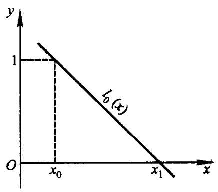

图 1-1

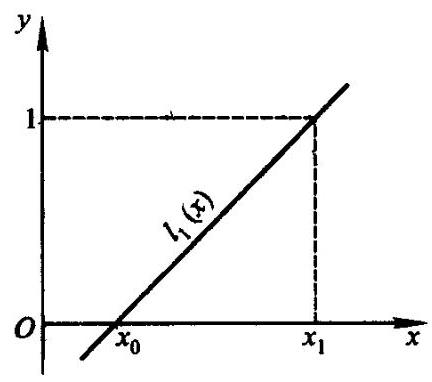

图 1-2

<!-- Media -->

---

<!-- Footnote -->

① 再强调一遍,严格地讲,这里 ${p}_{1}\left( x\right)$ 是不高于一次的多项式,譬如,若 ${y}_{1} = {y}_{0}$ ,则插值多项式 ${p}_{1}\left( x\right)  = {y}_{0}$ 是个零次式.

<!-- Footnote -->

---

式(5)表明,插值问题 3 的解 ${p}_{1}\left( x\right)$ 可以通过插值基函数 ${l}_{0}\left( x\right)$ 和 ${l}_{1}\left( x\right)$ 组合得出,且组合系数恰为所给数据 ${y}_{0},{y}_{1}$ .

## 2. 抛物插值

线性插值仅仅利用了两个节点上的信息, 精度自然很低, 为了提高精度, 进一步考察下述二次插值.

问题 4 求作二次式 ${p}_{2}\left( x\right)$ ,使满足条件

$$
{p}_{2}\left( {x}_{0}\right)  = {y}_{0},\;{p}_{2}\left( {x}_{1}\right)  = {y}_{1},\;{p}_{2}\left( {x}_{2}\right)  = {y}_{2} \tag{6}
$$

二次插值的几何解释是,用通过三点 $\left( {{x}_{0},{y}_{0}}\right) ,\left( {{x}_{1},{y}_{1}}\right) ,\left( {{x}_{2},{y}_{2}}\right)$ 的抛物线 $y = {p}_{2}\left( x\right)$ 来近似所考察的曲线 $y = f\left( x\right)$ ,因此这类插值亦称抛物插值.

为了得出插值多项式 ${p}_{2}\left( x\right)$ ,先解决一个特殊的二次插值问题: 求作二次式 ${l}_{0}\left( x\right)$ ,使满足条件

$$
{l}_{0}\left( {x}_{0}\right)  = 1,\;{l}_{0}\left( {x}_{1}\right)  = {l}_{0}\left( {x}_{2}\right)  = 0 \tag{7}
$$

这个问题是容易求解的,事实上,由式 (7) 的后两个条件知, ${x}_{1},{x}_{2}$ 是 ${l}_{0}\left( x\right)$ 的两个零点, 因而

$$
{l}_{0}\left( x\right)  = c\left( {x - {x}_{1}}\right) \left( {x - {x}_{2}}\right)
$$

再利用式 (7) 剩下的一个条件 ${l}_{0}\left( {x}_{0}\right)  = 1$ 确定系数 $c$ ,结果得出

$$
{l}_{0}\left( x\right)  = \frac{\left( {x - {x}_{1}}\right) \left( {x - {x}_{2}}\right) }{\left( {{x}_{0} - {x}_{1}}\right) \left( {{x}_{0} - {x}_{2}}\right) }
$$

类似地可以构造出满足条件

$$
{l}_{1}\left( {x}_{1}\right)  = 1,\;{l}_{1}\left( {x}_{0}\right)  = {l}_{1}\left( {x}_{2}\right)  = 0
$$

$$
{l}_{2}\left( {x}_{2}\right)  = 1,\;{l}_{2}\left( {x}_{0}\right)  = {l}_{2}\left( {x}_{1}\right)  = 0
$$

的插值多项式 ${l}_{1}\left( x\right)$ 与 ${l}_{2}\left( x\right)$ ,其表达式分别为

$$
{l}_{1}\left( x\right)  = \frac{\left( {x - {x}_{0}}\right) \left( {x - {x}_{2}}\right) }{\left( {{x}_{1} - {x}_{0}}\right) \left( {{x}_{1} - {x}_{2}}\right) }
$$

$$
{l}_{2}\left( x\right)  = \frac{\left( {x - {x}_{0}}\right) \left( {x - {x}_{1}}\right) }{\left( {{x}_{2} - {x}_{0}}\right) \left( {{x}_{2} - {x}_{1}}\right) }
$$

这样构造出的 ${l}_{0}\left( x\right) ,{l}_{1}\left( x\right)$ 和 ${l}_{2}\left( x\right)$ 称作问题 4 的插值基函数.

设取已知数据 ${y}_{0},{y}_{1},{y}_{2}$ 作为组合系数,将插值基函数 ${l}_{0}\left( x\right) ,{l}_{1}\left( x\right)$ , ${l}_{2}\left( x\right)$ 组合得

$$
{p}_{2}\left( x\right)  = \frac{\left( {x - {x}_{1}}\right) \left( {x - {x}_{2}}\right) }{\left( {{x}_{0} - {x}_{1}}\right) \left( {{x}_{0} - {x}_{2}}\right) }{y}_{0} + \frac{\left( {x - {x}_{0}}\right) \left( {x - {x}_{2}}\right) }{\left( {{x}_{1} - {x}_{0}}\right) \left( {{x}_{1} - {x}_{2}}\right) }{y}_{1} +
$$

$$
\frac{\left( {x - {x}_{0}}\right) \left( {x - {x}_{1}}\right) }{\left( {{x}_{2} - {x}_{0}}\right) \left( {{x}_{2} - {x}_{1}}\right) }{y}_{2} \tag{8}
$$

容易看出,这样构造出的 ${p}_{2}\left( x\right)$ 满足条件 (6),因而它就是问题 4 的解.

例 3 利用 100,121 和 144 的开方值求 $\sqrt{115}$ .

解 用抛物插值,这里 ${x}_{0} = {100},{y}_{0} = {10},{x}_{1} = {121},{y}_{1} = {11},{x}_{2} = {144}$ , ${y}_{2} = {12}$ . 令 $x = {115}$ 代入式 (8),求得 $\sqrt{115}$ 近似值为 10.7228 . 同精确值比较, 这里得到有 4 位有效数字的结果.

## 3. 一般情形

进一步求解一般形式的问题 2. 仿照线性插值和抛物插值所采用的方法, 仍从构造所谓插值基函数入手. 这里的插值基函数 ${l}_{k}\left( x\right) \left( {k = 0,1,\cdots ,n}\right)$ 是 $n$ 次多项式, 且满足条件

$$
{l}_{k}\left( {x}_{j}\right)  = {\delta }_{kj} = \left\{  \begin{array}{ll} 0, & j \neq  k \\  1, & j = k \end{array}\right.  \tag{9}
$$

这表明除 ${x}_{k}$ 以外的所有节点都是 ${l}_{k}\left( x\right)$ 的零点, 故

$$
{l}_{k}\left( x\right)  = c\mathop{\prod }\limits_{\substack{{j = 0} \\  {j \neq  k} }}^{n}\left( {x - {x}_{j}}\right)
$$

<!-- Media -->

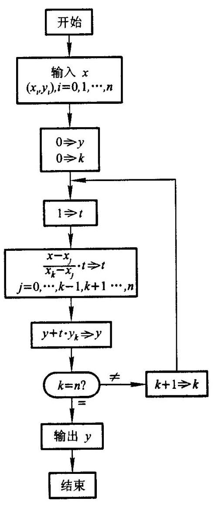

图 1-3

<!-- Media -->

而按式 (9) 剩下的一个条件 ${l}_{k}\left( {x}_{k}\right)  = 1$ 确定其中的系数 $c$ ,结果有

$$
{l}_{k}\left( x\right)  = \mathop{\prod }\limits_{\substack{{j = 0} \\  {j \neq  k} }}^{n}\frac{x - {x}_{j}}{{x}_{k} - {x}_{j}}
$$

这里 II 的含义是累乘, $\mathop{\prod }\limits_{\substack{{j = 0} \\  {j \neq  k} }}^{n}$ 表示乘积遍取下标 $j$ 从 0 到 $n$ 除 $k$ 以外的全部值.

利用插值基函数容易得出问题 2 的解

$$
{p}_{n}\left( x\right)  = \mathop{\sum }\limits_{{k = 0}}^{n}{y}_{k}{l}_{k}\left( x\right)  = \mathop{\sum }\limits_{{k = 0}}^{n}\left( {\mathop{\prod }\limits_{\substack{{j = 0} \\  {j \neq  k} }}^{n}\frac{x - {x}_{j}}{{x}_{k} - {x}_{j}}}\right) {y}_{k}
$$

(10)

事实上,由于每个插值基函数 ${l}_{k}\left( x\right)$ 都是 $n$ 次式, ${p}_{n}\left( x\right)$ 的次数 $\leq  n$ ,又据式(9)有

$$
{p}_{n}\left( {x}_{1}\right)  = \mathop{\sum }\limits_{{k = 0}}^{n}{y}_{k}{l}_{k}\left( {x}_{1}\right)  = {y}_{1}
$$

即 ${p}_{n}\left( x\right)$ 满足插值条件 (2).

式(10)称作拉格朗日插值公式. 该公式的形式对称, 结构紧凑, 因而容易编写计算程序. 事实上,式 (10) 在逻辑结构上表现为二重循环. 内循环 ( $j$ 循环) 累乘求得 ${l}_{k}\left( x\right)$ ,然后再通过外循环 ( $k$ 循环) 累加得出插值结果 $y$ . 图 1-3 是拉格朗日方法的算法框图.

### 1.3 插 值 余 项

## 1. 拉格朗日余项定理

依据 $f\left( x\right)$ 的数据表构造出它的插值函数 ${p}_{n}\left( x\right)$ ,然后,在给定点 $x$ 计算 ${p}_{n}\left( x\right)$ 的值作为 $f\left( x\right)$ 的近似值,这一过程称插值. 点 $x$ 则称插值点. 所谓 “插值”,通俗地说,就是依据 $f\left( x\right)$ 所给的函数表 “插出” 所要的函数值. 由于插值函数 ${p}_{n}\left( x\right)$ 通常只是近似地刻画了原来的函数 $f\left( x\right)$ ,在插值点 $x$ 处计算 ${p}_{n}\left( x\right)$ 作为 $f\left( x\right)$ 的函数值,一般地说总有误差,今后将称 $R\left( x\right)  = f\left( x\right)  - {p}_{n}\left( x\right)$ 为插值函数的截断误差,或称插值余项. 利用简单的插值函数 ${p}_{n}\left( x\right)$ 替代原来很复杂的函数 $f\left( x\right)$ ,这种做法究竟是否有效,要看截断误差是否满足所要求的精度.

下面考察拉格朗日插值的余项, 导出著名的拉格朗日余项定理.

定理 3 设区间 $\left\lbrack  {a,b}\right\rbrack$ 含有节点 ${x}_{0},{x}_{1},\cdots ,{x}_{n}$ ,而 $f\left( x\right)$ 在 $\left\lbrack  {a,b}\right\rbrack$ 内有连续的直到 $n + 1$ 阶导数,且 $f\left( {x}_{i}\right)  = {y}_{i}\left( {i = 0,1,\cdots ,n}\right)$ 已给,则当 $x \in  \left\lbrack  {a,b}\right\rbrack$ 时,对于由式 (10) 给出的 ${p}_{n}\left( x\right)$ ,成立

$$
f\left( x\right)  - {p}_{n}\left( x\right)  = \frac{{f}^{\left( n + 1\right) }\left( \xi \right) }{\left( {n + 1}\right) !}\mathop{\prod }\limits_{{k = 0}}^{n}\left( {x - {x}_{k}}\right)  \tag{11}
$$

式中 $\xi$ 是与 $x$ 有关的点,它包含在由点 ${x}_{0},{x}_{1},\cdots ,{x}_{n}$ 和 $x$ 所界定的范围内, 因而 $\xi  \in  \left\lbrack  {a,b}\right\rbrack$ .

拉格朗日余项定理与众所周知的泰勒余项定理 (定理 1) 有着深刻的联系. 容易看出,作为上述拉格朗日余项定理 (以及泰勒余项定理) 当 $n = 0$ 时的特殊情形, 可以得出微分学的中值定理. 而由中值定理又可推出罗尔 (Rolle) 定理. 耐人寻味的是, 上述拉格朗日余项定理 (以及泰勒余项定理) 的证明, 却是以简单的罗尔定理为基础的.

证 仅需要考察插值点 $x$ 不是插值节点 ${x}_{t}$ 的情形,否则余项公式 (11) 显然成立. 令

$$
g\left( t\right)  = {p}_{n}\left( t\right)  + {c\omega }\left( t\right)  \tag{12}
$$

式中 $c$ 为待定系数,而

$$
\omega \left( t\right)  = \mathop{\prod }\limits_{{k = 0}}^{n}\left( {t - {x}_{k}}\right)
$$

由于节点 ${x}_{t}\left( {i = 0,1,\cdots ,n}\right)$ 都是 $\omega \left( t\right)$ 的零点,据插值条件 (2) 有

$$
g\left( {x}_{i}\right)  = f\left( {x}_{i}\right) ,\;i = 0,1,\cdots ,n
$$

此外, 若取

$$
c = \frac{f\left( x\right)  - {p}_{n}\left( x\right) }{\omega \left( x\right) } \tag{13}
$$

则又有 $g\left( x\right)  = f\left( x\right)$ . 这样,误差函数 $R\left( t\right)  = f\left( t\right)  - g\left( t\right)$ 至少有 $n + 2$ 个零点 ${x}_{0},{x}_{1},\cdots ,{x}_{n}$ 和 $x$ (它们互不相同). 据罗尔定理, ${R}^{\prime }\left( t\right)$ 在 $R\left( t\right)$ 的任意两个相邻的零点之间至少有一个零点,故它在 $\left\lbrack  {a,b}\right\rbrack$ 内至少有 $n + 1$ 个互异的零点. 再对 ${R}^{\prime }\left( t\right)$ 应用罗尔定理,知 ${R}^{\prime \prime }\left( t\right)$ 在 $\left\lbrack  {a,b}\right\rbrack$ 内至少有 $n$ 个互异的零点. 依此类推,知 ${R}^{\left( n + 1\right) }\left( t\right)$ 在 $\left\lbrack  {a,b}\right\rbrack$ 内至少有一个零点,记之为 $\xi$ :

$$
{R}^{\left( n + 1\right) }\left( \xi \right)  = 0
$$

另一方面, 利用式(12)直接求导知

$$
{R}^{\left( n + 1\right) }\left( t\right)  = {f}^{\left( n + 1\right) }\left( t\right)  - {g}^{\left( n + 1\right) }\left( t\right)  = {f}^{\left( n + 1\right) }\left( t\right)  - c\left( {n + 1}\right) !
$$

上式令 $t = \xi$ ,并注意到式 (13),得

$$
{f}^{\left( n + 1\right) }\left( \xi \right)  - \frac{f\left( x\right)  - {p}_{n}\left( x\right) }{\omega \left( x\right) }\left( {n + 1}\right) ! = 0
$$

据此稍加整理即得式(11). 定理得证.

拉格朗日余项定理在理论上有重要价值, 它刻画了拉格朗日插值的某些基本特征.

臂如,由于余项中含有因子 $\omega \left( x\right)  = \left( {x - {x}_{0}}\right) \left( {x - {x}_{1}}\right) \cdots \left( {x - {x}_{n}}\right)$ ,如果插值点 $x$ 偏离插值节点 ${x}_{i}$ 比较远,插值效果可能不理想. 通常称插值节点所界定的范围 $\left\lbrack  {\mathop{\min }\limits_{{0 \leq  i \leq  n}}{x}_{i},\mathop{\max }\limits_{{0 \leq  i \leq  n}}{x}_{i}}\right\rbrack$ 为插值区间. 如果插值点 $x$ 位于插值区间内,这种插值过程称为内插; 否则称为外推. 余项定理表明, 插值的外推过程是不可靠的.

另外,注意到余项公式 (11) 中还含有高阶导数 ${f}^{\left( n + 1\right) }\left( \xi \right)$ ,这就要求 $f\left( x\right)$ 是足够光滑的. 如果所逼近的函数 $f\left( x\right)$ 光滑性差,则代数插值不一定能奏效. 这不足为怪, 因为代数多项式是任意光滑的, 因此原则上只适用于逼近光滑性好的函数.

## 2. 误差的事后估计

如果只提供了 $f\left( x\right)$ 的一些离散值,并未给出具体的分析式子,那么,直接运用余项公式 (11) 来估计插值误差是困难的.

下面介绍另一种误差分析方法.

考察 3 个节点 ${x}_{0},{x}_{1},{x}_{2}$ . 对于给定的插值点 $x$ ,先用 ${x}_{0}$ 与 ${x}_{1}$ 进行线性插值求出 $y = f\left( x\right)$ 的一个近似值,记为 ${y}_{1}$ ,然后取 ${x}_{0}$ 和 ${x}_{2}$ 进行线性插值求得另一个近似值 ${y}_{2}$ ,按余项定理 (定理 3) 有

$$
y - {y}_{1} = \frac{{f}^{\prime \prime }\left( {\xi }_{1}\right) }{2}\left( {x - {x}_{0}}\right) \left( {x - {x}_{1}}\right)
$$

$$
y - {y}_{2} = \frac{{f}^{\prime \prime }\left( {\xi }_{2}\right) }{2}\left( {x - {x}_{0}}\right) \left( {x - {x}_{2}}\right)
$$

式中 ${\xi }_{1},{\xi }_{2}$ 均属于所考察的区间 $\left\lbrack  {a,b}\right\rbrack$ . 假设 ${f}^{\prime \prime }\left( x\right)$ 在 $\left\lbrack  {a,b}\right\rbrack$ 内改变不大,将上面两个式子相除,消去近似相等的 ${f}^{\prime \prime }\left( {\xi }_{1}\right)$ 和 ${f}^{\prime \prime }\left( {\xi }_{2}\right)$ ,结果有

$$
\frac{y - {y}_{1}}{y - {y}_{2}} \approx  \frac{x - {x}_{1}}{x - {x}_{2}}
$$

据此整理得

$$
y \approx  \frac{x - {x}_{2}}{{x}_{1} - {x}_{2}}{y}_{1} + \frac{x - {x}_{1}}{{x}_{2} - {x}_{1}}{y}_{2} \tag{14}
$$

故有

$$
y - {y}_{1} \approx  \frac{x - {x}_{1}}{{x}_{2} - {x}_{1}}\left( {{y}_{2} - {y}_{1}}\right)  \tag{15}
$$

按这一估计式,插值结果 ${y}_{1}$ 的误差 $y - {y}_{1}$ 可以通过两个结果的偏差 ${y}_{2} - {y}_{1}$ 来估计. 这种直接用计算结果估计误差的方法称作事后估计法.

例 4 用事后估计法考察例 2 的误差. 先取 ${x}_{0} = {100},{x}_{1} = {121}$ 作节点,例 2 已求得近似值 ${y}_{1} = {10.71428}$ . 设再取 ${x}_{0} = {100},{x}_{2} = {144}$ 作节点,用线性插值可求得另一个结果 ${y}_{2} = {10.68182}$ ,按估计式 (15) 有

$$
y - {y}_{1} \approx  \frac{{115} - {121}}{{144} - {121}} \times  \left( {{10.68182} - {10.71428}}\right)  = {0.00847}
$$

用这个误差值来修正结果 ${y}_{1}$ ,得到新的近似值

$$
y = {10.71428} + {0.00847} = {10.7228}
$$

有趣的是,通过这一途径获得的近似值 $y = {10.7228}$ 与例 3 抛物插值的结果相同, 这仅仅是偶然的巧合吗? 下一节将要回答这个问题.

### 1.4 埃特金算法

如果临时需要增加一个插值节点, 则拉格朗日公式 (10) 的所有系数都要重算, 这就会造成计算量的浪费. 本节将要介绍的埃特金 (Aitken) 算法可以灵活地增加插值节点, 且具有所谓的 “承袭性”.

为便于描述算法,首先引进一种本节专用的记号. 对于给定的插值点 $x$ , 如果除顺序排列的 $k$ 个节点 ${x}_{0},{x}_{1},\cdots ,{x}_{k - 1}$ 外,再增加一个节点 ${x}_{1}\left( {i \geq  k}\right)$ 进行 $k$ 次插值,则插值结果依赖于所给定的次数 $k$ 与节点 ${x}_{i}$ ,我们将这一结果记为 ${f}_{k}\left( {x}_{t}\right)$ . 例如, ${f}_{1}\left( {x}_{t}\right)$ 表示取 ${x}_{0},{x}_{t}$ 进行线性插值,即

$$
{f}_{1}\left( {x}_{i}\right)  = \frac{x - {x}_{i}}{{x}_{0} - {x}_{i}}f\left( {x}_{0}\right)  + \frac{x - {x}_{0}}{{x}_{i} - {x}_{0}}f\left( {x}_{i}\right) ,\;i \geq  1
$$

特别地

$$
{f}_{1}\left( {x}_{1}\right)  = \frac{x - {x}_{1}}{{x}_{0} - {x}_{1}}f\left( {x}_{0}\right)  + \frac{x - {x}_{0}}{{x}_{1} - {x}_{0}}f\left( {x}_{1}\right)  \tag{16}
$$

$$
{f}_{1}\left( {x}_{2}\right)  = \frac{x - {x}_{2}}{{x}_{0} - {x}_{2}}f\left( {x}_{0}\right)  + \frac{x - {x}_{0}}{{x}_{2} - {x}_{0}}f\left( {x}_{2}\right)  \tag{17}
$$

又如 ${f}_{2}\left( {x}_{i}\right)$ 表示取 ${x}_{0},{x}_{1},{x}_{i}$ 为节点进行抛物插值的结果,特别有

$$
{f}_{2}\left( {x}_{2}\right)  = \frac{\left( {x - {x}_{1}}\right) \left( {x - {x}_{2}}\right) }{\left( {{x}_{0} - {x}_{1}}\right) \left( {{x}_{0} - {x}_{2}}\right) }f\left( {x}_{0}\right)  + \frac{\left( {x - {x}_{0}}\right) \left( {x - {x}_{2}}\right) }{\left( {{x}_{1} - {x}_{0}}\right) \left( {{x}_{1} - {x}_{2}}\right) }f\left( {x}_{1}\right)  +
$$

$$
\frac{\left( {x - {x}_{0}}\right) \left( {x - {x}_{1}}\right) }{\left( {{x}_{2} - {x}_{0}}\right) \left( {{x}_{2} - {x}_{1}}\right) }f\left( {x}_{2}\right)  \tag{18}
$$

前面 1.3 节用线性插值的两个结果建立了近似公式 (14), 应用上面约定的记号,这个公式中的 ${y}_{1},{y}_{2}$ 分别是 ${f}_{1}\left( {x}_{1}\right)$ 和 ${f}_{1}\left( {x}_{2}\right)$ ,于是有

$$
f\left( x\right)  \approx  \frac{x - {x}_{2}}{{x}_{1} - {x}_{2}}{f}_{1}\left( {x}_{1}\right)  + \frac{x - {x}_{1}}{{x}_{2} - {x}_{1}}{f}_{1}\left( {x}_{2}\right)  \tag{19}
$$

将式 (16) 和式 (17) 代入直接验证, 知式 (19) 与式 (18) 的右端相等, 即有

$$
{f}_{2}\left( {x}_{2}\right)  = \frac{x - {x}_{2}}{{x}_{1} - {x}_{2}}{f}_{1}\left( {x}_{1}\right)  + \frac{x - {x}_{1}}{{x}_{2} - {x}_{1}}{f}_{1}\left( {x}_{2}\right)  \tag{20}
$$

这个式子表明,用线性插值的两个结果 ${f}_{1}\left( {x}_{1}\right)$ 和 ${f}_{1}\left( {x}_{2}\right)$ 再做线性插值,结果得到了抛物插值的结果 ${f}_{2}\left( {x}_{2}\right)$ . 这就回答了上节末尾所提出的问题.

上述过程还可以继续进行下去. 一般地,利用两个 $k - 1$ 次插值 ${f}_{k - 1}\left( {x}_{k - 1}\right)$ 与 ${f}_{k - 1}\left( {x}_{l}\right)$ 再做线性插值,结果得到 $k$ 次插值 ${f}_{k}\left( {x}_{l}\right)$ ,即有递推公式

$$
{f}_{k}\left( {x}_{t}\right)  = \frac{x - {x}_{t}}{{x}_{k - 1} - {x}_{t}}{f}_{k - 1}\left( {x}_{k - 1}\right)  + \frac{x - {x}_{k - 1}}{{x}_{t} - {x}_{k - 1}}{f}_{k - 1}\left( {x}_{t}\right) ,\;i \geq  k \tag{21}
$$

这里约定 ${f}_{0}\left( {x}_{i}\right)  = f\left( {x}_{i}\right)$ . 对 $k = 1,2,\cdots ,n$ 和 $i = k,k + 1,\cdots ,n$ 反复执行这一算式, 可以逐列构造出下面的插值表——所谓埃特金插值表:

<!-- Media -->

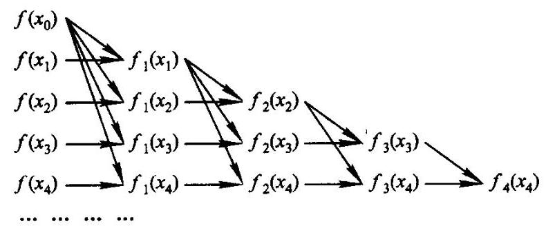

<!-- Media -->

这种逐步提高次数的插值方法称埃特金逐步插值法. 埃特金算法的特点在于, 它将一个高次插值过程归结为线性插值的多次重复. 图 1-4 描述了这种算法.

<!-- Media -->

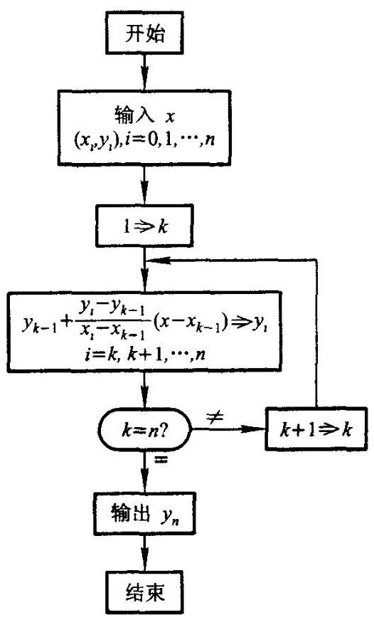

图 1-4

<!-- Media -->

埃特金算法的另一特点是, 埃特金插值表中的每个数据均可视为插值结果, 而从这些数据的一致程度即可判断插值结果的精度. 依据这一事实, 可以逐行生成插值表, 每做一步便检查一下计算结果的精度, 如果不满足精度要求, 则增加一个节点再算, 直到满足精度为止. 在插值节点较多的情况下, 运用这种方法可降低插值次数.

例 5 利用表 1-1 左部所给数据求正弦积分

$$
f\left( x\right)  =  - {\int }_{x}^{\infty }\frac{\sin t}{t}\mathrm{\;d}t
$$

在 $x = {0.462}$ 的值.

<!-- Media -->

表 1-1

<table><tr><td>${x}_{1}$</td><td>$f\left( {x}_{i}\right)$</td><td>${f}_{1}\left( {x}_{1}\right)$</td><td>${f}_{2}\left( {x}_{1}\right)$</td><td>${f}_{3}\left( {x}_{i}\right)$</td></tr><tr><td>0.3</td><td>0.298 50</td><td/><td/><td/></tr><tr><td>0.4</td><td>0.396 46</td><td>0.457 915</td><td/><td/></tr><tr><td>0.5</td><td>0.493 11</td><td>0.456 134</td><td>0.456 537</td><td/></tr><tr><td>0.6</td><td>0.588 13</td><td>0.454 900</td><td>0.456 484</td><td>0.456 557</td></tr><tr><td>0.7</td><td>0.681 22</td><td>0.453 502</td><td>0.456 432</td><td>0.456 557</td></tr></table>

<!-- Media -->

上表右部记录了埃特金算法的计算结果, 可以看到, 三次插值的两个结果已重合在一起,因而不需要再做进一步的计算,这个结果 $y = {0.45656}$ 的每一位数字都是有效数字.

### 1.5 牛顿插值公式

上一节介绍的埃特金算法虽具有承袭性, 但其算式 (21) 是递推型的, 不便于进行理论上的分析. 本节将着手建立具有承袭性的显式的插值公式.

## 1. 具有承袭性的插值公式

先考察线性插值的插值公式 (见式 (3))

$$
{p}_{1}\left( x\right)  = f\left( {x}_{0}\right)  + \frac{f\left( {x}_{1}\right)  - f\left( {x}_{0}\right) }{{x}_{1} - {x}_{0}}\left( {x - {x}_{0}}\right)  \tag{22}
$$

由于 ${p}_{0}\left( x\right)  = f\left( {x}_{0}\right)$ 可看作是零次插值多项式,上式表明

$$
{p}_{1}\left( x\right)  = {p}_{0}\left( x\right)  + {c}_{1}\left( {x - {x}_{0}}\right)
$$

其中, 修正项的系数

$$
{c}_{1} = \frac{f\left( {x}_{1}\right)  - f\left( {x}_{0}\right) }{{x}_{1} - {x}_{0}}
$$

再修正 ${p}_{1}\left( x\right)$ 以进一步得到抛物插值公式一一问题 4 的解 ${p}_{2}\left( x\right)$ ,为此令

$$
{p}_{2}\left( x\right)  = {p}_{1}\left( x\right)  + {c}_{2}\left( {x - {x}_{0}}\right) \left( {x - {x}_{1}}\right)
$$

显然,不管系数 ${c}_{2}$ 如何取值, ${p}_{2}\left( x\right)$ 均能满足 (6) 的前两个条件 ${p}_{2}\left( {x}_{0}\right)  = f\left( {x}_{0}\right)$ , ${p}_{2}\left( {x}_{1}\right)  = f\left( {x}_{1}\right)$ ,再用剩下的一个条件 ${p}_{2}\left( {x}_{2}\right)  = f\left( {x}_{2}\right)$ 来确定 ${c}_{2}$ ,结果有

$$
{c}_{2} = \frac{\frac{f\left( {x}_{2}\right)  - f\left( {x}_{0}\right) }{{x}_{2} - {x}_{0}} - \frac{f\left( {x}_{1}\right)  - f\left( {x}_{0}\right) }{{x}_{1} - {x}_{0}}}{{x}_{2} - {x}_{1}}
$$

记 ${c}_{0} = f\left( {x}_{0}\right)$ ,从而有

$$
{p}_{2}\left( x\right)  = {c}_{0} + {c}_{1}\left( {x - {x}_{0}}\right)  + {c}_{2}\left( {x - {x}_{0}}\right) \left( {x - {x}_{1}}\right)
$$

$$
= f\left( {x}_{0}\right)  + \frac{f\left( {x}_{1}\right)  - f\left( {x}_{0}\right) }{{x}_{1} - {x}_{0}}\left( {x - {x}_{0}}\right)  +
$$

$$
\frac{\frac{f\left( {x}_{2}\right)  - f\left( {x}_{0}\right) }{{x}_{2} - {x}_{0}} - \frac{f\left( {x}_{1}\right)  - f\left( {x}_{0}\right) }{{x}_{1} - {x}_{0}}}{{x}_{2} - {x}_{1}}\left( {x - {x}_{0}}\right) \left( {x - {x}_{1}}\right)  \tag{23}
$$

以上论述表明, 为了建立具有承袭性的插值公式, 需要引进差商并研究其性质.

## 2. 差商及其性质

对于给定的函数 $f\left( x\right)$ ,记 $f\left( {{x}_{0},{x}_{1},\cdots ,{x}_{n}}\right)$ 表示关于节点 ${x}_{0},{x}_{1},\cdots ,{x}_{n}$ 的 $n$ 阶差商. $\cdot$ 一阶差商定义为

$$
f\left( {{x}_{0},{x}_{1}}\right)  = \frac{f\left( {x}_{1}\right)  - f\left( {x}_{0}\right) }{{x}_{1} - {x}_{0}}
$$

二阶差商定义为一阶差商的差商

$$
f\left( {{x}_{0},{x}_{1},{x}_{2}}\right)  = \frac{f\left( {{x}_{1},{x}_{2}}\right)  - f\left( {{x}_{0},{x}_{1}}\right) }{{x}_{2} - {x}_{0}}
$$

一般地, $n$ 阶差商递推定义为

$$
f\left( {{x}_{0},{x}_{1},\cdots ,{x}_{n}}\right)  = \frac{f\left( {{x}_{1},{x}_{2},\cdots ,{x}_{n}}\right)  - f\left( {{x}_{0},{x}_{1},\cdots ,{x}_{n - 1}}\right) }{{x}_{n} - {x}_{0}}
$$

为统一起见,补充定义函数值 $f\left( {x}_{t}\right)$ 为零阶差商.

可以看到, 差商计算具有鲜明的承袭性.

依据差商的递推定义,从作为零阶差商的函数值 $f\left( {x}_{t}\right)$ 出发,通过简单的差商计算可以逐步提高差商的阶数,从而构造出 $n$ 阶差商.

为了理论分析的需要, 这里再导出差商的显式表达式. 事实上, 差商可用离散的函数值来表示, 譬如有

$$
f\left( {{x}_{0},{x}_{1}}\right)  = \frac{f\left( {x}_{1}\right)  - f\left( {x}_{0}\right) }{{x}_{1} - {x}_{0}} = \frac{f\left( {x}_{0}\right) }{{x}_{0} - {x}_{1}} + \frac{f\left( {x}_{1}\right) }{{x}_{1} - {x}_{0}}
$$

而

$$
f\left( {{x}_{0},{x}_{1},{x}_{2}}\right)  = \frac{f\left( {{x}_{1},{x}_{2}}\right)  - f\left( {{x}_{0},{x}_{1}}\right) }{{x}_{2} - {x}_{0}}
$$

$$
= \frac{1}{{x}_{2} - {x}_{0}}\left\lbrack  {\left( {\frac{f\left( {x}_{1}\right) }{{x}_{1} - {x}_{2}} + \frac{f\left( {x}_{2}\right) }{{x}_{2} - {x}_{1}}}\right)  - \left( {\frac{f\left( {x}_{0}\right) }{{x}_{0} - {x}_{1}} + \frac{f\left( {x}_{1}\right) }{{x}_{1} - {x}_{0}}}\right) }\right\rbrack
$$

$$
= \frac{f\left( {x}_{0}\right) }{\left( {{x}_{0} - {x}_{1}}\right) \left( {{x}_{0} - {x}_{2}}\right) } + \frac{f\left( {x}_{1}\right) }{\left( {{x}_{1} - {x}_{0}}\right) \left( {{x}_{1} - {x}_{2}}\right) } +
$$

$$
\frac{f\left( {x}_{2}\right) }{\left( {{x}_{2} - {x}_{0}}\right) \left( {{x}_{2} - {x}_{1}}\right) }
$$

一般地, 用数学归纳法易证

$$
f\left( {{x}_{0},{x}_{1},\cdots ,{x}_{n}}\right)  = \mathop{\sum }\limits_{{k = 0}}^{n}\frac{f\left( {x}_{k}\right) }{\mathop{\prod }\limits_{\substack{{j = 0} \\  {j \neq  k} }}^{n}\left( {{x}_{k} - {x}_{j}}\right) } \tag{24}
$$

按差商的这一表达式, 如果调换两个节点的顺序, 只是意味着改变式 (24) 求和的次序, 其值不变. 因之差商的值与节点的排列顺序无关, 譬如有

$$
f\left( {{x}_{0},{x}_{\mathrm{I}}}\right)  = f\left( {{x}_{1},{x}_{0}}\right)
$$

$$
f\left( {{x}_{0},{x}_{1},{x}_{2}}\right)  = f\left( {{x}_{1},{x}_{0},{x}_{2}}\right)  = {f}^{\prime }\left( {{x}_{2},{x}_{1},{x}_{0}}\right)  = \cdots
$$

这种性质称作差商的对称性.

## 3. 差商形式的插值公式

按差商定义

$$
f\left( x\right)  = f\left( {x}_{0}\right)  + f\left( {{x}_{0},x}\right) \left( {x - {x}_{0}}\right) ,
$$

$$
f\left( {{x}_{0},x}\right)  = f\left( {{x}_{0},{x}_{1}}\right)  + f\left( {{x}_{0},{x}_{1},{x}_{1}}\right) \left( {x - {x}_{1}}\right) ,
$$

$$
f\left( {{x}_{0},{x}_{1},x}\right)  = f\left( {{x}_{0},{x}_{1},{x}_{2}}\right)  + f\left( {{x}_{0},{x}_{1},{x}_{2},x}\right) \left( {x - {x}_{2}}\right) ,
$$

..........

$$
f\left( {{x}_{0},{x}_{1},\cdots ,{x}_{n - 1},x}\right)  = f\left( {{x}_{0},{x}_{1},\cdots ,{x}_{n}}\right)  + f\left( {{x}_{0},{x}_{1},\cdots ,{x}_{n},x}\right) \left( {x - {x}_{n}}\right)
$$

反复用后一个式子代入前面的式子, 得

$$
f\left( x\right)  = f\left( {x}_{0}\right)  + f\left( {{x}_{0},{x}_{1}}\right) \left( {x - {x}_{0}}\right)  +
$$

$$
f\left( {{x}_{0},{x}_{1},{x}_{2}}\right) \left( {x - {x}_{0}}\right) \left( {x - {x}_{1}}\right)  + \cdots  +
$$

$$
f\left( {{x}_{0},{x}_{1},\cdots ,{x}_{n}}\right) \left( {x - {x}_{0}}\right) \left( {x - {x}_{1}}\right) \cdots \left( {x - {x}_{n - 1}}\right)  +
$$

$$
f\left( {{x}_{0},{x}_{1},\cdots ,{x}_{n},x}\right) \left( {x - {x}_{0}}\right) \left( {x - {x}_{1}}\right) \cdots \left( {x - {x}_{n}}\right)  \tag{25}
$$

令

$$
{p}_{n}\left( x\right)  = f\left( {x}_{0}\right)  + f\left( {{x}_{0},{x}_{1}}\right) \left( {x - {x}_{0}}\right)  +
$$

$$
f\left( {{x}_{0},{x}_{1},{x}_{2}}\right) \left( {x - {x}_{0}}\right) \left( {x - {x}_{1}}\right)  + \cdots  +
$$

$$
f\left( {{x}_{0},{x}_{1},\cdots ,{x}_{n}}\right) \left( {x - {x}_{0}}\right) \left( {x - {x}_{1}}\right) \cdots \left( {x - {x}_{n - 1}}\right)  \tag{26}
$$

$$
R\left( x\right)  = f\left( {{x}_{0},{x}_{1},\cdots ,{x}_{n},x}\right) \left( {x - {x}_{0}}\right) \left( {x - {x}_{1}}\right) \cdots \left( {x - {x}_{n}}\right)  \tag{27}
$$

则有 $f\left( x\right)  = {p}_{n}\left( x\right)  + R\left( x\right)$ . 注意到 $R\left( {x}_{i}\right)  = 0\left( {i = 0,1,\cdots ,n}\right)$ ,因而 ${p}_{n}\left( x\right)$ 就是本章 1.1 节问题 2 的解.

显然,插值公式 (22),(23) 是式 (26) 当 $n = 1,2$ 时的特殊情形.

这种差商形式的插值公式 (26) 称作牛顿插值公式. 由于插值问题 2 的解唯一 (参看 1.1 节), 牛顿公式 (26) 其实只是拉格朗日公式 (10) 的一种变形. 比较两种等价的余项公式式 (11) 和式 (27) 即可断定:

定理 4 在节点 ${x}_{0},{x}_{1},\cdots ,{x}_{n}$ 所界定的范围 $\Delta  : \left\lbrack  {\mathop{\min }\limits_{{0 \leq  i \leq  n}}{x}_{i},\mathop{\max }\limits_{{0 \leq  i \leq  n}}{x}_{i}}\right\rbrack$ 内存在一点 $\xi$ ,使成立

$$
f\left( {{x}_{0},{x}_{1},\cdots ,{x}_{n}}\right)  = \frac{{f}^{\left( n\right) }\left( \xi \right) }{n!}
$$

依据差商与导数的上述关系, 可将牛顿插值公式 (26) 改写为

$$
{p}_{n}\left( x\right)  = f\left( {x}_{0}\right)  + {f}^{\prime }\left( {\xi }_{1}\right) \left( {x - {x}_{0}}\right)  + \frac{{f}^{\prime \prime }\left( {\xi }_{2}\right) }{2!}\left( {x - {x}_{0}}\right) \left( {x - {x}_{1}}\right)  + \cdots  +
$$

$$
\frac{{f}^{\left( n\right) }\left( {\xi }_{n}\right) }{n!}\left( {x - {x}_{0}}\right) \left( {x - {x}_{1}}\right) \cdots \left( {x - {x}_{n - 1}}\right)
$$

式中 ${\xi }_{i} \in  \Delta \left( {i = 1,2,\cdots ,n}\right)$ . 若固定 ${x}_{0}$ ,而令 ${x}_{1},{x}_{2},\cdots ,{x}_{n}$ 一起趋于 ${x}_{0}$ ,那么,作为牛顿插值公式的极限即可得到泰勒公式 (1). 在这种意义下, 拉格朗日插值可理解为泰勒插值的离散化形式.

## 4. 差分形式的插值公式

前面讨论了节点任意分布的插值公式. 实际应用时经常碰到节点等距的情形, 这时插值公式的形式可以简化. 为此先介绍差分的概念.

设节点等距,即 ${x}_{i} = {x}_{0} + {ih}\left( {i = 1,2,\cdots ,n}\right)$ ,这里间距 $h$ 为定数,称为步长.

所谓差分,是指相邻节点数据的偏差. 关于函数值 $f\left( {x}_{i}\right)  = {y}_{i}$ 的一阶差分

定义为

$$
\Delta {y}_{i} = {y}_{i + 1} - {y}_{i}
$$

二阶差分则定义为一阶差分的差分

$$
{\Delta }^{2}{y}_{i} = \Delta {y}_{i + 1} - \Delta {y}_{i}
$$

一般地, $n$ 阶差分递推定义为

$$
{\Delta }^{n}{y}_{i} = {\Delta }^{n - 1}{y}_{i + 1} - {\Delta }^{n - 1}{y}_{i}
$$

这样,依据所给数据 ${y}_{t}$ 可以逐步求出它的各阶差分,而生成如下形式的差分表:

<!-- Media -->

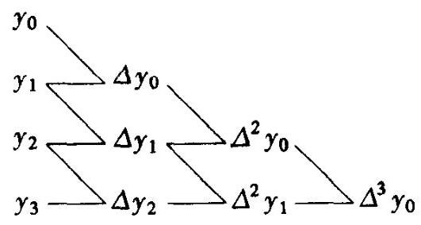

<!-- Media -->

很明显,在节点等距的情况下差商可用差分来表示. 事实上,设步长 $h =$ ${x}_{i + 1} - {x}_{i}$ ,有

$$
f\left( {{x}_{i},{x}_{i + 1}}\right)  = \frac{f\left( {x}_{i + 1}\right)  - f\left( {x}_{i}\right) }{{x}_{i + 1} - {x}_{i}} = \frac{1}{h}\Delta {y}_{i}
$$

$$
f\left( {{x}_{1},{x}_{1 + 1},{x}_{1 + 2}}\right)  = \frac{f\left( {{x}_{1 + 1},{x}_{1 + 2}}\right)  - f\left( {{x}_{1},{x}_{1 + 1}}\right) }{{x}_{1 + 2} - {x}_{1}}
$$

$$
= \frac{1}{2{h}^{2}}\left( {\Delta {y}_{t + 1} - \Delta {y}_{t}}\right)  = \frac{1}{2{h}^{2}}{\Delta }^{2}{y}_{t}
$$

一般地, 用数学归纳法易证

$$
f\left( {{x}_{1},{x}_{2 + 1},\cdots ,{x}_{l + k}}\right)  = \frac{1}{k!{h}^{k}}{\Delta }^{k}{y}_{l}
$$

这样, 对于等距节点的情形, 将牛顿插值公式 (26) 中的差商换成相应的差分,令 $x = {x}_{0} + {th}$ ,则有

$$
{p}_{n}\left( {{x}_{0} + {th}}\right)  = {y}_{0} + {t\Delta }{y}_{0} + \frac{t\left( {t - 1}\right) }{2}{\Delta }^{2}{y}_{0} + \cdots  +
$$

$$
\frac{t\left( {t - 1}\right) \left( {t - 2}\right) \cdots \left( {t - n + 1}\right) }{n!}{\Delta }^{n}{y}_{0}
$$

这一公式称作函数插值的有限差公式.

值得指出的是, 我国古代天文学家在制定历法的过程中曾对插值方法做出过杰出的贡献. 譬如, 隋朝刘焯的杰作《皇极历》(公元 600 年)、中唐僧一行所造《大衍历》(公元 727 年)都使用了二次插值. 特别是, 晚唐徐唐造《宣明历》(公元 822 年) 所使用的插值技术正是二阶有限差方法, 而这方面的工作比西方超前了上千年.

### 1.6 埃尔米特插值

在某些问题中, 为了保证插值函数能更好地密合原来的函数, 不但要求 “过点”,即两者在节点上具有相同的函数值,而且要求 “相切”,即在节点上还具有相同的导数值, 这类插值称作切触插值, 或称埃尔米特 (Hermite) 插值. i ! 显然, 埃尔米特插值是本章 1.1 节的泰勒插值 (问题 1 ) 和拉格朗日插值 (问题 2) 的综合和推广.

这里不准备对埃尔米特插值作一般性的论述, 而仅仅讨论两个具体问题.

问题 5 求作二次式 ${p}_{2}\left( x\right)$ ,使满足

$$
{p}_{2}\left( {x}_{0}\right)  = {y}_{0},{p}_{2}^{\prime }\left( {x}_{0}\right)  = {y}_{0}^{\prime },{p}_{2}\left( {x}_{1}\right)  = {y}_{1}
$$

设用这一插值函数 ${p}_{2}\left( x\right)$ 逼近某个取值 $f\left( {x}_{0}\right)  = {y}_{0},{f}^{\prime }\left( {x}_{0}\right)  = {y}_{0}^{\prime },f\left( {x}_{1}\right)  = {y}_{1}$ 的函数 $f\left( x\right)$ ,那么,从图形上看,曲线 $y = {p}_{2}\left( x\right)$ 与 $y = f\left( x\right)$ 不但有两个交点 $\left( {{x}_{0},{y}_{0}}\right) ,\left( {{x}_{1},{y}_{1}}\right)$ ,而且在点 $\left( {{x}_{0},{y}_{0}}\right)$ 处两者还相切.

下面提供问题 5 的两种解法.

(1)基于承袭性. 记 ${p}_{1}\left( x\right)$ 为具有节点 ${x}_{0},{x}_{1}$ 的 Lagrange 插值多项式,令

$$
{p}_{2}\left( x\right)  = {p}_{1}\left( x\right)  + c\left( {x - {x}_{0}}\right) \left( {x - {x}_{1}}\right)
$$

$$
= {y}_{0} + \frac{{y}_{1} - {y}_{0}}{{x}_{1} - {x}_{0}}\left( {x - {x}_{0}}\right)  + c\left( {x - {x}_{0}}\right) \left( {x - {x}_{1}}\right)
$$

则不管系数 $c$ 怎样取值,总有 ${p}_{2}\left( {x}_{0}\right)  = {y}_{0},{p}_{2}\left( {x}_{1}\right)  = {y}_{1}$ . 我们再用剩下的一个条件 ${p}_{2}^{\prime }\left( {x}_{0}\right)  = {y}_{0}^{\prime }$ 确定 $c$ ,结果得

$$
{p}_{2}\left( x\right)  = {y}_{0} + \frac{{y}_{1} - {y}_{0}}{{x}_{1} - {x}_{0}}\left( {x - {x}_{0}}\right)  + \frac{1}{{x}_{1} - {x}_{0}}\left( {\frac{{y}_{1} - {y}_{0}}{{x}_{1} - {x}_{0}} - {y}_{0}^{\prime }}\right) \left( {x - {x}_{0}}\right) \left( {x - {x}_{1}}\right)
$$

(2)用基函数方法. 为简化计算,先设 ${x}_{0} = 0,{x}_{1} = 1$ ,而令

$$
{p}_{2}\left( x\right)  = {y}_{0}{\varphi }_{0}\left( x\right)  + {y}_{1}{\varphi }_{1}\left( x\right)  + {y}_{0}^{\prime }{\psi }_{0}\left( x\right)
$$

式中基函数 ${\varphi }_{0}\left( x\right) ,{\varphi }_{1}\left( x\right)$ 和 ${\psi }_{0}\left( x\right)$ 均为二次式,它们分别满足条件

$$
{\varphi }_{0}\left( 0\right)  = 1,\;{\varphi }_{0}\left( 1\right)  = {\varphi }_{0}^{\prime }\left( 0\right)  = 0
$$

$$
{\varphi }_{1}\left( 1\right)  = 1,\;{\varphi }_{1}\left( 0\right)  = {\varphi }_{1}^{\prime }\left( 1\right)  = 0
$$

$$
{\psi }_{0}^{\prime }\left( 0\right)  = 1,\;{\psi }_{0}\left( 0\right)  = {\psi }_{0}\left( 1\right)  = 0
$$

满足这些条件的插值多项式容易构造出来. 譬如,由条件 ${\psi }_{0}\left( 0\right)  = {\psi }_{0}\left( 1\right)  = 0$ 知 $x = 0,x = 1$ 都是二次式 ${\psi }_{0}\left( x\right)$ 的零点,因而 ${\psi }_{0}\left( x\right)  = {cx}\left( {x - 1}\right) i$ 再利用剩下的一个条件 ${\psi }^{\prime }{}_{0}\left( 0\right)  = 1$ 即可定出 ${\psi }_{0}\left( x\right)  = x\left( {1 - x}\right)$ . 同理有

$$
{\varphi }_{0}\left( x\right)  = 1 - {x}^{2},{\varphi }_{1}\left( x\right)  = {2x} - {x}^{2}
$$

图 1-5、图 1-6、图 1-7 是这些基函数的草图. 请想一想,在描绘这些

<!-- Media -->

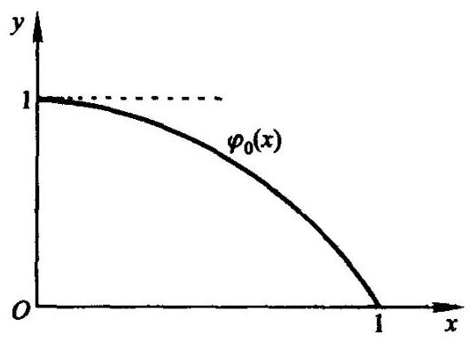

图 1-5

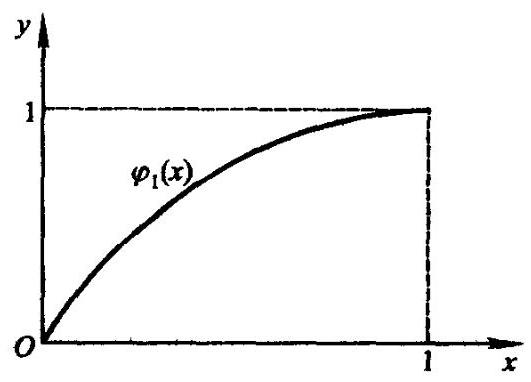

图 1-6

<!-- Media -->

若 ${x}_{0},{x}_{1}$ 是随意给出的两个节点,记 ${x}_{1} - {x}_{0} = h$ ,不难验证,这时问题 5 的解为

$$
{p}_{2}\left( x\right)  = {y}_{0}{\varphi }_{0}\left( \frac{x - {x}_{0}}{h}\right)  + {y}_{1}{\varphi }_{1}\left( \frac{x - {x}_{0}}{h}\right)  +
$$

$$
h{y}_{0}^{\prime }{\psi }_{0}\left( \frac{x - {x}_{0}}{h}\right)
$$

<!-- Media -->

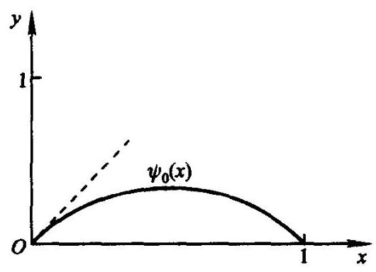

图 1-7

<!-- Media -->

为后面的样条插值作准备, 我们进一步考察下述插值问题.

问题 6 求作三次式 ${p}_{3}\left( x\right)$ ,使满足

$$
{p}_{3}\left( {x}_{0}\right)  = {y}_{0},{p}_{3}^{\prime }\left( {x}_{0}\right)  = {y}_{0}^{\prime }
$$

$$
{p}_{3}\left( {x}_{1}\right)  = {y}_{1},{p}_{3}^{\prime }\left( {x}_{1}\right)  = {y}_{1}^{\prime }
$$

解 仿照问题 5 的解法,记 $h = {x}_{1} - {x}_{0}$ ,而令

$$
{p}_{3}\left( x\right)  = {y}_{0}{\varphi }_{0}\left( \frac{x - {x}_{0}}{h}\right)  + {y}_{1}{\varphi }_{1}\left( \frac{x - {x}_{0}}{h}\right)  + h{y}_{0}^{\prime }{\psi }_{0}\left( \frac{x - {x}_{0}}{h}\right)  +
$$

$$
h{y}_{1}^{\prime }{\psi }_{1}\left( \frac{x - {x}_{0}}{h}\right)  \tag{28}
$$

作为习题, 请读者自行导出其插值基函数, 结果是

$$
{\varphi }_{0}\left( x\right)  = {\left( x - 1\right) }^{2}\left( {{2x} + 1}\right) ,{\varphi }_{1}\left( x\right)  = {x}^{2}\left( {-{2x} + 3}\right)
$$

$$
{\psi }_{0}\left( x\right)  = x{\left( x - 1\right) }^{2},{\psi }_{1}\left( x\right)  = {x}^{2}\left( {x - 1}\right)  \tag{29}
$$

需要指出的是,对于某个取值 $f\left( {x}_{0}\right)  = {y}_{0},{f}^{\prime }\left( {x}_{0}\right)  = {y}_{0}^{\prime },f\left( {x}_{1}\right)  = {y}_{1}$ , ${f}^{\prime }\left( {x}_{1}\right)  = {y}_{1}^{\prime }$ 的函数 $f\left( x\right)$ ,问题 5 和问题 6 的插值余项分别是

$$
f\left( x\right)  - {p}_{2}\left( x\right)  = \frac{{f}^{\prime \prime \prime }\left( {\xi }_{1}\right) }{3!}{\left( x - {x}_{0}\right) }^{2}\left( {x - {x}_{1}}\right)
$$

$$
f\left( x\right)  - {p}_{3}\left( x\right)  = \frac{{f}^{\left( 4\right) }\left( {\xi }_{2}\right) }{4!}{\left( x - {x}_{0}\right) }^{2}{\left( x - {x}_{1}\right) }^{2} \tag{30}
$$

式中 ${\xi }_{1},{\xi }_{2}$ 均包含在由点 ${x}_{0},{x}_{1}$ 和 $x$ 所界定的范围内.

### 1.7 分段插值法

## 1. 高次插值的龙格现象

多项式历来被认为是最好的逼近工具之一. 用多项式作插值函数, 这就是前面已讨论过的代数插值. 对于这类插值, 插值多项式的次数随着节点个数的增加而升高, 然而高次插值的逼近效果往往是不理想的.

例 6 考察函数

$$
f\left( x\right)  = \frac{1}{1 + {x}^{2}},\; - 5 \leq  x \leq  5
$$

设将区间 $\left\lbrack  {-5,5}\right\rbrack$ 分为 $n$ 等分,以 ${p}_{n}\left( x\right)$ 表示取 $n + 1$ 个等分点作节点的插值多项式. 图 1-8 给出了 ${p}_{10}\left( x\right)$ 的图像.

<!-- Media -->

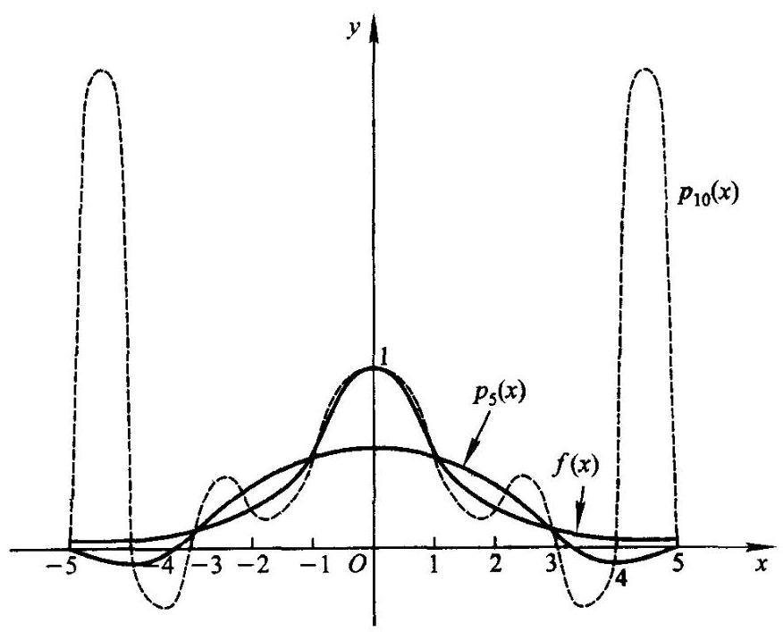

图 1-8

<!-- Media -->

图中看到, 随着节点的加密采用高次插值, 虽然插值函数会在更多的点上与所逼近的函数取相同的值, 但从整体上看, 这样做不一定能改善逼近的效果. 事实上,当 $n$ 增大时,上例的插值函数 ${p}_{n}\left( x\right)$ 在两端会发生激烈的震荡 (见图 1-8), 这就是所谓龙格现象.

龙格现象说明, 在大范围内使用高次插值, 逼近的效果往往是不理想的.

## 2. 分段插值的概念

另一方面, 我们都有这样的体会: 如果插值的范围比较小 (在某个局部), 则运用低次插值往往就能奏效. 譬如,对于上述函数 $f\left( x\right)  = \frac{1}{1 + {x}^{2}}$ (见图 1-8), 如果在每个子段上用线性插值, 就是说, 用联结相邻节点的折线逼近所考察的曲线, 就能保证一定的逼近效果. 这种化整为零的处理方法称作分段插值法.

所谓分段插值, 就是将被插值函数逐段多项式化. 分段插值方法的处理过程分两步,先将所考察的区间 $\left\lbrack  {a,b}\right\rbrack$ 作一分划

$$
\Delta  : a = {x}_{0} < {x}_{1} < \cdots  < {x}_{n} = b
$$

并在每个子段 $\left\lbrack  {{x}_{t},{x}_{t + 1}}\right\rbrack$ 上构造插值多项式,然后将每个子段上的插值多项式装配(拼接)在一起,作为整个区间 $\left\lbrack  {a,b}\right\rbrack$ 上的插值函数. 这样构造出的插值函数是分段多项式.

如果函数 ${S}_{k}\left( x\right)$ 在分划 $\Delta$ 的每个子段 $\left\lbrack  {{x}_{i},{x}_{i + 1}}\right\rbrack$ 上都是 $k$ 次式 ${}^{ \oplus  }$ ,则称 ${S}_{k}\left( x\right)$ 为具有分划 $\Delta$ 的分段 $k$ 次式. 点 ${x}_{i}\left( {i = 0,1,\cdots ,n}\right)$ 称作 ${S}_{k}\left( x\right)$ 的节点.

可见, 所谓分段插值, 就是选取分段多项式作为插值函数,

## 3. 分段线性插值

假设在分划 $\Delta$ 的每个节点 ${x}_{i}$ 上给出了数据 ${y}_{i}$ ,或者说,设已给出了一组数据点 $\left( {{x}_{i},{y}_{i}}\right) ,i = 0,1,\cdots ,n$ ,联结相邻两点得一折线,那么,该折线函数可以看作下述插值问题的解:

问题 7 求作具有分划 $\Delta$ 的分段一次式 ${S}_{1}\left( x\right)$ ,使成立

$$
{S}_{1}\left( {x}_{i}\right)  = {y}_{i},\;i = 0,1,\cdots ,n
$$

解 由于每个子段 $\left\lbrack  {{x}_{i},{x}_{i + 1}}\right\rbrack$ 上 ${S}_{1}\left( x\right)$ 都是一次式,且成立 ${S}_{1}\left( {x}_{i}\right)  = {y}_{i}$ , ${S}_{1}\left( {x}_{i + 1}\right)  = {y}_{i + 1}$ ,故

$$
{S}_{1}\left( x\right)  = {\varphi }_{0}\left( \frac{x - {x}_{1}}{{h}_{1}}\right) {y}_{1} + {\varphi }_{1}\left( \frac{x - {x}_{1}}{{h}_{1}}\right) {y}_{1 + 1},\;{x}_{1} \leq  x \leq  {x}_{1 + 1}
$$

式中 ${h}_{l} = {x}_{l + 1} - {x}_{l}$ ,而

$$
{\varphi }_{0}\left( x\right)  = 1 - x,{\varphi }_{1}\left( x\right)  = x
$$

再考察插值余项. 对于取值 $f\left( {x}_{i}\right)  = {y}_{i}\left( {i = 0,1,\cdots ,n}\right)$ 的被插值函数 $f\left( x\right)$ ,在子段 $\left\lbrack  {{x}_{i},{x}_{i + 1}}\right\rbrack$ 上有误差估计式

$$
\left| {f\left( x\right)  - {S}_{1}\left( x\right) }\right|  \leq  \frac{{h}_{1}^{2}}{8}\mathop{\max }\limits_{{{x}_{1} \leq  x \leq  {x}_{i + 1}}}\left| {{f}^{\prime \prime }\left( x\right) }\right|
$$

因此有下述论断:

定理 5 设 $f\left( x\right)  \in  {\mathrm{C}}^{2}\left\lbrack  {a,b}\right\rbrack  ,f\left( {x}_{1}\right)  = {y}_{1}\left( {i = 0,1,\cdots ,n}\right)$ 已给,则当 $x \in$ $\left\lbrack  {a,b}\right\rbrack$ 时,对于问题 7 的解 ${S}_{1}\left( x\right)$ 成立

$$
\left| {f\left( x\right)  - {S}_{1}\left( x\right) }\right|  \leq  \frac{{h}^{2}}{8}\mathop{\max }\limits_{{a \leq  x \leq  b}}\left| {{f}^{\prime \prime }\left( x\right) }\right|
$$

---

<!-- Footnote -->

① 同前面一样,这里所说的 “ $k$ 次式”,意指次数 $\leq  k$ 的多项式.

<!-- Footnote -->

---

式中 $h = \max {h}_{i}$ . 由此得知, ${S}_{1}\left( x\right)$ 在 $\left\lbrack  {a,b}\right\rbrack$ 上一致收敛到 $f\left( x\right)$ .

## 4. 分段三次插值

分段线性插值的算法简单, 且计算量小, 但精度不高, 插值曲线也不光滑. 下面将提高插值次数以进一步改善逼近效果.

在讨论下述分段三次埃尔米特插值时,假定在每个节点 ${x}_{t}$ 上给出了函数值 ${y}_{i}$ 和导数值 ${y}_{i}^{\prime }$ .

问题 8 求作具有分划 $\Delta$ 的分段三次式 ${S}_{3}\left( x\right)$ ,使成立

$$
{S}_{3}\left( {x}_{i}\right)  = {y}_{\imath },{S}^{\prime }{}_{3}\left( {x}_{i}\right)  = {y}_{\imath }^{\prime },\;i = 0,1,\cdots ,n
$$

解 注意到每个子段 $\left\lbrack  {{x}_{i},{x}_{i + 1}}\right\rbrack$ 上 ${S}_{3}\left( x\right)$ 都是三次式,且成立 ${S}_{3}\left( {x}_{i}\right)  = {y}_{i}$ , ${S}_{3}^{\prime }\left( {x}_{i}\right)  = {y}_{i}^{\prime },{S}_{3}\left( {x}_{i + 1}\right)  = {y}_{i + 1},{S}_{3}^{\prime }\left( {x}_{i + 1}\right)  = {y}_{i + 1}^{\prime }$ ,据上一节的式 (28) 知

$$
{S}_{3}\left( x\right)  = {\varphi }_{0}\left( \frac{x - {x}_{i}}{{h}_{i}}\right) {y}_{i} + {\varphi }_{1}\left( \frac{x - {x}_{i}}{{h}_{i}}\right) {y}_{i + 1} + {h}_{i}{\psi }_{0}\left( \frac{x - {x}_{i}}{{h}_{i}}\right) {y}_{i}^{\prime } +
$$

$$
{h}_{i}{\psi }_{1}\left( \frac{x - {x}_{i}}{{h}_{i}}\right) {y}_{i + 1}^{\prime } \tag{31}
$$

式中 ${x}_{i} \leq  x \leq  {x}_{i + 1}$ ,而按式 (29)

$$
{\varphi }_{0}\left( x\right)  = {\left( x - 1\right) }^{2}\left( {{2x} + 1}\right) ,{\varphi }_{1}\left( x\right)  = {x}^{2}\left( {-{2x} + 3}\right)
$$

$$
{\psi }_{0}\left( x\right)  = x{\left( x - 1\right) }^{2},{\psi }_{1}^{\prime }\left( x\right)  = {x}^{2}\left( {x - 1}\right)  \tag{32}
$$

同分段线性插值比较, 分段三次埃尔米特插值的逼近效果有明显的改善. 不难证明如下定理:

定理 6 设 $f\left( x\right)  \in  {\mathrm{C}}^{4}\left\lbrack  {a,b}\right\rbrack$ ,且 $f\left( {x}_{i}\right)  = {y}_{i},{f}^{\prime }\left( {x}_{i}\right)  = {y}_{i}^{\prime }\left( {i = 0,1,\cdots ,n}\right)$ 已给,则当 $x \in  \left\lbrack  {a,b}\right\rbrack$ 时对于问题 8 的解 ${S}_{3}\left( x\right)$ 成立

$$
\left| {f\left( x\right)  - {S}_{3}\left( x\right) }\right|  \leq  \frac{{h}^{4}}{384}\mathop{\max }\limits_{{a \leq  x \leq  b}}\left| {{f}^{\left( 4\right) }\left( x\right) }\right|
$$

最后概括一下分段插值法的利弊.

分段插值法是一种显式算法, 其算法简单, 收敛性能得到保证. 只要节点间距充分小, 分段插值法总能获得所要求的精度, 而不会像高次插值那样发生龙格现象.

分段插值法的另一个重要特点是它的局部性质. 如果修改某个数据, 那么插值曲线仅仅在某个局部范围内受到影响, 而代数插值却会影响到整个插值区间.

可以看到, 同分段线性插值相比较, 分段三次埃尔米特插值 (问题 8) 虽然改善了精度, 但这种插值要求给出各个节点上的导数值, 所要提供的信息 “太多”, 同时它的光滑性也不高 (只有连续的一阶导数) 改进这种插值以克服其缺点, 这就导致了所谓三次样条插值的提出

### 1.8 样条 函 数

从 20 世纪 60 年代初开始, 首先由于航空造船等工程设计的需要, 发展了所谓样条函数方法. 今天, 这种方法已成为数值逼近的一个极其重要的分支, 在外形设计乃至计算机辅助设计的许多领域, 样条函数都被认为是一种有效的数学工具.

## 1. 样条函数的概念

所谓样条函数, 从数学上说, 就是按一定光滑性要求 “装配”起来的分段多项式. 具体地说, 称具有分划

$$
\Delta  : a = {x}_{0} < {x}_{1} < \cdots  < {x}_{n} = b
$$

的分段 $k$ 次式 ${S}_{k}\left( x\right)$ 为 $k$ 次样条函数,如果它在每个内节点 ${x}_{1}\left( {1 \leq  l \leq  n - 1}\right)$ 上具有直到 $k - 1$ 阶连续导数 点 ${x}_{1}\left( {1 \leq  l \leq  n - 1}\right)$ 则称作样条函数 ${S}_{k}\left( x\right)$ 的节点.

其实样条函数的概念对于我们并不陌生, 常用的阶梯函数和折线函数分别是简单的零次样条函数和一次样条函数.

上述定义的 $k$ 次样条函数是 $k$ 次多项式的推广. 事实上,如果具有分划 $\Delta$ 的 $k$ 次样条函数 ${S}_{k}\left( x\right)$ 在每个节点 ${x}_{1}\left( {1 \leq  l \leq  n - 1}\right)$ 上具有连续的 $k$ 阶导数,则它便退化为普通的 $k$ 次多项式

今后样条函数常简称为样条,其特点是,它既是充分光滑的 $\left( {{S}_{k}\left( x\right) }\right.$ 直到 $k - 1$ 阶导数均连续),又保留有一定的间断性 $\left( {{S}_{k}\left( x\right) }\right.$ 的 $k$ 阶导数在节点处可能有间断). 光滑性保证了外形曲线的美观, 间断性则使它能转折自如地被灵活运用.

样条函数概念来源于工程设计的实践. 所谓 “样条” (Sphne) 是工程设计中的一种绘图工具, 它是富有弹性的细长条. 绘图时, 绘图员用压铁迫使样条通过指定的型值点, 并且调整样条使其具有光滑的外形, 这种外形曲线可以看作是作为弹性细梁的样条在压铁的集中载荷作用下产生的挠度曲线? 在挠度不大的情况下, 它恰好表示为上述定义的三次样条函数, 而压铁的作用点就是样条函数的节点.

## 2. 三次样条插值

样条插值其实是一种改进的分段插值. 特别地, 由于折线函数就是一次样条, 因此就一次插值而言, 样条插值和分段插值是一回事.

下面主要研究三次样条插值. 为了正确地提出问题, 首先分析三次样条所具有的自由度.

对于具有分划 $\Delta  : a = {x}_{0} &lt; {x}_{1} &lt;  \cdot   &lt; {x}_{n} = b$ 的三次样条函数 ${S}_{3}\left( x\right)$ ,由于它在每个子段上都是三次式,总计有 ${4n}$ 个待定参数 这样,为要保证它在每个节点处连续且有连续的一阶和二阶导数,必须附加 $3\left( {n - 1}\right)$ 个光滑性约束条件,即对 $i = 1,2,\cdots ,n - 1$ 成立

$$
{S}_{3}\left( {{x}_{1} - 0}\right)  = {S}_{3}\left( {{x}_{1} + 0}\right)
$$

$$
{S}_{3}^{\prime }\left( {{x}_{i} - 0}\right)  = {S}_{3}^{\prime }\left( {{x}_{i} + 0}\right)
$$

$$
{S}_{3}^{\prime \prime }\left( {{x}_{i} - 0}\right)  = {S}_{3}^{\prime \prime }\left( {{x}_{i} + 0}\right)
$$

因而 ${S}_{3}\left( x\right)$ 的自由度为 ${4n} - 3\left( {n - 1}\right)  = n + 3$ 就是说,为了具体确定三次样条函数 ${S}_{3}\left( x\right)$ ,必须再补充给出 $n + 3$ 个条件

下面具体研究三次样条插值问题

问题 9 求作具有分划 $\Delta$ 的三次样条 ${S}_{3}\left( x\right)$ ,使满足

$$
{S}_{3}\left( {x}_{\imath }\right)  = {y}_{\imath },\;\imath  = 0,1,\;,n \tag{33}
$$

$$
{S}_{3}^{\prime }\left( {x}_{0}\right)  = {y}_{0}^{\prime },\;{S}_{3}^{\prime }\left( {x}_{n}\right)  = {y}_{n}^{\prime } \tag{34}
$$

样条函数的构造用待定系数法 问题在于参数的选择

注意到三次样条插值 (问题 9) 可以看作是一种特殊的分段三次插值 (参看问题 8),自然选取节点上的导数值 ${S}_{3}^{\prime }\left( {x}_{i}\right)  = {m}_{i}$ 作为参数,这样,按式 (31) 有

$$
{S}_{3}\left( x\right)  = {\varphi }_{0}\left( \frac{x - {x}_{1}}{{h}_{1}}\right) {y}_{1} + {\varphi }_{1}\left( \frac{x - {x}_{2}}{{h}_{2}}\right) {y}_{1 + 1} + {h}_{1}{\psi }_{0}\left( \frac{x - {x}_{1}}{{h}_{2}}\right) {m}_{1} +
$$

$$
{h}_{1}{\psi }_{1}\left( \frac{x - {x}_{1}}{{h}_{1}}\right) {m}_{1 + 1} \tag{35}
$$

式中 ${h}_{i} = {x}_{i + 1} - {x}_{i},{x}_{i} \leq  x \leq  {x}_{i + 1}$ ,而

$$
{\varphi }_{0}\left( x\right)  = {\left( x - 1\right) }^{2}\left( {{2x} + 1}\right) ,{\varphi }_{1}\left( x\right)  = {x}_{1}^{2}\left( {-{2x} + 3}\right)
$$

$$
{\psi }_{0}\left( x\right)  = x{\left( x - 1\right) }^{2},{\psi }_{1}\left( x\right)  = {x}^{2}\left( {x - 1}\right)
$$

不管参数 ${m}_{l}$ 怎样取值,这样构造出的 ${S}_{3}\left( x\right)$ 在每个节点 ${x}_{l}(1, \leq  l \leq$ $n - 1)$ 上必定连续且有连续的一阶导数. 现在的问题是,怎样选取参数 ${m}_{1}$ 的值使其二阶导数也连续.

对式(35)求导两次, 易得

$$
{S}_{3}^{\prime \prime }\left( x\right)  = \frac{6}{{h}_{l}^{2}}\left\lbrack  {2\left( \frac{x - {x}_{l}}{{h}_{l}}\right)  - 1}\right\rbrack  {y}_{l} - \frac{6}{{h}_{l}^{2}}\left\lbrack  {2\left( \frac{x - {x}_{l}}{{h}_{l}}\right)  - 1}\right\rbrack  {y}_{l + 1} +
$$

$$
\frac{1}{{h}_{\imath }}\left\lbrack  {6\left( \frac{x - {x}_{\imath }}{{h}_{\imath }}\right)  - 4}\right\rbrack  {m}_{\imath } + \frac{1}{{h}_{\imath }}\left\lbrack  {6\left( \frac{x - {x}_{\imath }}{{h}_{\imath }}\right)  - 2}\right\rbrack  {m}_{\imath  + 1}
$$

因此,在子段 $\left\lbrack  {{x}_{k},{x}_{k + 1}}\right\rbrack$ 的左右两端分别有

$$
{S}_{3}^{\prime \prime }\left( {x}_{l}\right)  = 6\frac{{y}_{l + 1} - {y}_{l}}{{h}_{l}^{2}} - \frac{4{m}_{l} + 2{m}_{l + 1}}{{h}_{l}} \tag{36}
$$

$$
{S}_{3}^{\prime \prime }\left( {x}_{t + 1}\right)  =  - 6\frac{{y}_{t + 1} - {y}_{t}}{{h}_{t}^{2}} + \frac{2{m}_{t} + 4{m}_{t + 1}}{{h}_{t}} \tag{37}
$$

为了保证二阶导数的连续性, 要求成立

$$
{S}_{3}^{\prime \prime }\left( {{x}_{i} - 0}\right)  = {S}_{3}^{\prime \prime }\left( {{x}_{i} + 0}\right) ;\;i = 1,2,\cdots ,n - 1
$$

即式(36)与式(37)应当相容, 因而应有

$$
\frac{{m}_{1 - 1} + 2{m}_{1}}{{h}_{1 - 1}} + \frac{2{m}_{1} + {m}_{1 + 1}}{{h}_{1}} = 3\left( {\frac{{y}_{1} - {y}_{1 - 1}}{{h}_{i - 1}^{2}} + \frac{{y}_{1 + 1} - {y}_{1}}{{h}_{1}^{2}}}\right)  \tag{38}
$$

令

$$
{\alpha }_{l} = \frac{{h}_{l - 1}}{{h}_{i - 1} + {h}_{l}},{\beta }_{l} = 3\left\lbrack  {\left( {1 - {\alpha }_{l}}\right) \frac{{y}_{i} - {y}_{i - 1}}{{h}_{i - 1}} + {\alpha }_{l}\frac{{y}_{l + 1} - {y}_{l}}{{h}_{l}}}\right\rbrack   \tag{39}
$$

则式(38)可表示为

$$
\left( {1 - {\alpha }_{\iota }}\right) {m}_{\iota  - 1} + 2{m}_{\iota } + {\alpha }_{\iota }{m}_{\iota  + 1} = {\beta }_{\iota } \tag{40}
$$

此外, 由条件 (34) 直接给出

$$
{m}_{0} = {y}_{0}^{\prime },\;{m}_{n} = {y}_{n}^{\prime }
$$

据此从式 (40) 中消去 ${m}_{0}$ 和 ${m}_{n}$ ,则可归结出关于参数 ${m}_{1},{m}_{2},\ldots ,{m}_{n - 1}$ 的基本方程组

$$
\begin{cases} 2{m}_{1} + {\alpha }_{1}{m}_{2} &  = {\beta }_{1} + \left( {1 - {\alpha }_{1}}\right) {\gamma }_{0}, \\  \left( {1 - {\alpha }_{2}}\right) {m}_{1} + 2{m}_{2} + {\alpha }_{2}{m}_{3} &  = {\beta }_{2} \\   \cdot  &  \cdot   \cdot   \cdot  \\  \left( {1 - {\alpha }_{n - 2}}\right) {m}_{n - 3} + 2{m}_{n - 2} + {\alpha }_{n - 2}{m}_{n - 1} &  = {\beta }_{n - 2} \\  \left( {1 - {\alpha }_{n - 1}}\right) {\gamma }_{n - 2} + 2{m}_{n - 1} &  = {\beta }_{n - 1}{\gamma }_{n} + {\alpha }_{n - 1}{\gamma }_{n}^{\prime } \end{cases} \tag{41}
$$

<!-- Media -->

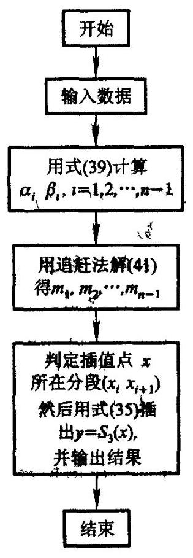

<!-- Media -->

这种形式的方程组, 由于其系数矩阵

$$
\mathbf{A} = \left\lbrack  \begin{matrix} 2 & {\alpha }_{1} & & & & \mathbf{0} \\  1 - {\alpha }_{2} & 2 & {\alpha }_{2} & \ldots & \ldots & \\   &  \ddots  &  \ddots  &  \ddots  & & \\   & & 1 - {\alpha }_{n - 2} & 2 & {\alpha }_{n - 2} & \\  \mathbf{0} & & & 1 - {\alpha }_{n - 1} & 2 &  \end{matrix}\right\rbrack
$$

的非零元素集中在三条对角线上而被称作是三对角型的 求解这类方程组的一种有效方法是追赶法(参看第六章 6 2)

总之, 样条插值的计算过程分两步: 先求解基本方

程组 (41) 确定参数 ${m}_{t}$ ,然后利用表达式 (35) 进行插值 图 1-9 其算法框图如图 1-9 所示

例 7 对于函数 $f\left( x\right)  = \frac{1}{1 + {x}^{2}}$ ,取等距节点 ${x}_{i} =  - 5 + i,i = 0,1,\cdots$ , 10 , 设已给出节点上的函数值以及左右两个端点的一阶导数值, 按上述算法进行样条插值. 计算结果如表 1-2 所示. 我们看到, 样条插值的逼近效果是令人满意的, 它消除了图 1-8 所示的龙格现象....

<!-- Media -->

表 1-2

<table><tr><td>$x$</td><td>$f\left( x\right)$</td><td>${S}_{3}\left( x\right)$</td><td>$x$</td><td>$f\left( x\right)$</td><td>${S}_{3}\left( x\right)$</td></tr><tr><td>-5.0</td><td>0.038 46</td><td>0.038 46</td><td>-2.3</td><td>0.158 98</td><td>0.15895</td></tr><tr><td>-4.8</td><td>0.041 60</td><td>0.041 58</td><td>-2.0</td><td>0.200 00</td><td>0.200 00</td></tr><tr><td>-4.5</td><td>0.047 06</td><td>0.047 04</td><td>-1.8</td><td>0.235 85</td><td>0.23587</td></tr><tr><td>-4.3</td><td>0.051 31</td><td>0.051 32</td><td>-1.5</td><td>0.30769</td><td>0.307 65</td></tr><tr><td>-4.0</td><td>0.058 82</td><td>0.058 82</td><td>-1.3</td><td>0.371 75</td><td>0.37174</td></tr><tr><td>-3.8</td><td>0.064 77</td><td>0.064 76</td><td>-1.0</td><td>0.50000</td><td>0.500 00</td></tr><tr><td>-3.5</td><td>0.075 47</td><td>0.075 46</td><td>-0.8</td><td>0.609 76</td><td>0.609 77</td></tr><tr><td>-3.3</td><td>0.084 10</td><td>0.084 16</td><td>-0.5</td><td>0.800 00</td><td>0.800 00</td></tr><tr><td>-3.0</td><td>0.100 00</td><td>0.100 00</td><td>-0.3</td><td>0.917 43</td><td>0.917 49</td></tr><tr><td>-2.8</td><td>0.11312</td><td>0.11316</td><td>0</td><td>1.000 00</td><td>1.000 00</td></tr><tr><td>-25</td><td>0 137 93</td><td>0 13791</td><td/><td/><td/></tr></table>

<!-- Media -->

### 1.9 曲线拟合的最小二乘法

在实际问题中, 常常需要从一组观察数据

$$
\left( {{x}_{1},{y}_{1}}\right) ,\;l = 1,2,\cdots ,N
$$

去预测函数 $y = f\left( x\right)$ 的表达式. 从几何角度来说,这个问题就是要由给定的一组数据点 $\left( {{x}_{1},{y}_{1}}\right)$ 去描绘曲线 $y = f\left( x\right)$ 的近似图像 前述插值方法是处理这类问题的一种数值方法 不过, 由于插值曲线要求严格通过所给的每一个数据点, 这种限制会保留所给数据的误差. 如果个别数据的误差很大, 那么插值效果显然是不理想的

现在面对的问题具有这样的特点: 所给数据本身不一定可靠, 个别数据的误差甚至可能很大, 但给出的数据很多 曲线拟合方法所要研究的课题是: 从给出的一大堆看上去杂乱无章的数据中找出规律性来, 就是说, 设法构造一条曲线——所谓拟合曲线——反映所给数据点总的趋势,以消除所绘数据的局部波动

## 1. 直线拟合

假设所给数据点 $\left( {{x}_{1},{y}_{1}}\right) \left( {1 = 1,2,\cdots ,N}\right)$ 的分布大致成一直线. 虽然我们要能要求所作的拟合直线

$$
y = a + {bx}
$$

严格地通过所有的数据点 $\left( {{x}_{i},{y}_{i}}\right)$ ,但总希望它尽可能地从所给数据点附近通过, 就是说, 要求近似地成立

$$
{y}_{i} \approx  a + b{x}_{i},\;i = 1,2,\cdots ,N
$$

这里,数据点的数目通常远远大于待定系数的数目,即 $N \gg  2$ ,因此,拟合直线的构造, 本质上是个解超定 (矛盾) 方程组的代数问题.

设

$$
{\widehat{y}}_{1} = a + b{x}_{1},\;i = 1,2,\cdots ,N
$$

表示按拟合直线 $y = a + {bx}$ 求得的近似值,一般地,它不同于实测值 ${y}_{i}$ ,两者之差

$$
{e}_{2} = {y}_{1} - {\widehat{y}}_{2}
$$

称为残差. 显然, 残差的大小是衡量拟合好坏的重要标志. 具体地说, 构造拟合曲线可以采用下列三种准则之一:

(1)使残差的最大绝对值为最小：

$$
\mathop{\max }\limits_{i}\left| {e}_{i}\right|  = \min
$$

(2)使残差的绝对值之和为最小：

$$
\mathop{\sum }\limits_{i}\left| {e}_{i}\right|  = \min
$$

(3)使残差的平方和为最小：

$$
\mathop{\sum }\limits_{i}{e}_{i}^{2} = \min
$$

分析以上三种准则, (1)和 (2) 两种提法比较自然, 但由于含有绝对值运算不便于实际应用; 基于准则 (3) 来选取拟合曲线的方法则称作曲线拟合的最小二乘法.

确定了这种准则, 直线拟合问题可用数学语言描述如下.

问题 10 对于给定的数据点 $\left( {{x}_{i},{y}_{i}}\right) \left( {i = 1,2,\cdots ,N}\right)$ 求作一次式 $y = a + {bx}$ , 使总误差

$$
Q = \mathop{\sum }\limits_{{i = 1}}^{N}{\left\lbrack  {y}_{i} - \left( a + b{x}_{i}\right) \right\rbrack  }^{2}
$$

为最小.

这个问题是不难求解的. 由微积分中求极值的方法知,使 $Q$ 达到极值的参数 $a,b$ 应满足

$$
\frac{\partial Q}{\partial a} = 0,\frac{\partial Q}{\partial b} = 0
$$

即成立

$$
\left\{  \begin{array}{l} {aN} + b\sum {x}_{i} = \sum {y}_{i} \\  a\sum {x}_{i} + b\sum {x}_{i}^{2} = \sum {x}_{i}{y}_{i} \end{array}\right.  \tag{42}
$$

式中 $\sum$ 表示关于下标 $i$ 从 1 到 $N$ 求和.

例 8 炼钢是个氧化脱碳的过程, 钢液含碳量的多少直接影响冶炼时间的长短. 表 1-3 是某平炉的生产记录,表中 $i$ 为实验次数, ${x}_{i}$ 为全部炉料熔化完毕时钢液的含碳量, ${y}_{t}$ 为熔毕至出钢所需的冶炼时间 (以分为单位).

<!-- Media -->

表 1-3

<table><tr><td>$i$</td><td>1</td><td>2</td><td>3</td><td>4</td><td>5</td></tr><tr><td>${x}_{i}$</td><td>165</td><td>123</td><td>150</td><td>123</td><td>141</td></tr><tr><td>${y}_{i}$</td><td>187</td><td>126</td><td>172</td><td>125</td><td>148</td></tr></table>

<!-- Media -->

把表 1-3 中所给数据画在坐标纸上, 将会看到, 数据点的分布可以用一条直线来近似描述. 设所求的拟合直线为 $y = a + {bx}$ ,则方程组 (42) 的具体形式是

$$
\left\{  \begin{array}{l} {5a} + {702b} = {758} \\  {702a} + {99864b} = {108396} \end{array}\right.
$$

解出 $a,b$ ,即得拟合直线 $y =  - {60.9392} + {1.5138x}$ .

## 2. 多项式拟合

有时所给数据点用直线拟合并不合适, 这时可考虑用多项式拟合.

问题 11 对于给定的一组数据 $\left( {{x}_{i},{y}_{i}}\right) \left( {i = 1,2,\cdots ,N}\right)$ ,求作 $m\left( {m \ll  N}\right)$ 饮多项式

$$
y = \mathop{\sum }\limits_{{j = 0}}^{m}{a}_{j}{x}^{j}
$$

使总误差

$$
Q = \mathop{\sum }\limits_{{i = 1}}^{N}{\left( {y}_{i} - \mathop{\sum }\limits_{{j = 0}}^{m}{a}_{j}{x}_{i}^{j}\right) }^{2}
$$

为最小.

由于 $Q$ 可以看作是关于 ${a}_{j}\left( {j = 0,1,\cdots ,m}\right)$ 的多元函数,故上述拟合多项式的构造问题可归结为多元函数的极值问题. 令

$$
\frac{\partial Q}{\partial {a}_{k}} = 0,\;k = 0,1,\cdots ,m
$$

得

$$
\mathop{\sum }\limits_{{i = 1}}^{N}\left( {{y}_{i} - \mathop{\sum }\limits_{{j = 0}}^{m}{a}_{j}{x}_{i}^{j}}\right) {x}_{i}^{k} = 0,\;k = 0,1,\cdots ,m
$$

即有

$$
\left\{  \begin{array}{l} {a}_{0}N + {a}_{1}\sum {x}_{1} + \cdots  + {a}_{m}\sum {x}_{1}^{m} = \sum {y}_{1} \\  {a}_{0}\sum {x}_{2} + {a}_{1}\sum {x}_{2}^{2} + \cdots  + {a}_{m}\sum {x}_{n}^{m + 1} = \sum {x}_{1}{y}_{1} \\  \cdots \\  {a}_{0}\sum {x}_{1}^{m} + {a}_{1}\sum {x}_{2}^{m + 1} + \cdots  + {a}_{m}\sum {x}_{1}^{2m} = \sum {x}_{1}^{m}{y}_{1} \end{array}\right.  \tag{43}
$$

这个关于系数 ${a}_{j}$ 的线性方程组通常称为正则方程组.

定理 7 正则方程组 (43) 有唯一解.

证 用反证法. 若不然, 则对应的齐次方程组

$$
\mathop{\sum }\limits_{{j = 0}}^{m}{a}_{j}\mathop{\sum }\limits_{{i = 1}}^{N}{x}_{i}^{k + j} = 0,\;k = 0,1,\cdots ,m
$$

有非零解, 从而有

$$
0 = \mathop{\sum }\limits_{{k = 0}}^{m}{a}_{k}\left( {\mathop{\sum }\limits_{{j = 0}}^{m}{a}_{j}\mathop{\sum }\limits_{{i = 1}}^{N}{x}_{i}^{k + j}}\right)  = \mathop{\sum }\limits_{{i = 1}}^{N}\mathop{\sum }\limits_{{j = 0}}^{m}\mathop{\sum }\limits_{{k = 0}}^{m}{a}_{k}{a}_{j}{x}_{i}^{k + j}
$$

$$
= \mathop{\sum }\limits_{{i = 1}}^{N}\left( {\mathop{\sum }\limits_{{j = 0}}^{m}{a}_{j}{x}_{i}^{j}}\right) \left( {\mathop{\sum }\limits_{{k = 0}}^{m}{a}_{k}{x}_{i}^{k}}\right)  = \mathop{\sum }\limits_{{i = 1}}^{N}{\left( \mathop{\sum }\limits_{{j = 0}}^{m}{a}_{j}{x}_{i}^{j}\right) }^{2}
$$

因此有 $\mathop{\sum }\limits_{{j = 0}}^{m}{a}_{j}{x}_{i}^{j} = 0\left( {i = 1,2,\cdots ,N}\right)$ ,即拟合多项式有 $N$ 个零点 ${x}_{i}(i = 1,2$ , $\cdots ,N)$ . 当 $N &gt; m$ 时,由代数学基本定理知必有 $\mathop{\sum }\limits_{{j = 0}}^{m}{a}_{j}{x}^{j} \equiv  0$ ,从而 ${a}_{j} = 0$ $\left( {j = 0,1,\cdots ,m}\right)$ . 这就导出了矛盾. 定理得证.

定理 8 设 ${a}_{j}\left( {j = 0,1,\cdots ,m}\right)$ 为正则方程组 (43) 的解,则 $y = \mathop{\sum }\limits_{{j = 0}}^{m}{a}_{j}{x}^{j}$ 必为问题 11 的解.

证 对于任意一组值 ${b}_{j}\left( {j = 0,1,\cdots ,m}\right)$ 有

$$
\mathop{\sum }\limits_{{i = 1}}^{N}{\left( {y}_{i} - \mathop{\sum }\limits_{{j = 0}}^{m}{b}_{j}{x}_{i}^{j}\right) }^{2} - \mathop{\sum }\limits_{{i = 1}}^{N}{\left( {y}_{i} - \mathop{\sum }\limits_{{j = 0}}^{m}{a}_{j}{x}_{i}^{j}\right) }^{2}
$$

$$
= \mathop{\sum }\limits_{{i = 1}}^{N}{\left( {y}_{i} - \mathop{\sum }\limits_{{j = 0}}^{m}{a}_{j}{x}_{i}^{j} + \mathop{\sum }\limits_{{j = 0}}^{m}{a}_{j}{x}_{i}^{j} - \mathop{\sum }\limits_{{j = 0}}^{m}{b}_{j}{x}_{i}^{j}\right) }^{2} -
$$

$$
\mathop{\sum }\limits_{{i = 1}}^{N}{\left( {y}_{i} - \mathop{\sum }\limits_{{j = 0}}^{m}{a}_{j}{x}_{i}^{j}\right) }^{2} \geq
$$

$$
2\mathop{\sum }\limits_{{i = 1}}^{N}\left( {{y}_{i} - \mathop{\sum }\limits_{{j = 0}}^{m}{a}_{j}{x}_{i}^{j}}\right) \mathop{\sum }\limits_{{k = 0}}^{m}\left( {{a}_{k} - {b}_{k}}\right) {x}_{i}^{k}
$$

$$
= 2\mathop{\sum }\limits_{{k = 0}}^{m}\left( {{a}_{k} - {b}_{k}}\right) \left\lbrack  {\mathop{\sum }\limits_{{i = 1}}^{N}\left( {{y}_{i} - \mathop{\sum }\limits_{{j = 0}}^{m}{a}_{j}{x}_{i}^{j}}\right) {x}_{i}^{k}}\right\rbrack
$$

利用正则方程组 (43) 知, 上式方括弧内的值为 0 , 因而有

$$
\mathop{\sum }\limits_{{i = 1}}^{N}{\left( {y}_{i} - \mathop{\sum }\limits_{{j = 0}}^{m}{a}_{j}{x}_{i}^{j}\right) }^{2} \leq  \mathop{\sum }\limits_{{i = 1}}^{N}{\left( {y}_{i} - \mathop{\sum }\limits_{{j = 0}}^{m}{b}_{j}{x}_{i}^{j}\right) }^{2}
$$

定理 8 证毕.

利用正则方程组 (43) 求解曲线拟合问题是一个古老的方法. 应当指出, 实际计算表明,当 $m$ 较大时,正则方程组 (43) 往往是病态的,其解法有待进一步研究.

## 3. 观察数据的修匀

提高拟合多项式的次数不一定能改善逼近效果, 实际计算时常用不同的低次多项式去拟合不同的分段, 这种方法称为分段拟合.

下面将要介绍的数据修匀技术正是在分段拟合的背景下提出来的.

设已给一批实测数据 $\left( {{x}_{i},{y}_{i}}\right) \left( {i = 1,2,\cdots ,N}\right)$ ,由于测量方法和实验环境的影响, 不可避免地会产生随机干扰和误差. 我们自然希望根据数据分布的总趋势去剔除观察数据中的偶然误差, 这就是所谓数据修匀 (或称数据平滑) 问题.

考察相邻的 5 个节点

$$
{x}_{-2} < {x}_{-1} < {x}_{0} < {x}_{1} < {x}_{2}
$$

假设它们是等距的,记节点间距为 $h$ ,作变换 $t = \left( {x - {x}_{0}}\right) /h$ ,即 $x = {x}_{0} + {ht}$ , 则有 ${t}_{i} = \left( {{x}_{i} - {x}_{0}}\right) /h = i\left( {i =  - 2, - 1,0,1,2}\right)$ . 这样就可以对变量 $t$ 进行讨论. 这时所给数据见表 1-4 .

<!-- Media -->

表 1-4

<table><tr><td>${t}_{1}$</td><td>-2</td><td>-1</td><td>0</td><td>1</td><td>2</td></tr><tr><td>${y}_{i}$</td><td>$y - 2$</td><td>$y - 1$</td><td>${y}_{0}$</td><td>${y}_{1}$</td><td>${y}_{2}$</td></tr></table>

<!-- Media -->

设用二项式作拟合

$$
y = a + {bt} + c{t}^{2}
$$

则其正则方程组为

$$
\begin{cases} {5a} + {10c} &  = \mathop{\sum }\limits_{{i =  - 2}}^{2}{y}_{i} \\  {10b} &  = \mathop{\sum }\limits_{{i =  - 2}}^{2}i{y}_{i} \\  {10a} + {34c} &  = \mathop{\sum }\limits_{{i = 0}}^{2}{i}^{2}{y}_{i} \end{cases}
$$

解出 $a,b,c$ ,即可导出在节点 $x = 0$ 的五点二次修匀公式

$$
{\widehat{y}}_{0} = \frac{1}{35}\left( {-3{y}_{-2} + {12}{y}_{-1} + {17}{y}_{0} + {12}{y}_{1} - 3{y}_{2}}\right)
$$

## 例题选讲 1.1 拉格朗日插值基函数

题 1 列出函数 $f\left( x\right)  = {x}^{k}\left( {k = 0,1,\cdots ,n}\right)$ 关于互异节点 ${x}_{t}(i = 0,1,\cdots$ , $n)$ 的拉格朗日插值公式.

解 依定理 2,当 $k \leq  n$ 时幂函数 $f\left( x\right)  = {x}^{k}$ 关于 $n + 1$ 个节点 ${x}_{k}(i = 0,1$ , $\cdots ,n)$ 的插值多项式就是它自身,故依拉格朗日公式有

$$
\mathop{\sum }\limits_{{i = 0}}^{n}{x}_{i}^{k}{l}_{i}\left( x\right)  = \mathop{\sum }\limits_{{i = 0}}^{n}\left( {\mathop{\prod }\limits_{{j \neq  i}}\frac{x - {x}_{j}}{{x}_{i} - {x}_{j}}}\right) {x}_{i}^{k} \equiv  {x}^{k},k = 0,1,\cdots ,n
$$

特别地,当 $k = 0$ 时,有

$$
\mathop{\sum }\limits_{{i = 0}}^{n}{l}_{i}\left( x\right)  = \mathop{\sum }\limits_{{i = 0}}^{n}\mathop{\prod }\limits_{{j \neq  i}}\frac{x - {x}_{j}}{{x}_{i} - {x}_{j}} \equiv  1
$$

而当 $k = 1$ 时,则有

$$
\mathop{\sum }\limits_{{i = 0}}^{n}{x}_{i}{l}_{i}\left( x\right)  = \mathop{\sum }\limits_{{i = 0}}^{n}\left( {\mathop{\prod }\limits_{{j \neq  i}}\frac{x - {x}_{j}}{{x}_{i} - {x}_{j}}}\right) {x}_{i} \equiv  x
$$

题 2 证明下列恒等式成立:

(1) $\mathop{\sum }\limits_{{i = 0}}^{n}\mathop{\prod }\limits_{{j \neq  i}}\frac{x - j}{i - j} \equiv  1$ ; (2) $\mathop{\sum }\limits_{{i = 0}}^{n}\mathop{\prod }\limits_{{j \neq  i}}\frac{x - j}{i - j} \cdot  i \equiv  x$

证 据上题令 ${x}_{l} = i$ 即得.

题 3 设 ${l}_{i}\left( x\right) \left( {i = 0,1,\cdots ,n}\right)$ 是以 ${x}_{i}\left( {i = 0,1,\cdots ,n}\right)$ 为节点的拉格朗日插值基函数, 证明

$$
\mathop{\sum }\limits_{{i = 0}}^{n}{\left( {x}_{i} - x\right) }^{k}{l}_{i}\left( x\right)  \equiv  0,\;k = 1,2,\cdots ,n
$$

证 将 ${\left( {x}_{i} - x\right) }^{k}$ 二项式展开,据题 1 有

$$
\mathop{\sum }\limits_{{i = 0}}^{n}{\left( {x}_{i} - x\right) }^{k}{l}_{i}\left( x\right)  = \mathop{\sum }\limits_{{i = 0}}^{n}\left\lbrack  {\mathop{\sum }\limits_{{j = 0}}^{k}\left( \begin{array}{l} k \\  j \end{array}\right) {x}_{i}^{j}{\left( -x\right) }^{k - j}}\right\rbrack  {l}_{i}\left( x\right)
$$

$$
= \mathop{\sum }\limits_{{j = 0}}^{k}{\left( -1\right) }^{k - j}\left( \begin{array}{l} k \\  j \end{array}\right) {x}^{k - j}\left\lbrack  {\mathop{\sum }\limits_{{i = 0}}^{n}{x}_{i}^{j}{l}_{i}\left( x\right) }\right\rbrack
$$

$$
= \mathop{\sum }\limits_{{j = 0}}^{k}{\left( -1\right) }^{k - j}\left( \begin{array}{l} k \\  j \end{array}\right) {x}^{k - j}{x}^{j}
$$

$$
= {x}^{k}\mathop{\sum }\limits_{{j = 0}}^{k}\left( \begin{array}{l} k \\  j \end{array}\right) {\left( -1\right) }^{k - j} = {x}^{k}{\left( 1 - 1\right) }^{k} = 0
$$

题 4 设 ${l}_{i}\left( x\right) \left( {i = 0,1,\cdots ,n}\right)$ 是以 ${x}_{t}\left( {i = 0,1,\cdots ,n}\right)$ 为节点的拉格朗日插值基函数, 证明

$$
\mathop{\sum }\limits_{{i = 0}}^{n}{x}_{i}^{k}{l}_{i}\left( 0\right)  = \left\{  \begin{array}{ll} 1, & k = 0 \\  0, & k = 1,2,\cdots ,n \end{array}\right.
$$

证 据题 1 知

$$
\mathop{\sum }\limits_{{i = 0}}^{n}{l}_{i}\left( x\right)  \equiv  1
$$

令 $x = 0$ 则有

$$
\mathop{\sum }\limits_{{i = 0}}^{n}{l}_{i}\left( 0\right)  = 1
$$

此外, 由题 3 得

$$
\mathop{\sum }\limits_{{i = 0}}^{n}{\left( {x}_{i} - x\right) }^{k}{l}_{i}\left( x\right)  \equiv  0,\;k = 1,2,\cdots ,n
$$

令 $x = 0$ 即有

$$
\mathop{\sum }\limits_{{i = 0}}^{n}{x}_{i}^{k}{l}_{i}\left( 0\right)  = 0
$$

题 5 证明当 $m &gt; n$ 时成立

$$
\mathop{\sum }\limits_{{i = 0}}^{n}{\left( -1\right) }^{n - i}\frac{{C}_{m}^{n}{C}_{n}^{i}}{m - i} = \frac{1}{m - n}
$$

其中

$$
{C}_{m}^{n} = \frac{m!}{n!\left( {m - n}\right) !},{C}_{n}^{i} = \frac{n!}{i!\left( {n - i}\right) !}
$$

证 据题 1 有

$$
\mathop{\sum }\limits_{{i = 0}}^{n}{l}_{i}\left( x\right)  = \mathop{\sum }\limits_{{i = 0}}^{n}\mathop{\prod }\limits_{{j \neq  i}}\frac{x - {x}_{j}}{{x}_{i} - {x}_{j}} \equiv  1
$$

令 ${x}_{j} = j$ ,取 $x = m$ 则有

$$
{l}_{1}\left( m\right)  = \mathop{\sum }\limits_{{i = 0}}^{n}\mathop{\prod }\limits_{{j \neq  i}}\frac{m - j}{i - j} = \frac{m\left( {m - 1}\right) \cdots \left( {m - i + 1}\right) \left( {m - i - 1}\right) \cdots \left( {m - n}\right) }{i\left( {i - 1}\right)  \times  \cdots  \times  1 \times  \left( {-1}\right)  \times  \cdots  \times  \left( {i - n}\right) }
$$

$$
= \frac{m!\left( {m - n}\right) }{\left( {m - n}\right) !\left( {m - i}\right) } \cdot  \frac{1}{i!{\left( -1\right) }^{n - i}\left( {n - i}\right) !}
$$

于是有

$$
1 = \mathop{\sum }\limits_{{i = 0}}^{n}{l}_{i}\left( m\right)  = \left( {m - n}\right) \mathop{\sum }\limits_{{i = 0}}^{n}{\left( -1\right) }^{n - i}\frac{{C}_{m}^{n}{C}_{n}^{i}}{m - i}
$$

题 6 对于给定的二元函数 $f\left( {x,y}\right)$ ,求作二元一次式 $u\left( {x,y}\right)$ ,使在给定点 $\left( {{x}_{1},{y}_{1}}\right) \left( {i = 0,1,2}\right)$ 与 $f\left( {x,y}\right)$ 取相同的函数值,即满足插值条件

$$
u\left( {{x}_{1},{y}_{1}}\right)  = f\left( {{x}_{i},{y}_{i}}\right) ,\;i = 0,1,2
$$

解 用基函数方法. 首先构造二元一次式 ${l}_{0}\left( {x,y}\right)$ 使满足

$$
{l}_{0}\left( {{x}_{0},{y}_{0}}\right)  = 1,{l}_{0}\left( {{x}_{1},{y}_{1}}\right)  = {l}_{0}\left( {{x}_{2},{y}_{2}}\right)  = 0
$$

满足这些特定条件的 ${l}_{0}\left( {x,y}\right)$ 很容易构造出来,结果是

$$
{l}_{0}\left( {x,y}\right)  = \left| \begin{array}{lll} 1 & x & y \\  1 & {x}_{1} & {y}_{1} \\  1 & {x}_{2} & {y}_{2} \end{array}\right| /\left| \begin{array}{lll} 1 & {x}_{0} & {y}_{0} \\  1 & {x}_{1} & {y}_{1} \\  1 & {x}_{2} & {y}_{2} \end{array}\right|
$$

考虑到节点的对称性, 有

$$
{l}_{1}\left( {x,y}\right)  = \left| \begin{array}{lll} 1 & x & y \\  1 & {x}_{2} & {y}_{2} \\  1 & {x}_{0} & {y}_{0} \end{array}\right| /\left| \begin{array}{lll} 1 & {x}_{1} & {y}_{1} \\  1 & {x}_{2} & {y}_{2} \\  1 & {x}_{0} & {y}_{0} \end{array}\right|
$$

$$
{l}_{2}\left( {x,y}\right)  = \left| \begin{array}{lll} 1 & x & y \\  1 & {x}_{0} & {y}_{0} \\  1 & {x}_{1} & {y}_{1} \end{array}\right| /\left| \begin{array}{lll} 1 & {x}_{2} & {y}_{2} \\  1 & {x}_{0} & {y}_{0} \\  1 & {x}_{1} & {y}_{1} \end{array}\right|
$$

因而

$$
u\left( {x,y}\right)  = f\left( {{x}_{0},{y}_{0}}\right) {l}_{0}\left( {x,y}\right)  + f\left( {{x}_{1},{y}_{1}}\right) {l}_{1}\left( {x,y}\right)  + f\left( {{x}_{2},{y}_{2}}\right) {l}_{2}\left( {x,y}\right)
$$

即为所求的二元一次插值多项式.

## 例题选讲 1.2 插 值 余 项

题 1 设 $f\left( x\right)$ 充分光滑, $f\left( a\right)  = f\left( b\right)  = 0$ ,求证

$$
\mathop{\max }\limits_{{a \leq  x \leq  b}}\left| {f\left( x\right) }\right|  \leq  \frac{{\left( b - a\right) }^{2}}{8}\mathop{\max }\limits_{{a \leq  x \leq  b}}\left| {{f}^{\prime \prime }\left( x\right) }\right|
$$

证 显然满足条件 $p\left( a\right)  = p\left( b\right)  = 0$ 的插值多项式 $p\left( x\right)  = 0$ ,按拉格朗日余项定理(定理 3)有

$$
f\left( x\right)  = f\left( x\right)  - p\left( x\right)  = \frac{{f}^{\prime \prime }\left( \xi \right) }{2}\left( {x - a}\right) \left( {x - b}\right)
$$

由于

$$
\mathop{\max }\limits_{{a \leq  x \leq  b}}\left| {\left( {x - a}\right) \left( {x - b}\right) }\right|  = {\left( \frac{b - a}{2}\right) }^{2}
$$

题 1 得证.

题 2 设 $f\left( x\right)  = {x}^{4}$ ,试利用拉格朗日余项定理给出 $f\left( x\right)$ 以-1,0,1,2 为节点的插值多项式 $p\left( x\right)$ .

解 这里 $p\left( x\right)$ 的次数 $\leq  3$ ,注意到当 $f\left( x\right)  = {x}^{4}$ 时 ${f}^{\left( 4\right) }\left( x\right)  = 4!$ ,因此, 这时拉格朗日余项定理具有形式

$$
f\left( x\right)  - p\left( x\right)  = \omega \left( x\right)
$$

$$
\omega \left( x\right)  = \left( {x + 1}\right) x\left( {x - 1}\right) \left( {x - 2}\right)
$$

于是所求插值多项式

$$
p\left( x\right)  = f\left( x\right)  - \omega \left( x\right)
$$

$$
= {x}^{4} - \left( {x + 1}\right) x\left( {x - 1}\right) \left( {x - 2}\right)
$$

$$
= 2{x}^{3} + {x}^{2} - {2x}
$$

题 3 求作 $f\left( x\right)  = {x}^{n + 1}$ 关于节点 ${x}_{0},{x}_{1},\cdots ,{x}_{n}$ 的拉格朗日插值多项式, 并利用插值余项定理证明

$$
\mathop{\sum }\limits_{{i = 0}}^{n}{x}_{i}^{n + 1}{l}_{i}\left( 0\right)  = {\left( -1\right) }^{n}{x}_{0}{x}_{1}\cdots {x}_{n}
$$

式中 ${l}_{1}\left( x\right)$ 为关于节点 ${x}_{0},{x}_{1},\cdots ,{x}_{n}$ 的拉格朗日插值基函数.

解 注意到 $f\left( x\right)  = {x}^{n + 1}$ 关于节点 ${x}_{0},{x}_{1},\cdots ,{x}_{n}$ 的插值多项式

$$
p\left( x\right)  = \mathop{\sum }\limits_{{i = 0}}^{n}{x}_{i}^{n + 1}{l}_{i}\left( x\right)
$$

其插值余项为

$$
{x}^{n + 1} - \mathop{\sum }\limits_{{i = 0}}^{n}{x}_{i}^{n + 1}{l}_{i}\left( x\right)  = \mathop{\prod }\limits_{{j = 0}}^{n}\left( {x - {x}_{j}}\right)
$$

据此令 $x = 0$ 即得.

## 例题选讲 1.3 差商与差分

题 1 设 ${x}_{0},{x}_{1},\cdots ,{x}_{n}$ 及 $x$ 互异,考察 $f\left( x\right)  = \mathop{\prod }\limits_{{i = 0}}^{n}\left( {x - {x}_{i}}\right)$ 的各阶差商, 证明

$$
f\left( {{x}_{0},{x}_{1},\cdots ,{x}_{k}}\right)  = 0,\;k = 0,1,\cdots ,n
$$

$$
f\left( {{x}_{0},{x}_{1},\cdots ,{x}_{n},x}\right)  \equiv  1
$$

证 注意到 $f\left( {x}_{i}\right)  = 0\left( {i = 0,1,\cdots ,n}\right)$ ,按差商展开式 (24)

$$
f\left( {{x}_{0},{x}_{1},\cdots ,{x}_{k}}\right)  = \mathop{\sum }\limits_{{j = 0}}^{k}\frac{f\left( {x}_{j}\right) }{\mathop{\prod }\limits_{\substack{{i = 0} \\  {i \neq  j} }}^{k}\left( {{x}_{j} - {x}_{i}}\right) } = 0,\;k = 0,1,\cdots ,n
$$

而

$$
f\left( {{x}_{0},{x}_{1},\cdots ,{x}_{n},x}\right)  = \mathop{\sum }\limits_{{j = 0}}^{n}\frac{f\left( {x}_{j}\right) }{\mathop{\prod }\limits_{\substack{{i = 0} \\  {i \neq  j} }}^{n}\left( {{x}_{j} - {x}_{i}}\right) \left( {{x}_{j} - x}\right) } + \frac{f\left( x\right) }{\mathop{\prod }\limits_{\substack{{i = 0} \\  {i = 0} }}^{n}\left( {x - {x}_{i}}\right) }
$$

$$
= \frac{\mathop{\prod }\limits_{{i = 0}}^{n}\left( {x - {x}_{i}}\right) }{\mathop{\prod }\limits_{{i = 0}}^{n}\left( {x - {x}_{i}}\right) } \equiv  1
$$

题 2 设 $n,k$ 为整数, $0 \leq  k \leq  n - 1$ ,证明

$$
\mathop{\sum }\limits_{{i = 0}}^{n}\frac{{i}^{k}}{\mathop{\prod }\limits_{\substack{{j = 0} \\  {j \neq  i} }}^{n}\left( {i - j}\right) } = 0
$$

证 原式左端是 $f\left( x\right)  = {x}^{k}$ 关于节点 ${x}_{1} = i\left( {i = 0,1,\cdots ,n}\right)$ 的 $n$ 阶差商 $f\left( {{x}_{0},{x}_{1},\cdots ,{x}_{n}}\right)$ ,利用差商与导数的关系知

$$
f\left( {{x}_{0},{x}_{1},\cdots ,{x}_{n}}\right)  = \frac{{f}^{\left( n\right) }\left( \xi \right) }{n!}
$$

由于当 $k \leq  n - 1$ 时 $f\left( x\right)  = {x}^{k}$ 的 $n$ 阶导数值恒为 0,故命题成立.

题 3 设首项系数为 1 的 $n$ 次式 $f\left( x\right)$ 有 $n$ 个互异的零点 ${x}_{1}(i = 1,2,\cdots$ , $n)$ ,证明

$$
\mathop{\sum }\limits_{{j = 1}}^{n}\frac{{x}_{j}^{k}}{{f}^{\prime }\left( {x}_{j}\right) } = \left\{  \begin{array}{ll} 0, & k = 0,1,\cdots ,n - 2 \\  1, & k = n - 1 \end{array}\right.
$$

证 按题设, $f\left( x\right)$ 有表达式

$$
f\left( x\right)  = \mathop{\prod }\limits_{{i = 1}}^{n}\left( {x - {x}_{i}}\right)
$$

故原式左端

$$
\mathop{\sum }\limits_{{j = 1}}^{n}{f}^{\prime }\frac{{x}_{j}^{k}}{{f}^{\prime }\left( {x}_{j}\right) } = \mathop{\sum }\limits_{{j = 1}}^{n}\frac{{x}_{j}^{k}}{\mathop{\prod }\limits_{\substack{{i = 1} \\  {i \neq  j} }}^{n}\left( {{x}_{j} - {x}_{i}}\right) }
$$

注意到上式右端等于 $g\left( x\right)  = {x}^{k}$ 关于节点 ${x}_{i}\left( {i = 1,2,\cdots ,n}\right)$ 的 $n - 1$ 阶差商 $g\left( {{x}_{1},{x}_{2},\cdots ,{x}_{n}}\right)$ ,利用差商与导数的关系得知

$$
g\left( {{x}_{1},{x}_{2},\cdots ,{x}_{n}}\right)  = \frac{{g}^{\left( n - 1\right) }\left( \xi \right) }{\left( {n - 1}\right) !} = \left\{  \begin{array}{ll} 0, & k = 0,1,\cdots ,n - 2 \\  1, & k = n - 1 \end{array}\right.
$$

题 4 重节点的差商 $f\left( {{x}_{0},{x}_{0}}\right)$ 定义为

$$
f\left( {{x}_{0},{x}_{0}}\right)  = \mathop{\lim }\limits_{{x \rightarrow  {x}_{0}}}f\left( {x,{x}_{0}}\right)
$$

证明

$$
f\left( {{x}_{0},{x}_{0}}\right)  = {f}^{\prime }\left( {x}_{0}\right)
$$

证 依据微分中值定理

$$
f\left( {x,{x}_{0}}\right)  = {f}^{\prime }\left( \xi \right)
$$

其中, $\xi$ 介于 ${x}_{0},x$ 之间,故有

$$
\mathop{\lim }\limits_{{x \rightarrow  {x}_{0}}}f\left( {x,{x}_{0}}\right)  = {f}^{\prime }\left( {x}_{0}\right)
$$

题 5 证明

$$
\mathop{\sum }\limits_{{i = 0}}^{{n - 1}}{\Delta }^{2}{f}_{i} = \Delta {f}_{n} - \Delta {f}_{0}
$$

证 原式左端等于

$$
\mathop{\sum }\limits_{{i = 0}}^{{n - 1}}\left( {\Delta {f}_{i + 1} - \Delta {f}_{i}}\right)  = \left( {\Delta {f}_{n} - \Delta {f}_{n - 1}}\right)  + \left( {\Delta {f}_{n - 1} - \Delta {f}_{n - 2}}\right)  + \cdots  + \left( {\Delta {f}_{1} - \Delta {f}_{0}}\right)
$$

$$
= \Delta {f}_{n} - \Delta {f}_{0}
$$

题 6 定义下列差分运算

$$
\Delta {f}_{k} = {f}_{k + 1} - {f}_{k},\nabla {f}_{k} = {f}_{k} - {f}_{k - 1},\delta {f}_{k} = {f}_{k + \frac{1}{2}} - {f}_{k - \frac{1}{2}}
$$

当 ${f}_{n} = {2}^{n}$ 时求 ${\Delta }^{4}{f}_{n},{\nabla }^{4}{f}_{n}$ 及 ${\delta }^{4}{f}_{n}$ .

解 由于

$$
\Delta {f}_{n} = {f}_{n + 1} - {f}_{n} = {2}^{n + 1} - {2}^{n} = {2}^{n}
$$

故有

$$
{\Delta }^{4}{f}_{n} = {2}^{n}
$$

又

$$
\nabla {f}_{n} = {f}_{n} - {f}_{n - 1} = {2}^{n} - {2}^{n - 1} = {2}^{n - 1}
$$

故有

$$
{\nabla }^{4}{f}_{n} = {2}^{n - 4}
$$

此外

$$
\delta {f}_{n} = {f}_{n + \frac{1}{2}} - {f}_{n - \frac{1}{2}} = {2}^{n + \frac{1}{2}} - {2}^{n - \frac{1}{2}} = {2}^{n - \frac{1}{2}}
$$

故有

$$
{\delta }^{4}{f}_{n} = {2}^{n - 2}
$$

上述符号 $\Delta ,\nabla$ 与 $\delta$ 分别称为向前差分算子、向后差分算子与中心差分算子.

题 7 如果 $f\left( x\right)$ 是 $n$ 次多项式,记 ${\Delta f}\left( x\right)  = f\left( {x + h}\right)  - f\left( x\right)$ ,证明,当 $0 \leq  k \leq  n$ 时 ${\Delta }^{k}f\left( x\right)$ 是 $n - k$ 次多项式,而

$$
{\Delta }^{n + 1}f\left( x\right)  = 0
$$

证 设

$$
f\left( x\right)  = {\alpha }_{0}{x}^{n} + {\alpha }_{1}{x}^{n - 1} + \cdots  + {\alpha }_{n - 1}x + {\alpha }_{n},{\alpha }_{0} \neq  0
$$

考察

$$
f\left( {x + h}\right)  = {\alpha }_{0}{\left( x + h\right) }^{n} + {\alpha }_{1}{\left( x + h\right) }^{n - 1} + \cdots  + {\alpha }_{n - 1}\left( {x + h}\right)  + {\alpha }_{n}
$$

显然 $f\left( {x + h}\right)$ 的首项系数依然是 ${\alpha }_{0}$ ,因而 ${\Delta f}\left( x\right)  = f\left( {x + h}\right)  - f\left( x\right)$ 是个 $n - 1$ 次多项式.

依此类推,当 $0 \leq  k \leq  n$ 时, ${\Delta }^{k}f\left( x\right)$ 是 $n - k$ 次多项式. 特别地, ${\Delta }^{n}f\left( x\right)$ 为常数,因而 ${\Delta }^{n + 1}f\left( x\right)  = 0$ .

题 8 利用差分性质证明:

(1) $1 + 2 + \cdots  + n = \frac{1}{2}n\left( {n + 1}\right)$

(2) ${1}^{3} + {2}^{3} + \cdots  + {n}^{3} = {\left\lbrack  \frac{n\left( {n + 1}\right) }{2}\right\rbrack  }^{2}$

$\left( 3\right) 1 \times  2 + 2 \times  3 + \cdots  + n\left( {n + 1}\right)  = \frac{1}{3}n\left( {n + 1}\right) \left( {n + 2}\right)$

(4) $1 \times  3 + 2 \times  4 + \cdots  + n\left( {n + 2}\right)  = \frac{1}{6}n\left( {n + 1}\right) \left( {{2n} + 7}\right)$

证 这些求和公式的证明方法类同, 均基于下列关系式

$$
\mathop{\sum }\limits_{{k = 1}}^{n}\Delta {f}_{k - 1} = {f}_{n} - {f}_{0}
$$

而为要证明题 (1) (4),只要验证: 若定义其中某个式子右端为 ${f}_{n}$ ,则有 ${f}_{0} = 0$ ,且其左端的第 $k$ 项为 $\Delta {f}_{k - 1}$ .

譬如题 (1),若令 ${f}_{n} = \frac{1}{2}n\left( {n + 1}\right)$ ,则有 ${f}_{0} = 0$ ,而

$$
\Delta {f}_{k - 1} = {f}_{k} - {f}_{k - 1} = \frac{1}{2}k\left( {k + 1}\right)  - \frac{1}{2}\left( {k - 1}\right) k = k
$$

又如题(3), 若令

$$
{f}_{n} = \frac{1}{3}n\left( {n + 1}\right) \left( {n + 2}\right)
$$

则有 ${f}_{0} = 0$ ,而

$$
\Delta {f}_{k - 1} = \frac{1}{3}k\left( {k + 1}\right) \left( {k + 2}\right)  - \frac{1}{3}\left( {k - 1}\right) k\left( {k + 1}\right)  = k\left( {k + 1}\right)
$$

## 例题选讲 1.4 牛顿插值公式

题 1 证明拉格朗日插值基函数

$$
{l}_{0}\left( x\right)  = \frac{\left( {x - {x}_{1}}\right) \left( {x - {x}_{2}}\right) \cdots \left( {x - {x}_{n}}\right) }{\left( {{x}_{0} - {x}_{1}}\right) \left( {{x}_{0} - {x}_{2}}\right) \cdots \left( {{x}_{0} - {x}_{n}}\right) }
$$

可表为如下牛顿形式:

$$
{l}_{0}\left( x\right)  = 1 + \frac{x - {x}_{0}}{{x}_{0} - {x}_{1}} + \frac{\left( {x - {x}_{0}}\right) \left( {x - {x}_{1}}\right) }{\left( {{x}_{0} - {x}_{1}}\right) \left( {{x}_{0} - {x}_{2}}\right) } + \cdots  + \frac{\left( {x - {x}_{0}}\right) \left( {x - {x}_{1}}\right) \cdots \left( {x - {x}_{n - 1}}\right) }{\left( {{x}_{0} - {x}_{1}}\right) \left( {{x}_{0} - {x}_{2}}\right) \cdots \left( {{x}_{0} - {x}_{n}}\right) }
$$

证 考察 ${l}_{0}\left( x\right)$ 的牛顿插值公式

$$
{l}_{0}\left( x\right)  = {l}_{0}\left( {x}_{0}\right)  + {l}_{0}\left( {{x}_{0},{x}_{1}}\right) \left( {x - {x}_{0}}\right)  + {l}_{0}\left( {{x}_{0},{x}_{1},{x}_{2}}\right) \left( {x - {x}_{0}}\right) \left( {x - {x}_{1}}\right)  +
$$

$$
\cdots  + {l}_{0}\left( {{x}_{0},{x}_{1},\cdots ,{x}_{n}}\right) \left( {x - {x}_{0}}\right) \left( {x - {x}_{1}}\right) \cdots \left( {x - {x}_{n - 1}}\right)
$$

注意到 ${l}_{0}\left( {x}_{0}\right)  = 1$ ,而对 $i = 1,2,\cdots ,n$ 有 ${l}_{0}\left( {x}_{1}\right)  = 0$ ,计算 ${l}_{0}\left( x\right)$ 的各阶差商

$$
{l}_{0}\left( {x}_{0}\right)  = 1
$$

$$
{l}_{0}\left( {{x}_{0},{x}_{1}}\right)  = \frac{{l}_{0}\left( {x}_{1}\right)  - {l}_{0}\left( {x}_{0}\right) }{{x}_{1} - {x}_{0}} = \frac{1}{{x}_{0} - {x}_{1}}
$$

一般地, 按差商展开式

$$
{l}_{0}\left( {{x}_{0},{x}_{1},\cdots ,{x}_{k}}\right)  = \mathop{\sum }\limits_{{l = 0}}^{k}\frac{{l}_{0}\left( {x}_{l}\right) }{\mathop{\prod }\limits_{\substack{{j = 0} \\  {j \neq  l} }}^{n}\left( {{x}_{l} - {x}_{j}}\right) } = \frac{1}{\mathop{\prod }\limits_{{i = 1}}^{k}\left( {{x}_{0} - {x}_{i}}\right) }
$$

题 2 设节点 ${x}_{i}\left( {i = 0,1,\cdots ,n}\right)$ 与点 $\alpha$ 互异,试对 $f\left( x\right)  = \frac{1}{\alpha  - x}$ 证明

$$
f\left( {{x}_{0},{x}_{1},\cdots ,{x}_{k}}\right)  = \mathop{\prod }\limits_{{i = 0}}^{k}\frac{1}{\alpha  - {x}_{i}},\;k = 0,1,\cdots ,n
$$

并列出 $f\left( x\right)$ 的牛顿插值多项式.

解 依差商的定义

$$
f\left( {x}_{0}\right)  = \frac{1}{\alpha  - {x}_{0}}
$$

$$
f\left( {{x}_{0},{x}_{1}}\right)  = \frac{f\left( {x}_{1}\right)  - f\left( {x}_{0}\right) }{{x}_{1} - {x}_{0}}
$$

$$
= \frac{1}{{x}_{1} - {x}_{0}}\left( {\frac{1}{\alpha  - {x}_{1}} - \frac{1}{\alpha  - {x}_{0}}}\right)
$$

$$
= \frac{1}{\left( {\alpha  - {x}_{0}}\right) \left( {\alpha  - {x}_{1}}\right) }
$$

用数学归纳法, 设

$$
f\left( {{x}_{0},{x}_{1},\cdots ,{x}_{k}}\right)  = \mathop{\prod }\limits_{{i = 0}}^{k}\frac{1}{\alpha  - {x}_{i}}
$$

则有

$$
f\left( {{x}_{0},{x}_{1},\cdots ,{x}_{k + 1}}\right)  = \frac{f\left( {{x}_{1},{x}_{2},\cdots ,{x}_{k + 1}}\right)  - f\left( {{x}_{0},{x}_{1},\cdots ,{x}_{k}}\right) }{{x}_{k + 1} - {x}_{0}}
$$

$$
= \frac{1}{{x}_{k + 1} - {x}_{0}}\left( {\mathop{\prod }\limits_{{i = 1}}^{{k + 1}}\frac{1}{\alpha  - {x}_{i}} - \mathop{\prod }\limits_{{i = 0}}^{k}\frac{1}{\alpha  - {x}_{i}}}\right)
$$

$$
= \mathop{\prod }\limits_{{i = 1}}^{k}\frac{1}{\alpha  - {x}_{i}} \cdot  \frac{1}{{x}_{k + 1} - {x}_{0}}\left( {\frac{1}{\alpha  - {x}_{k + 1}} - \frac{1}{\alpha  - {x}_{0}}}\right)
$$

$$
= \mathop{\prod }\limits_{{i = 0}}^{{k + 1}}\frac{1}{\alpha  - {x}_{i}}
$$

故 $f\left( x\right)  = \frac{1}{\alpha  - x}$ 的牛顿插值多项式为

$$
p\left( x\right)  = f\left( {x}_{0}\right)  + f\left( {{x}_{0},{x}_{1}}\right) \left( {x - {x}_{0}}\right)  + f\left( {{x}_{0},{x}_{1},{x}_{2}}\right) \left( {x - {x}_{0}}\right) \left( {x - {x}_{1}}\right)  + \cdots
$$

$$
+ f\left( {{x}_{0},{x}_{1},\cdots ,{x}_{n}}\right) \left( {x - {x}_{0}}\right) \left( {x - {x}_{1}}\right) \cdots \left( {x - {x}_{n - 1}}\right)
$$

$$
= \mathop{\sum }\limits_{{k = 0}}^{n}\left( {\frac{1}{\alpha  - {x}_{k}}\mathop{\prod }\limits_{{i = 0}}^{{k - 1}}\frac{x - {x}_{i}}{\alpha  - {x}_{i}}}\right)
$$

题 3 依据下列数据表所构造出的插值多项式有多少次? 为什么? 试具体列出其插值多项式.

<!-- Media -->

<table><tr><td>${x}_{1}$</td><td>-2</td><td>-1</td><td>0</td><td>1</td><td>2</td><td>3</td></tr><tr><td>${y}_{t}$</td><td>-5</td><td>1</td><td>1</td><td>1</td><td>7</td><td>25</td></tr></table>

<!-- Media -->

解 这里有 6 个节点,故其插值多项式 $p\left( x\right)$ 的次数 $\leq  5$ . 注意到节点等距, 考察其差分表

<!-- Media -->

<table><tr><td>${y}_{t}$</td><td>$\Delta {y}_{t}$</td><td>${\Delta }^{2}{y}_{i}$</td><td>${\Delta }^{3}{y}_{i}$</td><td>${\Delta }^{4}{y}_{1}$</td><td>${\Delta }^{5}{y}_{i}$</td></tr><tr><td/><td/><td/><td/><td/><td>0</td></tr><tr><td/><td/><td/><td/><td/><td/></tr><tr><td>1</td><td>$\overbrace{0}$</td><td>$\overrightarrow{0}$</td><td>$\frac{6}{6}$</td><td>$\mathop{\sum }\limits_{0}^{0}$</td><td/></tr><tr><td>1</td><td>0</td><td>6</td><td>6</td><td/><td/></tr><tr><td>1</td><td>6</td><td>12</td><td/><td/><td/></tr><tr><td>7</td><td>18</td><td/><td/><td/><td/></tr><tr><td>25</td><td/><td/><td/><td/><td/></tr></table>

<!-- Media -->

由于 ${\Delta }^{5}{y}_{0} = {\Delta }^{4}{y}_{0} = 0$ ,故所求插值多项式 $p\left( x\right)$ 的实际次数为 3 . 利用差分插值公式知插值多项式为

$$
p\left( {-2 + t}\right)  =  - 5 + 6\left( \begin{array}{l} t \\  1 \end{array}\right)  - 6\left( \begin{array}{l} t \\  2 \end{array}\right)  + 6\left( \begin{array}{l} t \\  3 \end{array}\right)
$$

$$
=  - 5 + {6t} - {3t}\left( {t - 1}\right)  + t\left( {t - 1}\right) \left( {t - 2}\right)
$$

令 $t = x + 2$ ,则有

$$
p\left( x\right)  = {x}^{3} - x + 1
$$

题 4 依据下列数据表

<!-- Media -->

<table><tr><td>${x}_{i}$</td><td>0</td><td>$\frac{1}{2}$</td><td>1</td><td>$\frac{3}{2}$</td><td>2</td><td>$\frac{5}{2}$</td></tr><tr><td>${y}_{1}$</td><td>-1</td><td>$- \frac{3}{4}$</td><td>0</td><td>$\frac{5}{4}$</td><td>3</td><td>$\frac{21}{4}$</td></tr></table>

<!-- Media -->

所构造出的插值多项式有多少次? 为什么? 试列其插值多项式.

解 这里有 6 个节点,故其插值多项式 $p\left( x\right)$ 的次数 $\leq  5$ . 注意到节点等由于 ${\Delta }^{5}{y}_{0} = {\Delta }^{4}{y}_{0} = {\Delta }^{3}{y}_{0} = 0$ ,故所求插值多项式 $p\left( x\right)$ 实际上仅有 2 次. 这里牛顿插值公式 $p\left( x\right)$ 的具体形式是

$$
p\left( {\frac{1}{2}t}\right)  = {y}_{0} + \left( \begin{array}{l} t \\  1 \end{array}\right) \Delta {y}_{0} + \left( \begin{array}{l} t \\  2 \end{array}\right) {\Delta }^{2}{y}_{0}
$$

$$
=  - 1 + \frac{1}{4}t + \frac{1}{4}t\left( {t - 1}\right)
$$

$$
= \frac{1}{4}{t}^{2} - 1
$$

<!-- Media -->

距, 考察其差分表

<table><tr><td>${y}_{1}$</td><td>$\Delta {y}_{i}$</td><td>${\Delta }^{2}{y}_{1}$</td><td>${\Delta }^{3}{y}_{1}$</td><td>${\Delta }^{4}{y}_{i}$</td><td>${\Delta }^{5}{y}_{1}$</td></tr><tr><td/><td>1/4</td><td>$2/4$</td><td/><td>$\frac{0}{0}$</td><td>0</td></tr><tr><td/><td/><td/><td/><td/><td/></tr><tr><td>- 3/4</td><td>3/4</td><td>2/4</td><td>$\mathop{\sum }\limits_{0}^{0}$</td><td/><td/></tr><tr><td>0</td><td>5/4</td><td>2/4</td><td>0</td><td/><td/></tr><tr><td>5/4</td><td>7/4</td><td>2/4</td><td/><td/><td/></tr><tr><td>3</td><td>9/4</td><td/><td/><td/><td/></tr><tr><td>${21}/4$</td><td/><td/><td/><td/><td/></tr></table>

<!-- Media -->

令 $t = {2x}$ ,有

$$
p\left( x\right)  = {x}^{2} - 1
$$

## 例题选讲 1.5 埃尔米特插值

题 1 设 $f\left( x\right)$ 充分光滑, $f\left( a\right)  = f\left( b\right)  = {f}^{\prime }\left( a\right)  = 0$ ,求证

$$
\mathop{\max }\limits_{{a \leq  x \leq  b}}\left| {f\left( x\right) }\right|  = \frac{2}{81}{\left( b - a\right) }^{3}\mathop{\max }\limits_{{a \leq  x \leq  b}}\left| {{f}^{\prime \prime \prime }\left( x\right) }\right|
$$

证 显然满足条件 $p\left( a\right)  = p\left( b\right)  = {p}^{\prime }\left( a\right)  = 0$ 的插值多项式 $p\left( x\right)  = 0$ ,按埃尔米特余项有

$$
f\left( x\right)  = f\left( x\right)  - p\left( x\right)  = \frac{{f}^{\prime \prime \prime }\left( \xi \right) }{3!}{\left( x - a\right) }^{2}\left( {x - b}\right)
$$

由于

$$
\mathop{\max }\limits_{{a \leq  x \leq  b}}\left| {{\left( x - a\right) }^{2}\left( {x - b}\right) }\right|  \leq  4{\left( \frac{b - a}{3}\right) }^{3}
$$

故命题正确.

题 2 求作次数 $\leq  2$ 的多项式 $p\left( x\right)$ ,使满足插值条件

$$
p\left( 0\right)  = 1,p\left( 1\right)  = 2,{p}^{\prime }\left( 0\right)  = 0
$$

解 求解这个简单问题可直接用待定系数法. 令所求的插值多项式

$$
p\left( x\right)  = {a}_{0} + {a}_{1}x + {a}_{2}{x}^{2}
$$

$$
{p}^{\prime }\left( x\right)  = {a}_{1} + 2{a}_{2}x
$$

依所给插值条件可列出方程

$$
1 = p\left( 0\right)  = {a}_{0}
$$

$$
0 = {p}^{\prime }\left( 0\right)  = {a}_{1}
$$

$$
2 = p\left( 1\right)  = {a}_{0} + {a}_{1} + {a}_{2}
$$

由此解出

$$
{a}_{0} = 1,\;{a}_{1} = 0,\;{a}_{2} = 1
$$

故有

$$
p\left( x\right)  = 1 + {x}^{2}
$$

题 3 试构造次数 $\leq  3$ 的多项式 $p\left( x\right)$ ,使满足插值条件

$$
p\left( 0\right)  = 0,{p}^{\prime }\left( 0\right)  = 1
$$

$$
p\left( 1\right)  = 1,{p}^{\prime }\left( 1\right)  = 2
$$

解 这个插值问题也很简单, 仍可考虑用待定系数法求解. 令所求插值多项式

$$
p\left( x\right)  = {a}_{0} + {a}_{1}x + {a}_{2}{x}^{2} + {a}_{3}{x}^{3}
$$

$$
{p}^{\prime }\left( x\right)  = {a}_{1} + 2{a}_{2}x + 3{a}_{3}{x}^{2}
$$

依所给插值条件有

$$
0 = p\left( 0\right)  = {a}_{0}
$$

$$
1 = {p}^{\prime }\left( 0\right)  = {a}_{1}
$$

$$
1 = p\left( 1\right)  = {a}_{0} + {a}_{1} + {a}_{2} + {a}_{3}
$$

$$
2 = {p}^{\prime }\left( 1\right)  = {a}_{1} + 2{a}_{2} + 3{a}_{3}
$$

由此解出

$$
{a}_{0} = 0,{a}_{1} = 1,{a}_{2} =  - 1,{a}_{3} = 1
$$

故有

$$
p\left( x\right)  = x - {x}^{2} + {x}^{3}
$$

题 4 设 ${x}_{0} \neq  {x}_{2}$ ,求作次数 $\leq  2$ 的多项式 $p\left( x\right)$ ,使满足插值条件

$$
p\left( {x}_{0}\right)  = {y}_{0},{p}^{\prime }\left( {x}_{1}\right)  = {y}_{1}^{\prime },p\left( {x}_{2}\right)  = {y}_{2}
$$

解 注意到满足条件

$$
q\left( {x}_{0}\right)  = {y}_{0},q\left( {x}_{2}\right)  = {y}_{2}
$$

的插值多项式

$$
q\left( x\right)  = {y}_{0} + \frac{{y}_{2} - {y}_{0}}{{x}_{2} - {x}_{0}}\left( {x - {x}_{0}}\right)
$$

令所求的插值多项式

$$
p\left( x\right)  = q\left( x\right)  + c\left( {x - {x}_{0}}\right) \left( {x - {x}_{2}}\right)
$$

$$
= {y}_{0} + \frac{{y}_{2} - {y}_{0}}{{x}_{2} - {x}_{0}}\left( {x - {x}_{0}}\right)  + c\left( {x - {x}_{0}}\right) \left( {x - {x}_{2}}\right)
$$

由于

$$
{p}^{\prime }\left( x\right)  = \frac{{y}_{2} - {y}_{0}}{{x}_{2} - {x}_{0}} + c\left( {{2x} - {x}_{0} - {x}_{2}}\right)
$$

按插值条件 ${p}^{\prime }\left( {x}_{1}\right)  = {y}_{1}^{\prime }$ 有

$$
\frac{{y}_{2} - {y}_{0}}{{x}_{2} - {x}_{0}} + c\left( {2{x}_{1} - {x}_{0} - {x}_{2}}\right)  = {y}_{1}^{\prime }
$$

由此解出

$$
c = \frac{{y}_{1}^{\prime } - \frac{{y}_{2} - {y}_{0}}{{x}_{2} - {x}_{0}}}{2{x}_{1} - {x}_{0} - {x}_{2}}
$$

这里要求 $2{x}_{1} - {x}_{0} - {x}_{2} \neq  0$ ,即

$$
{x}_{1} \neq  \frac{{x}_{0} + {x}_{2}}{2}
$$

题 5 求作次数 $\leq  3$ 的多项式 $p\left( x\right)$ ,使满足插值条件

$$
p\left( {x}_{i}\right)  = f\left( {x}_{i}\right) ,i = 0,1,2
$$

$$
{p}^{\prime }\left( {x}_{1}\right)  = {f}^{\prime }\left( {x}_{1}\right)
$$

解 依牛顿插值公式, 满足条件

$$
q\left( {x}_{i}\right)  = f\left( {x}_{i}\right) ,i = 0,1,2
$$

的插值多项式

$$
q\left( x\right)  = f\left( {x}_{0}\right)  + f\left( {{x}_{0},{x}_{1}}\right) \left( {x - {x}_{0}}\right)  + f\left( {{x}_{0},{x}_{1},{x}_{2}}\right) \left( {x - {x}_{0}}\right) \left( {x - {x}_{1}}\right)
$$

令所求插值多项式

$$
p\left( x\right)  = q\left( x\right)  + c\left( {x - {x}_{0}}\right) \left( {x - {x}_{1}}\right) \left( {x - {x}_{2}}\right)
$$

利用剩下的一个插值条件 ${p}^{\prime }\left( {x}_{1}\right)  = {f}^{\prime }\left( {x}_{1}\right)$ 得

$$
{q}^{\prime }\left( {x}_{1}\right)  + c\left( {{x}_{1} - {x}_{0}}\right) \left( {{x}_{1} - {x}_{2}}\right)  = {f}^{\prime }\left( {x}_{1}\right)
$$

由此解出

$$
c = \frac{{f}^{\prime }\left( {x}_{1}\right)  - {q}^{\prime }\left( {x}_{1}\right) }{\left( {{x}_{1} - {x}_{0}}\right) \left( {{x}_{1} - {x}_{2}}\right) }
$$

题 6 求作次数 $\leq  3$ 的多项式 $p\left( x\right)$ ,使满足插值条件

$$
p\left( {x}_{0}\right)  = f\left( {x}_{0}\right) ,{p}^{\prime }\left( {x}_{0}\right)  = {f}^{\prime }\left( {x}_{0}\right)
$$

$$
{p}^{\prime \prime }\left( {x}_{0}\right)  = {f}^{\prime \prime }\left( {x}_{0}\right) ,p\left( {x}_{1}\right)  = f\left( {x}_{1}\right)
$$

解 令

$$
q\left( x\right)  = f\left( {x}_{0}\right)  + {f}^{\prime }\left( {x}_{0}\right) \left( {x - {x}_{0}}\right)  + \frac{{f}^{\prime \prime }\left( {x}_{0}\right) }{2}{\left( x - {x}_{0}\right) }^{2}
$$

$$
p\left( x\right)  = q\left( x\right)  + c{\left( x - {x}_{0}\right) }^{3}
$$

利用插值条件 $p\left( {x}_{1}\right)  = f\left( {x}_{1}\right)$ 定出

$$
c = \frac{f\left( {x}_{1}\right)  - q\left( {x}_{1}\right) }{{\left( {x}_{1} - {x}_{0}\right) }^{3}}
$$

题 7 求作次数 $\leq  4$ 的多项式 $p\left( x\right)$ ,使满足插值条件

$$
p\left( 0\right)  =  - 1,{p}^{\prime }\left( 0\right)  =  - 2
$$

$$
p\left( 1\right)  = 0,{p}^{\prime }\left( 1\right)  = {10},{p}^{\prime \prime }\left( 1\right)  = {40}
$$

解 注意到满足条件

$$
q\left( 1\right)  = 0,{q}^{\prime }\left( 1\right)  = {10},{q}^{\prime \prime }\left( 1\right)  = {40}
$$

的插值多项式为

$$
q\left( x\right)  = {10}\left( {x - 1}\right)  + {20}{\left( x - 1\right) }^{2}
$$

令所求的插值多项式

$$
p\left( x\right)  = q\left( x\right)  + \left( {{ax} + b}\right) {\left( x - 1\right) }^{3}
$$

利用剩下的两个插值条件 $p\left( 0\right)  =  - 1,{p}^{\prime }\left( 0\right)  =  - 2$ 可列出方程

$$
- 1 = p\left( 0\right)  =  - {10} + {20} - b
$$

$$
- 2 = {p}^{\prime }\left( 0\right)  = {10} - {40} - a + {3b}
$$

由此解出 $a = 5,b = {11}$ ,故

$$
p\left( x\right)  = {10}\left( {x - 1}\right)  + {20}{\left( x - 1\right) }^{2} + \left( {{5x} + {11}}\right) {\left( x - 1\right) }^{3}
$$

题 8 求作次数 $\leq  5$ 的多项式 $p\left( x\right)$ ,使满足下列插值条件:

<!-- Media -->

<table><tr><td>${x}_{1}$</td><td>0</td><td>1</td><td>2</td></tr><tr><td>${y}_{2}$</td><td>2</td><td>1</td><td>2</td></tr><tr><td>${y}_{1}^{\prime }$</td><td>-2</td><td>-1</td><td/></tr><tr><td>${y}^{\prime \prime }$</td><td>-10</td><td/><td/></tr></table>

<!-- Media -->

解 依泰勒公式, 满足条件

$$
q\left( 0\right)  = 2,{q}^{\prime }\left( 0\right)  =  - 2,{q}^{\prime \prime }\left( 0\right)  =  - {10}
$$

的插值多项式

$$
q\left( x\right)  =  - 5{x}^{2} - {2x} + 2
$$

令

$$
p\left( x\right)  =  - 5{x}^{2} - {2x} + 2 + {x}^{3}\left( {a{x}^{2} + {bx} + c}\right)
$$

$$
{p}^{\prime }\left( x\right)  =  - {10x} - 2 + 3{x}^{2}\left( {a{x}^{2} + {bx} + c}\right)  + {x}^{3}\left( {{2ax} + b}\right)
$$

用剩下的插值条件列出方程

$$
1 = p\left( 1\right)  =  - 5 + \left( {a + b + c}\right)
$$

$$
- 1 = {p}^{\prime }\left( 1\right)  =  - {12} + 3\left( {a + b + c}\right)  + \left( {{2a} + b}\right)
$$

$$
2 = p\left( 2\right)  =  - {22} + 8\left( {{4a} + {2b} + c}\right)
$$

由此解出

$$
a = 4,b =  - {15},c = {17}
$$

于是所求的插值多项式

$$
p\left( x\right)  = 4{x}^{5} - {15}{x}^{4} + {17}{x}^{3} - 5{x}^{2} - {2x} + 2
$$

题 9 求作首项系数为 1 的 4 次式 $\omega \left( x\right)$ ,使满足条件

$$
\omega \left( a\right)  = {\omega }^{\prime }\left( a\right)  = {\omega }^{\prime \prime }\left( a\right)  = 0
$$

$$
{\omega }^{\prime }\left( b\right)  = 0
$$

解 令所求的 $\omega \left( x\right)$ 具有形式

$$
\omega \left( x\right)  = {\left( x - a\right) }^{3}\left( {x - c}\right)
$$

$$
{\omega }^{\prime }\left( x\right)  = 3{\left( x - a\right) }^{2}\left( {x - c}\right)  + {\left( x - a\right) }^{3}
$$

据 ${\omega }^{\prime }\left( b\right)  = 0$ 定出

$$
c = \frac{{4b} - a}{3}
$$

于是

$$
\omega \left( x\right)  = {\left( x - a\right) }^{3}\left( {x - \frac{{4b} - a}{3}}\right)
$$

题 10 求作首项系数为 1 的 4 次式 $\omega \left( x\right)$ ,使满足插值条件

$$
\omega \left( a\right)  = {\omega }^{\prime }\left( a\right)  = {\omega }^{\prime \prime }\left( a\right)  = 0
$$

$$
{\omega }^{\prime \prime }\left( b\right)  = 0
$$

解 解法与题 9 类同. 令所求的 4 次式 $\omega \left( x\right)$ 具有形式

$$
\omega \left( x\right)  = {\left( x - a\right) }^{3}\left( {x - c}\right)
$$

$$
{\omega }^{\prime \prime }\left( x\right)  = 6\left( {x - a}\right) \left( {x - c}\right)  + 6{\left( x - a\right) }^{2}
$$

据 ${\omega }^{\prime \prime }\left( b\right)  = 0$ 定出 $c = {2b} - a$ ,于是

$$
\omega \left( x\right)  = {\left( x - a\right) }^{3}\left( {x - {2b} + a}\right)
$$

## 习 题 一

1 求作 $f\left( x\right)  = \sin x$ 在节点 ${x}_{0} = 0$ 的 5 次泰勒插值多项式,并估计插值误差.

2. 求作 $f\left( x\right)  = {\mathrm{e}}^{-{x}^{2}/2}$ 在节点 ${x}_{0} = 0$ 的 3 次泰勒插值多项式.
3. 设用泰勒插值多项式 $p\left( x\right)$ 逼近函数 $f\left( x\right)  = {\mathrm{e}}^{\mathrm{x}}$ ,为保证当 $x = {0.1}$ 时插值误差不超过 ${10}^{-6}$ ,问 $p\left( x\right)$ 至少应取多少次?
4. 记

$$
V\left( {{x}_{0},{x}_{1},\cdots ,{x}_{n - 1},x}\right)  = \left| \begin{matrix} 1 & {x}_{0} & {x}_{0}^{2} & \cdots & {x}_{0}^{n} \\  1 & {x}_{1} & {x}_{1}^{2} & \cdots & {x}_{1}^{n} \\  \vdots & \vdots & \vdots & & \vdots \\  1 & {x}_{n - 1} & {x}_{n - 1}^{2} & \cdots & {x}_{n - 1}^{n} \\  1 & x & {x}^{2} & \cdots & {x}^{n} \end{matrix}\right|
$$

求证: (1) $V\left( {{x}_{0},{x}_{1},\cdots ,{x}_{n - 1},x}\right)  = V\left( {{x}_{0},{x}_{1},\cdots ,{x}_{n - 1}}\right) \mathop{\prod }\limits_{{j = 0}}^{{n - 1}}\left( {x - {x}_{j}}\right)$ ;

(2) $V\left( {{x}_{0},{x}_{1},\cdots ,{x}_{n}}\right)  = \mathop{\prod }\limits_{{j &lt; i}}\left( {{x}_{i} - {x}_{j}}\right)$ ;

(3)若 ${x}_{0},{x}_{1},\cdots ,{x}_{n}$ 互异,则 $V\left( {{x}_{0},{x}_{1},\cdots ,{x}_{n}}\right)  \neq  0$ .

5. 证明,对于次数 $\leq  n$ 的多项式 $f\left( x\right)$ ,其 $n$ 次插值多项式 (问题 2 的解) ${p}_{n}\left( x\right)$ 就是它自身,即有 ${p}_{n}\left( x\right)  = f\left( x\right)$ .
6. 构造拉格朗日插值多项式 $p\left( x\right)$ 逼近 $f\left( x\right)  = {x}^{3}$ ,要求:

(1)取节点 ${x}_{0} =  - 1,{x}_{1} = 1$ 作线性插值；

(2)取节点 ${x}_{0} =  - 1,{x}_{1} = 0,{x}_{2} = 1$ 作抛物插值；

(3)取节点 ${x}_{0} =  - 1,{x}_{1} = 0,{x}_{2} = 1,{x}_{3} = 2$ 作三次插值.

7. 依据 3 个样点 $\left( {0,1}\right) ,\left( {1,2}\right) ,\left( {2,3}\right)$ 求作插值多项式 $p\left( x\right)$ .
8. 直接验证, 按下列数据表作出的插值多项式是个二次式:

<!-- Media -->

<table><tr><td>$i$</td><td>0</td><td>1</td><td>2</td><td>3</td><td>4</td><td>5</td></tr><tr><td>${x}_{i}$</td><td>0</td><td>$\frac{1}{2}$</td><td>1</td><td>$\frac{3}{2}$</td><td>2</td><td>$\frac{5}{2}$</td></tr><tr><td>${y}_{1}$</td><td>-1</td><td>$- \frac{3}{4}$</td><td>0</td><td>$\frac{5}{4}$</td><td>3</td><td>$\frac{21}{4}$</td></tr></table>

<!-- Media -->

9. 证明,关于节点 ${x}_{0},{x}_{1},{x}_{2}$ 的拉格朗日插值基函数 ${l}_{0}\left( x\right) ,{l}_{1}\left( x\right) ,{l}_{2}\left( x\right)$ 恒成立

$$
{l}_{0}\left( x\right)  + {l}_{1}\left( x\right)  + {l}_{2}\left( x\right)  - 1 = 0
$$

10. 给定插值点 $x$ ,记 ${y}_{1}$ 表示 $f\left( x\right)$ 关于节点 ${x}_{0},{x}_{1}$ 的线性插值, ${y}_{2}$ 表示 $f\left( x\right)$ 关于节点 ${x}_{0},{x}_{2}$ 的线性插值,证明, $f\left( x\right)$ 关于节点 ${x}_{0},{x}_{1},{x}_{2}$ 的抛物插值 $z$ 等于两样点 $\left( {x}_{1}\right.$ , $\left. {y}_{1}\right) ,\left( {{x}_{2},{y}_{2}}\right)$ 的线性插值.
11. 给出概率积分 $y = \frac{2}{\sqrt{\pi }}{\int }_{0}^{x}{\mathrm{e}}^{-{x}^{2}}\mathrm{\;d}x$ 的数据表

<!-- Media -->

<table><tr><td>$i$</td><td>0</td><td>1</td><td>2</td><td>3</td></tr><tr><td>${x}_{1}$</td><td>0.46</td><td>0.47</td><td>0.48</td><td>0.49</td></tr><tr><td>${y}_{l}$</td><td>0.484 655 5</td><td>0.493 745 2</td><td>0.502 749 8</td><td>0.511 668 3</td></tr></table>

<!-- Media -->

用二次插值计算, 试问:

(1)当 $x = {0.472}$ 时该积分值等于多少?

(2)当 $x$ 为何值时积分值等于 0.5 ?

12. 给定节点 ${x}_{0} =  - 1,{x}_{1} = 1,{x}_{2} = 3,{x}_{3} = 4$ ,试分别对下列函数导出拉格朗日插值余项:

(1) $f\left( x\right)  = 4{x}^{3} - {3x} + 2$

(2) $f\left( x\right)  = {x}^{4} - 2{x}^{3}$ 13. 依据数据表

<!-- Media -->

<table><tr><td>${x}_{i}$</td><td>0.32</td><td>0.34</td><td>0.36</td></tr><tr><td>$\sin {x}_{1}$</td><td>0.314 567</td><td>0.333 487</td><td>0.352 274</td></tr></table>

<!-- Media -->

试用线性插值和抛物插值分别计算 $\sin {0.3367}$ 的近似值并估计误差.

14. 给定节点 ${x}_{0} = 0,{x}_{1} = 1$ ,求作 $f\left( x\right)  = {\mathrm{e}}^{-x}$ 的一次插值多项式,并估计插值误差.
15. 证明: 对于 $f\left( x\right)$ 以 ${x}_{0},{x}_{1}$ 为节点的一次插值多项式 $p\left( x\right)$ ,插值误差

$$
\left| {f\left( x\right)  - p\left( x\right) }\right|  \leq  \frac{{\left( {x}_{1} - {x}_{0}\right) }^{2}}{8}\mathop{\max }\limits_{{{x}_{0} < x < {x}_{1}}}\left| {{f}^{n}\left( x\right) }\right|
$$

16. 试就 $f\left( x\right)  = 2{x}^{3} + 5$ 求差商 $f\left( {1,2,3,4}\right) ,f\left( {1,2,3,4,5}\right)$ 的值.
17. 给定函数 $f\left( x\right)  = {x}^{3} - {4x}$ ,试建立关于节点 ${x}_{i} = i + 1\left( {i = 0,1,\cdots ,5}\right)$ 的差商表,并列出关于节点 ${x}_{0},{x}_{1},{x}_{2},{x}_{3}$ 的插值多项式 $p\left( x\right)$ .
18. 依据样点 $\left( {i,\cos i}\right) \left( {i = 0,1,2,3,4}\right)$ 构造 $f\left( x\right)  = \cos x$ 的差商表,并依次给出插值多项式 ${p}_{1}\left( x\right) ,{p}_{2}\left( x\right)$ 和 ${p}_{3}\left( x\right)$ .
19. 验证差商展开式 (24).
20. 验证差商的下列性质:

(1)若 $F\left( x\right)  = {cf}\left( x\right) ,c$ 为定数,则

$$
F\left( {{x}_{0},{x}_{1},\cdots ,{x}_{n}}\right)  = {cf}\left( {{x}_{0},{x}_{1},\cdots ,{x}_{n}}\right)
$$

(2)若 $F\left( x\right)  = f\left( x\right)  + g\left( x\right)$ ,则

$$
F\left( {{x}_{0},{x}_{1},\cdots ,{x}_{n}}\right)  = f\left( {{x}_{0},{x}_{1},\cdots ,{x}_{n}}\right)  + g\left( {{x}_{0},{x}_{1},\cdots ,{x}_{n}}\right)
$$

21. 设 $f\left( x\right)  = {x}^{k}$ ( $k$ 为正整数),证明

$$
f\left( {{x}_{0},{x}_{1},\cdots ,{x}_{n}}\right)  = \left\{  \begin{array}{ll} 0, & \text{ 当 }n > k\text{ 时 } \\  1, & \text{ 当 }n = k\text{ 时 } \end{array}\right.
$$

22. 采用下列方法构造满足条件 $p\left( 0\right)  = {p}^{\prime }\left( 0\right)  = 0,p\left( 1\right)  = {p}^{\prime }\left( 1\right)  = 1$ 的插值多项式 $p\left( x\right)$ :

(1)用待定系数法；

(2)利用承袭性,先考察插值条件 $p\left( 0\right)  = {p}^{\prime }\left( 0\right)  = 0,p\left( 1\right)  = 1$ .

23. 求作满足条件 $p\left( 0\right)  = p\left( 1\right)  = {p}^{\prime }\left( 1\right)  = 0,p\left( 2\right)  = 1$ 的插值多项式 $p\left( x\right)$ .
24. 求作满足条件 $p\left( 0\right)  = 0,p\left( 1\right)  = 1,p\left( 2\right)  = 2,p\left( 3\right)  = 3,{p}^{\prime }\left( 2\right)  = 0$ 的插值多项式 $p\left( x\right)$ .
25. 求作满足条件 $p\left( {x}_{1}\right)  = f\left( {x}_{1}\right) \left( {i = 0,1,2}\right) ,{p}^{\prime }\left( {x}_{1}\right)  = {f}^{\prime }\left( {x}_{1}\right)$ 的插值多项式 $p\left( x\right)$ .
26. 求作满足条件 $p\left( {x}_{i}\right)  = f\left( {x}_{i}\right) \left( {i = 0,1}\right) ,{p}^{\prime }\left( {x}_{0}\right)  = {f}^{\prime }\left( {x}_{0}\right) ,{p}^{\prime \prime }\left( {x}_{0}\right)  = {f}^{\prime \prime }\left( {x}_{0}\right)$ 的插值多项式 $p\left( x\right)$ .
27. 导出问题 6 的插值基函数, 并画出草图.
28. 利用问题 5 的解 ${p}_{2}\left( x\right)$ 构造问题 6 的解 ${p}_{3}\left( x\right)$ .
29. 将区间 $\left\lbrack  {-5,5}\right\rbrack$ 分为 10 等分,求作 $f\left( x\right)  = \frac{1}{1 + {x}^{2}}$ 的分段线性插值函数 $S\left( x\right)$ ,并估计各段中点的插值误差.
30. 将区间 $\left\lbrack  {a,b}\right\rbrack$ 分为 $n$ 等分,步长 $h = \frac{b - a}{n}$ ,求作 $f\left( x\right)  = {x}^{2}$ 的分段线性插值函数 $S\left( x\right)$ ,并估计插值误差.
31. 将区间 $\left\lbrack  {0,{2\pi }}\right\rbrack$ 分为 $n$ 等分,步长 $h = \frac{2\pi }{n}$ ,设已给出 $f\left( x\right)  = \cos x$ 在节点上的函数值,如果要求插值误差不超过 $\frac{1}{2} \times  {10}^{-5}$ ,问步长 $h$ 应取多大?
32. 列出线性插值 (问题 7) 的插值基函数, 并作草图.
33. 设分段多项式

$$
S\left( x\right)  = \left\{  \begin{array}{ll} {x}^{3} + {x}^{2}, & 0 \leq  x \leq  1 \\  2{x}^{3} + b{x}^{2} + {cx} - 1, & 1 \leq  x \leq  2 \end{array}\right.
$$

是以0,1,2为节点的三次样条函数,试确定系数 $b,c$ 的值.

34. 构造适合下列数据表的三次插值样条 $S\left( x\right)$ : 35. 用最小二乘法解下列超定方程组:

$$
\left\{  \begin{array}{l} {2x} + {4y} = {11} \\  {3x} - {5y} = 3 \\  x + {2y} = 6 \\  {2x} + y = 7 \end{array}\right.
$$

<!-- Media -->

<table><tr><td>$x$</td><td>-1</td><td>0</td><td>1</td><td>3</td></tr><tr><td>$y$</td><td>-1</td><td>1</td><td>3</td><td>5</td></tr><tr><td>${y}^{\prime }$</td><td>6</td><td/><td/><td>1</td></tr></table>

36. 给出数据

<table><tr><td>$x$</td><td>-1.00</td><td>-0.75</td><td>-0.50</td><td>-0.25</td><td>0</td></tr><tr><td>$y$</td><td>-0.2209</td><td>0.3295</td><td>0.8826</td><td>1.4392</td><td>2.000 3</td></tr><tr><td>$x$</td><td>0.25</td><td>0.50</td><td>0.75</td><td>1.00</td><td/></tr><tr><td>$y$</td><td>2.564 5</td><td>3.1334</td><td>3.7061</td><td>4.2836</td><td/></tr></table>

<!-- Media -->

试用最小二乘法求一次和二次拟合多项式.

37. 用最小二乘法求形如 $y = a + b{x}^{2}$ 的多项式,使与下列数据相拟合:

<!-- Media -->

<table><tr><td>$x$</td><td>19</td><td>25</td><td>31</td><td>38</td><td>44</td></tr><tr><td>$y$</td><td>19.0</td><td>32.3</td><td>49.0</td><td>73.3</td><td>97.8</td></tr></table>

<!-- Media -->

## 第二章 数 值 积 分

实际问题当中常常需要计算积分. 有些数值方法, 如微分方程和积分方程的求解, 也都和积分计算相联系.

依据人们所熟知的微积分基本定理, 对于积分

$$
I = {\int }_{a}^{b}f\left( x\right) \mathrm{d}x
$$

只要找到被积函数 $f\left( x\right)$ 的原函数 $F\left( x\right) ,{F}^{\prime }\left( x\right)  = f\left( x\right)$ ,便有下列牛顿 - 莱伯尼兹(Newton-Leibniz)公式

$$
{\int }_{a}^{b}f\left( x\right) \mathrm{d}x = F\left( b\right)  - F\left( a\right)
$$

不过, 这种方法虽然原则上可行, 但实际运用往往有困难, 因为大量的被积函数,如 $\frac{\sin x}{x},\sin {x}^{2}$ 等,找不到用初等函数表示的原函数; 另外,当 $f\left( x\right)$ 是由实验测量或数值计算给出的一张数据表时, 牛顿 - 莱伯尼兹公式也不能直接运用. 因此有必要研究积分的数值计算问题.

### 2.1 机 械 求 积

## 1. 数值求积的基本思想

众所周知,积分值 $I$ 在几何上可解释为由 $x = a,x = b,y = 0,y = f\left( x\right)$ 所围成的曲边梯形的面积. 积分计算之所以有困难, 就在于这个曲边梯形有一条边 $y = f\left( x\right)$ 是曲的.

依据积分中值定理,对于连续函数 $f\left( x\right)$ ,在 $\left\lbrack  {a,b}\right\rbrack$ 内存在一点 $\xi$ ,成立

$$
{\int }_{a}^{b}f\left( x\right) \mathrm{d}x = \left( {b - a}\right) f\left( \xi \right)
$$

就是说,底为 $b - a$ 而高为 $f\left( \xi \right)$ 的矩形面积恰等于所求曲边梯形的面积 $I$ . 问题在于点 $\xi$ 的具体位置一般是不知道的. 因而难以准确地算出 $f\left( \xi \right)$ 的值. 称 $f\left( \xi \right)$ 为区间 $\left\lbrack  {a,b}\right\rbrack$ 上的平均高度. 这样,只要对平均高度 $f\left( \xi \right)$ 提供一种数值算法, 相应地便获得一种数值求积方法.

按照这种理解, 人们所熟知的梯形公式

$$
{\int }_{a}^{b}f\left( x\right) \mathrm{d}x \approx  \frac{b - a}{2}\left\lbrack  {f\left( a\right)  + f\left( b\right) }\right\rbrack   \tag{1}
$$

中矩形公式

$$
{\int }_{a}^{b}f\left( x\right) \mathrm{d}x \approx  \left( {b - a}\right) f\left( \frac{a + b}{2}\right)  \tag{2}
$$

和辛甫生(Simpson)公式

$$
{\int }_{a}^{b}f\left( x\right) \mathrm{d}x \approx  \frac{b - a}{6}\left\lbrack  {f\left( a\right)  + {4f}\left( \frac{a + b}{2}\right)  + f\left( b\right) }\right\rbrack   \tag{3}
$$

分别可以看作 $a,b,c = \frac{a + b}{2}$ 三点高度的加权平均值 $\frac{1}{2}\left\lbrack  {f\left( a\right)  + f\left( b\right) }\right\rbrack  ,f\left( c\right)$ 和 $\frac{1}{6}\left\lbrack  {f\left( a\right)  + {4f}\left( c\right)  + f\left( b\right) }\right\rbrack$ 作为平均高度 $f\left( \xi \right)$ 的近似值.

更一般地,取 $\left\lbrack  {a,b}\right\rbrack$ 内若干个节点 ${x}_{k}$ 处的高度 $f\left( {x}_{k}\right)$ ,通过加权平均的方法近似地得出平均高度 $f\left( \xi \right)$ ,这类求积公式的一般形式是

$$
{\int }_{a}^{b}f\left( x\right) \mathrm{d}x \approx  \mathop{\sum }\limits_{{k = 0}}^{n}{A}_{k}f\left( {x}_{k}\right)  \tag{4}
$$

式中 ${x}_{k}$ 称为求积节点, ${A}_{k}$ 称为求积系数,亦称伴随节点 ${x}_{k}$ 的权.

值得指出的是,求积公式 (4) 具有通用性,即求积系数 ${A}_{k}$ 仅仅与节点 ${x}_{k}$ 的选取有关,而不依赖于被积函数 $f\left( x\right)$ 的具体形式. 这类求积方法通常称作机械求积法, 其特点是直接利用某些节点上的函数值计算积分值, 而将积分求值问题归结为函数值的计算, 这就避开了牛顿 - 莱伯尼兹公式需要寻求原函数的困难.

## 2. 代数精度的概念

数值求积方法是近似方法, 为保证精度, 自然希望所提供的求积公式对于 “尽可能多” 的函数是准确的. 如果求积公式 (4) 对于一切次数 $\leq  m$ 的多项式是准确的,但对于 $m + 1$ 次多项式不准确,或者说 (见习题二的题 7),对于 ${x}^{k}(k =$ $0,1,\cdots ,m)$ 均能准确成立,但对于 ${x}^{m + 1}$ 不准确,则称它具有 $m$ 次代数精度.

直接验证易知, 梯形公式 (1) 与中矩形公式 (2) 均具有一次代数精度, 而辛甫生公式 (3) 则具有 3 次代数精度.

我们可以用代数精度作为标准来构造求积公式, 譬如两点公式

$$
{\int }_{a}^{b}f\left( x\right) \mathrm{d}x \approx  {A}_{0}f\left( a\right)  + {A}_{1}f\left( b\right)  \tag{5}
$$

中含有两个待定参数 ${A}_{0},{A}_{1}$ ,令它对于 $f\left( x\right)  = 1$ 与 $f\left( x\right)  = x$ 准确成立,有

$$
\left\{  \begin{array}{l} {A}_{0} + {A}_{1} = b - a \\  {A}_{0}a + {A}_{1}b = \frac{1}{2}\left( {{b}^{2} - {a}^{2}}\right)  \end{array}\right.
$$

解之得 ${A}_{0} = {A}_{1} = \frac{b - a}{2}$ . 这说明,形如式 (5) 且具有一次代数精度的求积公式必为梯形公式 (1). 这一论断从几何角度来看是十分明显的.

一般地说,对于给定的一组求积节点 ${x}_{k}\left( {k = 0,1,\cdots ,n}\right)$ ,可以确定相应的求积系数 ${A}_{k}$ ,使求积公式 (4) 至少具有 $n$ 次代数精度.

事实上,令式 (4) 对于 $f\left( x\right)  = 1,x,\cdots ,{x}^{n}$ 准确成立,即得

$$
\left\{  \begin{array}{l} {A}_{0} + {A}_{1} + \cdots  + {A}_{n} = b - a \\  {A}_{0}{x}_{0} + {A}_{1}{x}_{1} + \cdots  + {A}_{n}{x}_{n} = \frac{{b}^{2} - {a}^{2}}{2} \\  \cdots \\  {A}_{0}{x}_{0}^{n} + {A}_{1}{x}_{1}^{n} + \cdots  + {A}_{n}{x}_{n}^{n} = \frac{{b}^{n + 1} - {a}^{n + 1}}{n + 1} \end{array}\right.  \tag{6}
$$

这一方程组的系数行列式是范德蒙行列式,当 ${x}_{k}\left( {k = 0,1,\cdots ,n}\right)$ 互异时它的值异于 0 (参看习题一的题 4). 可见, 在求积节点给定 (譬如取等距节点) 的情况下, 求积公式的构造本质上是个解线性方程组的代数问题.

## 3. 插值型的求积公式

设已给出 $f\left( x\right)$ 在节点 ${x}_{k}\left( {k = 0,1,\cdots ,n}\right)$ 的函数值,作插值多项式

$$
{p}_{n}\left( x\right)  = \mathop{\sum }\limits_{{k = 0}}^{n}f\left( {x}_{k}\right) {l}_{k}\left( x\right)
$$

式中

$$
{l}_{k}\left( x\right)  = \mathop{\prod }\limits_{\substack{{j = 0} \\  {j \neq  k} }}^{n}\frac{x - {x}_{j}}{{x}_{k} - {x}_{j}}
$$

由于多项式 ${p}_{n}\left( x\right)$ 的求积是容易的,可取 ${\int }_{a}^{b}{p}_{n}\left( x\right) \mathrm{d}x$ 作为 ${\int }_{a}^{b}f\left( x\right) \mathrm{d}x$ 的近似值, 即令

$$
{\int }_{a}^{b}f\left( x\right) \mathrm{d}x \approx  {\int }_{a}^{b}{p}_{n}\left( x\right) \mathrm{d}x \tag{7}
$$

则这类求积公式具有式 (4) 的形式, 而其求积系数

$$
{A}_{k} = {\int }_{a}^{b}{l}_{k}\left( x\right) \mathrm{d}x \tag{8}
$$

上述求积公式 (7), 即依式 (8) 给出求积系数的求积公式 (4) 称作是插值型的.

我们知道 (见习题一的题 5),对于任意次数 $\leq  n$ 的多项式 $f\left( x\right)$ ,其插值多项式 ${p}_{n}\left( x\right)$ 就是它自身,因此插值型的求积公式 (7) 至少有 $n$ 次代数精度.

反之,如果求积公式 (4) 至少有 $n$ 次代数精度,则它对于插值基函数 ${l}_{k}\left( x\right)$ 是准确成立的,即有

$$
{\int }_{a}^{b}{l}_{k}\left( x\right) \mathrm{d}x = \mathop{\sum }\limits_{{j = 0}}^{n}{A}_{j}{l}_{k}\left( {x}_{j}\right)
$$

注意到 ${l}_{k}\left( {x}_{j}\right)  = {\delta }_{kj}$ (见第一章 1.2 节),上式右端即等于 ${A}_{k}$ ,因而式 (8) 成立, 可见至少具有 $n$ 次代数精度的求积公式 (4) 必为插值型的.

综上所述, 我们的结论如下.

定理 1 形如 (4) 的求积公式至少具有 $n$ 次代数精度的充分必要条件是, 它是插值型的.

这样,一旦求积节点 ${x}_{k}$ 已被给出,那么,求积系数 ${A}_{k}$ 的确定有两条可供选择的途径: 求解线性方程组 (6) 或者计算积分 (8).

### 2.2 牛顿 - 柯特斯公式

## 1. 公式的导出

设分 $\left\lbrack  {a,b}\right\rbrack$ 为 $n$ 等分,步长 $h = \frac{b - a}{n}$ ,取等分点 ${x}_{k} = a + {kh}(k = 0,1,\cdots$ , $n)$ 构造出的插值型求积公式

$$
{I}_{n} = \left( {b - a}\right) \mathop{\sum }\limits_{{k = 0}}^{n}{C}_{k}f\left( {x}_{k}\right)  \tag{9}
$$

称作牛顿 - 柯特斯 (Newton - Cotes) 公式,其中 ${C}_{k}$ 称柯特斯系数. 令 $x = a + {th}$ , 则按式(8)有

$$
{C}_{k} = \frac{1}{b - a}{\int }_{a}^{b}\mathop{\prod }\limits_{\substack{{j = 0} \\  {j \neq  k} }}^{n}\frac{x - {x}_{j}}{{x}_{k} - {x}_{j}}\mathrm{\;d}x
$$

$$
= \frac{{\left( -1\right) }^{n - k}}{n \cdot  k!\left( {n - k}\right) !}{\int }_{0}^{n}\mathop{\prod }\limits_{\substack{{j = 0} \\  {j \neq  k} }}^{n}\left( {t - j}\right) \mathrm{d}t,\;k = 0,1,\cdots ,n \tag{10}
$$

按式 (10) 计算柯特斯系数不会遇到实质性的困难. 表 2-1 列出了柯特斯系数表开头的一部分.

<!-- Media -->

表 2-1

<table><tr><td>$n$</td><td colspan="6">${C}_{k}$</td></tr><tr><td>1</td><td>$\frac{1}{2}$</td><td>$\frac{1}{2}$</td><td/><td/><td/><td/></tr><tr><td>2</td><td>$\frac{1}{6}$</td><td>$\frac{2}{3}$</td><td>$\frac{1}{6}$</td><td/><td/><td/></tr><tr><td>3</td><td>$\frac{1}{8}$</td><td>$\frac{3}{8}$</td><td>$\frac{3}{8}$</td><td>$\frac{1}{8}$</td><td/><td/></tr><tr><td>4</td><td>$\frac{7}{90}$</td><td>$\frac{16}{45}$</td><td>$\frac{2}{15}$</td><td>$\frac{16}{45}$</td><td>$\frac{7}{90}$</td><td/></tr><tr><td>5</td><td>$\frac{19}{288}$</td><td>$\frac{25}{96}$</td><td>$\frac{25}{144}$</td><td>$\frac{25}{144}$</td><td>$\frac{25}{96}$</td><td>$\frac{19}{288}$</td></tr></table>

<!-- Media -->

可以看到, 一阶和二阶牛顿 - 柯特斯公式分别是梯形公式

$$
T = \frac{b - a}{2}\left\lbrack  {f\left( a\right)  + f\left( b\right) }\right\rbrack   \tag{11}
$$

和辛甫生公式

$$
S = \frac{b - a}{6}\left\lbrack  {f\left( a\right)  + {4f}\left( c\right)  + f\left( b\right) }\right\rbrack  ,\;c = \frac{a + b}{2} \tag{12}
$$

而四阶牛顿 - 柯特斯公式

$$
C = \frac{b - a}{90}\left\lbrack  {{7f}\left( {x}_{0}\right)  + {32f}\left( {x}_{1}\right)  + {12f}\left( {x}_{2}\right)  + {32f}\left( {x}_{3}\right)  + {7f}\left( {x}_{4}\right) }\right\rbrack   \tag{13}
$$

则称作柯特斯公式,式中 ${x}_{k} = a + {kh}\left( {k = 0,1,2,3,4}\right) ,h = \frac{b - a}{4}$ .

在一系列牛顿 - 柯特斯公式中, 高阶公式由于稳定性差而不宜采用, 有实用价值的仅仅是几种低阶的求积公式.

## 2. 几种低阶求积公式的代数精度

先看一个数值例子.

例 1 用牛顿 - 柯特斯公式 (9) 计算积分

$$
I = {\int }_{0}^{1}\frac{\sin x}{x}\mathrm{\;d}x
$$

解 计算结果见表 $2 - 2$ ,表中最末一列指明有效数字的位数 $m$ ( $I$ 的准确值为 0.9460831).

<!-- Media -->

表 $2 - 2$

<table><tr><td>$n$</td><td>${I}_{n}$</td><td>$m$</td><td>$n$</td><td>${I}_{n}$</td><td>$m$</td></tr><tr><td>1</td><td>0.927 035 4</td><td>1</td><td>4</td><td>0.946 083 0</td><td>6</td></tr><tr><td>2</td><td>0.946 135 9</td><td>3</td><td>5</td><td>0.946 083 0</td><td>6</td></tr><tr><td>3</td><td>0.946 110 9</td><td>3</td><td/><td/><td/></tr></table>

<!-- Media -->

按定理 $1,n$ 阶的牛顿 - 柯特斯公式至少有 $n$ 次代数精度 (定理 1),但从上面的计算中看到, 二阶公式与三阶公式的精度相当, 四阶公式和五阶公式也是如此. 这种现象不是偶然的. 事实上, 二阶的辛甫生公式与四阶的柯特斯公式在精度方面会获得 “额外” 的好处, 即它们分别具有 3 次 (习题二的题 1 ) 和 5 次代数精度.

因此, 在几种低阶牛顿 - 柯特斯公式中, 人们更感兴趣的是梯形公式 (它最简单、最基本)、辛甫生公式和柯特斯公式.

## 3. 几种低阶求积公式的余项

首先考察梯形公式. 利用线性插值的余项公式知, 梯形公式 (11) 的余项

$$
{R}_{T} = I - T = {\int }_{a}^{b}\frac{{f}^{\prime \prime }\left( \eta \right) }{2!}\left( {x - a}\right) \left( {x - b}\right) \mathrm{d}x
$$

这里,积分核 $\left( {x - a}\right) \left( {x - b}\right)$ 在区间 $\left\lbrack  {a,b}\right\rbrack$ 上保号 (非正),应用积分中值定理, 存在 $\xi  \in  \left\lbrack  {a,b}\right\rbrack$ ,使成立

$$
{R}_{T} = \frac{{f}^{\prime \prime }\left( \xi \right) }{2}{\int }_{a}^{b}\left( {x - a}\right) \left( {x - b}\right) \mathrm{d}x =  - \frac{\left( b - a\right) }{12}{f}^{\prime \prime }\left( \xi \right)  \tag{14}
$$

再研究辛甫生公式(12)的余项

$$
{R}_{S} = I - S = {\int }_{a}^{b}\frac{{f}^{\prime \prime \prime }\left( \xi \right) }{3!}\left( {x - a}\right) \left( {x - \frac{a + b}{2}}\right) \left( {x - b}\right) \mathrm{d}x
$$

由于这里的积分核 $\left( {x - a}\right) \left( {x - \frac{a + b}{2}}\right) \left( {x - b}\right)$ 在区间 $\left\lbrack  {a,b}\right\rbrack$ 上不保号,故不能直接应用积分中值定理. 为此要考虑其他办法. 由于辛甫生公式具有 3 次代数精度, 它对于满足条件

$$
\left\{  \begin{array}{l} H\left( a\right)  = f\left( a\right) ,H\left( b\right)  = f\left( b\right) \\  H\left( c\right)  = f\left( c\right) ,{H}^{\prime }\left( c\right)  = {f}^{\prime }\left( c\right) ,\;c = \frac{a + b}{2} \end{array}\right.  \tag{15}
$$

的三次插值多项式 $H\left( x\right)$ 能准确成立,故有

$$
{\int }_{a}^{b}H\left( x\right) \mathrm{d}x = \frac{b - a}{6}\left\lbrack  {H\left( a\right)  + {4H}\left( c\right)  + H\left( b\right) }\right\rbrack
$$

而利用插值条件 (15) 知,积分值 ${\int }_{a}^{b}H\left( x\right) \mathrm{d}x$ 实际上等于按辛甫生公式求得的积分值 $S$ ,从而有

$$
{R}_{S} = I - S = {\int }_{a}^{b}\left\lbrack  {f\left( x\right)  - H\left( x\right) }\right\rbrack  \mathrm{d}x
$$

再利用埃尔米特插值的余项公式得

$$
{R}_{S} = {\int }_{a}^{b}\frac{{f}^{\left( 4\right) }\left( \eta \right) }{4!}\left( {x - a}\right) {\left( x - c\right) }^{2}\left( {x - b}\right) \mathrm{d}x
$$

由于这里的积分核 $\left( {x - a}\right) {\left( x - c\right) }^{2}\left( {x - b}\right)$ 在 $\left\lbrack  {a,b}\right\rbrack$ 上保号 (非正),利用积分中值定理得

$$
{R}_{S} = \frac{{f}^{\left( 4\right) }\left( \xi \right) }{4!}{\int }_{a}^{b}\left( {x - a}\right) {\left( x - c\right) }^{2}\left( {x - b}\right) \mathrm{d}x
$$

$$
=  - \frac{b - a}{180}{\left( \frac{b - a}{2}\right) }^{4}{f}^{\left( 4\right) }\left( \xi \right) ,\xi  \in  \left\lbrack  {a,b}\right\rbrack   \tag{16}
$$

关于柯特斯公式 (13) 的积分余项, 这里不再具体推导, 仅列出结果如下:

$$
{R}_{C} = I - C =  - \frac{2\left( {b - a}\right) }{945}{\left( \frac{b - a}{4}\right) }^{6}{f}^{\left( 6\right) }\left( \xi \right) ,\xi  \in  \left\lbrack  {a,b}\right\rbrack   \tag{17}
$$

## 4. 复化求积法

前已指出, 在使用牛顿 - 柯特斯公式时, 通过提高阶的途径并不总能取得满意的效果, 为了改善求积公式的精度, 一种行之有效的方法是复化求积.

将 $\left\lbrack  {a,b}\right\rbrack$ 划分为 $n$ 等分,步长 $h = \frac{b - a}{n}$ ,分点为 ${x}_{k} = a + {kh}(k = 0,1,\cdots$ , $n)$ . 所谓复化求积法,就是先用低阶的求积公式求得每个子段 $\left\lbrack  {{x}_{k},{x}_{k + 1}}\right\rbrack$ 上的积分值 ${I}_{k}$ ,然后将它们累加求和,用 $\mathop{\sum }\limits_{{k = 0}}^{{n - 1}}{I}_{k}$ 作为所求积分 $I$ 的近似值.

复化梯形公式的形式是

$$
{T}_{n} = \mathop{\sum }\limits_{{k = 0}}^{{n - 1}}\frac{h}{2}\left\lbrack  {f\left( {x}_{k}\right)  + f\left( {x}_{k + 1}\right) }\right\rbrack   = \frac{h}{2}\left\lbrack  {f\left( a\right)  + 2\mathop{\sum }\limits_{{k = 1}}^{{n - 1}}f\left( {x}_{k}\right)  + f\left( b\right) }\right\rbrack   \tag{18}
$$

记子段 $\left\lbrack  {{x}_{k},{x}_{k + 1}}\right\rbrack$ 的中点为 ${x}_{k + \frac{1}{2}}$ ,复化辛甫生公式为

$$
{S}_{n} = \mathop{\sum }\limits_{{k = 0}}^{{n - 1}}\frac{h}{6}\left\lbrack  {f\left( {x}_{k}\right)  + {4f}\left( {x}_{k + \frac{1}{2}}\right)  + f\left( {x}_{k + 1}\right) }\right\rbrack
$$

$$
= \frac{h}{6}\left\lbrack  {f\left( a\right)  + 4\mathop{\sum }\limits_{{k = 0}}^{{n - 1}}f\left( {x}_{k + \frac{1}{2}}\right)  + 2\mathop{\sum }\limits_{{k = 1}}^{{n - 1}}f\left( {x}_{k}\right)  + f\left( b\right) }\right\rbrack   \tag{19}
$$

如果每个子段 $\left\lbrack  {{x}_{k},{x}_{k + 1}}\right\rbrack$ 四等分,内分点依次记 ${x}_{k + \frac{1}{4}},{x}_{k + \frac{1}{2}},{x}_{k + \frac{3}{4}}$ ,则复化柯特斯公式具有形式

$$
{C}_{n} = \frac{h}{90}\left\lbrack  {{7f}\left( a\right)  + {32}\mathop{\sum }\limits_{{k = 0}}^{{n - 1}}f\left( {x}_{k + \frac{1}{4}}\right)  + {12}\mathop{\sum }\limits_{{k = 0}}^{{n - 1}}f\left( {x}_{k + \frac{1}{2}}\right)  + }\right.
$$

$$
\left. {{32}\mathop{\sum }\limits_{{k = 0}}^{{n - 1}}f\left( {x}_{k + \frac{3}{4}}\right)  + {14}\mathop{\sum }\limits_{{k = 1}}^{{n - 1}}f\left( {x}_{k}\right)  + {7f}\left( b\right) }\right\rbrack   \tag{20}
$$

进一步估计复化求积公式的截断误差. 先考察梯形公式 (18), 按式 (14), 其积分余项为

$$
I - {T}_{n} = \mathop{\sum }\limits_{{k = 0}}^{{n - 1}}\left\lbrack  {-\frac{{h}^{3}}{12}{f}^{\prime \prime }\left( {\xi }_{k}\right) }\right\rbrack
$$

由于

$$
\mathop{\sum }\limits_{{k = 0}}^{{n - 1}}h{f}^{\prime \prime }\left( {\xi }_{k}\right)  \approx  {\int }_{a}^{b}{f}^{\prime \prime }\left( x\right) \mathrm{d}x = {f}^{\prime }\left( b\right)  - {f}^{\prime }\left( a\right)
$$

故有

$$
I - {T}_{n} \approx   - \frac{{h}^{2}}{12}\left\lbrack  {{f}^{\prime }\left( b\right)  - {f}^{\prime }\left( a\right) }\right\rbrack   \tag{21}
$$

类似地, 对于辛甫生公式 (19) 和柯特斯公式 (20) 分别有

$$
I - {S}_{n} \approx   - \frac{1}{180}{\left( \frac{h}{2}\right) }^{4}\left\lbrack  {{f}^{\prime \prime \prime }\left( b\right)  - {f}^{\prime \prime \prime }\left( a\right) }\right\rbrack   \tag{22}
$$

$$
I - {C}_{n} \approx   - \frac{2}{945}{\left( \frac{h}{4}\right) }^{6}\left\lbrack  {{f}^{\left( 5\right) }\left( b\right)  - {f}^{\left( 5\right) }\left( a\right) }\right\rbrack   \tag{23}
$$

例 2 用函数 $f\left( x\right)  = \frac{\sin x}{x}$ 的数据表 (表 2-3) 计算积分

$$
I = {\int }_{0}^{1}\frac{\sin x}{x}\mathrm{\;d}x
$$

<!-- Media -->

表 2-3

<table><tr><td>$x$</td><td>$f\left( x\right)$</td><td>$x$</td><td>$f\left( x\right)$</td></tr><tr><td>0</td><td>1.000 000 0</td><td>5/8</td><td>0.936 155 6</td></tr><tr><td>$1/8$</td><td>0.997 397 8</td><td>$3/4$</td><td>0.908 851 6</td></tr><tr><td>$1/4$</td><td>0.989 6158</td><td>7/8</td><td>0.877 192 5</td></tr><tr><td>$3/8$</td><td>0.976 726 7</td><td>1</td><td>0.841 470 9</td></tr><tr><td>$1/2$</td><td>0.958 851 0</td><td/><td/></tr></table>

<!-- Media -->

解 判定一种算法的优劣,计算量是一个重要的因素. 由于在求 $f\left( x\right)$ 的函数值时, 通常要做许多次加减乘除四则运算,因此在统计求积公式 $\mathop{\sum }\limits_{k}{A}_{k}f\left( {x}_{k}\right)$ 的计算量时,只要统计求函数值 $f\left( {x}_{k}\right)$ 的次数.

<!-- Media -->

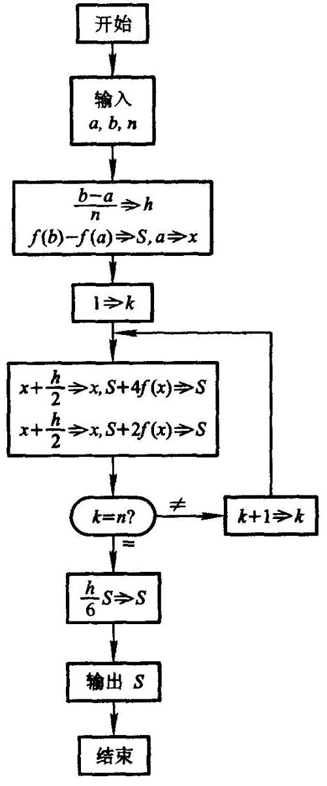

图 2-1

<!-- Media -->

用复化求积法. 取 $n = 8$ 用梯形公式 (18) 求得

$$
{T}_{8} = {0.9456909}
$$

再取 $n = 4$ 用复化辛甫生公式 (19),又得

$$
{S}_{4} = {0.9460832}
$$

比较上面两个结果, 它们都需要提供 9 个点上的函数值, 工作量基本相同, 然而精度却差别很大, 同积分的准确值 0.9460831 比较, 复化梯形方法的结果 ${T}_{8}$ 只有两位有效数字, 而复化辛甫生方法的结果 ${S}_{4}$ 却有六位有效数字.

复化辛甫生方法是一种常用的数值求积方法. 为了便于编写程序, 可将求积公式 (19)事先改写成下列形式

$$
{S}_{n} = \frac{h}{6}\{ f\left( b\right)  - f\left( a\right)  +
$$

$$
\left. {\mathop{\sum }\limits_{{k = 0}}^{{n - 1}}\left\lbrack  {{4f}\left( {x}_{k - \frac{1}{2}}\right)  + {2f}\left( {x}_{k}\right) }\right\rbrack  }\right\}
$$

据此可以画出辛甫生法的算法框图 (见图 2-1).

### 2.3 龙贝格算法

上一节介绍的复化求积方法对提高精度是行之有效的, 但在使用求积公式之前必须先给出步长. 步长取得太大精度难以保证, 步长太小则又会导致计算量的增加, 而事先给出一个合适的步长往往是困难的.

实际计算中常采用变步长的计算方案, 即在步长逐次减半 (即步长二分) 的过程中, 反复利用复化求积公式进行计算, 直到所求得的积分值满足精度要求为止.

## 1. 梯形法的递推化

我们在变步长的过程中探讨梯形法的计算规律. 设将求积区间 $\left\lbrack  {a,b}\right\rbrack$ 分为 $n$ 等分,则一共有 $n + 1$ 个等分点 ${x}_{k} = a + {kh},h = \frac{b - a}{n},k = 0,1,\cdots ,n$ . 这里用 ${T}_{n}$ 表示用复化梯形法求得的积分值,其下标 $n$ 表示等分数.

先考察一个子段 $\left\lbrack  {{x}_{k},{x}_{k + 1}}\right\rbrack$ ,其中点 ${x}_{k + \frac{1}{2}} = \frac{1}{2}\left( {{x}_{k} + {x}_{k + 1}}\right)$ ,在该子段上二分前后的两个积分值

$$
{T}_{1} = \frac{h}{2}\left\lbrack  {f\left( {x}_{k}\right)  + f\left( {x}_{k + 1}\right) }\right\rbrack
$$

$$
{T}_{2} = \frac{h}{4}\left\lbrack  {f\left( {x}_{k}\right)  + {2f}\left( {x}_{k + \frac{1}{2}}\right)  + f\left( {x}_{k + 1}\right) }\right\rbrack
$$

显然有下列关系

$$
{T}_{2} = \frac{1}{2}{T}_{1} + \frac{h}{2}f\left( {x}_{k + \frac{1}{2}}\right)
$$

将这一关系式关于 $k$ 从 0 到 $n - 1$ 累加求和,即可导出下列递推公式

$$
{T}_{2n} = \frac{1}{2}{T}_{n} + \frac{h}{2}\mathop{\sum }\limits_{{k = 0}}^{{n - 1}}f\left( {x}_{k + \frac{1}{2}}\right)  \tag{24}
$$

需要强调指出的是,上式中的 $h = \frac{b - a}{n}$ 代表二分前的步长,而

$$
{x}_{k + \frac{1}{2}} = a + \left( {k + \frac{1}{2}}\right) h
$$

图 2-2 是变步长梯形法的算法框图. 其中 ${T}_{1}$ 和 ${T}_{2}$ 分别代表二分前后的积分值. 各框的含义是:

[框 1] 准备初值.

[框 2] 按式 (24) 求二分后的梯形值.

从第一个分点 $x = a + \frac{h}{2}$ 出发,取 $h$ 为步长逐步向右跨,即可依次确定式 (24)中各个分点. 图 2-2 将所得到的分点暂存于单元 $x$ 中.

[框 3] 控制精度.

[框 4] 修改步长.

<!-- Media -->

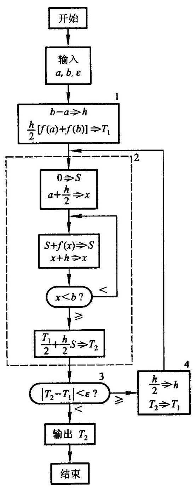

图 2-2

<!-- Media -->

最终取二分后的积分值 ${T}_{2}$ 作为所求的结果.

例 3 用变步长方法计算

$$
I = {\int }_{0}^{1}\frac{\sin x}{x}\mathrm{\;d}x
$$

解 先对整个区间 $\left\lbrack  {0,1}\right\rbrack$ 用梯形公式. $f\left( x\right)  = \frac{\sin x}{x}$ 的数据参看表 2-3. 由于 $f\left( 0\right)  = 1,f\left( 1\right)  = {0.8414709}$ ,故

$$
{T}_{1} = \frac{1}{2}\left\lbrack  {f\left( 0\right)  + f\left( 1\right) }\right\rbrack   = {0.9207355}
$$

然后将区间二分,由于 $f\left( \frac{1}{2}\right)  = {0.9588510}$ , 利用递推公式 (24) 得

$$
{T}_{2} = \frac{1}{2}{T}_{1} + \frac{1}{2}f\left( \frac{1}{2}\right)  = {0.9397933}
$$

再二分一次, 并计算新分点上的函数值

$$
f\left( \frac{1}{4}\right)  = {0.9896158},
$$

$$
f\left( \frac{3}{4}\right)  = {0.9088516}
$$

再用式(24)求得

$$
{T}_{4} = \frac{1}{2}{T}_{2} + \frac{1}{4}\left\lbrack  {f\left( \frac{1}{4}\right)  + f\left( \frac{3}{4}\right) }\right\rbrack
$$

$$
= {0.9445135}
$$

这样不断二分下去, 计算结果见表 2-4 (表中 $k$ 代表二分次数,区间等分数 $n = {2}^{k}$ ). 积分的准确值为 0.9460831,用变步长方法二分 10 次得到了这个结果.

<!-- Media -->

表 2-4

<table><tr><td>$k$</td><td>${T}_{n}$</td><td>$k$</td><td>${T}_{n}$</td></tr><tr><td>0</td><td>0.920 735 5</td><td>3</td><td>0.945 690 9</td></tr><tr><td>1</td><td>0.939 793 3</td><td>4</td><td>0.945 985 0</td></tr><tr><td>2</td><td>0.944 5135</td><td>5</td><td>0.946 059 6</td></tr></table>

续表

<table><tr><td>$k$</td><td>${T}_{n}$</td><td>$k$</td><td>${T}_{n}$</td></tr><tr><td>6</td><td>0.946 076 9</td><td>9</td><td>0.946 083 0</td></tr><tr><td>7</td><td>0.946 081 5</td><td>10</td><td>0.946 083 1</td></tr><tr><td>8</td><td>0.946 082 7</td><td/><td/></tr></table>

<!-- Media -->

## 2. 龙贝格公式

梯形法的算法简单, 但精度低, 收敛的速度缓慢. 如何提高收敛速度以节省计算量, 自然是人们极为关心的课题.

根据梯形法的误差公式 (21),积分值 ${T}_{n}$ 的截断误差大致与 ${h}^{2}$ 成正比,因此步长减半后误差将减至 $\frac{1}{4}$ ,即有

$$
\frac{I - {T}_{2n}}{I - {T}_{n}} \approx  \frac{1}{4}
$$

将上式移项整理, 知

$$
I - {T}_{2n} \approx  \frac{1}{3}\left( {{T}_{2n} - {T}_{n}}\right)  \tag{25}
$$

由此可见,只要二分前后两个积分值 ${T}_{n}$ 与 ${T}_{2n}$ 相当接近,就可以保证计算结果 ${T}_{2n}$ 的误差很小. 前已说过 (上一章 1.3 节),这种直接用计算结果来估计误差的方法称作误差的事后估计法.

按式 (25),积分值 ${T}_{2n}$ 的误差大致等于 $\frac{1}{3}\left( {{T}_{2n} - {T}_{n}}\right)$ ,如果用这个误差值作为 ${T}_{2n}$ 的一种补偿,可以期望,所得的

$$
\bar{T} = {T}_{2n} + \frac{1}{3}\left( {{T}_{2n} - {T}_{n}}\right)  = \frac{4}{3}{T}_{2n} - \frac{1}{3}{T}_{n} \tag{26}
$$

应当是更好的结果.

再考察例 3,所求得的两个梯形值 ${T}_{4} = {0.9445135}$ 和 ${T}_{8} = {0.9456909}$ 的精度都很差 (与准确值 0.9460831 比较, 它们只有二三位有效数字), 但如果将它们按式 (26) 作线性组合, 则新的近似值

$$
\bar{T} = \frac{4}{3}{T}_{8} - \frac{1}{3}{T}_{4} = {0.9460834}
$$

却有六位有效数字.

按式 (26) 组合得到的近似值 $\bar{T}$ ,其实质究竟是什么呢? 直接验证易知

$$
{S}_{n} = \frac{4}{3}{T}_{2n} - \frac{1}{3}{T}_{n} \tag{27}
$$

这就是说,用梯形法二分前后两个积分值 ${T}_{n}$ 与 ${T}_{2n}$ 按式 (26) 作线性组合,结果得到辛甫生法的积分值 ${S}_{n}$ .

再考察辛甫生法. 按式(22),其截断误差与 ${h}^{4}$ 成正比. 因此,若将步长折半,则误差相应地减至 $1/{16}$ ,即有

$$
\frac{I - {S}_{2n}}{I - {S}_{n}} \approx  \frac{1}{16}
$$

由此得

$$
I \approx  \frac{16}{15}{S}_{2n} - \frac{1}{15}{S}_{n}
$$

不难验证,上式右端的值其实等于 ${C}_{n}$ ,就是说,用辛甫生法二分前后的两个积分值 ${S}_{n}$ 与 ${S}_{2n}$ ,按上式再作线性组合,结果得到柯特斯法的积分值 ${C}_{n}$ ,即有

$$
{C}_{n} \approx  \frac{16}{15}{S}_{2n} - \frac{1}{15}{S}_{n} \tag{28}
$$

重复同样的手续, 依据柯特斯法的误差公式 (23) 可进一步导出下列龙贝格 (Romberg)公式

$$
{R}_{n} = \frac{64}{63}{C}_{2n} - \frac{1}{63}{C}_{n} \tag{29}
$$

应当注意, 龙贝格公式 (29) 已经不属于牛顿 - 柯特斯公式 (9) 的范畴.

在步长二分的过程中运用公式 (27) (29) 加工三次, 就能将粗糙的积分值 ${T}_{n}$ 逐步加工成精度较高的龙贝格值 ${R}_{n}$ ,或者说,将收敛缓慢的梯形值序列 ${T}_{n}$ 加工成收敛迅速的龙贝格值序列 ${R}_{n}$ . 这种加速方法称龙贝格算法,其加工流程如图 2-3 所示.

<!-- Media -->

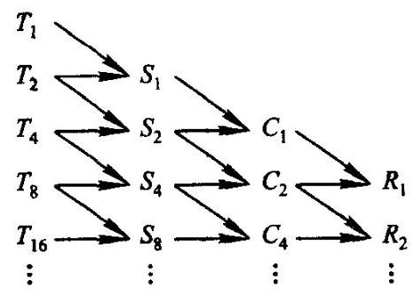

图 $2 - {3}^{ \cdot  }$

<!-- Media -->

我们提供了上述龙贝格算法的框图 (图 2-4), 供读者参考.

例 4 用龙贝格算法加工例 3 得到的梯形值,计算结果见表 $2 - 5$ ,表中 $k$ 代表二分次数.

<!-- Media -->

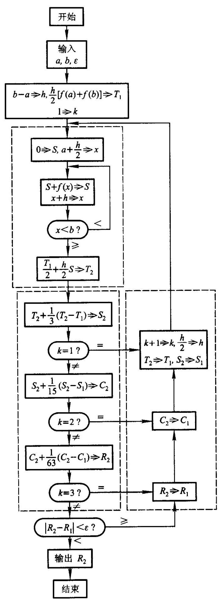

<!-- Media -->

图 2-4

<!-- Media -->

表 2-5

<table><tr><td>$k$</td><td>${T}_{2}^{k}$</td><td>${S}_{2}^{k - 1}$</td><td>${C}_{2}^{k - 2}$</td><td>${R}_{2}^{k - 3}$</td></tr><tr><td>0</td><td>0.920 735 5</td><td/><td/><td/></tr><tr><td>1</td><td>0.939 793 3</td><td>0.946 145 9</td><td/><td/></tr><tr><td>2</td><td>0.944 513 5</td><td>0.946 086 9</td><td>0.946 083 0</td><td/></tr><tr><td>3</td><td>0.945 690 9</td><td>0.946 083 4</td><td>0.946 083 1</td><td>0.946 083 1</td></tr></table>

<!-- Media -->

我们看到, 这里用二分 3 次的数据 (它们的精度都很低, 只有二三位有效数字), 通过三次加速获得了例 3 需要二分 10 次才能求得的结果, 而加速过程的计算量 (仅仅做几次四则运算而不需要求函数值) 可以忽略不计, 可见龙贝格加速过程的效果是极其显著的.

### 2.4 高斯公式

## 1. 高精度的求积公式

前面在构造牛顿 - 柯特斯公式时, 我们限定用等分点作为求积节点, 这样做虽然简化了处理过程, 但同时却限制了求积公式的精度.

不失一般性,设 $a =  - 1,b = 1$ 而考察下列求积公式

$$
{\int }_{-1}^{1}f\left( x\right) \mathrm{d}x \approx  \mathop{\sum }\limits_{{k = 1}}^{n}{A}_{k}f\left( {x}_{k}\right)  \tag{30}
$$

本章所考察的求积公式都是插值型的,只要节点 ${x}_{k}$ 一经给出,相应的求积系数 ${A}_{k}$ 便随之确定 (参看 2.1 节). 我们将会看到,适当地选取求积节点 ${x}_{k}$ $\left( {k = 1,2,\cdots ,n}\right)$ ,可以使求积公式 (30) 具有 ${2n} - 1$ 次代数精度. 这种高精度的求积公式称高斯 (Gauss) 公式. 高斯公式的求积节点 ${x}_{k}$ 称高斯点.

一点高斯公式是我们所熟悉的中矩形公式

$$
{\int }_{-1}^{1}f\left( x\right) \mathrm{d}x \approx  {2f}\left( 0\right)
$$

其高斯点 ${x}_{1} = 0$ .

现在推导两点高斯公式

$$
{\int }_{-1}^{1}f\left( x\right) \mathrm{d}x \approx  {A}_{1}f\left( {x}_{1}\right)  + {A}_{2}f\left( {x}_{2}\right)
$$

令它对于 $f\left( x\right)  = 1,x,{x}^{2},{x}^{3}$ 准确成立,有

$$
\left\{  \begin{array}{l} {A}_{1} + {A}_{2} = 2 \\  {A}_{1}{x}_{1} + {A}_{2}{x}_{2} = 0 \\  {A}_{1}{x}_{1}^{2} + {A}_{2}{x}_{2}^{2} = \frac{2}{3} \\  {A}_{1}{x}_{1}^{3} + {A}_{2}{x}_{2}^{3} = 0 \end{array}\right.  \tag{31}
$$

这是一个非线性方程组, 由其中的第 2,4 两式知

$$
{x}_{1}^{2} = {x}_{2}^{2}
$$

再利用 1 , 3 两式得

$$
{x}_{1}^{2} = {x}_{2}^{2} = \frac{1}{3}
$$

因而有

$$
{x}_{2} =  - {x}_{1} = \frac{1}{\sqrt{3}}
$$

然后回代到 (31) 的第 1,2 两式定出

$$
{A}_{1} = {A}_{2} = 1
$$

于是, 两点高斯公式的具体形式是

$$
{\int }_{-1}^{1}f\left( x\right) \mathrm{d}x \approx  f\left( {-\frac{1}{\sqrt{3}}}\right)  + f\left( \frac{1}{\sqrt{3}}\right)
$$

对于任意积分区间 $\left\lbrack  {a,b}\right\rbrack$ ,通过变换

$$
x = \frac{b - a}{2}t + \frac{a + b}{2}
$$

可以变到区间 $\left\lbrack  {-1,1}\right\rbrack$ 上,这时

$$
{\int }_{a}^{b}f\left( x\right) \mathrm{d}x = \frac{b - a}{2}{\int }_{-1}^{1}f\left( {\frac{b - a}{2}t + \frac{a + b}{2}}\right) \mathrm{d}t
$$

因而相应的两点高斯公式是

$$
{\int }_{a}^{b}f\left( x\right) \mathrm{d}x \approx  \frac{b - a}{2}\left\lbrack  {f\left( {-\frac{b - a}{2\sqrt{3}} + \frac{a + b}{2}}\right)  + f\left( {\frac{b - a}{2\sqrt{3}} + \frac{a + b}{2}}\right) }\right\rbrack   \tag{32}
$$

高斯公式的精度很高. 例如,用两点高斯公式 (32) 计算积分 $I =$ ${\int }_{0}^{1}\frac{\sin x}{x}\mathrm{\;d}x$ 得近似值 0.9460411,这个结果有 4 位有效数字 (试与例 3 的结果相比较).

## 2. 高斯点的基本特性

我们看到, 高斯点的确定虽然原则上可以化为代数问题, 但所归结出的方程组是非线性的, 非线性方程组的求解存在实质性的困难. 下面我们从研究高斯点的基本特性着手来解决高斯公式的构造问题.

设 ${x}_{k}\left( {k = 1,2,\cdots ,n}\right)$ 是求积公式 (30) 的高斯点,作多项式

$$
\omega \left( x\right)  = \left( {x - {x}_{1}}\right) \left( {x - {x}_{2}}\right) \cdots \left( {x - {x}_{n}}\right)
$$

对于任意次数 $\leq  n - 1$ 的多项式 $p\left( x\right) ,p\left( x\right) \omega \left( x\right)$ 是次数 $\leq  {2n} - 1$ 的多项式, 因而高斯公式 (30) 对于它是准确成立的:

$$
{\int }_{-1}^{1}p\left( x\right) \omega \left( x\right) \mathrm{d}x = \mathop{\sum }\limits_{{k = 1}}^{n}{A}_{k}p\left( {x}_{k}\right) \omega \left( {x}_{k}\right)
$$

由于 $\omega \left( {x}_{k}\right)  = 0\left( {k = 1,2,\cdots ,n}\right)$ ,故由上式得知

$$
{\int }_{-1}^{1}p\left( x\right) \omega \left( x\right) \mathrm{d}x = 0 \tag{33}
$$

可见以高斯点为零点的 $n$ 次多项式 $\omega \left( x\right)$ 与一切次数 $\leq  n - 1$ 的多项式 $p\left( x\right)$ 正交.

其逆命题也成立: 如果 $\omega \left( x\right)$ 与任意 $n - 1$ 次多项式正交,则其零点必为高斯点.

事实上,对于任意 $\leq  {2n} - 1$ 的多项式 $f\left( x\right)$ ,用 $\omega \left( x\right)$ 除它,记商为 $p\left( x\right)$ ,余式为 $q\left( x\right)$ :

$$
f\left( x\right)  = p\left( x\right) \omega \left( x\right)  + q\left( x\right)
$$

这里 $p\left( x\right)$ 与 $q\left( x\right)$ 均为次数 $\leq  n - 1$ 的多项式. 由于

$$
{\int }_{-1}^{1}f\left( x\right) \mathrm{d}x = {\int }_{-1}^{1}p\left( x\right) \omega \left( x\right) \mathrm{d}x + {\int }_{-1}^{1}q\left( x\right) \mathrm{d}x
$$

利用正交性条件 (33) 得

$$
{\int }_{-1}^{1}f\left( x\right) \mathrm{d}x = {\int }_{-1}^{1}q\left( x\right) \mathrm{d}x \tag{34}
$$

假设所给求积公式 (30) 是插值型的,则它至少具有 $n - 1$ 次代数精度 (2.1 节定理 1),因而对于 $q\left( x\right)$ 准确成立,再注意到 $q\left( {x}_{k}\right)  = f\left( {x}_{k}\right) (k = 1,2,\cdots$ , $n)$ ,有

$$
{\int }_{-1}^{1}q\left( x\right) \mathrm{d}x = \mathop{\sum }\limits_{{k = 1}}^{n}{A}_{k}f\left( {x}_{k}\right)
$$

于是由式(34)知

$$
{\int }_{-1}^{1}f\left( x\right) \mathrm{d}x = \mathop{\sum }\limits_{{k = 1}}^{n}{A}_{k}f\left( {x}_{k}\right)
$$

这说明所给求积公式 (30) 对于任意次数 $\leq  {2n} - 1$ 的多项式 $f\left( x\right)$ 均能准确成立, 因而它是高斯公式.

综上所述, 有如下定理.

定理 2 节点 ${x}_{k}\left( {k = 1,2,\cdots ,n}\right)$ 是高斯点的充分必要条件是,多项式 $\omega \left( x\right)$ 与一切次数 $\leq  n - 1$ 的多项式 $p\left( x\right)$ 正交,即成立

$$
{\int }_{-1}^{1}{x}^{k}\omega \left( x\right) \mathrm{d}x = 0,\;k = 0,1,\cdots ,n - 1 \tag{35}
$$

譬如, 为要确定两点公式

$$
{\int }_{-1}^{1}f\left( x\right) \mathrm{d}x \approx  {A}_{1}f\left( {x}_{1}\right)  + {A}_{2}f\left( {x}_{2}\right)
$$

的高斯点, 按正交性条件 (35), 知

$$
{\int }_{-1}^{1}\left( {x - {x}_{1}}\right) \left( {x - {x}_{2}}\right) \mathrm{d}x = 0
$$

$$
{\int }_{-1}^{1}x\left( {x - {x}_{1}}\right) \left( {x - {x}_{2}}\right) \mathrm{d}x = 0
$$

由此易得

$$
{x}_{1}{x}_{2} =  - \frac{1}{3},\;{x}_{1} + {x}_{2} = 0
$$

故所求的高斯点为 ${x}_{2} =  - {x}_{1} = \frac{1}{\sqrt{3}}$ . 这个结论是我们已经知道的.

## 3. 勒让德多项式

以高斯点 ${x}_{k}\left( {k = 1,2,\cdots ,n}\right)$ 为零点的 $n$ 次式

$$
{P}_{n}\left( x\right)  = \left( {x - {x}_{1}}\right) \left( {x - {x}_{2}}\right) \cdots \left( {x - {x}_{n}}\right)
$$

称作勒让德 (Legendre) 多项式. 为了导出 ${P}_{n}\left( x\right)$ 的具体表达式,考察 $n$ 重积分

$$
u\left( x\right)  = {\int }_{-1}^{x}{\int }_{-1}^{x}\cdots {\int }_{-1}^{x}{P}_{n}\left( x\right) \mathrm{d}x\cdots \mathrm{d}x\mathrm{\;d}x
$$

它是 ${2n}$ 次多项式,且

$$
{u}^{\left( n\right) }\left( x\right)  = {P}_{n}\left( x\right)  \tag{36}
$$

$$
u\left( {-1}\right)  = {u}^{\prime }\left( {-1}\right)  = \cdots  = {u}^{\left( n - 1\right) }\left( {-1}\right)  = 0 \tag{37}
$$

设 $v\left( x\right)$ 为任意 $n - 1$ 次多项式,注意到 ${v}^{\left( n\right) }\left( x\right)  = 0$ ,利用上面两个式子分部积分得

$$
{\int }_{-1}^{1}v\left( x\right) {P}_{n}\left( x\right) \mathrm{d}x = {\int }_{-1}^{1}v\left( x\right) {u}^{\left( n\right) }\left( x\right) \mathrm{d}x
$$

$$
= v\left( 1\right) {u}^{\left( n - 1\right) }\left( 1\right)  - {v}^{\prime }\left( 1\right) {u}^{\left( n - 2\right) }\left( 1\right)  + \cdots  +
$$

$$
{\left( -1\right) }^{n - 1}{v}^{\left( n - 1\right) }\left( 1\right) u\left( 1\right)  \tag{38}
$$

另一方面,由于 ${p}_{n}\left( x\right)$ 的零点是高斯点,据定理 2 知式 (38) 等于 0,再考虑到 $v\left( x\right)$ 的任意性,知

$$
u\left( 1\right)  = {u}^{\prime }\left( 1\right)  = \cdots  = {u}^{\left( n - 1\right) }\left( 1\right)  = 0 \tag{39}
$$

上述式 (37) 和式 (39) 表明,-1 和 +1 都是 $u\left( x\right)$ 的 $n - 1$ 重零点,因而

$$
u\left( x\right)  = c{\left( {x}^{2} - 1\right) }^{n}
$$

式中 $c$ 为待定系数. 为使 ${P}_{n}\left( x\right)$ 的首项系数为 1,取 $c = \frac{n!}{\left( {2n}\right) !}$ ,于是据式 (36) 有

$$
{P}_{n}\left( x\right)  = \frac{n!}{\left( {2n}\right) !}\frac{{\mathrm{d}}^{n}}{\mathrm{\;d}{x}^{n}}\left\lbrack  {\left( {x}^{2} - 1\right) }^{n}\right\rbrack
$$

据此即可逐步构造出勒让德多项式

$$
{P}_{1}\left( x\right)  = x
$$

$$
{P}_{2}\left( x\right)  = {x}^{2} - \frac{1}{3}
$$

$$
{P}_{3}\left( x\right)  = {x}^{3} - \frac{3}{5}x
$$

$$
{P}_{4}\left( x\right)  = {x}^{4} - \frac{30}{35}{x}^{2} + \frac{3}{35}
$$

...

据定理 2 , 利用勒让德多项式, 取它的零点作为求积节点即可构造出高斯公式. 譬如, 为要构造三点高斯公式

$$
{\int }_{-1}^{1}f\left( x\right) \mathrm{d}x \approx  {A}_{1}f\left( {x}_{1}\right)  + {A}_{2}f\left( {x}_{2}\right)  + {A}_{3}f\left( {x}_{3}\right)
$$

可取三次勒让德多项式 ${P}_{3}\left( x\right)$ 的零点

$$
{x}_{1} =  - \sqrt{\frac{3}{5}},\;{x}_{2} = 0,\;{x}_{3} = \sqrt{\frac{3}{5}}
$$

作为求积节点,然后令求积公式对于 $f\left( x\right)  = 1,x,{x}^{2}$ 准确成立,则有

$$
\left\{  \begin{array}{l} {A}_{1} + {A}_{2} + {A}_{3} = 2 \\  {A}_{1}{x}_{1} + {A}_{2}{x}_{2} + {A}_{3}{x}_{3} = 0 \\  {A}_{1}{x}_{1}^{2} + {A}_{2}{x}_{2}^{2} + {A}_{3}{x}_{3}^{2} = \frac{2}{3} \end{array}\right.
$$

据此解出 ${A}_{1},{A}_{2},{A}_{3}$ ,即得三点高斯公式

$$
{\int }_{-1}^{1}f\left( x\right) \mathrm{d}x \approx  \frac{5}{9}f\left( {-\sqrt{\frac{3}{5}}}\right)  + \frac{8}{9}f\left( 0\right)  + \frac{5}{9}f\left( \sqrt{\frac{3}{5}}\right)
$$

高斯公式的一个重要特点是它的收敛性,当 $n \rightarrow  \infty$ 时,按高斯公式 (30) 求得的积分近似值会收敛到积分值 ${\int }_{-1}^{1}f\left( x\right) \mathrm{d}x$ . 不过,高阶的高斯公式由于形式复杂而不便于实际应用.

为简化程序设计, 可以像处理牛顿 - 柯特斯公式一样将高斯公式复化. 譬如,设将求积区间 $\left\lbrack  {a,b}\right\rbrack$ 分为 $n$ 等分,步长 $h = \frac{b - a}{n}$ ,在每个子段上使用中矩形公式 (一点高斯公式), 则其复化形式为

$$
{\int }_{a}^{b}f\left( x\right) \mathrm{d}x \approx  h\mathop{\sum }\limits_{{k = 0}}^{{n - 1}}f\left\lbrack  {a + \left( {k + \frac{1}{2}}\right) h}\right\rbrack   \tag{40}
$$

类似于对复化梯形方法的讨论 (2.3 节), 对于复化中矩形方法亦可运用加速技术.

### 2.5 数 值 微 分

微分和积分是一对互逆的数学运算. 下面将参照前述数值积分来平行地讨论数值微分.

1. 差商公式

按照数学分析的定义,导数 ${f}^{\prime }\left( a\right)$ 是差商 $\frac{f\left( {a + h}\right)  - f\left( a\right) }{h}$ 当 $h \rightarrow  0$ 时的极限. 如果精度要求不高, 可以简单地取差商作为导数的近似值, 这样便建立起一种简单的数值微分方法

$$
{f}^{\prime }\left( a\right)  \approx  \frac{f\left( {a + h}\right)  - f\left( a\right) }{h}
$$

类似地, 亦可用向后差商作近似计算

$$
{f}^{\prime }\left( a\right)  \approx  \frac{f\left( a\right)  - f\left( {a - h}\right) }{h}
$$

或用中心差商

$$
{f}^{\prime }\left( a\right)  \approx  \frac{f\left( {a + h}\right)  - f\left( {a - h}\right) }{2h}
$$

后一种数值微分方法称中点方法, 它其实是前两种方法的算术平均.

在图形上 (参看图 2-5), 上述三种导数的近似值分别表示弦线 ${AB},{AC}$ 和 ${BC}$ 的斜率,比较这三条弦线与切线 ${AT}$ (其斜率等于导数值 ${f}^{\prime }\left( a\right)$ ) 平行的程度, 从图形上可以明显地看出,其中以 ${BC}$ 的斜率更接近于切线 ${AT}$ 的斜率. 因此,就精度而言, 以中点方法更为可取.

<!-- Media -->

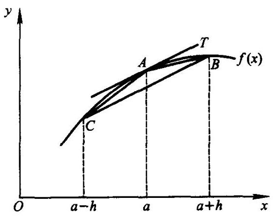

图 2-5

<!-- Media -->

为要运用中点公式

$$
G\left( h\right)  \approx  \frac{f\left( {a + h}\right)  - f\left( {a - h}\right) }{2h} \tag{41}
$$

计算导数值 ${f}^{\prime }\left( a\right)$ ,必须选取合适的步长. 为此需要进行误差分析. 将 $f\left( {a \pm  h}\right)$ 在 $x = a$ 泰勒展开,有

$$
f\left( {a \pm  h}\right)  = f\left( a\right)  \pm  h{f}^{\prime }\left( a\right)  + \frac{{h}^{2}}{2!}{f}^{\prime \prime }\left( a\right)  \pm  \frac{{h}^{3}}{3!}{f}^{\prime \prime \prime }\left( a\right)  +
$$

$$
\frac{{h}^{4}}{4!}{f}^{\left( 4\right) }\left( a\right)  \pm  \frac{{h}^{5}}{5!}{f}^{\left( 5\right) }\left( a\right)  + \cdots
$$

代入式(41)得

$$
G\left( h\right)  = {f}^{\prime }\left( a\right)  + \frac{{h}^{2}}{3!}{f}^{\prime \prime \prime }\left( a\right)  + \frac{{h}^{4}}{5!}{f}^{\left( 5\right) }\left( a\right)  + \cdots  \tag{42}
$$

由此得知, 从截断误差的角度来看, 步长越小, 计算结果越准确.

再考察舍入误差. 按式 (41) 计算,当 $h$ 很小时,由于 $f\left( {a + h}\right)$ 与 $f\left( {a - h}\right)$ 很接近,直接相减会造成有效数字的严重损失 (参看引论的 $B$ ). 因此, 从舍入误差的角度来看步长是不宜太小的.

综上所述, 步长过大则截断误差显著; 但如果步长太小又会导致舍入误差的增长. 因此, 在实际计算时, 人们希望在保证截断误差满足精度要求的前提下选取尽可能大的步长. 然而事先给出一个合适的步长往往是困难的. 通常在变步长的过程中实现步长的自动选择.

例 5 用变步长的中点方法求 ${\mathrm{e}}^{x}$ 在 $x = 1$ 的导数值,设取 $h = {0.8}$ 起算.

解 这里采用的计算公式是

$$
G\left( h\right)  = \frac{{\mathrm{e}}^{1 + h} - {\mathrm{e}}^{1 - h}}{2h}
$$

式中步长 $h = \frac{0.8}{{2}^{k}}$ . 二分 9 次得结果 $G = {2.71828}$ ,它的每一数字都是有效数字 (所求导数的精确值为 $\mathrm{e} = {2.7182818}\cdots$ ).

## 2. 中点方法的加速

为了将中点方法加速, 需要分析误差的性态. 可以看到, 其余项展开式 (42)具有下列形式：

$$
G\left( h\right)  = {f}^{\prime }\left( a\right)  + {a}_{1}{h}^{2} + {a}_{2}{h}^{4} + {a}_{3}{h}^{6} + \cdots  \tag{43}
$$

式中,系数 ${a}_{1},{a}_{2},\cdots$ 均与步长 $h$ 无关. 若将步长减半,则有

$$
G\left( \frac{h}{2}\right)  = {f}^{\prime }\left( a\right)  + \frac{{a}_{1}}{4}{h}^{2} + {\widehat{a}}_{2}{h}^{4} + {\widehat{a}}_{3}{h}^{6} + \cdots  \tag{44}
$$

注意,这里的 ${\widehat{a}}_{k}$ 与将要出现的 ${\beta }_{k},{\gamma }_{k}$ 等均为与 $h$ 无关的系数.

设将式 (43) 与式 (44) 按以下方式加权平均

$$
{G}_{1}\left( h\right)  = \frac{4}{3}G\left( \frac{h}{2}\right)  - \frac{1}{3}G\left( h\right)  \tag{45}
$$

则可以从余项展开式中消去误差的主要部分 ${h}^{2}$ 项,而得到

$$
{G}_{1}\left( h\right)  = {f}^{\prime }\left( a\right)  + {\beta }_{1}{h}^{4} + {\beta }_{2}{h}^{6} + \cdots
$$

若令

$$
{G}_{2}\left( h\right)  = \frac{16}{15}{G}_{1}\left( \frac{h}{2}\right)  - \frac{1}{15}{G}_{1}\left( h\right)  \tag{46}
$$

则又可进一步从余项展开式中消去 ${h}^{4}$ 项,而有

$$
{G}_{2}\left( h\right)  = {f}^{\prime }\left( a\right)  + {\gamma }_{1}{h}^{6} + \cdots
$$

重复同样的手续, 可以再导出下列加速公式

$$
{G}_{3}\left( h\right)  = \frac{64}{63}{G}_{2}\left( \frac{h}{2}\right)  - \frac{1}{63}{G}_{2}\left( h\right)  \tag{47}
$$

这种加速过程还可以继续下去, 不过加速的效果越来越不显著.

有趣的是, 把中点方法的加速公式 (45)、(46)、(47) 与梯形法的加速公式 (27)、(28)、(29)相比较,可以看到,两者的松弛因子是完全一样的.

例 6 运用加速公式 (45)、(46) 和 (47) 加工例 5 的结果.

解 计算结果见表 2-6 . 这里, 加速的效果依然是相当显著的.

<!-- Media -->

表 2-6

<table><tr><td>$h$</td><td>$G\left( h\right)$</td><td>${G}_{1}\left( h\right)$</td><td>${G}_{2}\left( h\right)$</td><td>${G}_{3}\left( h\right)$</td></tr><tr><td>0.8</td><td>3.01765</td><td>2.715 917</td><td>2.718 285</td><td>2.71828</td></tr><tr><td>0.4</td><td>2.791 35</td><td>2.718 137</td><td>2.718 276</td><td/></tr><tr><td>0.2</td><td>2.736 44</td><td>2.719 267</td><td/><td/></tr><tr><td>0.1</td><td>2.72281</td><td/><td/><td/></tr></table>

<!-- Media -->

## 3. 插值型的求导公式

设已知 $f\left( x\right)$ 在节点 ${x}_{k}\left( {k = 0,1,\cdots ,n}\right)$ 的函数值,利用所给数据作 $n$ 次插值多项式 ${p}_{n}\left( x\right)$ ,并取 ${p}_{n}^{\prime }\left( x\right)$ 的值作为 ${f}^{\prime }\left( x\right)$ 的近似值,这样建立的数值公式

$$
{f}^{\prime }\left( x\right)  \approx  {p}_{n}^{\prime }\left( x\right)  \tag{48}
$$

统称插值型求导公式.

应当指出,即使 ${p}_{n}\left( x\right)$ 与 $f\left( x\right)$ 处处相差不多, ${p}_{n}^{\prime }\left( x\right)$ 与 ${f}^{\prime }\left( x\right)$ 在某些点仍然可能出入很大, 因而在使用求导公式时要特别注意误差的分析.

依据插值余项定理 (第一章定理 3), 求导公式 (48) 的余项为

$$
{f}^{\prime }\left( x\right)  - {p}_{n}^{\prime }\left( x\right)  = \frac{{f}^{\left( n + 1\right) }\left( \xi \right) }{\left( {n + 1}\right) !}{\omega }^{\prime }\left( x\right)  + \frac{\omega \left( x\right) }{\left( {n + 1}\right) !}\frac{\mathrm{d}}{\mathrm{d}x}{f}^{\left( n + 1\right) }\left( \xi \right)
$$

式中 $\omega \left( x\right)  = \mathop{\prod }\limits_{{j = 0}}^{n}\left( {x - {x}_{j}}\right)$ . 在这一余项公式中,由于 $\xi$ 是 $x$ 的未知函数,我们无法对它的第二项 $\frac{\omega \left( x\right) }{\left( {n + 1}\right) !}\frac{\mathrm{d}}{\mathrm{d}x}{f}^{\left( n + 1\right) }\left( \xi \right)$ 作出进一步的说明. 因此,对于随意给出的点 $x$ ,误差 ${f}^{\prime }\left( x\right)  - {p}_{n}^{\prime }\left( x\right)$ 是无法预估的. 但是,如果只是求某个节点 ${x}_{k}$ 上的导数值,则上式的第二项因 $\omega \left( {x}_{k}\right)  = 0$ 而等于 0,这时有余项公式

$$
{f}^{\prime }\left( {x}_{k}\right)  - {p}_{n}^{\prime }\left( {x}_{k}\right)  = \frac{{f}^{\left( n + 1\right) }\left( \xi \right) }{\left( {n + 1}\right) !}{\omega }^{\prime }\left( {x}_{k}\right)  \tag{49}
$$

下面具体建立插值型的求导公式.

设已给出三个节点 ${x}_{0},{x}_{1} = {x}_{0} + h,{x}_{2} = {x}_{0} + {2h}$ 上的函数值,作二次插值

$$
{p}_{2}\left( x\right)  = \frac{\left( {x - {x}_{1}}\right) \left( {x - {x}_{2}}\right) }{\left( {{x}_{0} - {x}_{1}}\right) \left( {{x}_{0} - {x}_{2}}\right) }f\left( {x}_{0}\right)  + \frac{\left( {x - {x}_{0}}\right) \left( {x - {x}_{2}}\right) }{\left( {{x}_{1} - {x}_{0}}\right) \left( {{x}_{1} - {x}_{2}}\right) }f\left( {x}_{1}\right)  +
$$

$$
\frac{\left( {x - {x}_{0}}\right) \left( {x - {x}_{1}}\right) }{\left( {{x}_{2} - {x}_{0}}\right) \left( {{x}_{2} - {x}_{1}}\right) }f\left( {x}_{2}\right)
$$

令 $x = {x}_{0} + {th}$ ,上式可表为

$$
{p}_{2}\left( {{x}_{0} + {th}}\right)  = \frac{1}{2}\left( {t - 1}\right) \left( {t - 2}\right) f\left( {x}_{0}\right)  - t\left( {t - 2}\right) f\left( {x}_{1}\right)  + \frac{1}{2}t\left( {t - 1}\right) f\left( {x}_{2}\right)
$$

两端对 $t$ 求导数,有

$$
{p}_{2}^{\prime }\left( {{x}_{0} + {th}}\right)  = \frac{1}{2h}\left\lbrack  {\left( {{2t} - 3}\right) f\left( {x}_{0}\right)  - 4\left( {t - 1}\right) f\left( {x}_{1}\right)  + \left( {{2t} - 1}\right) f\left( {x}_{2}\right) }\right\rbrack   \tag{50}
$$

这里撇号 “’” 表示对变量 $x$ 求导数. 上式分别取 $t = 0,1,2$ 得到下列三种求导公式:

$$
{f}^{\prime }\left( {x}_{0}\right)  \approx  \frac{1}{2h}\left\lbrack  {-{3f}\left( {x}_{0}\right)  + {4f}\left( {x}_{1}\right)  - f\left( {x}_{2}\right) }\right\rbrack   \tag{51}
$$

$$
{f}^{\prime }\left( {x}_{1}\right)  \approx  \frac{1}{2h}\left\lbrack  {-f\left( {x}_{0}\right)  + f\left( {x}_{2}\right) }\right\rbrack   \tag{52}
$$

$$
{f}^{\prime }\left( {x}_{2}\right)  \approx  \frac{1}{2h}\left\lbrack  {f\left( {x}_{0}\right)  - {4f}\left( {x}_{1}\right)  + {3f}\left( {x}_{2}\right) }\right\rbrack   \tag{53}
$$

其中的公式 (52) 是我们所熟悉的中点公式, 在上列三点公式中, 它由于少用了一个函数值 $f\left( {x}_{1}\right)$ 而引人注目.

利用式 (49),不难导出求导公式 (51) (53) 的余项 (习题二的题 25).

用插值多项式 ${p}_{n}\left( x\right)$ 作为 $f\left( x\right)$ 的近似函数,还可以建立高阶数值微分公式

$$
{f}^{\left( k\right) }\left( x\right)  \approx  {p}_{n}^{\left( k\right) }\left( x\right)
$$

例如,将式 (50) 对 $t$ 再求导一次,有

$$
{p}_{2}^{\prime \prime }\left( {{x}_{0} + {th}}\right)  = \frac{1}{{h}^{2}}\left\lbrack  {f\left( {x}_{0}\right)  - {2f}\left( {x}_{1}\right)  + f\left( {x}_{2}\right) }\right\rbrack
$$

于是有下列二阶三点公式

$$
{f}^{\prime \prime }\left( {x}_{1}\right)  \approx  \frac{1}{{h}^{2}}\left\lbrack  {f\left( {x}_{0}\right)  - {2f}\left( {x}_{1}\right)  + f\left( {x}_{2}\right) }\right\rbrack   \tag{54}
$$

## 例题选讲 2.1 机 械 求 积

题 1 试检验下列求积公式的代数精度:

$$
{\int }_{0}^{1}f\left( x\right) \mathrm{d}x \approx  \frac{2}{3}f\left( \frac{1}{4}\right)  - \frac{1}{3}f\left( \frac{1}{2}\right)  + \frac{2}{3}f\left( \frac{3}{4}\right)
$$

解 直接检验易知,原式对于 $f = 1,x,{x}^{2},{x}^{3}$ 准确成立,但当 $f = {x}^{4}$ 时其左端 $= 1/5$ ,而

$$
\text{ 右端 } = \frac{2}{3}{\left( \frac{1}{4}\right) }^{4} - \frac{1}{3}{\left( \frac{1}{2}\right) }^{4} + \frac{2}{3}{\left( \frac{3}{4}\right) }^{4}
$$

左右两端不相等, 故所给求积公式仅有三阶精度.

题 2 试构造下列求积公式, 使其代数精度尽量地高, 并证明所构造出的求积公式是插值型的:

$$
{\int }_{0}^{1}f\left( x\right) \mathrm{d}x \approx  {A}_{0}f\left( \frac{1}{4}\right)  + {A}_{1}f\left( \frac{3}{4}\right)
$$

解 令原式对于 $f = 1,f = x$ 准确,可列出方程

$$
{A}_{0} + {A}_{1} = 1
$$

$$
\frac{1}{4}{A}_{0} + \frac{3}{4}{A}_{1} = \frac{1}{2}
$$

解之得

$$
{A}_{0} = {A}_{1} = \frac{1}{2}
$$

这样构造出的求积公式是

$$
{\int }_{0}^{1}f\left( x\right) \mathrm{d}x \approx  \frac{1}{2}f\left( \frac{1}{4}\right)  + \frac{1}{2}f\left( \frac{3}{4}\right)
$$

注意到节点 ${x}_{0} = \frac{1}{4},{x}_{1} = \frac{3}{4}$ 的拉格朗日插值基函数

$$
{l}_{0}\left( x\right)  =  - {2x} + \frac{3}{2},\;{l}_{1}\left( x\right)  = {2x} - \frac{1}{2}
$$

直接计算知

$$
{\int }_{0}^{1}{l}_{0}\left( x\right) \mathrm{d}x = {\int }_{0}^{1}{l}_{1}\left( x\right) \mathrm{d}x = \frac{1}{2}
$$

故所构造出的求积公式是插值型的.

题 3 判别下列求积公式是否是插值型的, 并指明其代数精度:

$$
{\int }_{0}^{3}f\left( x\right) \mathrm{d}x \approx  \frac{3}{2}\left\lbrack  {f\left( 1\right)  + f\left( 2\right) }\right\rbrack
$$

解 这里关于拉格朗日基函数 ${l}_{0}\left( x\right) ,{l}_{1}\left( x\right)$ 直接求积知

$$
{\int }_{0}^{3}{l}_{0}\left( x\right) \mathrm{d}x = {\int }_{0}^{3}{l}_{1}\left( x\right) \mathrm{d}x = \frac{3}{2}
$$

因此所给求积公式是插值型的.

按定理 1,含有 2 个节点的求积公式至少有 1 阶精度. 再考察 $f\left( x\right)  = {x}^{2}$ , 原式左端 $= 9$ ,而右端 $= \frac{3}{2}\left( {1 + 4}\right)$ ,左右两端不相等. 因此所给求积公式仅有 1 阶精度.

题 4 构造下列形式的插值型求积公式, 并指明该求积公式所具有的代数精度:

$$
{\int }_{0}^{1}f\left( x\right) \mathrm{d}x \approx  {A}_{0}f\left( \frac{1}{4}\right)  + {A}_{1}f\left( \frac{1}{2}\right)  + {A}_{2}f\left( \frac{3}{4}\right)
$$

解 按题设原式是插值型的, 故有

$$
{A}_{0} = {\int }_{0}^{1}\frac{\left( {x - \frac{1}{2}}\right) \left( {x - \frac{3}{4}}\right) }{\left( {\frac{1}{4} - \frac{1}{2}}\right) \left( {\frac{1}{4} - \frac{3}{4}}\right) }\mathrm{d}x = \frac{2}{3}
$$

$$
{A}_{1} = {\int }_{0}^{1}\frac{\left( {x - \frac{1}{4}}\right) \left( {x - \frac{3}{4}}\right) }{\left( {\frac{1}{2} - \frac{1}{4}}\right) \left( {\frac{1}{2} - \frac{3}{4}}\right) }\mathrm{d}x =  - \frac{1}{3}
$$

考虑到对称性,显然有 ${A}_{2} = {A}_{0}$ ,于是有求积公式

$$
{\int }_{0}^{1}f\left( x\right) \mathrm{d}x \approx  \frac{2}{3}\left\lbrack  {f\left( \frac{1}{4}\right)  + f\left( \frac{3}{4}\right) }\right\rbrack   - \frac{1}{3}f\left( \frac{1}{2}\right)
$$

由于原式含有 3 个节点, 按定理 1 它至少有 2 阶精度. 考虑到其对称性, 可以猜到它可能有 3 阶精度. 事实上,对 $f = {x}^{3}$ 原式左右两端相等. 此外,容易验证原式对 $f = {x}^{4}$ 不准确,故所构造出的求积公式确实有 3 阶精度.

## 例题选讲 2.2 求积公式的设计

本讲介绍设计求积公式的代数精度方法. 所设计的求积公式应具有 “尽可能高” 的代数精度, 并要求指明所构造出的求积公式实际具有的精度.

值得强调指出的是, 在设计求积公式时要充分考虑并利用对称性. 对称性有巨大的威力. 此外, 利用对称性可以显著地减少待定参数的数目, 从而使所归结出的代数方程组求解较为容易. 某些具有对称结构的求积公式, 其代数精度可能会获得 “额外” 的好处.

题 1 试设计求积公式

$$
{\int }_{0}^{1}f\left( x\right) \mathrm{d}x \approx  {A}_{0}f\left( \frac{1}{4}\right)  + {A}_{1}f\left( \frac{1}{2}\right)  + {A}_{2}f\left( \frac{3}{4}\right)
$$

解 令原式对于 $f = 1,x,{x}^{2}$ 准确成立,可列出方程组

$$
\left\{  \begin{array}{l} {A}_{0} + {A}_{1} + {A}_{2} = 1 \\  \frac{1}{4}{A}_{0} + \frac{1}{2}{A}_{1} + \frac{3}{4}{A}_{2} = \frac{1}{2} \\  \frac{1}{16}{A}_{0} + \frac{1}{4}{A}_{1} + \frac{9}{16}{A}_{2} = \frac{1}{3} \end{array}\right.
$$

考虑到对称性,令 ${A}_{2} = {A}_{0}$ ,则下列前两个方程是同解方程:

$$
\left\{  \begin{array}{l} 2{A}_{0} + {A}_{1} = 1 \\  {A}_{0} + \frac{1}{2}{A}_{1} = \frac{1}{2} \\  \frac{5}{8}{A}_{0} + \frac{1}{4}{A}_{1} = \frac{1}{3} \end{array}\right.
$$

解之得

$$
{A}_{0} = {A}_{2} = \frac{2}{3},\;{A}_{1} =  - \frac{1}{3}
$$

这样构造出的插值公式是

$$
{\int }_{0}^{1}f\left( x\right) \mathrm{d}x \approx  \frac{2}{3}f\left( \frac{1}{4}\right)  - \frac{1}{3}f\left( \frac{1}{2}\right)  + \frac{2}{3}f\left( \frac{3}{4}\right)
$$

当 $f = {x}^{4}$ 时上式左端 $= 1/5$ ,而

$$
\text{ 右端 } = \frac{2}{3}{\left( \frac{1}{4}\right) }^{4} - \frac{1}{3}{\left( \frac{1}{2}\right) }^{4} + \frac{2}{3}{\left( \frac{3}{4}\right) }^{4}
$$

其左右两端不相等, 故所构造出的求积公式具有 3 阶精度.

题 2 试设计求积公式

$$
{\int }_{-{2h}}^{2h}f\left( x\right) \mathrm{d}x \approx  h\left\lbrack  {{A}_{-1}f\left( {-h}\right)  + {A}_{0}f\left( 0\right)  + {A}_{1}f\left( h\right) }\right\rbrack
$$

解 不妨令 $h = 1$ ,否则作变换 $x = {ht}$ ,原式化为

$$
{\int }_{-2}^{2}f\left( x\right) \mathrm{d}x \approx  {A}_{-1}f\left( {-1}\right)  + {A}_{0}f\left( 0\right)  + {A}_{1}f\left( 1\right)
$$

考虑到求积公式内在的对称性,显然有 ${A}_{-1} = {A}_{1}$ ,这时对奇函数的 $f = x,{x}^{3}$ 自然准确; 令对 $f = 1,{x}^{2}$ 准确成立,可列出方程

$$
\left\{  \begin{array}{l} 2{A}_{1} + {A}_{0} = 4 \\  2{A}_{1} = \frac{16}{3} \end{array}\right.
$$

因之有

$$
{A}_{-1} = {A}_{1} = \frac{8}{3},{A}_{0} =  - \frac{4}{3}
$$

这样构造出的求积公式是

$$
{\int }_{-{2h}}^{2h}f\left( x\right) \mathrm{d}x \approx  h\left\lbrack  {\frac{8}{3}f\left( {-h}\right)  - \frac{4}{3}f\left( 0\right)  + \frac{8}{3}f\left( h\right) }\right\rbrack
$$

易知它对于 $f = {x}^{4}$ 不准确,故所构造出的求积公式具有 3 阶精度.

题 3 试设计求积公式

$$
{\int }_{0}^{1}f\left( x\right) \mathrm{d}x \approx  {A}_{0}f\left( 0\right)  + {A}_{1}f\left( 1\right)  + {B}_{0}{f}^{\prime } \tag{0}
$$

解 令对 $f = 1,x,{x}^{2}$ 准确,可列出方程

$$
\left\{  \begin{array}{l} {A}_{0} + {A}_{1} = 1 \\  {A}_{1} + {B}_{0} = \frac{1}{2} \\  {A}_{1} = \frac{1}{3} \end{array}\right.
$$

解之有

$$
{A}_{0} = \frac{2}{3},{A}_{1} = \frac{1}{3},{B}_{0} = \frac{1}{6}
$$

于是有求积公式

$$
{\int }_{0}^{1}f\left( x\right) \mathrm{d}x \approx  \frac{2}{3}f\left( 0\right)  + \frac{1}{3}f\left( 1\right)  + \frac{1}{6}{f}^{\prime } \tag{0}
$$

易知它对于 $f = {x}^{3}$ 不准确,故该求积公式仅有 2 阶精度.

题 4 试设计求积公式

$$
{\int }_{0}^{h}f\left( x\right) \mathrm{d}x \approx  h\left\lbrack  {{a}_{0}f\left( 0\right)  + {a}_{1}f\left( 1\right) }\right\rbrack   + {h}^{2}\left\lbrack  {{b}_{0}{f}^{\prime }\left( 0\right)  + {b}_{1}{f}^{\prime }\left( 1\right) }\right\rbrack
$$

解 不妨令 $h = 1$ ,否则作变换 $x = {ht}$ ,转而考察下列求积公式

$$
{\int }_{0}^{1}f\left( x\right) \mathrm{d}x \approx  {a}_{0}f\left( 0\right)  + {a}_{1}f\left( 1\right)  + {b}_{0}{f}^{\prime }\left( 0\right)  + {b}_{1}{f}^{\prime }\left( 1\right)
$$

令对于 $f = 1,x,{x}^{2},{x}^{3}$ 准确,可列出方程

$$
\left\{  \begin{array}{l} {a}_{0} + {a}_{1} = 1 \\  {a}_{1} + {b}_{0} + {b}_{1} = \frac{1}{2} \\  {a}_{1} + 2{b}_{1} = \frac{1}{3} \\  {a}_{1} + 3{b}_{1} = \frac{1}{4} \end{array}\right.
$$

解之得 ${a}_{0} = {a}_{1} = \frac{1}{2},{b}_{0} =  - {b}_{1} = \frac{1}{12}$ ,故所设计的求积公式是

$$
{\int }_{0}^{h}f\left( x\right) \mathrm{d}x \approx  \frac{h}{2}\left\lbrack  {f\left( 0\right)  + f\left( h\right) }\right\rbrack   + \frac{{h}^{2}}{12}\left\lbrack  {{f}^{\prime }\left( 0\right)  - {f}^{\prime }\left( h\right) }\right\rbrack
$$

易知当 $f = {x}^{4}$ 不准确,故这一求积公式具有 3 阶精度.

题 5 试设计求积公式

$$
{\int }_{a}^{b}f\left( x\right) \mathrm{d}x \approx  {A}_{0}f\left( a\right)  + {A}_{1}f\left( \frac{a + b}{2}\right)  + {A}_{2}f\left( b\right)  +
$$

$$
{B}_{0}{f}^{\prime }\left( a\right)  + {B}_{1}{f}^{\prime }\left( \frac{a + b}{2}\right)  + {B}_{2}{f}^{\prime }\left( b\right)
$$

解 引进变换 $x = \frac{b + a}{2} + \frac{b - a}{2}t$ 将求积区间 $\left\lbrack  {a,b}\right\rbrack$ 变到 $\left\lbrack  {-1,1}\right\rbrack$ ,则原式化为如下形式

$$
{\int }_{-1}^{1}f\left( x\right) \mathrm{d}x \approx  {A}_{0}f\left( {-1}\right)  + {A}_{1}f\left( 0\right)  + {A}_{2}f\left( 1\right)  +
$$

$$
{B}_{0}{f}^{\prime }\left( {-1}\right)  + {B}_{1}{f}^{\prime }\left( 0\right)  + {B}_{2}{f}^{\prime }\left( 1\right)
$$

这一求积公式含有 6 个待定参数. 考虑到对称性有 ${A}_{0} = {A}_{2},{B}_{0} =  - {B}_{2}$ , ${B}_{1} = 0$ ,这时对 $f = x,{x}^{3},{x}^{5}$ 自然准确; 再令对于 $f = 1,{x}^{2},{x}^{4}$ 准确,可列出方程组

$$
\left\{  \begin{array}{l} 2{A}_{0} + {A}_{1} = 2 \\  2{A}_{0} - 4{B}_{0} = \frac{2}{3} \\  2{A}_{0} - 8{B}_{0} = \frac{2}{5} \end{array}\right.
$$

解之得

$$
{A}_{0} = {A}_{2} = \frac{7}{15},{A}_{1} = \frac{16}{15}
$$

$$
{B}_{0} =  - {B}_{2} = \frac{1}{15},{B}_{1} = 0
$$

于是这样设计出的求积公式是

$$
{\int }_{a}^{b}f\left( x\right) \mathrm{d}x \approx  \frac{b - a}{30}\left\lbrack  {{7f}\left( a\right)  + {16f}\left( \frac{a + b}{2}\right)  + {7f}\left( b\right) }\right\rbrack   +
$$

$$
\frac{\left( b - a\right) }{60}\left\lbrack  {{f}^{\prime }\left( a\right)  - {f}^{\prime }\left( b\right) }\right\rbrack
$$

易知它对 $f = {x}^{6}$ 不准确,故所设计的求积公式有 5 阶精度.

题 6 试设计求积公式

$$
{\int }_{-h}^{h}f\left( x\right) \mathrm{d}x \approx  {A}_{0}f\left( {-h}\right)  + {A}_{1}f\left( {x}_{1}\right)
$$

解 所要构造的求积公式中含有未知的求积节点 ${x}_{1}$ ,令它对于 $f = 1,x$ , ${x}^{2}$ 准确,可列出方程组

$$
\left\{  \begin{array}{l} {A}_{0} + {A}_{1} = {2h} \\   - h{A}_{0} + {x}_{1}{A}_{1} = 0 \\  {h}^{2}{A}_{0} + {x}_{1}^{2}{A}_{1} = \frac{2}{3}{h}^{3} \end{array}\right.
$$

利用前两个方程从最末一个方程中消去 ${A}_{1}$ 与 ${x}_{1}$ ,使之化归为仅含一个变元 ${A}_{0}$ 的一个方程, 解得

$$
{A}_{0} = \frac{h}{2}
$$

从而有

$$
{A}_{1} = \frac{3}{2}h,{x}_{1} = \frac{h}{3}
$$

于是所设计出的求积公式是

$$
{\int }_{-h}^{h}f\left( x\right) \mathrm{d}x \approx  \frac{h}{2}f\left( {-h}\right)  + \frac{3}{2}{hf}\left( \frac{h}{3}\right)
$$

易知这一求积公式当 $f = {x}^{3}$ 时不准确,故它仅有 2 阶精度.

题 7 试设计求积公式

$$
{\int }_{0}^{1}f\left( x\right) \mathrm{d}x \approx  {A}_{0}f\left( 0\right)  + {A}_{1}f\left( {x}_{1}\right)  + {A}_{2}f\left( 1\right)
$$

解 令原式对于 $f = 1,x,{x}^{2},{x}^{3}$ 准确,可列出方程组

$$
\left\{  \begin{array}{l} {A}_{0} + {A}_{1} + {A}_{2} = 1 \\  {A}_{1}{x}_{1} + {A}_{2} = \frac{1}{2} \\  {A}_{1}{x}_{1}^{2} + {A}_{2} = \frac{1}{3} \\  {A}_{1}{x}_{1}^{3} + {A}_{2} = \frac{1}{4} \end{array}\right.
$$

考虑到高精度的求积公式具有内在对称性,试令 ${x}_{1} = \frac{1}{2},{A}_{0} = {A}_{2}$ ,则上述方程组内仅含两个待定系数 ${A}_{0},{A}_{1}$ 而具有形式

$$
\left\{  \begin{array}{l} 2{A}_{0} + {A}_{1} = 1 \\  {A}_{0} + \frac{1}{2}{A}_{1} = \frac{1}{2} \\  {A}_{0} + \frac{1}{4}{A}_{1} = \frac{1}{3} \\  {A}_{0} + \frac{1}{2}{A}_{1} = \frac{1}{4} \end{array}\right.
$$

解之得

$$
{A}_{0} = {A}_{2} = \frac{1}{6},{A}_{1} = \frac{2}{3}
$$

这样构造出的求积公式是

$$
{\int }_{0}^{1}f\left( x\right) \mathrm{d}x \approx  \frac{1}{6}\left\lbrack  {f\left( 0\right)  + {4f}\left( \frac{1}{2}\right)  + f\left( 1\right) }\right\rbrack
$$

它具有 3 阶精度.

题 8 试设计求积公式

$$
{\int }_{-1}^{1}f\left( x\right) \mathrm{d}x \approx  A\left\lbrack  {f\left( {x}_{0}\right)  + f\left( {x}_{1}\right)  + f\left( {x}_{2}\right) }\right\rbrack  ,{x}_{0} < {x}_{1} < {x}_{2}
$$

解 考虑到求积公式内在的对称性,令 ${x}_{0} =  - {x}_{2},{x}_{1} = 0$ ,则原式化为

$$
{\int }_{-1}^{1}f\left( x\right) \mathrm{d}x \approx  A\left\lbrack  {f\left( {x}_{0}\right)  + f\left( 0\right)  + f\left( {-{x}_{0}}\right) }\right\rbrack
$$

这样设计出的求积公式对于奇函数 $f = x,{x}^{3},{x}^{5}$ 等均准确成立. 再令它对于 $f = 1$ 准确,列出方程

$$
{3A} = 2
$$

因而 $A = \frac{2}{3}$ . 进一步令对于 $f = {x}^{2}$ 准确,有

$$
\frac{2}{3}\left( {2{x}_{0}^{2}}\right)  = \frac{2}{3}
$$

由此得知

$$
{x}_{2} =  - {x}_{0} = \frac{1}{\sqrt{2}}
$$

从而构造出求积公式

$$
{\int }_{-1}^{1}f\left( x\right) \mathrm{d}x \approx  \frac{2}{3}\left\lbrack  {f\left( {-\frac{1}{\sqrt{2}}}\right)  + f\left( 0\right)  + f\left( \frac{1}{\sqrt{2}}\right) }\right\rbrack
$$

易知它对于 $f = {x}^{4}$ 不准确,故这一公式有 3 阶精度.

## 例题选讲 2.3 高斯求积公式

高斯公式是一类高精度的求积公式. 这类求积公式还具备其他一系列优点, 譬如数值稳定性好, 适合于处理某些奇异积分等.

不过, 高斯公式的设计有实质性的困难: 为了同时处理求积系数与求积节点, 用代数精度方法归结出的代数方程组是非线性的.

一个令人感兴趣的事实是: 高斯求积公式具有内在的对称性. 充分利用对称性能使处理过程大大地简化.

题 1 利用代数精度方法设计如下形式的一点高斯公式

$$
{\int }_{-1}^{1}f\left( x\right) \mathrm{d}x \approx  {A}_{0}f\left( {x}_{0}\right)
$$

解 令对于 $f = 1,x$ 准确,可列出方程

$$
\left\{  \begin{array}{l} {A}_{0} = 2 \\  {A}_{0}{x}_{0} = 0 \end{array}\right.
$$

据此定出 ${A}_{0} = 2,{x}_{0} = 0$ ,故有一点高斯公式

$$
{\int }_{-1}^{1}f\left( x\right) \mathrm{d}x \approx  {2f}\left( 0\right)
$$

它的内在结构具有鲜明的对称性.

题 2 试用代数精度方法设计如下形式的两点高斯公式

$$
{\int }_{-1}^{1}f\left( x\right) \mathrm{d}x \approx  {A}_{0}f\left( {x}_{0}\right)  + {A}_{1}f\left( {x}_{1}\right)
$$

解 由对称性原理令 ${A}_{0} = {A}_{1},{x}_{0} =  - {x}_{1}$ ,则所要设计的求积公式具有形式

$$
{\int }_{-1}^{1}f\left( x\right) \mathrm{d}x \approx  {A}_{0}\left\lbrack  {f\left( {x}_{0}\right)  + f\left( {-{x}_{0}}\right) }\right\rbrack
$$

由于它对于 $f = x,{x}^{3}$ 自然准确,故对称性原理是正确的. 再令它对于 $f = 1$ , ${x}^{2}$ 准确成立,可列出方程组

$$
\left\{  \begin{array}{l} 2{A}_{0} = 2 \\  2{A}_{0}{x}_{0}^{2} = \frac{2}{3} \end{array}\right.
$$

据此知 ${A}_{0} = 1,{x}_{0} =  - \frac{1}{\sqrt{3}}$ ,因而有两点高斯公式

$$
{\int }_{-1}^{1}f\left( x\right) \mathrm{d}x \approx  f\left( {-\frac{1}{\sqrt{3}}}\right)  + f\left( \frac{1}{\sqrt{3}}\right)
$$

题 3 试用代数精度方法设计如下形式的三点高斯公式

$$
{\int }_{-1}^{1}f\left( x\right) \mathrm{d}x \approx  {A}_{0}f\left( {x}_{0}\right)  + {A}_{1}f\left( {x}_{1}\right)  + {A}_{2}f\left( {x}_{2}\right)
$$

解 由对称性原理令 ${A}_{0} = {A}_{2},{x}_{0} =  - {x}_{2},{x}_{1} = 0$ ,则所要设计的求积公式具有形式

$$
{\int }_{-1}^{1}f\left( x\right) \mathrm{d}x \approx  {A}_{0}\left\lbrack  {f\left( {x}_{0}\right)  + f\left( {-{x}_{0}}\right) }\right\rbrack   + {A}_{1}f\left( 0\right)
$$

由于它对于 $f = x,{x}^{3},{x}^{5}$ 自然准确,故对称性原理是正确的. 再令它对 $f = 1$ , ${x}^{2},{x}^{4}$ 准确成立,可列出方程

$$
\left\{  \begin{array}{l} 2{A}_{0} + {A}_{1} = 2 \\  2{A}_{0}{x}_{0}^{2} = \frac{2}{3} \\  2{A}_{0}{x}_{0}^{4} = \frac{2}{5} \end{array}\right.
$$

将其中第 2 与第 3 两式相除,即可定出 ${x}_{0}$ ,从而有

$$
{x}_{0} =  - \sqrt{\frac{3}{5}},{A}_{0} = \frac{5}{9},{A}_{1} = \frac{8}{9}
$$

因而有三点高斯公式

$$
{\int }_{-1}^{1}f\left( x\right) \mathrm{d}x \approx  \frac{5}{9}f\left( {-\sqrt{\frac{3}{5}}}\right)  + \frac{8}{9}f\left( 0\right)  + \frac{5}{9}f\left( \sqrt{\frac{3}{5}}\right)
$$

题 4 套用三点高斯公式计算积分

$$
I = {\int }_{1}^{3}\frac{1}{x}\mathrm{\;d}x
$$

解 作变换 $x = 2 + t$ 将积分区间变到 $\left\lbrack  {-1,1}\right\rbrack$ ,然后套用三点高斯公式有

$$
I = {\int }_{-1}^{1}\frac{1}{2 + t}\mathrm{\;d}t \approx  \frac{5}{9} \times  \frac{1}{2 - \sqrt{\frac{3}{5}}} + \frac{8}{9} \times  \frac{1}{2} + \frac{5}{9} \times  \frac{1}{2 + \sqrt{\frac{3}{5}}}
$$

题 5 证明下列求积公式有 5 阶代数精度

$$
{\int }_{1}^{3}f\left( x\right) \mathrm{d}x \approx  \frac{5}{9}f\left( {2 - \sqrt{\frac{3}{5}}}\right)  + \frac{8}{9}f\left( 2\right)  + \frac{5}{9}f\left( {2 + \sqrt{\frac{3}{5}}}\right)
$$

证 这个求积公式含有 3 个节点

$$
{x}_{0} = 2 - \sqrt{\frac{3}{5}},{x}_{1} = 2,{x}_{2} = 2 + \sqrt{\frac{3}{5}}
$$

为要使它具有 5 阶精度,它必须是高斯公式. 我们看到,其三个求积系数 $\frac{5}{9}$ , $\frac{8}{9},\frac{5}{9}$ 确实是高斯公式的求积系数. 只要引进变换 $x = t + 2$ 立即得知,它的 3 个节点

$$
{t}_{0} =  - \sqrt{\frac{3}{5}},{t}_{1} = 0,{t}_{2} = \sqrt{\frac{3}{5}}
$$

确实是高斯点.

题 6 试设计求积公式

$$
{\int }_{-2}^{2}f\left( x\right) \mathrm{d}x \approx  {Af}\left( {-a}\right)  + {Bf}\left( 0\right)  + {Cf}\left( a\right)
$$

解 施行变换 $x = {2t}$ 使原式变为

$$
{\int }_{-1}^{1}f\left( {2t}\right) \mathrm{d}t \approx  \frac{A}{2}f\left( {-\frac{a}{2}}\right)  + \frac{B}{2}f\left( 0\right)  + \frac{C}{2}f\left( \frac{a}{2}\right)
$$

与三点高斯公式

$$
{\int }_{-1}^{1}f\left( x\right) \mathrm{d}x \approx  \frac{5}{9}f\left( {-\sqrt{\frac{3}{5}}}\right)  + \frac{8}{9}f\left( 0\right)  + \frac{5}{9}f\left( \sqrt{\frac{3}{5}}\right)
$$

比较知

$$
A = C = \frac{10}{9},B = \frac{16}{9},a = 2\sqrt{\frac{3}{5}}
$$

题 7 试设计下列带权的高斯公式

$$
{\int }_{0}^{1}\sqrt{x}f\left( x\right) \mathrm{d}x \approx  {A}_{0}f\left( {x}_{0}\right)  + {A}_{1}f\left( {x}_{1}\right)
$$

解 令这个求积公式对 $f = 1,x,{x}^{2},{x}^{3}$ 准确成立,可列出方程

$$
\left\{  \begin{array}{l} {A}_{0} + {A}_{1} = \frac{2}{3} \\  {A}_{0}{x}_{0} + {A}_{1}{x}_{1} = \frac{2}{5} \\  {A}_{0}{x}_{0}^{2} + {A}_{1}{x}_{1}^{2} = \frac{2}{7} \\  {A}_{0}{x}_{0}^{3} + {A}_{1}{x}_{1}^{3} = \frac{2}{7} \end{array}\right.
$$

这是关于参数 ${x}_{0},{x}_{1},{A}_{0},{A}_{1}$ 的非线性方程组,具体求解要有一定的技巧. 由前两个方程解得

$$
{A}_{0} = \frac{1}{{x}_{1} - {x}_{0}}\left( {\frac{2}{3}{x}_{1} - \frac{2}{5}}\right)
$$

$$
{A}_{1} = \frac{1}{{x}_{1} - {x}_{0}}\left( {\frac{2}{5} - \frac{2}{3}{x}_{0}}\right)
$$

将它们代入后两个方程,从中消去 ${A}_{0},{A}_{1}$ ,有

$$
\frac{1}{{x}_{1} - {x}_{0}}\left( {\frac{2}{3}{x}_{1} - \frac{2}{5}}\right) {x}_{0}^{2} + \frac{1}{{x}_{1} - {x}_{0}}\left( {\frac{2}{5} - \frac{2}{3}{x}_{0}}\right) {x}_{1}^{2} = \frac{2}{7}
$$

$$
\frac{1}{{x}_{1} - {x}_{0}}\left( {\frac{2}{3}{x}_{1} - \frac{2}{5}}\right) {x}_{0}^{3} + \frac{1}{{x}_{1} - {x}_{0}}\left( {\frac{2}{5} - \frac{2}{3}{x}_{0}}\right) {x}_{1}^{3} = \frac{2}{9}
$$

整理易得

$$
\left\{  \begin{array}{l} \frac{2}{5}\left( {{x}_{0} + {x}_{1}}\right)  - \frac{2}{3}{x}_{0}{x}_{1} = \frac{2}{7} \\  \frac{2}{5}\left( {{x}_{0}^{2} + {x}_{0}{x}_{1} + {x}_{1}^{2}}\right)  - \frac{2}{3}{x}_{0}{x}_{1}\left( {{x}_{0} + {x}_{1}}\right)  = \frac{2}{9} \end{array}\right.
$$

再利用它的前一个式子加工后一个式子, 其左端

$$
\frac{2}{5}\left( {{x}_{0}^{2} + {x}_{0}{x}_{1} + {x}_{1}^{2}}\right)  - \frac{2}{3}{x}_{0}{x}_{1}\left( {{x}_{0} + {x}_{1}}\right)
$$

$$
= \frac{2}{5}{\left( {x}_{0} + {x}_{1}\right) }^{2} - \frac{2}{5}{x}_{0}{x}_{1} + \left\lbrack  {\frac{2}{7} - \frac{2}{5}\left( {{x}_{0} + {x}_{1}}\right) }\right\rbrack  \left( {{x}_{0} + {x}_{1}}\right)
$$

$$
= \frac{2}{7}\left( {{x}_{0} + {x}_{1}}\right)  - \frac{2}{5}{x}_{0}{x}_{1}
$$

于是列出下列方程组

$$
\left\{  \begin{array}{l} \frac{2}{5}\left( {{x}_{0} + {x}_{1}}\right)  - \frac{2}{3}{x}_{0}{x}_{1} = \frac{2}{7} \\  \frac{2}{7}\left( {{x}_{0} + {x}_{1}}\right)  - \frac{2}{5}{x}_{0}{x}_{1} = \frac{2}{9} \end{array}\right.
$$

解之有

$$
{x}_{0} + {x}_{1} = \frac{10}{9},{x}_{0}{x}_{1} = \frac{5}{21}
$$

从而利用韦达定理求得

$$
{x}_{0} = {0.289949},{x}_{1} = {0.821162}
$$

$$
{A}_{0} = {0.277556},{A}_{1} = {0.389111}
$$

于是所求的高斯公式为

$$
{\int }_{0}^{1}\sqrt{x}f\left( x\right) \mathrm{d}x \approx  {0.277556f}\left( {0.289949}\right)  + {0.389111f}\left( {0.821162}\right)
$$

## 例题选讲 2.4 龙贝格加速算法

龙贝格算法是一类高效的数值计算方法. 它在算法设计学中开辟了加速算法的新篇章, 具有重要的学术价值与广泛的应用领域.

龙贝格算法的理论基础是梯形求积方法的余项展开式. 问题在于, 建立这种余项展开式需要Bernoulli序列和Bernoulli数之类高深的数学工具, 理解龙贝格算法的数学原理对一般读者是有困难的.

这里将运用人们所熟悉的代数精度方法导出龙贝格求积公式. 新的处理方法的原理简单而容易操作. 在简化处理过程中, 请读者不要忘了对称性的巨大威力.

题 1 证明梯形公式

$$
{\int }_{a}^{b}f\left( x\right) \mathrm{d}x \approx  \frac{b - a}{2}\left\lbrack  {f\left( a\right)  + f\left( b\right) }\right\rbrack
$$

具有一阶精度.

证 易知梯形公式对于 $f = 1,x$ 准确成立,而当 $f = {x}^{2}$ 时原式左右两端不相等, 故梯形公式仅为一阶精度.

题 2 验证辛甫生公式

$$
{\int }_{a}^{b}f\left( x\right) \mathrm{d}x \approx  \frac{b - a}{6}\left\lbrack  {f\left( a\right)  + {4f}\left( \frac{a + b}{2}\right)  + f\left( b\right) }\right\rbrack
$$

和柯特斯公式

$$
{\int }_{a}^{b}f\left( x\right) \mathrm{d}x \approx  \frac{b - a}{90}\left\lbrack  {{7f}\left( {x}_{0}\right)  + {32f}\left( {x}_{1}\right)  + {12f}\left( {x}_{2}\right)  + {32f}\left( {x}_{3}\right)  + {7f}\left( {x}_{4}\right) }\right\rbrack  ,
$$

$$
{x}_{i} = a + i\frac{b - a}{4},i = 0,1,2,3,4
$$

分别具有 3 阶精度和 5 阶精度.

证 作变换 $x = \frac{b + a}{2} + t\frac{b - a}{2}$ ,则辛甫生公式与柯特斯公式分别简化为

$$
{\int }_{-1}^{1}f\left( x\right) \mathrm{d}x \approx  \frac{1}{3}\left\lbrack  {f\left( {-1}\right)  + {4f}\left( 0\right)  + f\left( 1\right) }\right\rbrack
$$

$$
{\int }_{-1}^{1}f\left( x\right) \mathrm{d}x \approx  \frac{1}{45}\left\lbrack  {{7f}\left( {-1}\right)  + {32f}\left( {-\frac{1}{2}}\right)  + {12f}\left( 0\right) }\right.
$$

$$
+ {32f}\left( \frac{1}{2}\right)  + {7f}\left( 1\right) \rbrack
$$

利用对称性, 容易检验这两个求积公式的代数精度.

题 3 为提高精度, 将二分前后的梯形公式

$$
{T}_{1} = \frac{b - a}{2}\left\lbrack  {f\left( a\right)  + f\left( b\right) }\right\rbrack
$$

$$
{T}_{2} = \frac{b - a}{4}\left\lbrack  {f\left( a\right)  + {2f}\left( \frac{a + b}{2}\right)  + f\left( b\right) }\right\rbrack
$$

加工成松弛公式

$$
{\int }_{a}^{b}f\left( x\right) \mathrm{d}x \approx  {T}_{2} + \omega \left( {{T}_{2} - {T}_{1}}\right)
$$

解 由于梯形公式具有一阶精度,不管参数 $\omega$ 怎样选取,上述求积公式至少有一阶精度. 现在适当选取松弛因子 $\omega$ 使得求积公式的精度“尽量地”高.

为简单分析,不妨令 $a =  - 1,b = 1$ ,这时

$$
{T}_{1} = f\left( {-1}\right)  + f\left( 1\right)
$$

$$
{T}_{2} = \frac{1}{2}\left\lbrack  {f\left( {-1}\right)  + {2f}\left( 0\right)  + f\left( 1\right) }\right\rbrack
$$

注意到当 $f = {x}^{2}$ 时有

$$
{T}_{1} = 2,\;{T}_{2} = 1
$$

于是欲使所要构造的求积公式至少具有 2 阶精度, 要求成立

$$
1 + \omega \left( {1 - 2}\right)  = {\int }_{-1}^{1}{x}^{2}\mathrm{\;d}x = \frac{2}{3}
$$

由此定出

$$
\omega  = \frac{1}{3}
$$

这样构造出的求积公式是

$$
{\int }_{a}^{b}f\left( x\right) \mathrm{d}x \approx  {T}_{2} + \frac{1}{3}\left( {{T}_{2} - {T}_{1}}\right)  = \frac{4}{3}{T}_{2} - \frac{1}{3}{T}_{1}
$$

用二分前后的梯形公式代入易知其右端等于

$$
{S}_{1} = \frac{b - a}{6}\left\lbrack  {f\left( a\right)  + {4f}\left( \frac{a + b}{2}\right)  + f\left( b\right) }\right\rbrack
$$

可见这样设计出的松弛公式其实是辛甫生公式, 它有 3 阶精度.

题 4 为提高精度, 再将二分前后的辛甫生公式

$$
{S}_{1} = \frac{b - a}{6}\left\lbrack  {f\left( a\right)  + {4f}\left( \frac{a + b}{2}\right)  + f\left( b\right) }\right\rbrack  ,
$$

$$
{S}_{2} = \frac{b - a}{12}\left\lbrack  {f\left( {x}_{0}\right)  + {4f}\left( {x}_{1}\right)  + {2f}\left( {x}_{2}\right)  + {4f}\left( {x}_{3}\right)  + f\left( {x}_{4}\right) }\right\rbrack  ,
$$

$$
{x}_{2} = a + i\frac{b - a}{4},i = 0,1,2,3,4
$$

加工成松弛公式

$$
{\int }_{a}^{b}f\left( x\right) \mathrm{d}x \approx  {S}_{2} + \omega \left( {{S}_{2} - {S}_{1}}\right)
$$

解 解法与上题类同, 只是稍许繁琐一点. 读者不妨一试. 这里构造出的松弛公式是柯特斯公式

$$
C = \frac{b - a}{90}\left\lbrack  {{7f}\left( {x}_{0}\right)  + {32f}\left( {x}_{1}\right)  + {12f}\left( {x}_{2}\right)  + {32f}\left( {x}_{3}\right)  + {7f}\left( {x}_{4}\right) }\right\rbrack
$$

它有 5 阶精度. 式中 ${x}_{l}$ 仍为等分点.

题 5 为进一步提高精度, 将二分前后的柯特斯公式

$$
{C}_{1} = \frac{b - a}{90}\left\lbrack  {{7f}\left( {x}_{0}\right)  + {32f}\left( {x}_{2}\right)  + {12f}\left( {x}_{4}\right)  + {32f}\left( {x}_{6}\right)  + {7f}\left( {x}_{8}\right) }\right\rbrack  ,
$$

$$
{C}_{2} = \frac{b - a}{180}\left\lbrack  {{7f}\left( {x}_{0}\right)  + {32f}\left( {x}_{1}\right)  + {12f}\left( {x}_{2}\right)  + {32f}\left( {x}_{3}\right)  + {14f}\left( {x}_{4}\right)  + }\right.
$$

$$
\left. {{32f}\left( {x}_{5}\right)  + {12f}\left( {x}_{6}\right)  + {32f}\left( {x}_{7}\right)  + {7f}\left( {x}_{8}\right) }\right\rbrack  ,
$$

$$
{x}_{i} = a + \frac{b - a}{8}i,\;i = 0,1,\cdots ,8
$$

加工成松弛公式

$$
{\int }_{a}^{b}f\left( x\right) \mathrm{d}x \approx  {C}_{2} + \omega \left( {{C}_{2} - {C}_{1}}\right)
$$

解 为简化分析,令 $a =  - 1,b = 1$ ,这时

$$
{C}_{1} = \frac{1}{45}\left\lbrack  {{7f}\left( {-1}\right)  + {32f}\left( {-\frac{1}{2}}\right)  + {12f}\left( 0\right)  + {32f}\left( \frac{1}{2}\right)  + {7f}\left( 1\right) }\right\rbrack
$$

$$
{C}_{2} = \frac{1}{90}\left\lbrack  {{7f}\left( {-1}\right)  + {32f}\left( {-\frac{3}{4}}\right)  + {12f}\left( {-\frac{1}{2}}\right)  + {32f}\left( {-\frac{1}{4}}\right)  + }\right.
$$

$$
\left. {{14f}\left( 0\right)  + {32f}\left( \frac{1}{4}\right)  + {12f}\left( \frac{1}{2}\right)  + {32f}\left( \frac{3}{4}\right)  + {7f}\left( 1\right) }\right\rbrack
$$

注意到当 $f = {x}^{6}$ 时有

$$
{C}_{1} = \frac{2}{45}\left\lbrack  {7 + {32} \times  {\left( \frac{1}{2}\right) }^{6}}\right\rbrack   = \frac{1}{3}
$$

$$
{C}_{2} = \frac{1}{45}\left\lbrack  {7 + {32} \times  {\left( \frac{3}{4}\right) }^{6} + {12} \times  {\left( \frac{1}{2}\right) }^{6} + {32} \times  {\left( \frac{1}{4}\right) }^{6}}\right\rbrack   = \frac{55}{3 \times  {64}}
$$

令所要设计的求积公式对于 $f = {x}^{6}$ 准确成立,则列出方程

$$
\frac{55}{3 \times  {64}} + \omega \left( {\frac{55}{3 \times  {64}} - \frac{1}{3}}\right)  = {\int }_{-1}^{1}{x}^{6}\mathrm{\;d}x = \frac{2}{7}
$$

由此定出

$$
\omega  = \frac{1}{63}
$$

这样设计出的求积公式

$$
R = {C}_{2} + \frac{1}{63}\left( {{C}_{2} - {C}_{1}}\right)  = \frac{64}{63}{C}_{2} - \frac{1}{63}{C}_{1}
$$

就是龙贝格公式.

考虑到对称性,龙贝格公式对于奇函数的 $f = {x}^{7}$ 显然能准确成立 (左右两端均等于 0 ), 故它有 7 阶精度.

## 例题选讲 2.5 数 值 微 分

同数值积分一样, 亦可运用代数精度方法构造数值微分公式. 一般地说, 代数精度方法较插值方法更为简便.

题 1 证明下列数值微分公式具有 4 阶代数精度

$$
{f}^{\prime }\left( {x}_{0}\right)  \approx  \frac{1}{12h}\left\lbrack  {f\left( {{x}_{0} - {2h}}\right)  - {8f}\left( {{x}_{0} - h}\right)  + {8f}\left( {{x}_{0} + h}\right)  - f\left( {{x}_{0} + {2h}}\right) }\right\rbrack
$$

证 不妨设 ${x}_{0} = 0,h = 1$ ,否则施行变换 $x = {x}_{0} + {th}$ ,而考察下列数值微分公式

$$
{f}^{\prime }\left( 0\right)  \approx  \frac{1}{12}\left\lbrack  {f\left( {-2}\right)  - {8f}\left( {-1}\right)  + {8f}\left( 1\right)  - f\left( 2\right) }\right\rbrack
$$

考虑到对称性,上式对于偶函数的 $f = 1,{x}^{2},{x}^{4}$ 等显然准确成立. 又对于 $f = x,{x}^{3}$ 上式左右两端也相等; 再考察 $f = {x}^{5}$ ,这时左端 $= 0$ 而右端 $\neq  0$ ,故原式有 4 阶精度.

题 2 验证下列数值微分公式是插值型的:

$$
{f}^{\prime }\left( a\right)  \approx  \frac{1}{6h}\left\lbrack  {-{11f}\left( a\right)  + {18f}\left( {a + h}\right)  - {9f}\left( {a + {2h}}\right)  + {2f}\left( {a + {3h}}\right) }\right\rbrack
$$

证 为简化分析,令 $a = 0,h = 1$ ,否则作变换 $x = a + {th}$ ,则原式化为

$$
{f}^{\prime }\left( 0\right)  \approx  \frac{1}{6}\left\lbrack  {-{11f}\left( 0\right)  + {18f}\left( 1\right)  - {9f}\left( 2\right)  + {2f}\left( 3\right) }\right\rbrack
$$

设以 $x = 0,1,2,3$ 为节点构作拉格朗日插值多项式

$$
p\left( x\right)  = {l}_{0}\left( x\right) f\left( 0\right)  + {l}_{1}\left( x\right) f\left( 1\right)  + {l}_{2}\left( x\right) f\left( 2\right)  + {l}_{3}\left( x\right) f\left( 3\right)
$$

式中 ${l}_{t}\left( x\right)$ 是拉格朗日插值基函数,注意到

$$
{l}_{0}\left( x\right)  = \frac{\left( {x - 1}\right) \left( {x - 2}\right) \left( {x - 3}\right) }{\left( {0 - 1}\right) \left( {0 - 2}\right) \left( {0 - 3}\right) }
$$

易知

$$
{l}_{0}^{\prime }\left( 0\right)  =  - \frac{11}{6}
$$

同理有

$$
{l}_{1}^{\prime }\left( 0\right)  = \frac{18}{6},{l}_{2}^{\prime }\left( 0\right)  =  - \frac{9}{6},{l}_{3}^{\prime }\left( 0\right)  = \frac{2}{6}
$$

故有

$$
{p}^{\prime }\left( 0\right)  = \frac{1}{6}\left\lbrack  {-{11f}\left( 0\right)  + {18f}\left( 1\right)  - {9f}\left( 2\right)  + {2f}\left( 3\right) }\right\rbrack   \approx  {f}^{\prime }\left( 0\right)
$$

题 3 验证数值微分公式

$$
{f}^{\prime \prime }\left( {x}_{0}\right)  \approx  \frac{1}{{12}{h}^{2}}\left\lbrack  {-f\left( {{x}_{0} - {2h}}\right)  + {16f}\left( {{x}_{0} - h}\right)  - {30f}\left( {x}_{0}\right)  + }\right.
$$

$$
\left. {{16f}\left( {{x}_{0} + h}\right)  - f\left( {{x}_{0} + {2h}}\right) }\right\rbrack
$$

具有 5 阶代数精度.

证 为简化分析,不妨令 ${x}_{0} = 0,h = 1$ ,否则作变换 $x = {x}_{0} + {th}$ ,而考察数值微分公式

$$
{f}^{\prime \prime }\left( 0\right)  \approx  \frac{1}{12}\left\lbrack  {-f\left( {-2}\right)  + {16f}\left( {-1}\right)  - {30f}\left( 0\right)  + {16f}\left( 1\right)  - f\left( 2\right) }\right\rbrack
$$

考虑到对称性,上式对于奇函数的 $f = x,{x}^{3},{x}^{5}$ 等自然准确成立,此外,当 $f = 1,{x}^{2},{x}^{4}$ 时其左右两端相等; 而当 $f = {x}^{6}$ 时其左端 $= 0$ ,而

$$
\text{ 右端 } = \frac{1}{12}\left( {-{64} + {16} + {16} - {64}}\right)  \neq  0
$$

故所给微分公式有 5 阶精度.

## 习 题 二

1. 直接验证梯形公式 (1) 与中矩形公式 (2) 具有一次代数精度, 而辛甫生公式 (3) 则具有 3 次代数精度.
2. 试判定下列求积公式的代数精度:

$$
{\int }_{0}^{1}f\left( x\right) \mathrm{d}x \approx  \frac{3}{4}f\left( \frac{1}{3}\right)  + \frac{1}{4}f\left( 1\right)
$$

3. 确定下列求积公式中的待定参数, 使其代数精度尽量地高, 并指明求积公式所具有的代数精度:

(1) ${\int }_{-h}^{h}f\left( x\right) \mathrm{d}x \approx  {A}_{0}f\left( {-h}\right)  + {A}_{1}f\left( 0\right)  + {A}_{2}f\left( h\right)$

(2) ${\int }_{0}^{1}f\left( x\right) \mathrm{d}x \approx  {A}_{0}f\left( \frac{1}{4}\right)  + {A}_{1}f\left( \frac{1}{2}\right)  + {A}_{2}f\left( \frac{3}{4}\right)$

(3) ${\int }_{0}^{1}f\left( x\right) \mathrm{d}x \approx  \frac{1}{4}f\left( 0\right)  + {A}_{0}f\left( {x}_{0}\right)$

4. 下列求积公式称作辛甫生 $3/8$ 公式:

$$
{\int }_{0}^{3}f\left( x\right) \mathrm{d}x \approx  \frac{3}{8}\left\lbrack  {f\left( 0\right)  + {3f}\left( 1\right)  + {3f}\left( 2\right)  + f\left( 3\right) }\right\rbrack
$$

试判定这一求积公式的代数精度.

5. 证明上述辛甫生 $3/8$ 公式是插值型的.
6. 给定求积节点 ${x}_{0} = \frac{1}{4},{x}_{1} = \frac{3}{4}$ ,试构造计算积分 $I = {\int }_{0}^{1}f\left( x\right) \mathrm{d}x$ 的插值型求积公式, 并指明该求积公式的代数精度.
7. 证明: 如果求积公式 (4) 对函数 $f\left( x\right)$ 和 $g\left( x\right)$ 准确成立,则它对于 ${\alpha f}\left( x\right)  + {\beta g}\left( x\right)$ $\left( {\alpha ,\beta \text{均为常数}}\right)$ 亦准确成立. 因之,只要求积公式 (4) 对于幂函数 ${x}^{k}\left( {k = 0,1,\cdots ,m}\right)$ 是准确的,则它至少具有 $m$ 次代数精度.
8. 已给数据表试分别用辛甫生法与复化梯形法计算积分 ${\int }_{1.1}^{1.5}{\mathrm{e}}^{x}\mathrm{\;d}x$ .

<!-- Media -->

<table><tr><td>$x$</td><td>1.1</td><td>1.3</td><td>1.5</td></tr><tr><td>${\mathrm{e}}^{x}$</td><td>3.004 2</td><td>3.669 3</td><td>4.481 7</td></tr></table>

<!-- Media -->

9. 设已给出 $f\left( x\right)  = 1 + {\mathrm{e}}^{-x}\sin {4x}$ 的数据表分别用复化梯形法、复化辛甫生法与柯特斯法求积分 $I = {\int }_{0}^{1}f\left( x\right) \mathrm{d}x$ 的近似值.

<!-- Media -->

<table><tr><td>$x$</td><td>0.00</td><td>0.25</td><td>0.50</td><td>0.75</td><td>1.00</td></tr><tr><td>$f\left( x\right)$</td><td>1.000 00</td><td>1.655 34</td><td>1.55152</td><td>1.066 66</td><td>0.721 59</td></tr></table>

<!-- Media -->

10. 设用复化梯形法计算积分 $I = {\int }_{0}^{1}{\mathrm{e}}^{x}\mathrm{\;d}x$ ,为使截断误差不超过 $\frac{1}{2} \times  {10}^{-5}$ ,问应当划分区间 $\left\lbrack  {0,1}\right\rbrack$ 为多少等分？如果改用复化辛甫生法呢？
11. 推导下列三种矩形公式:

(1)左矩形公式

$$
{\int }_{a}^{b}f\left( x\right) \mathrm{d}x \approx  \left( {b - a}\right) f\left( a\right)  + \frac{1}{2}{f}^{\prime }\left( \eta \right) {\left( b - a\right) }^{2}
$$

(2)右矩形公式

$$
{\int }_{a}^{b}f\left( x\right) \mathrm{d}x \approx  \left( {b - a}\right) f\left( b\right)  - \frac{1}{2}{f}^{\prime }\left( \eta \right) {\left( b - a\right) }^{2}
$$

(3)中矩形公式

$$
{\int }_{a}^{b}f\left( x\right) \mathrm{d}x \approx  \left( {b - a}\right) f\left( \frac{a + b}{2}\right)  + \frac{1}{24}{f}^{\prime \prime }\left( \eta \right) {\left( b - a\right) }^{3}
$$

12. 利用梯形法二分 3 次计算积分 $I = {\int }_{1}^{5}\frac{1}{x}\mathrm{\;d}x$ 的近似值,并与积分精确值比较. 令中间数据保留小数点后第 6 位.
13. 运用龙贝格方法将上题结果加工成龙贝格值.
14. 利用梯形法二分 5 次计算积分

$$
I = {\int }_{0}^{\frac{\pi }{2}}\left( {{x}^{2} + x + 1}\right) \cos x\mathrm{\;d}x
$$

的近似值, 然后再用龙贝格方法加速.

15. 证明等式

$$
n\sin \frac{\pi }{n} = \pi  - \frac{{\pi }^{3}}{3!{n}^{2}} + \frac{{\pi }^{5}}{5!{n}^{4}} - \cdots
$$

试利用 $n\sin \frac{\pi }{n}$ ,当 $n = 3,6,{12}$ 时运用外推技术求 $\pi$ 的近似值.

16. 验证求积公式

$$
{\int }_{1}^{3}f\left( x\right) \mathrm{d}x \approx  \frac{5}{9}f\left( {2 - \sqrt{\frac{3}{5}}}\right)  + \frac{8}{9}f\left( 2\right)  + \frac{5}{9}f\left( {2 + \sqrt{\frac{3}{5}}}\right)
$$

是三点高斯公式.

17. 用三点高斯公式求下列积分值

$$
\pi  = {\int }_{0}^{1}\frac{4}{1 + {x}^{2}}\mathrm{\;d}x
$$

18. 分别用辛甫生公式与三点高斯公式计算积分 ${\int }_{-1}^{1}{x}^{2}\cos x\mathrm{\;d}x$ .
19. 分别用下列方法计算积分 ${\int }_{1}^{3}{\mathrm{e}}^{x}\mathrm{\;d}x$ ,要求准确到 ${10}^{-6}$ :

(1)复化梯形法；(2)复化辛甫生法；(3)龙贝格方法；(4)复化中点方法.

20. 不用余项公式而直接检验下列数值微分方法的代数精度:

(1)前差公式 ${f}^{\prime }\left( a\right)  \approx  \frac{f\left( {a + h}\right)  - f\left( a\right) }{h}$

(2)后差公式 $\;{f}^{\prime }\left( a\right)  \approx  \frac{f\left( a\right)  - f\left( {a - h}\right) }{h}$

(3) 中差公式 ${f}^{\prime }\left( a\right)  \approx  \frac{f\left( {a + h}\right)  - f\left( {a - h}\right) }{2h}$

21. 用变步长的中点方法求 $f\left( x\right)  = \sin x$ 在 $x = {0.8}$ (弧度) 的一阶导数值,设取 $h = {0.1}$ 起算二分 3 次, 令中间数据保留小数点后第 6 位.
22. 运用加速公式 (45), (46) 和 (47) 加工上题的结果.
23. 设 $f\left( x\right)  = \cos x$ ,取步长 $h = {0.1},{0.01},{0.0001}$ 用二阶三点公式 (54) 求 ${f}^{\prime \prime }\left( {0.8}\right)$ 的值, 令中间数据保留小数点后第 6 位.
24. 导出三点公式 (51), (52) 和 (53) 的余项.
25. 设已给出 $f\left( x\right)  = \frac{1}{{\left( 1 + x\right) }^{2}}$ 的数据表:

<!-- Media -->

<table><tr><td>$x$</td><td>1.0</td><td>1.1</td><td>1.2</td></tr><tr><td>$f\left( x\right)$</td><td>0.2500</td><td>0.226 8</td><td>0.206 6</td></tr></table>

<!-- Media -->

试用三点公式计算 ${f}^{\prime }\left( x\right)$ 在 $x = {1.0},{1.1},{1.2}$ 的值,并估计误差.

26. 设 $f\left( x\right)  = \sin x$ ,分别取步长 $h = {0.1},{0.01},{0.001}$ 用中点方法计算 ${f}^{\prime }\left( {0.8}\right)$ 的值, 令中间数据保留小数点后第 6 位.

## 第三章 常微分方程的差分方法

科学技术当中常常需要求解常微分方程的定解问题. 这类问题的最简单的形式, 是本章将要着重考察的一阶方程的初值问题

$$
{y}^{\prime } = f\left( {x,y}\right)  \tag{1}
$$

$$
y\left( {x}_{0}\right)  = {y}_{0} \tag{2}
$$

我们假定右函数 $f\left( {x,y}\right)$ 适当光滑,譬如关于 $y$ 满足李普希兹 (Lipshitz) 条件, 以保证初值问题 (1) $\sim$ (2) 的解存在且唯一.

虽然求解常微分方程有各种各样的解析方法, 但解析方法只能用来求解一些特殊类型的方程, 求解从实际问题当中归结出来的微分方程主要靠数值解法.

差分方法是一类重要的数值解法. 这类方法是要寻求一系列离散节点

$$
{x}_{1} < {x}_{2} < \cdots  < {x}_{n} < \cdots
$$

上的近似解 ${y}_{1},{y}_{2},\cdots ,{y}_{n},\cdots$ . 相邻两个节点的间距 $h = {x}_{n + 1} - {x}_{n}$ 称为步长. 今后如不特别申明,总是假定 $h$ 为定数.

初值问题的各种差分方法有个基本特点, 它们都采取 “步进式”, 即求解过程顺着节点排列的次序一步一步地向前推进. 描述这类算法, 只要给出从已知信息 ${y}_{n},{y}_{n - 1},{y}_{n - 2},\cdots$ 计算 ${y}_{n + 1}$ 的递推公式,这类计算公式统称差分格式.

### 3.1 欧拉方法

## 1. 欧拉格式

方程 (1) 中含有导数项 ${y}^{\prime }\left( x\right)$ ,这是微分方程的本质特征,也正是它难以求解的症结所在. 数值解法的第一步就是设法消除其导数项, 这项手续称离散化. 由于差分是微分的近似运算, 实现离散化的基本途径是用差商替代导数. 譬如,若在点 ${x}_{n}$ 列出方程 (1):

$$
{y}^{\prime }\left( {x}_{n}\right)  = f\left( {{x}_{n},y\left( {x}_{n}\right) }\right)
$$

并用差商 $\frac{y\left( {x}_{n + 1}\right)  - y\left( {x}_{n}\right) }{h}$ 替代其中的导数项 ${y}^{\prime }\left( {x}_{n}\right)$ ,结果有

$$
y\left( {x}_{n + 1}\right)  \approx  y\left( {x}_{n}\right)  + {hf}\left( {{x}_{n},y\left( {x}_{n}\right) }\right)
$$

设用 $y\left( {x}_{n}\right)$ 的近似值 ${y}_{n}$ 代入上式的右端,记所得结果为 ${y}_{n + 1}$ ,这样导出的计算公式

$$
{y}_{n + 1} = {y}_{n} + {hf}\left( {{x}_{n},{y}_{n}}\right) ,\;n = 0,1,2,\cdots  \tag{3}
$$

这就是众所周知的欧拉 (Euler) 格式. 若初值 ${y}_{0}$ 是已知的,则据式 (3) 可以逐步算出数值解 ${y}_{1},{y}_{2},\cdots$ .

例 1 求解初值问题

$$
\left\{  \begin{array}{l} {y}^{\prime } = y - \frac{2x}{y}\;\left( {0 < x < 1}\right) \\  y\left( 0\right)  = 1 \end{array}\right.  \tag{4}
$$

解 为便于进行比较, 本章将用多种差分方法求解上述初值问题. 这里先用欧拉方法. 求解方程 (4) 的欧拉格式具有形式

$$
{y}_{n + 1} = {y}_{n} + h\left( {{y}_{n} - \frac{2{x}_{n}}{{y}_{n}}}\right)
$$

取步长 $h = {0.1}$ ,计算结果见表 3-1.

<!-- Media -->

表 3-1

<table><tr><td>${x}_{n}$</td><td>${y}_{n}$</td><td>$y\left( {x}_{n}\right)$</td><td>${x}_{n}$</td><td>${j}_{n}$</td><td>$y\left( {x}_{n}\right)$</td></tr><tr><td>0.1</td><td>1.1000</td><td>1.0954</td><td>0.6</td><td>1.5090</td><td>1.4832</td></tr><tr><td>0.2</td><td>1.1918</td><td>1.1832</td><td>0.7</td><td>1.5803</td><td>1.5492</td></tr><tr><td>0.3</td><td>1.2774</td><td>1.264 9</td><td>0.8</td><td>1.6498</td><td>1.6125</td></tr><tr><td>0.4</td><td>1.3582</td><td>1.3416</td><td>0.9</td><td>1.7178</td><td>1.6733</td></tr><tr><td>0.5</td><td>1.4351</td><td>1.4142</td><td>1.0</td><td>1.7848</td><td>1.7321</td></tr></table>

<!-- Media -->

初值问题 (4) 有解析解 $y = \sqrt{1 + {2x}}$ ,我们将解的准确值 $y\left( {x}_{n}\right)$ 同近似值 ${y}_{n}$ 一起列在表 3-1 中, 两者比较后可以看出欧拉方法的精度很低.

为简化分析,人们常在 ${y}_{n}$ 为准确,即在 ${y}_{n} = y\left( {x}_{n}\right)$ 的前提下估计误差 $y\left( {x}_{n + 1}\right)  - {y}_{n + 1}$ . 这种误差称为局部截断误差.

称一种数值方法的精度是 $p$ 阶的,如果其局部截断误差为 $O\left( {h}^{p + 1}\right)$ .

对于欧拉格式 (3),假定 ${y}_{n} = y\left( {x}_{n}\right)$ ,则据方程 (1) 有

$$
{y}_{n + 1} = y\left( {x}_{n}\right)  + {hf}\left( {{x}_{n},y\left( {x}_{n}\right) }\right)
$$

$$
= y\left( {x}_{n}\right)  + h{y}^{\prime }\left( {x}_{n}\right)
$$

而按泰勒公式

$$
y\left( {x}_{n + 1}\right)  = y\left( {x}_{n}\right)  + h{y}^{\prime }\left( {x}_{n}\right)  + \frac{{h}^{2}}{2}{y}^{\prime \prime }\left( \xi \right) ,\;{x}_{n} < \xi  < {x}_{n + 1}
$$

因此有

$$
y\left( {x}_{n + 1}\right)  - {y}_{n + 1} = \frac{{h}^{2}}{2}{y}^{\prime \prime }\left( \xi \right)
$$

这说明欧拉格式仅为一阶方法.

再从图形上看,假设顶点 ${P}_{n}\left( {{x}_{n},{y}_{n}}\right)$ 位于积分曲线 $y = y\left( x\right)$ 上,则按欧拉方法定出的顶点 ${P}_{n + 1}\left( {{x}_{n + 1},{y}_{n + 1}}\right)$ 必落在积分曲线 $y = y\left( x\right)$ 切线上 (图 3-1), 从这个角度也可以看出欧拉方法是很粗糙的.

<!-- Media -->

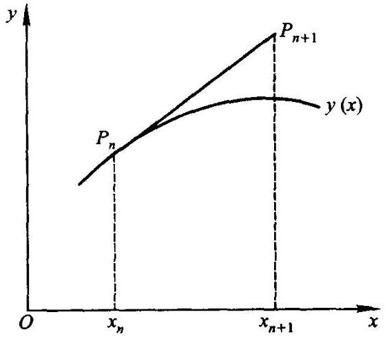

图 3-1

<!-- Media -->

## 2. 隐式欧拉格式

设改用向后差商 $\frac{1}{h}\left\lbrack  {y\left( {x}_{n + 1}\right)  - }\right.$ $\left. {y\left( {x}_{n}\right) }\right\rbrack$ 替代方程

$$
{y}^{\prime }\left( {x}_{n + 1}\right)  = f\left( {{x}_{n + 1},y\left( {x}_{n + 1}\right) }\right)
$$

中的导数项 ${y}^{\prime }\left( {x}_{n + 1}\right)$ ,再离散化,即可导出下列格式

$$
{y}_{n + 1} = {y}_{n} + {hf}\left( {{x}_{n + 1},{y}_{n + 1}}\right)  \tag{5}
$$

这一格式与欧拉格式有着本质的区别: 欧拉格式 (3) 是关于 ${y}_{n}$ 的一个直接的计算公式,这类格式称作是显式的; 而格式 (5) 的右端含有未知的 ${y}_{n + 1}$ ,它实际上是个关于 ${y}_{n + 1}$ 的函数方程 (关于函数方程的解法将在下一章介绍),这类格式称作是隐式的. 隐式格式的计算远比显式格式困难.

由于数值微分的向前差商公式与向后差商公式具有同等精度, 可以预料, 隐式欧拉格式 (5) 与显式欧拉格式 (3) 的精度相当, 都是一阶方法.

## 3. 两步欧拉格式

为了改善精度,我们改用中心差商 $\frac{1}{2h}\left\lbrack  {y\left( {x}_{n + 1}\right)  - y\left( {x}_{n - 1}\right) }\right\rbrack$ 替代方程 ${y}^{\prime }\left( {x}_{n}\right)  = f\left( {{x}_{n},y\left( {x}_{n}\right) }\right)$ 中的导数项,再离散化,即可得出下列格式

$$
{y}_{n + 1} = {y}_{n - 1} + {2hf}\left( {{x}_{n},{y}_{n}}\right)  \tag{6}
$$

无论是显式欧拉格式 (3) 还是隐式欧拉格式 (5), 它们都是单步法, 其特点是计算 ${y}_{n + 1}$ 时只用到前一步的信息 ${y}_{n}$ ; 然而格式 (6) 除了 ${y}_{n}$ 以外,还显含更前一步的信息 ${y}_{n - 1}$ ,即调用了前面两步的信息,两步欧拉格式因此而得名.

两步欧拉格式显然比显式或隐式的欧拉格式具有更高的精度. 事实上, 由泰勒展开知

$$
y\left( {x}_{n + 1}\right)  = y\left( {x}_{n - 1}\right)  + {2h}{y}^{\prime }\left( {x}_{n}\right)  + \frac{{h}^{3}}{3}{y}^{\prime \prime \prime }\left( \xi \right) ,\;{x}_{n - 1} < \xi  < {x}_{n + 1}
$$

假设 ${y}_{n} = y\left( {x}_{n}\right) ,{y}_{n - 1} = y\left( {x}_{n - 1}\right)$ ,则上式右端前两项之和即为按式 (6) 求得的值

${y}_{n + 1}$ ,因此两步欧拉格式 (6) 的局部截断误差为 $O\left( {h}^{3}\right)$ ,即它是一种二阶方法.

### 3.2 改进的欧拉方法

## 1. 梯形格式

设将方程 ${y}^{\prime } = f\left( {x,y}\right)$ 的两端从 ${x}_{n}$ 到 ${x}_{n + 1}$ 求积分,即得

$$
y\left( {x}_{n + 1}\right)  = y\left( {x}_{n}\right)  + {\int }_{{x}_{n}}^{{x}_{n + 1}}f\left( {x,y\left( x\right) }\right) \mathrm{d}x \tag{7}
$$

显然,为要通过这个积分关系式获得 $y\left( {x}_{n + 1}\right)$ 的近似值,只要近似地算出其中的积分项 ${\int }_{{x}_{n}}^{{x}_{n + 1}}f\left( {x,y\left( x\right) }\right) \mathrm{d}x$ . 而选用不同的计算方法计算这个积分项,就会得到不同的差分格式.

例如, 设用矩形方法计算积分项

$$
{\int }_{{x}_{n}}^{{x}_{n + 1}}f\left( {x,y\left( x\right) }\right) \mathrm{d}x \approx  {hf}\left( {{x}_{n},y\left( {x}_{n}\right) }\right)
$$

代入式(7), 有

$$
y\left( {x}_{n + 1}\right)  \approx  y\left( {x}_{n}\right)  + {hf}\left( {{x}_{n},y\left( {x}_{n}\right) }\right)
$$

据此离散化, 我们又可导出欧拉格式. 由于数值积分的矩形方法精度很低, 欧拉方法当然很粗糙.

为了提高精度, 我们改用梯形方法计算积分项

$$
{\int }_{{x}_{n}}^{{x}_{n + 1}}f\left( {x,y\left( x\right) }\right) \mathrm{d}x \approx  \frac{h}{2}\left\lbrack  {f\left( {{x}_{n},y\left( {x}_{n}\right) }\right)  + f\left( {{x}_{n + 1},y\left( {x}_{n + 1}\right) }\right) }\right\rbrack
$$

再代入式(7),有

$$
y\left( {x}_{n + 1}\right)  \approx  y\left( {x}_{n}\right)  + \frac{h}{2}\left\lbrack  {f\left( {{x}_{n},y\left( {x}_{n}\right) }\right)  + f\left( {{x}_{n + 1},y\left( {x}_{n + 1}\right) }\right) }\right\rbrack
$$

设将式中的 $y\left( {x}_{n}\right) ,y\left( {x}_{n + 1}\right)$ 分别用 ${y}_{n},{y}_{n + 1}$ 替代,作为离散化的结果导出下列计算格式

$$
{y}_{n + 1} = {y}_{n} + \frac{h}{2}\left\lbrack  {f\left( {{x}_{n},{y}_{n}}\right)  + f\left( {{x}_{n + 1},{y}_{n + 1}}\right) }\right\rbrack   \tag{8}
$$

与梯形求积公式相呼应的这一差分格式称作梯形格式.

容易看出, 梯形格式 (8) 实际上是显式欧拉格式 (3) 与隐式欧拉格式 (5) 的算术平均.

## 2. 改进的欧拉格式

欧拉方法 (3) 是一种显式算法, 其计算量小, 但精度很低; 梯形方法 (8) 虽提高了精度, 但它是一种隐式算法, 需要借助于迭代过程求解, 计算量大.

我们将综合使用这两种方法, 先用欧拉方法求得一个初步的近似值, 记为 ${\bar{y}}_{n + 1}$ ,称之为预报值; 预报值 ${\bar{y}}_{n + 1}$ 的精度不高,我们用它替代式 (8) 右端的 ${y}_{n + 1}$ 再直接计算,得到校正值 ${y}_{n + 1}$ . 这样建立的预报 - 校正系统

$$
\left\{  \begin{array}{ll} \text{ 预报 } & {\bar{y}}_{n + 1} = {y}_{n} + {hf}\left( {{x}_{n},{y}_{n}}\right) \\  \text{ 校正 } & {y}_{n + 1} = {y}_{n} + \frac{h}{2}\left\lbrack  {f\left( {{x}_{n},{y}_{n}}\right)  + f\left( {{x}_{n + 1},{\bar{y}}_{n + 1}}\right) }\right\rbrack   \end{array}\right.  \tag{9}
$$

称作改进的欧拉格式. 这是一种一步显式格式, 它可表为如下嵌套形式

$$
{y}_{n + 1} = {y}_{n} + \frac{h}{2}\left\lbrack  {f\left( {{x}_{n},{y}_{n}}\right)  + f\left( {{x}_{n + 1},{y}_{n} + {hf}\left( {{x}_{n},{y}_{n}}\right) }\right) }\right\rbrack
$$

或表为下列平均化形式

$$
\left\{  \begin{array}{l} {y}_{p} = {y}_{n} + {hf}\left( {{x}_{n},{y}_{n}}\right) \\  {y}_{c} = {y}_{n} + {hf}\left( {{x}_{n + 1},{y}_{p}}\right) \\  {y}_{n + 1} = \frac{1}{2}\left( {{y}_{p} + {y}_{c}}\right)  \end{array}\right.  \tag{10}
$$

<!-- Media -->

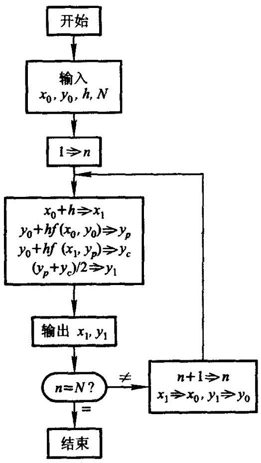

图 3-2

<!-- Media -->

图 3-2 描述了改进的欧拉方法, 其中 $h$ 为步长, $N$ 为步数, ${x}_{0},{y}_{0}$ 为 “老值”, 即前一步的近似解, ${x}_{1},{y}_{1}$ 为 “新值”,即该步计算结果.

例 2 用改进的欧拉方法求解初值问题(4).

解 求解初值问题的改进的欧拉格式 (10)具有形式

$$
\left\{  \begin{array}{l} {y}_{p} = {y}_{n} + h\left( {{y}_{n} - \frac{2{x}_{n}}{{y}_{n}}}\right) \\  {y}_{c} = {y}_{n} + h\left( {{y}_{p} - \frac{2{x}_{n + 1}}{{y}_{p}}}\right) \\  {y}_{n + 1} = \frac{1}{2}\left( {{y}_{p} + {y}_{c}}\right)  \end{array}\right.
$$

仍取 $h = {0.1}$ ,计算结果见表 3-2. 同例 1

欧拉方法的计算结果 (表 3-1) 比较, 改进的欧拉方法明显地改善了精度.

<!-- Media -->

表 3-2

<table><tr><td>${x}_{n}$</td><td>${y}_{n}$</td><td>$y\left( {x}_{n}\right)$</td><td>${x}_{n}$</td><td>${y}_{n}$</td><td>$y\left( {x}_{n}\right)$</td></tr><tr><td>0.1</td><td>1.095 9</td><td>1.0954</td><td>0.3</td><td>1.2662</td><td>1.2649</td></tr><tr><td>0.2</td><td>1.1841</td><td>1.1832</td><td>0.4</td><td>1.3434</td><td>1.3416</td></tr></table>

续表

<table><tr><td>${x}_{n}$</td><td>${y}_{n}$</td><td>$y\left( {x}_{n}\right)$</td><td>${x}_{n}$</td><td>${y}_{n}$</td><td>$y\left( {x}_{n}\right)$</td></tr><tr><td>0.5</td><td>1.416 4</td><td>1.4142</td><td>0.8</td><td>1.6165</td><td>1.6125</td></tr><tr><td>0.6</td><td>1.4860</td><td>1.4832</td><td>0.9</td><td>1.6782</td><td>1.6733</td></tr><tr><td>0.7</td><td>1.5525</td><td>1.5492</td><td>1.0</td><td>1.7379</td><td>1.7321</td></tr></table>

<!-- Media -->

### 3.3 龙格 - 库塔方法

## 1. 龙格 - 库塔方法的设计思想

考察差商 $\frac{y\left( {x}_{n + 1}\right)  - y\left( {x}_{n}\right) }{h}$ ,根据微分中值定理,存在点 $\xi ,{x}_{n} &lt; \xi  &lt;$ ${x}_{n + 1}$ ,使得

$$
\frac{y\left( {x}_{n + 1}\right)  - y\left( {x}_{n}\right) }{h} = {y}^{\prime }\left( \xi \right)
$$

从而利用所给方程 ${y}^{\prime } = f$ 得

$$
y\left( {x}_{n + 1}\right)  = y\left( {x}_{n}\right)  + {hf}\left( {\xi ,y\left( \xi \right) }\right)  \tag{11}
$$

其中的 ${K}^{ * } = f\left( {\xi ,y\left( \xi \right) }\right)$ 称作区间 $\left\lbrack  {{x}_{n},{x}_{n + 1}}\right\rbrack$ 上的平均斜率. 这样,只要对平均斜率 ${K}^{ * }$ 提供一种算法,由式 (11) 便相应地导出一种计算格式.

按照这种观点考察欧拉格式 (3),它简单地取点 ${x}_{n}$ 的斜率值 ${K}_{1} = f\left( {x}_{n}\right.$ , $\left. {y}_{n}\right)$ 作为区间 $\left\lbrack  {{x}_{n},{x}_{n + 1}}\right\rbrack$ 上的平均斜率 ${K}^{ * }$ ,精度自然很低.

再考察改进的欧拉格式 (9), 它可改写成下列平均化形式:

$$
\left\{  \begin{array}{l} {y}_{n + 1} = {y}_{n} + \frac{h}{2}\left( {{K}_{1} + {K}_{2}}\right) \\  {K}_{1} = f\left( {{x}_{n},{y}_{n}}\right) \\  {K}_{2} = f\left( {{x}_{n + 1},{y}_{n} + h{K}_{1}}\right)  \end{array}\right.
$$

因之可以理解为: 它用 ${x}_{n}$ 与 ${x}_{n + 1}$ 两个点的斜率值 ${K}_{1}$ 和 ${K}_{2}$ 取算术平均作为平均斜率 ${K}^{ * }$ ,而 ${x}_{n + 1}$ 处的斜率值 ${K}_{2}$ 则利用已知信息 ${y}_{n}$ 通过欧拉方法来预报.

这个处理过程启示我们,如果设法在 $\left\lbrack  {{x}_{n},{x}_{n + 1}}\right\rbrack$ 内多预报几个点的斜率值, 然后将它们加权平均作为区间 $\left\lbrack  {{x}_{n},{x}_{n + 1}}\right\rbrack$ 上的平均斜率 ${K}^{ * }$ ,则有可能构造出更高精度的计算格式, 这就是龙格 - 库塔 (Runge-Kutta) 方法的设计思想.

## 2. 二阶龙格 - 库塔方法

首先推广改进的欧拉方法. 随意考察区间 $\left\lbrack  {{x}_{n},{x}_{n + 1}}\right\rbrack$ 内一点

$$
{x}_{n + p} = {x}_{n} + {ph},\;0 < p \leq  1
$$

我们希望用 ${x}_{n}$ 和 ${x}_{n + p}$ 两个点的斜率值 ${K}_{1}$ 和 ${K}_{2}$ 加权平均得到平均斜率 ${K}^{ * }$ , 即令

$$
{y}_{n + 1} = {y}_{n} + h\left\lbrack  {\left( {1 - \lambda }\right) {K}_{1} + \lambda {K}_{2}}\right\rbrack
$$

式中 $\lambda$ 为待定系数. 同改进的欧拉格式一样,这里仍取 ${K}_{1} = f\left( {{x}_{n},{y}_{n}}\right)$ ,问题在于该怎样预报 ${x}_{n + p}$ 处的斜率值 ${K}_{2}$ ?

仿照改进的欧拉格式 (9),先用欧拉方法提供 $y\left( {x}_{n + p}\right)$ 的预报值 ${y}_{n + p}$ :

$$
{y}_{n + p} = {y}_{n} + {ph}{K}_{1}
$$

然后用 ${y}_{n + p}$ 通过计算 $f$ 产生斜率值

$$
{K}_{2} = f\left( {{x}_{n + p},{y}_{n + p}}\right)
$$

这样设计出的计算格式具有形式

$$
\left\{  \begin{array}{l} {y}_{n + 1} = {y}_{n} + h\left\lbrack  {\left( {1 - \lambda }\right) {K}_{1} + \lambda {K}_{2}}\right\rbrack  \\  {K}_{1} = f\left( {{x}_{n},{y}_{n}}\right) \\  {K}_{2} = f\left( {{x}_{n + p},{y}_{n} + {ph}{K}_{1}}\right)  \end{array}\right.  \tag{12}
$$

其中含有两个待定参数 $\lambda ,p$ ,我们希望适当选取这些参数的值,使得格式 (12)具有较高的精度.

仍然假定 ${y}_{n} = y\left( {x}_{n}\right)$ ,分别将 ${K}_{1}$ 和 ${K}_{2}$ 进行泰勒展开,有

$$
{K}_{1} = f\left( {{x}_{n},{y}_{n}}\right)  = {y}^{\prime }\left( {x}_{n}\right)
$$

$$
{K}_{2} = f\left( {{x}_{n + p},{y}_{n} + {ph}{K}_{1}}\right)
$$

$$
= f\left( {{x}_{n},{y}_{n}}\right)  + {ph}\left\lbrack  {{f}_{x}\left( {{x}_{n},{y}_{n}}\right)  + f\left( {{x}_{n},{y}_{n}}\right) {f}_{y}\left( {{x}_{n},{y}_{n}^{ * }}\right) }\right\rbrack   + O\left( {h}^{2}\right)
$$

$$
= {y}^{\prime }\left( {x}_{n}\right)  + {ph}{y}^{\prime \prime }\left( {x}_{n}\right)  + O\left( {h}^{2}\right)
$$

代入式(12)得

$$
{y}_{n + 1} = y\left( {x}_{n}\right)  + h{y}^{\prime }\left( {x}_{n}\right)  + {\lambda p}{h}^{2}{y}^{\prime \prime }\left( {x}_{n}\right)  + O\left( {h}^{3}\right)
$$

和二阶泰勒展开式

$$
y\left( {x}_{n + 1}\right)  = y\left( {x}_{n}\right)  + h{y}^{\prime }\left( {x}_{n}\right)  + \frac{{h}^{2}}{2}{y}^{\prime \prime }\left( {x}_{n}\right)  + O\left( {h}^{3}\right)
$$

比较系数即可发现,欲使格式 (12) 的截断误差为 $O\left( {h}^{3}\right)$ ,只要成立

$$
{\lambda p} = \frac{1}{2} \tag{13}
$$

满足这一条件的一族格式 (12) 统称二阶龙格 - 库塔格式.

特别地,当 $p = 1,\lambda  = \frac{1}{2}$ 时,二阶龙格 - 库塔格式 (12) 就是改进的欧拉格式(9).

如果改取 $p = \frac{1}{2},\lambda  = 1$ ,这时的二阶龙格 - 库塔格式 (12) 称作变形的欧拉格式, 其形式是

$$
\left\{  \begin{array}{l} {y}_{n + 1} = {y}_{n} + h{K}_{2} \\  {K}_{1} = f\left( {{x}_{n},{y}_{n}}\right) \\  {K}_{2} = f\left( {{x}_{n} + \frac{1}{2},{y}_{n} + \frac{h}{2}{K}_{1}}\right)  \end{array}\right.  \tag{14}
$$

注意到 ${y}_{n + \frac{1}{2}} = {y}_{n} + \frac{h}{2}{K}_{1}$ 是欧拉方法预报出的中点 ${x}_{n + \frac{1}{2}}$ 的近似解,而 ${K}_{2} =$ $f\left( {{x}_{n + \frac{1}{2}},{y}_{n + \frac{1}{2}}}\right)$ 则近似地等于中点的斜率值 $f\left( {{x}_{n + \frac{1}{2}},y\left( {x}_{n + \frac{1}{2}}\right) }\right)$ ,格式 (14) 可以理解为用中点的斜率取代式 (11) 中的平均斜率. 由于这个缘故, 格式 (14) 亦称中点格式.

表面上看,中点格式 ${y}_{n + 1} = {y}_{n} + h{K}_{2}$ 中仅显含一个斜率值 ${K}_{2}$ ,但 ${K}_{2}$ 是通过 ${K}_{1}$ 计算出来的,因此它每做一步仍然需要两次计算函数 $f$ 的值,工作量和改进的欧拉格式相同.

## 3. 三阶龙格 - 库塔方法

为了进一步提高精度,设除 ${x}_{n + p}$ 外再考察一点

$$
{x}_{n + q} = {x}_{n} + {qh},p \leq  q \leq  1
$$

用 3 个点 ${x}_{n},{x}_{n + p},{x}_{n + q}$ 的斜率 ${K}_{1},{K}_{2},{K}_{3}$ 加权平均得出平均斜率 ${K}^{ * }$ 的近似值, 这时计算格式具有形式

$$
{y}_{n + 1} = {y}_{n} + h\left\lbrack  {\left( {1 - \lambda  - \mu }\right) {K}_{1} + \lambda {K}_{2} + \mu {K}_{3}}\right\rbrack   \tag{15}
$$

式中 ${K}_{1},{K}_{2}$ 仍用格式 (12) 所取的形式.

为了预报点 ${x}_{n + q}$ 的斜率值 ${K}_{3}$ ,在区间 $\left\lbrack  {{x}_{n},{x}_{n + q}}\right\rbrack$ 内有两个斜率值 ${K}_{1}$ 和 ${K}_{2}$ 可以利用,我们将 ${K}_{1}$ 与 ${K}_{2}$ 加权平均得出 $\left\lbrack  {{x}_{n},{x}_{n + q}}\right\rbrack$ 上的平均斜率,从而得到 $y\left( {x}_{n + q}\right)$ 的预报值 ${y}_{n + q}$ :

$$
{y}_{n + q} = {y}_{n} + {qh}\left\lbrack  {\left( {1 - \alpha }\right) {K}_{1} + \alpha {K}_{2}}\right\rbrack
$$

于是再通过计算 $f$ 得到

$$
{K}_{3} = f\left( {{x}_{n + q},{y}_{n + q}}\right)
$$

运用泰勒展开方法选择参数 $p,q,\lambda ,\mu ,\alpha$ ,可以使格式 (15) 具有三阶精度, 这类格式统称三阶龙格 - 库塔格式. 下列库塔格式是其中的一种:

$$
\left\{  \begin{array}{l} {y}_{n + 1} = {y}_{n} + \frac{h}{6}\left( {{K}_{1} + 4{K}_{2} + {K}_{3}}\right) \\  {K}_{1} = f\left( {{x}_{n},{y}_{n}}\right) \\  {K}_{2} = f\left( {{x}_{n + \frac{1}{2}},{y}_{n} + \frac{h}{2}{K}_{1}}\right) \\  {K}_{3} = f\left( {{x}_{n + 1},{y}_{n} + h\left( {-{K}_{1} + 2{K}_{2}}\right) }\right)  \end{array}\right.
$$

## 4. 四阶龙格 - 库塔方法

继续上述过程, 经过较复杂的数学演算, 可以进一步导出四阶龙格 - 库塔格式, 下列经典格式是其中常用的一种:

$$
\left\{  \begin{array}{l} {y}_{n + 1} = {y}_{n} + \frac{h}{6}\left( {{K}_{1} + 2{K}_{2} + 2{K}_{3} + {K}_{4}}\right) \\  {K}_{1} = f\left( {{x}_{n},{y}_{n}}\right) \\  {K}_{2} = f\left( {{x}_{n + \frac{1}{2}},{y}_{n} + \frac{h}{2}{K}_{1}}\right) \\  {K}_{3} = f\left( {{x}_{n + \frac{1}{2}},{y}_{n} + \frac{h}{2}{K}_{2}}\right) \\  {K}_{4} = f\left( {{x}_{n},{y}_{n} + {x}_{n} + {K}_{3}}\right)  \end{array}\right.  \tag{16}
$$

经典的龙格 - 库塔格式 (16) 每一步需要 4 次计算函数值 $f$ ,可以直接验证它具有四阶精度, 不过其论证极其繁琐, 这里从略.

图 3-3 描述了四阶经典的龙格 - 库塔方法.

<!-- Media -->

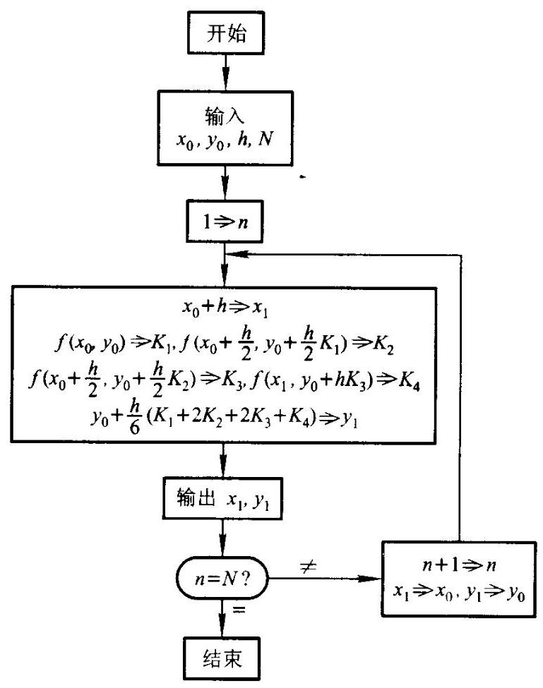

图 3-3

<!-- Media -->

例 3 设取步长 $h = {0.2}$ ,从 $x = 0$ 直到 $x = 1$ 用四阶经典格式 (16) 求解初值问题 (4).

解 这里四阶经典格式 (16) 中 ${K}_{1},{K}_{2},{K}_{3},{K}_{4}$ 的具体形式是

$$
{K}_{1} = {y}_{n} - \frac{2{x}_{n}}{{y}_{n}}
$$

$$
{K}_{2} = {y}_{n} + \frac{h}{2}{K}_{1} - \frac{2{x}_{n} + h}{{y}_{n} + \frac{h}{2}{K}_{1}}
$$

$$
{K}_{3} = {y}_{n} + \frac{h}{2}{K}_{2} - \frac{2{x}_{n} + h}{{y}_{n} + \frac{h}{2}{K}_{2}}
$$

$$
{K}_{4} = {y}_{n} + h{K}_{3} - \frac{2\left( {{x}_{n} + h}\right) }{{y}_{n} + h{K}_{3}}
$$

表 3-3 记录了计算结果,其中, $y\left( {x}_{n}\right)$ 仍表示准确解.

<!-- Media -->

表 3-3

<table><tr><td>${x}_{n}$</td><td>${y}_{n}$</td><td>$y\left( {x}_{n}\right)$</td><td>${x}_{n}$</td><td>${y}_{n}$</td><td>$y\left( {x}_{n}\right)$</td></tr><tr><td>0.2</td><td>1.1832</td><td>1.1832</td><td>0.8</td><td>1.6125</td><td>1.6125</td></tr><tr><td>0.4</td><td>1.3417</td><td>1.3416</td><td>1.0</td><td>1.7321</td><td>1.7321</td></tr><tr><td>0.6</td><td>1.4833</td><td>1.4832</td><td/><td/><td/></tr></table>

<!-- Media -->

比较例 3 与例 2 的计算结果, 显然经典格式的精度高. 要注意, 虽然经典格式的计算量较改进的欧拉格式大一倍, 但由于这里放大了步长, 造出表 3-3 所耗 脚的计算量几乎与表 3-2 相同. 这个例子又一次显示了选择算法的重要意义.

然而值得指出的是, 龙格 - 库塔方法的推导基于泰勒展开方法, 因而它要求所求的解具有较好的光滑性. 如果解的光滑性差, 那么, 使用四阶龙格 - 周塔方法求得的数值解, 其精度可能反而不如改进的欧拉方法. 在实际计算时应当针对问题的具体特点选择合适的算法.

## 5. 变步长的龙格 - 库塔方法

单从每一步看, 步长越小, 截断误差就越小; 但随着步长的缩小, 在一定求解范围内所要完成的步数就增加了. 步数的增加不但引起计算量的增大, 而且可能导致舍入误差的严重积累. 因此, 同积分的数值计算一样, 微分方程的数值解法也需要选择步长.

在选择步长时, 需要考虑的问题是:

(1)如何衡量和检验计算结果的精度；

(2)如何依据所判定的精度来处理步长.

再考察经典的四阶龙格 - 库塔格式 (16). 设从节点 ${x}_{n}$ 出发,先以 $h$ 为步长求出一个近似值,记为 ${y}_{n + 1}^{\left( h\right) }$ . 由于经典格式的局部截断误差为 $O\left( {h}^{5}\right)$ ,故有

$$
y\left( {x}_{n + 1}\right)  - {y}_{n + 1}^{\left( h\right) } \approx  C{h}^{5}
$$

这里系数 $C$ 与 ${y}^{\left( 5\right) }\left( x\right)$ 在 $\left\lbrack  {{x}_{n},{x}_{n + 1}}\right\rbrack$ 内的值有关. 然后换一种做法: 将步长折半,即取 $\frac{h}{2}$ 为步长从 ${x}_{n}$ 跨两步到 ${x}_{n + 1}$ 再求得一个近似值 ${y}_{n + 1}^{\left( \frac{h}{2}\right) }$ ,由于每跨一步的截断误差是 $C{\left( \frac{h}{2}\right) }^{5}$ ,因此有

$$
y\left( {x}_{n + 1}\right)  - {y}_{n + 1}^{\left( \frac{h}{2}\right) } \approx  {2C}{\left( \frac{h}{2}\right) }^{5}
$$

可以看到,步长折半后,误差大约减少 $\frac{1}{16}$ ,即有

$$
\frac{y\left( {x}_{n + 1}\right)  - {y}_{n + 1}^{\left( \frac{h}{2}\right) }}{y\left( {x}_{n + 1}\right)  - {y}_{n + 1}^{\left( h\right) }} \approx  \frac{1}{16}
$$

由此得下列事后估计式

$$
y\left( {x}_{n + 1}\right)  - {y}_{n + 1}^{\left( \frac{h}{2}\right) } \approx  \frac{1}{15}\left( {{y}_{n + 1}^{\left( \frac{h}{2}\right) } - {y}_{n + 1}^{\left( h\right) }}\right)
$$

这样, 可以通过检查步长折半前后两次计算结果的偏差

$$
\delta  = \left| {{y}_{n + 1}^{\left( \frac{h}{2}\right) } - {y}_{n + 1}^{\left( h\right) }}\right|
$$

来判断所选取的步长是否合适. 具体地说, 将区分以下两种情况来处理:

(1)对于给定的精度 $\varepsilon$ ,如果 $\delta  &gt; \varepsilon$ ,则反复将步长折半进行计算,直至 $\delta$ $&lt; \varepsilon$ 为止,这时取步长折半后的 “新值” 作为结果;

(2)如果 $\delta  &lt; \varepsilon$ ,则反复将步长加倍,直到 $\delta  &gt; \varepsilon$ 为止,这时取步长加倍前的 “老值” 作为结果.

这种通过步长折半或加倍的手续处理步长的方法称作变步长方法. 表面上看, 为了选择步长, 每一步的计算量增加了, 但总体考虑往往是合算的.

### 3.4 亚当姆斯方法

## 1. 亚当姆斯格式

前述龙格 - 库塔方法是一类重要算法, 但这类算法在每一步都需要先预报几个点上的斜率值,计算量比较大. 考虑到在计算 ${y}_{n + 1}$ 之前已得出一系列节点 ${x}_{n},{x}_{n - 1},\cdots$ 上的斜率值,能否利用这些 “老信息” 来减少计算量呢? 这就是亚当姆斯 (Adams) 方法的设计思想.

再考察式 (11). 设用 ${x}_{n},{x}_{n - 1}$ 两点的斜率值加权平均作为区间 $\left\lbrack  {{x}_{n},{x}_{n + 1}}\right\rbrack$ 上的平均斜率, 这样设计出的计算格式具有形式

$$
\left\{  \begin{array}{l} {y}_{n + 1} = {y}_{n} + h\left\lbrack  {\left( {1 - \lambda }\right) {y}_{n}^{\prime } + \lambda {y}_{n - 1}^{\prime }}\right\rbrack  \\  {y}_{n}^{\prime } = f\left( {{x}_{n},{y}_{n}}\right) \\  {y}_{n - 1}^{\prime } = f\left( {{x}_{n - 1},{y}_{n - 1}}\right)  \end{array}\right.  \tag{1}
$$

我们希望适当选取参数 $\lambda$ ,使上述格式具有二阶精度,即与二阶龙格 - 库塔法的精度相当.

假设 ${y}_{n} = y\left( {x}_{n}\right) ,{y}_{n - 1} = y\left( {x}_{n - 1}\right)$ ,将式 (17) 泰勒展开得

$$
{y}_{n + 1} = y\left( {x}_{n}\right)  + h{y}^{\prime }\left( {x}_{n}\right)  - \lambda {h}^{2}{y}^{\prime \prime }\left( {x}_{n}\right)  + \cdots
$$

由此可见,为使计算格式 (17) 具有二阶精度,须取 $\lambda  =  - \frac{1}{2}$ ,这样导出的计算格式

$$
{y}_{n + 1} = {y}_{n} + \frac{h}{2}\left( {3{y}_{n}^{\prime } - {y}_{n - 1}^{\prime }}\right)
$$

称作二阶亚当姆斯格式. 类似地可以导出三阶亚当姆斯格式

$$
{y}_{n + 1} = {y}_{n} + \frac{h}{12}\left( {{23}{y}_{n}^{\prime } - {16}{y}_{n - 1}^{\prime } + 5{y}_{n - 2}^{\prime }}\right)
$$

和四阶亚当姆斯格式

$$
{y}_{n + 1} = {y}_{n} + \frac{h}{24}\left( {{55}{y}_{n}^{\prime } - {59}{y}_{n - 1}^{\prime } + {37}{y}_{n - 2}^{\prime } - 9{y}_{n - 3}^{\prime }}\right)
$$

这里和下面均记 ${y}_{n - k}^{\prime } = f\left( {{x}_{n - k},{y}_{n - k}}\right)$ .

上述亚当姆斯格式都是显式的,算法比较简单,但由于用节点 $x$ ${x}_{n - 1},\cdots$ 的斜率值来预报区间 $\left\lbrack  {{x}_{n},{x}_{n + 1}}\right\rbrack$ 上的平均斜率是个外推过程,效果够理想. 为了进一步改善精度,我们增加节点 ${x}_{n + 1}$ 的斜率值来得出 $\left\lbrack  {{x}_{n},{x}_{n + 1}}\right.$ 上的平均斜率. 譬如, 考察形如

$$
\left\{  \begin{array}{l} {y}_{n + 1} = {y}_{n} + h\left\lbrack  {\left( {1 - \lambda }\right) {y}_{n + 1}^{\prime } + \lambda {y}_{n}^{\prime }}\right\rbrack  \\  {y}_{n}^{\prime } = f\left( {{x}_{n},{y}_{n}}\right) \\  {y}_{n + 1}^{\prime } = f\left( {{x}_{n + 1},{y}_{n + 1}}\right)  \end{array}\right.  \tag{1}
$$

的隐式格式,设 ${y}_{n} = y\left( {x}_{n}\right) ,{y}_{n + 1} = y\left( {x}_{n + 1}\right)$ . 将式 (18) 右端泰勒展开有

$$
{y}_{n + 1} = y\left( {x}_{n}\right)  + h{y}^{\prime }\left( {x}_{n}\right)  + {h}^{2}\left( {1 - \lambda }\right) {y}^{\prime \prime }\left( {x}_{n}\right)  + \cdots
$$

可见欲使格式 (18) 具有二阶精度,需令 $\lambda  = \frac{1}{2}$ ,这样构造出的二阶隐式亚当斯格式

$$
{y}_{n + 1} = {y}_{n} + \frac{h}{2}\left( {{y}_{n + 1}^{\prime } + {y}_{n}^{\prime }}\right)
$$

其实就是梯形格式 (8). 类似地可以导出三阶隐式亚当姆斯格式

$$
{y}_{n + 1} = {y}_{n} + \frac{h}{12}\left( {5{y}_{n + 1}^{\prime } + 8{y}_{n}^{\prime } - {y}_{n - 1}^{\prime }}\right)
$$

和四阶隐式亚当姆斯格式

$$
{y}_{n + 1} = {y}_{n} + \frac{h}{24}\left( {9{y}_{n + 1}^{\prime } + {19}{y}_{n}^{\prime } - 5{y}_{n - 1}^{\prime } + {y}_{n - 2}^{\prime }}\right)
$$

## 2. 亚当姆斯预报 - 校正系统

仿照改进的欧拉格式的构造方法, 将显式和隐式两种亚当姆斯格式相匹配, 构成下列亚当姆斯预报 - 校正系统:

$$
\left\{  \begin{array}{ll} \text{ 预报 } & {\bar{y}}_{n + 1} = {y}_{n} + \frac{h}{24}\left( {{55}{y}_{n}^{\prime } - {59}{y}_{n - 1}^{\prime } + {37}{y}_{n - 2}^{\prime } - 9{y}_{n - 3}^{\prime }}\right) \\   & {\bar{y}}_{n + 1}^{\prime } = f\left( {{x}_{n + 1},{\bar{y}}_{n + 1}}\right) \\  \text{ 校正 } & {y}_{n + 1} = {y}_{n} + \frac{h}{24}\left( {9{\bar{y}}_{n + 1}^{\prime } + {19}{y}_{n}^{\prime } - 5{y}_{n - 1}^{\prime } + {y}_{n - 2}^{\prime }}\right) \\   & {y}_{n + 1}^{\prime } = f\left( {{x}_{n + 1},{y}_{n + 1}}\right)  \end{array}\right.  \tag{19}
$$

<!-- Media -->

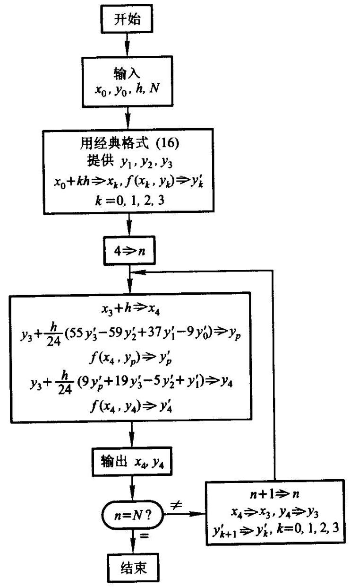

图 3-4

<!-- Media -->

这种预报 - 校正系统是四步法,它在计算 ${y}_{n + 1}$ 时不但要用到前一步的信息 ${y}_{n},{y}_{n}^{\prime }$ ,而且要用到更前面三步的信息 ${y}_{n - 1}^{\prime },{y}_{n - 2}^{\prime },{y}_{n - 3}^{\prime }$ ,因此它不能自行启动. 在实际计算时, 可借助于某种单步法, 譬如用四阶龙格 - 库塔格式 (16)为预报 - 校正系统(19)提供开始值 ${y}_{1},{y}_{2},{y}_{3}$ . 图 3-4 描述了这种算法.

例 4 用亚当姆斯预报 - 校正系统 (19) 求解初值问题 (4).

解 取步长 $h = {0.1}$ ,用四阶龙格 - 库塔格式 (16) 计算开始值 ${y}_{1},{y}_{2},{y}_{3}$ , 然后套用预报 - 校正系统 (19),计算结果见表 3-4. 表中 ${\bar{y}}_{n}$ 和 ${y}_{n}$ 分别为预报值和校正值,同时列出了准确值 $y\left( {x}_{n}\right)$ 以比较计算结果的精度.

<!-- Media -->

表 3-4

<table><tr><td>${x}_{n}$</td><td>${\widetilde{y}}_{n}$</td><td>${y}_{n}$</td><td>$y\left( {x}_{n}\right)$</td></tr><tr><td>0.0</td><td/><td>1.000 0</td><td>1.000 0</td></tr><tr><td>0.1</td><td/><td>1.095 4</td><td>1.095 4</td></tr><tr><td>0.2</td><td/><td>1.1832</td><td>1.1832</td></tr><tr><td>0.3</td><td/><td>1.2649</td><td>1.2649</td></tr><tr><td>0.4</td><td>1.3415</td><td>1.3416</td><td>1.3416</td></tr><tr><td>0.5</td><td>1.4141</td><td>1.4142</td><td>1.4142</td></tr><tr><td>0.6</td><td>1.4832</td><td>1.483 2</td><td>1.4832</td></tr><tr><td>0.7</td><td>1.5491</td><td>1.5492</td><td>1.5492</td></tr><tr><td>0.8</td><td>1.6124</td><td>1.6124</td><td>1.6125</td></tr><tr><td>0.9</td><td>1.6733</td><td>1.6733</td><td>1.6733</td></tr><tr><td>1.0</td><td>1.7320</td><td>1.7320</td><td>1.7321</td></tr></table>

<!-- Media -->

## 3. 误差分析

由于式 (19) 中的预报公式与校正公式具有同等精度, 因而可以方便地估计出截断误差. 将会看到, 基于这种估计, 可以提供一种提高精度的有效方法.

先考察预报公式. 假设 ${y}_{n - k} = y\left( {x}_{n - k}\right) ,k = 0,1,2,3$ ,这时

$$
{y}_{n - k}^{\prime } = f\left( {{x}_{n - k},{y}_{n - k}}\right)  = {y}^{\prime }\left( {x}_{n - k}\right)
$$

代入式 (19) 的预报公式,并在 ${x}_{n}$ 展开,有

$$
{\bar{y}}_{n + 1} = y\left( {x}_{n}\right)  + h{y}^{\prime }\left( {x}_{n}\right)  + \frac{{h}^{2}}{2}{y}^{\prime \prime }\left( {x}_{n}\right)  + \frac{{h}^{3}}{6}{y}^{\prime \prime \prime }\left( {x}_{n}\right)  +
$$

$$
\frac{{h}^{4}}{24}{y}^{\left( 4\right) }\left( {x}_{n}\right)  - \frac{49}{144}{h}^{5}{y}^{\left( 5\right) }\left( {x}_{n}\right)  + \cdots
$$

另一方面, 对于精确解

$$
y\left( {x}_{n + 1}\right)  = y\left( {x}_{n}\right)  + h{y}^{\prime }\left( {x}_{n}\right)  + \frac{{h}^{2}}{2}{y}^{\prime \prime }\left( {x}_{n}\right)  + \frac{{h}^{3}}{6}{y}^{\prime \prime \prime }\left( {x}_{n}\right)
$$

$$
+ \frac{{h}^{4}}{24}{y}^{\left( 4\right) }\left( {x}_{n}\right)  + \frac{{h}^{5}}{120}{y}^{\left( 5\right) }\left( {x}_{n}\right)  + \cdots
$$

因而预报公式的截断误差

$$
y\left( {x}_{n + 1}\right)  - {\bar{y}}_{n + 1} \approx  \frac{251}{720}{h}^{5}{y}^{\left( 5\right) }\left( {x}_{n}\right)
$$

类似地可以导出系统 (19) 的校正公式的截断误差

$$
y\left( {x}_{n + 1}\right)  - {y}_{n + 1} \approx   - \frac{19}{720}{h}^{5}{y}^{\left( 5\right) }\left( {x}_{n}\right)
$$

从以上两个误差估计式中消去 ${y}^{\left( 5\right) }\left( {x}_{n}\right)$ ,易得下列事后估计式:

$$
\left\{  \begin{array}{l} y\left( {x}_{n + 1}\right)  - {\bar{y}}_{n + 1} \approx  \frac{251}{270}\left( {{y}_{n + 1} - {\bar{y}}_{n + 1}}\right) \\  y\left( {x}_{n + 1}\right)  - {y}_{n + 1} \approx   - \frac{19}{270}\left( {{y}_{n + 1} - {\bar{y}}_{n + 1}}\right)  \end{array}\right.  \tag{20}
$$

可以期望, 利用这样估计出的误差作为计算结果的一种补偿, 有可能使精度进一步得到改善.

令 ${p}_{n}$ 和 ${c}_{n}$ 分别代表第 $n$ 步的预报值和校正值,按估计式 (20), ${p}_{n + 1} + \frac{251}{270}$ $\left( {{c}_{n + 1} - {p}_{n + 1}}\right)$ 和 ${c}_{n + 1} - \frac{19}{270}\left( {{c}_{n + 1} - {p}_{n + 1}}\right)$ 分别可以取作 ${p}_{n + 1}$ 和 ${c}_{n + 1}$ 的改进值. 在校正值 ${c}_{n + 1}$ 尚未求出之前,我们可以用上一步的偏差值 ${p}_{n} - {c}_{n}$ 来代替 ${p}_{n + 1}$ - ${c}_{n + 1}$ 进行计算,这样就可以将亚当姆斯预报 - 校正系统 (19) 进一步加工成下列计算方案:

预报 ${p}_{n + 1} = {y}_{n} + \frac{h}{24}\left( {{55}{y}_{n}^{\prime } - {59}{y}_{n - 1}^{\prime } + {37}{y}_{n - 2}^{\prime } - 9{y}_{n - 3}^{\prime }}\right)$

改进 ${m}_{n + 1} = {p}_{n + 1} + \frac{251}{270}\left( {{c}_{n} - {p}_{n}}\right)$

$$
{m}_{n + 1}^{\prime } = f\left( {{x}_{n + 1},{m}_{n + 1}}\right)  \tag{21}
$$

校正 ${c}_{n + 1} = {y}_{n} + \frac{h}{24}\left( {9{m}_{n + 1}^{\prime } + {19}{y}_{n}^{\prime } - 5{y}_{n - 1}^{\prime } + {y}_{n - 2}^{\prime }}\right)$

改进 ${y}_{n + 1} = {c}_{n + 1} - \frac{19}{270}\left( {{c}_{n + 1} - {p}_{n + 1}}\right)$

$$
{y}_{n + 1}^{\prime } = f\left( {{x}_{n + 1},{y}_{n + 1}}\right)
$$

上述计算方案要用到前几步的信息 ${y}_{n},{y}_{n}^{\prime },{y}_{n - 1}^{\prime },{y}_{n - 2}^{\prime },{y}_{n - 3}^{\prime }$ 和 ${c}_{n} - {p}_{n}$ , 因此在启动计算之前必须先给出开始值 ${y}_{1},{y}_{2},{y}_{3}$ 和 ${c}_{3} - {p}_{3}$ . 同亚当姆斯预报 - 校正公式(19)一样, ${y}_{1},{y}_{2},{y}_{3}$ 可用其他四阶单步法(如四阶龙格 - 库塔

### 3.5 收敛性与稳定性

## 1. 收敛性问题

前已看到, 差分方法的基本思想是, 通过离散化手续, 将微分方程转化为差分方程 (代数方程) 来求解. 这种转化是否合理,还要看差分方程的解 ${y}_{n}$ 当 $h \rightarrow  0$ 时是否会收敛到微分方程的准确解 $y\left( {x}_{n}\right)$ . 对于任意固定的 ${x}_{n} = {x}_{0} + {nh}$ , 如果数值解 ${y}_{n}$ 当 $h \rightarrow  0$ (同时 $n \rightarrow  \infty$ ) 时趋向于准确解 $y\left( {x}_{n}\right)$ ,则称该方法是收敛的.

以下研究欧拉方法的收敛性. 设 ${\bar{y}}_{n + 1}$ 表示取 ${y}_{n} = y\left( {x}_{n}\right)$ 按欧拉格式

$$
{y}_{n + 1} = {y}_{n} + {hf}\left( {{x}_{n},{y}_{n}}\right)  \tag{22}
$$

求得的结果, 即

$$
{\bar{y}}_{n + 1} = y\left( {x}_{n}\right)  + {hf}\left( {{x}_{n},y\left( {x}_{n}\right) }\right)  \tag{23}
$$

由于其局部截断误差 (参看本章 3.1 节)

$$
y\left( {x}_{n + 1}\right)  - {\bar{y}}_{n + 1} = \frac{{h}^{2}}{2}{y}^{\prime \prime }\left( \xi \right) ,\;{x}_{n} < \xi  < {x}_{n + 1}
$$

因而存在定数 $C$ ,使

$$
\left| {y\left( {x}_{n + 1}\right)  - {\bar{y}}_{n + 1}}\right|  < C{h}^{2} \tag{24}
$$

进一步考察整体截断误差. 令 ${e}_{n} = \left| {y\left( {x}_{n}\right)  - {y}_{n}}\right|$ ,由于

$$
\left| {y\left( {x}_{n + 1}\right)  - {y}_{n + 1}}\right|  \leq  \left| {{y}_{n + 1} - {\bar{y}}_{n + 1}}\right|  + \left| {y\left( {x}_{n + 1}\right)  - {\bar{y}}_{n + 1}}\right|  \tag{25}
$$

将式(22)与式(23)相减, 知

$$
\left| {{y}_{n + 1} - {\bar{y}}_{n + 1}}\right|  \leq  \left( {1 + {hL}}\right) \left| {y\left( {x}_{n}\right)  - {y}_{n}}\right|
$$

式中 $L$ 是 $f$ 关于 $y$ 的李普希兹常数. 再利用式 (24),由式 (25) 得

$$
{e}_{n + 1} \leq  \left( {1 + {hL}}\right) {e}_{n} + C{h}^{2}
$$

据此反复递推有

$$
{e}_{n} \leq  {\left( 1 + hL\right) }^{n}{e}_{0} + \frac{Ch}{L}\left\lbrack  {{\left( 1 + hL\right) }^{n} - 1}\right\rbrack
$$

注意到 $1 + {hL} \leq  {e}^{hL}$ ,设 ${x}_{n} - {x}_{0} = {nh} \leq  T$ ( $T$ 为定数),则

$$
{\left( 1 + hL\right) }^{n} \leq  {e}^{nhL} \leq  {e}^{TL}
$$

因而有

$$
{e}_{n} \leq  {e}^{TL}{e}_{0} + \frac{C}{L}\left( {{e}^{TL} - 1}\right) h
$$

这样,如果初值 ${y}_{0}$ 是准确的,即 ${e}_{0} = 0$ ,则当 $h \rightarrow  0$ 时有 ${e}_{n} \rightarrow  0$ . 这说明欧拉方法是收敛的.

## 2. 稳定性问题

前面关于收敛性的讨论有个前提, 必须假定差分方法的每一步计算都是准确的. 实际情形并不是这样, 差分方程的求解还会有计算误差, 譬如由于数字舍入而引起的扰动. 这类扰动在传播过程中会不会恶性增长, 以至于 “淹没” 了差分方程的 “真解” 呢? 这就是差分方法的稳定性问题.

在实际计算时, 我们希望某一步产生的扰动值在后面的计算中能够被抑制,甚至是逐步衰减的. 具体地说,如果一种差分方法在节点值 ${y}_{n}$ 上大小为 $\delta$ 的扰动,于以后各节点值 ${y}_{m}\left( {m &gt; n}\right)$ 上产生的偏差均不超过 $\delta$ ,则称该方法是稳定的.

稳定性问题比较复杂. 为简化讨论, 我们仅考察下列模型方程

$$
{y}^{\prime } = {\lambda y},\;\lambda  < 0
$$

先考察欧拉方法的稳定性. 模型方程 ${y}^{\prime } = {\lambda y}$ 的欧拉格式为

$$
{y}_{n + 1} = \left( {1 + {h\lambda }}\right) {y}_{n} \tag{26}
$$

设在节点值 ${y}_{n}$ 上有一扰动值 ${\varepsilon }_{n}$ ,它的传播使节点值 ${y}_{n + 1}$ 上产生大小为 ${\varepsilon }_{n + 1}$ 的扰动值, 假设欧拉方法的计算过程不再引进新的误差, 则扰动值满足

$$
{\varepsilon }_{n + 1} = \left( {1 + {h\lambda }}\right) {\varepsilon }_{n}
$$

可见扰动值满足原来的差分方程 (26). 这样, 如果原差分方程的解是不增长的, 即有

$$
\left| {y}_{n + 1}\right|  \leq  \left| {y}_{n}\right|
$$

这时就能保证欧拉方法的稳定性.

显然,为要保证差分方程 (26) 的解不增长,必须选取 $h$ 充分小,使

$$
\left| {1 + {h\lambda }}\right|  \leq  1
$$

这表明欧拉方法是条件稳定的. 上述稳定性条件亦可表为

$$
0 < h \leq   - \frac{2}{\lambda }
$$

再考察隐式欧拉方法. 对于模型方程 ${y}^{\prime } = {\lambda y}$ ,其隐式欧拉格式为

$$
{y}_{n + 1} = {y}_{n} + {h\lambda }{y}_{n + 1}
$$

由此解出

$$
{y}_{n + 1} = \frac{1}{1 - {h\lambda }}{y}_{n}
$$

由于 $\lambda  &lt; 0$ ,这时恒成立

$$
\left| \frac{1}{1 - {h\lambda }}\right|  \leq  1
$$

从而总有 $\left| {y}_{n + 1}\right|  \leq  \left| {y}_{n}\right|$ ,这说明隐式欧拉格式是恒稳定 (无条件稳定) 的.

### 3.6 方程组与高阶方程的情形

## 1. 一阶方程组

前面我们研究了单个方程 ${y}^{\prime } = f$ 的差分方法,只要把 $y$ 和 $f$ 理解为向量, 那么, 所提供的各种算法即可推广应用到一阶方程组的情形.

譬如, 对于方程组

$$
\left\{  \begin{array}{ll} {y}^{\prime } = f\left( {x,y,z}\right) , & y\left( {x}_{0}\right)  = {y}_{0} \\  {z}^{\prime } = g\left( {x,y,z}\right) , & z\left( {x}_{0}\right)  = {z}_{0} \end{array}\right.
$$

令 ${x}_{n} = {x}_{0} + {nh},n = 1,2,\cdots$ ,以 ${y}_{n},{z}_{n}$ 表示节点 ${x}_{n}$ 上的近似解,则其改进的欧拉格式具有形式

预报

$$
{\bar{y}}_{n + 1} = {y}_{n} + {hf}\left( {{x}_{n},{y}_{n},{z}_{n}}\right)
$$

$$
{\bar{z}}_{n + 1} = {z}_{n} + {hg}\left( {{x}_{n},{y}_{n},{z}_{n}}\right)
$$

校正

$$
{y}_{n + 1} = {y}_{n} + \frac{h}{2}\left\lbrack  {f\left( {{x}_{n},{y}_{n},{z}_{n}}\right)  + f\left( {{x}_{n + 1},{\bar{y}}_{n + 1},{\bar{z}}_{n + 1}}\right) }\right\rbrack
$$

$$
{z}_{n + 1} = {z}_{n} + \frac{h}{2}\left\lbrack  {g\left( {{x}_{n},{y}_{n},{z}_{n}}\right)  + g\left( {{x}_{n + 1},{\bar{y}}_{n + 1},{\dot{z}}_{n + 1}}\right) }\right\rbrack
$$

而其四阶龙格 - 库塔格式 (经典格式) 则为

$$
\left\{  \begin{array}{l} {y}_{n + 1} = {y}_{n} + \frac{h}{6}\left( {{K}_{1} + 2{K}_{2} + 2{K}_{3} + {K}_{4}}\right) \\  {z}_{n + 1} = {z}_{n} + \frac{h}{6}\left( {{L}_{1} + 2{L}_{2} + 2{L}_{3} + {L}_{4}}\right)  \end{array}\right.  \tag{27}
$$

式中

$$
\left\{  \begin{array}{l} {K}_{1} = f\left( {{x}_{n},{y}_{n},{z}_{n}}\right) \\  {L}_{1} = g\left( {{x}_{n},{y}_{n},{z}_{n}}\right) \\  {K}_{2} = f\left( {{x}_{n} + \frac{1}{2},{y}_{n} + \frac{k}{2}{K}_{1},{z}_{n} + \frac{h}{2}{L}_{1}}\right) \\  {L}_{2} = g\left( {{x}_{n} + \frac{1}{2},{y}_{n} + \frac{h}{2}{K}_{1},{z}_{n} + \frac{h}{2}{L}_{1}}\right) \\  {K}_{3} = f\left( {{x}_{n} + \frac{1}{2},{y}_{n} + \frac{h}{2}{K}_{2},{z}_{n} + \frac{h}{2}{L}_{2}}\right) \\  {L}_{3} = g\left( {{x}_{n} + \frac{1}{2},{y}_{n} + \frac{h}{2}{K}_{2},{z}_{n} + \frac{h}{2}{L}_{2}}\right) \\  {K}_{4} = f\left( {{x}_{n} + {y}_{n} + {h}_{3},{x}_{n} + {h}_{3}{L}_{3}}\right) \\  {K}_{5} = f\left( {{x}_{n} + {y}_{n} + {h}_{3},{z}_{n} + {h}_{3}}\right)  \end{array}\right.  \tag{28}
$$

这里四阶龙格 - 库塔方法依然是一步法,利用节点值 ${y}_{n},{z}_{n}$ ,按式 (28) 顺序计算 ${K}_{1},{L}_{1},{K}_{2},{L}_{2},{K}_{3},{L}_{3},{K}_{4},{L}_{4}$ ,然后代入式 (27) 即可求得节点值 ${y}_{n + 1},{z}_{n + 1}$ .

## 2. 化高阶方程为一阶方程组

关于高阶微分方程 (或方程组) 的初值问题, 原则上总可以归结为一阶方程组来求解. 譬如, 对于下列二阶方程的初值问题:

$$
\left\{  \begin{array}{l} {y}^{\prime \prime } = f\left( {x,y,{y}^{\prime }}\right) \\  y\left( {x}_{0}\right)  = {y}_{0},{y}^{\prime }\left( {x}_{0}\right)  = {y}_{0}^{\prime } \end{array}\right.
$$

若引进新的变量 $z = {y}^{\prime }$ 即可化为一阶方程组的初值问题:

$$
\left\{  \begin{array}{l} {y}^{\prime } = z,\;y\left( {x}_{0}\right)  = {y}_{0} \\  {z}^{\prime } = f\left( {x,y,z}\right) ,\;z\left( {x}_{0}\right)  = {y}_{0}^{\prime } \end{array}\right.
$$

针对这个问题应用四阶龙格 - 库塔格式 (27) 有

$$
\left\{  \begin{array}{l} {y}_{n + 1} = {y}_{n} + \frac{h}{6}\left( {{K}_{1} + 2{K}_{2} + 2{K}_{3} + {K}_{4}}\right) \\  {z}_{n + 1} = {z}_{n} + \frac{h}{6}\left( {{L}_{1} + 2{L}_{2} + 2{L}_{3} + {L}_{4}}\right)  \end{array}\right.
$$

按式 (28), 有

$$
{K}_{1} = {z}_{n},\;{L}_{1} = f\left( {{x}_{n},{y}_{n},{z}_{n}}\right)
$$

$$
{K}_{2} = {z}_{n} + \frac{h}{2}{L}_{1},\;{L}_{2} = f\left( {{x}_{n + \frac{1}{2}},{y}_{n} + \frac{h}{2}{K}_{1},{z}_{n} + \frac{h}{2}{L}_{1}}\right)
$$

$$
{K}_{3} = {z}_{n} + \frac{h}{2}{L}_{2},\;{L}_{3} = f\left( {{x}_{n + \frac{1}{2}},{y}_{n} + \frac{h}{2}{K}_{2},{z}_{n} + \frac{h}{2}{L}_{2}}\right)
$$

$$
{K}_{4} = {z}_{n} + h{L}_{3},\;{L}_{4} = f\left( {{x}_{n + 1},{y}_{n} + h{K}_{3},{z}_{n} + h{L}_{3}}\right)
$$

消去 ${K}_{1},{K}_{2},{K}_{3},{K}_{4}$ ,上述格式可简化为

$$
\left\{  \begin{array}{l} {y}_{n + 1} = {y}_{n} + h{z}_{n} + \frac{{h}^{2}}{6}\left( {{L}_{1} + {L}_{2} + {L}_{3}}\right) \\  {z}_{n + 1} = {z}_{n} + \frac{h}{6}\left( {{L}_{1} + 2{L}_{2} + 2{L}_{3} + {L}_{4}}\right)  \end{array}\right.
$$

式中

$$
\left\{  \begin{array}{l} {L}_{1} = f\left( {{x}_{n},{y}_{n},{z}_{n}}\right) \\  {L}_{2} = f\left( {{x}_{n + \frac{1}{2}},{y}_{n} + \frac{h}{2}{z}_{n},{z}_{n} + \frac{h}{2}{L}_{1}}\right) \\  {L}_{3} = f\left( {{x}_{n + \frac{1}{2}},{y}_{n} + \frac{h}{2}{z}_{n} + \frac{{h}^{2}}{4}{L}_{1},{z}_{n} + \frac{h}{2}{L}_{2}}\right) \\  {L}_{4} = f\left( {{x}_{n + 1},{y}_{n} + h{z}_{n} + \frac{{h}^{2}}{2}{L}_{2},{z}_{n} + h{L}_{3}}\right)  \end{array}\right.
$$

### 3.7 边 值 问 题

在具体求解微分方程时, 必须附加某种定解条件. 微分方程和定解条件一起组成定解问题. 对高阶常微分方程, 定解条件通常有两种给法: 一种是给出积分曲线在初始时刻的性态, 这类条件称初始条件, 相应的定解问题就是前面已讨论过的初值问题; 另一种是给出了积分曲线首末两端的性态, 这类定解条件称边界条件, 相应的定解问题称为边值问题.

譬如, 考察下列二阶线性方程的边值问题

$$
\left\{  \begin{array}{l} {y}^{\prime \prime } + p\left( x\right) {y}^{\prime } + q\left( x\right) y = r\left( x\right) ,\;a < x < b \\  y\left( a\right)  = \alpha ,\;y\left( b\right)  = \beta  \end{array}\right.  \tag{29}
$$

为要应用差分法, 关键在于恰当地选取差商逼近微分方程中的导数, 这里令

$$
{y}^{\prime }\left( x\right)  \approx  \frac{y\left( {x + h}\right)  - y\left( {x - h}\right) }{2h}
$$

$$
{y}^{\prime \prime }\left( x\right)  \approx  \frac{y\left( {x + h}\right)  - {2y}\left( x\right)  + y\left( {x - h}\right) }{{h}^{2}}
$$

设将求解区间 $\left\lbrack  {a,b}\right\rbrack$ 划分为 $N$ 等分,步长 $h = \frac{b - a}{N}$ ,节点 ${x}_{n} = {x}_{0} + {nh}$ , $n = 0,1,\cdots ,N$ ,用差商替代相应的导数,可将边值问题 (29) 离散化,导出下列差分方程组

$$
\left\{  \begin{array}{l} \frac{{y}_{n + 1} - 2{y}_{n} + {y}_{n - 1}}{{h}^{2}} + {p}_{n}\frac{{y}_{n + 1} - {y}_{n - 1}}{2h} + {q}_{n}{y}_{n} = {r}_{n},\;n = 1,2,\cdots ,N - 1 \\  {y}_{0} = \alpha ,\;{y}_{N} = \beta  \end{array}\right.
$$

(30)

式中 ${p}_{n},{q}_{n},{r}_{n}$ 的下标 $n$ 表示在节点 ${x}_{n}$ 取值. 从上面的式子中消去已知的 ${y}_{0}$ 和 ${y}_{\Lambda }$ ,可整理得到关于 ${y}_{n}$ 的下列方程组

$$
\begin{cases} \left( {-2 + {h}^{2}{q}_{1}}\right) {y}_{1} + \left( {1 + \frac{h}{2}{p}_{1}}\right) {y}_{2} &  = {h}^{2}{r}_{1} - \left( {1 - \frac{h}{2}{p}_{1}}\right) \alpha \\  \left( {1 - \frac{h}{2}{p}_{n}}\right) {y}_{n - 1} + \left( {-2 + {h}^{2}{q}_{n}}\right) {y}_{n} + \left( {1 + \frac{h}{2}{p}_{n}}\right) {y}_{n + 1} &  = {h}^{2}{r}_{n}, \\  n &  = 2,3,\cdots ,N - 2 \\  \left( {1 - \frac{h}{2}{p}_{N - 1}}\right) {y}_{N - 2} + \left( {-2 + {h}^{2}{q}_{N - 1}}\right) {y}_{N - 1} &  = {h}^{2}{r}_{N - 1} - \left( {1 + \frac{h}{2}{p}_{N - 1}}\right) \beta  \end{cases}
$$

这样归结出的方程组是三对角型的, 求解这类方程组可用追赶法 (参看第六章 6.2 节).

## 例题选讲 3.1 龙格 - 库塔格式的精度分析

判定龙格 - 库塔格式的精度, 唯一可行的途径是泰勒展开. 为后文运用泰勒展开方法做准备, 现将一些求导公式罗列如下:

$$
{y}^{\prime }\left( x\right)  = f\left( {x,y\left( x\right) }\right) ,
$$

$$
{y}^{\prime \prime }\left( x\right)  = \left( {\frac{\partial f}{\partial x} + f\frac{\partial f}{\partial y}}\right) \left( {x,y\left( x\right) }\right) ,
$$

$$
{y}^{\prime \prime \prime }\left( x\right)  = \left( {\frac{{\partial }^{2}f}{\partial {x}^{2}} + {2f}\frac{{\partial }^{2}f}{\partial x\partial y} + {f}^{2}\frac{{\partial }^{2}f}{\partial {y}^{2}}}\right) \left( {x,y\left( x\right) }\right)
$$

$$
+ \left( {\frac{\partial f}{\partial x} + f\frac{\partial f}{\partial y}}\right) \left( {x,y\left( x\right) }\right) \frac{\partial f}{\partial y}\left( {x,y\left( x\right) }\right)
$$

$$
= \left( {\frac{{\partial }^{2}f}{\partial {x}^{2}} + {2f}\frac{{\partial }^{2}f}{\partial x\partial y} + {f}^{2}\frac{{\partial }^{2}f}{\partial {y}^{2}}}\right) \left( {x,y\left( x\right) }\right)  + {y}^{\prime \prime }\left( x\right) \frac{\partial f}{\partial y}\left( {x,y\left( x\right) }\right)
$$

泰勒展开的演绎手续往往很繁琐. 为简化叙述, 后文在泰勒展开的过程中将采用如下特定的缩记符号 ${\left( \cdot \right) }_{n}$ :

对于解函数 $y\left( x\right) ,{\left( \cdot \right) }_{n}$ 的下标 $n$ 表示在点 ${x}_{n}$ 取值,如 ${y}_{n} = y\left( {x}_{n}\right)$ , ${y}_{n}^{\prime } = {y}^{\prime }\left( {x}_{n}\right)$ 等.

对于右函数 $f\left( {x,y}\right) ,{\left( \cdot \right) }_{n}$ 的下标 $n$ 则表示在 $\left( {{x}_{n},y\left( {x}_{n}\right) }\right)$ 取值,如 ${f}_{n} =$ $f\left( {{x}_{n},y\left( {x}_{n}\right) }\right) ,{\left( \frac{\partial f}{\partial x}\right) }_{n} = \frac{\partial f}{\partial x}\left( {{x}_{n},y\left( {x}_{n}\right) }\right)$ 等.

题 1 证明下列格式对于任意参数 $t$ 都是二阶的:

$$
\left\{  \begin{array}{l} {y}_{n + 1} = {y}_{n} + \frac{h}{2}\left( {{K}_{2} + {K}_{3}}\right) \\  {K}_{1} = f\left( {{x}_{n},{y}_{n}}\right) \\  {K}_{2} = f\left( {{x}_{n} + {th},{y}_{n} + {th}{K}_{l}}\right) \\  {K}_{3} = f\left( {{x}_{n} + \left( {1 - t}\right) h,{y}_{n} + \left( {1 - t}\right) h{K}_{2}}\right)  \end{array}\right.
$$

证 所给格式选用区间 $\left\lbrack  {{x}_{n},{x}_{n + 1}}\right\rbrack$ 内两点 ${x}_{n} + {th},{x}_{n} + \left( {1 - t}\right) h$ 上的斜率值 ${K}_{2},{K}_{3}$ 加以算术平均生成平均斜率,其相应的离散关系式为

$$
\left\{  \begin{array}{l} y\left( {x}_{n + 1}\right)  \approx  y\left( {x}_{n}\right)  + \frac{h}{2}\left( {{K}_{2} + {K}_{3}}\right) \\  {K}_{1} = f\left( {{x}_{n},y\left( {x}_{n}\right) }\right) \\  {K}_{2} = f\left( {{x}_{n} + {th},y\left( {x}_{n}\right)  + {th}{K}_{1}}\right) \\  {K}_{3} = f\left( {{x}_{0} + \left( {1 - t}\right) h,y\left( {x}_{n}\right)  + \left( {1 - t}\right) h{K}_{2}}\right)  \end{array}\right.
$$

将 ${K}_{1},{K}_{2}$ 和 ${K}_{3}$ 泰勒展开,采用缩记符号有

$$
{K}_{1} = {y}_{n}^{\prime }
$$

$$
{K}_{2} = {f}_{n} + {th}{\left( \frac{\partial f}{\partial x} + {K}_{1}\frac{\partial f}{\partial y}\right) }_{n} + O\left( {h}^{2}\right)
$$

$$
= {f}_{n} + \operatorname{th}{\left( \frac{\partial f}{\partial x} + f\frac{\partial f}{\partial y}\right) }_{n} + O\left( {h}^{2}\right)
$$

利用前述求导公式知

$$
{K}_{2} = {y}_{n}^{\prime } + {th}{y}_{n}^{\prime \prime } + O\left( {h}^{2}\right)
$$

类似地有

$$
{K}_{3} = {y}_{n}^{\prime } + \left( {1 - t}\right) h{y}_{n}^{\prime \prime } + O\left( {h}^{2}\right)
$$

代入离散关系式右端,并记所得结果为 ${y}_{n + 1}^{ * }$ 则有

$$
{y}_{n + 1}^{ * } = {y}_{n} + h{y}_{n}^{\prime } + \frac{{h}^{2}}{2}{y}_{n}^{\prime \prime } + O\left( {h}^{3}\right)
$$

$\left( {h}^{3}\right)$

它同 $y\left( {x}_{n + 1}\right)$ 的泰勒展开式

$$
y\left( {x}_{n + 1}\right)  = {y}_{n} + h{y}_{n}^{\prime } + \frac{{h}^{2}}{2}{y}_{n}^{\prime \prime } + O\left( {h}^{3}\right)
$$

符合到 ${h}^{2}$ 项,可见对于任意参数 $t$ ,所给差分格式都是二阶方法.

题 2 证明Heun格式

$$
\left\{  \begin{array}{l} {y}_{n + 1} = {y}_{n} + \frac{h}{4}\left( {{K}_{1} + 3{K}_{2}}\right) \\  {K}_{1} = f\left( {{x}_{n},{y}_{n}}\right) \\  {K}_{2} = f\left( {{x}_{n} + \frac{2}{3}h,{y}_{n} + \frac{2}{3}h{K}_{1}}\right)  \end{array}\right.
$$

是二阶的, 并给出其局部截断误差的主项.

证 Heun格式是用区间 $\left\lbrack  {{x}_{n},{x}_{n + 1}}\right\rbrack$ 上两点 ${x}_{n},{x}_{n} + \frac{2}{3}h$ 的斜率值 ${K}_{1},{K}_{2}$ 加权平均生成平均斜率, 其相应的离散关系式是

$$
\left\{  \begin{array}{l} y\left( {x}_{n + 1}\right)  \approx  y\left( {x}_{n}\right)  + \frac{h}{4}\left( {{K}_{1} + 3{K}_{2}}\right) \\  {K}_{1} = f\left( {{x}_{n},y\left( {x}_{n}\right) }\right) \\  {K}_{2} = f\left( {{x}_{n} + \frac{2}{3}h,y\left( {x}_{n}\right)  + \frac{2}{3}h{K}_{1}}\right)  \end{array}\right.
$$

将 ${K}_{1},{K}_{2}$ 泰勒展开,采用缩记符号有

$$
{K}_{1} = {y}_{n}^{\prime }
$$

$$
{K}_{2} = {f}_{n} + \frac{2h}{3}{\left( \frac{\partial f}{\partial x} + {K}_{1}\frac{\partial f}{\partial y}\right) }_{n} + \frac{1}{2}{\left( \frac{2h}{3}\right) }^{2}{\left( \frac{{\partial }^{2}f}{\partial {x}^{2}} + 2{K}_{1}\frac{{\partial }^{2}f}{\partial x\partial y} + {K}_{1}^{2}\frac{{\partial }^{2}f}{\partial {y}^{2}}\right) }_{n} + O\left( {h}^{3}\right)
$$

利用前述求导公式知

$$
{K}_{2} = {y}_{n}^{\prime } + \frac{2}{3}h{y}_{n}^{\prime \prime } + \frac{2{h}^{2}}{9}\left\lbrack  {{y}_{n}^{\prime \prime \prime } - {y}_{n}^{\prime \prime }{\left( \frac{\partial f}{\partial y}\right) }_{n}}\right\rbrack   + O\left( {h}^{3}\right)
$$

代入离散关系式右端,并记所得结果为 ${y}_{n + 1}^{ * }$ ,则有

$$
{y}_{n + 1}^{ * } = {y}_{n} + h{y}_{n}^{\prime } + \frac{{h}^{2}}{2}{y}_{n}^{\prime \prime } + \frac{{h}^{3}}{6}\left\lbrack  {{y}_{n}^{\prime \prime \prime } - {y}_{n}^{\prime \prime }{\left( \frac{\partial f}{\partial y}\right) }_{n}}\right\rbrack   + O\left( {h}^{4}\right)
$$

另一方面, 有

$$
y\left( {x}_{n + 1}\right)  = {y}_{n} + h{y}_{n}^{\prime } + \frac{{h}^{2}}{2}{y}_{n}^{\prime \prime } + \frac{{h}^{3}}{6}{y}_{n}^{\prime \prime \prime } + O\left( {h}^{4}\right)
$$

可见Heun格式是一种二阶方法, 其局部截断误差

$$
y\left( {x}_{n + 1}\right)  - {y}_{n + 1}^{ * } = \frac{{h}^{3}}{6}{y}_{n}^{\prime \prime }{\left( \frac{\partial f}{\partial y}\right) }_{n} + O\left( {h}^{4}\right)
$$

题 3 证明下列格式是三阶龙格 - 库塔格式:

$$
\left\{  \begin{array}{l} {y}_{n + 1} = {y}_{n} + \frac{h}{9}\left( {2{K}_{1} + 3{K}_{2} + 4{K}_{3}}\right) \\  {K}_{1} = f\left( {{x}_{n},{y}_{n}}\right) \\  {K}_{2} = f\left( {{x}_{n} + \frac{h}{2},{y}_{n} + \frac{h}{2}{K}_{1}}\right) \\  {K}_{3} = f\left( {{x}_{n} + \frac{3}{4}h,{y}_{n} + \frac{3}{4}h{K}_{2}}\right)  \end{array}\right.
$$

证 所给差分格式是用区间 $\left\lbrack  {{x}_{n},{x}_{n + 1}}\right\rbrack$ 上三点 ${x}_{n},{x}_{n} + \frac{h}{2},{x}_{n} + \frac{3}{4}h$ 的斜率值 ${K}_{1},{K}_{2},{K}_{3}$ 加权平均生成该区间上的平均斜率,考察相应的离散关系式

$$
\left\{  \begin{array}{l} y\left( {x}_{n + 1}\right)  \approx  y\left( {x}_{n}\right)  + \frac{h}{9}\left( {2{K}_{1} + 3{K}_{2} + 4{K}_{3}}\right) \\  {K}_{1} = f\left( {{x}_{n},y\left( {x}_{n}\right) }\right) \\  {K}_{2} = f\left( {{x}_{n} + \frac{h}{2},y\left( {x}_{n}\right)  + \frac{h}{2}{K}_{1}}\right) \\  {K}_{3} = f\left( {{x}_{n} + \frac{3}{4}h,y\left( {x}_{n}\right)  + \frac{3}{4}h{K}_{2}}\right)  \end{array}\right.
$$

将 ${K}_{1},{K}_{2},{K}_{3}$ 泰勒展开,采用缩记符号有

$$
{K}_{1} = {y}_{n}^{\prime }
$$

$$
{K}_{2} = {f}_{n} + \frac{h}{2}{\left( \frac{\partial f}{\partial x} + {K}_{1}\frac{\partial f}{\partial y}\right) }_{n} + \frac{1}{2}{\left( \frac{h}{2}\right) }^{2}{\left( \frac{{\partial }^{2}f}{\partial {x}^{2}} + 2{K}_{1}\frac{{\partial }^{2}f}{\partial x\partial y} + {K}_{1}^{2}\frac{{\partial }^{2}f}{\partial {y}^{2}}\right) }_{n} + O\left( {h}^{3}\right)
$$

从而利用求导公式知

$$
{K}_{2} = {y}_{n}^{\prime } + \frac{h}{2}{y}_{n}^{\prime \prime } + \frac{{h}^{2}}{8}\left\lbrack  {{y}_{n}^{\prime \prime \prime } - {\left( \frac{\partial f}{\partial y}\right) }_{n}{y}_{n}^{\prime \prime }}\right\rbrack   + O\left( {h}^{3}\right)
$$

此外, 类似地得

$$
{K}_{3} = {f}_{n} + \frac{3}{4}h{\left( \frac{\partial f}{\partial x} + {K}_{2}\frac{\partial f}{\partial y}\right) }_{n} + \frac{1}{2}{\left( \frac{3}{4}h\right) }^{2}{\left( \frac{{\partial }^{2}f}{\partial {x}^{2}} + 2{K}_{2}\frac{{\partial }^{2}f}{\partial x\partial y} + {K}_{2}^{2}\frac{{\partial }^{2}f}{\partial {y}^{2}}\right) }_{n} + O\left( {h}^{3}\right)
$$

$$
= {y}_{n}^{\prime } + \frac{3}{4}h{y}_{n}^{\prime \prime } + \frac{1}{2}{\left( \frac{3}{4}h\right) }^{2}{y}_{n}^{\prime \prime \prime } - \frac{9{h}^{2}}{32}{\left( \frac{\partial f}{\partial y}\right) }_{n}{y}_{n}^{\prime \prime } + O\left( {h}^{3}\right)
$$

代入离散关系式右端,并记所得结果为 ${y}_{n + 1}^{ * }$ ,则有

$$
{y}_{n + 1}^{ * } = {y}_{n} + h{y}_{n}^{\prime } + \frac{{h}^{2}}{2}{y}_{n}^{\prime \prime } + \frac{{h}^{3}}{6}{y}_{n}^{\prime \prime \prime } + O\left( {h}^{4}\right)
$$

它同 $y\left( {x}_{n + 1}\right)$ 的泰勒展开式符合到 ${h}^{3}$ 项,故所给差分格式是三阶方法.

## 例题选讲 3.2 线性多步法的设计与分析

设某差分格式的局部截断误差的主项

$$
R = C\frac{{h}^{p + 1}}{\left( {p + 1}\right) !}{y}^{\left( p + 1\right) }\left( {x}_{n}\right)
$$

则称该格式是 $p$ 阶的,式中系数 $C$ 称作局部截断误差的主项系数.

题 1 试用泰勒展开方法证明中点格式

$$
{y}_{n + 1} = {y}_{n - 1} + {2hf}\left( {{x}_{n},{y}_{n}}\right)
$$

是二阶的, 并给出其局部截断误差的主项系数.

解 考察相应的离散关系式

$$
y\left( {x}_{n + 1}\right)  \approx  y\left( {x}_{n - 1}\right)  + {2h}{y}^{\prime }\left( {x}_{n}\right)
$$

泰勒展开有

$$
y\left( {x}_{n - 1}\right)  = y\left( {x}_{n}\right)  - h{y}^{\prime }\left( {x}_{n}\right)  + \frac{{h}^{2}}{2}{y}^{\prime \prime }\left( {x}_{n}\right)  - \frac{{h}^{3}}{6}{y}^{\prime \prime \prime }\left( {x}_{n}\right)  + O\left( {h}^{4}\right)
$$

$\left( {h}^{4}\right)$

代入离散关系式右端,并记所得结果为 ${y}_{n + 1}^{ * }$ ,则有

$$
{y}_{n + 1}^{ * } = y\left( {x}_{n}\right)  + h{y}^{\prime }\left( {x}_{n}\right)  + \frac{{h}^{2}}{2}{y}^{\prime \prime }\left( {x}_{n}\right)  - \frac{{h}^{3}}{6}{y}^{\prime \prime \prime }\left( {x}_{n}\right)  + O\left( {h}^{4}\right)
$$

$\left( {h}^{4}\right)$

而

$$
y\left( {x}_{n + 1}\right)  = y\left( {x}_{n}\right)  + h{y}^{\prime }\left( {x}_{n}\right)  + \frac{{h}^{2}}{2}{y}^{\prime \prime }\left( {x}_{n}\right)  + \frac{{h}^{3}}{6}{y}^{\prime \prime \prime }\left( {x}_{n}\right)  + O\left( {h}^{4}\right)
$$

故局部截断误差

$$
y\left( {x}_{n + 1}\right)  - {y}_{n + 1}^{ * } = \left( {\frac{1}{6} + \frac{1}{6}}\right) {h}^{3}{y}^{\prime \prime \prime }\left( {x}_{n}\right)  + O\left( {h}^{4}\right)
$$

$$
= 2 \times  \frac{{h}^{3}}{3!}{y}^{\prime \prime \prime }\left( {x}_{n}\right)  + O\left( {h}^{4}\right)
$$

可见中点方法是二阶的,且其局部截断误差的主项系数 $C = 2$ .

题 2 试用泰勒展开方法证明梯形格式

$$
{y}_{n + 1} = {y}_{n} + \frac{h}{2}\left\lbrack  {f\left( {{x}_{n},{y}_{n}}\right)  + f\left( {{x}_{n + 1},{y}_{n + 1}}\right) }\right\rbrack
$$

是二阶的, 并给出其局部截断误差的主项系数.

解 考察相应的离散关系式

$$
y\left( {x}_{n + 1}\right)  \approx  y\left( {x}_{n}\right)  + \frac{h}{2}\left\lbrack  {{y}^{\prime }\left( {x}_{n}\right)  + {y}^{\prime }\left( {x}_{n + 1}\right) }\right\rbrack
$$

泰勒展开有

$$
{y}^{\prime }\left( {x}_{n + 1}\right)  = {y}^{\prime }\left( {x}_{n}\right)  + h{y}^{\prime \prime }\left( {x}_{n}\right)  + \frac{{h}^{2}}{2}{y}^{\prime \prime \prime }\left( {x}_{n}\right)  + O\left( {h}^{3}\right)
$$

代入离散关系式右端,并记所得结果为 ${y}_{n + 1}^{ * }$ ,则有

$$
{y}_{n + 1}^{ * } = y\left( {x}_{n}\right)  + h{y}^{\prime }\left( {x}_{n}\right)  + \frac{{h}^{2}}{2}{y}^{\prime \prime }\left( {x}_{n}\right)  + \frac{{h}^{3}}{4}{y}^{\prime \prime \prime }\left( {x}_{n}\right)  + O\left( {h}^{4}\right)
$$

另一方面

$$
y\left( {x}_{n + 1}\right)  = y\left( {x}_{n}\right)  + h{y}^{\prime }\left( {x}_{n}\right)  + \frac{{h}^{2}}{2}{y}^{\prime \prime }\left( {x}_{n}\right)  + \frac{{h}^{3}}{6}{y}^{\prime \prime \prime }\left( {x}_{n}\right)  + O\left( {h}^{4}\right)
$$

故梯形格式的局部截断误差

$$
y\left( {x}_{n + 1}\right)  - {y}_{n + 1}^{ * } = \left( {\frac{1}{6} - \frac{1}{4}}\right) {h}^{3}{y}^{\prime \prime \prime }\left( {x}_{n}\right)  + O\left( {h}^{4}\right)
$$

$$
=  - \left( \frac{1}{2}\right)  \times  \frac{{h}^{3}}{3!}{y}^{\prime \prime \prime }\left( {x}_{n}\right)  + O\left( {h}^{4}\right)
$$

可见梯形方法是二阶的,且其主项系数 $C =  - \frac{1}{2}$ .

题 3 试用泰勒展开方法判定隐式辛甫生格式

$$
{y}_{n + 1} = {y}_{n - 1} + \frac{h}{3}\left\lbrack  {f\left( {{x}_{n + 1},{y}_{n + 1}}\right)  + {4f}\left( {{x}_{n},{y}_{n}}\right)  + f\left( {{x}_{n - 1},{y}_{n - 1}}\right) }\right\rbrack
$$

的精度, 并指明其局部截断误差的主项系数.

解 考察相应的离散关系式

$$
y\left( {x}_{n + 1}\right)  \approx  y\left( {x}_{n - 1}\right)  + \frac{h}{3}\left\lbrack  {{y}^{\prime }\left( {x}_{n + 1}\right)  + 4{y}^{\prime }\left( {x}_{n}\right)  + {y}^{\prime }\left( {x}_{n - 1}\right) }\right\rbrack
$$

泰勒展开有

$$
y\left( {x}_{n - 1}\right)  = y\left( {x}_{n}\right)  - h{y}^{\prime }\left( {x}_{n}\right)  + \frac{{h}^{2}}{2}{y}^{\prime \prime }\left( {x}_{n}\right)  - \frac{{h}^{3}}{6}{y}^{\prime \prime \prime }\left( {x}_{n}\right)  +
$$

$$
\frac{{h}^{4}}{24}{y}^{\left( 4\right) }\left( {x}_{n}\right)  - \frac{{h}^{5}}{120}{y}^{\left( 5\right) }\left( {x}_{n}\right)  + O\left( {h}^{6}\right)
$$

$$
{y}^{\prime }\left( {x}_{n + 1}\right)  = {y}^{\prime }\left( {x}_{n}\right)  + h{y}^{\prime \prime }\left( {x}_{n}\right)  + \frac{{h}^{2}}{2}{y}^{\prime \prime \prime }\left( {x}_{n}\right)  + \frac{{h}^{3}}{6}{y}^{\left( 4\right) }\left( {x}_{n}\right)  +
$$

$$
\frac{{h}^{4}}{24}{y}^{\left( 5\right) }\left( {x}_{n}\right)  + O\left( {h}^{5}\right)
$$

$$
{y}^{\prime }\left( {x}_{n - 1}\right)  = {y}^{\prime }\left( {x}_{n}\right)  - h{y}^{\prime \prime }\left( {x}_{n}\right)  + \frac{{h}^{2}}{2}{y}^{\prime \prime \prime }\left( {x}_{n}\right)  - \frac{{h}^{3}}{6}{y}^{\left( 4\right) }\left( {x}_{n}\right)  +
$$

$$
\frac{{h}^{4}}{24}{y}^{\left( 5\right) }\left( {x}_{n}\right)  + O\left( {h}^{5}\right)
$$

代入离散关系式右端,并记所得结果为 ${y}_{n + 1}^{ * }$ ,则有

$$
{y}_{n + 1}^{ * } = y\left( {x}_{n}\right)  + h{y}^{\prime }\left( {x}_{n}\right)  + \frac{{h}^{2}}{2}{y}^{\prime \prime }\left( {x}_{n}\right)  + \frac{{h}^{3}}{6}{y}^{\prime \prime \prime }\left( {x}_{n}\right)  +
$$

$$
\frac{{h}^{4}}{24}{y}^{\left( 4\right) }\left( {x}_{n}\right)  + \frac{7}{360}{h}^{5}{y}^{\left( 5\right) }\left( {x}_{n}\right)  + O\left( {h}^{6}\right)
$$

同 $y\left( {x}_{n + 1}\right)$ 的泰勒展开式比较,知隐式辛甫生格式的局部截断误差

$$
{y}_{n + 1} - {y}_{n + 1}^{ * } =  - \frac{{h}^{5}}{90}{y}^{\left( 5\right) }\left( {x}_{n}\right)  + O\left( {h}^{6}\right)
$$

$$
= \left( {-\frac{4}{3}}\right)  \times  \frac{{h}^{5}}{5!}{y}^{\left( 5\right) }\left( {x}_{n}\right)  + O\left( {h}^{6}\right)
$$

可见它是四阶方法,且其主项系数 $C =  - \frac{4}{3}$ .

题 4 用泰勒展开方法设计下列二步法, 并求其局部截断误差的主项

$$
{y}_{n + 1} = a{y}_{n} + b{y}_{n - 1} + h\left\lbrack  {{cf}\left( {{x}_{n},{y}_{n}}\right)  + {df}\left( {{x}_{n - 1},{y}_{n - 1}}\right) }\right\rbrack
$$

解 考察相应的离散关系式

$$
y\left( {x}_{n + 1}\right)  \approx  {ay}\left( {x}_{n}\right)  + {by}\left( {x}_{n - 1}\right)  + h\left\lbrack  {c{y}^{\prime }\left( {x}_{n}\right)  + d{y}^{\prime }\left( {x}_{n - 1}\right) }\right\rbrack
$$

将其右端泰勒展开到 ${h}^{4}$ 项,注意到

$$
y\left( {x}_{n - 1}\right)  = y\left( {x}_{n}\right)  - h{y}^{\prime }\left( {x}_{n}\right)  + \frac{{h}^{2}}{2}{y}^{\prime \prime }\left( {x}_{n}\right)  - \frac{{h}^{3}}{6}{y}^{\prime \prime \prime }\left( {x}_{n}\right)  +
$$

$$
\frac{{h}^{4}}{24}{y}^{\left( 4\right) }\left( {x}_{n}\right)  + O\left( {h}^{5}\right)
$$

$$
{y}^{\prime }\left( {x}_{n - 1}\right)  = {y}^{\prime }\left( {x}_{n}\right)  - h{y}^{\prime \prime }\left( {x}_{n}\right)  + \frac{{h}^{2}}{2}{y}^{\prime \prime \prime }\left( {x}_{n}\right)  - \frac{{h}^{3}}{6}{y}^{\left( 4\right) }\left( {x}_{n}\right)  + O\left( {h}^{4}\right)
$$

代入前式右端,并记所得结果为 ${y}_{n + 1}^{ * }$ ,则有

$$
{y}_{n + 1}^{ * } = \left( {a + b}\right) y\left( {x}_{n}\right)  + h\left( {-b + c + d}\right) {y}^{\prime }\left( {x}_{n}\right)  + \frac{{h}^{2}}{2}\left( {b - {2d}}\right) {y}^{\prime \prime }\left( {x}_{n}\right)  +
$$

$$
\frac{{h}^{3}}{6}\left( {-b + {3d}}\right) {y}^{\prime \prime \prime }\left( {x}_{n}\right)  + \frac{{h}^{4}}{24}\left( {b - {4d}}\right) {y}^{\left( 4\right) }\left( {x}_{n}\right)  + O\left( {h}^{5}\right)
$$

这样,为使它与 $y\left( {x}_{n + 1}\right)$ 的泰勒展开式

$$
y\left( {x}_{n + 1}\right)  = y\left( {x}_{n}\right)  + h{y}^{\prime }\left( {x}_{n}\right)  + \frac{{h}^{2}}{2}{y}^{\prime \prime }\left( {x}_{n}\right)  + \frac{{h}^{3}}{6}{y}^{\prime \prime \prime }\left( {x}_{n}\right)  + \frac{{h}^{4}}{24}{y}^{\left( 4\right) }\left( {x}_{n}\right)  + O\left( {h}^{5}\right)
$$

符合到 ${h}^{3}$ 项,要求成立

$$
\left\{  \begin{array}{l} a + b = 1 \\   - b + c + d = 1 \\  b - {2d} = 1 \\   - b + {3d} = 1 \end{array}\right.
$$

解之有

$$
a =  - 4,b = 5,c = 4,d = 2
$$

这样构造出的差分格式

$$
{y}_{n + 1} =  - 4{y}_{n} + 5{y}_{n - 1} + {2h}\left( {2{y}_{n}^{\prime } + {y}_{n - 1}^{\prime }}\right)
$$

是三阶的, 其局部截断误差

$$
y\left( {x}_{n + 1}\right)  - {y}_{n + 1}^{ * } = \frac{{h}^{4}}{6}{y}^{\left( 4\right) }\left( {x}_{n}\right)  + O\left( {h}^{5}\right)
$$

题 5 用泰勒展开方法证明,存在某个定数 $a$ ,使下列格式为四阶方法:

$$
{y}_{n + 1} = a\left( {{y}_{n} - {y}_{n - 1}}\right)  + {y}_{n - 2} + \frac{h}{2}\left( {3 - a}\right) \left\lbrack  {f\left( {{x}_{n},{y}_{n}}\right)  + f\left( {{x}_{n - 1},{y}_{n - 1}}\right) }\right\rbrack
$$

解 考察相应的离散关系式

$$
y\left( {x}_{n + 1}\right)  \approx  a\left\lbrack  {y\left( {x}_{n}\right)  - y\left( {x}_{n - 1}\right) }\right\rbrack   + y\left( {x}_{n - 2}\right)  + \frac{h}{2}\left( {3 - a}\right) \left\lbrack  {{y}^{\prime }\left( {x}_{n}\right)  + {y}^{\prime }\left( {x}_{n - 1}\right) }\right\rbrack
$$

为要证明所构造出的差分格式是四阶的, 只要验证上式左右两端泰勒展开式符合到 ${h}^{4}$ 项,注意到

$$
y\left( {x}_{n - 1}\right)  = y\left( {x}_{n}\right)  - h{y}^{\prime }\left( {x}_{n}\right)  + \frac{{h}^{2}}{2}{y}^{\prime \prime }\left( {x}_{n}\right)  - \frac{{h}^{3}}{6}{y}^{\prime \prime \prime }\left( {x}_{n}\right)  + \frac{{h}^{4}}{24}{y}^{\left( 4\right) }\left( {x}_{n}\right)  + O
$$

$\left( {h}^{5}\right)$

$$
y\left( {x}_{n - 2}\right)  = y\left( {x}_{n}\right)  - {2h}{y}^{\prime }\left( {x}_{n}\right)  + 2{h}^{2}{y}^{\prime \prime }\left( {x}_{n}\right)  - \frac{4}{3}{h}^{3}{y}^{\prime \prime \prime }\left( {x}_{n}\right)  +
$$

$$
\frac{2}{3}{h}^{4}{y}^{\left( 4\right) }\left( {x}_{n}\right)  + O\left( {h}^{5}\right)
$$

$$
{y}^{\prime }\left( {x}_{n - 1}\right)  = {y}^{\prime }\left( {x}_{n}\right)  - h{y}^{\prime \prime }\left( {x}_{n}\right)  + \frac{{h}^{2}}{2}{y}^{\prime \prime \prime }\left( {x}_{n}\right)  - \frac{{h}^{3}}{6}{y}^{\left( 4\right) }\left( {x}_{n}\right)  + O\left( {h}^{4}\right)
$$

代入前式右端,并记所得结果为 ${y}_{n + 1}^{ * }$ ,则有

$$
{y}_{n + 1}^{ * } = y\left( {x}_{n}\right)  + h{y}^{\prime }\left( {x}_{n}\right)  + \frac{{h}^{2}}{2}{y}^{\prime \prime }\left( {x}_{n}\right)  + \frac{{h}^{3}}{6}{y}^{\prime \prime \prime }\left( {x}_{n}\right) \left( {-\frac{a}{2} - \frac{7}{2}}\right)  +
$$

$$
\frac{{h}^{4}}{24}{y}^{\left( 4\right) }\left( {x}_{n}\right) \left( {a + {10}}\right)  + O\left( {h}^{5}\right)
$$

于是,欲使它与 $y\left( {x}_{n + 1}\right)$ 的泰勒展开式符合到 ${h}^{4}$ 项,要求成立

$$
\left\{  \begin{array}{l}  - \frac{a}{2} - \frac{7}{2} = 1 \\  a + {10} = 1 \end{array}\right.
$$

由此定出 $a =  - 9$ ,故所求的四阶格式为

$$
{y}_{n + 1} =  - 9\left( {{y}_{n} - {y}_{n - 1}}\right)  + {y}_{n - 2} + {6h}\left\lbrack  {f\left( {{x}_{n},{y}_{n}}\right)  + f\left( {{x}_{n - 1},{y}_{n - 1}}\right) }\right\rbrack
$$

## 习 题 三

1. 列出求解下列初值问题的欧拉格式:

(1) ${y}^{\prime } = {x}^{2} - {y}^{2}\;\left( {0 \leq  x \leq  {0.4}}\right) ,y\left( 0\right)  = 1$ ,取 $h = {0.2}$ ;

(2) ${y}^{\prime } = {\left( \frac{y}{x}\right) }^{2} + \frac{y}{x}\;\left( {1 \leq  x \leq  {1.2}}\right) ,y\left( 1\right)  = 1$ ,取 $h = {0.1}$ .

2. 取 $h = {0.2}$ ,用欧拉方法求解初值问题 ${y}^{\prime } =  - y - x{y}^{2}\left( {0 \leq  x \leq  {0.6}}\right) ,y\left( 0\right)  = 1$ .
3. 取 $h = {0.1}$ ,用欧拉方法求解初值问题

$$
\left\{  \begin{array}{l} {y}^{\prime } = \frac{1}{1 + {x}^{2}} - 2{y}^{2}\;\left( {0 \leq  x \leq  4}\right) \\  y\left( 0\right)  = 0 \end{array}\right.
$$

并与精确解 $y = \frac{x}{1 + {x}^{2}}$ 比较计算结果.

4. 用欧拉方法求解初值问题 ${y}^{\prime } = {ax} + b,y\left( 0\right)  = 0$ :

(1)试导出近似解 ${y}_{n}$ 的显式表达式；

(2)证明整体截断误差为

$$
y\left( {x}_{n}\right)  - {y}_{n} = \frac{1}{2}{an}{h}^{2}
$$

5. 证明隐式欧拉格式 (5) 是一阶方法.
6. 用梯形方法求解初值问题 ${y}^{\prime } = 8 - {3y}\left( {1 \leq  x \leq  2}\right) ,y\left( 1\right)  = 2$ . 取 $h = {0.2}$ 计算,要求小数点后保留 5 位数字.
7. 用改进的欧拉方法求解上述题 3 , 并比较计算结果.
8. 证明改进的欧拉方法能准确地求解初值问题 ${y}^{\prime } = {ax} + b,y\left( 0\right)  = 0$ .
9. 证明: 对于任意参数 $t$ ,下列格式都是二阶的:

$$
\left\{  \begin{array}{l} {y}_{n + 1} = {y}_{n} + \frac{h}{2}\left( {{K}_{2} + {K}_{3}}\right) \\  {K}_{1} = f\left( {{x}_{n},{y}_{n}}\right) \\  {K}_{2} = f\left( {{x}_{n} + {th},{y}_{n} + {th}{K}_{1}}\right) \\  {K}_{3} = f\left( {{x}_{n} + \left( {1 - t}\right) h,{y}_{n} + \left( {1 - t}\right) h{K}_{2}}\right)  \end{array}\right.
$$

10. 选取参数 $p,q$ ,使下列差分格式具有二阶精度:

$$
\left\{  \begin{array}{l} {y}_{n + 1} = {y}_{n} + h{K}_{1} \\  {K}_{1} = f\left( {{x}_{n} + {ph},{y}_{n} + {qh}{K}_{1}}\right)  \end{array}\right.
$$

11. 用四阶经典的龙格 - 库塔方法求解初值问题 ${y}^{\prime } = 8 - {3y},y\left( 0\right)  = 2$ ,试取步长 $h = {0.2}$ 计算 $y\left( {0.4}\right)$ 的近似值,要求小数点后保留 4 位数字.
12. 取 $h = {0.1}$ 用欧拉方法,取 $h = {0.2}$ 用改进的欧拉方法,取 $h = {0.4}$ 用四阶龙格 - 库塔方法求解初值问题

$$
\left\{  \begin{array}{l} {y}^{\prime } =  - y + x + 1\;\left( {0 \leq  x \leq  2}\right) \\  y\left( 0\right)  = 1 \end{array}\right.
$$

并与精确解 $y = x + {\mathrm{e}}^{-x}$ 相比较.

13. 分别用显式和隐式的二阶亚当姆斯方法求解初值问题 ${y}^{\prime } = 1 - y,y\left( 0\right)  = 0$ ,令 $y\left( {0.2}\right)  = {0.181}$ ,取 $h = {0.2}$ 计算 $y\left( {1.0}\right)$ .
14. 用梯形方法求解初值问题 ${y}^{\prime } + y = 0,y\left( 0\right)  = 1$ ,试导出其近似解的显式表达式

$$
{y}_{n} = {\left( \frac{2 - h}{2 + h}\right) }^{n}
$$

并证明当 $h \rightarrow  0$ 时 ${y}_{n}$ 收敛到原初值问题的精确解 $y = {\mathrm{e}}^{-x}$ .

15. 用改进的欧拉方法求解上述题 14 , 证明方法的收敛性, 并与梯形方法 (见题 14) 比较收敛速度的快慢.
16. 讨论变形的欧拉格式的稳定性.
17. 试列出求解初值问题

$$
\left\{  \begin{array}{ll} {y}_{1}^{\prime } = {a}_{11}{y}_{1} + {a}_{12}{y}_{2}, & {y}_{1}\left( 0\right)  = {y}_{1}^{0} \\  {y}_{2}^{\prime } = {a}_{21}{y}_{1} + {a}_{22}{y}_{2}, & {y}_{2}\left( 0\right)  = {y}_{2}^{0} \end{array}\right.
$$

的改进的欧拉格式.

18. 用改进的欧拉格式求解初值问题

$$
\left\{  \begin{array}{ll} {y}_{1}^{\prime } = 3{y}_{1} + 2{y}_{2}, & {y}_{1}\left( 0\right)  = 0 \\  {y}_{2}^{\prime } = 4{y}_{1} + {y}_{2}, & {y}_{2}\left( 0\right)  = 1 \end{array}\right.
$$

试取 $h = {0.1}$ 到 $x = 1$ 求近似解,并与精确解 ${y}_{1} = \frac{1}{3}\left( {{\mathrm{e}}^{5x} - {\mathrm{e}}^{-x}}\right) ,{y}_{2} = \frac{1}{3}\left( {{\mathrm{e}}^{5x} + 2{\mathrm{e}}^{-x}}\right)$ 相比较. 要求小数点后保留 4 位数字.

19. 用四阶龙格 - 库塔方法求解初值问题

$$
\left\{  \begin{array}{l} {y}^{\prime \prime } - 2{y}^{3} = 0 \\  y\left( 1\right)  = {y}^{\prime }\left( 1\right)  =  - 1 \end{array}\right.
$$

取 $h = {0.1}$ 算到 $x = {1.5}$ ,并与精确解 $y = \frac{1}{x - 2}$ 相比较. 要求小数点后保留 4 位数字.

20. 取 $N = 5$ ,用差分格式 (30) 求解边值问题 ${y}^{\prime \prime } = 1,y\left( 0\right)  = y\left( 1\right)  = 0$ ,验证计算解 ${y}_{n}$ 恒等于原边值问题的精确解 $y = \frac{1}{2}\left( {{x}^{2} - x}\right)$ .

## 第四章 方程求根的迭代法

引论中曾介绍过求解函数方程

$$
f\left( x\right)  = 0
$$

的二分法. 这是计算机上常用的一种算法, 其基本思想是逐步收缩有根区间, 最后得出所求的根.

本章将着重介绍方程求根的迭代法.

### 4.1 迭代过程的收敛性

## 1. 迭代法的设计思想

迭代法是一种逐次逼近法, 这种方法使用某个固定公式一所谓迭代公式——反复校正根的近似值, 使之逐步精确化, 直到得出满足精度要求的结果.

迭代法的求根过程分两步, 第一步先提供根的某个猜测值, 即所谓迭代初值, 然后再将迭代初值逐步加工成满足精度要求的根.

譬如,求解初值问题 ${y}^{\prime } = f\left( {x,y}\right) ,y\left( {x}_{0}\right)  = {y}_{0}$ 的梯形格式 (参看上一章 3.2 节)

$$
{y}_{n + 1} = {y}_{n} + \frac{h}{2}\left\lbrack  {f\left( {{x}_{n},{y}_{n}}\right)  + f\left( {{x}_{n + 1},{y}_{n + 1}}\right) }\right\rbrack   \tag{1}
$$

可以看作是关于 ${y}_{n + 1}$ 的函数方程,设按欧拉格式提供猜测值

$$
{y}_{n + 1}^{\left( 0\right) } = {y}_{n} + {hf}\left( {{x}_{n},{y}_{n}}\right)
$$

用它代入式 (1) 的右端, 得校正值

$$
{y}_{n + 1}^{\left( 1\right) } = {y}_{n} + \frac{h}{2}\left\lbrack  {f\left( {{x}_{n},{y}_{n}}\right)  + f\left( {{x}_{n + 1},{y}_{n + 1}^{\left( 0\right) }}\right) }\right\rbrack
$$

如果 ${y}_{n + 1}^{\left( 1\right) }$ 仍不满足精度要求,再用它代入式 (1) 的右端,又得新的校正值 ${y}_{n + 1}^{\left( 2\right) }$ . 如此继续下去,这里迭代公式为

$$
{y}_{n + 1}^{\left( k + 1\right) } = {y}_{n} + \frac{h}{2}\left\lbrack  {f\left( {{x}_{n},{y}_{n}}\right)  + f\left( {{x}_{n + 1},{y}_{n + 1}^{\left( k\right) }}\right) }\right\rbrack  ,\;k = 0,1,2, \tag{2}
$$

对于一般方程 $f\left( x\right)  = 0$ ,为使用迭代法,需先将它改写成

$$
x = \varphi \left( x\right)  \tag{3}
$$

的形式,式中 $\varphi \left( x\right)$ 称迭代函数. 由于式 (3) 是隐式方程,其右端含有未知的 $x$ ,因而不能直接求解; 但如果用根的某个猜测值 ${x}_{0}$ 代入 (3) 的右端,即可将它转化为显式的计算公式

$$
{x}_{1} = \varphi \left( {x}_{0}\right)
$$

若再取 ${x}_{1}$ 作为新的猜测值,又有

$$
{x}_{2} = \varphi \left( {x}_{1}\right)
$$

如此反复计算, 其计算公式

$$
{x}_{k + 1} = \varphi \left( {x}_{k}\right) ,\;k = 0,1,2,\cdots  \tag{4}
$$

称迭代公式. 如果迭代值 ${x}_{k}$ 有极限,则称迭代收敛,这时极限值 ${x}^{ * } = \mathop{\lim }\limits_{{k \rightarrow  \infty }}{x}_{k}$ 显然就是方程 (3) 亦即原方程 $f\left( x\right)  = 0$ 的根.

迭代法的设计思想是,将隐式方程 $x = \varphi \left( x\right)$ 的求根问题归结为计算一组显式公式 ${x}_{k + 1} = \varphi \left( {x}_{k}\right)$ ,也就是说,迭代过程实质上是一个逐步显式化的过程.

再用几何图像来显示迭代过程. 方程 $x = \varphi \left( x\right)$ 的求根问题在几何上就是确定曲线 $y = \varphi \left( x\right)$ 与直线 $y = x$ 的交点 ${P}^{ * }$ (见图 4-1). 对于某个猜测值 ${x}_{0}$ ,在曲线 $y = \varphi \left( x\right)$ 上得到以 ${x}_{0}$ 为横坐标的点 ${P}_{0},{P}_{0}$ 的纵坐标为 $\varphi \left( {x}_{0}\right)  = {x}_{1}$ . 过 ${P}_{0}$ 引平行于 $x$ 轴的直线,设交直线 $y = x$ 于点 ${Q}_{1}$ ,然后过 ${Q}_{1}$ 再作平行于 $y$ 轴的直线,它与曲线 $y = \varphi \left( x\right)$ 的交点记作 ${P}_{1}$ ,容易看出, 迭代值 ${x}_{1}$ 即为点 ${P}_{1}$ 的横坐标. 按图中箭头所示的路径继续做下去, 在曲线 $y = \varphi \left( x\right)$ 上得到点列 ${P}_{1},{P}_{2},\cdots$ ,其横坐标分别为依公式 ${x}_{k + 1} = \varphi \left( {x}_{k}\right)$ 所确定的迭代值 ${x}_{1},{x}_{2},\cdots$ . 如果迭代收敛,则点 ${P}_{1},{P}_{2},\cdots$ 将越来越逼近所求的交点 ${P}^{ * }$ ,其横坐标 ${x}^{ * }$ 即为方程 $x = \varphi \left( x\right)$ 的根.

<!-- Media -->

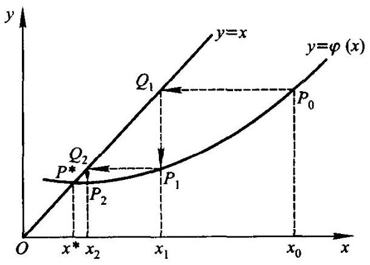

图 4-1

<!-- Media -->

## 2. 线性迭代函数的启示

为使迭代法有效, 必须保证它的收敛性. 一个发散 (即不收敛) 的迭代过程, 纵使进行千百次迭代, 其结果也是毫无价值的.

为了保证迭代过程的收敛性, 迭代函数应当有何特性呢? 在具体探讨收敛性条件之前,我们先考察线性迭代函数 $\varphi \left( x\right)$ 的简单情形,以获得某种直观的启示.

线性迭代过程确实是简单的. 事实上,若 $\varphi \left( x\right)  = {kx} + d$ ,则由几何图形 (参看图 4-2、图 4-3、图 4-4、图 4-5)可以明显地看出, 这时保证迭代收敛的充分必要条件是 $\left| {{\varphi }^{\prime }\left( x\right) }\right|  = \left| k\right|  &lt; 1$ .

<!-- Media -->

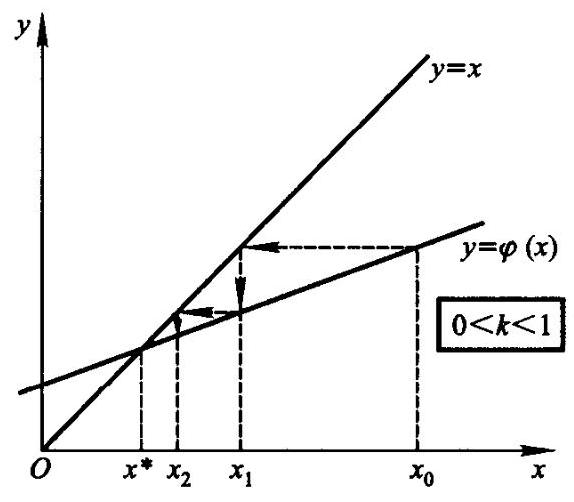

图 4-2

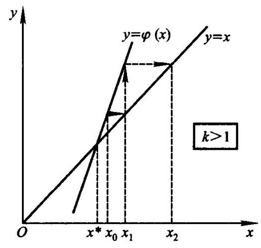

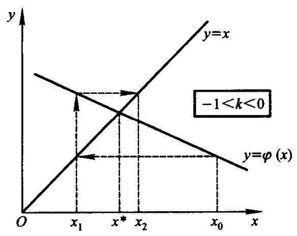

图 4-4

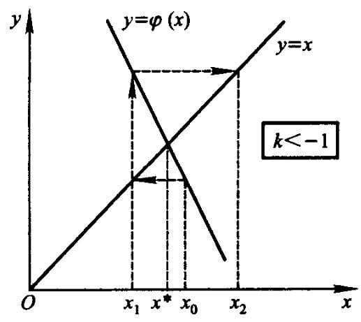

图 4-5

<!-- Media -->

## 3. 压缩映像原理

进而研究一般情形.

设 ${x}^{ * }$ 为方程 $x = \varphi \left( x\right)$ 的根,则依微分中值定理有

$$
{x}^{ * } - {x}_{k + 1} = \varphi \left( {x}^{ * }\right)  - \varphi \left( {x}_{k}\right)  = {\varphi }^{\prime }\left( \xi \right) \left( {{x}^{ * } - {x}_{k}}\right)
$$

式中 $\xi$ 是 ${x}^{ * }$ 与 ${x}_{k}$ 之间某一点. 由此得知,如果存在 $0 \leq  L &lt; 1$ ,使得对于任意 $x \in  \left\lbrack  {a,b}\right\rbrack$ 成立

$$
\left| {{\varphi }^{\prime }\left( x\right) }\right|  \leq  L
$$

则有

$$
\left| {{x}^{ * } - {x}_{k + 1}}\right|  \leq  L\left| {{x}^{ * } - {x}_{k}}\right|  \tag{5}
$$

据此反复递推,对迭代误差 ${e}_{k} = \left| {{x}^{ * } - {x}_{k}}\right|$ 有

$$
{e}_{k} \leq  {L}^{k}{e}_{0}
$$

由于 $0 \leq  L &lt; 1$ ,因而 ${e}_{k} \rightarrow  0\left( {k \rightarrow  \infty }\right)$ ,即迭代收敛.

需要指出的是,在上述论证过程中,应当保证一切迭代值 ${x}_{k}$ 全落在区间 $\left\lbrack  {a,b}\right\rbrack$ 内,为此要求对任意 $x \in  \left\lbrack  {a,b}\right\rbrack$ 总有

$$
\varphi \left( x\right)  \in  \left\lbrack  {a,b}\right\rbrack
$$

综上所述有下述压缩映像原理:

定理 1 设 $\varphi \left( x\right)$ 在 $\left\lbrack  {a,b}\right\rbrack$ 上具有连续的一阶导数,且满足下列两项条件:

(1)对于任意 $x \in  \left\lbrack  {a,b}\right\rbrack$ ,总有 $\varphi \left( x\right)  \in  \left\lbrack  {a,b}\right\rbrack$ ；

(2)存在 $0 \leq  L &lt; 1$ ,使对于任意 $x \in  \left\lbrack  {a,b}\right\rbrack$ 成立

$$
\left| {{\varphi }^{\prime }\left( x\right) }\right|  \leq  L \tag{6}
$$

则迭代过程 ${x}_{k + 1} = \varphi \left( {x}_{k}\right)$ 对任意初值 ${x}_{0} \in  \left\lbrack  {a,b}\right\rbrack$ 均收敛于方程 $x = \varphi \left( x\right)$ 的根 ${x}^{*\left( 1\right) }$ ,且有下列误差估计式

$$
\left| {{x}^{ * } - {x}_{k}}\right|  \leq  \frac{1}{1 - L}\left| {{x}_{k + 1} - {x}_{k}}\right|  \tag{7}
$$

$$
\left| {{x}^{ * } - {x}_{k}}\right|  \leq  \frac{{L}^{k}}{1 - L}\left| {{x}_{1} - {x}_{0}}\right|  \tag{8}
$$

<!-- Media -->

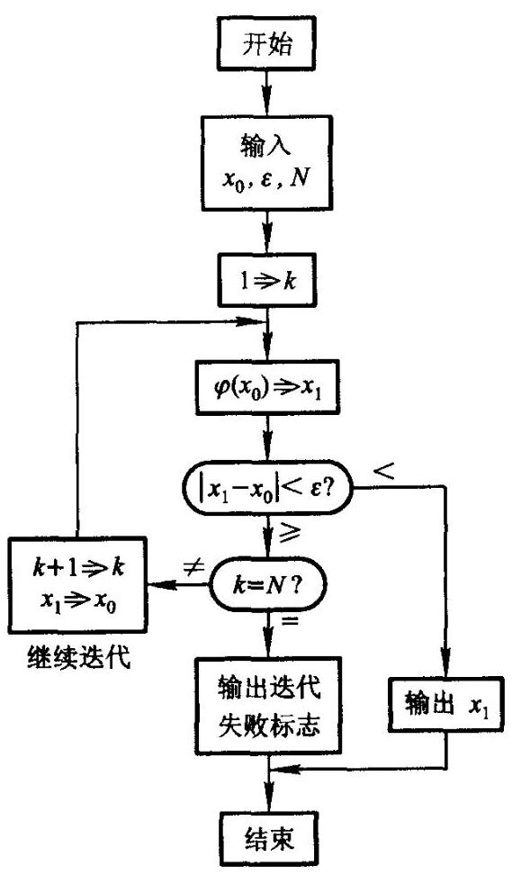

图 4-6

<!-- Media -->

证 剩下的问题是进一步证明上面的误差估计式. 据式(5)

$$
\left| {{x}_{k + 1} - {x}_{k}}\right|  \geq  \left| {{x}^{ * } - {x}_{k}}\right|  - \left| {{x}^{ * } - {x}_{k + 1}}\right|
$$

$$
\geq  \left| {{x}^{ * } - {x}_{k}}\right|  - L\left| {{x}^{ * } - {x}_{k}}\right|
$$

从而有

$$
\left| {{x}_{k + 1} - {x}_{k}}\right|  \geq  \left( {1 - L}\right) \left| {{x}^{ * } - {x}_{k}}\right|
$$

式(7)得证. 又利用条件 (6) 有

$$
\left| {{x}_{k + 1} - {x}_{k}}\right|  = \left| {\varphi \left( {x}_{k}\right)  - \varphi \left( {x}_{k - 1}\right) }\right|
$$

$$
\leq  L\left| {{x}_{k} - {x}_{k - 1}}\right|
$$

反复利用这一关系式, 由式 (7) 即可导出式 (8). 定理 1 证毕.

据估计式 (7), 只要相邻两次迭代值 ${x}_{k},{x}_{k + 1}$ 的偏差充分小,就能保证迭代值 ${x}_{k + 1}$ 足够准确,因此可用 $\left| {{x}_{k + 1} - {x}_{k}}\right|$ 来控制迭代过程是否应结束.

---

<!-- Footnote -->

① 容易证明,当定理 1 的条件成立时,方程 $x = \varphi \left( x\right)$ 在 $\left\lbrack  {a,b}\right\rbrack$ 内有且仅有一根 ${x}^{ * }$ .

<!-- Footnote -->

---

迭代法的一个突出优点是算法的逻辑结构简单. 图 4-6 描述了迭代过程 ${x}_{k + 1} = \varphi \left( {x}_{k}\right)$ ,图中 ${x}_{0},{x}_{1}$ 分别表示每次迭代的初值和终值, $\varepsilon$ 为精度, $N$ 为所设定的最大迭代次数.

例 1 求方程 ${x}^{3} - x - 1 = 0$ 的唯一正根.

解 显然区间 $\left\lbrack  {1,2}\right\rbrack$ 含有所求的根. 为使用迭代法,将所给方程改写成

$$
x = \sqrt[3]{x + 1}
$$

这时迭代函数 $\varphi \left( x\right)  = \sqrt[3]{x + 1}$ ,而 ${\varphi }^{\prime }\left( x\right)  = \frac{1}{3}{\left( x + 1\right) }^{-\frac{2}{3}}$ ,在 $\left\lbrack  {1,2}\right\rbrack$ 上恒有 ${\varphi }^{\prime }\left( x\right)  \mid   &lt; \frac{1}{3}$ ,故利用定理 1 可以断定迭代过程 ${x}_{k + 1} = \sqrt[3]{{x}_{k} + 1}$ 对任意初值 ${\iota }_{0} \in  \left\lbrack  {1,2}\right\rbrack$ 均收敛.

例如,取初值 ${x}_{0} = {1.5}$ ,则迭代结果如表 4-1 所示.

<!-- Media -->

表 4-1

<table><tr><td>$k$</td><td>${x}_{k}$</td><td>$k$</td><td>${x}_{k}$</td></tr><tr><td>0</td><td>1.5</td><td>5</td><td>1.324 76</td></tr><tr><td>1</td><td>1.357 21</td><td>6</td><td>1.324 73</td></tr><tr><td>2</td><td>1.330 86</td><td>7</td><td>1.324 72</td></tr><tr><td>3</td><td>1.325 88</td><td>8</td><td>1.324 72</td></tr><tr><td>4</td><td>1.324 94</td><td/><td/></tr></table>

<!-- Media -->

## 4. 迭代过程的局部收敛性

在实际应用迭代法时,通常首先在根 ${x}^{ * }$ 的邻近考察.

称一种迭代过程在根 ${x}^{ * }$ 邻近收敛,如果存在邻域 $\Delta  : \left| {x - {x}^{ * }}\right|  \leq  \delta$ ,使迭代过程对于任意初值 ${x}_{0} \in  \Delta$ 均收敛. 这种在根的邻近所具有的收敛性称作局部收敛性.

定理 2 设 $\varphi \left( x\right)$ 在 $x = \varphi \left( x\right)$ 的根 ${x}^{ * }$ 邻近有连续的一阶导数,且成立

$$
\left| {{\varphi }^{\prime }\left( {x}^{ * }\right) }\right|  < 1
$$

则迭代过程 ${x}_{k + 1} = \varphi \left( {x}_{k}\right)$ 在 ${x}^{ * }$ 邻近具有局部收敛性.

证 由于 $\left| {{\varphi }^{\prime }\left( {x}^{ * }\right) }\right|  &lt; 1$ ,存在充分小邻域 $\Delta  : \left| {x - {x}^{ * }}\right|  \leq  \delta$ ,使成立

$$
\left| {{\varphi }^{\prime }\left( x\right) }\right|  \leq  L < 1
$$

这里 $L$ 为某个定数. 据微分中值定理

$$
\varphi \left( x\right)  - \varphi \left( {x}^{ * }\right)  = {\varphi }^{\prime }\left( \xi \right) \left( {x - {x}^{ * }}\right)
$$

注意到 $\varphi \left( {x}^{ * }\right)  = {x}^{ * }$ ,又当 $x \in  \Delta$ 时 $\xi  \in  \Delta$ ,故有

$$
\left| {\varphi \left( x\right)  - {x}^{ * }}\right|  \leq  L\left| {x - {x}^{ * }}\right|  \leq  \left| {x - {x}^{ * }}\right|  \leq  \delta
$$

于是由定理 1 可以断定 ${x}_{k + 1} = \varphi \left( {x}_{k}\right)$ 对于任意 ${x}_{0} \in  \Delta$ 均收敛. 证毕.

例 2 用迭代法求方程 $x = {\mathrm{e}}^{-x}$ 在 $x = {0.5}$ 附近的一个根 ${x}^{ * }$ ,要求精度为 ${10}^{-5}$ .

解 这里迭代函数

$$
\varphi \left( x\right)  = {\mathrm{e}}^{-\tau },\;{\varphi }^{\prime }\left( x\right)  =  - {\mathrm{e}}^{-x}
$$

在 ${x}_{0} = {0.5}$ 附近有

$$
{\varphi }^{\prime }\left( {x}^{ * }\right)  \approx  {\varphi }^{\prime }\left( {x}_{0}\right)  =  - {\mathrm{e}}^{-{05}} \approx   - {0.6}
$$

因而据定理 2 知,迭代过程 ${x}_{k + 1} = {\mathrm{e}}^{-{x}_{k}}$ 是收敛的.

事实上,取初值 ${x}_{0} = {0.5}$ 按这一迭代公式迭代 18 次即得到满足精度要求的根 0.56714 (见表 4-2). 所求根的准确值为 0.567143 .

<!-- Media -->

表 4-2

<table><tr><td>$k$</td><td>${x}_{k}$</td><td>$k$</td><td>${x}_{k}$</td></tr><tr><td>0</td><td>0.500 000</td><td>10</td><td>0.566 907</td></tr><tr><td>1</td><td>0.606 531</td><td>11</td><td>0.567 277</td></tr><tr><td>2</td><td>0.545 239</td><td>12</td><td>0.567 067</td></tr><tr><td>3</td><td>0.579 703</td><td>13</td><td>0.567 186</td></tr><tr><td>4</td><td>0.560 065</td><td>14</td><td>0.567 119</td></tr><tr><td>5</td><td>0.571 172</td><td>15</td><td>0.567 157</td></tr><tr><td>6</td><td>0.564 863</td><td>16</td><td>0.567 135</td></tr><tr><td>7</td><td>0.568 438</td><td>17</td><td>0.567 148</td></tr><tr><td>8</td><td>0.566 409</td><td>18</td><td>0.567 141</td></tr><tr><td>9</td><td>0.567 560</td><td/><td/></tr></table>

<!-- Media -->

## 5. 迭代过程的收敛速度

一种迭代法要具有实用价值, 不但需要肯定它是收敛的, 还要求它收敛得比较快. 所谓迭代过程的收敛速度, 是指在接近收敛时迭代误差的下降速度. 具体地说,如果迭代误差 ${e}_{k} = {x}^{ * } - {x}_{k}$ 当 $k \rightarrow  \infty$ 时成立

$$
\frac{{e}_{k + 1}}{{e}_{k}^{p}} \rightarrow  c\;\left( {c \neq  0\text{ 常数 }}\right)
$$

则称迭代过程是 $p$ 阶收敛的. 特别地, $p = 1$ 时称线性收敛, $p = 2$ 时称平方收敛.

对于在根 ${x}^{ * }$ 邻近收敛的迭代公式 ${x}_{k + 1} = \varphi \left( {x}_{k}\right)$ ,由于

$$
{x}^{ * } - {x}_{k + 1} = {\varphi }^{\prime }\left( \xi \right) \left( {{x}^{ * } - {x}_{k}}\right)
$$

式中 $\xi$ 介于 ${x}_{k}$ 与 ${x}^{ * }$ 之间,故有

$$
\frac{{e}_{k + 1}}{{e}_{k}} \rightarrow  {\varphi }^{\prime }\left( {x}^{ * }\right) ,\;k \rightarrow  \infty
$$

这样,若 ${\varphi }^{\prime }\left( {x}^{ * }\right)  \neq  0$ ,则该迭代过程仅为线性收敛. 若 ${\varphi }^{\prime }\left( {x}^{ * }\right)  = 0$ ,将 $\varphi \left( {x}_{k}\right)$ 在 ${x}^{ * }$ 处进行泰勒展开有

$$
\varphi \left( {x}_{k}\right)  = \varphi \left( {x}^{ * }\right)  + \frac{{\varphi }^{\prime \prime }\left( \xi \right) }{2}{\left( {x}_{k} - {x}^{ * }\right) }^{2}
$$

注意到

$$
\varphi \left( {x}_{k}\right)  = {x}_{k + 1},\;\varphi \left( {x}^{ * }\right)  = {x}^{ * }
$$

由上式知

$$
\frac{{e}_{k + 1}}{{e}_{k}^{2}} \rightarrow  \frac{{\varphi }^{\prime \prime }\left( {x}^{ * }\right) }{2},\;k \rightarrow  \infty
$$

这表明当 ${\varphi }^{\prime }\left( {x}^{ * }\right)  = 0,{\varphi }^{\prime \prime }\left( {x}^{ * }\right)  \neq  0$ 时迭代过程为平方收敛.

因而有下述论断:

定理 3 设 $\varphi \left( x\right)$ 在 $x = \varphi \left( x\right)$ 的根 ${x}^{ * }$ 的邻近有连续的二阶导数,且

$$
\left| {{\varphi }^{\prime }\left( {x}^{ * }\right) }\right|  < 1
$$

则 ${\varphi }^{\prime }\left( {x}^{ * }\right)  \neq  0$ 时迭代过程 ${x}_{k + 1} = \varphi \left( {x}_{k}\right)$ 为线性收敛; 而当 ${\varphi }^{\prime }\left( {x}^{ * }\right)  = 0$ , ${\varphi }^{\prime \prime }\left( {x}^{ * }\right)  \neq  0$ 时为平方收敛.

### 4.2 迭代过程的加速

## 1. 迭代公式的加工

对于收敛的迭代过程, 只要迭代足够多次, 就可以使结果达到任意精度, 但有时迭代过程收敛缓慢, 从而使计算量变得很大, 因此迭代过程的加速是个重要课题.

设 ${x}_{k}$ 是根 ${x}^{ * }$ 的某个近似值,用迭代公式校正一次得

$$
{\bar{x}}_{k + 1} = \varphi \left( {x}_{k}\right)
$$

假设 ${\varphi }^{\prime }\left( x\right)$ 在所考察的范围内改变不大,其估计值为 $L$ ,则有

$$
{x}^{ * } - {\bar{x}}_{k + 1} \approx  L\left( {{x}^{ * } - {x}_{k}}\right)  \tag{9}
$$

由此解出 ${x}^{ * }$ 得

$$
{x}^{ * } \approx  \frac{1}{1 - L}{\bar{x}}_{k + 1} - \frac{L}{1 - L}{x}_{k}
$$

这就是说,如果将迭代值 ${\bar{x}}_{k + 1}$ 与 ${x}_{k}$ 加权平均,可以期望所得到的

$$
{x}_{k + 1} = \frac{1}{1 - L}{\bar{x}}_{k + 1} - \frac{L}{1 - L}{x}_{k}
$$

是比 ${\bar{x}}_{k + 1}$ 更好的近似根. 这样加工后的计算过程是:

迭代 ${\bar{x}}_{k + 1} = \varphi \left( {x}_{k}\right)$

改进 ${x}_{k + 1} = \frac{1}{1 - L}{\bar{x}}_{k + 1} - \frac{L}{1 - L}{x}_{k}$

这组迭代公式可合并写成

$$
{x}_{k + 1} = \frac{1}{1 - L}\left\lbrack  {\varphi \left( {x}_{k}\right)  - L{x}_{k}}\right\rbrack   \tag{10}
$$

例 3 用加速方法 (10) 再求方程 $x = {\mathrm{e}}^{-x}$ 在 $x = {0.5}$ 附近的根.

解 这里 ${\varphi }^{\prime }\left( x\right)  =  - {\mathrm{e}}^{-x}$ ,取 $L =  - {0.6}$ ,则加速公式 (10) 的具体形式是

$$
{x}_{k + 1} = \frac{1}{1.6}\left( {{\mathrm{e}}^{-{x}_{k}} + {0.6}{x}_{k}}\right)
$$

计算结果如下:

$$
{x}_{0} = {0.5},\;{x}_{1} = {0.56658}
$$

$$
{x}_{2} = {0.56712},\;{x}_{3} = {0.56714}
$$

例 2 迭代 18 次得到精度为 ${10}^{-5}$ 的结果 0.56714,这里只要迭代 3 次即可得出这个结果, 加速的效果是显著的.

## 2. 埃特金算法

上述加速方案的缺点是,由于其中含有导数 ${\varphi }^{\prime }\left( x\right)$ 的有关信息而不便于实际应用.

设将迭代值 ${\bar{x}}_{k + 1} = \varphi \left( {x}_{k}\right)$ 再迭代一次,又得

$$
{\widetilde{x}}_{k + 1} = \varphi \left( {\bar{x}}_{k + 1}\right)
$$

由于

$$
{x}^{ * } - {\widetilde{x}}_{k + 1} \approx  L\left( {{x}^{ * } - {\bar{x}}_{k + 1}}\right)
$$

将它与式(9)联立,消去未知的 $L$ ,有

$$
\frac{{x}^{ * } - {\bar{x}}_{k + 1}}{{x}^{ * } - {\widetilde{x}}_{k + 1}} \approx  \frac{{x}^{ * } - {x}_{k}}{{x}^{ * } - {\bar{x}}_{k + 1}}
$$

由此得

$$
{x}^{ * } \approx  {\widetilde{x}}_{k + 1} - \frac{{\left( {\widetilde{x}}_{k + 1} - {\bar{x}}_{k + 1}\right) }^{2}}{{\widetilde{x}}_{k + 1} - 2{\bar{x}}_{k + 1} + {x}_{k}}
$$

若以上式右端得出的结果作为新的改进值, 则这样构造出的加速公式不再含有关于导数的信息,但它需要用两次迭代值 ${\bar{x}}_{k + 1},{\widetilde{x}}_{k + 1}$ 进行加工. 其具体计算公式如下:

迭代 ${\bar{x}}_{k + 1} = \varphi \left( {x}_{k}\right)$

迭代 ${\widetilde{x}}_{k + 1} = \varphi \left( {\bar{x}}_{k + 1}\right)$

改进 ${x}_{k + 1} = {\widetilde{x}}_{k + 1} - \frac{{\left( {\widetilde{x}}_{k + 1} - {\bar{x}}_{k + 1}\right) }^{2}}{{\widetilde{x}}_{k + 1} - 2{\bar{x}}_{k + 1} + {x}_{k}}$

上述方法称作埃特金 (Aitken) 加速方法 (其计算流程参看图 4-7).

<!-- Media -->

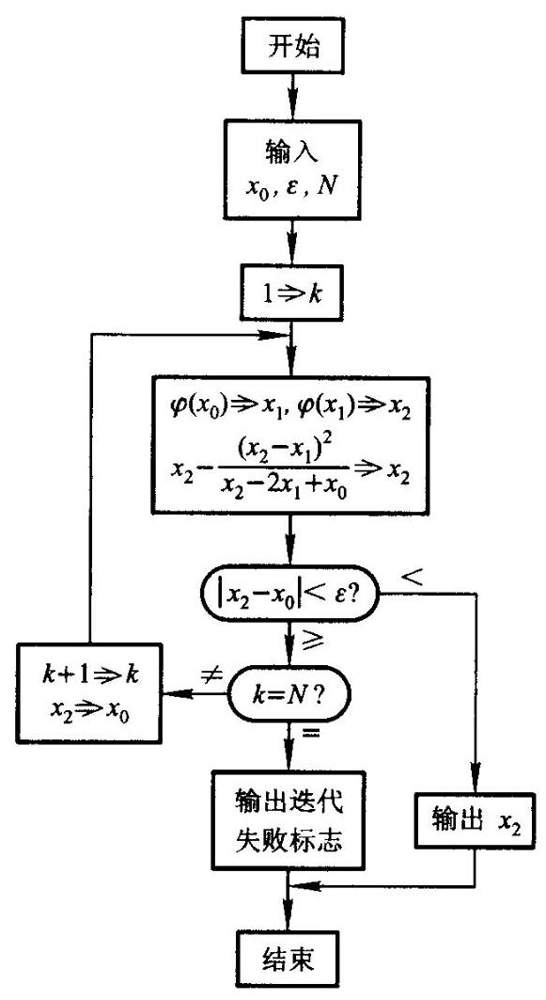

图 4-7

<!-- Media -->

例 4 用埃特金方法加速迭代过程 ${x}_{k + 1} = {\mathrm{e}}^{-{x}_{k}}$ ,再求方程 $x = {\mathrm{e}}^{-x}$ 在 $x = {0.5}$ 附近的根.

解 这里埃特金方法的迭代公式是

$$
\left\{  \begin{array}{l} {\bar{x}}_{k + 1} = {\mathrm{e}}^{-{x}_{k}} \\  {\widetilde{x}}_{k + 1} = {\mathrm{e}}^{-{\bar{x}}_{k + 1}} \\  {x}_{k + 1} = {\widetilde{x}}_{k + 1} - \frac{{\left( {\widetilde{x}}_{k + 1} - {\bar{x}}_{k + 1}\right) }^{2}}{{\widetilde{x}}_{k + 1} - 2{\bar{x}}_{k + 1} + {x}_{k}} \end{array}\right.
$$

取 ${x}_{0} = {0.5}$ ,计算结果见表 4-3 . 同例 2 与例 3 相比较可以看出,埃特金加速的效果是显著的.

<!-- Media -->

表 4-3

<table><tr><td>$k$</td><td>${\bar{x}}_{k}$</td><td>${\widetilde{x}}_{k}$</td><td>${x}_{k}$</td></tr><tr><td>1</td><td>0.606 53</td><td>0.54524</td><td>0.567 12</td></tr><tr><td>2</td><td>0.566 87</td><td>0.567 30</td><td>0.567 14</td></tr><tr><td>3</td><td>0.567 14</td><td>0.567 14</td><td/></tr></table>

<!-- Media -->

## 3. 一点注记

如果所给方程是 $f\left( x\right)  = 0$ ,为要应用迭代法,必须先将它改写成 $x = \varphi \left( x\right)$ 的形式,即需要针对所给的 $f\left( x\right)$ 选取合适的迭代函数 $\varphi \left( x\right)$ .

迭代函数 $\varphi \left( x\right)$ 可以是多种多样的,譬如可令

$$
\varphi \left( x\right)  = x + f\left( x\right)
$$

这时相应的迭代公式是

$$
{x}_{k + 1} = {x}_{k} + f\left( {x}_{k}\right)
$$

一般地说, 这种迭代公式不一定会收敛, 或者收敛速度缓慢.

运用前述加速技术于迭代函数 $\varphi \left( x\right)  = x + f\left( x\right)$ ,这里式 (10) 具有形式

$$
{x}_{k + 1} = {x}_{k} - \frac{f\left( {x}_{k}\right) }{M} \tag{11}
$$

式中 $M = L - 1$ 是导数 ${f}^{\prime }\left( x\right)$ 的某个估计值. 这样导出的迭代公式其实是下面将要介绍的牛顿公式的一种简化形式.

### 4.3 牛 顿 法

## 1. 公式的导出

对于方程

$$
f\left( x\right)  = 0
$$

设已知它的近似根 ${x}_{k}$ ,则函数 $f\left( x\right)$ 在点 ${x}_{k}$ 附近可用一阶泰勒多项式

$$
p\left( x\right)  = f\left( {x}_{k}\right)  + {f}^{\prime }\left( {x}_{k}\right) \left( {x - {x}_{k}}\right)
$$

来近似,因此方程 $f\left( x\right)  = 0$ 可近似地表为 $p\left( x\right)  = 0$ . 后者是一个线性方程, 它的求根是容易的,我们取 $p\left( x\right)  = 0$ 的根作为 $f\left( x\right)  = 0$ 的新的近似根,记作 ${x}_{k + 1}$ ,则有

$$
{x}_{k + 1} = {x}_{k} - \frac{f\left( {x}_{k}\right) }{{f}^{\prime }\left( {x}_{k}\right) } \tag{12}
$$

这就是著名的牛顿公式, 相应的迭代函数是

$$
\varphi \left( x\right)  = x - \frac{f\left( x\right) }{{f}^{\prime }\left( x\right) } \tag{13}
$$

如果在式 (12) 中用 ${f}^{\prime }\left( x\right)$ 的某个估计值 $M$ 来替换 ${f}^{\prime }\left( {x}_{k}\right)$ ,便得到其简化形式 (11).

牛顿法是一种逐步线性化方法, 这种方法的基本思想是将非线性方程 $f\left( x\right)  = 0$ 的求根问题归结为计算一系列线性方程

$$
f\left( {x}_{k}\right)  + {f}^{\prime }\left( {x}_{k}\right) \left( {x - {x}_{k}}\right)  = 0
$$

<!-- Media -->

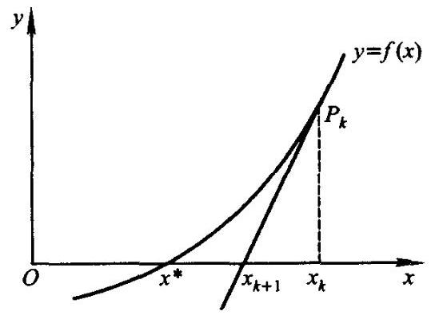

图 4-8

<!-- Media -->

的根.

牛顿法有明显的几何解释. 方程 $f\left( x\right)$ $= 0$ 的根 ${x}^{ * }$ 在几何上解释为曲线 $y = f\left( x\right)$ 与 $x$ 轴的交点的横坐标. 设 ${x}_{k}$ 是根 ${x}^{ * }$ 的某个近似值,对曲线 $y = f\left( x\right)$ 上横坐标为 ${x}_{k}$ 的点 ${P}_{k}$ 引切线,设该切线与 $x$ 轴的交点的横坐标记为 ${x}_{k + 1}$ (见图 4-8),则这样获得的 ${x}_{k + 1}$ 即为按牛顿法 (12) 求得的近似根. 由于这种几何背景, 牛顿法亦称切线法.

图 4-9 描述了牛顿法的计算过程.

<!-- Media -->

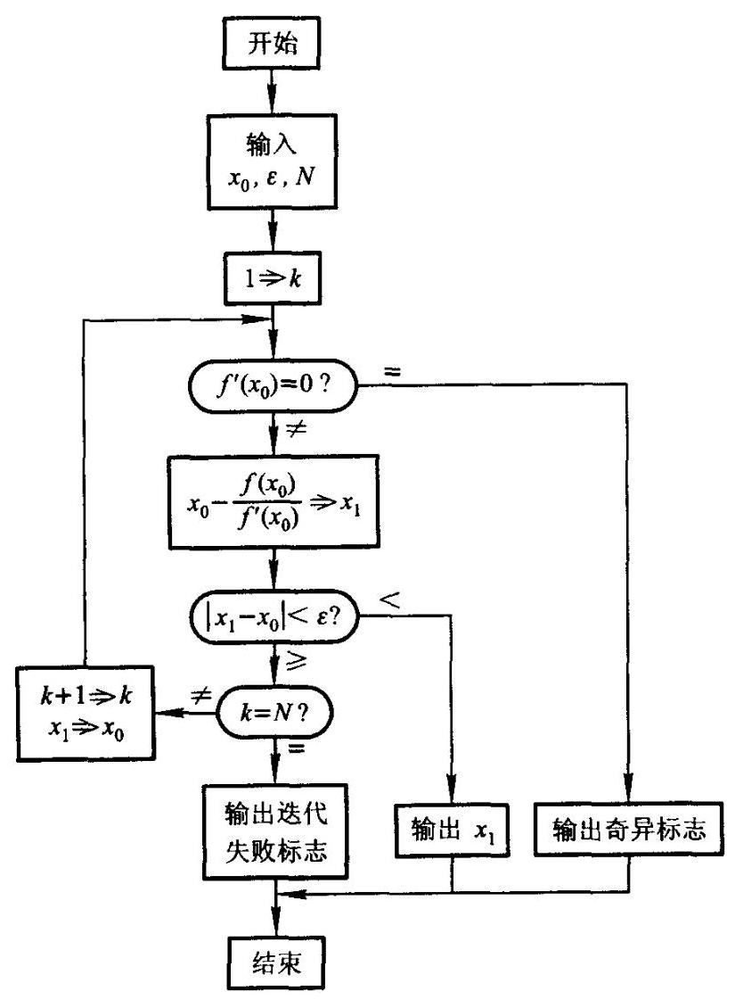

图 4-9

<!-- Media -->

例 5 用牛顿法解方程 $x{\mathrm{e}}^{x} - 1 = 0$

解 这里牛顿公式为

$$
{x}_{k + 1} = {x}_{k} - \frac{{x}_{k} - {\mathrm{e}}^{-{x}_{k}}}{1 + {x}_{k}}
$$

取 $x = {0.5}$ ,迭代结果如下:

$$
{x}_{1} = {0.57102},\;{x}_{2} = {0.56716},\;{x}_{3} = {0.56714}
$$

所给方程 $x{\mathrm{e}}^{x} - 1 = 0$ 实际上是方程 $x = {\mathrm{e}}^{-x}$ 的变形,比较例 5 与例 3 的结果可以看出, 牛顿法收敛得很快.

考察牛顿法的收敛速度. 利用式(13)求导知

$$
{\varphi }^{\prime }\left( x\right)  = \frac{f\left( x\right) {f}^{\prime \prime }\left( x\right) }{{\left\lbrack  {f}^{\prime }\left( x\right) \right\rbrack  }^{2}}
$$

假定 ${x}^{ * }$ 是 $f\left( x\right)  = 0$ 的单根,即 $f\left( {x}^{ * }\right)  = 0,{f}^{\prime }\left( {x}^{ * }\right)  \neq  0$ ,则由上式知 ${\varphi }^{\prime }\left( {x}^{ * }\right)  = 0$ ,因而据定理 3 可以断定:

定理 4 牛顿法 (12) 在 $f\left( x\right)  = 0$ 的单根 ${x}^{ * }$ 附近为平方收敛.

## 2. 开方公式

对于给定正数 $c$ ,应用牛顿法解二次方程

$$
{x}^{2} - c = 0
$$

可导出求开方值 $\sqrt{c}$ 的计算公式

$$
{x}_{k + 1} = \frac{1}{2}\left( {{x}_{k} + \frac{c}{{x}_{k}}}\right)  \tag{14}
$$

设 ${x}_{k}$ 是 $\sqrt{c}$ 的某个近似值,则 $\frac{c}{{x}_{k}}$ 自然也是一个近似值,式 (14) 表明,它们两者的算术平均值将是更好的近似值.

例 6 求 $\sqrt{115}$ .

解 取初值 ${x}_{0} = {10}$ ,按式 (14) 迭代 3 次便得精度为 ${10}^{-6}$ 的结果 (见表4-4).

<!-- Media -->

表 4-4

<table><tr><td>$k$</td><td>${x}_{k}$</td><td>${115}/{x}_{k}$</td></tr><tr><td>0</td><td>10</td><td>11.5</td></tr><tr><td>1</td><td>10.75</td><td>10.697 674</td></tr><tr><td>2</td><td>10.723 837</td><td>10.723 773</td></tr><tr><td>3</td><td>10.723 805</td><td>10.723 805</td></tr><tr><td>4</td><td>10.723 805</td><td/></tr></table>

<!-- Media -->

定理 5 开方公式 (14) 对于任意给定的初值 ${x}_{0} &gt; 0$ 均为平方收敛. 证 对式(14)右端施行配方手续, 得

$$
{x}_{k + 1} - \sqrt{c} = \frac{1}{2{x}_{k}}{\left( {x}_{k} - \sqrt{c}\right) }^{2} \tag{15}
$$

和

$$
{x}_{k + 1} + \sqrt{c} = \frac{1}{2{x}_{k}}{\left( {x}_{k} + \sqrt{c}\right) }^{2}
$$

以上两式相除得

$$
\frac{{x}_{k + 1} - \sqrt{c}}{{x}_{k + 1} + \sqrt{c}} = {\left( \frac{{x}_{k} - \sqrt{c}}{{x}_{k} + \sqrt{c}}\right) }^{2}
$$

据此反复递推有

$$
\frac{{x}_{k} - \sqrt{c}}{{x}_{k} + \sqrt{c}} = {\left( \frac{{x}_{0} - \sqrt{c}}{{x}_{0} + \sqrt{c}}\right) }^{{2}^{k}}
$$

令 $q = \left( {{x}_{0} - \sqrt{c}}\right) /\left( {{x}_{0} + \sqrt{c}}\right)$ ,则由上式得

$$
{x}_{k} = \frac{1 + {q}^{{2}^{k}}}{1 - {q}^{{2}^{k}}}\sqrt{c}
$$

对任意 ${x}_{0} &gt; 0$ 总有 $\left| q\right|  &lt; 1$ ,故有 ${x}_{k} \rightarrow  \sqrt{c}$ ,收敛性得证.

又据式 (15),对迭代误差 ${e}_{k} = {x}_{k} - \sqrt{c}$ 成立

$$
\frac{{e}_{k + 1}}{{e}_{k}^{2}} \rightarrow  \frac{1}{2\sqrt{c}}
$$

可见该迭代过程为平方收敛. 定理 5 证毕.

## 3. 牛顿下山法

一般地说,牛顿法的收敛性依赖于初值 ${x}_{0}$ 的选取,如果 ${x}_{0}$ 偏离 ${x}^{ * }$ 较远, 则牛顿法可能发散.

例 7 用牛顿法求方程 ${x}^{3} - x - 1 = 0$ 在 $x = {1.5}$ 附近的一个根.

解 取迭代初值 ${x}_{0} = {1.5}$ ,用牛顿公式

$$
{x}_{k + 1} = {x}_{k} - \frac{{x}_{k}^{3} - {x}_{k} - 1}{3{x}_{k}^{2} - 1} \tag{16}
$$

计算结果如下:

$$
{x}_{1} = {1.34783},\;{x}_{2} = {1.32520},\;{x}_{3} = {1.32472}
$$

其中 ${x}_{3}$ 的每一位数字都是有效数字.

但是,如果改用 ${x}_{0} = {0.6}$ 作为初值,则按式 (16) 迭代一次得 ${x}_{1} = {17.9}$ ,这个结果反而比 ${x}_{0}$ 更偏离了所求的根 ${x}^{ * }$ .

为了防止迭代发散, 通常对迭代过程再附加一项要求, 即保证函数值单调

下降:

$$
\left| {f\left( {x}_{k + 1}\right) }\right|  < \left| {f\left( {x}_{k}\right) }\right|  \tag{17}
$$

满足这项要求的算法称下山法.

将牛顿法与下山法结合起来使用, 即在下山法保证函数值稳定下降的前提下, 用牛顿法加快收敛速度.

为此, 将牛顿法的计算结果

$$
{\bar{x}}_{k + 1} = {x}_{k} - \frac{f\left( {x}_{k}\right) }{{f}^{\prime }\left( {x}_{k}\right) }
$$

与前一步的近似值 ${x}_{k}$ 适当加权平均作为新的改进值 ${x}_{k + 1}$ :

$$
{x}_{k + 1} = \lambda {\bar{x}}_{k + 1} + \left( {1 - \lambda }\right) {x}_{k}
$$

或者说, 采用下列迭代公式

$$
{x}_{k + 1} = {x}_{k} - \lambda \frac{f\left( {x}_{k}\right) }{{f}^{\prime }\left( {x}_{k}\right) } \tag{18}
$$

其中 $0 &lt; \lambda  \leq  1$ 称下山因子. 适当选取下山因子 $\lambda$ 可以使单调性条件 (17) 成立.

下山因子的选择是个逐步探索的过程,从 $\lambda  = 1$ 开始反复将因子 $\lambda$ 的值减半进行试算, 一旦单调性条件 (17) 成立, 则称 “下山成功”; 反之, 如果在上述过程中找不到使条件 (17) 成立的下山因子 $\lambda$ ,则称 “下山失败”,这时需另选初值 ${x}_{0}$ 重算.

再考察例 7,前已指出,若取 ${x}_{0} = {0.6}$ 按牛顿公式 (16) 求得的迭代值 ${\bar{x}}_{1} = {17.9}$ , 如果取下山因子 $\lambda  = \frac{1}{32}$ ,则由式 (18) 可求得

$$
{x}_{1} = \frac{1}{32}{\bar{x}}_{1} + \frac{31}{32}{x}_{0} = {1.140625}
$$

这个结果纠正了 ${\bar{x}}_{1}$ 的严重偏差.

值得指出的是,由于牛顿法的收敛性强烈地依赖于初值 ${x}_{0}$ 的选取,在实际求解方程 $f\left( x\right)  = 0$ 时,往往先用二分法 (参看引论 $\mathrm{A} - 4$ ) 定出足够准确的近似根 ${x}_{0}$ ,然后再用牛顿法将 ${x}_{0}$ 逐步精确化.

### 4.4 弦 截 法

牛顿法的突出优点是收敛的速度快, 但它有个明显的缺点: 需要提供导数值 ${f}^{\prime }\left( {x}_{k}\right)$ . 如果函数 $f\left( x\right)$ 比较复杂,致使导数的计算困难,那么使用牛顿公式是不方便的.

为避开导数的计算,可以改用差商 $\frac{f\left( {x}_{k}\right)  - f\left( {x}_{0}\right) }{{x}_{k} - {x}_{0}}$ 替换牛顿公式 (12) 中的导数, 得到下列离散化形式:

$$
{x}_{k + 1} = {x}_{k} - \frac{f\left( {x}_{k}\right) }{f\left( {x}_{k}\right)  - f\left( {x}_{0}\right) }\left( {{x}_{k} - {x}_{0}}\right)  \tag{19}
$$

这个公式是根据方程 $f\left( x\right)  = 0$ 的等价形式

$$
x = x - \frac{f\left( x\right) }{f\left( x\right)  - f\left( {x}_{0}\right) }\left( {x - {x}_{0}}\right)  \tag{20}
$$

建立的迭代公式.

迭代公式(19)的几何解释如图 4-10 所示,曲线 $y = f\left( x\right)$ 上横坐标为 ${x}_{k}$ 的点记为 ${P}_{k}$ ,则差商 $\frac{f\left( {x}_{k}\right)  - f\left( {x}_{0}\right) }{{x}_{k} - {x}_{0}}$ 表示弦线 $\overline{{P}_{0}{P}_{k}}$ 的斜率. 容易看出,按公式 (19) 求得的 ${x}_{k + 1}$ 实际上是弦线 $\overline{{P}_{0}{P}_{k}}$ 与 $x$ 轴的交点,因此这种方法称作弦截法.

<!-- Media -->

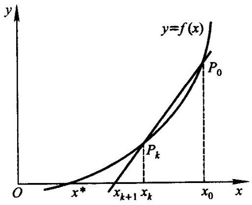

图 4-10

<!-- Media -->

考察弦截法的收敛性. 直接对迭代函数 (见式(20))

$$
\varphi \left( x\right)  = x - \frac{f\left( x\right) }{f\left( x\right)  - f\left( {x}_{0}\right) }\left( {x - {x}_{0}}\right)
$$

求导得

$$
{\varphi }^{\prime }\left( {x}^{ * }\right)  = 1 + \frac{{f}^{\prime }\left( {x}^{ * }\right) }{f\left( {x}_{0}\right) }\left( {{x}^{ * } - {x}_{0}}\right)  = 1 - \frac{{f}^{\prime }\left( {x}^{ * }\right) }{\frac{f\left( {x}^{ * }\right)  - f\left( {x}_{0}\right) }{{x}^{ * } - {x}_{0}}}
$$

当 ${x}_{0}$ 充分接近 ${x}^{ * }$ 时 $0 &lt; \left| {{\varphi }^{\prime }\left( {x}^{ * }\right) }\right|  &lt; 1$ ,故由定理 3 知弦截法 (19) 为线性收敛.

为提高收敛速度,再改用差商 $\frac{{f}_{(}{x}_{k}) - f\left( {x}_{k - 1}\right) }{{x}_{k} - {x}_{k - 1}}$ 替代牛顿公式 (12) 中的导数 ${f}^{\prime }\left( {x}_{k}\right)$ ,而导出下列迭代公式:

$$
{x}_{k + 1} = {x}_{k} - \frac{f\left( {x}_{k}\right) }{f\left( {x}_{k}\right)  - f\left( {x}_{k - 1}\right) }\left( {{x}_{k} - {x}_{k - 1}}\right)
$$

这种迭代法称作快速弦截法.

快速弦截法的特点在于,它在计算 ${x}_{k + 1}$ 时要用到前面两步的信息 ${x}_{k}$ , ${x}_{k - 1}$ ,即这种迭代法为两步法. 使用这种方法,在计算前必须先提供两个开始值 ${x}_{0},{x}_{1}$ .

例 8 用快速弦截法解方程

$$
x{\mathrm{e}}^{x} - 1 = 0
$$

解 设取 ${x}_{0} = {0.5},{x}_{1} = {0.6}$ 作为开始值,用快速弦截法求得的结果如下:

$$
{x}_{2} = {0.56754},\;{x}_{3} = {0.56715},\;{x}_{4} = {0.56714}
$$

同例 5 牛顿法的计算结果比较, 可以看出, 快速弦截法的收敛速度是令人满意的.

## 例题选讲 4.1 压缩映像原理

运用压缩映像原理考察迭代法的收敛性时, 必须全面地考察封闭性与压缩性两个方面. 两项条件缺一不可. 忽视封闭性条件是运用压缩映像原理解题时常犯的错误之一.

另外,将定理中的压缩性条件 $\left| {{\Phi }^{\prime }\left( x\right) }\right|  \leq  L &lt; 1$ 轻率地替代为 $\left| {{\Phi }^{\prime }\left( x\right) }\right|  &lt; 1$ , 这是运用压缩映像原理解题时另一个常见的原则性错误, 务请读者留意.

压缩映像原理的反命题是：如果存在定数 $L &gt; 1$ ,使对任给 $x \in  \left\lbrack  {a,b}\right\rbrack$ 恒成立

$$
\left| {{\Phi }^{\prime }\left( x\right) }\right|  \geq  L
$$

则迭代过程 ${x}_{k + 1} = \Phi \left( {x}_{k}\right)$ 对于任给初值 ${x}_{0} \in  \left\lbrack  {a,b}\right\rbrack$ 均发散.

题 1 应用迭代法求解方程

$$
x = \left( {\cos x + \sin x}\right) /4
$$

并讨论迭代过程的收敛性.

解 这里迭代函数

$$
\Phi \left( x\right)  = \left( {\cos x + \sin x}\right) /4
$$

$$
{\Phi }^{\prime }\left( x\right)  = \left( {-\sin x + \cos x}\right) /4
$$

对于任给 $x,\Phi \left( x\right)$ 显然是实数,且成立

$$
\left| {{\Phi }^{\prime }\left( x\right) }\right|  \leq  \frac{\sqrt{2}}{4} < 1
$$

因此迭代过程

$$
{x}_{k + 1} = \left( {\cos {x}_{k} + \sin {x}_{k}}\right) /4
$$

对于任给实值 ${x}_{0}$ 均收敛.

题 2 改写方程 ${x}^{2} = 2$ 为

$$
x = \frac{x}{2} + \frac{1}{x}
$$

运用压缩映像原理证明,这一迭代过程对于任给初值 ${x}_{0} &gt; 0$ 均收敛于 $\sqrt{2}$ .

证 这里迭代函数

$$
\Phi \left( x\right)  = \frac{x}{2} + \frac{1}{x},\;{\Phi }^{\prime }\left( x\right)  = \frac{1}{2} - \frac{1}{{x}^{2}}
$$

注意到

$$
{\left( \sqrt{\frac{x}{2}} - \frac{1}{\sqrt{x}}\right) }^{2} \geq  0
$$

对任意 $x &gt; 0$ 成立

$$
\Phi \left( x\right)  = \frac{x}{2} + \frac{1}{x} \geq  2\sqrt{\frac{x}{2}} \cdot  \frac{1}{\sqrt{x}} = \sqrt{2} > 1
$$

而当 $x \geq  1$ 时有

$$
\left| {{\Phi }^{\prime }\left( x\right) }\right|  \leq  \frac{1}{2} < 1
$$

因此,迭代公式 ${x}_{k + 1} = \frac{{x}_{k}}{2} + \frac{1}{{x}_{k}}$ 对于任给初值 ${x}_{0} \geq  1$ 均收敛于方程 ${x}^{2} = 2$ 的正根 $\sqrt{2}$ . 再注意到当 $0 &lt; {x}_{0} &lt; 1$ 时有

$$
{x}_{1} = \frac{{x}_{0}}{2} + \frac{1}{{x}_{0}} > 1
$$

因此,这一迭代过程实际上对于任给初值 ${x}_{0} &gt; 0$ 均收敛.

题 3 基于迭代原理证明

$$
\sqrt{2 + \sqrt{2 + \sqrt{2 + \cdots }}} = 2
$$

证 首先建立迭代公式. 令

$$
{x}_{k} = \underset{k\text{ 重 }}{\underbrace{\sqrt{2 + \sqrt{2 + \cdots  + \sqrt{2}}}}}
$$

则有迭代公式

$$
\left\{  \begin{array}{l} {x}_{k + 1} = \sqrt{2 + {x}_{k}},\;k = 0,1,2,\cdots \\  {x}_{0} = 0 \end{array}\right.
$$

这里迭代函数

$$
\Phi \left( x\right)  = \sqrt{2 + x},\;{\Phi }^{\prime }\left( x\right)  = \frac{1}{2\sqrt{2 + x}}
$$

显然当 $x \in  \left\lbrack  {0,2}\right\rbrack$ 时 $\Phi \left( x\right)  \in  \left\lbrack  {0,2}\right\rbrack$ ,且成立

$$
\left| {{\Phi }^{\prime }\left( x\right) }\right|  \leq  \frac{1}{2\sqrt{2}} < 1
$$

因此这一迭代过程收敛于方程

$$
{x}^{2} - x - 2 = 0
$$

的正根 ${x}^{ * } = 2$ .

题 4 基于迭代原理证明

$$
\sqrt{1 + \sqrt{1 + \sqrt{1 + \cdots }}} = \frac{1 + \sqrt{5}}{2}
$$

证 仿照题 3 的证法. 这里迭代公式

$$
\left\{  \begin{array}{l} {x}_{k + 1} = \sqrt{1 + {x}_{k}} \\  {x}_{0} = 1 \end{array}\right.
$$

相应的迭代函数是

$$
\Phi \left( x\right)  = \sqrt{1 + x}
$$

容易验证,当 $x \in  \left\lbrack  {0,2}\right\rbrack$ 时 $\Phi \left( x\right)  \in  \left\lbrack  {0,2}\right\rbrack$ ,且成立

$$
\left| {{\Phi }^{\prime }\left( x\right) }\right|  \leq  \frac{1}{2} < 1
$$

因此上述迭代过程收敛于方程

$$
{x}^{2} - x - 1 = 0
$$

的正根 ${x}^{ * } = \left( {1 + \sqrt{5}}\right) /2$ .

题 5 改写方程 ${2}^{x} + x - 4 = 0$ 为 $x =  - {2}^{x} + 4$ 的形式,据此能否用迭代法求所给方程在 $\left\lbrack  {1,2}\right\rbrack$ 内的实根?

解 这里 $\Phi \left( x\right)  =  - {2}^{x} + 4,{\Phi }^{\prime }\left( x\right)  =  - {2}^{x}\ln 2$ ,由于当 $x \in  \left\lbrack  {1,2}\right\rbrack$ 时

$$
\left| {{\Phi }^{\prime }\left( x\right) }\right|  \geq  2\ln 2 > 1
$$

故迭代过程 ${x}_{k + 1} = \Phi \left( {x}_{k}\right)$ 对于任意初值 ${x}_{0} \in  \left\lbrack  {1,2}\right\rbrack$ 均发散.

题 6 改写方程 ${2}^{x} + x - 4 = 0$ 为 $x = \ln \left( {4 - x}\right) /\ln 2$ 的形式,据此能否用迭代法求所给方程在 $\left\lbrack  {1,2}\right\rbrack$ 内的实根?

解 这里 $f\left( x\right)  = {2}^{x} + x - 4$ ,注意到 $f\left( 1\right)  &lt; 0,f\left( 2\right)  &gt; 0$ ,因而方程 $f\left( x\right)  = 0$ 在区间 $\left\lbrack  {1,2}\right\rbrack$ 内有实根. 令 $\Psi \left( x\right)  = \ln \left( {4 - x}\right) /\ln 2$ ,则 ${\Psi }^{\prime }\left( x\right)  =  - 1/\left\lbrack  {\left( {4 - x}\right) \ln 2}\right\rbrack$ , 注意到当 $x \in  \left\lbrack  {1,2}\right\rbrack$ 时 $\Psi \left( x\right)  \in  \left\lbrack  {1,2}\right\rbrack$ ,且成立

$$
\left| {{\Psi }^{\prime }\left( x\right) }\right|  \leq  \frac{1}{2\ln 2} < 1
$$

依据压缩映像原理,这里迭代公式 ${x}_{k + 1} = \Psi \left( {x}_{k}\right)$ 对任意初值 ${x}_{0} \in  \left\lbrack  {1,2}\right\rbrack$ 均收敛.

题 7 为用迭代法求方程

$$
{x}^{3} - {x}^{2} - 1 = 0
$$

在区间 $\left\lbrack  {{1.3},{1.6}}\right\rbrack$ 内的一个实根,试考察下述几种设计方案:

(1)将方程改写为 ${x}^{2} = \frac{1}{x - 1}$ ,进而加工成 $x = \frac{1}{\sqrt{x - 1}}$ 的形式；

(2)将方程改写为 $x - 1 = \frac{1}{{x}^{2}}$ ,进而加工成 $x = 1 + \frac{1}{{x}^{2}}$ 的形式；

(3)将方程改写为 ${x}^{2} = {x}^{3} - 1$ ,进而加工成 $x = \sqrt{{x}^{3} - 1}$ 的形式；

(4)将方程改写为 ${x}^{3} = {x}^{2} + 1$ ,进而加工成 $x = \sqrt[3]{{x}^{2} + 1}$ 的形式.

解 先考察方案 1. 其迭代函数

$$
\Phi \left( x\right)  = \frac{1}{\sqrt{x - 1}},{\Phi }^{\prime }\left( x\right)  =  - \frac{1}{2\sqrt{{\left( x - 1\right) }^{3}}}
$$

当 $x \in  \left\lbrack  {{1.3},{1.6}}\right\rbrack$ 时,有

$$
\left| {{\Phi }^{\prime }\left( x\right) }\right|  \geq  \frac{1}{2\sqrt{{\left( {1.6} - 1\right) }^{3}}} > 1
$$

因此,迭代公式 ${x}_{k + 1} = \Phi \left( {x}_{k}\right)  = \frac{1}{\sqrt{{x}_{k} - 1}}$ 在区间 $\left\lbrack  {{1.3},{1.6}}\right\rbrack$ 内发散.

再考察方案 2. 其迭代函数为

$$
\Psi \left( x\right)  = 1 + \frac{1}{{x}^{2}}
$$

当 $x \in  \left\lbrack  {{1.3},{1.6}}\right\rbrack$ 时,有

$$
\left| {{\Psi }^{\prime }\left( x\right) }\right|  \leq  2 \times  {\left( {1.3}\right) }^{-3} < 1
$$

此外成立

$$
{1.3} < 1 + \frac{1}{{1.6}^{2}} \leq  \Psi \left( x\right)  \leq  1 + \frac{1}{{1.3}^{2}} < {1.6}
$$

因此,迭代公式 ${x}_{k + 1} = \Psi \left( {x}_{k}\right)  = 1 + \frac{1}{{x}_{k}^{2}}$ 对任给初值 ${x}_{0} \in  \left\lbrack  {{1.3},{1.6}}\right\rbrack$ 均收敛.

进一步考察方案 3. 其迭代函数

$$
\Phi \left( x\right)  = \sqrt{{x}^{3} - 1},{\Phi }^{\prime }\left( x\right)  = \frac{3{x}^{2}}{2\sqrt{{x}^{3} - 1}}
$$

当 $x \in  \left\lbrack  {{1.3},{1.6}}\right\rbrack$ 时,有

$$
\left| {{\Phi }^{\prime }\left( x\right) }\right|  \geq  \frac{3 \times  {1.3}^{2}}{2\sqrt{{1.6}^{3} - 1}} > 1
$$

因此,迭代公式 ${x}_{k + 1} = \Phi \left( {x}_{k}\right)  = \sqrt{{x}_{k}^{3} - 1}$ 在区间 $\left\lbrack  {{1.3},{1.6}}\right\rbrack$ 内发散.

最后考察方案 4. 其迭代函数

$$
\left| {\Psi \left( x\right) }\right|  = \sqrt[3]{{x}^{2} + 1}
$$

当 $x \in  \left\lbrack  {{1.3},{1.6}}\right\rbrack$ 时,有

$$
\left| {{\Psi }^{\prime }\left( x\right) }\right|  \leq  \frac{2 \times  {1.6}}{3 \times  \sqrt[3]{{\left( {1.3}^{2} + 1\right) }^{2}}} < 1
$$

此外当 $x \in  \left\lbrack  {{1.3},{1.6}}\right\rbrack$ 时,有

$$
{1.3} < \sqrt[3]{{1.3}^{2} + 1} \leq  \Psi \left( x\right)  \leq  \sqrt[3]{{1.6}^{2} + 1} < {1.6}
$$

故迭代公式 ${x}_{k + 1} = \Psi \left( {x}_{k}\right)  = \sqrt[3]{{x}_{k}^{2} + 1}$ 对任给初值 ${x}_{0} \in  \left\lbrack  {{1.3},{1.6}}\right\rbrack$ 均收敛.

题 8 给定函数 $f\left( x\right)$ ,设对一切 $x,{f}^{\prime }\left( x\right)$ 存在且 $0 &lt; m \leq  {f}^{\prime }\left( x\right)  \leq  M$ ,试证明对于 $0 &lt; \lambda  &lt; \frac{2}{M}$ 的任意值 $\lambda$ ,迭代过程 ${x}_{k + 1} = {x}_{k} - {\lambda f}\left( {x}_{k}\right)$ 均收敛于 $f\left( x\right)  = 0$ 的根 ${x}^{ * }$

证 运用压缩映像原理分析迭代过程 ${x}_{k + 1} = {x}_{k} - {\lambda f}\left( {x}_{k}\right)$ 的迭代函数

$$
\Phi \left( x\right)  = x - {\lambda f}\left( x\right)
$$

这里,对于一切 $x$ 及任意 $\lambda ,\Phi \left( x\right)$ 总是实数,因此封闭性条件自然满足.

再考察压缩性条件. 据题设 $0 &lt; m \leq  {f}^{\prime }\left( x\right)  \leq  M$ 知

$$
\left| {{\Phi }^{\prime }\left( x\right) }\right|  = \left| {1 - \lambda {f}^{\prime }\left( x\right) }\right|  \leq  \max \{ \left| {1 - {\lambda M}}\right| ,\left| {1 - {\lambda m}}\right| \}
$$

记

$$
L = \max \{ \left| {1 - {\lambda M}}\right| ,\left| {1 - {\lambda m}}\right| \}
$$

当 $0 &lt; \lambda  &lt; \frac{2}{M}$ 时成立

$$
- 1 < 1 - {\lambda M} < 1 - {\lambda m} < 1
$$

故 $L &lt; 1$ ,压缩性条件成立.

## 例题选讲 4.2 迭代过程的收敛速度

题 1 证明,解方程 ${\left( {x}^{2} - a\right) }^{2} = 0$ 求 $\sqrt{a}$ 的牛顿法

$$
{x}_{k + 1} = \frac{3}{4}{x}_{k} + \frac{a}{4{x}_{k}}
$$

仅为线性收敛.

证 这里迭代函数

$$
\Phi \left( x\right)  = \frac{3}{4}x + \frac{a}{4x},{\Phi }^{\prime }\left( x\right)  = \frac{3}{4} - \frac{a}{4{x}^{2}}
$$

由于 $\Phi \left( \sqrt{a}\right)  = \sqrt{a}$ ,而

$$
0 < {\Phi }^{\prime }\left( \sqrt{a}\right)  = \frac{1}{2} < 1
$$

这一迭代公式仅为线性收敛.

注意,从求根 ${x}^{ * } = \sqrt{a}$ 的角度来看,方程 ${\left( {x}^{2} - a\right) }^{2} = 0$ 与 ${x}^{2} - a = 0$ 是不等价的: 前者 ${x}^{ * }$ 是个二重根,而后者它只是所给方程的一个单根.

题 2 证明解方程 ${\left( {x}^{3} - a\right) }^{2} = 0$ 求 $\sqrt[3]{a}$ 的牛顿法

$$
{x}_{k + 1} = \frac{5}{6}{x}_{k} + \frac{a}{6{x}_{k}^{2}}
$$

仅为线性收敛.

证 这里迭代函数

$$
\Phi \left( x\right)  = \frac{5}{6}x + \frac{a}{6{x}^{2}},{\Phi }^{\prime }\left( x\right)  = \frac{5}{6} - \frac{a}{3{x}^{3}}
$$

由于 $\Phi \left( \sqrt[3]{a}\right)  = \sqrt[3]{a}$ ,而

$$
0 < {\Phi }^{\prime }\left( \sqrt[3]{a}\right)  = \frac{1}{2} < 1
$$

这一迭代公式仅为线性收敛.

题 3 证明迭代公式

$$
{x}_{k + 1} = \frac{2}{3}{x}_{k} + \frac{a}{3{x}_{k}^{2}}
$$

是求解方程 ${\left( {x}^{3} - a\right) }^{2} = 0$ 的二阶方法.

证 这里迭代函数

$$
\Phi \left( x\right)  = \frac{2}{3}x + \frac{a}{3{x}^{2}},{\Phi }^{\prime }\left( x\right)  = \frac{2}{3}\left( {1 - \frac{a}{{x}^{3}}}\right)
$$

这时 $\Phi \left( \sqrt[3]{a}\right)  = \sqrt[3]{a}$ ,而 ${\Phi }^{\prime }\left( \sqrt[3]{a}\right)  = 0,{\Phi }^{\prime \prime }\left( \sqrt[3]{a}\right)  \neq  0$ ,故这一迭代法为平方收敛.

题 4 试设计求 $\sqrt{a}$ 的迭代公式

$$
{x}_{k + 1} = {\lambda }_{0}{x}_{k} + {\lambda }_{1}\left( \frac{a}{{x}_{k}}\right)  + {\lambda }_{2}\left( \frac{{a}^{2}}{{x}_{k}^{3}}\right)
$$

使其收敛的阶尽可能地高.

解 若 ${x}_{k} \approx  \sqrt{a}$ ,则 $\frac{a}{{x}_{k}},\frac{{a}^{2}}{{x}_{k}^{3}}$ 均近似等于 $\sqrt{a}$ . 取三者组合生成迭代值 ${x}_{k + 1}$ . 这里迭代函数

$$
\Phi \left( x\right)  = {\lambda }_{0}x + {\lambda }_{1}\left( \frac{a}{x}\right)  + {\lambda }_{2}\left( \frac{{a}^{2}}{{x}^{3}}\right)
$$

$$
{\Phi }^{\prime }\left( x\right)  = {\lambda }_{0} + {\lambda }_{1}\left( \frac{-a}{{x}^{2}}\right)  + {\lambda }_{2}\left( \frac{-3{a}^{2}}{{x}^{4}}\right)
$$

$$
{\Phi }^{\prime \prime }\left( x\right)  = {\lambda }_{1}\left( \frac{2a}{{x}^{3}}\right)  + {\lambda }_{2}\left( \frac{{12}{a}^{2}}{{x}^{5}}\right)
$$

令所设计的迭代公式具有 3 阶精度,则要求成立 $\Phi \left( \sqrt{a}\right)  = \sqrt{a},{\Phi }^{\prime }\left( \sqrt{a}\right)  = {\Phi }^{\prime \prime }\left( \sqrt{a}\right)  = 0$ , 据此列出方程

$$
\left\{  \begin{array}{l} {\lambda }_{0} + {\lambda }_{1} + {\lambda }_{2} = 1 \\  {\lambda }_{0} - {\lambda }_{1} - 3{\lambda }_{2} = 0 \\  {\lambda }_{1} + 6{\lambda }_{2} = 0 \end{array}\right.
$$

解之有

$$
{\lambda }_{0} = \frac{3}{8},\;{\lambda }_{1} = \frac{3}{4},\;{\lambda }_{2} =  - \frac{1}{8}
$$

这样设计出的迭代公式为

$$
{x}_{k + 1} = \frac{3}{8}{x}_{k} + \frac{3a}{4{x}_{k}} - \frac{{a}^{2}}{8{x}_{k}^{3}}
$$

题 5 试设计求 $\sqrt{a}$ 的迭代公式

$$
{x}_{k + 1} = {\lambda }_{0}{x}_{k} + {\lambda }_{1}\frac{a}{{x}_{k}} + {\lambda }_{2}\frac{{a}^{3}}{{x}_{k}^{5}}
$$

解 解法与题 4 类同。这里迭代函数为

$$
\Phi \left( x\right)  = {\lambda }_{0}x + {\lambda }_{1}\frac{a}{x} + {\lambda }_{2}\frac{{a}^{3}}{{x}^{5}}
$$

令 $\Phi \left( \sqrt{a}\right)  = \sqrt{a},{\Phi }^{\prime }\left( \sqrt{a}\right)  = {\Phi }^{\prime \prime }\left( \sqrt{a}\right)  = 0$ ,可列出方程

$$
\left\{  \begin{array}{l} {\lambda }_{0} + {\lambda }_{1} + {\lambda }_{2} = 1 \\  {\lambda }_{0} - {\lambda }_{1} - 5{\lambda }_{2} = 0 \\  {\lambda }_{1} + {15}{\lambda }_{2} = 0 \end{array}\right.
$$

据此定出 ${\lambda }_{0},{\lambda }_{1},{\lambda }_{2}$ ,知所求的迭代公式为

$$
{x}_{k + 1} = \frac{5}{12}{x}_{k} + \frac{5a}{8{x}_{k}} - \frac{{a}^{3}}{{24}{x}_{k}^{5}}
$$

题 6 试设计求 $\sqrt[3]{a}$ 的迭代公式

$$
{x}_{k + 1} = {\lambda }_{0}{x}_{k} + {\lambda }_{1}\frac{a}{{x}_{k}^{2}} + {\lambda }_{2}\frac{{a}^{2}}{{x}_{k}^{5}}
$$

解 解法同前题类同。所求的迭代公式为

$$
{x}_{k + 1} = \frac{5}{9}{x}_{k} + \frac{5a}{9{x}_{k}^{2}} - \frac{{a}^{2}}{9{x}_{k}^{5}}
$$

## 例题选讲 4.3 牛顿法的误差分析

题 1 设牛顿法的迭代序列 $\left\{  {x}_{k}\right\}$ 收敛到方程 $f\left( x\right)  = 0$ 的某个单根 ${x}^{ * }$ ,证明误差 ${e}_{k} = {x}_{k} - {x}^{ * }$ 的比率

$$
\mathop{\lim }\limits_{{k \rightarrow  \infty }}\frac{{e}_{k + 1}}{{e}_{k}^{2}} = \frac{{f}^{\prime \prime }\left( {x}^{ * }\right) }{2{f}^{\prime }\left( {x}^{ * }\right) }
$$

证 牛顿法的迭代函数

$$
\Phi \left( x\right)  = x - \frac{f\left( x\right) }{{f}^{\prime }\left( x\right) }
$$

满足

$$
\Phi \left( {x}^{ * }\right)  = {x}^{ * },{\Phi }^{\prime }\left( {x}^{ * }\right)  = 0,{\Phi }^{\prime \prime }\left( {x}^{ * }\right)  = \frac{{f}^{\prime \prime }\left( {x}^{ * }\right) }{{f}^{\prime }\left( {x}^{ * }\right) }
$$

因此有

$$
{x}_{k + 1} - {x}^{ * } = \Phi \left( {x}_{k}\right)  - \Phi \left( {x}^{ * }\right)
$$

$$
= {\Phi }^{\prime }\left( {x}^{ * }\right) \left( {{x}_{k} - {x}^{ * }}\right)  + \frac{{\Phi }^{\prime \prime }\left( \xi \right) }{2}{\left( {x}_{k} - {x}^{ * }\right) }^{2}
$$

$$
= \frac{{\Phi }^{\prime \prime }\left( \xi \right) }{2}{\left( {x}_{k} - {x}^{ * }\right) }^{2}
$$

式中 $\xi$ 介于 ${x}_{k}$ 与 ${x}^{ * }$ 之间,故有

$$
\mathop{\lim }\limits_{{k \rightarrow  \infty }}\frac{{x}_{k + 1} - {x}^{ * }}{{\left( {x}_{k} - {x}^{ * }\right) }^{2}} = \frac{{\Phi }^{\prime \prime }\left( {x}^{ * }\right) }{2} = \frac{{f}^{\prime \prime }\left( {x}^{ * }\right) }{2{f}^{\prime }\left( {x}^{ * }\right) }
$$

题 2 设牛顿法于方程 ${x}^{n} - a = 0$ ,导出求 ${x}^{ * } = \sqrt[n]{a}$ 的迭代公式,并求误差 ${e}_{k} = {x}_{k} - {x}^{ * }$ 的比率 $\mathop{\lim }\limits_{{k \rightarrow  \infty }}{e}_{k + 1}/{e}_{k}^{2}$ .

解 这里 $f\left( x\right)  = {x}^{n} - a$ ,而

$$
{f}^{\prime }\left( x\right)  = n{x}^{n - 1},{f}^{\prime \prime }\left( x\right)  = n\left( {n - 1}\right) {x}^{n - 2}
$$

牛顿法的迭代函数为

$$
\Phi \left( x\right)  = x - \frac{f\left( x\right) }{{f}^{\prime }\left( x\right) } = \left( {1 - \frac{1}{n}}\right) x + \frac{a}{n{x}^{n - 1}}
$$

相应的迭代公式是

$$
{x}_{k + 1} = \left( {1 - \frac{1}{n}}\right) {x}_{k} + \frac{a}{n{x}_{k}^{n - 1}}
$$

应用题 1 的结果, 其误差比

$$
\mathop{\lim }\limits_{{k \rightarrow  \infty }}\frac{{e}_{k + 1}}{{e}_{k}^{2}} = \frac{{f}^{\prime \prime }\left( {x}^{ * }\right) }{2{f}^{\prime }\left( {x}^{ * }\right) } = \frac{n - 1}{2\sqrt[n]{a}}
$$

题 3 应用牛顿法于方程 $1 - \frac{a}{{x}^{n}} = 0$ ,导出求 ${x}^{ * } = \sqrt[n]{a}$ 的迭代公式,并求误差 ${e}_{k} = {x}_{k} - {x}^{ * }$ 的比率 $\mathop{\lim }\limits_{{k \rightarrow  \infty }}{e}_{k + 1}/{e}_{k}^{2}$ .

解 这里

$$
f\left( x\right)  = 1 - \frac{a}{{x}^{n}},\;{f}^{\prime }\left( x\right)  = \frac{na}{{x}^{n + 1}},\;{f}^{\prime \prime }\left( x\right)  =  - \frac{n\left( {n + 1}\right) a}{{x}^{n + 2}}
$$

牛顿法的迭代函数

$$
\Phi \left( x\right)  = x - \frac{f\left( x\right) }{{f}^{\prime }\left( x\right) } = \left( {1 + \frac{1}{n}}\right) x - \frac{{x}^{n + 1}}{na}
$$

应用题 1 的结果, 误差的比率

$$
\mathop{\lim }\limits_{{k \rightarrow  \infty }}\frac{{e}_{k + 1}}{{e}_{k}^{2}} = \frac{{f}^{\prime \prime }\left( {x}^{ * }\right) }{2{f}^{\prime }\left( {x}^{ * }\right) } =  - \frac{n + 1}{2\sqrt[n]{a}}
$$

题 4 设牛顿法的迭代序列 $\left\{  {x}_{k}\right\}$ 收敛到方程 $f\left( x\right)  = 0$ 的某个单根 ${x}^{ * }$ ,证明偏差 ${\Delta }_{k} = {x}_{k - 1} - {x}_{k}$ 的比率

$$
\mathop{\lim }\limits_{{k \rightarrow  \infty }}\frac{{\Delta }_{k + 1}}{{\Delta }_{k}^{2}} = \frac{{f}^{\prime \prime }\left( {x}^{ * }\right) }{2{f}^{\prime }\left( {x}^{ * }\right) }
$$

证 证明过程类同题 1 , 这里偏差

$$
{x}_{k} - {x}_{k + 1} = \Phi \left( {x}_{k - 1}\right)  - \Phi \left( {x}_{k}\right)
$$

$$
= {\Phi }^{\prime }\left( {x}_{k}\right) \left( {{x}_{k - 1} - {x}_{k}}\right)  + \frac{{\Phi }^{\prime \prime }\left( \xi \right) }{2}{\left( {x}_{k - 1} - {x}_{k}\right) }^{2}
$$

式中 $\xi$ 介于 ${x}_{k - 1}$ 与 ${x}_{k}$ 之间,当 $k \rightarrow  \infty$ 时它收敛到 ${x}^{ * }$ ,因而有

$$
\frac{{x}_{k} - {x}_{k + 1}}{{\left( {x}_{k - 1} - {x}_{k}\right) }^{2}} = \frac{{\Phi }^{\prime }\left( {x}_{k}\right) }{{x}_{k - 1} - {x}_{k}} + \frac{{\Phi }^{\prime \prime }\left( \xi \right) }{2}
$$

注意到 ${\Phi }^{\prime }\left( {x}^{ * }\right)  = 0$ ,按泰勒展开有

$$
\frac{{\Phi }^{\prime }\left( {x}_{k}\right) }{-{x}_{k} + {x}_{k - 1}} =  - \frac{{\Phi }^{\prime \prime }\left( \xi \right) \left( {{x}_{k} - {x}^{ * }}\right) }{{x}_{k} - {x}_{k - 1}} =  - \frac{{\Phi }^{\prime \prime }\left( \xi \right) \frac{{x}_{k} - {x}^{ * }}{{\left( {x}_{k - 1} - {x}^{ * }\right) }^{2}}}{\frac{{x}_{k} - {x}^{ * }}{{\left( {x}_{k - 1} - {x}^{ * }\right) }^{2}} - \frac{1}{{x}_{k - 1} - {x}^{ * }}}
$$

利用题 1 的结果, 式中

$$
\mathop{\lim }\limits_{{k \rightarrow  \infty }}\frac{{x}_{k} - {x}^{ * }}{{\left( {x}_{k - 1} - {x}^{ * }\right) }^{2}} = \frac{{f}^{\prime \prime }\left( {x}^{ * }\right) }{2{f}^{\prime }\left( {x}^{ * }\right) }
$$

又 $\xi  \rightarrow  {x}^{ * },{x}_{k - 1} \rightarrow  {x}^{ * }$ ,故

$$
\mathop{\lim }\limits_{{k \rightarrow  \infty }}\frac{{\Phi }^{\prime }\left( {x}_{k}\right) }{{x}_{k} - {x}_{k - 1}} = 0
$$

从而有

$$
\mathop{\lim }\limits_{{k \rightarrow  \infty }}\frac{{x}_{k} - {x}_{k + 1}}{{\left( {x}_{k - 1} - {x}_{k}\right) }^{2}} = \frac{{\Phi }^{\prime \prime }\left( {x}^{ * }\right) }{2} = \frac{{f}^{\prime \prime }\left( {x}^{ * }\right) }{2{f}^{\prime }\left( {x}^{ * }\right) }
$$

注意,题 1 与题 4 表明,对于牛顿法,偏差比 $\mathop{\lim }\limits_{{k \rightarrow  \infty }}{\Delta }_{k + 1}/{\Delta }_{k}^{2}$ 与误差比 $\mathop{\lim }\limits_{{k \rightarrow  \infty }}{e}_{k + 1}/{e}_{k}^{2}$ 彼此相等. 这是一个很有趣的现象. 要知道,偏差 ${\Delta }_{k} = {x}_{k - 1} - {x}_{k}$ 是计算过程中的已知数据,而误差 ${e}_{k} = {x}_{k} - {x}^{ * }$ 中的 ${x}^{ * }$ 则是未知的极限值,误差与偏差两者存在实质性的差异.

## 例题选讲 4.4 牛顿法的修正与改进

题 1 设 ${x}^{ * }$ 为方程 $f\left( x\right)  = 0$ 的 $m\left( {m \geq  2}\right)$ 重根,证明这时牛顿法仅为线性收敛.

证 考察牛顿法的迭代函数

$$
\Phi \left( x\right)  = x - \frac{f\left( x\right) }{{f}^{\prime }\left( x\right) },\;{\Phi }^{\prime }\left( x\right)  = \frac{f\left( x\right) {f}^{\prime \prime }\left( x\right) }{{\left\lbrack  {f}^{\prime }\left( x\right) \right\rbrack  }^{2}}
$$

由于 ${x}^{ * }$ 为 $f\left( x\right)$ 的 $m \geq  2$ 重零点,故有

$$
f\left( x\right)  = {\left( x - {x}^{ * }\right) }^{m}g\left( x\right) ,g\left( {x}^{ * }\right)  \neq  0
$$

这里

$$
{f}^{\prime }\left( x\right)  = m{\left( x - {x}^{ * }\right) }^{m - 1}g\left( x\right)  + {\left( x - {x}^{ * }\right) }^{m}{g}^{\prime }\left( x\right)
$$

$$
{f}^{\prime \prime }\left( x\right)  = m\left( {m - 1}\right) {\left( x - {x}^{ * }\right) }^{m - 2}g\left( x\right)  +
$$

$$
{2m}{\left( x - {x}^{ * }\right) }^{m - 1}{g}^{\prime }\left( x\right)  + {\left( x - {x}^{ * }\right) }^{m}{g}^{\prime \prime }\left( x\right)
$$

于是

$$
{\Phi }^{\prime }\left( x\right)  = \frac{g\left( x\right) \left\lbrack  {m\left( {m - 1}\right) g\left( x\right)  + {2m}\left( {x - {x}^{ * }}\right) {g}^{\prime }\left( x\right)  + {\left( x - {x}^{ * }\right) }^{2}{g}^{\prime \prime }\left( x\right) }\right\rbrack  }{{\left\lbrack  mg\left( x\right)  + \left( x - {x}^{ * }\right) {g}^{\prime }\left( x\right) \right\rbrack  }^{2}}
$$

从而有

$$
{\Phi }^{\prime }\left( {x}^{ * }\right)  = \frac{m\left( {m - 1}\right) {\left\lbrack  g\left( {x}^{ * }\right) \right\rbrack  }^{2}}{{\left\lbrack  mg\left( {x}^{ * }\right) \right\rbrack  }^{2}} = \frac{m - 1}{m} = 1 - \frac{1}{m}
$$

因 $m \geq  2$ ,故有 $0 &lt; {\Phi }^{\prime }\left( {x}^{ * }\right)  &lt; 1$ ,这时牛顿法仅为线性收敛.

题 2 设 ${x}^{ * }$ 为方程 $f\left( x\right)  = 0$ 的 $m\left( {m \geq  2}\right)$ 重根,证明修正的牛顿法

$$
{x}_{k + 1} = {x}_{k} - m\frac{f\left( {x}_{k}\right) }{{f}^{\prime }\left( {x}_{k}\right) }
$$

为平方收敛.

证 这里迭代函数

$$
\Phi \left( x\right)  = x - m\frac{f\left( x\right) }{{f}^{\prime }\left( x\right) },\;{\Phi }^{\prime }\left( x\right)  = 1 - m + m\frac{f\left( x\right) {f}^{\prime \prime }\left( x\right) }{{\left\lbrack  {f}^{\prime }\left( x\right) \right\rbrack  }^{2}}
$$

利用题 1 的结果得

$$
{\Phi }^{\prime }\left( {x}^{ * }\right)  = 1 - m + m\left( {1 - \frac{1}{m}}\right)  = 0
$$

故这时迭代法具有平方收敛性.

题 3 导出方程 $f\left( x\right)  = {\left( {x}^{2} - a\right) }^{2} = 0$ 的修正的牛顿法.

解 由于 $\sqrt{a}$ 是所给方程的二重根,这里修正的牛顿法的迭代函数

$$
\Phi \left( x\right)  = x - 2\frac{f\left( x\right) }{{f}^{\prime }\left( x\right) } = \frac{1}{2}x + \frac{a}{2x}
$$

相应的迭代公式

$$
{x}_{k + 1} = \frac{1}{2}\left( {{x}_{k} + \frac{a}{{x}_{k}}}\right)
$$

正是据方程 ${x}^{2} - a = 0$ 求单根 $\sqrt{a}$ 的牛顿公式. 众所周知它具有平方收敛性.

题 4 导出方程 $f\left( x\right)  = {\left( {x}^{3} - a\right) }^{2} = 0$ 的修正的牛顿法.

解 类同于题 3,所给方程 ${\left( {x}^{3} - a\right) }^{2} = 0$ 的修正的牛顿法正是方程 ${x}^{3} - a = 0$ 的牛顿法

$$
{x}_{k + 1} = \frac{2}{3}{x}_{k} + \frac{a}{3{x}_{k}^{2}}
$$

题 5 证明拟牛顿法

$$
{x}_{k + 1} = {x}_{k} - \frac{f\left( {x}_{k}\right) }{{D}_{k}},\;{D}_{k} = \frac{f\left( {x}_{k}\right)  - f\left( {{x}_{k} - f\left( {x}_{k}\right) }\right) }{f\left( {x}_{k}\right) }
$$

即

$$
{x}_{h + 1} = {x}_{k} - \frac{{\left\lbrack  f\left( {x}_{k}\right) \right\rbrack  }^{2}}{f\left( {x}_{k}\right)  - f\left( {{x}_{k} - f\left( {x}_{k}\right) }\right) }
$$

对于 $f\left( x\right)  = 0$ 的单根 ${x}^{ * }$ 为平方收敛.

证 将 $f\left( {{x}_{k} - f\left( {x}_{k}\right) }\right)$ 在 ${x}_{k}$ 处泰勒展开,则有

$$
{D}_{k} = \frac{f\left( {x}_{k}\right)  - \left\{  {f\left( {x}_{k}\right)  - {f}^{\prime }\left( {x}_{k}\right) f\left( {x}_{k}\right)  + \frac{1}{2}{f}^{\prime \prime }\left( \xi \right) {\left\lbrack  f\left( {x}_{k}\right) \right\rbrack  }^{2}}\right\}  }{f\left( {x}_{k}\right) }
$$

$$
= {f}^{\prime }\left( {x}_{k}\right)  - \frac{1}{2}{f}^{\prime \prime }\left( \xi \right) f\left( {x}_{k}\right)
$$

式中 $\xi$ 介于 ${x}_{k}$ 与 ${x}_{k} - f\left( {x}_{k}\right)$ 之间. 由于 ${x}^{ * }$ 为 $f\left( x\right)  = 0$ 的单根,故有

$$
f\left( x\right)  = \left( {x - {x}^{ * }}\right) g\left( x\right) ,g\left( {x}^{ * }\right)  \neq  0
$$

$$
{f}^{\prime }\left( x\right)  = g\left( x\right)  + \left( {x - {x}^{ * }}\right) {g}^{\prime }\left( x\right)
$$

从而利用前式有

$$
\frac{f\left( {x}_{k}\right) }{{D}_{k}} = \frac{\left( {{x}_{k} - {x}^{ * }}\right) g\left( {x}_{k}\right) }{g\left( {x}_{k}\right)  + \left( {{x}_{k} - {x}^{ * }}\right) {g}^{\prime }\left( {x}_{k}\right)  - \frac{1}{2}{f}^{\prime \prime }\left( \xi \right) \left( {{x}_{k} - {x}^{ * }}\right) g\left( {x}_{k}\right) }
$$

再代入拟牛顿法的迭代公式, 稍加整理有

$$
{x}_{k + 1} - {x}^{ * } = {x}_{k} - {x}^{ * } - \frac{f\left( {x}_{k}\right) }{{D}_{k}}
$$

$$
= {\left( {x}_{k} - {x}^{ * }\right) }^{2} \times  \frac{{g}^{\prime }\left( {x}_{k}\right)  - \frac{1}{2}g\left( {x}_{k}\right) {f}^{\prime \prime }\left( \xi \right) }{g\left( {x}_{k}\right)  + \left( {{x}_{k} - {x}^{ * }}\right) \left\lbrack  {{g}^{\prime }\left( {x}_{k}\right)  - \frac{1}{2}g\left( {x}_{k}\right) {f}^{\prime \prime }\left( \xi \right) }\right\rbrack  }
$$

于是有

$$
\mathop{\lim }\limits_{{k \rightarrow  \infty }}\frac{{x}_{k + 1} - {x}^{ * }}{{\left( {x}_{k} - {x}^{ * }\right) }^{2}} = \frac{{g}^{\prime }\left( {x}^{ * }\right)  - \frac{1}{2}g\left( {x}^{ * }\right) {f}^{\prime \prime }\left( {x}^{ * }\right) }{g\left( {x}^{ * }\right) }
$$

可见拟牛顿法对于 $f\left( x\right)  = 0$ 的单根 ${x}^{ * }$ 为平方收敛.

题 6 证明 Steffenson 方法

$$
{x}_{h + 1} = {x}_{k} - \frac{f\left( {x}_{k}\right) }{{D}_{k}},\;{D}_{k} = \frac{f\left( {{x}_{k} + f\left( {x}_{k}\right) }\right)  - f\left( {x}_{k}\right) }{f\left( {x}_{k}\right) }
$$

即

$$
{x}_{k + 1} = {x}_{k} - \frac{{\left\lbrack  f\left( {x}_{k}\right) \right\rbrack  }^{2}}{f\left( {{x}_{k} + f\left( {x}_{k}\right) }\right)  - f\left( {x}_{k}\right) }
$$

对于 $f\left( x\right)  = 0$ 的单根 ${x}^{ * }$ 为平方收敛.

证 证明过程与前题类同.

题 7 证明预报 - 校正型的牛顿公式

$$
\left\{  \begin{array}{l} {y}_{k} = {x}_{k} - \frac{f\left( {x}_{k}\right) }{{f}^{\prime }\left( {x}_{k}\right) } \\  {x}_{k + 1} = {y}_{k} - \frac{f\left( {y}_{k}\right) }{{f}^{\prime }\left( {x}_{k}\right) } \end{array}\right.
$$

对于 $f\left( x\right)  = 0$ 的单根 ${x}^{ * }$ 为三阶收敛.

证 这个迭代公式的特点是, 它的每一步求两次函数值, 但导数值只要计算一次, 从而缓解了导数计算的困难.

上述迭代公式具有如下嵌套结构

$$
{x}_{k + 1} = {x}_{k} - \frac{f\left( {x}_{k}\right)  + f\left( {{x}_{k} - \frac{f\left( {x}_{k}\right) }{{f}^{\prime }\left( {x}_{k}\right) }}\right) }{{f}^{\prime }\left( {x}_{k}\right) }
$$

其迭代函数是

$$
\Phi \left( x\right)  = x - \frac{f\left( x\right)  + f\left( {x - \frac{f\left( x\right) }{{f}^{\prime }\left( x\right) }}\right) }{{f}^{\prime }\left( x\right) }
$$

用 $f\left( x\right)  = 0$ 的单根 ${x}^{ * }$ 代入,知 $\Phi \left( {x}^{ * }\right)  = {x}^{ * }$ ,可见方程 $x = \Phi \left( x\right)$ 与 $f\left( x\right)  = 0$ 等价.

为了证明迭代过程为三阶收敛,需要验证 ${\Phi }^{\prime }\left( {x}^{ * }\right)  = {\Phi }^{\prime \prime }\left( {x}^{ * }\right)  = 0$ . 对 $\Phi \left( x\right)$ 的上述表达式直接求导知

$$
- \left\lbrack  {\Phi \left( x\right)  - x}\right\rbrack  {f}^{\prime }\left( x\right)  = f\left( x\right)  + f\left( {x - \frac{f\left( x\right) }{{f}^{\prime }\left( x\right) }}\right)
$$

从而有

$$
\left\lbrack  {1 - {\Phi }^{\prime }\left( x\right) }\right\rbrack  {f}^{\prime }\left( x\right)  + \left\lbrack  {x - \Phi \left( x\right) }\right\rbrack  {f}^{\prime \prime }\left( x\right)
$$

$$
= {f}^{\prime }\left( x\right)  + {f}^{\prime }\left( {x - \frac{f\left( x\right) }{{f}^{\prime }\left( x\right) }}\right)  \times  \frac{f\left( x\right) {f}^{\prime \prime }\left( x\right) }{{f}^{\prime }{\left( x\right) }^{2}}
$$

令 $x = {x}^{ * }$ ,注意到 $\Phi \left( {x}^{ * }\right)  = {x}^{ * }$ 有

$$
\left\lbrack  {1 - {\Phi }^{\prime }\left( {x}^{ * }\right) }\right\rbrack  {f}^{\prime }\left( {x}^{ * }\right)  = {f}^{\prime }\left( {x}^{ * }\right)
$$

由于 ${f}^{\prime }\left( {x}^{ * }\right)  \neq  0$ ,故有 ${\Phi }^{\prime }\left( {x}^{ * }\right)  = 0$ .

进一步关于 $x$ 求导,易知

$$
{\Phi }^{\prime \prime }\left( {x}^{ * }\right) {f}^{\prime }\left( {x}^{ * }\right)  = 0
$$

因而又有 ${\Phi }^{\prime \prime }\left( {x}^{ * }\right)  = 0$ .

题 8 对 $f\left( x\right)  = {x}^{2} - a$ 套用题 7 导出求 $\sqrt{a}$ 的高精度迭代公式.

解 注意到这里 ${f}^{\prime }\left( x\right)  = {2x}$ ,而

$$
x - \frac{f\left( x\right) }{{f}^{\prime }\left( x\right) } = \frac{x}{2} + \frac{a}{2x}
$$

故有

$$
\Phi \left( x\right)  = x - \frac{{x}^{2} - a + {\left( \frac{x}{2} + \frac{a}{2x}\right) }^{2} - a}{2x} = \frac{3}{8}x + \frac{3a}{4x} - \frac{{a}^{2}}{8{x}^{3}}
$$

这正是本章例题选讲 4.2 题 4 所考察过的迭代公式.

## 习 题 四

1. 试取 ${x}_{0} = 1$ ,用迭代公式

$$
{x}_{k + 1} = \frac{20}{{x}_{k}^{2} + 2{x}_{k} + {10}},\;k = 0,1,2,\cdots
$$

求方程 ${x}^{3} + 2{x}^{2} + {10x} - {20} = 0$ 的根,要求准确到 ${10}^{-3}$ .

2. 证明方程 $x = \frac{1}{2}\cos x$ 有且仅有一实根. 试确定这样的区间 $\left\lbrack  {a,b}\right\rbrack$ ,使迭代过程 ${x}_{k + 1} =$ $\frac{1}{2}\cos {x}_{k}$ 对一切 ${x}_{0} \in  \left\lbrack  {a,b}\right\rbrack$ 均收敛.
3. 证明当 $h$ 足够小时,4.1 节的迭代过程 (2) 是收敛的.
4. 证明迭代过程 ${x}_{k + 1} = \frac{{x}_{k}}{2} + \frac{1}{{x}_{k}}$ 对任意初值 ${x}_{0} &gt; 1$ 均收敛于 $\sqrt{2}$ .
5. 考察求解方程 ${12} - {3x} + 2\cos x = 0$ 的迭代法

$$
{x}_{k + 1} = 4 + \frac{2}{3}\cos {x}_{k}
$$

(1)证明它对于任意初值 ${x}_{0}$ 均收敛；

(2)证明它具有线性收敛性；

(3)取 ${x}_{0} = {0.4}$ ,求误差不超过 ${10}^{-3}$ 的近似根.

6. 给出计算

$$
x = \sqrt{2 + \sqrt{2 + \sqrt{2 + \cdots }}}
$$

的迭代公式,讨论迭代过程的收敛性并证明 $x = 2$ .

7. 求方程 ${x}^{3} - {x}^{2} - 1 = 0$ 在 ${x}_{0} = {1.5}$ 附近的一个根,证明下列两种迭代过程在区间 $\left\lbrack  {{1.3},{1.6}}\right\rbrack$ 上均收敛:

(1)改写方程为 $x = 1 + \frac{1}{{x}^{2}}$ ,相应的迭代公式为

$$
{x}_{k + 1} = 1 + \frac{1}{{x}_{k}^{2}}
$$

(2)改写方程为 ${x}^{3} = 1 + {x}^{2}$ ,相应的迭代公式为

$$
{x}_{k + 1} = \sqrt[3]{1 + {x}_{k}^{2}}
$$

8. 取 ${x}_{0} = {1.5}$ ,分别用上述两种迭代法求出具有 4 位有效数字的近似根,并比较二者的收敛速度.
9. 设方程 $x = \Phi \left( x\right)$ 在区间 $\left\lbrack  {a,b}\right\rbrack$ 内有根 ${x}^{ * }$ . 若当 $x \in  \left\lbrack  {a,b}\right\rbrack$ 时恒成立 $\left| {{\Phi }^{\prime }\left( x\right) }\right|  \geq  1$ , 证明这时迭代过程 ${x}_{k + 1} = \Phi \left( {x}_{k}\right)$ 对于任意初值 ${x}_{0} \in  \left\lbrack  {a,b}\right\rbrack$ 均发散.
10. 求方程 ${x}^{3} - {x}^{2} - 1 = 0$ 在 ${x}_{0} = {1.5}$ 附近的一个根,证明: 改写方程为 ${x}^{2} = \frac{1}{x - 1}$ 得出的迭代公式

$$
{x}_{k + 1} = \frac{1}{\sqrt{{x}_{k} - 1}}
$$

对任意初值 ${x}_{0} \in  \left\lbrack  {{1.3},{1.6}}\right\rbrack$ 均发散.

11. 用迭代法求方程 $x = 4 - {2}^{x}$ 在 $\left\lbrack  {1,2}\right\rbrack$ 内的一个实根 ${x}^{ * }$ ,证明迭代过程 ${x}_{k + 1} = 4 - {2}^{{x}_{k}}$ 对任意初值 ${x}_{0} \in  \left\lbrack  {1,2}\right\rbrack$ 均发散.
12. 将方程 $x = 4 - {2}^{x}$ 改写成

$$
x = \frac{\ln \left( {4 - x}\right) }{\ln 2}
$$

证明据此建立的迭代公式对任意初值 ${x}_{0} \in  \left\lbrack  {1,2}\right\rbrack$ 均收敛.

13. 设 $\Phi \left( x\right)  = x + c\left( {{x}^{2} - 3}\right)$ ,问如何选取 $c$ 才能保证迭代法 ${x}_{k + 1} = \Phi \left( {x}_{k}\right)$ 具有局部收敛性.
14. 取 ${x}_{0} = {0.5}$ 用迭代法求方程 $x = {\mathrm{e}}^{-x}$ 的根,然后用埃特金方法加速,要求结果有 4 位有效数字.
15. 设 $\Phi \left( x\right)  = x + {x}^{3}$ ,显然 $x = 0$ 是方程 $x = \Phi \left( x\right)$ 的一个根,验证迭代过程 ${x}_{k + 1} =$ $\Phi \left( {x}_{k}\right)$ 对 ${x}_{0} \neq  0$ 不收敛,但改用埃特金方法却是收敛的.
16. 早在 1225 年,有人曾求解方程 ${x}^{3} + 2{x}^{2} + {10x} - {20} = 0$ (见前述题 1) 并给出了高精度的实根 ${x}^{ * } = {1.368808107}$ ,试用牛顿法求得这个结果.
17. 用牛顿法求下列方程的根, 要求计算结果有 4 位有效数字:

(1) ${x}^{3} - {3x} - 1 = 0,\;{x}_{0} = 2$

(2) ${x}^{2} - {3x} - {\mathrm{e}}^{x} + 2 = 0,\;{x}_{0} = 1$

18. 应用牛顿法于方程 ${x}^{3} - a = 0$ ,导出求立方根 $\sqrt[3]{a}\left( {a &gt; 0}\right)$ 的迭代公式,并证明该迭代法具有二阶收敛性.
19. 应用牛顿法于方程 ${\left( {x}^{3} - a\right) }^{2} = 0$ ,导出求立方根 $\sqrt[3]{a}\left( {a &gt; 0}\right)$ 的迭代公式,证明该迭代法仅为线性收敛.
20. 对于给定 $a \neq  0$ ,应用牛顿法于方程 $\frac{1}{x} - a = 0$ ,导出求倒数值 $\frac{1}{a}$ 而不使用除法运算的迭代公式.
21. 对于给定 $a &gt; 0$ ,应用牛顿法导出求 $\frac{1}{\sqrt{a}}$ 而不使用开方运算与除法运算的迭代公式.
22. 设用差商 $\frac{f\left( {{x}_{k} + f\left( {x}_{k}\right) }\right)  - f\left( {x}_{k}\right) }{f\left( {x}_{k}\right) }$ 替换牛顿公式 (12) 中的导数 ${f}^{\prime }\left( {x}_{k}\right)$ ,证明这样构造出的迭代公式

$$
{x}_{k + 1} = {x}_{k} - \frac{{\left\lbrack  f\left( {x}_{k}\right) \right\rbrack  }^{2}}{f\left( {{x}_{k} + f\left( {x}_{k}\right) }\right)  - f\left( {x}_{k}\right) }
$$

在 $f\left( x\right)  = 0$ 的单根 ${x}^{ * }$ 附近为二阶收敛.

23. 分别用下列方法求方程 $4\cos x = {\mathrm{e}}^{x}$ 的根,要求精度 $\varepsilon  = {10}^{-4}$ .

(1)用牛顿法,取 ${x}_{0} = \frac{\pi }{4}$ ；

(2)用弦截法,取 ${x}_{0} = \frac{\pi }{4}$ ；

(3)用快速弦截法,取 ${x}_{0} = \frac{\pi }{4},{x}_{1} = \frac{\pi }{2}$ .

24. 分别用牛顿法、弦截法和快速弦截法求方程

$$
f\left( x\right)  = {x}^{3} + 2{x}^{2} + {10x} - {20} = 0
$$

的根 (参看题 1 与题 16),要求精度为 ${10}^{-6}$ .

## 第五章 线性方程组的迭代法

前面几章研究过的几个课题, 无论是插值公式 (包括样条插值) 与求积公式的建立, 还是常微分方程的差分格式的构造, 其基本思想都是将其转化为代数问题来处理, 特别是归结为解线性方程组. 在科学计算与工程计算中, 线性方程组也会经常遇到. 因此, 线性方程组的解法在数值分析中占有极其重要的地位.

线性方程组的解法大致分直接法与迭代法两大类. 本章先介绍迭代法, 这类算法的一个突出优点是算法简单, 因而编制程序比较容易. 但迭代法也有缺点, 它要求方程组的系数矩阵具有某种特殊性质 (譬如是所谓对角占优阵, 见本章 5.3 节), 以保证迭代过程的收敛性. 发散的迭代过程是没有实用价值的.

### 5.1 迭代公式的建立

## 1. 雅可比迭代公式

例 1 求解方程组

$$
\left\{  \begin{array}{l} {10}{x}_{1} - {x}_{2} - 2{x}_{3} = {7.2} \\   - {x}_{1} + {10}{x}_{2} - 2{x}_{3} = {8.3} \\   - {x}_{1} - {x}_{2} + 5{x}_{3} = {4.2} \end{array}\right.  \tag{1}
$$

我们分别从方程组 (1) 的三个方程中分离出 ${x}_{1},{x}_{2}$ 和 ${x}_{3}$ :

$$
\left\{  \begin{array}{l} {x}_{1} = {0.1}{x}_{2} + {0.2}{x}_{3} + {0.72} \\  {x}_{2} = {0.1}{x}_{1} + {0.2}{x}_{3} + {0.83} \\  {x}_{3} = {0.2}{x}_{1} + {0.2}{x}_{2} + {0.84} \end{array}\right.  \tag{2}
$$

据此可建立迭代公式

$$
\left\{  \begin{array}{l} {x}_{1}^{\left( k + 1\right) } = {0.1}{x}_{2}^{\left( k\right) } + {0.2}{x}_{3}^{\left( k\right) } + {0.72} \\  {x}_{2}^{\left( k + 1\right) } = {0.1}{x}_{1}^{\left( k\right) } + {0.2}{x}_{3}^{\left( k\right) } + {0.83} \\  {x}_{3}^{\left( k + 1\right) } = {0.2}{x}_{1}^{\left( k\right) } + {0.2}{x}_{2}^{\left( k\right) } + {0.84} \end{array}\right.  \tag{3}
$$

设取迭代初值 ${x}_{1}^{\left( 0\right) } = {x}_{2}^{\left( 0\right) } = {x}_{3}^{\left( 0\right) } = 0$ ,列表 (见表 5-1) 记录了式 (3) 的迭代结果. 从表 5-1 中看到,当迭代次数 $k$ 增大时,迭代值 ${x}_{1}^{\left( k\right) },{x}_{2}^{\left( k\right) },{x}_{3}^{\left( k\right) }$ 会越来越逼近方程组 (1) 的精确解 ${x}_{1}^{ * } = {1.1},{x}_{2}^{ * } = {1.2},{x}_{3}^{ * } = {1.3}$ .

<!-- Media -->

表 5-1

<table><tr><td>$k$</td><td>${x}_{1}^{\left( k\right) }$</td><td>${x}_{2}^{\left( k\right) }$</td><td>${x}_{3}^{\left( k\right) }$</td></tr><tr><td>0</td><td>0.000 00</td><td>0.000 00</td><td>0.000 00</td></tr><tr><td>1</td><td>0.720 00</td><td>0.83000</td><td>0.840 00</td></tr><tr><td>2</td><td>0.971 00</td><td>1.070 00</td><td>1.150 00</td></tr><tr><td>3</td><td>1.05700</td><td>1.15710</td><td>1.24820</td></tr><tr><td>4</td><td>1.085 35</td><td>1.185 34</td><td>1.282 82</td></tr><tr><td>5</td><td>1.095 10</td><td>1.195 10</td><td>1.294 14</td></tr><tr><td>6</td><td>1.098 34</td><td>1.198 34</td><td>1.298 04</td></tr><tr><td>7</td><td>1.099 44</td><td>1.19944</td><td>1.299 34</td></tr><tr><td>8</td><td>1.099 81</td><td>1.19981</td><td>1.299 78</td></tr><tr><td>9</td><td>1.099 94</td><td>1.199 94</td><td>1.299 92</td></tr></table>

<!-- Media -->

这个简单的例子表明, 解线性方程组的迭代法, 其基本思想是将联立方程组的求解, 归结为重复计算一组彼此独立的线性表达式, 这就使问题得到了简化.

考察一般形式的线形方程组

$$
\mathop{\sum }\limits_{{\jmath  = 1}}^{n}{a}_{\imath \jmath }{x}_{\jmath } = {b}_{\imath },\;i = 1,2,\cdots ,n \tag{4}
$$

设从式 (4),中分离出变量 ${x}_{t}^{\left( 1\right) }$ ,将它改写成

$$
{x}_{i} = \frac{1}{{a}_{ii}}\left( {{b}_{i} - \mathop{\sum }\limits_{\substack{{j = 1} \\  {j \neq  i} }}^{n}{a}_{ij}{x}_{j}}\right) ,\;i = 1,2,\cdots ,n
$$

据此建立的迭代公式

$$
{x}_{i}^{\left( k + 1\right) } = \frac{1}{{a}_{u}}\left( {{b}_{i} - \mathop{\sum }\limits_{\substack{{j = 1} \\  {j \neq  i} }}^{n}{a}_{ij}{x}_{j}^{\left( k\right) }}\right) ,\;i = 1,2,\cdots ,n \tag{5}
$$

称作解方程组 (4) 的雅可比 (Jacobi) 迭代公式.

前例的迭代公式 (3) 就是解方程组 (1) 的雅可比公式.

图 5-1 描述了雅可比迭代的计算过程,其中 ${x}_{t}$ 为每一步迭代的初值 (老值), ${y}_{t}$ 存放迭代结果 (新值). 用新值与老值的偏差 $e = \mathop{\max }\limits_{{1 \leq  i \leq  n}}\left| {{x}_{i} - {y}_{i}}\right|$ 刻画精度. 为防止迭代过程不收敛 (发散), 或者收敛速度过于缓慢, 图中设置最大迭代次数 $N$ 以控制计算量. 如果迭代 $N$ 次尚不能达到精度要求,则宣告迭代失败.

---

<!-- Footnote -->

① 本章将以 ${\left( \cdot \right) }_{l}$ 表示方程组 $\left( \cdot \right)$ 的第 $l$ 个方程.

<!-- Footnote -->

---

<!-- Media -->

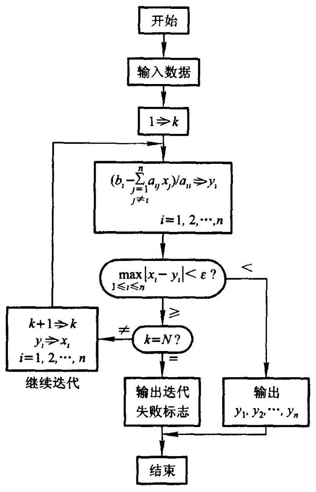

图 5-1

<!-- Media -->

## 2. 高斯 - 塞德尔迭代

再考察前面的例 1,设已得到近似值 $\left( {{x}_{1}^{\left( k\right) },{x}_{2}^{\left( k\right) },{x}_{3}^{\left( k\right) }}\right)$ ,则由方程 ${\left( 2\right) }_{1}$ 得

$$
{x}_{1}^{\left( k + 1\right) } = {0.1}{x}_{2}^{\left( k\right) } + {0.2}{x}_{3}^{\left( k\right) } + {0.72}
$$

对于收敛的迭代过程,所求出的 “新值” ${x}_{1}^{\left( k + 1\right) }$ 常比“老值” ${x}_{1}^{\left( k\right) }$ 更准确些,因此可用它替代老值 ${x}_{1}^{\left( k\right) }$ 作进一步的计算,将 ${x}_{1}^{\left( k + 1\right) }$ 与 ${x}_{3}^{\left( k\right) }$ 一起代入 ${\left( 2\right) }_{2}$ 得

$$
{x}_{2}^{\left( k + 1\right) } = {0.1}{x}_{1}^{\left( k + 1\right) } + {0.2}{x}_{3}^{\left( k\right) } + {0.83}
$$

出于同样的考虑,我们再用新值 ${x}_{2}^{\left( k + 1\right) }$ 替代老值 ${x}_{2}^{\left( k\right) }$ ,由方程 ${\left( 2\right) }_{3}$ 得

$$
{x}_{3}^{\left( k + 1\right) } = {0.2}{x}_{1}^{\left( k + 1\right) } + {0.2}{x}_{2}^{\left( k + 1\right) } + {0.84}
$$

这种充分利用新值建立起来的迭代公式

$$
\left\{  \begin{array}{l} {x}_{1}^{\left( k + 1\right) } = {0.1}{x}_{2}^{\left( k\right) } + {0.2}{x}_{3}^{\left( k\right) } + {0.72} \\  {x}_{2}^{\left( k + 1\right) } = {0.1}{x}_{1}^{\left( k + 1\right) } + {0.2}{x}_{3}^{\left( k\right) } + {0.83} \\  {x}_{3}^{\left( k + 1\right) } = {0.2}{x}_{1}^{\left( k + 1\right) } + {0.2}{x}_{2}^{\left( k + 1\right) } + {0.84} \end{array}\right.  \tag{6}
$$

称作解方程组 (2) 的高斯 - 塞德尔 (Gauss-Seidel) 公式.

仍取初值 ${x}_{1}^{\left( 0\right) } = {x}_{2}^{\left( 0\right) } = {x}_{3}^{\left( 0\right) } = 0$ ,按式 (6) 的计算结果见表 5-2. 与表 5-1 的计算结果相比较可以明显地看出, 迭代公式 (6) 的效果比公式 (3) 为好.

<!-- Media -->

表 5-2

<table><tr><td>$k$</td><td>${x}_{1}^{\left( k\right) }$</td><td>${x}_{2}^{\left( k\right) }$</td><td>${x}_{3}^{\left( k\right) }$</td></tr><tr><td>0</td><td>0.000 00</td><td>0.000 00</td><td>0.000 00</td></tr><tr><td>1</td><td>0.720 00</td><td>0.90200</td><td>1.164 40</td></tr><tr><td>2</td><td>1.043 08</td><td>1.167 19</td><td>1.282 05</td></tr><tr><td>3</td><td>1.093 13</td><td>1.195 72</td><td>1.297 77</td></tr><tr><td>4</td><td>1.099 13</td><td>1.199 47</td><td>1.299 72</td></tr><tr><td>5</td><td>1.099 89</td><td>1.199 93</td><td>1.299 97</td></tr><tr><td>6</td><td>1.099 99</td><td>1.199 99</td><td>1.300 00</td></tr></table>

<!-- Media -->

对于一般形式的方程组 (4), 其高斯 - 塞德尔迭代公式为

$$
{x}_{i}^{\left( k + 1\right) } = \frac{1}{{a}_{u}}\left( {{b}_{i} - \mathop{\sum }\limits_{{j = 1}}^{{i - 1}}{a}_{ij}{x}_{j}^{\left( k + 1\right) } - \mathop{\sum }\limits_{{j = i + 1}}^{n}{a}_{ij}{x}_{j}^{\left( k\right) }}\right) ,\;i = 1,2,\cdots ,n \tag{7}
$$

高斯 - 塞德尔公式 (7) 的特点是,一旦求出变元 ${x}_{l}$ 的某个新值 ${x}_{l}^{\left( k + 1\right) }$ 后, 就改用新值 ${x}_{1}^{\left( k + 1\right) }$ 替代老值 ${x}_{1}^{\left( k\right) }$ 进行这一步剩下的计算. 因此,可将新值 ${x}_{i}^{\left( k + 1\right) }$ 存放在老值 ${x}_{i}^{\left( k\right) }$ 所占用的单元内. 这样,公式 (7) 可表为下列动态形式

$$
\left( {{b}_{i} - \mathop{\sum }\limits_{\substack{{j = 1} \\  {j \neq  i} }}^{n}{a}_{ij}{x}_{j}}\right) /{a}_{ii} \Rightarrow  {x}_{i},\;i = 1,2,\cdots ,n
$$

图 5-2 描述了高斯 - 塞德尔迭代法的计算过程. 其中

$$
\mathop{\max }\limits_{{1 \leq  i \leq  n}}\left| {{y}_{i} - {x}_{i}}\right|
$$

表示相邻两次迭代结果的偏差,当偏差小于给定精度 $\varepsilon$ 时计算终止.

以上介绍了求解线性方程组的两种迭代法. 一般地说, 高斯 - 塞德尔迭代法要比雅可比迭代法好. 但情况并不总是这样, 有时高斯 - 塞德尔迭代比雅可比迭代收敛得慢, 甚至可以举出雅可比迭代收敛但高斯 - 塞德尔迭代反而发散的例子.

## 3. 超松弛法

使用迭代法的困难所在是计算量难以估计. 有时迭代过程虽然收敛, 但由于收敛速度缓慢, 使计算量变得很大而失去使用价值. 因此, 迭代过程的加速具有重要的意义.

所谓松弛法, 实质上是高斯 - 塞德尔迭代的一种加速方法. 这种方法将前一步的结果 ${x}_{i}^{\left( k\right) }$ 与高斯 - 塞德尔方法的迭代值 ${\widetilde{x}}_{i}^{\left( k + 1\right) }$ 适当加权平均,期望获得更好的近似值 ${x}_{i}^{\left( k + 1\right) }$ . 其具体计算公式如下:

$$
\text{迭代}{\widetilde{x}}_{i}^{\left( k + 1\right) } = \frac{1}{{a}_{ii}}\left( {{b}_{i} - \mathop{\sum }\limits_{{j = 1}}^{{i - 1}}{a}_{ij}{x}_{j}^{\left( k + 1\right) } - \mathop{\sum }\limits_{{j = i + 1}}^{n}{a}_{ij}{x}_{j}^{\left( k\right) }}\right)
$$

$$
\text{加速}\;{x}_{l}^{\left( k + 1\right) } = \omega {\widetilde{x}}_{l}^{\left( k + 1\right) } + \left( {1 - \omega }\right) {x}_{l}^{\left( k\right) } \tag{8}
$$

<!-- Media -->

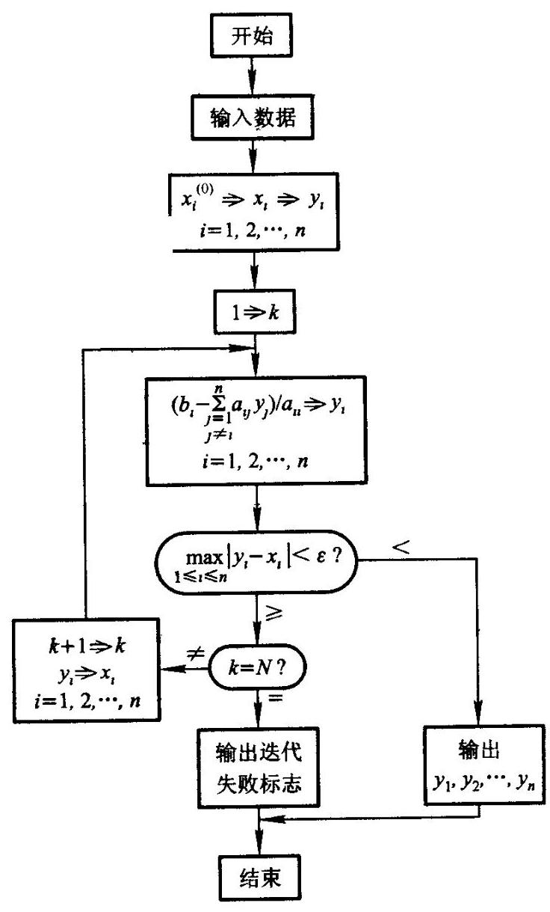

图 5-2

<!-- Media -->

或合并表为

$$
{x}_{i}^{\left( k + 1\right) } = \left( {1 - \omega }\right) {x}_{i}^{\left( k\right) } + \frac{\omega }{{a}_{ii}}\left( {{b}_{i} - \mathop{\sum }\limits_{{j = 1}}^{{i - 1}}{a}_{ij}{x}_{j}^{\left( k + 1\right) } - \mathop{\sum }\limits_{{j = i + 1}}^{n}{a}_{ij}{x}_{j}^{\left( k\right) }}\right) ,
$$

$$
i = 1,2,\cdots ,n \tag{9}
$$

式中系数 $\omega$ 称松弛因子. 高斯 - 塞德尔迭代式 (7) 是取松弛因子 $\omega  = 1$ 的特殊情形. 可以证明,为了保证迭代过程收敛,必须要求 $0 &lt; \omega  &lt; 2$ .

由于迭代值 ${\widetilde{x}}_{t}^{\left( k + 1\right) }$ 通常比 ${x}_{t}^{\left( k\right) }$ 精确,所以在加速公式 (8) 中可加大 ${\widetilde{x}}_{t}^{\left( k + 1\right) }$ 的比重,以尽可能扩大它的效果,为此取松弛因子 $1 &lt; \omega  &lt; 2$ ,即采用所谓超松弛法. 超松弛法简称 SOR (Successive Over-Relaxation) 方法.

松弛因子 $\omega$ 的取值对迭代公式 (9) 的收敛速度影响极大. 实际计算时,可以根据方程组的系数矩阵的性质, 并结合实践计算的经验来选取合适的松弛因子.

## 4. 迭代公式的矩阵表示

线性方程组 (4) 可用矩阵记号简记为

$$
{Ax} = b \tag{10}
$$

式中

$$
\mathbf{A} = \left\lbrack  \begin{matrix} {a}_{11} & {a}_{12} & \cdots & {a}_{1n} \\  {a}_{21} & {a}_{22} & \cdots & {a}_{2n} \\  \cdots & \cdots & \cdots & \cdots \\  {a}_{n1} & {a}_{n2} & \cdots & {a}_{nn} \end{matrix}\right\rbrack
$$

而

$$
\mathbf{b} = {\left( {b}_{1},{b}_{2},\cdots ,{b}_{n}\right) }^{\mathrm{T}},\;\mathbf{x} = {\left( {x}_{1},{x}_{2},\cdots ,{x}_{n}\right) }^{\mathrm{T}}
$$

设将系数矩阵 $\mathbf{A}$ 分裂为

$$
\mathbf{A} = \left\lbrack  \begin{matrix} 0 & & & & \mathbf{0} \\  {a}_{21} & 0 & & & \\  {a}_{31} & {a}_{32} & 0 & & \\  \vdots & \vdots &  \ddots  &  \ddots  & \\  {a}_{n1} & {a}_{n2} & \cdots & {a}_{n,n - 1} & 0 \end{matrix}\right\rbrack   + \left\lbrack  \begin{matrix} {a}_{11} & & & \mathbf{0} & \\   & {a}_{22} & & & \\   & &  \ddots  & & \\   & \mathbf{0} & &  \ddots  & \\   & & & & {a}_{nn} \end{matrix}\right\rbrack   +
$$

$$
\left\lbrack  \begin{matrix} 0 & {a}_{12} & {a}_{13} & \cdots & {a}_{1n} \\   & 0 & {a}_{23} & \cdots & {a}_{2n} \\   & &  \ddots  &  \ddots  & \vdots \\   & 0 & & 0 & {a}_{n - 1,n} \\   & & & & 0 \end{matrix}\right\rbrack
$$

$$
= L + D + U
$$

其中, $\mathbf{D}$ 为对角阵, $\mathbf{L}$ 和 $\mathbf{U}$ 分别为严格下三角阵和严格上三角阵 (它们的主对角线元素全为 0 ). 采用上述记号, 雅可比迭代公式 (5) 可简记为

$$
{\mathbf{x}}^{\left( k + 1\right) } = {\mathbf{D}}^{-1}\left( {\mathbf{b} - \mathbf{L}{\mathbf{x}}^{\left( k\right) } - \mathbf{U}{\mathbf{x}}^{\left( k\right) }}\right)
$$

或表为

$$
{\mathbf{x}}^{\left( k + 1\right) } = \left( {\mathbf{I} - {\mathbf{D}}^{-1}\mathbf{A}}\right) {\mathbf{x}}^{\left( k\right) } + {\mathbf{D}}^{-1}\mathbf{b} \tag{11}
$$

而高斯 - 塞德尔公式 (7) 的矩阵形式是

$$
{\mathbf{x}}^{\left( k + 1\right) } = {\mathbf{D}}^{-1}\left( {\mathbf{b} - \mathbf{L}{\mathbf{x}}^{\left( k + 1\right) } - \mathbf{U}{\mathbf{x}}^{\left( k\right) }}\right)  \tag{12}
$$

由此解出 ${x}^{\left( k + 1\right) }$ ,则有

$$
{\mathbf{x}}^{\left( k + 1\right) } =  - {\left( \mathbf{D} + \mathbf{L}\right) }^{-1}\mathbf{U}{\mathbf{x}}^{\left( k\right) } + {\left( \mathbf{D} + \mathbf{L}\right) }^{-1}\mathbf{b} \tag{13}
$$

请读者自行导出松弛法 (9) 的矩阵形式.

我们看到, 式 (11) 和式 (13) 均属于形如

$$
{x}^{\left( k + 1\right) } = G{x}^{\left( k\right) } + b \tag{14}
$$

的迭代公式. 这类迭代公式的收敛性与矩阵 $\mathbf{G}$ 的性态有关,今后将称矩阵 $\mathbf{G}$ 为公式 (14) 的迭代矩阵.

### 5.2 向量和矩阵的范数

## 1. 向量的范数

为了研究迭代过程的收敛性, 需要对向量的 “大小” 引进某种度量. 我们知道,向量的长度可用来度量其大小,对于向量 $\mathbf{x} = {\left( {x}_{1},{x}_{2},\cdots ,{x}_{n}\right) }^{\mathrm{T}}$ 其长度记作 $\parallel x{\parallel }_{2}$ :

$$
\parallel \mathbf{x}{\parallel }_{2} = \sqrt{{x}_{1}^{2} + {x}_{2}^{2} + \cdots  + {x}_{n}^{2}}
$$

借助于长度可以刻画向量序列的收敛性. 事实上,设有向量序列 ${\mathbf{x}}^{\left( k\right) } =$ ${\left( {x}_{1}^{\left( k\right) },{x}_{2}^{\left( k\right) },\cdots ,{x}_{n}^{\left( k\right) }\right) }^{\mathrm{T}},k = 1,2,\cdots ,n$ ,和向量 ${\mathbf{x}}^{ * } = {\left( {x}_{1}^{ * },{x}_{2}^{ * },\cdots ,{x}_{n}^{ * }\right) }^{\mathrm{T}}$ , 则 $\mathop{\lim }\limits_{{k \rightarrow  \infty }}{x}^{\left( k\right) } = {x}^{ * }$ 即 $\mathop{\lim }\limits_{{k \rightarrow  \infty }}{x}_{l}^{\left( k\right) } = {x}_{l}^{ * }\left( {i = 1,2,\cdots ,n}\right)$ 的充要条件是

$$
\mathop{\lim }\limits_{{k \rightarrow  \infty }}{\begin{Vmatrix}{x}^{\left( k\right) } - {x}^{ * }\end{Vmatrix}}_{2} = 0
$$

自然会问, 除长度以外, 还有什么度量可用来刻画向量序列的收敛性? 这些度量应当具备哪些基本属性?

任给向量 $\mathbf{x} = {\left( {x}_{1},{x}_{2},\cdots ,{x}_{n}\right) }^{\mathrm{T}}$ ,其范数记 $\parallel \mathbf{x}\parallel$ ,它是一个实数,且满足下列三项条件:

(1)对于任意向量 $\mathbf{x},\parallel \mathbf{x}\parallel  \geq  0$ ,当且仅当 $\mathbf{x} = \mathbf{0}$ 时 $\parallel \mathbf{x}\parallel  = 0$ .

(2)对于任意实数 $\lambda$ 及任意向量 $\mathbf{x}$

$$
\parallel {\lambda x}\parallel  = \left| \lambda \right| \parallel x\parallel
$$

(3)对于任意向量 $\mathbf{x}$ 和 $\mathbf{y}$ ,有

$$
\parallel x + y\parallel  \leq  \parallel x\parallel  + \parallel y\parallel
$$

其中, 性质 (3) 称作向量范数的三角不等式.

按以上方式定义的范数, 其具体形式是多种多样的, 常用的范数有

(1)2 - 范数(长度)

$$
\parallel x{\parallel }_{2} = {\left( \mathop{\sum }\limits_{{i = 1}}^{n}{x}_{i}^{2}\right) }^{1/2}
$$

(2) 1 - 范数

$$
\parallel x{\parallel }_{1} = \mathop{\sum }\limits_{{i = 1}}^{n}\left| {x}_{i}\right|
$$

(3) 3° - 范数

$$
\parallel x{\parallel }_{\infty } = \mathop{\max }\limits_{{1 \leq  i \leq  n}}\left| {x}_{i}\right|
$$

以上三种范数都是下列 $p -$ 范数的特例:

$$
\parallel x{\parallel }_{p} = {\left( \mathop{\sum }\limits_{{i = 1}}^{n}{\left| {x}_{i}\right| }^{p}\right) }^{1/p}
$$

事实上,1 - 范数和 2 - 范数显然是 $p$ - 范数当 $p = 1$ 和 $p = 2$ 时的特殊情形. 此外有如下定理:

定理 1 对于任意向量 $\mathbf{x}$ ,

$$
\mathop{\lim }\limits_{{p \rightarrow  \infty }}\parallel x{\parallel }_{p} = \parallel x{\parallel }_{\infty } \tag{15}
$$

证 因

$$
{\left( \mathop{\max }\limits_{{1 \leq  l \leq  n}}{\left| {x}_{l}\right| }^{p}\right) }^{1/p} \leq  {\left( \mathop{\sum }\limits_{{i = 1}}^{n}{\left| {x}_{l}\right| }^{p}\right) }^{1/p} \leq  {\left( n \cdot  \mathop{\max }\limits_{{1 \leq  i \leq  n}}{\left| {x}_{i}\right| }^{p}\right) }^{1/p}
$$

故有

$$
\parallel x{\parallel }_{\infty } \leq  \parallel x{\parallel }_{p} \leq  {n}^{1/p}\parallel x{\parallel }_{\infty } \tag{16}
$$

令 $p \rightarrow  \infty$ ,注意到 ${n}^{1/p} \rightarrow  1$ 即得式(15). 证毕.

按照不同方式规定的范数, 其值一般不相同, 但在各种范数下考虑向量序列的收敛性时, 却表现出明显的一致性, 这就是向量范数的等价性.

称范数 $\parallel  \cdot  {\parallel }_{p}$ 与 $\parallel  \cdot  {\parallel }_{q}$ 等价,如果存在正数 ${c}_{1},{c}_{2}$ ,使对任意向量 $x$ 均有

$$
\parallel x{\parallel }_{p} \leq  {c}_{1}\parallel x{\parallel }_{q},\;\parallel x{\parallel }_{q} \leq  {c}_{2}\parallel x{\parallel }_{p}
$$

容易看出,范数的等价关系具有传递性,如果范数 $\parallel  \cdot  {\parallel }_{p}$ 与 $\parallel  \cdot  {\parallel }_{q}$ 等价,又 $\parallel  \cdot  {\parallel }_{q}$ 与 $\parallel  \cdot  {\parallel }_{r}$ 等价,则 $\parallel  \cdot  {\parallel }_{p}$ 与 $\parallel  \cdot  {\parallel }_{r}$ 等价.

式(16)表明,任何范数 $\parallel  \cdot  {\parallel }_{p}\left( {p &lt; \infty }\right)$ 均与 $\parallel  \cdot  {\parallel }_{\infty }$ 等价,因而任何两种 $p -$ 范数 $\left( {p \leq  \infty }\right)$ 彼此都是等价的. 特别地,前述三种常用范数 $\parallel  \cdot  {\parallel }_{1},\parallel  \cdot  {\parallel }_{2}$ 和 $\parallel  \cdot  {\parallel }_{\infty }$ 彼此等价.

范数的等价性保证了运用具体范数研究收敛性在理论上的合法性. 容易看出,向量序列 ${\left\{  {\mathbf{x}}^{\left( k\right) }\right\}  }_{1}^{\infty }$ 收敛到向量 ${\mathbf{x}}^{ * }$ 的充要条件是,对于任意给定的 $p(0 &lt;$ $p \leq  \infty )$ ,有

$$
{\begin{Vmatrix}{x}^{\left( k\right) } - {x}^{ * }\end{Vmatrix}}_{p} \rightarrow  0,\;k \rightarrow  \infty
$$

## 2. 矩阵的范数

对于给定的 $n$ 阶方阵 $\mathbf{A}$ ,我们将比值 $\parallel \mathbf{A}\mathbf{x}\parallel /\parallel \mathbf{x}\parallel \left( {\mathbf{x} \neq  0}\right)$ 的上确界称作矩阵 $\mathbf{A}$ 的范数,记为 $\parallel \mathbf{A}\parallel$ ,即

$$
\parallel \mathbf{A}\parallel  = \mathop{\max }\limits_{{x \neq  0}}\frac{\parallel \mathbf{A}\mathbf{x}\parallel }{\parallel \mathbf{x}\parallel }
$$

直接由定义知,对于任意向量 $\mathbf{x}$ ,有

$$
\parallel {Ax}\parallel  \leq  \parallel A\parallel \parallel x\parallel  \tag{17}
$$

矩阵范数具有下列基本性质:

(1)对任意方阵 $\mathbf{A},\parallel \mathbf{A}\parallel  \geq  0$ ,当且仅当 $\mathbf{A} = \mathbf{0}$ 时 $\parallel \mathbf{A}\parallel  = 0$ .

(2)对任意实数 $\lambda$ 和任意方阵 $\mathbf{A}$ ,有

$$
\parallel \lambda \mathbf{A}\parallel  = \left| \lambda \right| \parallel \mathbf{A}\parallel
$$

(3)对任意两个同阶方阵 $\mathbf{A}$ 和 $\mathbf{B}$ ,有

$$
\parallel \mathbf{A} + \mathbf{B}\parallel  \leq  \parallel \mathbf{A}\parallel  + \parallel \mathbf{B}\parallel
$$

$$
\parallel {AB}\parallel  \leq  \parallel A\parallel \parallel B\parallel
$$

矩阵范数的这些性质可用向量范数的性质直接验证. 譬如, 利用向量范数的三角不等式, 有

$$
\parallel \mathbf{A} + \mathbf{B}\parallel  = \mathop{\max }\limits_{{x \neq  0}}\frac{\parallel \left( {\mathbf{A} + \mathbf{B}}\right) \mathbf{x}\parallel }{\parallel \mathbf{x}\parallel }
$$

$$
\leq  \mathop{\max }\limits_{{x \neq  0}}\frac{\parallel {Ax}\parallel }{\parallel x\parallel } + \mathop{\max }\limits_{{x \neq  0}}\frac{\parallel {Bx}\parallel }{\parallel x\parallel }
$$

从而有

$$
\parallel A + B\parallel  \leq  \parallel A\parallel  + \parallel B\parallel
$$

附带指出, 由于

$$
\parallel \mathbf{A}\parallel  = \mathop{\max }\limits_{{x \neq  0}}\frac{\parallel \mathbf{A}\mathbf{x}\parallel }{\parallel \mathbf{x}\parallel } = \mathop{\max }\limits_{{x \neq  0}}\begin{Vmatrix}{\mathbf{A}\left( \frac{\mathbf{x}}{\parallel \mathbf{x}\parallel }\right) }\end{Vmatrix}
$$

而 $\begin{Vmatrix}\frac{x}{\parallel x\parallel }\end{Vmatrix} = 1$ ,故矩阵范数亦可等价地定义为

$$
\parallel \mathbf{A}\parallel  = \mathop{\max }\limits_{{\parallel \mathbf{x}\parallel  = 1}}\parallel \mathbf{A}\mathbf{x}\parallel
$$

我们看到, 矩阵范数和向量范数是密切相关的, 有什么样的向量范数, 相应地就有什么样的矩阵范数. 相应于向量的 $p -$ 范数,今后将记

$$
\parallel \mathbf{A}{\parallel }_{p} = \mathop{\max }\limits_{{\parallel \mathbf{x}{\parallel }_{p} = 1}}\parallel \mathbf{A}\mathbf{x}{\parallel }_{p}
$$

定理 2 对 $n$ 阶方阵 $\mathbf{A} = {\left( {a}_{ij}\right) }_{n \times  n}$ ,有

$$
\parallel \mathbf{A}{\parallel }_{\infty } = \mathop{\max }\limits_{{1 \leq  i \leq  n}}\mathop{\sum }\limits_{{j = 1}}^{n}\left| {a}_{ij}\right|  \tag{18}
$$

$$
\parallel \mathbf{A}{\parallel }_{1} = \mathop{\max }\limits_{{1 \leq  j \leq  n}}\mathop{\sum }\limits_{{i = 1}}^{n}\left| {a}_{ij}\right|  \tag{19}
$$

上述 $\parallel \mathbf{A}{\parallel }_{\infty }$ 和 $\parallel \mathbf{A}{\parallel }_{1}$ 分别称作矩阵 $\mathbf{A}$ 的行范数和列范数.

证 以下仅验证式 (18). 式 (19) 可类似地验证. 对于任意 $x = \left( {{x}_{1},{x}_{2},\cdots }\right.$ ,

${\left. {x}_{n}\right) }^{\mathrm{T}}$ ,有

$$
\parallel {Ax}{\parallel }_{\infty } = \mathop{\max }\limits_{{1 \leq  i \leq  n}}\left| {\mathop{\sum }\limits_{{j = 1}}^{n}{a}_{ij}{x}_{j}}\right|  \leq  \mathop{\max }\limits_{{1 \leq  i \leq  n}}\mathop{\sum }\limits_{{j = 1}}^{n}\left| {a}_{ij}\right| \mathop{\max }\limits_{{1 \leq  j \leq  n}}\left| {x}_{j}\right|
$$

因此,当 $\parallel x{\parallel }_{\infty } = \mathop{\max }\limits_{{1 \leq  j \leq  n}}\left| {x}_{j}\right|  = 1$ 时有

$$
\parallel {Ax}{\parallel }_{\infty } \leq  \mathop{\max }\limits_{{1 \leq  i \leq  n}}\mathop{\sum }\limits_{{j = 1}}^{n}\left| {a}_{ij}\right|  \tag{20}
$$

另一方面,设对于某一下标 $k\left( {1 \leq  k \leq  n}\right)$ 有

$$
\mathop{\max }\limits_{{1 \leq  i \leq  n}}\mathop{\sum }\limits_{{j = 1}}^{n}\left| {a}_{ij}\right|  = \mathop{\sum }\limits_{{j = 1}}^{n}\left| {a}_{kj}\right|
$$

设计向量 $\widehat{x}$ ,其分量为

$$
{\widehat{x}}_{j} = \left\{  \begin{array}{ll} 1, & \text{ 若 }{a}_{kj} \geq  0,j = 1,2,\cdots ,n \\   - 1, & \text{ 若 }{a}_{kj} < 0,j = 1,2,\cdots ,n \end{array}\right.
$$

则 $\parallel \widehat{x}{\parallel }_{\infty } = 1$ ,且

$$
{a}_{kj}{\widehat{x}}_{j} = \left| {a}_{kj}\right| ,\;j = 1,2,\cdots ,n
$$

从而有

$$
\parallel \mathbf{A}\widehat{\mathbf{x}}{\parallel }_{\infty } = \mathop{\max }\limits_{{1 \leq  i \leq  n}}\left| {\mathop{\sum }\limits_{{j = 1}}^{n}{a}_{ij}{\widehat{x}}_{j}}\right|  \geq  \left| {\mathop{\sum }\limits_{{j = 1}}^{n}{a}_{kj}{\widehat{x}}_{j}}\right|  = \mathop{\sum }\limits_{{j = 1}}^{n}\left| {a}_{kj}\right|  = \mathop{\max }\limits_{{1 \leq  i \leq  n}}\mathop{\sum }\limits_{{j = 1}}^{n}\left| {a}_{ij}\right|  \tag{21}
$$

综合式(20)和式(21)即可断定

$$
\parallel \mathbf{A}{\parallel }_{\infty } = \mathop{\max }\limits_{{\parallel \mathbf{x}{\parallel }_{\infty } = 1}}\parallel \mathbf{A}\mathbf{x}{\parallel }_{\infty } = \mathop{\max }\limits_{{1 \leq  i \leq  n}}\mathop{\sum }\limits_{{j = 1}}^{n}\left| {a}_{ij}\right|
$$

式(18)得证.

### 5.3 迭代过程的收敛性

## 1. 迭代收敛的充分条件

首先介绍一个很有用的命题.

定理 3 对给定方阵 $\mathbf{G}$ ,若 $\parallel \mathbf{G}\parallel  &lt; 1$ ,则矩阵 $\mathbf{I} - \mathbf{G}$ 为非奇异.

证 用反证法,若 $\mathbf{I} - \mathbf{G}$ 为奇异阵,则存在非零向量 $\mathbf{x}$ ,使

$$
\left( {I - G}\right) x = 0
$$

即有

$$
x = {Gx}
$$

于是据式(17)得

$$
\parallel x\parallel  = \parallel {Gx}\parallel  \leq  \parallel G\parallel \parallel x\parallel
$$

由于 $x \neq  0$ ,又按题设 $\parallel G\parallel  &lt; 1$ ,故上式不可能成立. 命题得证.

现在考察方程组

$$
{Ax} = b
$$

的迭代法, 先将它改写成

$$
x = {Gx} + d \tag{22}
$$

的形式, 据此可建立迭代公式

$$
{x}^{\left( k + 1\right) } = G{x}^{\left( k\right) } + d \tag{23}
$$

定理 4 若迭代矩阵 $G$ 满足

$$
\parallel G\parallel  < 1 \tag{24}
$$

则迭代公式 (23) 对于任意初值 ${x}^{\left( 0\right) }$ 均收敛.

证 因 $\parallel \mathbf{G}\parallel  &lt; 1$ ,据定理 3 知 $\mathbf{I} - \mathbf{G}$ 为非奇异阵,故方程组 (22) 有唯一解 ${\mathbf{x}}^{ * }$ :

$$
{x}^{ * } = G{x}^{ * } + d \tag{25}
$$

将式(23)与式(25)相减得

$$
{\mathbf{x}}^{\left( k + 1\right) } - {\mathbf{x}}^{ * } = \mathbf{G}\left( {{\mathbf{x}}^{\left( k\right) } - {\mathbf{x}}^{ * }}\right)
$$

因此, 有

$$
\begin{Vmatrix}{{x}^{\left( k + 1\right) } - {x}^{ * }}\end{Vmatrix} \leq  \parallel G\parallel \begin{Vmatrix}{{x}^{\left( k\right) } - {x}^{ * }}\end{Vmatrix}
$$

据此反复递推, 并利用条件 (24) 知

$$
\begin{Vmatrix}{{x}^{\left( k\right) } - {x}^{ * }}\end{Vmatrix} \leq  \parallel G{\parallel }^{k}\begin{Vmatrix}{{x}^{\left( 0\right) } - {x}^{ * }}\end{Vmatrix} \rightarrow  0\;\left( {k \rightarrow  \infty }\right)
$$

故迭代过程收敛.

## 2. 对角占优方程组

称 $n$ 阶方阵 $\mathbf{A} = {\left( {a}_{ij}\right) }_{n \times  n}$ 是对角占优的,如果其主对角线元素的绝对值大于同行其他元素绝对值之和:

$$
\mathop{\sum }\limits_{\substack{{j = 1} \\  {j \neq  i} }}^{n}\left| {a}_{ij}\right|  < \left| {a}_{ii}\right| ,\;i = 1,2,\cdots ,n \tag{26}
$$

定理 5 若 $\mathbf{A}$ 为对角占优阵,则它是非奇异的.

证 因 $\mathbf{A}$ 为对角占优,其主对角线元素 ${\mathbf{a}}_{ii}$ 全不为 0,故对角阵 $\mathbf{D} = \operatorname{diag}\left( {a}_{n}\right)$ 为非奇异的. 考察矩阵

$$
\mathbf{I} - {\mathbf{D}}^{-1}\mathbf{A} = \left\lbrack  \begin{matrix} 0 &  - \frac{{a}_{12}}{{a}_{11}} & \cdots &  - \frac{{a}_{1n}}{{a}_{11}} \\   - \frac{{a}_{21}}{{a}_{22}} & 0 & \cdots &  - \frac{{a}_{2n}}{{a}_{22}} \\  \vdots & \vdots & & \vdots \\   - \frac{{a}_{n1}}{{a}_{nn}} &  - \frac{{a}_{n2}}{{a}_{nn}} & \cdots & 0 \end{matrix}\right\rbrack   \tag{27}
$$

利用对角占优条件 (26) 知

$$
{\begin{Vmatrix}\mathbf{I} - {\mathbf{D}}^{-1}\mathbf{A}\end{Vmatrix}}_{\infty } = \mathop{\max }\limits_{{1 \leq  i \leq  n}}\mathop{\sum }\limits_{\substack{{j = 1} \\  {j \neq  i} }}^{n}\frac{\left| {a}_{ij}\right| }{\left| {a}_{ii}\right| } = \mathop{\max }\limits_{{1 \leq  i \leq  n}}\left( {\frac{1}{\left| {a}_{ii}\right| }\mathop{\sum }\limits_{\substack{{j = 1} \\  {j \neq  i} }}^{n}\left| {a}_{ij}\right| }\right)  < 1 \tag{28}
$$

故利用定理 3 可以断定矩阵 ${\mathbf{D}}^{-1}\mathbf{A}$ 为非奇异,从而 $\mathbf{A}$ 为非奇异. 证毕.

系数矩阵为对角占优阵的线性方程组称作对角占优方程组.

定理 6 对角占优方程组 (10) 的雅可比迭代公式 (11) 和高斯 - 塞德尔迭代公式(13)均收敛.

证 雅可比公式(11)的迭代矩阵为

$$
G = I - {D}^{-1}A
$$

按式 (28) 这时 $\parallel \mathbf{G}{\parallel }_{\infty } &lt; 1$ ,从而据定理 4 知迭代收敛.

再考察高斯 - 塞德尔公式 (13) 的迭代矩阵

$$
\widetilde{\mathbf{G}} =  - {\left( \mathbf{D} + \mathbf{L}\right) }^{-1}\mathbf{U}
$$

令 $\mathbf{y} = \widetilde{\mathbf{G}}\mathbf{x}$ ,则有

$$
y =  - {D}^{-1}{Ly} - {D}^{-1}{Ux}
$$

写出分量形式有

$$
{y}_{l} =  - \mathop{\sum }\limits_{{j = 1}}^{{l - 1}}\frac{{a}_{lj}}{{a}_{li}}{y}_{j} - \mathop{\sum }\limits_{{j = l + 1}}^{n}\frac{{a}_{lj}}{{a}_{li}}{x}_{j},\;i = 1,2,\cdots ,n \tag{29}
$$

设 $\parallel \mathbf{x}{\parallel }_{\infty } = \mathop{\max }\limits_{{1 \leq  i \leq  n}}\left| {x}_{i}\right|  = 1$ ,而

$$
\parallel y{\parallel }_{\infty } = \mathop{\max }\limits_{{1 \leq  i \leq  n}}\left| {y}_{i}\right|  = \left| {y}_{k}\right| ,\;1 \leq  k \leq  n
$$

则由式(29)得

$$
\parallel \mathbf{y}{\parallel }_{\infty } = \left| {y}_{k}\right|  \leq  \mathop{\sum }\limits_{{j = 1}}^{{k - 1}}\frac{\left| {a}_{kj}\right| }{\left| {a}_{kk}\right| }\parallel \mathbf{y}{\parallel }_{\infty } + \mathop{\sum }\limits_{{j = k + 1}}^{n}\frac{\left| {a}_{kj}\right| }{\left| {a}_{kk}\right| }
$$

由此整理得

$$
\parallel \mathbf{y}{\parallel }_{\infty } \leq  \frac{\mathop{\sum }\limits_{{j = k + 1}}^{n}\frac{\left| {a}_{kj}\right| }{\left| {a}_{kk}\right| }}{1 - \mathop{\sum }\limits_{{j = 1}}^{{k - 1}}\frac{\left| {a}_{kj}\right| }{\left| {a}_{kk}\right| }}
$$

利用对角占优条件 (26) 知上式右端小于 1 , 故有

$$
\parallel \widetilde{G}{\parallel }_{\infty } = \mathop{\max }\limits_{{\parallel x{\parallel }_{\infty } = 1}}\parallel y{\parallel }_{\infty } < 1
$$

因此, 据定理 4 可以断定高斯 - 塞德尔迭代收敛. 定理证毕.

## 例题选讲 5.1 迭代公式的设计

迭代法的设计机理是,将方程组 $\mathbf{{Ax}} = \mathbf{b}$ 的系数矩阵 $\mathbf{A}$ 分裂为 $\mathbf{A} = \mathbf{M} + \mathbf{N}$ 的形式,其中一个分裂阵 $\mathbf{M}$ 比较容易求逆. 这样,据所给方程组 $\mathbf{{Mx}} =$ $- {Nx} + b$ 可建立起迭代公式

$$
M{x}^{\left( k + 1\right) } =  - N{x}^{\left( k\right) } + b
$$

设计迭代法的关键在于选取合适的分裂矩阵 $\mathbf{M}$ . 设令 $\mathbf{A} = \mathbf{D} + \mathbf{L} + \mathbf{U}$ ,其中 $\mathbf{D}$ 为对角阵, $\mathbf{L}$ 和 $\mathbf{U}$ 则分别为严格下三角阵与严格上三角阵. 我们知道, 如果取对角阵 $\mathbf{D}$ 作为 $\mathbf{M}$ ,则所设计出的迭代方法就是雅可比方法; 而如果取下三角阵 $\mathbf{D} + \mathbf{L}$ 作为分裂阵 $\mathbf{M}$ ,即施行矩阵分裂 $\mathbf{A} = \left( {\mathbf{D} + \mathbf{L}}\right)  + \mathbf{U}$ ,这样设计出的迭代方法则是高斯 - 塞德尔方法.

题 1 考察矩阵分裂 $\mathbf{A} = \left( {\mathbf{D} + \mathbf{U}}\right)  + \mathbf{L}$ ,试给出求解方程组的迭代公式, 并与高斯 - 塞德尔方法比较计算顺序.

解 据分裂方式 $\mathbf{A} = \left( {\mathbf{D} + \mathbf{U}}\right)  + \mathbf{L}$ 建立的迭代公式是

$$
\left( {\mathbf{D} + \mathbf{U}}\right) {\mathbf{x}}^{\left( k + 1\right) } =  - \mathbf{L}{\mathbf{x}}^{\left( k\right) } + \mathbf{b}
$$

其分量形式为 ①

$$
{x}_{1}^{\left( k + 1\right) } = \frac{1}{{a}_{u}}\left( {{b}_{1} - \mathop{\sum }\limits_{{j = 1}}^{{i - 1}}{a}_{ij}{x}_{j}^{\left( k\right) } - \mathop{\sum }\limits_{{j = i + 1}}^{n}{a}_{ij}{x}_{j}^{\left( k + 1\right) }}\right) ,\;i = n,n - 1,\cdots ,1
$$

这样设计出的迭代公式,它的每一迭代步逆向计算 ${x}_{n}^{\left( k + 1\right) } \rightarrow  {x}_{n - 1}^{\left( k + 1\right) } \rightarrow  \cdots  \rightarrow$ ${x}_{1}^{\left( k + 1\right) }$ ,其计算顺序恰好与高斯 - 塞德尔方法相反. 在这个意义下可以将它看作高斯 - 塞德尔方法的 “反方法”。

相反相成. 将正反两种高斯 - 塞德尔方法相匹配, 即可生成下述高斯 - 塞德尔预报 - 校正系统.

题 2 令矩阵 $\mathbf{A} = {\left( {a}_{ij}\right) }_{n \times  n}$ 分裂为 $\mathbf{A} = \mathbf{L} + \mathbf{D} + \mathbf{U}$ ,其中 $\mathbf{D}$ 为对角阵, $\mathbf{L}$ 与 $\mathbf{U}$ 分别为严格下三角阵与严格上三角阵, 试列出预报 - 校正系统

$$
\left\{  \begin{array}{l} \left( {\mathbf{D} + \mathbf{L}}\right) {\overline{\mathbf{x}}}^{\left( k + 1\right) } =  - \mathbf{U}{\mathbf{x}}^{\left( k\right) } + \mathbf{b} \\  \left( {\mathbf{D} + \mathbf{U}}\right) {\mathbf{x}}^{\left( k + 1\right) } =  - \mathbf{L}{\overline{\mathbf{x}}}^{\left( k + 1\right) } + \mathbf{b} \end{array}\right.
$$

的分量形式.

解 其预报公式与校正公式分别为

$$
{\widetilde{x}}_{i}^{\left( k + 1\right) } = \frac{1}{{a}_{ii}}\left( {{b}_{i} - \mathop{\sum }\limits_{{j = 1}}^{{i - 1}}{a}_{ij}{\widetilde{x}}_{j}^{\left( k + 1\right) } - \mathop{\sum }\limits_{{j = i + 1}}^{n}{a}_{ij}{x}_{j}^{\left( k\right) }}\right) ,\;i = 1,2,\cdots ,n
$$

与

$$
{x}_{i}^{\left( k + 1\right) } = \frac{1}{{a}_{u}}\left( {{b}_{i} - \mathop{\sum }\limits_{{j = 1}}^{{i - 1}}{a}_{ij}{\bar{x}}_{j}^{\left( k + 1\right) } - \mathop{\sum }\limits_{{j = i + 1}}^{n}{a}_{ij}{x}_{j}^{\left( k + 1\right) }}\right) ,\;i = n,n - 1,\cdots ,1
$$

---

<!-- Footnote -->

① 我们约定,当 $s &gt; t$ 时和值 $\mathop{\sum }\limits_{s}^{t}$ . 等于 0 . 譬如这里 $\mathop{\sum }\limits_{{j = n + 1}}^{n}{a}_{ij}{x}_{j}^{\left( k + 1\right) } = 0$ . 这一约定以后不再反复申明.

<!-- Footnote -->

---

## 例题选讲 5.2 迭代过程的收敛性

题 1 证明,当 $- \frac{1}{2} &lt; a &lt; \frac{1}{2}$ 时系数矩阵为

$$
A = \left\lbrack  \begin{array}{lll} 1 & a & a \\  a & 1 & a \\  a & a & 1 \end{array}\right\rbrack
$$

的方程组 $\mathbf{{Ax}} = \mathbf{b}$ ,其雅可比迭代与高斯 - 塞德尔迭代均收敛.

证 这时 $\mathbf{A}$ 为对角占优阵.

题 2 设矩阵 $\mathbf{A}$ 可分裂为 $\mathbf{A} = \mathbf{I} + \mathbf{L} + \mathbf{U}$ ,其中 $\mathbf{I}$ 为单位阵, $\mathbf{L},\mathbf{U}$ 分别为严格下三角阵与严格上三角阵,且成立 $\parallel \mathbf{L}\parallel  + \parallel \mathbf{U}\parallel  &lt; 1$ ,证明,求解方程组 $\mathbf{{Ax}} = \mathbf{b}$ 的雅可比迭代与高斯 - 塞德尔迭代均收敛.

证 这里雅可比迭代的迭代矩阵 $\mathbf{G} = \mathbf{L} + \mathbf{U}$ ,由于 $\parallel \mathbf{G}\parallel  &lt; 1$ ,按定理 4 它是收敛的.

又高斯 - 塞德尔迭代具有形式

$$
{x}^{\left( k + 1\right) } =  - L{x}^{\left( k + 1\right) } - U{x}^{\left( k\right) } + b
$$

而所求的解 ${x}^{ * }$ 满足

$$
{x}^{ * } =  - L{x}^{ * } - U{x}^{ * } + b
$$

两式相减得

$$
\begin{Vmatrix}{{x}^{\left( k + 1\right) } - {x}^{ * }}\end{Vmatrix} \leq  \parallel L\parallel  \cdot  \begin{Vmatrix}{{x}^{\left( k + 1\right) } - {x}^{ * }}\end{Vmatrix} + \parallel U\parallel  \cdot  \begin{Vmatrix}{{x}^{\left( k\right) } - {x}^{ * }}\end{Vmatrix}
$$

从而有

$$
\begin{Vmatrix}{{x}^{\left( k + 1\right) } - {x}^{ * }}\end{Vmatrix} \leq  \frac{\parallel U\parallel }{1 - \parallel L\parallel }\begin{Vmatrix}{{x}^{\left( k\right) } - {x}^{ * }}\end{Vmatrix}
$$

依所给条件知

$$
0 < \frac{\parallel U\parallel }{1 - \parallel L\parallel } < 1
$$

故高斯 - 塞德尔迭代亦收敛.

题 3 设求解方程组 $\mathbf{{Ax}} = \mathbf{b}$ 的雅可比迭代公式为

$$
{x}^{\left( k + 1\right) } = G{x}^{\left( k\right) } + b
$$

求证当 $\parallel \mathbf{G}{\parallel }_{\infty } &lt; 1$ 时相应的高斯 - 塞德尔迭代亦收敛.

证 由于 $\mathbf{G}$ 是雅可比方法的迭代矩阵,它应具有式 (27) 的形式,而由假设条件 $\parallel G{\parallel }_{\infty } &lt; 1$ 可以断定

$$
\mathop{\sum }\limits_{\substack{{j = 1} \\  {j \neq  i} }}^{n}\left| \frac{{a}_{ij}}{{a}_{ii}}\right|  < 1,\;i = 1,2,\cdots ,n
$$

即这时 $\mathbf{A}$ 为对角占优阵,依定理 6 知迭代收敛.

题 4 设 ${a}_{11}{a}_{22} \neq  0$ ,证明,求解方程组

$$
\left\{  \begin{array}{l} {a}_{11}{x}_{1} + {a}_{12}{x}_{2} = {b}_{1} \\  {a}_{21}{x}_{1} + {a}_{22}{x}_{2} = {b}_{2} \end{array}\right.
$$

的雅可比迭代与高斯 - 塞德尔迭代同时收敛或同时发散.

证 先考察雅可比迭代公式

$$
\left\{  \begin{array}{l} {x}_{1}^{\left( k + 1\right) } =  - \frac{{a}_{12}}{{a}_{11}}{x}_{2}^{\left( k\right) } + \frac{{b}_{1}}{{a}_{11}} \\  {x}_{2}^{\left( k + 1\right) } =  - \frac{{a}_{21}}{{a}_{22}}{x}_{1}^{\left( k\right) } + \frac{{b}_{2}}{{a}_{22}} \end{array}\right.
$$

这里迭代误差 ${e}_{i}^{\left( k\right) } = \left| {{x}_{i}^{\left( k\right) } - {x}_{i}^{ * }}\right| ,i = 1,2$ ,满足

$$
{e}_{1}^{\left( k + 1\right) } = \left| \frac{{a}_{12}}{{a}_{11}}\right| {e}_{2}^{\left( k\right) }
$$

$$
{e}_{2}^{\left( k + 1\right) } = \left| \frac{{a}_{21}}{{a}_{22}}\right| {e}_{1}^{\left( k\right) }
$$

故有

$$
{e}_{i}^{\left( k + 1\right) } = \rho {e}_{i}^{\left( k - 1\right) },\;i = 1,2
$$

由此可见, 这里保证雅可比迭代收敛的充要条件是

$$
\rho  = \left| \frac{{a}_{12}{a}_{21}}{{a}_{11}{a}_{22}}\right|  < 1
$$

类似地可以证明, 这项条件同样是保证高斯 - 塞德尔迭代收敛的充要条件.

## 习 题 五

1. 用雅可比迭代与高斯 - 塞德尔迭代求解方程组:

$$
\left\{  \begin{array}{l} 3{x}_{1} + {x}_{2} = 2 \\  {x}_{1} + 2{x}_{2} = 1 \end{array}\right.
$$

要求结果有 3 位有效数字.

2. 试列出求解下列方程组

$$
\begin{cases} {10}{x}_{1} &  + {x}_{3} - 5{x}_{4} &  =  - 7 \\  {x}_{1} + 8{x}_{2} - 3{x}_{3} & &  = {11} \\  3{x}_{1} + 2{x}_{2} - 8{x}_{3} + {x}_{4} &  = {23} & \\  {x}_{1} - 2{x}_{2} + 2{x}_{3} + 7{x}_{4} &  = {17} &  \end{cases}
$$

的雅可比迭代公式与高斯 - 塞德尔迭代公式, 并考察迭代过程的收敛性.

3. 证明下列方程组的雅可比迭代与高斯 - 塞德尔迭代均收敛,并取 $x = {\left( 0,0,0,0\right) }^{\mathrm{T}}$ 求精度为 ${10}^{-3}$ 的迭代值:

$$
\left\lbrack  \begin{array}{rrrr} {10} &  - 1 & 2 & 0 \\   - 1 & {11} &  - 1 & 3 \\  2 &  - 1 & {10} &  - 1 \\  0 & 3 &  - 1 & 8 \end{array}\right\rbrack  \left\lbrack  \begin{array}{l} {x}_{1} \\  {x}_{2} \\  {x}_{3} \\  {x}_{4} \end{array}\right\rbrack   = \left\lbrack  \begin{array}{r} 6 \\  {25} \\   - {11} \\  {15} \end{array}\right\rbrack
$$

4. 用高斯 - 塞德尔迭代求解方程组:

$$
\left\lbrack  \begin{array}{rrrrrr} 4 &  - 1 & 0 &  - 1 & 0 & 0 \\   - 1 & 4 &  - 1 & 0 &  - 1 & 0 \\  0 &  - 1 & 4 & 0 & 0 &  - 1 \\   - 1 & 0 & 0 & 4 &  - 1 & 0 \\  0 &  - 1 & 0 &  - 1 & 4 &  - 1 \\  0 & 0 &  - 1 & 0 &  - 1 & 4 \end{array}\right\rbrack  \left\lbrack  \begin{array}{l} {x}_{1} \\  {x}_{2} \\  {x}_{3} \\  {x}_{4} \\  {x}_{5} \\  {x}_{6} \end{array}\right\rbrack   = \left\lbrack  \begin{array}{l} 0 \\  5 \\  0 \\  6 \\   - 2 \\  6 \end{array}\right\rbrack
$$

5. 分别用雅可比迭代与高斯 - 塞德尔迭代求解下列方程组:

(1) $\left\{  \begin{array}{l} {x}_{1} + 2{x}_{2} =  - 1 \\  3{x}_{1} + {x}_{2} = 2 \end{array}\right.$

(2) $\left\{  \begin{array}{l} {x}_{1} + 5{x}_{2} - 3{x}_{3} = 2 \\  5{x}_{1} - 2{x}_{2} + {x}_{3} = 4 \\  2{x}_{1} + {x}_{2} - 5{x}_{3} =  - {11} \end{array}\right.$

6. 加工上述题 5 的方程组, 譬如调换方程的排列顺序, 以保证迭代过程的收敛性.
7. 取 $\omega  = {1.25}$ 用松弛法求解下列方程组:

$$
\begin{cases} 4{x}_{1} + 3{x}_{2} &  = {16} \\  3{x}_{1} + 4{x}_{2} - {x}_{3} &  = {20} \\   - {x}_{2} + 4{x}_{3} &  =  - {12} \end{cases}
$$

要求精度为 $\frac{1}{2} \times  {10}^{-4}$ .

8. 试列出超松弛法 (9) 的矩阵形式.
9. 证明对于任意向量 $x,y$ ,成立

$$
\left| {\parallel x\parallel  - \parallel y\parallel }\right|  \leq  \parallel x - y\parallel
$$

10. 证明单位矩阵 $\mathbf{I}$ 的范数 $\parallel \mathbf{I}\parallel  = 1$ .
11. 证明当定理 4 的条件成立时有下列估计式:

(1) $\begin{Vmatrix}{{x}^{ * } - {x}^{\left( k + 1\right) }}\end{Vmatrix} \leq  \frac{\parallel G\parallel }{1 - \parallel G\parallel }\begin{Vmatrix}{{x}^{\left( k + 1\right) } - {x}^{\left( k\right) }}\end{Vmatrix}$

(2) $\begin{Vmatrix}{{x}^{ * } - {x}^{\left( k\right) }}\end{Vmatrix} \leq  \frac{\parallel G{\parallel }^{k}}{1 - \parallel G\parallel }\begin{Vmatrix}{{x}^{\left( 1\right) } - {x}^{\left( 0\right) }}\end{Vmatrix}$

12. 设 ${a}_{11} \cdot  {a}_{22} \neq  0$ ,证明: 求解方程组

$$
\left\{  \begin{array}{l} {a}_{11}{x}_{1} + {a}_{12}{x}_{2} = {b}_{1} \\  {a}_{21}{x}_{1} + {a}_{22}{x}_{2} = {b}_{2} \end{array}\right.
$$

的雅可比迭代与高斯 - 塞德尔迭代同时收敛或同时发散.

## 第六章 线性方程组的直接法

求解线性方程组的另一类重要方法是直接法. 直接法利用一系列递推公式计算有限步能直接得到方程组的精确解. 当然, 实际计算结果仍有误差, 譬如舍入误差. 舍入误差的积累有时甚至会严重影响解的精度 (参看本章 6.4 节).

求解线性方程组最基本的一种直接法是消去法. 这是一个众所周知的古老方法, 但用在计算机上仍然十分有效.

### 6.1 消 去 法

消去法的基本思想是, 通过将一个方程乘或除以某个常数, 以及将两个方程相加、减这两种手续, 逐步减少方程中变元的数目, 最终使每个方程仅含一个变元, 从而得出所求的解.

本节将介绍两种消去法: 约当 (Jordan) 消去法和高斯 (Gauss) 消去法.

## 1. 约当消去法

例 1 运用消去法求解方程组

$$
\begin{cases} 2{x}_{1} - {x}_{2} + 3{x}_{3} &  = 1 \\  4{x}_{1} + 2{x}_{2} + 5{x}_{3} &  = 4 \\  {x}_{1} + 2{x}_{2} &  = 7 \end{cases} \tag{1}
$$

第 1 步,先将方程 ${\left( 1\right) }_{1}$ 中 ${x}_{1}$ 的系数化为 1,并从方程组 (1) 的其余的方程中消去 ${x}_{1}$ ,得

$$
\begin{cases} {x}_{1} - {0.5}{x}_{2} + {1.5}{x}_{3} &  = {0.5} \\  4{x}_{2} - {x}_{3} &  = 2 \\  {2.5}{x}_{2} - {1.5}{x}_{3} &  = {6.5} \end{cases} \tag{2}
$$

第 2 步,再将方程 ${\left( 2\right) }_{2}$ 中 ${x}_{2}$ 的系数化为 1,并从其余的两个方程中消去 ${x}_{2}$ , 得

$$
\begin{cases} {x}_{1}\; + {1.375}{x}_{3} &  = {0.75} \\  {x}_{2} - {0.25}{x}_{3} &  = {0.5} \\   - {0.875}{x}_{3} &  = {5.25} \end{cases} \tag{3}
$$

最后,再将方程 ${\left( 3\right) }_{3}$ 中 ${x}_{3}$ 的系数化为 1,并从其余的方程中消去 ${x}_{3}$ ,最终得到所求的解

$$
{x}_{1} = 9,{x}_{2} =  - 1,{x}_{3} =  - 6
$$

上述算法就是所谓约当消去法. 其特点是, 它的每一步仅在一个方程中保留某个变元, 而从其余的各个方程中消去该变元, 这样经过反复消元后, 所给方程组最终被加工成一个方程仅含一个变元的形式, 从而得出所求的解.

现在就一般形式的方程组

$$
\mathop{\sum }\limits_{{\jmath  = 1}}^{n}{a}_{\imath \jmath }{x}_{\jmath } = {b}_{\imath },\;i = 1,2,\cdots ,n \tag{4}
$$

建立约当消去法的计算公式,以下将以 ${a}_{y}^{\left( k\right) },{b}_{1}^{\left( k\right) }$ 表示经过 $k$ 步消元后相应的系数和右端项, 而令

$$
{a}_{\imath \jmath }^{\left( 0\right) } = {a}_{\imath \jmath },{b}_{\imath }^{\left( 0\right) } = {b}_{\imath },\;i,j = 1,2,\cdots ,n \tag{5}
$$

约当消去法分 $n$ 步完成:

第 1 步,将方程 ${\left( 4\right) }_{1}$ 中 ${x}_{1}$ 的系数化为 1,并从其余的方程中消去 ${x}_{1}$ ,使之变为

$$
\begin{cases} {x}_{1} + \mathop{\sum }\limits_{{j = 2}}^{n}{a}_{1j}^{\left( 1\right) }{x}_{j} &  = {b}_{1}^{\left( 1\right) } \\  \mathop{\sum }\limits_{{j = 2}}^{n}{a}_{1j}^{\left( 1\right) }{x}_{j} &  = {b}_{i}^{\left( 1\right) },\;i = 2,3,\cdots ,n \end{cases} \tag{6}
$$

为此,先用 ${a}_{11}$ 遍除方程 ${\left( 4\right) }_{1}$ ,即施行运算

$$
{a}_{1j}^{\left( 1\right) } = {a}_{1j}/{a}_{11},\;j = 2,3,\cdots ,n \tag{7}
$$

$$
{b}_{1}^{\left( 1\right) } = {b}_{1}/{a}_{11}
$$

然后将方程 (4),减去方程 ${\left( 6\right) }_{1}$ 的 ${a}_{t1}$ 倍,即令

$$
\begin{array}{l} {a}_{ij}^{\left( 1\right) } = {a}_{ij} - {a}_{i1}{a}_{1j}^{\left( 1\right) },\;i,j = 2,3,\cdots ,n \\  {b}_{i}^{\left( 1\right) } = {b}_{i} - {a}_{i1}{b}_{1}^{\left( 1\right) },\;i,j = 2,3,\cdots ,n \end{array} \tag{8}
$$

第 2 步,再将方程 ${\left( 6\right) }_{2}$ 中 ${x}_{2}$ 的系数化为 1,并从方程组 (6) 的其余方程中消去 ${x}_{2}$ . 如此经过 $k - 1$ 步以后,所给方程组被加工成下列形式

$$
\begin{cases} {x}_{1} + \mathop{\sum }\limits_{{j = k}}^{n}{a}_{uj}^{\left( k - 1\right) }{x}_{j} &  = {b}_{1}^{\left( k - 1\right) },\;i = 1,2,\cdots ,k - 1 \\  \mathop{\sum }\limits_{{j = k}}^{n}{a}_{uj}^{\left( k - 1\right) }{x}_{j} &  = {b}_{1}^{\left( k - 1\right) },\;i = k,k + 1,\cdots ,n \end{cases} \tag{9}
$$

约当消去法的第 $k$ 步,先将方程 ${\left( 9\right) }_{k}$ 中 ${x}_{k}$ 的系数化为 1,然后从其余的各个方程中消去 ${x}_{k}$ ,使之进一步变成

$$
\begin{cases} {x}_{1} + \mathop{\sum }\limits_{{j = k + 1}}^{n}{a}_{ij}^{\left( k\right) }{x}_{j} &  = {b}_{i}^{\left( k\right) },\;i = 1,2,\cdots ,k \\  \mathop{\sum }\limits_{{j = k + 1}}^{n}{a}_{ij}^{\left( k\right) }{x}_{j} &  = {b}_{i}^{\left( k\right) },\;i = k + 1,k + 2,\cdots ,n \end{cases} \tag{10}
$$

为此所要施行的运算是

$$
{a}_{kj}^{\left( k\right) } = {a}_{kj}^{\left( k - 1\right) }/{a}_{kk}^{\left( k - 1\right) },\;j = k + 1,k + 2,\cdots ,n
$$

$$
{b}_{k}^{\left( k\right) } = {b}_{k}^{\left( k - 1\right) }/{a}_{kk}^{\left( k - 1\right) } \tag{11}
$$

和

$$
{a}_{ij}^{\left( k\right) } = {a}_{ij}^{\left( k - 1\right) } - {a}_{ik}^{\left( k - 1\right) } \cdot  {a}_{kj}^{\left( k\right) },\;j = k + 1,k + 2,\cdots ,n
$$

$$
{b}_{i}^{\left( k\right) } = {b}_{i}^{\left( k - 1\right) } - {a}_{ik}^{\left( k - 1\right) } \cdot  {b}_{k}^{\left( k\right) },\;i = 1,\cdots ,k - 1,k + 1,\cdots ,n \tag{12}
$$

这样做 $n$ 步以后,所给方程组最终被加工成 ①

$$
{x}_{i} = {b}_{i}^{\left( n\right) },\;i = 1,2,\cdots ,n \tag{13}
$$

此即所求的解.

综上所述,约当消去法的计算过程是,利用式 (5) 提供的初值,对 $k = 1$ , $2,\cdots ,n$ 执行递推算式 (11)、(12),最后由式 (13) 给出所求的解.

由于上述算法的第 $k$ 步需要计算方程组 (10) 的 $\left( {n - k + 1}\right)  \times  n$ 个系数,而每个系数按式 (11)、(12) 要做一次乘除法, 因此约当消去法总的计算量为

$$
\mathop{\sum }\limits_{{k = 1}}^{n}\left( {n - k + 1}\right)  \times  n \approx  \frac{{n}^{3}}{2}
$$

次乘除法.

用消去法解方程组, 如何压缩算法的存储量是个很重要的问题. 可以看到, 消元过程的每一步都改变了系数矩阵中许多元素的值, 系数的这些新值是否一定要另设单元来存放呢?

考察约当消去法的加工过程,注意到它每一步用系数的 “老值” ${a}_{ij}^{\left( k - 1\right) }$ , ${b}_{i}^{\left( k - 1\right) }$ 求得 “新值” ${a}_{y}^{\left( k\right) },{b}_{i}^{\left( k\right) }$ 以后,进一步的计算只用到新值,而老值则不必再继续保存,因而可将新值 ${a}_{ij}^{\left( k\right) },{b}_{i}^{\left( k\right) }$ 存放到老值 ${a}_{ij}^{\left( k - 1\right) },{b}_{i}^{\left( k - 1\right) }$ 所占用的单元内. 相应地, 计算公式 (11)、(12) 则动态地表为

$$
{a}_{kj}/{a}_{kk} \Rightarrow  {a}_{kj},\;j = k + 1,k + 2,\cdots ,n
$$

$$
{b}_{k}/{a}_{kk} \Rightarrow  {b}_{k}
$$

$$
{a}_{\imath y} - {a}_{\imath k}{a}_{k\jmath } \Rightarrow  {a}_{\imath \jmath },\;j = k + 1,k + 2,\cdots ,n
$$

$$
{b}_{\imath } - {a}_{\imath k}{b}_{k} \Rightarrow  {b}_{\imath },\;i = 1,\cdots ,k - 1,k + 1,\cdots ,n
$$

---

<!-- Footnote -->

① 这里约定,和式 $\mathop{\sum }\limits_{{j = m}}^{l}{a}_{j}$ 当 $l &lt; m$ 时值为 0,这样,当 $k = n$ 时方程组 (10) 便退化为式 (13).

<!-- Footnote -->

---

图 6-1 描述了约当消去法的计算过程. 程序执行前,单元 ${a}_{ij},{b}_{i}$ 内先存放所给数据,程序运行后,在单元 ${b}_{1},{b}_{2},\cdots ,{b}_{n}$ 中得到所求的解 ${x}_{1},{x}_{2}$ , $\cdots ,{x}_{n}$ .

<!-- Media -->

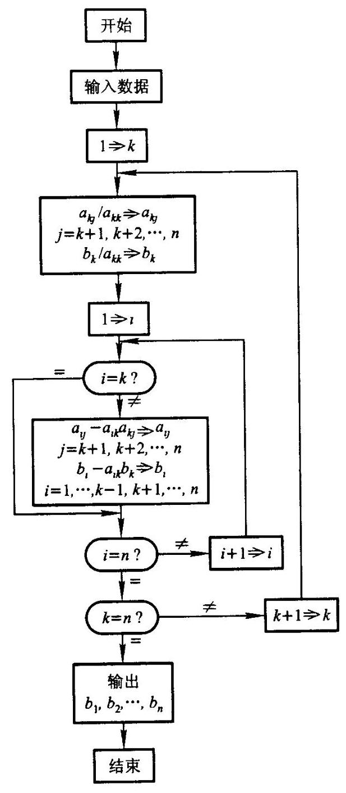

图 6-1

<!-- Media -->

## 2. 高斯消去法

高斯消去法是约当消去法的一种改进, 它较约当消去法进一步节省了计算量.

为了说明高斯消去法的计算步骤, 再求解例 1 的方程组 (1).

在加工得出方程组 (2) 以后,高斯消去法暂不改动其中的方程 ${\left( 2\right) }_{1}$ ,将它保留到后一阶段一一回代过程去处理. 高斯方法的第 2 步只是加工方程组 (2) 剩下的两个方程,先将方程 ${\left( 2\right) }_{2}$ 中 ${x}_{2}$ 的系数化为 1,然后从方程 ${\left( 2\right) }_{3}$ 中消去 ${x}_{2}$ ,得

$$
\begin{cases} {x}_{1} - {0.5}{x}_{2} + {1.5}{x}_{3} &  = {0.5} \\  {x}_{2} - {0.25}{x}_{3} &  = {0.5} \\  {x}_{3} &  =  - 6 \end{cases} \tag{14}
$$

这样归结出的方程组容易求解,事实上,先用方程 ${\left( {14}\right) }_{3}$ 回代到方程 ${\left( {14}\right) }_{2}$ ,然后再回代到方程 ${\left( {14}\right) }_{1}$ ,即得到解 ${x}_{1} = 9,{x}_{2} =  - 1,{x}_{3} =  - 6$ .

以下就一般形式的方程组 (4) 给出高斯消去法的计算公式.

高斯消去法分消元过程和回代过程两个环节:

(1)消元过程

消元过程的第 1 步与约当消去法相同, 即将所给方程组 (4) 加工成方程组 (6) 的形式. 我们保留其中的第 1 个方程

$$
{x}_{1} + \mathop{\sum }\limits_{{j = 2}}^{n}{a}_{1j}^{\left( 1\right) }{x}_{j} = {b}_{1}^{\left( 1\right) }
$$

则剩下的

$$
\mathop{\sum }\limits_{{j = 2}}^{n}{a}_{ij}^{\left( 1\right) }{x}_{j} = {b}_{i}^{\left( 1\right) },\;i = 2,3,\cdots ,n \tag{15}
$$

是关于变元 ${x}_{j}\left( {j = 2,3,\cdots ,n}\right)$ 的 $n - 1$ 阶方程组 (较原方程组的阶少了一阶), 可进一步对它施行消元手续, 使之变成

$$
\begin{cases} {x}_{2} + \mathop{\sum }\limits_{{\jmath  = 3}}^{n}{a}_{2\jmath }^{\left( 2\right) }{x}_{\jmath } &  = {b}_{2}^{\left( 2\right) } \\  \mathop{\sum }\limits_{{\jmath  = 3}}^{n}{a}_{\imath \jmath }^{\left( 2\right) }{x}_{\jmath } &  = {b}_{i}^{\left( 2\right) },\;i = 3,4,\cdots ,n \end{cases}
$$

如此继续下去,这样经过 $k - 1$ 步消元后,依次得出 $k - 1$ 个方程

$$
{x}_{i} + \mathop{\sum }\limits_{{j = i + 1}}^{n}{a}_{ij}^{\left( i\right) }{x}_{j} = {b}_{i}^{\left( i\right) },\;i = 1,2,\cdots ,k - 1
$$

和关于变元 ${x}_{j}\left( {j = k,k + 1,\cdots ,n}\right)$ 的 $n - k + 1$ 阶方程组

$$
\mathop{\sum }\limits_{{j = k}}^{n}{a}_{ij}^{\left( k - 1\right) }{x}_{j} = {b}_{i}^{\left( k - 1\right) },\;i = k,k + 1,\cdots ,n \tag{16}
$$

第 $k$ 步进一步将方程组 (16) 加工成

$$
\begin{cases} {x}_{k} + \mathop{\sum }\limits_{{j = k + 1}}^{n}{a}_{kj}^{\left( k\right) }{x}_{j} &  = {b}_{k}^{\left( k\right) } \\  \mathop{\sum }\limits_{{j = k + 1}}^{n}{a}_{ij}^{\left( k\right) }{x}_{j} &  = {b}_{i}^{\left( k\right) },\;i = k + 1,k + 2,\cdots ,n \end{cases}
$$

这里计算公式仍为式 (11)、(12),只是下标 $i$ 的取值不同,具体地说,有

$$
{a}_{kj}^{\left( k\right) } = {a}_{kj}^{\left( k - 1\right) }/{a}_{kk}^{\left( k - 1\right) },\;j = k + 1,k + 2,\cdots ,n
$$

$$
{b}_{k}^{\left( k\right) } = {b}_{k}^{\left( k - 1\right) }/{a}_{kk}^{\left( k - 1\right) } \tag{17}
$$

而

$$
{a}_{ly}^{\left( k\right) } = {a}_{ly}^{\left( k - 1\right) } - {a}_{ik}^{\left( k - 1\right) } \cdot  {a}_{kj}^{\left( k\right) },
$$

$$
{b}_{\imath }^{\left( k\right) } = {b}_{\imath }^{\left( k - 1\right) } - {a}_{\imath k}^{\left( k - 1\right) } \cdot  {b}_{k}^{\left( k\right) },
$$

$$
i,j = k + 1,k + 2,\cdots ,n \tag{18}
$$

<!-- Media -->

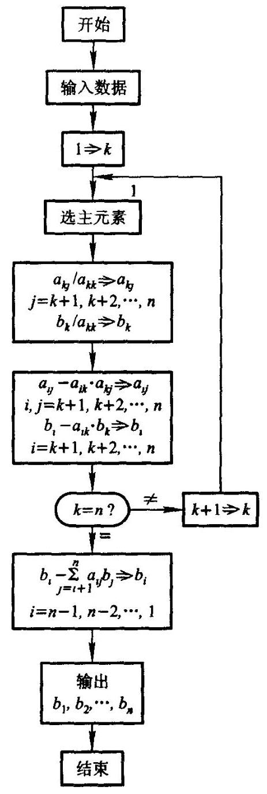

图 6-2

<!-- Media -->

上述消元手续做 $n$ 步以后,所给方程组 (4) 被加工成下列形式

$$
{x}_{i} + \mathop{\sum }\limits_{{j = i + 1}}^{n}{a}_{ij}^{\left( i\right) }{x}_{j} = {b}_{i}^{\left( i\right) },\;i = 1,2,\cdots ,n
$$

(19)

(2)回代过程

方程组(19)即

$$
\begin{cases} {x}_{1} + {a}_{12}^{\left( 1\right) }{x}_{2} + {a}_{13}^{\left( 1\right) }{x}_{3} + \cdots  + {a}_{1n}^{\left( 1\right) }{x}_{n} &  = {b}_{1}^{\left( 1\right) } \\  {x}_{2} + {a}_{23}^{\left( 2\right) }{x}_{3} + \cdots  + {a}_{2n}^{\left( 2\right) }{x}_{n} &  = {b}_{2}^{\left( 2\right) } \\   & \cdots \\  {x}_{n - 1} + {a}_{n - 1,n}^{\left( n - 1\right) }{x}_{n} &  = {b}_{n - 1}^{\left( n - 1\right) } \\  {x}_{n} &  = {b}_{n}^{\left( n\right) } \end{cases}
$$

的求解很方便, 自下而上逐步回代得

$$
{x}_{i} = {b}_{i}^{\left( i\right) } - \mathop{\sum }\limits_{{j = i + 1}}^{n}{a}_{ij}^{\left( i\right) }{x}_{j},\;i = n,n - 1,\cdots ,1
$$

(20)

综上所述, 高斯消去法的计算过程是, 先利用初值 (5) 按式 (17)、(18) 计算系数 ${a}_{y}^{\left( k\right) }$ , ${b}_{i}^{\left( k\right) }$ ,然后再按式 (20) 求得解 ${x}_{i}$ .

图 6-2 描述了高斯消去法. 其中的框 1 的含义后文将给出说明.

高斯消去法由于添加了回代过程, 算法结构较约当消去法稍复杂. 但算法的这种改进明显地减少了计算量. 当 $n$ 充分大时,高斯消去法的消元过程约需 $\frac{{n}^{3}}{3}$ 次乘除法,而回代过程的计算量可以忽略不计. 因此,它比约当消去法大约节省了 ${50}\%$ 的计算量.

## 3. 选主元素

再考察高斯消去法的消元过程,可以看到,其第 $k$ 步要用 ${a}_{kk}^{\left( k - 1\right) }$ 做除法, 这就要求保证它们全不为 0 .

定理 1 假设方程组 (4) 是对角占优的,则 ${a}_{kk}^{\left( k - 1\right) }\left( {k = 1,2,\cdots ,n}\right)$ 全不为 0 .

证 先考察消元过程的第 1 步, 因方程组 (4) 为对角占优, 有

$$
\left| {a}_{11}\right|  > \mathop{\sum }\limits_{{j = 2}}^{n}\left| {a}_{1j}\right|  \tag{21}
$$

故 ${a}_{11}^{\left( 0\right) } = {a}_{11} \neq  0$ . 又据式 (17)、(18)

$$
{a}_{ij}^{\left( 1\right) } = {a}_{ij} - \frac{{a}_{i1}{a}_{1j}}{{a}_{11}},\;i,j = 2,3,\cdots ,n \tag{22}
$$

于是

$$
\mathop{\sum }\limits_{\substack{{j = 2} \\  {j \neq  i} }}^{n}\left| {a}_{ij}^{\left( 1\right) }\right|  \leq  \mathop{\sum }\limits_{\substack{{j = 2} \\  {j \neq  i} }}^{n}\left| {a}_{ij}\right|  + \frac{\left| {a}_{i1}\right| }{\left| {a}_{11}\right| }\mathop{\sum }\limits_{\substack{{j = 2} \\  {j \neq  i} }}^{n}\left| {a}_{1j}\right|
$$

$$
= \mathop{\sum }\limits_{\substack{{j = 1} \\  {j \neq  1} }}^{n}\left| {a}_{ij}\right|  - \left| {a}_{i1}\right|  + \frac{\left| {a}_{i1}\right| }{\left| {a}_{11}\right| }\left( {\mathop{\sum }\limits_{{j = 2}}^{n}\left| {a}_{1j}\right|  - \left| {a}_{1i}\right| }\right)
$$

再利用所给方程组的对角占优性, 由上式可进一步得

$$
\mathop{\sum }\limits_{\substack{{j = 2} \\  {j \neq  1} }}^{n}\left| {a}_{ij}^{\left( 1\right) }\right|  < \left| {a}_{ii}\right|  - \left| {a}_{i1}\right|  + \frac{\left| {a}_{i1}\right| }{\left| {a}_{11}\right| }\left( {\left| {a}_{11}\right|  - \left| {a}_{1i}\right| }\right)  = \left| {a}_{ii}\right|  - \frac{\left| {a}_{i1}\right| \left| {a}_{1i}\right| }{\left| {a}_{11}\right| }
$$

又据式(22), 有

$$
\left| {a}_{\iota \iota }^{\left( 1\right) }\right|  = \left| {{a}_{\iota \iota } - \frac{{a}_{\iota 1}{a}_{1\iota }}{{a}_{11}}}\right|  \geq  \left| {a}_{\iota \iota }\right|  - \frac{\left| {a}_{\iota 1}\right| \left| {a}_{1\iota }\right| }{\left| {a}_{11}\right| }
$$

故有

$$
\mathop{\sum }\limits_{\substack{{j = 2} \\  {j \neq  i} }}^{n}\left| {a}_{ij}^{\left( 1\right) }\right|  < \left| {a}_{ii}^{\left( 1\right) }\right| ,\;i = 2,3,\cdots ,n
$$

这说明消元过程的第 1 步所归结出的方程组 (15) 也是对角占优的, 从而又有 ${a}_{22}^{\left( 1\right) } \neq  0$ . 依次类推即可断定一切 ${a}_{kk}^{\left( k - 1\right) }$ 全不为 0 . 定理 1 证毕.

一般线性方程组使用高斯消去法求解时,即使 ${a}_{kk}^{\left( k - 1\right) }$ 不为 0,但如果其绝对值很小, 舍入误差的影响也会严重地损失精度, 实际计算时必须避免这类情况发生.

例 2 考察方程组

$$
\left\{  \begin{array}{r} {10}^{-5}{x}_{1} + {x}_{2} = 1 \\  {x}_{1} + {x}_{2} = 2 \end{array}\right.  \tag{23}
$$

设用高斯消去法求解. 先用 ${10}^{-5}$ 除 ${\left( {23}\right) }_{1}$ ,然后从 ${\left( {23}\right) }_{2}$ 中消去 ${x}_{1}$ ,得

$$
\left\{  \begin{matrix} {x}_{1} + {10}^{5}{x}_{2} = {10}^{5} \\  \left( {1 - {10}^{5}}\right) {x}_{2} = 2 - {10}^{5} \end{matrix}\right.  \tag{24}
$$

设取四位浮点十进制进行计算, 则有

$$
1 - {10}^{5} \triangleq   - {10}^{5},\;2 - {10}^{5} \triangleq   - {10}^{5}
$$

这里 $\bigtriangleup$ 表示对阶舍入的计算过程,因而这时方程组 (24) 的实际形式是

$$
\begin{cases} {x}_{1} + {10}^{5}{x}_{2} &  = {10}^{5} \\  {x}_{2} &  = 1 \end{cases}
$$

由此回代解出 ${x}_{1} = 0,{x}_{2} = 1$ .

这个结果严重失真. 究其根源,是由于所用的除数太小,使得方程 ${\left( {24}\right) }_{1}$ 在消元过程中 “吃掉” 了方程 ${\left( {23}\right) }_{2}$ . 避免这类失误的一种有效方法是,在消元前先调整方程的次序. 设将方程组 (23) 改写为

$$
\left\{  \begin{array}{r} {x}_{1} + {x}_{2} = 2 \\  {10}^{-5}{x}_{1} + {x}_{2} = 1 \end{array}\right.
$$

再进行消元, 得

$$
\left\{  \begin{array}{r} {x}_{1} + {x}_{2} = 2 \\  \left( {1 - {10}^{-5}}\right) {x}_{2} = 1 \end{array}\right.
$$

这时 $1 - {10}^{-5} \bigtriangleup  1$ ,因而上述方程组的实际形式是

$$
\left\{  \begin{array}{r} {x}_{1} + {x}_{2} = 2 \\  {x}_{2} = 1 \end{array}\right.
$$

由此回代解出 ${x}_{1} = {x}_{2} = 1$ . 这个结果是正确的.

我们在高斯消去法的消元过程中运用上述技巧. 为此再考察第 $k$ 步所要加工的方程组 (16). 我们检查方程组 (16) 中变元 ${x}_{k}$ 的各个系数 ${a}_{kk}^{\left( k - 1\right) }$ , ${a}_{k + 1,k}^{\left( k - 1\right) },\cdots ,{a}_{nk}^{\left( k - 1\right) }$ ,从中挑选出最大者 (按绝对值),称之为第 $k$ 步的主元素 ${}^{\left( 1\right) }$ . 设主元素在第 $l\left( {k \leq  l \leq  n}\right)$ 个方程,即 $\left| {a}_{lk}^{\left( k - 1\right) }\right|  = \mathop{\max }\limits_{{k \leq  l \leq  n}}\left| {a}_{vk}^{\left( k - 1\right) }\right|$ ,若 $l \neq$ $k$ ,则我们先将第 $l$ 个方程与第 $k$ 个方程互易位置,使得新的 ${a}_{kk}^{\left( k - 1\right) }$ 成为主元素, 然后再着手消元, 这一手续称作选主元素.

图 6-3 描述了选主元素的处理过程, 它是图 6-2 中框 1 的具体化.

---

<!-- Footnote -->

① 这样得到的主元素通常称作列主元素. 在编制实用程序时,常在方程组 (16) 的系数 ${a}_{y}(i,j =$ $k,k + 1,\cdots ,n)$ 中选取一个绝对值最大者,作为第 $k$ 步的所谓全主元素.

<!-- Footnote -->

---

<!-- Media -->

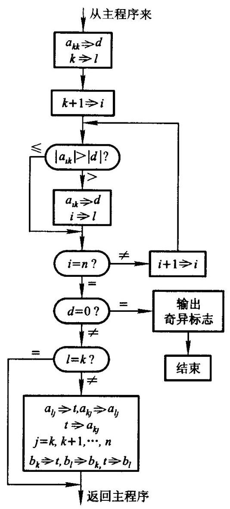

图 6-3

<!-- Media -->

值得指出的是,有些特殊类型的方程组,可以保证 $\left| {a}_{kk}^{\left( k - 1\right) }\right|$ 不会很小,从而不需要选主元素.

定理 2 设所给方程组 (4) 对称并且是对角占优的,则 ${a}_{kk}^{\left( k - 1\right) }(k = 1,2,\cdots$ , $n)$ 全是主元素.

证 因方程组 (4) 对称且对角占优, 据式 (21) 有

$$
\left| {a}_{11}\right|  > \mathop{\sum }\limits_{{i = 2}}^{n}\left| {a}_{i1}\right|  \geq  \mathop{\max }\limits_{{2 \leq  i \leq  n}}\left| {a}_{i1}\right|
$$

故 ${a}_{11}$ 是主元素. 再由式 (22) 有

$$
{a}_{ij}^{\left( 1\right) } = {a}_{ij} - \frac{{a}_{i1}{a}_{1j}}{{a}_{11}} = {a}_{ji} - \frac{{a}_{1i}{a}_{j1}}{{a}_{11}} = {a}_{ji}^{\left( 1\right) },\;i,j = 2,3,\cdots ,n
$$

因而所归结出的方程组 (15) 也是对称的, 又因它是对角占优的 (见定理 1 的证明),故 ${a}_{22}^{\left( 1\right) }$ 也是主元素. 依此类推,知一切 ${a}_{kk}^{\left( k - 1\right) }$ 全是主元素.

### 6.2 追 赶 法

## 1. 三对角方程组

在数值计算中, 譬如三次样条插值 (参看第一章 1.8 节), 或用差分方法解常微分方程边值问题 (见第三章 3.7 节), 我们曾碰到了下列形式的方程组

$$
\left\{  \begin{array}{l} {b}_{1}{x}_{1} + {c}_{1}{x}_{2} = {f}_{1} \\  {a}_{2}{x}_{1} + {b}_{2}{x}_{2} + {c}_{2}{x}_{3} = {f}_{2} \\  \cdots \cdots \cdots \cdots \\  {a}_{n - 1}{x}_{n - 2} + {b}_{n - 1}{x}_{n - 1} + {c}_{n - 1}{x}_{n} = {f}_{n - 1} \\  {a}_{n}{x}_{n - 1} + {b}_{n}{x}_{n} = {f}_{n} \end{array}\right.  \tag{25}
$$

用矩阵记号可将方程组 (25) 简记作 $\mathbf{{Ax}} = \mathbf{f}$ ,这里系数矩阵

$$
\mathbf{A} = \left\lbrack  \begin{matrix} {b}_{1} & {c}_{1} & & & \mathbf{0} \\  {a}_{2} & {b}_{2} & {c}_{2} & \mathbf{0} & \\   &  \ddots  &  \ddots  &  \ddots  & \\   & {a}_{n - 1} & {b}_{n - 1} & {c}_{n - 1} & \\  \mathbf{0} & & {a}_{n} & {b}_{n} &  \end{matrix}\right\rbrack   \tag{26}
$$

是所谓三对角阵. 这是一种特殊的稀疏矩阵, 其非零元素集中分布在主对角线及其相邻两条次对角线上.

定理 3 假设矩阵 (26) 为对角占优, 即成立

$$
\left\{  \begin{array}{l} \left| {b}_{1}\right|  > \left| {c}_{1}\right| \\  \left| {b}_{i}\right|  > \left| {a}_{i}\right|  + \left| {c}_{i}\right| ,\;i = 2,3,\cdots ,n - 1 \\  \left| {b}_{n}\right|  > \left| {a}_{n}\right|  \end{array}\right.  \tag{27}
$$

则它是非奇异的, 这时方程组 (25) 有唯一解.

证 当 $n = 2$ 时,由条件 (27) 立即得知

$$
\det \left( \mathbf{A}\right)  = \left| \begin{array}{ll} {b}_{1} & {c}_{1} \\  {a}_{2} & {b}_{2} \end{array}\right|  \neq  0
$$

进一步考察 $n &gt; 2$ 的情形. 将矩阵 $\mathbf{A}$ 的第 2 行减去第一行的 $\frac{{a}_{2}}{{b}_{1}}$ 倍,使之变成

$$
\left\lbrack  \begin{matrix} {b}_{1} & {c}_{1} & 0 & \cdots & 0 \\  0 & \vdots & & \cdots & \cdots \\  0 & \vdots & & {A}_{1} & \\  \vdots & & {A}_{1} & & \\  0 & \vdots & & &  \end{matrix}\right\rbrack
$$

其中

$$
{\mathbf{A}}_{1} = \left\lbrack  \begin{matrix} {b}_{2} - \frac{{c}_{1}}{{b}_{1}}{a}_{2} & {c}_{2} & & & \\  {a}_{3} & {b}_{3} & {c}_{3} & & \mathbf{0} \\   &  \ddots  &  \ddots  &  \ddots  & \\   & & {a}_{n - 1} & {b}_{n - 1} & {c}_{n - 1} \\  \mathbf{0} & & & {a}_{n} & {b}_{n} \end{matrix}\right\rbrack
$$

是 $n - 1$ 阶三对角阵,再利用条件 (27) 知

$$
\left| {{b}_{2} - \frac{{c}_{1}}{{b}_{1}}{a}_{2}}\right|  \geq  \left| {b}_{2}\right|  - \left| {a}_{2}\right|  > \left| {c}_{2}\right|
$$

可见矩阵 ${\mathbf{A}}_{1}$ 仍然是对角占优的. 由于 $\det \left( \mathbf{A}\right)  = {b}_{1}\det \left( {\mathbf{A}}_{1}\right)$ ,而 ${b}_{1} \neq  0$ ,由归纳法原理知所述命题成立. 定理 3 证毕.

据定理 3 , 对角占优的三对角方程组 (25) 有唯一解.

下面针对这种特殊形式的方程组提供一种行之有效的解法一一追赶法。

## 2. 追赶法的计算公式

现在用高斯消去法求解方程组 (25).

## (1)消元过程

我们先从方程 ${\left( {25}\right) }_{2}$ 中消去 ${x}_{1}$ ,然后再从方程 ${\left( {25}\right) }_{3}$ 中消去 ${x}_{2}$ ,这样顺序做下去, 可将所给方程组 (25) 加工成下列形式

$$
\left\{  \begin{array}{l} {x}_{1} + {u}_{1}{x}_{2} = {y}_{1} \\  {x}_{2} + {u}_{2}{x}_{3} = {y}_{2} \\  \cdots \cdots \cdots \cdots \\  {x}_{n - 1} + {u}_{n - 1}{x}_{n} = {y}_{n - 1} \\  {x}_{n} = {y}_{n} \end{array}\right.  \tag{28}
$$

其中系数

$$
{u}_{1} = {c}_{1}/{b}_{1},\;{y}_{1} = {f}_{1}/{b}_{1}
$$

$$
{u}_{1} = {c}_{1}/\left( {{b}_{1} - {u}_{1 - 1}{a}_{1}}\right) ,\;i = 2,3,\cdots ,n - 1 \tag{29}
$$

$$
{y}_{t} = \left( {{f}_{t} - {y}_{t - 1}{a}_{t}}\right) /\left( {{b}_{t} - {u}_{t - 1}{a}_{t}}\right) ,\;i = 2,3,\cdots ,n
$$

(2)回代过程

这样归结得出的方程组 (28) 实际上是一组递推关系式, 它的求解公式特别简单:

$$
{x}_{n} = {y}_{n} \tag{30}
$$

$$
{x}_{1} = {y}_{1} - {u}_{1}{x}_{1 + 1},\;i = n - 1,n - 2,\cdots ,1
$$

综上所述, 解方程组 (25) 的追赶法分 “追” 和 “赶” 两个环节:

(1) 追的过程(消元过程). 按式(29)顺序计算系数 ${u}_{1} \rightarrow  {u}_{2} \rightarrow  \cdots  \rightarrow  {u}_{n - 1}$ 和${y}_{1} \rightarrow  {y}_{2} \rightarrow  \cdots  \rightarrow  {y}_{n}$

(2) 赶的过程(回代过程). 按式(30)逆序求出解 ${x}_{n} \rightarrow  {x}_{n - 1} \rightarrow  \cdots  \rightarrow  {x}_{1}$ .

可以看到, 虽然追赶法的原理与高斯消去法相同, 但由于它考虑到方程组 (25) 的具体特点, 计算时将系数中的大量零元素撇开, 从而大大地节省了计算量. 易知上述追赶法的计算量仅为 ${5n}$ 次乘除法.

<!-- Media -->

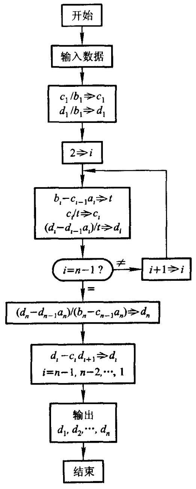

图 6-4

<!-- Media -->

需要补充说明的是, 为使追赶法的计算过程不致中断, 必须保证式 (29) 的分母全不为 0 . 据定理 1 知:

定理 4 设矩阵 (26) 为对角占优, 则式 (29) 的分母 ${d}_{1} = {b}_{1},{d}_{i} = {b}_{i} - {u}_{i - 1}{a}_{i},i = 2$ , $3,\cdots ,n$ 全不为 0 .

在实际编制程序时,可用数据单元 ${c}_{\imath }$ 和 ${d}_{\iota }$ 分别存放中间结果 ${u}_{\iota }$ 和 ${y}_{\iota }$ ,在回代过程中又可将求得的解 ${x}_{l}$ 再存进单元 ${d}_{l}$ 而摈弃其中的老值 ${y}_{l}$ . 图 6-4 采用了这种压缩存储方法.

## 3. 追赶法的代数基础

可以看到, 追赶法的关键在于, 将所给方程组 (25) 加工成方程组 (28). 我们现在运用矩阵分解技术直接从 (25) 的系数矩阵 $\mathbf{A}$ 得出 (28) 的系数矩阵

$$
U = \left\lbrack  \begin{matrix} 1 & {u}_{1} & & \\   & 1 & {u}_{2} & \\   & &  \ddots  &  \ddots  \\   & & 1 & {u}_{n - 1} \\   & & & 0 \end{matrix}\right\rbrack   \tag{31}
$$

矩阵 $\mathbf{U}$ 是比 $\mathbf{A}$ 更为简单的稀疏矩阵,其非零元素集中分布在主对角线及它上面的一条次对角线上, 且主对角线上元素全为 1 . 这种矩阵称为单位上二对角阵.

定理 5 设矩阵 (26) 为对角占优,则它可唯一地分解成矩阵 $\mathbf{L}$ 和 $\mathbf{U}$ 的乘积

$$
\mathbf{A} = \mathbf{L}\mathbf{U}
$$

其中 $\mathbf{U}$ 为形如 (31) 的单位上二对角阵,而 $\mathbf{L}$ 则为下二对角阵

$$
L = \left\lbrack  \begin{matrix} {d}_{1} & & & & \\  {a}_{2} & {d}_{2} & & \mathbf{0} & \\   &  \ddots  &  \ddots  & & \\   & & {a}_{n - 1} & {d}_{n - 1} & \\   & \mathbf{0} & & {a}_{n} & {d}_{n} \end{matrix}\right\rbrack
$$

矩阵 $\mathbf{L}$ 的非零元素集中分布在主对角线及它下面的一条次对角线上,且次对角线的元素与所给矩阵 (26) 相同.

证 将矩阵关系式 $\mathbf{A} = \mathbf{L}\mathbf{U}$ 按矩阵乘法规则展开,有

$$
{b}_{1} = {d}_{1}
$$

$$
{c}_{\imath } = {d}_{i}{u}_{i},\;i = 1,2,\cdots ,n - 1
$$

$$
{b}_{i + 1} = {a}_{i + 1}{u}_{i} + {d}_{i + 1},
$$

由定理 4 知 ${d}_{t} \neq  0$ ,因此由上式可唯一地确定矩阵 $\mathbf{L}$ 和 $\mathbf{U}$ :

$$
{d}_{1} = {b}_{1},
$$

$$
{u}_{i} = {c}_{\imath }/{d}_{\imath },\;i = 1,2,\cdots ,n - 1 \tag{32}
$$

$$
{d}_{i + 1} = {b}_{i + 1} - {u}_{i}{a}_{i + 1},
$$

定理得证.

对应于矩阵分解 $\mathbf{A} = \mathbf{L}\mathbf{U}$ ,方程组 (25) 即 $\mathbf{A}\mathbf{x} = \mathbf{f}$ 亦即 $\mathbf{L}\left( {\mathbf{U}\mathbf{x}}\right)  = \mathbf{f}$ 可分解成 ${Ly} = f$ 和 ${Ux} = y$ 两个方程组来求解. 先解 ${Ly} = f$ 即

$$
\left\{  \begin{array}{l} {d}_{1}{y}_{1} = {f}_{1} \\  {a}_{1}{y}_{1 - 1} + {d}_{1}{y}_{1} = {f}_{1},\;i = 2,3,\cdots ,n \end{array}\right.
$$

得

$$
{y}_{1} = {f}_{1}/{d}_{1} \tag{33}
$$

$$
{y}_{i} = \left( {{f}_{i} - {a}_{i}{y}_{i - 1}}\right) /{d}_{i},\;i = 2,3,\cdots ,n
$$

而 ${Ux} = y$ 即方程组 (28) 的求解公式已由式 (30) 给出.

这样, 方程组 (25) 的求解可归纳为如下三步:

步 1 按式(32)计算 ${d}_{1} \rightarrow  {u}_{1} \rightarrow  {d}_{2} \rightarrow  \cdots  \rightarrow  {u}_{n - 1} \rightarrow  {d}_{n}$ ;

步 2 按式 (33) 顺序求 ${y}_{1} \rightarrow  {y}_{2} \rightarrow  \cdots  \rightarrow  {y}_{n}$ ;

步 3 按式 (30) 逆序求 ${x}_{n} \rightarrow  {x}_{n - 1} \rightarrow  \cdots  \rightarrow  {x}_{1}$ .

容易看出, 上述算法与前述追赶法是等价的.

### 6.3 平方根法

我们知道,线性方程组 $\mathbf{{Ax}} = \mathbf{b}$ 求解的难易程度取决于系数矩阵 $\mathbf{A}$ 的特征,而当 $\mathbf{A}$ 是三角阵时,方程组 (即三角方程组) 的求解特别方便.

科学与工程的实际计算中常遇到系数矩阵 $\mathbf{A}$ 为对称正定矩阵的情形,这类方程组通过某种矩阵分解方法, 容易归结为三角方程组来求解. 1. 平方根法

首先考察正定对称阵与三角阵的联系.

定理 6 设

$$
\mathbf{A} = \left\lbrack  \begin{matrix} {a}_{11} & & & \\  {a}_{21} & {a}_{22} & & \text{ 对称 } \\  {a}_{31} & {a}_{32} & {a}_{33} & \\  \vdots & \vdots &  \ddots  & \\  {a}_{n1} & {a}_{n2} & \cdots & {a}_{nn} \end{matrix}\right\rbrack
$$

为正定阵, 则有如下三角阵

$$
\mathbf{L} = \left\lbrack  \begin{matrix} {l}_{11} & & & & \\  {l}_{21} & {l}_{22} & \mathbf{0} & & \\  {l}_{31} & {l}_{32} & {l}_{33} & & \\  \vdots & \vdots & \vdots &  \ddots  & \\  {l}_{n1} & {l}_{n2} & {l}_{n3} & \cdots & {l}_{nn} \end{matrix}\right\rbrack
$$

使成立

$$
\mathbf{A} = \mathbf{L} \cdot  {\mathbf{L}}^{\mathrm{T}} \tag{34}
$$

若限定 $\mathbf{L}$ 的主对角线元素取正值,则这种分解是唯一的.

证 将矩阵关系式 $\mathbf{A} = \mathbf{L}{\mathbf{L}}^{\mathrm{T}}$ 直接展开,有

$$
{a}_{11} = {l}_{11}^{2}
$$

$$
{a}_{21} = {l}_{21}{l}_{11},\;{a}_{22} = {l}_{21}^{2} + {l}_{22}^{2}
$$

$$
{a}_{31} = {l}_{31}{l}_{11},\;{a}_{32} = {l}_{31}{l}_{21} + {l}_{32}{l}_{22},\;{a}_{33} = {l}_{31}^{2} + {l}_{32}^{2} + {l}_{33}^{2}
$$

...

据此可逐行求出分解矩阵 $L$ 的元素 ${l}_{11} \rightarrow  {l}_{21} \rightarrow  {l}_{22} \rightarrow  {l}_{31} \rightarrow  {l}_{32} \rightarrow  \cdots$ ,计算公式为

$$
\left\{  \begin{array}{ll} {l}_{ij} = \left( {{a}_{ij} - \mathop{\sum }\limits_{{k = 1}}^{{j - 1}}{l}_{ik}{l}_{jk}}\right) /{l}_{ij}, & j = 1,2,\cdots ,i - 1 \\  {l}_{ii} = {\left( {a}_{ii} - \mathop{\sum }\limits_{{k = 1}}^{{i - 1}}{l}_{ik}^{2}\right) }^{\frac{1}{2}}, & i = 1,2,\cdots ,n \end{array}\right.  \tag{35}
$$

剩下的问题是需要进一步说明计算过程不会中断,由于 $\mathbf{A}$ 的 $k$ 阶主子矩阵 ${\mathbf{A}}_{k}$ 可相应地分解成 ${\mathbf{A}}_{k} = {\mathbf{L}}_{k}{\mathbf{L}}_{k}^{\mathrm{T}}$ ,这里 ${\mathbf{L}}_{k}$ 是 $\mathbf{L}$ 的 $k$ 阶主子矩阵,因此

$$
\det \left( {\mathbf{A}}_{k}\right)  = {\left( \det \left( {\mathbf{L}}_{k}\right) \right) }^{2} = \mathop{\prod }\limits_{{i = 1}}^{k}{l}_{u}^{2}
$$

我们知道,对于对称正定阵 $\mathbf{A},\det \left( {\mathbf{A}}_{k}\right)  &gt; 0$ ,故有

$$
{l}_{kk}^{2} = \frac{\det \left( {\mathbf{A}}_{k}\right) }{\det \left( {\mathbf{A}}_{k - 1}\right) } > 0,\;k = 2,3,\cdots ,n
$$

又 ${l}_{11}^{2} = {a}_{11} = \det \left( {\mathbf{A}}_{1}\right)  &gt; 0$ ,所以 ${l}_{kk}\left( {k = 1,2,\cdots ,n}\right)$ 全是非零实数,如果限定它们取正值,则按计算公式 (35) 可唯一地确定矩阵 $\mathbf{L}$ . 证毕.

基于矩阵分解式 (34),对称正定方程组 $\mathbf{{Ax}} = \mathbf{b}$ 可归结为两个三角方程组 $\mathbf{L}\mathbf{y} = \mathbf{b}$ 和 ${\mathbf{L}}^{\mathrm{T}}\mathbf{x} = \mathbf{y}$ 来求解. 由 $\mathbf{L}\mathbf{y} = \mathbf{b}$ 即

$$
\left\{  \begin{array}{ll} {l}_{11}{y}_{1} &  = {b}_{1} \\  {l}_{21}{y}_{1} + {l}_{22}{y}_{2} &  = {b}_{2} \\  \cdots \cdots \cdots \cdots & \\  {l}_{n1}{y}_{1} + {l}_{n2}{y}_{2} + \cdots  + {l}_{nn}{y}_{n} &  = {b}_{n} \end{array}\right.
$$

可顺序计算 ${y}_{1} \rightarrow  {y}_{2} \rightarrow  \cdots  \rightarrow  {y}_{n}$ :

$$
{y}_{i} = \left( {{b}_{i} - \mathop{\sum }\limits_{{k = 1}}^{{i - 1}}{l}_{ik}{y}_{k}}\right) /{l}_{ii},\;i = 1,2,\cdots ,n
$$

而由 ${L}^{\mathrm{T}}x = y$ 即

$$
\begin{cases} {l}_{11}{x}_{1} + {l}_{21}{x}_{2} + \cdots  + {l}_{n1}{x}_{n} &  = {y}_{1} \\  {l}_{22}{x}_{2} + \cdots  + {l}_{n2}{x}_{n} &  = {y}_{2} \\  \cdots \cdots \cdots \cdots & \\  {l}_{n2}{x}_{n} &  = {y}_{n} \end{cases}
$$

可逆序求得 ${x}_{n} \rightarrow  {x}_{n - 1} \rightarrow  \cdots  \rightarrow  {x}_{1}$ :

$$
{x}_{l} = \left( {{y}_{l} - \mathop{\sum }\limits_{{k = l + 1}}^{n}{l}_{kl}{x}_{k}}\right) /{l}_{u},\;i = n,n - 1,\cdots ,1
$$

求解方程组的上述算法, 由于矩阵分解公式 (35) 中含有开方运算而称作平方根法.

## 2. 改进的平方根法

上述平方根法由于含有开方运算, 因而计算量比较大. 为避免开方运算, 我们改用单位三角阵作为分解阵. 类似定理 6 不难证明:

定理 7 对称正定阵 $\mathbf{A}$ 可分解成

$$
\mathbf{A} = \mathbf{L}\mathbf{D}{\mathbf{L}}^{\mathrm{T}}
$$

的形式, 其中

$$
\mathbf{D} = \left\lbrack  \begin{matrix} {d}_{1} & & & \\   & {d}_{2} & \mathbf{0} & \\   & &  \ddots  & \\  \mathbf{0} & & & {d}_{n} \end{matrix}\right\rbrack
$$

为对角阵, 而

$$
\mathbf{L} = \left\lbrack  \begin{matrix} 1 & & & & \\  {l}_{21} & 1 & & \mathbf{0} & \\  {l}_{31} & {1}_{32} & 1 & & \\  \vdots & \vdots &  \ddots  &  \ddots  & \\  {l}_{n1} & {l}_{n2} & \cdots & {l}_{n,n - 1} & 1 \end{matrix}\right\rbrack
$$

是单位下三角阵, 这里分解公式为

$$
\left\{  \begin{array}{ll} {l}_{y} = \left( {{a}_{y} - \mathop{\sum }\limits_{{k = 1}}^{{j - 1}}{d}_{k}{l}_{ik}{l}_{jk}}\right) /{d}_{j}, & j = 1,2,\cdots ,i - 1 \\  {d}_{i} = {a}_{n} - \mathop{\sum }\limits_{{k = 1}}^{{i - 1}}{d}_{k}{l}_{ik}^{2}, & i = 1,2,\cdots ,n \end{array}\right.
$$

据此可逐行计算 ${d}_{1} \rightarrow  {l}_{21} \rightarrow  {d}_{2} \rightarrow  {l}_{31} \rightarrow  {l}_{32} \rightarrow  {d}_{3} \rightarrow  \cdots$ .

运用这种矩阵分解方法,方程组 $\mathbf{{Ax}} = \mathbf{b}$ 即

$$
L\left( {D{L}^{\mathrm{T}}x}\right)  = b
$$

可归结为求解两个上三角方程组

$$
{Ly} = b
$$

$$
{L}^{T}x = {D}^{-1}y
$$

其计算公式分别为

$$
{y}_{l} = {b}_{l} - \mathop{\sum }\limits_{{k = 1}}^{{l - 1}}{l}_{lk}{y}_{k},\;i = 1,2,\cdots ,n
$$

和

$$
{x}_{1} = {y}_{1}/{d}_{1} - \mathop{\sum }\limits_{{k = 1 + 1}}^{n}{l}_{k1}{x}_{k},\;i = n,n - 1,\cdots ,1
$$

求解方程组的上述算法称作改进的平方根法, 亦称乔累斯基 (Cholesky) 方法. 这种方法总的计算量约为 ${n}^{3}/6$ 次乘除法,即仅为高斯消去法计算量的一半.

作为练习, 请读者自行编制乔累斯基方法的算法框图.

## 3. 一维压缩存储

实际计算中常需要求解大型方程组. 对大型方程组需要考虑存储单元的节省.

在编写乔累斯基程序时,考虑到系数矩阵 $\mathbf{A}$ 的对称性,只要将其下三角部分

<!-- Media -->

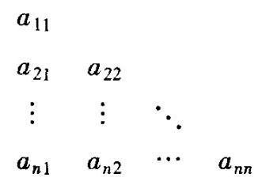

<!-- Media -->

逐行存放于一维数组 $\widehat{A}\left\lbrack  {1 : m}\right\rbrack$ 中.

现在确定数组 $\widehat{A}$ 与矩阵 $\mathbf{A}$ 两者元素的对应关系. 首先注意一个明显的事实: 数组 $\widehat{A}$ 中元素的个数为

$$
m = 1 + 2 + \cdots  + n = \frac{n\left( {n + 1}\right) }{2}
$$

设用 ${ii}$ 表示 $\mathbf{A}$ 的下三角部分前 $i - 1$ 行元素的总数,则

$$
{ii} = \frac{i\left( {i - 1}\right) }{2}
$$

于是,矩阵元素 ${a}_{ij}$ 是数组 $\widehat{A}$ 中第 ${ii} + j$ 个元素,即 ${a}_{ij}\left( {i \geq  j}\right)$ 存放于 $\widehat{A}\left\lbrack  {{ii} + j}\right\rbrack$ 中. 考虑到这一事实, 不难写出压缩存储的乔累斯基方法的计算程序.

### 6.4 误 差 分 析

## 1. 方程组的病态

在建立方程组时, 其系数往往含有误差 (如观测误差或计算误差), 就是说, 所要求解的通常是有扰动的方程组, 因此必须研究扰动对解的影响.

例 3 考察方程组

$$
\left\{  \begin{array}{l} {x}_{1} + {x}_{2} = 2 \\  {x}_{1} + {1.0001}{x}_{2} = {2.0001} \end{array}\right.  \tag{36}
$$

和

$$
\left\{  \begin{array}{l} {x}_{1} + {x}_{2} = 2 \\  {x}_{1} + {1.0001}{x}_{2} = 2 \end{array}\right.  \tag{37}
$$

上述两个方程组尽管只是右端项有微小的差别, 但两者的解却大不相同: 方程组 (36) 的解是 ${x}_{1} = {x}_{2} = 1$ ,而方程组 (37) 的解则为 ${x}_{1} = 2,{x}_{2} = 0$ . 这类方程组称作是病态的.

为了定量地刻画方程组 “病态” 的程度,现就一般方程 $\mathbf{{Ax}} = \mathbf{b}$ 进行讨论. 首先考察右端项 $\mathbf{b}$ 的扰动对解的影响.

令 $\delta \mathbf{b}$ 表示右端项 $\mathbf{b}$ 的扰动,相应的解 $\mathbf{x}$ 的扰动记为 $\delta \mathbf{x}$ ,即

$$
\mathbf{A}\left( {\mathbf{x} + \delta \mathbf{x}}\right)  = \mathbf{b} + \delta \mathbf{b}
$$

从中消去 $\mathbf{{Ax}} = \mathbf{b}$ 得

$$
\mathbf{A}\delta \mathbf{x} = \delta \mathbf{b}
$$

故有

$$
\parallel \delta \mathbf{x}\parallel  = \begin{Vmatrix}{{\mathbf{A}}^{-1}\delta \mathbf{b}}\end{Vmatrix} \leq  \begin{Vmatrix}{\mathbf{A}}^{-1}\end{Vmatrix}\parallel \delta \mathbf{b}
$$

另一方面

$$
\parallel x\parallel  \geq  \frac{\parallel {Ax}\parallel }{\parallel A\parallel } = \frac{\parallel b\parallel }{\parallel A\parallel }
$$

因此有

$$
\frac{\parallel {\delta x}\parallel }{\parallel x\parallel } \leq  \parallel A\parallel \begin{Vmatrix}{A}^{-1}\end{Vmatrix}\frac{\parallel {\delta b}\parallel }{\parallel b\parallel } \tag{38}
$$

再考察系数矩阵 $\mathbf{A}$ 的扰动对解的影响. 令 $\delta \mathbf{A}$ 表示 $\mathbf{A}$ 的扰动,相应的解 $\mathbf{x}$ 的扰动仍记为 ${\delta x}$ ,即

$$
\left( {\mathbf{A} + \delta \mathbf{A}}\right) \left( {\mathbf{x} + \delta \mathbf{x}}\right)  = \mathbf{b}
$$

再从中消去 $\mathbf{{Ax}} = \mathbf{b}$ 得

$$
\mathbf{A}\delta \mathbf{x} + \delta \mathbf{A}\left( {\mathbf{x} + \delta \mathbf{x}}\right)  = 0
$$

故有

$$
\parallel {\delta x}\parallel  = \begin{Vmatrix}{{A}^{-1}{\delta A}\left( {x + {\delta x}}\right) }\end{Vmatrix}
$$

$$
\leq  \begin{Vmatrix}{\mathbf{A}}^{-1}\end{Vmatrix}\parallel \delta \mathbf{A}\parallel \left( {\parallel \mathbf{x}\parallel  + \parallel \delta \mathbf{x}\parallel }\right)
$$

假设 $\delta \mathbf{A}$ 足够小,使成立

$$
\begin{Vmatrix}{\mathbf{A}}^{-1}\end{Vmatrix}\parallel \delta \mathbf{A}\parallel  < 1
$$

则由上式得

$$
\frac{\parallel \delta \mathbf{x}\parallel }{\parallel \mathbf{x}\parallel } \leq  \frac{\begin{Vmatrix}{\mathbf{A}}^{-1}\end{Vmatrix}\parallel \delta \mathbf{A}\parallel }{1 - \begin{Vmatrix}{\mathbf{A}}^{-1}\end{Vmatrix}\parallel \delta \mathbf{A}\parallel } \tag{39}
$$

我们记

$$
\operatorname{cond}\left( \mathbf{A}\right)  \equiv  \begin{Vmatrix}{\mathbf{A}}^{-1}\end{Vmatrix}\parallel \mathbf{A}
$$

并称作矩阵 $\mathbf{A}$ 的条件数,则误差估计式 (38) 和 (39) 可分别表为

$$
\frac{\parallel {\delta x}\parallel }{\parallel x\parallel } \leq  \operatorname{cond}\left( A\right) \frac{\parallel {\delta b}\parallel }{\parallel b\parallel }
$$

与

$$
\frac{\parallel {\delta x}\parallel }{\parallel x\parallel } \leq  \frac{\operatorname{cond}\left( A\right) \frac{\parallel {\delta A}\parallel }{\parallel A\parallel }}{1 - \operatorname{cond}\left( A\right) \frac{\parallel {\delta A}\parallel }{\parallel A\parallel }}
$$

这两个式子表明,右端项 $\mathbf{b}$ 和系数矩阵 $\mathbf{A}$ 的扰动对解的影响与条件数 $\operatorname{cond}\left( \mathbf{A}\right)$ 的大小有关, $\operatorname{cond}\left( \mathbf{A}\right)$ 愈大,扰动对解的影响愈大,因而条件数 $\operatorname{cond}\left( \mathbf{A}\right)$ 的值刻画了方程组 “病态” 的程度. 当然,方程组病态的程度是相对的. 矩阵的条件数与所用的范数有关, 为了强调这一事实, 有时记

$$
{\operatorname{cond}}_{p}\left( \mathbf{A}\right)  = {\begin{Vmatrix}{\mathbf{A}}^{-1}\end{Vmatrix}}_{p}\parallel \mathbf{A}{\parallel }_{p}
$$

再考察例 3 , 方程组 (36) 的系数矩阵

$$
\mathbf{A} = \left\lbrack  \begin{matrix} 1 & 1 \\  1 & 1 + {10}^{-4} \end{matrix}\right\rbrack  ,{\mathbf{A}}^{-1} = \left\lbrack  \begin{matrix} 1 + {10}^{4} &  - {10}^{4} \\   - {10}^{4} & {10}^{4} \end{matrix}\right\rbrack
$$

这时条件数

$$
{\operatorname{cond}}_{\infty }\left( \mathbf{A}\right)  = \parallel \mathbf{A}{\parallel }_{\infty }{\begin{Vmatrix}{\mathbf{A}}^{-1}\end{Vmatrix}}_{\infty } \approx  4 \times  {10}^{4}
$$

的值很大, 因而它是病态的.

最后需要指出的是,不能用行列式值 $\det \left( \mathbf{A}\right)$ 是否很小来衡量方程组 $\mathbf{A}\mathbf{x} = \mathbf{b}$ 的病态程度. 譬如,设 $\mathbf{A}$ 为主对角线元素全为 $\varepsilon \left( {\varepsilon \text{很小}}\right)$ 的 $n$ 阶对角阵,则当 $n$ 很大时 $\det \left( \mathbf{A}\right)  = {\varepsilon }^{n}$ 的值很小,但其条件数 $\operatorname{cond}\left( \mathbf{A}\right)  = 1$ . 实际上, 这时方程组 $\mathbf{{Ax}} = \mathbf{b}$ 的性态良好,易知其解 $\mathbf{x} = \frac{1}{\varepsilon }\mathbf{b}$ .

## 2. 精度分析

求得方程组 $\mathbf{{Ax}} = \mathbf{b}$ 的一个近似解 $\widetilde{\mathbf{x}}$ 以后,自然希望判断其精度. 检验精度的一个简单办法是,将近似解 $\widetilde{\mathbf{x}}$ 再回代到原方程组去求出余量 $\mathbf{r}$ :

$$
r = b - A\widetilde{x}
$$

如果 $\mathbf{r}$ 很小,就认为解 $\widetilde{\mathbf{x}}$ 是相当准确的.

定理 8 设 $\widetilde{x}$ 是方程组 $\mathbf{A}x = \mathbf{b}$ 的一个近似解,其精确解记为 ${x}^{ * },\mathbf{r}$ 为 $\widetilde{x}$ 的余量, 则有

$$
\frac{\begin{Vmatrix}{x}^{ * } - \widetilde{x}\end{Vmatrix}}{\begin{Vmatrix}{x}^{ * }\end{Vmatrix}} \leq  \operatorname{cond}\left( A\right) \frac{\parallel r\parallel }{\parallel b\parallel } \tag{40}
$$

证 由于 $\mathbf{A}{\mathbf{x}}^{ * } = \mathbf{b},\mathbf{A}\left( {{\mathbf{x}}^{ * } - \widetilde{\mathbf{x}}}\right)  = \mathbf{r}$ ,故有

$$
\parallel \mathbf{b}\parallel  = \begin{Vmatrix}{\mathbf{A}{\mathbf{x}}^{ * }}\end{Vmatrix} \leq  \parallel \mathbf{A}\parallel \begin{Vmatrix}{\mathbf{x}}^{ * }\end{Vmatrix}
$$

$$
\begin{Vmatrix}{{\mathbf{x}}^{ * } - \widetilde{\mathbf{x}}}\end{Vmatrix} = \begin{Vmatrix}{{\mathbf{A}}^{-1}\mathbf{r}}\end{Vmatrix} \leq  \begin{Vmatrix}{\mathbf{A}}^{-1}\end{Vmatrix}\parallel \mathbf{r}\parallel
$$

由此易得式 (40). 证毕.

估计式 (40) 表明, 用余量大小来检验近似解精度的方法对于病态方程组是不可靠的. 事实上,由例 3 看到,如果将方程组 (37) 的解 ${x}_{1} = 2,{x}_{2} = 0$ 作为 (36) 的一个近似解,则所得的余量 ${r}_{1} = 0,{r}_{2} = {0.0001}$ 相当小,然而这个近似解却与精确解 ${x}_{1} = {x}_{2} = 1$ 差别很大.

## 例题选讲 6.1 追赶法的变形与推广

本讲将研究求解三对角方程组 $\mathbf{{Ax}} = \mathbf{b}$ 的下述 “赶追法”: 如果将三对角阵 $\mathbf{A}$ 分解为 $\mathbf{A} = \mathbf{U}\mathbf{L}$ 的形式,其中 $\mathbf{U},\mathbf{L}$ 分别为上二对角阵与单位下二对角阵, 则所给方程组 $\mathbf{U}\left( {\mathbf{L}\mathbf{x}}\right)  = \mathbf{b}$ 化归为求解两个二对角方程组 $\mathbf{U}\mathbf{y} = \mathbf{b},\mathbf{L}\mathbf{x} = \mathbf{y}$ .

首先考察这种方法的消元手续.

题 1 将三对角方程组

$$
\left\{  \begin{array}{l} {b}_{1}{x}_{1} + {c}_{1}{x}_{2} = {f}_{1} \\  {a}_{2}{x}_{1} + {b}_{2}{x}_{2} + {c}_{2}{x}_{3} = {f}_{2} \\  {a}_{3}{x}_{2} + {b}_{3}{x}_{3} + {c}_{3}{x}_{4} = {f}_{3} \\  {a}_{4}{x}_{3} + {b}_{4}{x}_{4} = {f}_{4} \end{array}\right.
$$

通过消元手续加工成如下形式的单位二对角方程组

$$
\left\{  \begin{array}{l} {x}_{1} = {y}_{1} \\  {l}_{2}{x}_{1} + {x}_{2} = {y}_{2} \\  {l}_{3}{x}_{2} + {x}_{3} = {y}_{3} \\  {l}_{4}{x}_{3} + {x}_{4} = {y}_{4} \end{array}\right.
$$

并针对一般形式的 $n$ 阶三对角方程组 (25) 列出计算公式.

解 这里消元手续与追赶法恰好顺序相反, 它不是自顶向下而是自底向上逐步进行加工.

一般地, 三对角方程组 (25) 通过消元手续可加工成单位下二对角方程组

$$
\left\{  \begin{array}{l} {x}_{1} = {y}_{1} \\  {l}_{t}{x}_{t - 1} + {x}_{t} = {y}_{t},\;i = 2,3,\cdots ,n \end{array}\right.
$$

其加工公式为

$$
{l}_{n} = {a}_{n}/{b}_{n},\;{y}_{n} = {f}_{n}/{b}_{n}
$$

$$
\begin{array}{ll} {l}_{i} = {a}_{i}/\left( {{b}_{i} - {c}_{i}{l}_{i + 1}}\right) , & i = n - 1,n - 2,\cdots ,1 \\  {y}_{i} = \left( {{f}_{i} - {c}_{i}{y}_{i + 1}}\right) /\left( {{b}_{i} - {c}_{i}{l}_{i + 1}}\right) , &  \end{array}
$$

从而有求解公式

$$
{x}_{1} = {y}_{1}
$$

$$
{x}_{i} = {y}_{i} - {l}_{i}{x}_{i - 1},\;i = 2,3,\cdots ,n
$$

题 2 将题 1 的三对角阵 $\mathbf{A}$ 分解为 $\mathbf{A} = \mathbf{U}\mathbf{L}$ 的形式,其中 $\mathbf{U}$ 为上二对角阵, 而 $\mathbf{L}$ 则为单位下二对角阵.

解 仍然先考察 $n = 4$ 的具体情形:

$$
\left\lbrack  \begin{matrix} {b}_{1} & {c}_{1} & & \\  {a}_{2} & {b}_{2} & {c}_{2} & \\   & {a}_{3} & {b}_{3} & {c}_{3} \\   & & {a}_{4} & {b}_{4} \end{matrix}\right\rbrack   = \left\lbrack  \begin{matrix} {d}_{1} & {u}_{1} & & \mathbf{0} \\   & {d}_{2} & {u}_{2} & \\   & & {d}_{3} & {u}_{3} \\  \mathbf{0} & & & {d}_{4} \end{matrix}\right\rbrack  \left\lbrack  \begin{matrix} 1 & & \mathbf{0} & \\  {l}_{2} & 1 & & \\   & {l}_{3} & 1 & \\  \mathbf{0} & & {l}_{4} & 1 \end{matrix}\right\rbrack
$$

按矩阵乘法规则展开,易知 ${u}_{2} = {c}_{2},i = 1,2,3$ 且有

$$
{d}_{4} = {b}_{4},\;{l}_{4} = {a}_{4}/{d}_{4}
$$

$$
{d}_{3} = {b}_{3} - {c}_{3}{l}_{4},\;{l}_{3} = {a}_{3}/{d}_{3}
$$

$$
{d}_{2} = {b}_{2} - {c}_{2}{l}_{3},\;{l}_{2} = {a}_{2}/{d}_{2}
$$

$$
{d}_{1} = {b}_{1} - {c}_{1}{l}_{2}
$$

一般地, 三对角阵可分解为上二对角阵与单位下二对角阵的乘积

$$
\left\lbrack  \begin{matrix} {b}_{1} & {c}_{1} & & & \\  {a}_{2} & {b}_{2} & {c}_{2} & & \mathbf{0} \\   &  \ddots  &  \ddots  &  \ddots  & \\   & & {a}_{n - 1} & {b}_{n - 1} & {c}_{n - 1} \\  \mathbf{0} & & & {a}_{n} & {b}_{n} \end{matrix}\right\rbrack   = \left\lbrack  \begin{matrix} {d}_{1} & {c}_{1} & & & \mathbf{0} \\   & {d}_{2} & {c}_{2} & & \mathbf{0} \\   & &  \ddots  &  \ddots  & \\   & & & {d}_{n - 1} & {c}_{n - 1} \\   & \mathbf{0} & & & {d}_{n} \end{matrix}\right\rbrack  \left\lbrack  \begin{matrix} 1 & & & \mathbf{0} & \\  {l}_{2} & 1 & & & \\   &  \ddots  &  \ddots  & & \\   & & {l}_{n - 1} & 1 & \\  \mathbf{0} & & & {l}_{n} & 1 \end{matrix}\right\rbrack
$$

其分解阵的元素可自下而上逐行计算, 这里计算顺序为

$$
{d}_{n} \rightarrow  {l}_{n} \rightarrow  {d}_{n - 1} \rightarrow  {l}_{n - 1} \rightarrow  \cdots  \rightarrow  {d}_{2} \rightarrow  {l}_{2} \rightarrow  {d}_{1}
$$

而计算公式是

$$
{d}_{n} = {b}_{n}
$$

$$
{l}_{i + 1} = {a}_{i + 1}/{d}_{i + 1},\;i = n - 1,n - 2,\cdots ,1
$$

$$
{d}_{\iota } = {b}_{\iota } - {c}_{\iota }{l}_{\iota  + 1},
$$

题 3 基于题 2 的矩阵分解求解三对角方程组 (25).

解 基于矩阵分解 $\mathbf{A} = \mathbf{U}\mathbf{L}$ ,所给三对角方程组 $\mathbf{A}\mathbf{x} = \mathbf{b}$ 即 $\mathbf{U}\left( {\mathbf{L}\mathbf{x}}\right)  = \mathbf{b}$ 化归为两个二对角方程组 ${Uy} = b$ 与 ${Lx} = y$ ,其求解过程划分为 “赶” 与 “追” 两个环节, 即先按式

$$
\left\{  \begin{array}{l} {y}_{n} = {f}_{n}/{d}_{n} \\  {y}_{t} = \left( {{f}_{t} - {c}_{t}{y}_{t + 1}}\right) /{d}_{t},\;i = n - 1,n - 2,\cdots ,1 \end{array}\right.
$$

逆序计算 ${y}_{n} \rightarrow  {y}_{n - 1} \rightarrow  \cdots  \rightarrow  {y}_{1}$ ,然后再按式

$$
\left\{  \begin{array}{l} {x}_{1} = {y}_{1} \\  {x}_{i} = {y}_{i} - {l}_{i}{x}_{i - 1},\;i = 2,3,\cdots ,n \end{array}\right.
$$

顺序求解 ${x}_{1} \rightarrow  {x}_{2} \rightarrow  \cdots  \rightarrow  {x}_{n}$ . 由于这里计算顺序与追赶法恰好相反,因之称为 “赶追法”.

题 4 求解方程组

$$
\left\{  \begin{array}{l} {b}_{1}{x}_{1} = {f}_{1} \\  {a}_{1}{x}_{i - 1} + {b}_{1}{x}_{i} + {c}_{1}{x}_{i + 1} = {f}_{1},\;i = 2,3,\cdots ,n - 1 \\  {b}_{n}{x}_{n} = {f}_{n} \end{array}\right.
$$

解 先由首尾两个方程定出 ${x}_{1}$ 与 ${x}_{n}$ ,将它们代入其余方程化归为关于 ${x}_{2},{x}_{3},\cdots ,{x}_{n - 1}$ 的三对角方程组,再用追赶法求解.

其实,所给方程组本身就是三对角的,只是这里 ${c}_{1} = {a}_{n} = 0$ ,因而可直接运用追赶法.

题 5 试导出矩阵分解

$$
\left\lbrack  \begin{matrix} {b}_{1} & 0 & {c}_{1} & 0 & 0 \\  0 & {b}_{2} & 0 & {c}_{2} & 0 \\  {a}_{3} & 0 & {b}_{3} & 0 & {c}_{3} \\  0 & {a}_{4} & 0 & {b}_{4} & 0 \\  0 & 0 & {a}_{5} & 0 & {b}_{5} \end{matrix}\right\rbrack   = \left\lbrack  \begin{matrix} {d}_{1} & 0 & 0 & 0 & 0 \\  0 & {d}_{2} & 0 & 0 & 0 \\  {l}_{3} & 0 & {d}_{3} & 0 & 0 \\  0 & {l}_{4} & 0 & {d}_{4} & 0 \\  0 & 0 & {l}_{5} & 0 & {d}_{5} \end{matrix}\right\rbrack  \left\lbrack  \begin{matrix} 1 & 0 & {u}_{1} & 0 & 0 \\  0 & 1 & 0 & {u}_{2} & 0 \\  0 & 0 & 1 & 0 & {u}_{3} \\  0 & 0 & 0 & 1 & 0 \\  0 & 0 & 0 & 0 & 1 \end{matrix}\right\rbrack
$$

的计算公式,并推广到 $n$ 阶矩阵的一般情形.

解 直接矩阵展开, 易知计算公式为

$$
{d}_{\imath } = {b}_{\imath },{u}_{\imath } = {c}_{\imath }/{d}_{\imath },\;i = 1,2
$$

$$
{l}_{i} = {a}_{i},\;i = 3,4,5
$$

$$
{d}_{1} = {b}_{1} - {l}_{1}{u}_{1 - 2},\;i = 3,4,5
$$

$$
{u}_{\imath } = {c}_{\imath }/{d}_{\imath },\;i = 3
$$

题 6 试将五对角阵

$$
\mathbf{A} = \left\lbrack  \begin{matrix} {c}_{1} & {d}_{1} & {e}_{1} & & & & \\  {b}_{2} & {c}_{2} & {d}_{2} & {e}_{2} & & \mathbf{0} & \\  {a}_{3} & {b}_{3} & {c}_{3} & {d}_{3} & {e}_{3} & & \\   &  \ddots  &  \ddots  &  \ddots  &  \ddots  &  \ddots  & \\   & & {a}_{n - 2} & {b}_{n - 2} & {c}_{n - 2} & {d}_{n - 2} & {e}_{n - 2} \\   & & & {a}_{n - 1} & {b}_{n - 1} & {c}_{n - 1} & {d}_{n - 1} \\   & & & & {a}_{n} & {b}_{n} & {c}_{n} \end{matrix}\right\rbrack
$$

分解为 $\mathbf{A} = \mathbf{L}\mathbf{D}\mathbf{U}$ 的形式,其中 $\mathbf{D}$ 为对角阵,试问 $\mathbf{L}$ 和 $\mathbf{U}$ 分别是怎样的三角阵?

解

$$
\mathbf{L} = \left\lbrack  \begin{matrix} 1 & & & & \\  {l}_{2} & 1 & & \mathbf{0} & \\  {m}_{3} & {l}_{3} & 1 & & \\   &  \ddots  &  \ddots  &  \ddots  & \\  \mathbf{0} & & {m}_{n} & {l}_{n} & 1 \end{matrix}\right\rbrack  ,\mathbf{U} = \left\lbrack  \begin{matrix} 1 & {u}_{1} & {v}_{1} & & \mathbf{0} \\   &  \ddots  &  \ddots  &  \ddots  & \\   & & 1 & {u}_{n - 2} & {v}_{n - 2} \\   & & & 1 & {u}_{n - 1} \\   & \mathbf{0} & & & 1 \end{matrix}\right\rbrack
$$

## 例题选讲 6.2 三角分解的两种模式

我们知道,如果有矩阵分解 $\mathbf{A} = \mathbf{L}\mathbf{U}$ ,其中 $\mathbf{L}$ 与 $\mathbf{U}$ 分别是下三角阵与上三角阵,则方程组 $\mathbf{{Ax}} = \mathbf{b}$ 即 $\mathbf{L}\left( {\mathbf{U}\mathbf{x}}\right)  = \mathbf{b}$ 可加工成两个三角方程组 $\mathbf{{Ly}} = \mathbf{b}$ 与 $\mathbf{{Ux}} =$ $\mathbf{y}$ ,后者是容易求解的.

值得提醒注意的是,为保证分解方式 $\mathbf{A} = \mathbf{L}\mathbf{U}$ 的唯一性,要求将分解阵 $\mathbf{L}$ 与 $U$ 中的一个单位化,即令其主对角元素全为 1 . 这里区分两种情况: 如果限定 $\mathbf{L}$ 为单位下三角阵,则称矩阵分解为 Doolittle 分解; 反之,如果限定 $\mathbf{U}$ 为单位上三角阵, 这时矩阵分解称为 Crout 分解.

求解线性方程组 $\mathbf{{Ax}} = \mathbf{b}$ 的 Crout 分解,其实与高斯消去法是异曲同工,殊途同归.

不管是 Doolittle 分解还是 Crout 分解, 其算法基础都是求解三角方程组的回代法.

题 1 设 $\mathbf{L}$ 为下三角阵, $\mathbf{L} = {\left( {l}_{ij}\right) }_{n \times  n}$ ,当 $j &gt; i$ 时 ${l}_{ij} = 0$ ,试导出方程组 ${Lx} = b$ 的求解公式.

解 这里是顺序求解的 “追” 的过程, 其回代公式为

$$
{x}_{i} = \left( {{b}_{i} - \mathop{\sum }\limits_{{j = 1}}^{{i - 1}}{l}_{ij}{x}_{j}}\right) /{l}_{ii},\;i = 1,2,\cdots ,n
$$

题 2 设 $U$ 为上三角阵, $U = {\left( {u}_{ij}\right) }_{n \times  n}$ ,当 $i &gt; j$ 时, ${u}_{ij} = 0$ ,试导出方程组 ${Ux} = b$ 的求解公式.

解 这里是逆序求解的 “赶” 的过程, 其回代公式为

$$
{x}_{1} = \left( {{b}_{2} - \mathop{\sum }\limits_{{j = i + 1}}^{n}{u}_{ij}{x}_{j}}\right) /{u}_{ii},\;i = n,n - 1,\cdots ,1
$$

题 3 设 $\mathbf{L}$ 为下三角阵, $\mathbf{L} = {\left( {l}_{ij}\right) }_{n \times  n}$ ,当 $j &gt; i$ 时, ${l}_{ij} = 0$ ,试导出求 ${\mathbf{L}}^{-1} = {\left( {x}_{ij}\right) }_{n \times  n}$ 的计算公式.

解 注意到 ${L}^{-1}$ 亦为下三角阵,按矩阵乘法规则展开 $L{L}^{-1} = I$ 易知

$$
{x}_{n} = 1/{l}_{n},\;i = 1,2,\cdots ,n
$$

$$
{x}_{ij} =  - \mathop{\sum }\limits_{{k = j}}^{{i - 1}}{l}_{ik}{x}_{kj}/{l}_{ii},\;\begin{array}{l} j = i - 1,i - 2,\cdots ,1 \\  i = 2,3,\cdots ,n \end{array}
$$

题 4 试考察四阶方阵 $\mathbf{A} = {\left( {a}_{ij}\right) }_{4 \times  4}$ 的 Doolittle 分解 $\mathbf{A} = \mathbf{L}\mathbf{U}$ ,并针对 $n$ 阶方阵 $\mathbf{A}$ 列出分解公式.

解 依矩阵乘法规则展开

$$
\left\lbrack  \begin{array}{llll} {a}_{11} & {a}_{12} & {a}_{13} & {a}_{14} \\  {a}_{21} & {a}_{22} & {a}_{23} & {a}_{24} \\  {a}_{31} & {a}_{32} & {a}_{33} & {a}_{34} \\  {a}_{41} & {a}_{42} & {a}_{43} & {a}_{44} \end{array}\right\rbrack   = \left\lbrack  \begin{matrix} 1 & & & \\  {l}_{21} & 1 & \mathbf{0} & \\  {l}_{31} & {l}_{32} & 1 & \\  {l}_{31} & {l}_{32} & 1 & \\  {l}_{41} & {l}_{42} & {l}_{43} & 1 \end{matrix}\right\rbrack  \left\lbrack  \begin{matrix} {u}_{11} & {u}_{12} & {u}_{13} & {u}_{14} \\   & {u}_{22} & {u}_{23} & {u}_{24} \\   & & {u}_{33} & {u}_{34} \\   & \mathbf{0} & & {u}_{44} \end{matrix}\right\rbrack
$$

有

$$
{a}_{11} = {u}_{11},\;{a}_{12} = {u}_{12},\;{a}_{13} = {u}_{13},\;{a}_{14} = {u}_{14}
$$

$$
{a}_{21} = {l}_{21}{u}_{11},\;{a}_{22} = {l}_{21}{u}_{12} + {u}_{22},\;{a}_{23} = {l}_{21}{u}_{13} + {u}_{23},\;{a}_{24} = {l}_{21}{u}_{14} + {u}_{24}
$$

$$
{a}_{31} = {l}_{31}{u}_{11},\;{a}_{32} = {l}_{31}{u}_{12} + {l}_{32}{u}_{22},\;{a}_{33} = {l}_{31}{u}_{13} + {l}_{32}{u}_{23} + {u}_{33}
$$

$$
{a}_{34} = {l}_{31}{u}_{14} + {l}_{32}{u}_{24} + {u}_{34},\;{a}_{41} = {l}_{41}{u}_{11},\;{a}_{42} = {l}_{41}{u}_{12} + {l}_{42}{u}_{22}
$$

$$
{a}_{43} = {l}_{41}{u}_{13} + {l}_{42}{u}_{23} + {l}_{43}{u}_{33},\;{a}_{44} = {l}_{41}{u}_{14} + {l}_{42}{u}_{24} + {l}_{43}{u}_{34} + {u}_{44}
$$

表面上看这是个非线性方程组, 具体求解似乎存在实质性的困难. 其实, 如果设定计算顺序,譬如逐行生成 $\mathbf{L}$ 与 $\mathbf{U}$ 的各个元素,即

$$
{u}_{11},{u}_{12},{u}_{13},{u}_{14} \rightarrow  {l}_{21} \rightarrow  {u}_{22},{u}_{23},{u}_{24}
$$

$$
\rightarrow  {l}_{31},{l}_{32} \rightarrow  {u}_{33},{u}_{34} \rightarrow  {l}_{41},{l}_{42},{l}_{43} \rightarrow  {u}_{44}
$$

则容易导出显式的计算公式

$$
{u}_{11} = {a}_{11},\;{u}_{12} = {a}_{12},\;{u}_{13} = {a}_{13},\;{u}_{14} = {a}_{14}
$$

$$
{l}_{21} = {a}_{21}/{u}_{11},\;{u}_{22} = {a}_{22} - {l}_{21}{u}_{12},\;{u}_{23} = {a}_{23} - {l}_{21}{u}_{13},\;{u}_{24} = {a}_{24} - {l}_{21}{u}_{14}
$$

$$
{l}_{31} = {a}_{31}/{u}_{11},\;{l}_{32} = \left( {{a}_{32} - {l}_{31}{u}_{12}}\right) /{u}_{22},\;{u}_{33} = {a}_{33} - {l}_{31}{u}_{13} - {l}_{32}{u}_{23}
$$

$$
{u}_{34} = {a}_{34} - {l}_{31}{u}_{14} - {l}_{32}{u}_{24},\;{l}_{41} = {a}_{41}/{u}_{11},\;{l}_{42} = \left( {{a}_{42} - {l}_{41}{u}_{12}}\right) /{u}_{22}
$$

$$
{l}_{43} = \left( {{a}_{43} - {l}_{41}{u}_{13} - {l}_{42}{u}_{23}}\right) /{u}_{33},\;{u}_{44} = {a}_{44} - {l}_{41}{u}_{14} - {l}_{42}{u}_{24} - {l}_{43}{u}_{34}
$$

据此不难归纳出一般矩阵 $\mathbf{A} = {\left( {a}_{ij}\right) }_{n \times  n}$ 的 Doolittle 分解公式: 对 $i = 1,2,\cdots$ , $n$ 逐行计算

$$
{l}_{y} = \left( {{a}_{iy} - \mathop{\sum }\limits_{{k = 1}}^{{j - 1}}{l}_{\iota k}{u}_{kj}}\right) /{u}_{y},\;j = 1,2,\cdots ,i - 1
$$

$$
{u}_{ij} = {a}_{ij} - \mathop{\sum }\limits_{{k = 1}}^{{i - 1}}{l}_{ik}{u}_{kj},\;j = i,i + 1,\cdots ,n
$$

题 5 基于矩阵 $\mathbf{A}$ 的 Doolittle 分解 $\mathbf{A} = \mathbf{L}\mathbf{U}$ ,试给出方程组 $\mathbf{A}\mathbf{x} = \mathbf{b}$ 的求解公式.

解 基于 Doolittle 分解 $\mathbf{A} = \mathbf{L}\mathbf{U}$ ,所给方程组 $\mathbf{A}\mathbf{x} = \mathbf{b}$ 即 $\mathbf{L}\left( {\mathbf{U}\mathbf{x}}\right)  = \mathbf{b}$ 化归为两个三角方程组 ${Ly} = b$ 与 ${Ux} = y$ ,其求解过程划分为顺序计算的 “追” 与逆序计算的 “赶” 两个环节, 计算公式分别为

$$
{y}_{i} = {b}_{i} - \mathop{\sum }\limits_{{j = 1}}^{{i - 1}}{l}_{ij}{y}_{j},\;i = 1,2,\cdots ,n
$$

$$
{x}_{i} = \left( {{y}_{i} - \mathop{\sum }\limits_{{j = i + 1}}^{n}{u}_{ij}{x}_{j}}\right) /{u}_{ii},\;i = n,n - 1,\cdots ,1
$$

题 6 试考察矩阵 $\mathbf{A} = {\left( {a}_{ij}\right) }_{n \times  n}$ 的 Crout 分解,并基于这种分解求解方程组${Ax} = b.$

解 处理方法与前述 Doolittle 分解类同. 这里分解公式为: 对 $i = 1,2$ , $\cdots ,n$ 逐行计算

$$
{l}_{ij} = {a}_{ij} - \mathop{\sum }\limits_{{k = 1}}^{{j - 1}}{l}_{ik}{u}_{kj},\;j = 1,2,\cdots ,i
$$

$$
{u}_{\imath \jmath } = \left( {{a}_{\imath \jmath } - \mathop{\sum }\limits_{{k = 1}}^{{\imath  - 1}}{l}_{\imath k}{u}_{k\jmath }}\right) /{l}_{\imath \imath },\;j = i + 1,i + 2,\cdots ,n
$$

而求解公式则是

$$
{y}_{i} = \left( {{b}_{i} - \mathop{\sum }\limits_{{j = 1}}^{{i - 1}}{l}_{ij}{y}_{j}}\right) /{l}_{ii},\;i = 1,2,\cdots ,n
$$

$$
{x}_{i} = {y}_{i} - \mathop{\sum }\limits_{{j = i + 1}}^{n}{u}_{ij}{x}_{j},\;i = n,n - 1,\cdots ,1
$$

题 7 矩阵 $\mathbf{A} = \left\lbrack  \begin{array}{ll} 0 &amp; 1 \\  1 &amp; 0 \end{array}\right\rbrack$ 尽管是非奇异的,说明它不能进行三角分解.

解 按矩阵乘法规则展开分解公式

$$
\left\lbrack  \begin{array}{ll} 0 & 1 \\  1 & 0 \end{array}\right\rbrack   = \left\lbrack  \begin{matrix} {l}_{11} & 0 \\  {l}_{21} & {l}_{22} \end{matrix}\right\rbrack  \left\lbrack  \begin{matrix} {u}_{11} & {u}_{12} \\  0 & {u}_{22} \end{matrix}\right\rbrack
$$

所列出的显然是个矛盾方程组.

## 例题选讲 6.3 对称阵的乔累斯基分解

题 1 试就一阶矩阵 $\mathbf{A} = \left( a\right)$ 的平凡情形揭示平方根法的弊端. 这时乔累斯基分解如何?

解 一阶 $\mathbf{A} = \left( a\right)$ 自然是对称阵,这时矩阵分解 $\mathbf{A} = \mathbf{L}{\mathbf{L}}^{\mathrm{T}}$ 退化为

$$
a = l \cdot  l
$$

因而分解公式为

$$
l = \sqrt{a}
$$

其中含有开方运算,可见平方根法 $\mathbf{A} = \mathbf{L}{\mathbf{L}}^{\mathrm{T}}$ 不可取.

与此不同,乔累斯基分解 $\mathbf{A} = \mathbf{L}\mathbf{D}{\mathbf{L}}^{\mathrm{T}}$ 这时表现为

$$
a = 1 \cdot  d \cdot  1
$$

其分解公式

$$
d = a
$$

中不再含有开方运算.

题 2 将三对角阵

$$
\mathbf{A} = \left\lbrack  \begin{matrix} {b}_{1} & 1 & & \mathbf{0} & \\  1 & {b}_{2} & 1 & \mathbf{0} & \\   &  \ddots  &  \ddots  &  \ddots  & \\   & & 1 & {b}_{n - 1} & 1 \\   & \mathbf{0} & & 1 & {b}_{n} \end{matrix}\right\rbrack
$$

分解为 $\mathbf{A} = \mathbf{L}\mathbf{D}{\mathbf{L}}^{\mathrm{T}}$ 的形式,其中 $\mathbf{L}$ 为单位下二对角阵, $\mathbf{D}$ 为对角阵.

解 记 $L$ 的次对角线元素为 ${l}_{2},{l}_{3},\cdots ,{l}_{n}$ ,记 $D = \operatorname{diag}\left( {d}_{i}\right)$ ,易知分解公式为

$$
{d}_{1} = {b}_{1}
$$

$$
{l}_{i + 1} = 1/{d}_{i},\;i = 1,2,\cdots ,n - 1
$$

$$
{d}_{\iota  + 1} = {b}_{\iota  + 1} - {l}_{\iota  + 1},
$$

题 3 设

$$
\mathbf{A} = \left\lbrack  \begin{matrix} {\mathbf{A}}_{1} & {a}_{1} \\  {a}_{1}^{\mathrm{T}} & {a}_{nn} \end{matrix}\right\rbrack
$$

为 $n$ 阶对称正定阵,又 ${\mathbf{A}}_{1} = {\mathbf{L}}_{1}{\mathbf{D}}_{1}{\mathbf{L}}_{1}{}^{\mathrm{T}}$ ,其中 ${\mathbf{L}}_{1}$ 为单位下三角阵, ${\mathbf{D}}_{1}$ 为具有正对角元素的对角阵,试确定 ${c}_{1}$ 与 ${d}_{n}$ 使成立

$$
\mathbf{A} = \left\lbrack  \begin{array}{ll} {\mathbf{L}}_{1} & 0 \\  {c}_{1}^{\mathrm{T}} & 1 \end{array}\right\rbrack  \left\lbrack  \begin{matrix} {\mathbf{D}}_{1} & 0 \\  0 & {d}_{n} \end{matrix}\right\rbrack  {\left\lbrack  \begin{array}{ll} {\mathbf{L}}_{1} & 0 \\  {c}_{1}^{\mathrm{T}} & 1 \end{array}\right\rbrack  }^{\mathrm{T}}
$$

解 按矩阵乘法规则直接展开, 知

$$
{\mathbf{A}}_{1} = {\mathbf{L}}_{1}{\mathbf{D}}_{1}{\mathbf{L}}_{1}^{\mathrm{T}}
$$

$$
{a}_{1} = {L}_{1}{D}_{1}{c}_{1}
$$

$$
{a}_{nn} = {d}_{n} + {c}_{1}^{\mathrm{T}}{D}_{1}{c}_{1}
$$

从而有

$$
{c}_{1} = {D}_{1}^{-1}{L}_{1}^{-1}{a}_{1}
$$

$$
{d}_{n} = {a}_{nn} - {c}_{1}^{\mathrm{T}}{D}_{1}{c}_{1}
$$

## 习 题 六

1. 用高斯消去法解下列方程组:

(1) $\left\{  \begin{array}{l} {x}_{1} - 2{x}_{2} = 3 \\  2{x}_{1} + {x}_{2} = 4 \end{array}\right.$

(2)

$$
\left\{  \begin{array}{l} 3{x}_{1} - {x}_{2} + 2{x}_{3} =  - 3 \\  {x}_{1} + {x}_{2} + {x}_{3} =  - 4 \\  2{x}_{1} + {x}_{2} - {x}_{3} =  - 3 \end{array}\right.
$$

2. 用主元消去法解下列方程组:

$\left\{  \begin{array}{l} {x}_{1} - {x}_{2} + {x}_{3} =  - 4 \\  5{x}_{1} - 4{x}_{2} + 3{x}_{3} =  - {12} \\  2{x}_{1} + {x}_{2} + {x}_{3} = {11} \end{array}\right.$

$\left\{  \begin{array}{l} 2{x}_{1} + 3{x}_{2} + 5{x}_{3} = 5 \\  3{x}_{1} + 4{x}_{2} + 7{x}_{3} = 6 \\  {x}_{1} + 3{x}_{2} + 3{x}_{3} = 5 \end{array}\right.$

3. 用追赶法求解下列方程组:

$$
\left\lbrack  \begin{array}{rrrr} 2 &  - 1 & 0 & \\   - 1 & 3 &  - 2 & \\  0 &  - 1 & 2 &  - 1 \\  0 &  - 3 & 5 &  \end{array}\right\rbrack  \left\lbrack  \begin{array}{l} {x}_{1} \\  {x}_{2} \\  {x}_{3} \\  {x}_{4} \end{array}\right\rbrack   = \left\lbrack  \begin{array}{l} 6 \\  1 \\  0 \\  1 \end{array}\right\rbrack
$$

4. 试将下列三对角阵 $A$ 分解为 ${LD}{L}^{\mathrm{T}}$ 的形式,其中 $\mathbf{L}$ 为单位下二对角阵, $\mathbf{D}$ 为对角阵:

$$
A = \left\lbrack  \begin{matrix} 1 & 1 & & & \\  1 & 2 & 1 & \mathbf{0} & \\   & 1 & 3 & 1 & \\   & & 1 & 4 & 1 \\   & \mathbf{0} & & & 1 \end{matrix}\right\rbrack
$$

5. 证明, 若方程组 (25) 按下述意义为对角占优:

$$
\left\{  \begin{array}{l} \left| {b}_{1}\right|  > \left| {c}_{1}\right| \\  \left| {b}_{i}\right|  \geq  \left| {a}_{i}\right|  + \left| {c}_{i}\right| ,\;{a}_{i}{c}_{i} \neq  0,\;i = 2,3,\cdots ,n - 1 \\  \left| {b}_{n}\right|  > \left| {a}_{n}\right|  \end{array}\right.
$$

则定理 3 的论断依然正确.

6. 将下列矩阵 $\mathbf{A}$ 分解为 $\mathbf{L}{\mathbf{L}}^{\mathrm{T}}$ 的形式,这里 $\mathbf{L}$ 为下三角阵:

$$
A = \left\lbrack  \begin{matrix} 3 & 2 & 3 \\  2 & 2 & 0 \\  3 & 0 & {12} \end{matrix}\right\rbrack
$$

7. 用乔累斯基方法求解方程组

$$
\begin{cases} 4{x}_{1} - 2{x}_{2} + 4{x}_{3} &  = {10} \\   - 2{x}_{1} + {17}{x}_{2} + {10}{x}_{3} &  = 3 \\  4{x}_{1} + {10}{x}_{2} + 9{x}_{3} &  =  - 7 \end{cases}
$$

8. 证明,对于任意非奇异矩阵 $\mathbf{A}$

## $\operatorname{cond}\left( \mathbf{A}\right)  \geq  1$

9. 计算下列三阶坡度阵的条件数:

(1) $\left\lbrack  \begin{matrix} 1 &amp; \frac{1}{2} &amp; \frac{1}{3} \\  \frac{1}{2} &amp; \frac{1}{3} &amp; \frac{1}{4} \\  \frac{1}{2} &amp; \frac{1}{4} &amp; \frac{1}{5} \end{matrix}\right\rbrack$ $\left\lbrack  \begin{matrix} \frac{1}{2} &amp; \frac{1}{3} &amp; \frac{1}{4} \\  \frac{1}{3} &amp; \frac{1}{4} &amp; \frac{1}{5} \\  \frac{1}{4} &amp; \frac{1}{5} &amp; \frac{1}{6} \end{matrix}\right\rbrack$

10. 设方程组 $\mathbf{{Ax}} = \mathbf{b}$ 的系数矩阵有扰动 $\delta \mathbf{A} = \alpha \mathbf{A},\alpha  \neq   - 1$ ,试证解的相对误差

$$
\frac{\parallel {\delta x}\parallel }{\parallel x\parallel } = \frac{\left| \alpha \right| }{\left| 1 + \alpha \right| }
$$

## 习题参考答案

## 引论习题

1. 二分 9 次; 1.3253
2. $f\left( x\right)$ 严格单调; 二分 7 次; 0.009
3. 34
4. (1)配方；(2)数学归纳法
5. $\left| {{x}_{k + 1} - \sqrt{8}}\right|  \leq  \frac{1}{4\sqrt{8}} \times  \frac{1}{2} \times  {10}^{1 - {2n}}$
6. 用定理 1
7. $\frac{2{x}^{2}}{\left( {1 + {2x}}\right) \left( {1 + x}\right) };2{\sin }^{2}\frac{x}{2};x + \frac{1}{2}{x}^{2} + \frac{1}{6}{x}^{3} + \frac{1}{24}{x}^{4}$
8. $\frac{2}{x}{\left( \sqrt{x + \frac{1}{x}} + \sqrt{x - \frac{1}{x}}\right) }^{-1}$ ; arctan $\frac{1}{1 + \left( {x + 1}\right) x}; - \ln \left( {x + \sqrt{{x}^{2} - 1}}\right)$

## 习 题 一

1. $x - \frac{{x}^{3}}{3!} + \frac{{x}^{5}}{5!};\frac{1}{720}$
2. $1 - \frac{{x}^{2}}{2}$
3. 4
4. $V\left( {{x}_{0},{x}_{1},\cdots ,{x}_{n - 1},x}\right)$ 有 $n$ 个零点 ${x}_{0},{x}_{1},\cdots ,{x}_{n - 1}$ ,且其首项系数 $V\left( {{x}_{0},{x}_{1},\cdots }\right.$ , $\left. {x}_{n - 1}\right)$ ; 据此反复递推.
5. 据定理 2
6. $x;x;{x}^{3}$
7. $x + 1$
8. 先取 3 个节点 ${x}_{0},{x}_{1},{x}_{2}$ 构造 $p\left( x\right)  = {x}^{2} - 1$ ,然后验证与其他数据相吻合
9. ${l}_{0}\left( x\right)  + {l}_{1}\left( x\right)  + {l}_{2}\left( x\right)$ 是 $f\left( x\right)  = 1$ 关于节点 ${x}_{0},{x}_{1},{x}_{2}$ 的插值多项式,利用题 5
10. 利用拉格朗日插值公式
11. 取 $\left( {{x}_{0},{y}_{0}}\right) ,\left( {{x}_{1},{y}_{1}}\right) ,\left( {{x}_{2},{y}_{2}}\right)$ 为样点得 $y = {0.495573352}$ ; 取 $\left( {{y}_{1},{x}_{1}}\right) ,\left( {{y}_{2},{x}_{2}}\right)$ , $\left( {{y}_{3},{x}_{3}}\right)$ 为样点得 $x = {0.495553008}$
12. $0;\left( {x + 1}\right) x\left( {x - 3}\right) \left( {x - 4}\right)$
13. ${0.330365},{0.92} \times  {10}^{-5};{0.330374},{0.24} \times  {10}^{-6}$
14. $1 + \left( {\frac{1}{\mathrm{e}} - 1}\right) x,\frac{1}{8}$
15. 注意到 $\mathop{\max }\limits_{{{x}_{0} &lt; x &lt; {x}_{1}}}\left| {\left( {x - {x}_{0}}\right) \left( {x - {x}_{1}}\right) }\right|  = \frac{{\left( {x}_{1} - {x}_{0}\right) }^{2}}{4}$
16. $2;0$
17. $p\left( x\right)  =  - 3 + 3\left( {x - 1}\right)  + 6\left( {x - 1}\right) \left( {x - 2}\right)  + \left( {x - 1}\right) \left( {x - 2}\right) \left( {x - 3}\right)$
18. ${p}_{1}\left( x\right)  = 1 - {0.4596977x},{p}_{2}\left( x\right)  = {p}_{1}\left( x\right)  - {0.2483757x}\left( {x - 1}\right) ,{p}_{3}\left( x\right)  = {p}_{2}\left( x\right)  +$​${0.1465592x}\left( {x - 1}\right) \left( {x - 2}\right)$
19. 用数学归纳法
20. 依差商定义
21. 按定理 4
22. $y =  - {x}^{3} + 2{x}^{2}$ ; 令 $y = {x}^{2} + c{x}^{2}\left( {x - 1}\right)$ ,依 ${y}^{\prime }\left( 1\right)  = 1$ 定出 $c =  - 1$
23. 据前 3 个条件令 $p\left( x\right)  = {cx}{\left( x - 1\right) }^{2}$ ,有 $c = \frac{1}{2}$
24. 依前 4 个条件令 $p\left( x\right)  = x + {cx}\left( {x - 1}\right) \left( {x - 2}\right) \left( {x - 3}\right)$
25. $p\left( x\right)  = f\left( {x}_{0}\right)  + f\left( {{x}_{0},{x}_{1}}\right) \left( {x - {x}_{0}}\right)  + f\left( {{x}_{0},{x}_{1},{x}_{2}}\right) \left( {x - {x}_{0}}\right) \left( {x - {x}_{1}}\right)  + c\left( {x - {x}_{0}}\right) (x -$ $\left. {x}_{1}\right) \left( {x - {x}_{2}}\right)$ ,式中 $c = \left\lbrack  {\frac{{f}^{\prime }\left( {x}_{1}\right)  - f\left( {{x}_{0},{x}_{1}}\right) }{{x}_{1} - {x}_{0}} - f\left( {{x}_{0},{x}_{1},{x}_{2}}\right) }\right\rbrack  /\left( {{x}_{1} - {x}_{2}}\right)$
26. 基于泰勒插值,令 $p\left( x\right)  = f\left( {x}_{0}\right)  + {f}^{\prime }\left( {x}_{0}\right) \left( {x - {x}_{0}}\right)  + \frac{{f}^{\prime \prime }\left( {x}_{0}\right) }{2}{\left( x - {x}_{0}\right) }^{2} + c{\left( x - {x}_{0}\right) }^{3}$
27. $S\left( x\right)  = \mathop{\sum }\limits_{{i =  - 5}}^{5}\frac{1}{1 + {i}^{2}}{l}_{i}\left( x\right)$ ,当 ${x}_{i - 1} \leq  x \leq  {x}_{i}$ 时 ${l}_{i}\left( x\right)  = x - {x}_{i - 1}$ ,当 ${x}_{i} \leq  x \leq  {x}_{i + 1}$ 时 ${l}_{t}\left( x\right)  = {x}_{t + 1} - x$ ,其他处 ${l}_{t}\left( x\right)  = 0$ ; 中点误差限0.25
28. $\left| {R\left( x\right) }\right|  \leq  \frac{{h}^{2}}{4}$
29. $\left| {R\left( x\right) }\right|  \leq  \frac{{h}^{2}}{8},h \leq  \sqrt{40} \times  {10}^{-3}$
30. $b =  - 2,c = 3$

34.1,2

35.3.04029,1.24176

36. ${2.01314} + {2.25165x};{2.0001} + {2.25165x} + {0.0313}{x}^{2}$

## 习 题 二

2. 2 次
3. ${A}_{0} = {A}_{2} = \frac{h}{3},{A}_{1} = \frac{4}{3}h,3$ 次; ${A}_{0} = {A}_{2} = \frac{2}{3},{A}_{1} =  - \frac{1}{3},4$ 次
4. 3 次
5. 验证求积系数等于拉格朗日插值基函数的积分值
6. 1 次
7. 积分精确值 $I = {\mathrm{e}}^{15} - {\mathrm{e}}^{11} = {1.477523046}\cdots$

9.1.28358,1.30939,1.30859

10. 复化梯形法 $\left| R\right|  \leq  \frac{1}{12}{\left( \frac{1}{n}\right) }^{2},n = {213}$ ,划分 213 等分; 复化辛甫生法 $\left| R\right|  \leq  \frac{1}{2880}{\left( \frac{1}{n}\right) }^{4},n = 4$ ,划分 8 等分
11. 分别在 $a,b,\frac{a + b}{2}$ 进行泰勒展开
12. 积分精确值 $I = \ln 5 - \ln 1 = {1.609437912}\cdots$
13. 由 $\sin \frac{\pi }{n}$ 的泰勒展开式即得所给等式,结果 $\pi  \approx  {3.141580}$
14. 作变换 $x = t - 2$
15. 作变换 $x = \frac{t + 1}{2},{3.141068}$
16. $1;1;2$

## 习 题 三

2. ${y}_{n + 1} = {0.8}{y}_{n} - {0.2}{x}_{n}{v}_{n}^{2}$
3. ${y}_{n} = \frac{1}{2}a{x}_{n}{x}_{n + 1} + b{x}_{n}$
4. ${y}_{n + 1} = \frac{1}{13}\left( {7{y}_{n} + {16}}\right)$
5. 对 ${y}_{n + 1} - {y}_{n} = \frac{h}{2}\left\lbrack  {\left( {a{x}_{n} + b}\right)  + \left( {a{x}_{n + 1} + b}\right) }\right\rbrack$ 两端累加求和
6. 泰勒展开
7. ${y}_{n + 1} = {1.2016} + {0.5494}{y}_{n};{2.4654}$

13.0.626475,0.6329855,取 $y\left( {0.2}\right)  = {0.181}$

14. 应用极限 $\mathop{\lim }\limits_{{x \rightarrow  0}}{\left( 1 + x\right) }^{\frac{1}{x}} = \mathrm{e}$

18.43.2221,43.9034

## 习 题 四

1. 1.369
2. $\left( {-\infty ,\infty }\right)$
3. $\Phi \left( x\right)  = \frac{x}{2} + \frac{1}{x}$ ,应用压缩映像原理知迭代值 ${x}_{k}$ 收敛到方程 $x = \Phi \left( x\right)$ 的根 $\sqrt{2}$
4. ${x}_{k + 1} = \Phi \left( {x}_{k}\right)$ ,当 $x &gt; 0$ 时 $\Phi \left( x\right)  &gt; 0,\left| {{\Phi }^{\prime }\left( x\right) }\right|  \leq  \frac{2}{3}$
5. $\Phi \left( x\right)  = \sqrt{2 + x}$ ,当 $x &gt; 0$ 时 $\Phi \left( x\right)  &gt; 0$ 且 $\left| {{\Phi }^{\prime }\left( x\right) }\right|  \leq  \frac{1}{2\sqrt{2}}$ ,故迭代值收敛到 $x = \Phi \left( x\right)$ 的根 ${x}^{ * } = 2$
6. 应用压缩映像原理
7. $\left| {{x}_{k + 1} - {x}^{ * }}\right|  \geq  \left| {{x}_{k} - {x}^{ * }}\right|$
8. 据题 9 的论断- 202 .
9. 同前题
10. $x = \Phi \left( x\right)$ 有根 $\pm  \sqrt{3},0 &lt; \left| c\right|  &lt; \frac{1}{\sqrt{3}}$
11. 迭代 18 次得0.56714,加速 2 次
12. 迭代 4 次
13. $\Phi \left( x\right)  = \frac{2}{3}x + \frac{a}{3{x}^{2}}$
14. $\Phi \left( x\right)  = \frac{5}{6}x + \frac{a}{6{x}^{2}},{\Phi }^{\prime }\left( \sqrt[3]{a}\right)  = \frac{1}{2}$
15. $\Phi \left( x\right)  = {2x} - a{x}^{2}$
16. $\Phi \left( x\right)  = \frac{1}{2}{x}_{k}\left( {3 - a{x}_{k}^{2}}\right)$

## 习 题 五

1.0.600,0.200

2. 对角占优
3. ${1.000},{2.000}, - {1.000},{1.000}$
4. 发散
5. 加工成对角占优的同解方程
6. ${1.50000},{3.33333}, - {2.16667}$
7. 按三角不等式
8. 依范数定义

## 习 题 六

${1.2.2}, - {0.4}; - 1, - 2, - 1$

2. $3,6, - 1; - 4,1,2$

3.5,4,3,2

4. $L$ 的次对角线元素 $1,1,\frac{1}{2},\frac{2}{7};D$ 的主对角线元素 $1,1,2,\frac{7}{2},\frac{33}{7}$
5. $\mathbf{L}$ 各列元素为 $\sqrt{3},\frac{2}{\sqrt{3}},\sqrt{3};\sqrt{\frac{2}{3}}, - \sqrt{6};\sqrt{3}$
6. $\parallel I\parallel  = \begin{Vmatrix}{A{A}^{-1}}\end{Vmatrix} \leq  \parallel A\parallel  \cdot  \begin{Vmatrix}{A}^{-1}\end{Vmatrix}$
7. 748,2015 本书第一版于 1988 年获国家教委优秀教材二等奖
