# 石油与天然气地质学

高等学校教材

# 石油与天然气 地质学

陈昭 年 建立 编地质出版 让

<!-- Media -->

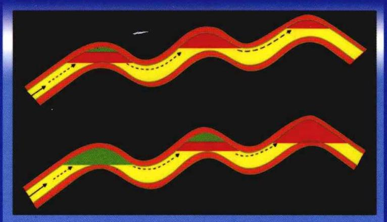

SHIYOU YU TIANRANQI DIZHIXUE

<!-- Media -->

ISBN 7-116-04518-X

$P \cdot  {2598}$ 定价: ${28} \cdot  {00}$ 元

# 石油与天然气地质学

陈昭年 主编

## 内 容 简 介

本书旨在阐明石油与天然气地质学基本原理。全书始终围绕油气藏这一核心, 以油气藏的基本要素 $\rightarrow$ 形成理论 $\rightarrow$ 油气分布 $\rightarrow$ 资源评价为主线,首先剖析了构成油气藏的基本要素,包括油气藏中流体的成分和性质、储集层和盖层以及圈闭和油气藏；其次分析了油气藏形成的理论, 包括油气成因理论与烃源岩、石油与天然气运移以及油气藏的形成与破坏；然后探讨了油气聚集单元与油气分布关系；最后对油气资源评价进行了初步介绍。

本书可作为高等院校油气地质勘探专业及其他相关专业本科生教材,也可供广大油气地质工作者阅读与参考使用。

## 图书在版编目 (CIP) 数据

石油与天然气地质学/陈昭年主编. 一北京: 地质出版社,2005. 8

ISBN 7-116-04518-X

I. 石... II. 陈... III. 石油天然气地质 IV. P618.13

中国版本图书馆 CIP 数据核字 (2005) 第 083831 号

责任编辑：孙亚芸

责任校对：丁海云

出版发行：地质出版社

社址邮编: 北京海淀区学院路 31 号, 100083

电 话: (010)82324508 (邮购部); (010)82324573 (编辑室)

网 址: http://www.gph.com.cn

电子邮箱: zbs@gph.com.cn

传 真: $\left( {010}\right) {82310759}$

印 刷：北京市朝阳区小红门印刷厂

开 本: ${787}\mathrm{\;{mm}} \times  {1092}\mathrm{\;{mm}}\%$

印 张: 18.625

字 数: 450 千字

印 数: 1-2000 册

版 次: 2005 年 8 月北京第一版 - 第一次印刷

定 价: 28.00 元

ISBN 7-116-04518 - X/P - 2598

(凡购买地质出版社的图书, 如有缺页、倒页、脱页者, 本社出版处负责调换)

## 前 言

本书是中国地质大学 (北京) 资助出版的教材, 按石油地质专业本科四年制教学大纲编写而成, 同时适用于资源勘查工程和石油工程专业四年制本科教育。

石油、天然气作为优质的能源和重要的化工原料, 其产品广泛地应用于工业、农业、 国防及人类日常生活的各个领域。油气工业的发展同世界各国的经济发展有着十分密切的关系。为了更好地指导石油、天然气的勘探和开发, 结合近年来油气地质领域研究的新成果, 编写一本既能反映目前国内外油气地质学科的新进展, 又能对我国新时期油气勘探有实际指导意义的《石油与天然气地质学》教材, 意义十分重大。

本教材围绕油气藏这一核心, 以油气藏的基本要素 $\rightarrow$ 形成理论 $\rightarrow$ 油气分布 $\rightarrow$ 资源评价为主线, 首先剖析了构成油气藏的基本要素, 包括油气藏中流体的成分和性质 (第二章); 储集层和盖层 (第三章) 及圈闭和油气藏 (第四章); 其次分析了油气藏形成的理论, 包括油气成因理论与烃源岩 (第五章)、石油与天然气运移 (第六章) 以及油气藏形成与破坏 (第七章); 然后探讨了油气聚集单元与油气分布 (第八章); 最后介绍了油气资源评价的概念、层次和方法 (第九章)。这样既符合人们对油气藏及其理论的认识过程, 也有利于应用这些理论去指导油气勘探实践。

本教材在承袭以往中国地质大学主编教材的主体内容基础上, 吸收了近年来石油与天然气勘探和研究的新成果, 在探讨现代油气成因理论普遍性内容的同时, 论述了油气成因的某些进展; 在分析常规油气藏形成的同时, 介绍了非常规油气藏形成的内容; 在油气二次运移讨论中, 突出了有效通道空间和油气运移的优势通道; 将含油气系统作为介于盆地和区带之间的聚集单元加以介绍; 为实现低风险、高效益并获得最大油气资源的最终目的, 简要介绍了不同层次油气资源的评价。教材编写过程中, 编者力求采用最新成果资料, 力争使学生能够区分并把握油气成藏过程中的机理、机制和模式。

石油与天然气地质学是一门实践性很强的学科, 为了更好地贯彻 “学以致用”、 “理论联系实际” 的原则, 培养学生分析问题和解决问题的能力, 本书另配有实习指导书。

本书由中国地质大学 (北京) 陈昭年主编。全书共分九章, 其中大部分章节由陈昭年编写, 第五章第五节、第八章第三节由黄海平编写, 第七章第五节、第九章由贾庆素编写。全书由陈昭年负责统一修改和定稿。

本书在编写过程中得到了中国地质大学(北京)教务处、能源学院和石油教研室领导和同事们的关心和支持; 参考和引用了大量文献, 限于篇幅, 在书后所附参考文献中未能全部列出, 在此谨向有关研究单位和文献作者表示衷心感谢。如有不当之处, 敬请广大同仁和读者指正。

本教材承蒙中国地质大学 (北京) 陈发景教授和中国石油大学 (北京) 柳广第教授主审, 他们在百忙中抽出时间认真审查, 提出了许多宝贵的意见和建议, 在此表示衷心的感谢。

主 编

2005 年 5 月于北京

## 日 录

前 言

第一章 绪 论 (1)

第一节 石油与天然气地质学的内容 (1)

一、石油与天然气地质学概念 (1)

二、本课程的体系和具体内容 (1)

三、本课程的特点 (2)

第二节 石油与天然气地质学的形成和发展 (2)

第三节 世界油气工业概况与资源现状 (4)

一、世界油气工业概况 (4)

二、世界油气资源现状 (4)

第四节 中国油气工业概况与资源现状 (6)

一、中国油气工业概况 (6)

二、中国油气资源现状 (9)

第二章 油气藏中流体成分和性质 (11)

第一节 石油 (11)

一、石油的化学组成 (12)

二、石油的分类 (18)

三、海陆相石油的基本区别 (20)

四、石油的物理性质 (22)

第二节 天然气 (25)

一、天然气的概念及产状 (25)

二、天然气的化学组成 (28)

三、天然气的物理性质 (29)

四、天然气与石油的差别 (31)

第三节 油田水 (32)

一、油田水的概念 (32)

二、油田水的产状 (32)

三、油田水的来源 (33)

四、油田水的化学组成 (34)

五、油田水的类型 (35)

六、油田水的物理性质 (37)

第四节 油气的碳、氢稳定同位素 (37)

一、同位素的概念及同位素分馏作用 (38)

二、稳定同位素在自然界的丰度、比值、标准及表示方式 (38)

三、油气中的稳定碳同位素 (39)

四、油气中的氢同位素 (40)

第三章 储集层和盖层 (42)

第一节 储集层物理性质 (42)

一、储集层的孔隙性 (42)

二、储集层的渗透性 (44)

三、储集层的孔隙结构 (47)

四、含油气饱和度 (49)

第二节 储集层类型 (50)

一、碎屑岩储集层 (50)

二、碳酸盐岩储集层 (54)

三、其他岩类储集层 (57)

第三节 盖层 (59)

一、盖层的概念及类型 (59)

二、盖层的封闭机理 (60)

三、盖层的评价 (63)

四、盖层的相对性 (64)

第四章 圈闭和油气藏 (66)

第一节 圈闭和油气藏概述 (66)

一、圈闭理论的形成与发展 (66)

二、圈闭的现代概念及可预测标志 (67)

三、油气藏的概念与工业标准 (69)

四、圈闭和油气藏的度量 (70)

五、圈闭和油气藏的分类 (73)

第二节 构造油气藏 (74)

一、背斜油气藏 (75)

二、断层油气藏 (76)

三、裂缝性背斜油气藏 (81)

四、刺穿油气藏 (83)

第三节 地层油气藏 (86)

一、岩性油气藏 (86)

二、不整合油气藏 (92)

三、礁型油气藏 (98)

四、沥青封闭油气藏 (100)

第四节 水动力油气藏 (101)

一、水动力圈闭形成机理 (101)

二、水动力油气藏的特点和主要类型 (101)

第五节 复合油气藏 (103)

一、复合圈闭和油气藏的基本概念和分类 (103)

二、复合油气藏的主要类型 (104)

第五章 油气成因理论与烃源岩 (108)

第一节 油气成因理论发展与现状 (108)

一、油气无机成因学说 (109)

二、油气有机成因学说 (109)

第二节 现代油气成因理论 (111)

一、有机成因的证据 (111)

二、有机成因的物质基础 (111)

三、油气生成的理化条件 (122)

四、成烃演化与模式 (127)

五、油气成因理论进展 (130)

第三节 天然气成因类型与判别 (134)

一、天然气的成因类型及特点 (135)

二、天然气成因类型判别 (140)

第四节 烃源岩及其评价 (143)

一、烃源岩的概念 (143)

二、烃源岩的评价 (143)

第五节 油气地球化学对比 (152)

一、对比参数的选取 (152)

二、对比结果的解释 (153)

三、油源对比 (153)

四、气源对比 (155)

第六章 石油与天然气运移 (157)

第一节 油气运移概述 (157)

一、基本概念 (157)

二、主要内容 (158)

第二节 油气初次运移 (158)

一、初次运移的介质条件 (158)

二、初次运移的机制与模式 (161)

三、初次运移的其他问题 (172)

第三节 油气二次运移 (174)

一、二次运移的介质条件 (174)

二、二次运移的机制与模式 (175)

三、二次运移的其他问题 (187)

第七章 油气藏形成与破坏 (190)

第一节 油气聚集 (190)

一、油气聚集方式 (190)

二、油气聚集机制 (193)

三、油气聚集模式 (195)

第二节 油气聚集过程 (197)

一、油气充注过程 (198)

二、油气混合过程 (199)

三、油气富集过程 (201)

第三节 油气藏形成的条件 (202)

一、必要条件 (202)

二、充分条件 (203)

第四节 油气藏形成时间与期次 (209)

一、地质分析方法 (209)

二、储集层成岩矿物分析法 (212)

第五节 非常规油气藏形成 (213)

一、深盆气藏 (213)

二、煤层气藏 (216)

三、甲烷水合物 (218)

第六节 油气藏的破坏与油气再分布 (219)

一、油气藏的破坏 (219)

二、油气藏的再分布 (222)

第八章 油气聚集单元与油气分布 (225)

第一节 含油气盆地的概念与分类 (225)

一、含油气盆地的概念 (225)

二、盆地分类概述 (226)

第二节 含油气盆地的类型与特点 (228)

一、裂陷盆地 (228)

二、压陷盆地 (230)

三、拉分盆地 (233)

第三节 含油气系统 (234)

一、含油气系统的基本概念 (234)

二、含油气系统的组成 (234)

三、含油气系统的命名 (237)

四、含油气系统的地质内涵 (238)

第四节 油气聚集带 (239)

一、油气聚集带的基本概念和分类 (239)

二、油气聚集带的主要类型 (240)

第五节 油气田 (246)

一、油气田的概念及分类 (246)

二、构造型油气田 (247)

三、地层型油气田 (248)

四、复合型油气田 (249)

第六节 油气分布及其控制因素 (251)

一、油气资源概述 (251)

二、油气分布 (253)

三、控制油气分布的主要因素 (260)

第九章 油气资源评价 (266)

第一节 油气资源评价概述 (266)

一、油气资源评价的概念 (266)

二、油气资源评价的内容 (266)

三、油气资源评价的对象 (267)

四、油气资源评价的特点 (267)

五、总体思路及一般程序 (268)

第二节 油气资源评价层次及其方法 (272)

一、含油气大区评价 (272)

二、盆地评价 (272)

三、区带评价 (273)

四、圈闭评价 (275)

第三节 油气资源评价系统 (276)

一、盆地评价系统 (277)

二、区带评价系统 (278)

三、圈闭评价系统 (280)

主要参考文献 (282)

## 第一章 绪 论

## 第一节 石油与天然气地质学的内容

石油、天然气作为优质的能源和重要的化工原料, 其产品广泛地被用于工业、农业、 国防及人类日常生活的各个领域；油气工业的发展同世界各国经济有着十分密切的关系, 在和平时期油气工业的发展状况代表一个国家的综合国力, 而在战争时期是关系到一个国家胜败存亡的重要战略物资; 鉴于天然气在环保方面所占的优势, 它在世界经济发展中的重要性正在日益提高。为了更好地指导石油、天然气的勘探和开发, 人们十分重视油气藏的形成及富集规律的研究, 并使其发展成为一门独立的地质学科——石油与天然气地质学。

## 一、石油与天然气地质学概念

石油与天然气地质学是研究地壳中油气藏及其形成条件和分布规律的地质科学。它属于矿产地质科学的一个分支学科, 是石油、天然气勘探与开发相关专业的专业理论课。

石油与天然气地质学研究的主要对象是油气藏。油气藏不仅是油气地质勘探人员从事油气勘探的直接对象, 而且也是油气地质研究人员进行油气成因、运移、聚集和分布规律等油气地质理论研究的基础。石油与天然气地质学的理论和假说, 均来源于实践并直接指导实践。它是根据对已知的油气藏的研究、总结出来的实践成果, 并又在油气藏的勘探实践中得到检验。油气藏的研究是石油与天然气地质学的核心内容。

## 二、本课程的体系和具体内容

石油与天然气地质学的任务就是围绕油气藏这一核心, 掌握油气藏的基本特征、形成原理、分布规律, 用以指导油气田的调查与勘探, 以便更有效地发现和探明地下油气藏。 因此,课程将油气藏研究作为核心,知识体系以油气藏的基本要素 $\rightarrow$ 形成理论 $\rightarrow$ 油气分布规律 $\rightarrow$ 油气资源评价为主线。教材共分九章,具体内容是: 首先剖析了构成油气藏的基本要素, 包括油气藏中的流体成分和性质 (第二章)、储集层和盖层 (第三章) 和圈闭和油气藏 (第四章); 其次分析了油气藏形成的理论, 包括油气成因理论与烃源岩 (第五章)、 石油与天然气运移 (第六章) 以及油气藏形成与破坏 (第七章); 然后探讨了油气聚集单元与油气分布 (第八章); 最后对油气资源评价 (第九章) 做了初步介绍。这样既符合人们对油气藏及其理论的认识过程, 也有利于应用这些理论去指导油气勘探实践。

## 三、本课程的特点

石油与天然气地质学是一门综合性的学科, 涉及的面很广。由于石油和天然气不同于其他任何矿产, 有其特殊性。油气藏形成时间的漫长; 油气组成成分和成烃物质的复杂性; 油气本身具有流动性, 其聚集地点与生成地点的不一致等等, 使得油气藏的研究显得十分复杂。漫长的地质时期中发生的一切地质现象在短时间内难以再现, 这就要求我们要有较强的综合分析能力和丰富的想像力。这是本课程与其他固体矿床分支学科及数理等课程之间存在较大区别之所在。

石油与天然气地质学属地质学范畴, 除涉及部分相关的物理、化学基础知识外, 还与较多地质基础学科相关联。它与流体力学、有机地球化学、地球物理学、构造地质学、沉积岩石学和岩相古地理学等有密切的关系。例如, 有机地球化学的发展, 以及色谱、色谱 - 质谱、红外光谱、电子显微镜和同位素分析等技术的广泛采用, 为解决石油成因问题打下了良好的基础; 一些重要的油气藏与河道砂、三角洲砂、浊积砂等类型沉积砂和礁密切相关, 而这些类型的砂体和礁的分布受沉积体系的控制, 因此, 只有通过研究沉积岩石学和岩相古地理, 才能确定储集岩分布的有利地带; 油气地质学与构造地质学关系亦十分密切, 油气的运移和聚集受盆地区域构造和局部构造条件的控制, 要想成功地找到与背斜构造、断裂构造以及不整合面有关的油气田和油气聚集带, 就必须深入掌握有关构造地质学的知识; 为了确定储油气构造、各类沉积砂体以及生物礁等的位置和形态, 常常需要借助于地球物理学中地震勘探方法的理论和技术。其中沉积学、构造地质学及地球化学等三方面的知识是学习石油与天然气地质学的重要基础。

## 第二节 石油与天然气地质学的形成和发展

石油与天然气地质学的产生、发展和不断完善始终与地质学的发展直接相关, 同时与油气勘探实践紧密相随。1859 年埃・德雷克先生 (Edwin Drake) 在美国宾夕法尼亚州首钻的油井, 是近代油气勘探 (或工业) 的开始。在其后的最初年代, 油气钻探只是选择在天然的油气苗或先期成功井附近, 没有油气地质学理论的指导。

19 世纪中叶, 加拿大的亨特 (T. S. Hunt, 1861)、美国的怀特 (I. C. White, 1885) 等先后提出了石油储集的 “背斜学说”, 使油气探井选择开始有了地质理论的指导, 是近代石油地质学的开始, 至今仍然具有指导意义。

20 世纪初, 1917 年美国石油地质学家协会 (AAPG) 的成立和 AAPG 简报的出版, 为石油地质学的诞生起了重要促进作用, 而且至今仍是最大、最广泛、最活跃的专业学科的学术团体。埃蒙斯 (Emmons, 1921) 的《石油地质学》专著, 是标志着石油地质学科走上独立发展道路的里程碑。在随后的几十年间, 几部有重要影响的石油地质学论著相继问世, 包括前苏联古勃金 (H. M. Γy6кин, 1937) 院士的《石油论》, 布罗德 (H. O. Bpoπ) 的《石油与天然气矿藏》以及加拿大地质学家格索 (W. C. Gussow, 1954) 和前苏联学者拉宾 ( $\mathrm{H}$ . Либин,1959) 对 “差异聚集” 原理的论述。1953 年美国学者莱复生 (A. I. Levorsen) 的《石油地质学》问世, 这是一部总结性的、集石油地质学各领域之大成的著作, 标志着现代石油地质学理论走向系统化。

20 世纪初 60 年代, 欧、美一批石油地质和地球化学家, 从干酪根天然热降解和热模拟实验两个途径获得相同的结果, 使有机晚期生油说发展为具有独立证据的石油成因理论, 为定量计算生油潜量提供了一种可靠的新方法, 在此基础上逐步深入开展沉积埋藏史、热 (成熟) 史、生烃史、流体压力史、排烃史的研究, 进而发展为盆地规模的成藏过程的数值模拟——盆地模拟。在这一进程中, 蒂索和威尔特 (B. P. Tissot & D. H. Welte, 1978, 1982) 合著的《石油形成和分布》、亨特 (J. D. Hunt, 1979) 著的《石油地球化学和石油地质学》可以说是油气地质由定性向定量化过渡时期最有代表性的卓越著作。

1980 年出版的 AAPG 地质研究第十号专辑和 1987 年出版的《沉积盆地中的烃类运移》论文集, 标志着 “油气运移” 已成为当时油气地质研究的焦点, 也是油气资源定量评价和预测研究中最薄弱的环节。20 世纪 80 年代晚期以来, 沉积盆地数值模拟成为当代油气地质学领域中发展迅速的又一个活跃的前沿热点, 它是新地学思维与当代计算机技术相结合的产物。它能以某种逼真度定量地再现含油气盆地形成和演化的全部动力学过程以及与之伴随的成烃、排烃和运聚过程, 并模拟这些过程的时间配置关系和瞬态变化, 从而把油气地质学从静态的单因素的定性描述, 提升到动态的、整体化的定量模拟。它为含油气盆地早期评价提供了有效途径。借助于地震剖面资料, 可早期预测生烃时间、生烃门限、生烃潜力, 模拟烃类运聚过程, 尤其是对于那些尚未钻探过的远景区、地表条件艰难地区或边远地区, 可以应用卫星遥感信息或机载雷达进行油藏类型和资源量的先期预测。 鉴于油气盆地数值模拟技术在降低勘探风险, 提高勘探成功率方面所带来的巨大效益, 国际石油界和跨国公司都竞相将其列入优先发展的战略性研究领域。

1990 年美国南卡罗来纳大学教授莱尔歇 (Ian Lerche) 和他的合作者们率先推出了专著《用定量方法进行盆地分析》。油气盆地研究的核心问题都与油气运聚的定量化有关。 1991 年由马贡和道 (L. B. Magoon & W. G. Dow, 1991) 主编的 AAPG62 号专集 “含油气系统——从烃源到圈闭”出版, 标志着 “含油气系统” 概念形成, 它同样也是油气地质定量化研究的一个重要组成部分。

新中国成立后, 1951 年孟尔盛著《石油地质学》; 1959 年梁布兴和潘钟祥主编《石油地质学原理》; 其后北京石油学院和西北大学也编著和出版了相应教材, 为我国培养一大批优秀油气地质专业人才起了重要作用。20 世纪 80 年代以来, 是我国石油地质学理论高速发展时期, 西北大学石油地质教研室主编的《石油地质学》 1979 年由地质出版社出版发行; 张万选、张厚福教授及其同事, 先后于 1981 年、1989 年和 1999 年在石油工业出版社出版发行了三个版本的《石油地质学》; 1983 年王尚文教授主编的《中国石油地质学》在石油工业出版社出版发行；潘钟祥教授主编的《石油地质学》于 1986 年由地质出版社出版发行；陈荣书主编的《石油及天然气地质学》于 1994 年由中国地质大学出版社出版发行。这些教材和著作反映了国内外油气地质研究的阶段性进展, 适应了我国油气工业快速发展的时代要求。

在石油地质学中, 一般只是将天然气当作是生油过程中的伴生物, 但随着天然气勘探的深入, 人们发现了大量的工业性气藏。天然气的成因具有多样性, 既有有机的油型伴生气、石油裂解气、生物成因气和煤成气, 还有无机成因气。其运移聚集和保存条件也与油藏有差别。因此, 20 世纪 80 年代以来, 有人主张将天然气地质学这一门新学科从石油地质学中独立出来 (维索茨基, 1982)。自 20 世纪 70 年代以来, 国内外也出版了多部与天然气地质学有关的著作, 其中, 有陈荣书(1986,1989)、包茨 (1988) 和戴金星 (1989) 等, 这些著作的出版发行无疑对推动这一学科的发展, 起了重要的促进作用。

## 第三节 世界油气工业概况与资源现状

## 一、世界油气工业概况

世界油气工业的发展已有 100 多年的历史。美国油气工业生产始于 1859 年, 100 多年来, 其年产量占世界总产量的一半, 直到 1975 年才被苏联超过。据美国地质调查所统计,2000 年其产量为 ${4.03} \times  {10}^{8}\mathrm{t}$ ,居世界第二位。苏联的油气工业始于 1873 年,巴库是苏联石油工业的摇篮。第二次世界大战期间, 苏联许多油田被毁, 产量大幅度下降, 但战后相继开发了伏尔加 - 乌拉尔和西西伯利亚等含油气区, 产量迅速增加, 1987 年曾成为世界石油产量最高的国家,达到了年产 ${5.78} \times  {10}^{8}\mathrm{t}$ 。但随后 9 年苏联石油产量下降了 ${47}\%$ 以上。由于投资增加和技术进步,俄罗斯石油产量在 2000 年出现了 ${35.7}\%$ 的明显增长, 产量达 ${3.28} \times  {10}^{8}\mathrm{t}$ ,位于沙特阿拉伯和美国之后,居世界第三位。

第二次世界大战后, 中东地区的石油工业在外国资本的参与下发展很快。2000 年沙特阿拉伯的石油产量为 ${4.13} \times  {10}^{8}\mathrm{t}$ ,居世界第一位。伊拉克的石油产量一直有很大的不确定性。两伊战争使该国 1980 年和 1981 年产量急剧下降。在其 1990 年 8 月入侵科威特后, 其石油产量受到联合国制裁的限制。随着 “石油换食品” 计划的不断修改, 伊拉克石油产量有所增长,2000 年产量达 ${1.31} \times  {10}^{8}\mathrm{t}$ 。伊朗的石油产量于 1974 年曾达到年产量 ${3.24} \times$ ${10}^{8}\mathrm{t}$ 的水平。由于连续的政治动荡,8 年的两伊战争以及缺乏资金和技术,其石油产量下降,2000 年产量为 ${1.88} \times  {10}^{8}\mathrm{t}$ ,居世界第四位。中东其他国家,如阿联酋、科威特、卡塔尔和科威特/沙特中立区也有较高的产量,2000 年年产量分别为 ${1.14} \times  {10}^{8}\mathrm{t}\text{、}{0.9} \times$ ${10}^{8}\mathrm{t}\text{、}{0.35} \times  {10}^{8}\mathrm{t}$ 和 ${0.3} \times  {10}^{8}\mathrm{t}$ 。其他重要的产油国家有: 西非的尼日利亚; 北非的阿尔及利亚和利比亚; 美洲的墨西哥、委内瑞拉和巴西; 北欧的挪威和英国; 以及亚洲的中国、 印度尼西亚和哈萨克斯坦。

## 二、世界油气资源现状

据美国地质调查所和国际能源机构统计 (美国地质调查所, 2000), 世界石油储量的分布很不均衡。2000 年全世界石油剩余储量为 ${1331.89} \times  {10}^{8}\mathrm{t}$ ,大于 ${10} \times  {10}^{8}\mathrm{t}$ 的国家有 20 个,其中中东国家和地区的石油储量大约占据世界储量的 $1/2$ ; 其次为俄罗斯,大约占 ${14}\%$ (表 1-1)。据 1998 年世界《油气杂志》统计,世界石油剩余储量为 ${1331} \times  {10}^{8}\mathrm{t}$ , 待探明储量 ${670} \times  {10}^{8}\mathrm{t}$ ,非常规石油资源 $\left( {{4000} \sim  {7000}}\right)  \times  {10}^{8}\mathrm{t}$ 。按现在全世界每年消费石油 ${30} \times  {10}^{8}\mathrm{t}$ 计算,至少到 2040 年以前,石油仍然是一种不可替代的优质能源。全世界 2000 年年产量上亿吨的国家有 13 个, 按产量高低顺序为沙特阿拉伯、美国、俄罗斯、伊朗、挪威、墨西哥、中国、委内瑞拉、阿尔及利亚、伊拉克、阿联酋、尼日利亚和英国； 年产量为 $\left( {{9000} \sim  {3000}}\right)  \times  {10}^{4}\mathrm{t}$ 的国家和地区有 6 个,按产量高低顺序为科威特、巴西、 利比亚、印度尼西亚、卡塔尔、哈萨克斯坦和科威特 (包括沙特中立区)。除此以外, 还有其他 70 多个国家和地区产油, 如加拿大、澳大利亚、罗马尼亚、特立尼达和多巴哥、 埃及、阿塞拜疆、乌兹别克斯坦、土库曼斯坦、安哥拉、丹麦等, 2000 年的产量共计为 ${9.28} \times  {10}^{8}\mathrm{t}$ 。全世界2000年总产量为 ${39.22} \times  {10}^{8}\mathrm{t}$ (表 1-1)。

据 2000 年资料,世界天然气剩余储量超过 $1 \times  {10}^{12}{\mathrm{\;m}}^{3}$ 的国家共有 16 个。俄罗斯居首位,达 ${48.1} \times  {10}^{12}{\mathrm{\;m}}^{3}$ ,其次是中东的伊朗、卡塔尔、沙特阿拉伯、阿联酋、伊拉克和科威特,合计 ${50.3} \times  {10}^{12}{\mathrm{\;m}}^{3}$ 。这些国家的可采储量占世界的 ${79}\%$ 。中国剩余储量为 ${1.4} \times  {10}^{12}{\mathrm{\;m}}^{3}$ , 居世界第 15 位 (表 1-2)。

<!-- Media -->

表 1-1 世界已探明石油剩余储量和石油产量分布

<table><thead><tr><th>国家和地区</th><th>石油剩余储量 ${10}^{8}\mathrm{t}$</th><th>石油产量 ${10}^{8}\mathrm{t}$</th><th>国家和地区</th><th>石油剩余储量 ${10}^{8}\mathrm{t}$</th><th>石油产量 ${10}^{8}\mathrm{t}$</th></tr></thead><tr><td>沙特阿拉伯</td><td>306.94</td><td>4. 13</td><td>尼日利亚</td><td>27.78</td><td>1.03</td></tr><tr><td>俄罗斯</td><td>190.27</td><td>3. 28</td><td>哈萨克斯坦</td><td>27.78</td><td>0.35</td></tr><tr><td>伊拉克</td><td>108. 33</td><td>1. 31</td><td>挪威</td><td>22.22</td><td>1. 71</td></tr><tr><td>伊朗</td><td>105. 55</td><td>1.88</td><td>阿尔及利亚</td><td>20.83</td><td>1. 60</td></tr><tr><td>阿联酋</td><td>81.94</td><td>1.14</td><td>卡塔尔</td><td>20.83</td><td>0.35</td></tr><tr><td>科威特</td><td>76.38</td><td>0.9</td><td>英国</td><td>18.05</td><td>1.00</td></tr><tr><td>美国</td><td>44.44</td><td>4.03</td><td>印度尼西亚</td><td>13.89</td><td>0.63</td></tr><tr><td>委內瑞拉</td><td>41.67</td><td>1.47</td><td>巴西</td><td>12. 50</td><td>0.78</td></tr><tr><td>利比亚</td><td>34.72</td><td>0.71</td><td>科威特/沙特中立区</td><td>11.11</td><td>0.3</td></tr><tr><td>中国</td><td>34.72</td><td>1. 65</td><td>其他国家</td><td>101.39</td><td>9.28</td></tr><tr><td>墨西哥</td><td>30. 55</td><td>1. 69</td><td>合计</td><td>1331. 89</td><td>39.22</td></tr></table>

(资料来源: 美国地质调查所, 2000)

<!-- Media -->

(资料来源: 美国地质调查所, 2000)

<!-- Media -->

表 1-2 世界各国天然气资源概况

<table><thead><tr><th>国家和地区</th><th>剩余储量 ${10}^{12}{\mathrm{\;m}}^{3}$</th><th>国家和地区</th><th>剩余储量 ${10}^{12}{\mathrm{\;m}}^{3}$</th></tr></thead><tr><td>俄罗斯</td><td>48.1</td><td>尼日利亚</td><td>3.5</td></tr><tr><td>伊朗</td><td>22.9</td><td>伊拉克</td><td>3. 1</td></tr><tr><td>卡塔尔</td><td>11.2</td><td>土库曼斯坦</td><td>2.8</td></tr><tr><td>沙特阿拉伯</td><td>6</td><td>乌兹别克斯坦</td><td>1.8</td></tr><tr><td>阿联酋</td><td>5.6</td><td>加拿大</td><td>1.7</td></tr><tr><td>美国</td><td>4.7</td><td>科威特</td><td>1.5</td></tr><tr><td>阿尔及利亚</td><td>4.5</td><td>中国</td><td>1.4</td></tr><tr><td>委內瑞拉</td><td>4.2</td><td>利比亚</td><td>1.3</td></tr><tr><td>合 计</td><td colspan="3">124.3</td></tr></table>

<!-- Media -->

## 第四节 中国油气工业概况与资源现状

## 一、中国油气工业概况

## (一) 古代油气工业

我国是世界上最早发现、开采和利用石油及天然气的国家之一。据史料记载, 三千多年前, 中国古代已发现了天然气, 两千多年前发现了石油。由于天然气比石油更易从地层中逸出, 遇火即燃, 因此, 在历史上人们认识天然气早于石油。

我国关于天然气的文字记载, 最早见于西周时代 (公元前 1046 年一前 771 年) 《易经》一书中。书中记述的 “泽中有火” 很可能是沼气或天然气在水中燃烧的现象。

发现天然气较为可靠的记载是在公元前 256 一前 251 年秦孝文王派李冰为蜀太守时, 曾兴修都江堰和开凿盐井, 在四川邛崃县开采盐的过程中, 发现了天然气且引起了通天大火。

对石油的最早记载出现在 1900 多年前东汉历史学家班固著的《汉书·地理志》中。 书中写道: “高奴, 有洧水, 可蘸”。高奴系指今陕西省延安县一带, 洧水是延河的一条支流, 蘸乃古代燃字。这是描述水面上的油状物可以燃烧。

公元 267 年晋朝张华著《博物志》详细描述了甘肃酒泉石油的特征: “酒泉延寿县南山出泉水, 大如笤, 注地为沟, 水有肥, 如肉汁, 取著器中, 始黄后黑, 如凝膏, 燃极明……彼方人谓之石漆水”。表明当时称石油为石漆水, 而且已开始观察和采集, 用作润滑油、燃烧、照明。

“石油”一词是北宋著名科学家沈括 (公元 1031 年-1095 年) 在《梦溪笔谈》中首次提出来的。书中记述: “富延境内有石油, 旧说高奴县出脂水, 即此也。” “石油……生于水际沙石, 与泉水相杂惘惘而出”。他用油烟作墨, 墨光如漆, 比松墨还好。他预言: “此物后必大行于世……盖石油至多, 生于地中无穷, 不若松木有时而竭”, 预见了未来石油利用的广阔前景。

在历史上, 石油不仅用于润滑、燃烧、照明和医药, 而且也用于军事上。据《元和郡县志》记载, 在公元 578 年, 酒泉人以油烧毁突厥族攻城的武器, 保全了酒泉城。北宋神宗六年 (公元 1073 年) 在京都汴梁军器监设有专门的 “猛火油作”, 加工石油并制作兵器。

《华阳国志》记载,在秦始皇时代,四川临邛郡(今邛崃县)人们已利用钻井开采天然气煮盐。其记载情景为 “有火井, 夜时光映上昭。民欲其火, 先以家火投之, 顷许如雷声, 火焰出, 通耀数十里, 以竹筒盛其光藏之, 可拽行, 终不灭也。井有二水, 取井火煮之, 一水斛得五斗盐, 家火煮之, 得无几也”。有时一口火井可烧盐锅 700 口。

我国是世界上最早开发天然气气田的国家。宋末元初 (13 世纪), 已大规模开采自流井的浅层天然气。《富顺县志》描述 “火井在县西九十里,深四、五丈,经五、六寸,中无盐水……”。

1835 年四川自流井的兴海井深达 ${1001.4}\mathrm{\;m}$ ,日产气约 ${5000} \sim  {8000}{\mathrm{\;m}}^{3}$ 。 1840 年又钻成深 ${1200}\mathrm{\;m}$ 的磨子井,钻穿嘉陵江灰岩深部储气层,产气量达 ${40} \times  {10}^{4}\mathrm{t}/\mathrm{d}$ 以上。当时发生井喷, 火光冲天, 三十里外可见。

这些事实说明中国是世界文明发达最早的国家之一, 我国劳动人民用自己勤劳的双手在世界石油与天然气勘探开发史上写下了不可磨灭的光辉篇章, 也给我们留下了珍贵的文化遗产。

## (二) 近代油气工业

中国近代油气工业可以上溯到 1878 年, 以清政府在台湾设立中国第一个开发石油的行政管理机构——矿油局、钻成第一口近代油井作为起点, 但直到 1939 年甘肃玉门老君庙油田的投产开发, 才称得上建立了近代石油工业的初步基础。中国自从有了近代石油工业以来, 已走过了 120 多年的历程。前 70 年 ( ${1878} \sim  {1949}$ 年) 是漫长的断续发展时期。 20 世纪 40 年代, 相继发现了玉门、延长、独山子油田和四川气田。在这期间, 我国许多地质学家, 如李四光、谢家荣、孙健初、潘钟祥、黄汲清、翁文波、王尚文等在极其困难的条件下, 对我国油气地质研究、油气田调查勘探做出了重大贡献。虽然还缺乏对当时中国油气地质条件的深刻认识, 但提出了陆相沉积物中存在石油的可能性。这种认识可以看作是以后发展起来的陆相生油理论的萌芽, 这一时期可以称为中国油气地质学的初创时期。

旧中国遗留给我们的是一个力量极其薄弱的烂摊子。1949 年, 全国只有玉门老君庙、 陕北延长、新疆独山子 3 个小油田和四川圣灯山、石油沟 2 个小气田; 有 3 个勘探处、 8 个地质调查队、大小钻机 7 台；石油职工 1 万多人, 技术干部 700 人, 而石油地质技术干部仅 28 人; 油田生产单位只有玉门、延长两个, 实际采油井加起来也只有 33 口; 年产天然原油 $7 \times  {10}^{4}\mathrm{t}$ ; 石油地质储量 ${29} \times  {10}^{6}\mathrm{t}$ ,估算的远景石油储量仅 ${27} \times  {10}^{8}\mathrm{t}$ 。

新中国的油气工业经过半个多世纪的艰苦奋斗, 创造了举世瞩目的辉煌业绩。纵观新中国成立后的 50 多年, 我国油气工业的发展大致经过了三个时期。

1. 恢复和发展时期 (1949 ~1960 年)

这一时期以玉门油矿为基地, 在恢复生产的同时, 先后在陕北、柴达木、川西北、准噶尔荒地南缘进行石油钻探, 相继发现了冷湖油田、克拉玛依油田和四川天然气田。1958 年, 石油勘探战略东移, 找油领域由传统的山前坳陷带, 转移到东部覆盖沉降区。经过原地质部和石油部的大量普查工作, 松辽石油勘探局于 1959 年 9 月 26 日在松辽盆地中部大庆长垣钻探的松基 3 井喷油, 从而发现了大庆油田。9 月 27 日, 在吉林省境内发现了扶余油田。次年组织大庆石油会战, 到当年底, 探明了大庆油田的地质储量, 证实其是个特大型油田。这一重大发现一举改变了中国石油工业的布局。

大庆油田的发现, 使非海相沉积物生油成为无可争辩的事实, 而且非海相沉积可以形成具有工业价值的油藏, 乃至大庆这样的大型油田。尽管从 20 世纪 30 年代起, 就有不少学者曾明白无误地提出了石油 “也能够来自淡水沉积物” 的观点, 但是, “陆相生油” 真正实现观念上的突破, 将其作为石油地质学中的重大课题来加以研究, 并逐步形成科学理论, 则是在 50 年代末大庆油田发现之后才开始的。

1957 年, 谢家荣指出: “大陆沉积中有机物可能主要是由陆生植物分异而来的……陆相地层才是最可能的生油层。” 1959 年, 侯德封在探索西北地区油田形成地质条件时, 指出 “潮湿与干燥气候的时代转变, 有利于生油层的形成”。中国科学院兰州地质研究所则提出了 “内陆潮湿坳陷” 说, 强调了古气候条件对陆相生油的重要性。田在艺等在详细分析总结准噶尔、塔里木、鄂尔多斯、四川、柴达木、酒泉等盆地油气田形成的地质条件时, 强调了长期坳陷的作用。石油科学研究院在翁文波院长的主持推动下, 于 20 世纪 60 年代初期对我国陆相盆地进行了卓有成效的研究, 先后出刊了三集《石油勘探研究报告集》 $\left( {{1960} \sim  {1964}\text{年}}\right)$ ,强调了 “深水坳陷” 的作用,指出 “长期的深坳陷有利于生油层的形成”、“盆地深坳陷的特征和分布, 对油气的分布起着主要的控制作用”。至此, 初步形成了中国陆相生油理论的基本轮廓。

2. 高速发展时期 $\left( {{1960} \sim  {1978}\text{年}}\right)$

大庆油田发现后不久, 我国石油勘探重点转移到渤海湾盆地。其中, 在 1961 年, 东营凹陷华 8 井喷油, 揭开了华北地区渤海湾盆地石油勘探的序幕。 ${1963} \sim  {1964}$ 年,黄骅坳陷黄 3 井与港 5 井先后获得工业油流, 发现了大港油田。1964 年东营凹陷坨 2 井获高产油流, 次年又相继钻成数口日产千吨的油井, 从而证实了渤海湾盆地中第一个高产大油田——胜利油田。

继胜利油田和大港油田之后, 1965 年 7 月在太平房构造首获工业油流, 至 1969 年相继发现了兴隆台等 6 个具工业油流的构造, 发现了辽河油田。它们的发现, 有力地证明了在渤海湾盆地这样构造复杂的地质条件下, 同样可以找到大油田。

1975 年 7 月 3 日冀中坳陷任丘构造上的任 4 井喷出日产超过千吨的高产工业油流, 产油层位为埋藏于第三系之下的震旦系雾迷山组 (古风化壳), 宣告了我国第一个古潜山类型高产油田的诞生。1975 年底, 地震勘探证实任丘古潜山成带分布。经过 1976 年会战, 一举拿下古潜山油田, 成为继 1960 年大庆油田探明之后, 我国石油储量增长的又一个高峰年。

油气勘探的一系列突破, 保证了石油工业的高速发展。1963 年我国原油年产量达 648 × ${10}^{4}\mathrm{t}$ ,实现了 “石油基本自给” 的历史性转变,1965 年突破千万吨 $\left( {{1131.5} \times  {10}^{4}\mathrm{t}}\right)$ , 1973 年超过 ${5000} \times  {10}^{4}\mathrm{t}$ ,1978 年突破亿吨 $\left( {{1.04} \times  {10}^{8}\mathrm{t}}\right)$ ,使我国跃居世界产油大国的行列。

这一阶段高速发展的油气勘探实践, 极大地推动了我国油气地质学理论的进展。大庆油田和渤海湾油气区的发现, 使陆相生油理论得以确立并不断得到深化和系统化。实践证明我国陆相沉积盆地具有良好的烃源岩, 生烃潜力大, 这为以陆相沉积盆地为主体的我国提供了丰厚的油气资源基础。通过大庆长垣的油气勘探, 总结出了一套坳陷盆地砂岩背斜油藏的勘探思路和油气聚集理论, 即 “源控论”。

渤海湾油气区经过近 20 年的勘探, 总结出一套断陷盆地复式油气聚集 (区) 带的理论。这是中国油气地质学理论的一项重大建树和重要组成部分。在油气聚集理论方面的另一个进展便是以任丘古潜山油气藏为代表的 “新生古储” 潜山油气聚集理论, 在渤海湾盆地油气勘探实践中创立的断陷盆地复式油气聚集 (区) 带理论及相应的滚动勘探、滚动开发技术为石油增储上产做出了重大贡献。

## 3. 稳定发展时期 (1978一现在)

在原油产量达到亿吨以后, 我国石油工业仍在稳步增长。到 2000 年原油产量超过 ${1.65} \times  {10}^{8}\mathrm{t}$ 。但是,进入 20 世纪 80 年代以来,东部主力油田相继进入了开采中后期,寻找稳定的油气资源战略接替区, 日益紧迫地提上了油气勘探的议事日程。 80 年代后期, 国家明确提出了“稳定东部,发展西部”的战略思想。在努力做好东部油田稳定生产的同时, 加强了西部地区, 特别是塔里木、准噶尔、吐哈、柴达木和鄂尔多斯盆地的油气勘探工作。经过 10 多年的艰苦努力, 在塔里木盆地已陆续发现雅克拉油田、轮南油田、塔中和塔河油田等, 在准噶尔盆地新发现了火烧山油田、北三台油田和石西油田, 在鄂尔多斯盆地发现和开发了安塞等油田。1990 年,西部地区产油 ${964} \times  {10}^{4}\mathrm{t}$ ,到2000年猛增到 ${2593} \times  {10}^{4}\mathrm{t}$ ,弥补了东部油区的产量递减,保障了我国原油年产量的稳定上升。

这一时期, 以陆相生油理论为重点, 中国石油地质理论进一步完善和发展。胡见义等论述了 “中国陆相石油地质理论基础”。西部地区的油气勘探进一步深化了对西部盆地地质特征和油气藏形成条件的认识。童晓光等研究指出, 塔里木盆地是经历克拉通盆地和前陆盆地叠合复合的极为复杂的时空演化而形成的。从找油的角度来说, 既要研究陆相生油, 更要重视海相生油, 特别是下古生界的生油; 既要研究原生油藏, 又要研究次生油藏; 既要寻找构造油藏, 又要注意非构造油藏; 既找油又找气。这种多期次油气运聚、散失和保存机理的研究, 正在获得突破。

尤其需要指出的是, 自 20 世纪 80 年代以来, 我国天然气勘探获得了重大进展。特别是 “八五” 以来, 天然气进入了储量增长的高峰期。 5 年 (1991 ~ 1995) 的探明储量 $\left( {{5509} \times  {10}^{8}{\mathrm{\;m}}^{3}}\right)$ 相当于过去 40 年探明储量的总和。在鄂尔多斯盆地,已探明迄今中国储量最大的陕北气田; 在四川盆地川东地区对高陡构造的突破, 已发现 42 个石炭系气藏, 储量超过 ${2200} \times  {10}^{8}{\mathrm{\;m}}^{3}$ ; 形成了中国中部两个天然气生产基地。此外,在塔里木、柴达木、准噶尔盆地、渤海湾盆地以及东海和南海莺琼盆地都获得重大发现。这样, 截至 2000 年,全国已探明天然气储量 ${13.68} \times  {10}^{12}{\mathrm{\;m}}^{3}$ 。与此同时,天然气产量也在逐年增加, 并且将随着天然气管道 (网) 及其配套工程的建设, 其产量将成倍增长, 在能源消费结构中其比例也将有大幅度增加。

天然气勘探取得的成果是与天然气地质理论的发展分不开的。在 “六五” 至 “九五” 4 个五年计划期间, 国家连续组织了科技攻关。“六五”期间煤成气理论的发展, 形成了二元成气论, 拓宽了中国找气领域, 发现了崖 13-1 大型煤成气气田。“七五”至 “八五”期间, 天然气地质理论和勘探技术及大中型气田形成条件分布规律的研究, 对天然气成因及其识别、天然气成藏条件与成藏模式、天然气资源测算、天然气聚集及天然气田分布规律等都有了系统总结, 提出了中国煤成烃(气)理论、天然气运聚动平衡理论、 天然气地球化学、天然气聚集(区)带理论等, 初步构筑了中国天然气地质学。

## 二、中国油气资源现状

截至 2000 年, 全国 25 个省、市、自治区和近海海域发现了 688 个油气田, 建立了大庆、胜利、辽河、新疆、四川、长庆、华北、塔里木、大港、中原、吉林、渤海和南海等六大油气区 (指石油行政部门的管理区域), 24 个油气生产基地; 全国原油剩余储量为 ${34.72} \times  {10}^{8}\mathrm{t}$ ,居世界第十位。年产量从1949年的 ${12.1} \times  {10}^{4}\mathrm{t}$ 增加到 2000 年的 ${1.65} \times$ ${10}^{8}\mathrm{t}$ ,列世界第 7 位 (表 1-1)。

中国天然气剩余储量为 ${1.4} \times  {10}^{12}{\mathrm{\;m}}^{3}$ ,居世界第 15 位 (表 1-2)。据中国三大石油公司 (中石油、中石化、中海油) 2000 年统计,中国天然气资源量为 ${47.32} \times  {10}^{12}{\mathrm{\;m}}^{3}$ ,探明可采储量 ${1.99} \times  {10}^{12}{\mathrm{\;m}}^{3}$ (不包括煤层吸附气、致密砂岩气、水溶气等非常规天然气) (表 1-3)。中国天然气分布大体可划分出五大区, 即东部区、中部区、西部区、南部区和海域区。其中, 中部区、西部区和海域区已形成目前天然气勘探和开发的三大基地。中部区主要指四川盆地和鄂尔多斯(陕甘宁)盆地, 其天然气资源量占全国总量的 25% 左右。 西部区主要包括新疆塔里木、准噶尔、吐哈盆地及青海柴达木盆地,其天然气资源量占全国的 ${30}\%$ 以上。海域区包括渤海、东海、南海和台湾,其天然气资源量占全国总量的 30%左右。

<!-- Media -->

表 1-3 中国天然气资源 (2000)

<table><thead><tr><th>区 域</th><th>资源量 $/{10}^{12}{\mathrm{\;m}}^{3}$</th><th>探明储量 $/{10}^{12}{\mathrm{\;m}}^{3}$</th></tr></thead><tr><td>陆上东部区域</td><td>4. 39</td><td>0.43</td></tr><tr><td>陆上中部区</td><td>11.54</td><td>0.72</td></tr><tr><td>陆上西部区</td><td>14.24</td><td>0.58</td></tr><tr><td>海域区</td><td>13. 87</td><td>0.27</td></tr><tr><td>南部地区</td><td>3. 28</td><td>0.0016</td></tr><tr><td>全国总计</td><td>47. 32</td><td>1.99</td></tr></table>

<!-- Media -->

油气工业的发展带动了相关产业的发展, 壮大了国家的经济实力。2000 年, 中国以油气为主要燃料和原材料的工业部门的产值约占全国工业总产值的六分之一。中国的石油消费量 1949 年仅占全国能源消费总量的 3.8%, 到 2000 年上升至 25%。随着油气地质理论的深化和勘探技术的提高, 勘探成果不断扩大。从 1993 年至 1998 年在鄂尔多斯和塔里木盆地以及渤海海域分别发现了靖安、塔河、蓬莱 19-3 等亿吨级储量的大油气田。大油气田的不断发现和扩大, 使全国新增储量保持稳定增长。

石油是战略物资, 我国重化工业的快速发展对它的消耗量非常大。2003 年我国共生产原油 ${1.7} \times  {10}^{8}\mathrm{t}$ ,实际使用 ${2.7} \times  {10}^{8}\mathrm{t}$ ,进口约 $1 \times  {10}^{8}\mathrm{t}$ 。若按此发展下去,到 2020 年, 我国石油消费将达 $\left( {4 \sim  {4.5}}\right)  \times  {10}^{8}\mathrm{t}$ 。这并非说要一味地依靠海外进口,因为我国油气资源还有相当的前景, 加上经济发展独立自主的重要性, 我国还是要立足于更多地依靠国内的油气资源。只是面对经济建设快速发展的现实, 仍需要进口相当数量的石油以满足需求而已。

## 第二章 油气藏中流体成分和性质

任一油气藏或油藏中都存在石油、天然气、油田水三种流体, 只有纯气藏中才只有天然气和油田水。这些流体存在于储集层的孔隙裂缝中, 并在圈闭范围内按比重分异, 在垂向上呈层状分布, 天然气最轻居圈闭顶部, 石油居中, 水在下面。同时, 油气藏中的油、 气、水三者存在过渡带, 并以一定关系共存于储集层的孔隙系统中 (图 2-1)。因而, 油气藏中的油、气、水是相互关联又各自独立存在的流体。

<!-- Media -->

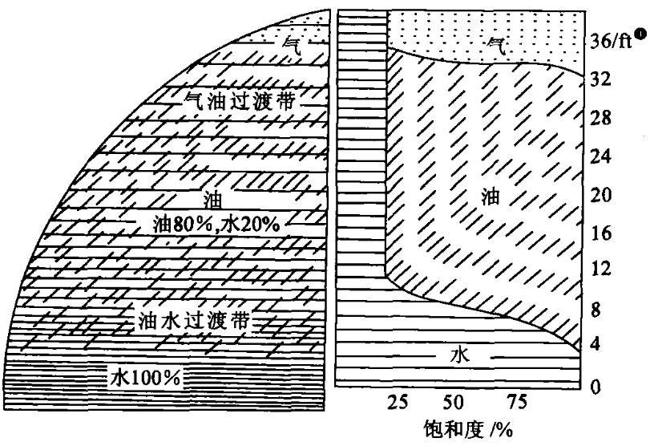

图 2-1 典型油气藏中油气水分布的结构剖面图

(转引自陈荣书, 1994)

<!-- Media -->

由于石油和天然气是以不同结构的烃类并以不同的比例混合在一起的, 因而不同地区的石油和天然气物理、化学性质有很大的差别。加之其在地壳内部还受周围理化条件的影响和作用, 组分不断受到改造, 这就更增加了其理化性质的复杂性。也就是说, 石油和天然气的化学组成和物理性质具有不确定性, 具体到不同地区、同一地区不同来源的石油和天然气, 其化学组成和物理性质是存在差别的。需要明确的是, 尽管石油和天然气没有确定的化学组成和物理常数, 但它们具有相对一致的化学组成和物理常数范围。这也是进行讨论的意义所在。

## 第一节 石 油

石油是存在于地下岩石孔隙中的以液态烃为主体的可燃有机矿产, 石油又称原油。地下油气藏中的石油是由气态、液态及固态烃类及其衍生物混合而成的, 在成分和相态上均表现为极其复杂的混合物。在成分上以烃类为主, 含有数量不等的非烃化合物及多种微量元素；在相态上以液态为主, 溶有大量烃气及少量非烃气和数量不等的固态烃类及非烃类物质。实际上, 在不同油气藏中组成石油的各种成分和相态的比例也是因地而异的。因此, 石油没有确定的化学成分和物理常数。

## 一、石油的化学组成

石油的化学组成可以从组成石油的元素、化合物、馏分和组分加以认识, 必须明确这是从不同侧面去认识同一问题。

## (一) 石油的元素组成

由于石油没有确定的化学成分, 因而也就没有确定的元素组成。但其元素组成还是有一定的变化范围。

石油的元素组成主要是碳(C)和氢(H),其次是硫(S)、氮(N)、氧(O)。世界上大多数石油的元素组成一般为: 碳含量介于 ${80}\%  \sim  {88}\%$ 之间,氢含量占 ${10}\%  \sim  {14}\%$ , 硫、氮、氧总量在 ${0.3}\%  \sim  7\%$ 之间变化,一般低于 $2\%  \sim  3\%$ ,个别石油含硫量可高达 ${10}\%$ 。世界各地原油的元素组成尽管千差万别,但均以碳、氢两种元素占绝对优势,一般在 ${95}\%  \sim  {99}\%$ 之间。碳、氢元素重量比介于 ${5.7} \sim  {7.7}$ 之间,平均值约为 6.5 。原子比的平均值约为0.57(或 $1 : {1.8}$ )。

石油中硫含量, 据蒂索 (B. P. Tissot, 1978) 等对 9347 个样品的统计, 平均为 ${0.65}\%$ (重量),其频率分布具双峰型 (图 2-2),多数样品 (约 7500 个) 的含硫量小于 $1\%$ ,少数样品 $\left( {{1800}\text{个}}\right)$ 的含硫量大于 $1\% ,1\%$ 处为两峰的交叉点。根据含硫量可把原油分为高硫原油(含硫量大于 $1\%$ )和低硫原油(含硫量小于 $1\%$ )。原油中的硫主要来自有机物的蛋白质和围岩的含硫酸盐矿物如石膏等, 故产于海相环境的石油较形成于陆相环境的石油含硫量高。由于硫具有腐蚀性, 因此含硫量的高低关系到石油的品质。含硫量变化范围很大, 从万分之几到百分之几。

<!-- Media -->

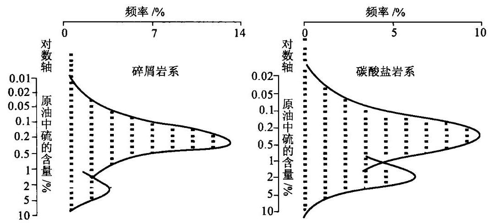

图 2-2 不同时代和成因的 9347 个石油样品中含硫分布

(据 Tissot & Welte, 1978)

<!-- Media -->

石油中含氮量在 ${0.1}\%  \sim  {1.7}\%$ 之间,平均值 ${0.094}\%$ 。 ${90}\%$ 以上的原油含氮量小于 ${0.2}\%$ ,最高可达 ${1.7}\%$ (美国文图拉盆地的石油),通常以 ${0.25}\%$ 作为贫氮和富氮石油的界限。

石油的含氧量在 ${0.1}\%  \sim  {4.5}\%$ 之间,主要与其氧化变质程度有关。

石油的元素组成, 不同研究者的估算值不甚一致。通常碳、氢两元素主要赋存在烃类化合物中, 是石油的主体, 而硫、氮、氧元素组成的化合物大多富集在渣油或胶质和沥青质中。

除上述 5 种主要元素之外, 还从原油灰分 (石油燃烧后的残渣) 中发现有 50 多种元素。这些元素虽然种类繁多, 但总量仅占石油重量的十万分之几到万分之几, 在石油中属微量元素。石油中的微量元素, 以钒、镍两种元素含量高、分布普遍, 且由于其与石油成因有关联,故最为石油地质学家重视。 $\mathrm{V}/\mathrm{{Ni}}$ 比值可作为区分是来自海相环境还是陆相环境沉积物的标志之一。一般认为 $\mathrm{V}/\mathrm{{Ni}} &gt; 1$ 是来自海相环境, $\mathrm{V}/\mathrm{{Ni}} &lt; 1$ 是来自陆相环境。

## (二) 石油的化合物组成

概要地说, 组成石油的化合物多是有机化合物, 作为杂质混入的无机化合物不多, 含量甚微, 可以忽略不计。组成石油的 5 种主要元素构成的化合物是一个庞大的家族——有机化合物。现今从全世界经过分析的不同原油中分离出来的有机化合物有近 500 种, 还不包括有机金属化合物。其中约 200 种为非烃, 其余为烃类。原油的大半部分是由 150 种烃类组成。石油的化合物组成, 归纳起来可以分为烃类和非烃类化合物两大类, 其中烃类化合物是主要的,这与元素组成以 $\mathrm{C}\text{、}\mathrm{H}$ 占绝对优势相一致。

1. 烃类化合物

在化学上, 烃类可以分为两大类: 饱和烃和不饱和烃。

## (1)饱和烃

在石油中饱和烃在数量上占大多数,一般占石油所有组分的 ${50}\%  \sim  {60}\%$ 。可细分为正构烷烃、异构烷烃和环烷烃。

正构烷烃平均占石油体积的 ${15}\%  \sim  {20}\%$ ,轻质原油可达 ${30}\%$ 以上,而重质原油可小于 ${15}\%$ 。石油中已鉴定出的正烷烃为 ${\mathrm{C}}_{1} - {\mathrm{C}}_{45}$ ,个别报道曾提及见有 ${\mathrm{C}}_{60}$ 的正烷烃,但石油大部分正烷烃碳数 $\leq  {\mathrm{C}}_{35}$ 。在常温常压下,正烷烃 ${\mathrm{C}}_{1} - {\mathrm{C}}_{4}$ 为气态, ${\mathrm{C}}_{5} - {\mathrm{C}}_{15}$ 为液态, ${\mathrm{C}}_{16}$ 以上为固态 (天然石蜡)。

不同类型原油的正构烷烃分布情况如图 2-3 所示。由图可见, 尽管正构烷烃的分布曲线形态各异, 但均呈一条连续的曲线, 且奇碳数与偶碳数烃的含量总数近于相等。根据主峰碳数的位置和形态,可将正烷烃分布曲线分为三种基本类型: ① 主峰碳小于 ${\mathrm{C}}_{15}$ ,且主峰区较窄; ②主峰碳大于 ${\mathrm{C}}_{25}$ ,主峰区较宽; ③主峰区在 ${\mathrm{C}}_{15} - {\mathrm{C}}_{25}$ 之间,主峰区宽。上述正烷烃的分布特点与成油原始有机质、成油环境和成熟度有密切关系, 因而常用于石油的成因研究和油源对比。

石油中带支链(侧链)的异构烷烃以 $\leq  {\mathrm{C}}_{10}$ 为主,常见于 ${\mathrm{C}}_{6} - {\mathrm{C}}_{8}$ 中; ${\mathrm{C}}_{11} - {\mathrm{C}}_{25}$ 较少, 且以异戊间二烯型烷烃最重要。石油中的异戊间二烯型烷烃 (图 2-4), 一般被认为是从叶绿素的侧链——植醇演化而来, 因而它是石油为生物成因的标志化合物。这种异构烷烃的特点是每四个碳原子带有一个甲基支链。现已从石油中分离出多种异戊间二烯型烷烃化合物,其总量达石油的 ${0.5}\%$ 。其中研究和应用较多的是 $2,6,{10},{14} -$ 四甲基十五烷 (姥鲛烷) 和 $2,6,{10},{14} -$ 四甲基十六烷 (植烷)。研究表明,同一来源的石油,各种异戊二烯型化合物极为相似, 因而常用之作为油源对比的标志。

<!-- Media -->

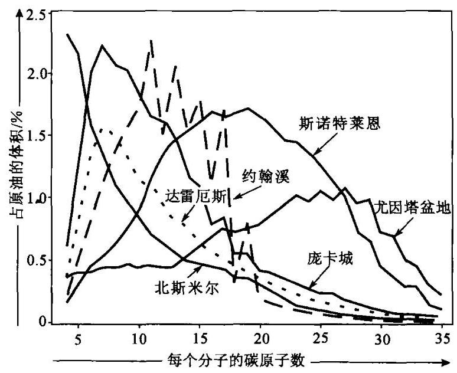

图 2-3 不同类型石油的正构烷烃分布曲线图

(据 Martin, 1963)

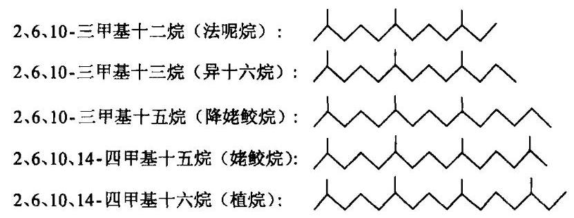

图 2-4 类异戊间二烯型烷烃同系物立体化学结构图

<!-- Media -->

环烷烃在石油中所占的比例为 ${20}\%  \sim  {40}\%$ ,平均 ${30}\%$ 左右。低分子量 $\left( { \leq  {\mathrm{C}}_{10}}\right)$ 的环烷烃,尤以环戊烷 $\left( {\mathrm{C}}_{5}\right.$ - 五员环) 和环己烷 $\left( {\mathrm{C}}_{6}\right.$ 一六员环) 及其衍生物是石油的重要组成部分,且一般环己烷多于环戊烷。中等到大分子量 $\left( {{\mathrm{C}}_{10} - {\mathrm{C}}_{35}}\right)$ 的环烷烃可以是单环到六环。石油中环烷烃以单环和双环为主,占石油中环烷烃的 ${50}\%  \sim  {55}\%$ ,三环约占 ${20}\%$ , 四环以上占 25% 左右。在石油中多环环烷烃的含量随成熟度增加而减少, 故高成熟原油中 $1 \sim  2$ 环的环烷烃显著增多。

在常温常压下,环丙烷 $\left( {{\mathrm{C}}_{3}{\mathrm{H}}_{6}}\right)$ 和甲基环丙烷 $\left( {{\mathrm{C}}_{4}{\mathrm{H}}_{8}}\right)$ 为气态,除此之外所有其他单环环烷烃均为液态,两环以上 $\left( { &gt; {\mathrm{C}}_{11}}\right)$ 的环烷烃为固态。

## (2) 不饱和烃

石油中的不饱和烃主要是芳香烃和环烷芳香烃,平均占原油重量的 ${20}\%  \sim  {45}\%$ 。此外原油中偶可见有直链烯烃。烯烃及不饱和环烃, 因其极不稳定, 故很少见。

石油中已鉴定出的芳香烃, 根据其结构不同可以分为单环、多环和稠环三类, 而每个类型的主要分子常常不是母体, 而是烷基衍生物。

单环芳烃包括苯、甲苯、二甲苯等。

多环芳烃有联苯、三苯甲烷等。

稠环芳烃包括萘 (二环稠合), 蒽和菲 (三环稠合) 以及苯并蒽和屈 (四环稠合)。

芳香烃在石油中以苯、萘、菲三种化合物含量最多, 其主要分子也常常以烷基的衍生物出现。如前者通常出现的主要是甲苯, 而不是苯。

环烷芳香烃包含一个或几个缩合芳环, 并与饱和环及链烷基稠合在一起。石油中最丰富的环烷芳香烃是两环(一个芳环和一个饱和环)构成的茚满和萘满以及它们的甲基衍生物。而最重要的是四环和五环的环烷芳烃, 其含量及分布特征常用于石油的成因研究和油源对比。因为它们大多与甾族和萜族化合物有关 (芳构化), 而甾族和萜族化合物是典型的生物成因标志化合物。

2. 非烃化合物

石油中的非烃化合物是指除 $\mathrm{C}\text{、}\mathrm{H}$ 两种主要元素外,还含有硫或氮或氧,抑或金属原子 (主要是钒和镍) 的一大类化合物。石油中这些元素的含量不多, 但含这些元素的化合物却不少, 有时可达石油重量的 30%。其中又主要是含硫、氮、氧的化合物。

(1) 含硫化合物

硫是碳和氢之后的第三个重要元素, 含硫的化合物也最为多见。目前石油中已鉴定出的含硫化合物将近 100 种, 多呈硫醇、硫醚、硫化物和噻吩(以含硫的杂环化合物形式存在), 在重质石油中含量较为丰富。

石油中所含的硫是一种有害的杂质,因为它容易产生硫化氢 $\left( {{\mathrm{H}}_{2}\mathrm{\;S}}\right)$ 、硫化铁(FeS)、 亚硫酸 $\left( {{\mathrm{H}}_{2}{\mathrm{{SO}}}_{3}}\right)$ 或硫酸 $\left( {{\mathrm{H}}_{2}{\mathrm{{SO}}}_{4}}\right)$ 等化合物,对机器、管道、油罐、炼塔等金属设备造成严重腐蚀, 所以含硫量常作为评价石油质量的一项重要指标。

通常将含硫量大于 $2\%$ 的石油称为高硫石油; 低于 ${0.5}\%$ 的称为低硫石油; 介于 ${0.5}\%  \sim  2\%$ 之间的称为含硫石油。一般含硫量较高的石油多产自碳酸盐岩系和膏盐岩系含油层, 而产自砂岩的石油则含硫较少。我国原油多属低硫石油(如大庆、任丘、大港、 克拉玛依油田) 和含硫石油 (如胜利油田)。原苏联伊申巴石油含硫量高达 ${2.25}\%  \sim  7\%$ , 其他如墨西哥、委内瑞拉和中东的石油含硫量也较高。

## (2) 含氮化合物

石油中含氮化合物较为少见,平均含量小于 ${0.1}\%$ 。目前从石油中分离出来的含氮化合物有 30 多种, 主要是以含氮杂环化合物形式存在。可将其分为两组, 一组为碱性化合物, 有吡啶、喹啉、异喹啉、吖啶及其同系物; 另一组为非碱性化合物, 有卟啉、吲哚、 咔唑及其同系物, 其中以含钒和镍的金属卟啉化合物最为重要。

原油中的卟啉化合物首先是由特雷勃斯 (C. Treibs, 1934) 发现的。包括初卟啉和脱氧玫红初卟啉, 并提出石油中的卟啉是由植物的叶绿素和动物的氯化血红素转化而来。这个发现为石油有机成因说提供了有力的证据, 引起了广泛的注意和重视。目前对卟啉的研究已逐步深入并发现了多种类型。卟啉是以四个吡咯核为基本结构, 由 4 个次甲基 $\left( {-\mathrm{{CH}} = }\right)$ 桥键联结的含氮化合物,又称器族化合物。在石油中卟啉常与钒、镍等金属元素形成络合物, 因而又称为有机金属化 (络) 合物, 其基本结构与叶绿素结构极为相似 (图 2-5)。

<!-- Media -->

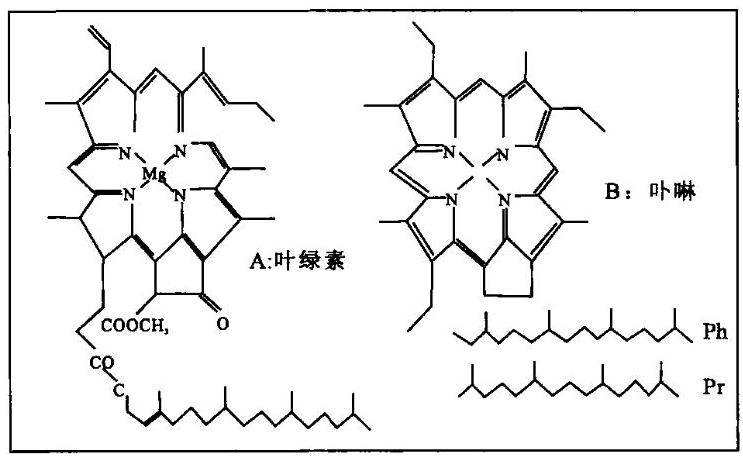

图 2-5 叶绿素(A)与原油中的卟啉(B)、植烷(Ph)、姥鲛烷(Pr)结构比较图

(据 G. D. Hobson 等, 1981)

<!-- Media -->

但是, 并不是所有原油中都含有卟啉, 有相当一部分原油中不含或仅含痕量。一般中新生代地层中形成的原油含卟啉较多, 而古生代地层中石油含卟啉甚低或不含。这可能与卟啉的稳定性差有关。在高温 $\left( { &gt; {250}^{ \circ  }\mathrm{C}}\right)$ 或氧化条件下,卟啉将发生开环裂解而遭破坏。

此外, 原油中的卟啉类型还与沉积环境有密切关系, 海相石油富含钒卟啉, 而陆相石油富含镍卟啉。

(3)含氧化合物

石油中含氧化合物已鉴定出 50 多种, 包括有机酸、酚和酮类化合物。其中主要是与酸官能团(-COOH)有关的有机酸,有 ${\mathrm{C}}_{2\infty {24}}$ 的脂肪酸, ${\mathrm{C}}_{5\infty {10}}$ 的环烷酸, ${\mathrm{C}}_{{10}\infty {15}}$ 的类异戊二烯酸。石油中的有机酸和酚(酸性) 统称石油酸, 其中以环烷酸最多, 占石油酸的 ${95}\%$ ,主要是五员酸和六员酸。几乎所有石油中都含有环烷酸,但含量变化较大,在 ${0.03}\%  \sim  {1.9}\%$ 之间。环烷酸易与碱金属作用生成环烷酸盐,环烷酸盐又特别易溶于水。 因此地下水中环烷酸盐的存在是找油的标志之一。

## (三) 石油的馏分组成

石油是若干种烃类和非烃有机化合物的混合物, 每种化合物都有自己的沸点和凝点。 石油的馏分就是利用组成石油的化合物各自具有不同沸点的特性, 通过对原油加热蒸馏, 将石油分割成不同沸点范围的若干部分, 每一部分就是一个馏分。分割所用的温度区间 (馏程) 不同, 馏分就有所差异 (表 2-1)。

<!-- Media -->

表 2-1 石油的馏分组成

<table><thead><tr><th rowspan="2">馏分</th><th colspan="2">轻馏分 (低沸馏分)</th><th colspan="3">中馏分(中沸馏分)</th><th colspan="2">重馏分 (高沸馏分)</th></tr><tr><th>石油气</th><th>汽油</th><th>煤油</th><th>柴油</th><th>重质瓦斯油</th><th>润滑油</th><th>渣油</th></tr></thead><tr><td>温度 ℃</td><td>$< {35}$</td><td>${35} \sim  {190}$</td><td>190 ~ 260</td><td>260 ~ 320</td><td>320 ~ 360</td><td>${360} \sim  {530}$</td><td>$> {530}$</td></tr></table>

<!-- Media -->

据亨特对美国一种相对密度为 ${35}^{ \circ  }{API}\nabla \left( {{0.85}\mathrm{\;g}/{\mathrm{{cm}}}^{3}}\right)$ 的环烷型原油所做的分析结果, 以脱气后各馏分总和计算, 各馏分的体积百分比为: 汽油 ${27}\%$ ,煤油 ${13}\%$ ,柴油 ${12}\%$ ,重质瓦斯油 ${10}\%$ ,润滑油 ${20}\%$ ,渣油 ${18}\%$ 。其与化合物组成的关系如图 2-6 所示。

---

<!-- Footnote -->

● ${API}$ 是 America Petroleum Institute(美国石油学会)的缩写,此处表示欧美国家常用的一种相对密度单位。

<!-- Footnote -->

---

<!-- Media -->

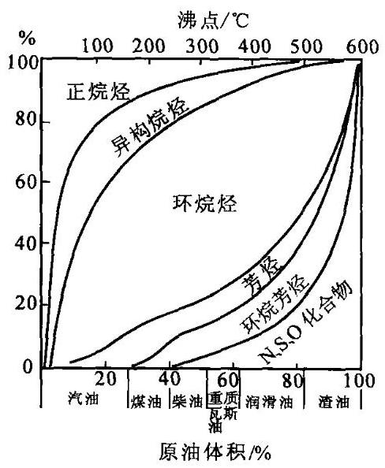

图 2-6 相对密度为 ${35}^{ \circ  }{API}$ 的环烷型石油的馏分与化合物组成的关系图 ( 据 J. M. Hunt, 1979)

<!-- Media -->

通常石油的炼制过程可以看作就是对石油的分馏, 馏程的控制是根据原油的品质及对油品质量的具体要求来确定的。现代炼油工业为了提高石油中轻馏分的产量和提高产品质量, 除了采用直馏法外, 还采用催化热裂化、加氢裂化、热裂解、石油的铂重整等一系列技术措施。例如在常压下分馏出的汽油只占原油的 ${15}\%  \sim  {20}\%$ ,在采用催化热裂化后,可使汽油的产量提高到 ${50}\%  \sim  {80}\%$ ,以满足各方面以汽油作能源燃料的需求。

## (四) 石油的组分组成

石油组分分析是过去在石油研究中曾广泛使用的一种方法。它是利用有机溶剂和吸附剂对组成石油的化合物具有选择性溶解和吸附的性能, 选用不同有机溶剂和吸附剂, 将原油分成若干部分, 每一部分就是一个组分。

一般在作组分分析之前,先对原油进行分馏,去掉低于 ${210}^{ \circ  }\mathrm{C}$ 的轻馏分,切取 $&gt; {210}^{ \circ  }\mathrm{C}$ 的馏分进行组分分析 (图 2-7)。凡能溶于氯仿和四氯化碳的组分称为油质,它们是石油中极性最弱的部分, 其成分主要是饱和烃和一部分低分子芳烃。溶于苯的组分称为苯胶质,其成分主要是芳烃和一些具有芳环结构的含杂元素的化合物 (主要为含 $\mathrm{S}\text{、}\mathrm{\;N}$ 、 0 的多环芳烃)。用酒精和苯的混合液 (或其他极性更强的如甲醇、丙酮等) 作溶剂, 可以得到酒精 - 苯胶质 (或其他相应组分), 此类胶质的成分主要是含杂元素的非烃化合物。用石油醚分离, 溶于石油醚的部分是油质和胶质。其中能被硅胶吸附的部分是胶质; 不被硅胶吸附的部分是油质; 剩下不溶于石油醚的组分 (但可溶于苯、二硫化碳和三氯甲烷等中性有机溶剂, 呈胶体溶液, 可被硅胶吸附)为沥青质; 后者是渣油的主要组分, 其主要成分是结构复杂的大分子非烃化合物。

显然, 石油的组分组成是一个比较模糊的概念, 特别是胶质和沥青质, 在石油地质学中使用频率较高, 使用上也不是很严谨。胶质和沥青质是一些分子量较大的复杂化合物的混合体。胶质的视分子量约在 ${300} \sim  {1200}$ ; 沥青的视分子量多大于 10000,可能达到甚至于超过 50000,其直径平均为 ${40} \sim  {50}\mathrm{\;{nm}}$ 。胶质和沥青质占原油的 $0 \sim  {40}\%$ ,平均为 ${20}\%$ 。 胶质和沥青质可能主要是由多环芳核或环烷 - 芳核和杂原子链如含 $\mathrm{S}\text{、}\mathrm{\;N}\text{、}\mathrm{O}$ 等的化合物组成, 其平均元素组成如表 2-2 所示, 大量分布于未成熟以及经过生物降解和变质的原油中, 尤其在天然沥青矿物或沥青砂岩中更为多见。

石油的组分在石油的成因演化研究和原油品质评价中经常涉及。

<!-- Media -->

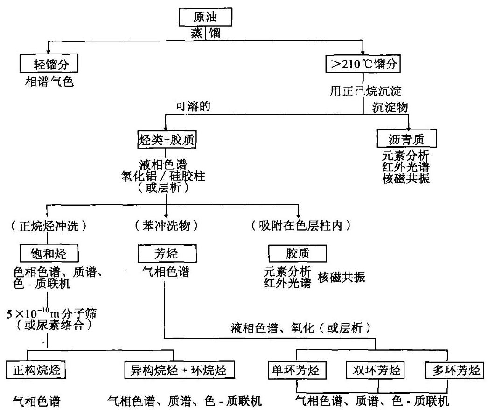

图 2-7 原油组分分析流程图

表 2-2 胶质和沥青质的平均元素组成

<table><thead><tr><th/><th colspan="3">重量百分比/%</th><th rowspan="2">$\mathrm{H}/\mathrm{C}$ 原子比</th></tr><tr><th/><th>$\mathrm{H}$</th><th>C</th><th>$\mathrm{S} + \mathrm{N} + \mathrm{O}$</th></tr></thead><tr><td>胶质</td><td>84.0</td><td>9.2</td><td>6.8</td><td>1. 30</td></tr><tr><td>沥青质</td><td>85.0</td><td>8. 1</td><td>7.3</td><td>1.14</td></tr></table>

<!-- Media -->

## 二、石油的分类

## (一) 分类原则和方法

石油的分类常因用途不同而采用的参数各异。石油化学家侧重于各馏分含量及其化学组成和物理性质, 地球化学家和地质学家则注意原油组成与生油岩及其演化作用的关系。后者有代表性的分类方案是 Tissot 和 Welte (1978) 提出的, 该分类主要依据石油中各种结构类型烃类化合物: 烷烃 (石蜡)、环烷烃、芳香烃和含硫、氮、氧化合物 (胶质和沥青质) 的含量, 也考虑硫的含量。

## (二) Tissot 和 Welte 的石油分类

目前石油地质学上较为流行的是蒂索和威尔特 (1978) 提出的分类。下面对该分类作一简单介绍。

该分类主要是依据原油中各烃类的含量比例关系, 以烷烃 (石蜡), 环烷烃, 芳烃 $+ \mathrm{S}\text{、}\mathrm{\;N}\text{、}\mathrm{O}$ 化合物三个参数作为三个端员, 采用三角图解来划分原油类型。注意该方案中所用参数是原油中沸点 $&gt; {210}^{ \circ  }\mathrm{C}$ 馏分的分析数据。

<!-- Media -->

图 2-8 636 个正常的和重质降解原油样品中饱和烃的分布

(据 B. P. Tissot 等, 1978)

<!-- Media -->

该方案是考虑到饱和烃含量对于石油性质有重大影响,且饱和烃分布在 ${50}\%$ 处为两个众数的最小值, 可以明显地将芳香型原油与石蜡型 - 环烷型原油分开 (图 2-8)。因此,以饱和烃含量 ${50}\%$ 为界将三角图分为两大部分。在饱和烃含量 $&gt; {50}\%$ 的区域内,再根据石蜡烃和环烷烃的相对含量, 即在石蜡烃含量 ${50}\% \text{、}{40}\%$ 处建立次一级分类界线, 将饱和烃 $&gt; {50}\%$ 区域分为三种基本类型,即石蜡型、环烷型和石蜡 - 环烷型。

在芳烃 $+ \mathrm{S}\text{、}\mathrm{\;N}\text{、}\mathrm{O}$ 化合物 $&gt; {50}\%$ 的区域内,以石蜡烃含量 ${10}\%$ 建立分类界线,将石蜡烃含量 $&gt; {10}\%$ 的区域作为芳香 - 中间型原油; 而石蜡烃 $&lt; {10}\%$ 的区域为重质降解原油。 在重质降解原油中又以环烷烃含量 ${25}\%$ 建立分类界线,将环烷烃含量 $&gt; {25}\%$ 的称为芳香 - 环烷型; 而 $&lt; {25}\%$ 者称为芳香 - 沥青型。根据上述原则,可将石油分为六种类型,各类石油在三角图中的位置及分类参数如图 2-9 和表 2-3 所示。

<!-- Media -->

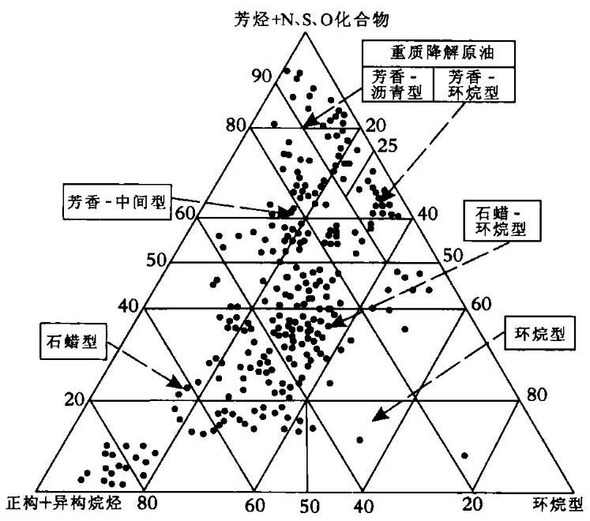

图 2-9 541 个油田中 6 种石油类型的三角图解

(据 B. P. Tissot 等, 1978)

表 2-3 石油的分类表

<table><thead><tr><th colspan="3">在 $> {210}^{ \circ  }\mathrm{C}$ 石油馏分中的浓度</th><th>石油类型</th><th>石油中硫的含量 (近似值)</th><th>每一类样品的数目</th></tr></thead><tr><td rowspan="3">$S > {50}\%$ AA < 50%</td><td colspan="2">$P > N$ 且 $P > {40}\%$</td><td>石蜡型石油</td><td rowspan="3">< 1%</td><td>100</td></tr><tr><td colspan="2">$P \leq  {40}\%$ 且 $N \leq  {40}\%$</td><td>石蜡 - 环烷型石油</td><td>217</td></tr><tr><td colspan="2">$N > P$ 且 $N \geq  {40}\%$</td><td>环烷型石油</td><td>21</td></tr><tr><td rowspan="3">$S \leq  {50}\%$ , ${AA} \geq  {50}\%$</td><td colspan="2">$P > {10}\%$</td><td>芳香 - 中间型石油</td><td rowspan="2">$> 1\%$</td><td>126</td></tr><tr><td rowspan="2">$P \leq  {10}\%$</td><td>$N \leq  {25}\%$</td><td>芳香 - 沥青型石油</td><td>41</td></tr><tr><td>$N \geq  {25}\%$</td><td>芳香 - 环烷型石油</td><td>一般 $< 1\%$</td><td>36</td></tr></table>

(据 B. P. Tissot 等, 1978)

注: $S =$ 饱和烃; ${AA} =$ 芳香烃 + 胶质 + 沥青质; $P =$ 石蜡烃; $N =$ 环烷烃; 样品总数 $= {541}$ 。

<!-- Media -->

## 三、海陆相石油的基本区别

海陆相石油的特征有着明显的区别, 主要表现在以下几个方面: 石油类型、含蜡量、 含硫量、钒和镍的含量与比值、碳稳定同位素的分布 (表 2-4)。

<!-- Media -->

表 2-4 海相与陆相石油的基本区别表

<table><thead><tr><th>环 境 区 别</th><th>海相石油</th><th>陆相石油</th></tr></thead><tr><td>石油类型</td><td>芳香 - 中间型、石蜡 - 环烷型</td><td>石蜡型为主、少石蜡 - 环烷型</td></tr><tr><td>含蜡量</td><td>低, $< 5\%$ ,一般 ${0.5}\%  \sim  3\%$</td><td>高, $> 5\%$ ,一般 ${10}\%  \sim  {30}\%$</td></tr><tr><td>含硫量</td><td>高, $S > 1\%$</td><td>低, $S < 1\%$</td></tr><tr><td>V/Ni</td><td>$\mathrm{V}/\mathrm{{Ni}} > 1$</td><td>V/Ni < 1</td></tr><tr><td>碳稳定同位素 ${\delta }^{13}\mathrm{C}$</td><td>${\delta }^{13}\mathrm{C} >  - {27}\%$ 。</td><td>${\delta }^{13}\mathrm{C} <  - {29}\%$ 。</td></tr></table>

<!-- Media -->

## (一) 石油类型

海相石油以芳香 - 中间型和石蜡 - 环烷型为主,饱和烃占石油的 ${25}\%  \sim  {70}\%$ ,芳烃占总烃的 ${25}\%  \sim  {60}\%$ 。陆相石油以石蜡型为主,部分为石蜡 - 环烷型,饱和烃占石油的 ${60}\%  \sim  {90}\%$ ,芳烃占总烃的 ${10}\%  \sim  {20}\%$ 。海陆相石油在石油分类三角图上的分布如图 2-10所示。

## (二) 含蜡量

含蜡量高是陆相石油的基本特征之一。世界上高蜡石油都产于陆相环境中 (图 2-10)。根据我国陆相石油的分析资料,含蜡量普遍大于 $5\%$ ,一般为 ${10}\%  \sim  {30}\%$ , 个别可达 ${40}\%$ 以上,而海相石油含蜡量均小于 $5\%$ ,一般仅为 ${0.5}\%  \sim  3\%$ 。

<!-- Media -->

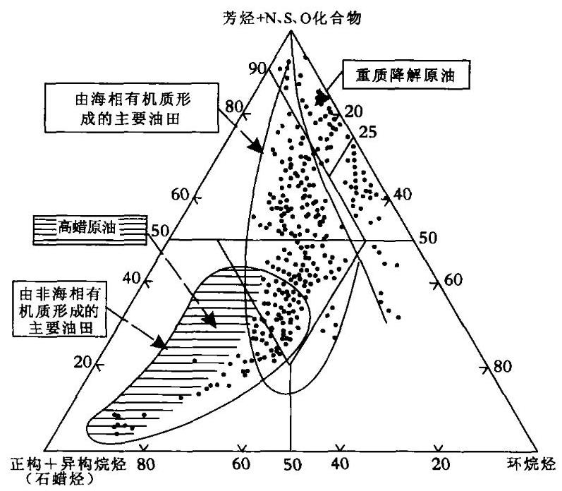

图 2-10 石油组分三角图, 表明海、陆相石油产出部位

(据 B. P. Tissot 等, 1978)

<!-- Media -->

## (三) 含硫量

海相石油一般为高硫石油, 而陆相石油一般为低硫石油。含硫量主要与蒸发盐或碳酸盐母岩的沉积环境 (主要是盐度) 有关。因此个别盐湖或湖相蒸发岩系中的石油, 也可以是高硫石油。高、低硫石油与海陆相环境的关系, 可见图 2-11, 并与图 2-10 中海陆相石油的分布部位相对应。 (四) 微量元素钒、镍的含量和比值

<!-- Media -->

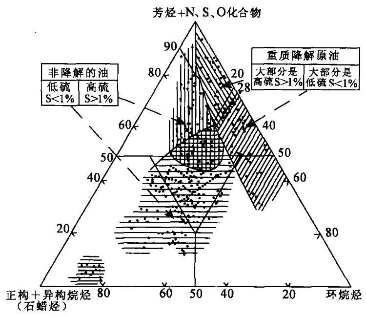

图 2-11 高硫、低硫石油在分类三角图解上的分布图

(据 B. P. Tissot 等, 1978)

<!-- Media -->

石油中钒、镍的含量和比值也是海陆相石油的区别之一。海相石油中钒、镍含量高, 且 $\mathrm{V}/\mathrm{{Ni}} &gt; 1$ ; 而陆相石油中钒、镍含量较低,且 $\mathrm{V}/\mathrm{{Ni}} &lt; 1$ 。此外,钒、镍主要存在于卟啉类化合物中, 海相石油富含钒卟啉, 而陆相石油富含镍卟啉。

## (五) 碳稳定同位素分布

海陆相石油的碳稳定同位素组成也有明显差别。据廖永胜 (1982) 统计, 第三系海相石油的 ${\delta }^{13}\mathrm{C}$ 值一般大于 $- {27}\% o$ ,而陆相石油的 ${\delta }^{13}\mathrm{C}$ 值一般小于 $- {29}\% o$ 。不同时代海、 陆相石油的 ${\delta }^{13}\mathrm{C}$ 值可有一定幅度的变化,但两者的差别仍是存在的。

## 四、石油的物理性质

石油的化学成分将决定它的物理性质和经济价值, 而石油没有固定的成分, 因此也就没有固定的物理常数。但通过对分布广泛的石油大量相关数据资料的分析整理, 能归纳出反映石油总体特征的物理性质或相关物理性质的变化范围。了解这些性质对认识石油、进行石油地质研究和评价石油品质及经济价值是有益的。

## (一) 颜色

在透射光下石油的颜色可以呈淡黄、褐黄、深褐、淡红、棕色、黑绿色及黑色等。原油颜色的深浅主要取决于胶质、沥青质的含量, 其含量愈高, 则颜色愈深。

## (二) 相对密度和密度

石油的相对密度,在我国和前苏联是指在 ${10}^{5}\mathrm{\;{Pa}}$ 下, ${20}^{ \circ  }\mathrm{C}$ 石油与 ${4}^{ \circ  }\mathrm{C}$ 纯水的密度比值, 用 ${d}_{4}^{20}$ 表示。欧美各国则是用 ${10}^{5}\mathrm{\;{Pa}}$ 下, ${60}^{ \circ  }\mathrm{F}\left( {{15.55}^{ \circ  }\mathrm{C}}\right)$ 石油与 ${4}^{ \circ  }\mathrm{C}$ 纯水的密度之比,通常称之为 ${API}$ 度。在国际石油贸易中常以 ${API}$ 度为单位。 ${API}$ 度与 ${60}^{ \circ  }\mathrm{F}$ 石油相对密度的关系可用下式换算:

$$
{API} = \frac{141.5}{{60}^{ \circ  }\mathrm{F}\text{ 时相对密度 }} - {131.5} \tag{2 - 1}
$$

石油的相对密度一般介于 ${0.75} \sim  {0.98}$ 之间。通常把相对密度大于 0.9 的称为重质石油, 小于 0.9 的称为轻质石油。世界各国的原油大多为轻质石油; 重质石油居次要地位。 相对密度最大的可达 1.0 以上, 这种石油用一般方法难以开采。

石油的相对密度主要取决于化学组成。就烃类而言, 相对密度随碳数增加而增大, 碳数相同的烃类, 烷烃相对密度小些, 环烷烃居中, 芳烃相对密度较大。与胶质、沥青质相比, 烃类较之为小。

密度是单位体积物质的质量。密度单位一般用 $\mathrm{g}/{\mathrm{{cm}}}^{3}$ 。石油的密度与其本身的成分和体积变化相关。液体石油的体积,在常压下随温度升高而增大。温度每增加 ${1}^{ \circ  }\mathrm{F}$ ,单位体积所增加的体积数称为膨胀系数。它不是一个固定的常数, 而是随相对密度的减小而增大 (表 2-5)。压力对石油的体积也有影响, 随压力增大体积将因被压缩而减小。压力每增加 ${10}^{5}\mathrm{\;{Pa}}$ ,单位体积被压缩的体积数称为压缩系数。压缩系数也不是一个常数。

<!-- Media -->

表 2-5 不同相对密度的石油的膨胀系数

<table><thead><tr><th>相对密度</th><th>${API}$ 度</th><th>平均膨胀系数 (体积/单位体积 ${1}^{ \circ  }\mathrm{F}$ )</th></tr></thead><tr><td>0.67</td><td>78</td><td>0.008</td></tr><tr><td>${0.67} \sim  {0.72}$</td><td>${78} \sim  {65}$</td><td>0.007</td></tr><tr><td>${0.72} \sim  {0.77}$</td><td>${64} \sim  {51}$</td><td>0.006</td></tr><tr><td>${0.78} \sim  {0.85}$</td><td>${50} \sim  {35}$</td><td>0.005</td></tr><tr><td>${0.85} \sim  {0.97}$</td><td>${34} \sim  {15}$</td><td>0.004</td></tr><tr><td>${0.97} \sim  {1.078}$</td><td>${14} \sim  0$</td><td/></tr></table>

(引自 H. S. 贝尔 “美国石油炼制”, 1945)

<!-- Media -->

显然, 温度和压力是影响石油体积的两个主要因素。原油是气、液、固三相物质的混合物, 以液态烃为主体的石油中含有不同数量的溶解气态烃、固态烃及非烃。实际上, 在地下油气藏中, 温度和压力不仅影响石油的体积, 而且还影响到石油本身的物质组成, 从而影响其质量。一方面, 温度的增加有使溶解气逸出液态石油的趋势; 另一方面, 压力的增加, 将使原油中溶解气量增加。在地下油气藏中, 温、压同时增加时, 压力增加使溶解气增加的效应远大于温度增加使溶解气逸出的效应; 与此同时, 溶解气量增加引起体积增加的效应, 远远超过随压力增加而使体积减小的效应。因此出现压力增加时石油体积不是缩小而是增大, 直至达到饱和压力为止 (图 2-12)。

<!-- Media -->

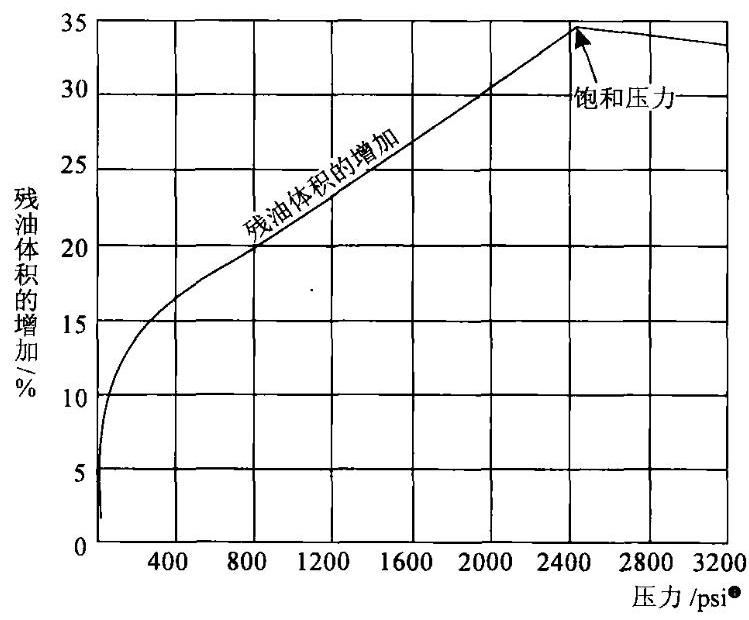

图 2-12 在有气顶条件下, 石油体积随压力增大而变化情况

( 据 A. I. Levorsen, 1954)

<!-- Media -->

由此可见, 地下石油的密度不仅与温度压力有关, 还与溶解气量有关, 且后者才是影响石油密度的本质因素。溶解气量增加则密度降低。地表和地下温、压条件不同, 不仅影响到石油的体积, 而且使其中的溶解气量有差异, 导致石油物质组成的差异, 实质上是改变了石油的质量。地下石油含有较多的溶解气, 是地下石油密度较地表石油密度低的根本原因。

## (三) 黏度

黏度是反映流体流动难易程度的一个物理参数。黏度值实质上是反映流体流动时分子之间相对运动所引起内摩擦力的大小。黏度大则流动性差, 反之则流动性好。石油黏度是制定石油开发方案、油井动态分析及石油储运时都必须考虑的重要参数。黏度分为动力黏度、运动黏度和相对黏度。

动力黏度又称绝对黏度。在国际计量单位 $\mathrm{{SI}}$ 制中,单位为帕斯卡·秒 $\left( {\mathrm{{Pa}} \cdot  \mathrm{s}}\right)$ 。其定义为: 流体通过长度(L)为 $1\mathrm{\;m}$ ,横截面积(F)为 $1{\mathrm{\;m}}^{2}$ ,渗透率(k)为 $1{\mathrm{\;m}}^{2}$ 的介质, 当压差 $\left( {\Delta p}\right)$ 为 $1\mathrm{\;{Pa}}$ ,流量(Q)为 $1{\mathrm{\;m}}^{3}/\mathrm{s}$ 时,流体的黏度 $\left( \mu \right)$ 为 $1\mathrm{\;{Pa}} \cdot  \mathrm{s}$ 。其表达式为:

$$
\mu  = \frac{k \cdot  F \cdot  {\Delta P}}{Q \cdot  L} \tag{2 - 2}
$$

$1\mathrm{\;{Pa}} \cdot  \mathrm{s}$ 相当于 $\mathrm{C} \cdot  \mathrm{G} \cdot  \mathrm{S}$ 制的 ${10}\mathrm{P}$ (泊), $1\mathrm{{mPa}} \cdot  \mathrm{s} = {10}^{-3}\mathrm{\;{Pa}} \cdot  \mathrm{s} = 1\mathrm{{cP}}$ (厘泊)。在 ${10}^{5}\mathrm{\;{Pa}},{20}^{ \circ  }\mathrm{C}$ 时,水的动力黏度为 $1\mathrm{{mP}} \cdot  \mathrm{s}$ 。不同温度下的动力黏度用 ${\eta }_{t}$ 表示。

动力黏度/密度,称为运动黏度。其单位为 ${\mathrm{m}}^{2}/\mathrm{s}$ ,称二次方米每秒。不同温度下的运动黏度用 ${V}_{t}$ 表示。

相对黏度又称恩氏黏度,是在恩氏黏度计中 ${200}\mathrm{\;{mL}}$ 原油与 ${20}^{ \circ  }\mathrm{C}$ 时同体积的蒸馏水流出时间之比。常用 ${E}_{t}$ 表示。根据实验室测定的 ${E}_{t}$ 值,可以通过查换算表获得运动黏度, 并计算出动力黏度。

石油地质学上通常所说的黏度多指动力黏度。石油黏度大小主要取决于其化学组成, 小分子的烷烃、环烷烃含量高, 黏度就低; 而石蜡、胶质、沥青质含量高, 黏度就高。

石油黏度随温度升高、溶解气量增加而降低。因此, 地下石油的黏度常低于地表。在地下 ${1500} \sim  {1700}\mathrm{\;m}$ 处,石油的黏度通常仅为地表的一半。如我国克拉玛依的原油,在地下温度为 ${50}^{ \circ  }\mathrm{C}$ 时, ${\eta }_{50} = {19.2}\mathrm{{mP}} \cdot  \mathrm{s}$ ,在地表为 ${20}^{ \circ  }\mathrm{C}$ 时, ${\eta }_{20} = {64.11}\mathrm{{mP}} \cdot  \mathrm{s}$ 。

## (四) 溶解性

石油能溶于多种有机溶剂, 如氯仿、四氯化碳、苯、醚等。石油是多种有机化合物的混合物, 实际上各种化合物都可以看作是有机溶剂, 也就是说, 各成分之间具有互溶性。 其中轻质组分对重质组分的溶解作用可能更明显些, 也更容易理解。有可能这种溶解作用正是重质组分得以实现运移的有效途径。

石油在水中的溶解度一般很低, 通常随分子量的增加很快变小, 但随不同烃类化学性质的差异而有很大的差别。其中芳烃的溶解度最大,可达 (数百到上千) $\times  {10}^{-6}$ ; 环烷烃次之,一般为 $\left( {{14} \sim  {50}}\right)  \times  {10}^{-6}$ ; 烷烃最低,仅(几个到几十个) $\times  {10}^{-6}$ 。在碳数相同时,一般芳香烃的溶解度大于链烷,如己烷、环己烷和苯分别为 ${9.5}\text{、}{60}$ 和 ${1750}\mathrm{{mg}}/\mathrm{L}$ , 差别是非常明显的。苯和甲苯是溶解度最大的液态烃。

当压力不变时, 烃在水中的溶解度随温度升高而变大。芳香烃更明显。但随含盐度和压力的增大而变小。当水中饱和 ${\mathrm{{CO}}}_{2}$ 和烃气时,石油的溶解度将明显增加。

## (五) 荧光性

石油在紫外光照射下可产生发荧光的特性称为荧光性。石油中只有不饱和烃及其衍生物具有荧光性。这是因为它们能吸收紫外光中波长较短、能量较高的光子, 随后放出波长较长而能量较低的光子, 产生荧光。饱和烃不发荧光。荧光性可能与存在双键有关。

荧光色随不饱和烃及含双键的非烃浓度和分子量增加而加深。芳烃呈天蓝色, 胶质为黄色, 沥青质为褐色。利用石油具有的荧光性, 可以用紫外灯鉴定岩石中微量石油和沥青类物质的存在。在有机溶剂中只要含有 ${10}^{-5}$ 沥青类物质即可被发现。

## (六) 旋光性

大多数石油都具有旋光性, 即石油能使偏振光的振动面旋转一定角度的性能。石油的旋光角一般是几分之一度到几度之间。绝大多数石油的旋光角是使偏振面向右旋移而成, 仅有少数为左旋。石油的旋光性主要与组成石油的化合物结构上存在不对称的甾、萜类生物成因标志化合物有关。因此旋光性可以作为石油有机成因的重要证据之一。

## 第二节 天 然 气

## 一、天然气的概念及产状

## (一) 天然气的概念

天然气是一种高效、高能、低污染的优质能源。所谓天然气, 从广义上理解, 是指自然界天然存在的一切气体。根据其存在的环境, 索柯洛夫 (B. A. CoKOIOB, 1971) 将天然气分为八类 (表 2-6): 大气、表层沉积物中气、沉积岩的气、海洋中的溶解气、变质岩中气、岩浆岩中气、地幔排出气和宇宙气等。

目前研究较为充分的是以沉积岩为主体的地壳上部岩石圈中的天然气, 特别是以烃类为主的气藏和油气藏中的天然气 (偶然发现的非烃气藏)。因此, 在《石油与天然气地质学》中研究的主要对象是岩石圈中以烃类为主的天然气, 是狭义的天然气。

## (二) 天然气的产状类型

沉积圈中的天然气, 依其存在的相态可以分为游离气、溶解气 (溶于油和水中)、吸附气和固体水溶气; 依其分布特点可以分为聚集型和分散型; 依其与石油产出的关系可以分为伴生气和非伴生气。

## 1. 聚集型天然气

游离气是常规气藏中天然气存在的基本形式。只有大规模的游离气聚集, 才能有效地开发利用。聚集型天然气可以是气藏气、气顶气和凝析气。

<!-- Media -->

表 2-6 天然气的分类

<table><thead><tr><th colspan="2">基本特征 气体类型 (按存在环境分类)</th><th>基本化学成分</th></tr></thead><tr><td>I. 大气</td><td/><td>${\mathrm{N}}_{2},{\mathrm{O}}_{2}$</td></tr><tr><td>II. 表层沉积物中气</td><td>a. 土壤及底土气 b. 沼泽及泥炭中气 c. 海底沉积中的气 d. 气水合物</td><td>${\mathrm{{CO}}}_{2},{\mathrm{\;N}}_{2},{\mathrm{O}}_{2}$ ${\mathrm{{CH}}}_{4},{\mathrm{{CO}}}_{2},{\mathrm{\;N}}_{2}$ ${\mathrm{{CO}}}_{2},{\mathrm{{CH}}}_{4},{\mathrm{\;N}}_{2}$ ${\mathrm{{CH}}}_{4}\left( {{\mathrm{C}}_{2}{\mathrm{H}}_{6},{\mathrm{C}}_{3}{\mathrm{H}}_{8}}\right)  \cdot  n{\mathrm{H}}_{2}\mathrm{O}$</td></tr><tr><td>III. 沉积岩的气</td><td>a. 油田气 b. 气田气 c. 煤油气 d. 分散吸附气 e. 地层水中的溶解气 (水溶气)</td><td>${\mathrm{{CH}}}_{4},{\mathrm{C}}_{2}{}^{ + },{\mathrm{N}}_{2},{\mathrm{{CO}}}_{2}$ ${\mathrm{{CH}}}_{4},{\mathrm{\;N}}_{2},{\mathrm{{CO}}}_{2}$ ${\mathrm{{CH}}}_{4}$ ${\mathrm{{CO}}}_{2},{\mathrm{{CH}}}_{4}$ ${\mathrm{{CO}}}_{2},{\mathrm{{CH}}}_{4}$</td></tr><tr><td>IV. 海洋中溶解气</td><td/><td>${\mathrm{{CO}}}_{2},{\mathrm{\;N}}_{2}$</td></tr><tr><td>V. 变质岩中气</td><td/><td>${\mathrm{{CO}}}_{2},{\mathrm{\;N}}_{2},{\mathrm{H}}_{2}$</td></tr><tr><td>VI. 岩浆岩中气</td><td/><td>${\mathrm{{CO}}}_{2},{\mathrm{H}}_{2}$</td></tr><tr><td>VII. 地幔排出气</td><td>a. 熔岩喷出气 b. 大洋中脊喷出气 c. 深断裂气 d. 温泉气</td><td>${\mathrm{{CO}}}_{2},{\mathrm{H}}_{2},{\mathrm{{SO}}}_{2},\mathrm{{HCl}},\mathrm{{HF}}$ ${\mathrm{{CO}}}_{2},{\mathrm{H}}_{2},{\mathrm{H}}_{2}\mathrm{\;S},{\mathrm{{SO}}}_{4}{}^{2 - },{\mathrm{{CH}}}_{4}$ ${\mathrm{{CH}}}_{4},{\mathrm{H}}_{2}$ ${\mathrm{{CO}}}_{2},{\mathrm{{CH}}}_{4}$</td></tr><tr><td>VIII. 宇宙气</td><td/><td>${\mathrm{H}}_{2},\mathrm{H},\mathrm{{He}}$</td></tr></table>

(据 B. A. Cokoniob, 1971 简化)

<!-- Media -->

气藏气 是指在圈闭中具有一定工业价值的单独天然气聚集。特别是巨大的非伴生气藏 (田), 是气藏气的主体。但也有些气藏气可以存在于油气田中, 在垂向或横向上与油藏或油气藏有一定的联系。

气顶气 是指与油共存于油气藏中呈游离态位居油气藏顶部的天然气。这种天然气不仅在分布上,而且在成因上与石油都有密切联系。它的基本特点是: 重烃气 $\left( {{\mathrm{C}}_{2}{}^{ + }\text{烃气}}\right)$ 的含量多数大于 $5\%$ ,个别可高于甲烷,少有小于 $5\%$ 的。

凝析气 是一种含有一定量凝析油的特殊的气藏气。在地下较高温度、压力下, 凝析油因逆蒸发作用而气化或以液态分散(溶解)于气中, 呈单一气相存在, 称之为凝析气。 凝析气采出后因地表温度、压力较低, 其中凝析油呈液态析出, 与天然气分离。这种含有一定量凝析油的气藏, 称为凝析油气藏, 常简称为凝析气藏, 或凝析油藏。

## 2. 分散型天然气

分散型天然气主要以油溶气、水溶气、煤层气、致密地层气和固态气水合物形式赋存。

油溶气 任一油藏内总是溶有数量不等的天然气, 每吨油内溶解气的数量少则几到几十立方米, 多则可达数百到上千立方米。含气量低时, 分离出的天然气利用价值较小; 含气量高时, 收集起来可作动力燃料及化工原料, 或回注于油藏以提高石油采收率。

水溶气 包括低压水溶气和高压地热型水溶气。沉积圈内地下水中烃气资源总量可达 $n \times  {10}^{16} \sim  {1.5} \times  {10}^{17}{\mathrm{\;m}}^{3}$ (佐尔金,1983),比常规气藏中天然气的总储量 (约为 ${2.4} \times  {10}^{14}{\mathrm{\;m}}^{3}$ ) 大数十倍到上百倍,分布广泛但品位较低。低压水溶气的含气量一般在 $1 \sim  5{\mathrm{\;m}}^{3}/\mathrm{t}$ ,个别可达 $5{\mathrm{\;m}}^{3}/\mathrm{t}$ 以上。这种水溶气一般很难单独开采,但可以综合利用。如日本 1975 年在开采浅层碘水时,就回收水溶气达 ${5.265} \times  {10}^{8}{\mathrm{\;m}}^{3}$ ,占当年日本总产气量 $\left( {3 \times  {10}^{9}{\mathrm{\;m}}^{3}}\right)$ 的 $1/6$ 。高压地热水溶气中含气量较高,特别是在异常高压带以下的地下水中,含气量特别高。以乌克兰刻赤半岛为例, ${3000}\mathrm{\;m}$ 深的地下水中含气量平均为 $5{\mathrm{\;m}}^{3}/\mathrm{t};{3000} \sim$ ${4000}\mathrm{\;m}$ 深为 $7{\mathrm{\;m}}^{3}/\mathrm{t};{4000} \sim  {5000}\mathrm{\;m}$ 深为 ${19}{\mathrm{\;m}}^{3}/\mathrm{t}$ ; 个别井在 ${25} \sim  {45}{\mathrm{\;m}}^{3}/\mathrm{t}$ 以上,其中方塔诺夫 5 号和 10 号井达 ${150} \sim  {200}{\mathrm{\;m}}^{3}/\mathrm{t}$ 。美国墨西哥湾沿岸的高压异常带以下的高压水溶气亦很丰富,估计储量可达 ${8.5} \times  {10}^{12}{\mathrm{\;m}}^{3}$ 。高压水溶气在降低压力的条件下,出现强烈排气作用。如前喀尔巴坳陷布雷尼 2 号井的两个高压水溶气层,每昼夜分别排出 $1 \times  {10}^{4}$ 和 ${49} \times  {10}^{4}{\mathrm{\;m}}^{3}$ 。因此,开发异常高压带的水溶气,特别是水溶气和热水的综合利用,是很有价值的。

煤层气 煤层气指煤层中所含的吸附和游离状态的天然气。煤矿中将这种天然气称为瓦斯。它的含量因变质作用和煤层顶板的透气性不同而有很大差异, 含气量变化在 ${0.1} \sim  {20}{\mathrm{\;m}}^{3}$ (气) $/\mathrm{t}$ (煤) 之间。1975 年世界煤层气回收量为 ${22.37} \times  {10}^{8}{\mathrm{\;m}}^{3}$ ,相当于世界总产气量的 ${0.16}\%$ ; 那时对煤层气利用较高的国家如日本,回收量达 ${2.69} \times$ ${10}^{8}{\mathrm{\;m}}^{3}$ ,约占日本当年产气量的 $9\%$ 。而现在对煤层气成规模开发利用较好的是美国, 1995 年仅圣胡安盆地的煤层气,700 口裸眼井日产量就达 ${4250} \times  {10}^{4}{\mathrm{\;m}}^{3}$ ,年产量达 ${150} \times$ ${10}^{8}{\mathrm{\;m}}^{3}$ 以上; 美国有煤层气井7000余口,日产气量 ${0.71} \times  {10}^{8}{\mathrm{\;m}}^{3}$ ,煤层气年产气量即在 ${250} \times  {10}^{8}{\mathrm{\;m}}^{3}$ 以上。我国煤炭资源量为 ${5.1} \times  {10}^{12}\mathrm{t}$ ,居世界第二位 (俄罗斯居第一位),煤成甲烷资源量可达 $\left( {{30} \sim  {35}}\right)  \times  {10}^{12}{\mathrm{\;m}}^{3}$ ,数量相当可观。全球煤成甲烷的地质储量为 $({68} \sim$ 238) $\times  {10}^{12}{\mathrm{\;{tm}}}^{3}$ ,这是一块不可小视的潜在资源。我国在山西沁水盆地煤层气的勘探也取得了大的突破。

致密地层气 主要指致密砂岩和裂缝性含气页岩中的天然气。广义的致密地层气还包括煤层气, 统称非常规天然气。目前对这类天然气开发利用较好的首推美国, 有 34000 口致密地层天然气井,日产气 ${1.5} \times  {10}^{12}{\mathrm{\;m}}^{3}$ 。从全球来看,这是不小的潜在资源。

固态气水合物 固态气水合物是一种白色的固态似冰状的结晶化合物, 又称气水化物或固体气, 也叫天然气水合物, 还俗称 “可燃冰”。在这种化合物中, 冰的晶体格架扩展为包括气分子的晶体。认识和研究气水合物已有约 200 年的历史 (Davy, 1810)。20 世纪 70 年代以来, 在俄罗斯西西伯利亚发现了有巨大储量的气水合物气田——美索亚卡气田 (天然气总储量约为 $4 \times  {10}^{11}{\mathrm{\;m}}^{3}$ ),其中以气水合物产出的占 ${54}\%$ ( D. L. Katz,1971)。海洋地震勘探和深海钻探亦证实大洋中广泛分布有气水合物 (Stoll et al., 1971), 人们这才将气水合物作为潜在的天然气资源加以研究。在特殊温度、压力条件下, 每立方米气水合物中可含 ${70} \sim  {240}{\mathrm{\;m}}^{3}$ 天然气。由此可以想见气水合物中天然气资源的潜量。世界范围内气水合物中的甲烷总量约 ${20} \times  {10}^{15}{\mathrm{\;m}}^{3}$ ,较常规天然气大 $2 \sim  3$ 个数量级。气水合物分解时将析出大量的气体,比在 $3 \sim  {10}\mathrm{{MPa}}$ 压力下自由容积中约大 $2 \sim  4$ 倍,可达 ${200}{\mathrm{\;m}}^{3}/{\mathrm{m}}^{3}$ ,即大大超过天然气在水和石油中的溶解度 (当压力低于 ${20}\mathrm{{MPa}}$ 时)。气水合物的开发利用将涉及两个全球性问题: 一是作为能源, 巨大的潜在资源量, 在满足人类对能源的需求方面具有相当大的诱惑力; 二是开发将伴之释放大量的氮气和硫化物等, 所产生的温室效应给地球上的生命物种带来的危害是难以估量的。因此, 如果没有相应的技术措施和解决方案, 结果将会得不偿失。所以, 对气水合物如何开发利用还正在研究之中。

3. 伴生气与非伴生气

所谓伴生气与非伴生气, 主要是指天然气的产出与液态石油或油藏的分布关系。

狭义的伴生气仅指油气藏中的气顶气和油藏及油气藏中的油溶气; 广义的伴生气还包括油田范围内分布于油藏及油气藏之间或其上方与之有密切关系的气藏气。后者实际上已经有成因上的含义, 但在此侧重于分布上的联系。

非伴生气是指那些与油藏及油气藏分布没有明显联系, 或仅有少量石油存在但没有重要工业价值、以天然气占绝对优势的气藏气。在目前的探明储量中, 非伴生气占有明显优势,约占天然气全部探明储量的 ${75}\%$ 。

## 二、天然气的化学组成

气 (油) 藏中天然气的主要成分是烃类, 通常以甲烷占优势, 并有数量不等的重烃气 $\left( {\mathrm{C}}_{2}\right)$ 。在某些石油伴生气(气顶气和油溶气)中,重烃气含量可以超过甲烷。非烃气在绝大多数气藏气中为次要成分,常见的非烃气有 ${\mathrm{N}}_{2}\text{、}{\mathrm{{CO}}}_{2}\text{、}{\mathrm{H}}_{2}\mathrm{\;S}\text{、}\mathrm{{CO}}\text{、}{\mathrm{{SO}}}_{2}\text{、}{\mathrm{H}}_{2}\text{、}\mathrm{{Hg}}$ 等,以及痕量到微量的惰性气体如氦(He)、氖(Ne)、氩(Ar)、氪(Kr)、氙(Xe)、 氡(Rn)等。在某些气藏中非烃气体也可以成为主要成分,如 ${\mathrm{N}}_{2}$ 气藏、 ${\mathrm{{CO}}}_{2}$ 气藏、 ${\mathrm{H}}_{2}\mathrm{\;S}$ 气藏等。

天然气气藏中, 重烃的含量随碳数增加而减少, 但在有些气藏中可见异常高值现象。 按照天然气地质学多数文献采用的含义,将 ${\mathrm{C}}_{2}{}^{ + } &gt; 5\%$ 称湿气, ${\mathrm{C}}_{2}{}^{ + } &lt; 5\%$ 统称干气。

<!-- Media -->

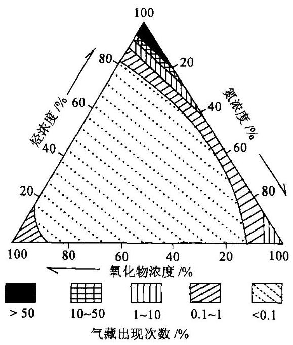

图 2-13 世界气藏气成分图

(据 B. П. якучени, 1976)

<!-- Media -->

雅库琴尼 (B. П. якучени, 1976) 对世界上不同时代, 不同构造单元的 2000 个气藏、 15000 个分析数据的统计结果表明, 世界上绝大多数气藏的成分以烃气为主。烃含量高于 ${80}\%$ 的气藏数占总数的 ${85}\%$ 以上, ${90}\%$ 以上的天然气储量集中于烃含量在 ${90}\%$ 以上的气藏中。氮气为主的气藏占气藏总数的百分之几, 氮气含量在 ${90}\%$ 以上的气藏不到 $1\%$ 。以 ${\mathrm{{CO}}}_{2}$ 和 ${\mathrm{H}}_{2}\mathrm{\;S}$ 为主的气藏也不足气藏总数的 $1\%$ (图 2-13)。 世界上若干有代表性的地区和油气田中的天然气成分如表 2-7 所示。

天然气是多种烃类和非烃的气态混合物。 在常温常压下以气态存在的烃类有甲烷、乙烷、 丙烷、丁烷、异丁烷及新戊烷; 非烃类有氢、 氮、二氧化碳、硫化氢和惰性气体。在地下高温高压下, ${\mathrm{C}}_{5} - {\mathrm{C}}_{7}$ 烷烃和部分环烷烃、芳烃及有机硫化物也可以呈气态存在。

<!-- Media -->

表 2-7 世界上若干地区和油气田中天然气成分简表

<table><thead><tr><th colspan="2" rowspan="2">地区及油气田名称</th><th rowspan="2">时代</th><th colspan="6">成分</th></tr><tr><th>${\mathrm{{CH}}}_{4}$</th><th>${\mathrm{C}}_{2} +$</th><th>${\mathrm{{CO}}}_{2}$</th><th>${\mathrm{H}}_{2}\mathrm{\;S}$</th><th>${\mathrm{N}}_{2}$</th><th>其他</th></tr></thead><tr><td rowspan="4">前苏联</td><td>西西伯利亚气田</td><td>K</td><td>97.8 ~99.91</td><td>痕量到 0.855</td><td>${0.2} \sim  {0.68}$</td><td>$0 \sim  {0.004}$</td><td>${0.45} \sim  {1.69}$</td><td>$0 \sim  {0.07}$</td></tr><tr><td>阿塞拜疆凝析气田</td><td>N</td><td>91. 3 ~ 97. 93</td><td>1. ${58} \sim  {8.66}$</td><td>$0 \sim  {0.5}$</td><td/><td/><td/></tr><tr><td>奥伦堡凝析气田</td><td>${\mathrm{P}}_{1} - {\mathrm{C}}_{3}$</td><td>81.5</td><td>$5 \sim  9$</td><td>${1.0} \sim  {3.2}$</td><td>${1.3} \sim  {4.5}$</td><td>2. $4 \sim  {7.4}$</td><td/></tr><tr><td>罗马什金油田</td><td>D</td><td>40.0</td><td>49.9</td><td>0.1</td><td>0</td><td>9.0</td><td/></tr><tr><td rowspan="2">美国</td><td>胡果顿气田</td><td>P</td><td>74.3</td><td>11.4</td><td>0</td><td>0</td><td>14.0</td><td/></tr><tr><td>潘汉得油气田</td><td>Ar+P</td><td>91.3</td><td>6.38</td><td>0.1</td><td>0</td><td>1. 0</td><td/></tr><tr><td rowspan="3">中国</td><td>圣灯山气田</td><td>${\mathrm{P}}_{1}$</td><td>94.57</td><td>0.99</td><td>0.24</td><td>0</td><td>2. 43</td><td>0.02</td></tr><tr><td>大庆油田</td><td>${\mathrm{K}}_{1}$</td><td>83.82</td><td>13. 0</td><td>0.11</td><td>0</td><td>2. 58</td><td/></tr><tr><td>老君庙油田</td><td>N</td><td>64.9</td><td>35.0</td><td>0.1</td><td/><td/><td/></tr><tr><td>荷兰</td><td>格罗宁根气田</td><td>${P}_{1}$</td><td>81.3</td><td>3.5</td><td>0.3</td><td>0</td><td>14. 0</td><td/></tr><tr><td rowspan="2">英国</td><td rowspan="2">英国赫威特气田</td><td>本塔尔砂岩 T</td><td>83. 19</td><td>8. 39</td><td>0.08</td><td>0.02</td><td>8.4</td><td/></tr><tr><td>赫威特砂岩 $T$</td><td>92.13</td><td>5. 49</td><td>0.02</td><td>0</td><td>2. 36</td><td/></tr><tr><td>法国</td><td>拉克气田</td><td>${\mathrm{J}}_{3} - {\mathrm{K}}_{1}$</td><td>68. 66</td><td>5.57</td><td>9. 92</td><td>15. 52</td><td>0.33</td><td/></tr></table>

<!-- Media -->

## 三、天然气的物理性质

天然气的物理性质是多方面的, 在此主要涉及与天然气地质学相关的物理性质。天然气一般无色, 可有汽油味和硫化氢味, 可燃烧。由于化学组成变化大, 因而物理性质变化也大。

## (一)密度和相对密度

天然气的密度定义为单位体积气体的质量。在标准状况 $\left( {{10}^{5}\mathrm{\;{Pa}},{15.55}^{ \circ  }\mathrm{C}}\right)$ 下,天然气中主要烃类成分的密度为 ${0.6773}\mathrm{\;g}/{\mathrm{{cm}}}^{3}$ (甲烷) $\sim  {3.0454}\mathrm{\;g}/{\mathrm{{cm}}}^{3}$ (戊烷)。天然气混合物的密度一般为 ${0.7} \sim  {0.75}\mathrm{\;g}/{\mathrm{{cm}}}^{3}$ ,其中石油伴生气特别是油溶气的密度最高可达 ${1.5}\mathrm{\;g}/{\mathrm{{cm}}}^{3}$ 甚至更大些。天然气的密度随重烃含量尤其是高碳数的重烃气含量增加而增大, 亦随 CO2 和 ${\mathrm{H}}_{2}\mathrm{\;S}$ 的含量增加而增大。

天然气的相对密度是指在相同温度、压力条件下天然气密度与空气密度的比值, 或者说在相同温度、压力下同体积天然气与空气质量之比。天然气烃类主要成分的相对密度为 0.5539(甲烷) $\sim  {2.4911}$ (戊烷),天然气混合物一般在 ${0.56} \sim  {1.0}$ 之间。天然气的相对密度一般与相对分子质量成正比。由于 “湿气” 含重烃气较多, 因此, “湿气” 的相对密度大于 “干气”。

天然气在地下的密度随温度的增加而减小, 随压力的增加而加大。但鉴于天然气的压缩性极强,在气藏中,天然气的体积可缩小至地表体积的 $1/{200} \sim  1/{300}$ ,压力效应远大于温度效应,因此地下天然气的密度远大于地表温压下的密度,一般可达 ${150} \sim  {250}\mathrm{\;g}/{\mathrm{{cm}}}^{3}$ ; 凝析气的密度最大可达 ${225} \sim  {450}\mathrm{\;g}/{\mathrm{{cm}}}^{3}$ 。

## (二) 黏度

天然气的黏度与其化学组成及所处环境有关。一般天然气的黏度在 ${0}^{ \circ  }\mathrm{C}$ 时为 ${0.31} \times$ ${10}^{-3}\mathrm{{mPa}} \cdot  \mathrm{s},{20}^{ \circ  }\mathrm{C}$ 时为 ${12} \times  {10}^{-3}\mathrm{{mPa}} \cdot  \mathrm{s}$ 。天然气的黏度,一般随相对分子质量增加而减小, 随温度和压力增高而增大。这是由于分子间的距离不能增加, 而温度升高后会使气体分子运动加速, 增加分子间碰撞的次数, 导致黏度加大。此外, 天然气黏度还随非烃气体含量的增加而增加。天然气黏度是研究天然气运移、开发和集输的一个重要参数。

## (三) 临界温度和压力

临界温度是指气相纯物质能维持液相的最高温度。高于临界温度时, 无论压力有多大, 都不能使气态物质凝为液态。在临界温度时, 气态物质液化所需的最低压力称临界压力。甲烷的临界温度为 $- {82.4}^{ \circ  }\mathrm{C}$ ,因此,地下甲烷除溶于石油和水中的之外,呈气态存在。

<!-- Media -->

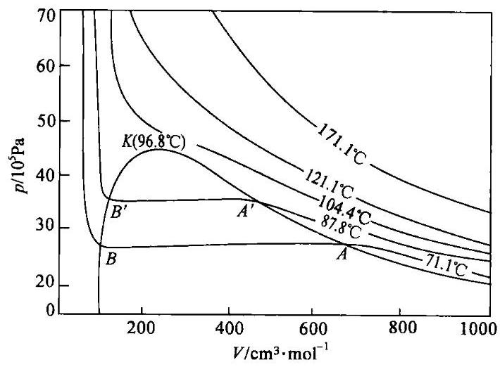

图 2-14 丙烷的 $p - V - T$ 关系曲线

<!-- Media -->

在地下较高温度 (即物系的临界温度和最高凝结温度之间) 的特定条件下, 随压力增加液态烃可以转变为气态。这种相态的转化称之为逆蒸发, 是凝析气藏形成的基本原因。为了较清楚地阐明这一问题, 必须首先分析单一烃类化合物的物系压力、体积和温度的关系曲线。

在丙烷的 $p - V - T$ 关系曲线图 (图 2-14) 中,当物系在 ${71.1}^{ \circ  }\mathrm{C}$ 时, $p - V$ 关系曲线表明,气态丙烷的体积随压力增加而缩小,直到 $B$ 点为止; 过 $B$ 点后,即使压力增加到极大,体积变化甚微。随着物系温度的上升,等压缩小体积的 ${A}^{\prime } - {B}^{\prime }$ 线段逐渐缩短,直到成为一点,即 $K$ 点。 $A$ 点为开始液化点, ${A}^{\prime }{B}^{\prime }$ 为气液两相并存,保持平衡状态, $B$ 点为完全液化点。在两相平衡时,等压缩小体积的压力为饱和蒸汽压,其大小取决于温度。 $K$ 点为临界点,该点的温度和压力称为临界温度和临界压力。丙烷的临界温度为 ${96.8}^{ \circ  }\mathrm{C}$ ,临界压力为 ${43.4} \times  {10}^{5}\mathrm{\;{Pa}}$ 。当温度超过临界温度,即使压力很大,也不能使气体液化,也就不存在等压的两相平衡状态。

讨论多组分烃类物系的相平衡状态图 (图 2-15), 能使我们充分认识地下凝析油气藏形成过程。

图中 $K$ 点为临界点,代表泡点曲线和露点曲线交汇点。 ${K}_{1}$ 点为临界凝结温度点,代表气液两相并存时的最高温度。泡点曲线 4 (即液相开始有气体析出的点线) 上方 1 区为纯液相 (即含有欠饱和溶解气的油藏区); 5 曲线为露点曲线 (即气相开始有液体凝洁的点线), ${K}_{1}$ 外侧的 3 区为纯气相 (纯气藏) 区; $K - {K}_{1}$ 上方的 2 区为凝析油气藏区; 泡点曲线 4 和露点曲线 5 包围区为气、液两相平衡区, 既有气相又有液相, 为有游离气顶的油气藏分布区。

在油层埋藏较浅, 地层温度低于临界温度时, 物系相态的变化符合正常的凝结和蒸发的概念。例如, ${25}^{ \circ  }\mathrm{C}$ 时随压力增加, 物系中凝析的液体逐渐增多, 当压力达到 ${18}\mathrm{{MPa}}$ 时 $\left( {{C}_{1}\text{点}}\right)$ ,完全被液化。

<!-- Media -->

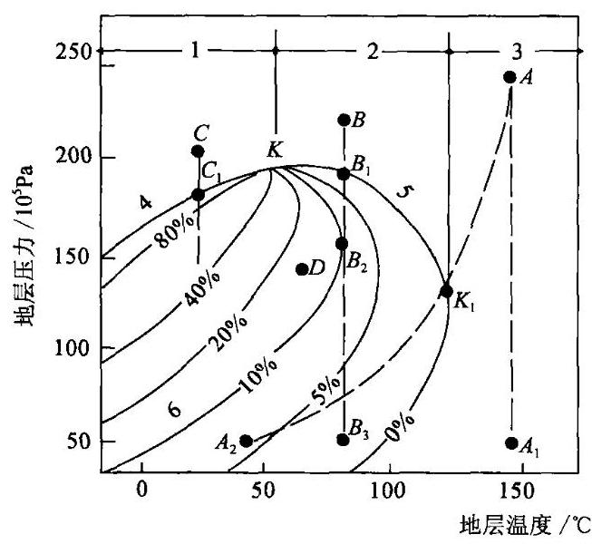

图 2-15 多组分烃类物系的相图

<!-- Media -->

当埋藏深度增大, 地层温度介于临界温度和临界凝结温度之间,如 ${82.5}^{ \circ  }\mathrm{C}$ 时, 低压下物系以气态为主, 气液两相平衡, 随压力上升液相逐渐增多, 符合正常凝结的概念。但当压力达到 ${15.5}\mathrm{{MPa}}\left( {{B}_{2}\text{点}}\right)$ 后, 随压力增大, 液相反而减少, 气相则增加到达 ${B}_{1}$ 点完全气化。这与正常蒸发概念完全相反, 称之为逆蒸发。反之, 从 ${B}_{1}$ 到 ${B}_{2}$ 点的凝结,称为逆凝结,凝析气藏的形成, 就是逆蒸发的相态转变的结果。

## (四) 溶解性

天然气溶于石油和水。在相同条件下, 天然气在石油中的溶解度远远大于在水中的溶解度, 例如甲烷在石油中的溶解度比在水中大 10 倍。天然气中重烃增多, 或者石油中的轻馏分较多时, 都可增加天然气在石油中的溶解度。另外, 降低温度或增大压力, 也可得到同样效果。在石油中溶有天然气时, 可以降低石油的相对密度、黏度及表面张力。

## (五) 热值

单位体积(或单位质量)的天然气燃烧时所发出的热量,称为热值,单位为 $\mathrm{{kJ}}/{\mathrm{m}}^{3}$ 或 $\mathrm{{kJ}}/\mathrm{{kg}}$ ,也可用 $\mathrm{{kcal}}/{\mathrm{m}}^{3}$ (。天然气的热值变化很大,氢可达 ${142256}\mathrm{\;{kJ}}/{\mathrm{m}}^{3}$ ,而甲烷为 ${37112}\mathrm{\;{kJ}}/{\mathrm{m}}^{3}$ 。天然气中湿气的热值较高,可达 ${83680}\mathrm{\;{kJ}}/{\mathrm{m}}^{3}$ 。而煤和石油的热值分别为 ${16736}\mathrm{\;{kJ}}/{\mathrm{m}}^{3}$ 及 ${41840}\mathrm{\;{kJ}}/{\mathrm{m}}^{3}$ 。

## 四、天然气与石油的差别

天然气与石油的差别主要包括组成成分上的差别和物理性质上的差别。

## (一) 组成成分上的差别

总体上看, 天然气和石油都是产出于地下岩石孔隙中的以烃类为主体的可燃有机矿产, 成分都可分为烃类和非烃两大类, 且均以烃类为主。因此从组成成分的大类上看, 二者是相似的。

在相似性基础上, 天然气与石油的组成成分又有着显著的差别。众所周知, 烃类是一大类有机物质的总称, 其成员众多, 结构复杂。天然气中仅包含少数几个最简单的烃类成员, 主要是甲、乙、丙、丁烷, 戊烷以上所占比例甚微, 总的趋势是随碳数的增加, 其所占比例显著降低。石油则不同, 几乎囊括了烃类的所有成员, 至少是大部分成员。

表面上看, 含烃类成员多少是天然气与石油的一个明显区别。成员多必然关系复杂, 这是显而易见的, 但这只是表观上的差别, 实质性的差别还在于分子量的大小和分子结构上的差别。显然,天然气的分子量较小 (平均分子量 $&lt; {20}$ ),分子结构简单; 而石油的分子量从小到大均有 (平均分子量为 ${75} \sim  {275}$ ),结构也复杂得多。

石油与天然气在次要组分非烃成分上差别更为明显,天然气中非烃成分主要是 ${\mathrm{{CO}}}_{2}$ 、 ${\mathrm{H}}_{2}\mathrm{\;S}$ 和 ${\mathrm{N}}_{2}$ 。显然无论是分子量还是分子结构,与石油中含 $\mathrm{O}\text{、}\mathrm{\;S}\text{、}\mathrm{\;N}$ 及其他杂元素的非烃有机化合物相比, 天然气都要简单得多。分子量、分子结构以及分子大小的差别是天然气与石油最本质的区别。可以说其他所有差别均源于此。

## (二) 物理性质上的差别

首先是相态的差别。天然气是单一气相, 或以气相为主 “溶” 有少量液态烃; 而石油是以液相为主的气、液、固三相混合物。由此而导致了二者密度、黏度、溶解度、压缩性、吸附性和扩散性等物理性质上的差别。密度、黏度和吸附性, 天然气远小于石油; 压缩性、扩散性和溶解度则天然气远大于石油。

基于天然气与石油在组成成分和物理性质上的差别, 致使天然气从形成到聚集成为矿藏以及分布的地质条件都可能与石油有所区别。对此我们在进行油气勘探时必须考虑到。

## 第三节 油 田 水

## 一、油田水的概念

所谓油田水, 从广义上理解, 是指油气田区域 (含油气构造) 内的地下水, 包括油 (气)层水和非油(气)层水。狭义的油田水是指油气田范围内直接与油(气)层连通的地下水, 即油 (气) 层水。

从形成油气的原始生物物质的生产, 到油气的生成、运移乃至最后聚集成为油气藏, 无不与水相伴, 因而油气自然与水有着千丝万缕的联系; 尤其是长期与油气相伴、与油气藏联系最为密切的油田水, 必然会含载着一些与油气相关的信息, 这就是石油与天然气地质学有必要关注油田水的主要原因。研究油田水, 了解与油田水有关的水文地质及水化学特征, 对认识油气藏的形成和保存条件, 指导油气勘探和开发均有重要意义。

## 二、油田水的产状

油田水是地下水的一部分。地下水存在于地下岩石的孔隙 - 裂缝系统中, 水在其中的产状, 受孔隙 - 裂缝大小及岩石颗粒表面的吸附作用所控制。按照水在其中的储存状态, 可分为吸附水、毛细管水和自由水三种产状。

吸附水呈薄膜状被岩石颗粒表面所吸附, 在一般温、压条件下不能自由运动。

毛细管水存在于毛细管孔隙 - 裂缝中, 只有当作用于水的力超过毛细管力时才能运动。

自由水存在于超毛细管孔隙 - 裂缝中, 在重力作用下能自由运动, 也称之为重力水。

油田水的储存状态也不外乎上述三种产状。但油 (气) 层水的产状, 还可以根据水与油、气的相对位置关系,分为底水和边水 (图 2-16A)。

底水是指含油(气)外边界范围以内与油(气)相接触, 且位于油气之下承托着油气的油 (气) 层水。

边水是指含油(气)外边界以外的油(气)层水, 实际上是底水的自然外延。

实际中应当注意, 在油气占据的位置还存在束缚水(包括吸附水和一部分毛细管水)。

在油气田范围内的非油 (气) 层水, 可根据它们与油 (气) 层的相对位置, 分别称为上层水、夹层水和下层水。油气田范围内水与油气分布的关系,如图 $2 - {16}\mathrm{\;B}$ 所示。

<!-- Media -->

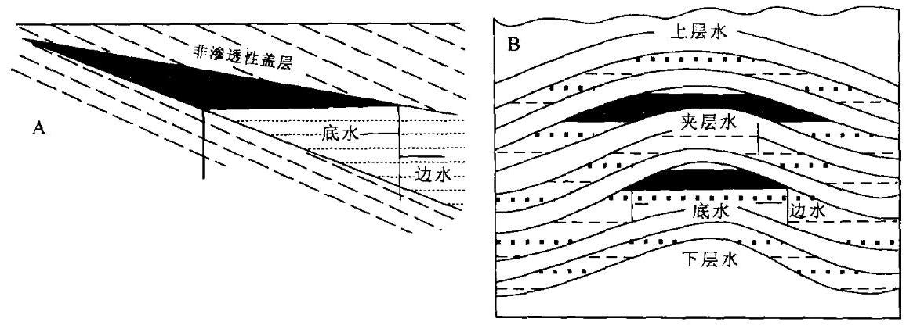

图 2-16 油田水与油气藏在分布上的相互关系

(据 Levorsen, 1954)

A一尖灭油气藏中的油田水; B一背斜油气藏中的油田水

<!-- Media -->

## 三、油田水的来源

油田水的来源是一个极为复杂而尚未取得统一认识的问题。一般认为可以有以下四种来源：①沉积水；②渗入水；③深成水；④成岩水。

沉积水是沉积物堆积过程中充填于沉积物颗粒间隙并保存在其中的水。这种水的含盐度和化学组成与堆积沉积物的古海 (湖) 水的含盐度及沉积物本身有密切关系。因此, 不同沉积环境下形成的油田水矿化度有着明显的差别。

渗入水是指来源于大气降雨时渗入到浅处孔隙、渗透性岩层中的水。由于渗入水的矿化度低, 对高矿化度的地下水可起淡化作用。淡化作用在靠近不整合面下的油田水中表现特别明显。

深成水特指来源于地幔及地壳深部的高温、高矿化度、饱和气体的地下水, 包括初生水、岩浆水和变质水。这种水在金属矿床形成过程中起重要作用。但在形成油田水中所起的作用则有着不同的认识。

成岩水来源于矿物成岩转化脱出的结晶水(结构水)和有机质演化伴生的水。

通常可以将油田水看作是沉积水、渗入水、深成水及成岩水以不同比例混合, 且经过一系列复杂的物理化学作用 (溶解 - 沉淀), 并与油气相伴生的油 (气) 层水。

## 四、油田水的化学组成

油田水的化学组成, 实质上是指溶于油田水中的溶质的化学组成, 包括无机组成、有机组成、溶解气及微量元素等。

## (一) 无机组成

在常规水分析中,常用 ${\mathrm{{Na}}}^{ + }$ (包括 ${\mathrm{K}}^{ + }$ )、 ${\mathrm{{Ca}}}^{2 + }\text{、}{\mathrm{{Mg}}}^{2 + }$ 和 ${\mathrm{{Cl}}}^{ - }\text{、}{\mathrm{{SO}}}_{4}{}^{2 - }\text{、}{\mathrm{{HCO}}}_{3}{}^{ - }$ (包括 ${\mathrm{{CO}}}_{3}{}^{2 - }$ ) 代表常量无机组成,其含量可以浓度 $\left( {\mathrm{m} \cdot  \mathrm{{mol}}/\mathrm{L}}\right)$ 、质量浓度 $\left( {\mathrm{{mg}}/\mathrm{L}}\right)$ 、摩尔分数(物质的量与混合物物质的量的比)表示。表 2-8 为同一分析数据用三种方法表示的计算结果。

<!-- Media -->

表 2-8 水化学成分表示法

<table><thead><tr><th colspan="2">离子</th><th>$\mathrm{{mg}}/\mathrm{L}$</th><th>$\mathrm{m} \cdot  \mathrm{{mol}}/\mathrm{L}$</th><th>摩尔分数 $/\%$</th></tr></thead><tr><td rowspan="4">阴离子</td><td>${\mathrm{{Cl}}}^{ - }$</td><td>34930</td><td>984.0</td><td>49.0</td></tr><tr><td>${\mathrm{{SO}}}_{4}{}^{2 - }$</td><td>790</td><td>16. $5\left( {\frac{1}{2}{\mathrm{{SO}}}_{4}{}^{2 - }}\right)$</td><td>0.8</td></tr><tr><td>${\mathrm{{HCO}}}_{3}$</td><td>280</td><td>4. 6</td><td>0.2</td></tr><tr><td>阴离子总和</td><td>36000</td><td>1005. 1</td><td>50.0</td></tr><tr><td rowspan="4">阳离子</td><td>${\mathrm{{Na}}}^{ + }$</td><td>12281</td><td>534.0</td><td>26.5</td></tr><tr><td>${\mathrm{{Ca}}}^{2 + }$</td><td>1290</td><td>108. $0\left( {\frac{1}{2}{\mathrm{{Ca}}}^{2 + }}\right)$</td><td>5.4</td></tr><tr><td>${\mathrm{{Mg}}}^{2 + }$</td><td>7270</td><td>363. $0\left( {\frac{1}{2}{\mathrm{{Mg}}}^{2 + }}\right)$</td><td>18. 0</td></tr><tr><td>阳离子总和</td><td>20841</td><td>1005.0</td><td>50.0</td></tr><tr><td colspan="2">阴、阳离子总和</td><td>56841</td><td>2010.1</td><td>100.0</td></tr></table>

<!-- Media -->

据研究, 在天然水中目前已测定出 60 多种微量元素, 其中最常见的大约 30 多种。油田水的成分比一般天然水更为复杂, 这不仅是因为油田水长时间与油气接触, 而且还因为它是从不同的沉积环境 (如淡水湖、咸水湖或海洋等) 进入埋藏环境的, 在被埋藏之后, 又经历了相当长的复杂的演化历史。在这期间, 与其接触的围岩性质、温度、压力变化以及同地表水连通时与地表水的交换情况等, 都会对油田水的化学成分有不同程度的影响。

油田水中微量元素主要有碘、溴、硼、锶等, 其中碘、溴、硼及铵含量较高是油田水的又一特征 (表 2-9)。

<!-- Media -->

表 2-9 不同水中微量元素含量对比表

<table><thead><tr><th>元素及化合物</th><th>油田水/ $\left( {\mathrm{{mg}} \cdot  {\mathrm{L}}^{-1}}\right)$</th><th>海水/ $\left( {\mathrm{{mg}} \cdot  {\mathrm{L}}^{-1}}\right)$</th><th>淡水 $/\left( {\mathrm{{mg}} \cdot  {\mathrm{L}}^{-1}}\right)$</th></tr></thead><tr><td>碘</td><td>几十到几百</td><td>0.05</td><td>0.003</td></tr><tr><td>溴</td><td>几百</td><td>65</td><td>${0.0001} \sim  {0.2}$</td></tr><tr><td>硼</td><td>几十到几百</td><td>$4 \sim  6$</td><td>痕量或无</td></tr><tr><td>铵</td><td>${100} \sim  {500}$</td><td>-</td><td>${20} \sim  {60}$</td></tr></table>

<!-- Media -->

油田水中的碘可能来源于原始有机物质, 特别是藻类。溴和硼含量高指示地下水流动几近停滞, 有利于油气保存。

铵是原始有机质分解的产物, 化学性质不稳定, 易转变为氨及其他化合物。所以铵的存在进一步表明地下为还原环境, 有利于油气保存。

油田水中还可有锶、钡等元素, 但并非所有油田水都有。总之, 油田水中微量元素的存在有助于对与油气有关的沉积、成岩环境及油气保存条件的研究。

## (二) 有机组成

油田水中常见的有机组分有烃类、酚和有机酸。

油层水所含的烃类有气态烃和液态烃。一般油田水中常含有溶解的烃类气体, 包括甲烷和重烃, 尤其是重烃的存在往往表明与地下油气藏有关。重烃含量的多少则与距离油气藏的远近有关。一般非油田水中常只含少量甲烷。

油层水中苯系化合物含量高, 一般可达 ${0.03} \sim  {1.58}\mathrm{{mg}}/\mathrm{L}$ ,最高可达 $5 \sim  6\mathrm{{mg}}/\mathrm{L}$ ,且甲苯/苯大于 1 ; 非油层水中苯系化合物含量低, 且甲苯/苯小于 1 。

<!-- Media -->

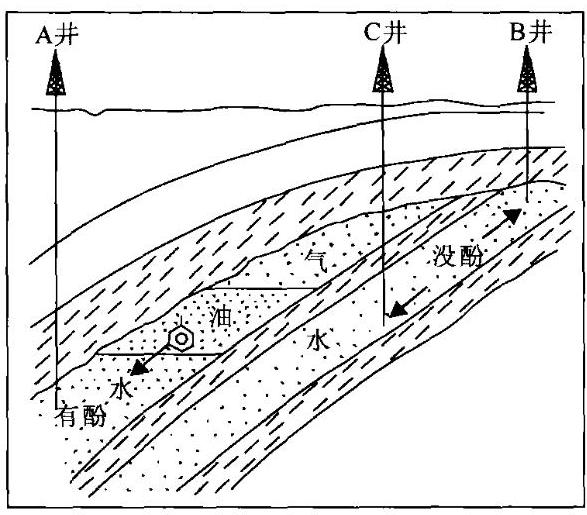

图 2-17 油田水中酚的存在指示油气藏存在 (据 Taylor, 1994)

<!-- Media -->

酚在油层水中含量也比较高, 一般大于 ${0.1}\mathrm{{mg}}/\mathrm{L}$ ,最高可达 ${10} \sim  {15}\mathrm{{mg}}/\mathrm{L}$ ,且以邻甲酚和甲酚为主; 非油层水的含量低, 且以苯酚为主 (图 2-17)。

油田水中还常含数量不等的环烷酸、脂肪酸和氨基酸等。其中环烷酸是石油环烷烃的衍生物, 常可作为找油的重要水化学标志。环烷酸的含量与距离油藏的远近有关, 距离越近含量越高。此外, 环烷酸的含量还与水型有关, 它最容易富集在碱性的重碳酸纳型水中, 而氯化钙型和氯化镁型水中很少或没有环烷酸。 这是因为环烷酸钠盐在水中的溶解度大, 而环烷酸钙盐在水中难于溶解。故不能认为不含环烷酸的水就不是油田水, 须结合水型分析。

## (三) 溶解气

油田水中常见的气体成分有 ${\mathrm{O}}_{2}\text{、}{\mathrm{\;N}}_{2}\text{、}{\mathrm{{CO}}}_{2}\text{、}{\mathrm{H}}_{2}\mathrm{\;S}\text{、}{\mathrm{{CH}}}_{4}\text{、}\mathrm{{He}}$ 等。

## 五、油田水的类型

油田水的分类必须解决的实质性问题应包括: ①油田水化学标志及其与非油田水的区别; ②不同类型油田水的特征及区别。

自 1911 年美国 C. 帕尔默 (C. Palmer) 提出第一个油田水分类开始, 出现了多种油田水分类方案,其中,以前苏联水文地质学家 B. A. 苏林 (B. A. Cy $\pi \mathrm{{HH}}$ ,1946) 的分类较为简明。该方案以 ${\mathrm{{Cl}}}^{ - }\text{、}{\mathrm{{SO}}}_{4}{}^{2 - }\text{、}{\mathrm{{HCO}}}_{3}{}^{ - }$ 和 ${\mathrm{{Na}}}^{ + }\text{、}{\mathrm{{Ca}}}^{2 + }\text{、}{\mathrm{{Mg}}}^{2 + }$ 含量及其组合关系作为分类基础,将天然水分为四种成因类型 (图 2-18,表 2-10),表明海水和淡水有两个主要区别: ①淡水 $c\nabla \left( {\mathrm{{Na}}}^{ + }\right) /c\left( {\mathrm{{Cl}}}^{ - }\right)$ 的比值大于 1,海水比值小于 1 。大陆水含盐度低 (一般小于 ${500}\mathrm{\;{mg}}/\mathrm{L}$ ),其化学组成具有 $c\left( {{\mathrm{{HCO}}}_{3}{}^{ - }}\right)  &gt; c\left( {{\mathrm{{SO}}}_{4}{}^{2 - }}\right)  &gt; c\left( {\mathrm{{Cl}}}^{ - }\right) ,c\left( {\mathrm{{Ca}}}^{2 + }\right)  &gt;$ $c\left( {\mathrm{{Na}}}^{ + }\right)  &lt; c\left( {\mathrm{{Mg}}}^{2 + }\right)$ 的相互关系,且 $c\left( {\mathrm{{Na}}}^{ + }\right)  &gt; c\left( {\mathrm{{Cl}}}^{ - }\right) ,c\left( {\mathrm{{Na}}}^{ + }\right) /c\left( {\mathrm{{Cl}}}^{ - }\right)$ (离子数比 $) &gt; 1$ 。海水的含盐度较高 (一般约为 ${35000}\mathrm{{mg}}/\mathrm{L}$ ),其化学组成具有 $c\left( {\mathrm{{Cl}}}^{ - }\right)  &gt;$ $c\left( {{\mathrm{{SO}}}_{4}{}^{2 - }}\right)  &gt; c\left( {{\mathrm{{HCO}}}_{3}{}^{ - }}\right) ,c\left( {\mathrm{{Na}}}^{ + }\right)  &gt; c\left( {\mathrm{{Mg}}}^{2 + }\right)  &lt; c\left( {\mathrm{{Ca}}}^{2 + }\right)$ ,且 $c\left( {\mathrm{{Cl}}}^{ - }\right)  &gt; c\left( {\mathrm{{Na}}}^{ + }\right)$ , $c\left( {\mathrm{{Na}}}^{ + }\right) /c\left( {\mathrm{{Cl}}}^{ - }\right)$ (离子数比) $&lt; 1$ 的特点。②淡水重碳酸钠占优势,含硫酸钠,而海水不含硫酸钠。油田水的化学类型以氯化钙型为主, 其次是重碳酸钠型, 硫酸钠型和氯化镁型较为罕见。

<!-- Media -->

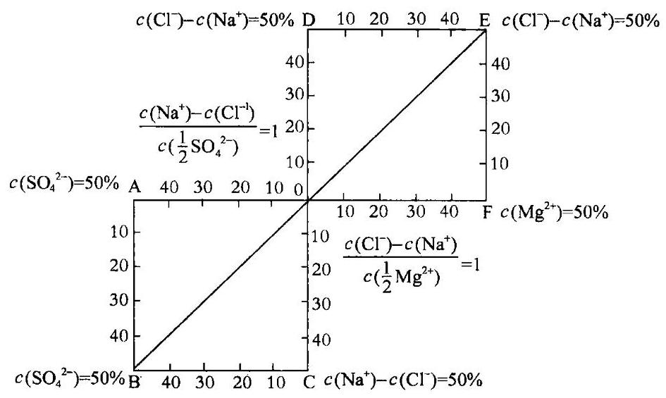

图 2-18 天然水成因分类图

(据苏林, 1946, 修改)

表 2-10 苏林的天然水成因分类表

<table><thead><tr><th colspan="2" rowspan="2">水的类型</th><th colspan="3">成因系数</th></tr><tr><th>$c\left( {\mathrm{{Na}}}^{ + }\right) /c\left( {\mathrm{{Cl}}}^{ - }\right)$</th><th>$c\left( {\mathrm{{Na}}}^{ + }\right)  - c\left( {\mathrm{{Cl}}}^{ - }\right)$ $c\left( {\frac{1}{2}{\mathrm{{SO}}}_{4}{}^{2 - }}\right)$</th><th>$c\left( {\mathrm{{Cl}}}^{ - }\right)  - c\left( {\mathrm{{Na}}}^{ + }\right)$ $c\left( {\frac{1}{2}{\mathrm{{Mg}}}^{2 + }}\right)$</th></tr></thead><tr><td rowspan="2">大陆水</td><td>硫酸钠型</td><td>$> 1$</td><td>$< 1$</td><td>$< 0$</td></tr><tr><td>重碳酸钠型</td><td>$> 1$</td><td>$> 1$</td><td>$< 0$</td></tr><tr><td>海水</td><td>氯化镁型</td><td>$< 1$</td><td>$< 0$</td><td>$< 1$</td></tr><tr><td>深层水</td><td>氯化钙型</td><td>$< 1$</td><td>$< 0$</td><td>$> 1$</td></tr></table>

(据苏林, 1946, 修改)

<!-- Media -->

苏林认为, 裸露的地质构造中的地下水可能属于硫酸钠型, 与地表大气降水隔绝的封闭水则多属于氯化钙型, 两者之间的过渡带为氯化镁型。在油气田地层剖面的上部地层水以重碳酸钠型为主; 随着埋藏加深, 过渡为氯化镁型; 最后成为氯化钙型。有时重碳酸钠型直接被氯化钙型所替代, 缺少过渡型。油田水的水化学类型以氯化钙型为主, 重碳酸钠型次之, 硫酸钠型和氯化镁型较为罕见。

---

<!-- Footnote -->

- $c$ 表示物质的浓度,单位为 $\mathrm{{mmol}}/\mathrm{L}$ 。

<!-- Footnote -->

---

苏林分类存在的问题在于: ①把地下水的成因完全看成是地表水渗入形成的, 没有考虑其他成因水的加入, 还有自然界经常发生的水的混合作用以及由此而产生的水中成分的多种分异和组合; ②将本来具有成因联系作为一个整体的大量无机组分, 简化成仅是天然水盐类成分的分类, 过于简单; ③忽略了水中气体成分及微量元素等一些具有标型性质的组分, 同时缺少作为区分油田水与非油田水的特征参数。随着油气勘探的进展和对油田水地球化学研究的深入, 比较普遍的意见是应把矿化度和阴离子组合作为油田水化学分类的基础, 再根据油田水的特征参数或标志, 区分油田水和非油田水。但提出的分类方案大都过于复杂, 应用不便, 难于推广, 未被普遍接受。

## 六、油田水的物理性质

## (一) 颜色和透明度

油田水因含胶体和乳化物,一般不透明或成混浊状。含 ${\mathrm{H}}_{2}\mathrm{\;S}$ 者呈淡青绿色; 含铁质胶状体 $\left( {{\mathrm{{Fe}}}^{2 + }\text{、}{\mathrm{{Fe}}}^{3 + }}\right)$ 者带淡红色、褐色或淡黄色。

## (二) 嗅味和味道

含 ${\mathrm{H}}_{2}\mathrm{\;S}$ 气体时常常有刺鼻的腐蛋味; 当水中溶有较多重烃气及(或)少量液态烃时, 往往具有汽油或煤油味。溶有氯化钠者为咸味; 含硫酸镁则使水带苦味。

## (三) 相对密度

油田水因溶有数量不等的盐类, 相对密度变化很大, 油田水相对密度一般大于 1 。含盐度越高的油田水相对密度越大。我国酒泉盆地的油田水相对密度为 ${1.01} \sim  {1.05}$ 。

## (四) 黏度

油田水中含盐分, 黏度比纯水高。一般是溶解盐分越多, 黏度越高。温度对油田水的黏度有明显的影响, 温度越高, 黏度越低。

(五) 导电性

水是极性化合物, 纯水是不导电的。油田水因含各种离子, 能够导电, 水中含离子越多, 导电性越强。

## 第四节 油气的碳、氢稳定同位素

石油和天然气的稳定同位素, 从广义上理解包括: 构成主要化合物 (烃类) 的碳、 氢稳定同位素; 次要化合物 (非烃) 中的硫、氮、氧稳定同位素; 微量一痕量元素、稀有 (惰性) 气体元素以及石油灰分中多种元素的稳定同位素。其中尤以碳稳定同位素的研究最多、应用最广、进展最快, 其次是氢稳定同位素。因为碳和氢是烃类的主要组成元素, 地壳中烃类的形成和富集, 实质上是碳、氢元素地球化学演化的结果。碳、氢同位素的研究, 不仅能为解决烃类的成因提供重要依据, 而且对解决油、气源对比和油、气运移等重大问题起重要作用。油气中其他元素的同位素研究及在油气地质上的应用尚在探索之中。

## 一、同位素的概念及同位素分馏作用

同位素是指元素周期表中具有相同原子序数而原子量不同的元素。因为它们在周期表中占有同一位置, 故称同位素。

同位素按其稳定程度可分为稳定同位素和非稳定(放射性)同位素。稳定同位素是指原子核不会自发地改变的同位素。同一元素的稳定同位素具有相同的质子数和原子结构, 化学性质近似, 即使经历复杂的化学反应和较为强烈的化学变化, 其同位素比率仍保持相对的稳定。但由于它们的中子数和原子量有一定差别, 元素各同位素的物理、化学性质 (如取代分子或键的化学活动性) 也有一定差别。同位素质量相对差别越大, 其物理、化学性质差别也越大。

物质在生物、化学和物理作用下其组成元素的同位素发生变化、转移或分离, 或者说在同位素比值不同的两种物质间进行的同位素分配作用, 称为同位素分馏作用。物质在参与生物、化学和物理作用过程中, 由于同位素的分馏作用, 元素的一种同位素被另一种同位素所取代, 从而导致其物理、化学性质上的差异, 叫做同位素效应。同位素之间所具有的物理、化学性质的近似性 (稳定性) 和分馏作用, 是同位素地球化学研究和应用的理论基础和前提。

## 二、稳定同位素在自然界的丰度、比值、标准及表示方式

自然界不同物质的同位素组成有着明显差别, 同位素的比值各不相同。利用这种性质, 使得稳定同位素在研究油气成因类型、油气源对比、油气运移等诸方面得到广泛应用。

在石油和天然气勘探中应用稳定同位素时,除直接测定同位素比值外,常用 $\delta$ 值表示。 $\delta$ 值的定义为:

$$
\delta  = \frac{{R}_{\mathrm{s}} - {R}_{\mathrm{t}}}{{R}_{\mathrm{r}}} \times  {1000}\% o = \left( {\frac{{R}_{\mathrm{s}}}{{R}_{\mathrm{r}}} - 1}\right)  \times  {1000}\% o \tag{2 - 3}
$$

式中: $\delta$ 为同位素分布值的总称,对于碳、氢别用 ${\delta }^{13}\mathrm{C}\text{、}\delta \mathrm{D}$ 表示; ${R}_{\mathrm{s}}$ 为样品的同位素比值,对于碳、氢同位素分别是 ${}^{13}\mathrm{C}/{}^{12}\mathrm{C}\text{、}\mathrm{D}/\mathrm{H};{R}_{\mathrm{r}}$ 为标准的稳定同位素比值。

需要注意的是, 不同元素稳定同位素的标准不同, 同一元素也可有不同的标准 (表 $2 - {11})$ 。

<!-- Media -->

表 2-11 常用碳同位素标准的 ${}^{13}\mathrm{C}/{}^{12}\mathrm{C}$ 值和国际标准 (PDB) ${\delta }^{13}\mathrm{C}$ 值

<table><thead><tr><th>标准名称</th><th>${}^{13}\mathrm{C}/{}^{12}\mathrm{C}$</th><th>$\delta {}^{13}\mathrm{C}\left( \text{ PDB }\right) /\%$ 。</th></tr></thead><tr><td>PDB (芝加哥标准)</td><td>${1123.72} \times  {10}^{-5}$</td><td>0</td></tr><tr><td>${\mathrm{{BaCO}}}_{3}$ (斯德哥尔摩标准)</td><td>${1112.15} \times  {10}^{-5}$</td><td>-10.3</td></tr><tr><td>石墨 ( NBS , No. 21 )</td><td>${1092.48} \times  {10}^{-5}$</td><td>-27.8</td></tr><tr><td>石油 ( NBS , No. 22 )</td><td>${1090.68} \times  {10}^{-5}$</td><td>-29.4</td></tr><tr><td>周口店灰岩(中国标准)</td><td>${1123.60} \times  {10}^{-5}$</td><td>-0.1</td></tr><tr><td>福一井甲烷(中国四川)</td><td>${1084.40} \times  {10}^{-5}$</td><td>- 26.08</td></tr></table>

<!-- Media -->

为了便于对比,通常要把某一标准换算成另一标准,如将测得对 $\mathrm{A}$ 标准的 $\delta$ 值 $\left( {{\delta }^{13}{\mathrm{C}}_{\mathrm{A}}}\right)$ , 换算成对 $\mathrm{B}$ 标准的 $\delta$ 值 $\left( {{\delta }^{13}{\mathrm{C}}_{\mathrm{B}}}\right)$ 时,可用下式进行换算:

$$
{\delta }^{13}{\mathrm{C}}_{\mathrm{B}} = \left\lbrack  {\frac{{R}_{\mathrm{{Ar}}}}{{R}_{\mathrm{{Br}}}}\left( {{\delta }^{13}{\mathrm{C}}_{\mathrm{A}} + 1}\right)  - 1}\right\rbrack   \times  {1000}\%  \tag{2 - 4}
$$

式中: ${\delta }^{13}{\mathrm{C}}_{\mathrm{B}}$ 为求取的对 $\mathrm{B}$ 标准的 $\delta$ 值; ${\delta }^{13}{\mathrm{C}}_{\mathrm{A}}$ 为测得的对 $\mathrm{A}$ 标准的 $\delta$ 值; ${R}_{\mathrm{{Ar}}}\text{、}{R}_{\mathrm{{Br}}}$ 分别为 A、 $\mathrm{B}$ 标准的 ${}^{13}\mathrm{C}/{}^{12}\mathrm{C}$ 比值。

例如,对四川进行碳同位素研究时,采用福一井的 ${\mathrm{{CH}}}_{4}$ 作为工作标准 (即 $\mathrm{A}$ 标准) 它的 ${}^{13}\mathrm{C}/{}^{12}\mathrm{C}$ 为 ${1084.4} \times  {10}^{-5}$ 。测得纳 16 井 ${\mathrm{P}}_{1}{}^{3}\mathrm{\;A}$ 层天然气 $\left( {\mathrm{{CH}}}_{4}\right)$ 的 ${\delta }^{13}{\mathrm{C}}_{\mathrm{A}}$ ( $\mathrm{A}$ 标准) 为 $4\%$ 。现将其换算成以周口店灰岩为标准 (即 $\mathrm{B}$ 标准—— ${\delta }^{13}{\mathrm{C}}_{\mathrm{B}}$ ),代入上式得 ${\delta }^{13}{\mathrm{C}}_{\mathrm{B}}$ 值为 -31.03 %。若换算成 PDB 标准,则 ${\delta }^{13}\mathrm{C}$ 值为 $- {31.13}\%$ 。

与油气有关的 $\mathrm{C}\text{、}\mathrm{H}$ 的稳定同位素在自然界的丰度、比值、标准及表示符号如表 2-12所示。

<!-- Media -->

表 2-12 碳、氢稳定同位素的符号、丰度、同位素比值及标准简表

<table><thead><tr><th>元素</th><th>原子序数</th><th>同位素丰度 $/\%$</th><th>同位素比</th><th>比值</th><th>标准及符号</th><th>表示方式</th></tr></thead><tr><td>氢 (H)</td><td>1</td><td>${}^{1}\mathrm{H}\;{99.9844}$ ${}^{2}\mathrm{H}\;{0.0156}$</td><td>${}^{2}\mathrm{H}/{}^{1}\mathrm{H}$</td><td>${1.5} \times  {10}^{-4}$</td><td>标准平均大洋水, 缩写代号 SMOW</td><td>$\delta \mathrm{D}\left( \mathrm{{SMOW}}\right) /\%$ 。</td></tr><tr><td>碳 (C)</td><td>6</td><td>${}^{12}\mathrm{C}\;{98.892}$ ${}^{13}\mathrm{C}\;{1.108}$</td><td>${}^{13}\mathrm{C}{/}^{12}\mathrm{C}$</td><td>${1.12} \times  {10}^{-2}$</td><td>南卡罗来纳州白垩系皮狄组美 洲拟箭石, 缩写代号 PDB</td><td>$\delta {}^{13}\mathrm{C}\left( \mathrm{{PDB}}\right) /\%$ 。</td></tr></table>

(据 J. G. Stark, H. G. Wallace, 1975)

<!-- Media -->

## 三、油气中的稳定碳同位素

## (一)石油的稳定碳同位素组成

石油碳同位素的 ${\delta }^{13}\mathrm{C}$ 值 (PDB,以下同) 一般为 $- {33}\% o \sim   - {22}\% o$ ,平均为 $- {26}\% o \sim$ $- {25}\%$ 。在海陆相石油区别中已提及,海相原油的 ${\delta }^{13}\mathrm{C}$ 值较高,为 $- {27}\% o \sim   - {22}\% o$ ; 陆相原油的 ${\delta }^{13}\mathrm{C}$ 值相对较低,一般为 $- {29}\% o \sim   - {33}\% o$ 。

<!-- Media -->

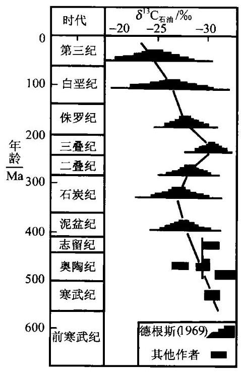

图 2-19 各地质时代石油的碳同位素分布

(据 Stahl, 1977)

<!-- Media -->

原油的 ${\delta }^{13}\mathrm{C}$ 值随年代变老,显示出轻微降低趋势, 即年代愈老的原油 ${}^{13}\mathrm{C}$ 相对富集, ${}^{12}\mathrm{C}$ 相对减少 (图 2 - 19)。

原油中不同组分的碳同位素成分亦有差异。一般来说,饱和烃、芳烃、胶质和沥青质的 ${\delta }^{13}\mathrm{C}$ 值随馏分的极性和分子量增大而增加。把原油不同组分的 ${\delta }^{13}\mathrm{C}$ 值变化连成曲线, 称为碳同位素类型曲线。不同地区、不同成因类型的原油的同位素类型曲线有着明显的差别 (图 2-20)。利用碳同位素类型曲线能有效地解决成油环境、油源对比及石油演化等方面问题。

## (二)天然气的稳定碳同位素组成

天然气的 ${\delta }^{13}\mathrm{C}$ 值变化较大,从 $- {100}\%$ o直到 $- {20}\%$ 。 一般低温浅层中形成的天然气 (甲烷) 中富集 ${}^{12}\mathrm{C}$ ,具有较低的 ${\delta }^{13}\mathrm{C}$ 值 $\left( {-{100}\% o \sim   - {50}\% o}\right)$ ; 而深部和年代较老,在较高温度下形成的天然气,具有较高的 ${\delta }^{13}\mathrm{C}$ 值 $\left( {-{50}\% o \sim   - {20}\% o}\right)$ 。利用 ${\delta }^{13}{\mathrm{C}}_{1} - {R}_{\mathrm{o}}$ (镜质体反射率,%) 和 ${\delta }^{13}{\mathrm{C}}_{1} - {\mathrm{C}}_{1}$ 烃/ $\sum {\mathrm{C}}_{i}$ 关系曲线,能较有效地区分不同母质和演化阶段所生成的天然气。

<!-- Media -->

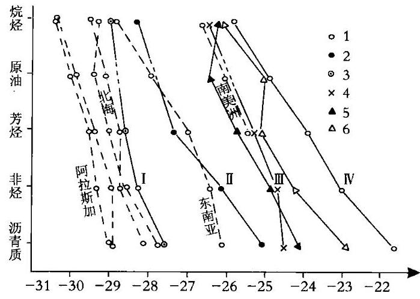

图 2-20 原油碳同位素类型曲线 (据廖永胜, 1982)

虚线资料据 Stahl (1977)。实线部分: I 一福山凹陷; II 一莺歌海西北凹陷; III 和IV - 溷西南凹陷。 1一福 25 井下第三系; 2 一莺 9 井上第三系; 3-湾 2 井下第三系; 4-湾 9 井古生界; 5 一莺 2 井下第三系; 6 一湾 5 井上第三系

<!-- Media -->

对地下水中溶解的甲烷气的碳同位素测定, 能帮助确定溶解气的成因类型及来源, 有助于确定地下水与油气藏的关系。

## 四、油气中的氢同位素

## (一) 石油的氢同位素组成

原油中 $\delta \mathrm{D}$ 值一般在 $- {160}\% o \sim   - {80}\% o$ 之间。原油不同组分的 $\delta \mathrm{D}$ 值亦不均一, 通常按下列顺序递减: 饱和烃 $\left( {\delta {\mathrm{D}}_{\mathrm{{SHC}}}}\right)$ $\rightarrow$ 芳烃 $\left( {\delta {\mathrm{D}}_{\mathrm{{AHC}}}}\right)  \rightarrow$ 非烃 $\left( {\delta {\mathrm{D}}_{\mathrm{{NSO}}}}\right)$ 。

原油的 $\delta \mathrm{D}$ 值与 ${\delta }^{13}\mathrm{C}$ 值之间未发现明显的正相关性。如加利福尼亚州第三系中的原油极富 ${}^{13}\mathrm{C}\left( {{\delta }^{13}\mathrm{C}}\right.$ 值为 $- {25}\% o \sim$ $- {23}\% \sigma )$ ,但却贫氘,亦有个别原油异常富集氘, $\delta \mathrm{D}$ 值为正值,但 ${\delta }^{13}\mathrm{C}$ 值没有相应的变化。

虽然目前对石油中 $\delta \mathrm{D}$ 值的变化和氘的成因还未能作出令人满意的解释,但应用 $\delta \mathrm{D}$ 值与 ${\delta }^{13}\mathrm{C}$ 值关系图,对于区分某些原油却显示出较好效果 (图 2-21)。从图可知,利用 $\delta \mathrm{D}$ 值与 ${\delta }^{13}\mathrm{C}$ 值关系图,可以较有效地区分东、西两盆地第三系砂岩中的原油。这两种原油由于细菌降解和水洗作用, 仅根据化学成分和碳同位素组成, 不能有效地区分。

## (二) 天然气的氢同位素组成

天然气 $\left( {\mathrm{{CH}}}_{4}\right)$ 的 $\delta \mathrm{D}$ 值在 $- {270}\% o \sim   - {105}\%$ 之间。与石油相比要低 $- {100}\% o \sim$ $- {25}\%$ ,平均低 $- {70}\%$ 左右。天然气的 $\delta \mathrm{D}$ 值与 ${\delta }^{13}\mathrm{C}$ 值之间存在不很明显的正相关性。生物成因气的 ${\delta }^{13}\mathrm{C}$ 值低, $\delta \mathrm{D}$ 值亦较低; 热解成因气的 $\delta \mathrm{D}$ 值和 ${\delta }^{13}\mathrm{C}$ 值偏高 (图 2-22)。该图的 1 区、2.1 区为生物成因气, $\delta \mathrm{D}$ 值在 $- {270}\% o \sim   - {16}\%$ 之间; 2.2 区为混合成因气, $\delta \mathrm{D}$ 值在 $- {200}\%$ 左右, ${\delta }^{13}\mathrm{C}$ 值为 $- {60}\% o \sim   - {50}\% o;3\text{、}4\text{、}5$ 为热解成因气,该区的 $\delta \mathrm{D}$ 值与 ${\delta }^{13}\mathrm{C}$ 值之间具有较明显的相关性。

<!-- Media -->

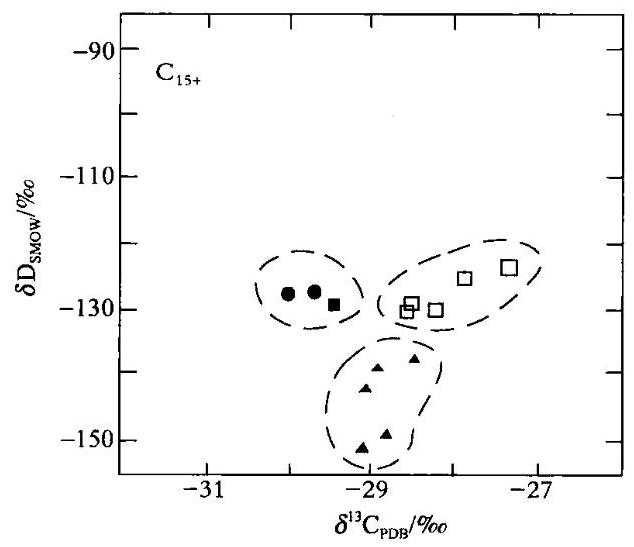

图 2-21 联邦德国南部两个亚阿尔卑斯盆地原油的 $\delta \mathrm{D} \sim  {\delta }^{13}\mathrm{C}$ 关系图 (据 Stahl, 1980)

重东盆地第三系砂岩 $\mathrm{P}$ ; □东盆地第三系砂岩 $\mathrm{A}$ ; 西盆地第三叠系油储; ▲西盆地第三系油储

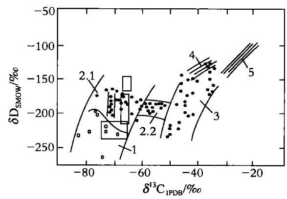

图 2-22 天然气中甲烷的 $\delta \mathrm{D} \sim  {\delta }^{13}{\mathrm{C}}_{1}$ 关系图 (据 Stahl, 1977)

1 一冰碛沼气; 2. 1 一亚阿尔卑斯盆地上第三系甲烷气; 2. 2 一混合成因气; $3\text{、}4\text{、}5$ 一热解成因气

<!-- Media -->

## 第三章 储集层和盖层

地下的石油和天然气就储存在岩层的连通孔隙之中, 其储集方式就好像水充满在海绵里一样。地壳上任何类型的岩石均具有一定的孔隙。孔隙是岩石中未被固体物质占据, 而被流体充满的空间。

凡是具有一定的连通孔隙、能使流体储存并在其中渗滤的岩层称为储集层。如果地下储集层中储存了油气, 就称为含油气层; 业已开采的含油气层称为产 (油气) 层。储集层 (简称储层) 是地下石油和天然气储存的场所, 是构成油气藏的基本要素之一。

盖层是位于储集层上方, 能够阻止油气向上逸散的岩层。盖层主要起遮挡或封闭作用, 它对油气的封盖性是相对于其下伏的储集层而言的。天然气藏对盖层的要求比油藏更严格。盖层对于圈闭的形成具有重要的意义。

## 第一节 储集层物理性质

储集层的物理性质包括储集层的孔隙性、渗透性、孔隙结构以及含油气饱和度等。其中孔隙性和渗透性是储集层的两大基本特性, 也是衡量储集层储集性能好坏的基本参数。

## 一、储集层的孔隙性

储集层的孔隙性在石油与天然气地质学中是指储集层中孔隙空间的形状、大小、连通性与发育程度。地壳中不存在没有孔隙的岩石, 但不同的岩石, 其孔隙大小、形状和发育程度是不同的。石油和天然气在地下是储存在岩石的孔隙中的。因此, 岩石的孔隙发育程度将直接影响岩石中储存油气的数量。

储集层的孔隙包括孔洞和裂隙。岩石中有彼此连通的孔隙, 也有孤立的彼此不连通的孔隙。为了度量岩石孔隙的发育程度, 提出了孔隙度的概念。孔隙度是指岩石孔隙体积与岩石体积之比值 (以百分数表示)。根据研究目的不同, 孔隙度又可分为绝对孔隙度、有效孔隙度及流动孔隙度。

## (一) 绝对孔隙度

岩石中全部孔隙体积称为总孔隙或绝对孔隙。总孔隙 $\left( {V}_{\mathrm{p}}\right)$ 和岩石总体积 $\left( {V}_{\mathrm{t}}\right)$ 之比(以百分数表示)就叫做岩石的总孔隙度或绝对孔隙度 $\left( {\Phi }_{\mathrm{t}}\right)$ 。可用公式表示如下:

$$
{\Phi }_{\mathrm{t}} = \frac{{V}_{\mathrm{p}}}{{V}_{\mathrm{t}}} \times  {100}\%  \tag{3 - 1}
$$

孔隙度反映储集层储集流体的能力。储集岩的总孔隙度越大, 说明岩石中孔隙空间越多, 但是它不能说明流体是否能在其中流动。岩石中不同大小的孔隙对流体的储存和流动所起的作用是完全不同的。根据岩石中孔隙大小(孔径或裂缝的宽度)及其对流体作用的不同, 可将孔隙划分为三种类型。

1. 超毛细管孔隙

管形孔隙直径大于 ${0.5}\mathrm{\;{mm}}$ 或裂缝宽度大于 ${0.25}\mathrm{\;{mm}}$ 者。在此类孔隙中,流体可在重力作用下自由流动, 也可以出现较高的流速, 甚至出现涡流。岩石中的大裂缝、溶洞及未胶结的或胶结疏松的砂岩的孔隙大多属于此类。

2. 毛细管孔隙

管形孔隙直径介于 ${0.5} \sim  {0.0002}\mathrm{\;{mm}}$ 之间,裂缝宽度介于 ${0.25} \sim  {0.0001}\mathrm{\;{mm}}$ 之间者。 在此类孔隙中, 无论是液体质点之间, 还是液体和孔隙壁之间均处于分子引力作用之下, 由于毛细管力的作用, 流体不能自由流动。只有在外力大于毛细管阻力的情况下, 液体才能在其中流动。微裂缝和一般砂岩的孔隙多属此类。

3. 微毛细管孔隙

管形孔隙直径小于 ${0.0002}\mathrm{\;{mm}}$ ,裂缝宽度小于 ${0.0001}\mathrm{\;{mm}}$ 者。在此类孔隙中,流体与周围介质分子之间的引力往往很大, 要使流体移动需要非常高的压力梯度, 这在油层条件下一般是达不到的。因此, 实际上液体是不能沿微毛细管孔隙移动的。泥页岩中的孔隙一般属于此类型。但近年来许多学者研究表明,微孔隙孔径 $\geq  {0.0001}\mathrm{\;{mm}}$ 时,也可作为储集油气的场所。

因此, 从实用的角度出发, 只有那些彼此连通的超毛细管孔隙和毛细管孔隙才是有效的油气储集空间, 即有效孔隙。因为它们不仅能储存油气, 而且可以允许油气渗滤; 而那些孤立的互不连通的孔隙和微毛细管孔隙, 即使其中储存有油和气, 在现代工艺条件下, 也不能开采出来, 所以这些孔隙是没有什么实际意义的。为了研究孔隙对油、气储存的有效性, 在生产实践中, 人们又提出了有效孔隙度的概念。

## (二) 有效孔隙度

有效孔隙度 $\left( {\Phi }_{\mathrm{e}}\right)$ 是指岩石中参与渗流的连通孔隙总体积 $\left( {V}_{\mathrm{e}}\right)$ 与岩石总体积 $\left( {V}_{\mathrm{t}}\right)$ 的比值 (以百分数表示)。可用下式表示:

$$
{\Phi }_{\mathrm{e}} = \frac{{V}_{\mathrm{e}}}{{V}_{\mathrm{t}}} \times  {100}\%  \tag{3 - 2}
$$

显然,同一岩石的绝对孔隙度大于其有效孔隙度,即 ${\Phi }_{\mathrm{t}} &gt; {\Phi }_{\mathrm{e}}$ 。对未胶结的砂层和胶结不甚致密的砂岩, 二者相差不大; 而对于胶结致密的砂岩和碳酸盐岩, 二者可有很大的差异。一般有效孔隙度占总孔隙度的 ${40}\%  \sim  {75}\%$ (F. K. 诺斯,1984)。在含油气层工业评价时, 只有有效孔隙度才有真正的意义, 因此目前生产单位一般所用的都是有效孔隙度, 习惯上把有效孔隙度简称为孔隙度。

## (三) 流动孔隙度

岩石中的连通孔隙虽然彼此相互连通, 但是连通的孔隙未必都是有效的。有些孔隙, 由于其喉道半径极小, 在通常的开采压差下, 仍然难以使液体渗过。此外, 亲水的岩石孔壁表面常存在着水膜, 相应缩小了孔隙通道。为此, 从油气田开发实践出发, 又提出了流动孔隙度的概念。

流动孔隙度 $\left( {\Phi }_{\mathrm{f}}\right)$ 是指在一定压差下,流体可以在其中流动的孔隙总体积 $\left( {V}_{\mathrm{f}}\right)$ 与岩石总体积 $\left( {V}_{\mathrm{t}}\right)$ 的比值 (以百分数表示)。用公式表示为:

$$
{\Phi }_{\mathrm{f}} = \frac{{V}_{\mathrm{f}}}{{V}_{\mathrm{t}}} \times  {100}\%  \tag{3 - 3}
$$

流动孔隙度在概念上不同于连通孔隙度。它不仅不考虑无效孔隙, 亦不考虑那些被毛细管所俘留或束缚的液体所占据的毛细管孔隙, 以及岩石颗粒表面上液体薄膜的体积。此外, 流动孔隙度还随地层中的压力梯度和液体的物理 - 化学性质变化而变化。显然, 同一岩石的流动孔隙度在数据上是不确定的。尽管如此, 流动孔隙度在油气田开发工程分析中却具有十分重要的实用价值。

综上所述, 不难理解同一岩石的绝对孔隙度 > 有效孔隙度 > 流动孔隙度。砂岩储集层的有效孔隙度变化在 $5\%  \sim  {30}\%$ 之间,一般为 ${10}\%  \sim  {20}\%$ ; 碳酸盐岩储集层的孔隙度一般小于 $5\%$ 。莱复生按孔隙度的大小将砂岩储集岩分为五级 (表 3-1)。

<!-- Media -->

表 3-1 砂岩孔隙度评价表

<table><thead><tr><th>级别</th><th>砂岩孔隙度/%</th><th>评价</th></tr></thead><tr><td>1</td><td>${20} \sim  {25}$</td><td>很好</td></tr><tr><td>2</td><td>${15} \sim  {20}$</td><td>好</td></tr><tr><td>3</td><td>${10} \sim  {15}$</td><td>中等</td></tr><tr><td>4</td><td>$5 \sim  {10}$</td><td>差</td></tr><tr><td>5</td><td>$0 \sim  5$</td><td>无价值</td></tr></table>

<!-- Media -->

值得注意的是, 孔隙度的大小与孔隙个体的大小是两个截然不同的概念。孔隙度只说明岩石中孔隙或有效孔隙在岩石中所占的比例, 并不涉及孔隙本身的大小。两块具有相似孔隙度的岩石, 其孔隙个体大小可以很不相同。孔隙个体大小不仅直接影响着储集岩中油气储存的集中程度, 而且对储集岩的渗透性也有着重要的影响。

## 二、储集层的渗透性

储集层的渗透性是指在一定的压差下, 岩石允许流体通过其连通孔隙的性质。换言之, 渗透性是指岩石对流体的传导性能。严格地讲, 自然界的一切岩石均具有相互连通的孔隙, 在漫长的地质年代里, 在足够大的压差条件下它们都具有一定的渗透性。通常我们所称的渗透性岩石与非渗透性岩石是相对的。渗透性岩石是指在地层压力条件下, 流体能较快地通过其连通孔隙的岩石, 如砂岩、砾岩、裂缝灰岩、白云岩等等。如果流体通过的速度很慢, 通过的数量有限, 那就叫非渗透性岩石, 如泥页岩、石膏、岩盐、致密灰岩等等。储集层的渗透性决定了油气在其中渗滤的难易程度。它是评价储集层产能的主要参数之一。

岩石渗透性的好坏用渗透率来表示。渗透率是一个具有方向性的向量, 也就是说, 从不同方向测得的岩石渗透率是不同的。根据生产实践的需要, 人们提出了绝对渗透率、有效渗透率和相对渗透率的概念。

## (一) 绝对渗透率

当岩石为某一单相流体饱和时, 岩石与流体之间不发生任何物理 - 化学反应, 在一定压差作用下, 流体呈水平线性稳定流动状态时所测得的岩石对流体的渗透率, 称为该岩石的绝对渗透率。大量实验研究表明, 当单相流体通过多孔介质沿孔隙通道呈层状流动时, 遵循直线渗滤定律, 法国人亨利・达西 (1856) 首先建立了这一定律, 其简单表达式如下:

$$
Q = k\frac{A \cdot  {\Delta p}}{\mu  \cdot  L} \tag{3 - 4}
$$

式中: $k$ 为渗透率; $Q$ 为液体的体积流量; ${\Delta p}$ 为岩样两端的压差; $\mu$ 为液体的黏度; $A$ 和 $L$ 分别为岩样的横截面积和长度。因此有:

$$
k = \frac{Q \cdot  \mu  \cdot  L}{A \cdot  {\Delta p}} \tag{3 - 5}
$$

对于气体而言, 由于气体的体积流量随温度和压力的变化而变化。因此, 用达西公式计算气测渗透率时要作适当的变换。若假定气体是在恒温情况下通过岩样的, 则岩石气测渗透率的表达式为:

$$
k = \frac{2{Q}_{2} \cdot  {p}_{2} \cdot  {\mu }_{\mathrm{g}} \cdot  L}{\left( {{p}_{1}^{2} - {p}_{2}^{2}}\right)  \cdot  A} \tag{3 - 6}
$$

式中: ${p}_{1}$ 为岩样进口处压力; ${p}_{2}$ 为岩样出口处压力; ${Q}_{2}$ 为通过岩样后,在出口压力 $\left( {p}_{2}\right)$ 下,气体的体积流量; ${\mu }_{\mathrm{g}}$ 为气体的黏度; $A$ 和 $L$ 分别为岩样的横截面积和长度。

在法定计量 (SI) 单位中,渗透率的单位为平方米 $\left( {\mathrm{m}}^{2}\right)$ ,常用平方微米 $\left( {\mu {\mathrm{m}}^{2}}\right)$ 表示。在标准制 $\left( {\mathrm{C} \cdot  \mathrm{G} \cdot  \mathrm{S}}\right)$ 单位中,渗透率的单位是达西(D)。由于用达西作为含油气层岩石渗透率的单位有时太大,故一般取其千分之一作单位,称为毫达西(mD)。按上述规定,1 达西 $\left( \mathrm{D}\right)  = {0.987\mu }{\mathrm{m}}^{2};1$ 毫达西 $\left( \mathrm{{mD}}\right)  = {0.987} \times  {10}^{-3}\mu {\mathrm{m}}^{2}$ 。

从理论上讲, 岩石的绝对渗透率只反映岩石本身的特性, 而与测定所用流体性质及测定条件无关。但在实际测定工作中, 人们发现同一岩样, 同一种气体, 在不同的平均压力下, 所测得的绝对渗透率是不同的。低平均压力下测得的渗透率较高, 高平均压力下测得的渗透率较低。同一岩样在相同的平均压力下, 用不同气体测得的绝对渗透率也是不同的。通常密度大的气体测得的渗透率值偏低; 以液体为介质测得的渗透率总是低于用气体测得的渗透率。由于目前主要用空气或氦气测定岩石的绝对渗透率, 故又称气体渗透率。

储集层的渗透率无论是垂向上还是横向上都有很大的差别,一般变化在 ${0.001} \sim  {1\mu }{\mathrm{m}}^{2}$ 之间,最高可达几个 $\mu {\mathrm{m}}^{2}$ 。KalihHKO (1983) 按渗透率大小将储集层分为 7 级 (表 3-2)。 对石油和天然气储集层评价的标准是不一样的。

## (二)有效渗透率和相对渗透率

以上我们讨论了岩石孔隙中只有单相流体充满时岩石的渗透率情况。但在实际地层条件下, 储集层孔隙中的流体往往不是单相的, 而是两相 (油 - 气、油 - 水、气 - 水、气 - 水), 甚至三相 (油一气一水) 同时存在。各相流体之间存在着互相干扰和影响, 因而岩石对其中每一相流体的渗流作用, 与单相流体饱和时的渗流作用有很大区别。因此, 又提出了有效渗透率和相对渗透率的概念。

<!-- Media -->

表 3-2 储集层渗透率评价表

<table><thead><tr><th rowspan="2">级别</th><th rowspan="2">渗透率 $/{10}^{-3}{\mathrm{{\mu m}}}^{2}$</th><th colspan="2">评价</th></tr><tr><th>油层</th><th>气层</th></tr></thead><tr><td>1</td><td>$> {1000}$</td><td>极好</td><td rowspan="4">常规储集层</td></tr><tr><td>2</td><td>${100} \sim  {500}$</td><td>好</td></tr><tr><td>3</td><td>${500} \sim  {100}$</td><td>中等</td></tr><tr><td>4</td><td>${100} \sim  {10}$</td><td>较差</td></tr><tr><td>5</td><td>${10} \sim  1$</td><td>差 - 可能</td><td rowspan="2">低渗透储集层</td></tr><tr><td>6</td><td>$1 \sim  {0.1}$</td><td>不渗透</td></tr><tr><td>7</td><td>$< {0.1}$</td><td/><td>致密储集层</td></tr></table>

<!-- Media -->

有效渗透率又称相渗透率, 是指储集层中有多相流体共存时, 岩石对其中每一单相流体的渗透率。分别用 ${k}_{\mathrm{o}}\text{、}{k}_{\mathrm{g}}\text{、}{k}_{\mathrm{w}}$ 表示油、气、水的有效渗透率。

相对渗透率是指岩石中多相流体共存时, 岩石对某一相流体的有效渗透率与岩石绝对渗透率之比值。通常用 ${k}_{\mathrm{o}}/k\text{、}{k}_{\mathrm{g}}/k\text{、}{k}_{\mathrm{w}}/k$ 分别表示油、气、水相的相对渗透率。

由于岩石中有多相流体渗流时, 必然会相互影响和干扰, 因此, 岩石的有效渗透率总是小于绝对渗透率,故相对渗透率总是变化在 $0 \sim  1$ 之间。

有效渗透率和相对渗透率不仅与岩石的结构有关, 而且还与流体的性质和饱和度有密切关系。一般地说, 每一相流体发生渗流时都有一个临界饱和度值, 当其饱和度低于其临界饱和度时, 不发生渗流, 有效渗透率和相对渗透率为零; 当其饱和度达到临界值时, 才能渗流, 而且随着饱和度的增加, 其有效渗透率和相对渗透率也增加, 直到全部被它饱和时, 其有效渗透率等于绝对渗透率, 相对渗透率等于 1 为止。

图 3-1 和图 3-2 是在实验室里用松散沙子测得的油、气、水的相对渗透率与它们的饱和度的关系曲线。图中表明某一单相流体的有效渗透率和相对渗透率与其饱和度(某一单相流体体积与岩石孔隙体积之比值)成正相关关系。随着该相流体饱和度的增加, 其有效渗透率和相对渗透率均增加, 直到全部被某一单相流体所饱和, 其有效渗透率等于绝对渗透率, 相对渗透率等于 1 为止。

<!-- Media -->

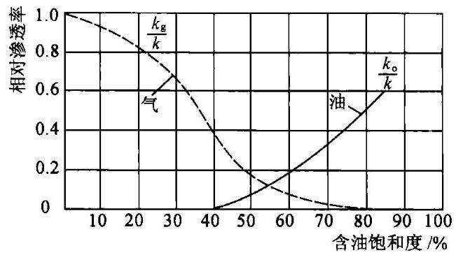

图 3-1 油气饱和度与相对渗透率的关系曲线 (据 Levorsen, 1954)

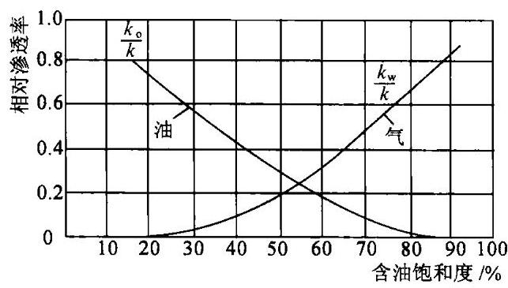

图 3-2 油水饱和度与相对渗透率的关系曲线 (据 Levorsen, 1954)

<!-- Media -->

## (三) 孔隙度与渗透率的关系

储集层的孔隙度与渗透率之间通常没有严格的函数关系, 因为影响它们的因素很多。 岩石的渗透率除受孔隙度的影响外, 还受孔道截面大小、形状、连通性以及流体性能的影响。例如,粘土岩的绝对孔隙度可以很大 $\left( {{30}\%  \sim  {40}\% }\right)$ ,但其渗透率却可以很低; 裂缝发育的致密灰岩虽然其绝对孔隙度较低, 但它却可以有很高的渗透率, 以致常成为高产油气层。

尽管岩石的孔隙度和渗透率之间没有严格的函数关系, 但它们之间还是有一定的内在联系的, 因为岩石的孔隙度和渗透率一般皆取决于岩石本身的结构与组成。凡具有渗透性的岩石均具有一定的孔隙度。大量实际资料也表明: 岩石的孔隙度与渗透率之间有一定的相关关系 (图 3-3), 特别是有效孔隙度与渗透率的关系更为密切。

<!-- Media -->

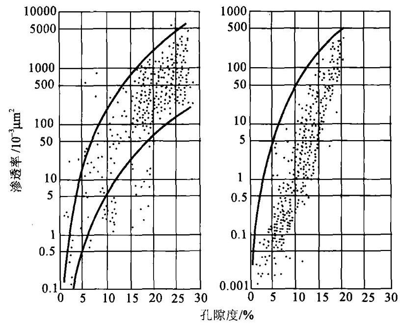

图 3-3 不同时代的砂岩孔隙度和渗透率关系图

(据 Füchtbauer, 1967)

<!-- Media -->

对于碎屑岩储集层, 一般是有效孔隙度越大, 其渗透率越高, 渗透率随有效孔隙度的增加而有规律地增加, 大多可以用指数形式表示。对于碳酸盐岩来说, 特别是裂缝性灰岩其孔隙度与渗透率之间的关系很不明显, 在使用碳酸盐岩的孔 - 渗关系时, 必须十分慎重。

总之, 孔隙性和渗透性是储集层的两大基本特性, 也是决定储集层储集性能好坏的两个基本因素, 它们都与岩石的孔隙结构有关。

## 三、储集层的孔隙结构

上面讨论的孔隙度和渗透率, 对于评价渗透率较高的储集层是适用的。而对于低渗透性储集层 (渗透率小于 ${0.987} \times  {10}^{-3}{\mathrm{{\mu m}}}^{2}$ ),仅利用孔隙度和渗透率就无法正确评价储集层的性质, 必须研究岩石的孔隙结构。

储集层的孔隙结构是指岩石所具有的孔隙和喉道的几何形状、大小、分布及其相互连通关系。岩石的孔隙系统由孔隙和喉道两部分组成。孔隙为系统中的膨大部分, 连通孔隙的细小部分称为喉道 (图 3-4)。油气水在储集层复杂的孔隙系统中渗流时, 将要经过一系列交替存在的孔隙和喉道。

<!-- Media -->

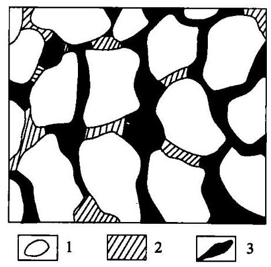

图 3-4 岩石孔隙系统示意图 1一岩石颗粒; 2一胶结物; 3-孔隙系统

<!-- Media -->

无论是在二次运移过程中石油驱替岩石中的水, 还是在开采过程中石油从孔隙介质中被驱替出来, 其渗流均受到流体通道中断面最小的部分 (即喉道) 所控制。 显然, 喉道的大小和分布, 以及它们的几何形态是影响储集岩的储集能力和渗透特征的主要因素。孔隙结构实质上是岩石的微观物理性质, 它能较深入而细致地揭示岩石的储渗特征。确定喉道的大小和分布是研究岩石孔隙结构的中心问题。

测定岩石孔隙结构的方法很多, 有压汞法、孔隙铸体法、半渗透隔板法、离心机法、 蒸气压力法等等。目前我国主要采用压汞法, 并取得了较好的效果。

由于岩石的孔喉细小, 当两种或两种以上互不相溶的流体同处于岩石孔隙系统中或通过岩石孔隙系统渗流时, 必定会发生毛细管现象, 产生一个指向非润湿相流体内部的毛细管压力,毛细管压力 $\left( {p}_{\mathrm{c}}\right)$ 的大小与毛细管 (喉道) 半径(r)、界面张力 $\left( \sigma \right)$ 和润湿角 $\left( \theta \right)$ 有关,简单的数学表达式如下:

$$
{p}_{\mathrm{c}} = \frac{{2\sigma }\cos \theta }{r} \tag{3 - 7}
$$

<!-- Media -->

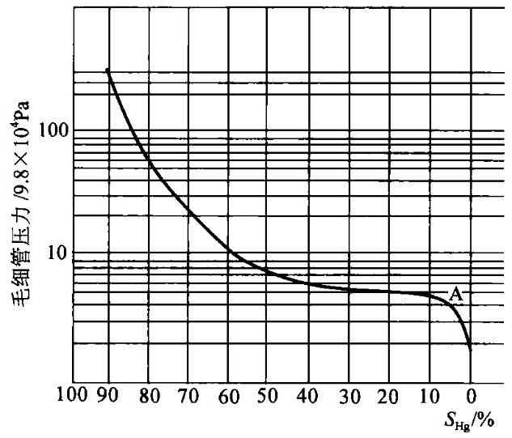

图 3-5 毛细管压力曲线图 A一曲线拐点

<!-- Media -->

压汞法就是根据这种毛细管现象的原理设计的。在不同的压力下, 把非润湿相的汞压入岩石孔隙系统中, 根据所加压力 (相当于毛细管压力) 与注入岩石的汞量, 绘出压力与汞饱和度关系曲线, 这种曲线称为毛细管压力曲线或压汞曲线 (图 3-5)。再据上述公式可计算出岩石孔喉等效半径, 结合事先测得的岩石总孔隙度资料, 就可作出孔喉等效半径分布图 (图 3-6)。运用这两张图可对岩石的孔隙结构进行分类评价。定量描述孔隙结构的参数有以下几个:

1) 排驱 (替) 压力 $\left( {p}_{\mathrm{d}}\right)$ : 是指压汞实验中汞开始大量注入岩样的压力。换言之, 是非润湿相开始注入岩样中最大的连通喉道的毛细管压力。在毛细管压力曲线上压力最小的拐点 $\mathrm{A}$ (图 3-5) 所对应的压力即为排驱压力。岩石排驱压力越小,说明大孔喉越多, 孔隙结构越好; 反之, 孔隙结构就越差。
2) 孔喉半径集中范围与百分含量: 利用孔隙等效半径分布图, 可选取孔喉半径集中范围, 计算出它的百分含量。在毛细管压力曲线上, 曲线平坦段位置越低, 说明集中的孔喉越粗; 平坦段越长, 说明集中的孔喉的百分含量越大。孔喉半径的集中范围与百分含量反映了孔喉半径的粗细程度和分选性。孔喉越粗, 分选性越好, 其孔隙结构越好。

<!-- Media -->

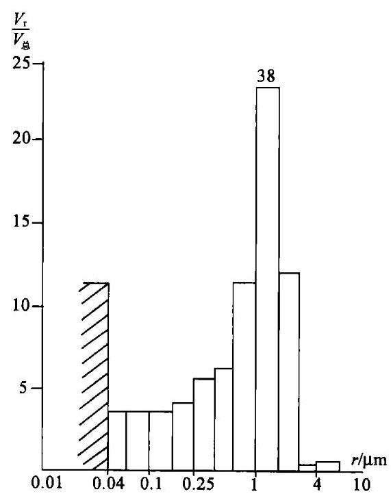

图 3-6 孔隙等效半径分布图

<!-- Media -->

3) 饱和度中值压力 $\left( {p{\mathrm{c}}_{50}}\right)$ : 是指非润湿相饱和度为 ${50}\%$ 时对应的毛细管压力。与 $\left( {p{\mathrm{c}}_{50}}\right)$ 相对应的喉道半径, 称为饱和度中值喉道半径 $\left( {r}_{50}\right)$ ,简称中值半径。 $p{\mathrm{c}}_{50}$ 越低, ${r}_{50}$ 越大,则岩石孔隙结构越好; 反之, 则越差。当岩样喉道半径接近正态分布时, ${r}_{50}$ 可粗略地视为平均喉道半径。
4) 最小非饱和孔隙体积百分数 $\left( {{S}_{\min }/\% }\right)$ : 当注入汞的压力达到仪器的最高压力时, 仍没有被汞侵入的孔隙体积百分数, 称为最小非饱和孔隙体积百分数。这个值与仪器的最高压力, 岩石的润湿性、岩石颗粒大小、均一程度、胶结类型、孔隙度和渗透率等都有密切关系, 它不总是代表束缚水饱和度。在不同条件下, ${S}_{\min }$ 的测试值可在 $0 \sim  {100}\%$ 之间变化。为了便于对比,一般将小于 ${0.04\mu }{\mathrm{m}}^{2}$ 的孔隙都称为束缚孔隙,束缚孔隙一般为水所占据。束缚孔隙含量愈大, 储集层的渗流性能就越差。

由上述可知, 岩石的排驱 (替) 压力越低, 孔喉半径越大, 分选性越好, 束缚水孔隙度越低, 则说明岩石的孔隙结构好, 有利于油气的储存和渗滤; 反之, 孔隙结构则差, 不利于油气渗滤。

## 四、含油气饱和度

储集层的孔隙被油、气、水充填。油、气、水的含量分别占总孔隙体积的百分数称为油、气、水饱和度。

多数储集层为沉积岩, 它们最初饱含水, 石油和天然气则是后来通过排驱原生水而进入孔隙的。油藏中的油、水分布反映出毛细管压力同油、水两相压力差相平衡的结果。显然, 在油藏的不同高度油、水饱和度是变化的。

实验室中测定的岩样水的饱和度值常可能由于取心技术不佳而被歪曲。为了获取较为真实的油、气、水饱和度资料, 最好根据新钻取的或密闭取心的岩样作饱和度测定, 也可以研究水饱和度与孔隙度、渗透率以及其他参数之间的关系。这些关系是相当复杂的, 但对许多地区常可以找出经验关系。

## 第二节 储集层类型

世界上已知油气储集层的岩石类型很多, 在组成地壳的三大岩石中都发现有油气田。 但勘探实践表明, 世界上绝大多数油气藏的含油气层是沉积岩层, 其中又以碎屑岩和碳酸盐岩最为重要, 只有少数油气储集在其他岩类中。因此按岩石类型常将储集层分为碎屑储集层、碳酸盐岩储集层和其他岩类储集层 3 类。按主要储集空间类型又可将储集层分为孔隙型储集层、裂缝型储集层和裂缝 - 孔隙型储集层。按孔隙度和渗透率的大小还可划分出常规储集层、低渗透储集层和致密储集层等。

## 一、碎屑岩储集层

碎屑岩储集层是世界上各主要含油气区的重要储集层之一。世界上许多特大油气田, 如西西伯利亚盆地的各大油田、布尔甘油田、玻利瓦尔湖岸油田、普鲁德霍湾油田、格罗宁根气田等, 它们的储集层都是碎屑岩储集层。我国的大庆、胜利、大港、克拉玛依、吐哈油田等, 其储集层也都是碎屑岩储集层。

## (一) 孔隙类型

碎屑岩储集层的孔隙类型, 按成因可分为原生孔隙、次生孔隙和混合孔隙。 1. 原生孔隙

<!-- Media -->

图 3-7 粒间孔隙的镜下示意图

<!-- Media -->

原生孔隙是指在沉积时期或在成岩过程中形成的孔隙。原生孔隙主要是粒间孔隙。所谓粒间孔隙是指碎屑颗粒支撑的碎屑岩, 在碎屑颗粒之间未被杂基充填, 胶结物含量少而留下的原始孔隙 (图 3-7)。粒间孔隙在砂岩储集层中最普遍, 分布比较稳定。具粒间孔隙的砂岩储集层孔隙度为 $5\%  \sim$ ${40}\%$ ,后者几乎是未固结的松散砂层。

## 2. 次生孔隙

尽管早在 1934 年, Natting 就已发现砂岩中的次生孔隙, 但是在相当长时间内, 大多数油气地质学家仍将原生粒间孔隙作为砂岩的主要储集空间类型。 直到 1977 年 Schmidt 等对砂岩的成岩过程和次生孔隙作了较全面的讨论后, 情况才发生了根本的变化。Schmidt 等参照研究程度较高的碳酸盐岩孔隙类型, 结合碎屑岩的具体特点, 将碎屑岩中孔隙类型分为 5 种, 即粒间孔隙、特大孔隙、铸模孔隙、组分内孔隙和裂缝。

20 世纪 80 年代中期, 我国对砂岩次生孔隙的研究也有较大发展, 如吕正谋等 (1985) 对东营凹陷下第三系砂岩次生孔隙作了较深入的研究, 提出了 12 种识别次生孔隙的标志 (图 3-8)。类似的研究在我国其他油气区也已广泛开展。

<!-- Media -->

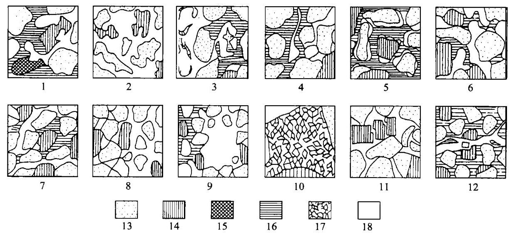

图 3-8 东营凹陷下第三系砂岩次生孔隙识别标志综合示意图

(据吕正谋等, 1985, 引自陈荣书, 1994)

1一部分溶解; 2-受溶蚀颗粒及过量孔隙; 3-溶蚀残骸; 4-铸模孔隙; 5-贴粒孔隙; 6-残余胶结物; 7 一伸长型孔隙; 8 一不均匀型填集; 9 一超粒大孔隙; 10 一油浸碳酸盐; 11 一破碎颗粒; 12 一岩石裂缝;

13一石英; 14一长石; 15 一砂屑; 16 一碳酸盐胶结物; 17 碳酸盐基质; 18 一孔隙

<!-- Media -->

## 3. 混合孔隙

指部分原生孔隙和部分次生孔隙组成的孔隙。大部分孔隙都是混合成因的, 它们可以具有次生孔隙的所有结构方式。但混合孔隙中原生孔隙和次生孔隙的相对含量往往难于估计。

## (二)影响碎屑岩储集层储集物性的主要因素

影响碎屑岩储集层储集物性的主要因素有以下几个方面。

1. 沉积作用对储集层物性的影响

沉积作用对碎屑岩的矿物成分、结构、粒度、分选、磨圆、填集的杂基含量等方面都起着明显的控制作用, 而这些因素对储集层物性都有不同程度的影响。

## (1)碎屑岩的矿物成分

碎屑岩的矿物成分以石英和长石为主, 它们对储集层物性的影响不同。通常情况下, 长石砂岩比石英砂岩储集物性差。其原因是: ①长石的润湿性比石英强, 当被油或水润湿时, 长石表面所形成的液体薄膜比石英表面厚, 在一定程度上减少了孔隙的流动截面积, 导致渗透率变小; ②长石比石英的抗风化能力弱, 石英抗风化能力强, 颗粒表面光滑, 油气容易通过, 长石不耐风化, 颗粒表面常有次生高岭土和绢云母, 它们一方面对油气有吸附作用, 另一方面吸水膨胀堵塞原来的孔隙和喉道, 因此, 长石砂岩比石英砂岩储集物性差。

需要说明的是: 以上所说的是在一般情况下长石碎屑对碎屑岩储集层物性的影响, 不可一概而论。实际上, 我国某些油田长石 - 石英砂岩或长石砂岩的储集物性是相当好的, 甚至比海相石英砂岩还好, 这主要是因为长石未经较深的风化所致。

## (2) 岩石的结构

碎屑岩沉积时所形成的粒间孔隙的大小、形态和发育程度主要受碎屑岩的结构(粒径、分选、磨圆和填集程度等)的影响。

在假定碎屑岩的碎屑颗粒为等大球体的前提下, 那么碎屑岩的孔隙度值只和球体的排列方式有关,而与球体的大小无关。其绝对孔隙度 $\left( {\Phi }_{t}\right)$ 可用公式表示如下:

$$
{\Phi }_{1} = 1 - \frac{\pi }{6\left( {1 - \cos \theta }\right) \sqrt{1 + 2\cos \theta }}
$$

<!-- Media -->

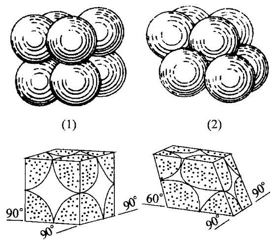

图 3-9 理想等球体排列端员形式图

(1) 立方体排列; (2) 菱面体排列

<!-- Media -->

理想球体紧密排列的端员形式有两种 (图 3-9): ①表示立方体排列, $\theta  = {90}^{ \circ  }$ ,堆积最疏松,孔隙度最大,其理论孔隙度为 ${47.6}\%$ ,孔径大,渗透率也大; ② 表示菱面体排列, $\theta  = {60}^{ \circ  }$ , 排列最紧密, 孔隙度小, 其理论孔隙度为 ${25.9}\%$ ,孔径小,渗透率低。因此,理论上的孔隙度介于 ${46.7}\%  \sim  {25.9}\%$ 之间,但这种理想情况在自然界是不存在的, 自然界的实际情况比这种理想情况要复杂得多。

碎屑岩储集层储集物性不仅与粒径有关, 而且与岩石颗粒的分选程度有很大的关系。图 3-10 表示分选系数一定时渗透率的对数值与粒度中值成线性关系, 粒度愈大, 渗透率愈高。在粒度相近的情况下, 分选差的碎屑岩, 因细小的碎屑充填了颗粒间孔隙和喉道, 不仅降低了孔隙度, 而且也降低了渗透率。图 3-11 表示粒度中值一定时, 渗透率的对数和分选系数 $\left( {S}_{0}\right)$ 呈近似的线性关系,从分选好至中等时,渗透率下降很快; 分选差时,渗透率下降就缓慢了。

(3) 杂基含量

在与沉积作用有关的影响碎屑岩储集层物性的各种因素中, 最为重要的是杂基含量。 所谓杂基是指颗粒直径小于 ${0.0315}\mathrm{\;{mm}}$ 的非化学沉淀颗粒。杂基含量是沉积环境能量最重要的标志之一。一般杂基含量高的碎屑岩, 分选差, 平均粒径较小, 喉道也小, 孔隙结构复杂, 储集物性差。因此, 杂基含量是影响孔隙性、渗透性最重要的因素之一。 2. 成岩后生作用对储集层物性的影响

成岩后生作用贯穿成岩过程的始终, 因而对碎屑岩储集层的物性影响很大。它可以改造碎屑岩在沉积时形成的原生孔隙, 也可以完全堵塞这些原生孔隙, 或溶蚀可溶矿物而形成次生溶蚀孔隙, 从而改变碎屑储集岩的储集条件。碎屑岩的成岩后生作用是很复杂的, 在《沉积岩石学》 (曾允孚等, 1986) 中有重点论述, 这里仅对储集层物性影响较大的成岩后生作用加以讨论。

## (1) 压实作用

它包括早期机械压实和晚期的压溶作用。机械压实作用是指在上覆沉积负荷作用下岩石逐步致密化的过程。压实作用主要发生在成岩作用的早期, ${3000}\mathrm{\;m}$ 以上压实作用的效果和特征明显。压实作用使砂岩储集层的孔隙度迅速减小, 但不同类型的砂岩, 其孔隙度衰减的速率不同。如粘土杂基含量高的砂岩, 其孔隙度衰减速率大, 而纯净砂岩的孔隙度衰减速率小。

<!-- Media -->

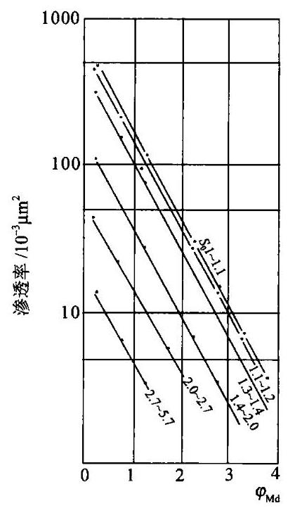

图 3-10 分选系数一定时渗透率与粒度中值关系 (据 D. C. Beard & P. K. Weyl, 1973)

图 3-11 粒度中值一定时渗透率与分选系数关系 (据 D. C. Beard & P. K. Weyl, 1973)

<!-- Media -->

压溶作用是指发生在颗粒接触点上, 即压力传递点上有明显的溶解作用, 造成颗粒间互相嵌入的凹凸接触和缝合线接触。由于碎屑颗粒在压力作用下溶解,使得 $\mathrm{{Si}}\text{、}\mathrm{{Al}}\text{、}\mathrm{{Na}}$ 、 $\mathrm{K}$ 等造岩元素转入溶液,引起物质再分配,造成在低压处石英和长石颗粒的次生加大和胶结。据费希特鲍尔对含油区砂岩的研究,石英在 ${500} \sim  {1000}\mathrm{\;m}$ 埋深就开始次生加大,并随着埋深的增加, 次生加大的石英颗粒增多。石英次生加大对岩石孔隙度有可观的影响, 有时可以占满全部孔隙。

## (2)胶结作用

胶结作用是碎屑颗粒相互联接的过程。松散的碎屑沉积物通过胶结作用变成固结的岩石。胶结作用总体上使储集层物性变差。

胶结物的成分和含量是两个重要因素。碎屑岩胶结物的成分有泥质、钙质、硅质、铁质、石膏质等。一般说来, 泥质、钙 - 泥质胶结的岩石较疏松, 储油物性较好, 纯钙质、 硅质、硅一铁质或铁质胶结的岩石致密, 储油物性较差。胶结物含量高的储集层, 粒间孔隙多被充填, 使孔隙减少, 连通性变差, 储集物性变差; 反之, 储集物性较好。据松辽盆地储集层钙质含量的统计资料,一般当钙质含量大于 $5\%$ 时,其储油物性明显下降。

另外, 碎屑岩储集层中粘土矿物的组成、含量、产状和分布特征也直接影响其储集性。

(3)溶解作用

在地下深处由于孔隙水成分变化, 导致长石、火山岩屑、碳酸盐岩屑和方解石、硫酸盐等胶结物或岩石颗粒的溶解, 形成次生溶蚀孔隙, 使储集层孔隙度增大。这种次生溶蚀孔隙对改善储集层物性的重要性受到越来越多的重视。

影响溶解作用的因素很多, 如沉积时具有较粗的粒度, 孔隙 - 渗透性好的碎屑岩; 砂岩中含可溶性物质较多; 地下水呈酸性而且具有一定流动速度等都有利于次生孔隙形成。 其中尤以酸性水的形成最为重要。对地下酸性水的形成条件, 有许多见解。Schmidt (1979) 认为: 干酪根热演化早期释放出大量 ${\mathrm{{CO}}}_{2}$ ,是形成酸性水的重要原因,这种成油期前形成的酸性水溶蚀作用所造成的次生孔隙带特别有利于油气聚集。Curtis (1983) 则认为: 有机酸和无机质反应是形成次生孔隙的理想机理。据研究,在 ${80} \sim  {120}^{ \circ  }\mathrm{C}$ 时,地下水富含短链有机酸, 能大大提高对高岭石的溶解度, 其中二元酸 (如草酸) 含量达到一定浓度时, 使铝的溶解度提高 3 个数量级。而 III 型干酪根热演化过程中释放出的羧基约有 ${40}\%$ 是以草酸形式出现的。先于油、气 (热成因) 形成的羧基释放出有利于在相邻砂岩孔喉中清除碳酸盐、硫酸盐和硅铝酸盐的 ${\mathrm{{CO}}}_{2}$ ,从而提高砂岩储集性。此外,在较高温度下,碳酸盐矿物之间的无机反应,亦能生成 ${\mathrm{{CO}}}_{2}$ ; 硫酸盐在脱硫菌和有机质参与下能生成 ${\mathrm{H}}_{2}\mathrm{\;S}$ 也有利于提高硫酸盐的溶解能力。

必须指出的是, 酸性水溶解的物质只有在不断被带走的条件下, 才能使溶蚀作用朝有利于形成次生孔隙的方向发展。否则, 随着溶质增加, 溶蚀作用就会减弱, 在达到过饱和时还可以再沉淀, 堵塞孔隙。

需要明确的是, 碎屑岩储集层的主体是砂岩体, 要研究碎屑岩储集层就必须从砂岩体着手。所谓砂岩体是指在某一沉积环境下形成, 具有一定形态、岩性和分布特征, 并以砂质岩为主的沉积岩体。砂岩体的分布及特征受沉积环境的控制。近年来, 国内外对不同成因类型的砂岩体进行了大量的研究工作, 发现除冰川堆积的砂砾岩体尚未见到油气外, 其他类型的砂岩体都已见到数量不等的石油和天然气。其中以海岸带附近的各种类型砂岩体与油气的关系最为密切。

## 二、碳酸盐岩储集层

碳酸盐岩储集层岩石类型以粒屑灰岩、礁灰岩、白云岩为主。碳酸盐岩储集层是另一类重要的油气产层。碳酸盐岩储集层中的油气储量占世界油气总储量的一半,产量已达到总产量的 ${60}\%$ 以上。碳酸盐岩油气田一般比砂岩油气田储量大,单井产量高。对世界上 198 个大油田统计表明 (Moody,1975),碳酸盐岩大油田平均可采储量为 ${5.6} \times  {10}^{8}\mathrm{t}$ ,砂岩大油田的平均可采储量为 ${2.9} \times  {10}^{8}\mathrm{t}$ 。另外,世界上共有 9 口日产量曾达万吨以上的高产井, 其中有 8 口属碳酸盐岩储集层。如波斯湾盆地是世界碳酸盐岩油气田分布最集中的地区, 其中沙特阿拉伯的盖瓦尔油田是世界特大型的碳酸盐岩油田, 其可采储量高达 107 $\times  {10}^{8}\mathrm{t}$ ,也是目前世界上可采储量最大的油田。

我国碳酸盐岩地层分布极为广泛, 层位多, 厚度大, 油气显示丰富, 并已找到了工业性的油气藏。四川在碳酸盐岩地层中采气已有两千多年的历史。20 世纪 80 年代中期后华北任丘古潜山 (碳酸盐岩) 油田, 塔里木盆地塔河油气田的发现, 为在我国寻找碳酸盐岩油气田打开了新局面。

## (一) 孔隙类型

孔隙类型依其形态特征可分为孔隙、溶洞和裂缝三类。一般说来, 孔隙和溶洞是主要的储集空间, 裂缝是主要的渗滤通道, 也是储集空间。

碳酸盐岩孔隙的形成过程是一个复杂而长期的过程, 它贯穿在整个沉积过程及其以后的各个地质历史时期。除了受沉积环境的控制外, 地下热动力场、地下或地表水化学场、构造应力场等因素均对它们的形成和发展有巨大的影响。由于碳酸盐岩的特殊性 (易溶性和不稳定性), 使碳酸盐岩储集空间的演化相当复杂, 孔隙类型多、变化快, 往往在同一储集层内存在着多种类型的孔隙, 各种孔隙又往往经受几种因素的作用和改造。因此, 对碳酸盐岩孔隙分类时, 既要考虑它的原始成因, 又要考虑它在整个地质历史过程中的改造和变化。关于碳酸盐岩孔隙类型的划分方案较多。Choquette 和 Pray (1970, 1985) 根据受组构控制与不受组构控制两项关系, 将碳酸盐岩孔隙划分为与组构有关、 与组构无关及介于两者之间的三大类型若十种孔隙 (图 3-12), 其中有几种为常见类型, 其他则为比较特殊的类型。当然, 根据孔隙成因也可将碳酸盐岩分为原生孔隙和次生孔隙两大类。

<!-- Media -->

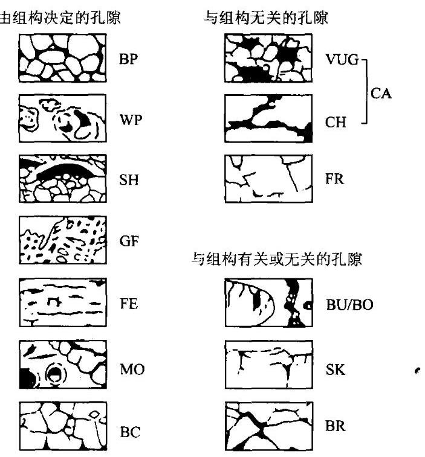

图 3-12 碳酸盐岩孔隙分类

(据 Choquette 和 Pray, 1970 修改) $\mathrm{{BP}}$ 一粒间孔; WP一粒内孔; $\mathrm{{SH}}$ 一遮盖孔; GF-生长骨架孔; FE-蚀窗孔; MO一铸模孔; BC一晶间孔; VUG一孔洞; CH一沟道; CA一洞; FR一裂缝; BU/BO一虫掘/蚀穴孔; SK一收缩孔; BR一角砾孔

<!-- Media -->

## (二)影响碳酸盐岩储集层性的主要因素

## 1. 沉积环境

沉积环境, 即介质的水动力条件, 是影响碳酸盐岩原生孔隙发育的主要因素。碳酸盐岩原生孔隙的类型虽然多种多样, 但主要的是粒间孔隙和生物骨架孔隙。这类孔隙的发育程度主要取决于粒屑的大小、分选程度、胶结物含量以及造礁生物的繁殖情况。因此, 水动力能量较强的或有利于造礁生物繁殖的沉积环境, 常常是原生孔隙型碳酸盐岩储集层的分布地带。主要有台地前缘斜坡相、生物礁相、浅滩相和潮坪相等。在水动力能量低的环境里形成微晶或隐晶石灰岩, 由于晶间孔隙微小, 加上生物体少, 不能产生较多的有机酸和 ${\mathrm{{CO}}}_{2}$ ,因此不仅在沉积时期,就是在成岩阶段要形成较多的次生溶孔也是比较困难的。

## 2. 成岩后生作用

碳酸盐岩在沉积时期所形成的原生孔隙会因其后发生的各种成岩后生作用而改变。碳酸盐岩的成岩后生作用有些有利于储集层物性的改善, 而有些则使储集层物性变差。因此, 研究成岩后生作用对孔隙的影响是很重要的。碳酸盐岩的成岩后生作用主要有溶蚀作用、胶结作用、重结晶作用、白云石化作用、溶解作用、方解石化作用、硅化作用、硫酸盐化作用等。

(1) 溶蚀作用

碳酸盐岩孔隙的形成和发育与地下水的溶解作用和淋滤作用关系密切, 这是由碳酸盐岩的易溶性所决定的。地下水因溶解带走了易溶矿物是造成溶蚀孔隙、孔洞的原因, 也是溶蚀裂缝扩大的原因。巨大的岩溶洞穴、地下暗河等是碳酸盐岩发育区常见的景观。

碳酸盐岩结晶矿物的溶解度取决于它们本身的性质、地下水的溶解能力以及热动力条件。

岩石的矿物成分不同其溶解度也不同。方解石和白云石的溶解度取决于水中 ${\mathrm{{CO}}}_{2}$ 的含量、地下水的温度和硫酸钙的含量等。随着水中 ${\mathrm{{CO}}}_{2}$ 含量的增加,方解石和白云石的溶解度增大,且当水中 ${\mathrm{{CO}}}_{2}$ 含量高时,方解石的溶解度比白云石高; 相反,当水中 ${\mathrm{{CO}}}_{2}$ 含量低时,白云石的溶解度比方解石高。一般在 ${\mathrm{{CO}}}_{2}$ 含量较高的水中,在低温条件下 (小于 ${0}^{ \circ  }\mathrm{C}$ ) 方解石的溶解度比白云石的溶解度大约高 0.5 倍。随着温度上升,这个差值 ,变小,当温度为 ${55}^{ \circ  }\mathrm{C}$ 时白云石的溶解度和方解石相等。温度进一步升高,白云石的溶解度反比方解石高。水中硫酸钙含量对方解石和白云石溶解度的影响问题还没有彻底弄清楚。一般说来, 白云石的溶解度与硫酸钙含量增加关系不大, 而方解石的溶解度明显随之下降。

结晶矿物晶粒大小不同,它们的溶解度也不相同。如 $2\mathrm{\;{mm}}$ 石膏微粒比 ${0.3}\mathrm{\;{mm}}$ 的石膏微粒的溶解度低 ${20}\%$ ,碳酸盐矿物也是如此。因此,小颗粒的溶解有利于大颗粒的生长。

碳酸盐岩中所含不溶矿物杂质对溶解过程也有很大的影响, 当碳酸盐岩中存在泥质、 硅质或有机物等杂质时会阻碍溶解过程进行。如我国四川乐山震旦系白云岩,岩石不溶残余物含量小于 $1\%$ 者,孔洞发育; 当不溶残余物含量大于 ${10}\%$ 时,很少发育大溶洞。

碳酸盐岩的溶蚀孔洞一般均发育在岩溶带。岩溶带的发育状况与气候条件、地下水的活动情况有密切的关系。一般温暖潮湿气候区, 地下水活动强烈, 溶蚀作用也相当活跃。 我国华北地区下古生界碳酸盐岩地层在奥陶纪沉积以后, 整体上升, 经过长期的沉积间断, 古岩溶发育良好, 因此, 是一个良好的储集层。

## (2)重结晶作用

指碳酸盐岩被埋藏之后, 随着温度、压力的升高, 岩石矿物成分不变, 而矿物晶体大小、形状和方位发生了变化的作用。这种作用使致密、细粒结构的岩石变为粗粒结构、疏松、多晶间孔隙的岩石。粗粒结构的岩石强度降低, 易产生裂缝。这样, 有利于地下水渗滤, 为溶蚀孔隙的发育创造了条件。我国四川侏罗系大安寨介壳灰岩产油气层, 其孔隙发育程度随重结晶作用的增强而变好。当碳酸盐岩中存在泥质、有机质、硅质、硫酸盐等杂质时, 它们会降低碳酸盐岩重结晶的速度, 又往往填塞在各种孔隙空间, 对碳酸盐岩的储油物性产生不利的影响。

## (3) 白云石化作用

指白云石取代方解石、硬石膏和其他矿物的作用。白云石化作用一般可分为两类, 一类是发生在沉积物中的准同生期白云石化作用; 另一类为发生在成岩后生期的白云石化作用。白云石化作用对碳酸盐岩孔隙度的影响, 至今仍是一个未解决的争论问题。以前一种比较流行的看法是白云石化作用总是引起孔隙度的增加, 根据是 1837 年包蒙所提出的白云石分子交代石灰岩中方解石分子的分子对等假说, 其反应式是:

$$
2{\mathrm{{CaCO}}}_{3} + {\mathrm{{Mg}}}^{2 + } = \mathrm{{CaMg}}{\left( {\mathrm{{CO}}}_{3}\right) }_{2} + {\mathrm{{Ca}}}^{2 + }
$$

此时体积缩小 ${12.5}\%$ ,这样就形成孔隙极为发育的白云岩。这种观点一直到现在还有人运用。但是, 亦有许多学者反对这种观点。1915 年伦德斯在研究岩石中白云石化作用对孔隙的形成问题时, 指出: ① 白云石化带并不总是孔隙发育带; ②所观察到的白云岩孔隙与计算所得结果不一致; ③白云岩中的孔隙本身带有溶蚀的痕迹, 而不是依靠体积缩小的方式形成的孔隙。

1953 年柯尔任斯基在详细研究了各种交代作用以后指出, 交代作用并不伴随体积的变化, 交代作用的发育程度与孔隙溶液溶解固相物质的作用密切有关。存在于孔隙中的溶液含有可转变为固相的物质, 但其浓度是不同的, 不同的浓度就是造成致密或多孔的交代岩石的主要原因。溶液过饱和时, 往往形成致密坚硬的岩石; 相反, 在溶液矿化度低的情况下, 岩石的孔隙就发育。通常在表生交代作用条件下, 溶解作用大于沉淀作用, 因而常形成多孔的白云岩。尽管意见不同, 但一般说来, 白云石化对岩石孔隙度和渗透率还是起改善作用的。

## 3. 构造作用

裂缝既是碳酸盐岩储集层的储集空间, 更重要的是油气渗滤的重要通道。不同类型的裂缝其成因不同。根据成因可将裂缝划分为构造裂缝和非构造裂缝两大类。对储集层物性有重要影响的主要是构造裂缝。构造裂缝受构造因素控制, 构造因素包括构造作用力的强弱、性质、受力次数、变形环境和变形阶段等。一般说来, 受力越强, 张力越大, 受力次数越多, 构造裂缝越发育; 反之, 则发育较差。同一岩石在常温常压的应力环境下裂缝发育, 在高温高压环境下则发育较差。在一次受力变化的后期阶段, 裂缝密度大, 组系多; 前期阶段则相应较少。这些条件的时空配置, 控制着构造裂缝的发育分布规律。

## 三、其他岩类储集层

其他岩类储集层是指除碎屑岩和碳酸盐岩外的各种岩类储集层, 主要包括岩浆岩、变质岩、粘土岩等。这类储集层的岩石类型虽然很多, 但它们拥有的油气储量仅占世界油气总储量的一小部分。但随着油气勘探的深入及常规储集层的不断开发, 为了寻找石油和天然气的后备储量, 这类储集层的研究将会变得越来越重要。到目前为止, 国内外已在这类储集层中获得了一定产量的油气, 我国也已在火山岩、结晶基岩和粘土岩中获得了工业性油流, 并具有一定的生产能力。

## (一) 火山岩储集层

主要是指由火山喷发岩及火山碎屑岩形成的储集层, 常见的有玄武岩、安山岩、粗面岩、流纹岩、集块岩、火山角砾岩、凝灰岩等。由于火山碎屑岩的成因及分布均与火山喷发密切相关, 故从油气勘探的角度往往把火山喷发岩和火山碎屑岩形成的储集层统称为火山岩储集层。

以火山碎屑岩为储集层的油气田比较常见, 而以火山喷发岩为储集层的油气田为数不多。火山碎屑岩储集层的储集空间与碎屑岩有相似之处, 孔隙类型亦比较多。既有粒间孔、粒内孔、晶间孔、气孔、溶蚀孔等, 又有构造裂缝、节理和成岩裂缝等。日本新瀉县上第三系发现了一系列与火山碎屑岩有关的小型油气田, 它们的地层主要是一套海相暗色泥岩与火山碎屑岩、砂岩互层。有 11 个油气田的油气储集在火山碎屑岩中, 其中吉井气田的某些井日产气量可达 ${10} \times  {10}^{4}{\mathrm{\;m}}^{3}$ 以上,一般可达 $\left( {3 \sim  4}\right)  \times  {10}^{4}{\mathrm{\;m}}^{3}/\mathrm{d}$ 。

我国下辽河坳陷某油田, 在下第三系沙河街组三段下部的火山岩中也获得了工业油流,产层岩性为凝灰岩、粗面岩,初产量可达 ${14}\mathrm{t}/\mathrm{d}$ ( $6\mathrm{\;{mm}}$ 油嘴),酸化后可增至数十吨/ 日。此外, 在华北盆地某坳陷的兴隆台地区, 在太古宙花岗岩、中生代花岗角砾岩和火山喷发岩组成的风化壳中, 也获得了工业油流。

## (二) 结晶岩储集层

结晶岩储集层包括各种岩浆岩和变质岩类, 它们都有不同程度的结晶, 故也称结晶岩系。这类储集层的形成与风化作用密切相关。在含油气盆地中, 这种结晶岩系往往构成沉积盖层的基底。当这些结晶岩受到长期而强烈的风化时, 在其表面常出现一个风化孔隙带, 加之构造运动产生的裂缝, 从而使岩石的孔隙性和渗透性大大增加, 成为油气储集的良好场所, 因而这类储集层多分布在基岩侵蚀面上。

我国酒泉盆地鸭儿峡油田, 其产层为志留系变质岩基底, 由板岩、千枚岩及变质砂岩组成。据岩心测定,基岩孔隙度小 $\left( { &lt; {2.5}\% }\right)$ ,渗透率接近于零,但裂隙发育,平均裂缝密度 $&gt; {40}$ 条/米。裂隙方向性强,在构造应力较强的部位,尤其是在断裂带附近最为发育, 这些裂隙提供了油气储集空间和渗滤通道, 高产井主要沿断裂分布, 井间有干扰现象。

结晶岩类储集层的储集空间, 主要是由风化作用产生的孔隙、裂隙以及构造裂缝等, 风化作用的强弱取决于风化时间、岩性、气候、地形、构造、生物和地下水的活动等因素。故这类储集层多发育于不整合带, 在盆地边缘斜坡及盆地内古地形突起上, 风化裂隙更发育些。同时构造条件使裂隙在区域性发育的基础上重复加强, 形成有一定方向性和连通性的裂隙密集带, 提供了油气储集的良好场所。

## (三) 泥质岩储集层

泥质岩类储集层指泥岩、页岩、钙质泥岩以及砂质泥岩等因欠压实或构造裂隙发育而形成的储集层。过去认为这类岩石因孔隙很小, 排驱压力高, 而只能作为 “致密” 的盖层。但近年来, 国内外的油气勘探实践表明: 在沉积盆地的泥质类岩石中确实存在油气藏, 而泥质岩本身构成了这类油气藏的储集层。泥质类岩石在沉积剖面中往往与碎屑岩互层, 分布极为广泛, 泥质岩类储集层的油气勘探具有较大的潜力, 是今后油气勘探 (特别是天然气勘探) 的重要新领域。

如美国东部泥盆系页岩就是重要的储气层。我国许多油田也开展了泥质岩油气藏的勘探, 并取得了较大的进展。如我国青海省柴达木盆地油泉子油田在第三系钙质泥岩中找到了工业性油流。江汉油田在江汉盆地王场构造潜江二段地层中找到了泥岩产油层, 有的油井累计产油已达数千吨。

储集层是石油和天然气储存、聚集的场所, 是油气勘探开发工作中的核心问题之一。

## 第三节 盖 层

## 一、盖层的概念及类型

盖层是指位于储集层上方, 能够阻止储集层中的烃类流体向上逸散的岩层。盖层的好坏及分布, 直接影响着油气在储集层中的聚集和保存, 决定了含油气系统的有效范围, 是含油气系统的重要组成部分。一个油气藏的形成, 盖层同样也是不可缺少的。

盖层的类型因划分依据不同而有不同的分类方案。按照产状和作用可将盖层分为 3 类 (陈荣书, 1994)。

## (一) 区域盖层

它是指稳定覆盖在油气田上方的区域性非渗透岩层。区域盖层可以遍布盆地或凹陷的大部分地区, 具有厚度大、分布面积广、横向稳定性好, 具有塑性岩性等特点。区域盖层一般与圈闭储集层不直接接触, 它的作用是将油气运移限制在一定的地层单元内, 对盆地或地区的油气聚集起着十分重要的作用, 在很大程度上决定着盆地的含油气丰度与油气性质。

## (二) 圈闭盖层

它是指直接位于圈闭储集层上面的非渗透岩层。它对圈闭中的油气起着直接的封盖作用。圈闭盖层又称局部盖层, 简称盖层, 是石油与天然气地质学论述的主要对象。

## (三) 隔层

它是指存在于圈闭内, 对油气有封隔作用的非渗透岩层。它影响着油气藏中的油气以及压力的分布规律。

按岩性特征盖层可分为泥页岩类、蒸发岩类和致密灰岩 3 种。常见盖层的岩石类型有泥岩、页岩、石膏和硬石膏、盐岩、含膏或含盐的软泥岩与泥岩、泥灰岩和泥质灰岩、泥质细粉砂岩以及致密灰岩等。但就整体而言, 泥页岩和蒸发岩类盖层最为重要。泥、页岩盖层常与碎屑岩储集层相伴生, 盐岩、石膏等蒸发岩类盖层则多发育在碳酸盐岩剖面中。 据克莱姆 (H. D. Klemme, 1977) 对世界上 334 个大油气田的统计, 以泥页岩类为盖层的占 ${65}\%$ (储量),以蒸发岩为盖层的占 ${33}\%$ ,盖层为致密灰岩的仅占 $2\%$ 。我国绝大多数油气田的盖层为泥页岩, 如松辽盆地大庆油田的萨尔图、葡萄花、高台子油层的盖层; 吐 - 哈盆地鄯善油气田的盖层都是泥页岩；其次是蒸发岩, 如川南三叠系以碳酸盐岩为产层的气田, 盖层是石膏层。

除泥质岩和蒸发岩外, 泥质粉砂岩、粉砂 - 细砂岩在一定条件下也可能成为油气的盖层。因为油气聚集的盖层可以是任意岩性的, 惟一的条件是盖层的最小排驱压力要大于下伏聚集油气柱的浮压。从排驱压力的观点出发, 盖层和储集层之间并不存在确定的界限, 只要两者的孔径存在一定的差别, 足以封闭一定高度的烃柱, 就可以起盖层作用。如美国阿巴拉契亚区百呎砂岩中的油气就是由渗透性差的砂岩所封闭的。我国鄂尔多斯盆地上三叠统砂岩中的油气, 也是由低孔渗性砂岩作盖层的, 不过应该承认, 这种盖层的保护能力比其他盖层要差得多, 由它们封盖的油气藏大多是小型油气藏。此外, 在极地和高寒地带形成的永冻层 (气一水合物) 也是一种良好的盖层, 特别是对天然气。目前在西西伯利亚已发现有由永冻层作盖层的气藏。

## 二、盖层的封闭机理

盖层问题一直是石油与天然气地质学研究的薄弱环节。人们曾单纯地认为盖层之所以具有封隔性, 是由于盖层岩性致密、无裂缝、渗透性差所致。从盖层的微观性质研究发现, 盖层能封隔油气的重要原因之一是盖层具有较高的排驱压力。目前已公认盖层的封闭机理有物性封闭、压力封闭及烃浓度封闭, 尤以物性封闭最为常见。

## (一) 物性封闭

<!-- Media -->

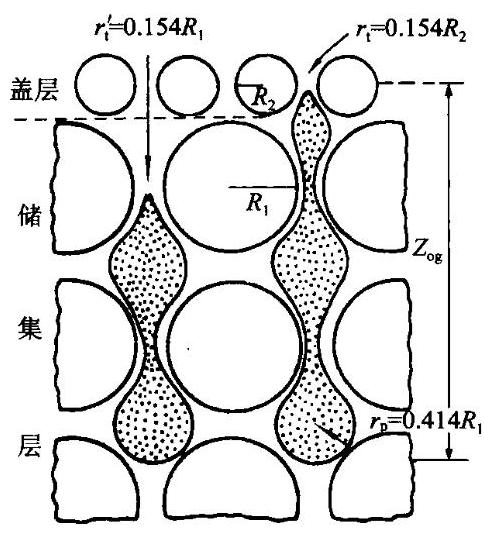

图 3-13 毛细管封闭示意图 (据 Berg, 1975)

<!-- Media -->

也叫毛细管封闭。从微观上讲, 盖层的物性封闭实际上是通过盖层的最大喉道和储集层的最小孔隙之间的毛细管压差来封盖圈闭中的油气 (图 3-13)。盖层的最大喉道处毛细管压差最小, 油气最易在此突破, 因而这种封闭机理在理论上说与盖层的厚度无关, 故又称为薄膜封闭。通常地下的岩石大多为水润湿, 盖层大多以岩性致密, 颗粒极细, 孔喉半径很小, 渗透性很差的岩石为主。非润湿相的油气要通过盖层进行运移, 必须首先排驱润湿相的水。只有驱使油气运移的动力小于或等于盖层的排驱压力, 油气才能被封隔于盖层之下。物性封闭能力可以用单位面积上所封存的油气柱高度来衡量。当圈闭中油气柱的浮力与储盖层之间具有的毛细管压力相等时, 即为最大封存油气柱高度。在静水条件下可用下式表示:

$$
{Z}_{\mathrm{{og}}}\left( {{\rho }_{\mathrm{w}} - {\rho }_{\mathrm{{og}}}}\right) g = {2\sigma }\left( {\frac{1}{{r}_{\mathrm{t}}} - \frac{1}{{r}_{\mathrm{p}}}}\right)  \tag{3 - 8}
$$

$$
{Z}_{\mathrm{{og}}} = \frac{{2\sigma }\left( {\frac{1}{{r}_{\mathrm{t}}} - \frac{1}{{r}_{\mathrm{p}}}}\right) }{\left( {{\rho }_{\mathrm{w}} - {\rho }_{\mathrm{{og}}}}\right) g} \tag{3 - 9}
$$

式中: ${Z}_{\mathrm{{og}}}$ 为圈闭中最大烃柱高度, $\mathrm{m};\sigma$ 为界面张力, $\mathrm{N}/{\mathrm{m}}^{2};{\rho }_{\mathrm{w}}$ 为水的密度, ${10}^{3}\mathrm{\;{kg}}/{\mathrm{m}}^{3}$ ; ${\rho }_{\mathrm{{og}}}$ 为烃的地下密度, ${10}^{3}\mathrm{\;{kg}}/{\mathrm{m}}^{3};{r}_{\mathrm{t}}$ 为盖层的最大喉道半径, $\mathrm{m};{r}_{\mathrm{p}}$ 为储集层最小孔隙半径, $\mathrm{m};g$ 为重力加速度, ${9.8}\mathrm{\;m}/{\mathrm{s}}^{2}$ 。

盖层和储集层之间的毛细管压差也可以由试验测定, 并直接计算。岩石排驱压力的大小与岩石的孔径及流体的性质有密切关系。储集层最小孔隙与盖层最大喉道的半径差越大, 排驱压力越小; 反之, 排驱压力就越大。一般泥页岩、蒸发岩、致密灰岩的喉道半径小, 因此具有较高的排驱压力。物性封闭是盖层最主要、最普遍、最基本的封闭机理, 只要岩石物性上有差异就可在不同程度上形成封闭 (图 3-14)。

<!-- Media -->

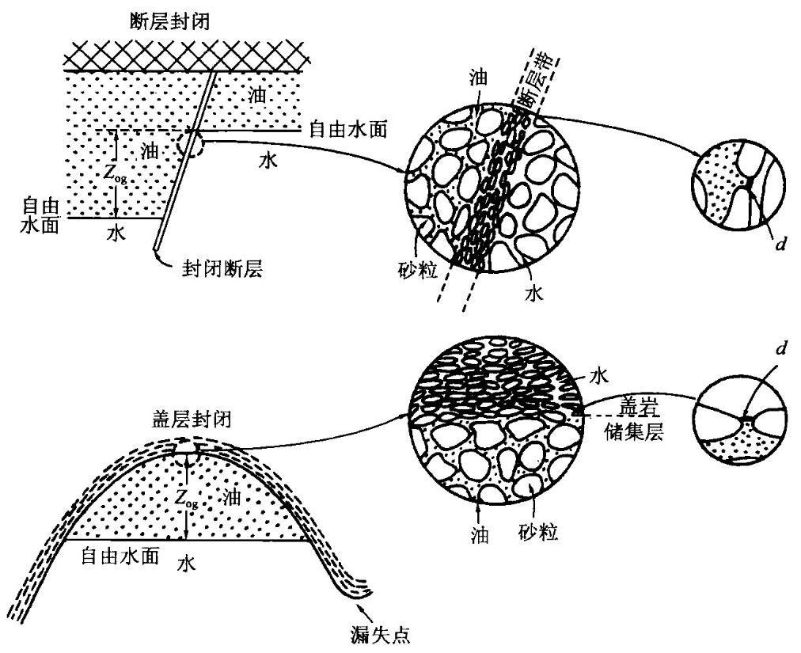

图 3-14 盖层和断层的毛细管封闭

<!-- Media -->

排驱压力的大小还与流体的性质有关, 在亲水岩石中, 油水界面张力小于气水界面张力, 所以在孔喉半径相同的情况下, 石油比天然气更易排驱岩石中所含的水。单从这个角度来讲, 油藏对盖层的要求似乎比气藏更严格。但应该注意到, 由于气水之间的密度差远远大于油水之间的密度差, 在油柱与气柱高度相同的情况下, 水对气的净浮力远远大于对油的净浮力, 加之天然气分子直径较小, 扩散能力比石油强, 因此, 实际上天然气藏对盖层的要求比油藏更为严格。

值得注意的是, 物性封闭的盖层, 在一定水力条件下, 即当储盖层界面上承受的流体压力大于或等于岩石最小水平应力与岩石的抗张强度之和时, 盖层将形成垂直于最小水平应力的张裂缝, 盖层的物性封闭将不复存在, 故又称为水力封闭。盖层的水力封闭能力可用下式表示:

$$
{Z}_{\mathrm{{og}}} = \frac{\left( {{S}_{3} + K}\right)  - {\rho }_{\mathrm{w}}}{\left( {{\rho }_{\mathrm{w}} - {\rho }_{\mathrm{{og}}}}\right) g} \tag{3 - 10}
$$

式中: ${Z}_{\mathrm{{og}}}$ 为圈闭中最大烃柱高度, $\mathrm{m};{S}_{3}$ 为盖层的最小水平应力,MPa; $K$ 为岩石的抗张强度, $\mathrm{{MPa}};{p}_{\mathrm{w}}$ 为储盖层界面上的流体应力, $\mathrm{{MPa}};{\rho }_{\mathrm{w}}\text{、}{\rho }_{\mathrm{{og}}}$ 为水和烃的地下密度, ${10}^{3}\mathrm{\;{kg}}/{\mathrm{m}}^{3}$ ; $g$ 为重力加速度, ${9.8}\mathrm{\;m}/{\mathrm{s}}^{2}$ 。 (二) 压力封闭

<!-- Media -->

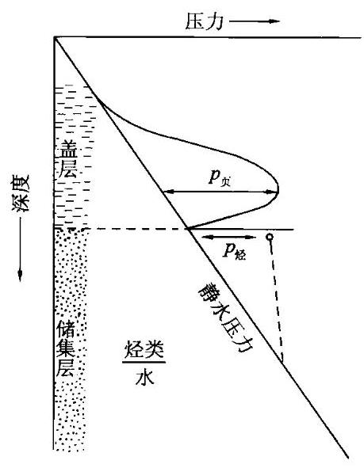

图 3-15 压力封闭示意图

<!-- Media -->

与物性封闭相比, 压力封闭的特点是具有能封闭异常压力的压力封闭层; 压力封闭层不仅封闭地层中的油气, 而且还能封闭作为地层压力载体的水; 能对烃类和水实现全封闭。只有那些岩性致密、渗透率极低的岩层才具有压力封闭的能力。一般认为, 位于储集层上方的超压泥岩层是油气, 特别是天然气的良好盖层, 它能有效地阻止油气向上方运移, 但若这种超压泥岩封闭层仅存在于烃类聚集之中或其下, 不仅不能起封闭作用, 而且还会促进油气向上逸散。

当储集层具有异常压力时, 上覆盖层多为压力封闭层; 也可以是盖层本身具有异常压力而封闭下伏储集层中的流体 (图 3-15)。后者封闭最小油气柱高度为:

$$
{Z}_{\mathrm{{og}}} = \frac{{\rho }_{\mathrm{w}}}{\left( {{\rho }_{\mathrm{w}} - {\rho }_{\mathrm{{og}}}}\right) g}
$$

(3 – 11)

式中: ${Z}_{\mathrm{{og}}}$ 为可封闭最小油气柱高度, $\mathrm{m};{p}_{\mathrm{w}}$ 为盖层中的异常压力,MPa; ${\rho }_{\mathrm{w}}\text{、}{\rho }_{\mathrm{{og}}}$ 为水和烃的地下密度, ${10}^{3}\mathrm{\;{kg}}/{\mathrm{m}}^{3};g$ 为重力加速度, ${9.8}\mathrm{\;m}/{\mathrm{s}}^{2}$ 。

上述表明, 当地层剖面中存在压力封闭层时, 不仅地层内的流体难以排出, 而且地层外的流体也不能通过它流动。此时在地层剖面中就可能形成流体互不连通的压力封隔体。

如前所述, 压力封闭是在物性封闭基础上的进一步封闭, 是对油、气、水的全封闭, 其效果自然也优于单纯的物性封闭。但压力封闭盖层本身也有水力破裂的问题, 即当异常高流体压力超过最小水平应力 $\left( {\sigma }_{3}\right)$ 与盖岩的抗张强度之和时,盖层本身也将产生张性破裂而丧失封闭性, 所以盖层中的异常高压力也不是越高越好, 而应以不超过破裂压力为极限。

## (三) 烃浓度封闭

盖层的烃浓度封闭是在物性封闭的基础上, 主要依靠盖层中所具有的烃浓度来抑制或减缓由于烃浓度差而产生的分子扩散。特别是对天然气来说, 由于分子直径小、扩散性强, 一般好的泥质盖层虽能阻止其体积流动但很难封闭其扩散流, 如果盖层是烃源岩本身, 具有一定的烃浓度, 势必可增加对分子扩散的封闭性。目前认为, 天然气通过盖层的扩散主要是溶于水中, 在水介质中进行的。因此, 当盖层是烃源岩本身又具有异常高压时, 孔隙水中的溶气浓度可以很高, 甚至超过下伏储集层孔隙水中的含气浓度。形成向下递减的浓度梯度, 从而使向上的扩散作用完全停止。看来, 盖层的烃浓度封闭对阻止天然气的分子扩散可能是很有效的。

烃浓度封闭机理虽然符合分子扩散的原理, 在经过一段时间的扩散后, 盖层中的含气浓度完全可以与下伏储集层中的含气浓度达到浓度平衡, 此后再以整体的平衡浓度向上或向下扩散, 而储盖层之间则处于浓度上的动平衡状态, 这种机理只能相对延缓下伏储集层天然气向上扩散的时间, 最终并不能阻止天然气的分子扩散。此外, 也要考虑到如果盖层是烃源岩且在大量生烃阶段时, 一旦其润湿性改变为油润湿, 就会丧失毛细管封闭能力, 并将导致在压力差作用下有大量体积流的散失。

必须明确, 在盖层的三种封闭机理中, 物性封闭是最基本的, 如果盖层失去了物性封闭能力, 其他两种封闭机理也就不复存在了。实际上, 盖层在物性封闭的基础上也常不同程度地具有压力或浓度封闭的能力并形成复合盖层, 显然这种复合封闭的效果最佳。

## 三、盖层的评价

在相当长时期内对盖层的研究只作宏观地质条件的定性评价。自 20 世纪 70 年代以来, 特别是对天然气藏的深入研究表明, 盖层对油气藏的形成是一个很重要的因素, 盖层的微观参数定量评价研究才逐渐开展起来, 目前正处于由定性评价向定量评价转变的阶段。从定性的宏观地质条件评价和定量的微观参数评价两方面综合考虑, 盖层评价的参数主要有以下几个主要方面。

## (一) 孔隙大小

孔隙大小是评价盖层最常用、较有效的参数。因为孔隙大小既是影响排驱压力的重要参数, 也是制约石油和天然气扩散的重要参数。涅斯捷洛夫 (HecremoB, 1975) 根据盖层孔径的大小,把盖层分为三个等级: ① 岩石孔径小于 $5 \times  {10}^{-6}\mathrm{\;{cm}}$ 时,可作油层或气层的盖层; ②岩石孔径在 $5 \times  {10}^{-6} \sim  2 \times  {10}^{-4}\mathrm{\;{cm}}$ 之间时,只能作油层的盖层,不能作为气层的盖层; ③岩石孔径大于 $2 \times  {10}^{-4}\mathrm{\;{cm}}$ 时,油气均可逸散,一般不能成为盖层。

## (二)盖层的渗透性和排驱压力

盖层的渗透性和排驱压力是与孔径大小密切相关的参数。王少昌等 (1987) 根据实验室测定的数据对泥质类盖层封闭能力进行了分级评价, 如表 3-3。

<!-- Media -->

表 3-3 泥质岩和泥质粉砂岩、细砂岩封盖能力评价等级

<table><thead><tr><th rowspan="2">等级</th><th rowspan="2">封闭能力</th><th rowspan="2">绝对 (空气) 渗透率 $/\mu {\mathrm{m}}^{2}$</th><th colspan="3">排驱压力 $/{10}^{5}\mathrm{\;{Pa}}$</th><th rowspan="2">主要岩性</th></tr><tr><th>空气</th><th>煤油</th><th>水</th></tr></thead><tr><td rowspan="2">I</td><td>最好</td><td>${10}^{-9}$</td><td>47</td><td>170</td><td>750</td><td>泥岩、粉砂质泥岩、泥质粉砂岩</td></tr><tr><td>好</td><td>${10}^{-8}$</td><td>20</td><td>90</td><td>380</td><td>粉砂质泥岩、泥质粉砂岩</td></tr><tr><td>II</td><td>较好</td><td>${10}^{-7}$</td><td>6</td><td>27</td><td>200</td><td>同上</td></tr><tr><td>Ⅲ</td><td>一般</td><td>${10}^{-6}$</td><td>1</td><td>12</td><td>100</td><td>泥质粉砂岩、泥质细砂岩</td></tr><tr><td>IV</td><td>差</td><td>${10}^{-5}$</td><td>$< 1$</td><td>5. 3</td><td>50</td><td>泥质细砂岩</td></tr></table>

<!-- Media -->

(转引自陈荣书, 1994)

从表 3-3 可知,绝对渗透率为 ${10}^{-6}{\mathrm{{\mu m}}}^{2},{p}_{\mathrm{d}} = 1 \times  {10}^{5}\mathrm{\;{Pa}}$ 时饱含水的泥质粉砂岩、泥质细砂岩即可有一定的封盖能力,而绝对渗透率达到或小于 ${10}^{-8}{\mathrm{{\mu m}}}^{2},{p}_{\mathrm{d}} &gt; {20} \times  {10}^{5}\mathrm{\;{Pa}}$ (空气) 时, 它们则具有较好的封闭性。值得注意的是, 不同研究者确定的评价标准存在差异。

## (三) 盖层的厚度及连续性

盖层厚度要多大才能达到有效封闭油气藏的基本要求, 即盖层厚度是否存在可以定量确定的下限? 大量事实表明, 这与盖层岩性、孔隙结构、破裂情况及横向稳定性有密切关系。涅斯捷洛夫对盖层的厚度问题进行了实验和理论计算后指出: 油气通过 $1\mathrm{\;m}$ 厚的粘土盖层所需油藏压力差达 ${120} \times  {10}^{5}\mathrm{\;{Pa}}$ ,因此,从理论上推算只要 $1\mathrm{\;m}$ 厚的粘土层就足已能起到封闭油气的作用。如果考虑到地质时间漫长, 也只需几米厚就足够了。列别德 (Лебел, 1977) 曾对西高加索地区下白垩统油层的泥岩盖层作过统计分析, 认为埋深在 ${1200} \sim  {3000}\mathrm{\;m}$ 范围内, $5 \sim  {10}\mathrm{\;m}$ 厚的泥岩即可起到良好的盖层作用。

盖层只有在空间分布上具有连续性才能覆盖一定的范围, 盖层的连续性实质上是指盖层岩石的稳定性和均匀性, 稳定性可指不易发生裂缝, 均匀性可指物性相对稳定。盖层的连续性主要通过沉积环境和沉积相分析进行宏观定性评价,一般认为海相沉积比陆相沉积盖层要稳定且分布广。在实际地质条件下, 常常以一个层系的岩层作为盖层, 其中包括多个单一的泥质岩盖层。

(四) 埋深

泥质岩盖层随着埋深的增加, 其压实程度增高, 孔隙度、渗透率随之减小, 排驱压力增大, 其封闭性能不断增高。但是由于埋深增大, 地温增高, 粘土矿物及其组分关系也在不断地演化。当泥岩压实到一定阶段时, 蒙脱石向伊利石转化, 析出大量的层间水或结晶水。在厚层泥岩的顶、底与砂岩相邻的部分, 首先被压实排出孔隙水, 形成致密带, 使其中间的泥岩具有较高的孔隙流体异常压力, 此时泥岩的封闭程度最高, 封闭能力最强。随着埋深的进一步增加, 泥岩在较高的温度、压力作用下, 脱水明显, 岩性变脆, 可塑性降低,易于产生裂缝,这在很大程度上可能降低泥岩的封闭能力。据 $\Pi$ po30pOBHY 等研究认为: 泥岩在 ${1500} \sim  {2500}\mathrm{\;m}$ 到 ${4000}\mathrm{\;m}$ 区间具有最佳封闭能力。

## 四、盖层的相对性

概括地说, 盖层的相对性表现为储盖层岩石的相对性和储盖层组合的相对性。

## (一)储盖层岩石的相对性

储集层是允许油气在其中储存和流动的渗透性岩层, 而盖层则是阻止油气通过它向上逸散的岩层。两者之间存在着一系列的过渡性地层, 如果用渗透率来表示, 可以从储集层的 ${1\mu }{\mathrm{m}}^{2}$ 到盖层的 ${10}^{-{10}}{\mathrm{\;{\mu m}}}^{2}$ ,变化在 10 个数量级范围内。实际上储盖层都是相对于流体的流动性而言的: 如果流体的流动性很强且具很高的异常压力, 那么一般的盖层也难以形成封闭; 相反, 则一般岩石也能形成一定的封闭。可见, 对大多数沉积岩来说没有绝对的盖层, 也没有绝对的储集层, 要分析具体情况, 不能一概而论。常有相同岩性的盖层在此处可以是盖层, 而在彼处则不是盖层。甚至在深埋的条件下储盖层可以颠倒过来, 致密的泥质盖层因大量产生裂缝而成为储集层, 而储集砂岩因变得异常致密反成为盖层。因此, 在分析和判断储盖层时不能脱离具体的地质条件。

## (二) 储盖层组合的相对性

前已述及, 盖层物性封闭的好坏可用单位面积上封盖的烃柱高度来衡量, 封闭烃柱的高度主要取决于盖层最大喉道半径和储集层最小孔隙半径倒数之差。该差值越大, 封盖的烃柱高度也就越大, 盖层的封闭能力就越强, 说明物性封闭的能力只决定于该差值的大小, 并由此产生了储盖层的相对性。这种储盖层组合的相对性表现在, 当盖层比较差时, 储集层就需要好些, 使储盖层之间仍能保持一定的毛细管压差用来封闭油气; 相反, 若盖层比较好时则储集层就可以差些。从这个意义出发, 盖层并非一定是致密地层不可, 只要上下地层的物性相对不同、能够产生一定的毛细管压差就可以形成储盖的组合封闭。这也就是为什么在国内外均见有: 饱含水细砂岩对粗砂岩中的油气、粉砂岩对细砂岩中的油气, 可以形成一定封闭的原因。

但是对天然气的扩散来说, 储盖层就没有相对性了, 因为物性封闭一般不能阻止天然气的扩散。此时要求盖层要绝对的致密, 盖层只有越致密扩散才越困难, 封闭性也就越好。毛细管的相对封闭可以成为储盖组合, 但天然气的扩散却可以畅通无阻。

因此, 我们认识盖层封闭的相对性不仅具有重要的理论意义, 而且在油气勘探、含油气远景和资源量评价的过程中也是一个要考虑的重要问题。

## 第四章 圈闭和油气藏

## 第一节 圈闭和油气藏概述

圈闭的描述性概念是储集层能作为盛装油气的容器部分。当有足够数量的油气进入圈闭, 充满圈闭, 或占据圈闭的一部分后, 便可形成油气藏。

圈闭是油气藏形成的基础, 圈闭的形成条件决定着油气藏的基本特征, 圈闭的类型决定着油气藏的类型及勘探方法。因此, 正确识别和评选有利于油气聚集的圈闭, 对油气勘探具有十分重要的意义, 是打开地下油气藏宝库、发现油气藏的关键所在。

## 一、圈闭理论的形成与发展

圈闭的概念是在油气勘探实践中不断发展和深化的。

在油气勘探初期, 人们主要在地表有油气苗的地点钻探, 没有对地下产油的地质条件做分析研究, 也未进行较为系统的地质工作, 勘探效益较低。通过实践, 总结正反两方面的经验, 人们认识到油气聚集常与背斜有关, 这就产生了 “背斜学说” (I. C. White, 1885)。在 “背斜学说” 指导下, 逐步开展了以地质测量为基本手段的找油工作, 大大加快了新油气田的发现进程。

但随着油气勘探实践的深入, 油气田数目日益增多, 非背斜油气藏不断被发现, 于是人们逐步认识到油气聚集还可以存在于非背斜的多种地质体中。1928 年, 利莱 (B. R. Lilley) 在《石油地质学》一书中总结了美国油气勘探的成果, 得出存在多种储油类型: 褶皱、断层、盐丘、孔隙性变化、岩浆岩以及多种因素控制的油气聚集, 但以背斜最为重要。

1934 年, 麦考洛 (E. H. McCollough) 首先提出 “圈闭” 这一名词, 用来表示不同性质的储油构造。“圈闭学说”就逐渐取代了 “背斜学说”。凡是能聚集并保存油气的地质体, 都称作圈闭, 并把圈闭分为构造圈闭和非构造圈闭。“圈闭学说” 的诞生极大地扩展了油气勘探的视野和领域。

“地层圈闭” 这一术语是由莱复生 (A. I. Levorsen, 1936) 首先提出来的。他在研究美国大量非构造油气藏的基础上, 提出了 “地层圈闭” 的概念, 并在一系列的论文和著作中加以系统论述。他指出: “地层圈闭是这样一种圈闭, 即地层变化是储集层形成圈闭的主要因素。地层变化包括砂或多孔储集层的楔入或尖灭, 砂层侧向变为渗透性差或非渗透性的岩层, 地层被削蚀与超覆, 或地层层序类似的变化等”。并进一步将地层圈闭划分为原生地层圈闭(即岩性圈闭)和次生地层圈闭(即不整合圈闭)两类。1941 年他主编出版了第一部与该类油气藏有关的专著《地层型油气田》。

地层圈闭概念的提出和此类油气藏的系统研究, 促进了油气勘探, 特别是老油气区的二次勘探。在美国,到 1968 年共发现 252 个较大的油气田(最终可采储量 ${1400} \times  {10}^{4}\mathrm{t}$ 油或天然气 ${300} \times  {10}^{8}{\mathrm{\;m}}^{3}$ ),其中 ${60}\%$ 以上来自地层圈闭。1972 年由金 (R. E. King) 主编的 《地层油气田》一书是继莱复生 (1941) 主编的《地层型油气田》之后又一部总结“地层型”油气藏特征及勘探经验的专著。该书较充分地反映了这一领域到 20 世纪 60 年代中期的勘探和研究成果。

在 20 世纪 40 年代, 赫伯特 (M. K. Hubbert, 1940, 1953) 对流体势和水动力在形成油气圈闭过程中的作用, 进行了精深的研究。他指出: 油气圈闭位置总是在油气势最小的地方。有些油气藏中油水界面的倾斜, 甚至油气存在于 “圈闭” 以外, 是水动力作用的结果。他不仅提出了水动力圈闭这一新的圈闭类型, 为勘探新的油气藏类型指明了方向, 而且为圈闭形成机理的研究奠定了理论基础。目前对圈闭的研究, 更多地涉及到油气运移的动力、势能与各种遮挡条件的新认识。至于是否存在背斜构造并不占主导地位, 这样圈闭的概念就被极大地拓宽了。圈闭的现代概念是指储集层中被油气高势区或非渗透性遮挡联合封闭的油气低势区。

随着油气勘探的深入, 勘探难度不断增加。除上述 3 类基本油气圈闭外, 莱复生认为复合圈闭的勘探对未来的油气资源供给有着重大意义。他在总结已有勘探成果的基础上指出 (1966): 构造圈闭……的成效已减少, 意味着勘探方向开始转变。事实证明, 地壳中存在着大量有别于构造圈闭的其他圈闭, 在某些情况下与地层圈闭和流体圈闭相比, 构造圈闭已失去光彩, 而构造、地层、流体三要素复合形成的复合圈闭实际上还是油气勘探领域中的 “处女地”。他预言: “我们已进入了复合圈闭的时代。”

其后, 哈尔鲍蒂 (M. T. Halbouty, 1972, 1980) 对隐蔽圈闭 (subtle trap) 进行了系统的讨论, 并赋予隐蔽圈闭以新的含义。目前较流行的 “隐蔽圈闭” 实际上相当于英文中的 "obscure and subtle traps", 它是指那些隐伏的、难以捉摸的以及用常规勘探方法难以发现的各种圈闭, 其主体是地层圈闭。隐蔽圈闭这个概念不是指特定的圈闭类型, 实质上它既包括地层圈闭, 也包括构造圈闭和复合圈闭, 因而它不适用于分类范畴。编者认为, 在油气勘探开发实践中, 最好不使用 “隐蔽圈闭” 术语。

综上所述, 可以看出圈闭概念和分类的进展是油气勘探和地质研究的结晶, 而新的、 能反映客观实际的、更科学的圈闭概念和分类将极大地促进油气勘探的发展。

## 二、圈闭的现代概念及可预测标志

油、气、水都是流体, 在由分散状态到聚集成油气藏渗流过程中, 必然要遵循流体力学的基本原理, 即流体整个系统处于静止状态时, 分散状态的油气在其势达到最低值以前, 在油气力场的支配下, 从油气高势区向低势区运动。只有当油气到达被油气高势区、 或与非渗透性屏蔽联合封闭的油气低势区时, 才能达到稳定状态。储集层中被油气高势区或与非渗透性遮挡 (屏蔽) 联合封闭的油气低势区, 就是油气圈闭。为了较深刻理解它, 首先对流体势概念作明确的理解。

储集层任一测点的流体势 $\left( \varphi \right)$ ,按 Hubbert (1940) 定义的简化形式,可以用下面公式表示:

$$
\varphi  = {gz} + \frac{p}{\rho } \tag{4 - 1}
$$

式中: $\varphi$ 为势; $g$ 为重力加速度; $z$ 为测点高程; $p$ 为压力; $\rho$ 为流体密度。

对于水、油、气势可以分别用下列各式表示:

$$
{\varphi }_{\mathrm{w}} = {gz} + \frac{p}{{\rho }_{\mathrm{w}}} \tag{4 - 2}
$$

$$
{\varphi }_{\mathrm{o}} = {gz} + \frac{p}{{\rho }_{\mathrm{o}}} \tag{4 - 3}
$$

$$
{\varphi }_{\mathrm{g}} = {gz} + \frac{p}{{p}_{\mathrm{g}}} \tag{4 - 4}
$$

在工程上常用单位重量的势。用单位质量流体具有的重量 $g$ 除之,即可得:

$$
\frac{{\varphi }_{\mathrm{w}}}{g} = z + \frac{p}{{\rho }_{\mathrm{w}} \cdot  g} = {h}_{\mathrm{w}} \tag{4 - 5}
$$

$$
\frac{{\varphi }_{\mathrm{o}}}{g} = z + \frac{p}{{\rho }_{\mathrm{o}} \cdot  g} = {h}_{\mathrm{o}} \tag{4 - 6}
$$

$$
\frac{{\varphi }_{\mathrm{g}}}{g} = z + \frac{p}{{\rho }_{\mathrm{g}} \cdot  g} = {h}_{\mathrm{g}} \tag{4 -7}
$$

式中: ${h}_{\mathrm{w}}\text{、}{h}_{\mathrm{o}}\text{、}{h}_{\mathrm{g}}$ 为单位重量的水、油、气势,也称为水头、油头、气头。

$h$ 表示总压头; $h - z$ 表示压头。势、总压头、压头和压力的相互关系如图 4-1 所示。

将式(4 - 5)移项简化代入式(4 - 6)和式(4 - 7),可得:

$$
{h}_{\mathrm{o}} = \frac{{p}_{\mathrm{w}}}{{\rho }_{\mathrm{o}}}{h}_{\mathrm{w}} - \frac{{\rho }_{\mathrm{w}} - {\rho }_{\mathrm{o}}}{{\rho }_{\mathrm{o}}}z \tag{4 - 8}
$$

$$
{h}_{\mathrm{g}} = \frac{{p}_{\mathrm{w}}}{{\rho }_{\mathrm{g}}}{h}_{\mathrm{w}} - \frac{{\rho }_{\mathrm{w}} - {\rho }_{\mathrm{g}}}{{\rho }_{\mathrm{g}}}z \tag{4 - 9}
$$

令 $\frac{{\rho }_{\mathrm{w}}}{{\rho }_{\mathrm{o}}}{h}_{\mathrm{w}} = {u}_{\mathrm{o}};\frac{{\rho }_{\mathrm{w}} - {\rho }_{\mathrm{o}}}{{\rho }_{\mathrm{o}}}z = {v}_{\mathrm{o}};\frac{{\rho }_{\mathrm{w}}}{{\rho }_{\mathrm{g}}}{h}_{\mathrm{w}} = {u}_{\mathrm{g}};\frac{{\rho }_{\mathrm{w}} - {\rho }_{\mathrm{g}}}{{\rho }_{\mathrm{g}}}z = {v}_{\mathrm{g}}$ ,则

$$
{h}_{\mathrm{o}} = {u}_{\mathrm{o}} - {v}_{\mathrm{o}}
$$

(4 – 10)

$$
{h}_{\mathrm{g}} = {u}_{\mathrm{g}} - {v}_{\mathrm{g}}
$$

(4 – 11)

在特定的油气藏内, $\frac{{\rho }_{\mathrm{w}}}{{\rho }_{\mathrm{o}}}\text{、}\frac{{\rho }_{\mathrm{w}} - {\rho }_{\mathrm{o}}}{{\rho }_{\mathrm{o}}}\text{、}\frac{{\rho }_{\mathrm{w}}}{{\rho }_{\mathrm{g}}}\text{、}\frac{{\rho }_{\mathrm{w}} - {\rho }_{\mathrm{g}}}{{\rho }_{\mathrm{g}}}$ 均可以视为常数。可见, ${h}_{\mathrm{o}}\text{、}{h}_{\mathrm{g}}$ 仅与 ${h}_{\mathrm{w}}$ 和 $z$ 有关。

在静水条件下, ${h}_{\mathrm{w}}$ 为定值, $u$ 为一常数, ${h}_{\mathrm{o}}\text{、}{h}_{\mathrm{g}}$ 仅与 $z$ 成反比,构造隆起部位为油气低势区, 构造低部位为油气高势区。油气势等势面呈水平状态, 油气势等势线与构造等高线相平行。因此, 储集层顶面背斜高部位闭合区, 或储集层顶面构造等高线与储集层上倾方向非渗透性遮挡(断层面、不整合面、非渗透性岩层或岩体)联合封闭的高部位闭合区, 就是闭合的油气低势区。

在动水条件下, ${h}_{\mathrm{w}}$ 顺储集层下倾方向降低,为一变量。油气等势面顺水流方向发生倾斜或弯曲, ${h}_{\mathrm{o}}\text{、}{h}_{\mathrm{g}}$ 等值线与构造等高线不平行,构造等高线高部位的闭合区,与低 ${h}_{\mathrm{o}}$ 、 ${h}_{\mathrm{g}}$ 闭合区不一致。因此,在动水条件下油气圈闭的位置不能由储集层顶面构造等高线或和上倾方向非渗透性遮挡联合封闭的高部位闭合区加以确定,而是要由 ${u}_{o} - {v}_{o}$ 和 ${u}_{g} - {v}_{g}$ 确定的闭合低 ${h}_{o}\text{、}{h}_{g}$ 区。在动水条件下,可以使静水条件下曾存在的圈闭位置发生变化 (一般向顺水流方向发生位移), 甚至完全消失; 也可能使静水条件下并不存在圈闭的部位形成新的圈闭。图 4-2 就是这种情况。该图等 ${v}_{0}$ 线是一未闭合的等值线,代表鼻状构造,等 ${u}_{o}$ 线是由西北向东南降落的均斜线,表明 ${h}_{\mathrm{w}}$ 递降方向, ${u}_{o} - {v}_{o}$ 构成 ${h}_{o}$ ,出现低 ${h}_{o}$ 闭合区, 说明静水时不存在圈闭的部位, 在动水作用下形成新的圈闭。

<!-- Media -->

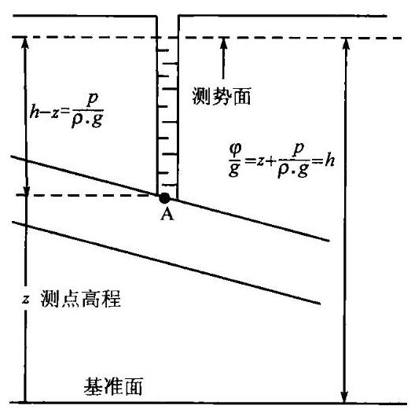

图 4-1 势、总压头、压头和压力关系图

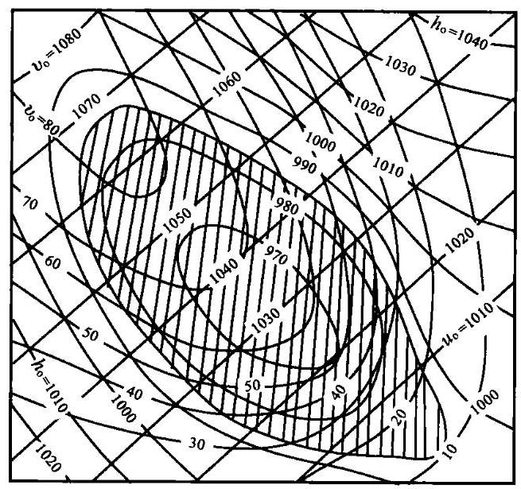

图 4-2 水动力形成的圈闭图示

(据 Hubbert, 1953)

<!-- Media -->

根据前述分析, 油气圈闭的可测性标志, 可归纳如下:

1) 四周被非渗透性遮挡包围的孔隙、渗透性岩体, 圈闭位置由渗透性变为非渗透性的边界来确定。
2) 在静水条件下, 除上述外, 其他各类圈闭的位置为溢出点等高线或与非渗透性遮挡线联合封闭的闭合区。
3) 在动水条件下,由 ${h}_{\mathrm{o}}\text{、}{h}_{\mathrm{g}}$ 等值线构成的闭合低值区,即油、气圈闭。若该处在静水条件下不存在圈闭, 则称水动力圈闭; 若静水条件下在该处存在圈闭, 但现圈闭和原圈闭位置有所位移, 则为复合圈闭 (水动力型复合圈闭)。

## 三、油气藏的概念与工业标准

## (一) 油气藏概念

油气藏是地壳上油气聚集的基本单元, 是油气在单一圈闭中的聚集, 具有统一的压力系统和油水界面。如果在圈闭中只聚集了石油, 则称为油藏; 若只聚集了天然气, 则称为气藏; 二者同时聚集, 则称为油气藏。

油气藏的重要特点是在 “单一圈闭中”, 所谓 “单一” 的涵义, 主要是指受单一要素所控制, 在单一的储集层中, 具有统一的压力系统, 统一的油、气、水边界。如图 4-3 所示, 同一背斜中有三个储集层, 分别组成三个圈闭、三个不同的压力系统, 具有不同的油、气、水边界, 就应该认为是三个油气藏。

<!-- Media -->

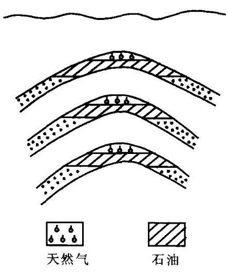

图 4-3 油气藏概念图

<!-- Media -->

## (二)工业油气藏标准

当分散烃类在圈闭中聚集达到具有经济开采价值的规模时就形成油气藏 (Levorsen, 1967; North, 1985), 即油气藏中的油气流具有工业规模。如果圈闭中油气聚集的数量足够大, 具有开采价值, 即有工业规模, 则称为工业性油气藏。如果油气聚集的数量不够大, 没有开采价值, 即没有工业规模, 就称为非工业性油气藏。

究竟聚集多少数量的油气才有开采价值, 这决定于当时的政治、技术、经济等各方面的条件。过去认为没有开采价值的非工业性油气藏, 由于开采技术及工业条件的发展, 或者由于市场对石油的特别需要, 可以成为有开采价值的工业性油气藏。所以, 工业性油气藏的概念, 可以认为是随时间、条件的改变而变化的。目前我国有关工业和非工业油气流的现行标准如表 4-1 所示。

<!-- Media -->

表 4-1 中国工业性和非工业性油气流标准

<table><thead><tr><th colspan="2">类 别</th><th colspan="2">石油产量 $/\mathrm{t} \cdot  {\mathrm{d}}^{-1}$</th><th colspan="2">天然气产量 $/{10}^{4}{\mathrm{\;m}}^{3} \cdot  {\mathrm{d}}^{-1}$</th></tr><tr><th colspan="2">级 别</th><th>工业性</th><th>非工业性</th><th>工业性</th><th>非 C业性</th></tr></thead><tr><td rowspan="6">产层埋深 m</td><td>< 500</td><td>${0.3} \sim  {0.5}$</td><td>$< {0.3}$</td><td>${0.05} \sim  {0.1}$</td><td>$< {0.05}$</td></tr><tr><td>${500} \sim  {1000}$</td><td>${0.5} \sim  {1.0}$</td><td>${0.3} \sim  {0.5}$</td><td>0. $1 \sim  {0.3}$</td><td>${0.05} \sim  {0.1}$</td></tr><tr><td>${1000} \sim  {2000}$</td><td>1. $0 \sim  {3.0}$</td><td>${0.5} \sim  {1.0}$</td><td>${0.3} \sim  {0.5}$</td><td>${0.1} \sim  {0.3}$</td></tr><tr><td>2000 ~ 3000</td><td>${3.0} \sim  {5.0}$</td><td>1. $0 \sim  {3.0}$</td><td>${0.5} \sim  {1.0}$</td><td>${0.3} \sim  {0.5}$</td></tr><tr><td>${3000} \sim  {4000}$</td><td>5. $0 \sim  {10}$</td><td>3. $0 \sim  {5.0}$</td><td>${1.0} \sim  {2.0}$</td><td>${0.5} \sim  {1.0}$</td></tr><tr><td>$> {4000}$</td><td>$> {10}$</td><td>5. $0 \sim  {10}$</td><td>$> {2.0}$</td><td>1. $0 \sim  {2.0}$</td></tr></table>

(据翟光明, 1996)

<!-- Media -->

## 四、圈闭和油气藏的度量

## (一) 圈闭的度量

在评价一个圈闭时, 圈闭的大小是一个很重要的因素。圈闭的大小主要由圈闭的有效容积确定, 它表示圈闭能容纳油气的最大体积。一个圈闭的有效容积, 取决于闭合面积、 闭合度、储集层的有效厚度和有效孔隙度等参数。

## 1. 闭合度和闭合面积的确定

闭合度是指圈闭的最高点到溢出点之间的垂直距离。它是圈闭可能容纳油气的最大高度 (图 4-4)。溢出点是指圈闭容纳油气最大限度的位置。若低于该点高度, 油气就要向储集层上倾方向溢出。该点是圈闭内油气溢出的起始点, 又叫最高溢出点。而闭合点则是从另一角度来描述该点特征, 意即闭合的最低点。若低于该点高度, 圈闭就不存在了 (不闭合)。

<!-- Media -->

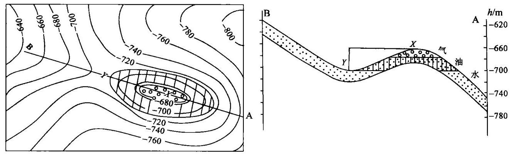

图 4-4 背斜圈闭度量示意图

<!-- Media -->

闭合面积是指通过溢出点的构造等高线所圈闭的封闭区的面积, 或者更确切地说, 就是通过溢出点的水平面与储集层顶面及其他封闭面 (如断层面、不整合面、尖灭带等) 所交切构成的闭合区的面积。它是圈闭可能含油气的最大面积。背斜圈闭的闭合度和闭合面积如图 4-5 所示。

必须注意, 构造闭合度与构造起伏幅度是两个完全不同的概念。闭合度的测量是以海平面 (或与之平行的水平面) 为基准的, 而构造幅度的测量, 是以区域倾斜面为基准的。同样大小构造起伏幅度的背斜, 当区域倾斜面不同时, 可以具有完全不同的闭合度 (图 4-6)。

<!-- Media -->

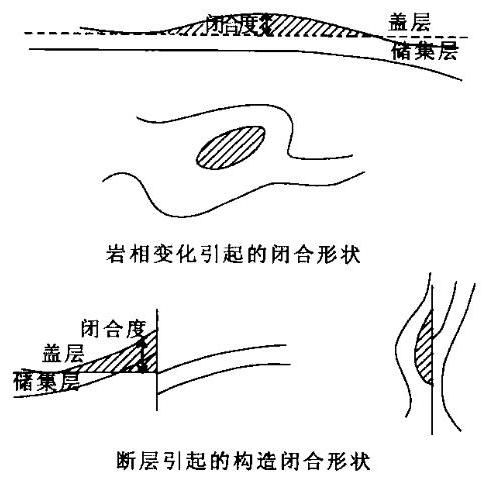

图 4-5 主要圈闭特征及其度量图 (据 Perrodon, 1993 修改)

<!-- Media -->

以上我们讨论的闭合度和闭合面积的确定是在静水条件下 (油气等势面呈水平面) 的情况。而在动水条件下, 油气等势面要发生倾斜或弯曲 (图 4-7), 不同条件下的圈闭顶点 $\left( {h}_{\mathrm{c}}\right.$ 与储集层顶面的交点 $\left. {{X}_{\mathrm{o}}\text{、}X}\right)$ 的位置将会相应地改变, 因而闭合度亦将有所不同; 而圈闭的最高点则分别为 ${X}_{\mathrm{o}}$ 和 $X$ ,它与圈闭的顶点可以相同, 也可以不同。此时圈闭的闭合面积, 亦应是通过溢出点的油气等势面与储集层顶面非渗透性盖层联合封闭的闭合油气低势区的面积。

<!-- Media -->

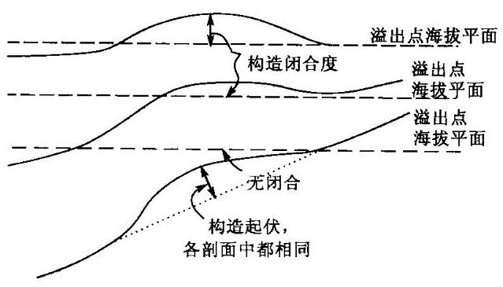

图 4-6 构造幅度与闭合度关系

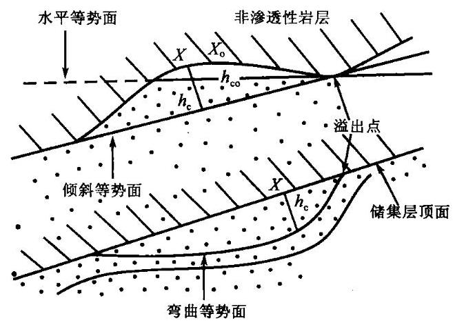

图 4-7 水动力作用下和静水条件下闭合度变化对比图

<!-- Media -->

## 2. 储集层有效厚度和有效孔隙度的确定

储集层的有效厚度是指在一定压差下, 具有工业性产油 (气) 能力的那一部分储集层的厚度。它是根据有效储集层的孔隙度和渗透率分级标准, 扣除储集层中的非渗透性夹层而确定的。

储集层的有效孔隙度是指储集层中有效孔隙体积与岩石总体积之比的百分数。它是根据实验室测定或测井资料统计分析结果求其平均值来确定, 也可以根据圈闭范围内孔隙度变化的趋势值 (等值线图) 来确定。

## (二) 油气藏的度量

油气藏通常仅占据圈闭的一部分, 其极限情况则是充满整个圈闭。油气藏的大小通常用储量来表示, 这里仅介绍油气地质文献中度量油气藏的一些有关术语 (图 4-8)。

<!-- Media -->

图 4-8 背斜油气藏油气水分布示意图

<!-- Media -->

## 1. 油 (气) 藏高度

是指油 (气) 藏顶点到油 (气) 水界面的正交距离。若有气顶时, 油水界面和油气界面之间的正交距离, 称为油藏高度; 而油气藏顶点到油气界面的正交距离, 称为气顶高度; 此时油藏高度加气顶高度之和即为油气藏高度。它是指示油气藏大小的一个重要参数。

2. 含油 (气) 边界和含油 (气) 面积

通常把油 (气) 水界面与油 (气) 层顶、底面的交线称作含油 (气) 边界, 其中与油 (气) 层顶面的交线称为外含油 (气) 边界, 与油 (气) 层底面的交线称为内含油 (气) 边界。若油(气)藏的高度小于油(气)层的厚度时, 则油 (气) 水界面与油 (气)层底面不相交, 这时油 (气) 藏的内边界就不存在。由相应的含油 (气) 边界所圈闭的面积分别称作内含油(气)面积和外含油(气)面积。通常含油(气)面积是指外含油 (气) 面积。

## 3. 气顶和油环

在油气藏中存在游离气时, 油、气、水按密度分异, 气总是占据圈闭的顶部, 称为气顶, 油居中间, 水在最下面。在这种情况下, 油在平面上呈环带状分布, 称为油环。

## 五、圈闭和油气藏的分类

## (一)圈闭和油气藏的分类原则

自然界油气藏的类型是多种多样的。其分类原则体现在科学性和实用性两方面。

对油气藏进行科学的分类, 寻找它们的共性, 总结各类油气藏形成的基本条件及分布规律, 更好地指导下一步的油气勘探, 是石油与天然气地质学研究中一项十分重要的任务。为此, 多年来, 各国石油地质学家在油气藏分类方面做了大量的研究工作, 提出了很多关于油气藏分类的方案。依据圈闭和储集层形态的圈闭分类, 以 Clapp (1929)、Wilson (1934)、Heald (1940)、Heroy (1941) 、Wilhelim (1945) 、H. O. 布罗德 (1958) 和 (North,1985) 等为代表; 依据圈闭成因的圈闭分类, 以 Levorsen (1954,1967)、王尚文等 (1983)、潘钟祥 (1986) 和胡见义等(1985,1992)为代表,主要把圈闭划分为构造、地层和复合圈闭三大类; 依据圈闭成因动力学的圈闭分类, 以 Allen 等 (1990) 为代表, 根据盆地形成机制及动力学来划分圈闭的类型。其中比较著名的有前苏联石油地质学家 $H.O$ . 布罗德以油气藏形态为依据的分类和美国石油地质学家 A. I. 莱复生根据圈闭成因提出的分类方案。

圈闭是油气聚集的场所, 也是形成油气藏的基本条件之一。一旦圈闭内聚集并保存具有工业价值的烃类流体后, 就成为油气藏。因此, 油气藏类型与圈闭类型之间有着密切关系。但是, 油气藏与圈闭相比, 毕竟还包括另一个重要因素一一烃类流体。所以, 从油气勘探的实际需要出发, 我们主张以圈闭分类为基础的油气藏分类, 即圈闭和油气藏用同一分类系统, 同一个术语同时用于圈闭和油气藏。这样, 可以避免使用复杂而繁多的名词, 分散了对实质问题的注意。下面着重介绍圈闭的分类。

## (二)圈闭和油气藏分类方案

## 1. 圈闭的成因分类

对圈闭的分类, 我们主张以圈闭的成因为主、以圈闭形态和遮挡条件为辅的划分原则, 前者作为划分大类的基础, 后者作为划分亚类的依据。根据控制圈闭形成的地质因素, 可将圈闭分为四大类: 即构造圈闭、地层圈闭、水动力 (流体) 圈闭和复合圈闭, 各大类圈闭又可根据其圈闭形态和遮挡条件, 进一步划分为若干亚类。本教材采用的圈闭分类系统如表 4-2 所示。

<!-- Media -->

表 4-2 圈闭分类系统表

<table><thead><tr><th>大类</th><th>构造圈闭</th><th>地层圈闭</th><th>水动力圈闭</th><th>复合圈闭</th></tr></thead><tr><td rowspan="5">亚类</td><td>1. 背斜圈闭</td><td>1. 岩性圈闭</td><td>1. 构造鼻和阶地型水动力圈闭</td><td>1. 构造 - 地层复合圈闭</td></tr><tr><td>2. 断层圈闭</td><td>2. 不整合圈闭</td><td>2. 单斜型水动力圈闭</td><td>2. 水动力 - 构造复合圈闭</td></tr><tr><td>3. 裂缝性背斜圈闭</td><td>3. 礁型圈闭</td><td>3. 纯水动力圈闭</td><td>3. 地层 - 水动力复合圈闭</td></tr><tr><td>4. 刺穿圈闭</td><td>4. 沥青封闭圈闭</td><td/><td>4. 构造 - 地层 - 水动力复合圈闭</td></tr><tr><td>5. 多因素构造圈闭</td><td>5. 多因素地层圈闭</td><td/><td/></tr></table>

<!-- Media -->

2. 油气藏的烃类相态分类

油气藏研究的目的之一就是搞清油气藏中流体类型、相态特征及分布, 为制定合理的油气藏开发方案服务。油气相态是受油气藏的温压条件与烃源岩的成熟历史控制的, 对油气藏中烃类相态的研究有利于总结油气分布规律。我国目前采用的烃类相态分类方案见表 $4 - 3$ 。

<!-- Media -->

表 4-3 中国油气藏的烃类相态分类

<table><thead><tr><th>大类</th><th>气藏</th><th>临界态油气藏</th><th>油藏</th><th>沥青质油矿</th></tr></thead><tr><td rowspan="5">亚类</td><td>1. 干气藏</td><td>1. 近临界态凝析气藏</td><td>1. 轻质油藏</td><td/></tr><tr><td>2. 湿气藏</td><td>2. 临界态油气藏</td><td>2. 常规油藏</td><td/></tr><tr><td>3. 凝析气藏</td><td>3. 近临界态油藏</td><td>3. 轻度重质油藏</td><td/></tr><tr><td/><td/><td>4. 中度重质油藏</td><td/></tr><tr><td/><td/><td>5. 重度重质油藏</td><td/></tr></table>

<!-- Media -->

(据孙志道, 1996)

## 3. 油气藏的驱动类型分类

在油气藏开发过程中常常采用该分类。油气藏中的油气流到井口必须有一定的压力, 这种驱动油气流出油层, 并经井筒到达井口的动力称之为油气藏的驱动力。当采油时, 不同驱动类型的油气藏在油气藏压力、油气产量、采油速度和油气水比例等方面随时间表现出不同的变化规律。一般根据驱动类型可将油气藏划分为溶解气驱油气藏、气顶气驱油气藏、底(边)水驱动油气藏和混合驱动油气藏。

## 第二节 构造油气藏

凡是储集层顶面发生局部变形或变位而形成的圈闭, 都称构造圈闭。在构造圈闭中聚集工业规模烃类流体后, 则称构造油气藏。构造油气藏是最重要的油气藏类型之一。根据构造变形或变位, 以及储集层的特点, 可进一步分为背斜油气藏、断层油气藏、裂缝性背斜油气藏和刺穿油气藏四种基本类型以及由这些类型复合而成的多因素构造油气藏。

## 一、背斜油气藏

## (一) 背斜圈闭的形成机理

背斜圈闭的形成比较简单, 主要是储集层顶面发生弯曲变形, 形成向四周倾伏的背斜, 其上方被非渗透性盖层所封闭, 而底面和下倾方向是被具有高油气势面的水体或其与非渗透性岩层联合封闭的闭合低势区。背斜圈闭的闭合面积由通过溢出点的构造等高线所圈定。

## (二) 背斜油气藏的特点

单一背斜圈闭内聚集了工业规模的石油和天然气后, 就成为背斜油气藏, 背斜油气藏常具有以下特点:

1) 油气局限于背斜圈闭内, 由于重力分异的结果, 气居顶部, 油居中呈环带状分布, 水位于油下。在静水条件下, 油气和油水界面是水平的, 含气和含油边界都平行背斜储集层顶面的构造等高线 (图 4-4)。
2) 油气聚集严格受背斜圈闭的控制, 超出圈闭范围即不含油。一般轴部含油气性较翼部好, 烃柱高度应小于或等于闭合度。有的油气藏存在明显的油水过渡带。油气藏内具有统一的压力系统。
3) 背斜油气藏的含油层系在油气藏范围内分布较广, 储集物性较好且相对稳定, 具有明显的多层性。若各油气层之间并未完全分隔, 而且相互连通, 这种相互连通的多油层构成统一的块状储集体, 常是形成巨大油气藏的重要条件之一。如果多层储集层是被非渗透层封隔时, 每一个储集层均可形成独立的圈闭和多个油气藏。背斜油气田中圈闭、油气藏与油气层的关系, 可以提塔斯气田为例 (图 4-9)。 图中 $1 \sim  4$ 气层彼此连通,构成 $\mathrm{A}$ 气藏; $5\text{、}6$ 气层构成 $\mathrm{B}$ 气藏; 7、8 气层各自独立,分别构成 $\mathrm{C}\text{、}\mathrm{D}$ 气藏。

<!-- Media -->

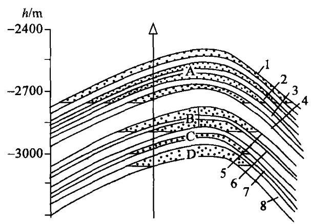

图 4-9 提塔斯气田剖面图 (据 Ahamd, 1966)

$1 \sim  8$ 一气层; $A\text{、}B\text{、}C\text{、}D$ 一气藏

<!-- Media -->

背斜油气藏大多数构造形态较完整, 虽然经常有断层存在, 但断距较小, 不起分割油气藏的作用。如果断层将背斜油气藏切割成具有不同压力系统和油水界面的独立单元时, 其中背斜对油气聚集起主导作用的部分, 仍称为背斜油气藏, 而断层对油气聚集起主要作用的那一部分,则称为断层油气藏,如我国的老君庙油田 $\mathrm{L}$ 层油藏 (图 4-10)。

## (三) 背斜油气藏的主要类型

根据褶皱作用类型, 背斜圈闭主要有褶皱背斜 (图 4-10) 和同生背斜两大类。同生背斜按形成条件又可进一步分为与断层活动有关的逆牵引背斜、地下塑性物质上升形成的隐刺穿背斜、与基底活动有关的同沉积背斜以及与基岩凸起有关的差异压实背斜。通常情况下, 同生背斜形成相对较早, 对油气聚集, 特别是油气的早期聚集十分有利。世界上许多巨型和大型油气田, 如沙特阿拉伯的盖瓦尔油田、科威特的布尔干油田、前苏联的乌连戈伊气田和罗马什金油田、我国的大庆油田(图 4-11)背斜圈闭的成因虽然不同, 但作为油气圈闭的遮挡作用来说都是一样的。

<!-- Media -->

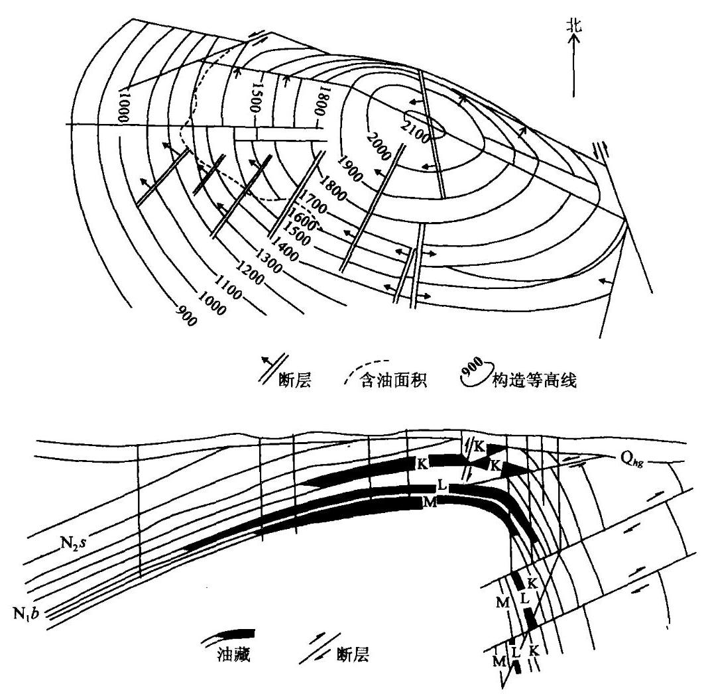

图 4-10 老君庙油田 $\mathrm{L}$ 层顶面构造图及油藏剖面图

(据玉门油田石油地质志, 1989, 修编)

<!-- Media -->

## 二、断层油气藏

## (一) 断层圈闭的形成机理

凡是储集层上倾方向或各个方向由断层封闭而形成的圈闭, 都称断层圈闭。虽然储集层顶、底界存在非渗透性岩层对断层圈闭来说, 是不可缺少的, 但这对任一圈闭来说, 都是一个基本条件。因此, 在断层圈闭中特别强调了断层对圈闭形成的重要作用。断层能否形成断层圈闭, 主要取决于以下两个方面: 一是断层本身的封闭性; 二是在构造图上断层线与构造等高线 (或岩性尖灭线) 能否构成一个闭合区。

<!-- Media -->

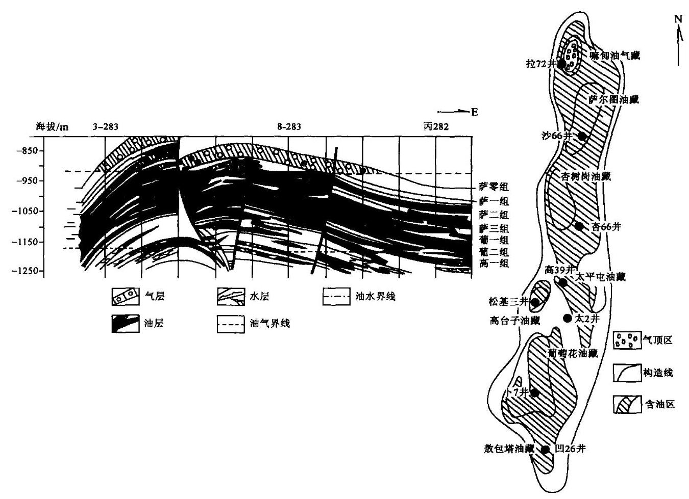

图 4-11 大庆油田构造图及油藏剖面示意图

(据大庆油田, 1977)

<!-- Media -->

断层本身的封闭性是能否形成断层圈闭及断层油气藏的基本条件之一。我们知道, 不是任何一条断层都具有封闭性, 不具封闭性的断层, 不仅不能遮挡油气, 形成油气藏, 相反, 它还会成为油气运移的通道, 破坏油气藏。因此, 对断层圈闭或油气藏来说, 断层封闭性的研究是极为重要的。

决定断层封闭性的因素最主要的是断层两盘的岩性组合及其接触关系 (图 4-12)。 一般说来,如果断层使储集层上倾方向完全与非渗透性岩层相接触 (图 4-12 B 层), 则可形成完全封闭。在这种情况下, 断层圈闭的闭合面积为储集层顶面构造等高线与断层线所构成的闭合区, 闭合度则为圈闭顶点到闭合等高线的高差。如果断层使储集层上倾方向与渗透层相接触时 (图 4-12 C 层), 则断层不起封闭作用, 不能形成断层圈闭。如果断层使储集层上倾方向的上方一部分与非渗透性岩层相接触时 (图 4-12 A 层), 则形成部分封闭。有时在同生断层发育地区, 储集层上方的粘土层, 在同生断层活动时发生沿断面向下的塑性流动, 并被挤入下伏砂岩储集层中, 形成一个天然泥饼, 从而可形成流动泥 (页) 岩遮挡 (图 4-13), 这也是一种部分封闭。在部分封闭时, 断层圈闭的闭合面积和闭合度都较完全封闭时要小。

断层圈闭的形成是一个复杂的过程, 是多因素综合作用的结果。其中断层本身的封闭性是断层圈闭形成的核心。目前研究断层的封闭性一般以定性和定量的方法相结合, 并取得了较大进展。

<!-- Media -->

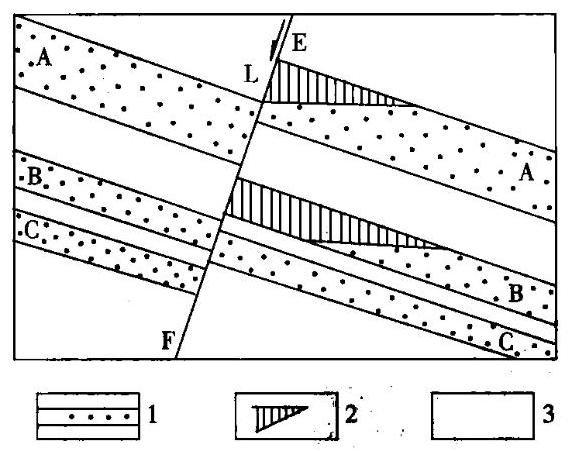

图 4-12 断层封闭油气概念图

(据 Hobson, 1956) 1-砂岩; 2-油气; 3-粘土

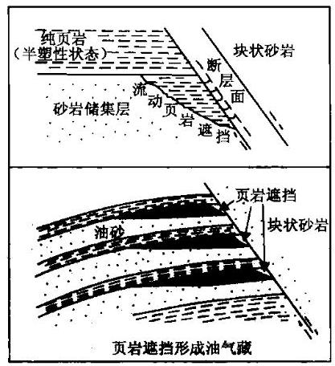

图 4-13 流动页岩封闭概念图 (转引自王燮培, 1976)

<!-- Media -->

## (二) 断层油气藏的特点

单一断层圈闭中聚集了工业规模的石油和天然气后, 即成为断层油气藏。断层油气藏是地壳上广泛分布的一种油气藏类型。由于断层在这类油气藏形成中的作用极为复杂, 因此, 断层油气藏常具有自己的某些特点。

油气层上倾方向或各个方向被断层所限是断层油气藏的基本特点之一。

由于断层发育使油气藏复杂化, 断层油气藏常具有多、杂、乱、散的特点。即在构造复杂的断裂带, 断层油气藏形式、个数较多, 油气水关系复杂, 各断块含油层位、含油高度和含油面积都可能很不一致, 含油断块分散, 分割性强。

断层附近储集层渗透性变好。沿断裂带的岩石, 常被挤压而破裂形成裂隙, 增大了储集层的渗透性, 使油气富集于断层附近。特别是在致密性脆而易碎的储集层内, 这种现象尤为显著。

断层油气藏的闭合高度和闭合面积取决于断距大小, 盖层和储集层厚度, 同时还与断层位置及性质有关。如断层发育在鼻状构造翘起部分, 或发生在闭合度小的构造沿区域倾斜翘起的方向, 且断层又是封闭的, 则将增加其含油面积和含油高度。

油气富集带常在断层靠近油源一侧。复杂性和多样性是断层油气藏固有的特点, 并且与各时期构造运动的性质和强弱有关。因此, 掌握和了解一个地区的构造运动规律, 将有利于断层油气藏的勘探。

## (三) 断层油气藏的主要类型

断层圈闭的形式是多种多样的, 但在成因上它们又有着内在的联系, 最基本的共同点, 就是它们都是在储集层的上倾方向为断层所封闭。根据断层圈闭的形成条件和形态特征, 断层圈闭和油气藏可分为以下四种基本类型: ①弯曲或交错断层与单斜地层结合形成的断层或断块圈闭和油气藏 (图 4-14 A); ② 三个或更多断层与单斜或弯曲地层结合形成的断层或断块圈闭和油气藏 (图 4-14 B); ③ 单一断层与褶皱 (或背斜一部分) 结合形成的断层或断块圈闭和油气藏 (图 4-14 C); ④逆断层和逆掩断层与背斜的一部分结合形成的断层圈闭和油气藏 (图 4-14 D)。

<!-- Media -->

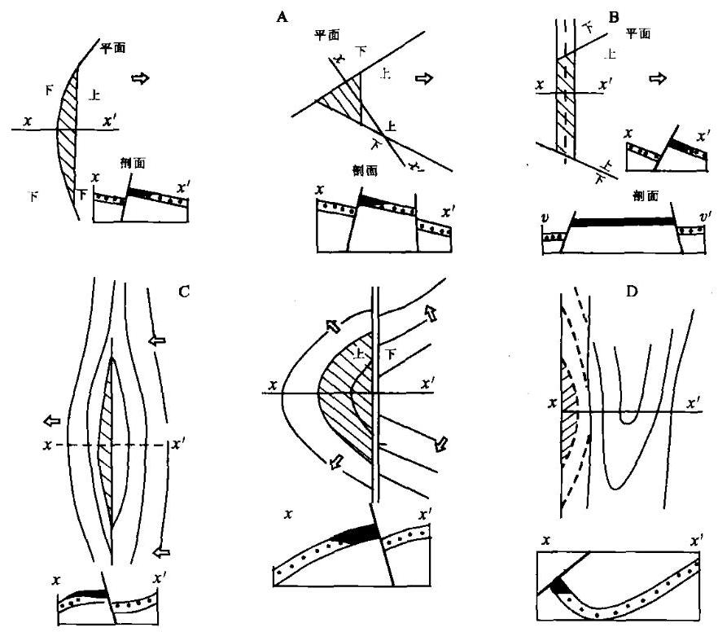

图 4-14 断层油气藏基本类型平面与剖面图

(转引自陈荣书, 1994)

图中黑色和斜线代表油气

<!-- Media -->

不同类型的沉积盆地, 甚至在同一沉积盆地的不同构造带, 断层发育情况和特点也各不相同。因此, 不同油气区的断层圈闭和油气藏都有自己的特点。

我国新疆克拉玛依油田 (图 4-15) 可作为断层油气藏群体的典型实例之一。该油田除西北侧靠近盆地边缘地区外, 在断裂带主要断层发育区, 都以断层油气藏为主, 各断块油气藏都具有独立的压力系统、油气产量和油气边界, 甚至产油层的层数都各不相同。近来的研究表明, 北东向克 - 乌主断裂带具有明显的逆掩断层性质, 石炭系楔状推覆体掩盖在二叠系和石炭系之上,其宽度达 ${11} \sim  {30}\mathrm{\;{km}}$ ,断面倾角向下变缓,呈犁状。在断层下盘已发现有反向遮挡的断层油气藏。这一发现, 不仅为克拉玛依油田开辟了广阔的勘探新领域, 同时也为我国今后在构造复杂带中寻找新油气藏类型开辟了良好的前景。

在我国西部褶皱较强烈的山前带, 常出现逆或逆掩断层与背斜一翼结合形成的逆断层或逆掩断层油气藏。前面介绍过的老君庙油田北翼 $\mathrm{L}$ 层中的断层油藏也是一例。

在我国东部新生代断陷沉积盆地中, 常发育与同生断层下降盘逆牵引有关的背斜油气藏和反向正断层上升盘中的 “屋脊断块” 油气藏。东濮凹陷文 92 断块油田就是这类油气藏的一个实例 (图 4-16)。

值得注意的是, 在确定断层油气藏时, 有时会将一个拥有众多断块油气藏的复杂断裂构造带, 与一个被断层复杂化的背斜油气藏相混淆。因为它们在平面形态上常常很相似, 但二者最根本的区别在于, 背斜油气藏中仍然保持有统一的压力系统和油气水分布, 而复杂的断块油气藏虽在总体形态上仍具有背斜轮廓, 但其中已被断层分割成一些独立的含油断块, 这些含油断块彼此之间往往具有很大差异。它们的含油层位和数目、含油高度、油层厚度、油气水界面深度、原油性质、油层压力以及生产能力等都可以很不相同, 即使是两个紧邻的断块, 也常常有较大差异。

<!-- Media -->

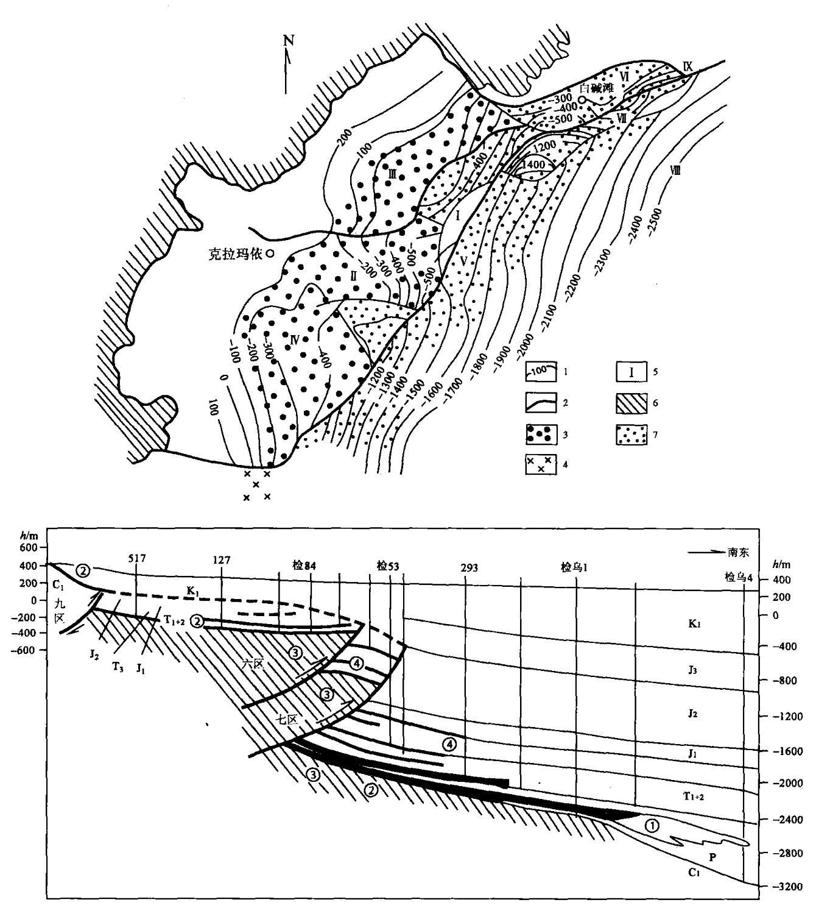

图 4-15 克拉玛依油田平面及剖面图

(转引自陈荣书, 1994)

1 一构造等高线 $/\mathrm{m}$ ; 2 一断层; 3 一砾岩、砾状砂岩; 4 一裂隙; 5 一地质分区编号; 6 一侵蚀区; 7 一砂岩发育区; ①岩性油藏; ②地层超覆不整合油藏; ③基岩油藏; ④断层油藏

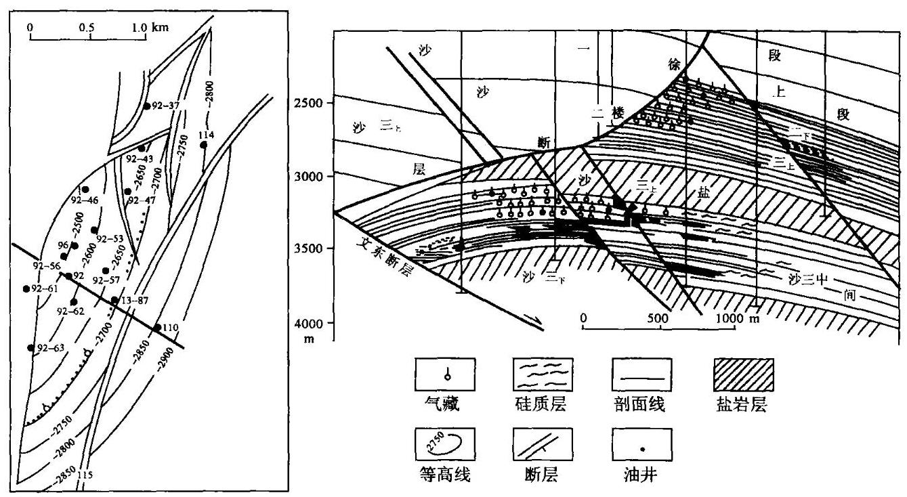

图 4-16 东濮凹陷文 92 块油气藏平面及剖面图

(据中原油田, 1987)

<!-- Media -->

## 三、裂缝性背斜油气藏

## (一)裂缝性背斜圈闭的形成机理

在致密、性脆的非渗透性岩层中, 由于构造作用或其他改造作用, 裂缝可以特别发育, 从而导致出现孔隙和渗透性变好的局部地区。在背斜构造控制下, 裂缝性储集层被非渗透岩层和高油气势面联合封闭而形成的闭合低油气势区, 称之为裂缝性背斜圈闭。其主要的储集空间是裂缝和孔洞, 主要的渗透通道是裂缝, 裂缝在圈闭中起着十分重要的双重作用。

裂缝性背斜圈闭和背斜圈闭是有区别的, 其主要区别在于裂缝性背斜圈闭的储集层不是呈层状展布, 而是仅在裂缝发育带形成呈带状分布的不甚规则的裂缝储集体。

裂缝性储集层的成因是多种多样的, 此处仅指在背斜构造控制下的构造裂缝, 而其他条件下形成的裂缝性储集层, 大多是岩性圈闭, 不属于本类圈闭。

## (二)裂缝性背斜油气藏的特点

油气在裂缝性背斜圈闭中聚集工业规模石油和天然气后,而成为裂缝性背斜油气藏。 该类油气藏中油气的分布总体上受背斜构造控制, 但以裂缝发育带最为富集; 油气产量、 油气柱高度以及油气层压力分布极不均匀。

## (三)裂缝性背斜油气藏的主要类型

裂缝性背斜油气藏在世界石油和天然气的产量、储量中占有十分重要的地位。按其储集层的岩石类型及重要性, 可分为碳酸盐岩和其他沉积岩裂缝性油气藏两大类, 其中以碳酸盐岩裂缝性油气藏最为重要。

碳酸盐岩中的裂缝性油气藏分布广泛, 但以构造变动较强烈的山前带, 或其他褶皱背斜带最为重要。最典型的是波斯湾盆地的扎格罗斯山前带。在该带已发现的 50 多个油气田中, 有 20 多个是裂缝性背斜油气藏, 储量在 10 亿吨以上的特大油气田就有 6 个 (加奇萨兰、马伦、阿瓦兹 - 阿斯马里、阿加贾里 - 比比、哈基麦赫和帕扎南)。此外, 伊拉克的阿因扎列大油田亦属裂缝性背斜油气田, 基尔库克特大油田虽属礁型油气田, 但裂缝亦很发育。现以伊朗的加奇萨兰油田为例简介如下 (图 4-17)。

<!-- Media -->

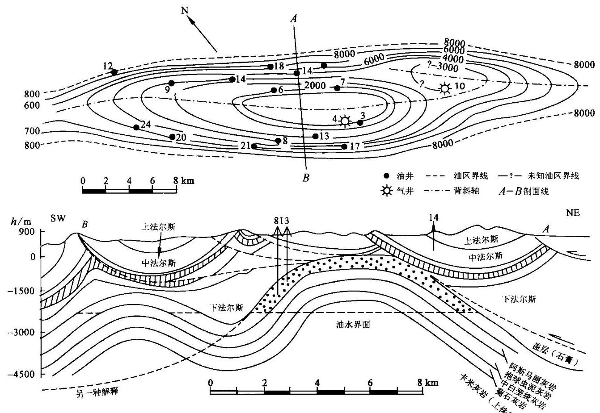

图 4-17 伊朗的加奇萨兰油田平面及剖面图

<!-- Media -->

该油田位于扎格罗斯山前带的第二构造带上, 褶皱强度中等到较强, 上下构造不一致, 地表为中中新统法尔斯组组成的向斜, 地下为阿斯玛里灰岩组成的顶部平缓、两翼较陡 $\left( {250}^{ \circ  }\right)$ 的简单背斜。轴向北西,长 ${70}\mathrm{\;{km}}$ ,宽 $9\mathrm{\;{km}}$ ,闭合面积为 ${600}多{\mathrm{{km}}}^{2}$ ,闭合高度为 ${3000}\mathrm{\;m}$ 左右。它有三套产油层,自上而下依次为: 阿斯玛里石灰岩 (下中新统一渐新统)、萨尔维克石灰岩 (中白垩统)、卡米石灰岩 (上侏罗统), 裂缝把它们沟通, 形成具有统一压力系统的巨厚块状储集体,油气柱高达 ${2100}\mathrm{\;m}$ 。阿斯玛里石灰岩之上为巨厚的上法尔斯膏盐层所封闭。

主要产油层阿斯玛里石灰岩的孔隙率均一, 但以低孔隙率为主。据某井统计, 孔隙率大于 $9\%  \sim  {13}\%$ 的,仅占储集层厚度的 ${13.8}\%$ ; 孔隙度为 $5\%  \sim  9\%$ 的,占储集层厚度的 ${14.8}\%$ ; 孔隙率低于 $5\%$ 的却占 ${71.4}\%$ 。岩样的渗透率一般小于 $\left( {{10} \sim  {20}}\right)  \times  {10}^{-3}{\mathrm{{\mu m}}}^{2}$ ; 最高的仅 ${40} \times  {10}^{-3}{\mathrm{{\mu m}}}^{2}$ ,但裂缝发育带渗透性极好,油田西北端 ${24}\text{、}{35}$ 及 45 号井的最高日产量达万吨以上,整个高产区平均单井日产量达 ${8000}\mathrm{t}$ 以上。但在某些井 (如 6 号井) 全部钻开阿斯玛里灰岩的日产量也只有 ${600}\mathrm{t}$ 。

我国四川盆地东、南部气区中亦发现了相当数量的碳酸盐岩裂缝性气藏(四川盆地地震勘探), 其基本特征都具有相似性, 但产气能力和气柱高度均远不及扎格罗斯山前带。 图 4-18 为川东南石油沟 - 东溪气田构造图及剖面图。

<!-- Media -->

图 4-18 四川石油沟 - 东溪气田平面及剖面图 (据四川石油管理局, 1959)

<!-- Media -->

该气田的生产层主要是三叠系嘉陵江组的石灰岩和白云岩, 其上部为硬石膏层作为盖层。据岩心分析,其平均孔隙度仅 $2\%$ ,渗透率小于 $1\mathrm{\;{mD}}$ ; 但试井结果,渗透率达几十到几万毫达西,平均值高达 ${3000}\mathrm{\;{mD}}$ 以上。因此, 这种良好的渗透性显然是由于次生裂缝发育造成的。

其他沉积岩中的裂缝性油气藏, 在美国的圣马利亚盆地、米德兰盆地和我国的柴达本盆地及陕甘宁盆地等均有发现。其中以美国加利福尼亚州圣马利亚盆地上中新统蒙特雷组中的裂缝性背斜油气藏最为著名和典型 (图 4-19)。

该区蒙特雷组由三部分组成: 上部为板状硅质页岩, 中部为裂缝性燧石层, 下部为石灰质页岩。中部岩层为主要储集层,其孔隙度仅 $6\%$ ,但裂缝发育且分布均匀,渗透率极高, ${60}\%$ 的产量来自该层。该层石油聚集与孔隙性砂岩相近,主要受背斜控制 (如卡斯马里亚、奥克特、西猫儿峡、隆克波等), 部分受燧石层上倾尖灭带所控制 (如圣马利亚河谷、东猫儿峡、加脱山、扎沙河等), 而不是仅仅局限于背斜轴部或裂缝发育带。但与孔隙型储集层相比, 仍有显著差别, 主要表现为各井日产量差别较大, 高者可达千余桶, 低者不足百桶。

## 四、刺穿油气藏

## (一) 刺穿圈闭的形成机理

刺穿构造是指地下深处的岩体侵入到上覆沉积岩中而形成的构造。地下岩体刺穿沉积岩层时, 使储集层发生变形, 并直接以刺穿岩体遮挡而形成的闭合低势区, 称为刺穿圈闭。至于那些受岩体侵入或塑性地层流动影响, 使储集层上拱发生变形、变位 (断层) 而形成的圈闭, 则称为隐刺穿背斜和断层圈闭, 它们在分类上属于背斜圈闭和断层圈闭的范畴。刺穿圈闭和隐刺穿背斜圈闭的根本区别在于前者有岩体刺穿储集层, 而后者则不存在刺穿岩体。

<!-- Media -->

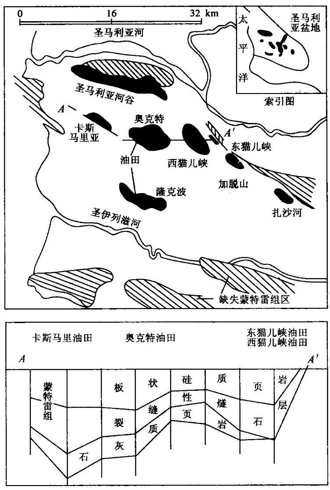

图 4-19 美国加利福尼亚州圣马利亚盆地上中新统蒙特雷组中的裂缝性背斜油田分布图 (据 Hubbert, 1953)

<!-- Media -->

造成刺穿的可塑性岩体包括盐、 膏盐、软泥和岩浆岩等, 它们形成的刺穿圈闭相应地称为盐、膏盐、软泥及岩浆岩刺穿圈闭。但以盐、膏盐和软泥最为常见。

刺穿圈闭除上倾方向被侵入岩体封闭外, 储集层上方存在非渗透性岩层, 下方和下倾方向被油气高等势面和非渗透性岩层联合封闭, 也是不可缺少的。刺穿圈闭的闭合面积同样是通过由储集层顶面溢出点的构造等高线与刺穿岩体封闭线联合构成的闭合区加以确定。

形成刺穿 (包括隐刺穿) 构造的基本条件是: ①一定埋深所造成的温度和压力, 以达到或超过岩盐、膏盐和软泥岩软化点所需的温、压, 使盐、膏盐和软泥岩呈可塑性状态, 这是造成刺穿或隐刺穿的前提条件, 可塑性盐、膏盐和软泥岩的厚度愈大, 形成刺穿或隐刺穿构造的机会也愈大; ②差异负荷地带常是刺穿或隐刺穿发育的有利地带, 因为可塑性岩层总是自高压 (负荷) 区向低压区方向运动, 在差异负荷地带, 因压力突然减小, 易诱发可塑性岩体向上拱起形成底辟构造; ③在三角洲退覆沉积体系中, 发育粘土沉积的前三角洲泥, 不断被密度较大的砂质沉积所覆盖, 造成密度倒置, 随着三角洲沉积体的前积作用, 必然造成前积方向压力不均衡, 导致具有高异常流体压力的可塑性软泥沿密度分界面向上拱起和刺穿。

在发育软泥沉积的前三角洲, 或发育蒸发岩的与成盐凹陷相邻近的同生断层 - 逆牵引背斜带, 或构造应力集中而形成的挠曲带、断裂带和褶皱构造带, 常常是刺穿构造和圈闭发育的有利地带。

## (二) 刺穿油气藏的特点

在刺穿圈闭中聚集工业规模的石油和天然气, 即成为刺穿油气藏。刺穿油气藏的基本特征是油气在上倾方向一侧被刺穿岩体所限, 其下倾方向油 (气) 水边界仍与构造等高线保持平行或基本平行; 刺穿油气藏中的含油气层, 除盐帽中的岩性油气藏外, 大多数呈层状展布, 具有较好的孔渗性, 而且连通性较好。

## (三) 刺穿油气藏的主要类型

在各类刺穿构造中, 以盐和软泥刺穿最为重要, 下面着重介绍与盐刺穿有关的圈闭和油气藏类型。

由于盐刺穿构造是一种生长构造(与沉积物堆积作用同时发生的变形所造成的构造), 在形成刺穿圈闭的同时, 常伴随有断裂、岩性尖灭、不整合圈闭, 以及刺穿岩层上方的隐刺穿背斜和断层圈闭, 这些圈闭内同样可以形成相应的油气藏。这些油气藏根据与刺穿岩体的关系可分为两类:

1) 直接与刺穿岩体有关的圈闭和油气藏 (图 4-20, I ① ~ ③)。包括: ① 盐栓 (核) 遮挡的圈闭和油气藏; ② 盐帽遮挡的圈闭和油气藏; ③ 盐帽内的透镜状圈闭和油气藏。

<!-- Media -->

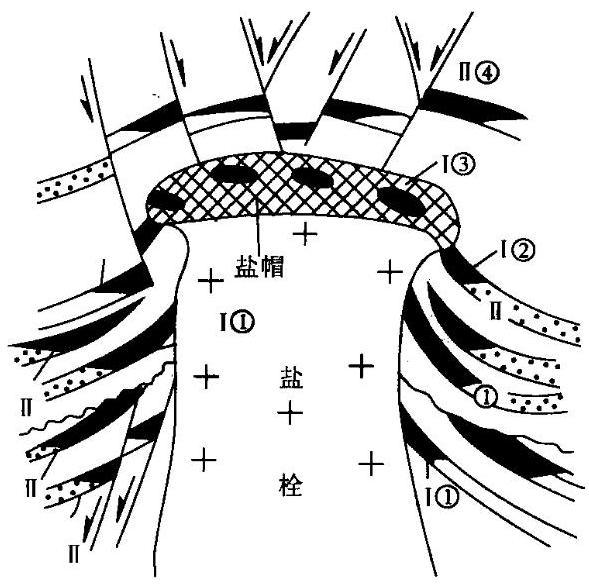

图 4-20 与盐丘有关的油气藏理想图示 (转引自潘钟祥, 1986)

<!-- Media -->

2) 与刺穿岩体有成因联系的伴生圈闭和油气藏 (图 4-20, II ① ~ ④)。包括: ① 盐背斜圈闭和油气藏; ②断层圈闭和油气藏; ③盐栓周围的不整合圈闭和油气藏; ④ 岩性尖灭圈闭和油气藏。

在上述各种与盐刺穿有关的油气藏中, 以深层潜伏盐丘之上的背斜油气藏最为重要, 其次是断层油气藏, 再次则为浅层盐丘之上的背斜油气藏和盐栓遮挡的油气藏。但需要注意的是, 世界上虽然许多盐丘构造是产油的, 但并不是所有的由侵入岩形成的圈闭都产油。在与盐、软泥、火山岩侵入体等有关的刺穿构造中, 有许多圈闭是不产油的。在油气勘探过程中, 对刺穿构造 (圈闭) 的评价, 要视当地的具体地质条件, 尤其是生油条件而定。

刺穿构造按刺穿岩体性质的不同, 可以分为盐体刺穿、泥火山刺穿和岩浆岩刺穿等。目前世界上在这三种刺穿构造形成的圈闭中都已发现了油气藏。但是, 从分布的广泛性来看, 盐丘刺穿更为重要。如在罗马尼亚、波兰、墨西哥、安哥拉、加蓬、联邦德国、美国和前苏联等, 都发现有相当数量的盐丘刺穿类型的油气藏。其中以美国墨西哥湾最重要,那里有上百个盐丘,含有丰富的油气。据统计,世界上约有 ${45}\%$ 的天然气和 ${11}\%$ 的石油是产自盐丘地区。而与泥火山、岩浆岩刺穿有关的油气藏,仅在个别地区有所发现。

地下深处的盐体, 侵入并刺穿上覆的沉积岩层, 形成刺穿圈闭, 其中聚集了油气则称为盐体刺穿油气藏。例如罗马尼亚喀尔巴阡山前带的莫连尼油田的油藏, 就是属于这种类型的油气藏。该油田是盐体侵入并刺穿了上覆第三系渐新统和上新统的砂岩储集层, 从而形成了盐体刺穿圈闭及其油气藏, 如图 4-21 所示。此外, 在美国的墨西哥地区、前苏联的恩巴地区、西欧的北海盆地、西非的加蓬等地区都广泛分布有这种类型的油气藏。

<!-- Media -->

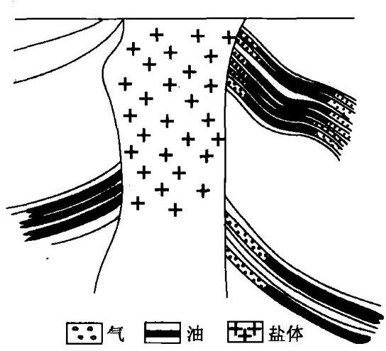

图 4-21 莫连尼油田剖面图

(据 Bpoд, 1956)

<!-- Media -->

前苏联阿普歇伦半岛的洛克巴丹油气田中的油气藏, 是由于泥火山刺穿作用形成圈闭条件, 油气聚集其中而形成的油气藏。该油田为一背斜构造, 构造顶部被泥火山刺穿, 第三系上新统储集层沿上倾方向与泥火山刺穿体接触, 形成圈闭条件, 其中聚集了油气, 就形成了这类油气藏, 如图 4-22 所示。我国新疆准噶尔盆地南部的独山子油田, 也有泥火山活动。此外, 在尼日尔河三角洲、缅甸的阿拉康海岸, 以及特立尼达岛等地, 也都有泥火山活动及与其有关的油气藏。

地下深处的岩浆侵入并刺穿上覆沉积岩层, 形成刺穿圈闭, 后来油气在其中聚集, 就形成了岩浆刺穿油气藏。这类油气藏比较少见, 在墨西哥曾发

现过这种类型的油气藏, 如图 4-23 所示。

<!-- Media -->

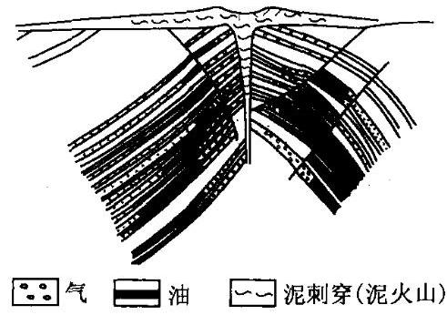

图 4-22 洛克巴丹油气田剖面图

(据 Eport, 1956 修改)

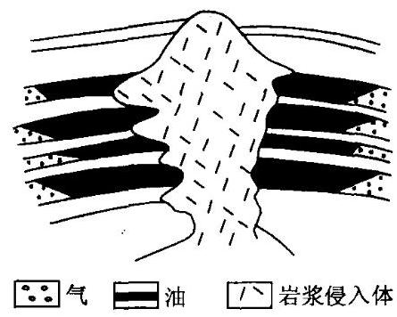

图 4-23 墨西哥某油田剖面图

(据 Bpoд, 1956)

<!-- Media -->

## 第三节 地层油气藏

凡是储集层四周或上倾方向因岩性变化 (楔入、尖灭) 或地层变化 (剥蚀、超覆), 被非渗透性岩层所封闭而形成的闭合低势区, 称为地层圈闭。在其中聚集工业性石油和天然气后, 成为地层油气藏。

地层油气藏有岩性油气藏、不整合油气藏、礁型油气藏和沥青封闭油气藏等主要类型。

## 一、岩性油气藏

## (一) 岩性圈闭的形成机理

凡是储集层因岩性或物性发生变化, 其四周或上倾方向和顶、底被非渗透性岩层所封闭而形成的闭合低势区, 称为岩性圈闭。储集层的岩性或物性变化, 可以是沉积作用过程中形成的, 也可以是成岩、后生作用过程中形成的。在沉积作用过程中形成的岩性变化所造成的岩性圈闭, 有时又称为沉积圈闭。这种圈闭一般是由具有良好孔、渗性的碎屑岩或粒屑灰岩在上倾方向或四周被非渗透性岩层所限而形成的。其中储集层四周均被非渗透岩层封闭的称为透镜型岩性圈闭, 其圈闭范围由非渗透性边界确定; 储集层上倾方向和顶、 底被非渗透岩层封闭的称为上倾尖灭型岩性圈闭,其圈闭范围由上倾方向非渗透性封闭线和储集层顶面通过溢出点的构造等高线联合构成的闭合区加以确定。

在成岩、后生作用过程中形成的岩性圈闭, 称为成岩圈闭。它可以是储集层的一部分变为非渗透性遮挡而形成的圈闭, 也可以是非储集层的一部分变为渗透性储集体, 其四周或上倾方向和上方被封闭而形成的圈闭。在成岩圈闭中, 又以溶蚀和次生白云岩化作用在碳酸盐岩发育区形成的岩性圈闭和油气藏更为重要。

从岩性圈闭形成的构造、沉积背景来看, 岩性圈闭既可形成于单斜和鼻状构造地区, 也可形成于不同级次的正向构造单元的轴部、翼部和端部, 还可产生于负向构造单元 (如向斜) 的斜坡上。岩性圈闭也常形成于水进、水退变化较频繁的古河道、湖岸、海岸线附近, 或湖盆、海盆中古地貌变化较大的地带, 因为这些地区频繁的水进和水退引起沉积古地理条件的更替, 并导致岩性岩相的急剧变化, 这为岩性圈闭的形成创造了有利条件。

## (二) 岩性油气藏的特点

在岩性圈闭中的工业性油气聚集, 称为岩性油气藏。岩性油气藏常具有以下一些特点:

岩性圈闭种类很多, 主要受沉积条件控制, 具有区域性分布的特点, 因此, 岩性油气藏的出现不是孤立的、偶然的, 而是有规律的, 它们常成群成带分布, 一旦发现一个, 就可能在同一地区找到多个类似的油气藏。

岩性油气藏储集层的连续性较差 (透镜状或楔状), 一般情况下, 难以形成大型油气藏, 但不同层位的储集体可以叠合连片, 形成中小乃至较大的油气藏。

岩性油气藏的储集层多为碎屑岩储集层, 且大多与生油层属同一层位, 因此, 常为自生白储式油气藏。

由于储集层沿上倾方向尖灭或岩性侧变, 或四周被不渗透地层封闭, 所以, 岩性油气藏受水动力及水化学作用的影响小, 原油性质较好。

由于岩性油气藏的含油气边界常为非渗透性边界所限, 各含油气砂体零星分布, 油源及能量补给慢, 故油气产量递减快, 但单井生产时间较长。

## (三) 岩性油气藏的主要类型

据岩性油气藏储集层的展布特征, 可分为透镜型和上倾尖灭型岩性油气藏两种基本类型 (图 4-24)。其中透镜型岩性油气藏可进一步分为沉积 - 透镜型和成岩 - 透镜型两亚类。

1. 透镜型岩性油气藏

透镜型岩性圈闭没有溢出点。其圈闭的闭合面积、闭合度及容积, 完全由透镜状储集体的大小和形状所确定。透镜状储集体主要由碎屑岩(砂、砾岩)和鲕状、粒屑碳酸盐岩等组成。

目前世界各国已探明的碎屑岩透镜型油气藏, 包括有河道砂岩体、三角洲平原分流河道砂岩体、三角洲前缘的河口坝砂岩体、岸外堡坝砂岩体、沿岸坝砂岩体和深水浊积砂岩体中所形成的岩性油气藏。但必须指出, 这类油气藏必须存在于透镜型岩性圈闭中。如果油气藏仅存在于这类砂岩中, 而控制油气聚集的主要因素不是透镜型岩性圈闭, 那就不属于这种类型油气藏。

<!-- Media -->

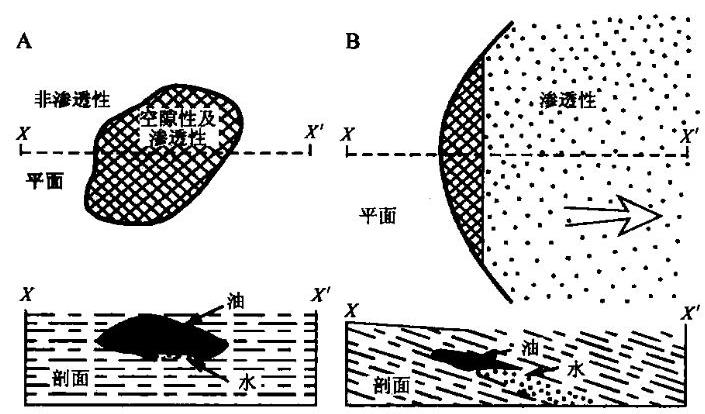

图 4-24 岩性圈闭和油气藏基本类型图示

(据 Levorsen, 1954)

A一透镜型; B一上倾尖灭型

<!-- Media -->

(1)沉积 - 透镜型岩性油气藏

河道沉积是河流切割的河道中充填的一套冲积沉积物, 它由砾岩、砂砾岩、砂岩、细一粉砂岩和泥岩间互组成, 具有下粗上细的剖面沉积特征。河道砂主要包括边滩砂和心滩砂。由于河道常迁移和摆动, 这两种砂体常形成复合体。河道砂的基本特征是砂体与河道底和侧向侵蚀面成突变接触, 砂体向下凹, 在平面上常呈带状或分支状。

美国密西西比州林柯伦县和帕克县的小溪油田 (图 4-25) 为典型的边滩砂岩体油气藏。砂岩厚度与蛇曲凹岸一侧延伸方向一致, 砂体的形态与边滩一致。该油田构造为一向北倾斜的鼻状构造,油田分布主要受边滩砂岩体控制。油田面积约 ${25}{\mathrm{\;{km}}}^{2}$ ,原始可采储量达 ${1370} \times  {10}^{4}\mathrm{t}$ 。

<!-- Media -->

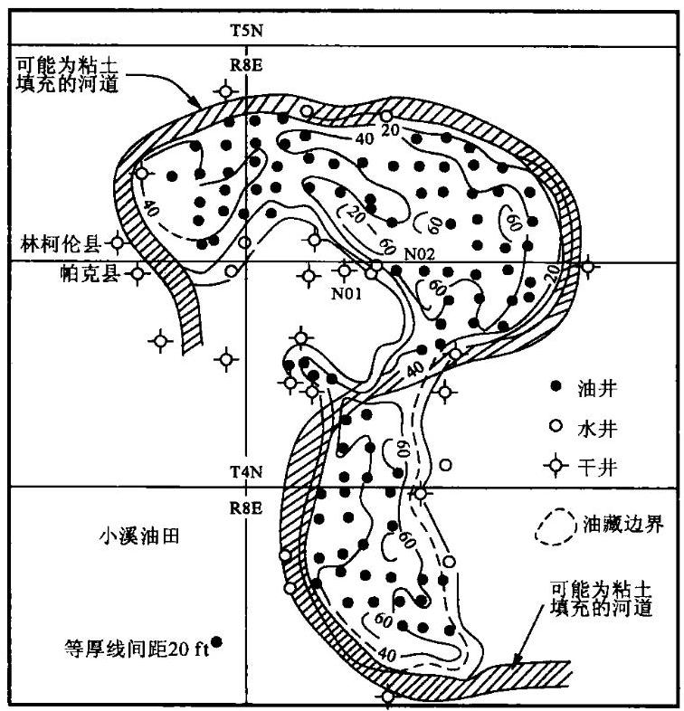

图 4-25 美国密西西比州小溪边滩砂岩体油田

(据艾森斯塔特, 1960)

<!-- Media -->

---

<!-- Footnote -->

- $1\mathrm{{ft}} = {0.3048}\mathrm{\;m}$ 。

<!-- Footnote -->

---

三角洲砂岩体以三角洲平原的分流河道砂岩体和三角洲前缘的河口坝砂岩体最为重要。美国蒙大拿州南部钟溪油田穆迪砂岩中的油气藏, 就是由堡坝和河口坝砂岩体复合而形成的透镜型岩性油气藏的典型实例。根据对油田及其附近地区穆迪砂岩(主要产油层) 的岩相古地理研究表明 (图 4-26),穆迪砂岩为一北东一南西向的堡砂坝,厚约 ${30}\mathrm{\;m}$ 。 堡坝与海岸之间有潟湖相隔。该砂坝西南为纽斯卡河的河口坝和三角洲前缘砂坝,它们是牧场溪油田的主要储集体。据钟溪(包括牧场溪)油田构造图及砂岩体和油藏分布图可知, 该区为一均斜构造, 油藏分布与构造没有明显关系, 而完全受砂岩体分布范围控制, 各个砂岩体都是一个独立的油气聚集单位, 都有各自的油水边界。

<!-- Media -->

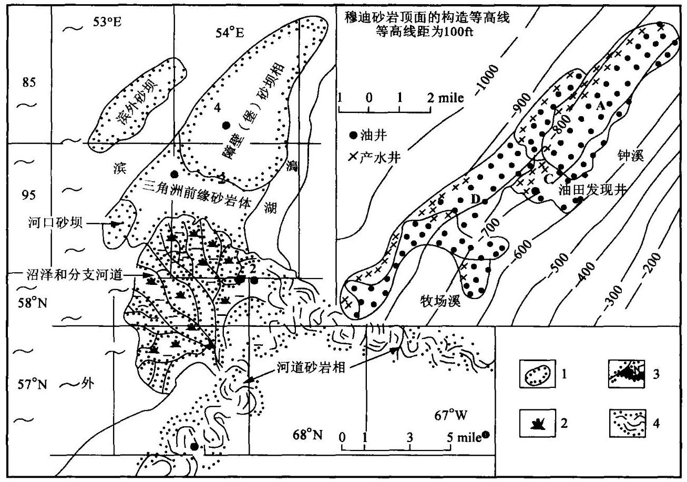

图 4-26 美国蒙大拿州钟溪油田及邻区穆迪砂岩岩相古地理与油气分布图

(据 McGregor &Boggs, 1968)

1一砂坝; 2-沼泽; 3-分支河道砂; 4-河道砂

<!-- Media -->

岸带附近是砂岩体较富集的地带, 类型多、分布广。除前面已论述的三角洲砂岩和堡砂坝中的透镜型岩性油气藏外, 常见的还有沿岸砂坝砂体岩体等。

沉积 - 透镜型岩性油气藏的储集体也可以由碳酸盐岩 - 鲕状、粒屑生物灰岩等组成。 美国得克萨斯州克罗开特县托德穹窿西翼的高产“海百合灰岩”透镜型油藏 (图 4-27) 就是典型的实例之一。

(2)成岩 - 透镜型岩性油气藏

成岩 - 透镜型岩性油气藏, 以碳酸盐岩中与白云岩化和溶蚀作用有关的油气藏最为

---

<!-- Footnote -->

- $1\mathrm{{mile}} = {1609}\mathrm{\;m}$ 。

<!-- Footnote -->

---

<!-- Media -->

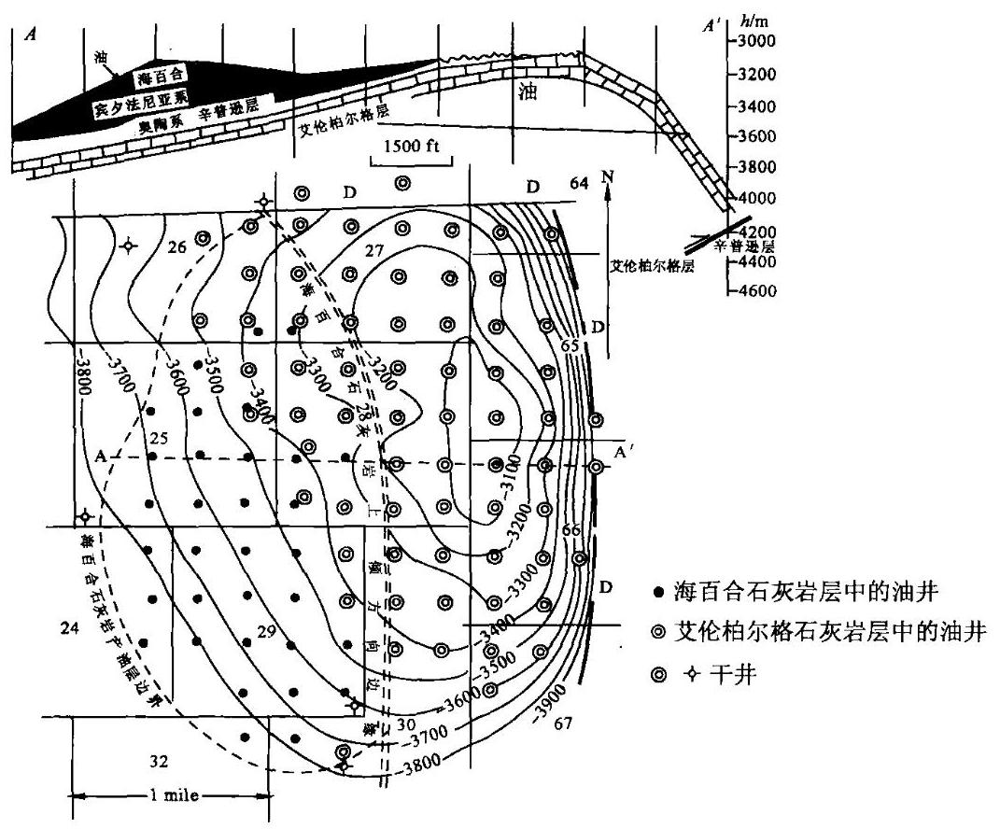

图 4-27 美国托德穹窿西翼的高产 “海百合灰岩” 沉积 - 透镜型油藏图

( 据 Imbt, 1950)

<!-- Media -->

重要。这类圈闭和油气藏的储集体大多呈不规则的透镜型。

美国俄亥俄州及印第安纳州的利马 - 印第安纳油田的特伦顿灰岩(中奥陶统)中的圈闭和油气藏 (图 4-28) 就是一例。

该油田横跨辛辛那提隆起和芬德莱隆起,长达 ${257}\mathrm{\;{km}}$ ,最宽处约 ${64}\mathrm{\;{km}}$ 。该带上分布一系列由溶蚀和白云岩化作用形成的孔隙体。油气藏的上倾方向和周缘都是由白云岩化界线所确定的。具有良好孔隙 - 渗透性的白云岩集中于不整合面下的特伦顿灰岩上部 $6 \sim  9\mathrm{\;m}$ 范围内,局部可向下延伸到 ${18} \sim  {30}\mathrm{\;m}$ 。白云岩中除白云岩化孔隙外,还有大量溶蚀孔洞。 在整个油田范围内, 所有油气藏几乎都是连续的, 油气丰富程度主要取决于白云岩化和溶蚀作用造成的储集体的大小及孔隙渗透性。特伦顿灰岩之上为上奥陶统页岩所覆盖, 具有良好的封闭条件。

此外, 白云岩化和溶蚀作用也可以仅限于局部, 形成局部与白云岩化和溶蚀作用有关的岩性圈闭和油气藏。

## 2. 上倾尖灭型岩性油气藏

这种类型的油气藏是由于储集层沿上倾方向尖灭或渗透性变差而造成圈闭条件, 油气聚集其中而形成的。上倾尖灭型岩性油气藏的储集层可以是碎屑岩, 也可以是碳酸盐岩, 但以碎屑岩为主。

在岸带附近广泛发育向陆方向的上倾尖灭的碎屑岩或粒屑灰岩, 特别有利于形成上倾尖灭型岩性油气藏。由于这种原因, 常把在岸带附近成带分布并与岸线大致平行的油气藏带称为海滨线油气藏带。

<!-- Media -->

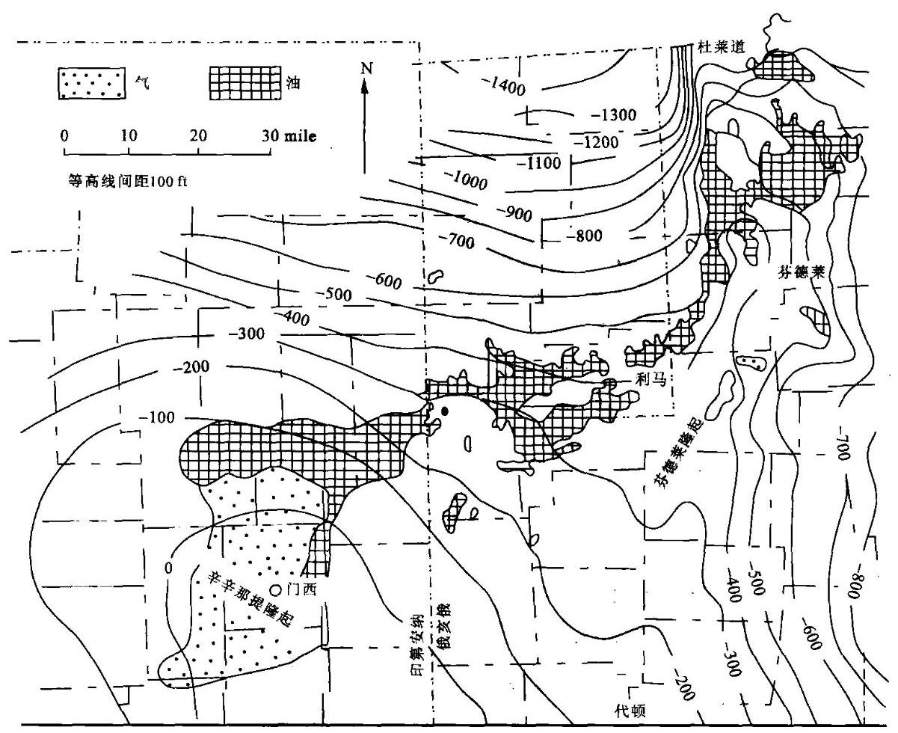

图 4-28 美国利马 - 印第安纳成岩 - 透镜型油气田构造及油气分布图

(据 Carman & Stout, 1934)

<!-- Media -->

美国得克萨斯州南部墨西哥湾沿岸地区始新统雅古·杰克逊砂岩和渐新统弗里奥・维克斯堡砂岩中的油气藏就是海滨线油气藏带的典型实例之一 (图 4-29)。该带许多油气藏的位置都是由渗透性砂岩向上倾方向变为非渗透性岩层的尖灭线所限定的。

勘探实践表明, 该油气田为一个被断层复杂化的鼻状构造。渐新统沙一段及沙二段上部砂岩为盐湖三角洲前缘相沉积, 物源主要来自凹陷东北部, 砂岩层厚度自东向西、自北向南渐趋变薄, 并在构造轴部及西翼一带尖灭。砂岩尖灭线与鼻状构造配合, 形成了砂岩上倾尖灭岩性圈闭及油气藏。

在碳酸盐岩中同样也存在上倾尖灭型岩性油气藏。如美国胡果顿气田(图 4-30) 就是这类油气藏的典型实例之一。它占有堪萨斯州的九个县及俄克拉荷马州的一部分, 向南直到得克萨斯州北部,南北延伸约 ${240} \sim  {260}\mathrm{\;{km}}$ ,东西宽约 ${50} \sim  {80}\mathrm{\;{km}}$ ,含气面积达 ${15500}{\mathrm{\;{km}}}^{2}$ ,原始储量为 ${2.039} \times  {109}{\mathrm{\;m}}^{3}$ ,为世界第八大气田,是美国最大的气田。

美国胡果顿气田为单斜构造。产层为下二叠统多孔鲕状石灰岩和白云岩,自东向西多孔碳酸盐岩逐渐减少, 泥质、砂质含量逐渐增加, 最后被红色砂泥岩所代替。多孔碳酸盐岩在西侧上倾方向被非渗透性红色砂泥岩封闭, 形成上倾尖灭型岩性圈闭和气藏。在红色

<!-- Media -->

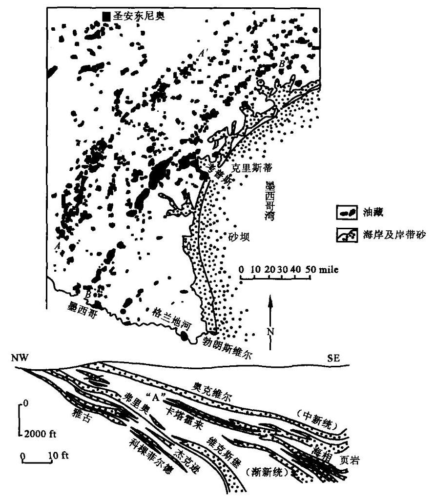

图 4-29 美国得克萨斯州南部墨西哥湾沿岸地区始新统雅古·杰克逊砂岩和

渐新统弗里奥・维克斯堡砂岩上倾尖灭油气藏

(据 Dussen & Owen, 1939)

<!-- Media -->

砂泥岩发育区不产气。

我国东濮凹陷北部濮城油气田沙一段及沙二段上部油层中的油气藏也是一种典型的上倾尖灭型岩性油气藏。

## 二、不整合油气藏

## (一)不整合圈闭的形成机理

不整合圈闭是指储集层上倾方向直接与不整合面相切并被封闭所形成的闭合低势区。 储集层可以位于不整合面之上或之下 (图 4-31 中 B、C、D、E )。在不整合圈闭中, 不整合面的封闭对圈闭的形成起主导作用, 但同时也需要有其他因素 (如构造因素或岩性因素)配合才能形成圈闭。不整合圈闭的闭合面积, 同样是由不整合遮挡线与储集层顶面过溢出点的构造等高线联合构成的闭合区加以确定。

对于那些储集层在不整合面之上或之下, 但没有与不整合面相切, 而由其他因素形成的圈闭和油气藏,均不属于不整合圈闭及其油气藏 (图 4-31 中 A、F )。在有些油气藏中, 虽有不整合, 且它对圈闭的形成也起一定作用, 但不是起决定性作用, 如礁型油气藏, 也不属于不整合油气藏。

<!-- Media -->

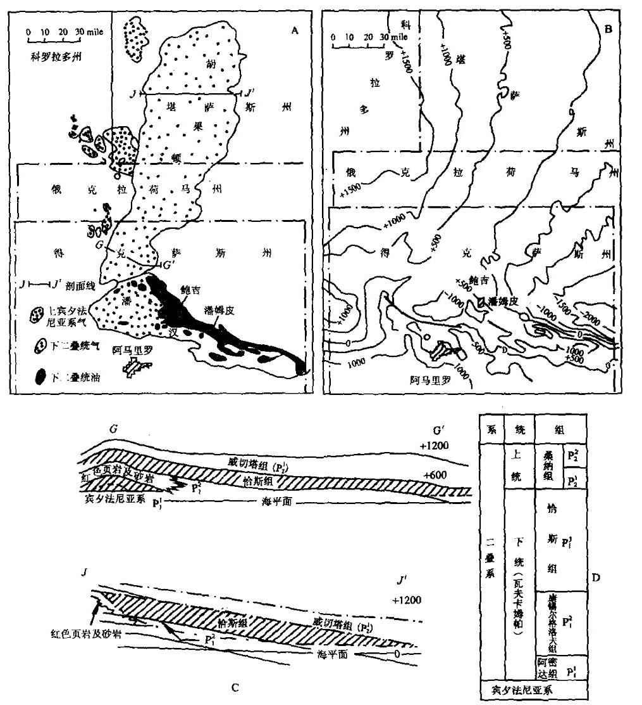

图 4-30 美国胡果顿气田的综合图

图 4-31 不整合油气藏及其与非不整合油气藏的区别示意图

A、F一非不整合油气藏; B、C、D、E一不整合油气藏

<!-- Media -->

## (二)不整合油气藏的特点

不整合圈闭中聚集的工业性的油气称为不整合油气藏。它常具有以下一些特点:

1) 不整合油气藏上倾方向为不整合遮挡所限, 下倾方向油 (气) 水界面与油 (气) 层顶面构造等高线相平行或基本平行。
2) 不整合油气藏的储集层岩性和产状多样。有碎屑岩, 也有碳酸盐岩及其他岩类; 既可以是层状, 也可以是块状。储集空间以次生孔隙为主。
3) 不整合油气藏多发育在地壳升降运动较频繁、沉积岩系之间沉积间断较多的地区, 特别是沉积盆地的隆起和斜坡区, 不整合现象普遍。频繁的地壳升降运动有利于形成这种类型的油气藏。
4) 不整合油气藏伴随的圈闭类型较多。它既可形成中小型油气田, 也可形成大型油气田。

## (三)不整合油气藏的主要类型

根据储集层与不整合面的关系, 可以将不整合油气藏分为 2 个亚类: 不整合面之上和不整合面之下的油气藏。

1. 不整合面之上的不整合油气藏

不整合面之上的不整合油气藏, 就其实质而言, 都是支撑砂岩圈闭中所形成的油气藏。不整合面位于储集层之下, 并与其上倾方向相切, 造成对储集层上倾方向的封闭作用。Rittenhouse (1972) 将它分为 4 种类型, 并建议分别称为湖崖 (或海崖) 圈闭、谷侧圈闭、丘冀圈闭和构造翼部圈闭 (图 4-32)。

<!-- Media -->

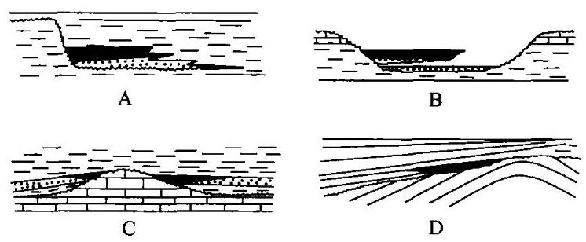

图 4-32 不整合面之上的不整合圈闭和油气藏

(据 Rittenhouse, 1972) A一湖 (海) 崖圈闭; B一谷侧圈闭; C一丘冀圈闭; D一构造翼部圈闭

<!-- Media -->

在这一类油气藏中, 委内瑞拉东部马图林盆地的夸仑夸尔油田是少有的不整合面上的大油田之一。该油田 (图 4-33) 的主要生产层为上新统陆相夸仑夸尔组, 不整合于中新统和下第三系之上,产油层最厚达 ${233}\mathrm{\;m}$ ,平均 ${63}\mathrm{\;m}$ ,可分 8 个砂层组。油层上倾方向不整合起主要封闭作用。此外, 岩性尖灭、沥青封闭等多种因素在不同层组中均起一定作用, 实际上是一多因素结合的地层圈闭。

## 2. 不整合面之下的不整合油气藏

该类型是不整合油气藏的主体。储集层可以由碎屑岩、碳酸盐岩等沉积岩层组成, 也可以由变质的结晶基岩组成。无论哪一类储集层都受程度不等的褶皱、断裂以及侵蚀作用改造, 从而形成不同的内幕构造和古地貌特征。

Rittenhouse (1972) 根据不整合的古地貌特征——成熟程度, 将不整合面之下的不整合圈闭分为青年、成年和老年期地层圈闭。

<!-- Media -->

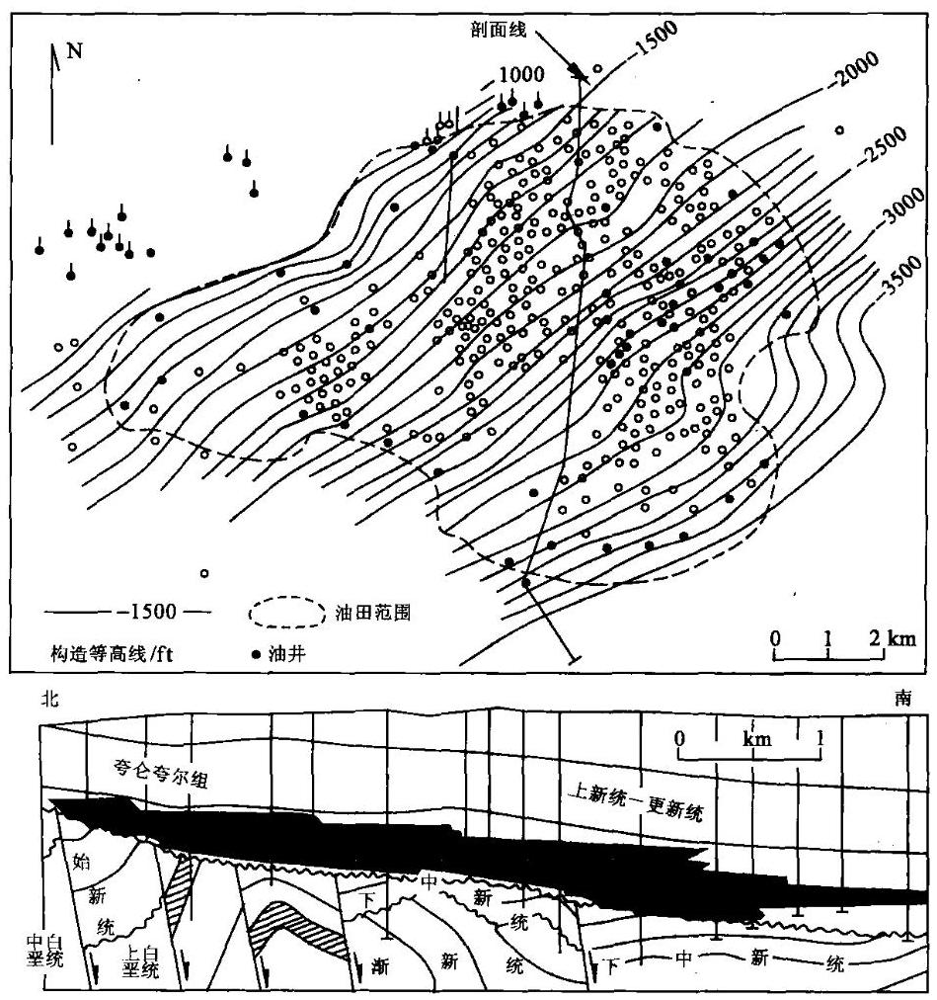

图 4-33 委内瑞拉东部马图林盆地的夸仑夸尔油田平面及剖面图

( 据 Borger, 1952)

<!-- Media -->

青年期不整合圈闭包括谷翼和谷肩圈闭 (图 $4 - {34},{\mathrm{I}}_{\mathrm{A}}\text{、}{\mathrm{I}}_{\mathrm{B}}$ )。成年期不整合圈闭可以存在于古地貌突起 (或潜山) 的脊部、斜坡、陡坡, 也可以存在于谷地中。在它们之中所形成的圈闭和油气藏分别称为脊部、斜坡、陡坡和谷地圈闭和油气藏(图 4-34, ${\mathrm{{II}}}_{\mathrm{A}},{\mathrm{{II}}}_{\mathrm{B}}$ , ${\mathrm{{II}}}_{\mathrm{c}}$ , ${\mathrm{{II}}}_{\mathrm{D}}$ )。老年期地形起伏微弱,其中形成的圈闭和油气藏称为削平的圈闭和油气藏。

<!-- Media -->

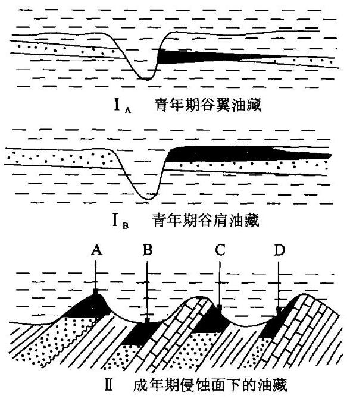

图 4-34 不整合面之下的不整合圈闭和油气藏 (据 Rittenhouse, 1972)

A一脊部; B一谷地; C一陡坡; D一斜坡

<!-- Media -->

一般来说, 青年期地层圈闭和成年期的斜坡和谷地圈闭及油气藏具有较大的隐蔽性, 较难发现; 潜山, 特别是大型的潜山圈闭和油气藏较易于发现和勘探, 也是最重要的不整合油气藏。老年期的削平圈闭和油气藏可以是大型低平隆起的块状油气藏, 也可以是在区域性隆起背景上形成的若干断续分布的油气藏, 特别是碳酸盐岩发育区的削平油气藏。

潜山油气藏, 是指位于区域不整合面之下较老地层的凸起含油气体, 其烃源主要来自上覆及侧向较新烃源岩, 不整合面或断面是油气运移的通道。其形成具有侵蚀、相对于四周局部凸起、被新地层覆盖三个基本特点。按储集层的岩类可分为三大类：碎屑岩、碳酸盐岩和结晶基岩潜山。

由碎屑岩组成的潜山型大油田以阿尔及利亚的哈西·迈萨乌得复背斜上的哈西·迈萨乌得大油田、埃尔加西一埃尔阿格莱布、埃尔劳得 - 巴久尔等油田, 澳大利亚的哈利布特大油田、利比亚的萨里尔大油田等最为著名。

哈西・迈萨乌得油田 (图 4-35) 的主要储集层为寒武 - 奥陶系砂岩, 在油田范围内为一秃顶背斜, 志留系及上古生界均缺失, 巨厚三叠系膏盐层直接不整合于其上, 形成良好的封闭条件, 生油层志留系页岩分布在油田的东部外围区。

<!-- Media -->

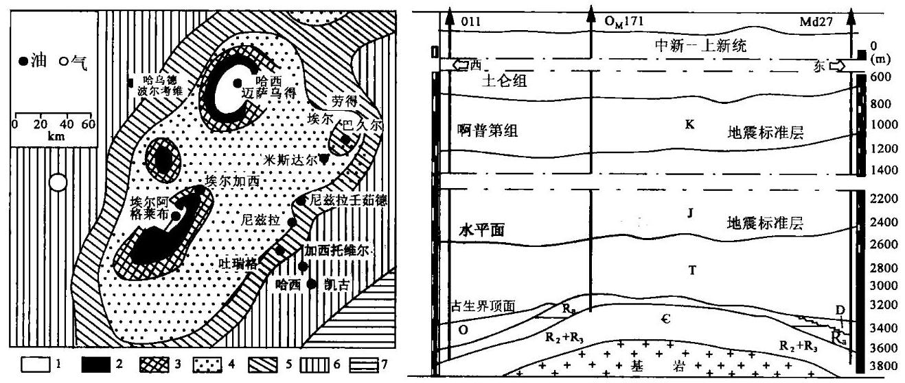

图 4-35 阿尔及利亚哈西·迈萨乌得大油田

(据 Balducchi & Pommier, 1970, 修编)

1一寒武系; 2一埃尔加西砂岩; 3- 埃尔加西粘土; 4- 含气砂岩; 5- 含气石灰岩; 6- 志留系; 7- 泥盆系

<!-- Media -->

以碳酸盐岩为主的潜山油气藏甚多。因碳酸盐岩易于破裂和溶蚀, 能形成孔、洞、缝相结合的巨大而性能良好的储集体, 成为油气聚集的有利场所。意大利格罗托尔列 - 费拉琴纳气田 (图 4-36) 就是实例之一。

结晶基岩组成的潜山型油气藏, 特称为基岩油气藏。近 30 年来, 人们对基岩油气藏的研究和勘探颇为重视。关于基岩油藏, Landes (1959, 1969) 和潘钟祥教授 (1982) 的论文均做了十分系统的论述。

按照 Landes (1960) 的意见, 所谓基岩油气藏是指油气储集于沉积岩基底结晶岩系 (变质岩和岩浆岩) 中的油气藏。基岩油气藏与上覆沉积岩层中油气藏的区别, 在于烃源岩层不会存在于储集岩之下。基岩油气藏中的油气可以有 3 种来源: ①上覆烃源岩; ②基岩旁侧较低部位的烃源岩; ③基岩旁侧较低部位的油气藏因倾斜或超载而向上倾方向溢出, 进而运移到基岩中去。总之, 基岩油气藏中的油气来自不整合面之上的沉积岩系烃源岩层, 且以不整合面或断层为油气运移的主要通道。

基岩储集层以裂缝性为主, 部分为基岩周围的残积砂。构造运动和风化作用是产生裂缝的主要营力。裂缝储集层的发育与构造运动强度、风化作用时间的长短和基岩本身的特征有关。

<!-- Media -->

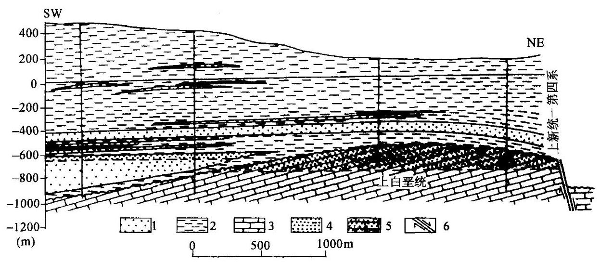

图 4-36 意大利格罗托尔列 - 费拉琴纳气田

1一砂岩; 2一泥岩; 3-石灰岩; 4-一含气砂岩; 5-含气石灰岩; 6-断层

<!-- Media -->

基岩油气藏的盖层可以是由沉积岩层底部直接覆于基岩之上的非渗透性岩层组成, 也可以由沉积岩层稍高部位的非渗透性岩层组成。在后一种情况下, 沉积岩底部的渗透性岩层与下覆基岩一起, 组成统一的含油气带。

由于不同地区、不同构造背景的基岩具有不同的时代, 因此, 基岩油气藏的储集层就有不同的时代: 前寒武纪、古生代, 甚至是中生代。

前寒武系基岩油气藏, 国内外都有发现。美国堪萨斯州中央隆起上的一系列油田如克拉夫特·普鲁萨和利比亚奥季拉油田, 都是这类油气藏的著名实例。我国下辽河坳陷的兴隆台油田亦有前寒武系基岩油藏。

古生界基岩油气藏以我国酒西盆地鸭儿峡油田和委内瑞拉的拉巴斯 - 马拉油田的基岩油藏为代表。

中生界基岩油气藏在美国加利福尼亚州南部的几个山间盆地比较多。那里至少在 5 个油田中发现有中生界基岩油藏。除圣马利亚油田基岩油藏的储集层为裂缝性轻变质砂岩外, 其他均为裂缝性片岩。

基岩油气藏裂缝性的发育情况, 对油气分布有着重要的影响。残积砂一般仅分布在潜山的围翼或斜坡上, 与残积砂有关的基岩油气藏仅分布于潜山的坡上。在潜脊上因缺失残积砂而不产油气。对于裂缝性基岩油气藏来说, 油气分布主要取决于组成基岩的裂缝发育情况, 潜脊基岩裂缝发育时, 一般油气聚集于潜脊; 当潜脊裂缝不发育时, 油气可能聚集于坡上或其他裂缝发育的地带。一般来说, 基岩暴露的时间愈长, 储集性愈好。

潘钟祥教授 (1982) 则将基岩油气藏的概念扩大。将那些构成中新生代盆地基底的前中生界 (即古生界 - 元古宇) 沉积岩系中所形成的不整合面之下的潜山型油气藏中, 凡油气源来自不整合面之上沉积岩系的, 亦称为基岩油气藏。这对我国华北地区奥陶系一震旦系中潜山油气藏的勘探起重要指导作用。

## 三、礁型油气藏

## (一) 礁型圈闭形成机理

礁型圈闭是指具有良好孔、渗性的储集岩体——礁体 (或礁组合), 上方和四周被非渗透性岩层封闭而形成的闭合低势区。

礁体不仅具有生物骨架孔隙、碎屑粒间孔隙, 而且由于礁接近水面有时甚至露出水面, 侵蚀和溶蚀作用对礁体储集性的增加均起重要作用。因此有些学者主张把礁型油气藏归入不整合型中。

礁是生长体, 加上差异压实作用, 在礁体上方可能形成压实背斜。礁形成后, 后期的构造运动、白云岩化和溶蚀作用都可能对其储集性的提高有重要的作用。

在多种影响礁型圈闭储集层性能的因素中, 礁沉积环境和生长方式是最重要的因素, 它既不同于一般岩性变化, 也不同于不整合作用。因此, 编者赞同将它作为地层圈闭中与岩性、不整合并列的一类圈闭。

礁型圈闭闭合面积的确定, 也有其特殊性。作为生长构造的礁体, 礁顶面的构造等高线和礁体等高线大致可以圈定其分布范围, 图 4-37 和图 4-38 分别按背斜圈闭和岩性圈闭原则圈定的礁型圈闭的范围和油气藏分布的平、剖面图。

<!-- Media -->

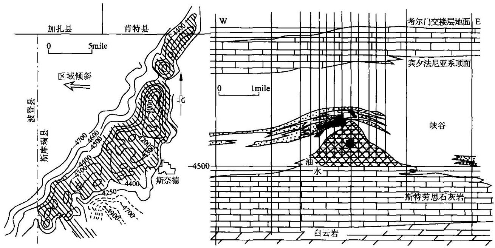

图 4-37 美国斯奈德 - 斯克雷油田平面及剖面图

(据 Levorsen, 1954)

<!-- Media -->

礁型圈闭中构成礁体上方和周围非渗透岩层的岩石类型是多种多样的, 可以是泥质岩、膏盐层、泥灰岩和泥质灰岩。

## (二) 礁型油气藏的特点

礁型圈闭中聚集工业性的油气后就成为礁型油气藏。它常具有以下一些特点:

<!-- Media -->

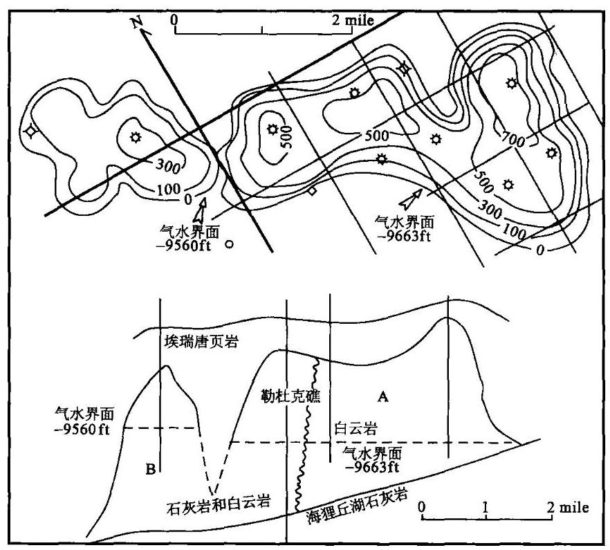

图 4-38 加拿大斯特赖钱礁型气藏含气礁块厚度及气田剖面图

<!-- Media -->

1) 礁型油气藏中的油气分布情况, 在很大程度上取决于礁型储集体的均一性, 油气可以充满整个礁体, 也可以只充满礁体的一部分, 甚至有的礁型油气藏仅仅位于礁前砾 (粒) 屑带, 如加拿大阿尔伯达盆地的红水礁型油田 (图 4-39)。

<!-- Media -->

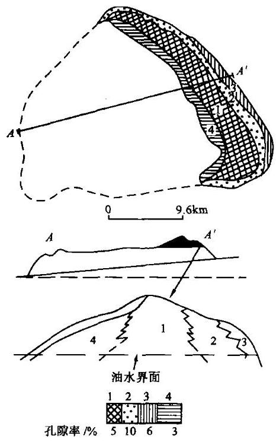

图 4-39 加拿大红水礁组合岩相分带及油气分布图

( 据 Shatford, 1970)

1-礁核带; 2-粒状碎屑带;

3一碎屑填充带; 4 一礁后碎屑带

<!-- Media -->

2) 礁型油气藏储集空间类型多, 储集物性好, 含油气丰富, 一般都具有高产的特征。世界上有 10 口日产量曾达万吨以上的高产井, 其中有 4 口来自礁型油气藏。
3) 礁型油气藏常在一定的古地理环境背景(地台边缘或凹陷边缘) 下, 成群成带分布, 构成一个巨大的含油气带。一个地区如果发现了一个礁型油气藏, 往往可在其附近发现多个类似的油气藏。

## (三) 礁型油气藏的主要类型

根据礁的形态特征及其与陆地的关系, 礁可分为: ①岸礁 (裾礁、边礁) ──发育于海岸边缘; ②堡礁 (堤礁、障壁礁) ──发育于海岸外, 与陆地之间隔潟湖, 即发育于潟湖与海盆之间; ③ 环礁与马蹄礁一一般发育于碳酸盐台地之上, 环礁面向海盆, 中心有一潟湖; ④台礁、塔(尖柱)礁——一般是全部或局部浸没在海水中的孤礁, 浸没在海中的称海中山或海底平顶山, 生长迅速的称塔礁或柱礁。相应地, 礁型油气藏可分为上述 4 类。

前面提及的加拿大红水油田属于台礁油气藏, 阿尔伯达盆地雨虹区广泛发育塔礁型油气藏 (图 4-40)。此外, 利比亚的英蒂萨、印度尼西亚萨拉瓦提盆地的卡西姆 - 怀洛地区的礁型油气藏都属于这一类型。墨西哥的黄金巷和海上黄金巷属于巨大环礁油气聚集带。前苏联前乌拉尔礁型油气田带和阿尔伯达的瑞姆彼–圣·阿尔伯达线状礁带则属于堤礁型。

<!-- Media -->

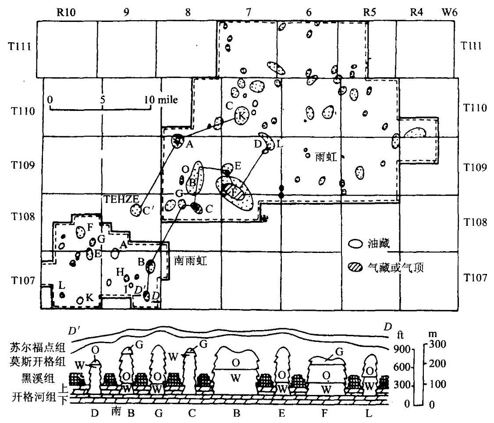

图 4-40 加拿大雨虹礁型油气藏分布图

(据 Barss 等, 1970)

<!-- Media -->

## 四、沥青封闭油气藏

该类地层圈闭与岩性圈闭的主要区别在于上

倾方向的非渗透性岩层是由沥青组成的, 即原先是渗透性较好的储集层, 因油气缓慢外溢过程中轻组分逸散, 重组分不断被氧化, 堵塞了孔隙而形成沥青塞, 从而阻止石油的继续散失。目前世界上许多重油带, 如委内瑞拉东部马图林盆地南侧的重油带 (Tar and heavy oil belt)、加拿大阿尔伯达的阿撒巴斯卡重油带 (Tar belt) 以及我国下辽河坳陷西斜坡和克拉玛依斜坡带上的重油带大多属于沥青封闭型。

由于该型油气藏在形成过程中, 大都遭受某种程度甚至是较严重的破坏, 天然气极难保存, 以油, 特别是重油和沥青为主, 开发难度较大。但这类石油资源在世界上占有相当大的比重, 它的开发受到重视, 人们开展了大量研究工作, 其利用的程度及其在油气资源

## 第四节 水动力油气藏

凡是因水动力形成倾斜或弯曲的等油气势面, 或与非渗透性岩层联合封闭形成的闭合低势区, 使静水条件下不存在圈闭的地方形成新的油气圈闭, 即称为水动力圈闭, 由这种圈闭形成的油气藏称为水动力油气藏。

## 一、水动力圈闭形成机理

在水动力作用下, 油、气的力场强度, 应是净浮力和水动力的合力。因此, 油、气等势面 (垂直油气力场强度) 的方向也相应改变, 向水的力场强度方向倾斜 (即油水界面向力场强度方向倾斜), 油、气等势面与储集层顶面构造等高线就不相平行。在这种情况下, 倾斜或弯曲的等油气势面可以使静水条件下不存在圈闭的部位, 形成新的油气圈闭。其闭合区可由闭合的等油气势线圈定。

<!-- Media -->

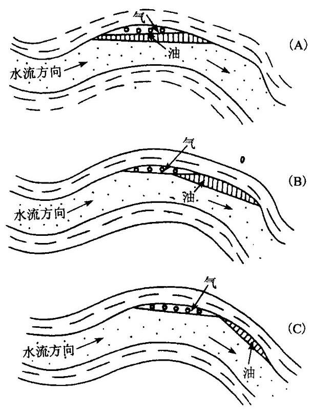

图 4-41 平缓背斜型水动力油气藏中油气分布示意图

( 据 Hubbert, 1953)

<!-- Media -->

从本章第一节圈闭的现代概念讨论中, 不难理解, 因油气密度的差别, 油水界面和气水界面的倾斜度不同, 因此在同一水头梯度下石油和天然气的水动力圈闭的位置也是不同的。 石油圈闭向水头降落方向偏移更多, 且随水头梯度增大而增大。但是, 这种偏移是有一定限度的。当油水界面倾斜度大于背斜顺水头梯度一侧的储集层倾角时, 背斜就不能有效圈闭石油, 但仍能成为天然气的圈闭。若气水界面的倾斜度大于背斜翼的倾角时, 则连天然气亦圈闭不住。在这种情况下, 石油和天然气都被驱出该背斜, 只能在其运移方向的适当部位形成的新圈闭中再聚集成油气藏 (图 4-41)。

## 二、水动力油气藏的特点和主要类型

水动力油气藏最重要的特点是油水(气水)界面是倾斜或弯曲的。

根据水动力封闭的特征及目前已有勘探成果, 可将水动力油气藏分为: ①构造鼻或阶地型; ② 单斜型; ③纯水动力型 3 种基本类型。此外, 背斜型水动力和向斜型水动力可能都是复合油气藏。

## (一)构造鼻或阶地型水动力油气藏

这种构造在静水条件下不闭合, 不能形成圈闭。但在向储集层下倾方向的流水作用下,油水 (气水) 界面发生水流方向倾斜或弯曲,且满足 ${\alpha }_{1} &lt; {\theta }_{\mathrm{{HC}}/\mathrm{w}} &lt; {\alpha }_{2}$ 时,就会在构造鼻或阶地的倾角变化处 $\left( {\alpha }_{1}\right.$ 为低倾角、 ${\alpha }_{2}$ 为高倾角 $)$ 形成闭合的油气低势区 (图 4-42)。美国得克萨斯州的韦特油田 (图 4-43) 可以作为该类油气藏的实例。

<!-- Media -->

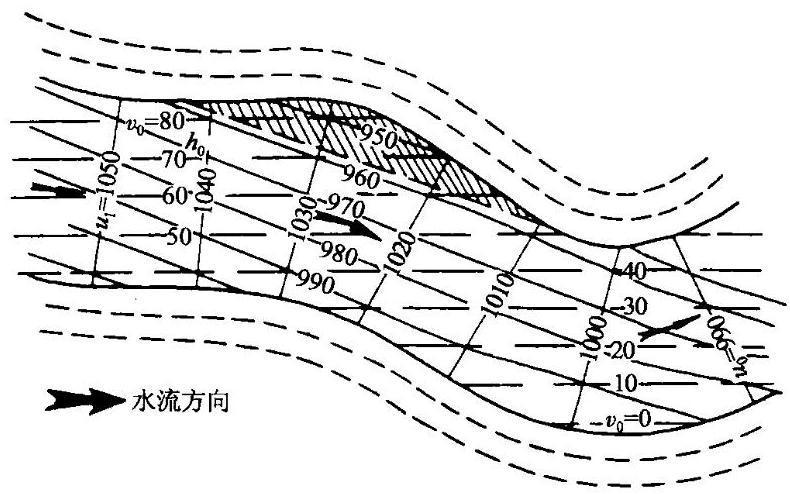

图 4-42 鼻状构造型水动力圈闭形成机理示意图

(据 Hubbert, 1953)

<!-- Media -->

## (二) 单斜型水动力油气藏

对于单斜岩层来说, 沿倾斜方向的渗透性常有变化。水沿储集层向下倾方向流动时, 通过渗透性不同的地段, 流速会发生相应的变化, 从而使等势面的斜度发生改变。在渗透性差的地段, 水流速度加快 (在单位时间通过流量不变的条件下), 等势面的倾斜度变陡; 而在渗透性较好的地段, 流速慢, 等势面倾斜度缓。这样在渗透性较低、等势面变陡的地段, 可以在储集层顶面造成闭合的油气低势区, 即圈闭 (图 4-44)。

<!-- Media -->

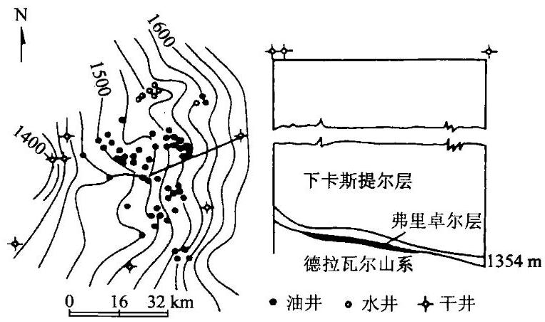

图 4-43 美国得克萨斯州的韦特油田

(据 Adams, 1936)

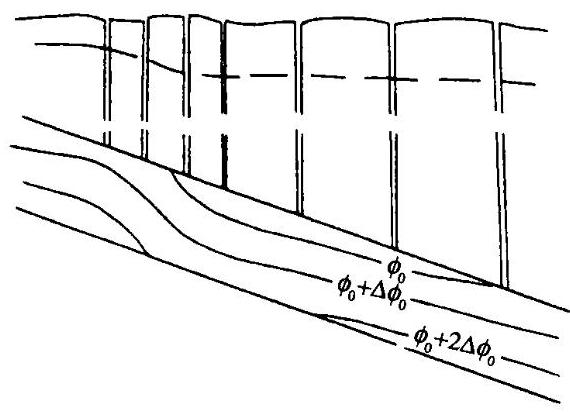

图 4-44 油气等势面倾斜度变陡而在单斜层中形成的水动力圈闭 ( 据 Hubbert, 1953)

<!-- Media -->

## (三) 纯水动力型油气藏

这种油气藏的圈闭是由单一的水动力封闭所形成。美国阿帕拉契亚百英尺砂岩中的透镜型砂岩体圈闭可能属于这一类型。该层为一巨厚砂岩 (百英尺砂岩), 由于岩性不均一, 形成局部高孔隙、渗透性透镜体, 水在其中流动时速度不均一, 造成等势面弯曲, 使其中高渗透性透镜状砂体完全被高势面所封闭形成圈闭, 油气产于这种高渗透砂体中 (图 4-45)。

<!-- Media -->

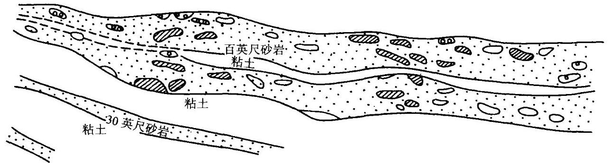

图 4-45 美国阿巴拉契亚百尺砂岩中油气藏剖面示意图

(转引自陈荣书, 1994)

斜线部分为油藏; 圆圈为气藏

<!-- Media -->

通过上述不同构造背景下水动力油气藏的介绍, 可以得出: 地下水向储集层下倾方向流动时, 使得油气等势面发生倾斜或弯曲, 是造成水动力圈闭的主要营力和原因。但在不同类型油气藏中, 它们所起的作用和具体方式是有差别的。凡是在地下流水作用(水头梯度变化) 下, 由倾斜或弯曲油气等势面单独或与非渗透性岩层联合封闭而形成的圈闭, 都称为水动力圈闭。水动力圈闭与构造、地层圈闭相比, 没有确定的位置, 圈闭的具体位置取决于水头梯度的变化。但水动力圈闭的位置也不是完全无规律的。一般来说, 在储集层倾角、岩性变化带存在向下倾方向流水时, 容易形成水动力圈闭。

在流水作用下可使储集层中某些原先不存在圈闭的地方出现新圈闭, 这在油气勘探中是个值得引起注意的问题。

## 第五节 复合油气藏

## 一、复合圈闭和油气藏的基本概念和分类

如果储集层上方和上倾方向是由构造、地层和水动力三因素中两种或两种以上因素共同封闭而形成的闭合低势区, 就称为复合圈闭。在其中聚集形成工业规模的石油和天然气后, 即称为复合油气藏。

可以用三角图解表示圈闭的分类 (图 4-46)。三角形三个端元 A、B、C 分别为构造、地层、水动力 3 个基本类型; 三角形的 3 个边 $\mathrm{{AB}}\text{、}\mathrm{{BC}}$ 和 $\mathrm{{CA}}$ 则分别代表构造 - 地层、地层 - 水动力和水动力 - 构造二元复合圈闭; 三角形内侧 D 区则为三元复合圈闭。

<!-- Media -->

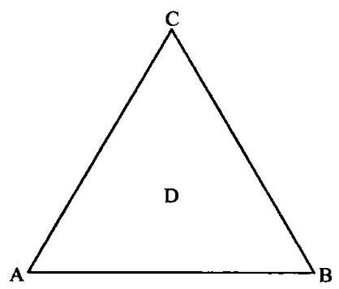

图 4-46 构成圈闭的诸因素及复合圈闭主要类型的分类图解 A一构造; B一地层;

C一水动力; D一三元复合圈闭

<!-- Media -->

此外, 每类圈闭 (主要是构造和地层圈闭) 之内亦存在若干因素构成的圈闭, 这一类圈闭称为多因素圈闭, 以示它与复合圈闭的区别。

## 二、复合油气藏的主要类型

## (一)构造一地层复合油气藏

凡是储集层上方和上倾方向由任一种构造和地层因素联合封闭所形成的闭合低油气势区, 均称为构造 - 地层复合圈闭及其油气藏。 4 种构造和 4 种地层因素可以组合成 16 种以上的构造 - 地层油气藏。其中最常见的有背斜 - 岩性油气藏、背斜 - 不整合油气藏、岩性 - 断层油气藏、 不整合 - 断层油气藏。美国得克萨斯州卡尔塞吉大气田, 保加利亚奇连气田 (图 4-47), 美国路易斯安那州罗德沙油田, 我国任丘油田 (图 4-48) 都是该类油气田的典型实例。

<!-- Media -->

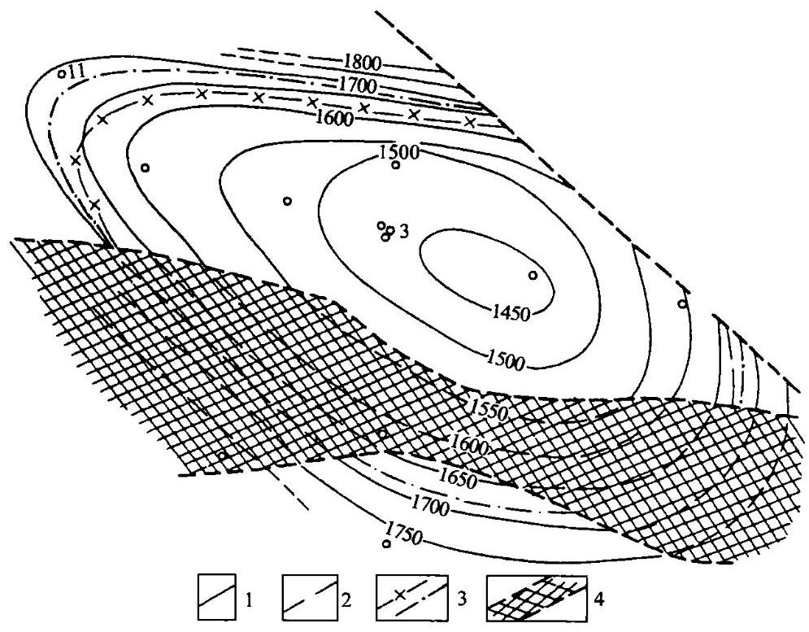

图 4-47 保加利亚奇连气田 ${\mathrm{J}}_{1}{}^{1}$ 顶面构造图及气藏分布图

(据 Reoprixes, 1966)

1一构造等高线; 2 一断层; 3 一气水过渡带界线; 4 一砂岩缺失区

<!-- Media -->

## (二)构造一水动力复合油气藏

常见的有背斜 - 水动力油气藏和断层 - 水动力油气藏。

背斜 - 水动力油气藏可以美国弗朗尼油藏为例 (图 4-49)。

<!-- Media -->

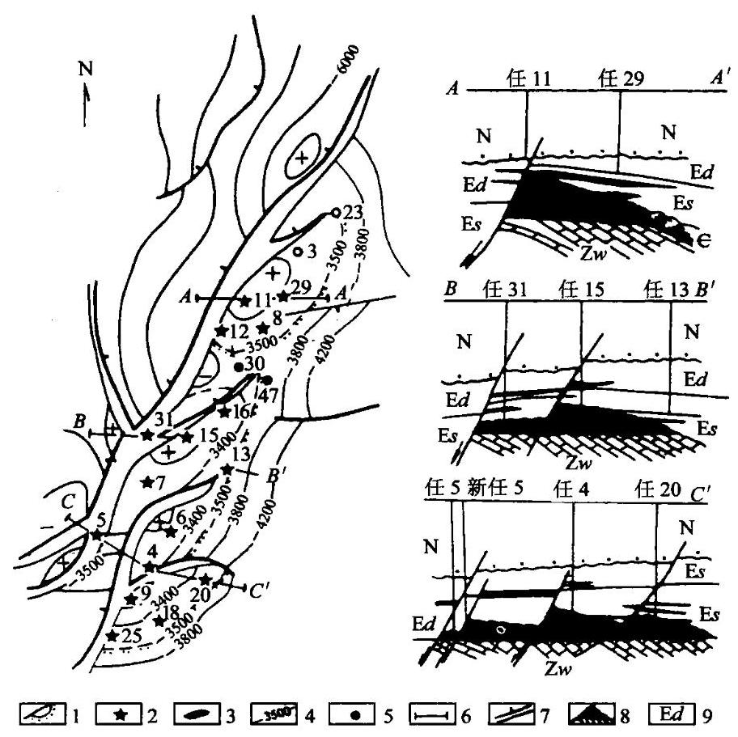

图 4-48 华北任丘构造 - 地层复合油气藏

(据华北石油会战指挥部, 1978)

1-含油范围; 2-高产井; 3-第三系油藏;

4 一潜山等高线; 5 一见水井; 6 一剖面线; 7 一断层; 8 一潜山油藏; 9 一东营组

<!-- Media -->

该油藏的储集层为特恩斯里砂岩, 供水区位于东北方向, 水头降落梯度较大, 油水界面向西南倾斜, 石油只有一部分仍在背斜圈闭范围内, 大多分布在西南翼背斜圈闭以外的水动力圈闭中, 因此新的圈闭中水动力因素占主要地位, 但背斜因素仍起一定作用, 因此, 将它归属于背斜 - 水动力复合油气藏。

<!-- Media -->

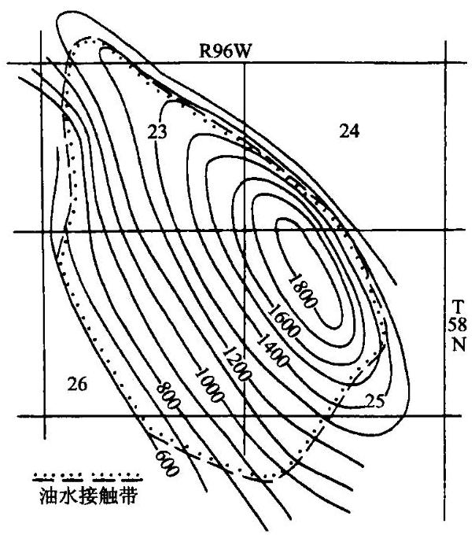

图 4-49 美国弗朗尼油藏构造图

(据 Hubbert, 1953)

<!-- Media -->

## (三)地层一水动力复合油气藏

这类圈闭和油气藏的研究和勘探程度均较低。美国圣胡安盆地下白垩统砂岩中向斜气藏可能属于这一类型。

该气藏 (图 4-50) 位于圣胡安盆地大向斜轴部, 产层梅萨维达砂岩和达科他砂岩均为低孔隙低渗透性砂岩,孔隙度约为 ${10}\%$ ,渗透率仅 $\left( {1 \sim  2}\right)  \times  {10}^{-3}{\mathrm{{\mu m}}}^{2}$ ,向东北方向储集层物性变差,变为非渗透性,西北和南翼物性较好,孔隙度约为 ${20}\%$ ,渗透率为 ${15} \times$ ${10}^{-3}{\mathrm{{\mu m}}}^{2}$ 。地层向西北急剧抬升,水柱高达 1200 余米,气柱仅约 600 余米。西南翼平缓, 水柱高约600余米,气柱高度仅 ${120}\mathrm{\;m}$ 。它可能为流水水头和非渗透性岩层联合封闭而形成的气藏。

(四) 水动力一构造一地层复合气藏

<!-- Media -->

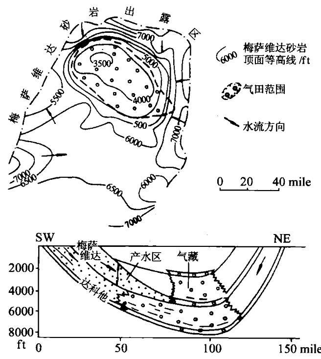

图 4-50 美国圣胡安盆地向斜气藏

(据 Hill 等, 1961; Masters 等, 1979.)

<!-- Media -->

该类油气藏实例不多见。美国印第安盆地气田上宾夕法尼亚系白云岩产层中的气藏和前苏联巴拉哈内 - 萨本奇 - 拉马内油藏 (图 4-51) 可能是较为典型的三元复合油气藏。前者气藏的分布区仅在西南侧和东侧有面积较小的背斜圈闭, 闭合度和面积均较小, 大部分是受水动力和岩性因素控制的, 为一背斜 - 岩性 - 水动力三元复合气藏。后者是久负盛名、广泛被引用的典型实例。从图 4-51 可知, 该油气藏中石油不是分布在背斜高部位, 而是分布在与构造等高线近直交的一侧受断层限制的翼部,高度达 ${2300}\mathrm{\;m}$ 以上,为一典型悬挂油藏。一般认为该类油气藏中石油分布, 除受水动力、断裂控制外, 岩性变化 (即储集层孔、渗性变化) 也是一个重要因素, 因此可视为三元复合油气藏。

<!-- Media -->

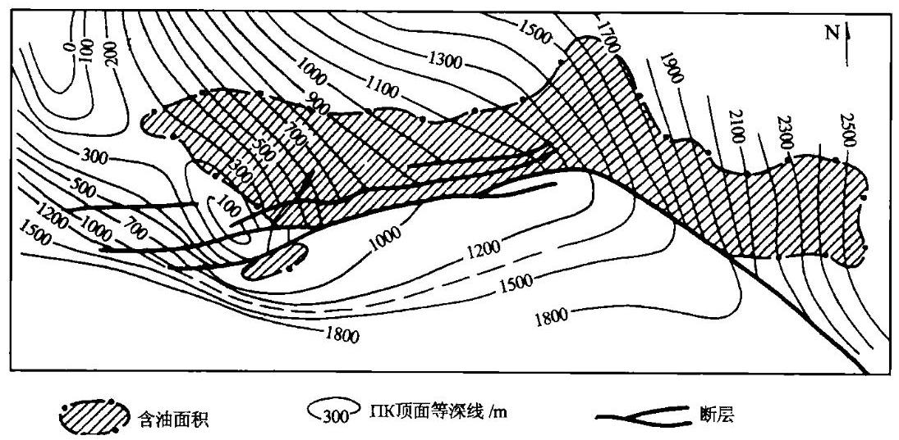

图 4-51 前苏联巴拉哈内 - 萨本奇 - 拉马内油藏

(据 $\Gamma \mathrm{a}\delta \mathrm{{pH}}{3\pi }\mathrm{{HLI}}$ ,1979)

<!-- Media -->

最后, 要强调指出, 把复合圈闭和复合油气藏作为独立的一个大类, 是因为这类圈闭和油气藏广泛存在, 它的特点有别于单一因素形成的圈闭和油气藏。认真研究复合圈闭和复合油气藏的特点及形成条件, 对加速油气藏的勘探有着重要意义。

一个油气地质工作者必须懂得, 虽然形成圈闭的机理并不复杂, 但各种地质因素结合形成圈闭的可能性, 却是千变万化的, 既可以形成单一地质因素控制的构造、地层、水动力圈闭, 也可以在相当多的情况下是两种或两种以上因素相结合, 形成复合圈闭。由于构成圈闭的因素甚多, 所以其组合形式也是变化无穷的。

## 第五章 油气成因理论与烃源岩

油气成因是石油与天然气地质学的重要研究内容之一, 也是一个长期争论不休的问题, 争论的核心是起源物质和油气生成过程。对于起源物质和油气生成的理化过程, 不同学者提出了不同的油气成因假说, 概括起来就是无机起源与有机起源两大学派的对垒。在有机学派中, 主要有早期成油说和晚期成油说。本课程主要论述油气有机成因的晚期成烃说, 即现代油气成因理论。

## 第一节 油气成因理论发展与现状

由于油气的可流动性、成分的复杂性及其起源物质与油气之间的过渡形式难以追寻, 导致油气的成因长期争论不休。不同学者基于各自对起源物质和油气生成理化过程的理解, 提出了各种不同的油气成因假说。众说纷纭的油气成因争论, 主要表现为有机起源与无机起源两大派别的对垒。有机与无机学派相比较而存在, 相斗争而发展; 无机学派在 19 世纪占上风, 有机学派在 20 世纪以来占上风, 有机学派中早期成油说是成油理论的基础, 而晚期成油说使成油理论日趋完善 (表 5-1)。

<!-- Media -->

表 5-1 油气成因主要假说 (学说)

<table><thead><tr><th colspan="2">油气成因假说(学说)</th><th rowspan="2">倡导者</th><th rowspan="2">提出时间</th></tr><tr><th>大 类</th><th>亚 类</th></tr></thead><tr><td rowspan="6">无机成因说</td><td>碳化物说</td><td>门捷列夫</td><td>1876 年</td></tr><tr><td>宇宙说</td><td>索柯洛夫</td><td>1889 年</td></tr><tr><td>火山说</td><td>考斯特</td><td>1904 年</td></tr><tr><td>岩浆说</td><td>库德梁采夫</td><td>1949 年</td></tr><tr><td>蛇纹石生油说</td><td>耶兰斯基</td><td>1966 年</td></tr><tr><td>高温生成说</td><td>切卡留克</td><td>1971 年</td></tr><tr><td rowspan="5">有机成因说</td><td>煤蒸馏说</td><td>罗蒙诺索夫</td><td>1763 年</td></tr><tr><td>动植物混成说</td><td>波东尼</td><td>1906 年</td></tr><tr><td>生油母岩说</td><td>古勃金</td><td>1932 年</td></tr><tr><td>早期成油说</td><td>史密斯</td><td>1954 年</td></tr><tr><td>晚期成油说</td><td>菲利普, 蒂索, 亨特</td><td>1965, 1971. 1976</td></tr></table>

<!-- Media -->

## 一、油气无机成因学说

19 世纪中叶, 伴随着现代石油工业的诞生, 石油的成因广泛引起学者们的兴趣。各种无机起源说也随之应运而生。其中最具影响的是俄国化学家 $\Pi  \cdot  \Pi  \cdot$ 门捷列夫 (1876) 提出的碳化物说, 他认为把石油起源和煤相联系的想法与实际所观察到的油田剖面有矛盾, 而当时已知有许多实验可以通过无机合成途径得到烃类。于是他提出, 石油是地下深处的重金属碳化物与下渗的水相互作用所生成:

$$
3{\mathrm{{Fe}}}_{m}{\mathrm{C}}_{n} + {4m}{\mathrm{H}}_{2}\mathrm{O} = m{\mathrm{{Fe}}}_{3}{\mathrm{O}}_{4} + {\mathrm{C}}_{3n}{\mathrm{H}}_{8m}
$$

反应所生成的石油蒸汽在冲向地壳的过程中冷凝于地层孔隙中, 当上覆有非渗透层封堵时就可集中形成油气藏。从化学角度看, 该假说是成立的。关键在于地下有无足够数量的重金属碳化物存在以及上层的水能否穿越软流圈下渗到地下深处。

石油无机起源说的另一典型代表是 19 世纪晚期由索柯洛夫 (B•Д• Cokoıōв, 1889) 提出的宇宙说。其理论依据是在一些天体中发现有碳氢化物, 如在水星、土星、天王星、 海王星等星球的气圈中以及彗星的头部都有发现, 因此他认为碳氢化物是宇宙所固有的, 早在地球尚处于熔融阶段时即已存在于气圈之中了,后来随着地球冷却被吸收并凝结在地壳的上部, 在这些碳氢化物沿裂隙溢向地表的过程中便可形成油气藏。在此值得一提的是这些碳氢化物远不是平均分子量大得多、成分复杂得多的石油。

此外当时还出现过岩浆说、火山说、蛇纹石生油说和高温生成说等。总之, 19 世纪后半叶是石油无机起源说相当盛行的时期。

## 二、油气有机成因学说

早在 18 世纪中叶, 前苏联化学家罗蒙诺索夫 (1763) 根据他对石油化学的研究, 认为石油和煤炭一样是由泥炭在高温作用下 (蒸馏) 所生成。这是最早的石油有机成因论, 常被称为蒸馏说。罗蒙诺索夫算得上是世界上最早研究石油并力图解释石油成因的学者。

20 世纪上半叶, 有机成因理论得到大量实验的支持而获得了空前发展, 有机成油说得到了大多数人的认可, 其优势日趋明显。

有机学派混成说经过波东尼 (G. Potonie, 1906) 的发展, 实际上已形成近代生油概念的雏形。波东尼认为动植物都是成油的原始材料, 它们和矿物质点一起形成腐泥岩, 后者再经天然蒸馏即可产生石油。在混成说基本确立之后, 人们转而注意到有利生油的生物化学组分。于是又先后出现过脂肪说、碳水化合物说、蛋白质说等。

古勃金 (H. M. Гy6кин, 1932) 认为, 各种生化组分均可参与生油, 它们可来自海洋动植物残体, 也可来自陆地携入的生物分解产物; 含有这些分散有机质的淤泥就是将来生成石油的母岩; 母岩在早期主要由于细菌的作用而产生分散态石油, 晚期由于负荷加大将油水一起挤入多孔岩层,继后油水按比重分开并运移聚集到层内一定的部位后形成油气藏。此间俄国学者维尔纳茨基还研究了有机质的地质作用, 在其《地球化学概论》 (1933) 中详细讨论了石油的有机组成和有机成因, 提出了碳循环模式。从此成油理论步入了地球化学研究阶段。古勃金和维尔纳茨基将石油有机成因说推向新的高度, 形成了较为完整的烃源岩理论。

石油的有机成因观点逐步得到了地质学家和地球化学家的认同, 但对有机质的成烃演化过程历来存在着各种各样的认识和假说, 这些不同认识间的争论归结起来可概括为石油是成岩早期形成的还是成岩晚期生成的, 这就是石油有机成因的早期成油说和晚期成油说。

史密斯 (P. V. Smith, 1954) 引进先进分析技术, 首次在现代沉积物中发现了烃类。 这是一次飞跃性的突破, 他为此获得了诺贝尔奖。这一时期研究者从地质学、地球化学以及生物学等角度通过成烃母质、成烃过程、地球化学条件及物理-化学环境等方面论述了石油的早期形成与聚集。

20 世纪 50 年代中期开始, 由于色谱, 特别是气相色谱技术的应用, 使地质体中微量可溶有机质的研究得到了快速发展。Bray & Evans (1961) 和 Cooper (1963) 提出, 现代沉积物和生物体中的正烷烃碳数分布具有奇偶优势, 正脂肪酸的碳数分布具有偶奇优势, 而在古老沉积物和石油中不具备这些优势。同时现代沉积物中烃类丰度极低, 难以构成大规模油气聚集。这一发现动摇了沉积有机质直接成油(早期成油说)的观点, 为有机质高温降解成油理论的发展开辟了广阔的前景。这一时期, 石油工业和石油地质学发展迅速, 有机地球化学成功地应用于石油成因和形成条件诸方面的研究上, 石油有机成因理论得到进一步充实和发展。大量研究表明, 石油的生成不仅是烃类的富集过程, 更主要的是烃类的新生过程。在有机质改造过程中, 只有达到一定温度或埋藏深度时, 有机质才能大量转化成石油 (Abelson, 1953; Philippi, 1965; Tissot et al., 1972)。Pusey III (1973) 根据古地温研究指出, 原油在地下一定温度和深度范围内分布, 提出了 “地温窗” 和 “液体窗”的概念。由于这些研究显示大量生油阶段是有机质处于成岩作用的晚期阶段, 同时认为生油原始物质主要是岩石中的不溶有机质——干酪根,因此这一时期逐步形成了干酪根晚期成油理论。Tissot & Welte (1978) 和 Hunt (1979) 先后发表了两部专著, 对这一成烃理论作了系统的、科学的论述, 形成了一个相当完整的成油理论体系。这一理论揭示了常规油气的生成演化规律, 而据此衍生出油气潜力评价的地球化学参数和研究方法, 已成为近代油气勘探的主要指导思想和准则, 且取得了显著成效。

值得一提的是,唯海相生油论在相当一段时间内很盛行。但从 ${\mathrm{{Kp}}}_{3\mathrm{r}}\left( {1923}\right)$ 开始认为陆相植物是石油的原始物质, 南廷格尔曾于 1939 年探讨过陆相生油的可能。20 世纪 40 年代, 我国学者潘钟祥、黄汲清等以中国油田实例丰富的资料, 论证了陆相生油是客观存在的现实, 动摇了唯海相生油论, 现在陆相生油理论得到了普遍认可。

不难看出, 在各个时期除主流派外, 在某些问题某个环节上持有不同观点者不乏其人。但随着技术的进步和知识的积累, 油气有机起源说不仅有了充分的论据, 而且形成了相当完整的体系, 从而被大多数业内人士所接受。

石油和天然气的成因是一个非常复杂的理论问题。尽管目前油气有机成因理论日臻完善, 在油气勘探实践中发挥了重要的作用, 但并不能由此否定油气无机成因理论的科学价值。

## 第二节 现代油气成因理论

20 世纪 70 年代初, 法国著名地球化学家 B. P. Tissot 等综合归纳了前人的研究成果, 建立了干酪根热降解生烃演化模式, 提出并完善了干酪根晚期生烃学说, 揭示了油气形成、演化与分布规律, 完善了油气有机生成学说。

## 一、有机成因的证据

油气成因主要是针对能够形成工业聚集的油气。油气有机起源说之所以能够确立, 除了它能对整个成烃过程给予合理解释外, 还由于它拥有雄辩的地质和地球化学论据。

1) 世界 ${99}\%$ 以上的石油都产自沉积岩,个别产自古老基岩的石油也是来自邻近沉积岩系中富含有机质的母岩。在大片火成岩、变质岩出露的地区, 如所谓地盾, 则没有工业石油。
2) 石油在地壳中的出现, 与地史上生物的发育和兴衰密切相关。工业石油大体是显生宙地层中才开始出现, 并且随着生物的繁衍而有日益增多之趋势。据估计, 自寒武纪以来的 6 亿年中,古生代占 ${60}\%$ ,拥有已知石油的 ${15}\%$ ; 而渐新世至全新世只占这段时间的 $5\%$ ,却拥有已知石油的 ${30}\%$ 。与此同时,石油的储量时代分布与地层中有机质以及煤和油页岩等有机矿产的时代分布都有一定的一致性。
3) 在油田剖面中, 含油层位总与富含有机质的层位有依存关系, 而不像无机的内生矿床那样与火成岩有关。
4) 除卟啉外, 近来还在石油中找到了许多与异戊间二烯类、萜类(即环状异戊间二烯类) 和甾醇类有关的化合物。这些化合物的化学结构仅为生物物质所特有, 地球化学家称之为生物标记化合物或者指纹化合物。
5) 石油的元素组成包括痕量元素组成, 都与有机物质或有机矿产相近似, 而与任何无机物质相差甚远。另外, 石油的碳同位素组成也同生物物质 (尤其是脂类) 的碳同位素组成相近, 而与无机的碳酸盐岩碳同位素相差甚远。
6) 天然石油普遍具有旋光性。众所周知, 非晶体的旋光性与物质分子中的碳原子不对称结构有关, 通常只有从生物界才能获得这种物质。
7) 大量实验表明, 各种生物物质通过热降解均可得到或多或少的烃类产物。同时近代分析技术也可从现代和古代沉积有机质中检测出石油中所含的烃类。

总之, 无论是对石油性状和分布的研究, 还是对生油过程的模拟试验, 都为有机起源说提供了足以令人信服的论据。

## 二、有机成因的物质基础

## (一) 沉积有机质

## 1. 物质组成和来源

有机说的核心是指油气起源于有机质即生物物质。通过沉积作用进入沉积物中并被埋藏下来的那部分有机质叫沉积有机质。概括地说, 沉积有机质的生物物质最重要的是浮游植物、细菌和高等植物。

地史上, 从前寒武纪到泥盆纪, 沉积有机质的惟一来源是海洋浮游植物 (藻类) 和细菌, 在泥盆纪以后, 高等植物也开始重要起来。尤其是在成煤方面起特别重要的作用。但就对沉积有机质的贡献而言, 高等植物远不及海洋浮游植物和细菌。这主要基于下列原因: ①地史上高等植物的出现明显晚于浮游植物；②无论在现今或地史上,海域面积明显大于陆地; ③浮游植物和细菌具有高得多的产率。因此, 海洋浮游植物和细菌提供的沉积有机质的总量要比陆生高等植物大得多。以植物为例, 现今陆地上年产量不及总产量的 1/7。

浮游植物是食物链的基础, 在浮游植物高产率的地区, 浮游动物明显增高, 异养细菌也很丰富。在潮湿的高等植物繁盛的陆地环境, 也可造成大量的细菌生长和活动。因此, 从数量上看, 沉积有机质的生物物质最重要的是浮游植物、细菌和高等植物。浮游动物(如有孔虫、放射虫)和底栖生物也有一定意义, 而高等动物 (如鱼类) 是微不足道的。

从生物物质的发源地来说, 沉积有机质一方面来源于水盆地本身的所谓原地有机质, 这是普遍存在的部分, 也是最基础的部分; 另一方面来自河流和径流从周围陆地携来的异地有机质, 包括再沉积的有机质。

2. 化学组成

人们普遍认为, 沉积有机质组成和结构与现代有机体相当。沉积有机质源于生命物质及其代谢产物, 其生物化学组成除水以外, 主要由油脂类、碳水化合物、蛋白质和木质素等 4 类生物化学聚合物组成。其组成和分布特征如下。

(1) 脂类

狭义的理解主要是指动植物的油脂, 广义的理解则泛指所有不溶于水但溶于脂溶剂 (如乙醚、氯仿、苯等) 的脂状物质, 既包括油脂, 也包括固醇类、萜类、烃类和色素等。

最普通的脂类就是油脂。油脂是动植物的重要组成。动物油脂常呈固态和半固态, 称为脂肪; 植物油脂常呈液态, 称为油。油脂易水解成脂肪酸和醇, 所以地质体中并不存在它们的原型, 也正如不存在蛋白质等生物聚合物一样。有人采用类脂 (Lipoid) 一词作为广义的脂类同义语, 而把脂类 (Lipid) 视为前者的一部分。它们的共同特性是不溶于水, 但溶于低极性的有机溶剂 (氯仿、四氯化碳、乙醚和苯等)。

脂类一则抗腐能力强, 二则化学成分和结构都最接近干石油, 因而历来被多数人当作最重要的成油母质。由表 5-2 可见, 脂类只要去掉少量的氧即可转化成石油, 而碳水化合物和木质素则要去掉大量的氧, 蛋白质除要去掉大量氢外还需去掉大量的氮。如果这四类生物聚合物的数量相等的话, 那么脂类将可产生更多的烃, 早在 18 世纪就有人从脂类加工出烃, 类似的实验一直持续到现今。从化学反应式看, 脂肪酸只要通过去羧基 $\left( {\mathrm{{RCOOH}} - \mathrm{{RH}} + {\mathrm{{CO}}}_{2}}\right)$ ,或者加氢 $\left( {\mathrm{{RCOOH}} + 3{\mathrm{H}}_{2} - {\mathrm{{RCH}}}_{3} + 2{\mathrm{H}}_{2}\mathrm{O}}\right)$ 即可得到烃类。饱和脂肪酸可能主要是正烷烃的母体, 不饱和脂肪酸除可生成正烷烃外还可生成环烷烃乃至苯。脂类中的萜和异戊间二烯化物、固醇、色素等, 则可能是环烷烃、芳香烃和异烷烃的母体。原生烃以高分子烷烃为主, 它们在生物体中一般只占十万分之几至几十 (重量)。 原生烃可以不发生重大改造而被石油所继承。蜡质在脂类中所占比例变化很大, 例如在植物脂类中占 ${1.8}\%$ ,在动物脂类中占 $1\%  \sim  {10}\%$ (在昆虫脂类中可达 ${75}\%$ )。石油中的蜡质几乎全部来自陆生植物。

<!-- Media -->

表 5-2 天然有机质与石油的平均元素组成

<table><thead><tr><th rowspan="2"/><th colspan="5">元素组成/%</th></tr><tr><th>C</th><th>$\mathbf{H}$</th><th>S</th><th>N</th><th>0</th></tr></thead><tr><td>碳水化合物</td><td>44</td><td>6</td><td>—</td><td>-</td><td>50</td></tr><tr><td>木质素</td><td>63</td><td>5</td><td>0.1</td><td>0.3</td><td>31.6</td></tr><tr><td>蛋白质</td><td>53</td><td>7</td><td>1</td><td>17</td><td>22</td></tr><tr><td>脂 类</td><td>76</td><td>12</td><td>-</td><td>-</td><td>12</td></tr><tr><td>千酪根</td><td>79</td><td>6</td><td>5</td><td>2</td><td>8</td></tr><tr><td>沥 青</td><td>84</td><td>10</td><td>3</td><td>1</td><td>2</td></tr><tr><td>石油</td><td>84.5</td><td>13</td><td>1.5</td><td>0.5</td><td>0.5</td></tr></table>

(据 Hunt, 1979)

<!-- Media -->

(2) 碳水化合物

亦称糖类, 是植物的主要组成, 包括有葡萄糖、淀粉、纤维素等。动物中也有 (如无脊椎动物的几丁质),但数量较少。碳水化合物的通式可写成 ${\mathrm{C}}_{n}{\left( {\mathrm{H}}_{2}\mathrm{O}\right) }_{m}$ ,呈单糖或单糖的聚合体而存在。作为成油母质, 碳水化合物以其数量之丰富而引人注意。有些实验还证明, 碳水化合物被氢还原后可以得到烃类。但是另一方面, 碳水化合物大多容易被喜氧菌所消耗或者被分解成水溶物质, 因而难以保存下来, 这就严重贬低了它的价值。其中, 纤维素较为稳定, 是煤的重要母质之一。

(3) 蛋白质

是生物体内最重要的成分, 是组成细胞的基础物质, 可占动物干重的 50% 以上。蛋白质是不同氨基酸的聚合物。氨基酸是一种羧酸,但其一个氢原子已被 ${\mathrm{{NH}}}_{4}$ 所取代。由此可见, 蛋白质只要经过去羧基和去氨基后便可形成烃类。实验室中曾从丙氨酸等十一种氨基酸中获得到 ${\mathrm{C}}_{1} \sim  {\mathrm{C}}_{5}$ 七种烷烃异构体。另外,从苯丙氨酸中还可获得乙苯。蛋白质是生物体中氮的主要载体, 氮约占蛋白质重量的 16%。所以石油中的含氮化合物可能与之有关。蛋白质容易受喜氧细菌的破坏, 在酸、碱或酶的作用下, 发生水解, 不利保存。

(4) 木质素

仅存在于高等植物中, 具有比纤维素还强的抗腐蚀能力, 还有丰富的芳环结构。它们都是成煤的重要母质, 也可生成天然气。有的研究者认为石油中的某些芳烃和沥青烯或许与之有成因联系。

各种生物所含的生物化学组分是不同的, 因而其成矿意义也有差异。一般情况下, 植物主要含碳水化合物而动物主要含蛋白质。脂类在生物体中的含量变化较大, 一般在动物、低等植物以及高等植物的某些组织中有较丰富的含量。高等植物富含木质素和纤维素, 主要对成煤有重要意义。

3. 形成过程

生物物质产生油气, 必然要经历极其深刻的转化。而这个转化就是从生物有机质进入到沉积有机质时开始的。沉积有机质是随无机质点一起沉积并保存下来的生物残留物质。 其中既包括生物的遗体, 也包括生物生命过程中的排泄物和分泌物。生物死后其遗体将受到化学分解和细菌分解, 大部分成为气态或水溶成分而逸散; 还有些要受到生物的吞食。 所以, 真正能进入沉积物中去的只是一小部分。

进入到沉积物中的有机质, 一部分是生物物质中的稳定成分, 它们清晰地甚至完全地保存了原有物的生物化学结构, 如胞粉、几丁质、树脂、蜡质以及生物标志化合物, 它们将作为化石被沉积有机质继承; 更主要的部分则是新生成的复杂分子, 它们在生物体中找不到对应物。

4. 丰度和分布

沉积有机质的丰度用有机碳含量来表示。由于碳元素在有机质乃至有机矿产中含量最多, 也最稳定, 通常采用有机碳乘以系数 1.6 和 1.22 的方法分别代表现代和古代沉积中的有机质含量, 因为有机质的类型和演化阶段不同, 通常此系数很难取准。沉积有机质形成过程中逐渐有一部分将转化为气态物质、可溶物质或流动物质, 进而脱离母岩, 因此, 从岩石中测出的有机碳含量是残余的有机碳含量。

沉积岩中有机质丰度变化很大, 可由几乎均质堆积的有机矿层到几乎不含有机质的红层沉积。 ${98}\%$ 以上的沉积有机质呈分散状态,含量一般小于 ${10}\%$ ,暗色泥岩中以 ${0.8}\%  \sim$ $2\%$ 为最多。据 Hunt (1962) 对世界各地 60 个沉积盆地、 200 个地层单元的 1000 多块岩样的分析统计,有机碳平均含量: 泥质岩为 ${2.1}\%$ ,碳酸盐岩为 ${0.29}\%$ ,砂岩为 ${0.05}\%$ 。 另据 Weeks (1958) 估算,沉积岩,总体积约为 ${12288} \times  {10}^{4}{\mathrm{\;{km}}}^{3}$ ,其中页岩占 ${50}\%$ ,碳酸岩占 ${16}\%$ ,砂岩占 ${34}\%$ ,据此,Dickins 算出沉积岩中有机碳总量为 ${3.8} \times  {10}^{15}\mathrm{t}$ (Welte 估算为 ${6.4} \times  {10}^{15}\mathrm{t}$ ,Hunt 估算为 $\left. {{1.3} \times  {10}^{16}\mathrm{t}}\right)$ ,其中 ${3.6} \times  {10}^{15}\mathrm{t}$ 为页岩所拥有,约占有机质总量的 ${95}\%$ 以上。这说明绝大部分沉积有机质呈分散状态与泥质沉积物相伴生。而作为有机质集中出现的煤和石油有机碳总量各为 $6 \times  {10}^{12}\mathrm{t}$ 和 ${0.2} \times  {10}^{12}\mathrm{t}$ ,分别仅占沉积有机质总量的 1/630 和 1/19000 。

沉积岩中有机质分布的另一特点是, 在不同地质时代是不均衡分布的 (图 5-1)。就世界范围来看, 在三叠纪和志留纪有 2 个低峰, 这可能与全球性气候变冷或大规模海退有关。值得提到的是这 2 个时代的地层也正是含油气最少的。

碳酸盐岩的有机碳含量随其不溶残渣含量的增加而增加。不溶残渣常为粘土, 由图 5-2可看出有机质常与泥质成分相共生, 代表有机质含量高的大圆点集中在灰质泥区。

<!-- Media -->

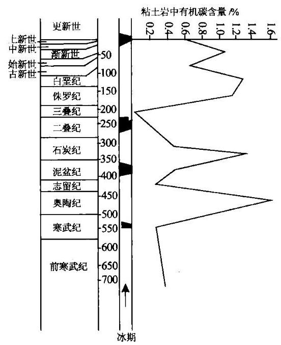

图 5-1 地史中有机碳的丰度

( 据 Tissot, 1973)

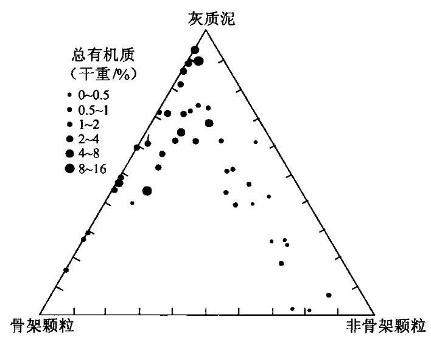

图 5-2 碳酸盐岩有机质含量与灰泥质的关系 (据 Hunt, 1979)

<!-- Media -->

不同沉积环境或者不同岩性岩相条件下沉积物中的有机质含量差别很大。据 Hunt (1972) 统计 (表 5-3), 大洋沉积物有机质含量普遍贫乏, 大陆及其边缘海则是有机质赋存的主要场所, 尤以泥质沉积最为丰富。

<!-- Media -->

表 5-3 沉积物中的有机碳

<table><thead><tr><th>大陆、陆棚、陆坡</th><th>平均值 %</th><th>质量 ${10}^{16}\mathrm{t}$</th><th>大 洋</th><th>平均值 %</th><th>质量 ${10}^{16}\mathrm{t}$</th></tr></thead><tr><td>粘土和页岩……</td><td>0.99</td><td>0.82</td><td>粘土和页岩……</td><td>0.22</td><td>0.07</td></tr><tr><td>碳酸盐岩……</td><td>0.33</td><td>0.08</td><td>碳酸盐岩……</td><td>0.28</td><td>0.10</td></tr><tr><td>砂……</td><td>0.28</td><td>0.09</td><td>硅质沉积……</td><td>0.26</td><td>0.04</td></tr></table>

(据 Hunt, 1972)

<!-- Media -->

沉积有机质的分布是相当广泛的, 但其丰度又是极不均衡的。其主要影响因素有下列 4 个方面。

1) 生物物质的产量: 主要取决于阳光、温度、湿度、含盐度和营养。在海洋, 温湿带的浅海区有良好的透光性和营养条件, 集中了海洋生物的绝大部分; 在大陆以湿热带最重要。
2) 原始有机质的保存条件: 指生物死亡后的沉降、沉积和埋藏过程中的氧化还原条件。在大陆地表通氧条件下,生物遗体大部分因受到氧化和微生物降解转变为 ${\mathrm{{CO}}}_{2}$ 和 ${\mathrm{H}}_{2}\mathrm{O}$ 而遭破坏, 只剩下骨路、孢粉、树脂、蜡质、纤维素和本质素等抗腐成分。水下情况较为复杂, 一般在浅水及深水上层, 由于光合作用和大气的人侵, 常为氧化环境。光线的透入深度与水体浑浊度有关,其在开阔海约为 ${200}\mathrm{\;m}$ ,沿岸海约为 ${50}\mathrm{\;m}$ ,潟湖仅为数米。而大气入侵深度又与波浪作用有关,有效浪底深度一般为波长的 $1/2$ 。因此,氧化还原界面的具体位置视情况不同可在水体的某个深度上, 也可在沉积物顶面以下某个深度上。值得一提的是, 有机分解过程中要消耗氧, 所以只要有机质补给速度超过氧的补给速度, 就可出现还原环境。
3) 沉降、沉积速率: 两个方面的含意, 一是有机、无机质点的绝对沉降速率, 沉降、沉积越快, 有机质保存下来的越多; 二是有机、无机质点的相对沉降速率, 若无机物沉积速率快或供给量大, 将会稀释有机质。只有在长期持续下沉过程中伴随适当的升降, 沉降速率与沉积速率相近或前者稍大时, 才能持久保持还原环境。在这种条件下, 不仅可以长期保持适于生物大量繁殖和有机质免遭氧化的有利水体深度, 保证丰富的原始有机质沉积下来; 而且可以造成沉积厚度大、埋藏深度大、地温梯度大, 生、储集层频繁相间广泛接触, 有助于原始有机质迅速向油气转化并广泛排烃的优越环境。
4) 沉积物的粒度: Trask (1932) 首先对此进行了系统的研究,他发现粒径 $&lt; {5\mu }\mathrm{m}$ 的粘土有机质含量是 $5 \sim  {50\mu }\mathrm{m}$ 粉砂的 2 倍,是 ${50} \sim  {250\mu }\mathrm{m}$ 细砂的 4 倍。Corskaya (1950) 对近代沉积的研究发现,砂的有机质含量为 ${0.77}\%$ ,粉砂为 ${1.2}\%$ ,粘土为 ${1.8}\%$ 。国内学者罗斌杰等 (1981) 对我国青海湖的调查发现, 低能带淤泥中的有机碳平均含量比高能带的砂和粉砂高出 1 倍以上。类似的调查还有许多, 尽管地点不同, 结果也有出入, 但都说明粒度越细所含有机质越多, 原因是: ① 从沉积分异角度看, 呈胶体或悬浮态的有机质点同粘土质点有很大的一致性, 可同步降落; ②粘土比表面积大, 吸附有机质的能力较强; ③形成泥质沉积的环境往往具有有利的保存条件。

## (二) 干酪根

沉积物 (岩) 中的沉积有机质经历了复杂的生物化学及化学变化, 通过腐泥化及腐殖化过程形成干酪根, 成为生成大量石油及天然气的先驱。古代沉积岩中的原始物质主要以干酪根形式存在, 并部分为可溶烃类和沥青 (图 5-3)。

<!-- Media -->

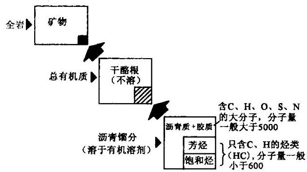

图 5-3 古代沉积物中的分散有机质组分

<!-- Media -->

## 1. 干酪根的概念和物质组成

干酪根 (Kerogen) 最初是指苏格兰油页岩中蒸馏出的油状物质, 后转意为油母质、 有机质, 并加以限定。现今干酪根的定义为: 沉积岩中不溶于碱、非氧化型酸和有机溶剂的分散有机质 (Hunt, 1979)。而沉积物中未固结的有机质以腐殖酸为主, 它是沉积岩中干酪根的前身。

干酪根是有机碳存在的最重要的形式,占沉积岩中分散有机质总量的 ${80}\%  \sim  {90}\%$ ,甚至更高。其余可溶于有机溶剂的部分叫沥青, 通常指氯仿抽提物, 包括烃类、胶质和沥青质。抽提时温度常低于 ${80}^{ \circ  }\mathrm{C}$ 。亨特认为 ${80}\%  \sim  {95}\%$ 的石油烃是由干酪根转化而成。杜朗 (Duran, 1980) 估计在沉积岩中, 干酪根总量约比化石燃料资源总量大 1000 倍 (图 5-4)。

<!-- Media -->

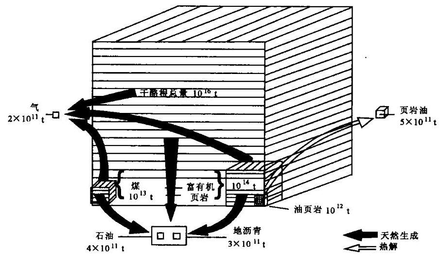

图 5-4 干酪根数量与化石燃料最大资源的比较

(据 Duran, 1980)

<!-- Media -->

岩石中的干酪根是最重要的成烃母质, 以巴黎盆地的典型研究看 (图 5-5), 随着埋深加大和地温升高, 有机质中的干酪根含量不断下降, 而烃类、胶质和沥青质的含量则相应上升。另外, 甲醇 - 丙酮 - 苯三元混合溶剂抽提物 (MAB 抽提物) 的含量也逐渐减少。MAB 抽提物是极性很强的富含 $\mathrm{N}\text{、}\mathrm{\;S}\text{、}\mathrm{O}$ 的重质化合物,元素组成最接近于干酪根,可代表干酪根向沥青和烃类转化过程的中间产物。当然,也有部分的烃类是直接从生物烃继承而来的。

从岩石中提纯出来的干酪根呈黑色或褐色粉末, 是复杂的有机高分子聚合物。从干酪根的显微组成已确定的有机残体有藻类、细菌和高等植物的组织。这些高等植物的组织包括壳质组的孢粉、树脂体和角质体以及镜质组和丝质组的碎片。

<!-- Media -->

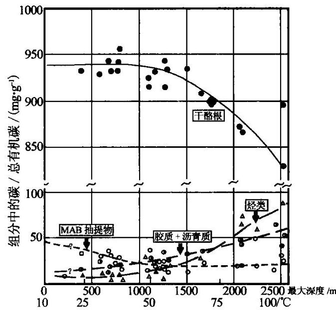

图 5-5 巴黎盆地托尔页岩有机质各组分含量随深度的变化

(据 Tissot, 1971)

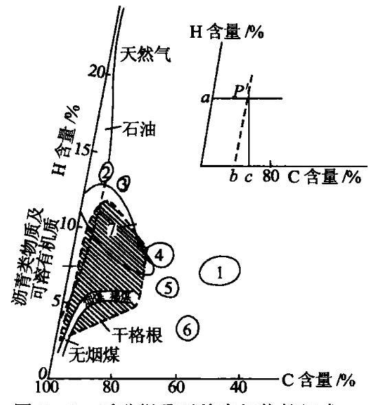

图 5-6 干酪根及天然有机物的组成 (据 McIver, 1967)

1一碳水化合物; 2-蜡质; 3-脂肪; 4-蛋白质; 5-木质素; 6-腐殖酸; 7-三萜烯类右上小图示元素含量读法: 样品 ${\mathrm{P}}^{\prime }$ 的 $\mathrm{H}$ 含量为 $a\%$ ; C 含量为 $c\% ;0$ 含量为 $\left( {{100} - b}\right) \%$

<!-- Media -->

## 2. 元素组成和分子结构

干酪根的元素组成中以 $\mathrm{C}$ 为主,其次为 $\mathrm{H}$ 和 $\mathrm{O}$ ,还有 $\mathrm{N}\text{、}\mathrm{\;S}$ 等。按元素的质量百分比计算,它们一般分布范围为: $\mathrm{C} : {70}\%  \sim  {90}\% ,\mathrm{H} : 3\%  \sim  {10}\% ,\mathrm{O} : 3\%  \sim  {19}\% ,\mathrm{\;N} : {0.4}\%  \sim$ $4\% ,\mathrm{\;S} : {0.2}\%  \sim  5\%$ (据 Tissot,1984)。从图 5-6 也可看出,干酪根的元素组成跨有很大范围, 这正是干酪根原始物质来源复杂而广泛的反映。不难想像, 它的化学成分和结构会因原始物质类型不同及演化程度而变化。

<!-- Media -->

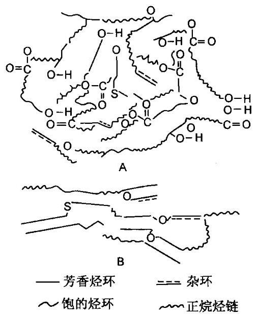

图 5-7 绿河页岩干酪根结构图解

(据 B. P. Tissot 等, 1978) A一微弱演化; B一强烈演化

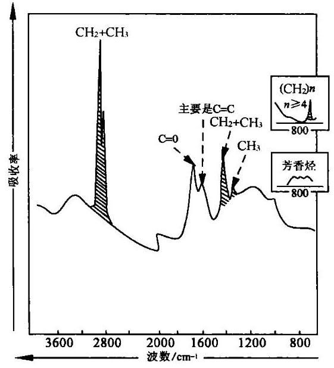

图 5-8 干酪根的典型红外光谱图

(据 Tissot, 1984)

<!-- Media -->

一般地说, 无定形干酪根的化学结构是不确定的, 常以许多带有各种官能团的芳香环、饱和环和杂环为核心, 彼此被脂肪链或杂原子桥键所交联形成三维立体大分子(图 5-7)。它的化合物组成可根据红外光谱分析概略地了解。因为, 具有相同的官能团和化学键的一系列化合物在红外光谱分析中具有特征的吸收谱带。通过红外光谱技术还可评价羧基或碳基等含氧基团与脂肪链加饱和环的相对重要性, 如图 5-8 所示。重要的谱带有: ① 在 ${2920}{\mathrm{\;{cm}}}^{-1}$ 和 ${2860}{\mathrm{\;{cm}}}^{-1}$ 的 2 个强吸收峰主要与 ${\mathrm{{CH}}}_{2}$ 和 ${\mathrm{{CH}}}_{3}$ 脂肪基伸缩振动有关; ② 最大值位于 ${1710}{\mathrm{\;{cm}}}^{-1}$ 左右的宽谱带由 $\mathrm{C} = 0$ 基 (酮类、酸类、脂类) 造成; ③吸收峰在 ${1600}{\mathrm{\;{cm}}}^{-1}$ 的一个宽谱带,主要与芳烃的 $\mathrm{C} = \mathrm{C}$ 有关; ④ 在 ${1450}{\mathrm{\;{cm}}}^{-1}$ 处的吸收谱带与 ${\mathrm{{CH}}}_{3}$ 的直链或环状的 ${\mathrm{{CH}}}_{2}$ 的弯曲振动有关。而在 ${1370}{\mathrm{\;{cm}}}^{-1}$ 处形成的谱带仅与 ${\mathrm{{CH}}}_{3}$ 的弯曲振动有关; ⑤ 在 ${1040} \sim  {1400}{\mathrm{\;{cm}}}^{-1}$ 处很宽的谱带包括 $\mathrm{C} - \mathrm{O}$ 的伸缩振动和由 $\mathrm{{OH}}$ 形成的弯曲振动; ⑥在 ${700} \sim  {930}{\mathrm{\;{cm}}}^{-1}$ 处的强度较弱的连续谱带与各种芳香烃的 $\mathrm{{CH}}$ 的面外弯曲振动有关; ⑦在 ${720}{\mathrm{\;{cm}}}^{-1}$ 的吸收谱带是 ${\left( {\mathrm{{CH}}}_{2}\right) }_{n},n \geq  4$ 的脂肪链形成的谱带。

3. 类型和演化

干酪根是分散有机质的主体, 它的类型基本可代表岩石中分散有机质的类型。干酪根的类型与原始物质的类型和化学结构密切相关, 类型不同其成烃潜力亦不同。Tissot (1974) 根据干酪根的元素分析采用 $\mathrm{H}/\mathrm{C}$ 和 $\mathrm{O}/\mathrm{C}$ 原子比绘制相关图即范氏图 (Van Krev-elen 图), 将其主要分为 3 大类, 如图 5-9 所示。

<!-- Media -->

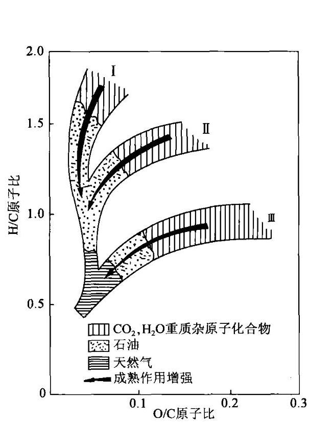

图 5-9 干酪根类型及其演化图 ( 据 Tissot, 1974) I 一藻质型; II 一腐泥型; III一腐殖型

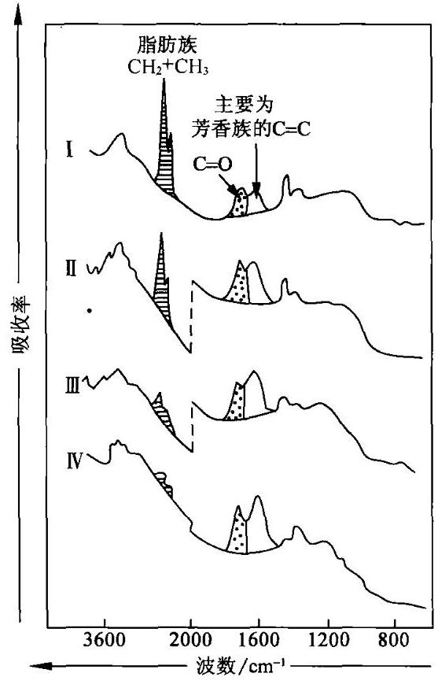

图 5-104 种类型干酪根的红外光谱图 ( 据 Tissot, 1979)

I 一藻质型; II - 腐泥型; III - 腐殖型; IV - 残余型

<!-- Media -->

I 型是分散有机质干酪根中经细菌改造的极端类型, 或藻质型, 它富含脂肪族结构, 富氢和贫氧,原始 $\mathrm{H}/\mathrm{C}$ 原子比高,一般为 ${1.5} \sim  {1.7}$ ,而 $\mathrm{O}/\mathrm{C}$ 原子比低,一般小于 0.1, 是高产石油的干酪根,其热失重为 ${65}\%$ ,生烃潜力为 ${0.4} \sim  {0.7}$ 。

II 型是烃源岩中常见的干酪根, 又称腐泥型, 有机质主要来源于水盆地中浮游生物和细菌。有较高的原始 $\mathrm{H}/\mathrm{C}$ 原子比,约 ${1.3} \sim  {3.5}$ ; 较低的 $\mathrm{O}/\mathrm{C}$ 原子,约 ${0.1} \sim  {0.2}$ 。其生烃潜力较高,热失重为 ${50}\%  \sim  {80}\%$ ,生烃潜力为 ${0.3} \sim  {0.5}$ 。

III 型是由陆生植物组成的干酪根, 又称腐殖型。富含多芳香核和含氧基团。原始H/C 原子比低,通常小于1.0,而 $0/\mathrm{C}$ 原子比高,可达 ${0.2} \sim  {0.3}$ ,这类干酪根以成气为主, 其热失重为 ${30}\%  \sim  {50}\%$ ,生烃潜力为 ${0.1} \sim  {0.2}$ 。

另外,还有一种干酪根称残余型或 $\mathrm{{VI}}$ 型,具异常低的原始 $\mathrm{H}/\mathrm{C}$ 原子比,比值低至 ${0.5} \sim  {0.6}$ ,而 $0/\mathrm{C}$ 原子比却高达 ${0.25} \sim  {0.3}$ ,这类干酪根中有大量的芳香核和含氧基团, 显微组分观察表明其有机质主要为惰性组的氧化有机质和丝质碎片, 能生成少量的气, 此干酪根的热失重 $&lt; {30}\%$ ,生烃潜力 $&lt; {0.2}$ 。

Tissot 等 (1979) 利用红外光谱曲线图 (图 5-10), 表明了北大西洋白垩系黑色页岩中的 4 种类型干酪根化学组成的明显差别。在国内有学者研究, 我国陆相湖盆干酪根的类型主要是腐泥型和腐殖型及它们之间的中间型和过渡类型。

干酪根是在成岩作用过程中适度的地温和压力条件下形成的缩聚物, 在埋深不增加的情况下, 性质比较稳定。随着盆地的沉降和地温的增加, 干酪根将发生重排和有序化, 首先其重杂原子基团断裂, 然后依次脱去烷基链,形成中到低分子量的烃类以及 ${\mathrm{{CO}}}_{2}$ 、 ${\mathrm{H}}_{2}\mathrm{\;S}$ 和 ${\mathrm{H}}_{2}\mathrm{O}$ 等,其后只形成甲烷。干酪根成烃的这一地球化学过程世界各国的许多学者都进行了系统的研究。他们以巴黎盆地侏罗系下托尔统页岩、北非撒哈拉的志留系页岩、 西非喀麦隆杜阿拉盆地的上白垩统、美国犹塔盆地始新统绿河页岩、洛杉矶和文图拉盆地的中新统为研究对象, 将这些有关干酪根在地质条件下热演化成烃过程的研究与实验室的成烃转化热模拟实验加以对比分析, 得出令人信服的结论。我国学者也对国内各主要陆相盆地开展了详细全面的研究。

<!-- Media -->

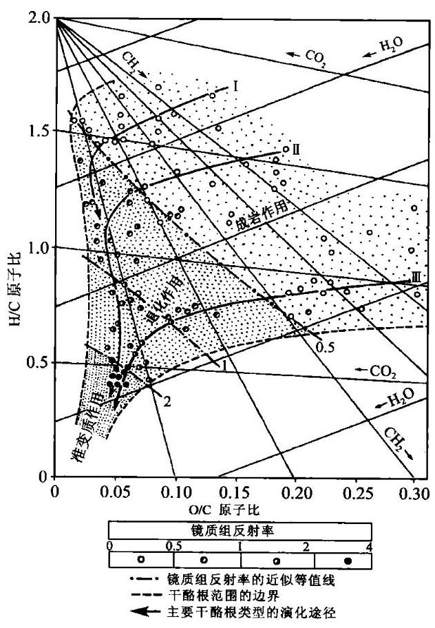

图 5-11 干酪根演化图 (据 Tissot, 1978)

I 一藻质型; II 一腐泥型; III一腐殖型

<!-- Media -->

干酪根的元素组成在不同的演化和成熟阶段其变化趋势是不同的 (图 5-11), 不同类型的干酪根演化途径也不同。但所有干酪根的主要演化阶段和总趋势是相同的。

Tissot 等(1971,1974)对巴黎盆地侏罗系下托尔统页岩的干酪根热演化成烃的研究是最典型和详细的实例之一。下托尔统页岩距今 ${180}\mathrm{{Ma}}$ ,厚度 ${10} \sim  {30}\mathrm{\;m}$ ,富含有机质,干酪根类型为 II 型,在区域上相当稳定,盆地构造发展史简单, 有利于重建埋藏史和计算地层最大埋深。从盆地不同深度所取得的岩心, 其干酪根成烃转化主要是埋深和地温的函数, 而其他地质和地球化学参数都基本保持稳定,是非常理想的地质情况。另因下托尔统页岩地史上的最大埋深为 ${2500}\mathrm{\;m}$ 左右,所以, 为得到完整的演化剖面, Tissot 等研究补充了地质和地球化学条件相似的联邦德国的同类页岩和撒哈拉下志留统页岩的资料 (图 5-12、图 5-13)。

<!-- Media -->

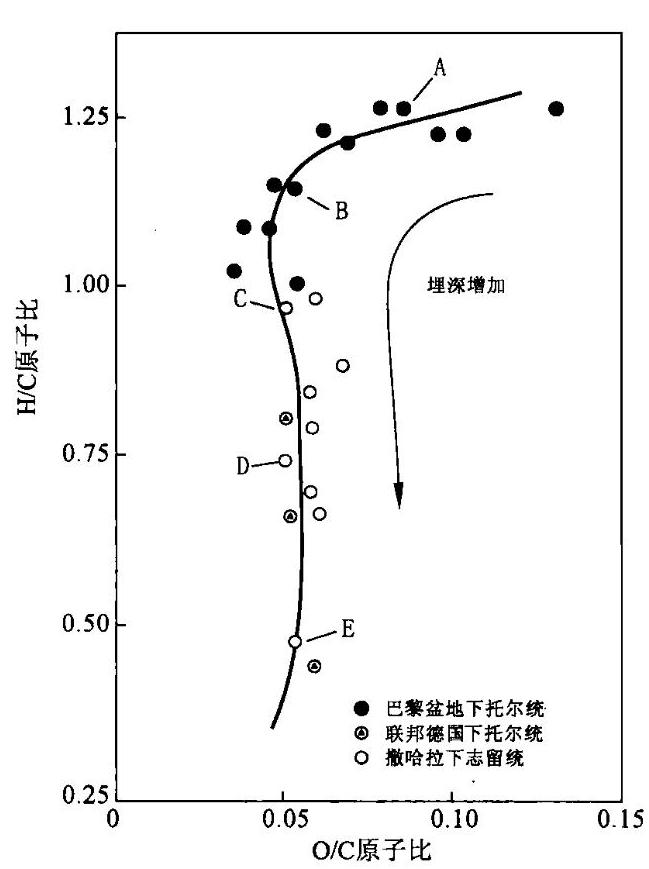

图 5-12 在埋藏过程中II型干酪根元素组成的演化 (据 Tissot & Welte, 1984, 有修改) A一成岩阶段末期; B-D一深成阶段; E一准变质阶段

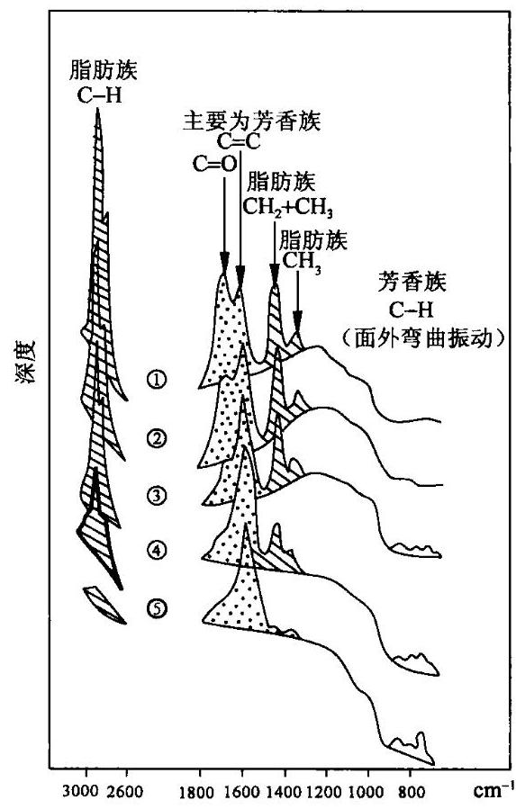

图 5-13 巴黎盆地下托尔统及撒哈拉下志留统 II 型干酪根天然演化的红外光谱图 (据 Tissot & Welte, 1984)

<!-- Media -->

干酪根随埋深所经历的热动力平衡和降解作用是连续的, 但又可以区分为 3 个阶段。

(1) 第一阶段

下托尔统页岩中干酪根开始大量消耗氧,导致 $\mathrm{O}/\mathrm{C}$ 原子比迅速下降,而 $\mathrm{H}/\mathrm{C}$ 原子比则轻微减少 (图 5-12A、B)。

红外光谱图 (图 5-13①、②) 表明,氧的减少基本以 $\mathrm{C} = 0$ 基团峰 $\left( {{1710}{\mathrm{\;{cm}}}^{-1}}\right)$ 迅速下降为特征,而 ${\mathrm{{CH}}}_{3}\text{、}{\mathrm{{CH}}}_{2}$ 基团峰则稍有减少。

干酪根镜质体反射率分布在 ${0.4}\%  \sim  {0.6}\%$ 之间。

该阶段巴黎盆地下托尔统页岩的干酪根相当于成岩阶段后期, 相应的最大埋深为 ${800} \sim  {1200}\mathrm{\;m}$ ,对应未成熟阶段,干酪根仅生成少量的烃,而与氧消失有关的 ${\mathrm{{CO}}}_{2}\text{、}{\mathrm{H}}_{2}\mathrm{O}$ 及一些重杂原子则大量生成。

## (2) 第二阶段

干酪根除 $\mathrm{O}/\mathrm{C}$ 原子比继续减少至稳定外,以 $\mathrm{H}/\mathrm{C}$ 原子比迅速减小为特征,演化途径为图 $5 - {12}\mathrm{\;B}\text{、}\mathrm{C}\text{、}\mathrm{D}$ 。

红外光谱 (图 5-13②、③、④) 说明,残余的含氧基团 $\left( {\mathrm{C} = \mathrm{O}}\right) {1710}{\mathrm{\;{cm}}}^{-1}$ 谱带继续下降直至消除。与 ${\mathrm{{CH}}}_{3}$ 和 ${\mathrm{{CH}}}_{2}$ 等脂肪族有关的谱带 $\left( {{2920}\text{、}{2860}\text{、}{1450}\text{、}{1370}{\mathrm{\;{cm}}}^{-1}}\right)$ 快速下降,与芳烃有关的 $\mathrm{C} = \mathrm{C}\left( {{1600}{\mathrm{\;{cm}}}^{-1}}\right)$ 和 $\mathrm{C} - \mathrm{H}$ 面外弯曲振动 $\left( {{700} \sim  {930}{\mathrm{\;{cm}}}^{-1}}\right)$ 谱带逐渐突出和出现。

镜质体反射率开始缓慢增加,然后比较快速地增加到 $2\%$ 。

该阶段撒哈拉志留系埋深约 ${3000}\mathrm{\;m}$ ,地温约 ${130}^{ \circ  }\mathrm{C}$ ,干酪根处于深成作用阶段即成熟阶段。前期为成油主带, 另有部分重杂原子化合物生成; 后期为干酪根热裂解生成轻质油和湿气带。

(3)第三阶段

撒哈拉志留系 II 型干酪根 $\mathrm{H}/\mathrm{C}$ 原子比仅为0.4(图 5-12E),碳含量可达总量的 ${91}\%  \sim  {93}\%$ 。

红外光谱 (图 5-13⑤) 说明, 脂肪族谱带继续下降趋于消失, 含氧基团谱带已消失, 而芳烃吸收谱带继续增强。

镜质体反射率 $&gt; 2\%$ 。

此阶段,撒哈拉下志留统干酪根埋深约为 ${4000}\mathrm{\;m}$ ,地温较高,处于准变质作用阶段即过成熟阶段, 干酪根中的烷基链趋于耗尽, 芳环大量重排缩合, 只能生成热裂解干气。

<!-- Media -->

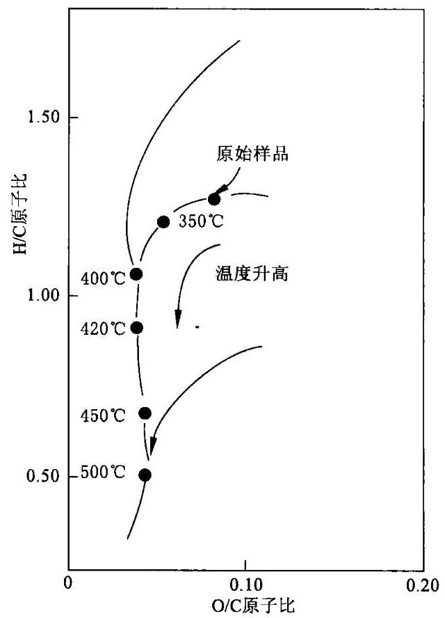

图 5-14 在热模拟实验中II型干酪根元素组成的变化 (据 Tissot, 1978)

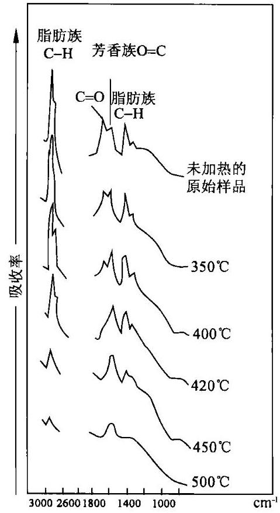

图 5-15 II型干酪根演化人工模拟红外光谱图 (据 Tissot, 1978)

<!-- Media -->

在实验室中, 各国学者进行了大量的热模拟实验研究, 但因地质时间是无法再现的, 这样就需要增加温度、加快反应速度来补偿时间的不足。Tissot (1974) 对巴黎盆地下托尔统页岩浅层未成熟 II 型干酪根样品以 ${4}^{ \circ  }\mathrm{C}/\mathrm{{min}}$ 的恒定速度加热进行了热模拟实验,并采用元素分析、红外光谱分析和热失重分析记录了模拟过程 (图 5-14 和图 5-15)。

热模拟结果表明,当对样品加热到 ${350}^{ \circ  }\mathrm{C}$ 时,相当于成岩作用晚期,失重 $&lt; {10}\%$ ,元素组成 $\mathrm{H}/\mathrm{C}$ 和 $\mathrm{O}/\mathrm{C}$ 原子比与埋深为 ${1000} \sim  {1500}\mathrm{\;m}$ 的天然样品相近,红外光谱中 $\mathrm{C} = 0$ 吸收谱带明显减弱,主要生成 ${\mathrm{H}}_{2}\mathrm{O}\text{、}{\mathrm{{CO}}}_{2}$ 和一些重杂原子。

当热模拟实验温度约从 ${350}^{ \circ  }\mathrm{C}$ 升至 ${470}^{ \circ  }\mathrm{C}$ 时,干酪根进入成熟和大量降解成烃阶段,热失重约达 ${70}\%$ ,产物主要是脂肪族化合物,元素组成快速改变, $\mathrm{H}/\mathrm{C}$ 原子比降到 0.5 左右。红外光谱图上, ${\mathrm{{CH}}}_{3}\text{、}{\mathrm{{CH}}}_{2}$ 吸收峰明显减弱, $\mathrm{C} = 0$ 吸收峰逐渐消失,芳烃的吸收峰逐渐加强。该阶段对应深成作用阶段,其底界实验温度为 ${470} \sim  {500}^{ \circ  }\mathrm{C}$ 时的干酪根组成与撒哈拉的下志留统自然温度超过 ${130}^{ \circ  }\mathrm{C}$ 时的干酪根相当。巴黎盆地下托尔统页岩最深 $\left( {{2500}\mathrm{\;m}\text{、}{100}^{ \circ  }\mathrm{C}}\right)$ 的天然干酪根样品的组成和结构与实验中加热到 ${400}^{ \circ  }\mathrm{C}$ 时的样品相当。

当加热超过 ${470} \sim  {500}^{ \circ  }\mathrm{C}$ ,至 ${600}^{ \circ  }\mathrm{C}$ 时,干酪根失重缓慢且很少,红外光谱上主要保留了芳烃吸收谱带, 干酪根重排缩合, 该阶段人工加热模拟结果与天然准变质作用阶段相当。

## 三、油气生成的理化条件

沉积有机质抑或干酪根向石油和天然气演化必须具备适当的温度、时间、细菌、催化剂、放射性等物理、化学及生物化学条件。

近几年来, 世界各国的油气勘探经验和许多学者的研究成果, 均证明温度和时间是在油气生成全过程中至关重要的一对因素, 其他因素 (如细菌、催化剂、放射性物质等) 也有一定的影响。

## (一) 温度和时间

地球不断由内部向地表散发热量, 从而使地壳形成一个温度向内递增的天然热场。地壳深度每增加 ${100}\mathrm{\;m}$ 时温度 $\left( {{}^{ \circ  }\mathrm{C}}\right)$ 的增加值叫地温梯度。现代地壳平均地温梯度为 ${3}^{ \circ  }\mathrm{C}/$ ${100}\mathrm{\;m}$ ,变化范围为 ${0.5} \sim  {25}^{ \circ  }\mathrm{C}/{100}\mathrm{\;m}$ 。含油气盆地常见的地温梯度为 $2 \sim  {5}^{ \circ  }\mathrm{C}/{100}\mathrm{\;m}$ 。因此, 沉积有机质随着埋深的增加必然经历温度逐渐升高的过程。

<!-- Media -->

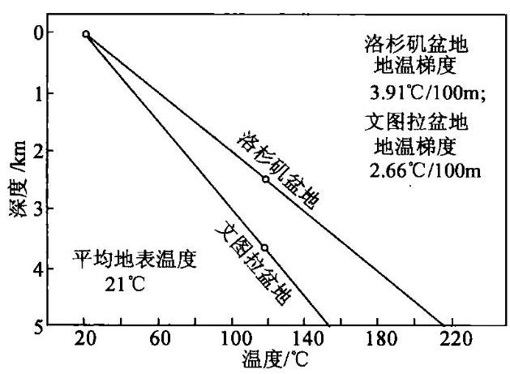

图 5-16 洛杉矶盆地和文图拉盆地平均地温梯度 (据 Philippi, 1965)

<!-- Media -->

大量实际资料表明, 当烃源岩达到门限温度时, 干酪根才开始成熟, 从而大量成烃。与门限温度对应的深度叫门限深度, 温度与深度的关系取决于地温梯度。相同的门限温度在地温梯度大的地区出现得较浅, 而在地温梯度小的地区出现得较深。

据 Philippi(1965)研究,洛杉矶盆地和文图拉盆地的新近系烃源岩门限温度都为 ${115}^{ \circ  }\mathrm{C}$ , 但由于两盆地的地温梯度不同,其所对应的埋深分别为 ${2440}\mathrm{\;m}$ 和 ${3660}\mathrm{\;m}$ (图 5-16)。实际资料表明,生烃门限温度通常都在 ${50} \sim  {130}^{ \circ  }\mathrm{C}$ 范围 (图 5-17 和图 5-18)。通常,生油主要阶段的起始温度不低于 ${50}^{ \circ  }\mathrm{C}$ ,终止温度不高于 ${175}^{ \circ  }\mathrm{C}$ 。也即是说,地壳中的生油过程只出现于有限的温度和深度范围。而有机成气的温度一般不高于 ${230}^{ \circ  }\mathrm{C}$ 。毋庸置疑,温度在沉积有机质成烃演化过程中起着决定性作用。

<!-- Media -->

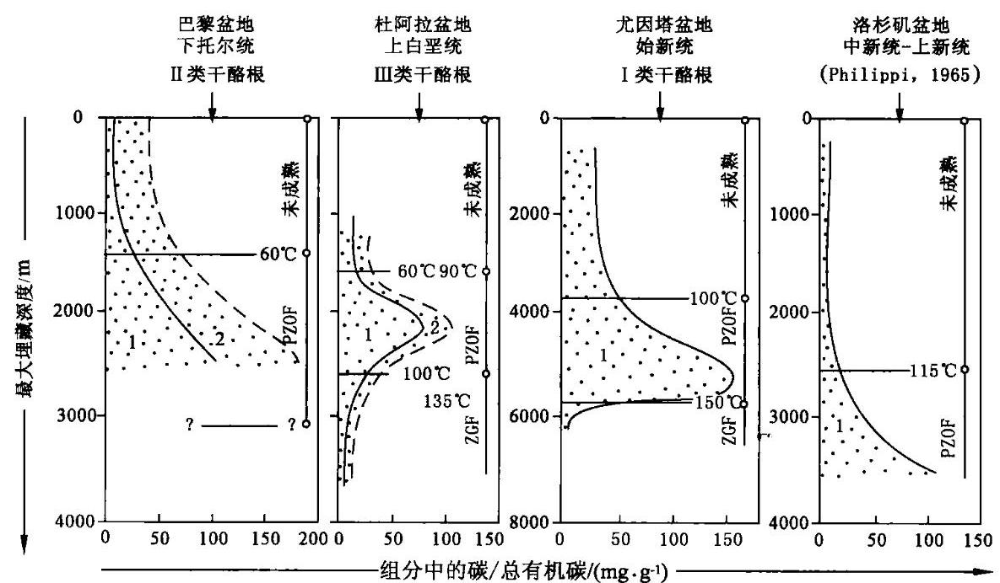

图 5-17 国外若干典型盆地烃和非烃的生成和埋深的关系

(据 Tissot 等, 1979 修改)

PZOF一主要生油带; ZGF一热裂解成气带; 温度为今地温; 杜阿拉盆地的 ${90}^{ \circ  }\mathrm{C}$ 和 ${135}^{ \circ  }\mathrm{C}$ 为古地温 $1 - {\mathrm{C}}_{15} +$ 烃类;2一非烃类 (胶质 + 沥青质)

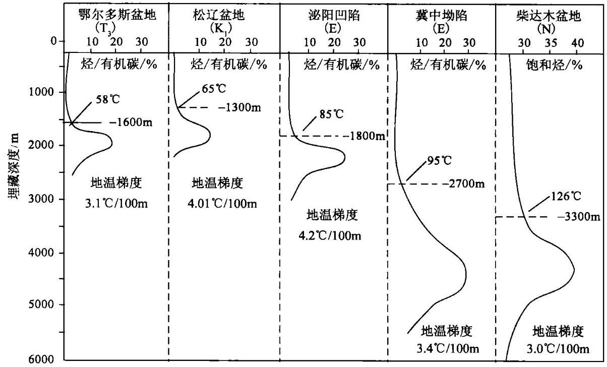

图 5-18 中国若干盆地不同世代烃源岩埋深与油气生成关系图 (据黄第藩, 1991)

<!-- Media -->

时间本身在很低的温度下不能起作用, 如 Karwell (1956) 曾研究, 下石炭统的莫斯科褐煤由于埋深从未达到过 ${200}\mathrm{\;m}$ 以下,意味着所经历的温度始终很低,则它不可能达到更高级的煤化阶段。反之, 门限温度的高低主要与有机质的持续受热时间或地质时代有关, 图 5-17 和图 5-18 表明, 烃源岩时代老则门限温度低, 时代新则门限温度高, 这说明时间和温度之间是有密切联系的, 即时间可以补偿温度, 但与温度相比, 时间居次要地位。

从理论上讲, 干酪根热演化成烃受控于化学反应动力学机制, 它虽实际上是复杂的多级平行反应, 但热解实验结果表明, 从总体效果来看, 干酪根热解作用基本遵循化学反应动力学的一级反应 (Tissot, 1969), 即反应速率与反应物浓度的一次方成正比, 方程如下:

$$
- \frac{\mathrm{d}C}{\mathrm{\;d}t} = {KC} \tag{5 - 1}
$$

式中: $C$ 表示干酪根的浓度; $K$ 为反应速率常数; $t$ 为时间,负号表示反应物浓度随生成物增加而减少。

从式 (5-1) 中可看出, 反应速率取决于反应速率常数和反应物浓度, 而反应速率常数主要受温度的控制。大量的实践表明,温度每增加 ${10}^{ \circ  }\mathrm{C}$ ,反应速率(K)可增加 $1 \sim  2$ 倍,即 $\left( {{K}_{t} + {10}^{ \circ  }\mathrm{C}}\right) /{K}_{t} = 2 \sim  4$ ,据此推算,若增加 1 倍,那么在相当于 ${150}^{ \circ  }\mathrm{C}$ 深处的反应速率比地下 ${50}^{ \circ  }\mathrm{C}$ 埋深时反应速率快 1000 倍。 1889 年 Arrhenius 提出了反应速率常数与温度的经验关系式, 即著名的阿仑尼乌斯方程:

$$
K = A \cdot  {e}^{-\frac{E}{RT}} \tag{5 - 2}
$$

式中: $K$ 为温度 $T$ 时的反应速率常数; $A$ 为频率因子即单位时间、单位容积内分子碰撞次数; $E$ 为活化能 $\left( {\mathrm{J}/\mathrm{{mol}}}\right) ;T$ 为绝对温度; $R$ 为气体常数; $e$ 为自然对数的底。

反应速率常数(K)与时间的关系可用式(5 - 1)积分得到。以 ${C}_{0}$ 和 $C$ 分别代表反应物原始浓度和 $t$ 时间反应物的浓度,将式(5 - 1)移项定积分则:

$$
- {\int }_{{C}_{0}}^{C}\frac{\mathrm{d}C}{C} = {\int }_{0}^{t}K\mathrm{\;d}t
$$

$$
\ln \frac{{C}_{0}}{C} = {Kt}
$$

$$
K = \frac{1}{t}\ln \frac{{C}_{0}}{C} \tag{5 - 3}
$$

温度和时间的相互关系可用式(5 - 2)和(5 - 3)联立表示即:

$$
A \cdot  {e}^{-\frac{E}{RT}} = \frac{1}{t}\ln \frac{{C}_{0}}{C} \tag{5 - 4}
$$

将上式等式两边取自然对数得:

$$
\ln A - \frac{E}{RT} =  - \ln t + \ln \ln \frac{{C}_{0}}{C} \tag{5 - 5}
$$

将上式中 $A$ 和 ${C}_{0}/C$ 视为常数则:

$$
\ln t = \frac{E}{RT} - b \tag{5 - 6}
$$

从(5 - 6)式可知,反应时间的对数 $\left( {\ln t}\right)$ 与反应温度的倒数 $\left( {1/T}\right)$ 呈线性关系。

从上述 $\left( {5 - 1}\right) \text{、}\left( {5 - 2}\right) \text{、}\left( {5 - 3}\right) \text{、}\left( {5 - 6}\right)$ 式可知,干酪根热演化成烃的反应速率主要与反应速率常数(K)有关, $K$ 与温度的影响呈指数关系,与时间的影响呈线性关系, 而温度和时间可以互补。

理论和实践都表明, 温度和时间有补偿作用, 即低温长时间与高温短时间的作用可达到同样的成熟度效果。前述 Tissot 在实验室中对干酪根高温快速热模拟与自然界干酪根低温慢速热演化有着几乎同样的结果也证明了这一点。康南 (Connan, 1974) 根据世界上若干含油气盆地烃源岩的门限温度和所经历时间的实际资料绘制了石油生成的时温关系图 (图 5-19), 得到的关系式为:

$$
\lg t = {3014} \times  \frac{1}{T} - {6.498}\;\left( {5 - 7}\right)
$$

<!-- Media -->

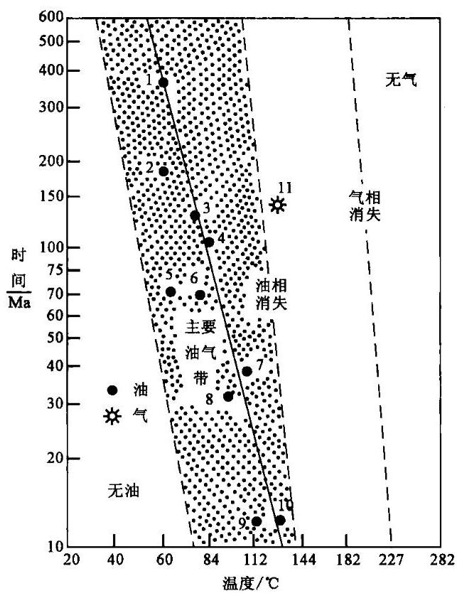

图 5-19 石油生成的时 - 温关系

(据 Connan, 1974, 引自陈荣书, 1994) 1一巴西亚马孙盆地; 2一法国巴黎盆地; 3-法国阿奎特因盆地; 4-西非阿尤恩地区; 5-喀麦隆杜阿拉盆地; 6一新西兰塔拉纳基盆地; 7-法国卡马格盆地; 8-新西兰塔拉纳基盆地; 9 - 美国洛杉矶盆地; 10 美国文图拉

盆地; 11 - 法国阿奎特因盆地

<!-- Media -->

式中: $t$ 的单位为 $\mathrm{{Ma}};T$ 的单位为 $\mathrm{K}$ 。

从图 5-19 可看出, 沉积有机质的时代越新即所经历的受热时间越短, 则生油门限温度越高; 时代越老受热时间越长, 则门限温度越低。图中的时 - 温线的斜率是由活化能决定的。图中的虚线是据镜质体反射率提供的信息加上的, 虚线给出了油气生成过程开始与结束的界限。地温达不到门限值, 无工业石油生成, 温度超过油相或气相消失界线, 则油气被破坏。因此, 基于温度和时间的综合作用, 有利于生烃并保存的盆地应该是年轻的热盆和古老的冷盆。

## (二) 细菌

细菌对有机质的成岩作用和石油及天然气的生成以及降解过程起重要作用。

细菌在自然界有很强的生存适应性和繁殖能力。它们遍布于大多数的天然水系和埋藏较浅 $\left( { &lt; {1000}\mathrm{\;m}}\right)$ 的沉积物中。细菌的生存和消亡、抑制和活跃受养料、湿度、温度、水循环和介质的 $\mathrm{{pH}}$ 值、 ${E}_{\mathrm{h}}$ 值以及毒性代谢物所控制。

在沉积物中, 细菌活动的总趋势一般随埋深增加而减弱。在垂向上不同类型的细菌出现连续分带现象, 即从浅到深为喜氧菌带、厌氧硫酸盐还原菌带和厌氧碳酸盐还原产甲烷菌带。

在浅水沉积物中, 细菌最活跃且分布广泛。据调查, 在现代沉积物和土壤顶层细菌的含量为 $0 \sim  {500}\mathrm{\;g}/{\mathrm{m}}^{3}$ (一亿个细菌相当于有机质 $1\mathrm{{mg}}$ )。自地表往下,喜氧细菌含量在几米深处已极少, 并逐渐为厌氧细菌所代替。通常认为适宜细菌生存或保持其活动的温度一般小于 ${100}^{ \circ  }\mathrm{C}$ 。另外,在 ${80} \sim  {100}^{ \circ  }\mathrm{C}$ 左右时或成岩作用晚期,干酪根中释放的酚类对细菌有毒害, 甚至可起到杀菌的作用。

细菌通过酵素可使许多不稳定的原始生化组分被分解和消化。在喜氧条件下主要游离产物为 ${\mathrm{H}}_{2}\mathrm{O}\text{、}{\mathrm{{CO}}}_{2}$ 以及 ${\mathrm{{NH}}}_{3}$ 、硫酸盐和磷酸盐离子; 在厌氧条件下主要游离产物为 ${\mathrm{{CH}}}_{4}$ 、 ${\mathrm{H}}_{2}\mathrm{\;S}\text{、}{\mathrm{H}}_{2}\mathrm{O}$ 以及 ${\mathrm{{NH}}}_{3}$ 和磷酸盐离子。实验和野外资料研究表明,有机质经细菌作用后还可直接产生沥青物质。此外, 细菌本身也是良好的生烃原始材料, 有的细菌还可在自身细胞中合成少许固态高分子烃类。由于生存条件的限制, 细菌的生物化学作用主要出现在成岩作用的早 - 中期。

## (三) 催化剂

成烃演化过程中, 最主要最有现实意义的催化剂是粘土。已知蒙脱石型的粘土催化活力最强。从根本上说, 催化剂的作用主要是一种复杂的自由表面能现象, 被催化剂所吸附的各种原子在催化原子的激发下变得活跃起来, 从而有利于结合成新的化合物。在有机质生烃过程中催化剂可以改变其原有结构,断开其 $\mathrm{C} - \mathrm{C}$ 和 $\mathrm{C} - \mathrm{H}$ 键,进而分裂出较轻的烃。

<!-- Media -->

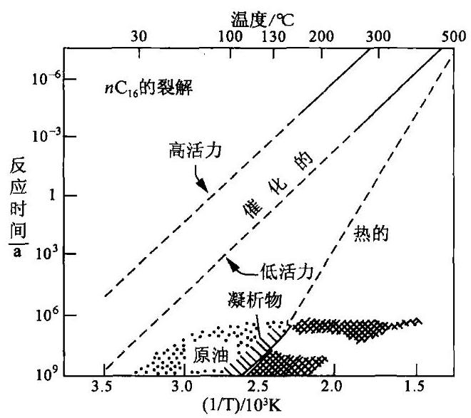

图 5-20 正十六烷热裂解和催化裂解所需要的时间 (据 Goldstein, 1980)

<!-- Media -->

根据实验资料,在 ${100}^{ \circ  }\mathrm{C}$ 下裂解正十六烷, 用高活力催化剂只需几个月, 用低活力催化剂需 1000 年。而单纯热裂解所需的时间已超过了地球的年龄 (图 5-20)。在 ${125}^{ \circ  }\mathrm{C}$ 以前热催化降解可能是主要的生油机制, 而高温的凝析油和湿气可能主要靠热裂解产生, 热降解反应的速率是由温度、 反应物浓度以及催化剂的浓度和活力所决定的。总之, 在有机质生烃转化过程中, 催化剂的参与可加快成烃的反应速率, 降低反应所需的活化能以及改造烃的性质。

水的存在可以严重降低粘土的催化活力。因此, 沉积物中的粘土可视为低活性催化剂。纯碳酸盐岩通常被认为没有催化活力。所以生烃的碳酸盐岩常含有相当的粘土质点, 但终不如页岩的催化效果好。也正因此, 碳酸盐岩中的干酪根的活化能高于页岩中的同类干酪根。

另一类催化剂是酵素 (酶)。酵素中含有某些活性组分, 可起催化作用。沉积物中的酵素是与有机质同时积聚的, 在分开有机质, 并在将不溶 (于有机溶剂) 有机质转变成可溶有机质过程中起积极作用, 但在地下深处如何评价尚有待进一步研究。

(四) 放射性

实验表明,用 $\alpha$ -射线轰击某些有机质可得到甲烷、二氧化碳和氢,轰击水可得到氧和氢。氧与有机质作用最后生成二氧化碳, 氢可使有机质氢化或与二氧化碳化合成甲烷。甲烷在 $\alpha$ - 射线作用下可叠合成乙烷、更重的气态乃至液态烷烃。问题在于沉积岩中放射性元素含量太低。有人计算,假定每立方千米岩石中含有 ${0.001}\%$ 铀,有机质含量为 $1\%$ 时,在 $1\mathrm{{Ma}}$ 时间内,由放射性作用所生成的石油是 ${18} \times  {10}^{4}\mathrm{t}$ 。这个量级对于工业油藏形成意义不大。但实际上是否真的能起这么大的作用, 也缺乏证据。瑞典前寒武系和美国泥盆系高放射性的黑色页岩附近并未发现大量游离石油。看来放射性不能视为影响成烃演化的重要因素。 徐永昌研究员认为: “放射性元素所造成的局部地温增高将有利于有机质的热演化”。

(五) 压力

对压力与成烃作用关系的研究, 远不及温度。概括地说, 压力对有机质成烃具有抑制或促进作用。随着时间的推移, 无论模拟实验 (Saigo, 1986; Horvath, 1987; 丁福臣等, 1991), 还是化学热力学理论分析和计算 (何志高, 1982) 都明确指示, 高压阻碍有机质成熟和成烃作用。Horvath (1987) 则进一步明确指出: “短暂的降压更有利于加速有机质的成熟”。

## 四、成烃演化与模式

沉积有机质同矿物质一样, 随沉积物埋藏必然要经历地质条件下的生物、化学和物理的作用, 使其发生与介质环境相适应的变化以及有机、无机相互作用。与此同时, 有机质的成烃演化进程和所得到的烃类产物又表现出明显的阶段性。因此, 可根据有机质性质的变化和油气生成划分出阶段, 即沉积有机质的成烃演化阶段。目前按石油生成将有机质成烃演化划分为未成熟阶段、成熟阶段和过成熟阶段 (图 5-21)。其与沉积物成岩演化的成岩作用阶段、深成作用阶段和准变质作用阶段一一对应。镜质体反射率 $\left( {R}_{0}\right)$ 与有机质的成烃作用和成熟度有良好的对应关系。对每一成烃演化过程阶段的划分, 主要把握界限标志、物质基础、生物及物理化学作用、烃类产物、主要特征特点和终结物几方面。

## (一) 未成熟阶段

此阶段从沉积有机质被埋藏开始至门限深度为止, ${R}_{\mathrm{o}} &lt; {0.5}\%$ ; 脂肪、碳水化合物、 蛋白质和木质素等生物聚合物, 在成岩作用早期, 由于细菌作用下的分解和水解, 转化为分子量较低的脂肪酸、氨基酸、糖、酚等生物化学单体,同时还产生 ${\mathrm{{CO}}}_{2}\text{、}{\mathrm{{CH}}}_{4}\text{、}{\mathrm{{NH}}}_{3}$ 、 ${\mathrm{H}}_{2}\mathrm{\;S}$ 和 ${\mathrm{H}}_{2}\mathrm{O}$ 等简单分子。随着埋深的增加,继以无机转化过程为主,生物化学单体将发生缩聚作用形成复杂的高分子腐殖酸类, 进而演化为地质聚合物即干酪根, 并由于其与同围矿物质相络合,成为较稳定的不溶有机质。在成岩作用后期,干酪根可产生 ${\mathrm{{CO}}}_{2}\text{、}{\mathrm{H}}_{2}\mathrm{O}$ 和一些重杂原子组分。该阶段尤其是早期生成的烃类产物, 是生物甲烷和少量高分子烃。 生物甲烷生成的主要营力是厌氧细菌的生物化学作用。所以, 从天然气的成因角度, 成岩作用阶段早期可称为生物成因气阶段。高分子烃则不同于成熟的石油烃, 它们多是从生物体中继承下来的,一般为 ${\mathrm{C}}_{15}$ 以上的生物标志化合物,缺乏低分子烃。早期生成的正烷烃多具明显的奇碳优势 (图 5-22)。

<!-- Media -->

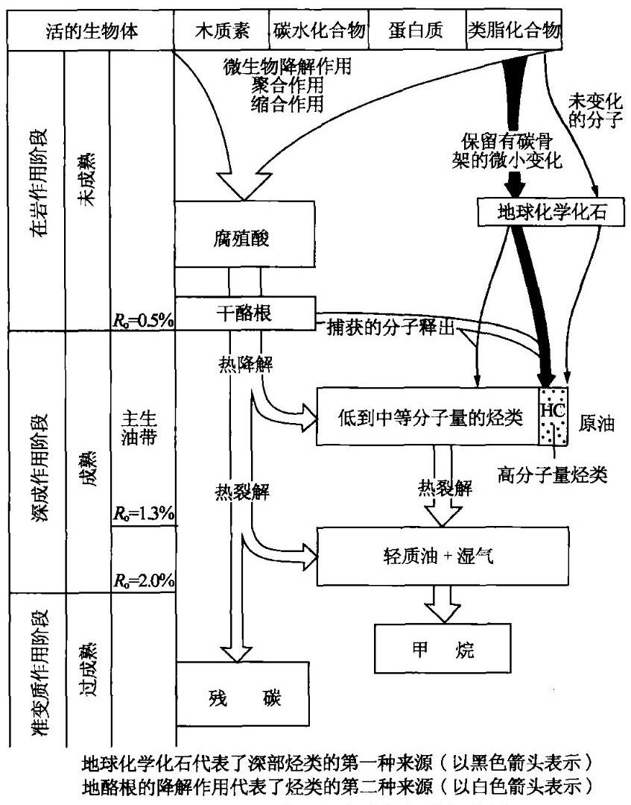

图 5-21 有机质的成岩演化与成烃作用

(据 Tissot & Welte, 1984, 有修改)

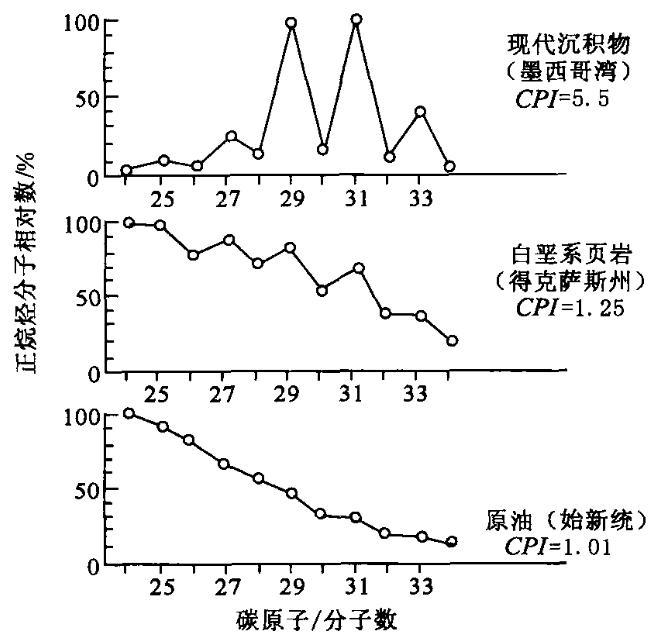

图 5-22 近代沉积物、古代沉积物、石油中正构烷烃的奇碳数优势变化

(据 Coper & Bray, 1963)

<!-- Media -->

## (二) 成熟阶段

此为干酪根生成油气的主要阶段。该阶段从有机质演化的门限值开始至生成石油和湿气结束为止, ${R}_{0}$ 为 ${0.5}\%  \sim  {2.0}\%$ 。干酪根随着埋深和地温的增加, 当达到门限深度和温度时, 在热力作用下, 通常还伴有粘土催化作用, 干酪根将开始大量降解生成石油, 后期热裂解生成轻质油和湿气, 因此, 该阶段也可称油和湿气阶段。

此阶段可按照干酪根的成熟度和成烃产物划分为 2 个带。油带 ${R}_{0}$ 为 ${0.5}\%  \sim  {1.3}\%$ , 又叫低一中成熟阶段(低成熟 ${R}_{\mathrm{o}}$ 为 ${0.5}\%  \sim$ ${0.7}\%$ ,中成熟 ${R}_{0}$ 为 ${0.7}\%  \sim  {1.3}\%$ ),干酪根通过热降解作用主要产生成熟的液态石油, 并以中一低分子量的烃类为主, 使成岩作用阶段的生物烃被稀释, 在正烷烃中, 生物烃带来的奇碳优势逐渐被成熟油冲淡直至消失, 环烷经和芳香烃的碳数和环数减少, 曲线由双峰变为单峰 (图 5-23)。

<!-- Media -->

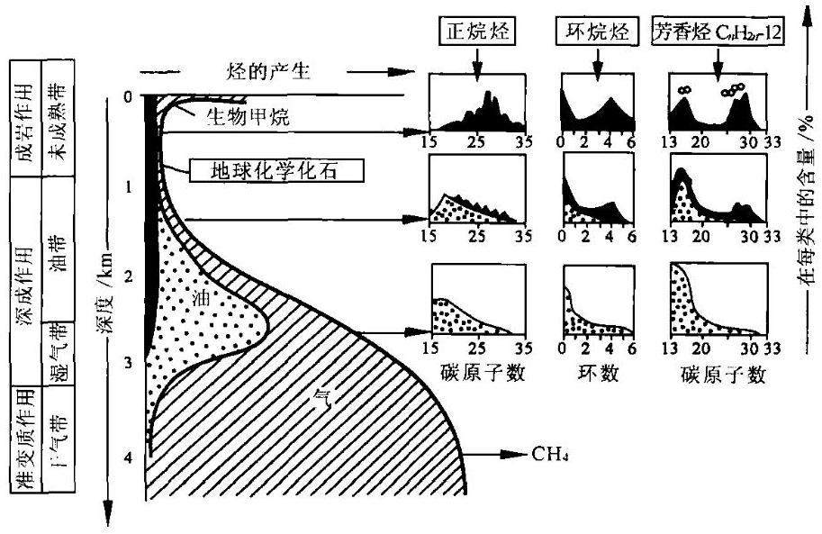

图 5-23 沉积有机质成烃演化一般模式图

(据 Tissot, 1974)

<!-- Media -->

轻质油和湿气带又叫高成熟阶段, 在较高温度作用下, 干酪根和已形成的石油将发生热裂解,特点是液态烃急剧减少, ${\mathrm{C}}_{1} - {\mathrm{C}}_{8}$ 的轻烃将迅速增加。另外,由于烷烃及低分子量烃逐渐增多, 胶质和沥青质逐渐减少乃至消失, 因而引起石油密度降低, 颜色变浅, 在地下条件适当时, 还可形成凝析气。

## (三) 过成熟阶段

该阶段埋深大、温度高, ${R}_{\mathrm{o}} &gt; {2.0}\%$ 。又由于在成熟阶段干酪根上的较长烷基链已消耗殆尽, 所以生油潜力枯竭, 只能在热裂解作用下生成高温甲烷。而且先前生成的轻质油和湿气也将裂解为热力学上最稳定的甲烷。干酪根释出甲烷后其本身将进一步缩聚为富碳的残余物。该阶段也称为热裂解干气阶段。

必须明确, 有机质成烃演化是一个连续过程, 对于现今某一烃源岩来说, 其演化可能处于该过程的某一阶段而已 (图 5-24); 各阶段在有机质成烃演化过程中是连续过渡的, 相应地化学反应和烃类产物是可以叠置交错的, 况且, 有机质类型不同, 其划分界线和烃类产物也会有所不同。实际上不可能用统一的指标去做出截然的划分; 这只是有机质抑或干酪根成烃演化的一般模式。

另外,据亨特等估算,大约 $7\%$ 的气烃、 $9\%$ 液态烃和 ${40}\%$ 的非烃化合物生成于成岩作用阶段; 气烃的 ${82}\%$ 、液烃的 ${91}\%$ 和非烃的 ${60}\%$ 生成于深成作用阶段; 气烃的 ${11}\%$ 和痕量的液烃与非烃生成于准变质阶段 (图 5-25)。总之, 油气烃的大部分是在有机质成熟阶段主要由热力作用所产生的,尤其以 ${60} \sim  {150}^{ \circ  }\mathrm{C}$ 的地温最为有利。所谓晚期成油说和干酪根热降解成油说正是出于这一基本事实。

<!-- Media -->

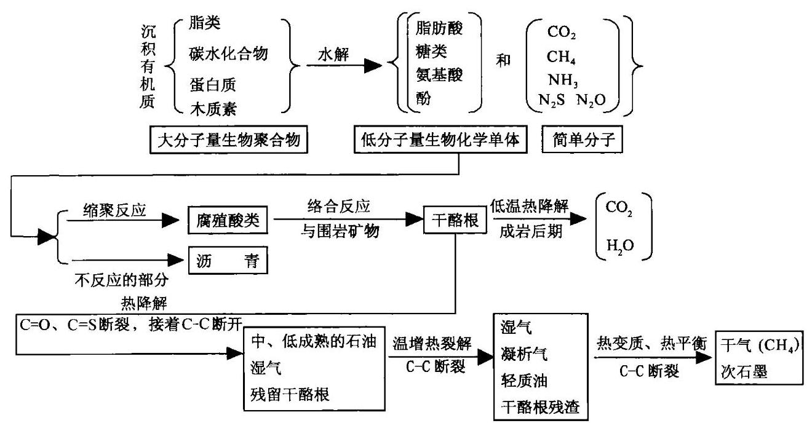

图 5-24 沉积有机质演化流程简图

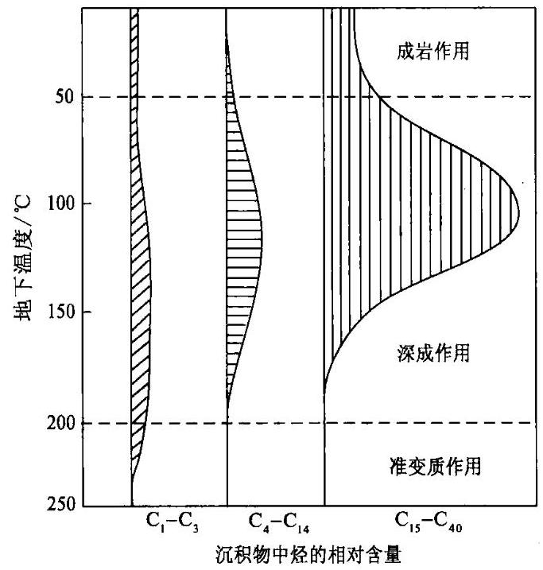

图 5-25 沉积物各成岩阶段烃类的相对含量

(据 Hunt, 1979)

<!-- Media -->

## 五、油气成因理论进展

由于原始有机质从沉积、埋藏到转化为石油和天然气是一个逐渐演化的过程, 不能由于晚期生油说的卓越贡献而完全排斥早期生油的可能性。在沉积有机质晚期生烃理论广泛为国际石油界所接受的同时, 在世界上许多国家的油气勘探实践中, 不断发现有 “未熟一低熟” 石油的存在, 即在根本不具备成熟烃源岩的地区发现了石油, 甚至在发育 “未熟一低熟” 烃源岩的地区, 已探明的石油储量超过成熟烃源岩的可能生油量。这表明自然界中确实还存在相当数量的各类早期生成的非常规油气资源, 这就是 “未熟一低熟油” 理论。这一理论的形成无疑将进一步充实与完善油气成因理论, 促使油气资源评价技术方法的改进和发展, 拓宽油气勘探领域。因而宜将早期与晚期生油说两种观点统一起来, 把原始有机质生成石油和天然气视为一个统一的发展演化过程 (据张厚福, 1999)。

近年来石油有机成因理论的又一进展是煤成烃理论的发展与完善。人们早就发现, 煤和煤系地层能够生成大量天然气并聚集成藏。但长期以来, 人们认为成煤环境不利于生油。20 世纪 60 年代以来, 在世界各地相继发现了一批与中、新生代煤系地层有关的油气田。这表明, 煤系地层不仅是世界上天然气的主要来源, 而且也能形成相当数量的石油聚集和大油田。近年来, 煤成油研究和勘探已经引起国内外学者的关注, 80 年代以来, 人们通过有机岩石学与地球化学相结合的方法和实验模拟对煤成油问题进行了深入的理论探讨, 提出了煤系地层有机质生烃机理和有机质演化模式 (据张厚福, 1999)。

## (一)未熟一低熟油形成理论

未熟一低熟油系指所有非干酪根晚期热降解成因的各种低温早熟的非常规油气, 包括在生物甲烷气生烃高峰之后,在埋藏升温达到干酪根晚期热降解大量生油之前 $\left( {{R}_{o} &lt; }\right.$ ${0.7}\% )$ ,经由不同生烃机制的低温生物化学或低温化学反应生成并释放出来的液态和气态烃。低熟油生成高峰阶段对应的源岩镜质组反射率 $\left( {R}_{\mathrm{o}}\right)$ 值大体在 ${0.2}\%  \sim  {0.7}\%$ 范围内, 相当于干酪根生烃模式的未成熟和低成熟阶段。

自 20 世纪 70 年代后期, 国外学者从地质分析和实验室研究等多方面人手探讨了低熟油气的成因机理, 并提出了不同的假说或模式, 如树脂体早期生烃、木栓质体早期生烃、 藻类生物类脂物早期生烃、干酪根早期降解生烃以及细菌作用等。许多国家和地区相继发现了低熟油气, 我国渤海湾、柴达木、准噶尔等盆地都发现了低熟油气资源。我国地球化学界对低熟油的认识和研究始于 20 世纪 80 年代初, 目前已取得了可喜的研究进展。王铁冠教授等在国内外研究成果的基础上, 通过对大量中国油气盆地的实例解剖, 分析了木栓质体、树脂体、细菌改造陆源有机质、藻类和高等植物生物类脂物以及富硫大分子(非烃、沥青质和干酪根)等五种不同原始母质的早期生烃机制。

## 1. 树脂体早期生烃

许多植物, 尤其是热带和温带针叶植物, 都可分泌出树脂, 随母体植物埋藏在沉积物 (岩) 中的树脂可转化成树脂体。此外高等植物的蜡质、香脂、香精油等也可作为树脂体的生源母质, 其中尤以树脂和蜡质最为重要。

在化学组成和分子结构上, 树脂体由挥发性和非挥发性萜类馏分组成。挥发性馏分包括单萜、倍半萜和某些二萜烯类,均不易保留在树脂中；非挥发性馏分主要为二萜烯酸类和三萜类, 此外还有醇类、醛类、酯类和树脂素等。树脂酸作为含羧基的非烃生物类脂物, 其化学成分、分子结构及聚合程度都比干酪根简单得多, 树脂酸脱羧基、加氢转化成环烷烃的化学反应所必需的活化能和热力学条件, 也较干酪根热降解生烃的条件低得多。 因此, 当干酪根尚处于未熟一低熟阶段时, 树脂体可能在低温条件下率先早期生烃。实验和实际地质资料也表明, 随着成熟度 (或实验温度) 的升高, 煤和烃源岩中, 无论是树脂体, 还是三环二萜烯树脂生源标志物都发生骤减。这也说明存在树脂体低温化学反应生烃的机理。

2. 木栓质体早期生烃

木栓质体来源于高等植物的木栓质组织。在木栓质组织中, 栓化层由木栓脂和蜡质交替叠合而成。木栓脂作为木栓质体的前生物, 具有低聚合度和多长链类脂物的特点, 决定了木栓质体可在低的热力学条件下, 发生低活化能的化学反应, 生成并释放以链状结构为主的烃类。

3. 细菌改造陆源有机质早期生烃

前人研究表明, 一些细菌与脂肪酸、蛋白质通过去羧基、去氨基作用等化学反应, 可得到类似石油的产物。沉积物沉积成岩过程中, 在适宜的介质环境条件下, 大量陆源有机质的存在, 可以为细菌繁衍提供充足的碳源和能源, 而细菌作用的结果又对陆源有机质进行降解改造, 细菌类脂物成分代谢产物的加入, 可反过来改造陆源有机质的结构, 增加其 $\mathrm{H}/\mathrm{C}$ 原子比,提高富氢程度和 “腐泥化” 程度,并使有机质热降解或热解聚、脱官能团与加氢生烃反应所需要的活化能降低, 从而有利于生成低熟油气。在某些低熟原油及烃源岩的饱和烃和芳烃馏分中, 细菌生物标志物十分丰富, 这也表明低熟油与细菌活动及其生源贡献密切相关。

## 4. 高等植物蜡质早期生烃

高等植物蜡质是指覆盖于植物茎、叶、花和果实表面的蜡状薄层。在化学组成上, 蜡质主要是一元长链脂肪酸和一元长链脂肪醇所形成的脂类,此外,还含有 ${\mathrm{C}}_{21} - {\mathrm{C}}_{27}$ 奇碳数正烷烃、 ${\mathrm{C}}_{24} - {\mathrm{C}}_{34}$ 偶碳数游离脂肪酸、长链单酮、伯醇和仲醇以及 $\beta$ - 羟酮等。蜡酯类易于水解形成长链脂肪酸和长链脂肪醇。所有含羧基、羟基和酮基官能团的长链化合物, 经脱官能团形成原油中 ${\mathrm{C}}_{22}$ . 正构烷烃,这类化学反应过程无需高活化能,可以在低温阶段完成。

## 5. 藻类类脂物早期生烃

藻类活体的细胞壁通常分内外两层, 内层为多糖成分的原纤维层内壁, 外层为三层结构的外壁。内壁包裹的细胞质中具有一些油珠, 外壁内镶嵌大小不等的油珠, 并不断分泌油状物质。这些油状物质构成藻类的储备类脂物, 其主要成分确定为脂肪酸和烃类。在化学成分上, 所有藻类均以蛋白质和脂肪物质含量比较高为特征。

藻类死亡埋藏后, 其细胞有机质和细胞内类脂物聚合成藻类体, 成为干酪根的重要成分, 而游离的油状物则作为藻的储备类脂物演化为可溶性的非烃 - 沥青质混合物, 存在于未成熟的有机藻或藻类体中。藻的生物类脂物均属分子结构简单的含氧官能团的非烃化合物及部分烃类, 未发生明显的聚合作用, 只要具备还原性的沉积成岩条件, 在低温化学反应阶段, 即可转化成链烷烃和环烷烃, 成为低熟油的主要成分。

## 6. 富硫大分子有机质早期降解生烃

干酪根中不同原子间的键能有明显差异,其中 $\mathrm{S} - \mathrm{S}$ 键平均键能约为 ${250}\mathrm{\;{kJ}}/\mathrm{{mol}}$ , $\mathrm{S} - \mathrm{C}$ 键约为 ${275}\mathrm{\;{kJ}}/\mathrm{{mol}}$ ,而 $\mathrm{C} - \mathrm{C}$ 键则为 ${350}\mathrm{\;{kJ}}/\mathrm{{mol}}$ ,因此,干酪根早期低温降解作用只能使 S---S 和 S---C 键断裂。由此可见, 只有富硫大分子有机质才能在干酪根早期降解阶段形成低熟油。生物体中本不富集硫和含硫化合物, 富硫大分子化合物的形成一般归结于早期成岩阶段无机硫与有机分子的加成反应, 并且要求具有还原性沉积环境。沉积盆地水体咸化至硫酸盐相阶段, 有硫酸盐沉积, 但硫酸盐中缺少铁, 沉积物中细菌还原硫酸盐提供一定数量的无机硫, 与具有两个双键的链烯烃有机分子起加成反应, 形成大量硫化物进入大分子有机质。因此, 硫酸盐相沉积环境有利于形成富硫大有机质, S-S 键、S-C 键的优先断裂机理有利于低熟油形成。

## (二) 煤成烃理论

目前, 人们已经普遍认识到煤系地层不仅能够生成天然气, 而且能够生油, 但是只有在特定的地质条件下, 才可以形成商业性油气藏, 甚至形成大规模的油气聚集。这些由煤和煤系地层中集中和分散的陆源有机质, 在煤化作用的同时所生成的液态烃类被称为煤成油。

1. 煤的有机组成及其成烃潜力

目前有机岩石学家和石油地球化学家普遍认为, 煤是生气还是生油及其生成液态烃的能力大小, 与煤的类型和显微组分组成密切相关。富含富氢显微组分无定形体、藻质体及其他壳质体的煤, 均有生成液态烃的能力; 而富含贫氢显微组分镜质组和惰质组的煤, 与 III 型干酪根相似, 以生气为主。在很大程度上, 煤的液态烃生成潜力取决于富氢组分壳质组含量的多少。煤的显微组分或生烃母质在相同成熟度时的 $\mathrm{H}/\mathrm{C}$ 原子比是决定煤生气或成油潜力的基本因素, 即壳质组的成油气潜力最大, 镜质组次之, 而惰质组最差。同时, 各种壳质组 (树脂体、角质体、孢子体和藻质体) 具有不同的生烃潜力、不同的生烃门限, 不同的产物组成和不同生油窗峰态和峰值。煤中主要显微组分的生油 (烃) 能力从大到小的顺序为: 壳质组、镜质组、惰质组。

王铁冠对采自我国 12 个盆地的煤样进行有机岩石学分析, 结果表明褐煤的显微组分以腐殖组为主 (占 ${60}\%  \sim  {92}\%$ ),含有相当数量的壳质组 (可达 ${14}\%  \sim  {24}\%$ ),而腐泥组和惰质组含量相当低。壳质组组分为壳屑体、树脂体、角质体和孢子体等, 树脂体含量达 $5\%$ 以上。壳质组 + 腐泥组含量达到 ${15}\%  \sim  {20}\%$ 。如吐哈盆地褐煤的显微组分以镜质组为主, 惰质组中以高含量的半丝质体为特征, 镜质组中以具暗褐色至棕色荧光的镜质组为主。壳质组含量与其他地区的煤相比并无特别之处, 但却富含木栓质体、角质体和孢子体而引人注目。

## 2. 煤成烃的地球化学特征

煤成烃一般具有饱和烃含量高、非烃和沥青质含量低的特点。如澳大利亚和加拿大典型的煤成油,非烃 + 沥青质小于 ${10}\%$ ,这与煤的抽提物组成相反。我国煤成油的组成也具有类似的特征,饱和烃含量较高,可达 ${50}\%  \sim  {80}\%$ 。正构烷烃中高碳数组成含量高, 在正构烷烃的奇偶优势、主峰碳、碳数分布范围及其随成熟度的演化等方面, 煤成烃与一般的陆源石油基本相似,但往往煤成油的高碳数峰更为突出, ${CPI}$ 值较高。煤成烃最明显的特征是具有姥鲛烷优势 $\left( {\mathrm{{Pr}}/\mathrm{{Ph}} &gt; 2}\right)$ ,这与成煤的早期环境的偏氧化性有关。高等植物生源的环烷烃及其衍生物,富含三萜烷,具明显的藿烷类和 ${\mathrm{C}}_{29}$ 甾烷的优势,含有比较丰富的各种芳香烃类。煤成油的碳同位素组成以高子 ${\delta }^{13}\mathrm{C}$ 值为特征,一般为 $- {27}\% o \sim$ $- {25}\% o$ ,多数出现在 $- {26.50}\% o \sim   - {26.00}\% o$ 。

## 3. 煤的生烃模式

沥青化作用是煤的显微组分的主要演化途径, 沥青化作用的结果, 一方面是产生石油和天然气; 另一方面是固体残余产物进行芳构化和缩聚作用。煤中不同显微组分沥青化作用是不一致的。由于煤中各显微组分发生沥青化作用的时期不同, 其生烃特征和演化模式存在差异 (图 5-26), 造成煤中液态烃的生成具有多阶段性, 因此, 不同演化阶段各种显微组分对生烃的贡献有别。例如, 吐哈盆地煤成烃存在两个显著的生烃阶段, 基质镜质组和木栓质体的主要生烃阶段发生在未熟一早期成熟阶段 $\left( {{R}_{0}\text{为}{0.4}\%  \sim  {0.7}\% }\right)$ ; 而角质体和孢子体则在晚期成熟阶段 $\left( {R}_{0}\right.$ 为 ${0.5}\%  \sim  {0.7}\%$ ,主生油期 ${R}_{0}$ 为 ${0.9}\%$ )。

<!-- Media -->

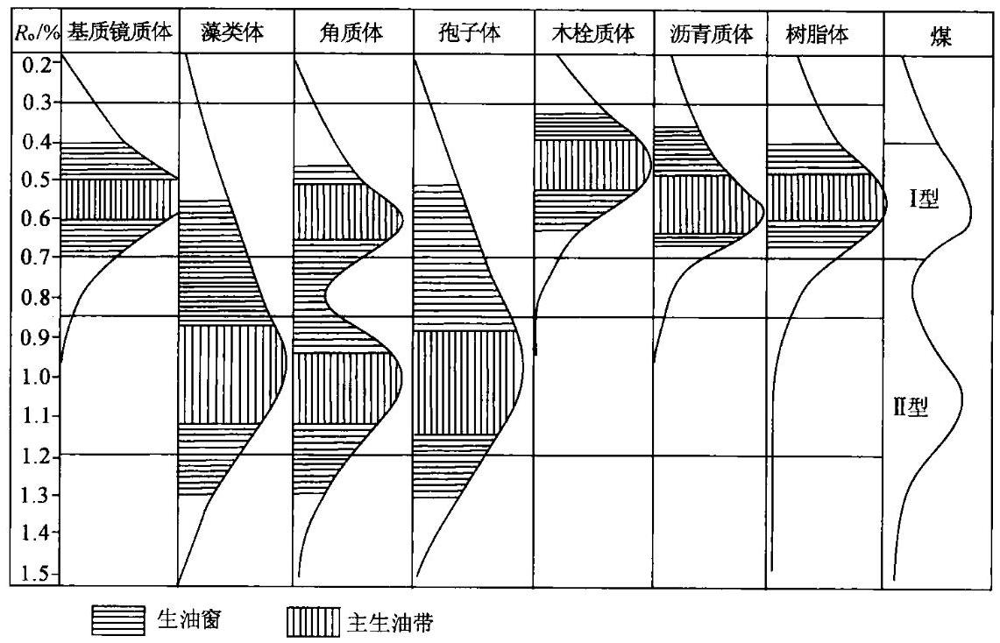

图 5-26 煤中不同显微组分生烃模式

(据程克明, 1995)

<!-- Media -->

## 第三节 天然气成因类型与判别

天然气按其成分可分为烃气和非烃气。狭义的天然气常指以烃类为主体的天然气。烃气的来源有多种途径, 可以是由沉积物中分散有机质经微生物降解、热解作用所形成; 也可以由石油、油页岩和低阶煤(泥炭及褐煤)等可燃有机矿产的进一步热解所形成。此外,还有数量不等的烃气是深部无机成因气。天然气中常见的非烃气有 ${\mathrm{{CO}}}_{2}\text{、}{\mathrm{\;N}}_{2}\text{、}{\mathrm{\;H}}_{2}\mathrm{\;S}$ 、 ${\mathrm{H}}_{2}\text{、}\mathrm{{He}}\text{、}\mathrm{{Ar}}$ 等气体。它们可以由有机质在微生物降解、热解过程中形成; 也可以是岩石或地壳内部物质的化学反应、放射性蜕变、脱气作用的产物; 部分也可能来源于大气的渗入。由此也可以说天然气是以烃气为主体的各种来源气体的混合物。

Hunt (1979) 对构成天然气组成的各种来源按主次顺序列于表 5-4 中。天然气(主要指烃气)根据形成机理可分为有机成因气和无机成因气两大类。其中以有机成因气研究得较为深入。

## 一、天然气的成因类型及特点

根据形成机理, 天然气可划分为有机成因气和无机成因气两大类。所谓有机成因气是指分散的沉积有机质或可燃有机矿产 (油、煤和油页岩), 在其成岩成熟过程中, 由微生物降解和热解作用形成的以烃气为主的天然气, 就目前的研究程度来看, 现今发现的天然气绝大部分属于有机成因气。显然, 这是一个非常庞大的类型。由前面的叙述可知, 根据成气的主要作用因素, 可进一步将有机成因气分为生物成因气 (包括成岩气) 和热解气, 后者是有机成因气的主体。还可根据成气有机质类型的不同再进一步划分: 将由成油有机质 (I、II 型干酪根) 形成与石油相伴生成的天然气称为油型气; 而将Ⅲ型干酪根和成煤有机质在成煤变质过程中形成的天然气称为煤型气。这样就将天然气划分为四种基本的成因类型, 即生物成因气、油型气、煤型气和无机成因气 (表 5-5)。

<!-- Media -->

表 5-4 天然气组成的来源

<table><thead><tr><th rowspan="2">来源</th><th colspan="6">各种主要来源的可能次序 (重要性依数字增大而减小)</th></tr><tr><th>${\mathrm{{CH}}}_{4}$</th><th>${\mathrm{{CO}}}_{2}$</th><th>${\mathrm{N}}_{2}$</th><th>${\mathrm{H}}_{2}\mathrm{\;S}$</th><th>He</th><th>${\mathrm{H}}_{2}$</th></tr></thead><tr><td>沉积有机质的热解</td><td>1</td><td>1</td><td>1</td><td>1</td><td/><td>1</td></tr><tr><td>沉积有机质的微生物降解</td><td>2</td><td>4</td><td/><td/><td/><td/></tr><tr><td>煤层的成熟作用</td><td>4</td><td>3</td><td>2</td><td/><td/><td/></tr><tr><td>储集层石油和沥青的热转化</td><td>3</td><td/><td/><td>2</td><td/><td/></tr><tr><td>火成岩、变质岩气体扩散</td><td/><td/><td>3</td><td/><td>1</td><td/></tr><tr><td>碳酸盐的热分解</td><td/><td>3</td><td/><td/><td/><td/></tr><tr><td>沉积物捕获的空气</td><td/><td/><td>4</td><td/><td/><td/></tr></table>

<!-- Media -->

(据 J. M. Hunt, 1979)

<!-- Media -->

表 5-5 天然气成因类型

<table><thead><tr><th>分类依据</th><th>形成机理</th><th>主要作用因素</th><th>有机质类型</th></tr></thead><tr><td rowspan="4">天然气</td><td rowspan="3">有机成因气</td><td>生物成因气(生物化学作用)</td><td/></tr><tr><td rowspan="2">热解气 (温度 - 热力作用)</td><td>油型气( I 、 II 型干酪根)</td></tr><tr><td>煤型气(煤、Ⅲ型干酪根)</td></tr><tr><td>无机成因气</td><td/><td/></tr></table>

<!-- Media -->

## (一) 生物成因气

生物成因气是有机质在还原环境下主要由微生物降解、发酵和合成作用形成的以甲烷为主的天然气, 有时也包括 (或混有) 部分早期低温降解作用形成的甲烷气和数量不等的重烃气。

生物成因气形成过程包括一系列复杂的生物化学作用。这一过程从浅处的微生物喜氧呼吸的代谢作用开始, 游离氧被消耗, 从而进入硫酸盐还原带的厌氧呼吸阶段, 使硫酸盐还原为 ${\mathrm{H}}_{2}\mathrm{\;S}$ ; 当继续进入缺硫酸盐的碳酸盐还原带时,在严格的厌氧环境中,微生物发酵作用使不溶有机质(生物聚合物)在酶的作用下变成可溶有机质, 进而在产酸菌和产氢菌的作用下变为挥发性有机酸、 ${\mathrm{H}}_{2}$ 和 ${\mathrm{{CO}}}_{2};{\mathrm{H}}_{2}$ 和 ${\mathrm{{CO}}}_{2}$ 在甲烷菌的作用下,最终合成甲烷。 因此, 碳酸盐还原带是生成生物甲烷的主要生化带 (图 5-27)。

富含硫酸盐的强还原环境, 特别是沉积腐泥型有机质的强还原环境, 对产甲烷菌有明显的抑制作用,有机质不易分解出 ${\mathrm{H}}_{2}$ 和 ${\mathrm{{CO}}}_{2}$ ,使生物成因气不能大量生成。在陆相环境中, 由于淡水湖泊盐度低, 缺少硫酸盐类矿物, 腐殖型和混合型有机质易被分解成 ${\mathrm{H}}_{2}$ 和 ${\mathrm{{CO}}}_{2}$ ,并有利于甲烷菌繁殖。 甲烷在靠近地表不深的地带即可形成, 但由于埋深太浅, 大部分被散失或氧化, 不易形成规模较大的生物成因气藏。在低气温的极地和深海, 浅层形成的烃气可与水结合形成固态气一水合物。在半咸水和咸水湖, 尤其是碱性咸水湖有利于有机质保存。 直到埋藏一定深度后, 有机质才大量分解并使产甲烷菌大量繁殖, 合成的甲烷在适当的条件下可聚集成较大规模的气藏。因此, 富含腐殖型和混合型有机质的浅海和海陆交互相带, 寒冷的极地和深海以及大陆干旱 - 半干旱的咸水湖泊都是生物成因气形成的有利沉积环境。

<!-- Media -->

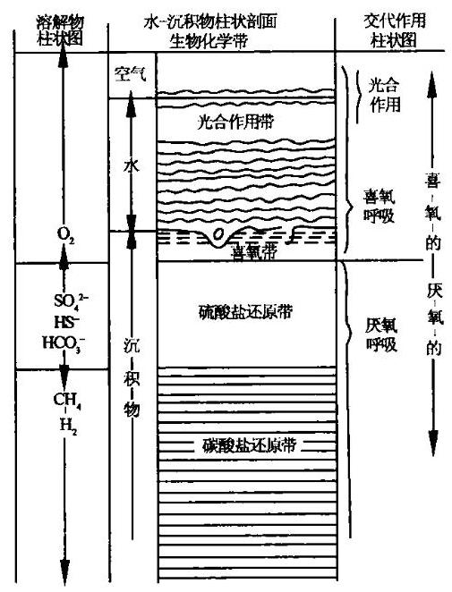

图 5-27 富含有机质的敞开海沉积物中微生物代谢作用的生化环境剖面图 (据 Rice & Claypool, 1981)

图中碳酸盐还原带是生成甲烷的主要生化带

<!-- Media -->

有利于生物气形成的因素可大致归纳为: ①有丰富的有机质; ② 严格的缺氧、缺硫酸盐环境; ③ $\mathrm{{pH}}$ 值以接近中性为宜; ④温度在 ${35} \sim  {42}^{ \circ  }\mathrm{C}$ 为最佳。 $\mathrm{{pH}}$ 值低于 6.0 或高于 8.0,甲烷菌生长和甲烷气产率都会有明显减少; 甚至会使甲烷菌中毒,发酵停滞。即使发酵好了,也可能缺 ${\mathrm{{CO}}}_{2};\mathrm{{pH}}$ 值接近 8.0 时, ${\mathrm{{CO}}}_{2}$ 溶解度趋近于 0,也不能生成 ${\mathrm{{CH}}}_{4}$ 。虽然有资料表明,产甲烷细菌可以在温度高于 ${100}^{ \circ  }\mathrm{C}$ 时仍能成活,但模拟实验显示,适合甲烷菌大量繁殖并生成甲烷的温度一般低于 ${75}\mathrm{\;C}$ 。在低于 ${75}^{ \circ  }\mathrm{C}$ 的条件下,甲烷的产率随温度上升而增加。主生气带在 ${25} \sim  {65}^{ \circ  }\mathrm{C}$ 之间(关德师和戚厚发等,1997)。根据发酵的温度,可分低温发酵 $\left( { &lt; {28}^{ \circ  }\mathrm{C}}\right)$ ,中温发酵 $\left( {{28} - {42}^{ \circ  }\text{ C }}\right)$ 和高温发酵 $\left( { &gt; {42}^{ \circ  }\mathrm{C}}\right)$ ; 一般高温发酵具有较高的甲烷产率,因为高温发酵不仅能使有机质较快地转化生成甲烷 (或许包含有低温热解的因素), 而且有新的甲烷细菌群体出现, 产酸和产氢菌类型也有较大改善。

生物成因气化学组成,除个别含 ${\mathrm{N}}_{2}$ 较多的天然气外, ${\mathrm{{CH}}}_{4}$ 含量一般大于 ${98}\%$ ,有的甚至在 ${99}\%$ 以上。重烃含量低,一般少于 ${0.2}\%$ ,个别可达 $1\%  \sim  2\% {\mathrm{{oC}}}_{1}/{\mathrm{C}}_{2}^{ + }$ (干燥系数) 一般在数百以上到数千不等, 为典型的干气。重烃含量一般随埋藏深度的增加而增加,这已被深海钻探计划提交的研究成果所证实。一般认为重烃含量在 $2\%$ 以上者大多有热成因气掺和。

生物成因气的 ${\delta }^{13}{\mathrm{C}}_{1}$ 值一般为 $- {85}\% o \sim   - {60}\%$ 。(亦有以 $- {55}\% o$ 或 $- {58}\% o$ 为上限者) 之间,最低可为 $- {90}\%$ 。若有深部热成因气的加入, ${\delta }^{13}{\mathrm{C}}_{1}$ 值可升高达 $- {50}\% o \sim   - {45}\% o$ . 腐殖母质的生物成因气其 ${\delta }^{13}\mathrm{C}$ 值约为 $- {80}\%  \sim  {58}\%$ 。有机质进入沉积域后,经过微生物的发酵作用一直到合成甲烷气的过程,实际上都是 ${}^{12}\mathrm{C}$ 富集的过程。故生物成因气中甲烷的 ${}^{13}\mathrm{C}$ 含量很低,因而 ${\delta }^{13}{\mathrm{C}}_{1}$ 值的负值大。生物成因气的 ${\delta }^{13}{\mathrm{C}}_{1}$ 值随埋藏深度的增加会有所升高。这不仅与少量低温热解成因气的形成有关, 也与深部热解成因气的向上运移有关。

目前已发现的生物成因气储量大致占世界已发现天然气总储量的 ${20}\%$ 左右。其中大约 ${80}\%$ 在俄罗斯,而俄罗斯的大部分又是在西西伯利亚地区,其勘探前景不可低估。

## (二) 油型气

油型气指成油有机质(腐泥型和混合型干酪根)在热力作用下以及石油热裂解形成的各种天然气, 主要包括石油伴生气、凝析油伴生气和热裂解干气。成油有机质的热演化成烃过程用 ${R}_{o}$ 来表示其阶段和主要产物 (图 5-28)。

<!-- Media -->

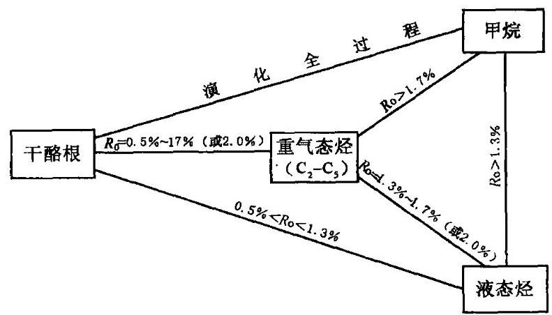

图 5-28 有机质成烃演化条件的模式图

<!-- Media -->

成油有机质成熟演化过程中产生的天然气以烃气为主, 但仍有数量不等的非烃气。 ${\mathrm{{CO}}}_{2}$ 主要形成于深成作用阶段的早中期, ${\mathrm{N}}_{2}$ 主要形成于深成阶段的中期, ${\mathrm{H}}_{2}\mathrm{\;S}$ 主要形成于深成阶段中期到准变质阶段。产气高峰在深成作用的中晚期, 这是因为深成作用中晚期成油有机质液态烃产率明显降低, 而产气率逐渐增加, 与此同时已生成的液态烃, 开始裂解成气, 两种成气作用叠加的结果, 使产烃气率大增, 形成产气高峰。

与成油有机质演化有关的天然气(烃和非烃)随深度的生成模式, 如图 5-29 所示。

成油有机质热降解作用所形成的石油伴生气和热裂解成因干气, 都是在较高温度 (超过门限温度) 下参与热化学反应形成的。石油和凝析油伴生气在化学组成上的基本特点是重烃含量高,一般大于 $5\%$ ; 最高可达 ${40}\%  \sim  {50}\%$ ,甚至可超过甲烷含量。而且 $i{\mathrm{C}}_{4}/n{\mathrm{C}}_{4}$ 常小于 1 。过成熟干气则以甲烷为主,很少重烃 $\left( { \leq  2\% }\right)$ 。 两者在碳同位素组成上亦有明显差别,由石油伴生气 $\rightarrow$ 凝析油伴生气 $\rightarrow$ 过成熟干气向 ${}^{13}\mathrm{C}$ 逐渐富集, ${\delta }^{13}{\mathrm{C}}_{1}$ 值增大。分别为 $- {55}\% o \sim   - {40}\% o, - {45}\% o \sim   - {30}\% o, - {35}\% o$ 。 不同演化阶段天然气 ${\delta }^{13}{\mathrm{C}}_{1}$ 值的分布区间只是概略的, 实际情况变化范围可能更大些。此外还必须指出, 在原油开始裂解时形成的天然气具有较低的 ${\delta }^{13}{\mathrm{C}}_{1}$ 值,甚至比石油伴生气更低些 $\left( {{\delta }^{13}{\mathrm{C}}_{1}\text{值约为} - {60}\% o \sim  {50}\% o}\right)$ 。

<!-- Media -->

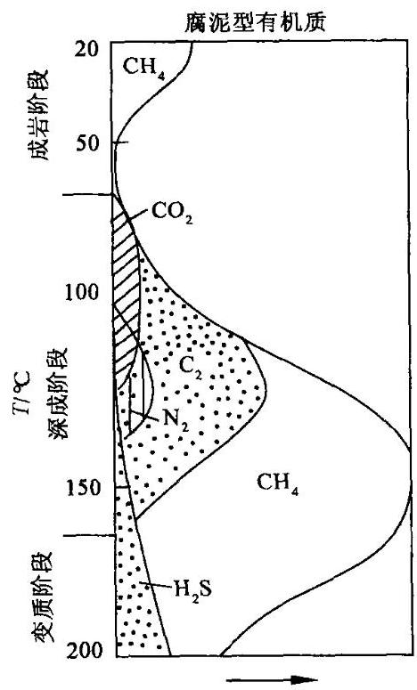

图 5-29 与成油有机质演化有关的天然气(烃和非烃)生成模式图 (转引自陈荣书, 1994)

<!-- Media -->

## (三) 煤型气

指腐殖煤及腐殖型煤系有机质在变质作用阶段形成的天然气。其含义与腐泥型有机质在成油演化过程中形成的天然气称为油型气相对应, 又称煤系气、煤成气等。

煤系又称含煤岩系, 它是指以含有煤层和煤线为特征的沉积岩系。当腐殖有机质高度聚集时便形成腐殖煤,而当其分散存在时便形成暗色泥岩和炭质泥岩,一般把有机碳含量 $\leq  {15}\%$ 的称暗色泥岩,在 ${15}\%  \sim  {30}\%$ 之间称炭质泥岩, $&gt; {30}\%$ 时叫煤。

腐殖煤及腐殖型干酪根显微镜下观察有 3 组煤岩显微组成, 即镜质组、惰质组和壳质组。镜质组是最主要的组成, 它是植物茎、叶等木质纤维组织通过分解和凝胶化作用而形成的, 有结构镜质组和无结构镜质组。惰质组又称丝质组, 是木质纤维被焚烧或经脱水强氧化后而形成, 具丝炭状细胞结构。壳质组也称稳定组, 包括孢粉、树脂体、角质体和木栓体等, 它们常具清晰的特殊形态和光学性质。上述 3 种煤岩组分中, 挥发分含量以壳质组最多, 其次为镜质组, 再次为惰质组。壳质组在成煤所有阶段均有烃类生成, 镜质组仅从气煤 - 肥煤阶段才开始生烃,而惰质组则从贫煤 $\left( {{R}_{\mathrm{o}} &gt; {1.9}\% }\right)$ 阶段才产生甲烷。 3 种煤岩组分和几种植物组成的元素分析见图 5-30。

<!-- Media -->

图 5-30 煤岩显微组分和植物组成的 $\mathrm{H}/\mathrm{C}$ 与 $\mathrm{O}/\mathrm{C}$ 原子比相关图

(据 Tissot 等, 1984)

<!-- Media -->

腐殖有机质的基本结构是带有许多脂肪族短侧链和杂原子官能团的缩合稠环芳烃体系。稠环有较大的稳定性, 但侧链和官能团与稠环之间的结合力较弱, 热稳定性小, 故在不断埋藏和升温过程中逐渐发生脱落, 分解形成 ${\mathrm{{CO}}}_{2}\text{、}{\mathrm{H}}_{2}\mathrm{O}\text{、}{\mathrm{\;N}}_{2}\text{、}{\mathrm{{CH}}}_{4}$ 及其同系物等分子简单的挥发物质。

成煤作用的阶段可划分为泥炭化作用和煤化作用两大阶段, 前者指高等植物主要在生物化学作用下转变成泥炭的过程。后者又分为成岩作用和变质作用阶段, 成岩作用阶段是从泥炭到褐煤的过程, 而变质作用阶段主要是在热力作用下由褐煤依次转变为长焰煤、气煤、肥煤、焦煤、瘦煤和贫煤等烟煤至无烟煤的过程。从泥炭到无烟煤的元素组成如图 5-31 所示。

泥炭化阶段所生成的生物成因气因缺乏保存条件而难以形成聚集。与成油母质相比, 腐殖型有机质在成岩作用阶段形成的生物成因气, 非烃气含量较高。进入变质作用阶段所形成的天然气称煤型气。其中气煤 - 肥煤阶段 $\left( {{R}_{0}\text{约}{0.65}\%  \sim  {1.2}\% }\right)$ 为生成轻质油和 ${\mathrm{C}}_{2} - {\mathrm{C}}_{4}$ 重烃气的高峰期,从焦煤或瘦煤开始 $\left( {{R}_{o} = {1.5}\% \text{或}{1.7}\% }\right)$ ,为煤型裂解气主要生成阶段。煤型气中非烃气以 ${\mathrm{{CO}}}_{2}$ 生成量最大, ${\mathrm{N}}_{2}$ 次之, ${\mathrm{H}}_{2}\mathrm{\;S}$ 最少; 无锡石油地质中心实验室对不同岩性、不同类型有机质进行了大量的成气热模拟实验和实际资料的研究, 得出了主要生气阶段和生气高峰时 ${R}_{\mathrm{o}}$ 值的分布和其母质的 $\mathrm{H}/\mathrm{C}$ 原子比值,如图 5-32 所示。

<!-- Media -->

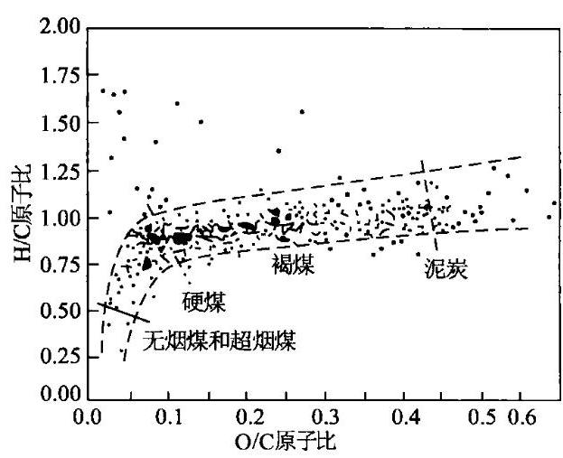

图 5-31 在埋藏过程中从泥炭到无烟煤的元素组成演化

(据 Durand 等, 1983)

<!-- Media -->

煤型气的化学组成中重烃气含量有时可达 ${10}\%$ 以上,甲烷气一般占 ${70}\%  \sim  {95}\%$ 。非烃气中普遍含 ${\mathrm{N}}_{2}$ 和 $\mathrm{{Hg}}$ 蒸气,也常含 ${\mathrm{{CO}}}_{2}$ ,但贫 ${\mathrm{H}}_{2}\mathrm{\;S}$ 。据戴金星等 (1985) 资料,我国煤型气的 ${\delta }^{13}{\mathrm{C}}_{1}$ 值为 $- {41.8}\% o \sim   - {24.9}\% o;{\delta }^{13}{\mathrm{C}}_{2}$ 值为 $- {27.09}\% o \sim   - {23.81}\% o$ ,平均值为 $- {25.78}\% o;{\delta }^{13}{\mathrm{C}}_{3}$ 值为 $- {25.72}\% o \sim   - {19.16}\% o$ ,平均值为 $- {23.45}\% o$ 。

<!-- Media -->

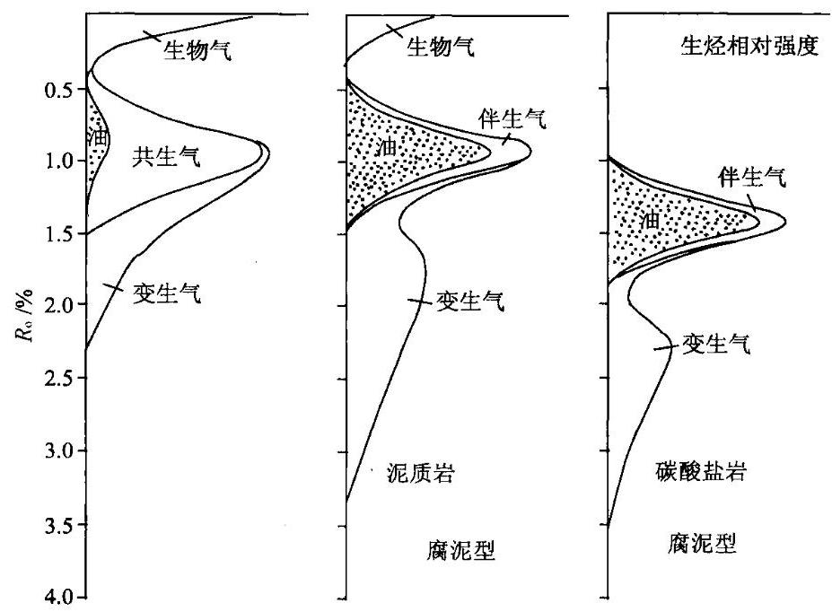

图 5-32 天然气生成模式图

(据张义纲等, 1991)

<!-- Media -->

(四) 无机成因气

对于无机成因气, 前面在论及烃类的无机成因中已有所涉及。在此仅就 “气” 的无机成因问题进行讨论。

Wclham and Craig (1979) 在东太平洋海隆热液喷出口观测到射出的甲烷气, 从实践上证实了地球内部大量深源无机成因甲烷气的客观存在。在加勒比海深大断裂附近, 曾测得规模更大的甲烷气,外逸气中还含有少量乙烷和丙烷 $\left( {\mathrm{C}}_{2}^{ + }\right.$ 含量达 ${0.5}\% )$ 。在 ${6300}\mathrm{\;m}$ 深处的甲烷浓度为标准海水中甲烷浓度的 5000 倍,每 10 日逸出量达 $1 \times  {10}^{6}{\mathrm{\;m}}^{3}$ 。

海洋沉积物中广泛分布的甲烷水合物, 数量巨大, 甚至连赞成有机成因的研究者 (Claypool and Kaplan, 1974) 也承认难以单用细菌作用生成甲烷来解释。而深源无机成因说可提供符合实际情况的解释——由深部形成的甲烷在向地表运移过程中被捕集于泥质沉积物中,在适当温压条件下转变为气水合物。但气水合物中 ${\delta }^{13}{\mathrm{C}}_{1}$ 值一般较低,这可能是由于甲烷在浅层氧化过程中 ${}^{13}\mathrm{C}$ 贫化(同位素交换作用使 ${}^{13}\mathrm{C}$ 富集于 ${\mathrm{{CO}}}_{2}$ 中)所致。

关于深源无机成因气的形成机理, 据 French (1966)、Nordlie (1971)、Gerlach (1980) 和 Holloway (1981) 等对地壳内部岩浆作用的热力学模型的研究结果认为, 地壳内部甲烷的稳定性取决于温度、压力和氧的化学有效性。氧的化学有效性用 “逸度” 表示。高逸度值有利于形成 ${\mathrm{H}}_{2}\mathrm{O}\text{、}{\mathrm{{CO}}}_{2}$ 和 ${\mathrm{{SO}}}_{2}$ ,低逸度值有利于还原型化合物如 ${\mathrm{H}}_{2}\mathrm{\;S}\text{、}{\mathrm{H}}_{2}$ 和 ${\mathrm{{CH}}}_{4}$ 等的形成和保存。

根据对地幔排气作用的综合研究结果认为, 地幔排气过程依其特点可分为两种基本类型: 即较高温度、较高氧逸度、较小压力的热排气过程和较低温度、较低氧逸度、较大压力的冷排气过程。前者地幔气以 ${\mathrm{H}}_{2}\mathrm{O}$ 和 ${\mathrm{{CO}}}_{2}$ 为主,后者则以 ${\mathrm{{CH}}}_{4}$ 和 ${\mathrm{H}}_{2}$ 为主(陈荣书, 1989)。前者相当于火山喷气, 后者则相当于岩浆侵入上覆岩层中的脱气作用。

化学组成一般以甲烷占优势, ${\mathrm{C}}_{2}^{ + }$ 含量很少,一般 $&lt; 1\%$ 。常可见少量到微量的烯烃 (乙烯或丙烯),且氢、氮、二氧化碳、一氧化碳及氦气含量较高。烃气中 ${\delta }^{13}{\mathrm{C}}_{1}$ 值变化范围大,从 $- 2\% o \sim   - {41}\% o$ 都有,但以 $- {15}\% o \sim   - {35}\% o$ 区间最为普遍。一般以 ${\delta }^{13}{\mathrm{C}}_{1}$ 值 $&gt;$ $- {20}\%$ o作为无机成因气的较可靠证据。

目前发现纯粹的无机成因气藏 (田) 不多, 但已发现了许多混有无机成因气的气田。 如美国中部大陆本得隆起等气田,氮含量高达 ${80}\%  \sim  {90}\%$ ,伴有 $7\%  \sim  9\%$ 的氦,推断这种气体同深源岩浆成因有关; 在俄罗斯科拉半岛钻入超基性岩体的井内, 发现含氮量 ${20}\%  \sim  {40}\%$ 、含氦量 ${0.6}\%  \sim  {3.7}\%$ 的天然气,从这种天然气的地质产状及氮 - 氦组合来看均表明是岩浆成因。我国东营凹陷平方王油田下第三系所产天然气,二氧化碳含量达 ${63}\%  \sim  {66}\%$ ,系喜马拉雅期玄武岩与石灰岩接触后碳酸钙的热分解所致。匈牙利潘农盆地米哈伊气田,呈不整合直接覆盖在结晶基岩之上的第三系砂层上,产出的天然气中 ${\mathrm{{CO}}}_{2}$ 含量达 ${95}\% ,{\mathrm{{CH}}}_{4}$ 仅 ${4.5}\%$ ,可能来自结晶基岩深处。

<!-- Media -->

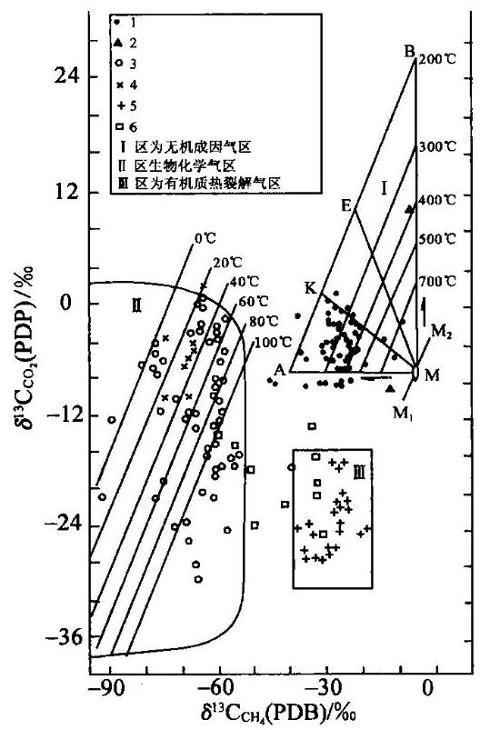

图 5-33 自然界 ${\mathrm{{CH}}}_{4}$ 与 ${\mathrm{{CO}}}_{2}$ 共生体系的 ${\delta }^{13}{\mathrm{C}}_{{\mathrm{{CH}}}_{4}}$ 和 ${\delta }^{13}{\mathrm{C}}_{{\mathrm{{CO}}}_{2}}$ 分布图 (据 Γyuāло, 1981)

1 一热液系统; 2 一火山岩矿物中的包裹体; 3 一沉积物及冰川沉积物; 4 一日本气田;

5 - 泥质岩和煤中有机质热解气; 6 一煤层中解吸气

<!-- Media -->

## 二、天然气成因类型判别

地壳中的天然气, 绝大部分是气体化合物与气体元素的混合物, 只有个别特殊情况下才由单一气体组成。因此, 识别天然气的成因类型, 应该是对天然气中各种组分的成因都进行识别, 但这样要花费大量的时间和财力, 所以, 一般只鉴别天然气中几个主要组分的成因类型。 欲寻求统一的标准来识别各种不同类型的天然气, 目前尚难做到。下面仅介绍几种有代表性的判别方法。

(一) ${\delta }^{13}{\mathrm{C}}_{1} - {\delta }^{13}{\mathrm{C}}_{{\mathrm{{CO}}}_{2}}$ 分类图版

Гyuraло(1981)从 ${\mathrm{{CH}}}_{4}$ 与 ${\mathrm{{CO}}}_{2}$ 共生体系碳同位素热平衡原理出发,以世界上已有 ${\mathrm{{CH}}}_{4}$ 与 ${\mathrm{{CO}}}_{2}$ 共生体系中测得的 ${\delta }^{13}{\mathrm{C}}_{1}$ 和 ${\delta }^{13}{\mathrm{C}}_{{\mathrm{{CO}}}_{2}}$ 为依据, 将自然界不同成因类型的 ${\mathrm{{CH}}}_{4}$ 与 ${\mathrm{{CO}}}_{2}$ 共生体系划分为三个区 (图 5-33)。图中所标温度是天然气形成温度, 它是作者据 Craig (1953) 提出的 ${\mathrm{{CH}}}_{4}$ 与 ${\mathrm{{CO}}}_{2}$ 碳同位素热平衡原理的近似方程得出的计算值。

$\mathrm{I}$ 区为无机成因气区。该区的 ${\delta }^{13}{\mathrm{C}}_{1}$ 为 $- {41}\% o \sim   - 7\% o,{\delta }^{13}{\mathrm{C}}_{{\mathrm{{CO}}}_{2}}$ 为 $- 7\% o \sim  {27}\% o$ (在 $0\%$ o附近特别集中)。洋脊喷出气、温泉气、 火山气和各种岩浆岩和宇宙物质包裹体中的气体均属此区。

II 区为生物化学气区。该区的 ${\delta }^{13}{\mathrm{C}}_{1}$ 为 $- {92}\% o \sim   - {54}\% o,{\delta }^{13}{\mathrm{C}}_{{\mathrm{{CO}}}_{2}}$ 为 $- {36}\% o \sim  1\% o$ 。世界上浅层生物成因气、现代沉积物中所有的 ${\mathrm{{CH}}}_{4}$ 与 ${\mathrm{{CO}}}_{2}$ 共存的天然气均属此区。

III区为有机质热裂解气区。该区的 ${\delta }^{13}{\mathrm{C}}_{1}$ 为 $- {40}\% o \sim   - {19}\% o,{\delta }^{13}{\mathrm{C}}_{{\mathrm{{CO}}}_{2}}$ 为 $- {30}\% o \sim$ $- {16}\%$ 。沉积岩中的分散有机质、泥炭、煤和石油的热裂解气均落于此区。

该分类图版可以把天然气的来源粗略分为三种成因。随着样品数量的增多, 三者界线可能有所变化, 但该图版仍有很大的参考价值。 (二) ${\delta }^{13}{\mathrm{C}}_{1} - {R}_{\mathrm{o}}$ 分类图版

Stahl (1974) 根据世界各地大量天然气样品的 ${\delta }^{13}{\mathrm{C}}_{1}$ 及其母岩 ${R}_{\mathrm{o}}$ 的测定,发现两者具有良好的相关性。这种相关性与母岩的有机质类型有关。Stahl 分别建立了腐殖型和腐泥型烃源岩的 ${R}_{0}$ 与其形成天然气的 ${\delta }^{13}{\mathrm{C}}_{1}$ 关系曲线 (图 5-34) 和相关公式。

腐殖型: ${\delta }^{13}{\mathrm{C}}_{1} = {14}\lg {R}_{0} - {28}$

<!-- Media -->

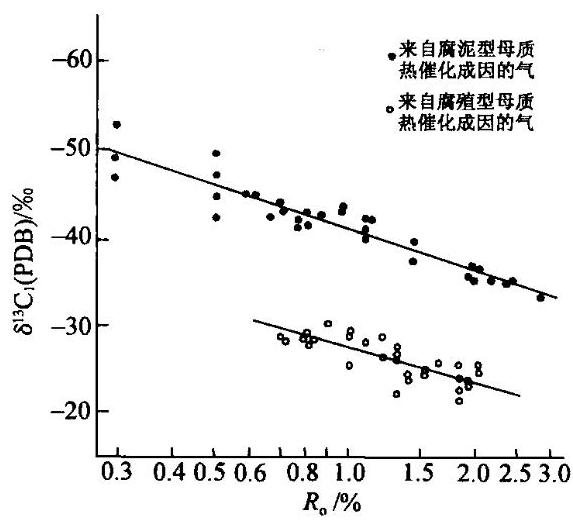

图 5-34 不同母质形成的天然气 ${\delta }^{13}{\mathrm{C}}_{1}$ 与其母岩 ${R}_{0}$ 关系图

(据 Stahl, 1974)

<!-- Media -->

腐泥型: ${\delta }^{13}{\mathrm{C}}_{1} = {17}\lg {R}_{0} - {42}$

从中可见,天然气的 ${\delta }^{13}{\mathrm{C}}_{1}$ 与其母岩 ${R}_{\mathrm{o}}$ 呈半对数关系, 这表明各种有机质随热演化形成天然气, 其甲烷碳同位素含量有一定变化; 腐殖型有机质烃源岩形成的天然气与相同演化程度的腐泥型有机质烃源岩所形成的天然气相比, 具有更高的甲烷碳同位素含量。

根据测定的 ${\delta }^{13}{\mathrm{C}}_{1}$ ,依据 Stahl 的分类图版能够区分有机成因气的母质类型, 这对鉴别煤型气与油型气很有参考价值。

戴金星等 (1985) 在研究我国许多煤型气和油型气 ${\delta }^{13}{\mathrm{C}}_{1}$ 与其源岩 ${R}_{0}$ 的相关性后,也提出了类似的关系。 煤型气: ${\delta }^{13}{\mathrm{C}}_{1} = {14.1254}\lg {R}_{\mathrm{o}} - {34.3922}$(5 - 8)

油型气: ${\delta }^{13}{\mathrm{C}}_{1} = {15.8015}\lg {R}_{0} - {42.2061}$(5 - 9)

## (三) 综合分类图版

Shoell (1983) 研究了世界若干含油气盆地及含煤盆地的天然气后, 提出根据甲烷碳同位素 $\left( {{\delta }^{13}{\mathrm{C}}_{1}}\right)$ 、乙烷碳同位素 $\left( {{\delta }^{13}{\mathrm{C}}_{2}}\right)$ 、甲烷氢同位素 $\left( {\delta {\mathrm{D}}_{1}}\right)$ 及重烃气含量 $\left( {\mathrm{C}}_{2}^{ + }\right)$ 四项指标来划分有机成因气类型 (图 5-35), 根据这套图版可识别有机成因气的类型: 生物化学气(B)、石油伴生气(To)、凝析油伴生气(Tc)、腐泥型热裂解气 $\left\lbrack  {\mathrm{{TT}}\left( \mathrm{m}\right) }\right\rbrack$ 、腐殖型热裂解气 $\left\lbrack  {\mathrm{{TT}}\left( \mathrm{h}\right) }\right\rbrack$ 和混合气(M)等类型。此图版包括四幅图:

(a) 图示有机质成熟度与油气生成的关系, 表明天然气中甲烷碳同位素取决于有机质类型及成熟度;

(b) 图示天然气重烃气含量与甲烷碳同位素含量的关系, 图中 Ms 及 Md 分别表示向浅处和深处运移造成的成分变化;

(c) 图示天然气甲烷碳同位素含量与氢同位素含量的关系;

(d) 图示天然气甲烷碳同位素含量与乙烷碳同位素含量的关系。

这套图版除可进行有机成因气的成因分类外, 尚可用来研究天然气的次生作用 (如运移作用、成熟作用、混合作用等)及气体母质来源。在美国加利福尼亚湾、德国南部磨拉石盆地、奥地利维也纳盆地及意大利波河盆地, 应用这套图版研究天然气的成因类型获得了良好效果。

<!-- Media -->

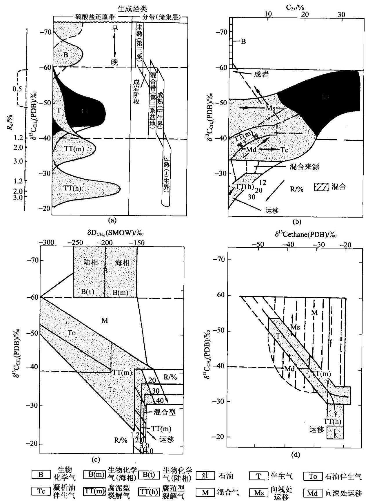

图 5-35 有机成因气的成因类型图解

(据 Shoell, 1983)

<!-- Media -->

## 第四节 烃源岩及其评价

## 一、烃源岩的概念

烃源岩包括油源岩、气源岩和油气源岩。本教材采用 Hunt (1979) 对烃源岩的定义, 即 “在天然条件下曾经产生并排出了足以形成工业性油、气聚集之烃类的细粒沉积”。从找油找气角度出发, 这一概念比较合适。从油气成因的现代概念理解, 这一概念限定在成熟烃源岩或有效烃源岩；从广义的成烃角度来看, 则既指成熟烃源岩, 也包括未成熟烃源岩。因为生物成因气也可以形成工业性聚集。

在一定的地史阶段相同的地质背景下形成的一套烃源岩与非烃源岩的岩性组合, 叫做烃源岩系。烃源岩主要是低能带粘土和碳酸盐淤泥沉积, 但并非所有低能环境的细粒沉积都是烃源岩。一般很难仅依据其岩性就能确定是否为烃源岩。

## 二、烃源岩的评价

在对烃源岩的研究中, 通常要从有机质数量、有机质类型和有机质成熟度等三个方面对其做出定性和定量评价。

## (一) 有机质的数量

有机质的数量包括有机质的丰度和烃源岩的体积。有机质丰度是烃源岩评价的第一位标志,其主要指标为有机碳、氯仿沥青 $\mathrm{A}$ 和总烃的百分含量。但是这些指标都只反映烃源岩排烃后残留的有机质丰度, 它是否能基本代表母岩原始的有机质丰度尚不得而知。据研究, 有机质生烃转化率最高可达 ${40}\%$ ,失重量可达 ${60}\%  \sim  {70}\%$ ,但是母岩在成熟阶段转化率一般为 $5\%  \sim  {10}\%$ ,很少超过 ${20}\%$ ,排烃率大多小于 ${10}\%$ ,最高可达 ${50}\%$ 。按排烃率 ${50}\%$ 计算,排出的烃类仅占总有机质的 ${2.5}\%  \sim  {10}\%$ ,残余在烃源岩中的有机质仍高达 ${90}\%  \sim$ ${97.5}\%$ 。在过成熟阶段,有机质可有 ${30}\%$ 以上转化为气态烃,按排烃率 ${70}\%$ 估算,母岩中残留的有机质仍有 ${80}\%$ 左右。因此,残余有机质的丰度基本能相对反映原始有机质的丰度。 当然对于成熟度和排烃效率都较高的烃源岩最好能进行原始有机质丰度的恢复。

在沉积岩中, 碳以碳酸盐碳 (或氧化碳) 和非碳酸盐碳 (或还原碳, 有机碳) 两种形式存在。沉积岩中有机碳约占 ${18}\%$ ,而氧化碳占 ${82}\%$ 。有机碳与生物活动有关,在组成生物体的 $\mathrm{C}\text{、}\mathrm{H}\text{、}\mathrm{O}\text{、}\mathrm{\;N}\text{、}\mathrm{\;S}$ 五种主要元素成分中,碳的含量最高、最稳定。因此有机碳的含量能够代表有机质的数量。

暗色泥岩的有机碳含量一般不超过 ${15}\%$ ,但作为烃源岩,确定其有机碳下限值尤为重要。讨论烃源岩有机碳下限值, 常引用的经典实例是 Potop (1958) 对俄罗斯地台油气分布与有机质含量关系的研究。他通过上千块海相上泥盆统页岩的有机碳分析, 证明油田集中于有机碳含量为 ${0.5}\%  \sim  5\%$ 的古比雪夫和乌法地区,而在有机碳含量为 ${0.5}\%$ 左右的萨拉托夫和基辅地区发现了一些气田,在有机碳 $&lt; {0.25}\%$ 的其他地区,则没有泥盆纪的油气田 (图 5-36)。Potor 发现, 在含油区细粒粘土岩的有机碳平均含量比非含油区几乎高 3 倍,为 ${1.37}\%$ ,其有机碳含量下限值为 ${0.5}\%$ 。

原地质矿产部无锡石油地质中心实验室 (1980), 根据研究也将中国陆相泥质油源岩的有机碳下限值定为 ${0.5}\%$ ,中国石油勘探开发研究院的胡见义和黄第藩 (1991) 提出了中国陆相泥质油源岩的评价标准,并把有机碳下限值定为 ${0.4}\%$ (表 5-6)。对咸湖环境形成的泥质油源岩,其有机碳含量下限应适当降低至 ${0.3}\%$ 。

<!-- Media -->

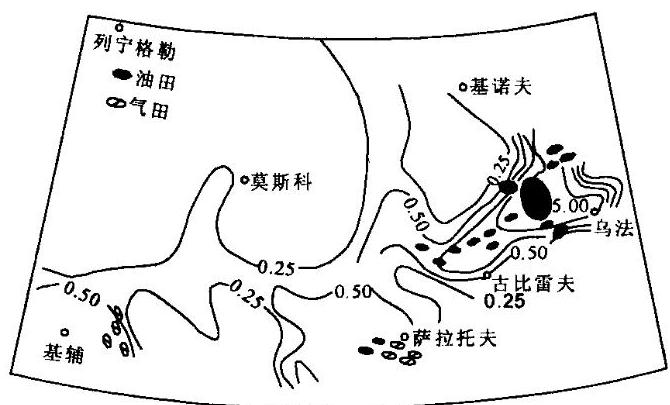

图 5-36 俄罗斯地台上泥盆统有机碳含量 (据 Pohop, 1958)

<!-- Media -->

Gehman (1962) 对碳酸盐岩中的有机质进行了综合性研究, 对世界各地约 1400 个样品的分析表明, 碳酸盐岩中的平均有机碳含量比页岩低得多,前者为 ${0.2}\%$ ,而后者为 ${0.94}\%$ 。但它们的烃类平均含量却相近,约 ${100}\mathrm{{mg}}/\mathrm{L}$ 。根据 Gehman 的调查, Tissot 认为碳酸盐岩的有机碳含量下限值可定为 ${0.3}\%$ ,甚至有学者认为可低至 ${0.1}\%$ 。

对岩石进行氯仿抽提可得到氯仿沥青 A 含量, 然后将抽提物进行色层分离可得到总烃含量, 它们也能反映岩石中有机质的丰度, 其评价标准参考表 5-6。

<!-- Media -->

表 5-6 中国陆相油源岩评价标准

<table><thead><tr><th>油源岩类别 项目</th><th>好油源岩</th><th>中等油源岩</th><th>差油源岩</th><th>非油源岩</th></tr></thead><tr><td>岩相</td><td>深湖 - 半深湖相</td><td>半深 - 浅湖相</td><td>浅湖 - 滨湖相</td><td>河流相</td></tr><tr><td>干酪根类型</td><td>腐泥型</td><td>中间型</td><td>腐殖型</td><td>腐殖型</td></tr><tr><td>H/C 原子比</td><td>${1.7} \sim  {1.3}$</td><td>1. $3 \sim  {1.0}$</td><td>1. $0 \sim  {0.5}$</td><td>1. $0 \sim  {0.5}$</td></tr><tr><td>有机碳含量/%</td><td>3. $5 \sim  {1.0}$</td><td>1. $0 \sim  {0.6}$</td><td>0. $6 \sim  {0.4}$</td><td>0.4</td></tr><tr><td>氯仿沥青 A/%</td><td>0.12</td><td>0.12 ~0.06</td><td>0.06 ~0.01</td><td>0.01</td></tr><tr><td>总烃含量 $\cdot  {10}^{-6}$</td><td>500</td><td>${500} \sim  {250}$</td><td>${250} \sim  {100}$</td><td>100</td></tr><tr><td>总烃/有机碳/%</td><td>6</td><td>$6 \sim  3$</td><td>$3 \sim  1$</td><td>1</td></tr></table>

(据胡见义、黄第藩, 1991)

<!-- Media -->

并非烃源岩的有机碳含量愈高, 生烃愈大, 这是因为它还取决于有机质的类型和成熟度。氯仿沥青 $\mathrm{A}$ 和总烃含量也明显受有机质类型和成熟度的影响。因此,评价烃源岩还需研究有机质的类型及其演化。

## (二) 有机质的类型

烃源岩中有机质的类型不同, 其生烃潜力、产物的类型及性质也不同, 生油门限值和生烃过程也有一定差别。

有机质的类型常从不溶有机质(干酪根)和可溶有机质(沥青)的性质和组成来加以区分。干酪根类型的确定是有机质类型研究的主体, 常用的研究方法有元素分析、光学分析、红外光谱分析以及岩石热解分析等。另外可溶沥青的研究也普遍受到重视。

<!-- Media -->

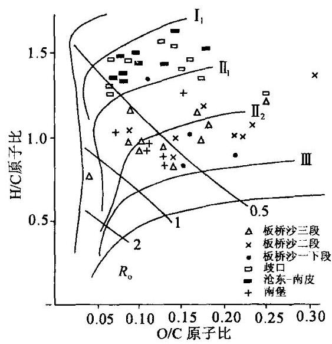

图 5-37 黄骅坳陷烃源岩元素分析图 (据卢松年, 1989)

I 一腐泥型; ${\mathrm{I}}_{1}$ 一腐殖腐泥型;

${\mathrm{{Il}}}_{2}$ 一腐泥腐殖型; III一腐殖型

<!-- Media -->

## 1. 元素分析

干酪根元素分析是从化学性质和本质上来把握其类型的。Tissot 和 Durand 等 (1974) 根据干酪根的元素组成分析, 利用范氏 (Van Krevelen) 图上 $\mathrm{H}/\mathrm{C}$ 和 $\mathrm{O}/\mathrm{C}$ 原子比的演化路线将干酪根分为 $\mathrm{I}\text{、}\mathrm{{II}}\text{、}\mathrm{{III}}$ 型。 $\mathrm{I}$ 型为细菌改造的藻质型, $\mathrm{{II}}$ 型为腐泥型, Ⅲ型为腐殖型。另外, 还分出 IV 型为残余型, 它们的主要特征在干酪根中已述。另外, Hunt (1991) 根据干酪根中的硫含量, 将 II 型干酪根进一步划分为 4 种类型。

从全球来看, 石油主要源于腐泥型或腐泥型与腐殖型过渡的有机质, 而腐殖型有机质则主要生成天然气。腐殖煤属腐殖型有机质, 个别来自腐殖煤的轻质油, 往往与煤中的壳质组和富氢镜质组有关。

我国陆相烃源岩中干酪根类型的划分方案较多, 比较通用的方案是: I 型为腐泥型 (包括 Tissot 的 I 型和 II 型, 陆相湖盆藻质型少), III 型为腐殖型, II 型为混合型中的中间型, ${\mathrm{{II}}}_{1}$ 型为腐殖腐泥型, ${\mathrm{{II}}}_{2}$ 型为腐泥腐殖型 (图 5-37)。另外, 还有 IV 型为煤质型, 相当于 Tissot 的残余型。

<!-- Media -->

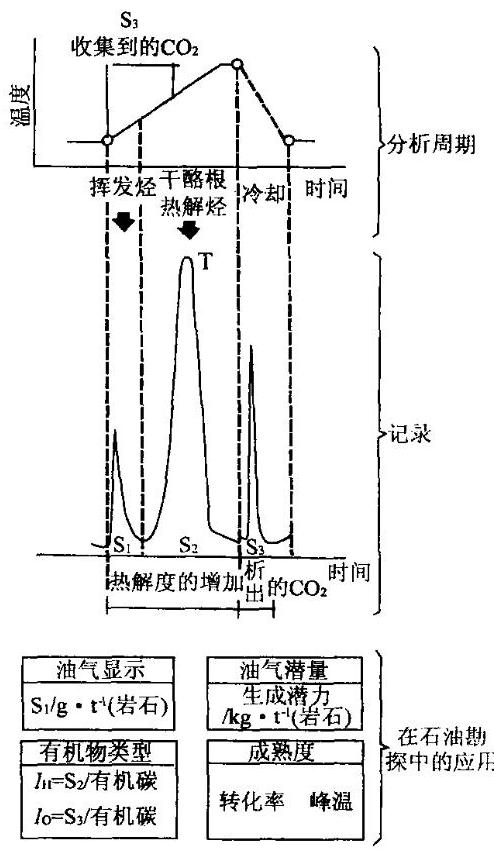

图 5-38 岩样热解分析记录和应用 (据 Espitalie 等, 1974) ${\mathrm{S}}_{1}$ 一吸附烃;

${\mathrm{S}}_{2}$ 一干酪根热解烃; ${\mathrm{S}}_{3}$ 一二氧化碳

<!-- Media -->

## 2. 光学分析

在显微镜下对干酪根进行光学分析是从光学性质上和形貌上把握其类型。光学分析方法包括孢粉学法和煤岩学法。

孢粉学法是按干酪根在透射光下的微观结构, 将其分成藻质、絮质 (无定形)、草质、本质和煤质, 其中前 3 种为腐泥型有机质, 后 2 种为腐殖型和残余型有机质。煤岩学法是将干酪根的显微组成分为壳质组、镜质组和惰质组, 其中壳质组为腐泥型有机质, 多数镜质组为腐殖型有机质, 惰质组为煤质型有机质。认识上述各种微观组分, 有利于理解过渡类型干酪根的组成。

## 3. 岩石热解分析

Espitalié 等 (1977) 发展了一种快速评价烃源岩特征的热解方法, 即烃源岩评价仪 (Rock-Eval), 它是用岩石热解分析仪直接从岩样中测出所含的吸附烃 $\left( {\mathrm{S}}_{1}\right)$ 、干酪根热解烃 $\left( {\mathrm{S}}_{2}\right)$ 和二氧化碳 $\left( {\mathrm{S}}_{3}\right)$ 与水等含氧挥发物以及相应的温度,温度可逐步加热到 ${550}^{ \circ  }\mathrm{C}$ (图 5-38)。

氢指数 $\left( {{\mathrm{S}}_{2}/\text{有机碳,}{I}_{\mathrm{H}}}\right)$ 和氧指数 $\left( {{\mathrm{S}}_{3}/\text{ 有机碳,}{I}_{0}}\right)$ 与干酪根元素组成分析能进行很好的对比。因此, 可利用这两个指数绘制范氏图确定烃源岩中有机质的类型 (图 5-39)。

各种干酪根的分类和特征综合在表 5-7 中。

需要指出, 确定干酪根的类型应选择未成熟或低成熟的样品进行分析, 尤其是采用有关化学分析的方法。这是因为有机质的成熟度过高会模糊不同类型干酪根之间的差异。

<!-- Media -->

表 5-7 烃源岩中的干酪根分类

<table><thead><tr><th colspan="2">孢粉学分类</th><th>藻 质</th><th>絮 质</th><th>草 质</th><th>木 质</th><th>煤 质</th></tr></thead><tr><td rowspan="2">煤岩学分类</td><td>显微组分</td><td colspan="3">壳质组</td><td>镜质组</td><td>惰质组</td></tr><tr><td>显微组分细分</td><td>藻质体</td><td>无定形</td><td>孢 粉 角质体 树脂体 木栓体</td><td>结构镜质体 无结构镜质体</td><td>丝质体 微粒体 巩膜体</td></tr><tr><td rowspan="4">元素分析</td><td>Tissit 分类</td><td>藻质型 ( I )</td><td colspan="2">腐泥型(Ⅱ)</td><td>腐殖型(Ⅲ)</td><td>残余型( ${IV}$ )</td></tr><tr><td>中国分类</td><td colspan="3">腐泥型 ( I )</td><td>腐殖型(Ⅲ)</td><td>煤质型( $N$ )</td></tr><tr><td>原始 $\mathrm{H}/\mathrm{C}$ 原子比</td><td>${1.70} \sim  {1.50}$</td><td colspan="2">${1.50} \sim  {1.30}$</td><td>1. $0 \sim  {0.70}$</td><td>${0.60} \sim  {0.50}$</td></tr><tr><td>原始 O/C 原子比</td><td>$< {0.1}$</td><td colspan="2">$< {0.2} \sim  {0.1}$</td><td>${0.3} \sim  {0.2}$</td><td>${0.3} \sim  {0.25}$</td></tr><tr><td rowspan="4">岩石热解分析</td><td>生烃潜力 ${\mathrm{S}}_{1} + {\mathrm{S}}_{2}$ $\mathrm{{kg}} \cdot  {\mathrm{t}}^{-1}$ (岩石)</td><td>$> 6$</td><td colspan="2">$6 \sim  4$</td><td>$< 2$</td><td>$< 2$</td></tr><tr><td>降解率/%</td><td>$> {50}$</td><td colspan="2">${10} \sim  {50}$</td><td colspan="2">$< {10}$</td></tr><tr><td>${I}_{\mathrm{H}}\left( {\mathrm{{mg}}/\mathrm{g}\text{有机碳}}\right)$</td><td>$> {800}$</td><td>800 ~ 500</td><td/><td>$< {150}$</td><td/></tr><tr><td>${I}_{0}$ ( $\mathrm{{mg}}/\mathrm{g}$ 有机碳)</td><td>$< {40}$</td><td>${60} \sim  {40}$</td><td/><td>150 ~ 50</td><td/></tr><tr><td rowspan="2">红外光 谱分析</td><td>${2930}{\mathrm{{cm}}}^{-1}/{1600}{\mathrm{{cm}}}^{-1}$</td><td>$> {3.0}$</td><td>$> {3.0}$</td><td/><td>$< {0.4}$</td><td/></tr><tr><td>${1460}{\mathrm{{cm}}}^{-1}/{1600}{\mathrm{{cm}}}^{-1}$</td><td>$> {1.20}$</td><td>1. ${20} \sim  {0.45}$</td><td/><td>< 0.25</td><td/></tr><tr><td colspan="2">有机质来源</td><td colspan="2">海洋、湖泊</td><td>陆地</td><td>陆地</td><td>陆地强氧化 或再循环</td></tr><tr><td colspan="2">化石燃料</td><td colspan="2">以油、油页岩藻、藻煤 和残殖煤为主</td><td>油、气</td><td>以气和腐 殖煤为主</td><td>无油、少量气</td></tr></table>

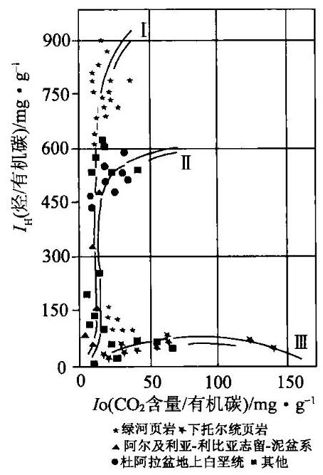

图 5-39 氢指数和氧指数确定烃源岩类型 (据 Espitalié 等, 1974)

<!-- Media -->

## 4. 可溶沥青分析

可溶沥青的研究也能反映烃源岩中有机质的类型, 较常用的参数如下:

1) 烃源岩氯仿抽提物中组分组成特征, 如饱和烃/芳烃。
2) 饱和烃气相色谱特征, 包括主峰碳位置和峰型等。如正烷烃主峰碳在 ${\mathrm{C}}_{25} - {\mathrm{C}}_{33}$ 的后峰型,反映原始有机质为陆源高等植物输入; 主峰碳在 ${\mathrm{C}}_{15} - {\mathrm{C}}_{19}$ 的前峰型,反映母质来源于水生低等生物; 双峰型反映母质具有低等生物和高等植物的混合来源。还有姥鲛烷/植烷可反映有机质的形成环境。 但这种方法基本不适用具有较高成熟度的母岩。
3) 色谱 - 质谱分析可鉴定甾类和萜类等生物标志化合物的种类和数量, 这对判断母质的来源也有重要意义。如 ${\mathrm{C}}_{27}$ 甾烷主要来自浮游生物,而 ${\mathrm{C}}_{22}$ 甾烷主要来自陆源高等植物, 萜烷中的伽马蜡烷源于细菌, 奥利烷和羽扇烷系列反映高等植物输入等。

## (三) 有机质的成熟度

有机质的成熟度是表征其成烃有效性和产物性质的重要参数。它是指在有机质所经历的埋藏时间内, 由于增温作用所引起的各种变化。当有机质达到或超过温度和时间相互作用的门限值时, 干酪根才进入成熟并开始在热力作用下大量生成烃类。而未成熟的有机质主要生成生物成因气, 有时可生成少量液态烃。评价有机质成熟度的方法有多种, 其中常用且较有效的方法有: 镜质体反射率 $\left( {R}_{\mathrm{o}}\right)$ 法、孢粉和干酪根的颜色法、岩石热解法、 可溶有机质的化学法。另外, 还可应用多种成熟度标尺和 TTI 等预测方法来估算烃源岩中有机质的成熟度。

1. 镜质体反射率法

镜质体反射率也称镜煤反射率 $\left( {R}_{\mathrm{o}}\right)$ ,它是温度和有效加热时间的函数且具不可逆性, 所以它是确定煤化作用阶段的最佳参数之一。1969 年以来镜质体反射率被广泛应用于页岩和其他岩石中分散有机质的测定中, 它亦成为确定干酪根成熟度的一种最有效的指标。

镜质体反射率可定义为光线垂直入射时, 反射光强度与入射光强度的百分比。镜质体反射率的主要类型有最大 $\left( {R\max }\right)$ 、最小 $\left( {R\min }\right)$ 和随机 $\left( {R\mathrm{e}}\right) 3$ 种,前两种是在垂直和平行层面的定向切片样品上测定的。镜质体反射率可在空气中和油浸条件下测定, 分别表示为 ${R}^{\mathrm{a}}$ 和 ${R}^{ \circ  }$ ,每个样品需测定 ${20} \sim  {50}$ 个点计算出平均值。油气地质研究中常用油浸随机的镜质体反射率,用 ${R}_{\mathrm{o}}$ 表示。有时也用油浸最大和最小的镜质体反射率,分别用 ${R}^{ \circ  }\max$ 和 ${R}^{ \circ  }\min$ 表示。

<!-- Media -->

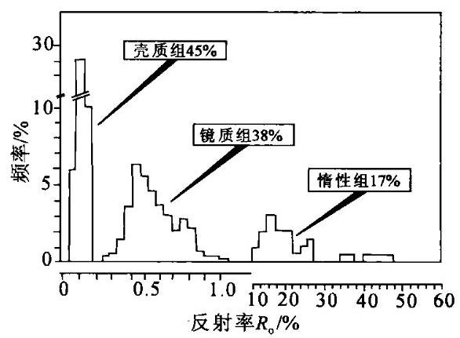

图 5-40 卢森堡中里阿斯统页岩有机质不同组分反射率分布直方图 (据 Hagermann, 1978)

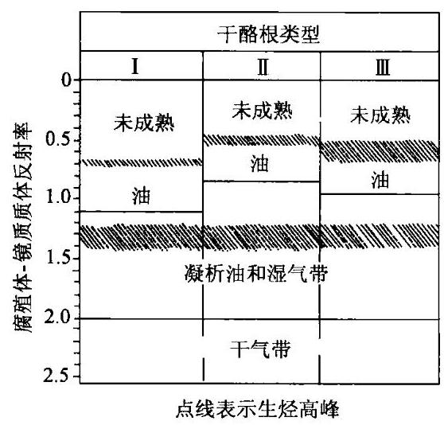

图 5-41 镜质体反射率确定油气近似界限 ( 据 Tissot, 1978)

<!-- Media -->

在煤岩显微组成中, 镜质组最丰富, 反射率居中, 而壳质组反射率低, 惰质组最高 (图 5-40)。镜质体反射率随成熟度而增加, 这是因为, 从化学结构看镜质组由缩合芳环束组成, 随着成熟度的增加, 芳环束逐渐结合成更大和更规则的缩合芳香页片, 定向有序排列,故引起其反射率升高。Dow(1977)提出镜质体反射率的对数值 $\left( {\lg {R}_{0}}\right)$ 与埋深呈线性关系。干酪根的类型不同,其各成熟阶段 ${R}_{0}$ 值也有一定差别,如图 5-41 所示。 ${R}_{o} &lt; {0.5}\%  \sim  {0.7}\%$ 为成岩作用阶段,生的烃未成熟; ${0.5}\%  \sim  {0.7}\%  &lt; {R}_{o} &lt; {1.1}\%  \sim  {1.3}\%$ 为深成作用阶段的成油主带; ${1.1}\%  \sim  {1.3}\%  &lt; {R}_{a} &lt; 2\%$ 为深成作用阶段的高成熟凝析油和湿气带; ${R}_{0} &gt; 2\%$ 为准变质作用阶段,为只产甲烷的干气带。

镜煤反射率法的缺点是腐泥型干酪根中缺乏镜质组。另外还需注意富氢镜质组、再沉积的镜煤和构造运动以及火成岩的影响。用 ${R}_{0}$ 表征成熟度方法,主要限于晚古生代以来碎屑岩系。

2. 孢粉和干酪根颜色法

在显微镜透射光下, 孢子、花粉和其他微体化石随成熟度作用的增强而显不同颜色。 未成熟阶段为浅黄至黄色, 成熟阶段为褐黄至棕色, 过成熟阶段为深棕至黑色。Staplin (1969) 和 Correia (1971) 提出了热变指数(TAI); Barnard (1977) 提出了色变指数 (CAI)。

干酪根颜色的应用实例如图 5-42 所示, 加拿大不列颠哥伦比亚省和邻近的西北中泥盆统碳酸盐岩, 只产干气, 而石油和湿气则产自东部的西北阿尔伯特。干酪根颜色的变化反映了因埋藏历史不同而引起的成熟度差异。

<!-- Media -->

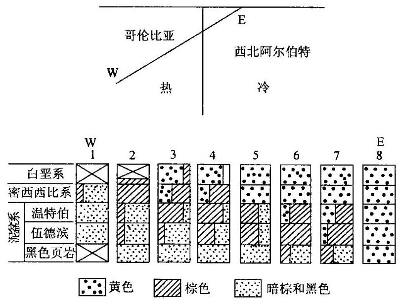

图 5-42 成熟度与干酪根颜色的关系

(据 Staplin, 1969)

<!-- Media -->

## 3. 岩石热解法

利用岩石热解分析资料中 ${S}_{1}/\left( {{S}_{1} + {S}_{2}}\right)$ 和热解峰温 ${T}_{\max }\left( {{}^{ \circ  }\mathrm{C}}\right)$ 两个参数可确定烃源岩的未成熟带、成油带和成气带 (图 5-43)。采用岩石热解法确定的界限, 也会因干酪根的类型不同而异,需配合氢指数 $\left( {I}_{\mathrm{H}}\right)$ 和氧指数 $\left( {I}_{0}\right)$ 以及其他方法给出的类型参数分析。

## 4. 可溶有机质的化学法

## (1) 演化曲线

根据氯仿沥青 $\mathrm{A}$ 、总烃含量和氯仿沥青 $\mathrm{A}$ /有机碳、总烃/有机碳等转化率绘制随深度的演化曲线, 这些曲线可反映有机质的成熟度随深度的变化。

(2) ${\mathrm{C}}_{2} - {\mathrm{C}}_{6}$ 轻烃

${\mathrm{C}}_{2} - {\mathrm{C}}_{8}$ 轻烃数量和组成能很好地判断烃源岩中有机质的成熟度。因为, ${\mathrm{C}}_{2} - {\mathrm{C}}_{8}$ 不是生物合成的,而是干酪根热降解的产物。 ${\mathrm{C}}_{2} - {\mathrm{C}}_{8}$ 中的烷烃、环烷烃和芳烃的相对含量随成熟度的增加而发生有规律的变化,如庚烷值 $=$ 正庚烷 $/\left( {{80.7} \sim  {100.9}^{ \circ  }\mathrm{C}}\right.$ 之间 ${\mathrm{C}}_{7} - {\mathrm{C}}_{8}$ 的链烷烃和环烷烃的馏分) $\times  {100}\%$ 与温度作图则有正相关关系 (图 5-44)。而异庚烷值 $=$ (2 - 甲基己烷 +3 - 甲基己烷) / 二甲基戊烷, 也与温度有正相关性。

<!-- Media -->

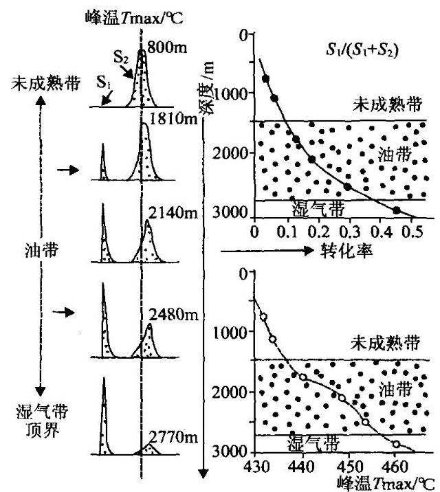

图 5-43 利用岩石热解分析资料中 ${S}_{1}/\left( {{S}_{1} + {S}_{2}}\right)$ 和热解峰温 $T\max \left( {{}^{ \circ  }\mathrm{C}}\right)$ 确定烃源岩的成熟度 (据 Espitalie 等, 1977)

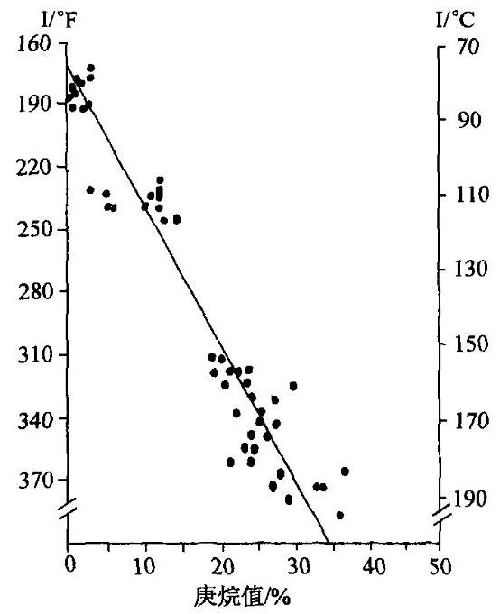

图 5-44 墨西哥五口非生产井的庚烷值与最大温度的关系 (据 Thompson, 1979)

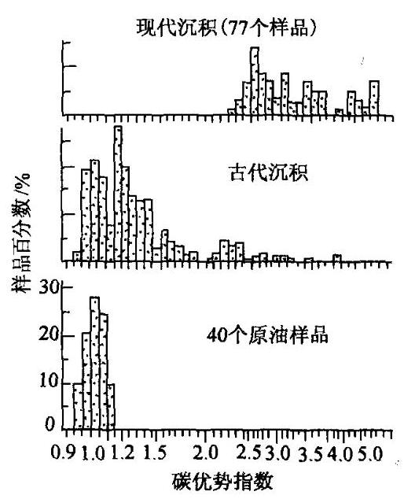

图 5-45 沉积物和原油的碳优势指数的分布 (据 Bray & Evens, 1965)

<!-- Media -->

(3) ${\mathrm{C}}_{15}^{ + }$ 烃类

Bray 和 Evens (1965) 研究了近代沉积、古代沉积和原油中 ${\mathrm{C}}_{15}^{ + }$ 奇数碳和偶数碳正烷烃的分布,发现有明显的差别 $\left( \text{图 5-45 }\right)$ 。在近代沉积物中, ${\mathrm{C}}_{15}^{ + }$ 正烷烃主要来源于高等植物的蜡, 具有明显的奇数碳优势。在古代成熟烃源岩和石油中, 干酪根热降解的烷烃不具此优势, 因而奇碳优势逐渐消失, 一般认为, 生油高峰期, 已不再有奇碳优势。

Bray 和 Evens (1965) 提出了碳优势指数(CPI):

$$
{CPI}\left( {{C}_{24} - {C}_{34}}\right)  = \frac{1}{2}\mathop{\sum }\limits_{{i = {12}}}^{{16}}{C}_{{2i} + 1}\left\lbrack  {\frac{1}{\mathop{\sum }\limits_{{i = {12}}}^{{16}}{C}_{2i}} + \frac{1}{\mathop{\sum }\limits_{{i = {12}}}^{{16}}{C}_{{2i} + 2}}}\right\rbrack   \tag{5 - 10}
$$

$$
{CPI}\left( {{C}_{16} - {C}_{30}}\right)  = \frac{1}{2}\mathop{\sum }\limits_{{i = 8}}^{{15}}{C}_{{2i} + 1}\left\lbrack  {\frac{1}{\mathop{\sum }\limits_{{i = 8}}^{{15}}{C}_{2i}} + \frac{1}{\mathop{\sum }\limits_{{i = 8}}^{{15}}{C}_{{2i} + 2}}}\right\rbrack   \tag{5 - 11}
$$

Philippi (1965) 提出了 ${\mathrm{C}}_{29}$ 正构烷烃优势指数:

$$
{R}_{29} = \frac{2{C}_{29}}{{C}_{28} + {C}_{30}} \tag{5 - 12}
$$

Scalan 和 Smith (1970) 提出了 5 个碳数区间的奇偶优势指数(OEP):

$$
{OEP} = {\left\lbrack  \frac{{C}_{i} + 6{C}_{i + 2} + {C}_{i + 4}}{4{C}_{i + 1} + 4{C}_{i + 3}}\right\rbrack  }^{{\left( -1\right) }^{i + 1}} \tag{5 - 13}
$$

随着有机质成熟度的增加,上述 ${CPI}\text{、}{R}_{29}$ 和 ${OEP}$ 值愈来愈接近 1,并趋于稳定。 (4) 环烷烃

随埋深的增加, 环烷烃的环数从以三 - 四环为主变为以单 - 双环为主。

## (5)生物标志化合物

随埋深和温度的增加, 干酪根热降解的新生烃类使来自生物的烃类受到稀释, 与其相邻的正烷烃比较, 其含量都随成熟度的增加而减少, 如姥鲛烷/正十七烷、植烷/正十八烷。

甾烷和藿烷的立体异构化,能十分有效地反映成熟度。甾烷指标如 $\left( {{5\alpha } - {20}\mathrm{\;S} - {\mathrm{C}}_{29}}\right) /$ $\left( {{5\alpha } - {20R} - {\mathrm{C}}_{29}}\right)$ ,随埋深的增加从 0.3 左右上升到 1.0 且稳定; 重排甾烷/ $\left( {{5\alpha }\left( {{\mathrm{C}}_{27} + {\mathrm{C}}_{28}}\right. }\right.$ $\left. {+{\mathrm{C}}_{29}}\right)$ ),随埋深的增加从 0.1 左右增加到 1.0 且趋于稳定。藿烷指标如 ${18\alpha }\left( \mathrm{H}\right)$ 三降新藿烷 $/{17\alpha }\left( \mathrm{H}\right)$ 三降藿烷 $\left( {T\mathrm{\;m}/T\mathrm{\;s}}\right)$ 随成熟度的增加从 2.0 左右降到 1.0 且趋于稳定; $({\beta \alpha } -$ ${\mathrm{C}}_{30}$ 藿烷) / ( $\left( {{\alpha \beta } + {\beta \alpha }}\right)  - {\mathrm{C}}_{30}$ 藿烷) 随埋深从 0.2 左右增加到约 0.7。

上述各种确定烃源岩有机质成熟度的方法综合使用最有效, 而且还需考虑有机质类型的影响。在实际工作中应随深度系统取样, 进行测试分析, 将数据和结果作出与埋深的关系图表。图 5-46 和图 5-47 是各种成熟度指标综合应用时的对应情况。

## (四) 成熟度标尺和 TTI

在烃源岩的热演化成烃过程中, 有机质的许多物理性质和化学性质被改变, 并可作为成熟度标志如 ${R}_{0}$ 、孢粉颜色和煤阶等。为估算和评价有机质的成熟度,许多学者根据这些性质与烃源岩的埋藏时间和温度史, 用数学模型建立了各种数字化的热成熟度标尺和计算图表, 如 Karwell (1955)、Teichmüller (1971)、Bostick (1971)、Cooper (1977) 等提出了镜质体反射率与温度和时间的关系图。Hood (1975) 提出了有机质变质水平 (LOM) 的成熟度标尺。Royden (1980) 提出 C 标尺等等。

为定量预测烃源岩中有机质的成熟度, Lopatin (1971) 和 Waples (1980) 根据温度每增加 ${10}^{ \circ  }\mathrm{C}$ ,干酪根热降解成烃的反应速率增加 1 倍并与时间呈线性关系,而且有机质成熟度效应是累加的、不可逆的等原理, 提出并改进了时间 - 温度指数 (TTI) 的有机质成熟度预测方法, 从而得到了极为广泛的应用。Wood (1988) 根据有机质化学反应的动力学原理提出了 Arrhenius TTI 法。应用 Lopatin 和 Arrhenius 法 ${TTI}\left( {{TT}{I}_{\mathrm{{ARR}}}}\right)$ 的关键问题是要忠实地重建沉积盆地的埋藏历史和受热温度史。关于 TTI 的计算和对烃源岩的评价将在实习中仔细讲解。

<!-- Media -->

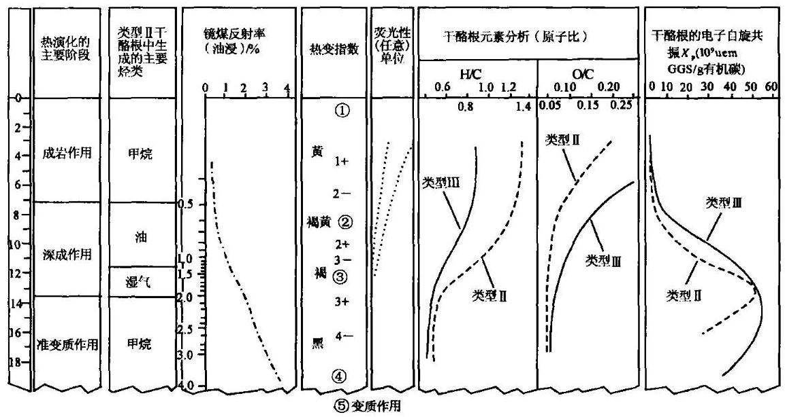

图 5-46 干酪根分析所得各成熟指标的对应情况

(据 Tissot 等, 1978)

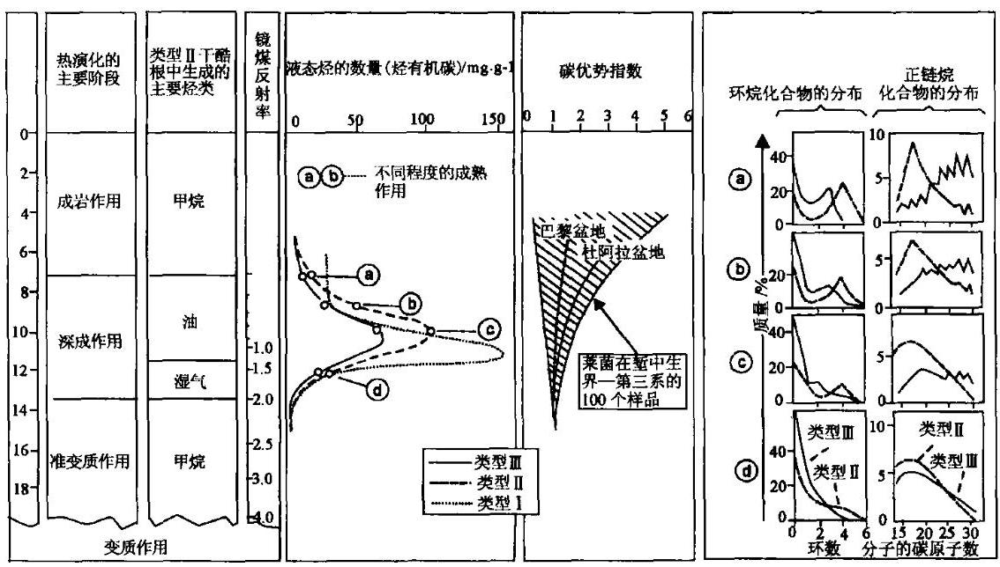

图 5-47 据沥青的组成和丰度所得各成熟指标的对应情况

(Tissot 据 Durand 改编, 1978)

<!-- Media -->

## 第五节 油气地球化学对比

油气地球化学对比, 从广义上说应包括油-油对比, 油-岩对比, 气-气对比, 气-岩对比, 油-气-岩对比和天然气成因分类, 其中油-岩和气-岩对比是核心问题 (图 5-48)。此研究不仅具有理论意义, 而且对于指导油气勘探、寻找新的油气资源、扩展原有含油气范围等都有着重要的实用价值。

## 一、对比参数的选取

## (一) 参数选取原则

油气对比的基础是: 性质相同的两种油气应源于同一母岩; 母岩排出的石油应该与母岩中残留的石油相同; 母岩排出的天然气的成因类型应该与母岩的性质一致。但是, 实际情况要复杂得多, 因为石油可能受到运移、重力分异、 热力降解、岩石吸附、扩散、溶解、混合以及生物降解和氧化等外界因素的影响, 尤其是母岩抽提物与油藏原油之间差异更为突出。天然气也可能会遭受到各种蚀变和上述诸多因素的改造。因此, 在对比参数选择时, 应尽量选取那些受非成因因素干扰最小且较稳定的指标; 凝析油和原油应选用不同的对比参数; 一般不宜采用油气化合物组成的绝对含量, 而应采用系列化合物的分布和比值, 应选取多个参数进行综合对比以便互相补充和印证。另外, 还要尽量避免或减少由于取样条件不同所造成的人为差异。

<!-- Media -->

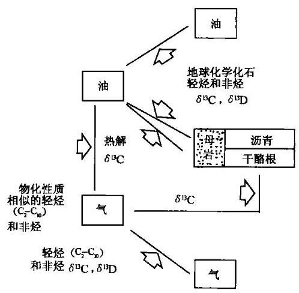

图 5-48 油、气与烃源岩对比研究内容

<!-- Media -->

## (二) 对比参数

## 1. 石油对比参数

常用的有: 微量元素系列和 $\mathrm{V}/\mathrm{{Ni}}$ 比值; 生物标志化合物如类异戊间二烯烷烃的系列分布, 甾族和萜类化合物的分布型式和特征; 正构和异构烷烃、环烷烃、芳香烃等系列化合物的分布型式和比值; 各种石油组分的碳氢稳定同位素等。另外, 石油和烃源岩中孢粉组合也可用于油源对比。

## 2. 天然气的对比参数

常用的有: 烃气富集系数,即烃气/非烃气、甲烷系数 (湿气指数) ${\mathrm{C}}_{1}/\sum {\mathrm{C}}_{i}$ 、干燥系数 ${\mathrm{C}}_{1}/{\mathrm{C}}_{2}^{ + }$ 、重烃系数或湿度 ${\mathrm{C}}_{2}^{ + }/{\mathrm{C}}_{1}$ 和 ${\delta }^{13}{\mathrm{C}}_{1}\text{、}{\delta }^{13}{\mathrm{C}}_{2}\text{、}{\delta }^{13}{\mathrm{C}}_{3}\text{、}{\delta }^{13}{\mathrm{C}}_{c{0}_{2}}\text{、}\delta \mathrm{D}\text{、}{}^{3}\mathrm{{He}}/{}^{4}\mathrm{{He}}\text{、}{}^{40}\mathrm{{Ar}}/{}^{36}\mathrm{{Ar}}$ 以及 ${R}_{\mathrm{o}}$ 。在对比和确定天然气成因时往往选用一个或多个坐标对。

## 二、对比结果的解释

选取有效参数进行油气地球化学对比解释, 最终得出正确的认识和结论是一项细致而又繁琐的工作, 决不能脱离地质资料而孤立地进行。如含油气盆地的构造史、沉积埋藏和成熟史、生烃和排烃史、盆地类型及地质结构、母岩的岩性、厚度和分布、油气运移的通道和介质条件、油气藏的保存和破坏等等都是对比解释中不可忽略的背景材料。

对各种对比指标的分析数据应选择适当的形式表现出来, 如直方图、三角图和各种相关曲线图。对不符合主观的原始数据不要轻易舍去,或许它们包含着有用的信息,应如实反映。

对比过程中, 微弱的差别不影响可比性, 多种参数的显著差别一般反映为母质不同或成因不同。但要排除其他干扰因素。当不同对比参数的结果发生矛盾时, 应认真分析原理, 对失灵指标找出原因, 对新选用的指标应通过已知样品的检验和较成熟指标的检验。

## 三、油源对比

目前最常用的有机地球化学对比参数有: ${\mathrm{C}}^{+{15}}$ 正构烷烃,类异戊二烯烷烃,甾类和萜类化合物, 芳香族化合物, 碳同位素和族组分等几大类。按对比稳定性的要求首推是生物标记化合物, 其次是碳同位素, 再次是正构烷烃和一般环烷烃。

## (一) 微量元素

<!-- Media -->

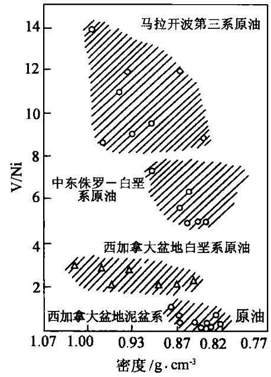

图 $5 - {49}\mathrm{\;V}/\mathrm{{Ni}}$ 与石油密度关系图 (据 Hunt, 1979)

<!-- Media -->

石油中微量元素钒和镍是卟啉的络合物, 随卟啉一起从母岩进入石油。石油中的卟啉是生物色素在还原条件下经金属置换、去羧基或加氢等复杂反应而生成的。 石油中的钒、镍含量有随石油的密度一起增长的趋势。 石油中钒、镍的绝对含量可能随氧化、运移等作用而变化, 但二者的比值常无明显的变化。从图 5-49 可看出, $\mathrm{V}/\mathrm{{Ni}}$ 似乎随地质年龄增长而减少,这个比值在最年轻的石油中最高, 最老的石油中最低, 这可能是因为钒卟啉的热稳定性比镍卟啉差。中东伊拉克北部油田主产层为第三系, 但整个中生界也有产量。油来自白垩系还是第三系,常有争论。后据钒、镍研究得知: $\mathrm{V}/\mathrm{{Ni}}$ 各层近似表示同源; $\mathrm{V}\text{、}\mathrm{{Ni}}$ 含量各层差别大,表示白垩系发生过向上至第三系的运移。

## (二) 生物标志化合物

生物标志化合物如类异戊间二烯类、甾类和三萜类

由于相对地不受轻组分流失和风化作用的影响, 所以它们的分布特征不仅可用于油-油对比, 也可用于油-岩对比。

## 1. 类异戊二烯烷烃

在原油和生油岩的抽提沥青中普遍存在有 ${\mathrm{C}}_{9} - {\mathrm{C}}_{25}$ 异戊间二烯型烷烃,它们的结构比较稳定, 抵抗微生物的降解能力强。所以是一类重要的对比参数。其中又以姥鲛烷(Pr) 和植烷(Ph)含量最丰富,也最稳定,因此更常用 $\mathrm{{Pr}}/\mathrm{{Ph}}\text{、}\mathrm{{Pr}}/n{\mathrm{C}}_{17}\text{、}\mathrm{{Ph}}/n{\mathrm{C}}_{18}\text{、}\left( {\mathrm{{Pr}} + \mathrm{{Ph}}}\right) /$ $\left( {n{\mathrm{C}}_{17} + n{\mathrm{C}}_{1}}\right)$ 等比值进行油源对比。这些指标一般是有效的。

<!-- Media -->

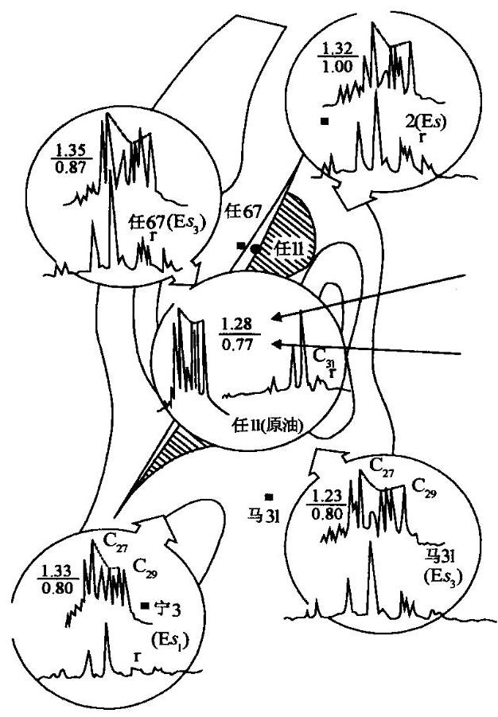

图 5-50 任丘油田雾迷山组油藏油源对比图 (据梁狄刚等, 1984)

<!-- Media -->

2. 甾类和萜类化合物

对于有亲缘关系的生油岩与原油, 其中甾烷、萜烷的相对含量和组合特征具有相似性, 而且这类化合物结构独特、性质稳定, 尤其是可以抵抗微生物降解, 所以在油源对比中起很大作用。常采用甾类和萜类化合物系列的分布型式及特征化合物作为油源对比参数。其中常用规则甾烷 $\left( {{\mathrm{C}}_{26} - {\mathrm{C}}_{30}}\right)$ 化合物碳数分布反映烃源岩的母质特征确定油源之间的成因联系, 以及用 ${\alpha \alpha \alpha }\left( {{20}\mathrm{R}}\right)$ 甾烷 ${\mathrm{C}}_{27}/{\mathrm{C}}_{28}\text{、}{\alpha \alpha \alpha }\left( {{20}\mathrm{R}}\right)$ 甾烷 ${\mathrm{C}}_{28}/{\mathrm{C}}_{29}$ 、伽马蜡烷 $/{\mathrm{C}}_{30}$ (莫烷 + 霍烷)、 ${\alpha \alpha \alpha }{\mathrm{C}}_{29}$ 甾烷 $S/\left( {S + R}\right)$ 等生物标志特征化合物参数, 对油源进行母源性质、沉积环境和成熟度三个因素的综合对比, 可以取得良好的效果 (图 5-50)。

## (三) 稳定碳同位素组成

碳同位素 ${\delta }^{13}\mathrm{C}$ 值是最常使用的参数,它可以将石油与烃源岩中的干酪根和沥青直接联系起来。一般海相有机质比陆相有机质的 ${\delta }^{13}\mathrm{C}$ 值高,并在干酪根、沥青和石油间存在着系统的变异性。海相碳酸盐烃源岩、海相泥质烃源岩和三角洲陆相烃源岩的平均 ${\delta }^{13}\mathrm{C}$ 值分别约为 $- {10}\%$ 。 $- {20}\%$ 和 $- {30}\%$ 。石油是干酪根热演化的产物,因此石油的 ${\delta }^{13}\mathrm{C}$ 值要比同层干酪根轻。在大多数情况下存在有 ${\delta }^{13}{\mathrm{C}}_{\text{千酪根 }} &gt; {\delta }^{13}{\mathrm{C}}_{\text{沥青 }} \geq  {\delta }^{13}{\mathrm{C}}_{\text{油 }}$ 和石油中 ${\delta }^{13}{\mathrm{C}}_{\text{非烃 }} &gt;$ ${\delta }^{13}{\mathrm{C}}_{\text{芳香烃 }} &gt; {\delta }^{13}{\mathrm{C}}_{\text{饱和烃 }}$ 的关系。当母质来源和沉积环境以及演化程度相同时, ${\delta }^{13}\mathrm{C}$ 具有良好的对比性。研究表明, 在解决诸如我国四川盆地既有海相又有陆相烃源岩的油源对比问题上, 碳同位素的应用收到了较好效果。

(四) ${\mathrm{C}}_{15}^{ + }$ 正构烷烃

最常用的对比参数是正构烷烃的分布特征, 包括碳数分布范围和主峰碳数, 特别是碳数分布形式是十分有用的参数。一般来讲, 有亲缘关系的油和烃源岩碳数分布曲线具相似性。此外 ${OEP}$ 值、轻烃与重烃的比值、环戊烷/正构烷烃等也是普遍应用的对比指标。虽然正构烷烃在多数原油中具有很高的浓度, 但它们受生物降解、热成熟和运移等作用的影响较大。所以正构烷烃指标一般只对低 - 中等成熟度、生物降解不明显的石油才有较好的效果。

## (五) 芳香族化合物

随着成熟度增加, 饱和烃中的正构烷烃和异构烷烃的分布逐渐趋于一致, 甾类和萜类化合物的含量越来越低并逐渐失去其特色, 显然不能再用这些参数来对比高成熟的石油。 而能保留在成熟度较高的生油岩和石油中的芳香族、芳香肖族及硫芳香族(噻吩类)等化合物, 此时就成为有用的对比参数。

(六) 族组成

不同类型烃源岩所生成的石油具有不同的族组成。一般是陆相石油正构烷烃含量高、 海相石油环状化合物较为丰富, 同一含油盆地中来自不同相带的石油族组成也有所不同, 说明石油的族组成与母质有关。因此可以通过编制饱和烃、芳香烃、非烃和沥青质的百分含量组成图进行对比, 也可分别用饱和烃/芳香烃、烃/非烃、含蜡量、含硫量等参数进行对比。尽管这些参数受热成熟、生物降解和运移等作用的影响大, 但由于其简便可行、直观明显, 也是常用的对比参数。

综上所述,目前常用的油 - 源和油 - 油对比参数如表 5-8。

<!-- Media -->

表 5-8 常用的油 - 源和油 - 油对比参数表

<table><thead><tr><th colspan="2">参数</th><th>海相碳酸盐烃源岩</th><th>海相泥质烃源岩</th><th>陆相三角洲烃源岩</th></tr></thead><tr><td rowspan="8">基本 参数</td><td>正烷烃优势</td><td>偶数</td><td>奇数</td><td>奇偶优势不明显</td></tr><tr><td>硫含量</td><td>高 $\left( {1\%  \sim  5\% }\right)$</td><td>变量 $\left( { < 2\% }\right)$</td><td>低 $\left( { < {0.3}\% }\right)$</td></tr><tr><td>饱和烃/芳香烃</td><td>低 - 中等</td><td>中等 - 高 $\left( {1\%  \sim  2\% }\right)$</td><td>高</td></tr><tr><td>镍、钒含量</td><td>高</td><td>低 - 高 $\left( {1\%  \sim  2\% }\right)$</td><td>低或无</td></tr><tr><td>镍/钒比</td><td>低 $\left( { \leq  1\% }\right)$</td><td>低 $\left( { \geq  1\% }\right)$</td><td>高( >2%)只对湖相烃源岩</td></tr><tr><td>姥鲛烷/植烷</td><td>低 $\left( { > 1\% }\right)$</td><td>高 $\left( { > 1\% }\right)$</td><td>很高 $\left( { > 3\% }\right)$</td></tr><tr><td>姥鲛烷 $/n{\mathrm{C}}_{17}$</td><td>高 $\left( { > {0.6}\% }\right)$</td><td>低 $\left( { < {0.6}\% }\right)$</td><td>高( >0.6%)</td></tr><tr><td>植烷 $/n{\mathrm{C}}_{18}$</td><td>高 $\left( { > {0.3}\% }\right)$</td><td>低 $\left( { < {0.3}\% }\right)$</td><td>低</td></tr><tr><td rowspan="4">生物 标志 化合物</td><td>菑烷优势</td><td>${\mathrm{C}}_{27} > {\mathrm{C}}_{29}$</td><td>高 ${\mathrm{C}}_{28},{\mathrm{C}}_{27} > {\mathrm{C}}_{29}$</td><td>高 ${\mathrm{C}}_{29}$</td></tr><tr><td>${\mathrm{C}}_{30}/\left( {{\mathrm{C}}_{27} - {\mathrm{C}}_{30}}\right)$ 菑烷</td><td>高</td><td>低</td><td>低</td></tr><tr><td>重排菑烷/规则菑烷</td><td>低 - 中等</td><td>中等 - 高</td><td>中等 - 高</td></tr><tr><td>菑烷 $/{17}_{\alpha }\left( \mathrm{H}\right)$ - 霍烷</td><td>低</td><td>高</td><td>低</td></tr><tr><td rowspan="4">碳同 位素</td><td>${\delta }^{13}\mathrm{C}$ 平均值</td><td>- 10%o</td><td>- 20%o</td><td>$- {30}\%$ 。</td></tr><tr><td>类型曲线</td><td>变重</td><td>变重</td><td>变重</td></tr><tr><td>(饱和烃 $\rightarrow$ 石油 $\rightarrow$ 提取物 $\rightarrow$ 干酪根 $\rightarrow$ 芳香烃 $\rightarrow$ NSO</td><td/><td/><td/></tr><tr><td>非烃 $\rightarrow$ 沥青)同位素剖面</td><td>轻 - 重</td><td>轻 - 重 - 轻</td><td>重 - 轻</td></tr></table>

(据 Welte 等, 1997, 有修改)

<!-- Media -->

## 四、气源对比

在常温、常压下天然气主要是 ${\mathrm{C}}_{4}$ 以下的气态轻烃,由于组分少因而提供的对比信息和指标就比石油少得多。气态烃在地下岩石中运移比石油活跃, 因而残留在烃源岩中的量也比石油少。另外在捕集、取样和测试方面也比石油困难得多。由于上述种种原因, 轻烃的地球化学研究和气 - 源对比一直是个薄弱环节。目前常用的对比方法和指标有以下几个方面。

## (一)轻重气态烃的含量和比值

包括 ${\mathrm{C}}_{1}\text{、}{\mathrm{C}}_{2}$ 的含量和 ${\mathrm{C}}_{1}$ 与 $\left( {{\mathrm{C}}_{2} - {\mathrm{C}}_{4}}\right)$ 的比值等,一般是煤型气的甲烷含量和比值大于油型气。

## (二) 同位素

主要包括甲烷的碳同位素 $\left( {{\delta }^{13}{\mathrm{C}}_{1}}\right)$ 值; 氢同位素 $\left( {\delta \mathrm{D}}\right)$ 值; 氩同位素 $\left( {{}^{40}\mathrm{{Ar}}/{}^{36}\mathrm{{Ar}}}\right)$ 比值等。一般规律是煤型气及其各演化阶段的 $\left( {{\delta }^{13}{\mathrm{C}}_{1}}\right) \text{、}\delta \mathrm{D}$ 和 $\left( {{}^{40}\mathrm{{Ar}}/{}^{36}\mathrm{{Ar}}}\right)$ 比值均大于油型气及其各演化阶段的比值。

## (三) 非烃含量

利用天然气中非烃(主要是汞和二氧化碳)的含量进行对比,一般是煤型气中的 $\mathrm{{Hg}}$ 和 ${\mathrm{{CO}}}_{2}$ 含量比油型气高。

## (四) 凝析油的地球化学指标

利用与天然气共生的凝析油的地球化学指标 (石蜡指数、庚烷值、苯和甲苯等) 进行对比。一般是与煤型气共生的凝析油石蜡指数、庚烷值、苯等指标均比与油型气共生的凝析油高。

不同成因天然气的各种地球化学判别指标可参见表 5-9。

<!-- Media -->

表 5-9 不同成因天然气的各种地球化学判别指标综合表

<table><thead><tr><th colspan="2">成 因 类 型 鉴 指 标 别 内 容</th><th>煤成气</th><th>混合气</th><th>油成气</th></tr></thead><tr><td colspan="2">${\mathrm{{CH}}}_{4}$ 含量 $/\%$</td><td>$> {90}$</td><td>$< {90}$</td><td>$< {90}$</td></tr><tr><td rowspan="6">天然气</td><td>$\frac{{\delta }^{13}{\mathrm{C}}_{1}\left( \mathrm{{PDB}}\right) }{\% o}$</td><td>$- {25.5} \sim   - {33}$</td><td>$- {33} \sim   - {36.5}$</td><td>$<  - {37}$</td></tr><tr><td>$\frac{{\delta }^{13}\mathrm{C}\left( \mathrm{{PDB}}\right) }{\% o}$</td><td>$>  - {31}$</td><td>$- {31} \sim   - {37}$</td><td>$<  - {37}$</td></tr><tr><td>$\frac{\delta \mathrm{D}\left( \text{ 天然气 SMOW }\right) }{\% o}$</td><td>$- {164} \sim   - {182}$</td><td>$- {192} \sim   - {216}$</td><td>$- {194} \sim   - {236}$</td></tr><tr><td>$\delta \mathrm{D}$ (甲烷) SMOW 960</td><td>$- {170.5} \sim   - {175.5}$</td><td>$- {193.5} \sim   - {199}$</td><td>$- {195.5} \sim   - {235.5}$</td></tr><tr><td>${}^{40}\mathrm{{Ar}}/{}^{36}\mathrm{{Ar}}$</td><td>${1090} \sim  {1755}$</td><td>638 ~ 900</td><td>340 ~ 682</td></tr><tr><td>$\frac{\text{ 汞含量 }}{{10}^{-9}\mathrm{\;g}/{\mathrm{m}}^{3}}$</td><td>$n \times  {10}^{3} \sim  n \times  {10}^{4}$</td><td colspan="2">$n \times  {10}^{2} \sim  n \times  {10}^{3}$</td></tr><tr><td rowspan="4">凝 析 油</td><td>$\frac{{\delta }^{13}\mathrm{C}\left( \mathrm{{PDB}}\right) }{{\% }_{o}}$</td><td>$>  - {26.5}$</td><td/><td>$<  - {27}$</td></tr><tr><td>石蜡指数</td><td>$> 8$</td><td/><td><4</td></tr><tr><td>庚烷值/%</td><td>$> {40}$</td><td/><td>$< {30}$</td></tr><tr><td>苯/%</td><td>$> {10}$</td><td/><td>$< 6$</td></tr></table>

(据陈文义等, 1987 修改)

<!-- Media -->

## 第六章 石油与天然气运移

石油和天然气为流体矿产, 其最大特点就是流动及运移性。人们在长期勘探和开发油气的过程中获得的基本认识是, 油气主要生成于沉积盆地富含有机质的细粒岩石——烃源岩中, 大部分储集在孔隙度和渗透率条件比较好的粗粒岩石——储集层中。油气从烃岩源中的分散状态到储集层中的聚集状态, 其间必须经过运移过程, 否则不可能在异地聚集, 因此, 油气运移是客观存在而不容置疑的, 而且贯穿油气生成、聚集到散失和最终破坏的全过程。

## 第一节 油气运移概述

## 一、基本概念

油气运移是指地壳内的石油、天然气在自然因素所引起的某些动力作用下发生的位置迁移。油气运移是形成油气藏的必经过程。Illing (1933) 首次将油气运移划分为初次运移、二次运移和三次运移, 并把油气自烃源岩向储集层中的运移定义为初次运移, 把油气在邻近烃源岩的储集层中的运移以及形成第一次油气的聚集定义为二次运移, 而把聚集后由于外界地质条件的变化而使油气再次发生的运移称为三次运移。由于这种划分考虑了时间和空间因素, 而在实际中难以把二次和三次运移区别开来, 容易引起混乱, 因此, 现在将运移只划分为初次运移和二次运移。

初次运移 (primary migration) 是指油气在烃岩源中的运移以及向运载层 (carrier bed) 或储集层中的运移。其为油气脱离烃岩源的过程, 是烃岩源内的运移, 又称为排烃。

<!-- Media -->

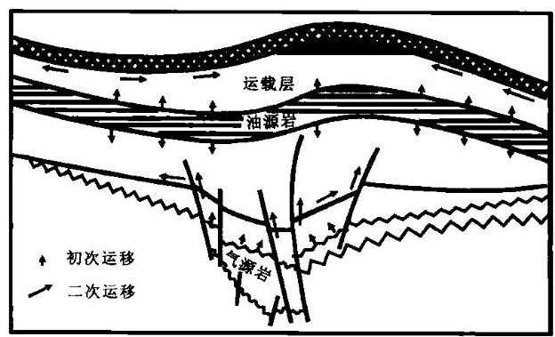

图 6-1 油气初次运移和二次运移示意图

<!-- Media -->

二次运移 (secondary migration) 是指引起进入储集层或运载层以后的一切运移。它包括油气在储集层或运载层内部的运移, 油气沿断层、裂隙和不整合面等通道的运移以及聚集起来的油气由于外界地质条件的变化而引起的再次运移 (图 6-1)。

实际上油气运移是一个自然连续过程。上述划分对某一油气质点来说似乎初次运移和二次运移在时间上有先后之分, 但对整个油气运移作用而言, 初次运移和二次运移是一个几乎同时都在发生的连续过程。另外, 页岩油和煤层气等在特殊地层条件下, 初次运移和二次运移均发生在生烃的致密页岩和煤层中, 宏观上可以将初次运移和二次运移看作整体。

## 二、主要内容

油气运移主要研究油气运移的动力学和运动学机制。具体地说是研究油气运移的动力、相态、通道和数量等方面的内容, 也就是研究油气怎样从烃源岩中排出、何时排出、 排出多少、运移到什么地方、可能在何处聚集、至今还能聚集多少等多方面的问题。油气运移既属于油气地质学的基础理论, 又是应用性很强的研究课题。

油气运移研究本质是寻找和再现油气运移的证据。由于油气运移是延续至今并贯穿于整个地质历史过程的地质事件, 它受制于各种地质作用, 因此, 油气运移的研究应强调动态分析和综合研究相结合。

## 第二节 油气初次运移

油气初次运移是指油气在烃岩源中的运移以及向运载层或储集层中的运移。烃岩源赋存状态 (介质条件) 决定了初次运移研究难度极大。具有微毛细管孔隙的细粒烃岩源中的油气质点排出的动力、相态和通道是初次运移的机制。

## 一、初次运移的介质条件

由于油气初次运移发生在烃岩源内部, 因此, 烃岩源的物理性质及其理化条件, 是影响油气初次运移的重要因素。

## (一) 烃岩源的物理性质

## 1. 烃岩源的压实

随着上覆沉积负荷的不断增加, 下伏先期沉积物逐渐被压实的现象称为压实作用。沉积物的压实作用是一种成岩作用, 是最基本的地质现象之一。它从沉积物埋藏开始一直可以持续到埋深 9000 多米。在压实作用下沉积物的体积密度增加, 孔隙度减小, 孔隙中的流体不断排出。压实沉积物的孔隙度随深度加大而减小, 一般情况下孔隙度与深度之间呈指数关系, 即:

$$
\Phi  = {\Phi }_{0}{e}^{-{CZ}} \tag{6 - 1}
$$

式中: $\Phi$ 为深度 $Z$ 处的岩石孔隙度; ${\Phi }_{0}$ 为沉积物在地表的原始孔隙度; $e$ 为自然对数底; $C$ 为因次常数 $\left( {\mathrm{m}}^{-1}\right)$ ,代表正常压实趋势的斜率。

在正常泥岩中,一般在 ${1000}\mathrm{\;m}$ 以内为主要排水阶段 (深度为 ${500}\mathrm{\;m}$ 时约排出 ${88}\%$ ), 至 ${1500}\mathrm{\;m}$ (已排出 ${95}\%$ 的水) 排水速率明显减缓,至 ${2000}\mathrm{\;m}$ 渐趋于稳定 (至 ${2500}\mathrm{\;m}$ , ${98}\%$ 的水已排出)。碳酸盐岩 (特别是颗粒支撑的粒屑灰岩) 的压实作用也很明显,其孔隙度与深度的变化趋势也相类似 (Schmoker 等, 1982, 1988, 1989)。

砂质沉积物由于质点坚硬, 在压实过程中主要表现为颗粒的进一步密集排列, 所以压缩性小, 体积的压缩很快就趋于稳定。这可从孔隙率的变化上得到反映 (图 6-2)。储存在砂岩孔隙中的流体通常只承受负荷压力的较少部分, 一般接近于静水压力。

泥质沉积物比较细、软, 可塑性较强, 在压实过程中, 除颗粒再排列外, 还伴有颗粒本身的变形, 所以压缩性大, 且压缩持续时间较长。

成熟烃岩源的压实程度一般都比较高, 岩石比较致密、孔隙度比较低, 孔隙中的水和新生烃类流体, 要在上覆负荷作用下通过孔隙系统排出, 通常是比较困难的。

2. 烃岩源的孔隙和比表面

泥质岩的原始孔隙度可以达到 ${60}\%  \sim  {80}\%$ ,但具有不同组分、沉积环境和沉积速率的沉积物在遭受同等压实后可以具有不同大小的孔隙度。成熟烃岩源的孔隙度一般在 ${15}\%  \sim  {20}\%$ 以下,孔隙直径大多小于 $5\mathrm{\;{nm}}$ ,与某些烃类分子的有效直径差不多属于同一数量级 (图 6-3)。

<!-- Media -->

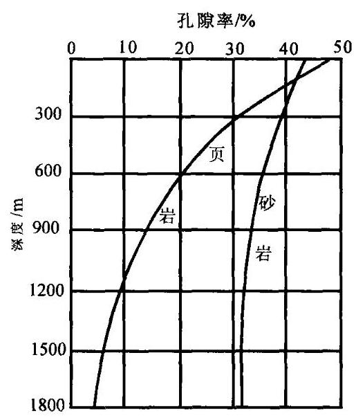

图 6-2 砂、泥岩孔隙率随深度变化图 ( 据 Athy, 1930)

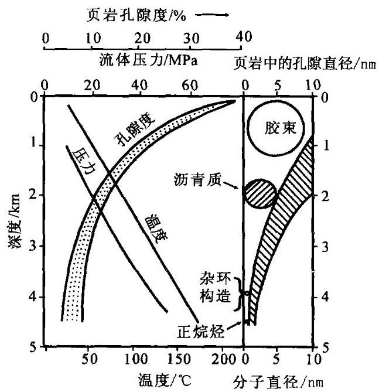

图 6-3 泥质岩的各种物理参数与深度关系

(据 Jungten & Karwell 等. 1970)

<!-- Media -->

石油与天然气地质学中的比表面,是指单位体积岩石中孔隙内表面的总和,用 ${\mathrm{m}}^{2}/{\mathrm{m}}^{3}$ 或 ${\mathrm{m}}^{2}/{\mathrm{{cm}}}^{3}$ 表示。比表面大小直接影响流体与岩石颗粒间的表面分子现象。在相同体积或同等质量的岩石中, 组成岩石的颗粒越细则比表面越大。相同埋深情况下, 泥岩的比表面比砂岩大。Hinch (1978) 对美国湾岸地区第三系同体积的砂岩与页岩进行了比表面的近似计算, ${60}{\mathrm{\;{cm}}}^{3}$ 砂岩内表面为 ${0.3}{\mathrm{\;m}}^{2}$ ,而同体积的页岩内表面为 ${23500}{\mathrm{\;m}}^{2}$ ,约为前者的 8000 倍 (图 6-4), 表明泥质岩较砂岩有大得多的比表面。

比表面大意味着岩石与孔隙流体的接触面增大, 其结果使得更多的分子在相互间的引力和带电极性的作用下吸附在岩石颗粒表面, 给流体的运移带来困难。粘土矿物表面的吸附水层和地层中的部分残留油是由表面分子效应造成的。所以, 越是埋深致密的岩石, 其中的流体流动越难, 滞留其中的流体相对越多。

成熟烃岩源孔隙度小, 孔隙空间细微, 比表面又大, 因而其孔隙流体的排出非常困难。

3. 烃岩源的润湿性与毛细管压力

润湿性是吸附能的一种作用, 指液体在表面分子力作用下在固体表面流散的现象, 一般用在固体表面分离流体所需要的功来度量。由于烃岩源含有许多亲油的有机质颗粒, 又能在一定条件下生成烃类, 在成烃后石油与岩石颗粒表面长期接触以及颗粒表面上的某些变化, 油也可以像水一样附着在颗粒表面使它变为亲油。因此, 可以认为成熟烃岩源是部分亲水、部分亲油的中间润湿状态。

<!-- Media -->

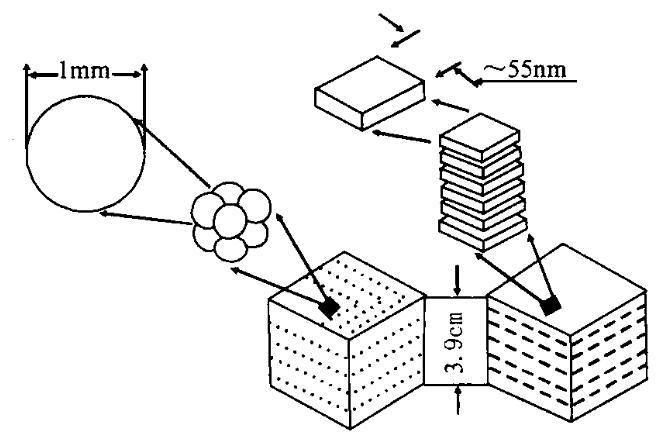

<table><thead><tr><th>颗粒体积</th><th>${50}{\mathrm{\;{cm}}}^{3}$</th><th>${50}{\mathrm{\;{cm}}}^{3}$</th></tr></thead><tr><td>空隙体积</td><td>${10}{\mathrm{\;{cm}}}^{3}$</td><td>${10}{\mathrm{\;{cm}}}^{3}$</td></tr><tr><td>总体积</td><td>${60}{\mathrm{\;{cm}}}^{3}$</td><td>${60}{\mathrm{\;{cm}}}^{3}$</td></tr><tr><td>表面积</td><td>${0.3}{\mathrm{\;m}}^{2}$</td><td>${23500}{\mathrm{\;m}}^{2}$</td></tr></table>

图 6-4 同体积的砂岩与页岩比表面的比较

(据 Hinch, 1978)

<!-- Media -->

毛细管压力是在两种互不混溶流体的弯曲界面上, 由于两边流体所承受的压力不同, 在凹面承受较大的流体压力,毛细管中的这种压力差称为毛细管压力 $\left( {p}_{\mathrm{c}}\right)$ (图 6-5)。 毛细管压力总是指向非润湿相。在亲水介质中, 油为非润湿相, 毛细管压力指向油; 在亲油介质中, 水为非润湿相, 毛细管压力指向水。如果是亲水介质, 油气运移首先要克服毛细管压力, 因此, 通常情况下, 石油与天然气地质学中称之为毛细管阻力。

<!-- Media -->

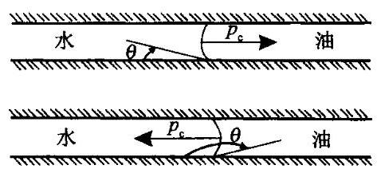

图 6-5 润湿角与毛细管压力方向

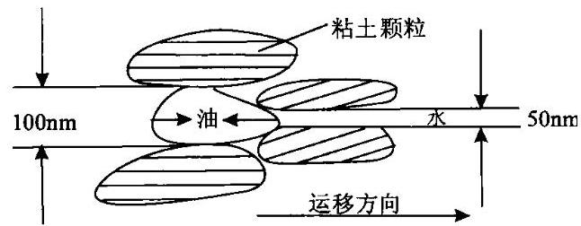

图 6-6 水湿泥岩油相运移所受毛细管阻力

<!-- Media -->

毛细管压力的大小取决于两相流体间的界面张力、毛细管半径和介质润湿性。可以用下述公式表达:

$$
{p}_{\mathrm{c}} = \frac{{2\sigma }\cos \theta }{r} \tag{6 - 2}
$$

式中: ${p}_{\mathrm{c}}$ 为毛细管压力, $\mathrm{{MPa}};\sigma$ 为界面张力, $\mathrm{N}/\mathrm{m};\theta$ 为润湿角,度; $r$ 为毛细管半径, ${m}_{0}$

实际地层条件下, 油气在毛细管组成的三维空间中运移, 必然要经过不同管径的毛细管, 油气所受到的阻力实际上是烃类流体两端的毛细管压力差 (图 6-6)。其公式为:

$$
{p}_{\mathrm{c}} = {2\sigma }\left( {\frac{1}{{r}_{\mathrm{t}}} - \frac{1}{{r}_{\mathrm{p}}}}\right)  \tag{6 - 3}
$$

式中: ${p}_{\mathrm{c}}$ 为毛细管压力, $\mathrm{{MPa}};\sigma$ 为界面张力, $\mathrm{N}/\mathrm{m};{r}_{\mathrm{t}}$ 为岩石喉道半径, $\mathrm{m};{r}_{\mathrm{p}}$ 为岩石孔隙半径, ${m}_{o}$

值得注意的是, 如果在油湿的烃岩源中, 毛细管压力方向指向水, 因而它对石油的运移不完全构成阻力。

## (二) 运移的理化条件

## 1. 温度条件

温度是表示物质冷热程度的物理量。物质是由分子组成, 分子总是不停地做无规则的运动, 温度就是大量分子的无规则热运动平均动能的标志。根据干酪根热降解晚期成烃理论,石油生成的温度范围为 ${60} \sim  {150}^{ \circ  }\mathrm{C}$ ,天然气生成的温度范围更大,对应的深度范围取决于地温梯度。通常情况下, 石油初次运移开始的温度和深度一般大于石油大量生成的温度和深度。

## 2. 压力条件

在油气地质学中, 压力主要指孔隙流体压力, 是指作用在岩石或地层孔隙中流体上的压力, 即地层压力。异常地层压力是指高于或低于静水压力值的地层压力。烃岩源由于其岩性致密, 成岩压实过程中排液不畅普遍造成异常地层压力现象, 从而保持异常高压。对于连续厚度巨大的烃岩源尤其如此。另外, 干酪根热降解生烃也是产生异常高压的原因之一。同时, 对于厚度适中、排液通畅的烃岩源应为正常压力。

## 二、初次运移的机制与模式

## (一) 初次运移的动力和阻力

## 1. 初次运移的动力

驱使油气从烃源岩向运载层中运移的动力主要有压力、构造应力、分子扩散力和浮力。

(1) 压力

初次运移作为动力的压力又包括正常压实产生的剩余压力、欠压实产生的异常压力、 渗透作用产生的渗透压力和烃源岩与运载层接触面产生的毛细管压力。

A. 剩余压力

剩余压力是指发生在正常压实过程中的异常高压力。由于其随着孔隙流体的排出仍保持正常压实状态, 故又称瞬时剩余压力。当上覆新沉积负荷增加时, 下伏岩石遭受压实, 孔隙体积相应减小, 在变化的瞬间, 孔隙流体承受部分由颗粒产生的有效压应力, 使流体产生了超过静水应力的剩余应力。

在正常压实过程中, 压实状态为压实平衡 $\rightarrow$ 瞬时不平衡 $\rightarrow$ 平衡, 流体压力从静水压力 $\rightarrow$ 瞬时剩余压力 $\rightarrow$ 静水压力的连续性转变,因而使得孔隙流体不断排出,同时孔隙体积不断减小。

在剩余压力作用下, 孔隙流体排出的方向与剩余压力递减的方向一致。通常情况下, 上覆沉积物厚度越大, 下伏地层中剩余压力越大, 深部地层中的剩余压力总是比浅部大, 因此在均一岩性的层序里孔隙流体一般是向上排出。如果新沉积物的厚度在横向上变化, 在水平方向上剩余流体压力值在各处将不同 (图 6-7), 且水平剩余压力梯度远小于垂直剩余压力梯度, 因此大部分流体沿垂直方向向上运移, 只有很少部分流体沿水平方向运移。但这只是单一岩性地层中利用排出的情况。在实际的砂泥岩互层剖面中, 由于泥质沉积物与砂质沉积物原始组构和抗压性不同, 在相同负荷下泥岩比砂岩的孔隙度减小快、泥岩排出多, 所产生的瞬时砂岩压力比砂岩大, 因而在砂泥岩互层剖面中流体排出的方向既有向上亦有向下, 总是由泥岩到砂岩。砂岩在压实过程中排出的流体, 只能与泥岩排出的压实流体一起沿砂层侧向运移 (图 6-8)。

<!-- Media -->

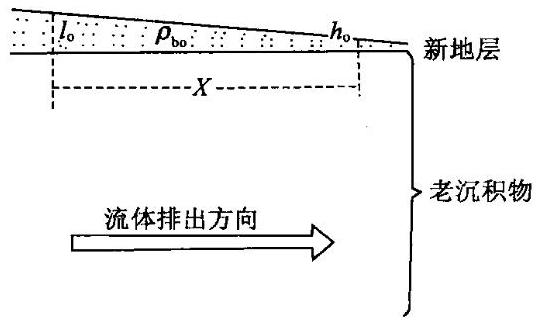

图 6-7 楔状沉积负荷流体排出示意图

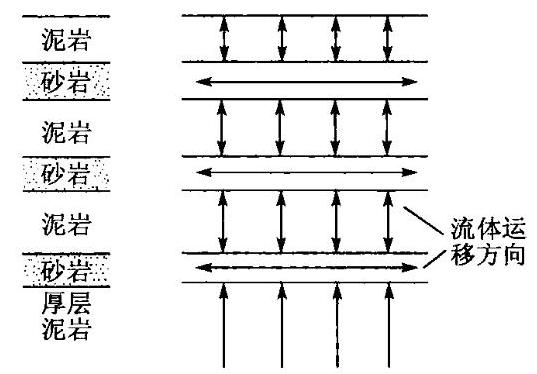

图 6-8 砂泥岩互层流体运移主要方向示意图

<!-- Media -->

一般来说, 盆地的沉积厚度由中心向边缘减薄, 在压实作用下流体总是沿剩余压力减小的方向排出, 因此盆地的压实流体运移大方向总是由下往上、由盆地中心向盆地边缘。

## B. 异常压力

烃源岩在经历了一定程度的压实以后, 许多微小的孔隙, 特别是烃源岩顶底的边缘部分逐渐封闭, 使孔隙流体排不出去或排出困难。因而流体承受了部分上覆沉积的有效压应力, 使孔隙流体具有异常高压力、而岩石则承受较低的有效压应力形成欠压实。这种由欠压实而产生的异常高压, 可以在后期压实和排液的过程中逐渐消失。实际上欠压实烃源岩中的孔隙流体也正是借助于其本身产生的异常高压力, 使相对封闭的烃源岩及不连通的孔隙产生裂隙或重新张开而得以排出。流体排出后异常压力消失或减弱, 烃源岩遭到后期压实, 微裂隙和连通的孔隙又重新封闭, 此后流体压力再次积蓄升高使岩石再次破裂而排液, 这样周而复始直到欠压实和异常压力消失为止。可见, 异常压力的形成与排液释放也具有幕式特征。只是由欠压实产生的异常压力, 在强度上比正常压实过程中产生的剩余压力要大得多。

在连续沉降的盆地中, 烃源岩产生欠压实的深度一般都在生油门限以下, 此时烃类已开始大量生成而异常高压又足以克服烃源岩中的各种阻力使油气排出, 因此异常高压力是初次运移最重要、最有效的动力。此外, 在欠压实形成的异常高压基础上, 烃源岩中的生烃、水热和蒙脱石脱水等作用又能使流体的异常高压进一步加强。

在欠压实层中根据平衡深度的理论分析,可以计算出 (图 6-9) B 处的异常压力最高,形成时间也最早。其上 $\mathrm{D}$ 和其下 $\mathrm{F}$ 处异常压力值比 $\mathrm{B}$ 处低且形成时间较晚。当 $\mathrm{B}$ 处不排液形成封闭时, $\mathrm{D}$ 和 $\mathrm{F}$ 处仍有压实流体排出。由于 $\mathrm{B}$ 处的封隔,在 $\mathrm{D}$ 处排出的流体只能向上或沿水平方向运移; 同理, F 处排出的流体只能向下或沿水平方向运移。可见欠压实程度最高、首先停止排液的 $\mathrm{B}$ 处,实际上控制了层内压实流体排出的方向。

在正常压实与欠压实同时存在的混合压实带中, 地层间出现流体压力差和压力封隔层。正常压实层中流体压力较欠压实层中低, 流体从欠压实地层向正常压实地层中运移, 同时异常高压的欠压实层本身也就成为流体运移的封隔层。这样在混合压实带中, 处于两个欠压实层之间的正常压实层就成为流体汇聚的排液区 (图 6-10)。

另外, 烃源岩生烃作用、水热作用、粘土矿物脱水作用以及胶结和重结晶作用, 是烃源岩异常压力增高的影响因素。

<!-- Media -->

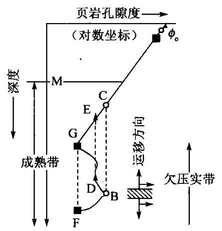

图 6-9 欠压实地层中流体排出方向

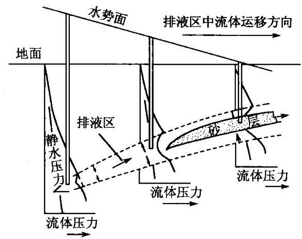

图 6-10 混合压实带中流体排出方向

<!-- Media -->

## C. 渗透压力

渗透作用是自然界普遍存在的重要现象, 它是指水由盐度低的一侧通过半渗透膜向盐度高的一侧运移的作用。众所周知, 溶液的盐度越高蒸气压就越低。水的活动性也越低; 反之则水的活动性就越高。因此水体由活动性高的地方流向活动性低的地方, 形成渗透流。这种作用的大小一般用渗透压力来衡量 (图 6-11)。我们也可以说盐度低渗透压高, 盐度高则渗透压低。因此渗透作用也就是低盐度溶液中的水 (溶剂), 在渗透压差的作用下通过半渗透膜向高盐度方向运移, 直到盐度差消失为止, 可见这种作用是由盐度差引起的。

<!-- Media -->

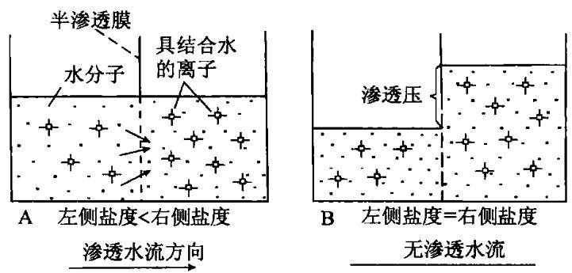

图 6-11 渗透作用示意图

A一初始条件; B一终止条件

<!-- Media -->

虽然渗透作用对地下孔隙水的流动具有重要意义, 但对油气运移特别是游离相的运移只是一个起间接作用的动力因素。

## D. 毛细管压力

在地下亲水介质的多相流动中, 毛细管压力对烃类的运移一般都表现为阻力, 但在以下两种情况, 毛细管压力对初次运移有积极作用, 可成为一种动力。

在烃源岩与运载层接触的界面上, 由于烃源岩一般是较细粒的沉积、孔喉比较小, 而运载层一般是较粗粒的沉积、孔喉相对较大。结果是烃源岩一侧孔喉曲率半径较小, 所产生的毛细管压力较大; 而运载层一侧孔喉曲率半径较大, 毛细管压力较小。两侧的毛细管压力差指向运载层。此时, 紧靠界面烃源岩一侧的油气在此压差的作用下, 能顺利地排到运载层一侧中去 (图 6-12)。这种压差在砂岩透镜体油气藏的形成过程中有重要作用。

在亲水烃源岩内部, 由于孔喉两端毛细管曲率半径不同所产生的毛细管压力也不同, 喉道一端的毛细管压力大于孔隙一端, 两者之差指向孔隙。因此, 润湿相水在此压差作用下可较容易地将烃类排挤到较大的孔隙中去, 使烃类在较大孔隙中相对集中而有利于连续烃相的初次运移。

<!-- Media -->

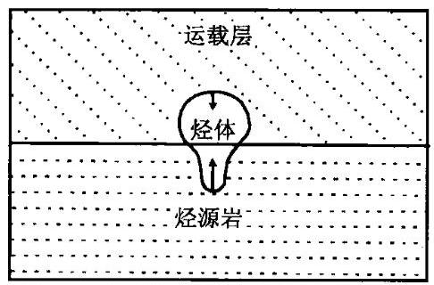

图 6-12 烃源岩与运载层接触面上的毛细管压差示意图

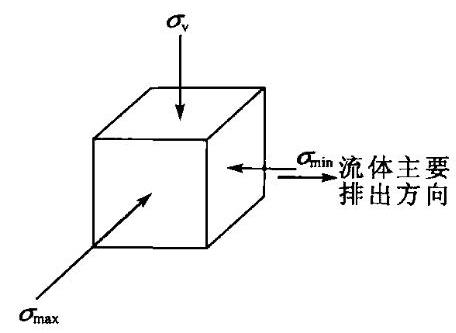

图 6-13 最大主应力为水平应力时主要排烃方向

<!-- Media -->

## (2) 构造应力

构造应力通常是指导致地壳发生构造运动的地应力, 或者是由于构造运动而产生的地应力。这里我们主要讨论水平 (横向) 的构造应力。过去人们一直假设地应力是单纯由岩石的重力引起的, 并分解为垂直应力和水平应力。前面所讲的压实作用及其产生的瞬时剩余压力, 都被认为主要是由垂直应力所引起的。世界各地实测的应力表明, 地壳上部的水平应力总是大大超过由上覆岩石负荷引起的垂直应力, 这说明水平的构造应力不仅普遍存在而且异常活跃和强大。此外, 由于地温的变化也会产生应力, 对一个两侧受限的地质体来说, 温度增加会引起挤压应力, 而温度下降则产生拉张应力。实际上今天所测得的地应力值就是负荷应力、构造应力、温度应力等各种应力的叠加值, 也是地壳变形后的残余应力。所测得的岩石孔隙度和孔隙流体压力, 也都是各种应力作用的结果。

构造应力之所以是初次运移的动力, 是因为烃源岩孔隙度和流体压力的变化, 不仅可以由上覆岩石的负荷应力所产生, 也可以由水平的构造应力所引起, 而大多是两种应力叠加的结果。但当水平的构造应力大于垂直的负荷应力时, 最大主应力则为水平方向, 流体将沿最小主应力方向流动 (图 6-13)。水平的构造应力对岩石的作用也可以理解为侧向的压实, 与负荷应力产生的垂向压实一样可以引起瞬时剩余压力和岩石的破裂, 只是压力梯度和破裂的方向有所不同, 当地层倾角不大时主要是沿烃源岩的水平方向进行。而泥质烃源岩水平方向的渗透率一般都大于垂向的渗透率, 所以沿侧向的初次运移效率会更高。 在构造应力作用下同样可以使岩石变得很致密而导致封闭, 并产生流体的异常高压。随着构造应力的释放和积蓄, 同样可以使初次运移呈幕式进行。显然地壳构造的活动期也是初次运移最活跃的时期。

可以设想在一个沉积巨厚的盆地中, 存在有很强的垂向压实, 若又遭受侧向的构造挤压, 则地层必将变得异常致密, 同时, 由于流体难以排出而产生巨大的异常压力, 最终导致岩层破裂和流体释放。很多前陆盆地就属这种情况。如果这些作用发生在油气生成以后, 必将成为初次运移的强大动力。

(3) 分子扩散力

扩散作用是指由于浓度差而产生的分子扩散。地下岩石的孔喉细小、形状复杂且大多为水所占据。因此烃源岩中的烃类主要是在微孔水介质中进行扩散, 属克努森 (Knudsen) 扩散。由于烃源岩中含烃浓度比周围岩石高, 烃类的扩散方向由烃源岩指向四周围岩, 与初次运移的方向一致, 因此它是初次运移的一种动力, 尤其是气态烃的分子扩散具有更重要的意义。扩散作用在初次运移中的作用主要有以下两个方面。

1) 虽然扩散作用在烃类物质运移方面的效率比较低, 但只要有浓度差存在, 扩散作用就无时无刻不在发生, 甚至在烃源岩欠压实和异常高压状态下也能无阻碍地进行。特别是在干酪根中最初生成的烃类要脱离有机质母体进入孔隙以及当烃源岩深埋变得异常致密、流体的渗流很微弱或停止时, 分子扩散几乎是烃类初次运移的惟一方式。
2) 扩散流 (分子流) 与渗流 (体积流) 在地下孔隙空间中可以相互转换, 各显其能地进行初次运移。即在细小微孔中进行分子流, 到达较大微孔中则转换成体积流, 再遇到细小微孔时又可进行扩散流, 并最终排出烃源岩。因此, 目前有更多的学者主张扩散 - 渗流的初次运移模式。

现在人们越来越认识到分子扩散在初次运移过程中具有某些不可替代的作用, 因而不能单纯用效率来评价扩散作用。

(4) 浮力

浮力在初次运移中只是一种辅助的动力。一方面是浮力在烃源岩细小的微毛细管孔隙中, 相对于油气与岩石分子间的作用力和毛细管阻力来说其作用力是很小的; 另一方面是在烃源岩复杂的孔隙结构中, 油气很难连结成足够的长 (高) 度以产生足够的浮力进行初次运移。所以, 在初次运移中一般较少考虑浮力, 但在烃源岩局部较大的毛细管孔隙或构造裂隙中, 浮力的作用还是存在的, 仍是油气以游离相方式向上或向上倾方向排烃的一种动力。

## 2. 初次运移的阻力

## (1)分子间的吸着力

油气分子与烃源岩矿物表面分子间的吸着力包括吸收、化学吸附和物理吸附三个层次上的分子作用力。泥质烃源岩中少量的干酪根实际上是分散并包裹在粘土矿物的沉积之中。生成的油气首先是附着在矿物表面上, 当其达到饱和后便开始渗入矿物内部产生吸收作用, 紧靠矿物表层的烃分子在静电引力作用下产生化学吸附, 形成有机物 - 粘土复合体, 其外层则是在范德华力作用下产生的物理吸附。这三个层次上的分子吸着力多是过渡存在, 其结合强度由里到外逐渐减弱。解吸作用也是首先由最外层的物理吸附开始, 因此这一部分烃类在一定的外力作用下可运移排出, 而化学吸附和被吸收的部分在一般盆地的自然条件下是很难排出的。

实际上, 生成的烃类首先要满足各种矿物和干酪根本身吸收和吸附的需要, 有多余量时才能进入孔隙空间, 在外力作用下才能被排出。所以, 有机质含量越高、生烃量越大的烃源岩越容易排烃。油气与泥质烃源岩之间分子作用力的大小主要决定于粘土矿物的成分、类型和含量, 例如蒙脱石的吸着能力约分别是伊利石和高岭石的 3 倍和 8 倍, 因此烃源岩中蒙脱石含量越高吸着力越强、油气越不易排出；作用力的大小同样决定于烃类的性质, 例如石油的吸着力比天然气大, 而石油中高分子、带极性的化合物吸着力比低分子、 非极性化合物强, 此外还与烃源岩的结构复杂程度有关, 不连通孔隙越多吸着的烃类越不易排出。可以说吸着力是阻碍初次运移造成烃源岩排烃率低下的主要原因。相比之下, 碳酸盐烃源岩一般含粘土矿物较少, 吸着阻力相对较小, 因此单从这一点来看其排烃效率应比泥质烃源岩高。

(2) 毛细管阻力

除去吸着的烃类以外, 进入孔隙空间中的烃类要以游离相进行初次运移还必须克服巨大的毛细管阻力。若以烃源岩微孔孔径为 ${10} \sim  {50}\mathrm{\;{nm}}$ 计算,其毛细管阻力为 ${12} \sim  {2.4}\mathrm{{MPa}}$ , 说明至少需要如此大的异常压力油气才能运移。这也是除吸着力外, 很多物理学家一直怀疑油气能不能从细粒烃源岩中排出来的另一个原因。这种怀疑对非石油地质家来说是不奇怪的, 因为单从静态的观点来看油气确实很难排出, 但若从整个地质条件的动态变化上看, 由于地下温度、压力、岩石组构运移通道等条件的非均质性最终油气肯定是能排出的。可以说, 这也是油气运移研究的能力所在。

## (3) 油气的浮力

当烃源岩向下或向下倾方向以游离相排烃时, 还要克服油气的浮力。尽管与上述两种力相比浮力比较小, 一般说只要能克服毛细管阻力, 浮力自然也就不成问题了。但浮力总还是初次运移向下排烃时客观存在的一种阻力, 特别是当向下运移距离较大时, 仍是一种不可忽视的阻力。

<!-- Media -->

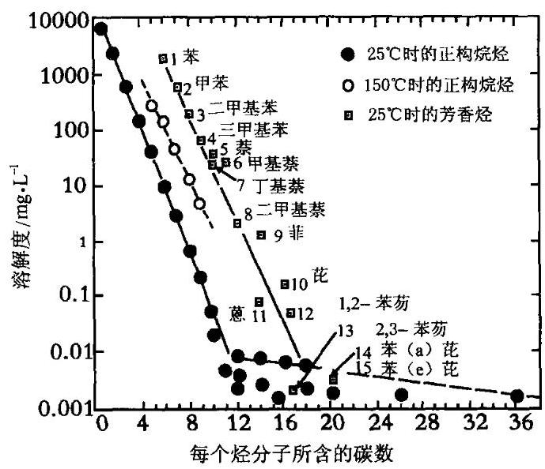

图 6-14 烃在水中的溶解度与碳数的关系图 (据 McAuliffe 等, ${1963} \sim  {1978}$ )

<!-- Media -->

## (二) 初次运移的相态及演变

初次运移的相态是指油气在地下发生运移时的物理相态, 是整个初次运移研究中的一个核心问题, 也是一个有很多争论的问题。关于石油初次运移的相态主要有水溶相、连续油相、气溶相和扩散相。天然气初次运移的相态主要有水溶相、油溶相、连续气相和扩散相。 目前对于石油运移相态的争论较多, 而对天然气运移相态的争论较少。以下介绍几种油气运移的相态。

## 1. 水溶相

石油或天然气分子完全溶解于孔隙水中成为溶液状态进行初次运移。Admas (1903) 最早提出这种观点, 之后得到 Lewis (1924), Baker (1960), McAuliffe (1963 ~ 1978), Price (1976 ~1989) 等人的支持和发展。

在常温下油气在水中的溶解度很低, 不同烃溶解度的大小顺序是: 芳香烃 > 环烷控 > 烷烃, 同族烃中分子越小越易溶 (图 6-14), 因此, 天然气在水中溶解度比石油要大。

有不少作者对水溶液中烃类的增溶作用(包括温度、压力、 ${\mathrm{{CO}}}_{2}$ 含量增加对烃类的增溶作用) 进行了研究。这些因素对天然气的增溶作用较为显著, 但对石油影响较小, 难以提供足以形成工业聚集的烃类浓度或载体。加之, 石油的组成与烃源岩抽提物相近, 而与水溶相烃类的组成相差甚远。因此目前认为, 天然气呈水溶相进行运移可以成为主要的运移形式之一, 而对于石油, 虽然是一种可能的运移相态, 但不能成为主要相态。

## 2. 连续烃相与混合相

连续烃相是指油气呈游离的连续油 (气) 相从烃源岩中渗流排出。烃源岩进入压实的晚期, 孔隙度、绝对渗透率都很低, 孔隙中所剩下的自由水不多, 水的饱和度降低, 相对渗透率也降低。相反, 随着烃类不断生成, 烃的饱和度不断增加, 相对渗透率也增大。另外, 成熟烃源岩内表面还可能有部分是油润湿而不是水润湿的, 所以, 以连续油相或气相运移会受较小的毛细管阻力, 需要的临界含油饱和度也会降低。Dickey 认为低到 ${10}\%$ ,甚至 $1\%$ 以下。再者,生油期间产生的 ${\mathrm{{CO}}}_{2}$ 溶解于油中还可以降低石油的黏度, 增强其流动性 (Momper, 1978)。在这些因素作用下, Dickey 认为在压实时石油就会先于水而排出, 此时石油将呈一种极细但连续的油丝运移。

<!-- Media -->

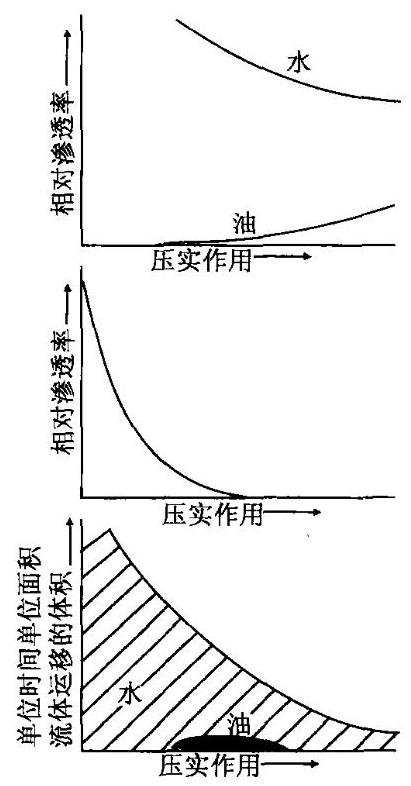

图 6-15 页岩相对渗透率、绝对渗透率及流体流动与压实关系示意图据 (Magara, 1981)

<!-- Media -->

Magara (1981) 根据上述思想绘制了一个油气运移模式图 (图 6-15)。该图表明, 随压实作用的进行, 泥岩的绝对渗透率不断下降, 水的相对渗透率随之减小, 而油的相对渗透率却增大。压实中期是最有利于油相运移的阶段, 因为这时油的相对渗透率已增大, 而泥岩绝对渗透率尚未达到最低值, 也就是说, 油相的有效渗透率可达到最大。

必须指出, 连续烃相运移, 还包括气溶于油和油溶于气的情况。天然气在石油中的溶解度极大,特别是高压油层中 $1{\mathrm{\;m}}^{3}$ 原油可以溶解数百、甚至上千立方米的天然气。大量天然气溶于石油可使石油密度减小, 黏度降低, 极大地增加石油的流动性和运移能力。在特定的温度和压力条件下, 液态烃可溶于气体之中。凝析气田的存在就是证明。Neglia (1979) 根据意大利波河谷盆地 Malossa 凝析气田的生产特性推断: 气体在深度为 ${6100}\mathrm{\;m}$ 、 温度 ${153}^{ \circ  }\mathrm{C}$ 与 ${1050} \times  {10}^{5}\mathrm{\;{Pa}}$ 压力下,可以携带直到 ${\mathrm{C}}_{13}$ 的液态烃。 ${\mathrm{{Co}}}_{\mathrm{{AO}},\mathrm{{AOB}}}\left( {1963}\right)$ 也表示, 温度和压力的增大可使溶质石油的密度降低, 推测在增高的温度与压力条件下, 石油中液态烷烃和环烷烃也可以被溶解。气体溶液运移的基本条件是数十余倍于液相的气体, 因此一般只能发生在深处。

目前大多数学者原则上同意连续烃相运移的观点, 而且对这一观点作了进一步的完善和发展, 由原来的通过压实作用实现运移发展为通过微裂缝排出, 即连续烃相通过微裂缝排烃。这种方式又被称为混相运移, 即游离的油 (气) 相与水相同时渗流。

3. 扩散相

扩散是分子本身自由运动的结果, 从理论上讲, 只要存在浓度差, 任何物质都有扩散的趋势以达到浓度上的平衡。烃源岩生成烃类后, 与外界存在着烃类的浓度差, 因此, 发生烃分子的扩散作用是必然的。问题在于从数量上看扩散作用到底有多大实际意义。扩散相运移在地下总是与其他相态的运移相互补充、相互促进。近年来有更多的学者提出扩散 - 渗流的排烃模式。认为烃类只能是先从干酪根扩散到孔隙中, 然后再以渗流方式排出。煤层气减压解吸 - 扩散 - 渗流的开采方式就说明在致密地层中扩散相运移往往具有不可替代的重要性。

Leythaeuser (1980) 认为, 扩散作用是天然气运移中的有效方式。而对于液态烃, 扩散作用的实际意义要小得多。事实上, 相比而言, 扩散作用在油气藏破坏及形成气体分散晕等方面, 具有相当重要的意义。

4. 初次运移相态的演变

运移相态是研究初次运移的中心问题, 也是初次运移特征的主要标志。它体现了烃类运移的性质是渗流还是扩散流, 并决定着初次排烃量的大小和效率, 是定量评价含油气盆地的基础。油气在地下到底呈什么相态进行初次运移, 又决定于烃源岩的温度、 压力、生烃量、孔隙度、溶解度以及岩石的组构等条件。然而这些条件在地下不是固定不变, 而是随烃源岩的埋深和有机质类型的变化而变化。因此当烃源岩随埋深演化时, 在每个演化阶段初次运移的主要相态就必然有所不同。还要说明的一点就是, 在任何一个演化阶段, 从理论上严格地说都是油气的混相运移。因为烃源岩中总是有水、 油、气存在, 而有水就有水溶相运移, 有油就有油溶相和油相运移, 有气就有气溶相和气相运移, 扩散相在每个演化阶段都存在, 只是各种运移相态在各演化阶段发生的规模大小和重要程度有所不同。这里所讨论的相态演变, 就是指在每个演化阶段具代表性和重要性的主要运移相态的演变。

(1)石油相态演变

对于富含 I 、II 型干酪根的腐泥型烃源岩来说, 在埋藏较浅的未成熟阶段, 由于石油还未大量生成而地层孔隙度又较大, 此时烃源岩中含油饱和度很低, 主要是水相运移; 进入大量生油的成熟阶段后, 一方面生油量大大增加, 另一方面孔隙度又较小, 烃源岩中的含油饱和度变大以致超过临界运移饱和度而发生连续油相运移；随着烃源岩进一步埋深, 在较高温度下, 演化进入高成熟的湿气阶段, 此时石油主要是气溶相(包括凝析气和轻质油)运移; 再往深处石油发生热裂解产生大量甲烷气体, 此时除在较大裂隙和较大孔喉通道中可以发生气相(包括凝析气、超临界气)运移外, 由于地层已相当致密, 主要是扩散相运移。所以, 腐泥型烃源岩石油初次运移主要相态随埋深的演变主要是水溶相 $\rightarrow$ 油相 $\rightarrow$ 气溶相 $\rightarrow$ 扩散相。

对于富含Ⅲ型干酪根的腐殖型烃源岩来说, 在未成熟阶段主要是水溶相。由于烃源岩以产气为主, 在有机质演化的主要阶段, 甚至到成熟阶段也很难发生较大规模的连续油相运移, 而主要是气溶相(包括轻质油和凝析气)运移。在高 - 过成熟阶段主要发生气相 (包括凝析气、超临界气)和扩散相运移。所以, 腐殖型烃源岩石油初次运移主要相态随埋深的演变主要是水溶相 $\rightarrow$ 气溶相 $\rightarrow$ 气相 $\rightarrow$ 扩散相。

虽然石油初次运移的主要相态可以有水溶相、油相、气溶相和扩散相四种, 但实际上, 水溶相运移的作用很有限, 很难形成大量石油的运移; 全石油的气溶相运移也只能发生在高温、高压条件下, 其潜力也受到限制; 而石油的扩散相运移效率又很低, 所以在石油的初次运移中油相运移最为重要, 气溶相运移次之。

## (2)天然气相态演变

对产于富含 I 、II 型干酪根烃源岩中的腐泥气(油型气)来说; 在浅层生物气阶段有水相运移; 在大量生成石油的成熟阶段, 生成的气溶于石油以油为载体进行油溶相运移；在高和过成熟阶段有凝析气和裂解气的游离气相运移；当地层进一步埋深变得异常致密时还有扩散相运移。所以,腐泥气的初次运移相态的纵向演变是水溶相 $\rightarrow$ 注溶相 $\rightarrow$ 气相 $\rightarrow$ 扩散相。

对产于富含Ⅲ型干酪根烃源岩和煤系地层中的腐殖气(煤型气)来说, 因为烃源岩以产气为主,所以初次运移相态的纵向演变是水溶相 $\rightarrow$ 气相 $\rightarrow$ 扩散相。

可见, 天然气初次运移的主要相态有水溶相、油溶相、气相和扩散相等四种方式, 尽管这四种运移方式对以后天然气的聚集有不同的效果和作用, 但对初次运移来说其效率都是可观的, 因此每一种运移相态都具有重要性而不可忽视。

<!-- Media -->

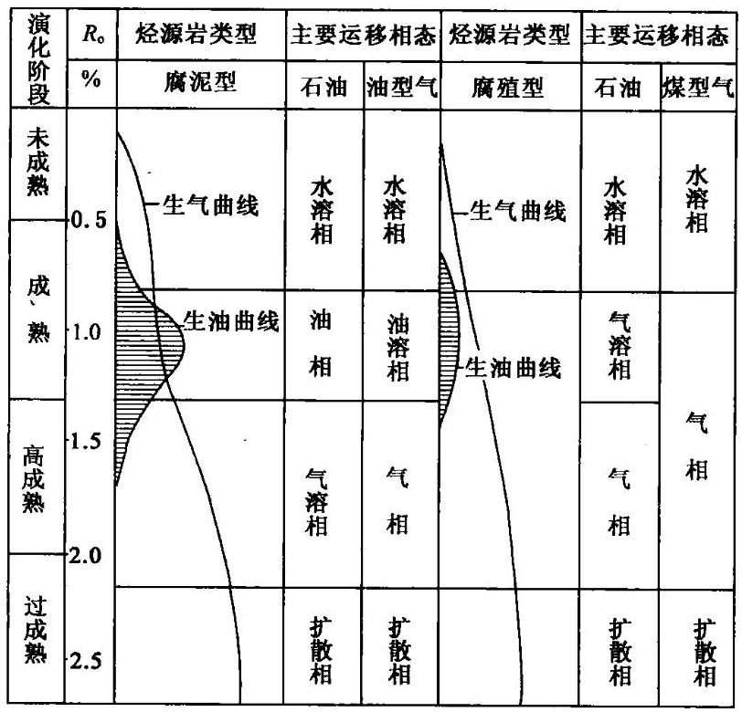

图 6-16 石油与天然气初次运移主要相态纵向演变示意图 (据李明诚, 1994)

<!-- Media -->

通过上述比较 (图 6-16) 不难看出。石油与天然气初次运移相态的根本区别就在于: 石油运移的相态比较单一, 主要是油相和气溶相, 而水溶相和扩散相的重要性很小和比较小; 天然气运移可以是水溶相、油溶相、气相和扩散相, 而且每种相态在不同的阶段都具有重要性。因此, 天然气的运移在各个演化阶段都远比石油活跃。这种特征决定了天然气勘探的时空领域比石油更广阔, 同时也决定了天然气比石油更难以保存。

## (三) 初次运移的通道

初次运移是在烃源岩范围内进行的, 初次运移的通道包括烃源岩中较大孔隙、构造裂缝和断层、微裂隙、缝合线以及有机质或干酪根网络。

1. 孔隙

主要是指烃源岩中孔径大于 ${100}\mathrm{\;{nm}}$ 以上的孔隙,包括微毛细管中的大微孔和少量的毛细管孔隙 $\left( {d \leq  {2\mu }\mathrm{m}}\right)$ ,虽然后者只占泥质烃源岩孔隙的极少数 (平均不到 $5\%$ ),但它不仅能顺利地让扩散流通过, 而且还能发生体积流动 (达西流), 因此是最重要的排烃通道。实际上呈连续烃相运移的油气主要就是通过这不到 $5\%$ 的较大孔隙而排出烃源岩。在这部分较大的孔隙中还包括在有机质降解时期 $\left( {{65} \sim  {90}^{ \circ  }\mathrm{C}}\right)$ ,烃源岩中的矿物成分如方解石、钾长石、高岭石和其他一些粘土矿物被有机酸溶蚀而产生的次生孔隙。

2. 构造裂缝和断层

这里所指的构造裂缝主要是在地应力差作用下烃源岩中产生的裂缝。从板块运动的角度来看, 地壳以水平应力为主, 这是大的应力背景。但对一个断陷盆地来说, 一般认为浅于 ${2000}\mathrm{\;m}$ 以水平应力为主,而深于 ${2000}\mathrm{\;m}$ 则以垂直应力为主,此时可产生近于垂直层面的张裂缝或剪切裂缝。对于以水平应力为主的挤压盆地来说, 则可产生平行于层面的张裂缝或剪切裂缝。张裂缝的宽度一般大于 ${100\mu }\mathrm{m}$ ,属于毛细管孔径,烃类只要克服其毛细管阻力就能顺利通过。

断开烃源岩的断层也是初次运移的重要通道。断层可以由构造裂缝连接发展而成, 同时断层的活动又可以在其邻近形成宽度不等的裂缝带, 说明两者都是地应力变化互为因果的产物。因此断层的通道作用与多组合的裂缝相当。断层还可以造成烃源岩与其他地层在两盘并置, 使烃类流体发生穿断层面的运移进入运载层。此外, 地震泵效应进一步增强了断层的通道作用。即在断层张开和闭合的过程中, 由于体积的扩张和压缩, 流体压力的降低和升高, 致使断层两盘的流体流入和排出。这样, 断层的活动就像是插入烃源岩中的吸管, 将烃类和流体吸入和排出。

## 3. 微裂隙

微裂隙一般指宽度小于 ${100\mu }\mathrm{m}$ 的裂隙,实际测量的宽度大多为 ${10} \sim  {25\mu }\mathrm{m}$ ,最小的宽度可为 $3 \sim  {10}\mathrm{\;{nm}}$ (Neglia,1979)。当地层中异常高孔隙流体压力达到上覆静岩压力的 ${0.7} \sim  {0.9}$ 倍时 (相当于静水压力的 ${1.6} \sim  2$ 倍),在烃源岩中就可以产生张性微裂隙。由于泥质烃源岩的可塑性较强, 需要有很高的过剩压力, 才能使其产生破裂, 而当流体排出、压力释放后微裂隙闭合, 所以不易看到微裂隙。通过仔细的观察发现很多微裂隙就是原来的构造裂隙, 说明由应力差产生的构造裂隙和由高孔隙流体压力产生的微裂隙, 实际上在地下是很难区分的, 往往也是相互叠加、相互影响的。一般地说微裂隙比微孔隙要大, 而且比较平直, 烃类运移所受到的毛细管阻力相对较小。如果说烃类的生成是产生异常高压和微裂隙的重要原因, 而微裂隙又是初次运移的重要通道, 那么生烃和排烃这两种作用必然是一个连续的地质过程。

4. 缝合线

缝合线也可以作为初次运移的通道 (Leythaeuser, 1995), 它广泛发育在碳酸盐岩、 蒸发岩中, 特别是含泥质石灰岩中的缝合线, 是成岩后生阶段压溶作用的产物。缝合线往往顺层面分布, 但与层面呈斜交或正交的也不少, 其中常含有泥质、铁质或有机物等不溶残渣。缝合线与构造裂缝在岩石中往往交织在一起组成同一体系。在显微镜下观察, 缝合线中还发现有不少张开的微裂隙和微孔隙, 其中还有油浸和液体沥青。所有这些说明缝合线与各种裂缝一样都是初次运移的重要通道。

## 5. 有机质或干酪根网络

Momper (1978) 等认为, 烃源岩中的有机质并非呈分散状, 主要是沿微层理面分布。 McAuliffe (1979) 进一步证实, 烃源岩中还存在有二维的干酪根网络。微层理面可以理解为层内的沉积间断面, 其本身具有相对较好的渗透性, 如果再加上相对富集的有机质又可使其具有亲油性。若在微层理面之间再有干酪根相连, 那么在大量生油阶段, 不但微层理面本身, 而且在三维空间它们很容易就形成相互联通、无毛细管阻力的亲油网络, 从而成为初次运移的良好通道。

总之, 由于烃源岩本身的非均质性, 决定了在埋深过程中必然要形成大小不一、纵横交错的孔隙和裂缝系统, 再加上后期形成的次生孔隙、微裂隙、缝合线以及干酪根网络, 从而形成了烃源岩多种多样的排烃通道。尽管烃源岩中以微孔和微裂隙为主, 但也存在有较大的孔隙和裂缝, 实际上它们各有不同的作用。较大的孔隙和裂缝虽然较少但可以发生效率较高的体积流, 而在不能发生体积流动的微小孔隙和裂隙中则可以发生扩散流, 两者在时空上可以相互转换、相互补充。这说明细粒的烃源岩也总是有运移通道存在, 只要有驱动力总是可以排烃的。

## (四) 初次运移基本模式

通过上述有关初次运移动力和阻力、相态和通道的分析, 初次运移的机制已经很清楚了, 即初次运移是一个复杂过程, 油气在不同条件影响下, 可以呈现多种相态, 通过多种通道排出烃源岩。动力、相态和通道可以有多种组合, 每种组合型式实际上就代表一种初次运移模式。油气初次运移可以归纳为三种最基本模式: 正常压实模式、异常压力模式、 扩散模式, 其他模式都是这三种模式的延展。

1. 正常压实模式

在未熟一低熟阶段, 烃源层埋深不大, 生成油气的数量少, 烃源岩孔隙水较多, 渗透率相对较高, 部分油气可以溶解在水中呈水溶状态, 部分可呈分散的游离油气滴, 在压实作用下, 随压实水流, 通过烃源岩孔隙运移到储集层中。这一模式是基于压实作用对烃源岩排液的影响而提出的。在此模式基础上为了解决溶解度过低的问题, 还提出了孔隙中心网络、干酪根网络等具体模式。

2. 异常压力模式

在成熟一过成熟阶段, 烃源岩层已被压实, 孔隙水较少, 渗透率较低, 烃源岩排液不畅, 有机质大量生成油气, 孔隙水不足以完全溶解所有油气, 大量油气呈游离状态。同时, 欠压实作用、蒙脱石脱水作用、有机质生烃作用以及热增压作用等各种因素导致孔隙流体压力不断增加形成流体异常高压, 成为排烃的主要动力。

异常压力排烃存在两个相互联系和转化的过程。一是当烃源岩孔隙网络内部建立起的压力增加还不足以引起岩石产生微裂缝时, 如果孔隙喉道不太窄, 或因为存在着连续的有机相和有干酪根三维网络而使得毛细管压力并不太大时, 油气就可以从烃源岩中慢慢驱出, 不需要裂缝存在。在这种情况下, 油气在异常压力作用下排驱是一个连续的过程。二是当孔隙流体压力很高而导致烃源岩产生微裂缝时, 这些微裂缝与孔隙连接, 则形成微裂缝 - 孔隙系统。在异常高压驱动下, 油气水通过微裂缝 - 孔隙系统向烃源岩外涌出。当排出部分流体后压力下降, 微裂缝闭合。待压力恢复升高和微裂缝重新开启后, 又发生新的涌流。因此, 这一阶段是油气水以一种间歇式、脉冲式 (不连续) 方式进行的混相涌流。

上述连续油气相运移过程和脉冲式不连续混相运移过程是异常压力增高过程中的两个阶段, 两者可以相互转化, 周期性发生。

## 3. 扩散模式

轻烃, 特别是气态烃, 具有较强的扩散能力。由于扩散作用是一种分子运移行为, 因此与体积流相比, 效率较低, 但在源岩中轻烃扩散具有普遍性。

许多学者认为, 气体依靠扩散进行的初次运移, 只发生在烃源层内比较短的距离中 (Hunt, 1979; Barker, 1980; Leythaeuser, 1982)。气体通过短距离的扩散进入最近的输导层面、裂缝系统、断层和所夹的粉砂岩透镜体中后, 即转变为以其他方式进一步运移到储集层中。因此, 轻烃的扩散可以作为一种辅助运移模式。但是, 对于非常致密的深层储集层, 或者处于流体异常高压状态的地层, 流体的渗流几乎不可能进行, 这时, 天然气的扩散作用则显得更为重要。

## 三、初次运移的其他问题

## (一) 初次运移的时期

原则上说, 在油气生成之后, 只要具备了排烃的条件, 就有可能发生初次运移。所以, 油气主生成期是初次运移发生期的最早时间。要进一步确定更具体的时间, 必须研究初次运移的条件和结果。

<!-- Media -->

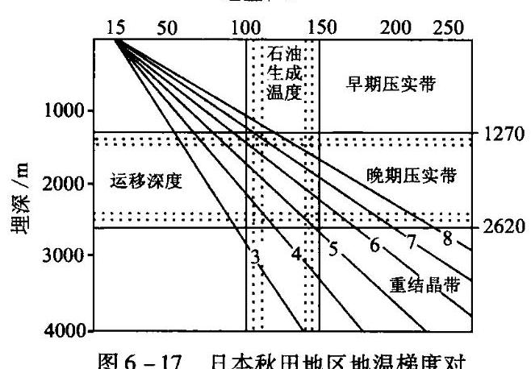

油气运移的影响

(据青柳宏一和浅川忠, 1979)

<!-- Media -->

## 1. 根据压实阶段确定

青柳宏一和浅川忠 (1979) 认为, 早期压实阶段石油尚未生成, 重结晶阶段石油难以排出 (图 6-17), 故最重要的初次运移发生在晚期压实阶段。日本的中新世沉积石油生成温度约为 ${100} \sim  {150}^{ \circ  }\mathrm{C}$ 。他推测日本秋田 (Akita) 晚期压实阶段 (也即初次运移期间) 相当于埋深 ${1300} \sim  {2600}\mathrm{\;m}$ 。 如地温梯度为 ${8}^{ \circ  }\mathrm{C}/{100}\mathrm{\;m}$ ,则初次运移期间地温为 ${119} \sim  {223}^{ \circ  }\mathrm{C}$ ,超出生油温度范围, 形成大油藏的可能性小, 但可形成气藏; 若地温梯度按 ${3}^{ \circ  }\mathrm{C}/{100}\mathrm{\;m}$ 计,则初次运移期温度为 ${54} \sim  {93}^{ \circ  }\mathrm{C}$ ,低于生油所需温度,只能有生物甲烷气体; 若地温梯度为 ${5}^{ \circ  }\mathrm{C}/{100}\mathrm{\;m}$ ,则初次运移温度为 ${80} \sim  {145}^{ \circ  }\mathrm{C}$ ,这种情况下形成大油藏的可能性是很大的。青柳宏一和浅川忠实际上是考虑了有利的压实期(作为排烃期) 与主生油期的匹配关系。类似的研究还有真柄钦次 (1980), 在此不再重复。

2. 根据微裂缝形成时间确定

按照微裂缝排烃的模式, 初次运移发生的时间就是微裂缝形成的时间。微裂缝形成时间可根据油气生成史、异常压力史研究确定, 一般用计算机模拟来实现。不同的概念模型计算的结果有差别,一般 ${R}_{\mathrm{o}}$ 为 ${0.5}\%  \sim  {0.7}\%$ 即可产生微裂缝而发生初次运移。

## 3. 根据有机包裹体确定

有机包裹体是运移期油气的原始样品。通过成岩序次的研究, 测定有机包裹体形成的温度, 就可确定油气运移的时间及深度。

此外, 根据地球化学分析, 也可确定油气运移的时期和深度。

## (二) 初次运移的方向

初次运移的方向取决于油气初次运移的驱使因素和通道特征。前已论述, 烃源岩内的孔隙压力差是最重要的驱使因素。根据烃源岩的基本特点不难理解, 这个压力差的方向主要是垂向的,侧向变化居次要地位。另外,受最小应力 ${\sigma }_{3}$ (一般为水平的) 控制的断裂经通道方向也是近垂直的。所以, 初次运移的方向主要是垂向的, 一般情况下, 以垂直向上更为重要。但实际运移方向常与生、储组合型式有关, 如储集层位于烃源岩上方, 则可能以向上运移为主。

## (三) 初次运移的距离

<!-- Media -->

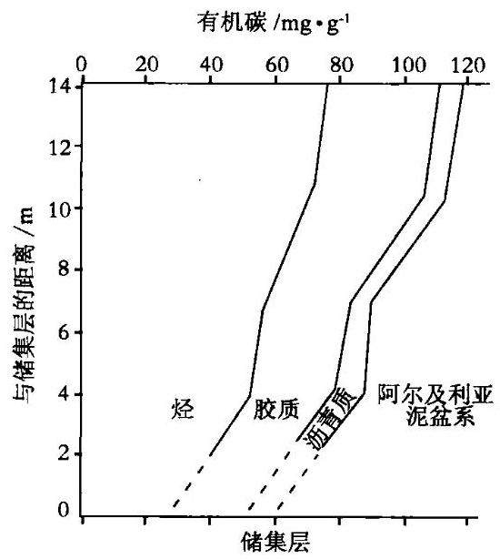

图 6-18 阿尔及利亚泥盆系页岩中抽提物的含量及组成与有机碳的比值向储集层方向的变化

( 据 Tissot, 1978)

<!-- Media -->

由于厚层泥岩的中间部分是欠压实的, 其所封存的烃未及时排出, 所以产生了烃源岩有效厚度问题。蒂索根据对阿尔及利亚泥盆系泥质母岩抽提物的含量及组成的分析发现, 在靠近储集层烃源岩的 ${10}\mathrm{\;m}$ 左右厚度范围内,轻的、易流动的成分 (如烃类) 向储集层方向减少; 而重的、不易流动的成分向相反方向增多 (图 6-18)。这表明烃源岩的初次运移排烃, 是距离储集层越近的地方越优先而有效。因此, 有些研究者认为, 巨厚的烃源岩只有顶、底各 ${20} \sim  {30}\mathrm{\;m}$ 才是有效的。然而,异常高压终归是要释放的, 只是迟早而已。被封存在泥岩中部的流体, 在漫长的地史中总要逐步替补泥岩顶底排出流体的位置, 只是烃源岩越厚, 这个替补过程越缓慢。鉴于初次运移主要是垂向运移, 特别是在以微裂缝作为主要运移通道的情况下更是如此, 所以特殊情况下, 初次运移的距离最大极限就是烃源岩厚度。

前面提及, 烃源岩中在平行层面方向干酪根分布的连续性要好些, 按理油气侧向初次运移阻力应该小些, 运移距离也理应长些。但目前尚未见这方面资料的报道。侧向初次运移主要发生在盆地边缘、盆地内横向岩性变化相变带以及烃源岩被断层切割部位。烃源岩受渗透性所限, 估计油气侧向初次运移距离也不会很远。

<!-- Media -->

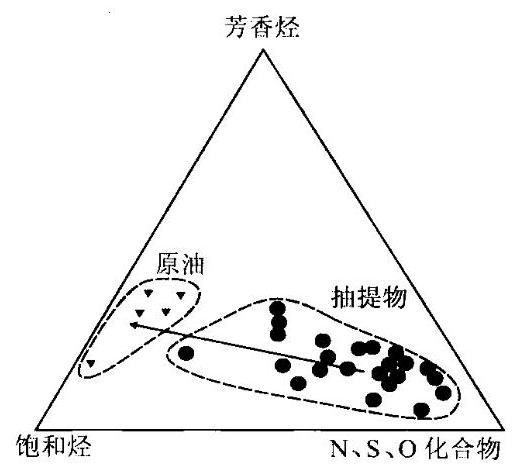

图 6-19 法国帕朗蒂盆地侏罗系原油与烃源岩抽提物的化合物组成

(引自 Barker, 1979)

<!-- Media -->

## (四) 初次运移的效率

油气从烃源岩中排出前后, 在组成上有所变化。由于粘土矿物和固态有机质对烷烃的吸附程度比对芳烃强,比 $\mathrm{N}\text{、}\mathrm{\;S}\text{、}\mathrm{O}$ 化合物弱,因此,烷烃最优先排出, 故石油中一般是饱和烃含量大于芳烃、芳烃含量大于 $\mathrm{N}\text{、}\mathrm{\;S}\text{、}\mathrm{O}$ 化合物 (图 6-19)。

油气, 特别是石油, 从烃源岩中排出的效率是很低的。据 Hunt 等人的估算, 储集层中的烃量占不到烃源岩中烃的百分之一。如果考虑损失到其他地方的烃, 那么经初次运移出来的烃量最多只占烃类生成总量的百分之几, 不超过百分之十。

排烃程度可用排烃效率来表示。排烃效率是指烃源岩排出烃的质量与生成烃的质量百分比。排烃效率是定量评价含油气盆地的资源远景必不可少的参数。常见的计算方法可分为两类, 一类是根据生烃量减残烃量求得排烃量, 另一类是按照排烃模式直接计算理论排烃量。不同学者计算的结果存在很大的差别, 但一般认为天然气的运移效率比石油高。

## 第三节 油气二次运移

油气的二次运移是指油气自源岩中排出并进入邻近运载层以后沿储集层、断层、裂隙、不整合面等通道的运移。广义的二次运移泛指油气脱离母岩后所发生的一切运移, 包括聚集起来的油气由于外界条件的变化所引起的再运移。

油气经初次运移进入储集层后, 尚需经二次运移进入圈闭才能聚集起来形成油气藏。 可见二次运移与油气的聚集密切相关。因此, 了解油气二次运移和聚集对指导油气的调查和勘探具有实际意义。

## 一、二次运移的介质条件

二次运移是初次运移的接续, 二次运移的输导体系主要是结构较粗的砂岩或其他孔隙性岩层。其孔隙的直径相对较大, 是地下水活动的主要途径, 又常有大气降水的补给, 运移条件与初次运移有很大差异, 其影响因素也相对要简单些。

与烃源岩相比, 储集层具有较大的孔径和孔隙空间、低流体压力、低地温、高盐度和弱吸附力 (表 6-1)。这些介质条件上的差异, 成为人们划分初次运移和二次运移最重要的依据。

## 二、二次运移的机制与模式

## (一)二次运移的主要动力与阻力

## 1. 二次运移的主要动力

一方面, 油气以游离相进行二次运移, 在静水条件下其动力主要是浮力, 在动水条件下除浮力外, 水动力视其大小和方向有不同程度的作用; 以水溶相进行二次运移时, 其动力主要是水动力。对天然气来说, 无论是游离相运移还是水溶相运移, 都存在有气体分子的扩散。因为二次运移以游离相最为重要, 所以浮力也就成为最主要的动力。从另一方面来说, 由于浮力只决定于油、气、水本身的密度差, 在地质历史过程中其性质变化很小, 地层中只要有油、气、水存在就有浮力产生, 几乎不受外界条件的限制, 很少有今、古浮力之分。因此浮力不仅是二次运移最重要的动力, 也是二次运移永恒的动力。

<!-- Media -->

表 6-1 储集层与烃源岩介质物性比较

<table><thead><tr><th>主要物性 地层</th><th>孔径</th><th>流体压力</th><th>地温</th><th>盐度</th><th>吸附力</th></tr></thead><tr><td>烃源岩层</td><td>小</td><td>大</td><td>高</td><td>低</td><td>强</td></tr><tr><td>储集层</td><td>大</td><td>小</td><td>低</td><td>高</td><td>弱</td></tr></table>

<!-- Media -->

## (1) 浮力

众所周知, 油 (气) 在水中的浮力是由于油 (气)、水两种物体密度不同而产生的。 根据阿基米德原理, 物体在水中所受到的浮力等于该物体排开同体积水的重量。当水中物体所受到的浮力大于物体本身重量时, 则物体在水中上浮, 反之则下沉。由于油、气的密度均小于水, 单位体积的油气排开同体积水的重量, 也就是单位体积的油气所受到的浮力, 必然大于油气本身的重量, 因此油气也必然要在水中浮起。其上浮力的大小等于同体积的水与同体积的油或气的重量差, 实质上为静浮力。用公式表示则为:

$$
F = V\left( {{\rho }_{\mathrm{w}} - {\rho }_{\mathrm{{og}}}}\right) g \tag{6 - 4}
$$

式中: $F$ 为浮力, $\mathrm{N};V$ 为连续油的体积, ${\mathrm{m}}^{3};{\rho }_{\mathrm{w}}$ 为地层水的密度, $\mathrm{{kg}}/{\mathrm{m}}^{3};{\rho }_{\mathrm{{og}}}$ 为地下油气密度, $\mathrm{{kg}}/{\mathrm{m}}^{3};g$ 为重力加速度, ${9.8}\mathrm{\;m}/{\mathrm{s}}^{2}$ 。

油、气的密度范围分别为 ${0.71} \sim  {1.0}\mathrm{\;{kg}}/{\mathrm{m}}^{3}$ 和 ${0.00073}\mathrm{\;{kg}}/{\mathrm{m}}^{3}$ (甲烷) $\sim  {0.5}\mathrm{\;{kg}}/{\mathrm{m}}^{3}$ (高压混合气),而水的密度为 ${1.0} \sim  {1.2}\mathrm{\;{kg}}/{\mathrm{m}}^{3}$ ,油、气与水之间存在着比重差异,因而在重力场中油气总有在水中升浮的趋势。浮力的大小不仅与流体间的密度差有关, 同时还与油 (气) 柱的高度有关。如果把体积 $V$ 换算成单位面积乘高(Z),则上式变为:

$$
F = Z\left( {{\rho }_{\mathrm{w}} - {\rho }_{\mathrm{{og}}}}\right) g \tag{6 - 5}
$$

此时 $F$ 是指单位面积上高为 $Z$ 的油柱所产生的浮力,单位为 $\mathrm{N}/{\mathrm{m}}^{2}\left( \mathrm{\;{Pa}}\right)$ 。可见, ${\rho }_{\mathrm{w}}$ 与 ${\rho }_{\mathrm{{og}}}$ 的差值越大,油柱 $Z$ 越高,则浮力 $F$ 越大。

在自由水中或自由水面之上任一高度的油气所受到的浮力, 实际上就等于该高度的静水压力与静油压力之差 (图 6-20)。对常见的地下油水来说,浮力梯度一般取 ${2.25} \times$ ${10}^{3}\mathrm{\;{Pa}}/\mathrm{m}$ ,而地下气水系统的浮力梯度变化在 $\left( {{4.6} \sim  {116}}\right)  \times  {10}^{3}\mathrm{\;{Pa}}/\mathrm{m}$ 范围内。可见,气水系统的浮力梯度比油水系统的浮力梯度至少大两倍以上。也就是说, 天然气在水中的浮力比石油(在相同油气柱高度下)至少大两倍以上。

当地层倾斜时 (图 6-21), 浮力将分解成垂直于层面和平行于层面的两个分力。促使单位面积连续油相沿地层上倾方向上浮(运移)的力, 等于其浮力沿地层倾斜向上的分力 $\left( {F}_{1}\right)$ ,用公式表示为:

$$
F = Z\left( {{\rho }_{\mathrm{w}} - {\rho }_{\mathrm{{og}}}}\right) g \cdot  \sin \alpha  \tag{6 - 6}
$$

即单位面积连续油相沿倾斜地层上浮的分力 ${F}_{1}$ 与地层倾角的正弦成正比。

必须注意,上式中 $Z$ 所代表的应该是与水平面成垂直方向上连续油相的高度,而并非连续油相与地层层面成垂直方向上的厚度(M),二者的关系应为: $Z = M/\cos \alpha$ 。

<!-- Media -->

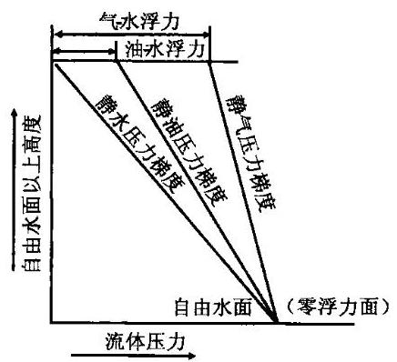

图 6-20 储集层中油气浮力示意图

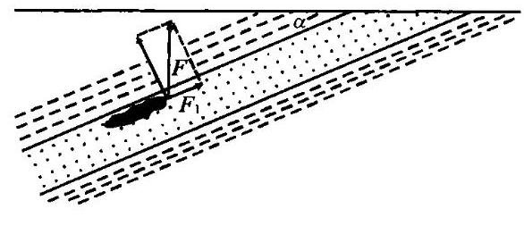

图 6-21 油气在倾斜地层中的浮力

$F$ 一浮力; ${F}_{1}$ 一沿地层倾斜方向的浮力; $\alpha$ 一地层倾角

<!-- Media -->

## (2)水动力

水动力是推动地层孔隙水流动的动力。因此, 它也是推动水溶相油气或密度与水接近的重质油进行二次运移的主要动力。油、气在地层中多与水共存组成孔隙流体, 水的流动也必然会对油气的运移产生作用和影响。地层中的水动力可以由差异压实作用和重力作用而产生, 并形成压实水动力和重力水动力。

## A. 压实水动力

主要出现在盆地持续沉降和差异压实的阶段和过程中, 并由此而产生压实水动力和压实水流。通常是在相同时期内盆地中心的地层较厚、沉积负荷较大, 边部地层较薄、沉积负荷较小, 由此而产生差异压实水流, 其方向主要是由盆地中心向盆地边缘、由深处往浅处运移。压实水流的大方向与油气在浮力作用下运移的大方向基本一致。因此促进了油气在浮力作用下的二次运移和在地层中的原始聚集与分布。根据美国的研究资料, 由压实水动力产生的压实水流,在克拉通盆地中流速仅为 $5\mathrm{\;m}/\mathrm{{Ma}}$ ,在前陆盆地中可达 ${500}\mathrm{\;m}/\mathrm{{Ma}}$ 。 可见, 在沉积速率缓慢和沉积厚度差异不大的盆地或层段中, 压实水动力对油气二次运移的影响和作用并不明显。

## B. 重力水动力

随着盆地沉降的停滞和进一步的成岩变化, 压实作用变得越来越不明显, 加上后期的地壳运动使地层翘倾、上拱甚至褶皱, 地层在盆地边缘往往出露并与大气水相通形成向盆地中心倾斜的水势面。在水势差的作用下产生重力水流, 其方向主要是由盆地边缘的高势区流向盆地中心的低势区。重力水流的大方向与油气在浮力作用下运移的大方向正好相反, 虽然在适当的条件下可以形成水动力圈闭, 但当其太强时常会把已聚集的油气冲出圈闭, 使油气藏遭到破坏, 引起油气的再运移和重新分布。根据美国的研究资料, 重力水流的流速一般在 ${10}\mathrm{\;{km}}/\mathrm{{Ma}}$ 以上。可见,重力水动力对油气二次运移的影响和作用要比压实水动力大得多。

以上两种水动力一般是随盆地演化先后产生 (图 6-22), 并可在地层剖面上呈旋回式出现。

<!-- Media -->

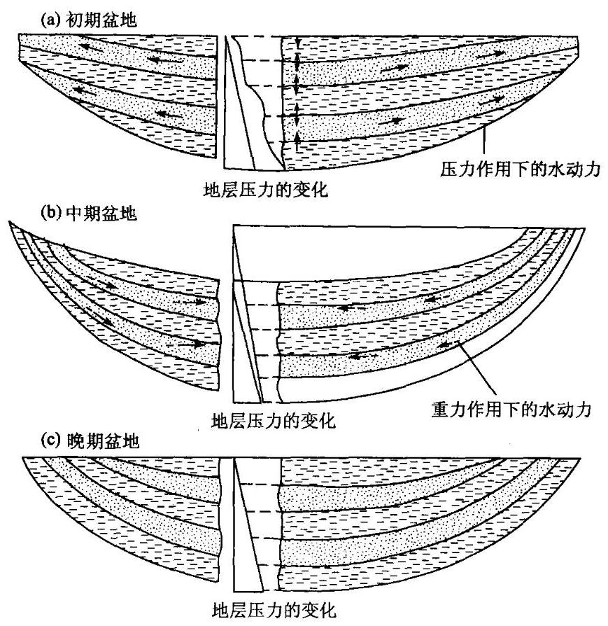

图 6-22 盆地演化过程中的水动力

(据 Coustau 等, 1975)

<!-- Media -->

## C. 上倾水流和下倾水流

通过对上述两种水动力的分析可以得知, 水动力对油气的二次运移和聚集可以产生积极和消极的双重作用, 即当水动力方向与油气上浮方向一致时, 水动力将成为二次运移的动力; 当水动力方向与油气上浮方向相反时, 水动力则成为二次运移的阻力。人们常把成为动力的水流称为上倾水流, 把成为阻力的水流称为下倾水流。虽然压实水流的大方向与油气上浮的大方向常相一致, 而重力水流的大方向与油气上浮的大方向却往往相反, 但地层的产状在地下是变化的, 因此对盆地中某一段地层或某一构造而言, 水流方向与浮力方向是否一致, 就不能用压实水流或重力水流的大方向来宏观描述, 而用上倾水流或下倾水流来表示则更为确切 (图 6-23)。若从圈闭聚集的角度来看, 上倾水流虽增加了向上运移的浮力但却减少了上倾方向的封闭能力, 下倾水流虽减少了向上运移的浮力但却增加了对下倾方向的封闭能力。因此, 对水动力的双重作用, 需要从运移及圈闭聚集角度全面认识。

<!-- Media -->

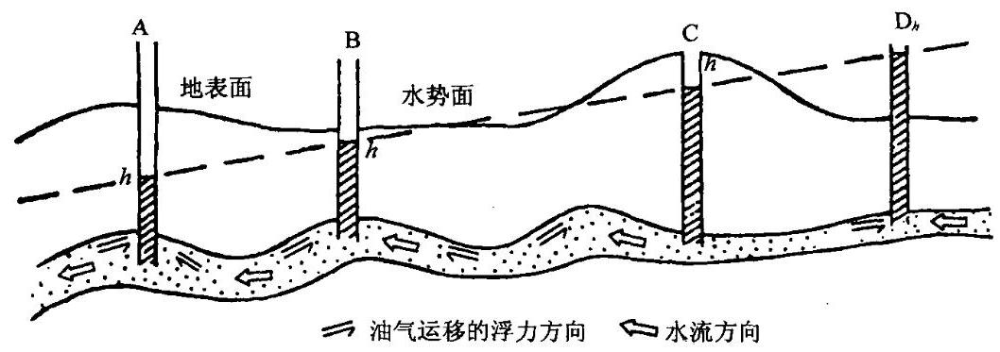

图 6-23 褶曲地层中的上倾水流和下倾水流

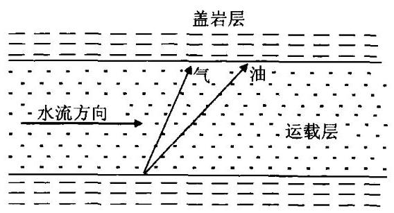

图 6-24 水动力对油、气浮力方向的影响

<!-- Media -->

水动力不仅影响二次运移动力的大小, 而且还影响着油气运移的方向。在静水条件下, 等势面是水平的, 油气运移的方向只决定于重力, 即在浮力作用下垂直向上, 受盖层限制时则沿上倾方向运移。在动力条件下, 水平的等势面变为向水流方向倾斜的平面, 垂直等势面的法线方向就是流动方向。此时水流使垂直上浮的油 (气) 体向水流方向偏移。当水动力梯度一定时, 偏移的大小还取决于油 (气) 与水之间的密度差。如果石油的密度与水很接近, 那么它们的流动方向就很一致; 由于气、水之间密度差大, 所以气体运移的方向比石油更接近于铅直 (图 6-24)。如果要进一步确定水动力对二次运移方向的影响, 则需了解地下油气水的密度、水势梯度、地层构造图等一系列的参数和资料, 计算和编制出等油 (气) 势面图, 才能得出在水动力条件下油气运移的方向。

## (3) 扩散力

烃类只要存在着浓度差, 烃类的分子扩散就可以在任何时空中发生, 而地下烃源岩生成的烃类所形成的原始浓度就是进行分子扩散的源头。因此轻烃的扩散不仅可以在烃源岩中发生, 而且接着就可在运载层中进行直到地表进入大气圈 (图 6-25), 可以说这是自然界中一个没有停顿的连续过程。可见, 在初次和二次运移过程中分子扩散都是一种动力, 尤其对气态烃更为明显和重要。虽然分子扩散在二次运移中相对于浮力、水动力、异常压力只是一种次要的动力, 其速率比油气的渗流小几个数量级, 但在某些地质条件下, 特别是在水动力梯度很微弱的致密地层中, 分子扩散就成为二次运移的主要动力和方式, 在非常规的深盆气、煤层气、透镜体中油气的运聚成藏过程中起着重要的作用。

<!-- Media -->

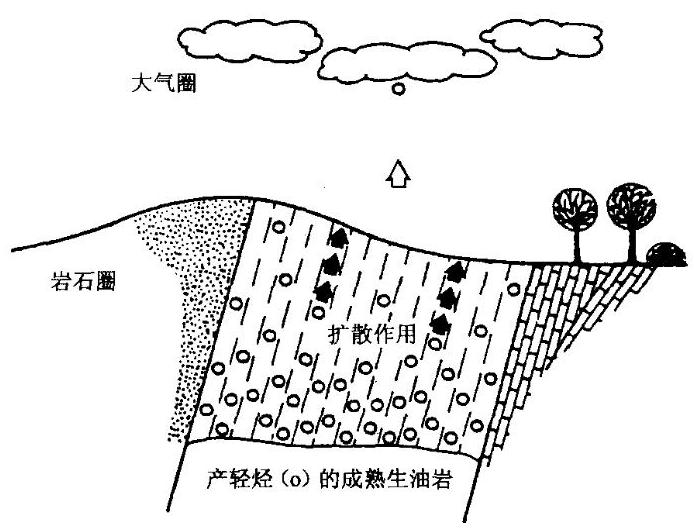

图 6-25 轻烃从烃源岩到地表的扩散

(据 Leythaeuser 等, 1982)

<!-- Media -->

由于分子扩散主要是受浓度梯度控制, 它总是从高浓度区向低浓度区扩散, 在此过程中既有与油气运移一致的方向, 也有其他方向。因此在二次运移过程中分子扩散又是一种导致散失的因素。特别是当油气处于圈闭状态下, 烃类气体聚集形成高浓度的扩散源, 此时天然气通过上覆盖层的扩散就更明显地表现出散失性。尽管目前在求取有效扩散系数和扩散量的计算上还有差异和较大出入, 但分子扩散是气藏遭受散失破坏的一种重要途径这一点不容置疑。看来这就是气藏较油藏难于保存, 并要求有更高质量盖层的重要原因, 也是气藏形成时期越晚越有利于保存的道理所在。

## 2. 二次运移的阻力

油气二次运移中最主要和最普遍的阻力就是毛细管压力。

上述章节讨论的毛细管压力是单根毛细管, 一端完全是油 (气)、另一端完全是水的情况。实际上, 此时所产生的毛细管压力并不能代表油气在地下岩石中运移的阻力。因为地下岩石都是由不同孔径的三维空间介质所组成, 不是孔径相同的单一毛细管。进入储集岩中的油气, 在水介质中运移总是被水所包围, 当它们通过两端孔径不同的孔喉时, 油气所受到的毛细管阻力实际上是两端不同孔径的毛细管压力差:

$$
\Delta {p}_{\mathrm{c}} = {2\sigma }\left( {\frac{1}{{r}_{\mathrm{t}}} - \frac{1}{{r}_{\mathrm{p}}}}\right)  \tag{6 - 7}
$$

<!-- Media -->

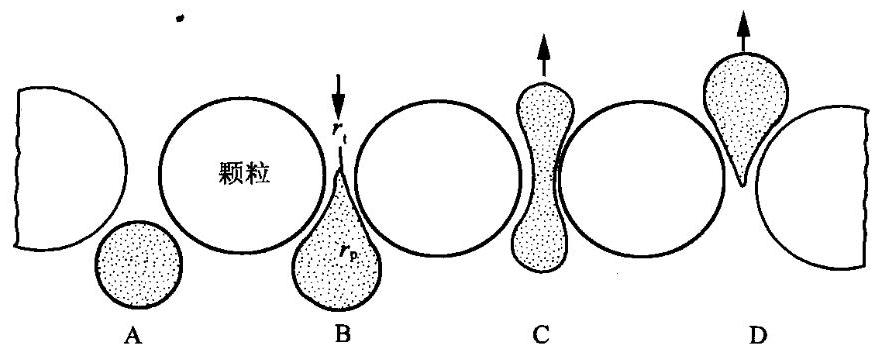

图 6-26 油体在储集层中运移状态

( 据 Berg, 1975)

${r}_{\mathrm{p}}$ 一孔隙半径; ${r}_{\mathrm{t}}$ 一喉道半径

<!-- Media -->

如图 6-26 所示,假定储集岩由均匀球形颗粒组成,孔隙半径为 ${r}_{\mathrm{p}}$ ,喉道半径为 ${r}_{\mathrm{t}}$ , 孔隙空间被水充满, 颗粒表面为水所润湿, 在静水条件下有一油珠上浮, 现分析所受毛细管阻力的情况。图中, A 处浮力不足以使油珠表面变形而进入喉道。B 处当浮力或其他外力增大时, 油珠变形, 顶端进入喉道。由于油珠上、下两端孔径不同, 两端毛细管压力也不相同,上端毛细管压力 ${p}_{\mathrm{u}} = {2\sigma }/{r}_{\mathrm{t}}$ 指向下,下端毛细管压力 ${p}_{\mathrm{d}} = {2\sigma }/{r}_{\mathrm{p}}$ 指向上,两者方向相反大小不同,因为 ${r}_{\mathrm{t}} &lt; {r}_{\mathrm{p}}$ ,所以 ${p}_{\mathrm{u}} &gt; {p}_{\mathrm{d}}$ ,两端毛细管压差指向下,因此对上浮的油珠表现为阻力 $\left( {p}_{\mathrm{c}}\right)$ ,其大小可表示为 $\Delta {p}_{\mathrm{c}} = {p}_{\mathrm{u}} - {p}_{\mathrm{d}}。\mathrm{C}$ 处油珠上下两端界面曲率半径相等,两端毛细管压力也相等。此时毛细管压差等于零, 也就是无毛细管阻力, 油珠在浮力作用下可以顺利通过。D 处由于油珠上端界面曲率半径大于下端界面曲率半径, 上端毛细管压力小于下端, 毛细管压差的方向与油珠上浮的方向一致, 此时毛细管压差非但不是阻力, 而且还是驱使油珠上浮的附加动力。

通过上述分析不难看出,油 (气) 通过孔喉运移时的 $\mathrm{A}\text{、}\mathrm{\;B}\text{、}\mathrm{C}\text{、}\mathrm{D}$ 四种状态,无论是 $\mathrm{B}$ 处表现出的阻力还是 $\mathrm{D}$ 处表现出的附加动力,都是发生在一个连续的过程中。在地下岩石三维的通道空间里, 油 (气) 每通过一个孔喉就会有这四种状态和过程发生, 只是面临的孔径不同。因此油气运移的最大阻力, 就决定于岩石最小喉道和最大孔隙所产生的毛细管压力差。然而油气在岩石中也会本能地选择最小阻力方向的通道运移, 也就是沿着由最大孔隙和最大喉道组成的路径运移。然而, 在相同的通道条件下。天然气运移的毛细管阻力一般要大于石油运移的 2 倍以上。

## 3. 油气质点受力分析和二次运移条件

## (1)油气质点受力分析

从物理角度讲, 油气二次运移实际上是油气在含水介质中的机械渗流过程。石油与天然气只是密度不同而已。单位质量的石油质点在渗流过程中受重力、浮力、水动力和毛细管力 4 种力的作用 (图 6-27)。当地下储集层中的水处于流动状态时, 油气受到水动力的作用。如第四章所述, 推动单位质量石油质点运移的水动力值等于:

$$
{F}_{\mathrm{{og}}} = \frac{{\rho }_{\mathrm{w}}}{{\rho }_{\mathrm{{og}}}}{E}_{\mathrm{w}} \tag{6 - 8}
$$

浮力和水动力的矢量和 $\left( {E}_{\text{动力 }}\right)$ 是油气运移的动力。其大小为:

$$
{E}_{\text{动力 }} =  - \frac{{\rho }_{\mathrm{w}} - {\rho }_{\mathrm{{og}}}}{{\rho }_{\mathrm{{og}}}}g + \frac{{\rho }_{\mathrm{w}}}{{\rho }_{\mathrm{{og}}}}{E}_{\mathrm{w}} \tag{6 - 9}
$$

<!-- Media -->

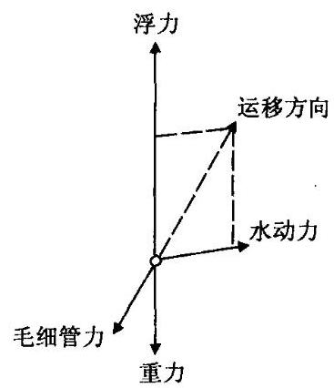

图 6-27 油气质点受力分析示意图

<!-- Media -->

## (2)二次运移条件

油气二次运移是有条件的。首先,孔隙中油气饱和度 ${S}_{0}$ 、 ${S}_{\mathrm{g}}$ 必须不小于临界油气饱和度。只有这样,连续油气才会有相对渗透率和有效渗透率。其次, 二次运移的动力必须不小于阻力才行。

油气经过初次运移进入储集层时可能是分散的游离状态, 这时油气数量少, 体积小, 所受驱动力不大, 不足以克服毛细管压力差的阻碍, 因此微小的油滴将处于停滞不动的状态。随着初次运移的持续进行, 油滴增大, 逐渐成丝连片, 总的驱动力也越来越大。此外, 烃类物质从烃源岩进入储集层时压力降低, 溶有气体的石油体积增大, 密度降低, 使驱动力增加, 即所谓溶解气效应。由于这两个原因, 使烃类驱动力逐渐增大, 直到动力大于毛细管压力差时, 便发生二次运移。

无论油滴、油丝或油片,其所受的力应该是它的质量(m)和油的力场强度 $\left( {E}_{\text{油 }}\right)$ 的乘积,即 $\left( {m \times  {E}_{\text{抽 }}}\right)$ 。假定一定油丝的截面积为 1,长度为 ${\Delta L}$ ,则油丝所受的驱动力为 ${\rho }_{\mathrm{o}} \times  {\Delta L} \times  {E}_{\text{油 }}$ 。二次运移的条件可表达成:

$$
{\rho }_{\mathrm{o}} \cdot  {\Delta L} \cdot  {E}_{\mathrm{o}} \geq  {2\sigma }\left( {\frac{1}{{r}_{\mathrm{t}}} - \frac{1}{{r}_{\mathrm{p}}}}\right)  \tag{6 - 10}
$$

$$
{\Delta L} \geq  \frac{{2\sigma }\left( {\frac{1}{{r}_{\mathrm{t}}} - \frac{1}{{r}_{\mathrm{p}}}}\right) }{{\rho }_{\mathrm{o}} \cdot  {E}_{\mathrm{o}}}
$$

也就是说, 油气必须累计到一定的长度或高度, 才能克服毛细管阻力发生二次运移。

## (二)油气在二次运移中的相态

初次运移的油气可以呈游离相、水溶相和扩散相进入运载层二次运移空间, 二次运移初期的相态基本上继承了初次运移的相态, 由于二次运移与初次运移在动力学环境的物理条件上有所不同, 很快就会在运移相态上发生变化和转换。此外, 二次运移的空间范围和运移距离都比初次运移大得多。因此在运移过程中随着地下温度、压力的变化除了相态之间可以转换外, 同一相态中的油气也会产生变化和组成分异。结果使二次运移的相态变得很复杂。

## 1. 石油二次运移的相态与转换

初次运移的石油可以呈油相、气溶相、水相和扩散相进入运载层, 其中以油相和气溶相最为重要, 对二次运移来说更是如此, 因为二次运移一旦圈闭成藏最终表现为油相或气相的聚集, 在此过程中无须相态上的转换。

如果石油以水溶相进入运载层或储集层, 随着温度、压力的降低、盐度的增高, 石油在水中的溶解度也随之降低而出溶。再加上水中甲烷和二氧化碳等气体的析出和胶束状溶液被大量钙、镁离子所破坏, 使部分增溶的石油也从水溶液中卸载出来。这些出溶的石油慢慢聚成大小不等的油珠, 分散在整个二次运移的通道之中, 除非有机会连结成较大的油体, 这些分散孤立的微石油才有可能继续进行二次运移。McAuliffe (1979) 根据石油在不同温度水中的溶解度,计算了地温梯度为 ${3.6}\mathrm{C}/{100}\mathrm{\;m}$ 时,水溶相在储集层中由 ${527}\mathrm{\;m}$ 深处、温度为 ${162}^{ \circ  }\mathrm{C}$ 运移到 ${267}\mathrm{\;m}$ 深处、温度为 ${152}^{ \circ  }\mathrm{C}$ 时,能分离出百万分之 20 左右的油。 如果由 ${1524}\mathrm{\;m}$ 深处上升到 ${1219}\mathrm{\;m}$ 深处,温度同样下降了 ${10}^{ \circ  }\mathrm{C}$ ,但此时只能分离出百万分之 1.5 的油。可见, 越是在地温较低的浅处出溶的石油越少, 如此少的油要达到一定体积或一定的饱和度至少需要上万倍孔隙体积的水通过, 说明石油以水溶相进行二次运移效率很低, 很难通过这种运移方式聚集成藏。至于液态烃在运载层孔隙水中的扩散, 在地下虽可发生, 但目前一般认为速率太低, 对石油的聚集没有直接的意义。

<!-- Media -->

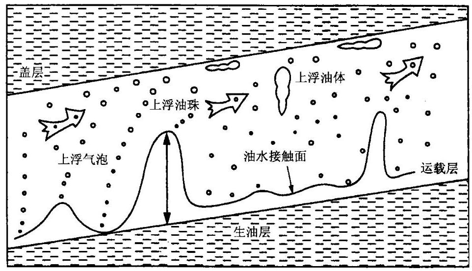

图 6-28 石油排入运载层底部后的可能分布与相态

(转引自李明诚, 1994)

<!-- Media -->

如果石油是以油相运移进入运载层, 虽然二次运移通道空间中自由水增多, 含油饱和度会立即降低甚至变成分散的油珠, 但它们可以很快地得到补充形成较大的油体而开始运移 (图 6-28), 一旦遇到圈闭, 油相运移不需要发生相态的转换就可以聚集起来, 因此在二次运移中油相是最有效、最重要的运移相态。

## 2. 天然气二次运移的相态与转换

天然气初次运移的相态可以是水溶相、油溶相、气相和扩散相, 在不同条件下它们都是可以使大量天然气排出烃源岩的相态。对天然气的二次运移来说虽也存在这四种运移相态, 但它们的重要性却有明显的差别, 这是因为二次运移相态的重要与否也要从聚集的角度来衡量。

水溶相在初次运移中很重要, 而在二次运移中, 饱含天然气的水溶液进入运载层的水体后, 首先变得不饱和, 水中天然气不能立即出溶。但由于温度、压力、盐度等因素的变化终将有一部分天然气从水中出溶变成游离相, 并分散在运移通道之中。这些微小孤立的气泡要继续进行二次运移, 也遇到水溶相石油运移时同样的问题。所不同的是天然气在水中溶解度大, 在水中溶存的也多, 因此在一定的条件下可以形成少量的水溶气聚集。

天然气在运载层中呈扩散相运移是不同于液态石油运移的最大特征。只要有浓度差存在, 天然气的分子扩散就可以在任何时空中发生。对于扩散相运移来说, 初次运移和二次运移完全是一个无需任何相态转变、无需任何停顿的连续过程。特别是在流体渗流停滞或在聚集圈闭状态下, 天然气的扩散相运移更具重要性。但是扩散相运移大多导致天然气的散失, 只当在运移过程中地层间存在有扩散系数差时, 或当介质发生变化扩散流转为体积流时, 才能直接或间接地导致部分天然气的聚集。

天然气以游离气相运移进入运载层后无需进行相态的转变, 直接可以在通道空间中形成微聚集, 并能较快地达到一定的体积或一定的饱和度而继续二次运移。这一点与石油呈游离相进行二次运移的重要性是相同的。

<!-- Media -->

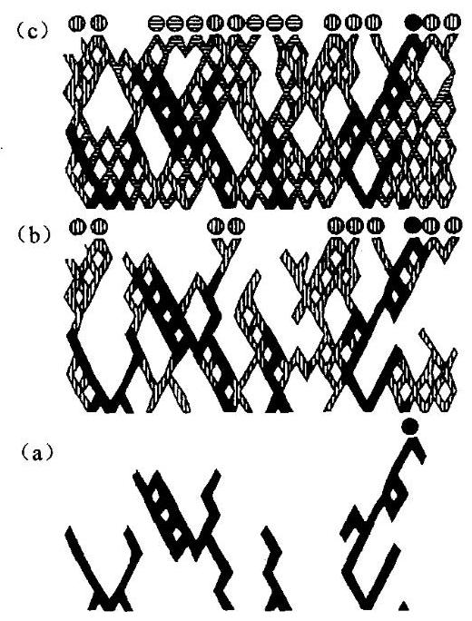

图 6-29 岩石中连通孔隙 5 种大小的组构

(据 Matthews, 1996)

(a) 包括第 4 、第 5 数量级的孔喉;

(b) 包括第 4 、第 5 和第 3 数量级的孔喉;

(c) 包括第 4、第 5、第 3 和第 2 数量级的孔喉

<!-- Media -->

## (三) 二次运移的通道

## 1. 连通孔隙

连通孔隙实质是地层流体可在其中流动和渗滤的孔隙空间。其大小相当于储集层的有效孔隙度。在砂质岩层中有效孔隙度可占绝对 (总) 孔隙度的 ${80}\%$ 以上,泥质岩层较低,约占 ${60}\%  \sim$ ${80}\%$ ,而煤则低于 ${50}\%$ 。在那些不连通的孔隙中烃类只能发生分子扩散。

Matthews M. D. (1996) 把细粒岩石连通孔喉的直径按大小划分为 5 个数量级,即 $1 \sim  {10}\mathrm{\;{nm}}$ (第 1 数量级)、 ${10} \sim  {100}\mathrm{\;{nm}}$ (第 2 数量级)、 ${100}\mathrm{\;{nm}} \sim  {1\mu }\mathrm{m}$ (第 3 数量级)、 $1 \sim  {10\mu }\mathrm{m}$ (第 4 数量级)、 ${10} \sim  {100\mu }\mathrm{m}$ 以上 (第 5 数量级),如图 6-29所示, 并认为运载层或储集层连通孔喉的组构一般是: 由数量级 5、4 组成的大孔喉占整个连通孔喉的 $5\%$ ,由数量级 5、 4 及 3 组成的大中孔喉占整个连通孔喉的 50%,而由数量级 $5\text{、}4\text{、}3$ 及 2 组成的大中小孔喉占整个连通孔喉的 ${80}\%$ 。虽然连通的大孔喉只占 $5\%$ ,但烃类将优先沿此通道运移,如果在连通孔喉网络中不存在这 $5\%$ 的较大通道, 则游离相的烃类在浮力作用下将很难在地层中运移。说明连通孔喉网络的存在, 特别是其中较大的连通孔喉, 数量虽少但却是孔喉网络通道中最重要、最关键的部分。

流体通过连通孔隙的能力一般用渗透率来衡量。渗透率的大小又取决于岩层的孔隙结构, 即孔隙与喉道在数量、大小与分布的配置关系, 其中连接孔隙与孔隙之间的喉道是控制的关键因素。从运移通道的角度来看, 我们希望喉道半径越大越好、孔隙半径与喉道半径的差值越小越好, 这样就可以增加岩层的渗透率、减少油气在运移中的毛细管阻力。对于具相同孔隙度的岩层来说, 由于孔隙结构的不同, 它们的渗透率也就完全不同。因此, 不能单纯从岩层孔隙度的大小来判断渗透性的好坏。但通常的情况, 特别是对较均质的岩石来说: 孔隙度越大, 渗透率越大; 孔隙度越小, 渗透率也越小, 但两者并无明显的正相关关系。在碳酸盐岩储集层中, 除连通孔隙是运移通道外, 广泛发育的各种次生连通的溶洞既是储集空间、又是很好的运移通道。

## 2. 裂隙 (缝)

裂隙 (缝) 是指在岩层中没有造成位移的各种缝隙。它只破坏了岩层的完整性, 而没有发生大的错断和位移, 因此这里不包括各种断裂。在岩层中裂隙的分布极为广泛, 是一种到处可见的地质结构, 也可将其视为一种特殊的孔隙。

<!-- Media -->

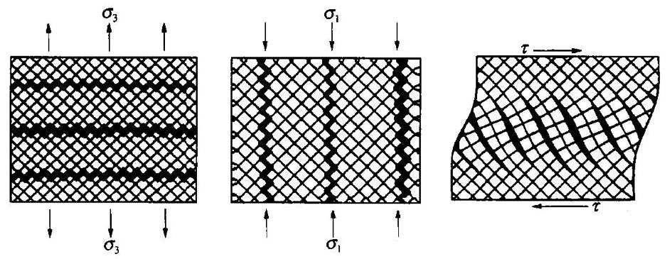

图 6-30 张裂隙和剪裂隙形成示意图

(据王新洲, 1996)

<!-- Media -->

裂隙的分类有很多, 从成因上可分为构造裂隙和成岩裂隙两大类。构造裂隙又可分为在正应力作用下产生的张裂隙和在剪切应力作用下产生的剪切裂隙 (图 6-30)。它们多具有一定的方向和组系, 一般不受层面的限制延伸较远, 可以切割不同岩性的地层, 而且裂隙边缘比较平直, 是穿层运移的重要通道。此外, 当地层具有异常高压时可与地应力叠加起来使岩层发生水力破裂, 此时据异常压力和应力值的大小, 既可产生张裂隙, 也可产生剪裂隙。成岩裂隙可以发生在成岩作用的各个时期, 有早期的收缩缝和晚期的溶蚀缝等。成岩裂隙一般不具方向性, 延伸不长, 受层面限制, 形状不规则且缝面有弯曲, 是层内运移的重要通道。裂隙又可按其张 (宽) 度的大小分为大裂隙和微裂隙两类。前者的张度大于 ${100\mu }\mathrm{m}$ ; 后者的张度小于 ${100\mu }\mathrm{m}$ ,多在 ${10} \sim  {20\mu }\mathrm{m}$ 之间,最小可到 $3 \sim  {10}\mathrm{\;{nm}}$ 。两者只有张度大小的差别, 其分布规律和特征大多相同。人们常用裂隙密度、裂隙张度、裂隙孔隙度和裂隙渗透率等裂隙参数, 来描述地下天然裂隙的发育程度和各种特性。运载层或储集层中的裂隙是二次运移的主要通道, 对致密碳酸盐岩地层就更为重要。 3. 断层

很多沿断层出露的油气显示就是断层可作为油气运移通道最直接的证据。但断层对油气运移具有封闭性也是显而易见的, 大量与断层圈闭有关的油气藏也是最直接的证据。此外, 断层两盘存在着高流体势差、超压与欠压实、地面差异沉降等都说明断层对地下流体有封闭作用。面对上述众多相反的证据, 断层主要起通道还是封闭作用的问题目前还有争论。一些学者认为断层是盆地深部油气往上运移的惟一通道, 因而强调其通道性; 一些学者认为沿断层面往上运移从物理上讲是很难发生的, 因而强调其封闭性。因此, 断层作为油气运移的通道还是作为封闭要具体分析, 不能一概而论。

<!-- Media -->

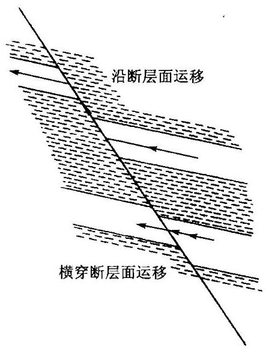

图 6-31 断层带油气运移示意图 (据 Chapman, 1983)

<!-- Media -->

实际上断层与油气运移的关系应当分两个具体问题来讨论, 一是横穿断层面的运移, 一是沿断层面的运移 (图 6-31)。横穿断层面的运移主要决定于断层两盘并置的岩性。如果砂岩层与泥岩层并置, 那么砂岩中的流体很难发生穿断层面的运移。如果断距比较小或是砂岩层很厚, 断层两盘仍有砂岩层并置则仍有穿断层面的运移。沿断层面运移的问题比较复杂, 从理论上讲至少要有三个先决条件: 第一, 断层两盘地层的渗透率很低, 横穿断层面的运移难以发生; 第二, 断层面本身必须具有一定的渗透率; 第三, 沿断层面上下必须具有流体势梯度。一般是只有当横穿断层面的运移受阻时, 才可能发生沿断层面的运移。如果沿断层面的运移也受阻, 这时断层才能真正起到封闭作用。可见, 在三维空间里断层至少要在两个方向上形成封堵才具有封闭性, 而只要在一个方向上形成通道就具有通道性。由此看来断层的通道性似乎更为普遍。

## 4. 不整合面

不整合面是油气二次运移的主要通道, 不整合面作为二次运移通道具有以下几个特点: ①不整合面代表着一次区域性的地壳运动或沉积间断, 往往使下伏地层遭受风化侵蚀、溶解淋滤, 形成具较高孔、渗的古风化壳或古岩溶带。但是不整合面要作为运移通道, 其上必须为不渗透的岩层所封闭, 否则只能成为类似一般具孔、渗性的地层单元。 ②不整合面要成为良好的运移通道, 其下伏地层最好是抗风化溶蚀力弱的岩石, 这样不但可以发育各种裂缝, 而且其张开性和抗闭合能力也强, 才能为流体运移提供最佳通道条件。我国与不整合面有关的油气田大部分都是碳酸盐岩潜山和风化壳。③不整合面一般都具有区域性, 在三维空间上分布广, 因此, 能在大面积上汇集烃类并形成长距离的运移通道, 能把不同时代、不同岩性的生、储岩层连通起来形成油气田。④不整合面在时、空上具有相对的稳定性。后期的改造相对较弱, 不像断层可以多次活动、延伸和生长。

## 5. 有效通道空间

由于储集层的非均质性, 油气的二次运移不可能在整个运载层中发生, 只可能在非均质储集层中沿孔渗性最好、毛细管阻力最小的通道运移。李明诚 (1989) 提出了有效通道空间概念, 定义为运载层中真正发生了运移作用的通道。油气首先进入有效通道空间, 沿油气优势通道运移 (图 6-32), 它对油气二次运移量和聚集量的研究具有重大意义。

## (四) 二次运移主要模式

<!-- Media -->

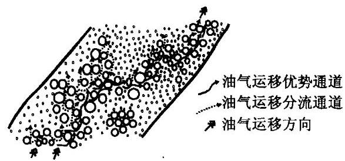

图 6-32 油气运移有效通道空间与优势通道示意图

(据庞雄奇, 2003)

<!-- Media -->

在上述机制条件下, 油气二次运移具有多种模式。本书主要介绍多相渗流模式和扩散模式。

1. 多相渗流模式

对于地下孔隙水中呈连续烃相的油气, 二次运移过程中的渗流大多是油、气、水三相渗流, 并简化为油 - 水或气 - 水的两相渗流。如果不考虑毛细管力的作用, 水动力对油气运移有很大影响。多相流体渗流最为合理和方便的表述是用水势描述油、气势。在第四章现代圈闭概念中已经论述。即:

$$
{\Phi }_{\mathrm{o}} = \frac{{\rho }_{\mathrm{w}}}{{\rho }_{\mathrm{o}}}{\Phi }_{\mathrm{w}} - \frac{{\rho }_{\mathrm{w}} - {\rho }_{\mathrm{o}}}{{\rho }_{\mathrm{o}}}Z \tag{6 - 11}
$$

$$
{\Phi }_{\mathrm{g}} = \frac{{\rho }_{\mathrm{w}}}{{\rho }_{\mathrm{g}}}{\Phi }_{\mathrm{w}} - \frac{{\rho }_{\mathrm{w}} - {\rho }_{\mathrm{g}}}{{\rho }_{\mathrm{g}}}Z \tag{6 - 12}
$$

在静水条件下,由于水势 ${\Phi }_{\mathrm{w}}$ 为常数,所以油势 ${\Phi }_{\mathrm{o}}$ 、气势 ${\Phi }_{\mathrm{g}}$ 只与高程 $Z$ 有关。高程越大, 对应油、气势越小; 高程越小, 对应油、气势越大。其表现为深处是油、气势的高势区, 浅处是油、气势相对低势区, 故油气总是从下向上运移, 同时油、气等势面为水平面。

在动水条件下, 油、气势取决于水势和高程。由于水势是从供水区向泄水区变小, 所以油、气的负势梯度向泄水区偏转。又由于气的密度较油小, 所以偏转角度要小一些。总体上油 (气) 水界面向水流下游方向倾斜, 即是此原因。

油、气的力场强度可表述为:

$$
{E}_{\mathrm{o}} =  - \nabla \Phi  =  - \nabla \left( {{gZ} + \frac{p}{{\rho }_{\mathrm{o}}}}\right)  = g - \frac{\nabla p}{{\rho }_{\mathrm{o}}} \tag{6 - 13}
$$

$$
{E}_{\mathrm{g}} =  - \nabla \Phi  =  - \nabla \left( {{gZ} + \frac{p}{{\rho }_{\mathrm{g}}}}\right)  = g - \frac{\nabla p}{{\rho }_{\mathrm{g}}} \tag{6 - 14}
$$

1) 在静水条件下:

$$
\nabla p = \nabla \left( {{\rho }_{\mathrm{w}} \cdot  h \cdot  g}\right)  = {\rho }_{\mathrm{w}} \cdot  g \tag{6 - 15}
$$

此时油、气的力场强度可表述为:

$$
{E}_{\mathrm{o}} = g - \frac{{\rho }_{\mathrm{w}}g}{{\rho }_{\mathrm{o}}} =  - \frac{{\rho }_{\mathrm{w}} - {\rho }_{\mathrm{o}}}{{\rho }_{\mathrm{o}}}g \tag{6 - 16}
$$

$$
{E}_{\mathrm{g}} = g - \frac{{\rho }_{\mathrm{w}}g}{{\rho }_{\mathrm{g}}} =  - \frac{{\rho }_{\mathrm{w}} - {\rho }_{\mathrm{g}}}{{\rho }_{\mathrm{g}}}g \tag{6 - 17}
$$

可见, 此条件下油、气的力场强度就是它们的静浮力 (图 6-33 (a))。

2) 在动水条件下:

$$
\nabla p = {\rho }_{\mathrm{w}}\left( {g - {E}_{\mathrm{w}}}\right)  \tag{6 - 18}
$$

此时油、气的力场强度可表述为:

$$
{E}_{\mathrm{o}} = \frac{{\rho }_{\mathrm{w}}}{{\rho }_{\mathrm{o}}}{E}_{\mathrm{w}} - \frac{{\rho }_{\mathrm{w}} - {\rho }_{\mathrm{o}}}{{\rho }_{\mathrm{o}}}g
$$

(6 – 19)

$$
{E}_{\mathrm{g}} = \frac{{\rho }_{\mathrm{w}}}{{\rho }_{\mathrm{g}}}{E}_{\mathrm{w}} - \frac{{\rho }_{\mathrm{w}} - {\rho }_{\mathrm{g}}}{{\rho }_{\mathrm{g}}}g \tag{6 - 20}
$$

可见, 在动水条件下, 油气的力场强度包括两部分, 前一项相当于作用在单位质量油 (气) 质点上的水动力, 后一项为净浮力。这与前面的受力分析结论完全一致。动水条件下,油、气、水的力场强度相互关系如图 6-33 (b) 所示。虽然重力 (g) 相同,水压梯度 $\left( {\nabla p}\right)$ 方向也相同,但由于油、气、水密度不相同,结果其合力 ${E}_{\mathrm{w}}\text{、}{E}_{\mathrm{o}}\text{、}{E}_{\mathrm{g}}$ 的大小和方向都不相同。

<!-- Media -->

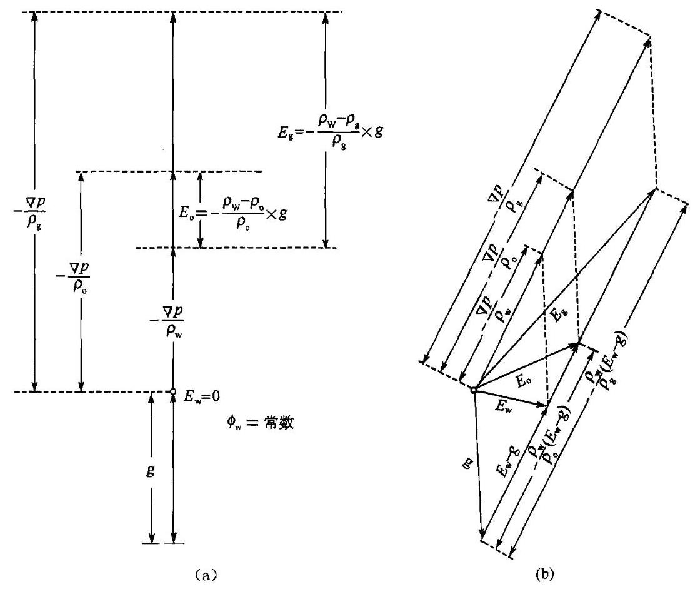

图 6-33 静水和动水中同一油气质点位置油气水势示意图 (据陶一川, 1983)

<!-- Media -->

综上所述, 从渗流力学的角度来讲, 油气的势差是二次运移的动力源, 油气总是自发从高势区向低势区渗流。油气在力场中受到的净浮力与水动力的合力, 正是力场强度, 它为油气渗流提供了具体动力和指向。

## 2. 扩散模式

在含油气盆地中由烃浓度差产生的分子扩散流, 其速率虽然比渗流要小几个数量级。但在漫长的地质时期中它无时无刻不在发生, 几乎是不受任何限制永恒存在的作用, 因此它仍是烃类运移中不可忽视的一种流动, 特别是在超致密地层、封闭的超高压地层、低成熟烃源岩中, 它甚至是烃类惟一的运移方式。分子扩散的动力是烃浓度差, 因此烃源岩是烃类扩散的源头。烃类的扩散同样也经历了初次和二次运移的全过程, 并最终到达地表而散失 (图 6-34)。李明诚教授把烃类从烃源岩扩散到运载层中的过程称为初次扩散, 把从运载层扩散到圈闭或地表的过程称为二次扩散。初次和二次扩散同样也是一个连续发生的过程。 人们一般对烃类从烃源岩向外的初次扩散和从气藏向外的二次扩散研究得比较多, 而对发生在广大运载层系中的二次扩散研究比较少。此外, 人们对分子扩散往往只注意到它起散失作用的一方面, 而对它在烃类运聚上仍有积极贡献的一方面认识不足。轻烃的初次扩散属不稳态扩散, 一般用费克第二定理来描述。根据初始条件不同, 还可得相应扩散方程求得扩散量。

<!-- Media -->

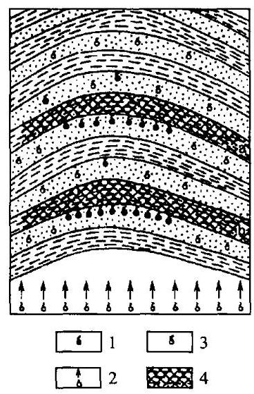

图 6-34 天然气扩散模式图 (据索科洛夫, 1965)

1一游离气; 2-溶解气; 3-扩散气;

4-渗透能力最低的岩层, 其中 a 层比 b 层小

<!-- Media -->

## 三、二次运移的其他问题

## (一) 二次运移的时期

初次运移和二次运移是连续的过程。目前, 可以

根据烃源岩大量生排烃的时期、优势运移通道形成时期、烃类流体包裹体和构造运动期次确定二次运移时期。但是在一般情况下, 构造运动期次是确定大规模二次运移时期的依据。在主要生油期之后或与之同时发生的第一次构造运动, 由于构造运动使原始地层发生倾斜, 甚至褶皱和断裂, 破坏了油气原有力的平衡, 在这种情况下, 进入储集层中的油气, 在浮力、水动力及构造运动力的作用下, 向压力梯度变小的方向发生较大规模的运移, 并在局部受力平衡处 (如圈闭内) 聚集起来。

<!-- Media -->

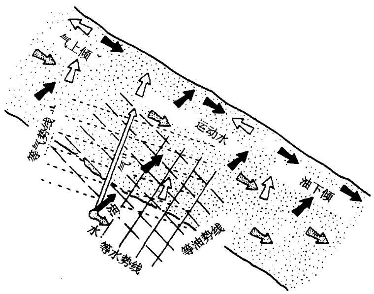

图 6-35 单斜输导层中下倾水流条件下油气运移方向 (据 Hubbert, 1953)

<!-- Media -->

## (二) 二次运移的方向

油气总是沿优势通道运移, 所以优势通道是油气二次运移的指向。在以浮力和水动力为主要动力的驱动下, 油气二次运移的方向总是循着阻力最小的路径由高势区向低势区运移, 或者说从单位质量流体机械能较高的地方向较低的方向运移, 直至遇到圈闭聚集起来形成油气藏, 或者运移到地表散失掉抑或形成油气苗 (图 6-35)。在沉积盆地中, 油气源区一般位于盆地的深凹陷带, 而深凹陷带又往往是盆地内压实水流的高水头区 (高水势区); 压实水流通常是流向与之相邻的盆地边缘斜坡或隆起 (凸起) 带 (低势区)。由深凹陷 $\rightarrow$ 斜坡或隆起 (凸起) 的方向是水流和浮力的共同指向, 所以这自然成为油气二次运移的主要指向 (图 6-36)。尤其是那些地质历史上长期继承性发展的隆起带更为有利。油气勘探生产的实际表明, 一些储量丰富的油气田, 大多位于相关生油凹陷油气运移的主要指向上。我国大庆油田就正好是位于松辽盆地主要生油凹陷——古龙凹陷油气运移的主要指向上, 据计算大约有 87% 的生油量聚集于大庆长垣的圈闭之中。

<!-- Media -->

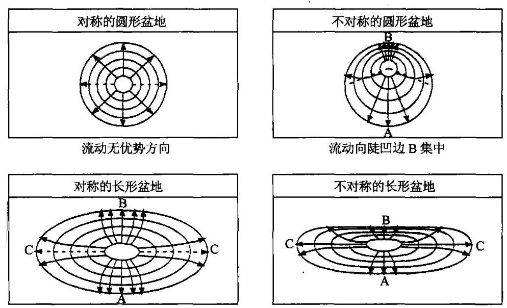

流动向长边的翼部 $\mathrm{A}$ 和 $\mathrm{B}$ 集中

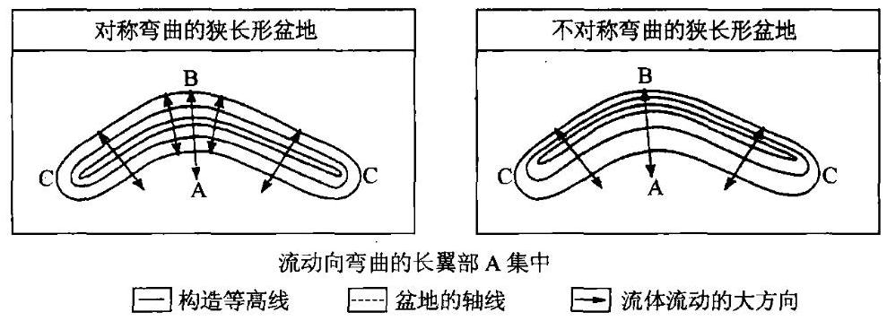

图 6-36 盆地几何形态与油气运移的大致方向

(据 Pratsch, 1982)

<!-- Media -->

## (三) 二次运移的距离

二次运移的距离取决于运移通道的通畅程度、烃源岩供给油气的丰富程度、沉积盆地的岩性岩相变化、盆地的大小以及盆地构造格局的展布等因素。一般地台区海相含油气盆地的岩性岩相横向变化不大, 地台区盆地构造上较稳定, 构造活动不剧烈, 断层较少, 二次运移距离可以远些。陆相盆地通常岩性岩相变化较大, 非均质性强, 盆地规模大多较小或盆地内构造分割性强, 二次运移距离不可能很大。我国陆相含油气盆地中的油田分布大多靠近生油凹陷,运移距离较近,一般常在 ${30}\mathrm{\;{km}}$ 以内。较远距离的运移常与不整合面有关, 如准噶尔盆地克拉玛依油田的石油来自盆地东南的玛纳斯湖凹陷, 最大运移距离约为- 188 .${80}\mathrm{\;{km}}$ 。美国中勘萨斯的古潜山带中的石油,来自其东南方的生油凹陷,最大运移距离约 ${160}\mathrm{\;{km}}$ 。与之相对的是一些透镜体储集层中的石油,二次运移距离微不足道,实际上油气经初次运移就直接进入圈闭形成透镜状岩性油气藏。

## (四) 二次运移的效率

二次运移开始时的数量是烃源岩的排烃量, 如果运移途中有圈闭存在则终止时的数量就是圈闭中的聚集量。可见, 二次运移的过程从数量上说也就是由排烃量减少到聚集量的过程。二次运移的数量直接体现了二次运移的效率, 并可用排聚率 (聚集量/排烃量的百分数) 来表示, 也可用生聚率 (聚集量/生烃量的百分数) 来表示。虽然二次运移的距离和速度与二次运移的效率有关, 但它们只是从空间上的大小和时间上的长短来描述和影响运移效率, 而二次运移效率的高低最终是以聚集量的多少来评价的。因此, 探讨二次运移数量实际上就成为如何求得聚集量的问题了, 当前主要有类比分析、物质平衡和数字模拟三种方法。李明诚教授对我国东部盆地进行过聚集量模拟, 其主要结论是石油的生聚量一般为 $5\%  \sim  {10}\%$ ,天然气为 ${0.5}\%  \sim  1\% ,{90}\%$ 以上的烃类在运移中散失. (图 6-37)。

<!-- Media -->

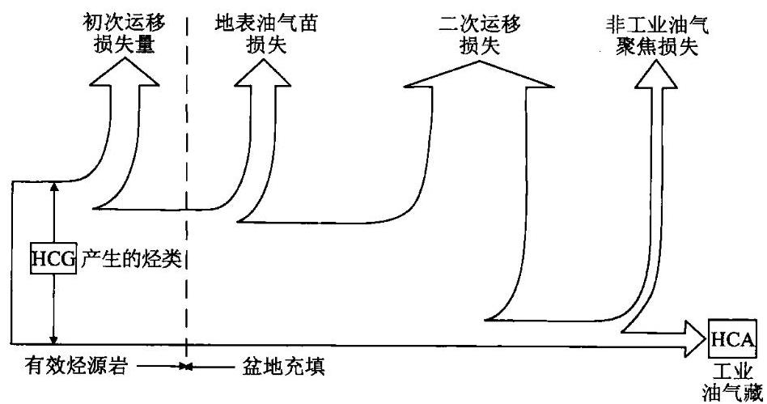

图 6-37 油气运移过程中的各种损失

(据 England, 1994)

<!-- Media -->

## 第七章 油气藏形成与破坏

油气在储集层中从高势区向低势区二次运移过程中, 遇到三维空间上的屏障 (圈闭) 时就开始了聚集, 所以油气藏的形成是指油气在圈闭中的聚集过程。油气聚集程度主要取决于烃源供给、圈闭容积和闭合度。油气藏形成以后, 随着时间的推移和外界地质条件的改变, 当三维空间屏障消失和破坏时, 已经聚集成藏的油气将再次运移, 并再次聚集, 直至最终在地表散失。可以这样认为, 油气的运移是长期、绝对和无条件的过程, 而油气聚集是短暂、相对和有条件的过程。

## 第一节 油 气 聚 集

## 一、油气聚集方式

油气聚集是指油气在圈闭中的聚集并形成油气藏的过程。油气聚集包括单一圈闭和系列圈闭的油气聚集。

<!-- Media -->

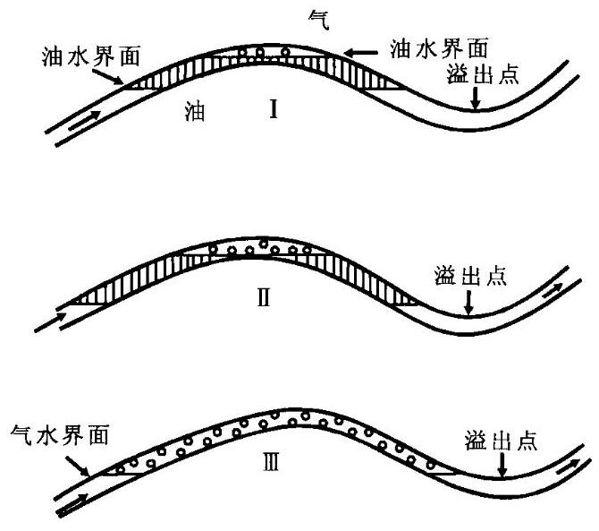

图 7-1 单一圈闭中的油气聚集和油气藏 (据 Gussow, 1951)

<!-- Media -->

## (一)单一圈闭的油气聚集

单一圈闭中最简单、最常见的是背斜圈闭。其基本特点是: 储集层顶面呈拱形, 由顶向四周下倾; 其上方为非渗透性岩层所封闭, 下方高势区被水体所封闭; 闭合区由通过溢出点的构造等高线所圈定。

在静水条件下, 储集层中运移的油气遇到背斜圈闭时, 先在最高部位聚集起来, 油气水按重力分异; 后来依次由较高部位向较低部位聚集, 直到充满整个圈闭为止 (图 7-1 I )。这时, 该圈闭的聚集作用即完成, 若再有油经过时, 无法继续在其中聚集, 只能通过溢出点溢向上倾方向, 但天然气则不同。由于天然气比油轻, 它可以继续进入圈闭, 而将其中的石油排出。这一过程一直进行到将原先被石油占据的圈闭容积完全被天然气占据为止 (图 7-1 II、III)。至此, 单一背斜圈闭的油气聚集已最后完成。在条件不发生变化时, 油气在圈闭中建立起相对稳定的平衡状态。值得注意的是, 圈闭一旦被天然气充满, 石油不可能再进入圈闭, 而是沿溢出点向上倾方向溢出。

同样, 非背斜圈闭除储集层的顶、底板为非渗透性岩层封闭外, 在储集层上倾方向还存在不同类型的非渗透性遮挡。其闭合区是由储集层上倾方向的非渗透性遮挡线和储集层顶面的构造等高线联合构成的。除透镜型岩性圈闭外, 其他各类圈闭同样都存在溢出点。 因此, 油气在其中的聚集顺序与背斜圈闭一样。

## (二) 系列圈闭的差异聚集

差异聚集的发生受制于水力连通的系列圈闭、二次运移动力和圈闭的封盖强度。

在实际地质条件中, 圈闭常成带、成群、呈系列分布。不同系列, 甚至同一系列的不同圈闭, 由于与生烃区的相对位置、圈闭形成条件和历史存在差异, 使各个圈闭聚集油气的机会是不相同的。对于发育于区域倾斜背景上(即与烃源区垂直或斜交)的系列圈闭油气聚集的基本原理,最早由加拿大石油地质学家格索 (W. C. Gussow, ${1951} \sim  {1954}$ ) 所阐明, 并被称为油气差异聚集原理。

格索首先分析了静水压力条件下单一圈闭中的油气聚集, 并将前述原理应用于系列圈闭 (图 7-2)。在图 7-2A 中, 当圈闭 I 被油气充满时, 继续进入的天然气可以通过排油在圈闭中聚集直到整个圈闭被气充满为止, 而排出的油则通过溢出点, 向上倾方向的圈闭 II 中聚集。从 $\mathrm{A} \rightarrow  \mathrm{B} \rightarrow  \mathrm{C}$ 随着烃源增加,上述过程相继在圈闭III和IV中发生 (图 7-2B、C); 如果烃源不足时, 上倾方向 (即距烃源区较远) 的圈闭只产水, 称为空圈闭。在系列背斜圈闭中自上倾方向的空圈闭,向下倾方向变为纯油藏 $\rightarrow$ 油气藏 $\rightarrow$ 纯气藏的油气分布特征, 是由油气差异聚集造成的。油气差异聚集得以发生, 必须具备的基本条件是: ①在区域倾斜的下倾方向存在丰富的油源区; ② 具有良好的油气通道, 使油气在较大的范围内作区域性运移; ③在区域倾斜背景上存在相互连通的系列圈闭, 而且溢出点向上倾方向递升; ④储集层中充满地下水, 而且处于相对静止状态。

<!-- Media -->

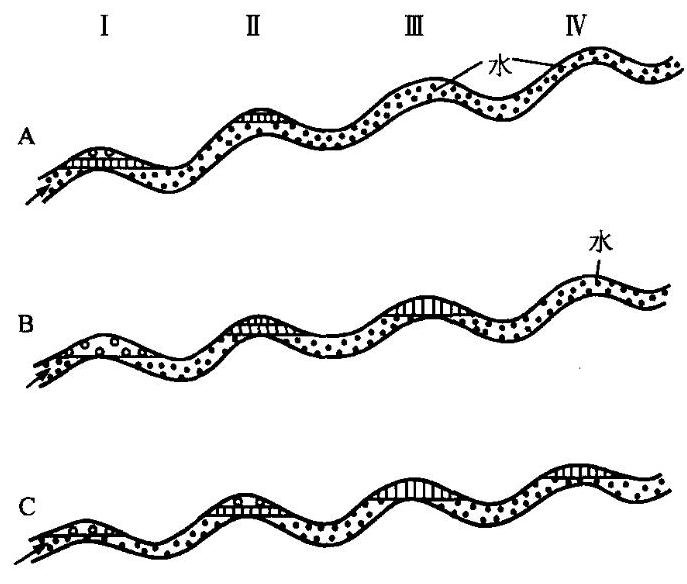

图 7-2 系列圈闭中油气聚集概念图

I、II、III、IV代表系列圈闭

<!-- Media -->

Sales (1997) 较全面地论述了差异聚集的实质, 他认为控制油气地下分布和差异聚集的根本因素是圈闭的封盖强度和闭合度之间的组合关系, 并在此基础上把圈闭划分为 3 种类型: I 类圈闭, 其封盖强度大于闭合度, 由于具有剩余封盖强度, 结果油和气都只能从圈闭底部溢出, 不会从顶部盖层漏失, 而且优先聚集天然气; II 类圈闭, 其具有相对于闭合度的中等封盖强度, 它们的封盖强度足以支撑全油柱, 因此气 - 油界面的位置大体上位于圈闭的中部, 结果在动平衡过程中气和油可以分别从顶部漏失和底部溢出; III类圈闭, 其封盖强度小于闭合高度, 具有剩余的闭合空间, 结果气和油都只能从顶部盖层漏失 (图 7-3)。可见, 仅仅 I 类圈闭是格索 (1954) 所阐述的油气差异聚集原理。

<!-- Media -->

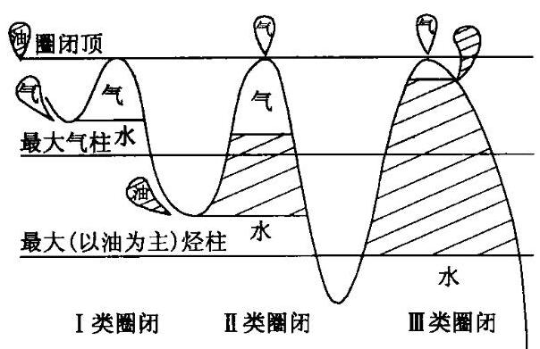

图 7-3 各类圈闭油气的溢出和漏失特征 (据 Sales, 1997 修改)

<!-- Media -->

由于各类圈闭油气在侧向溢出和垂向漏失上的不同, 从而造成了油气在地下有不同的分布和差异聚集规律 (图 7-4)。

<!-- Media -->

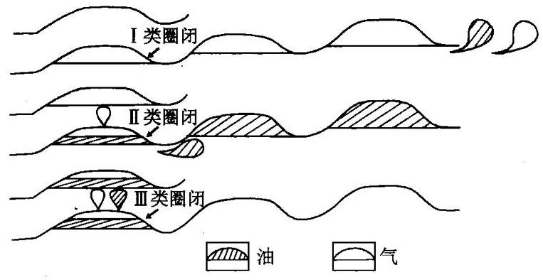

图 7-4 各类圈闭的油气在侧向和垂向上的差异聚集

(据 Sales, 1997 修改)

<!-- Media -->

总之, 含油气盆地中圈闭的封盖强度、闭合高度与浮力之间的相互作用是决定地下油气聚集的主控因素。在烃源充足供给的情况下: I 类圈闭会溢出油和气, 但无泄漏, 最终将含气; II 类圈闭会溢出油并泄漏气, 最终将含油和气; III 类圈闭会泄漏气和油, 但不溢出, 最终将以含油为主。另外, 对于 II 类、III 类圈闭来说, 气的泄漏不是负面影响, 它将提高圈闭的含油性。

加拿大阿尔伯塔盆地彩虹 - 圣阿尔伯达 (Rainbow-San Alberta) 线状礁块中的差异聚集是最早发现的典型例子。近年来也发现了不少这样的实例, 如美国密歇根 (Michigan) 盆地志留系礁带中的差异聚集 (图 7-5), 澳大利亚埃罗曼加盆地中的差异聚集, 我国渤海湾盆地冀中坳陷潜山带中也存在有差异聚集现象 (图 7-6)。

<!-- Media -->

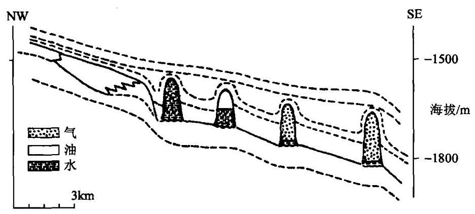

图 7-5 美国密歇根盆地志留系礁带中的差异聚集

(据 Sales, 1997 修改)

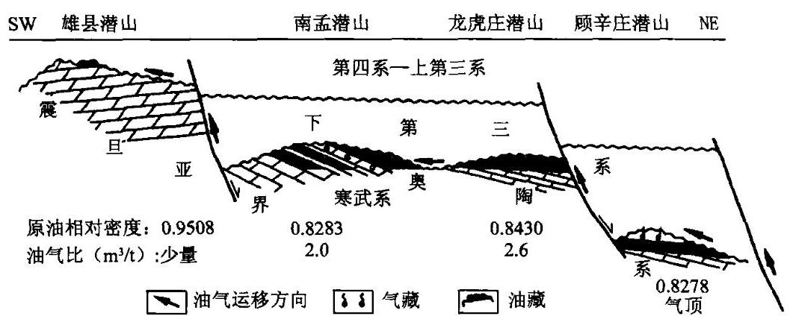

图 7-6 我国渤海湾盆地冀中坳陷潜山带中差异聚集现象

<!-- Media -->

## 二、油气聚集机制

油气聚集从动力学上可分为势差或压差作用下的浮力 - 水动力机制和浓度差或盐度差作用下的渗透力 - 扩散力机制。 (一) 浮力一水动力机制

<!-- Media -->

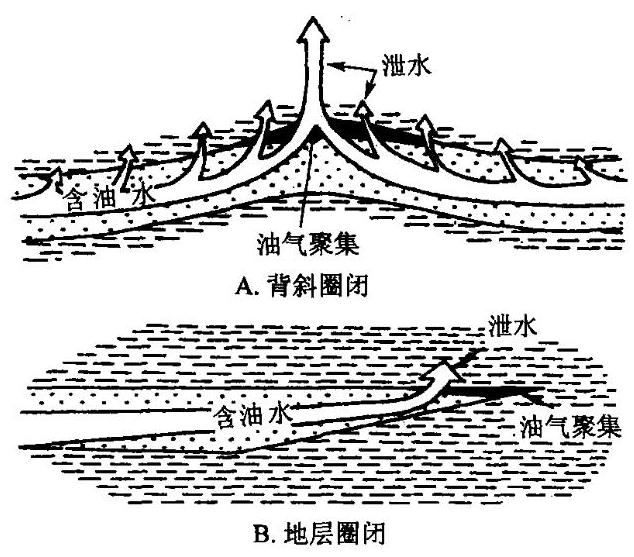

图 7-7 油气聚集渗滤机理

(据 Roberts, 1980)

<!-- Media -->

它是油气在圈闭中聚集的主要动力学机制, 包括渗滤和排替两个主要的作用 (机理)。游离烃和含烃水流在浮力和水动力作用下进入圈闭后, 由于亲水的物性封闭盖层一般对水不起封闭作用, 水就可以通过盖层继续运移, 油气则因盖层的毛细管封闭而过滤下来, 聚集在圈闭中并排替出同体积的孔隙水, 这些水随含烃水流从盖层排出, 随着油气不断地充注和水不断地排出, 圈闭中的烃类逐渐富集并最终形成油气藏 (图 7-7), 这一过程主要是渗滤作用。

该机制以盖层水不封闭为前提, 如果盖层是优质的膏盐岩或者是渗透率极低具压力封闭的泥质岩, 则水就很难从盖层排出。这种机制主要发生在盖层只是一般物性封闭的情况下。

Chapman 等 (1982) 认为, 泥质盖层中的流体压力一般比相邻砂质储集层中的大, 因此圈闭中的水难以通过盖层。进入圈闭的油气首先是在底部聚集, 随着烃类的增多逐渐形成具有一定高度的连续烃相。此时, 在油水界面上油和水的压力相等, 而在油水界面以上任一高度, 由于密度差产生的浮力, 油气的压力总比相同高度上水的压力大 (图 7-8), 因此产生了一个向下的流体势梯度, 致使油气在圈闭中向上运移的同时把水向下排替, 直到束缚水饱和度为止。随着油气不断进入圈闭, 油 - 水或气 - 水界面不断向下移动, 直到圈闭的溢出点高度为止, 这一过程主要是排替作用。

<!-- Media -->

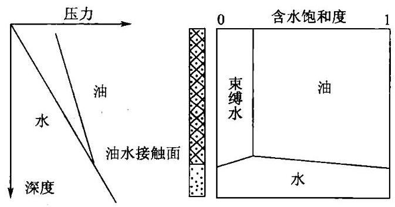

图 7-8 圈闭中油、水压力及含水饱和度的垂向分布

(据 Chapman 等, 1982)

<!-- Media -->

(二) 渗透力一扩散力机制

<!-- Media -->

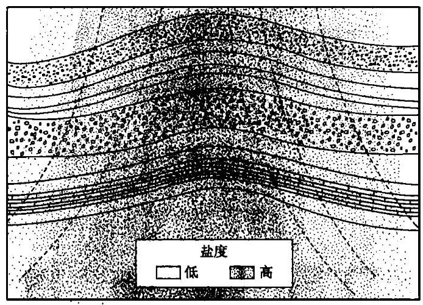

图 7-9 高盐度具有圈闭的功能示意图 (据李明诚, 2004)

<!-- Media -->

对含盐层系或致密地层中的油气聚集有重要作用。由盐度差产生的渗透压力所引起的渗透流, 是使烃类相对富集的重要机制。高盐度区具有圈闭的功能, 使低盐度区的水不断向它汇聚 (图 7-9), 其中烃类 (特别是天然气) 由于盐度增加而出溶转变为游离气。如果渗透流是向上或上倾方向, 再伴随着压力的降低, 那么出溶作用就更加显著并最终导致天然气的富集。盐度差不仅是产生渗透流的动力, 而且往往由于地温降低或气候进一步干燥, 致使地层水的含盐量达到过饱和而产生沉淀, 此时还能成为好的盖层封闭其下的天然气。因此, 在含盐层系中或现代盐湖区都可能有天然气的聚集。李明诚教授认为, 我国柴达木盆地三湖地区第四系水溶性浅层天然气聚集即为此例。

在致密地层中虽然烃类很难发生渗流, 但在烃浓度差作用下气态烃还是可以进行分子扩散的, 当其遇到更致密的阻挡层时天然气就可以相对富集 (图 7-10)。如果是扩散到具较大孔渗的部位, 扩散流就可以转变为渗流能更有效地参与天然气的聚集。总之, 在浓度差作用下的富集机制, 对某些地质条件下(如透镜体砂岩中) 的烃类聚集有重要作用。

<!-- Media -->

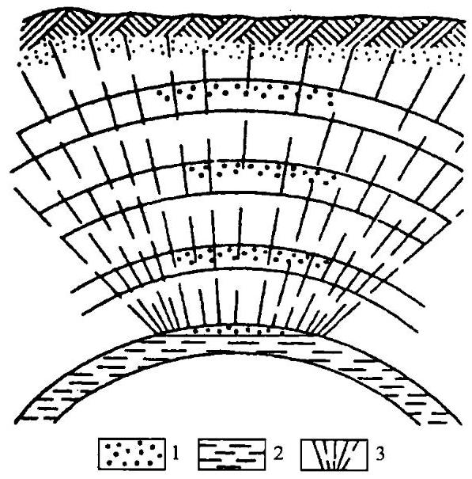

图 7-10 扩散作用形成天然气的聚集示意图 1-气; 2-水; 3-扩散气流

<!-- Media -->

实际上在油气聚集的过程中, 上述两类动力学机制往往不能截然分开, 它们可以随地质条件的变化而相互转换共同作用最终形成油气的聚集, 这一过程中不同机制只有主次之分。

## 三、油气聚集模式

由于油气聚集机制和各种圈闭的几何特征、地质特征的差异, 导致各种圈闭中油气的运移和聚集会有不同的模式。Cordell (1977) 提出了碎屑岩中不同圈闭里油气聚集的可能模式。

## (一) 背斜圈闭模式

从生油层进入储集层的压实流体, 沿着背斜的翼部向顶部运移 (图 7-11)。在圈闭中, 水很可能通过上覆泥岩盖层继续向上流动, 而把烃类和一些无机盐类渗留下来在圈闭中聚集,并使圈闭中流体的含盐度增加, $\mathrm{{pH}}$ 值降低,这又有利于烃类的进一步聚集。图 7-11 中所表示的是储集层与烃源岩在大面积上互层接触, 而又无不整合和构造破坏的最佳情况。西西伯利亚盆地的侏罗系和白垩系剖面就具有上述条件, 这是该地区原油储量极为丰富、仅次于中东地区的重要原因。

<!-- Media -->

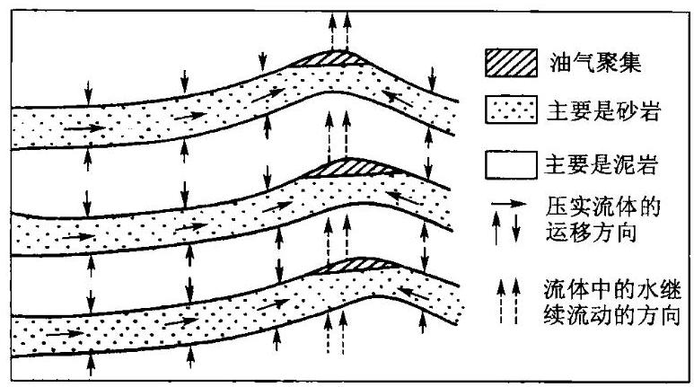

图 7-11 背斜圈闭油气聚集可能模式

(据 Cordell, 1977)

<!-- Media -->

## (二) 地层圈闭模式

从上、下烃源岩进入砂岩储集层的压实流体, 沿上倾方向进行二次运移, 由于地层尖灭或不整合造成地层圈闭, 流体中的水可以通过圈闭的上方盖层继续运移, 而烃类则渗留在圈闭中聚集,同时圈闭中流体的含盐量增加, $\mathrm{{pH}}$ 值降低,有利于油气的进一步聚集 (图 7-12)。图中所表示的是储集层夹于上、下两层烃源岩之中, 有大面积的接触, 而圈闭本身未遭受破坏的情况。美国东得克萨斯油田、阿拉斯加北极斜坡的普拉德霍湾油田等就可能是这种情况。

<!-- Media -->

图 7-12 地层圈闭油气聚集可能模式

(据 Cordell, 1977)

<!-- Media -->

## (三) 断层圈闭模式

压实流体从泥质烃源岩进入砂岩体, 开始了二次运移, 在运移的上倾方向由于断层的遮挡形成圈闭, 流体中的水可以通过遮挡面沿断层或砂岩层继续向上运移, 油气则在圈闭处聚集 (图 7-13)。图中所表示的是油气在三角洲沉积中的运移和聚集情况。美国墨西哥湾地区、加拿大西北部麦肯齐地区、尼日利亚海岸等地区均属这种情况。虽然总的含油气量丰富, 但由于单个圈闭的面积不大, 所以特大油田很少。

<!-- Media -->

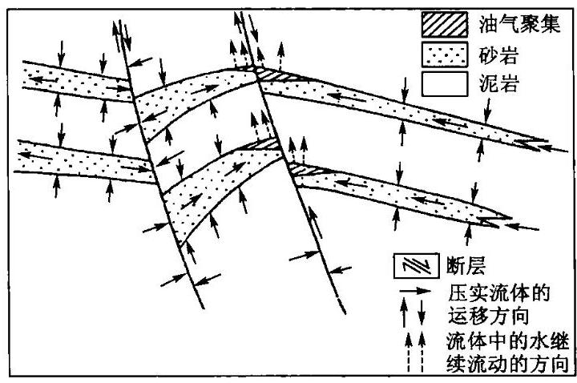

图 7-13 断层圈闭油气聚集可能模式

(据 Cordell, 1977)

<!-- Media -->

## (四) 透镜体圈闭模式

被生油泥岩包围的砂岩透镜体中的油气聚集, 是一个复杂的、目前还不十分清楚的过程。它可能是多种动力作用的结果: 早期压实流体可以从周围的生油泥岩进入砂岩透镜体, 此时虽然含油气不多但却向砂岩体排入大量盐分, 如果没有断层或裂缝直接与生油泥岩外的地层相通, 则砂泥岩中流体压力很快达到平衡, 特别是扁平状砂岩体剩余压差就更小了, 后期的压实流体很难进入; 此时主要依靠烃浓度差, 生油泥岩中的烃类向砂岩体扩散; 依靠盐度差, 生油泥岩中的水 (包括水溶烃) 向砂岩体中渗透; 还依靠泥 - 砂界面上的毛细管压力差, 将泥岩中的油气排入砂岩体; 还可能在生烃膨胀压力作用下, 将油气沿干酪根网络(当泥岩有机质含量较高时)排入砂岩体。无论是扩散流,还是渗透流进入砂岩体后, 其中油气最终都转变为游离相, 再加上直接排入的油气, 它们在浮力的作用下占据砂岩体的顶部, 同时给水施以附加压力, 使其在紧靠烃 - 水界面的底部排出砂岩体, 这样油气将不断富集 (图 7-14)。可见, 如果砂岩体在泥岩中呈竖直状或有与外界相连通的断层存在, 则有利于其中油气的聚集。

<!-- Media -->

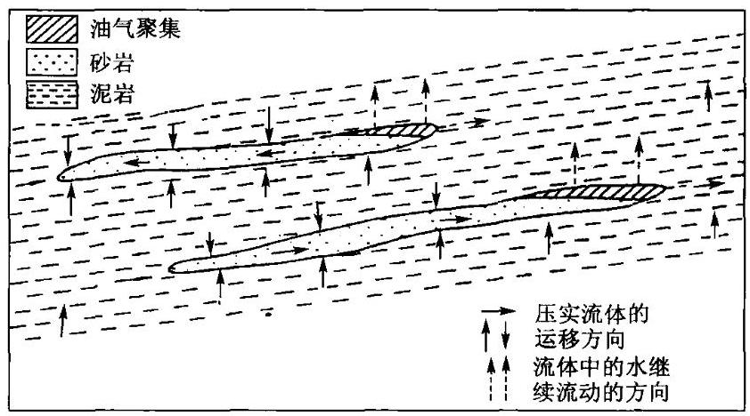

图 7-14 透镜体圈闭油气聚集可能模式

(据 Cordell, 1977)

<!-- Media -->

尽管前三种模式, 主要是在浮力 - 水动力作用下形成的, 但其中仍有因盐度变化油气出溶的贡献, 由此可见地下的油气聚集很少是单一动力学机制, 大多是综合作用的结果, 而第四种聚集模式则更明显地体现出这一点。

## 第二节 油气聚集过程

油气聚集的机制主要是探讨油气聚集的一般原理和宏观规律, 而油气聚集过程主要是探讨油气进入圈闭的方式和状态以及在圈闭中所发生的各种物理、化学作用。如果没有重大地质事件发生, 油气在圈闭中的聚集包括充注、混合和富集三个具有幕式特征的连续过程。

## 一、油气充注过程

油气不断进入圈闭有效空间的过程称为充注。圈闭一般处于低势区, 油气在浮力或水动力作用下都会向圈闭中运移和充注。根据渗流力学原理, 油气总是首先进入渗透率最高、排替压力最低的储集层部分, 随着油气的不断充注, 在烃柱压力的作用下, 逐渐向孔渗条件差的部分扩展, 从而使圈闭储集层中的含烃饱和度不断增加 (图 7-15)。在此过程中, 由于储集层的非均质以及充注时间和空间上的差异, 必然造成油气组分和化合物在圈闭中分布的非均质性。圈闭储集层非均质性越强, 这种非均质性越明显。

<!-- Media -->

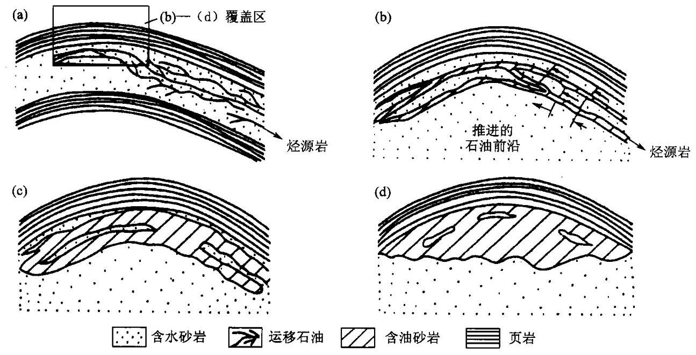

图 7-15 油气向圈闭充注过程示意图

(据 England, 1989)

<!-- Media -->

## (一) 侧向充注

主要是沿储集层方向的充注。由于烃源岩的成熟度不断增加, 运移烃类的成分也不断发生变化, 先进入圈闭的油气成熟度低于后充注的油气, 造成在圈闭储集层的侧向上有成熟度的差异。这可以从成熟度指标的变化反映出来, 结果在时间上越是后充注的石油其成熟度越高, 在空间上越靠近圈闭的注入点、离烃源岩的生烃区越近成熟度越高。因此, 可以根据成熟度的变化方向追索油气的充注方向和油源区。

## (二) 垂向充注

主要是垂直于储集层方向的充注。进入圈闭的油气, 同样也是先向储集层具较高孔渗的部位充注, 然后逐渐向相邻较低孔渗部位扩展。源源不断而来的高成熟油气总是通过高孔渗部位向低孔渗部位运移, 结果高孔渗砂层中的含油气饱和度和成熟度均高于低孔渗砂层中的油气, 造成圈闭中在垂向上有成熟度的差异。表现在高孔渗砂层中的饱和烃含量较高, 而非烃和沥青质含量却较低 (图 7-16), 由此可以判断和分析油气充注的方向和历史, 并反映储集层的非均质性。

<!-- Media -->

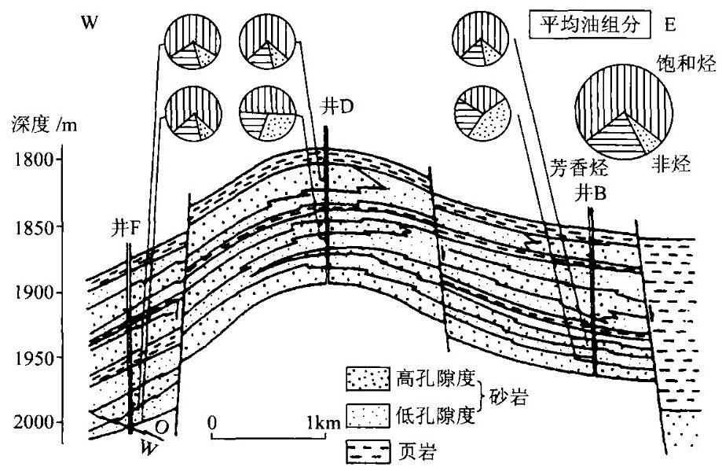

图 7-16 圈闭中垂向差异充注实例

(据 Leythaeuser 等, 1989)

<!-- Media -->

## (三) 充注方式

在地质条件相对稳定的条件下, 同一油源油气的充注是一个带有幕式特征的连续过程, 这是由幕式排烃、幕式运移所决定的。异常高压烃源岩的存在说明地下必然发生幕式排烃; 盆地中高压流体封隔体的存在, 断层及裂缝等通道的张开、闭合, 运移所需浮力及含烃饱和度的积蓄, 都说明地下必然发生幕式的二次运移; 而圈闭储集层非均质性所具有的不同排替压力, 也必然导致油气在圈闭中呈幕式充注。但幕式充注、幕式成藏不能理解为间断充注、间断成藏 (李明诚, 2000)。从目前研究来看, 油气聚集成藏是个相对较短的地质时期,可以在 $1 \sim  {10}\mathrm{{Ma}}$ 内完成,除非在此期间发生了重大的地质事件,诸如地壳大幅度抬升、生烃中断, 或地壳构造运动、运移主路线和圈闭发生变化和破坏等, 否则整个充注是一个具有幕式特征的连续过程。从目前圈闭中油气的成熟度和化学组分存在有梯度性的变化也能说明这一点。

## 二、油气混合过程

储集层的非均质性和充注过程的差异性, 造成圈闭中油气的组分和化合物在侧向和垂向上都具非均质性。正因为油气在空间上存在着这些差异, 也就必然存在消除这些差异的混合过程,所以充注和混合是几乎同时存在的两个过程。W. A. England 等(1989,1990) 认为, 圈闭中油气发生混合的机制, 主要是密度差混合、浓度差混合以及热对流混合这三种作用。其中以前两种作用最为重要, 虽然理论上讲只要存在地温差异就可以发生热对流作用, 但相对于圈闭的空间高度和油气藏形成的地质时间而言, 储集层中的热对流作用相

当缓慢, 因而对消除储集层中石油组分的非均匀性作用甚微 (图 7-17)。

<!-- Media -->

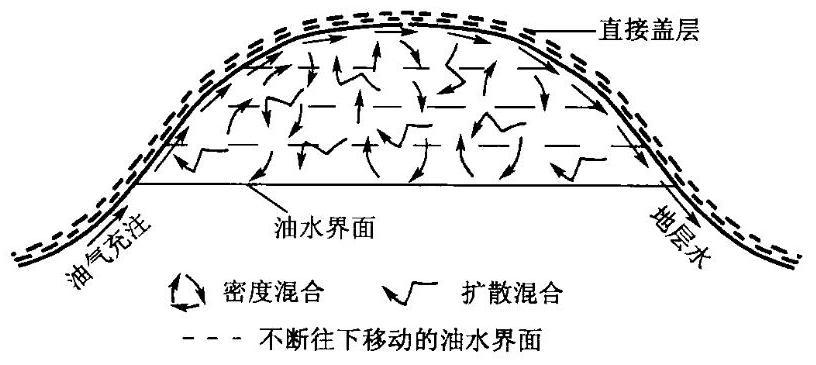

图 7-17 油气在圈闭中的混合示意图

(据李明诚, 2003)

<!-- Media -->

## (一)密度差异的混合作用

它实质上是流体密度的差异引起的重力混合作用。烃类向圈闭充注时, 储集层顶部是早期聚集的成熟度较低、密度较高的石油, 而靠近圈闭充注点的翼部或底部则是后期聚集的成熟度较高、密度较低的石油。结果, 在圈闭的高部位存在密度相对较大的石油, 而低部位存在密度较小的石油, 形成密度倒置。因此, 必然发生重质石油往下沉、轻质石油往上浮的作用, 直到油气按重力分异完全混合为止。

根据储集层流体流动的模拟实验 (England 等 1989),当储集层的渗透率为 ${100} \times$ ${10}^{-3}{\mathrm{{\mu m}}}^{2}$ 、石油的黏度适中时, $2\mathrm{\;{km}}$ 范围内的密度差异可以在 $1\mathrm{{Ma}}$ 中消除。储集层越好、 非均质程度越低, 密度差异混合作用的效果越好, 所需混合的时间越短。如果目前圈闭中的石油仍存在密度差异, 则说明储集层的非均质性很强, 其中很可能有泥质条带或碳酸盐胶结条带等屏障存在。

## (二) 浓度差异的混合作用

实质上就是扩散混合作用, 引起这一作用的直接原因是油气组分的浓度差异。与流体的重力混合作用相比较, 扩散混合作用是分子运动引起的微观现象, 但却是普遍存在、永不停息的作用。其结果是部分或全部消除了侧向上的浓度梯度, 在垂向上建立起由重力分异作用形成的浓度梯度。扩散混合作用的效率除与浓度差的大小有关外, 还取决于以下几个因素: 温度升高扩散混合速度加快, 储集层的渗透率变低扩散混合速度降低, 烃类的小分子比大分子有较快的扩散混合速度。

据 A. S. Mackenzie 等(1987,1989)的研究,垂向上短距离的扩散混合作用有较高的效率, $1\mathrm{{Ma}}$ 中可以在 ${100}\mathrm{\;m}$ 的范围内建立起重力分异的浓度梯度,但在几千米的规模上则需要几十百万年甚至更长的时间。虽然重力混合与扩散混合在圈闭中是同时进行的两种作用, 它们共同消除圈闭中油气组分和化合物上的非均质性; 但正如上所述, 扩散混合只在垂向上 ${100}\mathrm{\;m}$ 小范围内比较有效,可以在 $1\mathrm{{Ma}}$ 内完成,而重力混合也只当储集层具高渗透率时,在建立垂向重力分异时比较有效,可以在 ${0.01} \sim  1\mathrm{{Ma}}$ 完成。对全油田规模上的侧向混合, 特别是对非均质性强的低渗透率储集层, 这两种混合作用的速率都很缓慢。可见, 油田范围的油气非均质性很难通过重力混合及扩散混合作用, 在较短的地质时期中达到均质化。因此, 人们根据目前油藏中油气的非均质性, 不仅可以判断油源和充注方向, 还可以推知储集层非均质性程度的强弱以及油气藏形成时期的早晚。

## 三、油气富集过程

油气在圈闭中聚集的过程, 实际上也就是油气在圈闭中富集成藏的过程。随着油气不断向圈闭中充注, 在重力、扩散和热对流的混合作用下, 油气在圈闭中不停地运动, 同时也不断富集起来。这一过程主要表现在以下三个方面：油气把水从储集层顶部不断往下排替; 油 - 水界面或气 - 水界面逐渐向下移动; 油气中的压力不断增加。由于油 (气) 与水的密度差, 造成圈闭中油 (气) - 水界面以上任一高度的油 (气) 压力都比水大, 结果形成一个向下的势梯度把水往下排替, 同时油 (气) - 水界面逐渐向下迁移。随着油气的充注, 烃柱的高度和压力也不断增加, 这不仅加快了上述过程, 同时也使油气不断向储集层低孔渗部分扩展, 直到束缚水饱和度为止。

这一过程的必然结果是造成储集层中含油(气)饱和度不断增加, 并在垂向剖面上发生变化, 这种变化在油气藏的开采过程中得到证实。人们通常把一个油藏大致分为四个带 (图 7-18): ① 纯含油带,含油饱和度在 ${55}\%$ 以上,产无水油; ② 过渡带,含油饱和度为 ${10}\%  \sim  {55}\%$ ,油水同产; ③残余油带,含油饱和度在 ${10}\%$ 以下,只产水; ④饱和水带, 仅有不含油的孔隙水。如果储集层非均质性很强, 那么四个带的划分就不明显, 在横向上的变化也就很大, 且不能对比。如果储集层是低孔渗地层, 由于排替压力高, 油气难以大量进入其中,致使含油饱和度不高。往往达不到 ${55}\%$ 以上而无纯含油 (气) 带,结果只能油 (气) 水同产, 甚至只含有油 (气) 而不产油 (气)。所以。油气在圈闭中的富集过程是决定油藏品位、有无经济价值的关键, 它直接与储集层的非均质性和油源供给有关。

<!-- Media -->

图 7-18 含油饱和度与油气藏中流体分布和产出的关系

(据 Schowalter, 1979)

<!-- Media -->

## 第三节 油气藏形成的条件

油气藏形成条件包括必要条件和充分条件。必要条件是指油气藏形成的基本地质条件必须优越, 包括优质的生油气烃岩源、孔隙性和渗透性很好的储集层、排驱压力高的圈闭盖层或区域盖层、在输导层作用下利于初次和二次的运移、大容积的圈闭和在地质条件下不易改变的保存条件。这些必要条件的具备并不意味着油气可以富集成藏, 只有各必要条件在时间和空间上良好匹配, 才可以形成油气聚集。具备充足的油气源, 有利的生储盖组合, 大容积的有效圈闭和必要的保存条件是油气藏形成的充分条件, 特别是大型油气藏的形成更是如此。

## 一、必要条件

油气藏的形成受生、储、盖、圈、运、保等基本地质条件的制约, 它们是油气藏形成的必备要素。

## (一) 烃岩源

烃岩源是油气藏形成的最基本地质条件之一, 一个盆地 (坳陷、凹陷), 要是不具备烃岩源, 即没有油源存在, 也就不可能形成油气藏。烃岩源为油气藏形成提供物质基础。 烃源岩分析要与盆地沉降埋藏史、热史和古气候分析相结合。盆地的持续沉降是沉积物充填的前提, 盆地只有持续下沉, 才能保持相对稳定的还原环境, 形成巨厚的沉积物, 有利于烃源岩的形成和向油气的转化; 盆地热史决定了烃源岩的成熟程度, 高地温场有利于源岩有机质的成熟, 但成熟度是温度、时间共同作用的结果; 古气候对沉积盆地中水体介质条件和有机质丰度有重要影响, 一般在潮湿一半潮湿气候下, 生物十分繁盛, 大气降水充沛, 海 (湖) 盆水体稳定, 有利于烃源岩的形成。例如, 在我国北方早、中侏罗世和早白垩世, 都是典型的潮湿气候带, 因而中、下侏罗统和下白垩统盆地中都有丰富的烃源岩发育。我国最典型的勘探实例是天山的尤尔都斯和焉耆盆地, 其中, 尤尔都斯盆地没有残存的侏罗系烃岩源, 其油气勘探没有获得成效, 而焉耆盆地存在残存侏罗系烃岩源, 其勘探获得了成功。

## (二) 储集层

评价储集层储集性的参数, 主要是孔隙度和渗透率。孔隙度的大小决定储集层能够储集油气的数量, 渗透率的高低则决定了油气在其中运移的效率和油气的最终产能。储集层的发育与盆地沉积体系和沉积相有密切联系, 后者又与盆地的古地形及古气候有关, 储集层研究要与沉积体系、沉积相及古气候研究结合起来。

## (三) 盖层

盖层的好坏直接影响油气的聚集和保存条件。常见的盖层类型有: 页岩、泥岩、 和石膏等, 其中, 页岩、泥岩盖层常与碎屑岩储集层相伴生, 出现于沉积盆地的海 (湖) 进层序中; 蒸发岩盖层常常与碳酸盐岩共存, 形成于海(湖)退层序中。前者在我国中新生代陆相沉积盆地中十分常见; 后者主要分布于古生代海相或中新生代盐湖盆地中, 如四川盆地三叠系、江汉盆地白垩系至第三系等。

盖层的形成与盆地的埋藏史和成岩后生作用历史有关。在成藏条件分析中, 要区分和确定直接盖层和区域盖层, 尤其是区域盖层, 常常决定油气运聚的分布范围。

## (四) 油气运移

与油气藏形成最直接的作用是油气二次运移, 其与盆地的构造活动、断裂及不整合的分布、水动力条件等, 具有十分密切的关系。因此, 对盆地的构造运动期次及古水文地质条件的研究是重点。疏导体系的存在和型式对油气的运移和分布具有控制作用。例如在裂陷型含油气盆地中, 由于剖面上断裂十分发育, 油气往往以垂直运移为主, 油气多分布于纵向上与断裂有关的圈闭中, 形成断块或断鼻油气藏。在克拉通含油气盆地中, 由于构造比较平缓和单一, 断裂不发育, 因此, 油气以侧向顺层运移为主, 主要分布于地层不整合及有关的构造、地层圈闭中。

## (五) 圈闭

圈闭是油气聚集的场所, 圈闭必须是储集层的一部分, 圈闭的大小、规模是决定油气富集程度的前提, 也决定盆地的勘探远景。

圈闭的类型有多种, 构造圈闭, 尤其是背斜构造圈闭, 常常是最有利的圈闭。世界上迄今已发现的特大型油气田, 多为背斜圈闭。然而, 随着油气勘探的深入和发展, 非构造圈闭也可形成特大型油气田。地层圈闭的研究, 应与盆地的构造运动史、古地理变迁及沉积成岩作用研究紧密结合起来。圈闭的形成、调整及破坏作用, 是圈闭研究的重要内容。

## (六) 保存条件

油气藏保存条件系指已经形成的油气藏, 在漫长的地质历史时期中, 圈闭条件是否改变, 以及圈闭中的油气聚集是否遭到破坏等。

## 二、充分条件

油气藏形成的充分条件是指上述基本要素在时空上的良好匹配, 即有充足的油气源、 有利的生储盖组合和大容积的有效圈闭。

## (一) 充足的油气源

充足的油气源表现为盆地或含油气区的油气丰度高, 即生成并提供形成油气藏的总油气量高。它取决有机质的丰度、有机质类型、有机质成熟度和排烃效率或排烃系数等。成熟并能提供形成工业油气藏所需烃量的有效烃源岩的存在是具备充足的油气源前提。而成烃坳陷(凹陷、洼陷)的存在是满足上述条件的前提, 它是指盆地中分布成熟烃岩源的深坳区, 应具有广阔的有利于有机质大量繁殖和保存的封闭或半封闭的沉积环境; 较高的沉积速率和较长的持续沉积时间, 有利于有机质在较短的时间内成熟, 并排出油气。

成烃坳陷内烃源岩系发育状况受制于盆地构造旋回。成烃坳陷可能仅存在于盆地某一演化阶段, 形成单一的烃源岩系; 也可能存在于若干演化阶段, 形成多旋回、多层烃源岩系。成烃坳陷在盆地内的展布, 归纳起来大致有以下三种基本型式 (图 7-19): 位于盆地中央地带, 如松辽、西西伯利亚、洛杉矶、锡尔特等盆地; 位于盆地一侧, 如波斯湾、 伏尔加 - 乌拉尔、阿尔伯达盆地; 多个成烃坳陷并存, 即统一的含油气盆地中存在多个成烃坳陷, 如渤海湾盆地。

<!-- Media -->

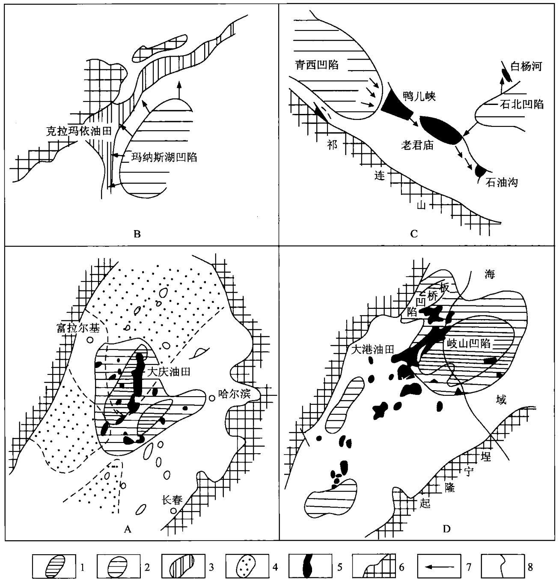

图 7-19 成烃坳陷与油气分布关系图

(转引自陈荣书, 1994) A一松辽盆地; B一准噶尔盆地; C一酒西盆地; D一黄骅坳陷 1一生油中心; 2一生油凹陷; 3-油气聚集带; 4 一储油岩区; 5 一油田; 6 一盆地边界; 7 一油气运移方向; 8 一海陆界线

<!-- Media -->

成烃坳陷在盆地内的位置, 在盆地发展和演化过程中可以保持基本一致, 亦可能发生某种程度甚至是较大范围的转移。成烃坳陷的面积大多与盆地的规模有密切关系, 一般大中型盆地的生油凹陷面积较大。

成烃坳陷内形成的烃源岩体积, 是不同层位成熟的烃源岩体积的总和。这样就不难解释: 世界上已知的大油气田比较集中分布在沉积速率高、沉降历史较长的大中型盆地里。

据克莱米 (H. D. Klemme, 1997) 的统计, 世界上共有 334 个大油气田 (最终可采储量达 ${68} \times  {10}^{6}\mathrm{t}$ 以上的大油田222个,最终可采储量为 ${10}^{11}{\mathrm{\;m}}^{3}$ 的大气田112个),分布于 60 多个油气盆地中。其中有 16 个盆地含有 5 个以上的大油气田, 这 16 个盆地的大油气田总数为 249 个, 占所有大油气田总数的 71.5%; 储量则可达 90%以上。

但不能因此就认为中型的或小型盆地就不可能形成丰富的油源。有些盆地虽然面积较小, 沉积历史也不长, 但沉积岩系和烃源岩层的厚度却很大, 这在一定程度上弥补了面积小的缺陷。若有其他有利条件的配合, 中小型盆地亦可为形成巨大的油气聚集提供丰富的油源。例如,洛杉矶盆地面积仅 ${39000}{\mathrm{\;{km}}}^{2}$ ,但在晚中新世到更新世的短短二千多万年内沉积的沉积岩系厚达 ${6000}\mathrm{\;m}$ 以上,其中烃源岩系厚 ${2000} \sim  {3000}\mathrm{\;m}$ ,油源丰富; 再加上有多种有利条件的配合, 在其中形成了 4 个大油田和 50 多个中小型油气田, 单位面积的产油率居世界首位 (图 7-20 中 1)。

<!-- Media -->

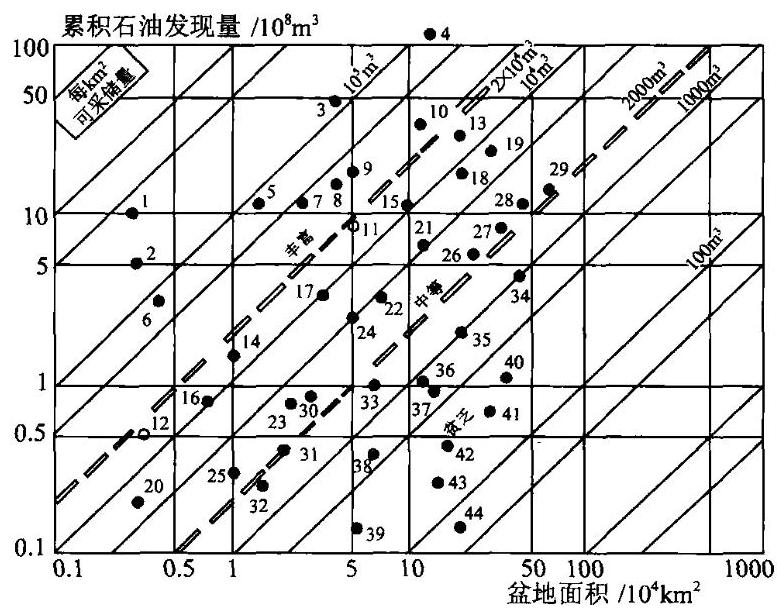

图 7-20 盆地大小与油气丰度图

(据 Perodown, 1972)

<!-- Media -->

此外, 罗马尼亚的普洛耶什蒂和美国的文图拉 (图 7-20 中 2 和 6), 以及我国的酒泉西部及泌阳等盆地,都是面积小于 ${5000}{\mathrm{\;{km}}}^{2}$ 的小型盆地,但也产出较丰富的油气。

## (二) 有利的生储盖组合

生储盖组合系指烃源岩、储集层和盖层三者组合的型式。油气勘探的实践证明, 烃源岩、储集层和盖层在时间和空间上的密切配合, 也是形成大油气藏不可缺少的基本条件。

## 1. 概念

有利的生储盖组合是指烃源岩、储集层和盖层三者本身具有良好的性能, 同时它们在时空上具有良好的匹配, 有利于油气的高效输导、富集和保存, 形成大油气藏, 有利于勘探和开发。其实质是以怎样的关系组合在一起才能使烃源岩中生成的油气有效地驱向储集层, 而储集层中储存的油气不致向上逸散。因此, 在研究生储盖组合关系时, 需着重解决两个实质性问题, 即烃源岩中生成的油气向储集层输导的通道及输导能力和盖层的质量和厚度。

孔隙 - 裂缝系、不整合面和断层是沟通烃源岩和储集层通道(或输导层)的三种基本形式, 前者为烃源岩和储集层直接接触带的主通道, 后两者可以把时间上不连续, 甚至空间上也不相邻的烃源岩和储集层组合在一起, 构成生储盖组合。输导层的输导油气能力与烃源岩和储集层的接触方式及本身特征有关。一般来说, 烃源岩和储集层垂向直接接触比侧向相邻的输导能力大; 接触面积愈大输导能力愈强; 通道孔隙直径粗大, 两端压差大、形状简单、输导能力强。

盖层的质量和厚度是保证储集层具有良好封闭性的基本条件。盖层的质量主要取决于孔隙直径大小和裂缝发育程度 (或可塑性)。盖层封闭性能的好坏, 可以用盖层和储集层之间的排替压力来确定。

与输导油气的能力相比, 盖层是从属的因素。在成油条件相似的情况下, 输导能力强的组合中, 烃源岩能高效率地驱出其中生成的烃, 成为有效的烃源岩; 反之如果缺乏排烃能力, 即使已生成大量烃类, 也只能被 “闷死” 在烃源岩中, 不能提供有效烃源。因此, 在进行生储盖组合分类时, 必须首先考虑烃源岩与储集层的接触关系以及通道的型式和特征。

2. 生储盖组合类型

<!-- Media -->

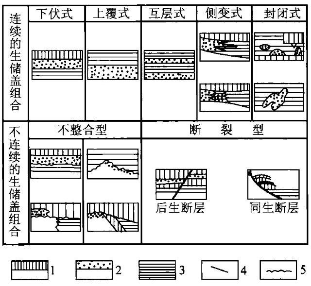

图 7-21 生储盖组合分类模式图

1一盖层; 2-储集层; 3-一烃源岩; 4-断层; 5-不整合

<!-- Media -->

根据烃源岩、储集层接触关系将生储盖组合分为两大类, 即连续的组合和不连续的组合。然后再根据接触方式及通道型式, 将各类组合进一步划分 (图 7-21)。

连续的生储盖组合的基本特点是三者同存在于连续沉积的地层单位中。烃源岩、储集层或者垂向交替, 或者侧向互变, 但均属不同方式的直接接触; 接触方式可以是面接触 (上覆型和下伏型)、带接触 (侧变型) 和体接触 (封闭型); 无论哪一种接触方式, 输导油气的通道都是以孔隙一裂缝系统为主。由于该类组合中烃源岩与储集层直接相接触, 且界面的排替压力差极大, 到达烃源岩界面上的油气可以无阻地流向储集层。

不连续的生储盖组合的基本特征是烃源岩和储集层在时间上是不连续的; 在空间上可以相邻, 也可以不相邻; 两者之间是由不整合面或断层面所沟通。根据通道的特点, 可以分为不整合型和断裂型。不整合型的烃源岩和储集层是由不整合面所沟通。它可以分别存在于不整合面的两侧, 或同时存在于一侧。由于不整合面具有较强的输导能力, 对油气聚集起着重要作用, 特别当烃源岩和储集层分别紧靠不整合面两侧时, 可以形成良好的输导层。断裂型烃源岩总是位于储集层下方, 但两者可以位于断层的一侧或两侧, 以断层作通道。

## 3. 评价

作为有利的生储盖组合应该具有有利于油气聚集的最佳组合型式、烃源岩的最佳厚度和最佳生储比率。

所谓最佳的组合型式, 就是输导能力和效率最高的组合型式, 表现为生储盖的时空跨距和生运聚作用的连续性。时空跨距是指在一个生储盖组合中, 烃源岩层、储集层和盖层彼此在地质时代和空间剖面上的间隔距离。很明显时空跨距越小, 油气运移散失的时间和空间就越小, 也就越有利于油气的运聚成藏。通常情况下, 油气在本层系内的自生自储比跨层系储聚的散失较少, 因而成藏条件也较好。一般来说, 互层型、侧变型和不整合型是较好的组合；断裂型、上覆和下伏型次之；封闭型组合中因大多数透镜状聚集体的容积较小, 一般不能形成巨大的油气聚集。

烃源岩最佳厚度是从生储盖组合这一角度, 考虑单层连续沉积的烃源岩在多大的厚度范围内具有最高的排烃效率。

最佳生储比率是指烃源岩与储集层在地层单元中厚度的最佳比率。如果在一个盆地或凹陷的地层剖面中都是泥质烃源岩, 即所谓 “满盆皆泥” 的情况, 那么生成的烃类绝大部分将滞留和分散在巨厚的泥质烃源岩层中, 而不利于油气的排出和运聚成藏。如果地层剖面上绝大部分都是砂岩储集层, 烃源岩很少, 那么生成的烃类又很难满足在巨厚砂岩储集层中二次运移的消耗, 结果很难有多余的烃类聚集成藏。从我国目前的研究来看, 生、 储集层在地层单元中所占厚度的比例以 $6 : 4$ 或 $7 : 3$ 为宜,这样的比例有利于油气的运聚成藏。

对生储盖组合的定性评价可综合如表 7-1 所示。

<!-- Media -->

表 7-1 生储盖组合定性评价表

<table><thead><tr><th>评 价 组合特点</th><th>最好</th><th>较好</th><th>较差</th></tr></thead><tr><td>组合型式</td><td>互层式 指状叉式 不整合型 复合型式</td><td>上覆式 下伏式 侧变式 断裂式 储集体较大的透镜型</td><td>储集体较小的透镜型和距离 较远的侧变式</td></tr><tr><td>生油层总厚及单层生油 层的连续厚度</td><td>总厚度大, 单层连续厚度 在 ${30} \sim  {50}\mathrm{\;m}$</td><td>总厚度较大, 单层连续厚 度在 ${50} \sim  {200}\mathrm{\;m}$</td><td>生油层总厚度小, 或总厚度 虽小但为连续巨厚的生油层</td></tr><tr><td>砂岩百分率 ${20}\%  \sim  {60}\%$ 地带与油源区的关系</td><td>分布在油藏区内或紧靠油 源区</td><td>分布在油源区附近或不太 远的地带</td><td>分布在油源区以外较远地带</td></tr></table>

<!-- Media -->

## (三) 大容积的有效圈闭

大容积的圈闭是大油气藏形成的前提, 有效圈闭是形成油气藏的基本条件。但并非所有大容积圈闭都能有效地聚集油气, 只有那些距油源区近、形成时间早、闭合度高和保存条件好的大容积圈闭, 才是有效圈闭。有效圈闭可定义为曾经聚集并保存具有工业价值油气藏的圈闭。

1. 圈闭容积大

圈闭容积的大小, 主要取决于闭合面积、闭合高度、储集层的有效厚度和有效孔隙度等参数。一个大容积的圈闭, 通常具有较大的闭合面积、较厚的储集层、较高的孔隙度, 但闭合度的变化范围可能较大。

据对 17 个储量在 ${13.9} \times  {10}^{8}\mathrm{t}$ (或 ${13.9} \times  {10}^{8}\mathrm{t}$ 当量的天然气) 的特大油气田的不完全统计,含油气面积最小的为 ${340}{\mathrm{\;{km}}}^{2}$ ,最大的 (霍戈登 - 潘汉斗油气田) 达一万多平方公里,中值约 ${2000}{\mathrm{\;{km}}}^{2}$ ; 油层的有效厚度最小为 ${50}\mathrm{\;m}$ ,最厚的达 ${2100}\mathrm{\;m}$ (裂缝性灰岩裂缝带的垂直厚度),一般在 $\cdot  {100} \sim  {400}\mathrm{\;m}$ ; 油层的有效孔隙度大多在 ${20}\%$ 以上,少数裂缝性储集层岩样的有效孔隙度可能较低, 但裂缝带的实际孔隙度和渗透率均相当大。

## 2. 距油源区近

所谓距油源区近, 是指圈闭不仅在空间位置上距油源区近, 更重要的是与烃源岩之间有良好的输导层 (即通道), 圈闭位于油气运移的路线上。只有在上述意义上距油源区近的圈闭, 才具有优先捕获油气的能力。

<!-- Media -->

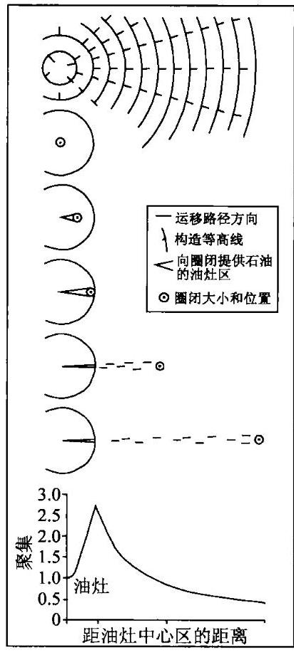

图 7-22 位于成烃灶边缘上的圈闭聚集效率示意图

(据 Hindle, 1977)

<!-- Media -->

根据油气差异聚集原理, 在油气运移路线上的圈闭, 距油源区近的最先聚集油气, 充满后才向储集层上倾方向较远、较高的圈闭中继续聚集。在油源较充分的条件下油气运移的路线和距离可以不断向远处延伸。但是, 任一个含油气盆地, 即使油源非常充足, 也不可能把所有圈闭都充满油气。在一般情况下, 空圈闭总是在油气运移路线之外, 其中有些距油源区较远, 有些距油源区在空间位置上并不远, 但不在油气运移路线上或缺乏良好的通道, 因此不能有效地聚集油气 (图 7-22)。

## 3. 形成时间早

油气聚集必须先有圈闭存在。圈闭形成的时间必须早于油气运移和聚集, 或两者同步才能有效地聚集油气。凡是最后一次区域性油气运移、聚集以前或同步形成的圈闭, 都可能成为有效的聚集油气的圈闭。这并不是说所有形成的圈闭都能聚集油气, 只有那些形成时间早, 又在油气运移路线上的圈闭, 才能有效聚集油气。

在形成时间早的圈闭中, 以与烃源岩系沉积同时开始形成的构造圈闭, 包括同沉积背斜和同沉积断层圈闭, 具有最佳的聚集条件和机会。这类构造圈闭不仅形成时间早, 且常同时具有距油源区近、生储盖组合良好、位于运移路线上等条件, 最有利于油气聚集。这也是为什么在油气勘探中很注意研究同沉积构造的根本原因。

4. 圈闭的闭合度高

当油水界面在水动力作用下发生倾斜时, 如果两端的高程差大于闭合度, 或油水界面的倾角大于圈闭中储集层顶面的倾角, 则该圈闭就不可能聚集石油, 即不再是有效圈闭。

同样, 如果圈闭的闭合度小于油水过渡带的厚度, 则该圈闭即使有油聚集, 也不能产出纯油, 只能同时产油水, 因而也就不能算做有效圈闭。

圈闭封闭烃柱的最大高度, 与盖层封闭能力及闭合度有关。圈闭封闭烃柱的最大高度 (即临界烃柱高度), 如图 7-3 所示。

5. 保存条件好

任一圈闭的储集层上方都有封闭性良好的盖层。没有盖层或其封闭性遭到不同程度的破坏, 都会影响圈闭的有效性。这一点对天然气来说, 尤为重要。因为, 天然气分子直径小、活动强, 没有良好的保存条件是很难形成大气藏的。

综上所述, 能形成巨大油气藏的有效圈闭必须具备: 大 (大容积)、近 (距油源近, 在运移路线上)、早 (形成时间早)、高 (闭合度高) 及保 (保存条件好) 这五个基本条件。

## 第四节 油气藏形成时间与期次

确定油气藏形成的时间, 对勘探目标的选择和评价, 提高油气勘探的成功率, 加快油气勘探, 都有十分重要的意义。因此, 确定油气藏的形成时间, 是石油与天然气地质学和油气勘探中一个重要的理论和实际问题。遗憾的是尚未找到一种直接和可靠的方法。目前确定油气藏形成的时间和期次, 主要有地质分析法和储集层成岩矿物分析法等两大类方法。

## 一、地质分析方法

目前主要是通过以下四种地质分析方法来确定油气藏形成的时间和期次。

## (一) 根据圈闭形成的时期

圈闭是形成油气藏的前提, 故其形成一定要早于或等于油气藏形成的时间。因此, 可以根据圈闭形成的时间作为油气藏形成的可能最早时间。

圈闭可以是在储集层之上盖层沉积后不久形成 (如透镜状岩性圈闭); 也可以是在储集层被埋藏相当长的地质时期后经构造运动改造而成。它可以是某一地质时期某一幕构造运动形成的, 也可以是在漫长的地质时期内经多次改造而形成的。

莱复生 (1954) 拟定了确定圈闭形成相对时间顺序的示意剖面图 (图 7-23)。图中 $\mathrm{a} - \mathrm{e}$ 为地层时代符号, $1 - 7$ 为圈闭号,1是 $\mathrm{a}$ 上覆泥岩盖层沉积形成的尖灭型岩性圈闭; 2 是造成 $\mathrm{b} - \mathrm{c}$ 之间不整合的构造变动所形成的断层圈闭; 3 是 $\mathrm{c}$ 沉积后形成的不整合面下的不整合圈闭; 4 是其上盖层沉积后形成的透镜型岩性圈闭; $5 \sim  7$ 是背斜圈闭,都是在 $\mathrm{e}$ 沉积后经褶皱而形成的。

<!-- Media -->

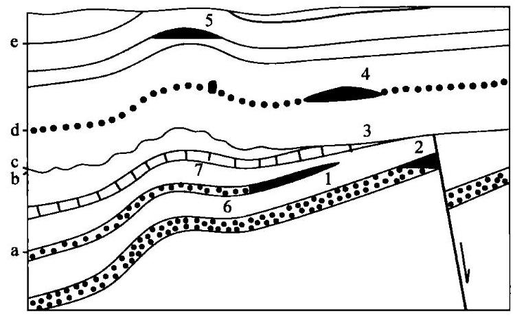

图 7-23 确定圈闭形成时间顺序的示意剖面图

(据 Levorsen, 1954)

a-b 代表地层时代; $1 \sim  7$ 代表圈闭或油气藏

<!-- Media -->

在上述圈闭中所形成的油气藏, 其形成的时间不会早于相应的圈闭。

对于经长期发育、逐步扩大其容积的圈闭, 可根据圈闭容积应大于或等于油气藏容积的原则, 对比不同发展阶段圈闭容积和现存油气藏容积之间的关系, 就可以确定油气藏形成的最早的可能时间。

<!-- Media -->

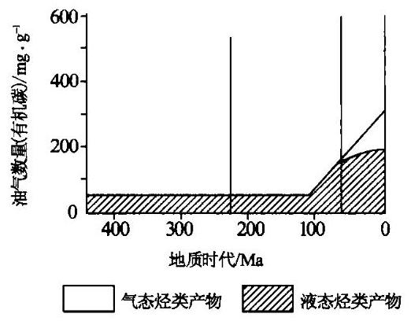

图 7-24 哈西·迈萨乌德区上志留统烃源岩底埋藏历史及所形成的烃类随时间的变化 (据 Tissot, 1975)

<!-- Media -->

当油气藏被断层切割时, 还可以利用断层与油气藏的相互关系, 通过确定断层形成的时间, 作为油气藏形成时间的最早或最晚时间的界限。

## (二) 根据烃源岩的主生烃期

在油气成因、运移等章节中业已指出, 烃源岩达到主生烃期时才能大量生成油气, 然后排出。 油气藏形成的时间只能晚于主成烃期, 而不可能更早。因此, 我们就可以根据烃源岩中有机质演化的地质、地球化学资料, 确定主生烃期, 并把这个时间作为油气藏形成的最早时间。

不同油气区的地质、地温梯度和地热历史有着巨大的差别。富含有机质的沉积物埋藏到达主生烃期的时间相差甚远。短的只要 ${10} \sim$ ${30}\mathrm{{Ma}}$ (如美国洛杉矶盆地的上第三系,我国东部盆地的下第三系),长的可能要 ${50} \sim$ ${100}\mathrm{{Ma}}$ ,甚至 ${300} \sim  {400}\mathrm{{Ma}}$ 。如阿尔及利亚的哈西·迈萨乌德区上志留统烃源岩, 直到石炭纪埋深仅 ${1000}\mathrm{\;m}$ ,还未达到主生油期; 二叠纪上升遭侵蚀,三叠纪重新开始强烈沉降,直到白垩纪末才埋深达 ${3700}\mathrm{\;m}$ 。用数字模拟计算烃类形成数量与地质时代的关系 (图 7-24), 说明该烃源岩的主生油期从晚白垩世才开始, 第三纪达到高峰。因此, 该油气藏形成的时间最早不可能早于晚白垩世。自早志留世到晚白垩世,共经历了三亿多年。

## (三)根据油气藏饱和压力

饱和压力又叫起泡点压力。当石油被天然气所饱和时, 石油的密度最小、浮力大、黏度最小、流动性最强, 因而运移聚集作用也最为活跃。这种情况下形成的油藏, 其地层压力应是饱和压力。油藏的饱和压力与油藏形成时的埋深有关, 因此达到此埋深的地质时期, 就是油气藏形成的时期。

根据饱和压力推算油气藏形成时的埋深, 可按下式求得:

$$
H = \frac{10p}{{\rho }_{\mathrm{w}}} \tag{7 - 1}
$$

式中: $H$ 为油藏形成时的埋深 $\left( \mathrm{m}\right) ;p$ 为饱和压力 $\left( {{10}^{5}\mathrm{\;{Pa}}}\right) ,{10p}$ 为饱和压力的水柱高 $\left( \mathrm{m}\right) ;{\rho }_{\mathrm{w}}$ 为水密度,设为1。

若油藏的饱和压力为 ${300} \times  {10}^{5}\mathrm{\;{Pa}}$ ,埋深为 ${3000}\mathrm{\;m}$ ,那么,这就是油藏形成时埋深为 ${3000}\mathrm{\;m}$ 时的地质时期,这就是油藏形成的时间。

根据饱和压力所确定的油气藏形成时间, 似乎比上述方法更直接和准确些。但是, 这种方法是建立在一系列假设条件基础上的。首先, 要求油藏在饱和压力下形成; 其次, 在油藏形成后的漫长地质年代里, 油气的成分和温度保持不变, 否则将会改变其饱和压力, 使计算产生误差; 再次, 还要求油气藏形成后其上覆地层不遭受侵蚀。上述条件对一般油藏来说, 是不易完全具备的。因此, 它也是一种概略的方法。

## (四) 根据圈闭容量

假设气藏形成时天然气充满圈闭容积, 而在其后的整个地质时期内圈闭容积和温度保持不变, 并维持在较低的压力下, 同时气藏中的天然气也没有渗漏和散失; 那么, 气藏中气体的体积与压力之间的关系, 需符合波义耳定律, 即

$$
{p}_{0}{V}_{0} = {p}_{1}{V}_{1} \tag{7 -2}
$$

式中: ${p}_{0}\text{、}{V}_{0}$ 分别为气藏形成时的地层压力和气体体积; ${p}_{1}\text{、}{V}_{1}$ 分别为现时气藏的地层压力和气体体积。根据假设,则 ${V}_{0}$ 可以圈闭的容积表示之。又因 $H = {10}{p}_{0}$ 或 ${p}_{0} =$ $1/{10H}$ ,则

$$
H = \frac{{10}{p}_{1}{V}_{1}}{{V}_{0}} \tag{7 - 3}
$$

式中: ${p}_{1}\text{、}{V}_{1}\text{、}{V}_{0}$ 都是可以测定或计算求得的参数, $H$ 可根据这些参数算出。确定出气藏形成时的埋深(H)后,就可按上述步骤确定气藏形成的地质时期。

但是, 这种方法同样是建立在一系列难以完全满足的假设基础上, 因而计算结果与实际情况存在一定程度, 有时甚至是较大程度的误差。不过, 在综合分析时仍不失参考价值。

地质分析法除了上述方法外, 还可根据地层发生区域性倾斜的时期确定油气藏形成的时期等。

值得注意的是, 地质分析的方法需要根据不同的地质条件加以选择应用, 最好是进行多种方法的综合对比和分析, 这样可能获得较好的效果。

## 二、储集层成岩矿物分析法

储集层的成岩作用从沉积开始并贯穿在整个埋藏过程中, 也可以说是岩石矿物与地层流体在温度、压力和地应力条件下, 相互不断作用的过程, 而各种矿物的次生变化和自生矿物的形成都是成岩作用的产物。油气作为盆地中的一种地流体, 当其进入储集层后必然影响成岩作用的发生和成岩矿物的形成。因此, 根据流体包裹体测温和自生矿物测定年龄以及矿物形成的序次, 可以比较准确地判断油气藏形成的时间。

## (一) 流体包裹体法

流体包裹体是矿物结晶过程中捕获的成岩成矿流体。储集层中常见有盐水溶液包裹体和含烃有机质包裹体。人们认为, 矿物在结晶过程中形成包裹体时所捕获的流体大多呈单一液相, 只是将样品采至地面后由于温度、压力的降低, 溶于液相中的气体分离出来才形成气 - 液两相的包裹体。将包裹体置于冷热台上加热至气相消失, 再恢复成均一液相时的温度称为均一温度, 经压力校正后它代表了包裹体在储集层中形成时的最低温度, 再根据古地热梯度和储集层埋藏史, 就可确定包裹体形成时的地层埋深及对应的地质年代。因此, 测定与含烃包裹体同期生成的盐水包裹体的均一温度, 或直接测定由液态烃与气态烃组成的烃包裹体的均一温度, 即可得知油气进入圈闭储集层形成油气藏的时期。如果, 再进行包裹体中烃类成分和成熟度的测定和分析, 还可以推断充注方向、进行油源对比和成藏史的研究。该方法已成为当前油气运聚研究中一种重要的方法。必须注意, 虽然包裹体中直接蕴含和记录着各种有关油气运聚的宝贵信息和证据, 但如何把它们真实地提取出来还有一定难度和问题, 在取样、测试和参数求取过程中还有许多不确定因素。

## (二) 自生伊利石测年法

自生伊利石是高岭石和钾长石在储集层酸性水介质中溶解沉淀出的一种成岩矿物。该方法的依据就是当油气进入储集层后, 由于孔隙流体介质的变化自生伊利石就会终止其生长。因此,利用 $\mathrm{K} - \mathrm{{Ar}}$ 测年法系统测定自生伊利石的年龄,通过相互比较找出年龄由大突然变小的部位, 就可以判断出自生伊利石停止生长的时间, 也就是油气进入储集层和油气藏形成的时间。这种方法通常要求在油气藏剖面中对油 - 水界面上下的油层和水层做等间距地系统采样,再做自生伊利石的 $\mathrm{K} - \mathrm{{Ar}}$ 年龄测定,理论上在油水界面上下的自生伊利石必有年龄上的突变, 水层中的自生伊利石年龄必远小于油层中的年龄, 而油层中自生伊利石的年龄即代表其停止生长的时间, 也就是油气进入储集层的成藏时期。通过自生伊利石年龄与深度的关系剖面, 可以确定年龄发生突变的深度, 从而判断油气藏形成的时间。

这种方法在理论上是完全可行的, 但要获得较可靠的结果, 在实际取样、测定等操作环节中还有许多困难。此外, 该方法受储集层非均性、油水分布、水介质变化等条件的影响很大, 在结果分析上也存在许多不确定因素。目前, 它也是一种很有前景, 但尚需发展完善的新方法, 在应用时最好与其他方法一起进行综合分析和判断, 这样效果较好。

## 第五节 非常规油气藏形成

“非常规” 是相对于 “常规” 而言的。原先人们区分它们主要依据其是否具经济性, 但随着社会经济的发展与科学技术的进步, 人们对常规和非常规的认识和标准也在发生变化, 过去认为是非常规的而如今也许就视为常规。因此, 现在人们通过地质特征来区别它们, 即非常规油气藏一般都不是由浮力驱动而形成的, 具有广泛分布的特点, 且大多数与构造和地层圈闭无关, 常具有隐蔽性和特殊性, 可以从不同角度来认识和区别, 至今尚没有统一的定义和界线。在此, 我们把非常规油气藏简单地理解为其成藏机制不同于一般常规的油气藏, 主要介绍深盆气藏、煤层气藏和甲烷水合物三类非常规油气藏。

## 一、深盆气藏

20 世纪 70 年代中期, 在加拿大西部阿尔伯达盆地艾尔姆华士地区第一次发现了这种非常规气藏, 之后又经历了几年的勘探, 最终确定在该盆地深部中生界的致密地层 (渗透率低于 ${0.1} \times  {10}^{-3}{\mathrm{{\mu m}}}^{2}$ 、孔隙度小于 $7\%$ )中饱含有天然气,而在其上倾方向孔渗较好的部位却为水所占据, 似乎天然气被 “水” 所封闭。这种气水倒置、非同一般的气藏, 且预测的天然气资源量又如此巨大 (约 ${10} \times  {10}^{12}{\mathrm{\;m}}^{3}$ ),立即引起了全世界的关注。随后, 在美国圣胡安、绿河等盆地中也确认了这种气藏的存在。由此一种新类型的、非常规的深盆气藏诞生了 (图 7-25)。

<!-- Media -->

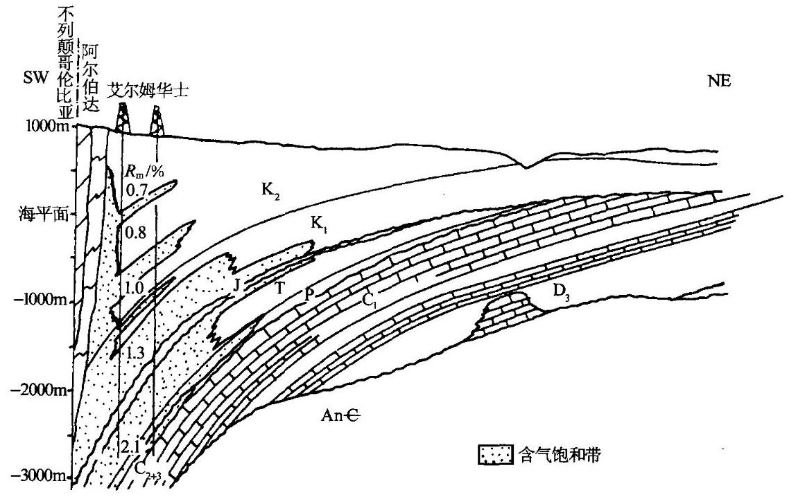

图 7-25 加拿大阿尔伯达盆地深盆气藏剖面示意图

(据许化政等, 1996)

<!-- Media -->

“深盆气” (Deep Basin Gas Pools) 一词原指分布在盆地的深部气藏, 其成藏机制和分布不同于前述常规油气藏。目前国内该类气藏在名词术语使用上比较混乱, 如有称“致密砂岩气”、“根源气”等。另外,从圣胡安盆地的深盆气大多产在不足 ${914}\mathrm{\;m}$ 的深度和它还可以包含由常规浮力驱动形成的气藏来看, 其概念有些不明确。Law (2002) 认为称为 "盆地中心气藏" (Basin Center Gas Accumulation) 比较合适。

## (一) 深盆气藏的形成机制

深盆气在成藏过程中也需要有成熟烃源岩提供丰富的气源, 在层系的顶底部也需要有盖层防止天然气的垂向运移和散失, 也需要有储集层和圈闭来储聚天然气。但这些成藏要素和所产生的生、运、聚作用, 在时空的组合上与常规油气藏的形成有许多不同。首先是深盆气的圈闭本身就是致密储集层, 因此要求在烃源岩大量生、排气之时或之前就已形成。这样相邻烃源岩生成的天然气, 才能在生烃的膨胀压力 (异常高压力) 作用下注入致密储集层, 不断排替其中孔隙水并把气水界面不断向上倾方向推移, 最终在气水界面以下为天然气所饱和、气水界面之上为水所饱和。气水之间并没有任何封闭层将它们隔开, 气水界面的形成位置正是两种力达到动平衡的位置, 即当生烃的膨胀压力与气水两相的毛细管压力达到平衡时气水界面相对稳定。因此, 它决定于生气量 (膨胀压力) 和岩石的孔喉半径(毛细管压力)以及气体的分子扩散和微渗漏等散失量。由于地层的非均质性, 气水界面在三维空间上是极不规则的, 在地史时期中也是动态变化的, 取决于生气量和散失量的平衡。可见, 深盆气藏形成的关键在于相邻成熟烃源岩是致密储集层, 而其本身又是聚气的圈闭, 否则烃源岩排入的天然气将在浮力作用下进入其他圈闭中形成常规气藏。

<!-- Media -->

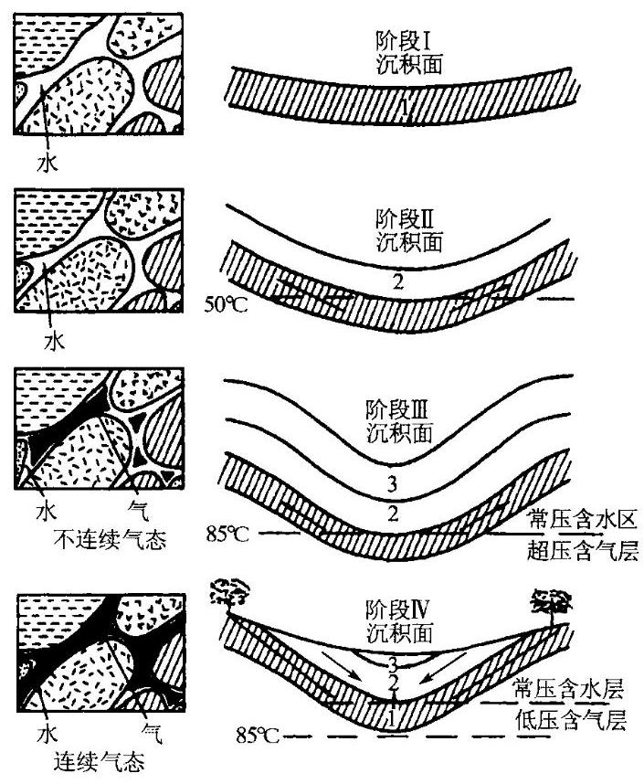

图 7-26 深盆气藏形成的概念模式图

(据 Law 和 Dickinson, 1985)

$1\text{、}2\text{、}3$ 表示岩层或沉积层

<!-- Media -->

Dickinson (1985) 以美国绿河 (Green River) 盆地为背景, 提出了致密地层中深盆气藏形成的四个阶段 (图 7-26)。

第一阶段: 埋藏初期, 地层的孔隙度和渗透率高, 原始孔隙度可达 ${30}\%  \sim  {40}\%$ ,地层流体流动不受阻碍, 压实和胶结作用是孔隙度减少的主要原因。

第二阶段: 埋藏中期, 地温达到 ${50}^{ \circ  }\mathrm{C}$ ,有 ${\mathrm{{CO}}}_{2}$ 生成,孔隙流体呈酸性, 可以产生溶蚀作用, 但进一步的压实作用将增大的孔隙抵消, 在压实作用下此时是地层重要的排水时期。

第三阶段: 埋藏加深, 地温达到 ${82}^{ \circ  }\mathrm{C}$ ,烃源岩开始大量生气,并排入由于胶结作用而进一步致密化的砂岩储集层。地层水很快被气所饱和, 出现游离气并产生异常高压, 在高压作用下地层中的自由水不断被排到周围低压岩层中, 直到只剩下不能流动的束缚水为止。在这种封闭的水文系统内地层进一步变得更加致密, 尽管地层的渗透率很低但气体仍可运移, 此时由于生成和聚集的速率大于散失的速率, 所以地层仍保持异常高压并使边水进不到含气的部位。

第四阶段: 地壳抬升剥蚀, 造成地层温度和压力降低, 气体生成停滞或衰竭; 上覆负荷压力的降低使地层孔隙体积有所增加, 孔隙流体压力逐渐降低; 此时天然气散失的速率大于气体生成补充的速率, 地层由超压转变成异常低压, 水又从边缘部分慢慢地渗透进来取代气体散失的体积, 使地层由异常低压最终恢复到正常压力。

Law (2000) 根据气源岩将深盆气 (盆地中心气) 分为直接型与间接型两类: 前者的气源岩富含以生气为主的Ⅲ型干酪根; 后者富含以生油为主的 I 、II 型干酪根, 生成的石油再热裂解成气。Dickinson (1985) 的 4 个阶段的演化模式主要是反映直接型的深盆气, 而间接型的深盆气必须要在 ${R}_{0}$ 值大于 ${1.35}\%$ 之后,使已生成或聚集的石油裂解成气,才能发生类似直接型的演化过程。

## (二)深盆气藏与常规油气藏的时空分布关系

成熟烃源岩与其相邻的致密储集层是深盆气藏形成的两个关键条件。但烃源岩要成为深盆气的有效气源岩还需有一个演化过程, 特别是 I 、II 型的干酪根要达到热裂解大量生气的阶段都需要相当的理深, ${R}_{0}$ 值一般要在 ${1.35}\%$ 以上; 而砂岩储集层也需要相当的埋深, 在压实和胶结作用下逐渐转变为致密储集层, 才能成为深盆气的圈闭。因此, 烃源岩和储集层都要经历一定的演化之后, 才能相互匹配形成非常规的深盆气藏。

然而, 在烃源岩演化过程中早期生成的油气, 当其排入尚未致密化的砂岩储集层中, 就会在浮力、水动力的作用下沿地层上倾方向运移, 遇到圈闭时就可形成常规的油气藏; 如果地层中缺乏圈闭或地层出露地表, 除造成大量油气的散失外, 还可形成各种类型的油气显示。当深部烃源岩进入大量生气阶段时, 生成的天然气首先注入邻近的致密储集层, 在生烃膨胀压力作用下逐渐向地层上倾方向推进, 从而在地层的下倾方向形成具异常压力的饱含深盆气的圈闭带, 向上过渡为含水的常压带并可能分布有早期形成的常规油气藏。 由此可见, 在一个盆地中常规油气藏与深盆气藏在时空分布上有一定的关系, 即常规油气藏可早于深盆气藏形成并分布在其上倾方向 (图 7-27)。图中, “甜点” (Sweet spots) 是致密储集层中孔渗物性相对较好的地方。它往往是深盆气圈闭带中具工业开采价值的地区。

阿尔伯达盆地为我们提供了这种分布关系的最典型例证。早期由下白垩统页岩生成的石油,沿砂岩层或底部不整合面运移到盆地东北边缘埋深仅 ${275}\mathrm{\;m}$ 的阿萨巴斯卡 (Athabasca) 大背斜 (闭合面积约 ${5.5} \times  {10}^{4}{\mathrm{\;{km}}}^{2}$ ) 中,由于生物降解作用形成巨大的常规稠油藏,整个盆地东侧探明的稠油资源量达 ${0.48} \times  {10}^{12}\mathrm{t}$ ,约是世界其他地区探明石油储量的 3 倍; 此期间生成的天然气大多已通过地表散失, 有少量储聚在东侧斜坡带上的常规地层油气藏中。而后期生成的大量天然气则主要饱含在盆地西侧深埋的致密砂岩中, 形成了非常规的深盆气藏,其储量预测在 ${50} \times  {10}^{12}{\mathrm{\;m}}^{3}$ 以上。

<!-- Media -->

图 7-27 非常规深盆气藏与常规油气藏空间关系示意图

(据 Surdam, 1997, 修编)

<!-- Media -->

近年来, 在我国鄂尔多斯等盆地中相继确认有深盆气藏存在, 因此进一步了解常规油气藏与深盆气藏的时空分布关系, 能使我们更有效地指导天然气的全面勘探。

## 二、煤层气藏

煤层气是腐殖煤在热演化变质过程中的产物, 以甲烷为主, 又称煤层甲烷或煤层瓦斯。它主要以吸附状态赋存于煤的基质表面, 在煤层割理和裂隙及煤层水中还存在有少量的游离气和溶解气。

## (一) 概述

煤层气藏 (Coalbed Gas Reservoir) 主要是指煤层中甲烷相对富集具有工业开采价值的层段或部位。 20 世纪 70 年代以来美国最早将煤层气作为一种非常规的天然气资源进行勘探和开发, 先后在圣胡安 (San Juan)、黑勇士 (Black Warrior)、拉顿 (Raton) 等盆地获得成功,并在 90 年代得到迅猛发展,1998 年美国煤层气产量达到 ${350} \times  {10}^{8}{\mathrm{\;m}}^{3}$ 。我国拥有丰富的煤资源,截至 1996 年底全国探明的煤炭储量约 ${9.8} \times  {10}^{12}\mathrm{t}$ ; 以埋深浅于 ${1500}\mathrm{\;m}$ 的煤层测算,我国煤层气的资源量约为 ${27} \times  {10}^{12}{\mathrm{\;m}}^{3}$ 。可见,煤层气是我国最具潜力的后备资源。我国自 20 世纪 90 年代初开始进行煤层气勘探以来, 已取得了一批重要的勘探资料和成果, 特别是 1998 年发现了第一个大型的沁水煤层气田, 它的发现预示着我国煤层气勘探已进入大发展的新时期。

## (二) 煤层气藏的成藏条件

在成藏要素和作用中除盖层条件外, 煤层气藏的生气层、储气层和圈闭都是煤层本身, 同时甲烷的生、运、聚作用也都发生在煤层之中。因此既要求煤层有很高的生气潜力, 又要求煤层具有很强的储集吸附能力, 还要求一定的渗透率以利于煤层甲烷的运移和排放等, 只有当煤层本身兼有以上各种性能和作用时, 才可能形成煤层气藏。因此, 并非有煤层存在就有煤层气藏。

煤岩的变质程度 (煤阶) 或煤级、显微组分和灰分是影响煤岩含气量、吸附能力和渗透率好坏的关键因素 (图 7-28)。煤的含气量一般是随煤阶的增加而增加,低煤阶的含气量一般为 ${2.5} \sim  7{\mathrm{\;m}}^{3}/\mathrm{t}$ ,高煤阶的含气量可达 ${25}{\mathrm{\;m}}^{3}/\mathrm{t}$ 以上。在显微组分中镜质组含量越高, 生气量越大、吸附量越多、煤层割理越发育、渗透性也越好, 而易于开采。煤的灰分含量越低, 煤质越好、甲烷吸附量越高。综合以上三个方面可以认为: 中等变质程度的气煤一焦煤镜质组含量大于 ${80}\%$ ,灰分含量小于 ${20}\%$ 。吸附气量大于 ${15}{\mathrm{\;m}}^{3}/\mathrm{t}$ 的煤层, 最有利于煤层气藏的形成。虽然贫煤一无烟煤的产气量很高, 但在较长的变质过程中气大多散失难于保存, 只有当区域热变质和保存条件好时, 才可以是有利成藏的煤层。

<!-- Media -->

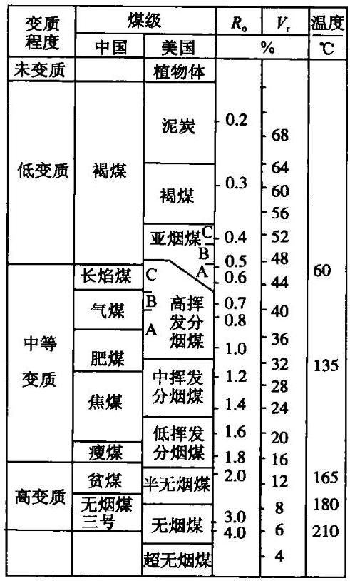

图 7-28 煤级划分及主要指标 (据张群等, 2001)

<!-- Media -->

煤层气藏的形成还需要良好的区域地质条件是: ①煤层有适宜的区域性产状, 连续分布面积大于 ${200}{\mathrm{\;{km}}}^{2}$ ,总厚度大于 ${10}\mathrm{\;m}$ ,埋藏深度小于 ${1500}\mathrm{\;m}$ ,一般是在含煤盆地的斜坡带上, 这样的煤层不仅含气量高而且还能保持一定的孔渗物性便于开采, 且离开上倾方向的甲烷风化带。②煤岩的热变质环境最好是岩浆热变质区域,煤岩的演化可在较高温度 $\left( {{400} \sim  {500}^{ \circ  }\mathrm{C}}\right)$ 和较低压力条件下进行,使煤层既具有较高含气量又能保持较好的岩石物性。③构造变动要适中, 这样煤层既可产生构造裂缝使煤岩的渗透率大于 ${0.5} \times  {10}^{-3}{\mathrm{{\mu m}}}^{2}$ ,又不会因强烈变动造成煤层气大量散失。 ④区域性的水动力条件最好是具异常高压的封闭性承压环境, 煤层在较高的压力下不仅有更高的吸附量, 而且还能避免强循环水对煤层气藏的破坏。⑤煤层上下顶底面需要有区域性的有效盖层, 以减少甲烷的分子扩散或沿裂隙渗漏到邻近岩层而散失。

<!-- Media -->

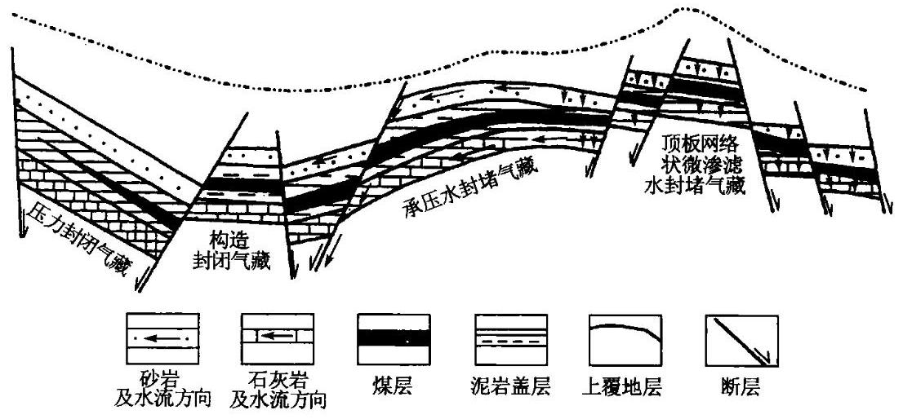

图 7-29 中国煤层气藏类型模式图

(据高瑞祺等, 2001)

<!-- Media -->

根据这些成藏条件, 结合我国实际情况, 可将煤层气藏划分为承压水封堵、压力封闭、顶板微渗滤水封堵和构造封闭等四种类型 (图 7-29), 其中以承压水封堵型气藏最为优越, 我国沁水盆地环状斜坡带上的石炭、二叠系煤层就属这种类型。

总之, 煤层中生成的甲烷, 在一定的地质条件下可以形成煤层气藏, 而煤岩在热演化的地史过程中又会有部分甲烷散失到邻近岩石中, 但只要不是散失到地表, 就有可能成为常规气藏的气源。可见, 无论是对非常规的煤层气藏, 还是对常规气藏来说, 煤都是重要的气源岩。

## 三、甲烷水合物

在特定的低温和高压条件下, 甲烷气体可容纳水分子形成一种具笼形结构、似冰状的固体水合物, 又称固态气体水合物 (Solid Gas Hydrate)。天然的甲烷水合物 (Methane Hydrate) 多呈白色、浅灰色, 常以分散状的颗粒或薄层状的集合体赋存于沉积物之中。

## (一) 形成条件

甲烷水合物开始出现的条件是: 温度低于 ${0}^{ \circ  }\mathrm{C}$ ,压力小于 ${2.5}\mathrm{{MPa}}$ ; 温度在 $0 \sim  {20}^{ \circ  }\mathrm{C}$ 之间,压力在 ${2.5} \sim  {25}\mathrm{{MPa}}$ 的范围内 $\left( \text{图 7-30}\right)$ 。可见,温度越低,所需压力越小,埋藏深度也就越浅 (图 7-31)。适合于甲烷水合物形成的地质环境是高纬度的永冻带、大陆斜坡和大洋盆地。如北极地区永冻带一般厚 ${250} \sim  {600}\mathrm{\;m}$ ,可形成近 ${1000}\mathrm{\;m}$ 的甲烷水合物带; 南极冰盖区也可形成近 ${2000}\mathrm{\;m}$ 的甲烷水合物带; 而大洋底的甲烷水合物主要分布于水深 ${300} \sim  {3000}\mathrm{\;m}$ 的陆坡和大洋盆地的沉积物中。目前大约有 ${27}\%$ 的陆地面积和 ${10}\%$ 的大洋面积有甲烷水合物分布 (Nisbet 等, 1998)。

<!-- Media -->

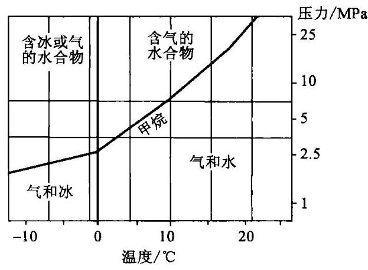

图 7-30 形成甲烷水合物的条件

(据 Perrodon, 1993)

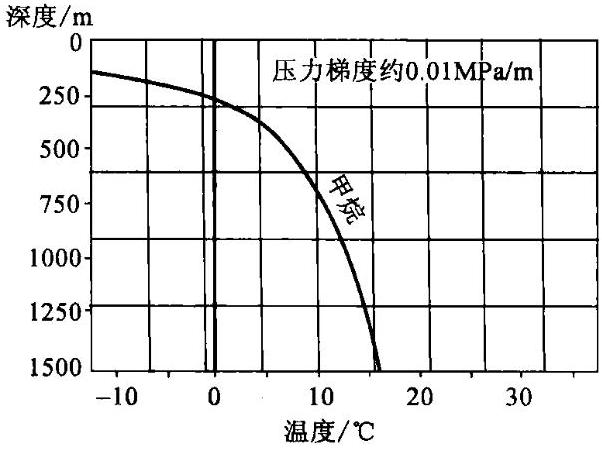

图 7-31 形成甲烷水合物的深度与温度 (据 Perrodon, 1993)

<!-- Media -->

形成甲烷水合物带必须具有充足的气源, 水合物中的甲烷主要有微生物、热解作用以及两者混合的成因机制。甲烷 ${\delta }^{13}\mathrm{C}$ 值 $\leq   - {60}\%$ 力生物成因气, ${\delta }^{13}\mathrm{C}$ 值 $\geq   - {50}\%$ 方热成因气 (Hunt,1979)。根据对全世界水合物样品中甲烷的碳同位素分析, ${\delta }^{13}\mathrm{C}$ 值的范围在 $- {57}\% o \sim   - {73}\% o$ ,说明甲烷主要是生物成因气,只有陆上的永冻区和少数海域的甲烷是热解或混合成因 (Kvenvolden, 1996)。

## (二) 分布

全世界甲烷水合物的资源量到底有多少,目前尚无定论。初步估算约有相当于 ${2.1} \times$ ${10}^{16} \sim  {4.0} \times  {10}^{16}{\mathrm{\;m}}^{3}$ 的甲烷 (Max 等,1998),是全世界所有常规矿物燃料 (煤、石油和天然气) 总和的 2 倍。由于甲烷水合物分布广泛,资源巨大,且能量密度高 $\left( {1{\mathrm{\;m}}^{3}}\right.$ 饱和天然气水合物,在标准状况下可释放出 ${194}{\mathrm{\;m}}^{3}$ 甲烷),被世人誉为 21 世纪的接替能源,得到世界各国的极大关注。前苏联学者早在 20 世纪 40 年代对甲烷水合物就进行了许多研究, 60 年代中期开发了第一个、也是目前惟一的甲烷水合物气田。美国自 20 世纪 60 年代到 80 年代相继实施了大洋钻探计划, 促使甲烷水合物的研究进入全面发展的阶段。我国在这方面的研究起步较晚, 90 年代初在实验室中合成了甲烷水合物, 开展了青藏高原永久冻土层的天然气水合物的研究工作, 并在南海西沙海槽进行了甲烷水合物资源的前期调查等, 使我国在甲烷水合物的研究和调查工作上开始跻身于世界先进行列。

除上述非常规油气藏之外, 目前已为人们所认识的还有浅层生物气、裂缝性页岩油气等非常规油气资源。

## 第六节 油气藏的破坏与油气再分布

## 一、油气藏的破坏

油气藏的破坏是指由于外界地质条件的变化, 原来形成的油气藏逐渐消亡的地质过程。其最终结果是: 油气藏在三维空间上不复存在或部分残存, 油气藏中的油气完全逸散或部分残留变质。引起油气藏破坏的主要原因有以下几个方面: ①圈闭本身遭到破坏, 主要表现为圈闭容积变小或丧失, 例如圈闭构造遭到掀斜或削蚀等情况; ② 直接盖层遭到破坏, 主要表现为油气通过盖层部分甚至全部漏失; ③水动力的增强, 可将部分石油冲出圈闭, 并引起生物降解和水洗作用, 使石油变质破坏; ④地层温度和压力的变化, 可引起原油裂解和变质、气涌和气顶膨胀、岩石发生水力破裂等现象, 使油气变质和散失; ⑤烃源补给的变化, 主要表现为生烃停滞或运移主路线的改变, 导致烃源中断造成油气藏的聚集失去平衡而逐渐萎缩消失。

## (一)油气藏破坏的主要地质作用

## 1. 断裂作用

断裂能使储集层断开并发生相对位移。它能改变油气藏中原有的压力平衡状态, 促使油气向新的低势区输导。除向地表溢出外, 更为重要而常见的作用是使油气在不同储集层间进行再分布。它可以在统一油气藏内重新分配, 使油气更多地向高断块集中, 而低断块则相应减少。各断块的原始油水界面和压力系统仍是单一的。

断裂结果, 也可以使单一富集的油层, 分解为若干个油气藏 (图 7-32)。这种再分布的结果, 导致油气聚集规模和经济价值均相应降低。

<!-- Media -->

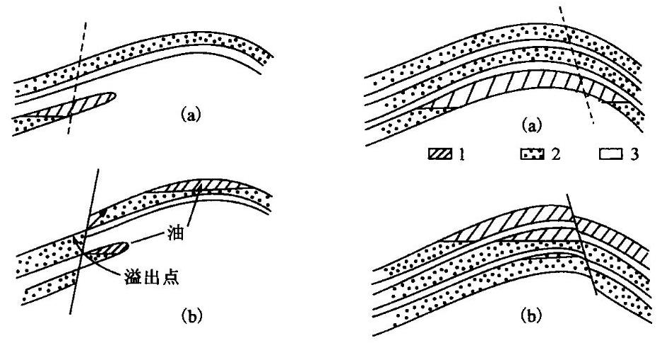

图 7-32 两种不同类型的断层对油气在分布上的影响示意图

(据 Hobson, 1956)

1-油; 2-产层; 3-泥岩隔层

<!-- Media -->

2. 剥蚀作用

地壳抬升剥蚀可以把整个圈闭剥蚀掉, 使油气藏从空间上消失或者使部分储集层出露地表, 除有大量油气散失外, 残留下来的油气被氧化和脱沥青变质形成重油砂和沥青砂。 加拿大阿萨巴斯卡的重油和沥青砂就是世界上最大的一个例证。

3. 超压作用

泥质盖层中的异常高压可以导致岩层发生水力破裂, 使盖层的封闭能力完全或部分丧失, 从而造成圈闭中的油气沿裂缝向上逸散。这种情况也可因储集层中的超高压而造成, 一般认为当储集层中的压力系数大于 1.8 时, 其上的泥质盖层不是被压裂就是毛细管封闭被突破, 从而失去应有的封闭能力。这种破坏作用往往发生在埋藏比较深的地方, 渗漏的油气常在较浅层位的圈闭中形成次生油气藏。

## 4. 水动力作用

对地层圈闭的油气藏, 上倾水流的水动力增强主要是削弱上倾部位盖层的封闭能力。 造成部分油气穿盖层向上漏失。对背斜圈闭的油气藏, 水动力的增强有两方面的影响: 一是削弱顶部盖层的封闭能力; 二是当盖层封闭能力足够大而油气未产生明显漏失时, 则会造成油 (气) 水接触面沿水流方向倾斜。根据目前的统计, 油气藏中的油 (气) 水界面都有几分到几度(最大可达 ${8}^{ \circ  }$ ) 的倾斜,说明水动力的影响普遍存在。倾斜角的大小决定于水势梯度的大小和油、气、水的密度值, 它们之间有如下关系式:

$$
\operatorname{tg}{\gamma }_{\text{og }} = \frac{{\rho }_{\mathrm{w}}}{\left( {\rho }_{\mathrm{w}} - {\rho }_{\text{og }}\right) }\operatorname{tg}\beta  \tag{7 -4}
$$

式中: ${\gamma }_{\mathrm{{og}}}$ 为油 (气) 与水接触面的倾角; ${\rho }_{\mathrm{w}}$ 为油藏水密度; ${\rho }_{\mathrm{{og}}}$ 为油 (气) 的密度; $\beta$ 为水势面坡角。

只有当油 (气) 接触面倾角 ${\gamma }_{\mathrm{{og}}}$ 小于地层倾角时,油 (气) 才能在背斜圈闭中保存下来,否则将被水动力冲走。由于油水密度差比气水密度差小很多,因此当水势梯度 $\operatorname{tg}\beta  -$ 定时,油水接触面倾角 ${\gamma }_{\mathrm{o}}$ 比气水接触面倾角 ${\gamma }_{\mathrm{g}}$ 要大得多,说明气比油在圈闭中容易保存, 油则易被水冲到翼部在水动力与浮力达到平衡的新位置上聚集下来, 形成所谓的悬挂油气藏, 也可以理解为水动力圈闭 (图 7-33)。

<!-- Media -->

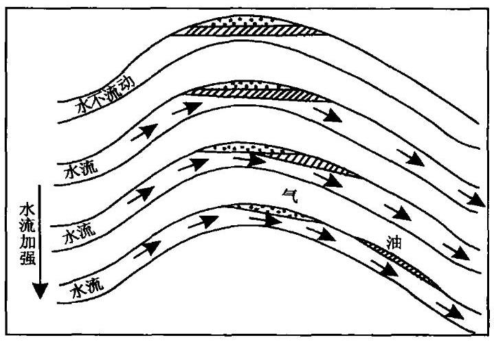

图 7-33 水动力强度对背斜圈闭的油气聚集位置影响示意图

<!-- Media -->

## 5. 生物降解和水洗作用

生物降解和水洗虽然是两种作用, 但它们经常是同时发生并都与地下水的活动有关。大气水把溶解的氧和微生物带入油气藏并运移到油水界面处, 所谓生物降解作用就是微生物有选择地消耗某些烃类成分。该过程大体上按下列正构烷烃、异戍间二烯烷烃、低环的环烷烃和芳香烃顺序先后发生。在有氧的条件下这种作用更为明显和强烈, 结果造成原油在降解前后的成分有很大变化 (图 7-34)。

<!-- Media -->

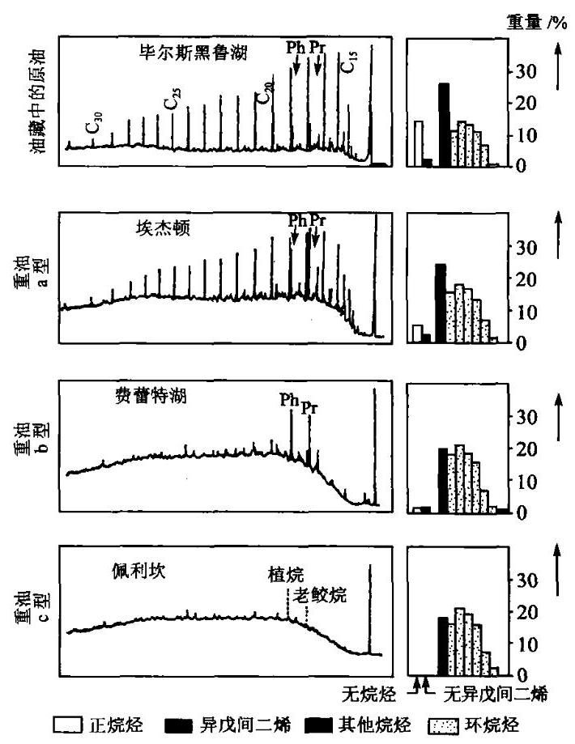

图 7-34 西加拿大盆地的生物降解作用 (据 Tissot 等, 1978)

<!-- Media -->

水洗作用是在地下水沿油水界面运移的过程中, 溶解原油中某些易溶的成分, 主要是苯、甲苯、二甲苯等, 总体上轻烃比重烃更易溶解。通过水洗作用同样使原油的成分发生改变, 与生物降解作用在地下很难区分开来。由于它们的共同作用往往在油水界面处形成难以开采的沥青垫。所有这些作用一般都发生在有大气水侵入的浅处或与地表有连通的地方。因此具有封闭性的 ${\mathrm{{CaCl}}}_{2}$ 型油田水,就比具开放性的 ${\mathrm{{Na}}}_{2}{\mathrm{{CO}}}_{3}$ 型油田水对油藏的保存更为有利。

## (二) 油气藏的微渗漏

以上所描述的各种地质作用大多是使圈闭、盖层本身遭到破坏, 或是地下水动力、温度、压力等条件发生变化时, 油气藏中的油气发生明显的散失和变质。实际上, 即便一个相对稳定没有遭到任何外界破坏的油气藏, 也无时无刻不在发生着微渗漏作用, 对天然气来说主要就是通过盖层的分子扩散, 而对原油来说就是通过盖层的微渗漏 (图 7-35)。

<!-- Media -->

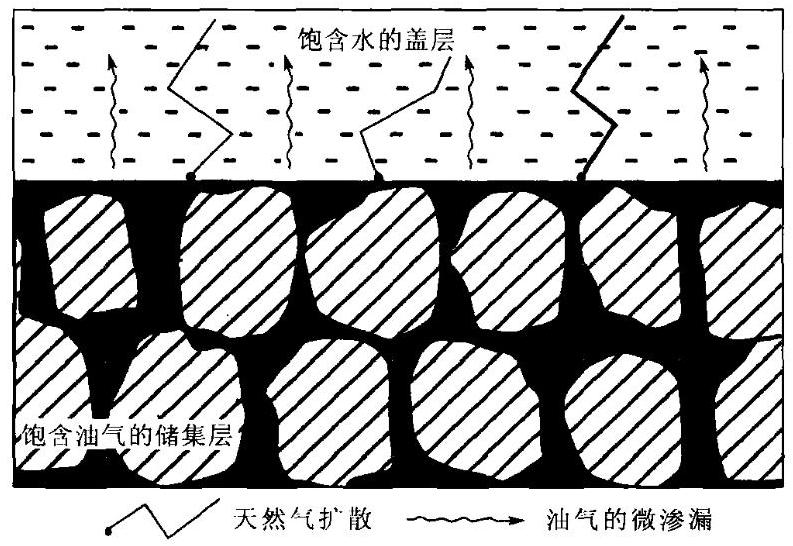

图 7-35 油气通过盖层微渗漏和扩散示意图

<!-- Media -->

## 二、油气藏的再分布

油气藏形成以后, 如果油气藏的圈闭未遭破坏, 只是倾斜或遭水动力冲刷等作用, 则油气可沿储集层溢出发生侧向再运移; 如果油气藏遭到生物降解、水洗等作用, 其中原油就会变重、变稠难以流动而残留下来或就近再分布。油气的再运移或变质残留都是油气藏遭到破坏的反映和必然结果。值得注意的是, 一个油气藏遭到破坏不等于其中油气就完全消亡, 只要所发生的再运移没有到达地表, 那么再运移中的油气遇到新的圈闭还可以再次成藏, 即所谓的 “次生” 油气藏。只有那些一直运移到地表的油气, 才不可能再次成藏而成为地表油气显示。一般来说, 油、气苗出露的地方就是地下油气运移的终点, 也意味着油气的最终消亡。但如果是整个储油层在地表和近地表出露, 或还有大量原油外溢, 则可形成为人们所开采和利用的重油砂、沥青砂或沥青湖, 不过其中大部分还是被破坏和散失掉了。所以油气破坏有两种结果: 一是油气藏的再形成 (即次生油气藏的形成), 二是形成各种地表油气显示 (图 7-36)。

<!-- Media -->

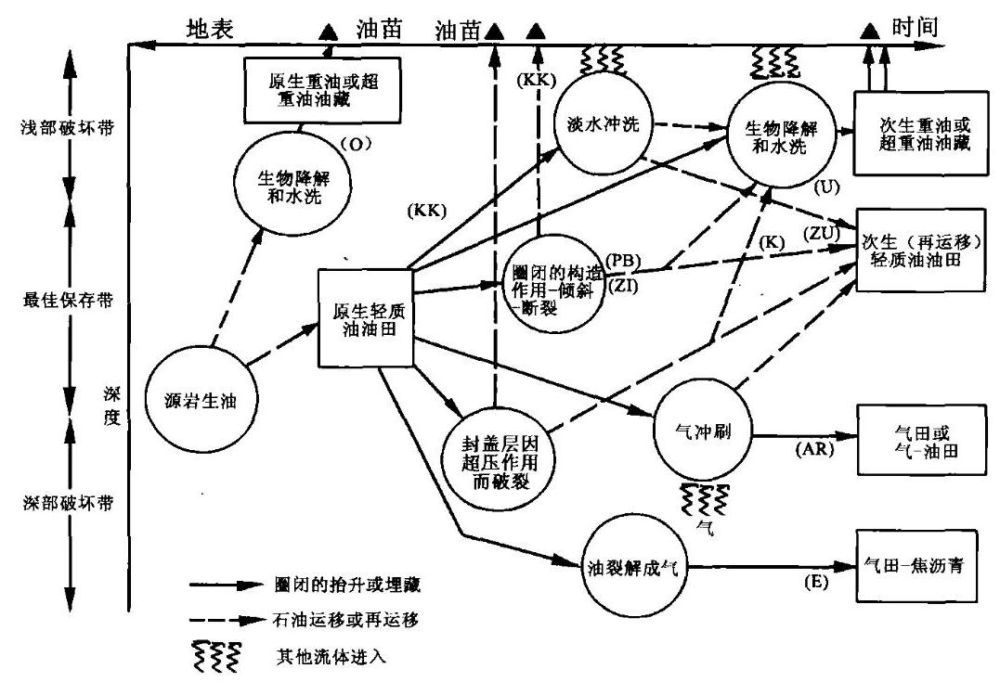

图 7-36 油气藏破坏及其演变结果图

(据 Macgregor, 1996)

<!-- Media -->

## (一) 油气藏的再形成

从原生油气藏中逸散出来的油气, 一开始就可能以游离相进行运移, 因此本身具有较大的浮力, 其运移的效率也比油气从烃源岩进入运载层或储集层的二次运移为高。油气总是垂向或向上倾方向往浅处运移, 油气除要经历重力、吸附等分异过程外, 还会遭到氧化、生物降解、水洗和脱沥青等作用, 结果使再聚集的次生油藏越往上油质越重, 而天然气则与原油正好相反, 越往上越轻。这种情况在我国东部断陷盆地中很常见。

## (二) 油气的地表显示

地表油气显示是油气藏遭破坏后的油气再运移, 或未经成藏的油气直接从烃源岩沿通道运移至地表的产物。地表油气显示可以有气态烃、液态烃和固体沥青三种相态和产出。 能直接用肉眼观察到的称为宏观油气显示, 通常是油气沿断层或储集层直接运移到地表或是含油层被剥蚀出露地表的产物; 只能用仪器检测到的称为微观油气显示, 通常是由天然气扩散或油气沿油气藏上方裂缝网络的微渗漏所形成。

## 1. 宏观油气显示

主要有地表出露的油苗、气苗和含沥青的岩石, 还有一些与石油直接有成因联系的固体显示, 如地蜡、地沥青、石沥青等。地表宏观油气显示的出现和存在, 首先是证实了该盆地或区域具有生烃条件、有过油气生成, 并发生了油气的运移和可能的聚集, 从而指示人们可以进行勘探。特别是近年来建立了追踪油气运移主路线的勘探方法, 它不仅可以从烃源岩由下往上追踪, 而且还可以根据宏观地表显示 (油气运移的终点), 从显示地层的产状 (聚敛或发散) 反过来由上往下追踪油气运移的主路线和地下油气藏的可能位置 (图 7-37)。由于目前已发现在某些地区有 ${70}\%$ 以上的油气藏都在主运移路线上,因此

人们认为位于地下运移主通道上的圈闭或构造, 其含油气的可能性很大。

<!-- Media -->

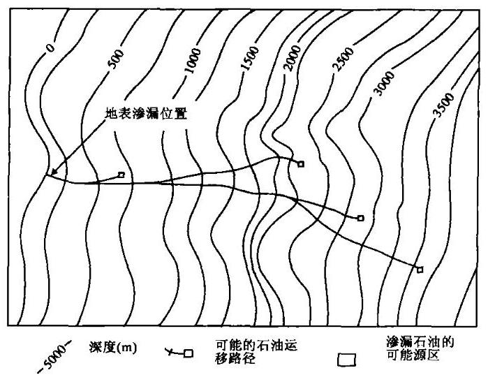

图 7-37 根据地表油气显示追踪油气运移方向和可能烃源岩区

(据 Hindle, 1997)

<!-- Media -->

2. 微观油气显示

<!-- Media -->

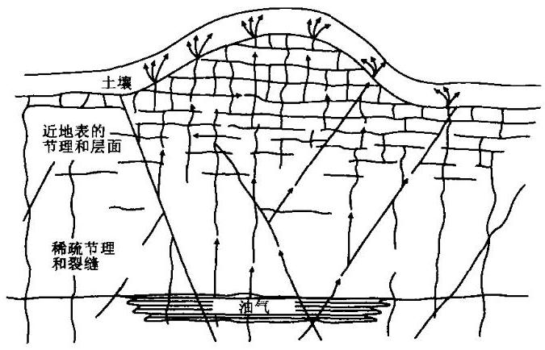

图 7-38 烃类向上微渗漏的通道示意图 (据 Saunders, 1995)

<!-- Media -->

只能用仪器检测到的微观显示, 不仅是地下轻烃扩散的结果, 而且还主要是由轻烃的微渗漏引起。根据近年来 Price (1986)、Klusman (1993)、 Schumacher (1996) 等的研究认为, 油气的微渗漏主要是轻烃以胶粒大小的 “微气泡” 在浮力的作用下通过油藏上方地层的节理裂缝网络运移到地表的 (图 7-38)。微渗漏烃类的微生物降解所产生的二氧化碳和硫化氢, 会使油气藏上方近地表沉积物发生一系列的化学蚀变, 并引起土壤和沉积物在声、 电、磁和放射性等地球物理方面的异常变化和显示, 从而为地球化学和地球物理的综合勘探提供了理论和方法上的依据。

总之, 油气显示特别是油气苗的存在可以证明该盆地或地区有过烃类的生成和运移, 因而它与盆地规模的区域性含油气远景有较好的相关性。

## 第八章 油气聚集单元与油气分布

前述章节主要讨论的内容是油气在单一圈闭内的聚集过程, 即油气藏形成。我们知道, 在地壳内只要烃源补给关系和油气运聚条件配合得当, 便可形成油气藏。而它们之间的特性及其配合关系常受地壳上不同级别的地质单元所控制, 即区域构造及岩性、岩相条件的变化, 控制了油气藏在时间和空间上的分布。所以, 在一个地区, 人们常从不同地质单元出发, 综合各种地质资料, 以油气生成、聚集和分布规律的理论作指导, 将地壳上油气聚集单元, 就其规模由小到大依次划分为油气藏、油气田、油气聚集带、含油气系统和含油气盆地。

地壳上各级油气聚集单元, 均受一定地质条件控制而有规律地成群出现, 它们之间存在着不可分割的内在联系。油气藏是地壳内最基本的油气聚集单元。受单一构造或地层因素控制的圈闭内, 一个至数个油气藏, 可构成油气田。油气田常因共同的地质控制因素和共同的油气补给来源而成群出现, 从而构成油气聚集带。一系列油气聚集带形成于一个更大范围之内, 有其相似的油气生成、运移、聚集过程和共同统一的地质发展历史, 从而可组成含油气盆地。含油气系统是定位于含油气盆地与油气聚集带(或含油气区带 (Play) 之间) 的自然烃类流体运聚系统, 主要是研究某一特定的烃源岩与圈闭中油气之间的成因联系。

一个含油气盆地内可以有一个至数个相同或不同类型的含油气系统或油气聚集带, 同样, 一个含油气系统或油气聚集带内也可以有一个至数个油气田。这些客观事实均受不同地质条件所制约。

油气调查勘探的全部过程总是从区域研究入手, 从宏观到微观, 从一般到具体, 由表及里、由浅入深逐步展开和深入。油气生成、运移、聚集成为矿产资源又是在盆地范围内进行的。所以, 我们总是把含油气盆地作为一个基本地质单元, 统一进行研究。在此基础上, 研究含油气系统、油气聚集带和油气田以及它们之间的相互辩证关系, 以探索油气分布规律, 为寻找更多的工业油气藏找到捷径。

## 第一节 含油气盆地的概念与分类

## 一、含油气盆地的概念

石油与天然气地质学的核心是研究并寻找油气藏, 由于石油和天然气是一种流体矿产, 其形成和赋存于沉积盆地中, 没有盆地也就没有可能去寻找油气藏。因此, 对盆地的研究是评价油气远景的基础。

通常盆地具有三重概念, 即地貌盆地、沉积盆地和构造盆地。

地貌盆地是指被天然高地围绕的陆地表面或洋底的地形凹地。大陆地貌盆地可以是较小的山间平原, 也可以是横贯大陆的河谷。水下的地貌盆地可以从小型的冰碛湖到大型的大洋盆地。它们有的为水体所占据, 形成浅海盆地或湖盆, 如中国的南海、渤海盆地、洞庭湖盆地、太湖盆地等；有的直接暴露在大气之下形成干盆,如四川盆地、柴达木盆地等。

沉积盆地是指在地球表面具有相当厚沉积物的一个构造单元。盆地中的沉积物可以来自一个方向或几个方向, 但沉积物厚度应比周围地区大得多, 因此有时可以在盆地周围找到岸线形迹, 与沉积作用同时具有下沉作用。

构造盆地是指受到后期构造作用改造而形成的盆地。其中沉积物厚度与周围比较起来没有明显差别, 实际上也就是封闭的区域向斜。

含油气盆地是具备成烃要素、有成烃过程并已经发现有工业价值油气聚集的沉积盆地。也就是说, 作为含油气盆地需具有三个必备条件, 即首先是沉积盆地, 其次是有成烃条件, 三是具有工业油气藏。

## 二、盆地分类概述

盆地分类原则的不同, 可能使同一盆地有不同的名称。

根据规模盆地可分为: 超巨型 $\left( { &gt; {100}\text{万}{\mathrm{{km}}}^{2}}\right)$ 、巨型 $\left( {{50}\text{万} \sim  {100}\text{万}{\mathrm{{km}}}^{2}}\right)$ 、大型 $\left( {{10}\text{万} \sim  {50}\text{万}{\mathrm{{km}}}^{2}}\right)$ 、中型 $\left( {1\text{万} \sim  {10}\text{万}{\mathrm{{km}}}^{2}}\right)$ 、小型 $\left( { &lt; 1\text{万}{\mathrm{{km}}}^{2}}\right)$ ; 据盆地的平面形态则有: 圆形、椭圆形、长条形、三角形、菱形等; 据盆地的剖面形态则分为: 对称的和不对称的盆地; 据盆地边缘性质可分为: 断陷型和非断陷 (坳陷) 型 (图 8-1), 前者又分为单断 (箕状) 型和双断 (地堑) 型; 据沉积作用与盆地形成时间的配置关系又可分为: 先成盆地、同生盆地和次生盆地, 或地貌盆地、沉积盆地和构造盆地; 据盆地形成的地质时代或构造阶段可称作: 元古宙、古生代、中生代、中新生代盆地等, 或加里东期、华力西期、燕山期、喜马拉雅期盆地等; 据盆地下伏地壳结构可分为: 陆壳、洋壳和过渡壳上的盆地, 薄壳和厚壳盆地等; 据盆地发育经历的旋回性有: 单旋回和多旋回盆地等; 据盆地发育时充填补偿情况分为: 过补偿盆地、补偿盆地和补偿不足盆地 (饥饿盆地)。

<!-- Media -->

<table><thead><tr><th/><th/><th>对 称</th><th>非 对 称</th></tr></thead><tr><td rowspan="2">边 缘</td><td>非断陷的</td><td>  </td><td>  </td></tr><tr><td>断陷的</td><td>  </td><td>  </td></tr></table>

图 8-1 盆地简单形态分类

(据 Chapman, 1976)

<!-- Media -->

多数地质学家较普遍采用的是以大地构造理论为基础的盆地成因分类。早期是以槽台说为基础的固定论的盆地分类, 近期则是以地球动力学、板块构造理论为基础的盆地分类。

## (一) 固定论的分类

固定论 (即槽台理论) 认为地壳构造运动以垂直方式为主, 此观点在 20 世纪 70 年代前颇为盛兴。Weeks (1952) 和 Ycriehccan (1967) 把含油气盆地划分为 “地台” (稳定区) 和 “活动区” 两大类。在我国石油勘探中应用最广的是 Bpon (1965) 的盆地分类: 地台平原型、山前坳陷和山间坳陷。

## (二) 板块构造理论的分类

加拿大学者 Wilson (1968) 首先注意到大洋开合的不同发展趋势, 指出大洋的演化呈现为张开和关闭的旋回阶段, 由于大洋盆地是全球最大的构造 - 地貌单元, 它占据了地球表面的大部分, 因此, 大洋开闭的旋回主宰了地壳表层活动和演化的全局。这是板块理论的精髓。20 世纪 70 年代以来, 板块构造理论不断完善, 其中 Dickinson (1976) 的分类观点被广泛采纳。Dickinson 把盆地分为 “裂谷型” 和 “造山型” 两大类, 前者以离散板块运动和张性构造为主, 是由于地壳变薄而发生的下沉作用; 后者以聚敛板块运动和压性构造为主, 系由于板块俯冲而引起地壳下沉, 也可能由于沉积负荷加大而促进地壳下降。在此基础上细分为 16 种盆地。

## (三) 地球动力学的分类

20 世纪 80 年代以来, 许多学者在岩石圈动力学研究的基础上提出了相应的盆地分类方案。此观点认为盆地内沉积及构造样式的演化受地球动力学环境控制, 含油气盆地在不同地质历史时期遭受各种应力作用 (图 8-2), 据此将盆地所处环境划分为 4 大类: 拉张环境、挤压环境、剪切环境和重力环境, 然后再依据盆地所处的地壳结构和大地构造位置进一步细分。

<!-- Media -->

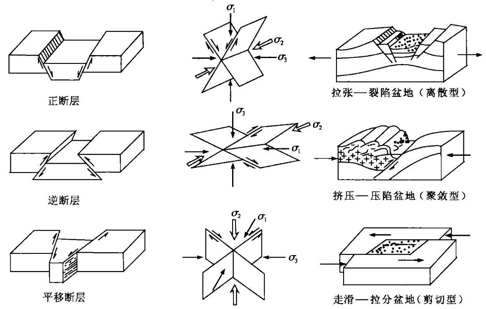

图 8-2 断层动力学模式和盆地的形成 (主应力轴 ${\sigma }_{1} &gt; {\sigma }_{2} &gt; {\sigma }_{3}$ )

(据刘和甫, 1986 修改)

<!-- Media -->

## 第二节 含油气盆地的类型与特点

根据盆地发育的地球动力学环境, 可把含油气盆地分为 3 大类: 裂陷盆地、压陷盆地和走滑拉分盆地, 进而依据其所处大地构造位置和盆地发育特征把含油气盆地细分为 10 个亚类。其中, 陆内裂谷、大陆边缘和前陆盆地是最重要的油气聚集区。

不同时期、不同类型的盆地可以在时间和空间上叠合, 从而形成更加复杂的叠加盆地, 如塔里木盆地和渤海湾盆地。

## 一、裂陷盆地

就日前的统计资料来看, 拉张环境发育的裂陷盆地是最重要的产油盆地, 这在我国尤为突出,如1992年全国总产油量 (约 ${1.4} \times  {10}^{8}\mathrm{t}$ ) 中有超过 ${80}\%$ 的产于裂陷型含油气盆地。该类盆地的形成往往与岩石圈减薄、破裂有关, 地幔上涌和岩石圈内部的韧性剪切 (Morley, 1989) 可能是引起岩石圈减薄的主导因素。

<!-- Media -->

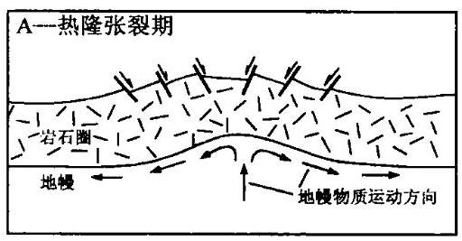

图 8-3 裂陷盆地演化示意图

<!-- Media -->

## (一) 陆内裂谷盆地

所谓裂谷是指由于整个岩石圈减薄和遭受伸展破裂而引起的, 并且常常是一侧为正断层限制的断陷盆地。

内陆裂谷位于陆壳板块内部, 由于地幔物质上涌使岩石圈减薄, 在地壳上部产生张性破裂, 并逐渐演变成裂谷盆地。由于处于大陆扩张初期, 岩石圈并未被拉开, 只是当裂陷发育到一定程度时, 地幔物质趋于稳定, 裂谷的发育也由断陷阶段转化为拗陷阶段 (热沉降阶段) (图 8-3)。

该类盆地的一般特点是: ①位于大陆板块内部; ②沉积盖层常具有双层结构——下部的断陷期沉积和上部的拗陷期沉积, 后者的范围一般超越了断层的控制范围; ③地温梯度高 (一般大于 ${3}^{ \circ  }\mathrm{C}/{100}\mathrm{\;m}$ ), 裂谷发育初期常有基性喷出岩; ④同沉积正断层控制着断陷及盆地格架, 断层常为铲型, 控制的断陷形态有箕状和地堑式; ⑤主要圈闭类型有滚动背斜、 掀斜断块、底辟及地层圈闭。当后期受到挤压或走滑应力作用时可发育挤压背斜或雁列褶皱。我国目前最大的产油区——松辽盆地即是此类型盆地。

不同发育阶段的裂谷有不同的形态特征。如东非裂谷、莱茵地堑仅经历了裂谷期；而北海盆地、松辽盆地、渤海湾盆地经过了从断陷到拗陷的演化过程。两类裂谷形态存在明显差异, 后一类盆地对油气聚集更有利。

## (二) 陆内坳陷盆地

<!-- Media -->

图 8-4 威林斯顿盆地麦迪生灰岩(密西西比系) 顶部构造等高线图与横剖面图 (转引自陈发景, 1982)

顶部构造等高线显示盆地平面上呈近圆形, 横剖面表示充填盆地的各时代地层; 1-麦迪生组缺失区

<!-- Media -->

这类盆地位于克拉通内部, 平面上呈近圆形, 剖面上为碟状 (图 8-4)。构造一般比较简单, 主要为长垣隆起和弯窿。沉积特征是: 在剖面的最下部和最上部及局部边缘为非海相地层, 中部发育典型的浅海相碳酸盐岩和碎屑岩沉积; 沉积厚度可小可大(如美国的伊利诺伊盆地、密执安盆地、威林斯顿盆地等,一般为 ${3000} \sim  {4000}\mathrm{\;m}$ ,而西西伯利亚盆地中新生界就厚达 ${4000} \sim  {8000}\mathrm{\;m}$ )。其含油气性主要与沉积岩厚度、生油岩及其埋深有关。

关于这类盆地的成因, 有人认为是重力作用的结果, Dickinson (1976) 则把其归因于地幔上涌。开始它可使地壳隆起并形成张裂地堑, 但并未继续裂开发育成裂谷, 而是整体下沉接受坳陷型沉积。地幔上涌形成的地堑张裂常显示三叉形式, 其后热沉降影响的区域是以地幔柱为中心的圆形, 因此该类盆地呈近圆形。盆地坳陷深度与地幔上涌的强度和持续时间成正比。一般来说, 该类盆地地温梯度较低。

(三) 大陆边缘盆地

<!-- Media -->

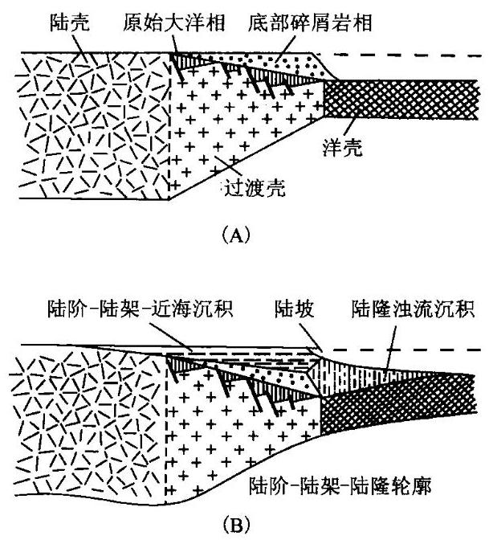

图 8-5 冒地斜棱柱体演化图示

(据 Dickinson, 1976)

<!-- Media -->

位于离散型板块边缘, 也称被动大陆边缘或大西洋型大陆边缘。在被动大陆边缘的滨岸区、陆架区和陆坡区, 常发育良好的含油气盆地。其下部常为裂谷期陆相沉积, 上部为向海推进的陆相或浅海相陆源碎屑、碳酸盐岩、三角洲和水下扇。Dickinson 把这种陆缘沉积称为冒地斜棱柱体 (图 8-5)。

大陆边缘盆地的演化经历了内陆裂谷、陆间裂谷、窄大洋和大西洋 4 个阶段。

这类盆地具有良好的生、储、盖组合和圈闭条件, 因而有丰富的油气资源。圈闭类型与裂谷盆地基本一致, 而生物礁的发育更增加了其油气潜力。陆缘盆地主要分布在大西洋沿岸, 南中国海北缘的珠江口盆地和莺 - 琼盆地已证明具有丰富的油气资源。 (四) 陆间裂谷盆地

<!-- Media -->

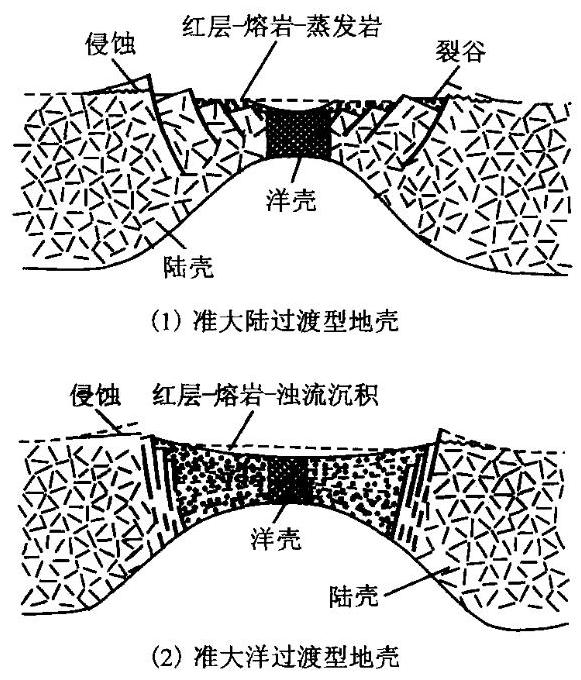

图 8-6 原始大洋裂谷示意图

(据 Dickinson, 1976)

<!-- Media -->

当内陆裂谷进一步拉开、地壳强烈减薄、 形成过渡壳时, 内陆裂谷就演变成陆间裂谷, 当陆壳完全分开时, 裂谷轴部可有部分洋壳 (图 8-6), 因此也称为原始大洋裂谷。如果进一步扩张, 就形成了洋盆。

较典型的陆间裂谷盆地有红海裂谷和加利福尼亚湾。该类盆地早、中期演化与内陆裂谷早、中期相同, 地层为沉积岩和熔岩、蒸发岩, 当有河流在裂谷末端注入时, 三角洲或浊流沉积会代替蒸发岩。总体来看, 陆间裂谷盆地缺乏良好生油岩, 沉积岩薄, 不易形成大的油气田。

## (五) 新生洋盆

当大陆完全被拉开, 形成以洋壳为基底的新生盆地时称为新生洋盆。洋中脊的不断扩张使洋盆不断扩大,大洋岩石圈逐渐下沉形成宽阔平坦的坳陷, 沉积很薄, 但从洋中脊向外逐渐加厚, 可形成浊积深海平原。该类盆地的石油地质意义不大。

## 二、压陷盆地

压陷盆地主要发育在汇聚板块边界及周围。如大洋岩石圈向大陆岩石圈之下俯冲形成的沟弧系, 可发育弧后前陆盆地、弧前盆地; 当大陆岩石圈相互碰撞时会发育碰撞造山带, 在造山带两侧和克拉通边缘可形成周缘前陆盆地; 碰撞造山带演化后期存在残留洋盆; 造山带内和造山带之间可发育山间盆地。

压陷盆地主要发育缩短构造, 如逆冲断裂带、推覆体、挤压断块、不对称背斜、压扭性构造等。前陆盆地和山间盆地具有丰富的油气资源。

## (一) 前陆盆地

前陆盆地 (foreland basin) 是指位于线性收缩造山带前缘和相邻稳定克拉通间的狭长盆地。根据前陆盆地所处的大地构造位置可分为周缘前陆盆地(图 8-7)和弧后前陆盆地 (图 8-8)。盆地横剖面为由造山带侧翼向克拉通减薄的不对称楔状, 平面上平行于造山带展布。

无论是周缘前陆盆地还是弧后前陆盆地, 其本质特点是: ①均发育在大陆型地壳; ②由造山带中冲断席载荷引起的挠曲沉降形成；③与板块之间的相互聚敛运动和板块挤压的构造环境有关。

<!-- Media -->

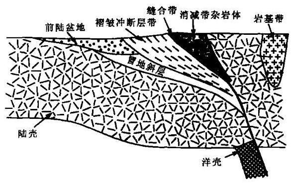

图 8-7 与碰撞造山带毗邻的周缘前陆盆地简图

(据 Dickinson, 1976)

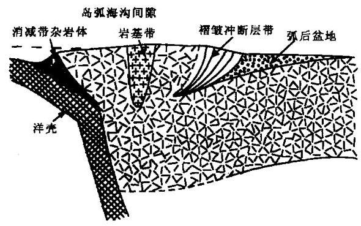

图 8-8 弧后前陆盆地横剖面简图

(据 Dikinson, 1976)

<!-- Media -->

前陆盆地 (或前陆盆地系统) 由四个分隔的构造沉积带组成 (图 8-9), 根据这些沉积带与逆冲带的几何关系将它们分别称为逆冲楔顶部带 (wedge-top)、前渊带 (foredeep)、前隆带 (forbulge) 和隆外凹陷带 (backbulge) (DeCelles and Giles, 1996)。前陆盆地造山带一侧发育向前陆区逆冲推覆的褶皱 - 冲断层带, 主要断面为倾向造山带的铲形或阶梯状, 常呈叠瓦状组合; 盆地近克拉通一侧沉积组合常见的有洪积 - 河流 - 三角洲相和浅海相, 有时有浊积岩, 碎屑物源主要来自造山带, 克拉通为次要物源区。沉降中心常逐渐向克拉通方向迁移。

<!-- Media -->

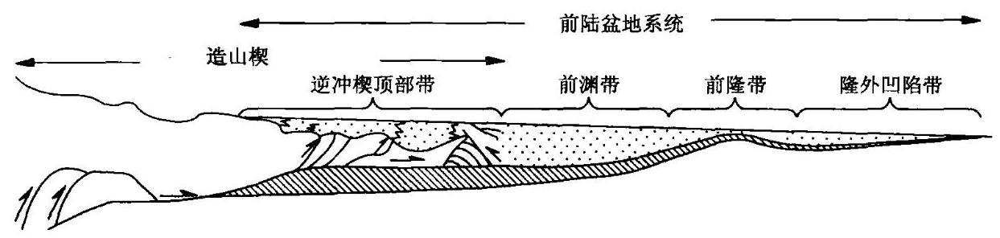

图 8-9 前陆盆地组成示意图

(据 DeCelles and Giles, 1996, 修改)

<!-- Media -->

前陆盆地具有丰富的油气资源, 如北美洲落基山西侧的前陆盆地是美国、加拿大主要的产油区之一, 中东的扎格罗斯造山带前陆盆地是伊拉克、科威特、伊朗西南部主要的产油区, 我国西北地区的酒泉 - 民乐盆地为祁连山北缘前陆盆地, 酒泉西部盆地的玉门油田是我国最老的石油工业基地；昆仑山、天山、祁连山等造山带前缘均发育有新生代前陆盆地。

## (二) 山间盆地

山间盆地指周围被碰撞造山带包围或位于造山带内部的以陆壳(通常是克拉通或早期的褶皱带) 为基底的压陷盆地,即以逆断层为盆地边界的断陷盆地 $\left( \text{图 8-10}\right)$ 。如我国天山褶皱带中的一些小型盆地, 如尤尔都斯、焉耆盆地。盆地形态受四周山系所限; 造山带附近仍发育句盆内逆冲的褶皱一冲断带, 规模可能比前陆区小, 山前可以呈向盆内减薄的楔状, 但影响范围不大; 四周均为物源区, 沉积组合主要为冲积、河流、湖相及浅海相。山间盆地除受挤压作用外, 走滑断层也常常发育, 如柴达木盆地西缘的阿尔金走滑断裂带的活动使盆地内发育典型压扭构造。山间盆地也具有良好的油气富集条件。

<!-- Media -->

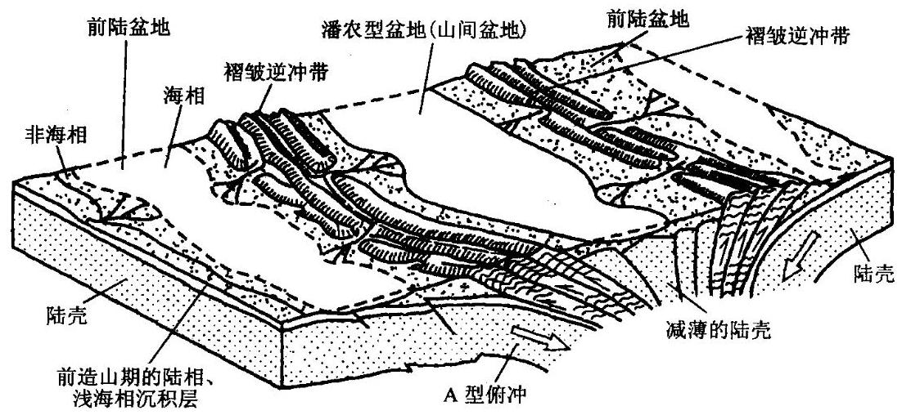

图 8-10 沿碰撞造山带内部发育的山间盆地简图

(据 G. Einsele, 1992)

<!-- Media -->

由于造山带一侧向盆内逆冲推覆, 可能在褶皱冲断带下掩覆了前陆盆地或山间盆地的一部分。

## (三) 弧前盆地

<!-- Media -->

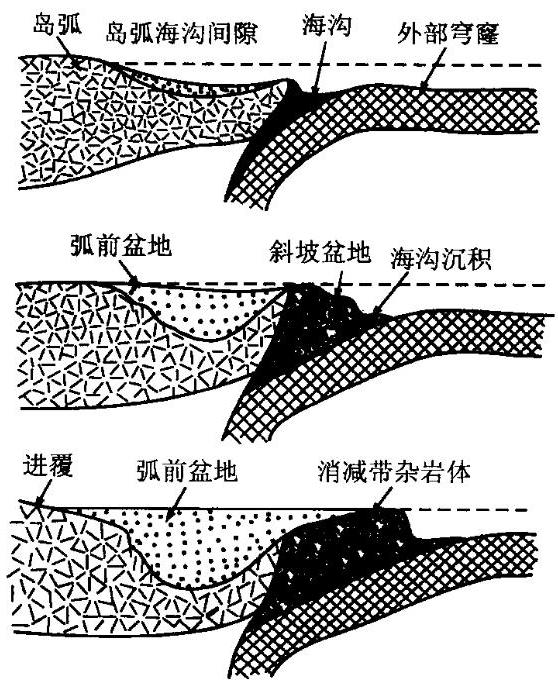

图 8-11 海沟、斜坡盆地和孤前盆地发育示意图 (据 Dickinson, 1976)

自上而下表示时间从早到晚

<!-- Media -->

位于岛弧与海沟之间, 其基底性质取决于岛弧与海沟间地壳的性质, 可以是陆壳, 也可以是洋壳或过渡壳 (图 8-11)。弧前盆地沉积主要来自岩浆岛弧的碎屑物, 水深取决于盆地性质与补偿关系。下伏为残留洋壳时水可能较深, 可沉积含火山灰的深水细浊积岩和浅水粗浊积岩、陆棚砂岩和三角洲砂岩。物源也可以是非火山高地侵蚀碎屑, 赤道区盆缘可形成珊瑚礁。

弧前盆地近岛弧一侧为脆性破裂, 发育正断层; 近海沟一侧挤压性褶皱、冲断层发育。当斜向俯冲时也可产生走滑断层。

除秘鲁、厄瓜多尔的塔拉拉区石油可采储量可观 (约 10 亿桶) 外, 大部分弧前盆地未找到大量油气。主要原因可能是沉积速度快、相变大、 储集性差、生油岩多为腐殖型且不成熟等。

## (四) 残留洋盆

洋壳板块消减末期, 陆壳板块发生碰撞, 碰

撞缝合线走向上结合的时间不一致, 使部分地带残存老洋盆, 这种收缩大洋盆地叫残留洋盆 (图 8-12)。盆缘形成大型三角洲体系, 向海盆发育海底扇并覆于远洋沉积之上, 这种浊积岩就是前造山期复理石。

<!-- Media -->

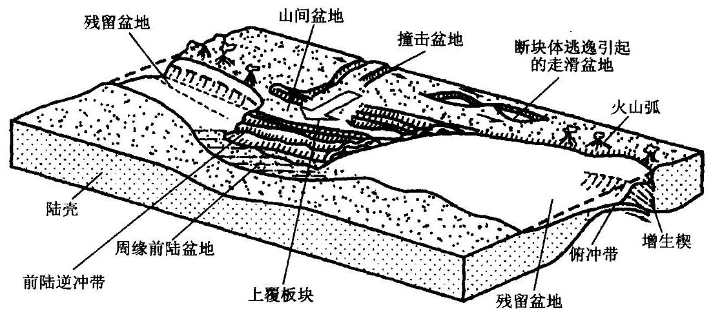

图 8-12 碰撞造山缝合带发育使残留大洋盆地逐渐封闭简图

(据 G. Einsele, 1992)

<!-- Media -->

沿喜马拉雅山构造走向出现的恒河三角洲和孟加拉湾海底扇就是这种侧向变化和穿时相发育的表现。随着俯冲、碰撞的继续, 残留洋盆逐渐缩小、封闭消失, 同时前陆盆地不断扩大, 磨拉石覆于复理石沉积之上。

这种盆地沉积往往与前陆盆地叠合成为油气勘探的目标层系, 具有一定的潜力。

## 三、拉分盆地

拉分盆地 (pull-apart basin) 发育于区域性走滑断裂带附近, 由于两侧断块的相向运动而形成。这种盆地平面上常呈菱形, 走滑断层为两个长边边界, 正断层为短边边界 (图 8-13)。由于强烈走滑运动使地壳下弯, 因此在走滑断层一侧往往为沉降中心。

<!-- Media -->

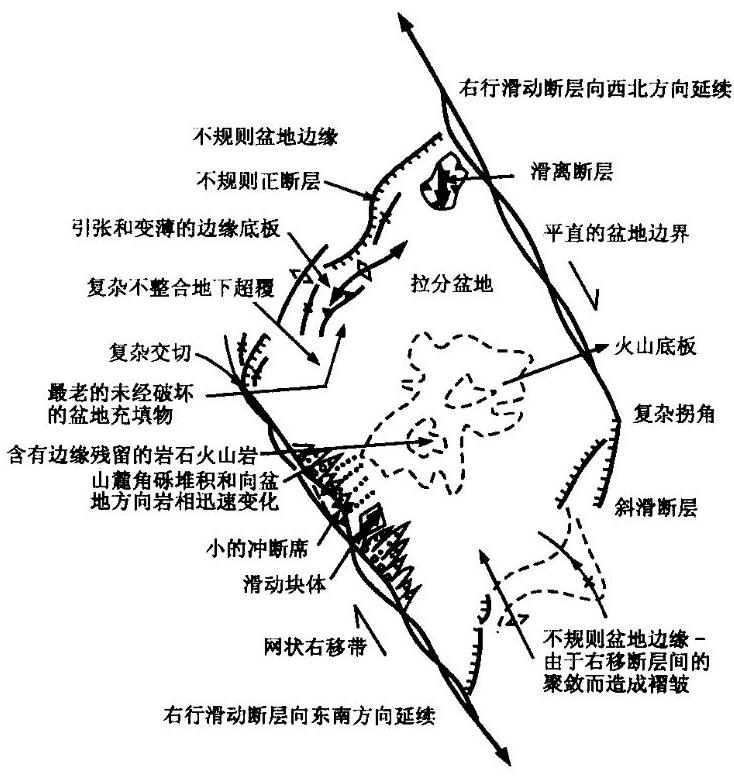

图 8-13 理想的拉分盆地简图

(据 Crowell, 1974)

<!-- Media -->

图 8-13 所示在碰撞造山带某处时间上的一系列事件, 这一碰撞造山带以穿时封闭为标志, 在陆间完全缝合的造山地段侵蚀作用在纵向上扩散沉积物, 经过正在移动的过程点沿着构造定向将沉积物供给残留大洋盆地中的复理层浊流海底扇。

拉分盆地不仅在转换型板块边界发育, 而且在汇聚型板块边界和大陆板块内部均可产生。沉积速度高 (可达 ${100}\mathrm{\;{cm}}/$ 千年),因此岩相变化大, 盆地周缘以冲积扇、洪积扇和河流三角洲相为主, 向盆地中央迅速过渡为以较深一深湖 (海) 相为主, 并夹有大量的重力流沉积。从这些沉积条件可知, 拉分盆地具有油气聚集的基本条件, 走滑运动会提供良好的构造圈闭。

实际上, 无论是张性还是压性含油气盆地, 走滑运动和局部平移均可存在。如果走滑运动对盆地演化起一定控制作用, 则可形成张扭性或压扭性盆地, 盆内也可发育扭动构造。

值得注意的是, 在油气勘探实践中, 人们早就发现许多盆地经历了不同性质的演化阶段, 甚至不同类型的盆地在平面上有重叠现象。不同类型、不同演化阶段的盆地在性质、 沉积组合、构造样式上可能有较大差异。因此, 研究盆地时, 应首先搞清其发展历史, 分清不同阶段、不同类型盆地的特点, 进而指导勘探。

## 第三节 含油气系统

## 一、含油气系统的基本概念

Magoon 和 Dow (1994) 在总结前人有关研究的基础上, 把含油气系统定义为 “一个自然的系统, 它包含有效的烃源岩及与其有关的油气, 以及形成油气聚集所必需的地质要素和作用”。

从勘探研究上说含油气系统是油气的一个勘探阶段或研究单元——油气聚集单元, 并定位于沉积盆地与含油气区带 (Play) 之间 (图 8-14), 它受制于盆地的地质结构与地球动力学演化, 反过来也规定了油气生运聚散的基本单元: 表现为与一个活跃的生烃凹陷 (或生烃灶) 相联系的一族油气藏及形成这些油气藏的地质要素与地质作用的有机组合 (Magoon 和 Dow, 1994)。

<!-- Media -->

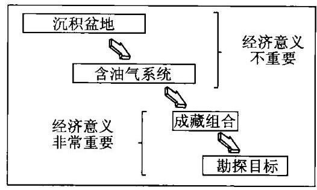

图 8-14 含油气系统在勘探阶段中的位置

(据 Magoon & Dow, 1994)

<!-- Media -->

## 二、含油气系统的组成

关于 “有效烃源岩” (Pod of Active Source Rock) 和 “形成油气聚集所必需的地质要素 (Element) 和作用 (Processes)", Magoon 等 (1994) 明确指出: 有效烃源岩是正在大量生、排烃或在过去某一地质时期曾经大量生、排过烃的源岩；而烃源岩、储集层、盖层、上覆岩层和圈闭的形成、油气的生成、运移、聚集, 则分别是形成油气聚集所必需的 4 个基本地质要素和 4 个基本地质作用。

在连续沉积的含油气盆地中, 油气的生成、运移和聚集的过程是个相对短暂的地质时期, 而油气生成的时间往往覆盖了油气运聚的时间。因此, 该时期是研究含油气系统内油气运聚成藏最重要的时间, Magoon 等 (1994) 称这一时期为关键时刻 (Critical moment)。 例如, 泥盆系的 Deer 页岩在晚古生代是有效烃源岩, 通过埋藏史作图 (图 8-15), 可知在距今 ${260}\mathrm{{Ma}}$ (二叠纪) 时开始进入生油窗,到距今 ${255}\mathrm{{Ma}}$ 时埋藏深度达到最大。因此, 可以取距今 ${250}\mathrm{{Ma}}$ 为关键时刻,而油气的生成和运聚期则在 ${260} \sim  {240}\mathrm{{Ma}}$ 间,这也是该含油气系统形成的时期和年龄。根据含油气系统关键时刻(250Ma)所做的平面图,就可以确定出含油气系统的已知范围, 它包括了有效生油岩及相关油气运聚的范围 (图 8-16)。 根据关键时刻(250Ma)所做的地质剖面图 $\left( {\text{图 8-17})\text{,就可以得知在含油气系统的已}}\right)$ 知范围内, 4 个基本要素(烃源岩、储集层、盖层和上覆岩层)的空间展布特征。含油气系统事件图 (图 8-18) 显示了 4 个基本要素的沉积时间和 4 个基本作用的发生时间。保存时间在油气生成、运移、聚集之后, 是指在含油气系统中油气被保存、改造或被破坏的时间。如果含油气系统的生成、运移、聚集一直延续到现在, 就不存在保存时间, 可以认为大部分油气被保存, 只有相对少量的油气被生物降解所破坏。

<!-- Media -->

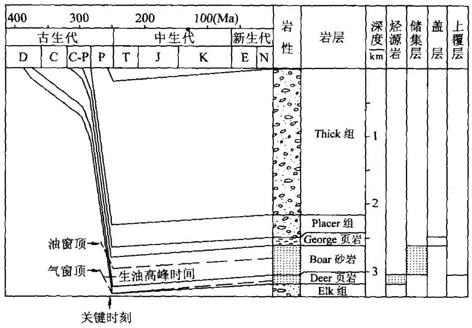

图 8-15 泥盆系 Deer 页岩的埋藏史和该含油气系统的关键时刻

(据 Magoon & Dow. 1994)

关键时刻: ${250}\mathrm{{Ma}}$

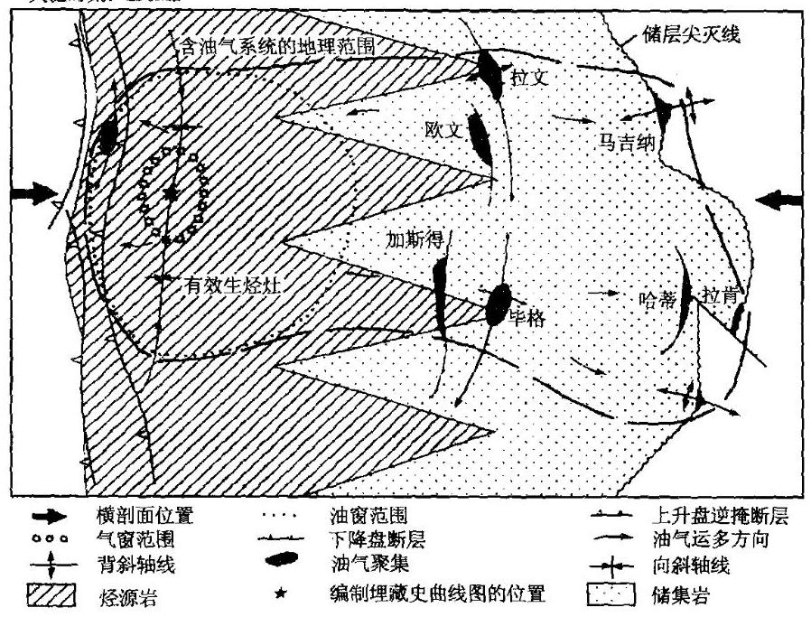

图 8-16 含油气系统关键时刻平面图

(据 Magoon & Dow, 1994)

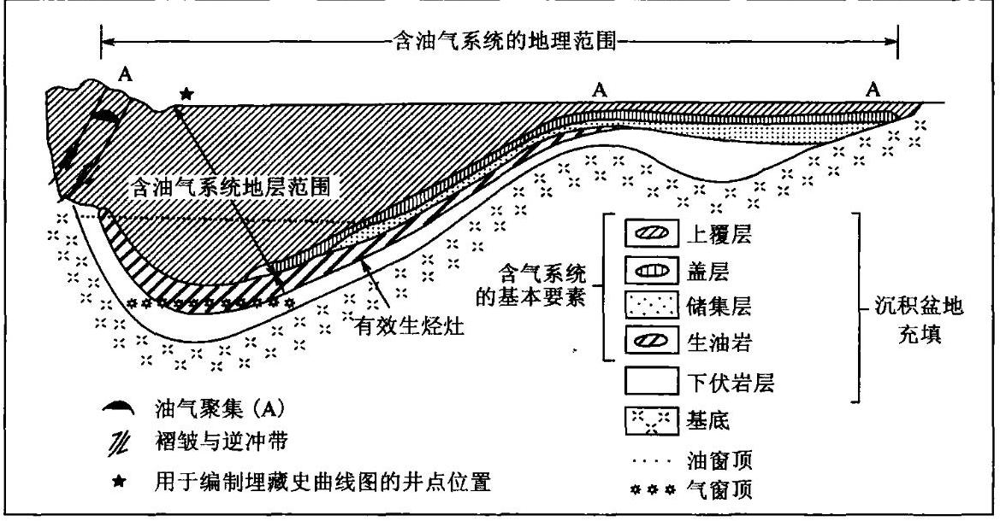

图 8-17 含油气系统关键时刻剖面图

(据 Magoon & Dow, 1994)

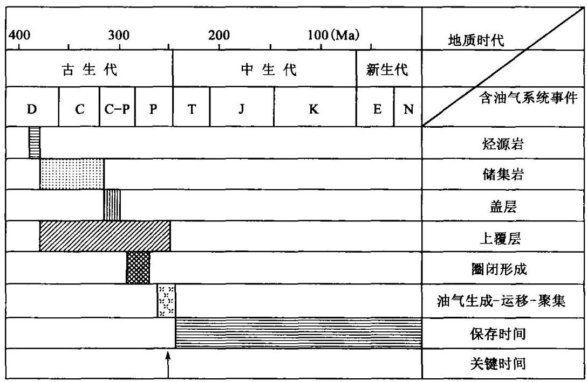

图 8-18 含油气系统地质事件图

(据 Magoon & Dow, 1994)

<!-- Media -->

根据上述分析和图件, 人们就可以认识含油气系统的地理范围、地层分布和形成年龄。反过来通过作关键时刻的平面范围和地质剖面图, 就可以判断含油气系统是否存在及其个数 (图 8-19)。图中 $\mathrm{A}$ 虽基本要素都存在,但烃源岩尚未成熟,不具有效性,因而没有含油气系统; 图中 B 存在 1 个含油气系统; 图中 C 有 2 个含油气系统存在。

<!-- Media -->

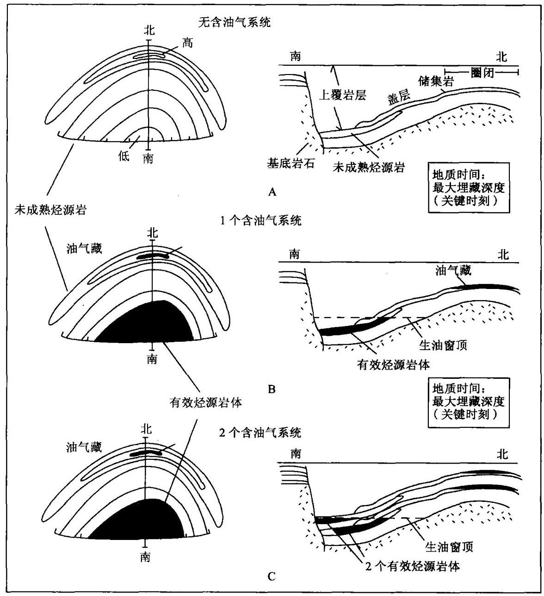

图 8-19 根据关键时刻的基本要素判断含油气系统的存在与个数

(据 Magoon & Dow, 1994)

<!-- Media -->

## 三、含油气系统的命名

关于含油气系统的可靠性和命名, Magoon 等 (1994) 做了如下的划分和规定。可靠性分为已知的、假想的和推测的 3 种: 在已知的含油气系统中, 有效烃源岩与油气藏之间存在良好的油 - 源或气 - 源对比关系, 用符号 (!) 表示; 在假想的含油气系统中, 只证明烃源岩的存在, 但还缺乏油 (气) - 源对比的地球化学资料, 用符号 ( $\cdot$ ) 表示; 在推测的含油气系统中, 烃源岩或油气的存在完全是根据地质或地球物理资料的分析推测的, 用符号 (?) 表示。含油气系统的命名, 以有效源岩名称后接主要储集岩名称再加上表示可靠性的符号。如图 8-15, Deer - Boar ( $\cdot$ ) 是一个假想的含油气系统,它由泥盆系 Deer 页岩和 Boar 砂岩组成, 其中 Deer 页岩为有效烃源岩, Boar 砂岩是该系统内含有最多油气的主要储集岩。

## 四、含油气系统的地质内涵

从含油气系统所具有的系统层次性来看, 它显然是进行动态分析、综合研究的一种思路和方法; 从它本身所代表的地下三维实体来看, 它又是一个含油气的地质单元。含油气系统给予人们留下很多余地, 允许从不同的角度去理解它。

## (一) 含烃流体的运聚系统

油气的运移和聚集不仅决定了含油气系统的空间范围和边界, 而且还决定了含油气系统的形成和年龄。可见, 油气的运聚是含油气系统的灵魂。虽然含油气系统的思想, 早在 20 世纪 60 年代就已萌生, 但含油气系统比较完整的概念直到 90 年代才初步定型, 这不是偶然的。应当说, 这是油气地质理论、测试方法、模拟技术发展进步的一种必然结果, 特别是与 20 世纪 80 年代末、 90 年代初油气运聚的研究取得了重大突破有关。因为对于含油气系统, 不仅要知道从烃源岩到圈闭的道理, 而且关键是要解决油气是如何从烃源岩到圈闭的。这实际上就是要定量、定时地解决油气运聚的有关问题。

## (二) 评价系统

研究含油气系统的主要目的是找到更多的油气资源。为此, 人们必须对含油气系统进行评价, 并以此指导油气勘探。含油气系统评价包括两方面: 一是对系统本身的基本地质要素和作用进行评价; 二是在含油气系统间进行对比性的评价。同时应本着生烃是基础、 圈闭是前提、运聚是条件、保存是关键的认识, 从油气保存的角度进行评价。

保存条件的研究和评价传统意义主要是针对油气藏而言。Magoon (1994) 把关键时间之后定为保存时期, 也主要是指油气藏形成之后的保存。油气藏保存条件的评价与含油气系统保存条件的评价是两个层次上的问题。前者主要是研究在油气藏形成以后和在油气藏存在的空间范围内的保存条件, 即导致油气再次发生大规模垂向或侧向运移以及成分发生变化的因素; 而后者则要对整个含油气系统的基本地质要素和作用进行评价, 即要从油气的生成、排出、运移、散失、聚集至今的全过程来研究保存条件, 在此过程中凡是不利于油气生成、运移, 导致油气散失、破坏的因素都要考虑。

值得注意的是, 上述 Magoon 和 Dow (1994) 的 "含油气系统" 概念基于一套成熟的烃源岩, 这套烃源岩在某个时刻进入生排烃高峰, 发生了油气运聚, 形成了一系列油气藏, 之后就处于相对静止的保存环境之中, 因此, Magoon 等 (1992, 1994) 的概念表述了 “单源一期成藏” 的含油气系统特点。

然而, 中国沉积盆地的多阶段发展, 往往造成不同原型的沉积盆地在横向上复合、在纵向上相叠加 (贾承造等, 1992; 何登发等, 1996; 田在艺等, 1997), 导致众多生烃凹陷在平面上并置, 多套烃源岩层系在垂向上相继出现; 且由于盆地热体制的演变, 这些烃源岩层系进入生油窗的时间及其持续时间参差不齐, 从而出现了多个生排烃关键时刻; 此外, 由于多期构造运动的作用, 既伴随有同一时期相关构造或圈闭的形成, 又发生了对前期构造或油气藏的改造或破坏, 导致多个油气成藏期的出现。因此, 对于像这种具 “多源多灶多期成藏”或 “多源单灶多期成藏” 特点的复杂含油气系统, 用 Magoon 和 Dow (1994) 的原始含油气系统的概念与分析方法很难对其进行表征, 必须探索出新的描述方法与勘探思路。

## 第四节 油气聚集带

## 一、油气聚集带的基本概念和分类

## (一)油气聚集带的基本概念

所谓油气聚集带, 是指受一定区域地质条件 (包括构造和沉积) 控制的油气田带 (群), 其中各油气田具有相似的地质构造特征或相似的沉积条件和油气藏形成条件。油气聚集带的范围相当于盆地内三级构造单元, 但不是盆地内所有的三级构造单元均能成为油气聚集带。

油气聚集带是油气聚集的场所, 而非油气生成的地带。油气聚集带内的油气是由相邻的生油区内汇集起来的, 油气聚集带的周围可能都是它的汇油面积, 也可能汇油面积仅仅存在于油气聚集带的一侧或某一方向。该带所以能聚集丰富的油气, 还与它具有良好的油气聚集条件有密切的关系。

## (二) 油气聚集带的分类

由于控制油气聚集带的地质因素比较复杂, 不同学者可以从不同角度提出多种分类方案, 繁简不甚一致。根据油气聚集带形成过程中起决定性作用的地质因素, 大致可将其分为 3 大类、 9 种主要类型; 每一类还可细分为若干具体型式 (表 8-1)。当然这些型式不一定代表了所有类型。 续表

<!-- Media -->

表 8-1 油气聚集带主要类型简表

<table><tr><td rowspan="4">大类 构造类</td><th>主要类型</th><th>具体型式</th><th>实 例</th></tr><tr><td>(一)背斜型油气聚 集带</td><td>1. 中、强褶皱背斜带 2. 长垣、平缓背斜带 3. 穹窿背斜群</td><td>1. 扎格罗斯山前背斜、酒泉盆地山前带 2. 大庆长垣、加瓦尔长垣、杜依玛兹长垣、下 普尔斯克长垣等 3. 罗马什金、苏尔古特隆起南部背斜群、扶余 背斜群等</td></tr><tr><td>(二)断裂型油气聚 集带</td><td>1. 断块或断阶带 2. 同生断层和逆牵引背斜带 3. 逆掩断裂带</td><td>1. 克拉玛依断裂带西北侧的油田带 2. 维尔克堡断裂带 3. 落基山东侧逆掩断裂带</td></tr><tr><td>(三) 盐(泥) 丘型 油气聚集带</td><td>1. 盐丘和盐背斜带 2. 泥火山和泥底辟背斜带</td><td>1. 滨墨西哥湾、吉恩霍夫坳陷、罗马尼亚等均 有极发育的盐丘和背斜油气田带 2. 阿普歇伦西部背斜带、特立尼达岛南的泥火 山背斜带等</td></tr></table>

<table><thead><tr><th>大类</th><th>主要类型</th><th>具体型式</th><th>实 例</th></tr></thead><tr><td rowspan="4">地层类</td><td>(一) 潜山型油气聚 集带</td><td>1. 与碳酸盐岩潜山有关的油气聚集带 2. 与碎屑岩潜山有关的油气聚集带 3. 与结晶基岩潜山有关的油气聚集带</td><td>1. 任丘、铁尔斯顿等潜山油气藏 (田) 带 2. 哈西 - 迈萨乌德、厄尔加西 - 厄尔阿格莱布 等潜山油气田(藏)带 3. 克拉夫特 - 普鲁萨基岩潜山油田带</td></tr><tr><td>(二)与碎屑岩有关 的岩性油气藏趋向带</td><td>1. 河道砂油气藏趋向带 2. 滨岸砂坝油气藏趋向带</td><td>1. 布奇、喀特班克等河道砂油气藏带 2. 绿林县契罗基组鞋带状油气藏带</td></tr><tr><td>(三)与碳酸盐岩有 关的岩性油气藏趋 向带</td><td>1. 上倾尖灭型油气藏趋向带 2. 溶蚀白云岩化型油气藏趋向带</td><td>1. 霍戈登气田带 2. 春吞油气田带</td></tr><tr><td>(四) 礁型油气藏趋 向带</td><td>1. 环礁型 2. 马蹄礁型 3. 线状礁 (堤礁) 型 4. 点礁型</td><td>1. 黄金巷油气田带 2. 二叠纪盆地的马蹄礁油气田(藏)带 3. 瑞姆彼 - 圣·阿尔伯达、乌拉尔西坡堤礁 4. 雨虹区尖柱礁群、印尼拉瓦提盆地的怀洛 - 卡西姆礁群</td></tr><tr><td rowspan="2">复合型</td><td>断层 - 地层型</td><td>1. 滨岸同生断层 - 三角洲 2. 断层 - 底辟</td><td>1. 得克萨斯南部滨墨西哥湾岸 2. 墨西哥湾</td></tr><tr><td>背斜 - 地层型</td><td>1. 背斜 - 潜山型 2. 压实背斜 - 不整合面型</td><td>1. 任丘潜山油气带 2. 利比亚锡尔特盆地萨里尔油田带</td></tr></table>

<!-- Media -->

(引自陈荣书, 1994) 二、油气聚集带的主要类型

油气聚集带的控制因素及各因素所起作用不同, 会产生复杂的组合类型和具体型式。 下面仅对常见的主要油气聚集带的基本特征作一简单介绍。

## (一)背斜型油气聚集带

所谓背斜型油气聚集带, 系指该油气田带 (群) 在构造上为一背斜带 (群), 其中油气藏的形成很大程度上受背斜构造所控制。这一类型油气聚集带, 根据背斜构造的特征, 进一步可分为: 强烈 - 中等褶皱的背斜带、长垣和平缓背斜带以及穹窿背斜群。

1. 强烈 - 中等褶皱的背斜油气聚集带

这种油气聚集带主要分布在地壳中不同时代褶皱带的山前带、山间盆地和地台边缘坳陷区等活动性较大的地带。该类背斜带的褶皱较强, 背斜闭合度大, 背斜带延伸长度大。以波斯湾扎格罗斯山前带为例, 它由一系列强烈到中等褶皱的背斜带组成, 每个背斜带可长达数百公里; 该带向波斯湾一侧为生油深拗陷, 储集层厚度大, 具有良好的生、储、盖组合。因此, 这种背斜带常拥有巨大的油气储量。如伊朗可采储量达十亿吨以上的阿贾加里、加奇萨兰、马伦等特大油气田和几十个大油气田, 伊拉克的基尔库克、巴伊哈桑、阿因扎列、 布特马赫、卡伊阿拉、扎布尔等特大和大油气田, 都位于这种背斜带 (图 8-20) 中。

<!-- Media -->

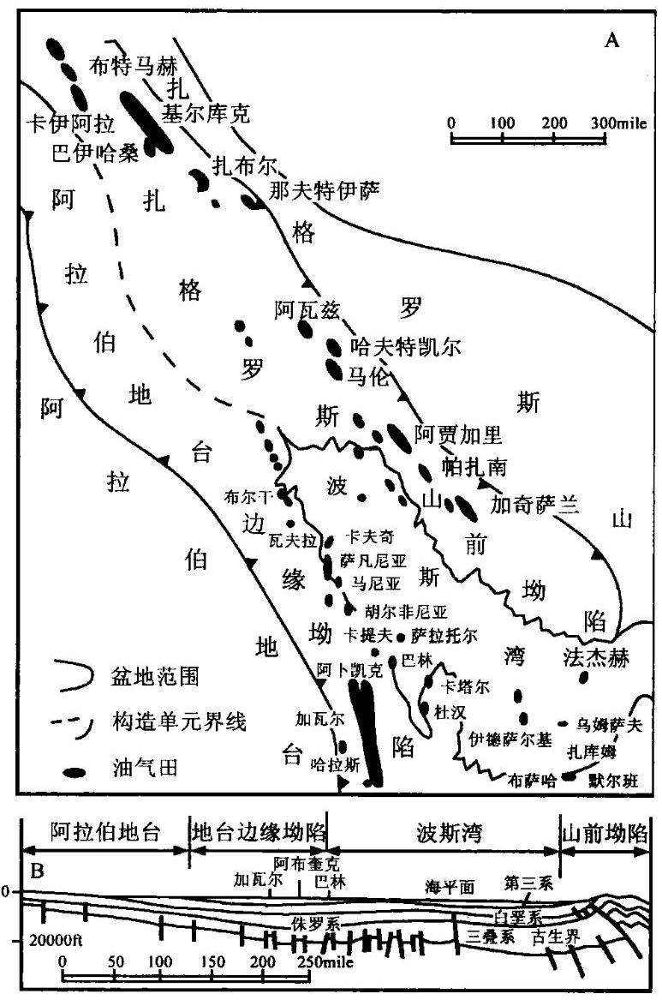

图 8-20 波斯湾盆地构造及油气田分布图

(转引自潘钟祥, 1986)

<!-- Media -->

2. 长垣、平缓背斜型油气聚集带

“长垣” 这一构造术语是前苏联石油地质学家在研究乌拉尔 - 伏尔加含油气盆地过程中提出来的。所谓长垣, 系指巨大而狭长的不对称背斜构造带。根据乌拉尔 - 伏尔加盆地的资料, 长可达 ${40} \sim  {360}\mathrm{\;{km}}$ ,宽约 $5 \sim  {20}\mathrm{\;{km}}$ ; 闭合度为 ${40} \sim  {200}\mathrm{\;{km}}$ ; 缓翼倾角平均为 ${0}^{ \circ  }{30}^{\prime } \sim  {1}^{ \circ  }$ ,不超过 ${6}^{ \circ  }$ ,陡翼倾角为 ${3}^{ \circ  } \sim  {20}^{ \circ  }$ ,最大可达 ${60}^{ \circ  }$ ,陡翼大多向着邻近的坳陷, 呈带状分布的一系列背斜组成背斜带, 称为平缓背斜带。平缓背斜两翼倾角常小于 ${1}^{ \circ  }$ ,有时可达 ${2}^{ \circ  } \sim  {5}^{ \circ  }$ 。

松辽盆地大庆长垣为一巨型平缓背斜带, 其中有 7 个构造高点, 分别形成了 7 个含油构造 (图 4-11)。大庆长垣位于松辽盆地中央坳陷区——生油区内, 有稳定的三角洲砂岩体发育, 生、储、盖组合良好, 含油总面积达数千平方公里, 是目前我国最大的油气聚集带。

此外, 沙特阿拉伯的加瓦尔长垣、西西伯利亚的下普尔、尤比列依等长垣, 都是拥有巨大油气储量的长垣油气聚集带的典型代表。

## 3. 穹窿背斜型油气田群

穹窿背斜群是构造运动不强烈的含油气盆地中较重要的油气聚集带类型之一。该类穹窿背斜大多是在大型基底隆起的背景上形成, 局部背斜没有一定的方向性。如前苏联罗马什金特大油田属于这一类型。

最后, 应指出, 并不是背斜带 (群) 中的所有背斜构造必定含油。由于各种原因而未含油的背斜, 称空 (或干) 背斜构造。

## (二) 断裂型油气聚集带

依断裂的性质和特点, 大致可分为 4 种类型: 断块 (断层) 型、同生正断层 - 逆牵引背斜型、同生逆断层 - 挤压背斜型和逆冲断裂型。

## 1. 断块型油气聚集带

断块型油气聚集带包括与正断层有关的、与逆断层有关的和与扭断层有关的断块型油气聚集带, 其共同点是断层全部或部分封闭了该类油气聚集带中的断块。

2. 同生正断层 - 逆牵引背斜型油气聚集带

在同沉积正断层控制下, 沿断裂走向上在其下降盘常发育一系列逆牵引背斜(又叫滚动背斜), 逆牵引背斜的成因主要与尚未完全固结的下降盘地层在断裂发育过程中在自重作用下的 “回顾” 或和铲形断层在深部顺层滑动有关。

该类油气聚集带一般均能形成丰富的油气聚集, 如我国东部的渤海湾等盆地、墨西哥湾、尼日尔三角洲 (图 8-21)。其油气聚集的有利因素主要有: ①其下倾方向即为油源区, 能提供丰富的油气源; ②下降盘沙层数增多、厚度增大; ③圈闭形成时间早, 滚动背斜在沉积期间即开始发育; ④ 断层可作为油气通道使深部的油向上运移, 也可起封闭作用。

<!-- Media -->

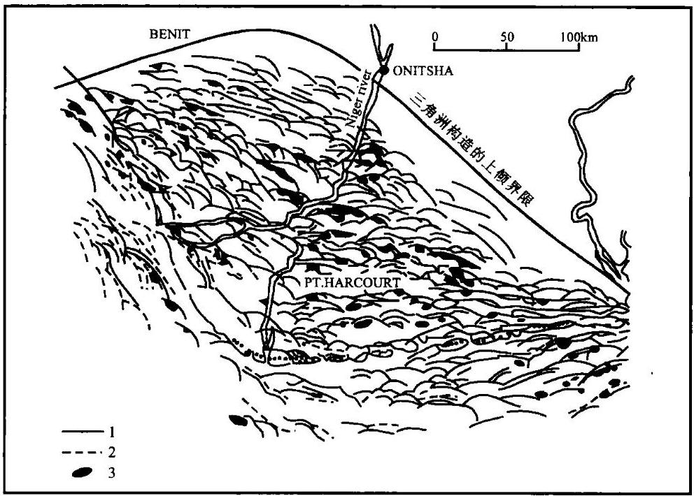

图 8-21 尼日尔三角洲生长断层及滚动背斜油田分布图

(转引自王燮培, 1991)

1---同向断层; 2---反向断层; 3---油田

<!-- Media -->

## 3. 同生逆断层 - 挤压背斜型油气聚集带

近年来在压性盆地中发现逆断层或逆冲断层也可以同沉积活动, 在其上升盘常发育挤压型背斜或鼻状构造, 它们也可以成为良好的油气聚集带。如柴达木盆地西南部发育的阿拉尔逆冲断层, 其控制着阿拉尔凹陷的南界, 上升盘分布着 3 个背斜型圈闭, 其中 2 个 (东、西跃进 2 号) 聚集有油 (图 8-22)。油源为下降盘的阿拉尔凹陷。

## 4. 逆冲断裂型油气聚集带

多位于山前带, 由于区域挤压 (或重力滑动) 造成盆地内地层发生褶皱、冲断。尤其是前陆盆地中发育的褶皱–冲断层带位于生油区内, 可在背斜和断层型圈闭内聚集丰富的油气。北美落基山东侧的怀俄明一犹他逆冲断裂带已发现了数十个油气田。落基山东侧的逆冲断层带在构造上十分复杂,大体上是由 $5 \sim  6$ 条自西向东推覆的逆掩断层组成。断层先在西部发生 (侏罗纪), 向东推移, 大致在始新世结束。断层的最大特点是断层面呈犁式, 在相当大的范围内非常平缓近于顺层面滑动。水平位移惊人, 整个逆冲断层带缩短了约 ${110}\mathrm{\;{km}}$ 。石油产自奥陶系至白垩系的不同层位,以三叠系和侏罗系为主要产层 (图 8-23)。

<!-- Media -->

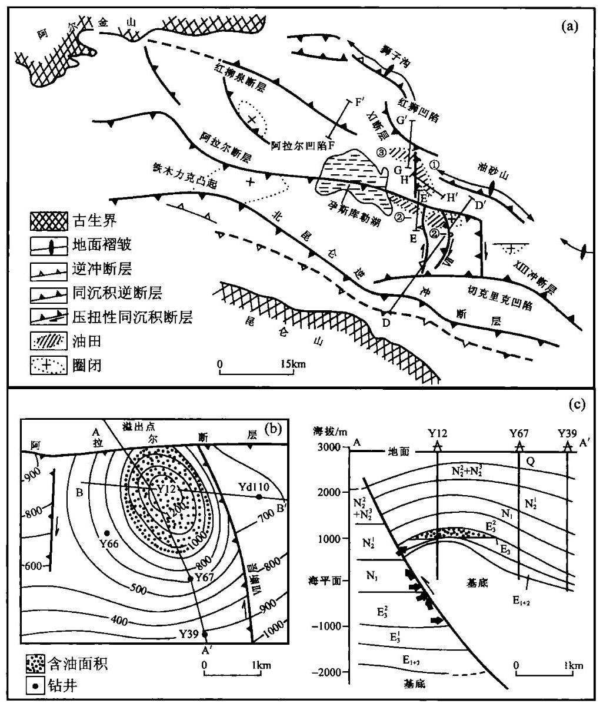

图 8-22 柴达木盆地南部阿拉尔同沉积逆断层带构造简图及跃进 2 号油田剖面图 (据宋廷光等, 1993)

<!-- Media -->

20 世纪 80 年代的勘探成果也证明准噶尔盆地西北缘的克乌断裂带和酒西盆地南部的老君庙逆冲断裂带 (图 8-24) 均为良好的油气聚集带, 它们形成了克拉玛依油田和玉门油田这两个中国最早的石油工业基地。

<!-- Media -->

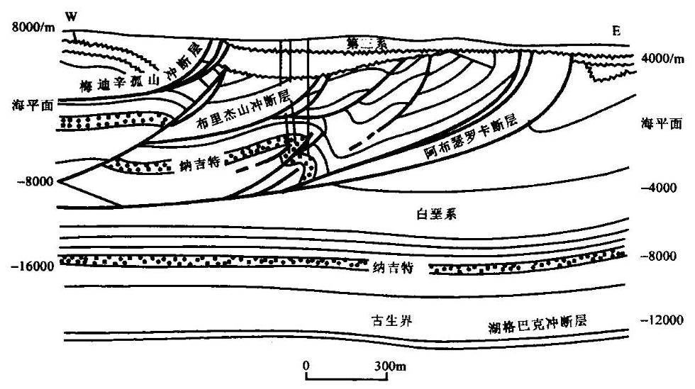

图 8-23 美国雷泽瓦油田东西构造剖面图

(据 Lamb, 1980)

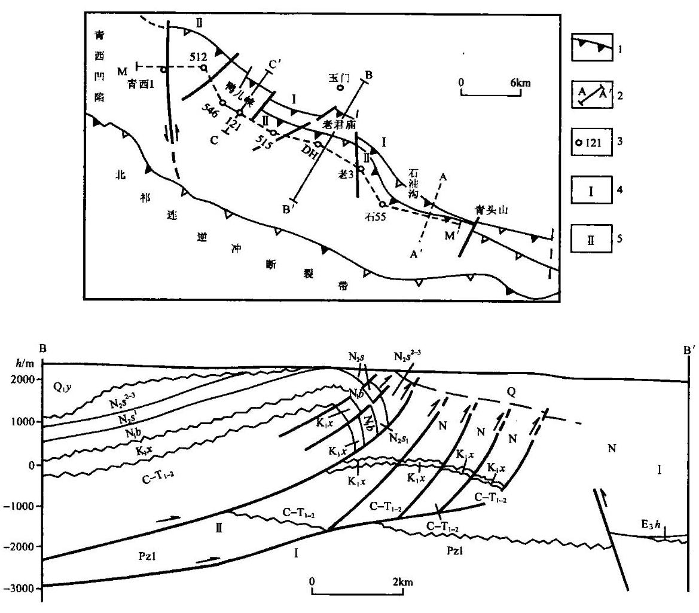

图 8-24 酒西盆地老君庙逆冲断裂带及油田剖面图

(转引自陈荣书, 1994)

1一逆冲断层; 2 一剖面位置; 3 一井位; 4 一庙北断层; 5 一老君庙断层

<!-- Media -->

## (三) 礁型油气田(藏) 带

礁型油气藏带按其形成条件和展布特征, 可分为: 环礁、马蹄礁、线型 (或堤) 礁和补丁 (或点) 礁。其中环礁、马蹄礁和点礁前已作过介绍。现仅以加拿大的瑞姆彼 - 圣 $\cdot$ 阿尔伯达线型礁为例 (图 8-25),简介如下。

<!-- Media -->

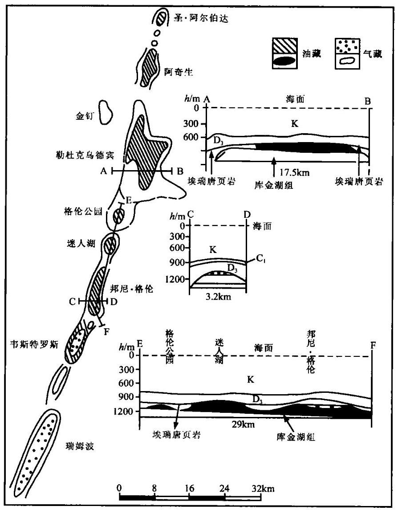

图 8-25 瑞姆彼 - 圣・阿尔伯达线状礁带油田分布及剖面图

(据 Gussow, 1951)

<!-- Media -->

该礁带位于阿尔伯达盆地南部,呈北北东向延伸,总长达 ${250}\mathrm{\;{km}}$ 。石油地质储量 ${2.7} \times  {10}^{8}\mathrm{t}$ ,可采储量 ${1.23} \times  {10}^{8}\mathrm{t}$ ,是阿尔伯达的主要产油气区之一。

该礁带是在库金湖组(中泥盆统)台地上发育起来的,晚泥盆世的弗兰期 $\left( {\mathrm{D}}_{3}\right)$ 为主要成礁期。礁体主要由珊瑚、藻类、层孔虫及苔藓虫等造礁生物组成, 由于强烈的白云岩化作用, 礁组合内部岩相分带已不明显。该带的产油层有两个: 弗兰期的勒杜克组和尼斯库组, 但以勒杜克组为主。储集层的孔隙类型是在原生礁格架及粒间孔隙的基础上, 加上强烈的白云岩化和溶蚀作用所形成的次生孔隙。孔隙性、渗透性均较好。

多孔的勒杜克礁块周围和上方被埃瑞唐页岩(上泥盆统)所覆盖。上覆较年轻的上泥盆统到白垩系, 由于差异压实作用, 形成平缓的背斜构造。因此, 该带除以礁型油气藏占优势外, 在个别油田 (阿奇生) 上覆白垩系砂岩层中也形成背斜油气藏。

关于该带油气藏的形成条件已进行过较为深入的研究, 认为覆于礁块之上的埃瑞唐页岩为主要生油层, 主要油源区位于该带的西南一侧。在埃瑞唐页岩沉积后, 直到石炭纪末,埋藏深度仅有 ${500} \sim  {600}\mathrm{\;m}$ ,其上缺失二叠纪 - 侏罗纪沉积,直到白垩纪和早第三纪才沉积巨厚的沉积岩层, 使埃瑞唐页岩完全成熟。油气藏形成的主要时期应是晚白垩世和第三纪。从区域构造运动的角度分析,晚白垩世开始地层倾角才达到 ${1}^{ \circ  }$ 以上,为油气运移提供了初步条件。早第三纪倾斜继续加强, 形成了整个油气藏趋向带。该带的油气分布具明显的差异聚集特征。

## 第五节 油 气 田

## 一、油气田的概念及分类

“油气田”这一术语, 在石油地质学中应用非常广泛, 许多石油地质学家都曾对它下过定义。他们所下的定义以及所作的解释, 一般都包括两方面的内容: ①油气田是指一定产油气面积内油气藏的总和; ②这一定的产油气面积是受一定的构造或地层因素所控制的地质单位。

对于后一内容, 不同学者有着不同的理解。有的强调单一的构造 (或地层) 因素; 有些则认为可以是单一的, 也可以是多种因素所构成的综合 (复合) 地质体 (或称地质单位)。

通过上述分析, 编者认为: “油气田是一定 (连续) 的产油气面积上油气藏的总和。 该产油气面积可以是受单一的构造或地层因素所控制的地质单位, 也可以是受多种因素所控制的复合的地质单位”。

所谓一定的产油气面积, 是指不同层位的产油气层叠合连片的产油气面积。在叠合连片范围内不同层位的产油气层, 可以存在于同一构造或地层因素所控制的单一地质体中, 如背斜、断块、单斜构造中的地层不整合和岩性尖灭等; 也可以存在于受多种因素控制的复合地质条件中, 如礁型、盐 (泥) 丘及古潜山等与上覆地层的背斜叠合所形成的多因素控制的复合地质体。

有些油气田的若干单个产油气面积并不直接相连, 只是位置接近, 但产油气层位、储集层类型和特征, 以及圈闭形成机理都相似, 常可看作是一个油气田。

根据控制产油气面积的地质因素, 油气田可分为下列三大类型, 各类可进一步划分为若干亚类:

1) 构造型油气田: ①背斜型油气田; ②断层型油气田。
2) 地层型油气田: ①不整合和岩性尖灭油气田; ②透镜状和不规则岩性型油气田; ③礁型油气田 (只有单一礁型油气藏)。
3) 复合型油气田: ①盐 (泥) 丘型油气田; ②礁型复合油气田 (存在多种类型油气藏); ③潜山复合型油气田; ④侧向叠合复合型油气田。

## 二、构造型油气田

所谓构造型油气田, 系指产油气面积上受单一的构造因素所控制, 如褶皱和断层。在通常情况下, 褶皱常伴生断层, 但以褶皱为主称为背斜油气田; 有时主要受断层控制, 则称断层或断块油气田。

## (一) 背斜油气田

背斜油气田中控制产油气面积的地质单位, 是褶皱变形所形成的背斜构造。背斜的褶皱变形一般可以垂直穿过很厚的沉积岩层, 在背斜范围内的储集层只要上方被盖层所覆, 具有良好的封闭条件, 都可形成背斜圈闭。因此, 多油气层在垂向上叠合形成巨厚的含油气层组, 常常是背斜油气田最显著的特点之一。由于巨厚的含油气组可以补偿含油气面积的不足, 可使一些面积不太大的背斜油气田成为大油气田。如果一个背斜油气田, 同时兼有巨大的含油气面积和较厚的含油气组, 则常形成特大油气田。基于上述原因, 背斜型油气田在整个油气田中占有极为重要的地位。据 Halbouty 等 (1970) 所列的 266 个大油气田的统计资料, 背斜油气田为 185 个, 占大油气田总数的 70% 以上, 其中 10 个特大油田的石油储量相当于世界石油可采储量的 ${45}\% ;{10}$ 个特大天然气田储量占世界天然气总储量的 ${33.3}\%$ 。

必须指出, 并不是所有背斜构造在垂向上不同深度的构造形态都是一致的, 即背斜的高点和褶皱的形态可以随深度而改变。

其次, 背斜油气田的含油面积由背斜的闭合面积所控制。一般来说, 它是受单一背斜的闭合面积所控制的, 但有时相邻若干个在成因上有联系的背斜构造, 虽然含油气面积不完全连片, 我们也把它当作同一油气田, 如布尔干油田、大庆油田。它们实际上是油气聚集带。

背斜油气田的褶皱形态可以是多种多样的, 可以是强烈褶皱, 甚至是倒转; 也可以是中等以至平缓的褶皱,背斜两翼的倾角仅几度,甚至不到 ${1}^{ \circ  }$ 。一般来说,褶皱强烈时垂向影响的沉积岩厚度大, 具有较高的闭合度, 但闭合面积都为中等大小; 而比较平缓的背斜构造闭合度一般较小, 闭合面积大小悬殊, 大者可达数千平方公里, 最小的甚至不到 $1{\mathrm{\;{km}}}^{2}$ 。越平缓、面积愈小的褶皱,继承性愈差,穿过沉积岩层的厚度亦小。褶皱形态不同的背斜油气田在空间分布上有一定的规律性。一般在褶皱山系的山前地带, 靠近褶皱山系方向褶皱的强度较大, 向地台方向褶皱减弱。而大陆内部的地台区, 一般褶皱较平缓。 从克拉通区向褶皱山系方向褶皱逐步加强。

背斜油气田储集层的岩石类型可以是碎屑岩, 亦可以是碳酸盐岩。碎屑岩储集层以中一细砂岩为主, 具有良好的孔隙性、渗透性, 横向较为稳定; 而碳酸盐岩储集层, 可以是孔隙型的粒屑灰岩 (如加瓦尔油田、泽勒坦油田等), 但大多数是孔隙 - 裂缝型或裂缝 - 孔隙型储集层。有些油气田既有碳酸盐岩储集层, 又有碎屑岩储集层, 如伏尔加 - 乌拉尔含油气盆地中的阿尔兰油田和库列绍夫油田 (图 8-26)。

背斜油气田中的油气藏类型, 通常是以背斜油气藏为主, 但亦常见有其他类型的油气藏, 如断层、岩性等类型油气藏。有些油气田仅由单一的背斜油气藏所组成, 如圣特弗泉油田和乌廉戈依气田。不论哪一种情况, 不同层位的含油气面积, 在垂向上均以楼房式叠合方式为主。

<!-- Media -->

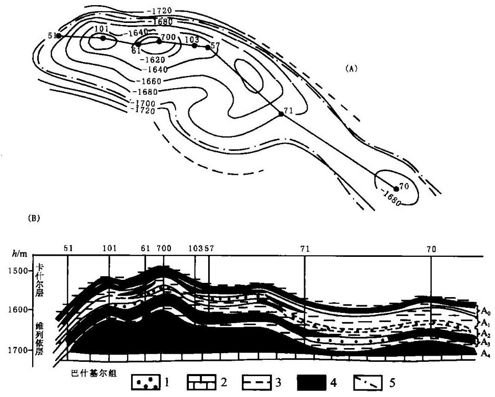

图 8-26 库列绍夫油田构造等高线和油田剖面图

(转引自陈荣书, 1994)

1一砂岩; 2一灰岩; 3一泥岩; 4-油藏; 5-含油边界

<!-- Media -->

## (二) 断层 (断块) 油气田

所谓断层 (断块) 油气田, 系指在区域均斜背景上, 其上倾方向, 或各个方向都由断层所控制所形成的油气田。

这类油气田常见于: ①地堑或半地堑型断陷 (或裂谷) 盆地, 如苏伊士、红海、阿曼地堑、莱茵地堑、马格达莱纳盆地以及我国的渤海湾盆地中的断层 (断块) 油气田; ②盆地斜坡带或挠曲带, 如墨西哥湾沿岸的断裂挠曲或同生断层带、尼日尔三角洲的同生断层带。

这种油气田中的主断层常常是同生断层, 它不仅构成油气田的一侧边界, 而且对生油层和储集层、油气圈闭的形成都起着重要的控制作用。

断层油气田一般以中小型为主, 储量达到大油气田级别的寥寥无几, 如奥菲西纳 (委内瑞拉) 油田等。

## 三、地层型油气田

所谓地层型油气田, 系指在区域均斜或单斜构造背景上, 由地层 (不整合和岩性) 因素所控制的含油气面积。

地层型油气田中, 油气藏类型以不整合和岩性油气藏为主, 亦可存在断层和复合油气藏。不整合型油气藏包括不整合面上的支撑砂岩和不整合面下的单斜型油气藏, 以及潜山油气藏。岩性油气藏可以是碎屑岩或碳酸盐岩中的岩性(上倾尖灭和透镜体)油气藏。由单一生物礁油气藏构成的礁型油气田亦属地层型油气田。对一个地层型油气田来说, 油气藏可以全部或主要是由不整合油气藏组成的, 如东得克萨斯油田 (图 8-27); 也可以完全是岩性油气藏, 如霍戈登气田、绿林县的鞋带状油田等。但亦有一些油气田是由不整合和岩性油气藏复合而成的, 如玻利瓦尔油田。

<!-- Media -->

图 8-27 东得克萨斯油田构造及剖面图

(转引自陈荣书, 1994)

<!-- Media -->

地层型油气田在分布上与古海(湖)岸带有密切关系。该带海 (湖) 水频繁进退, 形成削蚀、超覆、 尖灭及多种砂岩或碳酸盐岩储集体。不同时期岸线变迁, 可以叠合连片, 形成大面积的油气田。如霍戈登气田的含气面积达 ${16000}{\mathrm{\;{km}}}^{2}$ ,玻利瓦尔油田的面积达 ${5000}{\mathrm{\;{km}}}^{2}$ 以上。

## 四、复合型油气田

复合型油气田, 系指在油气田范围内不同层位和深度的油气藏受构造、地层和水动力诸因素中两种或多种因素控制的油气田。它可分为以下几种。

## (一) 盐(泥) 丘型复合油气田

在刺穿的盐 (泥) 丘油气田中, 由于盐核刺穿储油气层, 除形成盐核、盐帽遮挡以及盐帽内的透镜体油气藏外, 常使储集层断裂、尖灭, 甚至削蚀, 可形成断层、不整合和岩性等多种油气藏。这是一种典型的复合油气田。半刺穿的还可在盐丘上方形成生长背斜。不论是刺穿还是隐刺穿盐(泥)丘构造, 只要存在构造和地层两大类油气藏复合而形成的油气田, 都称为盐 (泥) 丘型复合油气田。如果只在单一构造因素控制下形成多种油气藏, 则不能称为复合油气田。

## (二) 礁型复合油气田

在礁型油气田中, 有些深部为礁型油气藏, 浅部(礁上方)为礁生长过程形成的同生背斜或压实背斜油气藏, 或强烈褶皱背斜中形成的背斜油气藏, 这种油气田才称为礁型复合油气田。以美国二叠纪盆地中斯库瑞县的斯奈德 - 斯克雷礁型复合油气田较为典型 (图 4-37)。若仅有礁型油气藏, 而礁上方没有构造类油气藏, 则属于地层型礁型油气田。

## (三) 潜山型复合油气田

潜山型复合油气田的深部为潜山油气藏, 而其上覆岩层则可能由于披覆、压实形成背斜油气藏、断层油气藏, 在不整合面上还可能伴有向潜山尖灭或超覆的地层型油气藏。总之, 不整合面下的潜山和其上覆地层无论是地质结构还是油气藏类型均有重大差别。如果仅有叠合的地质体, 而没有不同类型油气藏的叠合, 则不能称之为潜山型复合油气田。有些油气田在潜山上方 (即不整合面之上) 存在不同类型 (如地层和构造) 油气藏的叠合, 但潜山中不存在油气藏, 亦属于复合油气田, 但不能称之为潜山型复合油气田。潜山型复合油气田的模剖面, 如图 8-28 所示。

<!-- Media -->

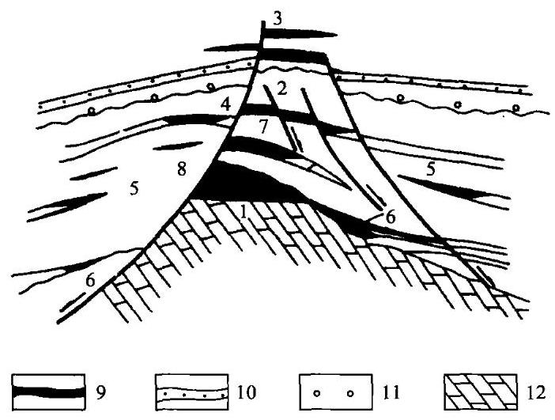

图 8-28 与潜山有关的油田模式剖面图

(转引自陈荣书, 1994)

1 一港山油藏; 2 一潜山上被断层切割的压实背斜油气藏; 3 一浅层背斜和断层油气藏; 4一断阶或逆牵引油气藏; 5、6一地层退覆油气藏; 7-潜山上方压实背斜油气藏; 8 一岩性油气藏; 9 一油藏; 10 一砂岩; 11 一砾岩; 12 一灰岩

<!-- Media -->

## (四) 侧向叠合型复合油气田

侧向叠合型复合油气田, 系指在油田不同层位中以构造型为主的油气藏和以地层型为主的油气藏之间不是垂向叠合, 而是侧向毗连, 或含油气面积有一定的叠合, 而构成统一的油气田。加利福尼亚的日落 - 中途油田就是这类油气田的典型实例之一。该油田(图 8-29) 的西南部在不整合面下有斯贝拉赛背斜油气藏 $\left( {\mathrm{N}}_{1}\right)$ 和不整合型油气藏 $\left( {{\mathrm{N}}_{1}{}^{2}}\right.$ , 次要), 而不整合面上为不整合支撑砂岩油气藏。两者含油面积虽未叠合连片, 但却紧相毗连, 存在于统一地质体中, 可以定为侧向叠合型复合油气田。

<!-- Media -->

图 8-29 加利福尼亚中途油田威廉斯及二十五山区构造剖面图

(引自 Levorsen, 1954)

<!-- Media -->

## 第六节 油气分布及其控制因素

## 一、油气资源概述

油气资源是指蕴藏在地壳中的石油与天然气。根据对地壳中油气赋存状态的了解程度以及进行开发的经济技术条件, 人们把油气资源分为油气储量和油气资源量两大级别。所谓油气储量是指已经探明或基本为人们所了解控制的、在现有经济和技术条件下能够进行开采的那部分油气数量; 而油气资源量则是根据现有地质资料和石油地质理论, 推测地下可能存在的、总的油气数量。

前已述及, 油气藏形成过程实质上是油气的散失 (耗散) 过程, 因此, 油气资源量既不是油气生成量, 也不是目前条件下具有工业价值的可采储量, 而是油气生成量减去残留量和油气运移聚集过程中的散失量。同时, 油气储量是油气资源量的一部分。油气资源量与油气生成量、储量具有的关系如表 8-2 。

<!-- Media -->

表 8-2 油气资源量与油气生成量、储量关系表

<table><tr><td colspan="7">烃源岩总生烃量</td></tr><tr><td>残留烃量</td><td colspan="6">总排烃量</td></tr><tr><td/><td>散失量</td><td colspan="5">有效运移量</td></tr><tr><td/><td/><td>散失量</td><td colspan="4">总聚集量</td></tr><tr><td/><td/><td/><td>散失量</td><td colspan="3">总资源量</td></tr><tr><td/><td/><td/><td/><td>未发现资源量</td><td colspan="2">发现地质储量</td></tr><tr><td/><td/><td/><td/><td/><td>不可开采储量</td><td>原始可采储量</td></tr><tr><td/><td/><td/><td/><td/><td/><td>累计产量剩余可采储量</td></tr></table>

<!-- Media -->

油气资源可以按照不同的标准分为不同的类型和级别。根据我国的石油储量规范 (2002), 依据油气资源发现程度, 将我国油气总原地资源首先分为地质储量和未发现原地资源量两大类, 并进一步将其划分为以下 5 个级别 (表 8-3)。

<!-- Media -->

表 8-3 中国油气总原地资源分类表

<table><thead><tr><th colspan="4">地质储量</th><th colspan="2">未发现原地资源量</th></tr><tr><th colspan="2">探明地质储量</th><th>控制地质储量</th><th>预测地质储量</th><th>潜在原地资源量</th><th>推测原地资源量</th></tr></thead><tr><td>已开发经济可采储量</td><td>未开发经济可采储量</td><td/><td/><td/><td/></tr></table>

<!-- Media -->

## (一) 探明地质储量

是指在油气藏评价阶段, 经评价钻探证实油气藏 (田) 可提供开采并能获得经济效益后,估算求得的、确定性很大的地质储量,其相对误差不超过 $\pm  {20}\%$ 。应查明了油气藏类型、储集类型、驱动类型、流体性质及分布、产能等; 流体界面或油气层底界应是钻井、测井、测试或可靠压力资料证实的; 应有合理的井控程度 (合理井距另行规定), 或开发方案设计的一次开发井网; 各项参数均具有较高的可靠程度。它是编制油田开发方案和投资建设决策的主要依据。

## (二) 控制地质储量

是指在圈闭预探阶段预探井获得工业油(气)流,并经过初步钻探认为可提供开采后,估算求得的、确定性较大的地质储量,其相对误差不超过 $\pm  {50}\%$ 。应初步查明了构造形态、储层变化、油气层分布、油气藏类型、流体性质及产能等, 具有中等的地质可靠程度, 可作为油气藏评价钻探、编制开发规划和开发设计的依据。

## (三) 预测地质储量

是指在圈闭预探阶段预探井获得了油气流或综合解释有油气层存在时, 对有进一步勘探价值的、可能存在的油 (气) 藏 (田), 估算求得的、确定性很低的地质储量。应初步查明了构造形态、储层情况, 预探井已获得油气流或钻遇了油气层, 或紧邻在探明储量 (或控制储量)区并预测有油气层存在,经综合分析有进一步评价勘探的价值。

## (四) 潜在原地资源量

在圈闭预探阶段前期, 对已发现的、有利含油气的圈闭或油气田的邻近区块 (层系), 根据石油地质条件分析和类比, 采用圈闭法估算的原地油气总量。它是部署预探井的重要依据。

## (五) 推测原地资源量

主要在区域普查阶段或其他勘探阶段, 对有含油气远景的盆地、坳陷、凹陷或区带等推测的油气储集体, 根据地质、物化探及区域探井等资料所估算的原地油气总量。它是预探部署的主要依据。推测原地资源量一般可用总原地资源量减去地质储量和潜在原地资源量的差值来求得。

通过盆地模拟技术或有机地球化学方法计算出的油气聚集量, 相当于推测原地资源量, 也可称为地质资源量; 如果在一个久经勘探已发现油气藏和已进行油气开采的盆地中, 此时计算出的油气聚集量相当于盆地的总资源量。它包括了已采出的油气储量。如果总资源量乘以采收率即为可采资源量或称为可采地质资源量。

值得注意的是, 目前国内外在应用资源量和储量的概念上有些混乱。国际上所说的资源量, 是指在近、中期 (30 年内) 的科技水平和油价下可以被探明采出和具有经济效益的油气资源; 而探明的储量是指能获得经济效益的可采储量。总之, 国际上的概念强调其可采性和经济性。我国的资源量常是总资源量的概念, 它可能包含了一部分在近、中期内难以采出、没有经济效益的油气资源。因此, 要与国际进行对比和接轨, 据张抗等 (2002) 研究, 需要乘以校正系数 0.31 (油) 和 0.33 (气) 得到有效地质资源量, 再乘以采收率才能得到可采资源量, 这样大体上才能与国际上的资源量概念相当。

## 二、油气分布

## (一) 世界的油气资源

世界石油的剩余探明储量,1980 年为 ${880} \times  {10}^{8}\mathrm{t}$ ,到 2000 年非但没有减少反而增加到 ${1408.9} \times  {10}^{8}\mathrm{t}$ (表 8-4),这是科学技术进步的结果。主要表现在: 油气地质理论的提高, 地震、测井、钻井等勘探方法的进步, 高采收率等开发技术的应用, 老油田储量的增加以及新大油田的发现。

<!-- Media -->

表 8-4 世界油气探明储量

<table><thead><tr><th>探明储量</th><th>石油 $/{10}^{8}\mathrm{t}$</th><th>天然气 $/{10}^{12}{\mathrm{\;m}}^{3}$</th></tr></thead><tr><td>累计探明储量</td><td>2634. 14</td><td>215. 12</td></tr><tr><td>累计生产量</td><td>1225. 24</td><td>65.65</td></tr><tr><td>剩余探明储量</td><td>1408.9</td><td>149.47</td></tr></table>

<!-- Media -->

(据美国联邦地质调查局, 2000)

石油和天然气的可采储量超过 ${6850} \times  {10}^{4}\mathrm{t}$ 和 ${850} \times  {10}^{8}{\mathrm{\;m}}^{3}$ 的大油气田,对世界油气资源有着巨大的影响。目前世界上共有 509 个大油气田, 虽然它们仅占世界油气田总数的 1.7%, 但其油气可采储量却占世界总可采储量的 70% (Brooks, 1990)。其中, 可采储量超过 ${6.85} \times  {10}^{8}\mathrm{t}$ 的巨型油田有 42 个,却占世界石油总可采储量的 ${40}\%$ (法国石油研究院, 1993)。尽管目前对大油气田的划分标准还未完全一致, 但无论以什么储量级别或不同时期所做的统计结果, 都不会改变一个基本事实, 那就是世界上绝大多数的油气储存在少数大油气田中 (表 8-5 和表 8-6)。

通过对大油气田的统计和分析, 可以反馈很多有关大油气田形成的地质信息。

1) 烃源岩: 页岩 (泥岩) 占 65%,微晶灰岩占 ${21}\%$ ,泥灰岩占 ${11}\%$ ,煤小于 $2\%$ ; 按烃源岩类型统计,海相大油气田占大油气田总储量的 ${95}\%$ ,陆相大油气田占 $5\%$ 。
2) 储集岩: 按岩性统计, 砂岩储集层约占大油气田储量的 60%, 碳酸盐岩储集层约占 ${40}\%$ ; 按时代统计,中新生代地层中大油气田储量占大油气田总储量的 ${89}\%$ ,古生代地层中的占 ${11}\%$ 。
3) 盖岩: 与页岩盖层有关的大油气田占大油气田总储量的 ${65}\%$ ,与蒸发岩盖层有关的占 ${33}\%$ ,与碳酸盐岩盖层有关的占 $2\%$ 。
4) 圈闭: 背斜圈闭约占大油田总数的 ${61}\%$ ,占大油田总储量的 ${73.9}\%$ ; 地层和岩性圈闭约占总数的 ${6.8}\%$ ,占总储量的 ${4.4}\%$ ; 复合圈闭约占总数的 ${32.2}\%$ ,占总储量的 21.7%。

<!-- Media -->

表 8-5 世界 10 大油田

<table><thead><tr><th>序号</th><th>油气田</th><th>国家</th><th>发现 年代</th><th>可采储量 油 $/{10}^{8}\mathrm{t}$ , 气 $/{10}^{8}{\mathrm{\;m}}^{3}$</th><th>盆 地</th><th>产层深度 $\mathrm{m}$</th><th>产层时代</th><th>产层岩性</th></tr></thead><tr><td>1</td><td>盖瓦尔</td><td>沙特阿拉伯</td><td>1943</td><td>114.8, 9240 (气)</td><td>波斯湾</td><td>2200</td><td>J</td><td>碳酸盐岩</td></tr><tr><td>2</td><td>布尔甘</td><td>科威特</td><td>1938</td><td>105, 20300 (气)</td><td>波斯湾</td><td>1400</td><td>K</td><td>砂岩</td></tr><tr><td>3</td><td>萨法尼亚</td><td>沙特阿拉伯</td><td>1951</td><td>50.5,3300 (气)</td><td>波斯湾</td><td>1600</td><td>K</td><td>砂岩</td></tr><tr><td>4</td><td>玻利瓦尔湖岸</td><td>委/ 瑞拉</td><td>1917</td><td>42. 14</td><td>马拉开波</td><td>900</td><td>$\mathrm{E} - \mathrm{N}$</td><td>砂岩</td></tr><tr><td>5</td><td>坎塔雷尔复合</td><td>墨西哥</td><td>1976</td><td>28.0</td><td>坎佩切</td><td>1500</td><td>K</td><td>碳酸盐岩</td></tr><tr><td>6</td><td>扎库姆</td><td>阿联酋</td><td>1964</td><td>25. 76</td><td>波斯湾</td><td>2700</td><td>J</td><td>碳酸盐岩</td></tr><tr><td>7</td><td>基尔库克</td><td>伊拉克</td><td>1927</td><td>23.8</td><td>扎格罗斯</td><td>800</td><td>E-N</td><td>碳酸盐岩</td></tr><tr><td>8</td><td>马尼法</td><td>沙特阿拉伯</td><td>1957</td><td>23.8</td><td>波斯湾</td><td>2300</td><td>K</td><td>砂岩</td></tr><tr><td>9</td><td>萨莫特洛尔</td><td>俄罗斯</td><td>1965</td><td>21. 16</td><td>西西伯利亚</td><td>2200</td><td>K</td><td>砂岩</td></tr><tr><td>10</td><td>罗马什金</td><td>俄罗斯</td><td>1948</td><td>20. 31</td><td>伏尔加 - 乌拉尔</td><td>1700</td><td>D</td><td>砂岩</td></tr></table>

(据甘克文, 1992, 修编)

表 8-6 世界 10 大气田

<table><thead><tr><th>序号</th><th>油气田</th><th>国家</th><th>发现 年代</th><th>可采储量 ${10}^{8}{\mathrm{\;m}}^{3}$</th><th>盆 地</th><th>产层深度 m</th><th>产层时代</th><th>产层岩性</th></tr></thead><tr><td>1</td><td>乌连戈伊</td><td>俄罗斯</td><td>1966</td><td>80550</td><td>西西伯利亚</td><td>1200</td><td>K</td><td>砂岩</td></tr><tr><td>2</td><td>扬堡</td><td>俄罗斯</td><td>1969</td><td>47563</td><td>西西伯利亚</td><td>1000</td><td>K</td><td>砂岩</td></tr><tr><td>3</td><td>博瓦涅科夫</td><td>俄罗斯</td><td>1971</td><td>41505</td><td>西西伯利亚</td><td>1200</td><td>K</td><td>砂岩</td></tr><tr><td>4</td><td>扎波利亚尔</td><td>俄罗斯</td><td>1965</td><td>26706</td><td>西西伯利亚</td><td>1200</td><td>K</td><td>砂岩</td></tr><tr><td>5</td><td>哈西鲁迈勒</td><td>阿尔及利亚</td><td>1956</td><td>25488</td><td>古达米斯</td><td>2100</td><td>T</td><td>砂岩</td></tr><tr><td>6</td><td>诺斯</td><td>卡塔尔</td><td>1976</td><td>22400</td><td>波斯湾</td><td>2700</td><td>P</td><td>碳酸盐岩</td></tr><tr><td>7</td><td>格罗宁根</td><td>荷兰</td><td>1959</td><td>21000</td><td>德国西北部</td><td>2900</td><td>P</td><td>砂岩</td></tr><tr><td>8</td><td>胡果顿</td><td>美国</td><td>1926</td><td>19682</td><td>阿纳达科</td><td>800</td><td>P</td><td>白云岩</td></tr><tr><td>9</td><td>卡拉恰加纳克</td><td>哈萨克斯坦</td><td>1979</td><td>16000</td><td>滨里海</td><td>4500</td><td>P-C</td><td>碳酸盐岩</td></tr><tr><td>10</td><td>奥伦堡</td><td>俄罗斯</td><td>1966</td><td>15998</td><td>伏尔加 - 乌拉尔</td><td>1600</td><td>P</td><td>碳酸盐岩</td></tr></table>

(据李国玉, 1998, 修编)

<!-- Media -->

5) 埋深: 埋深 ${1220}\mathrm{\;m}$ 以上大油田所占大油田总储量的 ${5.1}\%$ ,大气田所占大气田总储量的 ${25.7}\%$ ; 埋深 ${1220} \sim  {3050}\mathrm{\;m}$ 的大油田占总储量的 ${79}\%$ ,大气田占总储量的 ${46.1}\%$ ; 埋深 ${3050} \sim  {3665}\mathrm{\;m}$ 的大油田占总储量的 ${8.1}\%$ ,大气田占总储量的 ${25}\%$ ; 埋深 ${3665} \sim  {4270}\mathrm{\;m}$ 的大油田占总储量的 ${7.6}\%$ ,大气田占总储量的 ${1.9}\%$ ; 埋深 ${4270}\mathrm{\;m}$ 以下大油田占总储量的 ${0.2}\%$ ,大气田占总储量的 ${1.3}\%$ 。

## (二) 油气资源的空间分布

虽然地壳上油气资源的分布非常普遍, 目前除南极洲外, 在各大洲的 110 个国家和 256 个盆地中均发现有油气田,但油气资源的分布极不均匀。全世界 ${1000}{\mathrm{\;{km}}}^{2}$ 以上的陆上盆地有 964 个, 海上盆地有 451 个, 共计 1415 个, 其中已发现油气田的盆地有 256 个, 含有巨型油气田的盆地 73 个, 它们占有世界油气总储量的 ${80}\%$ (张亮成,1986)。其中的波斯湾、西西伯利亚和墨西哥湾这 3 个盆地就占有世界油气总储量的 ${60}\%$ ,仅波斯湾一个盆地就占有世界油储量的 ${40}\%$ ,而西西伯利亚一个盆地就占有世界天然气储量的 ${40}\%$ 。即使在同一个含油气盆地中,不同部位的油气丰度也存在很大的差异。例如: 蕴藏石油最多的波斯湾盆地面积为 ${230} \times  {10}^{4}{\mathrm{\;{km}}}^{2}$ ,油气田集中分布在其东北边缘大约 ${60} \times$ ${10}^{4}{\mathrm{\;{km}}}^{2}$ 的面积内,占有该盆地总可采储量的 ${95}\%$ 以上油气资源; 蕴藏天然气最多的西西伯利亚盆地面积为 ${280} \times  {10}^{4}{\mathrm{\;{km}}}^{2}$ ,油气田集中分布在鄂毕河的中下游地区,不超过其总面积的 ${30}\%$ (甘克文,2002)。上述事实充分说明地壳上油气资源在空间上分布具不均匀性。

油气主要产在沉积盆地之中, 油气资源丰度的不均性与盆地的类型密切有关。Price (1994) 在原有盆地分类的基础上, 将含油气盆地归纳为 8 类, 并研究了其与含油气丰度之间的关系 (表 8-7)。

<!-- Media -->

表 8-7 各类盆地的含油气丰度

<table><thead><tr><th>盆地</th><th>可采储量 (油当量) $/{10}^{8}\mathrm{t}$</th><th>含油气丰度 $/{10}^{6}\mathrm{t} \cdot  {\mathrm{{km}}}^{2}$</th></tr></thead><tr><td>克拉通</td><td>19. 18</td><td>0.87</td></tr><tr><td>不对称克拉通</td><td>35. 27</td><td>4. 26</td></tr><tr><td>被动边缘</td><td>23.28</td><td>3. 78</td></tr><tr><td>裂谷、萎缩裂谷</td><td>566.40</td><td>17.72</td></tr><tr><td>前陆 - 褶皱带</td><td>1356.8</td><td>13. 22</td></tr><tr><td>下翘</td><td>232.88</td><td>25. 20</td></tr><tr><td>扭动</td><td>214.40</td><td>59. 56</td></tr><tr><td>三角洲</td><td>141. 10</td><td>43. 14</td></tr></table>

(据 Price, 1994)

<!-- Media -->

Price 认为, 克拉通盆地是体面比 (沉积物体积与沉积物分布面积之比) 低、地温梯度低、构造形变小、断裂活动少的盆地, 因而油气储量和丰度均最低; 前陆 - 褶皱带是极不对称的大型盆地, 巨厚的沉积位于盆地活动翼一侧且构造活动十分强烈, 有穿过盆地深部的高角度和低角度的逆断层, 稳定翼一侧构造活动大大减弱, 大油气田多分布在此稳定的陆棚区, 例如属此类型的波斯湾盆地拥有 105 个大油气田, 伏尔加 - 乌拉尔盆地拥有 12 个大油气田, 阿尔伯达盆地拥有 10 个大油气田等, 是油气储量最多、丰度中等的盆地类型。裂谷和萎缩裂谷盆地在地堑中有巨厚的沉积,地温梯度高,常在 $4 \sim  5\mathrm{C}/{100}\mathrm{\;m}$ ,深大断裂发育, 油气以垂向运移为主, 油气田多分布在邻近深地堑的断块隆起上, 例如属此类型的北海盆地拥有 26 个大油气田, 二叠盆地拥有 19 个大油气田, 西西伯利亚盆地拥有 67 个大油气田等, 是油气储量仅次于前陆盆地而丰度高于前者的盆地类型。由海洋扩张中心隔开的海盆, 构造活动十分强烈, 地温梯度高, 深大断裂活动频繁, 例如属此类型的大墨西哥湾盆地拥有 27 个大油气田, 是油气储量和丰度都比较高的盆地类型。扭动盆地被不同学者称为俯冲盆地、后缝合线盆地或张性盆地, 这类盆地具有很高的体面比、地温梯度极高、张性构造活动为油气提供了良好的垂向运移通道, 油气田大多分布在成盆主断层的上升盘或其附近, 目前世界上 3 个含油气丰度最高的洛杉矶、中苏门答腊和马拉开波盆地均属此类, 其中马拉开波盆地拥有 8 个大油气田, 是油气储量较高而丰度最高的盆地类型。

尽管 Price 的盆地分类只是众多分类中的一种, 很多盆地的归属也不尽相同, 但他明确指出沉积巨厚、体面比高、地温梯度高、构造活动较强烈、有深大断裂穿过成熟烃源岩的盆地, 其含油气丰度最高, 而油气储量也不低。因此 Price 的研究至少从一个侧面说明了盆地类型与油气资源丰度不均匀性之间的关系, 从而为油气勘探和评价提供了一种依据和思路。

此外, 许多研究者把一个海相沉积盆地划分为陆棚、枢纽带、深坳陷、活动边缘 4 个部分。陆棚位于盆地一侧的浅海地区; 枢纽带是从陆棚向盆地深坳陷中延伸, 坡度发生激剧变化的地带; 活动边缘是盆地另一翼, 为激剧隆升与褶皱山联结的地带。陆棚和枢纽带合在一起称为盆地的稳定翼或陆棚区, 深坳陷与活动边缘合在一起称为活动翼。通过研究发现, 沉积盆地中大油气田主要分布在稳定翼一侧, 特别是更多地集中在枢纽带上。例如在 245 个大油气田中, 陆棚占有 25.4% 的储量, 有 183 个大油气田; 枢纽带占有 53.6% 的储量,有 33 个大油气田; 深坳陷占有 ${19.5}\%$ 的储量,有 17 个大油气田; 活动边缘占有 ${1.5}\%$ 的储量,有 12 个大油气田。整个稳定翼共占有 ${79}\%$ 的储量,约是活动翼的 4 倍。 可见, 在一个沉积盆地中油气资源的分布也是极不均匀的。这一事实为海相盆地中的油气勘探指出了有利地带, 也为陆相盆地中的油气勘探提供了借鉴。

## (三) 油气资源的时代分布

油气资源在时代上的分布也是极不均匀的, Klemme 和 Ulmishek (1991) 根据美国地质调查局 1987 年的统计数据,分析了在全世界常规油气可采储量 ${3100} \times  {10}^{8}\mathrm{t}$ (油当量) 中各地质时代所占的百分比 (表 8-8)。虽然看似每个地质时代都有烃源岩, 但实际上主要发育有 6 套烃源岩, 它们占有世界总储量的 91.5%。新元古代和下古生代的烃源岩主要发育在志留系,约占总储量的 $9\%$ ,其油源通过垂向运移主要聚集在上二叠统一中侏罗统的储集层中; 上古生代的烃源岩主要发育在上泥盆统、上石炭统和下二叠统中, 约占总储量的 ${16}\%$ ,其油源通过垂向运移主要聚集在本层系的储集层中; 中生代的烃源岩主要发育在上侏罗统和中上白垩统中,约占总储量的 ${54}\%$ ,其油源通过垂向运移主要聚集在本层系和新生界的储集层中; 新生代的烃源岩主要发育在渐新统,约占储量的 ${12.5}\%$ , 其油源通过垂向运移主要聚集在新生界中 (图 8-30)。

<!-- Media -->

表 8-8 全球常规油气可采储量中各时代所占比率

<table><thead><tr><th>地质时代</th><th>烃源岩时代/%</th><th>储集岩时代/%</th></tr></thead><tr><td>新元古代和下古生代</td><td>10.2</td><td>2.4</td></tr><tr><td>上古生代</td><td>16.7</td><td>18.1</td></tr><tr><td>中生代</td><td>57.8</td><td>52.6</td></tr><tr><td>新生代</td><td>15. 3</td><td>26.9</td></tr></table>

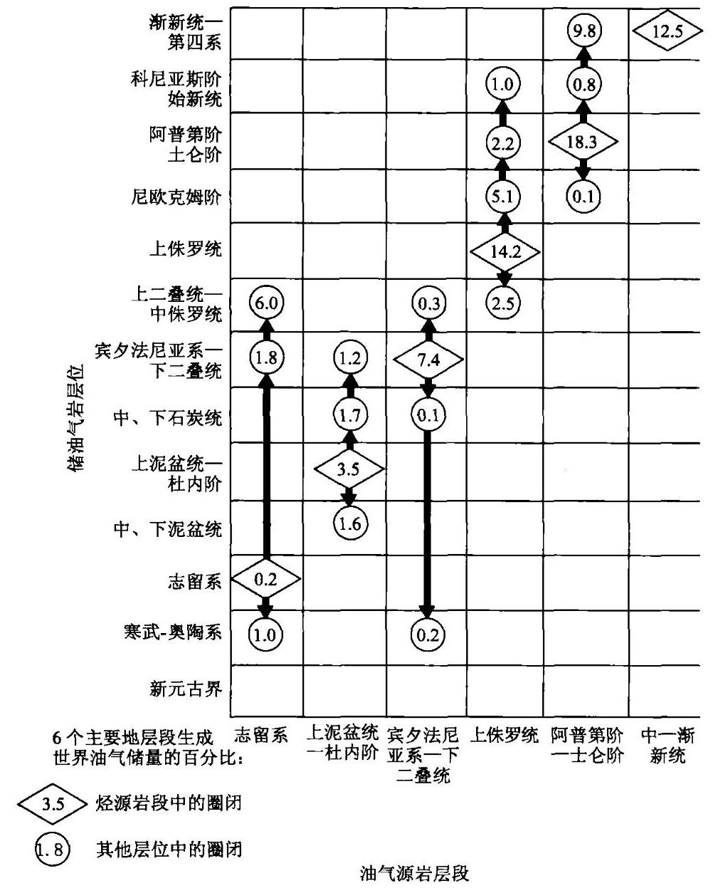

图 8-30 6 套主要烃源岩的油源通过垂向运移聚集所占世界可采储量的比率

(据 Klemme 和 Ulmishek, 1991)

<!-- Media -->

从油气资源在时间上的分布可以明显地看出, 石油的储量和油田的数量随着地质时代的变新而急剧下降, Miller 等 (1992) 认为这是油田在地史过程中不断遭到破坏的结果。虽然也受到烃源岩分布和成熟时期的影响, 但这种影响充其量也是第二位的, 因为早古生代发育的烃源岩实际上比中生代更为广泛 (Klemme 和 UImishek, 1991)。对此不少学者提出, 许多原先存在的油田已在全球范围的石炭 - 二叠纪构造运动中遭到了破坏。Miller (1992) 提出石油资源随时间呈指数衰减的模式。认为石油在不断生成, 又在不断遭到破坏, 任何时刻所存在的石油数量就是那时全球的石油资源量, 在所讨论的系统处于稳定和平衡的条件下, 全球石油资源与流量 (充注或漏失) 以及年龄之间有如下关系式:

半衰期 $\times$ 系统流量 $= \ln 2 \times$ 系统规模

该式既可应用于全球所有的石油资源, 也适用于油田中的石油资源。据 Miller 的计算: 全球石油储量的半衰期约为 ${29}\mathrm{{Ma}}$ (也可理解为中值年龄), 全球石油圈闭的漏失速率约为每年 ${80} \times  {10}^{4}\mathrm{{bbl}}( \approx  {11.4} \times$ ${10}^{4}\mathrm{t}$ )。Macgregor (1996) 根据大油田的时代分布认为: 占世界 ${80}\%$ 以上的石油资源在距今 ${75}\mathrm{{Ma}}$ 时就已成藏到位 (图 8-31), 其中值年龄为 ${35}\mathrm{{Ma}}$ (与 Miller 所提 ${29}\mathrm{{Ma}}$ 大体相当), 这表明世界现有大油田的一半是在 ${35}\mathrm{{Ma}}$ (渐新世) 之后形成的; 并具体计算了世界上 350 个大油田的漏失速率为每年 ${10} \times  {10}^{4} \sim  {40} \times$​${10}^{4}\mathrm{{bbl}}\left( { \approx  \left( {{1.43} \sim  {5.7}}\right)  \times  {10}^{4}\mathrm{t}}\right) ,$由此可见大油田的地质储量有可能在 ${18} \sim  {27}\mathrm{{Ma}}$ 内漏失殆尽。这里虽然不包括天然气资源, 但天然气的散失更为广泛, 天然气藏的中值年龄可能更短。总之, 通过上述的统计分析和计算, 更确切地说明了油气资源得以延续至今保存条件最为重要。这也是本书所强调的 “生烃是基础、圈闭是条件、保存则是关键” 的重要依据。 (四) 中国的油气资源

<!-- Media -->

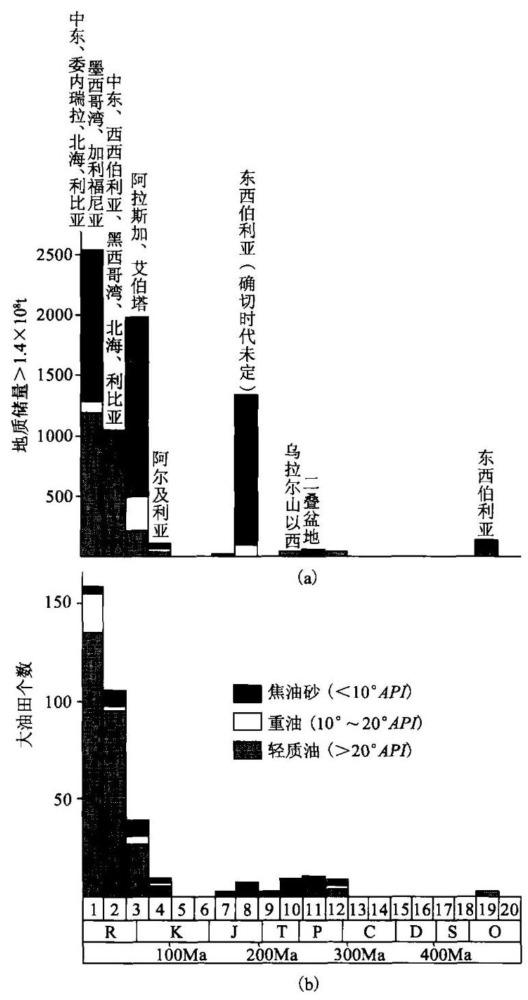

图 8-31 世界 350 个大油气田的储量与石油聚集定位年龄的关系

(据 Macgregor, 1996)

<!-- Media -->

目前中国的石油总资源量按第二次全国油气资源评价结果约为 ${940} \times$ ${10}^{8}\mathrm{t}$ ,天然气的总资源量约为 ${38} \times$ ${10}^{12}{\mathrm{\;m}}^{3}$ 。与世界的油气资源一样在空间和时间上的分布都是极不均匀的 (表 8-9 和表 8-10)。中国的石油资源在空间上主要分布在东部、西部和海域地区, 而中国的天然气资源主要分布在中部、西部和海域地区 (沈平平等, 1999)。中国的油气资源在时间上主要分布在新生代 (第三纪), 这一点与世界油气资源主要分布在中生代有所不同。而中国天然气资源的时代分布除新生代 (第三纪) 最多外, 其他各时代看起来似乎差不多, 但若进一步划分时代则发现在中生代中有将近 ${50}\%$ 的天然气资源集中在三叠纪,上古生代全部集中在石炭 - 二叠纪,下古生代几乎全部集中在奥陶纪, 其分布也是很不均匀的 (据窦立荣等, 2002)。

<!-- Media -->

表 8-9 中国油气资源的空间分布

<table><thead><tr><th rowspan="2">位置</th><th colspan="2">石油</th><th colspan="2">天 然 气</th></tr><tr><th>资源量 $/{10}^{8}\mathrm{t}$</th><th>占总资源量/%</th><th>资源量 $/{10}^{8}\mathrm{t}$</th><th>占总资源量 $/\%$</th></tr></thead><tr><td>东部</td><td>368.0</td><td>39.1</td><td>5.04</td><td>13. 3</td></tr><tr><td>中部</td><td>36.4</td><td>3. 8</td><td>12. 10</td><td>31.8</td></tr><tr><td>西部</td><td>259.0</td><td>27.6</td><td>10. 75</td><td>28.3</td></tr><tr><td>南方</td><td>30.6</td><td>3. 3</td><td>1.91</td><td>5.0</td></tr><tr><td>海域</td><td>246.0</td><td>26.2</td><td>8. 20</td><td>21.6</td></tr><tr><td>合计</td><td>940.0</td><td>100</td><td>38</td><td>100</td></tr></table>

表 8-10 中国油气资源的时代分布

<table><thead><tr><th rowspan="2">地质时代</th><th colspan="2">石油</th><th colspan="2">天 然 气</th></tr><tr><th>资源量 $/{10}^{8}\mathrm{t}$</th><th>占总资源量/%</th><th>资源量 $/{10}^{8}\mathrm{t}$</th><th>占总资源量/%</th></tr></thead><tr><td>新生代</td><td>487.8</td><td>52</td><td>14.63</td><td>38.47</td></tr><tr><td>中生代</td><td>326</td><td>34.7</td><td>7.94</td><td>20.93</td></tr><tr><td>上古生代</td><td>85.3</td><td>9.1</td><td>7.83</td><td>20.6</td></tr><tr><td>新元古代和 下古生代</td><td>40.9</td><td>4. 2</td><td>7.6</td><td>20. 0</td></tr><tr><td>合计</td><td>940</td><td>100</td><td>38</td><td>100</td></tr></table>

<!-- Media -->

此外, 从中国大油气田的分布位置也可以看出中国油气资源在时、空上分布的不均性 (表 8-11 和表 8-12)。从表中可知: 我国大油田在空间上主要分布在东部和海域, 在时代上主要集中在第三纪和白垩纪, 12 个大油田的探明储量约占石油总探明储量的 50%; 而我国大气田在空间上主要分布在中西部, 在时代上主要集中在石炭 - 二叠纪和第三纪, 10 个大气田的探明储量约占天然气总探明储量的 ${40}\%$ 。尽管表中数值不一定十分准确, 但大油气田在我国油气储量中所占比重是举足轻重的。

总之, 深刻地认识油气资源在沉积盆地中时空上分布的不均匀性, 可以客观地判断和评价世界和我国油气资源的潜力, 为制定我国的能源政策和安全战略提供切实的依据。进一步了解不同盆地类型以及盆地中不同部位的油气分布和丰度上的差异, 可以优选不同的盆地、含油气系统和区带首先进行勘探, 以达到减少勘探风险、提高经济效益的目的。

<!-- Media -->

表 8-11 中国 12 大油田

<table><thead><tr><th>油田名称</th><th>盆 地</th><th>发 现 年 代</th><th>层 位</th><th>储集岩性</th><th>地质储量 ${10}^{8}\mathrm{t}$</th></tr></thead><tr><td>克拉玛依</td><td>准噶尔</td><td>1955</td><td>$\mathrm{C} - \mathrm{J}$</td><td>砂岩、砾岩</td><td>8. 3</td></tr><tr><td>大庆</td><td>松辽</td><td>1959</td><td>${\mathrm{K}}_{1}$</td><td>砂岩</td><td>44.0</td></tr><tr><td>朝阳沟</td><td>松辽</td><td>1961</td><td>${\mathrm{K}}_{1}$</td><td>砂岩</td><td>2. 13</td></tr><tr><td>胜坨</td><td>济阳</td><td>1964</td><td>E、 $\mathrm{N}$</td><td>砂岩</td><td>4. 69</td></tr><tr><td>孤岛</td><td>济阳</td><td>1968</td><td>$\mathrm{E}\text{、}\mathrm{N}$</td><td>砂岩</td><td>3. 56</td></tr><tr><td>曙光</td><td>辽河</td><td>1975</td><td>E</td><td>砂岩</td><td>8.5</td></tr><tr><td>任丘</td><td>冀中</td><td>1975</td><td>$Z{w}_{N} \in  \text{、}0$</td><td>白云岩、石灰岩</td><td>4.07</td></tr><tr><td>孤东</td><td>济阳</td><td>1984</td><td>E、 $\mathrm{N}$</td><td>砂岩</td><td>2. 62</td></tr><tr><td>绥中 36 -1</td><td>渤海</td><td>1987</td><td>E</td><td>砂岩</td><td>2. 88</td></tr><tr><td>埕岛</td><td>济阳</td><td>1988</td><td>E、J</td><td>砂岩</td><td>3. 11</td></tr><tr><td>靖安</td><td>鄂尔多斯</td><td>1996</td><td>T、 $\mathbf{J}$</td><td>砂岩</td><td>2. 49</td></tr><tr><td>蓬莱 19 - 3</td><td>渤海</td><td>1999</td><td>N</td><td>砂岩</td><td>3.0</td></tr></table>

<!-- Media -->

(据张文昭, 2001)

<!-- Media -->

表 8-12 中国 10 大气田

<table><thead><tr><th>汽 田 名 称</th><th>盆 地</th><th>发现年代</th><th>层 位</th><th>储集岩性</th><th>地质储量 ${10}^{8}{\mathrm{\;m}}^{3}$</th></tr></thead><tr><td>威远</td><td>四川</td><td>1964</td><td>Z</td><td>白云岩</td><td>408.61</td></tr><tr><td>涩北 1 号</td><td>柴达木</td><td>1965</td><td>Q</td><td>砂岩</td><td>492. 22</td></tr><tr><td>崖 13-1 (崖城)</td><td>琼东南</td><td>1983</td><td>E</td><td>砂岩</td><td>1000</td></tr><tr><td>五百梯</td><td>四川</td><td>1989</td><td>C、 $P$</td><td>白云岩</td><td>587. 11</td></tr><tr><td>鄂中 (长庆)</td><td>鄂尔多斯</td><td>1989</td><td>O、 $P$</td><td>石灰岩、砂岩</td><td>4911.19</td></tr><tr><td>沙坪场</td><td>四川</td><td>1992</td><td>C</td><td>白云岩</td><td>397.71</td></tr><tr><td>牙哈</td><td>塔里木</td><td>1993</td><td>$\mathbf{E}\text{、}\mathbf{K}$</td><td>砂岩</td><td>376.4</td></tr><tr><td>和田河</td><td>塔里木</td><td>1997</td><td>C、O</td><td>石灰岩、砂砾岩</td><td>616.94</td></tr><tr><td>克拉 2</td><td>塔里木</td><td>1998</td><td>$\mathrm{K}\text{、}\mathrm{E}$</td><td>砂岩</td><td>2840.29</td></tr><tr><td>苏里格</td><td>鄂尔多斯</td><td>2000</td><td>P</td><td>砂岩</td><td>5336. 52</td></tr></table>

(据张文昭, 2001)

<!-- Media -->

## 三、控制油气分布的主要因素

从有机成烃说的观点出发, 地壳中油气资源的存在和丰度, 取决于成烃、成藏及保存诸因素的有机配合。地壳中具备这三方面最佳组合的盆地带, 就成为油气最富集的盆地带; 同样, 在同一盆地带内, 不同盆地的油气丰度, 或是同一盆地内不同构造单元或油气聚集带内油气富集的程度, 也主要取决于这三个条件的有机配合。下面从三个基本条件有机配合的角度, 论述控制油气分布的若干问题。

## (一) 关于成烃的若干问题

## 1. 烃源岩及原生油气藏存在的上、下限

所谓原生油气藏, 是指烃源岩及相邻近或一定距离内储集层中, 油气第一次聚集形成的油气藏。烃源岩存在的前提条件是沉积物中具有足够的有机质丰度。这主要受控于古生物的演化, 即地史发展过程中什么时期开始大量繁殖适合成油的藻类植物。这是确定烃源岩存在最早时间的关键。

对于生物进化, 一般认为有 3 次重大突破: 一是从异养到自养, 二是从二极 (绿色植物和菌类) 到三极 (植物、菌类和动物), 三是从水到陆。从二极到三极的过程, 是绿色植物 (蓝、绿藻类) 达到繁殖高峰的时期。因此, 这段时期也应该是形成烃源岩的最早时期。目前已证实存在的原生油气藏, 其烃源岩的地层年龄大多晚于距今 6 亿 $\sim  7$ 亿年。据此,我们可以将动物可能出现和藻类大规模繁殖的时期 (7 亿 $\sim  {10}$ 亿年前) 作为烃源岩和原生油气藏可能存在的最早时期。不应期求在更老的地层中去寻找原生油气藏。目前在我国或世界其他地区在太古宙变质基岩中发现的少量基岩油藏, 都是从上覆年轻烃源岩中生成的油气, 向下或侧向运移而聚集在基岩中聚集成藏的。

那么成藏最短要经历多长时间呢？根据晚期成油说,有机质达到一定埋深和温度后才能大量成烃,一般最少要经历 $5 \sim  {10}\mathrm{{Ma}}$ ,长的可达几千万到几亿年。但近年来研究表明, 某些类型有机质, 在微生物作用下可以在低温条件下生成石油 (早期生油), 生成石油的时间也大大缩短。这样就不难理解为什么在某些地区的第四系或浅部低温地层中亦可存在原生油藏这一事实。但是, 要在较短的时间内, 形成规模巨大的原生油藏是十分困难的, 甚至是不可能的。 2. 有效烃源岩的层位分布和成熟时间

前已得出自 10 亿年前到第四纪都有可能存在烃源岩, 但这并不是说烃源岩均等地存在于所有地史时期。据 Klemme 等 (1991) 研究, 有效烃源岩主要集中于 6 个地层段中: ①志留系; ②上泥盆统一杜内阶; ③宾夕法尼亚系 $\left( {\mathrm{C}}_{2}\right)$ 一下二叠统; ④上侏罗统; ⑤中白垩统; ⑥渐新一中新统。它们仅占显生宙时间的三分之一, 却形成了占世界石油总储量 ${91.5}\%$ (或 ${90}\%$ 以上) 的资源,这 6 段烃源岩中的①、②、④和⑤是在海进阶段沉积的, 而③和⑥是在海退阶段沉积的。这说明有效烃源岩不完全是由旋回性地质作用造成的。它的形成实际上是旋回性的地质作用、古气候、水文地质和生物演化等多种因素有利结合的综合结果。

这些烃源岩, 特别是古生代烃源岩中的一部分, 可能在石炭纪一三叠纪期间就已成熟, 但绝大部分 (包括部分古生代烃源岩) 是在白垩纪以后, 特别是第三纪以来才成熟的。几乎世界油气原始储量的 ${70}\%$ 是在晚白垩世以后形成的,其中约 ${50}\%$ 是在渐新世以后形成并被圈闭的。

## 3. 二次成烃问题

所谓二次成烃, 是指烃源岩在二次沉降过程中, 时、温效应达到的成熟度超过一次沉降最大埋深时曾达到的成熟度, 由递增成熟度所生成的烃类 (可以是油或气)。一次沉降时, 烃源岩曾达到的成熟度可以是未成熟, 也可以是成熟。一次沉降达到的成熟度低, 递增的成熟度大, 则二次成烃量就大。

这个观念对于油气勘探, 特别是不整合面下油气藏的评价和勘探有着十分重要的意义。

过去大家常认为不整合面下的烃源岩由于经过抬升, 长期遭受剥蚀和风化, 其中的油气均已散失, 不利于成藏。但油气勘探实践表明, 在不整合面下常有油气藏存在。二次成烃概念, 就使这种矛盾归于统一。经研究, 许多不整合面下的烃源岩在一次沉降过程中埋深很浅、未达到生烃门限就已抬升, 但侵蚀掉的只是上覆的部分烃源岩, 大量保存下来的烃源岩, 在二次沉降过程中, 逐渐生成油气, 并在适当的圈闭中形成油气藏。如阿尔及利亚的哈西·迈萨乌德大油田, 志留系烃源岩经历晚古生代抬升剥蚀, 中生代开始二次沉降, 直到早白垩世末 (100Ma 前) 才开始大量生油, 第三纪达到生油高峰, 并形成油气藏 (图 7-24)。从烃源岩沉积开始到大量生烃, 经历了近 4 亿年。生成的油气很好地聚集在不整合面下的圈闭中, 形成大油田。 (二) 关于成藏的若干问题

## 1. 成烃坳陷与油气成藏

关于成烃坳陷与油气聚集的关系, 在第七章中已作过详细的讨论。在此需要强调的是, 确定成烃坳陷是否存在及其所处的位置, 对于油气勘探有着十分重要的意义。“源控论”的指导思想即在于此。

2. 优质砂岩体与油气成藏

三角洲、冲积扇、水下扇和深海扇等砂岩体常常是油气聚集的主要储集体。

三角洲是由河流供给的沉积物在海或湖的滨岸地带形成的沉积体系。它之所以拥有丰富的油气聚集, 是各种有利的成藏条件良好配合的结果。

首先, 三角洲体系中能形成体积巨大的烃源岩。河流携带大量的有机质和矿物质进入海 (湖) 盆, 为前三角洲区水体提供丰富的营养物质, 有利于各类生物大量繁殖, 从而为形成良好烃源岩提供物质基础。

其次, 三角洲区地壳活动性较大, 沉积速率高, 常形成欠压实页岩, 热导率低, 地温梯度较高, 有利于有机质保存和早熟。上述各项条件的结合, 使得前三角洲区成为良好的烃源岩发育区, 可提供丰富的油气源。

第三, 三角洲区分布多种良好的砂岩体, 如分流河道砂、河口堤砂、三角洲前缘砂等。由于三角洲区的前积和水侵作用交替发生, 不同类型沉积物有规律地排列, 加上同生断层发育, 故可形成各种有利的生、储、盖组合, 具有良好的输导油气能力, 为充分排烃、就近聚集创造了有利条件。

第四, 三角洲区因砂、页岩频繁交替造成地层超覆、岩性尖灭; 巨厚的超压页岩和同生断裂发育可以形成多种与底辟、滚动背斜有关的多种聚油圈团(包括背斜、断层、逆牵引背斜、底辟、不整合及多种复合圈闭)。

但是, 三角洲区能否形成巨大的油气聚集, 在很大程度上乃取决于是否存在具有巨大容积的圈闭。否则, 只能形成中小油气藏 (田)。

除三角洲外, 近年来陆相冲积扇、水下扇和海底扇中的油气也引起了人们的广泛注意。

我国新疆克拉玛依油田的二叠系和三叠系砂砾岩储集层, 就是典型的冲积扇沉积。泌阳凹陷的双河等油田的储集砂岩体被认为是由近源洪水携带大量陆源碎屑直接进入深水湖而形成的水下扇沉积。

在我国有许多深水湖泊边缘地带, 都发育若干大小不等的近源冲积扇或水下扇。凡是与烃源区相邻近的各种扇形储集体, 都是应予以注意的找油领域。

海底扇主要是由重力流和部分滑塌作用在海底峡谷出口处形成的深海水下扇形堆积体。洛杉矶盆地上第三系油层和北海盆地上古新统油层都属于浊积砂岩体。该类砂岩体或与深海页岩互层, 或为深海页岩 (烃源岩) 所包围, 形成良好的生、储、盖组合。洛杉矶盆地这套岩系总厚达 ${800} \sim  {1000}\mathrm{\;m}$ ,加上盆地内发育众多的背斜圈闭,使其成为世界上聚集效率最高的油气盆地。

## 3. 蒸发岩与油气成藏

世界上有许多油气盆地都有蒸发岩, 而且与油气聚集关系十分密切。其主要原因如下。

首先, 蒸发岩常与生油岩共存。在相当多含油气盆地中, 蒸发岩沉积前为半封闭 - 封闭环境。

其次, 蒸发岩是极好的盖层, 油气常富集在蒸发岩系之下的储集层中。如波斯湾 (伊拉克和伊朗)下第三系阿斯玛里石灰岩, 其上就存在巨厚的膏盐蒸发岩, 使下伏多层碳酸盐岩油层的油气向蒸发岩下主力油层富集成藏；德国 - 荷兰盆地中下二叠统赤底组砂岩之上存在巨厚的膏盐蒸发岩系, 它能使上石炭统煤系气在其中富集, 而那些不存在蒸发岩的地区,尽管煤系和赤底组同样存在,但仍难以形成巨大的气田。在北纬 ${36}^{ \circ  } \sim  {57}^{ \circ  }$ 集中了煤储量的 ${88}\%$ ,但天然气储量仅占 ${10}\%$ ,尽管原因是复杂的,但缺乏膏盐蒸发岩作盖层可能是主要原因之一。

第三, 蒸发岩发育区和非蒸发岩相之间常存在一个过渡区, 这是礁、砂坝、粒屑灰岩发育的有利地带, 常常是生油层、储集层和盖层呈指状交叉的地带, 也是油气聚集的有利地带。江汉盆地渐新世早中期潜江组四段的盐湖沉积即为此例 (图 8-32)。

第四, 蒸发岩具有较大的可塑性和流动性, 可形成与塑性流动有关的各种圈闭, 为油气聚集提供了良好条件。东濮凹陷文留油气田的构造圈闭就是与盐运动有密切关系的实例之一 (图 8-33)。

<!-- Media -->

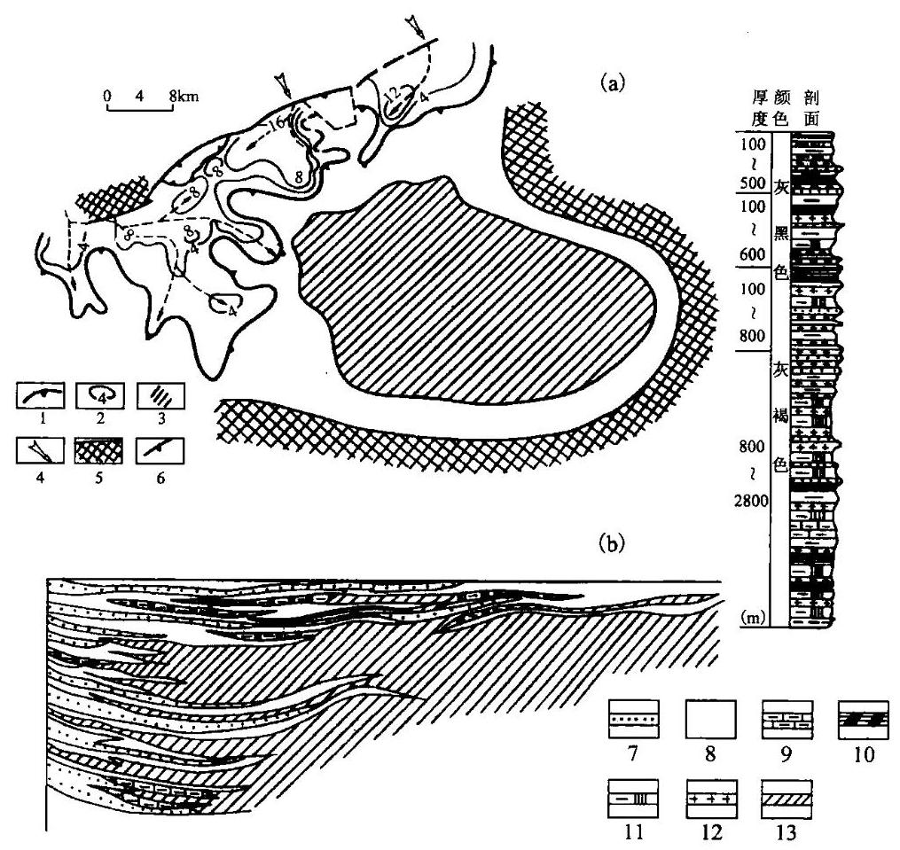

图 8-32 江汉盆地渐新世早中期 (潜江组四段) 盐湖沉积分布图 (据江继刚, 1981)

(a) 潜江凹陷潜四油组沉积体系示意图; (b) 潜江凹陷潜江组北西一南东向岩性剖面图 1一砂岩尖灭线; 2-砂岩等厚线; 3-膏盐; 4-沉积物源; 5-剥蚀区; 6-断层; 7-一砂岩; 8 - 泥岩; 9 - 泥灰岩; 10 - 油页岩; 11 一烃源岩; 12 - 岩盐; 13 一膏盐

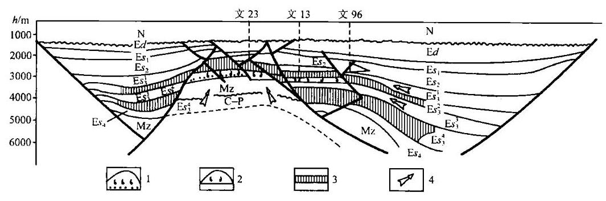

图 8-33 东濮凹陷文留油气藏剖面图

(据朱家蔚等, 1983)

1一油气藏; 2-气藏; 3-膏盐层; 4-聚集方向

<!-- Media -->

## 4. 断层与油气成藏

断层是油气输导层的主要型式之一, 无疑是油气运移的重要通道。但油气田中实际情况是断层常常作为遮挡, 不仅是逆断层, 而且绝大多数正断层具有遮挡性能。

通常情况, 断层发生时对其两侧地层中流体的压力和势均衡状态起破坏作用, 流体 (包括烃类) 将由高势向低势方向运移, 断层起着明显的通道作用。但输导流体 (含油气) 能力的大小和经历时间的长短在很大程度上取决于断层的性质 (挤压或拉张)、断层两侧接触的岩性 (上倾为非渗透性或渗透性岩层)、断层角砾岩和断层泥是否存在, 以及断裂发生的时间。一般挤压断层与拉张断层相比输导流体能力相对弱一些, 时间较短一些; 上倾方向与非渗透性岩层接触时, 仅在断层保持张裂时期存在一定输导能力, 当断层闭合时, 则难以输导流体; 如存在断层泥则输导能力差, 若存在角砾则输导能力强, 而且保持时间亦较长。

但是, 无论具有什么性质和特征的断层, 作为输导流体通道的时间是有限的, 一旦通道闭合或堵塞 (这是必然的), 断层就成为良好的遮挡。这就是为什么在所有油田中看到的断层, 大多以遮挡性质出现的基本原因。因此, 我们说, 断层起通道作用是有条件的, 而且是有时限的; 断层起遮挡作用更为经常, 更为普遍。业已成为遮挡的断层, 在一定条件下也可以再活动, 再次成为油气运移的通道。只有从动态演化的角度, 才能正确认识断层的双重角色。这样才能正确认识到, 断裂既能输导油气, 又能破坏业已形成的油气藏, 同时, 它又与油气聚集有密切关系, 可形成多种与断裂有关的油气聚集带。

## 5. 不整合与油气聚集

世界上有许多重要油气田都与不整合有密切关系。究其原因, 表现在以下方面。

不整合能将非储集层改造成储集层。不整合代表地壳抬升, 遭受风化侵蚀和溶解淋滤, 可以极大改善储集层性质, 甚至将非储集层改造为储集层。

不整合是良好的油气输导层, 能在不连续型烃源岩和储集层之间架设桥梁。如酒泉西部盆地的下白垩统黑色页岩中的油气就是沿着它与志留系之间的不整合面向东运移, 再垂直运移到白杨河 (N) 砂岩中聚集成油气藏的; 阿尔及利亚哈西·迈萨乌德油田寒武系 - 奥陶系砂岩中的石油来自西北的上志留统页岩,两者相距在 ${40}\mathrm{\;{km}}$ 以上,海西期形成的区域不整合面是沟通的桥梁；美国堪萨斯中央隆起上许多寒武系 - 奥陶系碳酸盐岩油气藏的油气源来自阿纳达利坳陷的宾夕法尼亚系烃源岩,两者相距 ${160}\mathrm{\;{km}}$ 以上,时间间隔 ${120} \sim$ ${150}\mathrm{{Ma}}$ ,完全依靠不整合面它们才构成统一的生、储、盖组合,也包括对碳酸盐岩储集层的改造, 才能形成堪萨斯中央隆起上的油气聚集。

不整合面是遮挡面, 可以形成多种与不整合有关的圈闭和油气藏。区域不整合代表大范围的沉积间断, 是地层、岩相的突变界面, 是良好的遮挡面, 可形成众多地层型油气聚集带, 如潜山带、滨岸油气藏带等。

不整合对油气破坏不大。过去常认为不整合抬升和侵蚀作用使其下油气藏遭破坏, 这是一种误解。按照大多数石油晚期生成说, 烃源岩埋深较浅时石油尚未生成, 不可能遭受大的破坏和损失。

综上所述, 不整合对油气聚集起很大促进作用, 破坏性甚少, 是与油气聚集关系极为密切的地质因素。这就不难理解为什么存在众多的与不整合有关的油气聚集带。

但这并不是说, 盆地内不整合愈多油气丰度也愈大。

## 第九章 油气资源评价

油气资源评价是提供油气资源勘探决策的一门科学,它是油气地质综合研究与系统工程技术相结合的产物, 是 20 世纪 50 年代以后发展起来的新型综合性的应用学科, 也是编制油气发展规划的重要依据。本章主要是在已经全面掌握油气藏形成理论的基础上, 简要介绍油气资源的评价概念、层次和方法。

## 第一节 油气资源评价概述

油气资源的勘探与开发具高投入性和高风险性, 高投入性表现为需要花费大量的资金、人力和物力, 高风险性表现为勘探与开发的成功率低。因此, 从业者总是自觉或不自觉地开展油气资源评价。

## 一、油气资源评价的概念

油气资源评价是指计算或分析某一特定区域(小及圈闭, 大至全球)地下油气富集量的过程, 主要回答该特定区域有无油气? 有多少? 分布状况如何? 能否勘探开发? 是否值得勘探开发? 如何进行勘探开发等一系列问题。因此, 油气资源评价是油气地质、勘探开发地质综合研究与系统工程技术相结合的一门综合性很强的应用科学,是油气勘探理论的主要组成部分, 其目的是为油气勘探与开发的规划部署提供科学依据。油气资源评价除涉及现代油气地质理论和勘探开发技术外, 还与数学、地球化学、经济学、系统论、预测学、人工智能和计算机等学科和技术紧密相关。

## 二、油气资源评价的内容

油气资源评价的任务主要是明确特定研究区域油气资源的分布状况及其勘探开发的可行性、效益, 优选勘探开发的目标, 最终确定部署方案, 实现勘探开发的低风险和高效益。

通常情况下, 油气资源评价涉及的问题较多, 因此, 研究的内容也较丰富, 主要包括以下几个方面:

1) 地质背景研究: 包括区域地质背景、盆地构造沉积演化等。
2) 油气成藏条件研究: 包括油气成藏的必要条件和充分条件。
3) 评价方法研究: 包括方法的选择和参数的确定。
4) 油气资源计算: 包括资源预测、资源量计算和资源空间分布。
5) 分析评价目标的勘探风险及主要控制因素。
6) 评价勘探开发技术的可行性和经济效益, 开展不同勘探开发方案的决策分析。
7) 提出优选的勘探开发部署建议。

## 三、油气资源评价的对象

当前广泛开展的油气资源评价工作中, 主要是以下列几种油气作为研究对象:

1) 原油 (Crude oil): 指在地下天然储集层中以液态存在的那一部分烃类, 在大气压力、温度条件下仍为液体。原油中可能含少量的非烃类液体。
2) 天然气 (Natural gas): 在地下天然储集层中以气态或溶于原油中的状态存在的烃类, 在大气温度、压力条件下仍为气体。包括:

a. 伴生气 (Associated gas): 指与原油接触或溶于原油的天然气, 如气顶气、溶解气等。

b. 非伴生气 (Non-Associated gas): 指在地下储集层内不与原油接触的天然气。

3) 天然气液 (Natual gas liquids): 天然气在分离器、油田地面设备或气体工厂中回收的那部分烃类液体, 包括乙烷、丙烷、丁烷、戊烷、天然气油和凝析油, 也可能含少量的非烃类。天然气液又可细分为以下三类：①气厂产品；②液化石油气；③凝析油。

除上述几种油气作为研究对象外, 还有如煤层气、致密页岩气和固态气水合物等非常规油气等评价对象。

## 四、油气资源评价的特点

油气资源评价是在现代技术条件下, 运用多学科、多手段、多方面的资料成果和信息, 在系统工程分析条件下, 以油气地质研究内容为主线, 对油气的过去、现在和将来状况的综合研究。

1) 资源评价是对地质学和油气地质学研究的高度综合。资源评价的研究对象是具体的地质单元或单元体系 (诸如盆地、含油气系统、区带、圈闭等), 只有从油气生成、运移、聚集、保存和生储盖条件配套研究等分析出发, 才能找到油气生成量、失效量、排聚量、保存量以及有效圈闭发育的一般规律。简单地说, 若要研究这些基本的油气地质特点就必须从盆地形成、发展、演化以及存在现状出发, 这些又是构造、地层、流体、温压热场和动力场研究的基本范畴, 它几乎容纳了地质学和石油与天然气地质学的全部内容。因而, 油气资源评价也有利于促进其他相关学科的发展。
2) 资源评价离不开各相关学科的共同支持。资源评价发展的规律性要求其本身必须在发展与应用过程中不断吸纳其他有关学科的理论精髓, 通过在应用过程中的适应改造而最终成为自身组构的有机部分。资源评价技术目前已发展成为知识面广泛、多学科交叉渗透、实践与理论结合紧密的综合研究技术。以计算机技术为例, 油气资源的准确评价得益于现代计算机技术的发展, 而资源量计算又促进了地质建模与数学分析方法的改进, 促进了人工智能、专家系统、仿真模拟以及条件模拟技术的高速发展。
3) 资源评价是勘探开发与决策规划之间联系的纽带和桥梁。资源评价是对石油勘探开发工作与成果的阶段性总结和归纳, 综合反映了各个学科的研究水平、勘探开发进展和资源分布现状、规律与风险概率等, 因此它同时也是评价对象进一步研究、工作计划安排、工作量测算、经济分析、整体可行性研究、勘探开发方案合理规划以及策略制订的参考标准。它在专业技术研究和系统决策规划之间起到了有效的沟通作用。
4) 资源评价本身是一套逻辑严密的思想方法体系, 在石油与天然气地质学中起着不可忽视的积极作用。由于它具有及时性、针对性和评价结论的螺旋上升性, 所以一直是指导油气勘探实践的有效依据, 也是油气藏发现的重要方法和手段, 各国均把资源评价工作放在了重要位置。

## 五、总体思路及一般程序

油气资源评价贯穿于油气勘探全过程, 即不管是勘探程度很高的地区, 还是勘探程度很低的地区, 不管勘探对象是小(比如一个小断块圈闭)是大(比如一个盆地乃至全球), 其勘探工作中都必须把油气资源评价工作放在第一位。对于新区, 是为了尽可能回避高风险目标, 提高勘探成功率和效益, 做到有目的、有计划地开辟新的勘探领域, 建设和培育后备接替基地; 对于老区, 则是尽可能减少勘探开发工作量的浪费, 降低成本, 提高整体效益。

油气资源评价总体思路不是固定不变或简单划一的, 也不存在处处实用的一般工作程序。评价工作的组织者不同, 评价的目的和要求就不同; 评价工作实施者经验不同, 风格不同, 所采取的思路、方法技术也就有所不同; 评价工作针对不同的对象, 应采取不同的思路和程序。

通常情况下, 油气资源评价的组织者可分为三类, 一是国际组织, 二是国家 (往往某一主管部门代为组织), 三是石油公司及其下属单位。与之相对应, 油气资源评价也就分出国际、国家和石油公司三个层面。

对于国际层面的油气资源评价,主要是通过有关会议组织有关专家进行全球油气资源评价与论证; 也可由某一国际组织不定期地开展油气资源评价工作, 如 CCOP 于 1987 年 -1991 年开展的 “东亚沉积盆地分析” 项目, 即组织中国等 8 个成员国对东亚陆地及近海地区主要沉积盆地的油气资源进行了评价；也可由某一非国际机构或有关专家开展油气资源评价工作, 如美国地质调查局 (USGS) 2000 年公布了其对全球油气资源评价的结果, 前苏联专家古勃金 (1937) 对世界油气资源评价进行了粗略估算。总体上讲, 国际层面的油气资源评价已由原来的成因法 (以盆地或凹陷为单元) 向总含油气系统法 (以含油气系统为单元) 深化, 评价精度和结果可靠性有所提高, 但无论采用什么方法, 其评价的结果均主要反映在当时认识程度下全球资源总量、分布规律及未探明油气资源潜力, 为国际、地区和国家能源结构调整、能源政策的制定和充分利用国际资源提供依据和方向。

对于国家层面的油气资源评价, 一般是由某一代表国家利益并行使油气资源管理权的机构组织人员实施。如 ${1992} \sim  {1994}$ 年由当时的石油天然气总公司和海洋石油总公司组织 24 个单位数百名专家开展了第二次全国油气资源评价工作。国家层面的油气资源评价, 其目的是准确掌握国家油气资源状况, 特别是剩余油气资源分布及品质、勘探开发技术可行性, 为制定国家能源政策, 促进国家油气资源的有效管理和利用, 促进国家工业布局优化和国民经济可持续发展, 保障国家安全提供保证, 为国家制定长远规划提供依据。

对于石油公司层面的油气资源评价, 一般是由公司内部专门机构实施, 也可聘请外部咨询机构和有关专家实施。总体上讲, 石油公司是以盈利为目的, 所以其油气资源评价一般规模不大, 主要是针对自己拥有矿权的区块和将要争取矿权的区块, 从资源总量、资源分布状况、资源品质、技术经济可行性、效益等方面进行全面的系统的分析与评价优选目标和方案。

上述表明, 国际层面和国家层面油气资源评价比较相近, 均以弄清油气资源总量分布规律、剩余非探明资源状况和勘探技术可行性为主要目的。而石油公司层面油气资源评价则不同, 其主要的目的不仅是确定油气资源状况和勘探技术可行性, 而且特别关注油气资源的品质、勘探开发成本及经济可行性、分析经济效益, 优选方案等。相应地, 油气资源评价的总体思路及工作程序也有所不同。

## (一) 国家和国际层面

国家和国际层面油气资源评价的范围广阔, 对象复杂, 又往往是大兵团作战, 因此其总体思路是以盆地为基本评价单元, 在先进的大地构造理论和油气地质理论指导下, 开展区域地质背景研究和盆地类型划分与对比, 编制相关基础图件, 用统一的原则和方法进行资源评价和资源汇总 (图 9-1)。

其主导思想: 一是 “动态跟踪”, 即每次油气资源评价, 不管其方法多么先进, 均不可完全准确地预测油气资源量和其分布, 达不到一劳永逸的效果, 更何况油气资源概念本身就是一个可随时变化的概念, 人类对成藏模式、成藏条件的认识也是逐渐变化, 逐渐逼近真理的, 所以每隔一段时期, 由于成盆、成烃、成藏理论的更新, 各地区勘探开发程度和研究程度加深, 新成果、新认识的不断出现, 故要求进行新一轮油气资源评价, 以紧跟勘探开发形势和人类的认识水平。二是 “抓大放小”, 在全国乃至全球的资源评价中, 理论上所有盆地都应评价, 但实践上办不到, 也没有必要。勘探实践, 少数富油大盆地的油气资源在全国乃至全球油气资源中所占比例很大。因此, 评价中只要抓住这些富油的大盆地, 适当兼顾中型盆地, 就能基本上弄清全国乃至全球的资源总量和分布状况, 而对占多数的小盆地没有必要进行评价, 至少没有必要投入大量人力物力进行精细评价。三是 “求同存异”, 就是要在评价中, 建立统一的评价原则, 选择统一的技术方法, 确定统一的参数取值原则, 以利于结果的进一步汇总和开展对比分析。对于盆地间成藏模式之差异性等, 尽可能化小或忽略。

<!-- Media -->

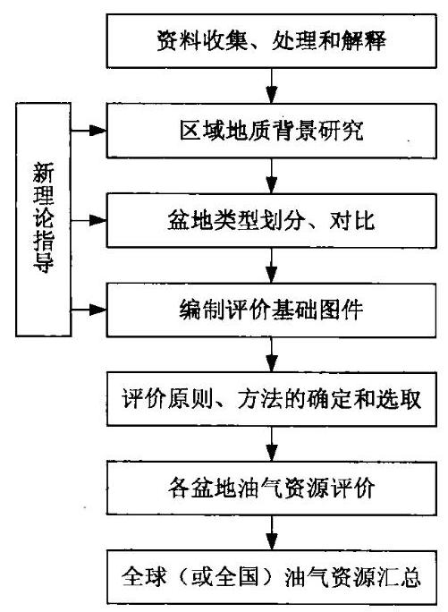

图 9-1 国家和国际层面油气资源评价流程略图

<!-- Media -->

在这个层面的油气资源评价中, 通常的工作程序是:

第一步: 组建评价专家班子。

第二步: 讨论确定评价的目的、要求和结果的用途。如评价目的是预测中期 $(5 \sim  {10}$ 年), 还是长期 (10 年以上) 油气资源勘探开发潜力; 评价对象仅为常规油气资源, 还是包括了非常规油气资源; 评价范围是全球还是某一特定区域; 要求的精度是高是低; 结果是用于建立油气资源信息库, 还是用于制定能源政策或能源发展规划。

第三步: 明确指导思想, 制定实施计划。

第四步: 召开学术讨论会, 组织相应技术培训班, 规范术语, 统一评价原则、评价方法及参数选取方法。

第五步: 资料收集整理, 编制基础图表。

第六步: 开展盆地分析和含油气系统分析。

第七步: 选取参数, 进行各盆地油气资源评价。

第八步: 进行质量控制, 对各盆地评价过程和结果进行分析, 改进参数选取方法, 提高结果可靠性和可比性。

第九步: 汇总, 并进行可靠性分析, 进行与上次油气资源评价结果的对比分析。

## (二) 石油公司层面

石油公司层面油气资源评价的范围局限, 目标明确, 评价的目的多种多样。但总体看, 评价的精度较高, 结果的可靠性要求较高, 而且评价中基本上都要进行经济可行性分析和决策分析。

评价的总体思路是以勘探层 (Play, 也称区带, 下同) 和勘探目标为基本评价单元, 在含油气盆地和含油气系统分析基础上, 应用先进成藏理论为指导, 先进的技术(甚至包括油藏描述、储层建模及可视化技术)为工具, 对典型油气藏进行深入细致的解剖, 建立成藏模式并进而建立评价模型, 从含油气性 (地质风险) 和资源量、资源品质诸方面开展资源评价, 进而开展勘探开发技术可行性分析和经济效益分析, 进行决策分析, 筛选有利目标和方案, 提出勘探部署建议, 该评价结果和建议在经勘探实践检验, 并将勘探结果等信息反馈给评价人员, 以便及时对评价工作进行修正, 改进评价模型, 使评价结果逐渐逼近客观实际 (图 9-2)。

<!-- Media -->

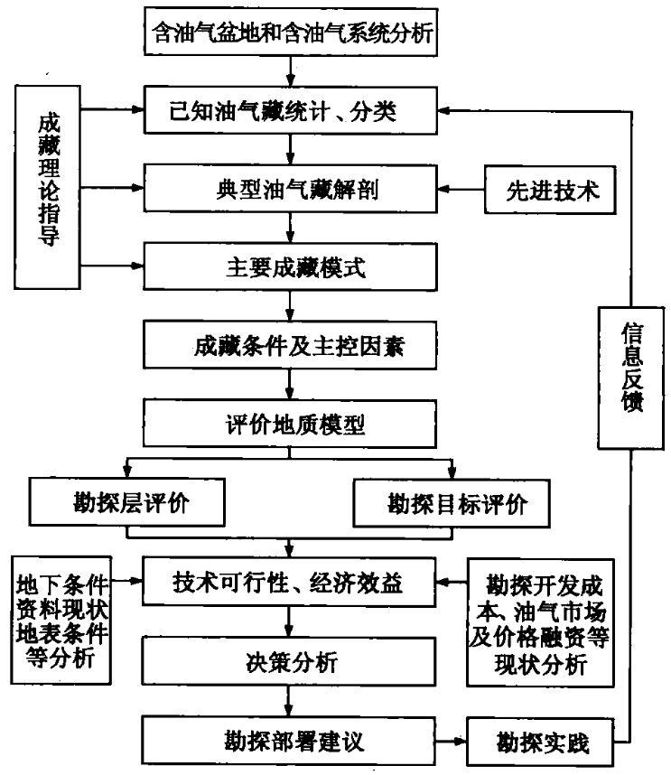

图 9-2 石油公司层面油气资源评价流程略图

<!-- Media -->

其主导思想: 一是 “具体问题具体分析”, 即认为不同勘探层、勘探目标所处地质背景、演化史不同, 其本身的地层和构造的特点不同, 成藏条件和成藏模式、主控因素也不同, 相应的评价侧重点、评价模型也应不同, 因此要在解剖典型油气藏、总结成藏模式和成藏条件基础上建立具体的评价模型, 以确保评价结果的可靠性和精度。二是 “量力而行”, 并非所有油气资源现在都能拿出来, 我们应从油气资源在地下所处条件、公司现有地震、钻井、固井、测井、测试、储层改造与保护、采油、储运等技术两个方面分析油气资源勘探开发的技术可行性, 筛选可行的勘探层和勘探目标以进行下一步评价。三是 “斤斤计较”, 即要从风险、勘探开发投入与产出、融资渠道、油气市场走向和价格波动趋势等诸多因素分析经济效益, 筛选有利可图的勘探层、勘探目标及其相应的部署方案, 尽可能使勘探开始回避风险, 获得效益。

基于各石油公司在油气资源评价方面的概念、目的、思路、技术方法和指标等不同, 因而它们在评价的程序方面也千差万别, 故很难总结其通用的工作程序。

## 第二节 油气资源评价层次及其方法

目前世界上流行的油气资源评价一般按含油气大区、盆地 (凹陷)、区带和圈闭四个层次建立评价程序, 对各个层次的油气资源分别进行评价。由于各个层次的规模、对象不同, 评价的内容、要求和方法也不同。在油气资源评价中, 一般是以盆地为单元, 以区带 - 圈闭为重点, 以含油气层系为中心, 通过地质评价、油气资源计算、经济分析和决策分析等环节来完成。本教材侧重地质评价和油气资源计算的基本内容和方法的介绍。

## 一、含油气大区评价

各个国家为了制定国家油气资源的战略方针和策略, 往往在全国范围内划分出若干个评价区。我国在第一次全国油气资源评价中, 以油气地质特征和分布规律为基础, 结合行政区划、经济地理条件和能源供销规划配置, 将全国划分为东北区、华北区、河淮区、南方区、西北区、青藏区和海域七个评价区。

含油气大区可以是一个大的地质构造单元, 也可以是一个地质、地理甚至与行政区划有关的单元, 还可以指一个巨型盆地或一群盆地, 这些盆地在地质成因结构或含油气层系上具有一定相似性, 也可以是石油经济地质有共性的地区。

含油气大区评价是一个石油大国或大的跨国公司为制订远期勘探规划而提出的, 其目的在于分析含油气大区的含油气特征与对比选择。含油气大区评价的主要内容包括石油地质综合研究、资源量预测和经济决策分析三部分。

## 二、盆地评价

盆地评价是区域性评价的基本单元, 是国家或石油公司为制定中期战略规划而进行的评价工作。盆地评价研究是在含油气大区研究的基础上进行的, 盆地资源评价是在对盆地环境、盆地基本特征 (构造、沉降、沉积等)、盆地演化等地质分析的基础上, 研究盆地的构造史、沉积史、生烃史及聚集史, 建立地质模型并求取相关的评价参数, 估算油气资源量。

目前油气资源的估算一般是通过资源评价系统来实现的, 而不是由单一的方法完成。 其主要途径是统计模拟、数字模拟、专家系统三类。常用的盆地资源评价方法可分为体积法、地球化学法、勘探效果分析法及类比法四大类。

## (一) 体积法

体积法主要包括体积丰度法、体积速度法和体积累加法。体积丰度法就是将资源量作为盆地面积、沉积岩厚度和丰度系数的函数, 具体运算过程中将盆地按不同的地层单元、 不同的深度单元详细划分为区块, 进行细小区块的资源量估算; 体积速度法是根据盆地内油气资源量与盆地内沉积物充填速度(体积速度)的函数关系对油气资源量进行估算; 体积累加法是由圈闭开始, 以区带为单元分别估算各级资源量, 最后累加成为盆地的资源量。

## (二) 地球化学法

地球化学法在解决油气资源的估算中占有重要地位。资源评价的地球化学法是从生烃量计算入手进行资源量估算, 其研究途径是从生烃量到排烃量再到聚集量。目前生烃量计算的方法很多,其中最常用的方法主要有氯仿沥青 $\mathrm{A}$ 法、干酪根降解数学模型、数字化积分法和热模拟法等。

## (三) 勘探效果分析法

勘探效果分析法是建立在实际资料的基础上, 以历史资料为基础的一种经验外推法。 这类方法主要适用于勘探程度较高的地区。目前勘探效果分析法主要包括经验外推法、油田规模序列法、储产量分析法等。

经验外推法是在一个盆地发现高峰已经过去, 随着储量发现时间或钻井进尺的累积量增长, 而呈现出下降趋势的曲线, 据此曲线推测油气资源量; 油田规模序列法是根据自然现象的概率分布特征估算资源量；储产量分析法是一种利用累计发现量与累计生产量之间的关系, 求得最终累计发现量的方法。

## (四) 类比法

类比法是一种常用的方法, 它可用于盆地范围内的类比, 也可用于一口井甚至某些实验数据的类比。类比法主要包括类比系数法、评分法、比分法等, 此类方法适用于任何勘探阶段和地质条件。

类比法的基本过程是首先在已知区建立石油资源定量模型, 然后寻找在地质格局上类似于已知区的地区, 最后用已知区的定量模型外推到评价区, 从而估算出评价区的资源储备。

## 三、区带评价

区带是盆地的同一区域内有相同成因联系的所有圈闭或潜在勘探目标的总和, 是盆地内油气聚集的基本场所, 是为适应局部的油气勘探和评价而产生的过渡性地质单元。从规模范围上考虑, 它介于盆地 (或坳陷、凹陷) 与圈闭之间。因此, 区带可以进一步描述为存在于盆地同一构造带中, 具有相同成因联系和油气生、运、聚规律并在地域分布上相邻的一系列圈闭与已发现油气藏 (田) 的统一组合。其中的圈闭或油气藏可以具有不同的地质特点, 或以一类为主, 或几类相互组合。它们可以在平面上形成带状或块状, 在剖面上交错叠加。

区带评价是盆地勘探发展到一定阶段后自然产生的、适宜于局部评价和预测的分析方法, 它有利于提高对评价对象分布规律以及资源量和储量分析预测的准确性, 有利于勘探区块选择和规划部署。区带分析方法已在油气勘探评价中得到了广泛的应用, 是石油公司具体操作和把握的基本方法。

我国对区带的研究由来已久, 目前认为区带的具体形式有二级构造带、局部构造组合带、有利砂岩储集带以及复式油气聚集 (区) 带等。从成因类型分析, 区带有构造型和地层型两种, 构造型区带主要依赖于盆地的构造背景和构造演变史, 是盆地勘探中最容易圈定、分布最广泛的基本类型。地层型区带则主要依赖于盆地地层发育背景和构造一地层沉积演变, 在盆地勘探中具有隐蔽性的特点。两种类型区带在盆地中通常形成复杂组合。

区带评价研究是在盆地研究的基础上进行的, 同时又丰富和充实了盆地研究。区带评价除了要研究勘探区带所处的区域构造位置、沉积特点、地质演化史、生储油特征外, 还必须指出有利的含油气区带圈闭的个数、层位以及圈闭规模和资源的分布概率。

区带研究的内容包括区带构造评价、区带生烃评价、储集层和盖层评价以及勘探效果研究。构造研究的基础是区域地层, 在地层对比研究的基础上, 进行构造模式的研究和评价。生烃研究是根据有机地球化学理论, 通过对评价区带的沉积相和有机质丰度、类型、 成熟度的相关研究, 建立有机地球化学剖面, 估算生烃量和排烃量。

依据区带对油气聚集的特殊性和资源量计算的精度要求, 目前应用于区带资源量计算的方法主要是圈闭体积法、生一供烃单元法和发现过程模型法。

1) 圈闭体积法。基本原理是对区带内所有圈闭按体积进行资源量计算, 然后加总求和得到区带资源量。对区带资源量计算影响较大的因素包括了资料条件和地质条件两种, 两者共同构成了风险分析要素。因此资源量计算应按油气聚集类别、圈闭落实程度和圈闭条件依次进行计算, 分别乘以不同的条件系数, 然后加总并乘以可采系数, 最后得到区带分类的可采资源量总和, 若乘以风险分析系数则得到风险资源量。
2) 生一供烃单元法。基本原理是认为含油气层系范围以内所生成的烃类将就近运移聚集于含油气区带内。根据地质构造或沉积发育所划分的供烃面积单元, 按其生烃量计算所得的聚集烃量即为资源量。这种方法应用的关键问题是对有效的生 - 供烃面积单元进行合理划分和界定, 然后运用概率模型分析方法对源岩的生、排、供烃量进行预测研究, 计算分析不同条件概率下的油气资源量。
3) 综合分析法。应用不同的方法和手段, 将区带作为基本的地质评价单元进行资源量计算, 其中可以包括区带类比分析法、地质条件分析法和发现过程模型法等。其中, 发现过程模型法综合运用了区带内已知圈闭和油气藏的资料, 建立了发现模型并作了理论推论, 目前已为美国和加拿大的许多大石油公司普遍采用, 国内应用也得到了较大范围的推广。

区带综合评价是在区带油气地质条件分析、资源量计算、地表地质条件等分析的基础上, 进行经济评价, 其结果作为勘探部署的依据。常用的评价标准如表 9-1 所示。

<!-- Media -->

表 9-1 区带综合评价标准

<table><thead><tr><th colspan="2">级别 指标</th><th>一级 $1 \sim  {0.75}$</th><th>二级 ${0.75} \sim  {0.50}$</th><th>三级 ${0.50} \sim  {0.25}$</th><th>四级 ${0.25} \sim  0$</th></tr></thead><tr><td rowspan="2">烃源岩</td><td>厚度 $/\mathrm{m}$</td><td>$> {500}$</td><td>${500} \sim  {300}$</td><td>${300} \sim  {100}$</td><td>$< {100}$</td></tr><tr><td>类型</td><td>I 型为主</td><td>II 1 型为主</td><td>${\mathrm{{II}}}_{2}$ 型为主</td><td>II 型为主</td></tr><tr><td colspan="2">储集层</td><td>【、 II 类为主</td><td>II 、 III 类为主</td><td>III、IV类为主</td><td>IV. V类为主</td></tr><tr><td rowspan="2">盖层</td><td>区域 $/\mathrm{m}$</td><td>$> {500}$</td><td>${500} \sim  {300}$</td><td>${300} \sim  {100}$</td><td>$< {100}$</td></tr><tr><td>直接 $/\mathrm{m}$</td><td>$> {20}$</td><td>${20} \sim  {10}$</td><td>${10} \sim  5$</td><td>$< 5$</td></tr><tr><td rowspan="3">日标</td><td>类型</td><td>背斜构造 (带)</td><td>断裂构造 (带)</td><td>混合圈闭 (带)</td><td>地层 - 岩性 (带)</td></tr><tr><td>面积 $/{\mathrm{{km}}}^{2}$</td><td>$> {50}$</td><td>${50} \sim  {30}$</td><td>${30} \sim  {10}$</td><td>$< {10}$</td></tr><tr><td>闭合度 $/\mathrm{m}$</td><td>$> {300}$</td><td>${300} \sim  {200}$</td><td>${200} \sim  {100}$</td><td>$< {100}$</td></tr><tr><td rowspan="2">配套</td><td>生储盖组合</td><td>好</td><td>较好</td><td>一般</td><td>差</td></tr><tr><td>圈闭形成期 与排烃期</td><td>好</td><td>好</td><td>差</td><td>差</td></tr><tr><td colspan="2">含油气情况</td><td>见商业油气流</td><td>获低产油气流</td><td>见油气显示或油 气苗</td><td>无显示</td></tr><tr><td colspan="2">圈闭落实程度</td><td>落实</td><td>较落实</td><td>待落实</td><td>不落实</td></tr><tr><td colspan="2">勘探深度 $/\mathrm{m}$</td><td>< 2500</td><td>${2500} \sim  {3000}$</td><td>${3000} \sim  {4000}$</td><td>$> {4000}$</td></tr><tr><td rowspan="2">预测资源 量/亿吨</td><td>区带</td><td>$> 1$</td><td>$1 \sim  {0.5}$</td><td>${0.5} \sim  {0.1}$</td><td>$< {0.1}$</td></tr><tr><td>目标</td><td>$> {0.5}$</td><td>${0.5} \sim  {0.1}$</td><td>0. $1 \sim  {0.05}$</td><td>$< {0.05}$</td></tr><tr><td colspan="2">地面条件</td><td>好</td><td>较好</td><td>较差</td><td>较差</td></tr></table>

<!-- Media -->

## 四、圈闭评价

圈闭评价是各级油气资源评价中最具体、最实际的工作, 也是勘探阶段的最终目标, 其目的在于拟定探井井位, 直接发现油气田。圈闭评价是从盆地评价优选出的有利含油气区带进行圈闭准备开始, 到圈闭预探获得商业性油气流过程中使用的综合性勘探评价方法。它以油气成藏理论为依据, 以计算机为手段, 以勘探数据库为依托, 充分利用地面物化探资料、井筒资料和综合研究资料, 进行圈闭石油地质综合评价、资源量估算、圈闭优选、待钻圈闭的精细描述, 并提出预探井部署设计意见以及钻探圈闭的反馈评价。随着资料的增加、认识的深化, 圈闭评价是在滚动中完成的。圈闭评价的目的是为编制勘探计划提供依据, 指导预探井部署, 提高圈闭预探成功率。

圈闭评价可划分为三个阶段: 圈闭识别、圈闭优选和圈闭精细描述。

1) 圈闭识别以盆地评价优选出的有利含油气区带为对象, 整体部署设计测网, 开展地震勘探及其他物化探工作, 进行圈闭准备; 以圈闭准备获得的地震资料为主要依据, 划分圈闭序列, 识别可能存在的所有圈闭, 并确认其可靠程度。
2) 圈闭优选是对识别出的各类圈闭, 进行石油地质综合分析、资源量估算和经济评价, 根据分析、评价结果, 进行圈闭综合排队, 优选出有利的圈闭。
3) 圈闭精细描述是对优选出的有利圈闭, 进行精细描述, 提出预探井井位部署设计意见, 并对钻探圈闭进行反馈评价。

圈闭评价内容一般主要包括圈闭风险分析、圈闭可采储量估算、圈闭经济评价等几个方面。

1) 圈闭地质风险分析的主要目的是判断一个圈闭是否含有油气。目前采用的方法主要有地质风险概率分析法、模糊数学评价法、圈闭综合评价系数法、风险矩阵法等, 考虑的主要因素有资料可靠程度、烃源岩、储集层、盖层及配套史几个方面。各个因素又可以分解为若干个定量描述的子因素。现行使用的地质风险评价在评价内容、方法上都有比较统一的规范和技术, 对地质评价参数的定量取值标准有统一的定量分级评价标准。在地质评价过程中, 对具体地质因素的好坏分析较多, 对所用地质资料把握程度的分析还须加强。在圈闭风险分析过程中, 要特别重视资料置信度对评价结果的影响。
2) 圈闭可采储量估算一般采用统计法, 根据类比确定一个储量丰度, 然后计算圈闭可采储量。计算的关键依赖于圈闭描述的精度和圈闭地质参数的精度。
3) 圈闭经济评价是油公司决定对圈闭是否进行勘探的最主要指标。采用的方法主要是财务经济评价, 整个评价过程中考虑的因素比较多, 如圈闭勘探的地理 - 地质条件、目的层埋深、工作量与资金投入、预期产能及效益分析等, 所有的因素均能折算到成本或收益, 最终能得出不同时期净现值、投资回报率等。在经济评价过程中, 还应特别重视参数敏感性分析, 参数敏感性分析包括经济评价过程中所用参数可能的变化范围以及资源量政策的稳定性、政治因素等。常用的方法有圈闭勘探投资分析、圈闭预探效益分析、圈闭预探优先排序等。

## 第三节 油气资源评价系统

油气资源评价系统以地质概念模型为基础, 通过对各种定量参数的分析研究, 用数学模型或者用推理求解的办法 (以计算机软件的形式出现), 针对各种勘探目标进行评价, 使其逼近客观实际, 以求得评价的系统性结果。目前油气资源评价系统大都从统计模拟、 数字模拟和人工智能专家系统等三个途径入手。不同级别的评价目标或对象采用不同的评价系统。下面简要介绍盆地评价、区带评价和圈闭评价油气资源评价系统。

## 一、盆地评价系统

盆地评价系统中的统计模拟系统曾得到广泛的应用。20 世纪 80 年代以来, 盆地数据模拟和人工智能专家系统得到了迅速发展。中国石油勘探开发研究院对盆地油气资源评价主要采用成因法、类比法和统计法三大类方法, 盆地总资源量的最终确定采用加权特尔菲法综合确定 (图 9-3)。该盆地评价系统主要内容即包括上述三类方法, 其主要功能是在盆地油气地质条件和地质参数深入研究的基础上, 通过软件系统的模拟分析确定盆地的地质资源量和可采资源量, 分析盆地资源的时空分布, 预测有利的运聚单元, 为下一步区带评价提供必要的参数及地质依据。

<!-- Media -->

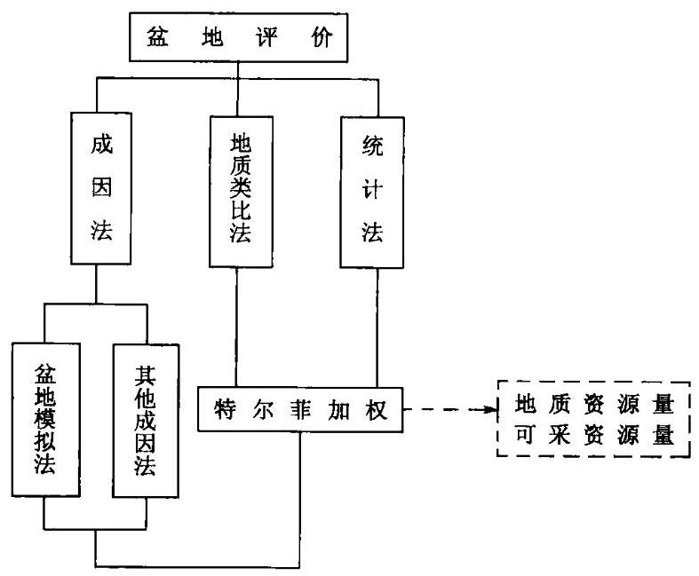

图 9-3 盆地评价系统流程图

<!-- Media -->

## (一) 盆地统计模拟

这一系统就是应用圈闭 $\rightarrow$ 区带 $\rightarrow$ 盆地逐级加总的办法,对全盆地的总资源进行估算。 可以根据地质条件和勘探目标选择不同的方法 (如体积法、地球化学法和经验外推法等), 对估算结果进行分级分类汇总与排队, 在统计中主要采用蒙特卡洛法。

## (二) 盆地数值模拟

盆地数值模拟系统主要从盆地油气地质成因机制出发, 将油气生成、运移、聚集作为统一的整体, 充分研究各项地质参数, 建立数字化动态模型, 并编制相应的应用软件, 对盆地油气资源进行模拟 (图 9-4)。这项技术是在 20 世纪 70 年代发展起来的, 目前已有多套评价系统, 如法国石油研究院 (IFP, 1987) 的 MATOIL 地质地球化学和数字模拟系统等。 80 年代末至 90 年代初, 中国石油勘探开发研究院石广仁等研制成了 BAS1、2、3 盆地模拟系统, 最近该院计算所研制完成了油气资源评价系统 (Petroleum Assessment

System), 简称 PASYS, 已在国内得到广泛应用。

<!-- Media -->

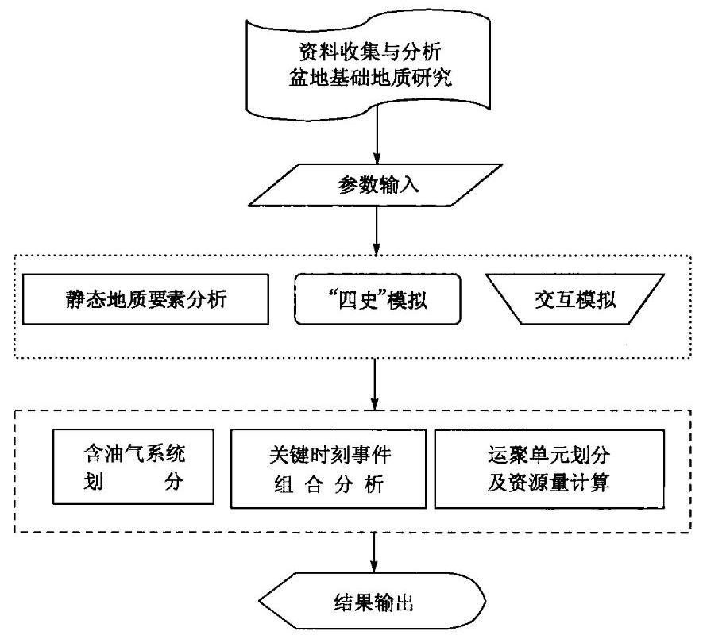

图 9-4 盆地数值模拟结构示意图

<!-- Media -->

盆地数字模拟系统一般包括地质模型与数学模型两部分。地质模型是地质学家对评价目标的地质概括, 它是盆地模拟的基础, 主要由地史模型、生烃史模型和聚集史模型三部分组成。建立了地质模型后, 根据油气地质的基本原理, 设计各种能反映地质概念的数学模型, 并通过地质定量参数来表达。

## (三) 盆地评价专家系统

专家系统的要点是把专家在解决问题过程中的知识或经验, 以适当的方式存入计算机, 建立一个搜集许多专家经验的知识库及相应的推理系统, 在解决具体问题时, 可根据其所提供的信息, 运用知识库和已确定的模式进行推理, 以达到评价的目的。1990 年海洋石油勘探开发研究中心和吉林大学共同研制了应用于重点坳(凹)陷油气资源评价的 PRES 系统。该系统由凹陷评价和局部圈闭评价两部分组成, 通过地质类比方法对凹陷生油条件和储集条件进行评价, 根据凹陷生油、储集层评价结果模拟二次运移, 确定有利区带。在此基础上评价局部圈闭, 给出局部圈闭的类别和地质风险。最后再应用体积法、氯仿沥青 $\mathrm{A}$ 法、圈闭体积法、油田模型法、油田规模序列、热模拟计算生油气等六种定量计算方法计算资源量。

## 二、区带评价系统

区带评价是对局部地区的评价, 目前采用的主要是统计模拟方法。以下就目前国内外常用的评价系统作简要的介绍。. 278 .

## (一) GSC 系统

GSC 系统已在加拿大和世界上其他许多盆地的区带评价中得到应用, 其具体评价步骤是: ①油藏规模概率分布的估算; ②油藏个数分布的估算; ③单个未发现油藏规模的估算。该系统所用的方法包括: ①超级母体或有限母体的基本原理; ②发现过程模型; ③选用对数正态油藏规模分布。发现过程模型的统计假设是: ①已被发现油藏的概率与其规模成正比, 并且抽样是不可放回去的; ②应用超级母体概念, 油藏规模选择了对数正态分布, 油藏估算采用了一般的体积公式, 参数相乘的方式是用蒙特卡洛法完成的。

该评价系统的技术关键在于油气区带正确的地质划分。在区带划分后, 应准备原始数据并输入系统, 计算勘探地质风险与区带中的油藏个数分布, 用勘探发现模型估计油藏储量分布, 预测评价单元中油藏的储量序列, 最后预测区带内总资源量与剩余资源量。

GSC 系统是在正确进行油气区带划分的基础上进行的, 是将发现过程、油藏体积运算、正态分布、油藏规模序列等方法按统一的思路, 有机地结合在一起构成的。这一评价系统在大港油田取得了良好的应用效果。

## (二) Playsys 区带系统

Playsys 区带系统由中国石油勘探开发研究院计算所研制, 其主要功能是针对运聚单元或盆地一、二级构造单元, 采用包括成因法、统计法和类比法在内的共 3 大类 7 种方法, 评价油气资源量及其分布, 建立区带资源序列; 依据地质风险用油气资源分布优选勘探目标。

区带评价工作一般要经过以下五个步骤：①区带资料收集、分析与研究；②区带划分、刻度区选择、刻度区研究等; ③ 区带地质评价、资源量计算、经济评价等; ④ 区带综合评价、优选排队; ⑤钻探与钻后评价 (图 9-5)。

<!-- Media -->

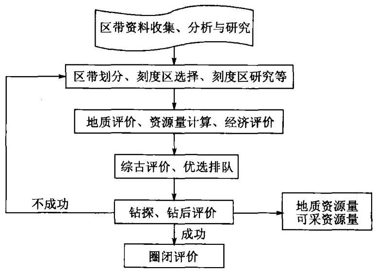

图 9-5 区带评价系统流程图

<!-- Media -->

区带评价的核心, 包括地质评价、资源计算、经济评价、综合评价、优选排队等内容 (图 9-6)。区块评价应当在盆地或含油气系统评价完成以后, 或者与之同时进行。国外通常不设区带评价级别, 而直接进行区块评价。由于区带是地质单元, 而区块是评价单元。因此本次区块评价是在区带评价基础上, 采用资源分割方法求取区块资源量。当区块范围与区带一致或相近时, 不再重复进行区块评价, 而直接借鉴区带评价成果。

<!-- Media -->

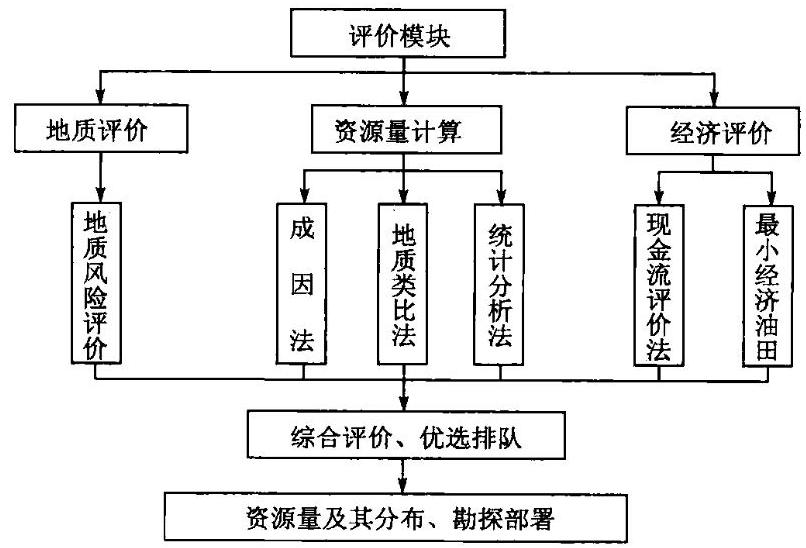

图 9-6 区带评价系统结构示意图

<!-- Media -->

区块评价的内容包括: 区块成藏地质条件分析、区块远景资源量估算、区块经济评价及区块的综合评价与决策分析等。

## 三、圈闭评价系统

圈闭评价系统主要包括圈闭地质评价、圈闭资源估算、圈闭经济评价、圈闭决策分析等。1992 年包世界等开发了一套适用于我国具体情况的圈闭评价系统。该系统具备了圈闭评价的上述四方面的功能, 包括地质评价模块、圈闭资源估算模块、经济评价模块和决策分析模块, 其总体结构如图 9-7。这一系统适用于生产现场对圈闭评价的要求, 也可作为圈闭评价研究工作的主要工具, 并在全国第二轮油气资源评价中得到推广。

<!-- Media -->

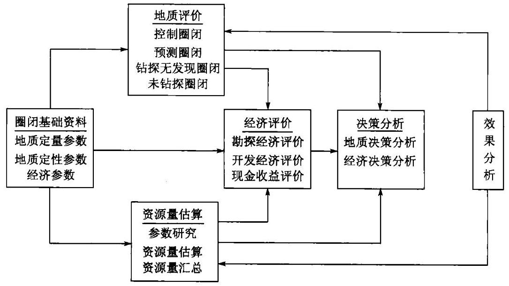

图 9-7 圈闭评价系统结构示意图

(据包世界, 1992)

<!-- Media -->

需要说明的是, 油气资源评价是应用高新技术为国家提供油气资源勘探决策的新兴学科, 其任务、方法及评价系统均处在研究、发展过程中, 因时因地而异, 许多问题尚待解决。目前, 我国正在进行新一轮油气资源套改, 就是在采用新观点、新方法下的油气资源评价。

## 主要参考文献

布罗德, 耶列明科著. 马万钧译. 1958. 石油及天然气地质学原理. 北京: 地质出版社

包茨主编. 1988. 天然气地质学. 北京: 科学出版社

查普曼著. 李明诚, 周明鉴译. 1989. 石油地质学. 北京: 石油工业出版社

查全衡. 1999. 石油天然气资源经营管理基础. 北京: 石油工业出版社

陈发景, 汪新文, 陈昭年等. 2004. 伸展断陷盆地分析. 北京: 地质出版社

陈发景, 田世澄主编. 1988. 压实与油气运移. 武汉: 中国地质大学出版社

陈沪生. 1998. 积极开展无机成因油气领域的勘查——无机成因油气是油气资源战略后备领域. 石油实

验地质, ${20}\left( 1\right)  : 1 \sim  5$

陈荣书主编. 1989. 天然气地质学. 武汉: 中国地质大学出版社

陈荣书主编. 1994. 石油及天然气地质学. 武汉: 中国地质大学出版社

陈景山. 1981. 三角洲沉积与油气勘探. 北京: 石油工业出版社

陈章明等. 1992. 油气圈闭评价方法. 哈尔滨: 哈尔滨工业大学出版社

陈昭年, 陈发景. 1998. 松辽盆地反转构造. 北京: 地质出版社

陈昭年,陈发景,董庸. 1997. 延吉盆地热史分析. 石油与天然气地质, ${18}\left( 2\right)  : {165} \sim  {169}$

陈昭年. 1997. 辽河盆地东部凹陷地热史与油气. 成都理工学院学报, ${24}\left( 4\right)  : {36} \sim  {42}$

陈昭年, 陈发景, 苏俊青等. 2002. 断裂作用对北大港构造带潜山油气藏的控制. 石油与天然气地质,

${23}\left( 1\right)  : {92} \sim  {95}$

程克明, 王铁冠, 钟宁宁等. 1995. 烃源岩地球化学. 北京: 科学出版社

程克明等. 1996. 碳酸盐岩油气生成理论与实践. 北京: 石油工业出版社

戴金星, 裴锡古, 戚厚发. 1992. 中国天然气地质学 (卷一). 北京: 石油工业出版社

戴金星等. 1992. 中国天然气地质学 (卷二). 北京: 石油工业出版社

邸世祥. 1991. 油田水文地质学. 北京: 石油工业出版社

杜奉屏. 1984. 油矿地球物理测井. 北京: 地质出版社

窦立荣等. 1992. 油气藏保存条件研究. 大庆石油地质与开发, ${11}\left( 3\right)  : 6 \sim  {10}$

窦立荣编著. 2001. 油气藏地质学概论. 北京: 石油工业出版社

傅家谟, 刘德汉. 1992. 天然气运移、储集及封盖条件. 北京: 科学出版社

傅家谟, 秦匡宗. 1995. 干酪根地球化学. 广州: 广东科技出版社

费琪, 范士芝, 梅廉夫等. 1997. 成油体系分析与模拟. 武汉: 中国地质大学出版社

甘克文, 李国玉, 张亮成等. 1982. 世界含油气盆地图集. 北京: 石油工业出版社

郭秋麟, 米石云, 石广仁等. 1998. 盆地模拟原理方法. 北京: 石油工业出版

关德师, 牛嘉玉, 郭丽娜等. 1994. 中国非常规油气地质. 北京: 石油工业出版社

关德师, 戚厚发, 钱贻伯等. 1997. 生物气的生成演化模式. 石油学报, 18 (3): 31 %36

胡见义, 黄第藩等. 1992. 中国陆相石油地质理论基础. 北京: 石油工业出版社

胡见义, 徐树宝, 刘淑萱等著. 1986. 非构造油气藏. 北京: 石油工业出版社

郝石生, 陈章明, 吕延防等. 1995. 天然气藏的形成和保存. 北京: 石油工业出版社

郝石生, 张有成, 刚文哲等. 1993. 碳酸盐岩油气生成. 北京: 石油工业出版社

黄第藩, 李晋超等. 1984. 陆相有机质的演化和成烃机理. 北京: 石油工业出版社

黄第藩, 李晋超主编. 1982. 中国陆相油气生成. 北京: 石油工业出版社

黄第藩. 1996. 成烃理论的发展 (I) ——未熟油及有机质成烃演化模式. 地球科学进展, 11 (4):${327} \sim  {335}$

黄第藩等. 1987. 未成熟石油成因的初步研究. 研究年报. 兰州: 甘肃科学技术出版社

黄第藩, 秦匡宗, 王铁冠等. 1995. 煤成油的形成及成烃机理. 北京: 石油工业出版社

亨特著. 胡伯良译. 1986. 石油地球化学和地质学. 北京: 石油工业出版社

华北石油会战指挥部. 1978. 渤海湾地区古潜山油气田. 北京: 石油化学工业出版社

梁狄刚,贾承造. 1999. 塔里木盆地天然气勘探成果与前景预测. 天然气工业, ${19}\left( 2\right)  : 3 \sim  {12}$

李国玉, 吕鸣岗等编著. 2002. 中国含油气盆地图集. 北京: 石油工业出版社

李德生. 1992. 李德生石油地质论文集. 北京: 石油工业出版社

李德生等. 2002. 中国含油气盆地构造学. 北京: 石油工业出版社

李明诚编著. 1994. 石油与天然气运移 (第二版). 北京: 石油工业出版社

李明诚编著. 2004. 石油与天然气运移 (第三版). 北京: 石油工业出版社

陆克政主编. 2001. 含油气盆地分析. 山东东营: 石油大学出版社

李学礼. 1952. 水文地球化学. 北京: 原子能出版社

刘方槐, 颜婉荪. 1991. 油气田水文地质学原理. 北京: 石油工业出版社

刘和甫. 1983. 含油气盆地的地球动力学环境分析. 见: 中国中、新生代盆地构造和演化. 北京: 科学出版社

刘全稳, 陈景山, 王允诚著. 2000. 油气圈闭评价与管理系统. 北京: 石油工业出版社

罗蛰潭, 王允诚. 1986. 油气储集层的孔隙结构. 北京: 科学出版社

吕延防, 付广, 高大岭等. 1996. 油气藏封盖研究. 北京: 石油工业出版社

吕正谋. 1985. 山东东营凹陷下第三系砂岩次生孔隙研究. 沉积学报. 3 (2)

廖永胜. 1981. 应用同位素探讨油气成因. 石油学报增刊

莱复生著. 张更等译. 1975. 石油地质学. 北京: 地质出版社

马贡, 道主编. 张刚等译. 1998. 含油气系统一一从烃源岩到圈闭. 北京: 石油工业出版社

潘钟祥, 高纪清, 陈荣书. 1986. 石油地质学. 北京: 地质出版社

庞雄奇, 付广, 万龙贵等. 1993. 盖层封油气性综合定量评价. 北京: 地质出版社

佩蒂庄, 波特, 西弗著. 李汉瑞译. 1977. 砂与砂岩. 北京: 科学出版社

邱中建, 龚再升. 1999. 中国油气勘探. 北京: 石油工业出版社和地质出版社

钱凯, 马新华, 李景明等. 1999. 中国天然气资源. 北京: 石油工业出版社

任美愕, 刘振中主编. 1983. 岩溶学概论. 北京: 商务印书馆

诺斯著. 高纪清等译. 1994. 石油地质学. 北京: 石油工业出版社

田在艺. 1997. 田在艺石油地质论文选集. 北京: 石油工业出版社

田在艺, 张庆春. 1996. 中国含油气沉积盆地论. 北京: 石油工业出版社

斯宾塞著. 朱志澄等译. 1981. 地球构造导论. 北京: 地质出版社

石广仁. 1999. 油气盆地数值模拟方法 (第二版). 北京: 石油工业出版社

蒂索, 威尔特著. 徐永元等译. 1989. 石油形成和分布. 北京: 石油工业出版社

陶一川. 1993. 石油地质流体力学分析基础. 武汉: 中国地质大学出版社

童崇光主编. 1985. 油气田地质学. 北京: 地质出版社

王尚文, 张万选等. 1983. 中国石油地质学. 北京: 石油工业出版社

王燮培, 费琪, 张家骅. 1990. 石油勘探构造分析. 武汉: 中国地质大学出版社

王涛主编. 1997. 中国天然气地质理论基础与实践. 北京: 石油工业出版社

王允诚. 1993. 油层物理学. 北京: 石油工业出版社

王尚文. 1983. 中国石油地质学. 北京: 石油工业出版社

王启军, 陈建渝. 1988. 油气地球化学. 武汉: 中国地质大学出版社

吴崇筠, 薛叔浩. 1993. 中国含油气盆地沉积学. 北京: 石油工业出版社

吴元燕, 徐龙, 张昌明等. 1996. 油气储集层地质. 北京: 石油工业出版社

武守试. 1994. 石油资源地质评价导论. 北京: 石油工业出版社

邬立言, 顾信章, 盛志伟等. 1986. 生油岩热解快速定量评价. 北京: 科学出版社

邬立言, 丁莲花, 李斌等. 2000. 油气储集层热解快速定性定量分析. 北京: 石油工业出版社

维索次基著. 戴金星, 吴少华译. 1986. 天然气地质学. 北京: 石油工业出版社

徐怀大等编. 1989. 潘钟祥石油地质文选. 北京: 地质出版社

许怀先, 陈丽华, 万玉金等. 2001. 石油地质实验测试技术与应用. 北京: 石油工业出版社

西北大学地质系石油地质教研室编. 1979. 石油地质学. 北京: 地质出版社

徐伟民. 1993. 石油地球化学在油气勘探中的应用. 山东东营: 石油大学出版社

袁政文, 许化政, 王百顺等编译. 1996. 阿尔伯达盆地深盆气研究. 北京: 石油工业出版社

杨志琼等. 1987. 我国若干重质原油的组成及地化特征. 石油学报. 8 (4)

杨绪充. 1993. 含油气区地下温压环境. 山东东营: 石油大学出版社

杨起, 韩德馨. 1979. 中国煤田地质学 (上册). 北京: 煤炭工业出版社

游秀玲. 1991. 天然气盖层评价方法. 石油与天然气地质, ${12}\left( 3\right)  : {261} \sim  {275}$

玉门油田石油地质志编写组编. 1989. 中国石油地质志 卷十三. 北京: 石油工业出版社

曾国寿, 徐梦虹. 1990. 石油地球化学. 北京: 石油工业出版社

中国石油天然气总公司勘探局编. 1998. 石油地质学新进展. 北京: 石油工业出版社

中国石油天然气总公司勘探局编. 1999. 油气资源评价技术. 北京: 石油工业出版社

中国石油学会石油地质专业委员会. 1987. 基岩油气藏. 北京: 石油工业出版社

中国石油学会石油地质专业委员会. 1987. 中国油气藏研究. 北京: 石油工业出版社

中国石油学会石油地质专业委员会. 1986. 天然气勘探. 北京: 石油工业出版社

中国石油学会石油地质专业委员会. 1997. 中国含油气系统的应用与进展. 北京: 石油工业出版社

中国油气聚集与分布编委会. 1991. 中国油气聚集与分布. 北京: 石油工业出版社

翟光明. 1996. 中国石油地质志 (总论). 北京: 石油工业出版社

翟光明. 1996. 我国油气资源与油气发展前景. 勘探家. 1 (2)

翟光明, 宋建国, 靳久强等. 2002. 板块构造演化与含油气盆地形成和评价. 北京: 石油工业出版社

张文昭. 1995. 中国陆相盆地油气勘探实践. 北京: 石油工业出版社

张渝昌主编. 1997. 中国含油气盆地原型分析. 南京: 南京大学出版社

张子枢. 1990. 世界大气田概论. 北京: 石油工业出版社

张厚福. 1998. 石油地质学新进展. 北京: 石油工业出版社

张厚福, 张万选. 1989. 石油地质学 (第二版). 北京: 石油工业出版社

张厚福, 方朝亮, 高先志等. 1999. 石油地质学. 北京: 石油工业出版社

张金亮, 常象春编著. 2002. 深盆气地质理论及应用. 北京: 地质出版社

周怀阳, 彭晓彤, 叶瑛. 2000. 天然气水合物. 北京: 海洋出版社

周中毅, 潘长春. 1992. 沉积盆地古地温测定方法及其应用. 广州: 广东科技出版社

赵旭东. 1984. 石油资源定量评价方法. 北京: 地质出版社

赵重远. 1988. 石油地质学进展. 北京: 地质出版社

赵重远, 刘池阳等. 1993. 含油气盆地地质学研究进展. 西安: 西北大学出版社

曾允孚, 夏文杰主编. 1986. 沉积岩石学. 北京: 地质出版社

赵重远. 1998. 石油地质学发展: 反思和展望. 石油与天然气地质, ${19}\left( 1\right)  : 8 \sim  {13}$

- 284 .

赵文智, 何登发等. 1999. 石油地质综合研究导论. 北京: 石油工业出版社

郑朝阳, 张文达, 朱盘良. 1996. 盖层类型及其油气运移聚集的控制作用. 石油与天然气地质, 17 (2): ${96} \sim  {101}$

朱世新, 宋芝祥, 王定一合编. 1987. 油气田调查勘探与资源评价. 北京: 地质出版社

朱夏. 1982. 中国中新生代油气盆地. 见: 构造地质学进展. 北京: 科学出版社

真柄钦次著. 童晓光, 贾承造译. 1991. 石油圈闭的地质模型. 武汉: 中国地质大学出版社

Allen P A. 1990. Basin analysis - principles and applications. Blackwell Scientific Publi - cations, Oxford London

Athy L F. 1930. Density, porosity and compaction of sedimentary rocks. AAPG Bull, 14 (1) . 1 %24

Ayers Jr W B. 2002. Coalbed gas systems, resources, and production and a review of contrasting cases from the San Juan and Powder River basins,AAPG Bull.,86 (11): 1983 %

Barker C. 1980. Primary migration---the importance of water-organic-mineral matter interactions in the source rock, AAPG studies in geology, (10)

Barker C. 1987. Development of abnormal and subnormal pressures in reservoirs containing bacterially generated gas. AAPG Bull., ${71}\left( {11}\right)  : {1404} \sim  {1413}$

Barker C. 1990. Calculated volume and pressure changes during the thermal cracking of oil and gas in reservoirs. AAPG Bull.,7 (8): ${1254} \sim  {1261}$

Bary C. 1949. The viscisisty of air, water, natural gas, crude oil and the associated gases at oil field temperature and pressure. AIME Trans. Vol. 165

Berg R R. 1975. Capillary pressure in stratigraphic trap, AAPG Bull, 59 (6)

Blttt H. 1979. Diagenetic processes in sandstones, Semp Special pub, (26)

Bowering O J W. 1982. Hydrodynamics and hydrocarbon migration - A model for the Eromaga basin, APEA, 22 , Part. 1

Bradley J S, Powley D E. 1994. Pressure compartments in sedimentary basins: A review, in Basin Compartments and Seals,AAPG Memoir ${61},3 \sim  {26}$

Bruce C H. 1984. Smectite dehydration----Its relation to structural development and hydrocarbon accumulation in Northern Gulf of Mexico basin, AAPG Bull., 68 (6)

Burrus J. 1998. Overpressure models for clastic rocks, their relation to hydrocarbon expulsion; A critical reevaluation AAPG Memoir Deming D. 1994. Factors necessary to define a pressure seal. AAPG Bull, 78 (6): ${1005} \sim  {1009}$

Cant D J. 1986. Diagenetic traps in sandstones, AAPG, 70 (2)

Carmalt S W, John B ST. 1986. Giant oil and gas fields. In; M T Halbouty (ed). Future petroleum provinces of the world. AAPG Memoir ${40}\mathrm{{OK}} : {11} \sim  {53}$

Cartimill J C. 1976. Obscure nature of petroleum migration and entrapment. AAPG Bull, ${60}\left( 9\right)  : {1520} \sim  {1530}$

Chapman R E. 1982. Effects of oil and gas accumulation on water movement, AAPG Bull, 66 (3)

Dickey P A. 1975. Possible primary migration of oil from source rock in oil phase, AAPG Bull, 59 (2)

Dickey P A. 1979. Oilfield waters. In: Petroleum Development Geology ( XI)

England W A, Mackenzie A S, Mann D M and Quigley T M. 1987. The movement and entrapment of petroleum

fluids in the subsurface. Journal of the Geological Society,144: ${327} \sim  {347}$

England W A. 1990. The organic geochemistry of petroleum reservoirs. Organic Geochemistry, 16: 415 % 425

Gussow. 1954. Differential entrapment of oil and gas: a fundamental principle. AAPG Bull., 38: 816 Bull., 38: 816 B

Halbouty T M (ed). 1970. Geology of giant petroleum fields. AAPG memoir 14

Hedberg H D. 1980. Methane generation and petroleum migration, AAPG studies in geology, (10)

Handle A D. 1997. Petroleum migration pathways and charge concentration: a three - dimensional model: AAPG Bulletin, ${81}\left( 9\right) {1451} \sim  {1481}$

Hippler S J. 1997. Microstructures and diagenesis in North Sea fault zones: Implications for fault - seal potential and fault migration rates. AAPG Memoir ${67},{103} \sim  {131}$

Hooper E C D. 1991. Fluid migration along growth faults in compacting sediments. Journal of Petroleum Geology, ${14}\left( 2\right)  : {161} \sim  {180}$

Hubbert M K and Rubey W W. 1959. Role of fluid pressure in mechanics of overthrust faulting. AAPG Bull, 70 (2) : 115 ~ 166

Hubbert M K. 1953. Entrapment of petroleum under hydrodynamic conditions. AAPG Bull, 37 (6) 1954 - 2026

Hunt J. 1990. The Generation and migration of petroleum from abnormally pressured fluid compartments. AAPG Bull.,74: $1 \sim  {12}$

Jones T W. 1981. Some mass balance and geological constraints on migration mechanisms, AAPG Bull., 65 (1) Klemme H D and Ulmishek G F. 1991. Effective petroleum source rocks of the world: stratigraphic distribution and controlling depositional factors. AAPG Bull., ${75}\left( {12}\right)  : {1809} \sim  {1851}$

Knipe R J. 1997. Juxtaposition and seal diagrams to help analyze fault seals in hydrocarbon reservoirs: AAPG Bulletin, ${81}\left( 2\right)  : {187} \sim  {195}$

Krooss B, Leythaeuser D, Schaefer R G. 1992. The quantification of diffusion hydrocarbon losses through cap rocks of natural gas reservoirs- - a revaluation. AAPG Bull,(76): ${403} \sim  {406}$

Law B E. 2002. Basin- centered gas systems. AAPG Bull., ${86}\left( {11}\right)  : {1891} \sim  {1920}$

Lerche I. 1990. Basin analysis- quantitative methods. Academic Press, San Diego

Leythaeuser D, Schaefer R G, Yukler A. 1982. Role of diffusion in primary migration of hydrocarbons, AAPG Bull., 66 (4)

Leythaeuser D, Schaefer R G and Radke M. 1986. On the primary migration of petroleum, 12nd World Petroleum Conference

Macgregor D S. 1993. Relationship between seepage tectonics and subsurface petroleum reserves: Marine and Petroleum Geology, ${10} : {606} \sim  {619}$

Macgregor D S. 1996. Factors controlling the destruction or preservation of giant light oil field. Petroleum Geoscience, 2

Magara K. 1981. Mechanisms of natural fracturing in a sedimentary basin, AAPG Bull., 65 (1)

Masters J A. 1979. Deep basin gas trap,Western Canada. AAPG Bull, ${63}\left( 2\right)  : {152} \sim  {181}$

Matthews M D. 1996. Migration - a view from the top. AAPG Memoir 66. 139 %155

McAuliffe C D. 1979. Oil and gas migration: Chemical and physical constraints, AAPG Bull., 63 (5)

Miall A D. 1990. Principles of sedimentary basin analysis (2nd Edition) . New York: Springer Verlag

Nakayama K. 1988. Two - dimensional simulation model for petroleum basin evaluation; Journal of the Japanese Association for Petroleum Technology, ${53} : {41} \sim  {50}$

Neglia S. 1979. Migration of fluids in sedimentary basin, AAPG Bull. , 63 (4)

Nelson P H. 1994. Permeability - porosity relationships in sedimentary rocks: The log Analyst, ${38} \sim  {61}$

Price L C. 1993. Thermal stability of hydrocarbons in nature: Limits, evidence, characteristics, and possible controls. Geochem Cosmochem Acta, ${57} : {3261} \sim  {3280}$

Price L C. 1995. A critical overview and proposed working model of surface geochemical exploration. In: Unconventional methods in exploration for petroleum and natural gas ( VI ), ${245} \sim  {285}$

Roberts W H. 1980. Design and function of oil and gas traps, AAPG studies in geology, (10)

Sales J K. 1997. Seal strength VS trap closure- - a fundamental control on the distribution of oil and gas. AAPG - 286 .

Memoir ${67},{57} \sim  {83}$

Schmoke J W. 2002. Resourse----assessment perspectives of unconventional gas systems, AAPG Bull., ${86}\left( {11}\right)  : {1993} \sim  {1999}$

Schowalter T T. 1979. Mechanics of secondary hydrocarbon migration and entrapment, AAPG Bull., 63 (5)

Stahl W J. 1977. Carbon and Nitrogen Isotopes in hydrocarbon research and exploration. Chemical Geology, ${20}\left( 2\right)  : {121} \sim  {149}$

Tissot B. 1987. Migration of hydrocarbons in sedimentary basin: a geological geochemical and historical perspective, 2nd IFP Exploration Research Conference

Ungerer P et al. 1990. Basin evaluation by integrater two - dimensional modeling of heat transfer, fluid flow, hydrocarbon generation and migration, AAPG Bull., 74 (3)

Welte D H. 1987. Migration of hydrocarbons facts and theory, 2nd IFP Exploration Research Conference

Wyllie M R J, Gregory A R and Gardner L W. 1956. Elastic wave velocities in heterogeneous and porous media. Geophysics. ${21} : {41} \sim  {70}$

Yielding G,Freeman B,Needham D T. 1997. Quantitative fault seal prediction. AAPG Bulletin, 81 : 897 %

Document generated by Anna's Archive around 2023-2024 as part of the DuXiu collection

(https://annas-blog.org/duxiu-exclusive.html).

Images have been losslessly embedded. Information about the original file can be found in PDF attachments. Some stats (more in the PDF attachments): \{

"filename": "44CK55+z5rK55LiO5aSp54S25rCU5Zyw6LSo5a2m44CLXzEyMTU0Nzc2LnppcA==",

"filename_decoded": "\\u300a\\u77f3\\u6cb9\\u4e0e\\u5929\\u7136\\u6c14\\u5730\\u8d28\\u55b66\\u300b_12154776.zip",

"filesize": 29293957,

"md5": "f3bf0171039da2a82a3dd769f66830e3",

"header_md5": "1d38722aedf4e31d1b46a35c69724a99",

"sha1": "1362b20b29c37fea6590b4ca080b321d8787294f",

"sha256": "1d246d20def569f588b82b0760190092afad5e03ebba8e284839481a86d01d5a",

"crc32": 1532275300,

"zip_password": "",

"uncompressed_size": 30026671,

"pdg_dir_name": "\\u00ed\\u2562\\u2569\\u00bb\\u2559\\u2550\\u2559\\u03b4\\u2560\\u221e\\u255a\\u2557\\u255e\\u00b0\\u2561\\u256a\\u25

53\\u2569\\u2564\\u00ba\\u00ed\\u2556_12154776",

"pdg_main_pages_found": 287,

"pdg_main_pages_max": 287,

"total_pages": 298,

"total_pixels": 1838332032,

"pdf_generation_missing_pages": false \}
